# 使用数据集组织数据

在他的故事《铜色短裤奇案》中，亚瑟·柯南·道尔让福尔摩斯喊道“*数据！数据！数据！没有粘土我无法制造砖块*”——这种心态，对文学中最著名的侦探来说效果非常好，每个数据科学家都应该采纳。因此，我们以一个专门介绍数据的章节开始这本书的技术部分：具体来说，在 Kaggle 的背景下，利用 Kaggle 数据集功能来满足我们的目的。

## 设置数据集

在原则上，你可以使用任何数据（受限于以下法律注意事项），你可以上传到 Kaggle。本书撰写时的具体限制是：每个数据集 20 吉字节，总配额 100 吉字节。请注意，单个数据集的大小限制是计算未压缩的——上传压缩版本可以加快传输速度，但不会帮助克服限制。你可以通过此链接检查数据集的最新文档：

[`www.kaggle.com/docs/datasets`](https://www.kaggle.com/docs/datasets)

Kaggle 将自己宣传为“开放数据科学的家园”，并且从该网站提供的令人印象深刻的数据集集合确实为这一说法增添了一些可信度：在将你的项目数据上传到数据集之前，请确保检查现有内容——对于几个流行的应用，它可能已经被存储在那里：

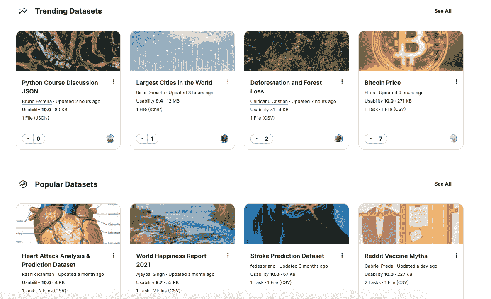

为了介绍的目的，让我们假设你将在项目中使用的数据类型尚未存在——因此你需要创建一个新的。当你点击左侧带有三条线的菜单并点击**数据**时，你将被重定向到数据集页面：

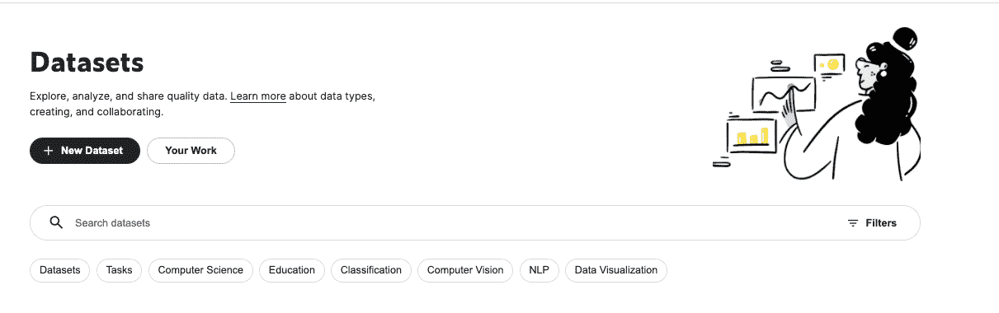

当你点击**新建数据集**时，你将被提示输入基本信息：上传实际数据和给它一个标题：

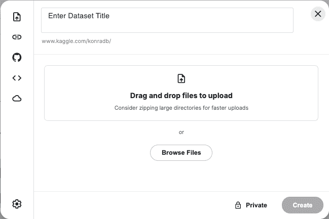

请记住，Kaggle 是一个流行的平台，所以很多人上传他们的数据到那里——包括私有的（不可公开查看）——所以尽量想一个非通用标题。

哇！你的第一个数据集已经准备好了。然后你可以转到**数据**标签：

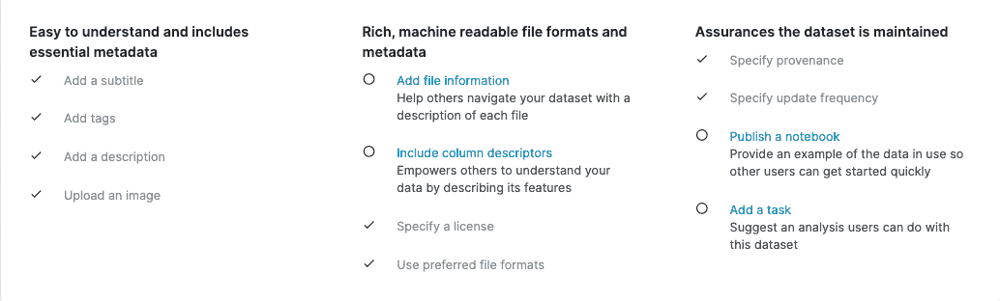

在原则上，你不必填写所有字段——你新创建的数据集在没有它们的情况下也可以完美使用（如果它是私有的，你可能也不在乎——毕竟你知道里面有什么）。然而，社区礼仪会建议填写你公开的信息：你指定得越多，数据对其他人就越有用（并且通过可用性评分来衡量，显示在上右角）。

## 收集数据

除了法律方面（见本章最后部分）之外，在数据集中存储的内容类型实际上没有限制：表格数据、图像、文本——如果你符合大小要求，你可以存储它。这包括从其他来源收集的数据：在撰写本文时，按标签或主题收集的推文是流行的数据集之一：

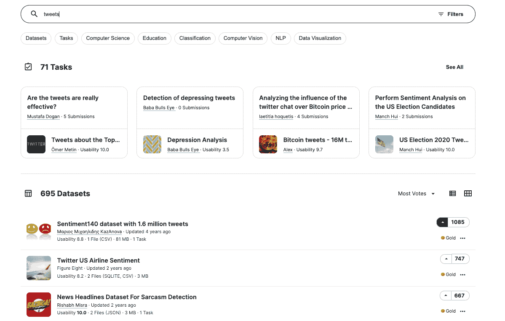

讨论从社交媒体（Twitter、Reddit 等）收集数据的不同框架超出了本书的范围。

## 在 Kaggle 之外使用 Kaggle 数据集

Kaggle 内核免费使用，但并非没有限制（更多内容请见*第四章*）——您可能首先遇到的是 8 小时的时限。一个流行的替代方案是迁移到完全在云端运行的免费 Jupyter 笔记本环境 Google Colab：

[`colab.research.google.com`](https://colab.research.google.com)

但即使我们将计算移动到那里，我们可能仍然希望访问 Kaggle 数据集——因此将它们导入 Colab 是一个相当方便的功能。

我们首先做的事情——既然您正在阅读这篇文章，我们假设您已经在 Kaggle 上注册——是前往账户页面生成 API 令牌：

+   前往“您的账户”并点击**创建新的 API 令牌**

+   将包含您的用户名和令牌的名为 `kaggle.json` 的文件创建

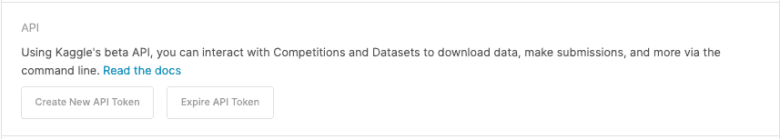

下一步是在您的驱动器中创建一个名为“`Kaggle`”的文件夹并将`.json`文件上传到那里

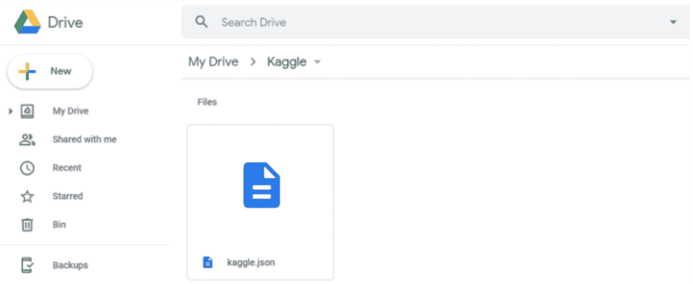

完成后，您需要创建一个新的 Colab 笔记本并将您的驱动器挂载：

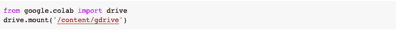

从 URL 提示中获取授权代码并在空框中提供，然后执行以下代码以证明到`.json`配置文件的路径：

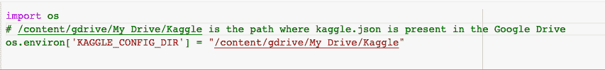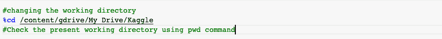

我们现在可以下载数据集：首先前往 Kaggle 并复制 API 命令：

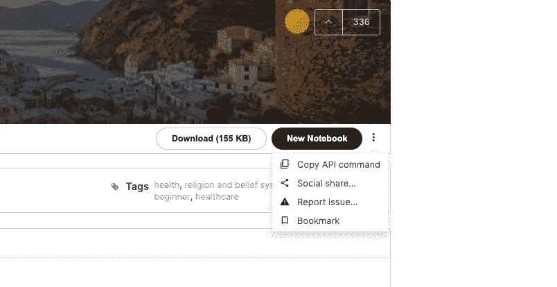

运行代码：

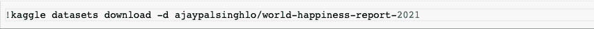

数据集将以`.zip`存档的形式下载——解压后即可使用。

## 围绕数据集构建

一旦创建了数据集，您可能希望将其用于分析。您可以使用数据集作为主要来源启动内核：前往数据集页面顶部菜单中的**活动**标签并滚动到该块：

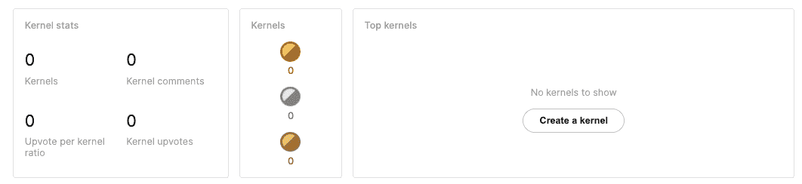

或者，您可以通过点击**创建讨论**来围绕数据开始对话。

## 法律注意事项

仅因为您可以将一些数据上传到 Kaggle，并不意味着您应该这样做——一个很好的例子是“Tinder People”数据集：2017 年，一位开发者使用 Tinder API 爬取网站上的半私密资料，并将数据上传到 Kaggle。问题曝光后，Kaggle 最终撤下了该数据集。您可以在此处阅读完整故事：

[`www.forbes.com/sites/janetwburns/2017/05/02/tinder-profiles-have-been-looted-again-this-time-for-teaching-ai-to-genderize-faces/?sh=1afb86b25454`](https://www.forbes.com/sites/janetwburns/2017/05/02/tinder-profiles-have-been-looted-again-this-time-for-teaching-ai-to-genderize-faces/?sh=1afb86b25454)

通常，在您上传任何内容到 Kaggle 之前，请问自己两个问题：这是否合法（从版权角度来看——始终检查许可证）以及此数据集是否存在任何风险（隐私或其他）。
