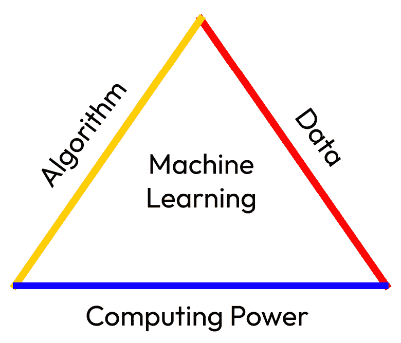
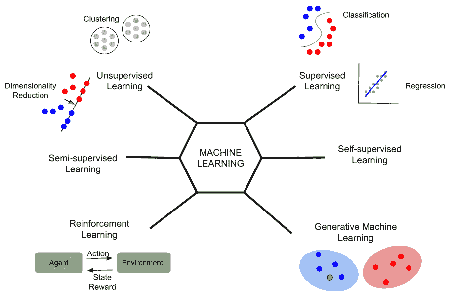
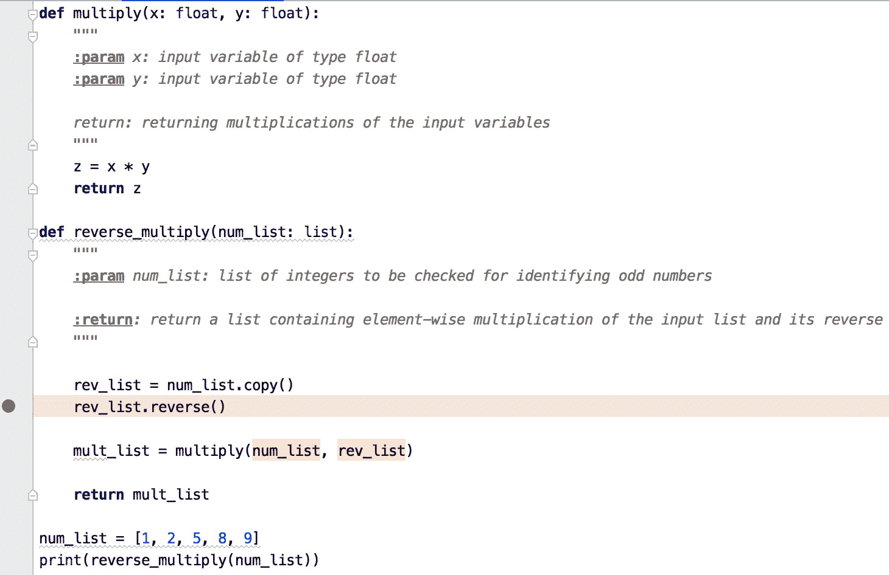
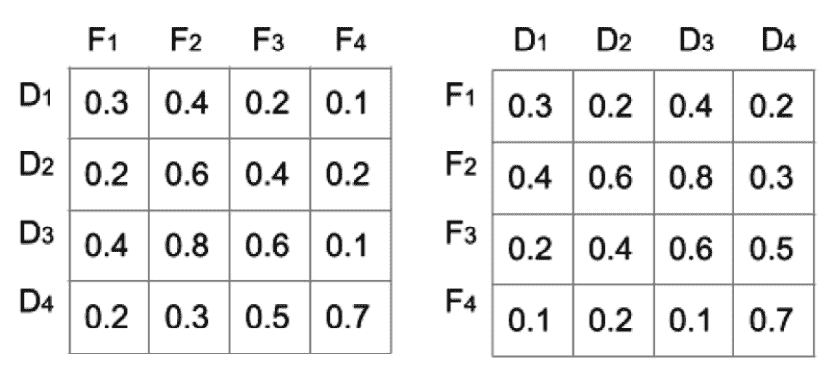
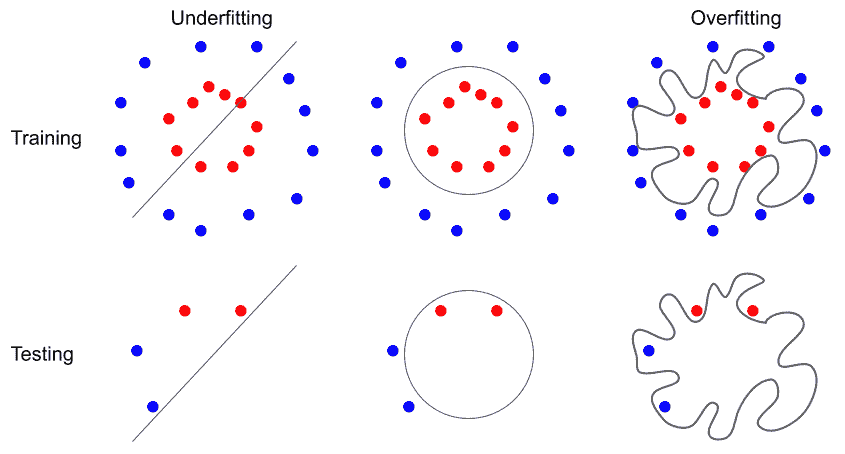

# 1

# 代码调试之外

**人工智能**（**AI**），像人类智能一样，是一种可用于决策和任务完成的特性和工具。作为人类，我们在做出日常决策、思考我们面临的挑战和问题时使用我们的智能。我们使用我们的大脑和神经系统从周围环境中接收信息，并处理它们以进行决策和反应。

机器学习模型是当今用于解决医疗保健和金融等领域问题的 AI 技术。机器学习模型已在制造设施中的机器人系统中用于包装产品或识别可能损坏的产品。它们被用于我们的智能手机中，用于安全目的识别我们的面部，电子商务公司为我们推荐最合适的产品或电影，甚至用于改善医疗保健和药物开发，将新的更有效的药物推向市场以治疗严重疾病。

在本章中，我们将快速回顾不同类型的机器学习建模。您将了解调试机器学习代码的不同技术和挑战。我们还将讨论为什么调试机器学习建模远不止代码调试。

在本章中，我们将涵盖以下主题：

+   机器学习速览

+   机器学习建模的类型

+   软件开发中的调试

+   用于建模的数据缺陷

+   以模型和预测为中心的调试

本章是本书的介绍，旨在为您准备后续将介绍的更高级概念。这将帮助您提高模型，并朝着成为机器学习时代的专家迈进。

# 技术要求

您可以在 GitHub 上找到本章的代码文件，网址为[`github.com/PacktPublishing/Debugging-Machine-Learning-Models-with-Python/tree/main/Chapter01`](https://github.com/PacktPublishing/Debugging-Machine-Learning-Models-with-Python/tree/main/Chapter01)。

# 机器学习速览

构建机器学习模型需要三个基本要素：算法、数据和计算能力（**图 1.1**）。机器学习算法需要用正确的数据喂养，并使用必要的计算能力进行训练。然后，它可以用于预测它所训练的未见数据：



图 1.1 – 机器学习三角形的三个要素

机器学习应用可以大致分为**自动化**和**发现**。在自动化类别中，机器学习模型及其围绕其构建的软件和硬件系统的目标是执行人类可能且通常容易但繁琐、重复、无聊或危险的任务。这方面的例子包括在制造线中识别损坏的产品或在高度安全设施入口处识别员工的面孔。有时，尽管这些任务可能很容易，但无法使用人类来完成。例如，对于手机上的面部识别，如果你的手机被盗，你就无法在那里识别试图登录你手机的人不是你，而你的手机应该能够自动完成这项任务。但是，我们无法为这些任务提出一个通用的数学公式，告诉机器在每个情况下应该做什么。因此，机器学习模型学习如何根据数据中识别出的模式来提出其预测，例如，在识别面部方面。

另一方面，在机器学习建模的发现类别中，我们希望模型能够提供关于未知信息的信息和洞察，这些信息对于人类专家或非专家来说可能不容易或完全未被发现，甚至是不可能提取的。例如，为癌症患者发现新药并不是一个可以通过参加几门课程和阅读几本书就能全面了解其所有方面的任务。在这种情况下，机器学习可以帮助我们提出新的见解，以帮助发现新药。

对于发现和自动化，不同类型的机器学习建模可以帮助我们实现目标。我们将在下一节中探讨这一点。

# 机器学习建模类型

机器学习包含多种建模类型，这些类型可能依赖于输出数据、不同类型的模型输出，以及从预先录制的数据或经验中进行学习。尽管本书中的例子主要关注监督学习，但我们将回顾其他类型的建模，包括无监督学习、自监督学习、半监督学习、**强化学习**（**RL**）和生成式机器学习，以涵盖机器学习建模的六大主要类别（*图 1**.2*）。我们还将讨论机器学习建模的技术，并提供与这些类别不平行但相关的代码示例，例如主动学习、迁移学习、集成学习和深度学习：



图 1.2 – 机器学习建模类型

自监督和半监督学习有时被认为是监督学习的子类别。然而，我们将在这里将它们分开，以便我们可以区分你熟悉的通常的监督学习模型和这两种建模类型。

## 监督学习

监督学习是关于识别每个数据点的输入/特征与输出之间的关系。但输入和输出是什么意思呢？

假设我们想要构建一个机器学习模型来预测一个人是否可能患上乳腺癌。模型的输出可以是 1 表示*患上乳腺癌*，0 表示*未患上乳腺癌*，输入可以是人的特征，如年龄、体重以及他们是否吸烟。甚至可能有使用先进技术测量的输入，例如每个人的遗传信息。在这种情况下，我们想要使用我们的机器学习模型来预测哪位病人在未来会患上癌症。

你也可以设计一个机器学习模型来估算一个城市的房价。在这里，你的模型可以使用房屋的特征，如卧室数量和房屋大小、社区以及学校可访问性，来估算房价。

在这两个例子中，我们都有模型试图在输入特征中识别模式，例如拥有很多卧室但只有一个浴室，并将这些与输出关联起来。根据输出变量的类型，你的模型可以被归类为分类模型，其中输出是分类的，例如*得到*或*未得到癌症*，或者回归模型，其中输出是连续的，例如房价。

## 无监督学习

我们的大部分生活，至少在童年时期，都是通过使用我们的五种感官（视力、听力、味觉、触觉和嗅觉）来收集关于我们周围环境、食物等信息，而无需我们试图找到基于颜色和形状判断香蕉是否成熟的监督学习风格的关系。同样，在无监督学习中，我们不是寻求识别特征（输入）和输出之间的关系。相反，目标是识别数据点之间的关系，如在聚类中，提取新的特征（即嵌入或表示），如果需要，在不使用任何输出数据点的情况下减少数据的维度（即特征的数量）。

## 自监督学习

机器学习建模的第三类被称为自监督学习。在这个类别中，目标是识别输入和输出之间的关系，但与监督学习的不同之处在于输出的来源。例如，如果监督机器学习模型的目的是将英语翻译成法语，那么输入来自英语单词和句子，输出来自法语单词和句子。然而，我们可以在英语句子内部有一个自监督学习模型，试图预测句子中的下一个单词或缺失的单词。例如，假设我们的目标是识别“talking”是填补“Jack is ____ with Julie.”空缺的好候选词。近年来，自监督学习模型被广泛应用于不同领域以识别新特征。这通常被称为表示学习。我们将在*第十四章*，“*机器学习最新进展导论*”中讨论一些自监督学习的例子。

## 半监督学习

半监督学习可以帮助我们利用监督学习的好处，而不必丢弃那些没有输出值的数据点。有时，我们有一些数据点，我们没有输出值，只有它们的特征值可用。在这种情况下，半监督学习帮助我们使用带有或没有输出的数据点。一个简单的做法是将相似的数据点分组，并使用每个组中数据点的已知输出为同一组中其他没有输出值的数据点分配输出。

## 强化学习

在强化学习（RL）中，模型根据其在环境（真实或虚拟）中的经验获得奖励。换句话说，强化学习是关于通过分段示例添加识别关系。在强化学习中，数据不被视为模型的一部分，并且与模型本身独立。我们将在*第十四章*，“*机器学习最新进展导论*”中详细介绍强化学习的某些细节。

## 生成式机器学习

生成式机器学习建模帮助我们开发出能够生成图像、文本或任何接近训练过程中提供的数据概率分布的数据点的模型。ChatGPT 是基于生成模型构建的、用于生成对用户提问和回答的逼真且有意义的文本的最著名工具之一（[`openai.com/blog/ChatGPT`](https://openai.com/blog/ChatGPT)）。我们将在*第十四章*，“*机器学习最新进展导论*”中详细介绍生成式建模及其之上的可用工具。

在本节中，我们简要回顾了构建机器学习模型的基本组件和不同类型的建模。但如果你想要开发用于自动化或发现、医疗保健或任何其他应用的机器学习模型，无论数据点的数量是低还是高，无论是在你的笔记本电脑上还是在云端，使用 **中央处理器**（**CPU**）或 **图形处理器**（**GPU**），你需要开发出按预期工作的优质代码。尽管这本书不是一本软件调试的书，但软件调试挑战和技术概述可能有助于你在开发机器学习模型时。

# 软件开发中的调试

如果你想使用 Python 及其库来构建机器学习与深度学习模型，你需要确保你的代码按预期工作。让我们考虑以下相同函数的例子，用于返回两个变量的乘积：

+   正确的代码：

    ```py
    def multiply(x, y):    z = x * y    return z
    ```

+   存在拼写错误的代码：

    ```py
    def multiply(x, y):    z = x * y    retunr z
    ```

+   存在缩进问题的代码：

    ```py
    def multiply(x, y):** for multiplication:

    ```

    def multiply(x, y):    z = x ** y    return z

    ```py

    ```

如你所见，代码中可能有拼写错误和缩进问题，这会阻止代码运行。你也可能因为使用了不正确的运算符而遇到问题，例如使用 `**` 而不是 `*` 进行乘法。在这种情况下，你的代码将运行，但预期的结果将与函数本应执行的操作不同，即乘以输入变量。

## Python 中的错误信息

有时，我们的代码中存在一些问题，导致代码无法继续运行。这些问题可能导致 Python 中出现不同的错误信息。以下是一些你运行 Python 代码时可能遇到的错误信息的例子：

+   `SyntaxError`: 当你在代码中使用的语法不是正确的 Python 语法时，你会得到此类错误。这可能是由于一个错误，例如之前显示的 `retunr` 而不是 `return`，或者使用了一个不存在的命令，例如使用 `giveme` 而不是 `return`。

+   `TypeError`: 当你的代码尝试在 Python 中对一个对象或变量执行无法进行的操作时，会引发此类错误。例如，如果你的代码尝试将两个数字相乘，而变量是以字符串格式而不是浮点数或整数格式存在。

+   `AttributeError`: 当一个属性被用于一个未定义其属性的物体时，会引发此类错误。例如，`isnull` 对于列表未定义。因此，`my_list.isnull()` 会引发 `AttributeError`。

+   `NameError`: 当你尝试调用未在代码中定义的函数、类或其他名称和模块时，会引发此类错误。例如，如果你没有在代码中定义 `neural_network` 类，但在代码中调用它为 `neural_network()`，你将收到 `NameError` 信息。

+   `IndentationError`：Python 是一种依赖于正确缩进的编程语言——也就是说，每行代码开头的必要空格——以理解行之间的关系。它还有助于代码的可读性。`IndentationError`是由于代码中使用了错误的缩进类型而产生的。但并非所有错误的缩进都会导致`IndentationError`。例如，以下代码示例在没有错误的情况下运行，但只有第一个示例达到了统计列表中奇数个数的目标。底部函数返回输入列表的长度。因此，如果你运行代码的上半部分，你会得到 3 作为输出，这是输入列表中奇数的总数，而代码的下半部分返回 5，这是列表的长度。这些类型的错误不会阻止代码运行，但会产生不正确的输出，被称为*逻辑错误*。

下面是一些示例代码，其中错误的缩进导致错误的结果，但没有错误信息：

```py
def odd_counter(num_list: list):    """
    :param num_list: list of integers to be checked for identifying  	    odd numbers
    :return: return an integer as the number of odd numbers in the  	    input list
    """
    odd_count = 0
    for num in num_list:
        if (num % 2) == 0:
            print("{} is even".format(num))
        else:
            print("{} is even".format(num))
            odd_count += 1
    return odd_count
num_list = [1, 2, 5, 8, 9]
print(f'Total number of odd numbers in the list:
    {odd_counter(num_list)}')
```

以下代码可以运行，但会产生意外的结果：

```py
def odd_counter(num_list: list):    """
    :param num_list: list of integers to be checked for identifying 	    odd numbers
    :return: return an integer as the number of odd numbers in the  	    input list
    """
    odd_count = 0
    for num in num_list:
        if (num % 2) == 0:
            print("{} is even".format(num))
        else:
            print("{} is even".format(num))
        odd_count += 1
    return odd_count
num_list = [1, 2, 5, 8, 9]
print(f'Total number of odd numbers in the list:
    {odd_counter(num_list)}')
```

有些错误根据其名称就能清楚地了解其含义，例如，当你的代码尝试执行除以零的操作时，会引发`ZeroDivisionError`；如果代码尝试根据一个大于列表长度的索引获取值，则会引发`IndexError`；当你尝试导入一个找不到的函数或类时，会引发`ImportError`。

在之前的代码示例中，我们使用了`docstring`来指定输入参数的类型（即列表）和预期的输出。拥有这些信息有助于你和新用户更好地理解代码，并快速解决与之相关的问题。

这些是在你的软件和管道中可能发生的一些简单问题示例。在机器学习建模中，你需要进行调试来处理数百或数千行代码以及数十或数百个函数和类。然而，与这些示例相比，调试可能更具挑战性。例如，当你加入一个新的行业或学术团队，需要开始处理你未曾编写过的代码时，调试可能会更加困难。你需要使用技术和工具来帮助你以最少的努力和时间调试代码。尽管这本书不是为代码调试而设计的，但回顾一些调试技术可能有助于你开发出按计划运行的优质代码。

## 调试技术

有一些技术可以帮助你在调试代码或软件的过程中。你可能已经使用过其中的一种或多种技术，即使你忘记了或不知道它们的名称。在这里，我们将回顾其中的四种。

### Traceback

当您在 Python 中收到错误消息时，它通常会提供您查找问题的必要信息。这些信息创建了一个类似报告的消息，关于错误发生的代码行，以及导致这些错误的错误类型和函数或类调用。这种类似报告的消息在 Python 中称为**回溯**。

考虑以下代码，其中`reverse_multiply`函数本应返回一个列表，该列表包含输入列表及其反转的逐元素乘积。在这里，`reverse_multiply`使用`multiply`命令来乘以两个列表。由于`multiply`是为乘以两个浮点数而设计的，而不是两个列表，因此代码返回了包含必要信息的回溯消息，从底部操作开始。它指定在`multiply`的第 8 行发生了`TypeError`，这是底部操作，然后让我们知道这个问题导致在`reverse_multiply`的第 21 行发生错误，并最终在代码模块的第 27 行。PyCharm IDE 和 Jupyter 都返回了这些信息。以下代码示例展示了如何使用回溯来查找必要信息，以便您可以在 PyCharm 和 Jupyter Notebook 中调试一小段简单的 Python 代码：

```py
def multiply(x: float, y: float):    """
    :param x: input variable of type float
    :param y: input variable of type float
    return: returning multiplications of the input variables
    """
    z = x * y
    return z
def reverse_multiply(num_list: list):
    """
    :param num_list: list of integers to be checked for identifying 	    odd numbers
    :return: return a list containing element-wise multiplication of  	    the input list and its reverse
    """
    rev_list = num_list.copy()
    rev_list.reverse()
    mult_list = multiply(num_list, rev_list)
    return mult_list
num_list = [1, 2, 5, 8, 9]
print(reverse_multiply(num_list))
```

以下行显示了在 Jupyter Notebook 中运行先前代码时的**回溯**错误消息：

```py
TypeError                 Traceback (most recent call last)<ipython-input-1-4ceb9b77c7b5> in <module>()
      25
      26 num_list = [1, 2, 5, 8, 9]
---> 27 print(reverse_multiply(num_list))
<ipython-input-1-4ceb9b77c7b5> in reverse_multiply(num_list)
      19   rev_list.reverse()
      20
---> 21   mult_list = multiply(num_list, rev_list)
      22
      23   return mult_list
<ipython-input-1-4ceb9b77c7b5> in multiply(x, y)
        6   return: returning multiplications of the input variables
        7   """
----> 8   z = x * y
        9   return z
      10
TypeError: can't multiply sequence by non-int of type 'list'
Traceback error message in Pycharm
Traceback (most recent call last):
  File "<input>", line 27, in <module>
  File "<input>", line 21, in reverse_multiply
  File "<input>", line 8, in multiply
TypeError: can't multiply sequence by non-int of type 'list'
```

Python 的回溯消息似乎对调试我们的代码非常有用。然而，对于包含许多函数和类的庞大代码库，它们并不足够。您需要使用辅助技术来帮助您在调试过程中。

### 归纳与演绎

当您在代码中找到错误时，您可以从收集尽可能多的信息开始，并尝试使用这些信息查找潜在的问题，或者您可以跳入检查您的怀疑。这两种方法在代码调试方面区分了归纳和演绎过程：

+   **归纳**：在归纳过程中，您开始收集有关代码中问题的信息和数据，这有助于您列出由错误引起的潜在问题列表。然后，您可以缩小列表，并在必要时从过程中收集更多信息和数据，直到修复错误。

+   **演绎**：在演绎过程中，您会列出有关代码中问题的怀疑点，并尝试找出它们中是否有任何一个是问题的实际来源。您继续这个过程，收集更多信息，并提出新的潜在问题来源。您继续这个过程，直到解决问题。

在这两种方法中，你都会经历一个迭代过程，即提出潜在的问题来源，建立假设，然后收集必要的信息，直到你修复代码中的错误。如果一段代码或软件对你来说是新的，这个过程可能会花费一些时间。在这种情况下，尝试从对代码有更多经验的队友那里寻求帮助，收集更多数据并提出更相关的假设。

### 错误聚类

正如帕累托原则所述，该原则以著名的意大利社会学家和经济学家维弗雷多·帕累托命名，80%的结果源于 20%的原因。具体的数字在这里并不重要。这个原则帮助我们更好地理解，我们代码中的大多数问题和错误都是由少数模块引起的。通过分组错误，我们可以一石多鸟，因为解决一组错误中的问题可能会潜在地解决同一组中的大多数其他问题。

### 问题简化

这里的想法是简化代码，以便你可以识别错误的来源并修复它。你可以用更小甚至合成的数据对象替换大数据对象，或者限制在大模块中的函数调用。这个过程可以帮助你快速排除识别代码中问题原因的选项，甚至在你代码中用作函数或类输入的数据格式中。特别是在机器学习环境中，你可能需要处理复杂的数据处理、大数据文件或数据流，这种调试过程中的简化过程可能非常有用。

## 调试器

你可能会使用每个 IDE，例如 PyCharm，或者如果你使用 Jupyter Notebook 用 Python 来实验你的想法，它们都有内置的调试功能。还有免费或付费的工具可以帮助你简化调试过程。例如，在 PyCharm 和大多数其他 IDE 中，你可以在运行一大段代码时使用断点作为暂停点，以便你可以跟踪代码中的操作（*图 1.3*）并最终找到问题的原因：



图 1.3 – 在 PyCharm 中使用断点进行代码调试

不同 IDE 中的断点功能并不相同。例如，你可以使用 PyCharm 的条件断点来加速你的调试过程，这有助于你避免在循环中执行代码行或手动重复函数调用。了解更多关于你使用的 IDE 的调试功能，并将它们视为你工具箱中另一个更好的、更简单的 Python 编程和机器学习建模工具。

我们在这里简要解释的调试技术和工具，或者你已经知道的那些，可以帮助你开发出能够运行并提供预期结果的代码。你也可以遵循一些高质量 Python 编程和构建你的机器学习模型的最佳实践。

## 高质量 Python 编程的最佳实践

预防胜于治疗。你可以遵循一些实践来预防或减少代码中发生错误的机会。在本节中，我们将讨论其中三种实践：**增量编程**、**日志记录**和**防御性编程**。让我们逐一详细探讨。

### 增量编程

在实践中，无论是学术界还是工业界，机器学习建模都不仅仅是写几行代码来训练一个简单的模型，比如使用`scikit-learn`中已存在的数据集训练逻辑回归模型。它需要许多模块来处理数据、训练和测试模型以及后处理推断或预测以评估模型的可靠性。为每个小组件编写代码，然后使用 PyTest 等工具进行测试和编写测试代码，可以帮助你避免你编写的每个函数或类的问题。它还帮助你确保作为另一个模块输入的模块的输出是兼容的。这个过程被称为**增量编程**。当你编写软件或管道时，尽量分步骤编写和测试。

### 日志记录

每辆车都有一系列仪表盘灯，当车辆出现问题时，这些灯会亮起。这些问题如果不采取行动，可能会停止车辆运行或造成严重损坏，例如燃油低或发动机油更换灯。现在，想象一下如果没有灯光或警告，你驾驶的汽车突然停止或发出可怕的声音，而你不知道该怎么办。当你用 Python 开发函数和类时，你可以从`basicConfig()`中受益，它为日志系统进行基本配置：

```py
import loggingdef multiply(x: float, y: float):
    """
    :param x: input variable of type float
    :param y: input variable of type float
    return: returning multiplications of
    the input variables
    """
    if not isinstance(x, (int, float)) or not isinstance(y,
    (int, float)):
        logging.error('Input variables are not of type float or integer!')
    z = x * y
    return z
def reverse_multiply(num_list: list):
    """
    :param num_list: list of integers to be checked
    for identifying odd numbers
    :return: return a list containing element-wise multiplication
    of the input list and its reverse
    """
    logging.info("Length of {num_list} is {
    list_len}".format(num_list=num_list,
        list_len = len(num_list)))
    rev_list = num_list.copy()
    rev_list.reverse()
    mult_list = [multiply(num_list[iter], rev_list[iter])
    for iter in range(0, len(num_list))]
    return mult_list
num_list = [1, 'no', 5, 8, 9]
print(reverse_multiply(num_list))
```

当你运行前面的代码时，你会得到以下信息和输出：

```py
ERROR:root:Input variables are not of type float or integer!ERROR:root:Input variables are not of type float or integer!
[9, 'nononononononono', 25, 'nononononononono', 9]
```

记录的错误信息是尝试将字符串`'no'`与另一个数字相乘的结果。

### 防御性编程

防御性编程是关于为可能由你、你的队友和你的合作伙伴犯下的错误做好准备。有一些工具、技术和 Python 类可以用来防御代码中的这些错误，例如`AssertionError: Variable should be of type float`：

```py
assert isinstance(num, float), 'Variable should be of type float'
```

## 版本控制

我们在这里讨论的工具和实践只是如何提高你的编程质量以及减少消除代码中问题和错误所需时间的例子。在提高你的机器学习建模能力方面，另一个重要的工具是**版本控制**。我们将在*第十章*“版本控制和可重复的机器学习建模”中讨论数据和模型版本控制，但让我们简要地谈谈代码版本控制。

版本控制系统允许你管理代码库中代码和文件的变化，并帮助你跟踪这些变化，访问变化的历史记录，并在开发机器学习管道的不同组件时进行协作。你可以使用如**Git**及其关联的托管服务**GitHub**、**GitLab**和**BitBucket**等版本控制系统来管理你的项目。这些工具让你和你的团队成员以及合作者可以在不同的代码分支上工作，而不会相互干扰。它还允许你轻松地回到变化的历史记录中，并找出代码中的变化发生在何时。

如果你还没有使用版本控制系统，不要把它们当作一个你需要开始学习的新复杂工具或编程语言。在使用 Git 时，你需要首先了解一些核心概念和术语，例如`commit`、`push`、`pull`和`merge`。如果你不想或不知道如何使用**命令行界面**（**CLI**），使用这些功能可能就像在 PyCharm 这样的 IDE 中点击几下那么简单。

我们回顾了一些常用的技术和工具，以帮助你调试代码和高质量的 Python 编程。然而，还有一些更高级的工具建立在模型之上，如 GPT，例如 ChatGPT（[`openai.com/blog/ChatGPT`](https://openai.com/blog/ChatGPT)）和 GitHub Copilot（[`github.com/features/copilot`](https://github.com/features/copilot)），你可以使用这些工具来更快地开发代码，提高代码和代码调试工作的质量。我们将在*第十四章*“*机器学习最新进展的介绍”中讨论一些这些工具。

虽然使用前面的调试技术或最佳实践来避免 Python 代码中的问题可以帮助你拥有低 bug 的代码库，但它并不能防止所有与机器学习模型相关的问题。这本书是关于超越 Python 编程进行机器学习，帮助你识别机器学习模型中的问题并开发高质量模型。

## 超越 Python 的调试

消除代码问题并不能解决机器学习模型或数据准备和建模管道中可能存在的所有问题。可能存在一些不会产生任何错误消息的问题，例如来自用于建模的数据的问题，以及测试数据和生产数据（即模型最终需要使用的数据）之间的差异。

生产环境与开发环境

**开发环境**是我们开发模型的地方，比如我们用于开发的计算机或云环境。在这里，我们编写代码、调试代码、处理数据、训练模型并验证它们。但我们在这个阶段所做的工作不会直接影响用户。

**生产环境**是模型准备供最终用户使用或可能影响他们的地方。例如，一个模型可以在亚马逊平台上用于推荐产品，被发送到银行系统的其他团队进行欺诈检测，甚至被用于医院以帮助临床医生更好地诊断患者的病情。

# 用于建模的数据缺陷

数据是机器学习建模的核心组件（*图 1.1*）。通过获取训练和测试机器学习模型所需的数据，使得机器学习在不同行业如医疗保健、金融、汽车、零售和营销等领域的应用成为可能。当数据被输入到机器学习模型中进行训练（即识别最佳模型参数）和测试时，数据中的缺陷可能导致模型出现问题，例如训练性能低（例如，高偏差）、低泛化能力（例如高方差）或社会经济偏差。在这里，我们将讨论在设计机器学习模型时需要考虑的数据缺陷和属性示例。

## 数据格式和结构

数据在你的代码或管道中的存储、读取和移动方式可能存在问题。你可能需要处理结构化或表格数据，或者非结构化数据，如视频和文本文档。这些数据可以存储在关系型数据库中，如**MySQL**或**NoSQL**（即非关系型）数据库、数据仓库和数据湖中，甚至可以以不同的文件格式存储在本地，如**CSV**。无论如何，预期的和现有的文件数据结构和格式需要匹配。例如，如果你的代码期望一个制表符分隔的文件格式，但相应的函数的输入文件却是逗号分隔的，那么所有列可能会被合并在一起。幸运的是，大多数情况下，这类问题会导致代码中的错误。

提供的数据和预期数据之间可能存在不匹配，如果代码没有针对这些不匹配进行防御并且没有足够的信息记录，则不会引起任何错误。例如，想象一个 scikit-learn 的`fit`函数期望有 100 个特征的训练数据，同时你有 100 个数据点。在这种情况下，如果你的代码将特征放在输入 DataFrame 的行或列中，代码将不会返回任何错误。然后，你的代码需要检查输入 DataFrame 的每一行是否包含所有数据点的单个特征值或单个数据点的特征值。以下图示展示了如何通过交换特征和数据点，例如通过转置 DataFrame 来交换行和列，可能会提供错误的输入文件但不会产生错误。在这个图中，我们为了简化考虑了四列和四行。在这里，F 和 D 分别用作特征和数据点的缩写：



图 1.4 – 简化示例，展示如何在期望四个特征的 scikit-learn fit 函数中错误地使用 DataFrame 的转置

数据缺陷不仅限于结构和格式问题。当你试图构建和改进机器学习模型时，需要考虑一些数据特征。

## 数据数量和质量

尽管机器学习是一个超过半个世纪的概念，但围绕机器学习的兴奋情绪始于 2012 年。尽管在 2010 年至 2015 年之间图像分类算法有所进步，但 1.2 百万张高分辨率图像在 ImageNet LSVRC-2010 竞赛中的可用性以及必要的计算能力在开发第一个高性能图像分类模型（如 AlexNet（Krizhevsky 等人，2012）和 VGG（Simonyan 和 Zisserman，2014））中发挥了关键作用。

除了数据量，数据的质量也起着非常重要的作用。在某些应用中，例如临床癌症设置，高质量的大量数据是不可获取的。从数量和质量中受益也可能成为一种权衡，因为我们可能能够获取更多数据，但质量较低。我们可以选择坚持高质量数据或低质量数据，或者如果可能的话，尝试从高质量和低质量数据中受益。选择正确的方法是特定于领域的，并取决于用于建模的数据和算法。

## 数据偏见

机器学习模型可能具有不同的偏见，这取决于我们提供给它们的资料。**纠正性罪犯管理配置文件用于替代制裁**（**COMPAS**）是机器学习模型中具有报告偏见的著名例子。COMPAS 旨在根据被告对超过 100 个调查问题的回答来估计其再犯的可能性。对问题的回答的总结产生一个风险评分，其中包括是否有一位囚犯的父母曾入狱等问题。尽管这个工具在许多例子中都取得了成功，但当它在预测方面出错时，白人和黑人罪犯的结果并不相同。COMPAS 的开发公司提供了支持其算法发现的数据。你可以找到文章和博客文章了解更多关于其当前状态以及它是否仍在使用或是否仍有偏见的信息。

这些是数据问题和它们在结果机器学习模型中的后果的一些例子。但模型中还有其他问题并非源于数据。

# 模型和预测中心调试

训练、测试和生产阶段模型的预测可以帮助我们检测模型的问题并找到改进它们的机会。在这里，我们将简要回顾一些以模型和预测为中心的模型调试方面。你可以在本书的未来章节中了解更多关于这些问题和其他考虑因素，如何识别问题的根源，以及如何在未来的章节中解决它们。

## 欠拟合和过拟合

当我们训练一个模型，例如监督学习模型时，目标是不仅在训练阶段，而且在测试阶段都拥有高性能。当一个模型即使在训练集上表现不佳时，我们需要处理**欠拟合**的问题。我们可以开发更复杂的模型，例如随机森林或深度学习模型，而不是线性回归和逻辑回归模型。更复杂的模型可能会降低欠拟合，但它们可能会引起**过拟合**，导致预测对测试或生产数据的泛化能力降低（*图 1.5*）：



图 1.5 – 欠拟合和过拟合的示意图

算法和超参数的选择决定了在训练和测试机器学习模型时的复杂程度以及欠拟合或过拟合的可能性。例如，通过选择可以学习非线性模式的模型而不是线性模型，你的模型在训练数据中能够识别更复杂的模式，因此有更高的可能性降低欠拟合。但与此同时，你可能会增加过拟合的可能性，因为训练数据中的一些复杂模式可能无法推广到测试数据（*图 1.5*）。有一些方法可以评估欠拟合和过拟合，这有助于你开发高性能且可泛化的模型。我们将在未来的章节中讨论这些问题。

模型超参数

一些参数可能会影响机器学习模型的性能，这些参数在训练过程中通常不会自动优化。这些被称为超参数。我们将在未来的章节中通过一些这样的超参数的例子进行说明，例如随机森林模型中的树的数量或神经网络模型中隐藏层的大小。

## 模型测试和生产中的推理

机器学习建模的最终目标是拥有在生产环境中高度有效的模型。当我们测试模型时，我们正在评估其泛化能力，但我们不能确定它在未见过的数据上的表现。用于训练机器学习模型的数据可能会过时。例如，服装市场趋势的变化可能会使服装推荐模型的预测不可靠。

在这个主题中存在不同的概念，如数据方差、数据漂移和模型漂移，我们将在接下来的几章中涵盖这些内容。

## 用于改变景观的数据或超参数

当我们使用特定的训练数据和一组超参数训练机器学习模型时，模型参数的值会发生变化，以便它们尽可能地接近定义的目标或损失函数的最优点。实现更好模型的另外两个工具是提供更好的训练数据和选择更好的超参数。每个算法都有提高性能的潜力。仅通过调整模型超参数，你无法开发出最佳模型。同样，仅通过增加数据和保持模型超参数不变，你也无法实现最佳性能。因此，数据和超参数是相辅相成的。在你阅读下一章之前，请记住，仅通过在超参数优化上投入更多的时间和金钱，你并不一定能得到更好的模型。我们将在本书的后面更详细地探讨这一点。

# 摘要

在本章中，我们回顾了软件开发中调试的重要概念和方法，以及它们与机器学习模型调试的区别。你了解到，在机器学习建模中的调试超出了软件调试的范畴，以及数据和算法，除了代码之外，也可能导致模型存在缺陷或性能低下，以及预测不可靠。你可以从这些理解以及本书中将要学习的工具和技术中受益，以开发可靠的机器学习模型。

在下一章中，你将了解机器学习生命周期的不同组成部分。你还将学习如何通过这些组件模块化机器学习建模，这有助于我们在训练和测试前后识别改进模型的机会。

# 问题

1.  你的代码是否有意外的缩进，但不会返回任何错误信息？

1.  在 Python 中，`AttributeError`和`NameError`之间的区别是什么？

1.  数据维度如何影响模型性能？

1.  Python 中的*traceback*消息提供了关于你代码中错误的信息是什么？

1.  你能解释两个高质量的 Python 编程的最佳实践吗？

1.  你能解释为什么你可能有不同置信水平的特征或数据点吗？

1.  你能提供有关如何减少在为给定数据集构建模型时欠拟合或过拟合的建议吗？

1.  我们是否可能有一个在生产环境中性能显著低于测试环境的模型？

1.  当我们也可以提高训练数据的质量或数量时，专注于超参数优化是否是一个好主意？

# 参考文献

+   Widyasari, Ratnadira, 等人. *BugsInPy: 一个用于 Python 程序现有错误的数据库，以实现受控的测试和调试研究.* 第 28 届 ACM 欧洲软件工程会议和软件工程基础研讨会论文集。2020。

+   *《软件测试的艺术，第二版》，作者：Glenford J. Myers, Corey Sandler, Tom Badgett, Todd M. Thomas*.

+   Krizhevsky, Alex, Ilya Sutskever, 和 Geoffrey E. Hinton. *使用深度卷积神经网络的 ImageNet 分类*. 神经信息处理系统进展 25 (2012).

+   Simonyan, Karen, 和 Andrew Zisserman. “用于大规模图像识别的超深层卷积神经网络.” arXiv 预印本 arXiv:1409.1556 (2014). [`arxiv.org/abs/1409.1556`](https://arxiv.org/abs/1409.1556).
