# 检测机器学习模型中的性能和效率问题

我们必须牢记的主要目标之一是，如何在新的数据上构建一个高性能的机器学习模型，这些数据是我们希望使用模型的情况。在本章中，你将学习如何正确评估你的模型性能，并识别减少它们错误的机会。

本章包含许多图表和代码示例，以帮助你更好地理解这些概念，并在你的项目中开始从中受益。

我们将涵盖以下主题：

+   性能和错误评估措施

+   可视化

+   偏差和方差诊断

+   模型验证策略

+   错误分析

+   除此之外

到本章结束时，你将了解如何评估机器学习模型的性能，以及可视化在不同机器学习问题中的好处、局限性和错误使用。你还将了解偏差和方差诊断以及错误分析，以帮助你识别机会，以便你可以改进你的模型。

# 技术要求

在本章中，以下要求应予以考虑，因为它们将帮助你更好地理解概念，在你的项目中使用它们，并使用提供的代码进行实践：

+   Python 库要求：

    +   `sklearn` >= 1.2.2

    +   `numpy` >= 1.22.4

    +   `pandas` >= 1.4.4

    +   `matplotlib` >= 3.5.3

    +   `collections` >= 3.8.16

    +   `xgboost` >= 1.7.5

+   你应该具备模型验证和测试的基本知识，以及机器学习中的分类、回归和聚类

你可以在 GitHub 上找到本章的代码文件，网址为[`github.com/PacktPublishing/Debugging-Machine-Learning-Models-with-Python/tree/main/Chapter04`](https://github.com/PacktPublishing/Debugging-Machine-Learning-Models-with-Python/tree/main/Chapter04)。

# 性能和错误评估措施

我们用来评估模型性能和计算错误的指标，以及我们如何解释它们的值，决定了我们选择的模型，我们做出的改进机器学习生命周期组件的决定，以及我们是否有一个可靠的生产模型。尽管许多性能指标可以用一行 Python 代码来计算错误和性能，但我们不应该盲目使用它们，或者试图通过实现许多指标来提高我们的性能报告，而不了解它们的限制和如何正确解释它们。在本节中，我们将讨论用于评估分类、回归和聚类模型性能的指标。

## 分类

每个分类模型，无论是二分类还是多分类，都会返回预测的概率，一个介于 0 和 1 之间的数字，然后将其转换为类别标签。性能指标主要有两大类：**基于标签的性能指标**，它依赖于预测标签，以及**基于概率的性能指标**，它使用预测的概率进行性能或错误计算。

### 基于标签的性能指标

分类模型的预测概率通过我们用于建模的 Python 类转换为类别标签。然后，我们可以使用如图 *图 4.1* 所示的混淆矩阵来识别四组数据点，包括**真正例**（**TPs**）、**假正例**（**FPs**）、**假反例**（**FNs**）和**真反例**（**TNs**）对于二分类问题：

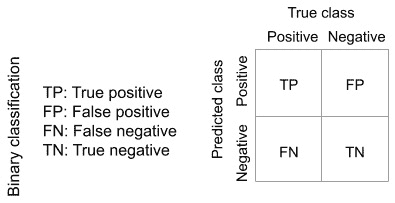

图 4.1 – 二分类的混淆矩阵

我们可以使用 `sklearn.metrics.confusion_matrix()` 提取这四组数据点，然后根据以下数学定义计算性能指标，如特异性：

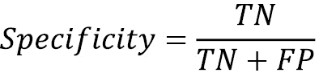

下面是使用混淆矩阵提取特异性、精确率和召回率的 Python 实现：

```py
from sklearn.metrics import confusion_matrix as cmdef performance_from_cm(y_true, y_pred):
    # Calculating values of confusion matrix
    cm_values = cm(y_true, y_pred)
    # Extracting tn, fp, fn, and tp from calculated confusion matrix
    tn, fp, fn, tp = cm_values.ravel()
    # Calculating specificity
    specificity = tn/(tn+fp)
    # Calculating precision
    precision = tp/(tp+fp)
    # Calculating recall
    recall = tp/(tp+fn)
    return specificity, precision, recall
```

我们可以使用从混淆矩阵中提取的 TP、TN、FP 和 FN 计算其他性能指标，如精确率和召回率，或者直接使用 Python 中可用的函数（*表 4.1*）。除了用于计算分类模型的一些常见性能指标的 Python 函数外，您还可以在 *表 4.1* 中找到指标的数学定义及其解释。这些额外信息将帮助您理解如何解释这些指标以及何时使用它们：

| **指标** | **Python** **函数** | **公式** | **描述** |
| --- | --- | --- | --- |
| 准确率 | `metrics.accuracy_score()` |  TP + TN _ n n: 数据点数量 | 在总数据点中正确预测的数量范围：[0, 1]值越高表示性能越好 |
| **精确率或阳性预测值**（**PPV**） | `metrics.precision_score()` |  TP _ TP + FP  | 预测为阳性的预测中实际为阳性的比例范围：[0, 1]值越高表示性能越好 |
| 召回率、灵敏度或**真正例率**（**TPR**） | `metrics.recall_score()` |  TP _ TP + FN  | 被预测为阳性的正例的比例范围：[0, 1]值越高表示性能越好 |
| F1 分数及其衍生指标 | `metrics.f1_score()` |  精确率 * 召回率  ____________ 精确率 + 召回率 _ 2   | 精确率和召回率的调和平均值范围：[0, 1]值越高表示性能越好 |
| 平衡准确率 | `metrics.balanced_accuracy_score()` |  召回率 + 特异性  _____________ 2  | 真正预测的正负比例的平均值范围：[0, 1]值越高表示性能越好 |
| **马修斯相关系数** **系数**（**MCC**） | `sklearn.metrics.matthews_corrcoef()` |  TP * TN − FP * FN  ______________________________   √ __________________________________    (TP + FP)(FP + TN)(TN + FN)(FN + TP)   | 分子旨在最大化混淆矩阵的对角线元素并最小化非对角线元素范围：[ − 1, 1]值越高表示性能越好 |

表 4.1 – 评估分类模型性能的常用指标

选择性能指标用于模型选择和报告的一个方面是它们与目标问题的相关性。例如，如果你正在构建一个用于癌症检测的模型，你可以通过最大化识别所有正类成员（即癌症患者）来最大化召回率，同时控制精确度。这种策略可以帮助你确保患有癌症的患者不会因致命疾病而未得到诊断，尽管同时拥有高精确度和召回率的模型会更理想。

选择性能指标取决于我们是否关心所有类别的真实预测具有相同的重要性水平，或者是否有一个或多个类别更为重要。有一些算法方法可以强制模型更加关注一个或多个类别。此外，在报告性能和模型选择时，我们需要考虑类别之间的这种不平衡，而不仅仅依赖于总结所有类别预测性能的等权重性能指标。

我们还必须注意，在二元分类的情况下，我们需要定义正类和负类。我们生成或收集的数据通常没有这样的标签。例如，你的数据集可能有“欺诈”与“非欺诈”、“癌症”与“健康”，或者字符串中的数字名称，如“一”、“二”和“三”。因此，如果有我们更关心或更少关心的一个或多个类别，我们需要根据我们对类别的定义来选择性能指标。

选择性能指标的其他方面是它们的可靠性，如果它们有依赖于数据的偏差，我们就会在训练、验证或测试中使用它们。例如，准确率，作为分类模型广泛使用的性能指标之一，不应在不平衡的数据集上使用。准确率定义为正确预测的总数除以数据点的总数（*表 4.1*）。因此，如果一个模型将所有数据点预测为多数类，即使它可能不是一个好的模型，它也会返回一个高值。*图 4.2*显示了不同性能指标，包括准确率，对于一个将所有数据点预测为负数的模型的值。如果数据集中有 80%的数据点是负数，那么这个糟糕模型的准确率是 0.8（*图 4.2*）。然而，平衡准确率或**马修斯相关系数**（**MCC**）等替代性能指标在具有不同正数据点分数的数据集上对这样一个糟糕的模型来说保持不变。数据平衡只是选择分类模型性能指标时考虑的参数之一，尽管它很重要。

一些性能指标具有更好的行为，适用于不平衡数据分类等情境。例如，F1 是一个广泛使用的指标，但在处理不平衡数据分类时并不是最佳选择（*图 4.2*）：

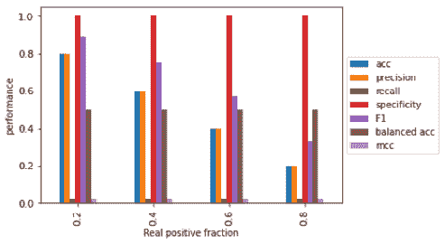

图 4.2 – 对于一个将所有预测返回为负数的模型，在不同真实正分数下的常见分类指标值

然而，它有一个通用的形式 Fβ，其中参数β用作根据其数学定义增加精度的效果的权重。你可以使用`sklearn.metrics.fbeta_score()`函数来计算这个指标，使用数据点的真实标签和预测标签：

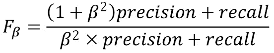

### 基于概率的性能指标

分类模型的概率输出可以直接用来评估模型性能，无需将预测标签进行转换。这种性能度量的一种例子是**逻辑损失**，也称为**对数损失**或**交叉熵损失**，它使用每个数据点的预测概率及其真实标签来计算数据集上的总损失，如下所示。对数损失也是一个用于训练分类模型的损失函数：

L log(y, p) = − (ylog(p) + (1 − y)log(1 − p))

还有其他基于概率的性能评估方法，如**接收者操作特征**（**ROC**）曲线和**精确率召回率**（**PR**）曲线，它们考虑了将概率转换为标签的不同截止点，以预测真正例率、假正例率、精确率和召回率。然后，这些值在不同截止点被用来生成 ROC 和 PR 曲线（**图 4.3**）：

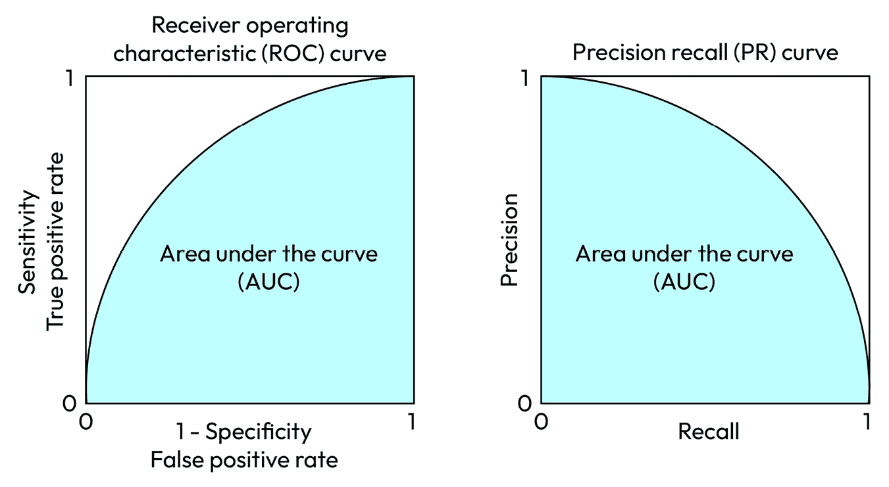

图 4.3 – ROC 和 PR 曲线的示意图

使用这些曲线下的面积，称为 ROC-AUC 和 PR-AUC，来评估分类模型的性能是很常见的。ROC-AUC 和 PR-AUC 的范围从 0 到 1，其中 1 表示完美模型的性能。

在*图 4.2*中，你看到了一些性能指标如何为预测所有数据点为负的坏模型返回高性能值，这是由于数据不平衡。我们可以在*图 4.4*中看到这种分析的扩展，它展示了真正例标签和预测标签中不同正数据点的比例。这里没有训练，数据点是随机生成的，以在*图 4.4*的每个面板中产生指定的正数据点比例。然后，随机生成的概率被转换为标签，以便可以使用不同的性能指标与真正例进行比较。

*图 4.4*和*图 4.5*显示了分类模型性能指标中的不同偏差。例如，随机预测的中位精确率等于真正例数据点的比例，而随机预测的中位召回率等于预测标签中正标签的比例。你还可以检查*图 4.4*和*图 4.5*中其他性能指标在不同真正例或预测正例比例下的行为：

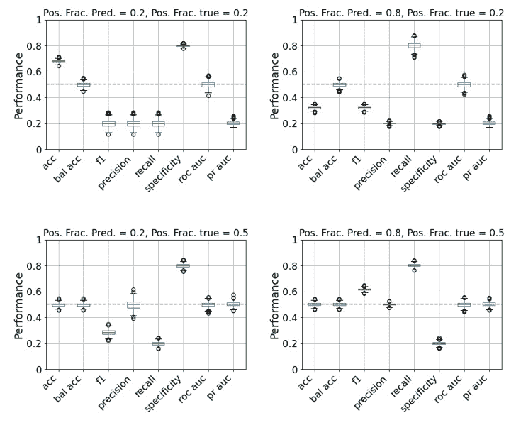

图 4.4 – 1,000 个随机二元预测在 1,000 个数据点上的性能分布（第一部分）

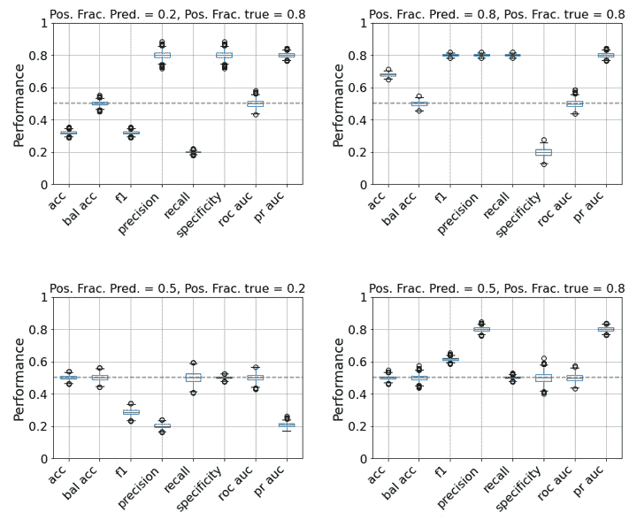

图 4.5 – 1,000 个随机二元预测在 1,000 个数据点上的性能分布（第二部分）

ROC-AUC 和 PR-AUC 的组合，或使用 MCC 或平衡准确率，是降低分类模型性能评估偏差的常见方法。但如果你知道你的目标，例如如果你更关心精确率而不是召回率，那么你可以选择添加决策所需必要信息的性能指标。但避免仅仅为了计数模型中哪些性能指标更好而报告 10 个性能指标。

## 回归

您可以使用评估模型连续预测值与真实值之间差异的度量，例如**均方根误差**（**RMSE**），或者评估预测值与真实值之间一致性的度量，如决定系数 R²（*表 4.2*）。每个回归模型性能评估的度量都有其假设、解释和局限性。例如，R² 不考虑数据维度（即特征、输入或独立变量的数量）。因此，如果您有一个具有多个特征的回归模型，您应该使用调整后的 R² 而不是 R²。通过添加新特征，R² 可能会增加，但并不一定代表更好的模型。然而，当新输入通过偶然机会比预期更好地提高模型性能时，调整后的 R² 会增加。这是一个重要的考虑因素，尤其是如果您想比较具有不同输入数量的样本问题的模型：

| **度量** | **Python 函数** | **公式** | **描述** |
| --- | --- | --- | --- |
| **均方根误差**（**RMSE**）**均方误差**（**MSE**） | `sklearn.metrics.mean_squared_error()` | MSE = 1/n ∑(i=1 to n) (y_i - ˆy_i)², RMSE = √(MSE/n) n: 数据点数量 y_i: 数据点的真实值ˆy_i: 数据点的预测值 | 范围：[0, ∞)，数值越低表示性能越高 |
| **平均绝对误差**（**MAE**） | `sklearn.metrics.mean_absolute_error()` | MAE = 1/n ∑(i=1 to n) | y_i - ˆy_i | | 范围：[0, ∞)，数值越低表示性能越高 |
| 决定系数（R²） | `sklearn.metrics.r2_score()` | R² = 1 - ∑(i=1 to n) (y_i - ˆy_i)² / ∑(i=1 to n) (y_i - y_)² ; y_ = 1/n ∑(i=1 to n) y_i y_: 真实值的平均值 n: 数据点数量 y_i: 数据点的真实值ˆy_i: 数据点的预测值 | 范围：[0, 1]，数值越高表示性能越高，表示独立变量可以解释的因变量的比例 |
| 调整后的 R² | 使用 `sklearn.metrics.r2_score()` 计算原始 R²，然后使用其公式计算调整后的版本。 | Adj R² = 1 - (1 - R²)(n - 1) / (n - m - 1) n: 数据点数量 m: 特征数量 | 调整以适应特征数量，如果 m 接近 n，则可能大于 1 或小于 0。数值越高表示性能越高 |

表 4.2 – 评估回归模型性能的常见度量

相关系数也用于报告回归模型的性能。相关系数使用预测值和真实连续值，或这些值的变换，并报告介于 -1 和 1 之间的值，其中 1 表示理想的预测，即 100% 的一致性，-1 表示完全的不一致性（*表 4.3*）。相关系数也有其自身的假设，不能随机选择用于报告回归模型的性能。例如，Pearson 相关系数是一种参数化测试，假设预测值和真实连续值之间存在线性关系，这并不总是成立。另一方面，Spearman 和 Kendall 排序相关系数是非参数化的，没有变量关系或每个变量的分布背后的假设。Spearman 和 Kendall 排序相关系数都依赖于预测值和真实输出的排名，而不是它们的实际值：

| **相关系数** | **Python 函数** | **公式** | **描述** |
| --- | --- | --- | --- |
| Pearson 相关系数或 Pearson 的 *r* | `scipy.stats.pearsonr()` | r = ∑ i=1 n (ˆy_i − ˆy_) (y_i − y_) __________________ √ ___________________ ∑ i=1 n (ˆy_i − ˆy_)² (y_i − y_)² n: 数据点数量 y_i: 数据点的真实值 iy_: 真实值的平均值 ˆy_i: 数据点的预测值 i ˆy_: 预测值的平均值 | 参数化 寻找预测值和真实值之间的线性关系 范围：[ − 1, 1] |
| Spearman 排序相关系数或 Spearman 相关系数 | `scipy.stats.spearmanr()` | ρ = 1 − 6∑ i=1 n d_i² ___________________ n(n² − 1) n: 数据点数量 d_i: 真实值和预测值中数据点 i 排名的差异 | 非参数化 寻找预测值和真实值之间的单调关系 范围：[ − 1, 1] |
| Kendall 排序相关系数或 Kendall 的 τ 系数 | `scipy.stats.kendalltau()` | τ = C − D ____________________ √ _____________________ (C + D + T)(C + D + c) C: 一致对数（例如，y_i > y_j 且 ˆy_i > ˆy_j；或 y_i < y_j 且 ˆy_i < ˆy_j）D: 不一致对数（例如，y_i > y_j 且 ˆy_i < ˆy_j；或 y_i < y_j 且 ˆy_i > ˆy_j）T: 仅在预测值中存在相同排名的情况 U: 仅在真实值中存在相同排名的情况 | 非参数化 寻找预测值和真实值之间的单调关系 范围：[ − 1, 1] |

表 4.3 – 评估回归模型性能的常用相关系数

## 聚类

聚类是一种无监督学习方法，用于通过数据点的特征值来识别数据点的分组。然而，为了评估聚类模型的性能，我们需要有一个数据集或具有可用真实标签的示例数据点。在监督学习中，我们不使用这些标签来训练聚类模型；相反，我们使用它们来评估相似数据点被分组以及与不相似数据点分离的程度。你可以在*表 4.4*中找到一些用于评估聚类模型性能的常见指标。这些指标不会告诉你聚类的质量。例如，同质性告诉你聚在一起的数据点是否彼此相似，而完整性告诉你数据集中相似的数据点是否被聚在一起。还有一些指标，如 V 度量、调整后的互信息，试图同时评估这两个质量：

| **指标** | **Python 函数** | **公式** | **描述** |
| --- | --- | --- | --- |
| 同质性 | `sklearn.metrics.homogeneity_score()` | 来自 Rosenberg 等人，EMNLP-CoNLL 2007 提供的公式(*1*) | 衡量同一聚类内的数据点之间有多少是彼此相似的范围：[0, 1]值越高表示性能越好 |
| 完整性 | `sklearn.metrics.completeness_score()` | 来自 Rosenberg 等人，EMNLP-CoNLL 2007 提供的公式(*2*) | 衡量聚在一起的数据点之间的相似程度范围：[0, 1]值越高表示性能越好 |
| V 度量或归一化互信息得分 | `sklearn.metrics.v_measure_score()` | v = (1 + β) × h × c / [(β × h + c) h: Homogeneity c: Completeness β: 同质性与完整性所赋予的权重比率] | 同时衡量同质性和完整性范围：[0, 1]值越高表示性能越好 |
| 互信息 | `sklearn.metrics.mutual_info_score()` | MI(U, V) = ∑ i=1 | U | ∑ j=1 | V | | U_i ∩ V_j | _ N log | U_i ∩ V_j | _ | U_i | | V_j | | | 范围：[0, 1]值越高表示性能越好 |
| 调整后的互信息 | `sklearn.metrics.adjusted_mutual_info_score()` | AMI(U, V)= [MI(U, V) − E(MI(U, V))] / [avg(H(U), H(V)) − E(MI(U, V))] | 范围：[0, 1]值越高表示性能越好 |

表 4.4 – 评估聚类模型性能的常见指标

在本节中，我们讨论了用于评估机器学习模型性能的不同性能度量。但还有其他重要的性能评估方面需要考虑，例如数据可视化，我们将在下一节讨论。

# 用于性能评估的可视化

可视化是一个重要的工具，它不仅帮助我们理解建模数据的特点，还能更好地评估我们模型的性能。可视化可以为上述模型性能指标提供补充信息。

## 汇总指标是不够的

有一些汇总统计量，如 ROC-AUC 和 PR-AUC，提供了对应曲线的一个数值总结，用于评估分类模型的性能。尽管这些汇总比许多其他指标（如准确率）更可靠，但它们并不能完全捕捉其对应曲线的特征。例如，具有不同 ROC 曲线的两个不同模型可以具有相同的或非常接近的 ROC-AUC 值（*图 4**.6*）：

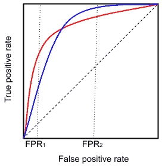

图 4.6 – 比较具有相同 ROC-AUC 值和不同 ROC 曲线的两个任意模型

仅比较 ROC-AUC 值可能会导致判断这些模型的等效性。然而，它们的 ROC 曲线不同，在大多数应用中，红色曲线比蓝色曲线更受欢迎，因为它在低假阳性率（如*FPR*1）的情况下会产生更高的真正阳性率。

## 可视化可能会产生误导

使用适合您结果的正确可视化技术是分析模型结果和报告其性能的关键。没有考虑模型目标就绘制数据可能会导致误导。例如，你可能会看到时间序列图，如*图 4**.7*所示，在许多博客文章中，预测值和真实值随时间叠加。对于此类时间序列模型，我们希望每个时间点的预测值和真实值尽可能接近。尽管*图 4**.7*中的线条似乎彼此一致，但与蓝色显示的真实值相比，橙色显示的预测值存在两个时间单位的延迟。这种预测延迟在许多应用（如股票价格预测）中可能产生严重后果：

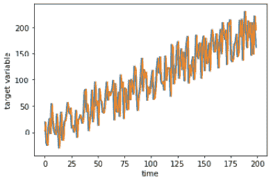

图 4.7 – 将两个时间序列图叠加在一起是误导性的 – 橙色和蓝色曲线代表任意时间序列数据的预测值和真实值

## 不要随意解释你的图表

每个可视化都有其假设和正确的解释方式。例如，如果你想比较二维图中数据点的数值，你需要注意*x*轴和*y*轴的单位。或者当我们使用**t 分布随机邻域嵌入**（**t-SNE**），这是一种旨在帮助在低维空间中可视化高维数据的降维方法时，我们必须提醒自己，数据点之间的大距离和每个组的密度并不代表原始高维空间中的距离和密度（*图 4**.8*）：

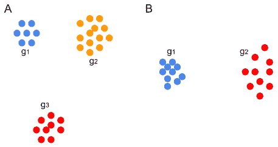

图 4.8 – 示意 t-SNE 折线图显示（A）具有不同距离的三组数据点以及（B）在二维空间中具有不同密度的两组数据点

你可以使用不同的性能指标来评估你的模型是否训练良好并且可以推广到新的数据点，这是本章的下一个主题。

# 偏差和方差诊断

我们的目标是在训练集（即低偏差模型）中实现高性能或低误差，同时保持对新数据点的性能或误差保持在高水平（即低方差模型）。由于我们没有访问未见过的新的数据点，我们必须使用验证集和测试集来评估我们模型的方差或泛化能力。模型复杂性是确定机器学习模型偏差和方差的重要因素之一。通过增加复杂性，我们让模型在训练数据中学习更复杂的模式，这可能会减少训练误差或模型偏差（*图 4**.9*）：

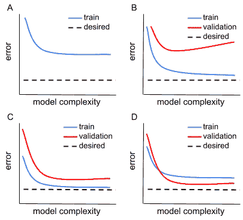

图 4.9 – 对于（A）高偏差、（B）高方差以及（C, D）两种低偏差和低方差模型的情况，误差与模型复杂度的关系

这种误差的降低有助于构建更好的模型，即使是对于新的数据点。然而，这种趋势在某个点之后会发生变化，更高的复杂性可能导致过拟合或验证集和测试集相对于训练集有更高的方差和更低的性能（*图 4**.9*）。评估与模型复杂性或数据集大小等参数相关的偏差和方差可以帮助我们识别在训练、验证和测试集中提高模型性能的机会。

*图 4**.9* 展示了训练和验证集中模型误差与模型复杂度之间可能的四种依赖关系。尽管验证误差通常高于训练误差，但你可能会因为训练和验证集中存在的数据点而经历较低的验证误差。例如，一个多类分类器可能因为更擅长预测验证集中数据点中占多数的类别而具有较低的验证误差。在这种情况下，在报告训练和验证数据集的性能评估并决定选择哪个模型用于生产之前，你需要调查训练和验证集中数据点的分布。

让我们练习一下偏差和方差分析。你可以在 `scikit-learn` 的乳腺癌数据集上找到使用不同最大深度的随机森林模型训练的结果（*图 4.10*）。`scikit-learn` 的乳腺癌数据用于训练和验证模型性能，其中 30% 的数据随机分离作为验证集，其余的保留为训练集。通过增加随机森林模型的最大深度，训练集的对数损失错误减少，而作为模型性能指标的平衡准确率增加。验证错误也减少到最大深度为三，之后开始增加，这是过拟合的迹象。尽管在最大深度为三之后错误减少，但通过将最大深度增加到四和五，平衡准确率仍然可以增加。原因是基于预测概率的对数损失定义与基于预测标签的平衡准确率定义之间的差异：

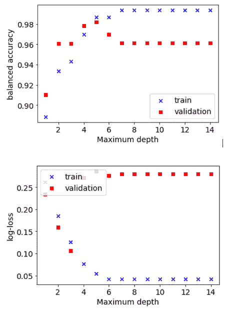

图 4.10 – 从 scikit-learn 的乳腺癌数据集中分离的训练集和验证集的平衡准确率（顶部）和对数损失（底部）

这是 *图 4.10* 中显示结果的代码。首先，我们必须导入必要的 Python 库并加载乳腺癌数据集：

```py
from sklearn.datasets import load_breast_cancerfrom sklearn.model_selection import train_test_split
from sklearn.metrics import balanced_accuracy_score as bacc
from sklearn.ensemble import RandomForestClassifier as RF
from sklearn.metrics import log_loss
from sklearn.metrics import roc_auc_score
import matplotlib.pyplot as plt
X, y = load_breast_cancer(return_X_y=True)
```

然后，我们必须将数据分成训练集和测试集，并使用不同最大深度的随机森林模型进行训练：

```py
X_train, X_test, y_train, y_test = train_test_split(X, y,    test_size = 0.3, random_state=10)
maximum_depth = 15
depth_range = range(1, maximum_depth)
bacc_train = []
bacc_test = []
log_loss_train = []
log_loss_test = []
for depth_iter in depth_range:
# initializing an fitting a decision tree model
model_fit = RF(n_estimators = 5, max_depth = depth_iter,
    random_state=10).fit(X_train, y_train)
# generating label outputs of train and test set using the trained model
train_y_labels = model_fit.predict(X_train)
test_y_labels = model_fit.predict(X_test)
# generating probability outputs of train and test set using the trained model
train_y_probs = model_fit.predict_proba(X_train)
test_y_probs = model_fit.predict_proba(X_test)
# calculating balanced accuracy
bacc_train.append(bacc(y_train, train_y_labels))
bacc_test.append(bacc(y_test, test_y_labels))
# calculating log-loss
log_loss_train.append(log_loss(y_train, train_y_probs))
log_loss_test.append(log_loss(y_test, test_y_probs))
```

现在你已经了解了偏差和方差的概念，我们将介绍不同的技术，你可以使用这些技术来验证你的模型。

# 模型验证策略

为了验证我们的模型，我们可以使用单独的数据集，或者使用不同的技术将我们拥有的数据集分成训练集和验证集，如 *表 4.5* 中所述，并在 *图 4.11* 中展示。在交叉验证策略中，我们将数据分成不同的子集，然后计算每个子集的性能分数或错误，因为验证集是使用其余数据训练的模型的预测来计算的。然后，我们可以使用子集间的性能平均值作为交叉验证性能：

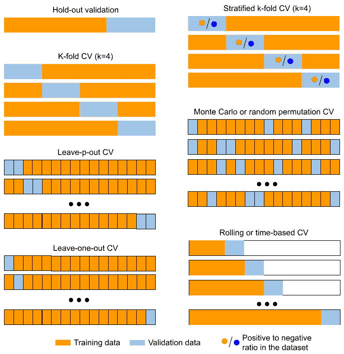

图 4.11 – 在一个数据集中分离验证集和训练集的技术

这些验证技术各有其优点和局限性。使用交叉验证技术而不是保留法验证的好处是，至少在一个验证子集中涵盖了所有或大部分数据。与 k 折交叉验证或留一法交叉验证相比，分层 k 折交叉验证（**CV**）也是一个更好的选择，因为它保持了与整个数据集相同的平衡。

分类或回归的保留法或交叉验证方法不适用于时间序列数据。由于时间序列数据中数据点的顺序很重要，因此在训练和验证子集选择过程中对数据进行洗牌或随机选择是不合适的。随机选择数据点用于验证和训练集会导致在未来的某些数据点上训练模型来预测过去的结果，这与时间序列模型的目的不符。滚动或时间序列交叉验证是时间序列模型的一个合适的验证技术，因为它随着时间的推移滚动验证集而不是随机选择数据点（*表 4.5*）：

| **验证方法** | **Python 函数** | **描述** |
| --- | --- | --- |
| 保留法验证 | `sklearn.model_selection.train_test_split()` | 这会将所有数据分为一个训练集和一个验证集。通常选择 20-40%的数据作为验证集，但对于大型数据集，这个百分比可能更低。 |
| k 折交叉验证 | `sklearn.model_selection.KFold()` | 此方法将数据分为*k*个不同的子集，并使用每个子集作为验证集，剩余的数据点作为训练集。 |
| 分层 k 折交叉验证 | `sklearn.model_selection.StratifiedKFold()` | 这与 k 折交叉验证类似，但保留了每个类别在*k*个子集中的样本百分比，正如在整个数据集中一样。 |
| **留出-p 个数据点的交叉验证**（**LOCV**） | `sklearn.model_selection.LeavePOut()` | 这与 k 折交叉验证类似，每个子集有*p*个数据点，而不是将数据集分为*k*个子集。 |
| **留一法交叉验证**（**LOOCV**） | `sklearn.model_selection.LeaveOneOut()` | 这与 k 折交叉验证完全相同，其中*k*等于数据点的总数。每个验证子集有一个数据点使用 LOOCV。 |
| 随机蒙特卡洛或随机排列交叉验证 | `sklearn.model_selection.ShuffleSplit()` | 这会将数据随机分为训练集和验证集，类似于保留法验证，并重复此过程多次。更多的迭代次数会导致对性能的更好评估，尽管它增加了验证的计算成本。 |
| 滚动或基于时间的交叉验证 | `sklearn.model_selection.TimeSeriesSplit()` | 选择一小部分数据作为训练集，更小的一部分数据作为验证集。验证集在时间上移动，之前用于验证的数据点被添加到训练集中。 |

表 4.5 – 使用一个数据集的常见验证技术

这里是 Python 实现保留法、k 折交叉验证和分层 k 折交叉验证的示例，以帮助你在项目中开始使用这些方法。

首先，我们必须导入必要的库，加载乳腺癌数据集，并初始化一个随机森林模型：

```py
from sklearn.datasets import load_breast_cancerfrom sklearn.ensemble import RandomForestClassifier as RF
from sklearn.metrics import roc_auc_score
from sklearn.model_selection import cross_val_score
# importing different cross-validation functions
from sklearn.model_selection import train_test_split
from sklearn.model_selection import KFold
from sklearn.model_selection import StratifiedKFold
modle_random_state = 42
X, y = load_breast_cancer(return_X_y=True)
rf_init = RF(random_state=modle_random_state)
```

然后，我们必须使用每种验证技术训练和验证不同的随机森林模型：

```py
# validating using hold-out validationX_train, X_test, y_train, y_test = train_test_split(X, y,
    test_size = 0.3, random_state=10)
rf_fit = rf_init.fit(X_train, y_train)
# validating using k-fold (k=5) cross-validation
kfold_cv = KFold(n_splits = 5, shuffle=True,
    random_state=10)
scores_kfold_cv = cross_val_score(rf_init, X, y,
    cv = kfold_cv, scoring = "roc_auc")
# validating using stratified k-fold (k=5) cross-validation
stratified_kfold_cv = StratifiedKFold(n_splits = 5,
    shuffle=True, random_state=10)
scores_strat_kfold_cv = cross_val_score(rf_init, X, y, cv = stratified_kfold_cv, scoring = "roc_auc")
```

错误分析是你在寻求开发可靠的机器学习模型时可以受益的另一种技术，我们将在下面介绍。

# 错误分析

你可以使用错误分析来找出具有错误预测输出的数据点之间的共同特征。例如，在图像分类模型中被错误分类的大多数图像可能背景较暗，或者疾病诊断模型可能男性比女性的性能低。虽然手动调查错误预测的数据点可能会有所启发，但这个过程可能会花费你大量时间。相反，你可以尝试以编程方式减少成本。

在这里，我们想通过一个简单的错误分析案例进行练习，即计算使用 5 折交叉验证训练和验证的随机森林模型中每个类别的错误分类数据点的数量。对于错误分析，仅使用验证子集的预测。

首先，我们必须导入必要的 Python 库并加载葡萄酒数据集：

```py
from sklearn.datasets import load_winefrom sklearn.ensemble import RandomForestClassifier as RF
from sklearn.model_selection import KFold
from collections import Counter
# loading wine dataset and generating k-fold CV subsets
X, y = load_wine(return_X_y=True)
```

然后，我们必须初始化一个随机森林模型和 5 折交叉验证对象：

```py
kfold_cv = KFold(n_splits = 5, shuffle=True,    random_state=10)
# initializing the random forest model
rf_init = RF(n_estimators=3, max_depth=5, random_state=42)
```

然后，对于每个折，我们必须使用除该折之外的所有数据训练一个随机森林模型，并在该折考虑的数据块上验证模型：

```py
misclass_ind_list = []for fold_n, (train_idx, validation_idx) in enumerate(
    kfold_cv.split(X, y)):
        #get train and validation subsets for current fold
        X_train, y_train = X[train_idx], y[train_idx]
        X_validation, y_validation = X[validation_idx],
            y[validation_idx]
    rf_fit = rf_init.fit(X_train, y_train)
    # write results
    match_list = rf_fit.predict(
        X_validation) != y_validation
    wrong_pred_subset = [i for i, x in enumerate(
        match_list) if x]
    misclass_ind_list.extend([validation_idx[
        iter] for iter in wrong_pred_subset])
```

这项分析表明，类别 1 有九个被错误分类的数据点，而类别 2 和 0 分别只有三个和两个错误分类的例子。这个简单的例子可以帮助你开始练习错误分析。但错误分析不仅仅是识别每个类别的错误分类数量。你还可以通过比较错误分类数据点和整个数据集的特征值来识别错误分类示例的特征值中的模式。

在开发机器学习模型时，还需要考虑其他重要因素，例如计算成本和时间。在这里，我们将简要讨论这个重要话题，但详细内容超出了本书的范围。

# 不仅仅是性能

在工业级更大管道中建模以提高机器学习模型的性能并不是目的。通过提高模型性能的十分之一可能有助于你在机器学习竞赛中获胜或通过击败最先进的模型来发表论文。但并非所有改进都能导致值得部署到生产中的模型。在机器学习竞赛中常见的此类努力的例子是模型堆叠。模型堆叠是关于使用多个模型的输出来训练一个次级模型，这可能会将推理成本提高数个数量级。这里展示了 Python 对`scikit-learn`中的乳腺癌数据集上逻辑回归、k-最近邻、随机森林、支持向量机和 XGBoost 分类模型进行堆叠的实现。一个次级逻辑回归模型使用每个这些主要模型的预测作为输入，以得出堆叠模型的最终预测：

```py
from sklearn.datasets import load_breast_cancerfrom sklearn.preprocessing import StandardScaler
from sklearn.pipeline import make_pipeline
from sklearn.ensemble import StackingClassifier
from sklearn.model_selection import train_test_split
from sklearn.linear_model import LogisticRegression as LR
from sklearn.neighbors import KNeighborsClassifier as KNN
from sklearn.svm import LinearSVC
from sklearn.ensemble import RandomForestClassifier as RF
from xgboost import XGBClassifier
X, y = load_breast_cancer(return_X_y=True)
X_train, X_test, y_train, y_test = train_test_split(X, y,
    stratify=y, random_state=123)
estimators = [
    ('lr', make_pipeline(StandardScaler(),
    LR(random_state=123))),
    ('knn', make_pipeline(StandardScaler(), KNN())),
    ('svr', make_pipeline(StandardScaler(),
    LinearSVC(random_state=123))),
    ('rf', RF(random_state=123)),
    ('xgb', XGBClassifier(random_state=123))
    ]
stacked_model = StackingClassifier(estimators=estimators,
    final_estimator=LR())
stacked_model.fit(X_train, y_train).score(X_test, y_test)
individual_models = [estimators[iter][1].fit(X_train,
    y_train).score(X_test, y_test) for iter in range(
        0, len(estimators))]
```

在这个例子中，堆叠模型的性能比最佳单个模型低不到 1%，而推理时间可能会比你的硬件和软件配置高 20 倍。尽管推理时间可能不太重要，例如在疾病诊断或科学发现的情况下，但如果你的模型需要实时提供输出，例如在向消费者推荐产品时，它可能至关重要。因此，当你决定将模型投入生产或计划新的昂贵计算实验或数据收集时，你需要考虑其他因素，例如推理或预测时间。

尽管在构建和选择模型时需要考虑推理时间或其他因素，但这并不意味着你不能使用复杂模型进行实时输出生成。根据应用和你的预算，你可以使用更好的配置，例如在你的基于云的系统上，以消除由于性能更高但速度较慢的模型而产生的问题。

# 摘要

在本章中，我们学习了监督学习和无监督学习模型的性能和误差指标。我们讨论了每个指标的限制以及正确解释它们的方法。我们还回顾了偏差和方差分析以及用于评估模型泛化能力的不同验证和交叉验证技术。我们还介绍了错误分析作为检测模型中导致模型过拟合的组件的方法。我们通过这些主题的 Python 代码示例来帮助你练习，并能够快速在你的项目中使用它们。

在下一章中，我们将回顾提高机器学习模型泛化性的技术，例如向训练数据添加合成数据、去除数据不一致性和正则化方法。

# 问题

1.  一个分类器被设计用来确定诊所的患者在第一轮测试后是否需要继续进行诊断步骤。哪种分类度量会更合适或不那么合适？为什么？

1.  一个分类器被设计来评估不同投资选项的投资风险，针对特定金额，并将被用来向您的客户提供投资机会。哪种分类度量会更合适或不那么合适？为什么？

1.  如果两个二元分类模型在相同的验证集上的计算 ROC-AUC 值相同，这意味着模型是相同的吗？

1.  如果模型 A 在相同的测试集上比模型 B 具有更低的 log-loss，这总是意味着模型 A 的 MCC 也高于模型 B 吗？

1.  如果模型 A 在相同数量的数据点上比模型 B 具有更高的 R²值，我们能否声称模型 A 比模型 B 更好？特征数量是如何影响我们对两个模型之间比较的？

1.  如果模型 A 的性能优于模型 B，这意味着选择模型 A 是将其投入生产的正确选择吗？

# 参考文献

+   Rosenberg, Andrew，和 Julia Hirschberg. *V-measure: 一种基于条件熵的外部聚类评估度量*. 2007 年实证自然语言处理和计算自然语言学习联合会议（EMNLP-CoNLL）论文集。

+   Vinh, Nguyen Xuan，Julien Epps，和 James Bailey. *聚类比较的信息论度量：是否需要校正偶然性？* 第 26 届国际机器学习年度会议论文集。2009 年。

+   Andrew Ng, *斯坦福 CS229：机器学习课程*，2018 年秋季。

+   Van der Maaten, Laurens，和 Geoffrey Hinton. *使用 t-SNE 可视化数据*. 机器学习研究杂志第 9 卷第 11 期（2008 年）。

+   McInnes, Leland，John Healy，和 James Melville. *Umap：统一流形近似和投影用于降维*. arXiv 预印本 arXiv:1802.03426（2018 年）。
