# 提高机器学习模型的性能

在上一章中，你学习了关于正确验证和评估你的机器学习模型性能的不同技术。下一步是扩展你对这些技术的了解，以改善你模型的性能。

在本章中，你将通过处理你为机器学习建模选择的数据或算法来学习提高模型性能和泛化性的技术。

在本章中，我们将涵盖以下主题：

+   提高模型性能的选项

+   生成合成数据

+   改进预训练数据预处理

+   通过正则化提高模型泛化性

到本章结束时，你将熟悉不同的技术来提高你模型的性能和泛化能力，你将了解如何从 Python 中受益，将这些技术应用于你的项目。

# 技术要求

以下要求对于本章是必需的，因为它们有助于你更好地理解概念，并使你能够在你的项目和实践中使用它们，以及使用提供的代码：

+   Python 库要求：

    +   `sklearn` >= 1.2.2

    +   `ray` >= 2.3.1

    +   `tune_sklearn` >= 0.4.5

    +   `bayesian_optimization` >= 1.4.2

    +   `numpy` >= 1.22.4

    +   `imblearn`

    +   `matplotlib` >= 3.7.1

+   了解机器学习验证技术，如*k*-折交叉验证

你可以在 GitHub 上找到本章的代码文件，网址为[`github.com/PacktPublishing/Debugging-Machine-Learning-Models-with-Python/tree/main/Chapter05`](https://github.com/PacktPublishing/Debugging-Machine-Learning-Models-with-Python/tree/main/Chapter05)。

# 提高模型性能的选项

我们可以做出的改变以提高我们模型的性能可能与我们所使用的算法或我们提供给它们训练模型的数据有关（见*表 5.1*）。添加更多的数据点可以通过添加接近分类模型决策边界的数据来减少模型的方差，例如，增加对识别边界有信心并减少过拟合。移除异常值可以通过消除远离数据点的效果来减少偏差和方差。添加更多特征可以帮助模型在训练阶段表现得更好（即降低模型偏差），但它可能导致更高的方差。也可能存在导致过拟合的特征，它们的移除可以帮助提高模型的可泛化性。

| **改变** | **潜在影响** | **描述** |
| --- | --- | --- |
| 增加更多训练数据点 | 降低方差 | 我们可以随机添加新的数据点，或者尝试添加具有特定特征值、输出值或标签的数据点。 |
| 以较低的标准移除异常值 | 降低偏差和方差 | 移除异常值可以减少训练集中的错误，但它也有助于训练一个更具泛化性的模型（即具有更低方差的模型）。 |
| 添加更多特征 | 降低偏差 | 我们可以添加提供未知信息的特征给模型。例如，为房价预测添加一个社区的犯罪率，如果该信息尚未被现有特征捕获，可能会提高模型性能。 |
| 移除特征 | 降低方差 | 每个特征都可能对训练性能有积极影响，但它可能添加了无法推广到新数据点的信息，从而导致更高的方差。 |
| 运行更多迭代的优化过程 | 降低偏差 | 增加迭代次数以优化可以减少训练误差，但可能导致过拟合。 |
| 使用更复杂的模型 | 降低偏差 | 增加决策树的深度是增加模型复杂性的一个例子，这可能导致降低模型偏差，但可能增加过拟合的风险。 |

表 5.1 – 减少机器学习模型偏差和/或方差的一些选项

增加模型复杂度可以帮助降低偏差，正如我们在上一章所讨论的，但模型可以有多个影响其复杂度或导致提高或降低模型偏差和泛化能力的超参数。在优化过程中，对于广泛使用的监督学习和无监督学习方法，您可以从中开始的一些超参数在*表 5.2*中提供。这些超参数可以帮助您提高模型性能，但您不需要编写新的函数或类来进行超参数优化。

| **方法** | **超参数** |
| --- | --- |
| 逻辑回归`sklearn.linear_model.LogisticRegression()` |

+   `penalty`: 在`l1`、`l2`、`elasticnet`和`None`之间选择正则化

+   `class_weight`: 将权重与类别关联

+   `l1_ratio`: 弹性网络混合参数

|

| K-最近邻`sklearn.neighbors.KNeighborsClassifier()` |
| --- |

+   `n_neighbors`: 邻居的数量

+   `weights`: 在`uniform`或`distance`之间选择，以平等使用邻居或根据它们的距离分配权重

|

| **支持向量机**（**SVM**）分类器或回归器`sklearn.svm.SVC()``sklearn.svm.SVR()` |
| --- |

+   `C`: 使用`l2`惩罚的正则化强度的倒数

+   `kernel`: 包含预构建核的 SVM 核，包括`linear`、`poly`、`rbf`、`sigmoid`和`precomputed`

+   `degree`（多项式度）：多项式核函数（`poly`）的度

+   `class_weight`（仅用于分类）：将权重与类别关联

|

| 随机森林分类器或回归器`sklearn.ensemble.RandomForestClassifier()``sklearn.ensemble.RandomForestRegressor()` |
| --- |

+   `n_estimators`: 森林中的树的数量

+   `max_depth`: 树的最大深度

+   `class_weight`: 将权重与类别关联

+   `min_samples_split`: 成为叶节点所需的最小样本数

|

| XGBoost 分类器或回归器`xgboost.XGBClassifier()``xgboost.XGBRegressor()` |
| --- |

+   `booster`（`gbtree`、`gblinear`或`dart`）

+   对于树增强器：

    +   `eta`: 步长缩减以防止过拟合。

    +   `max_depth`: 树的最大深度

    +   `min_child_weight`: 继续分区所需的最小数据点权重总和

    +   `lambda`: L2 正则化因子

    +   `alpha`: L1 正则化因子

|

| LightGBM 分类器或回归器`Lightgbm.LGBMClassifier()``Lightgbm.LGBMRegressor()` |
| --- |

+   `boosting_type` (`gbdt`、`dart`或`rf`)

+   `num_leaves`: 树的最大叶子数

+   `max_depth`: 树的最大深度

+   `n_estimators`: 增强树的数目

+   `reg_alpha`: 权重的 L1 正则化项

+   `reg_lambda`: 权重的 L2 正则化项

|

| K-Means 聚类`sklearn.cluster.KMeans()` |
| --- |

+   `n_clusters`: 聚类数

|

| 聚类层次聚类`sklearn.cluster.AgglomerativeClustering()` |
| --- |

+   `n_clusters`: 聚类数

+   `metric`: 包含`euclidean`、`l1`、`l2`、`manhattan`、`cosine`或`precomputed`等预建度量的距离度量

+   `linkage`: 包含`ward`、`complete`、`average`和`single`等预建方法的链接标准

|

| DBSCAN 聚类`sklearn.cluster.DBSCAN()` |
| --- |

+   `eps`: 数据点之间允许的最大距离，以被视为邻居

+   `min_samples`: 数据点需要作为核心点考虑的最小邻居数

|

| UMAP`umap.UMAP()` |
| --- |

+   `n_neighbors`: 限制学习数据结构的局部邻域大小

+   `min_dist`: 控制低维空间中组的紧凑性

|

表 5.2 – 一些广泛使用的监督和未监督机器学习方法的最重要的超参数，以开始超参数优化

列在*表 5.3*中的 Python 库具有针对不同超参数优化技术的模块，例如*网格搜索*、*随机搜索*、*贝叶斯搜索*和*逐次减半*。

| **库** | **URL** |
| --- | --- |
| `scikit-optimize` | [`pypi.org/project/scikit-optimize/`](https://pypi.org/project/scikit-optimize/) |
| `Optuna` | [`pypi.org/project/optuna/`](https://pypi.org/project/optuna/) |
| `GpyOpt` | [`pypi.org/project/GPyOpt/`](https://pypi.org/project/GPyOpt/) |
| `Hyperopt` | [`hyperopt.github.io/hyperopt/`](https://hyperopt.github.io/hyperopt/) |
| `ray.tune` | [`docs.ray.io/en/latest/tune/index.html`](https://docs.ray.io/en/latest/tune/index.html) |

表 5.3 – 常用的 Python 库用于超参数优化

让我们详细讨论每种方法。

## 网格搜索

此方法涉及确定一系列要逐一测试的超参数提名集，以找到最佳组合。网格搜索以找到最佳组合的成本很高。此外，考虑到对于每个问题都存在一组特定的超参数，为所有问题预定义一组超参数组合的网格搜索并不是一个有效的方法。

下面是一个使用`sklearn.model_selection.GridSearchCV()`对随机森林分类器模型进行网格搜索超参数优化的示例。80%的数据用于超参数优化，模型的性能使用分层 5 折交叉验证进行评估：

```py
# determining random state for data split and model initializationrandom_state = 42
# loading and splitting digit data to train and test sets
digits = datasets.load_digits()
x = digits.data
y = digits.target
x_train, x_test, y_train, y_test = train_test_split(
    x, y, random_state= random_state, test_size=0.2)
# list of hyperparameters to use for tuning
parameter_grid = {"max_depth": [2, 5, 10, 15, 20],
    "min_samples_split": [2, 5, 7]}
# validating using stratified k-fold (k=5) cross-validation
stratified_kfold_cv = StratifiedKFold(
    n_splits = 5, shuffle=True, random_state=random_state)
# generating the grid search
start_time = time.time()
sklearn_gridsearch = GridSearchCV(
    estimator = RFC(n_estimators = 10,
        random_state = random_state),
    param_grid = parameter_grid, cv = stratified_kfold_cv,
    n_jobs=-1)
# fitting the grid search cross-validation
sklearn_gridsearch.fit(x_train, y_train)
```

在此代码中，使用了 10 个估计器，并在超参数优化过程中考虑了不同的`min_samples_split`和`max_depth`值。您可以使用评分参数指定不同的性能指标，评分参数是`sklearn.model_selection.GridSearchCV()`的一个参数，根据您在上一章中学到的知识。在这种情况下，`max_depth`为`10`和`min_samples_split`为`7`的组合被确定为最佳超参数集，使用分层 5 折交叉验证得到了 0.948 的准确率。我们可以使用`sklearn_gridsearch.best_params_`和`sklearn_gridsearch.best_score_`提取最佳超参数和相应的分数。

## 随机搜索

此方法是对网格搜索的一种替代。它随机尝试不同的超参数值组合。对于相同的足够高的计算预算，研究表明，与网格搜索相比，随机搜索可以实现性能更高的模型，因为它可以搜索更大的空间（Bergstra 和 Bengio，2012）。

下面是一个使用`sklearn.model_selection.RandomizedSearchCV()`对相同模型和数据进行的随机搜索超参数优化的示例：

```py
# generating the grid searchstart_time = time.time()
sklearn_randomsearch = RandomizedSearchCV(
    estimator = RFC(n_estimators = 10,
        random_state = random_state),
    param_distributions = parameter_grid,
    cv = stratified_kfold_cv, random_state = random_state,
    n_iter = 5, n_jobs=-1)
# fitting the grid search cross-validation
sklearn_randomsearch.fit(x_train, y_train)
```

只需五次迭代，这个随机搜索就得到了 0.942 的 CV 准确率，运行时间不到三分之一，这可能会取决于您的本地或云系统配置。在这种情况下，`max_depth`为`15`和`min_samples_split`为`7`的组合被确定为最佳超参数集。比较网格搜索和随机搜索的结果，我们可以得出结论，具有不同`max_depth`值的模型可能在这个特定情况下对使用`scikit-learn`的数字数据集进行随机森林建模的 CV 准确率产生相似的结果。

## 贝叶斯搜索

在贝叶斯优化中，与随机选择超参数组合而不检查先前组合集的值不同，每个超参数组合集的每个组合都是基于先前测试的超参数集的历史记录在迭代中选择的。这个过程有助于降低与网格搜索相比的计算成本，但它并不总是优于随机搜索。我们在这里想使用 Ray Tune (`ray.tune`)来实现这种方法。您可以在教程页面上了解更多关于 Ray Tune 中可用的不同功能，例如*记录 tune 运行*、*如何停止和恢复*、*分析 tune 实验结果*和*在云中部署 tune*：[`docs.ray.io/en/latest/tune/tutorials/overview.html`](https://docs.ray.io/en/latest/tune/tutorials/overview.html)。

如前所述，使用`ray.tune.sklearn.TuneSearchCV()`对相同的随机森林模型进行贝叶斯超参数优化，实现了 0.942 的 CV 准确率：

```py
start_time = time.time()tune_bayessearch = TuneSearchCV(
    RFC(n_estimators = 10, random_state = random_state),
    parameter_grid,
    search_optimization="bayesian",
    cv = stratified_kfold_cv,
    n_trials=3, # number of sampled parameter settings
    early_stopping=True,
    max_iters=10,
    random_state = random_state)
tune_bayessearch.fit(x_train, y_train)
```

## 连续减半法

连续减半法的理念在于不是对所有的超参数进行同等投资。候选超参数集使用有限的资源进行评估，例如，使用训练数据的一部分或在随机森林模型的一个迭代中使用有限数量的树，其中一些会进入下一个迭代。在后续的迭代中，使用更多的资源，直到最后一个迭代，在最后一个迭代中，使用所有资源，例如，所有训练数据，来评估剩余的超参数集。您可以使用`HalvingGridSearchCV()`和`HalvingRandomSearchCV()`作为`sklearn.model_selection`的一部分来尝试连续减半。您可以在[`scikit-learn.org/stable/modules/grid_search.html#id3`](https://scikit-learn.org/stable/modules/grid_search.html#id3)了解更多关于这两个 Python 模块的信息。

还有其他超参数优化技术，例如**Hyperband**（Li 等人，2017）和**BOHB**（Falkner 等人，2018），您可以尝试这些技术，但大多数超参数优化进步背后的通用理念是尽量减少达到最佳超参数集所需的计算资源。还有用于深度学习超参数优化的技术和库，我们将在*第十二章*，*使用深度学习超越 ML 调试*和*第十三章*，*高级深度学习技术*中介绍。尽管超参数优化有助于我们获得更好的模型，但使用提供的数据进行模型训练和选定的机器学习方法，我们可以通过其他方法来提高模型性能，例如为模型训练生成合成数据，这是我们接下来要讨论的主题。

# 生成合成数据

我们可用于训练和评估机器学习模型的数据可能有限。例如，在分类模型的情况下，我们可能有一些数据点数量有限的类别，导致我们的模型在相同类别的未见数据点上的性能降低。在这里，我们将介绍一些方法来帮助您在这些情况下提高模型的性能。

## 对不平衡数据进行过采样

由于在训练过程中以及模型性能报告中的多数类的支配效应，不平衡数据分类具有挑战性。在模型性能报告方面，我们在上一章讨论了不同的性能指标以及如何在不平衡数据分类的情况下选择一个可靠的指标。在这里，我们想要讨论过采样的概念，以帮助您通过合成改善训练数据来提高您模型的性能。过采样的概念是使用您数据集中已有的真实数据点来增加少数类数据点的数量。最简单的方式来思考它就是复制少数类中的某些数据点，但这不是一个好的方法，因为它们在训练过程中不会提供与真实数据互补的信息。有一些技术是为过采样过程设计的，例如**合成少数类过采样技术**（**SMOTE**）及其用于表格数据的变体，我们将在下面介绍。

降采样

在对不平衡数据进行分类时，除了过采样之外，还可以通过采样多数类来减少不平衡。这个过程会降低多数类与少数类数据点的比例。由于并非所有数据点都会包含在一个采样集中，因此可以通过采样多数类数据点的不同子集来构建多个模型，并将这些模型的输出结合起来，例如通过模型间的多数投票。这个过程被称为**降采样**。与降采样相比，过采样通常会导致更高的性能提升。

### SMOTE

SMOTE 是一种古老但广泛使用的方法，用于通过使用邻近数据点的分布（Chawla 等人，2022；参见 *图 5**.1*）对连续特征集进行少数类过采样。

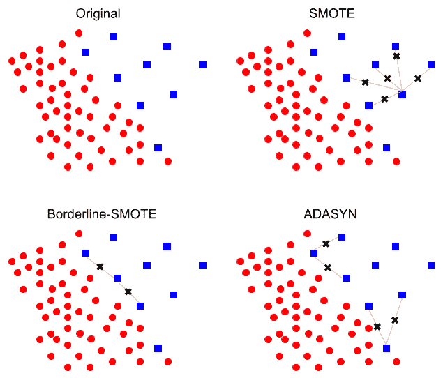

图 5.1 – 使用 SMOTE、Borderline-SMOTE 和 ADASYN 生成合成数据的示意图

使用 SMOTE 生成任何合成数据点的步骤可以总结如下：

1.  从少数类中随机选择一个数据点。

1.  确定该数据点的 K-最近邻。

1.  随机选择一个邻居。

1.  在特征空间中两个数据点之间随机选择一个点生成合成数据点。

SMOTE 及其两种变体**Borderline-SMOTE**和**自适应合成**（**ADASYN**）在*图 5.1*中展示。SMOTE、Borderline-SMOTE 和 ADASYN 的步骤 2 到步骤 4 是相似的。然而，Borderline-SMOTE 专注于分割类别的真实数据点，而 ADASYN 专注于特征空间中由多数类主导区域的数据点。通过这种方式，Borderline-SMOTE 增加了决策边界识别的置信度，以避免过拟合，而 ADASYN 提高了在多数类主导的空间部分对少数类预测的泛化能力。

您可以使用`imblearn` Python 库通过 SMOTE、Borderline-SMOTE 和 ADASYN 生成合成数据。然而，在进入使用这些功能之前，我们需要编写一个绘图函数供以后使用，以显示过采样过程之前和之后的数据：

```py
def plot_fun(x_plot: list, y_plot: list, title: str):    """
    Plotting a binary classification dataset
    :param x_plot: list of x coordinates (i.e. dimension 1)
    :param y_plot: list of y coordinates (i.e. dimension 2)
    :param title: title of plot
    """
    cmap, norm = mcolors.from_levels_and_colors([0, 1, 2],
        ['black', 'red'])
    plt.scatter([x_plot[iter][0] for iter in range(
        0, len(x_plot))],
        [x_plot[iter][1] for iter in range(
            0, len(x_plot))],
        c=y_plot, cmap=cmap, norm=norm)
    plt.xticks(fontsize = 12)
    plt.yticks(fontsize = 12)
    plt.xlabel('1st dimension', fontsize = 12)
    plt.ylabel('2nd dimension', fontsize = 12)
    plt.title(title)
    plt.show()
```

然后，我们生成一个包含两个类别和仅两个特征（即二维数据）的合成数据集，并将其视为我们的真实数据集。我们将一个类别的 100 个数据点视为多数类，另一个类别的 10 个数据点视为少数类：

```py
np.random.seed(12)minority_sample_size = 10
majority_sample_size = 100
# generating random set of x coordinates
group_1_X1 = np.repeat(2,majority_sample_size)+\
np.random.normal(loc=0, scale=1,size=majority_sample_size)
group_1_X2 = np.repeat(2,majority_sample_size)+\
np.random.normal(loc=0, scale=1,size=majority_sample_size)
# generating random set of x coordinates
group_2_X1 = np.repeat(4,minority_sample_size)+\
np.random.normal(loc=0, scale=1,size=minority_sample_size)
group_2_X2 = np.repeat(4,minority_sample_size)+\
np.random.normal(loc=0, scale=1,size=minority_sample_size)
X_all = [[group_1_X1[iter], group_1_X2[iter]] for\
            iter in range(0, len(group_1_X1))]+\
            [[group_2_X1[iter], group_2_X2[iter]]\
              for iter in range(0, len(group_2_X1))]
y_all = [0]*majority_sample_size+[1]*minority_sample_size
# plotting the randomly generated data
plot_fun(x_plot = X_all, y_plot = y_all,
    title = 'Original')
```

结果数据点在以下散点图中显示，红色和黑色数据点分别代表少数类和多数类。我们使用这个合成数据而不是真实数据集，以直观地展示不同的合成数据生成方法是如何工作的。

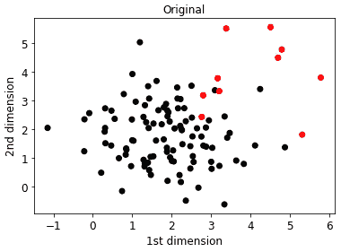

图 5.2 – 用于练习 SMOTE 及其替代方法的示例数据集，包含两个特征（即维度），通过合成生成

我们现在使用 SMOTE 通过`imblearn.over_sampling.SMOTE()`，如以下代码片段所示，只为少数类生成合成数据点：

```py
k_neighbors = 5# initializing smote
# using 'auto', equivalent to 'not majority',
# sampling_strategy that enforces resampling all classes but the majority class
smote = SMOTE(sampling_strategy='auto',
                    k_neighbors=k_neighbors)
# fitting smote to oversample the minority class
x_smote, y_smote = smote.fit_resample(X_all, y_all)
# plotting the resulted oversampled data
plot_fun(x_plot = x_smote, y_plot = y_smote,
    title = 'SMOTE')
```

如您在以下图中可以看到，新的过采样数据点将位于少数类原始数据点（即红色数据点）之间的间隙中。然而，许多这些新的数据点并没有帮助识别一个可靠的决策边界，因为它们被分组在非常右上角，远离黑色数据点和潜在的决策边界。

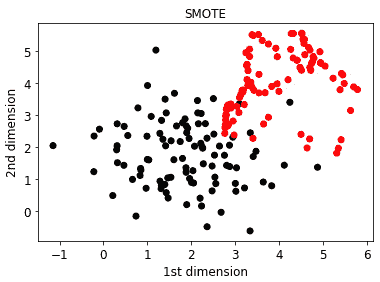

图 5.3 – 实施 SMOTE 后图 5.2 所示数据集的可视化

我们通过`imblearn.over_sampling.BorderlineSMOTE()`使用 Borderline-SMOTE 来生成合成数据，如下所示：

```py
k_neighbors = 5# using 5 neighbors to determine if a minority sample is in "danger"
m_neighbors = 10
# initializing borderline smote
# using 'auto', equivalent to 'not majority', sampling_strategy that enforces resampling all classes but the majority class
borderline_smote = BorderlineSMOTE(
    sampling_strategy='auto',
    k_neighbors=k_neighbors,
    m_neighbors=m_neighbors)
# fitting borderline smote to oversample the minority class
x_bordersmote,y_bordersmote =borderline_smote.fit_resample(
    X_all, y_all)
# plotting the resulted oversampled data
plot_fun(x_plot = x_bordersmote, y_plot = y_bordersmote,
    title = 'Borderline-SMOTE')
```

我们可以看到，新的合成数据点更接近黑色的大多数类数据点，这有助于识别一个可泛化的决策边界：

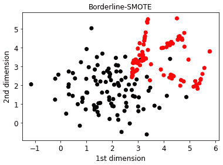

图 5.4 – 实施 Borderline-SMOTE 后，图 5.2 所示数据集的可视化

我们也可以通过`imblearn.over_sampling.ADASYN()`使用 ADASYN，因为它专注于具有更多多数类样本的区域，因此生成更多接近黑色数据点的新合成数据：

```py
# using 5 neighbors for each datapoint in the oversampling process by SMOTEn_neighbors = 5
# initializing ADASYN
# using 'auto', equivalent to 'not majority', sampling_strategy that enforces resampling all classes but the majority class
adasyn_smote = ADASYN(sampling_strategy = 'auto',n_neighbors                                         = n_neighbors)
# fitting ADASYN to oversample the minority class
x_adasyn_smote, y_adasyn_smote = adasyn_smote.fit_resample(X_all, y_all)
# plotting the resulted oversampled data
plot_fun(x_plot = x_adasyn_smote, y_plot = y_adasyn_smote,
    title = "ADASYN")
```

包括原始和合成数据点在内的数据在*图 5.5*中显示。

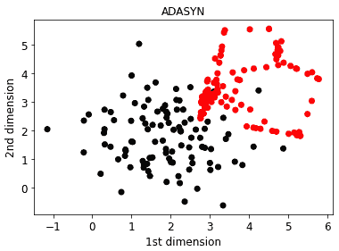

图 5.5 – 实施 ADASYN 后，图 5.2 所示数据集的可视化

基于 SMOTE 的合成数据生成方法近年来有了更多的发展，例如**基于密度的合成少数类过采样技术**（**DSMOTE**）（Xiaolong 等人，2019 年）和**k-means SMOTE**（Felix 等人，2017 年）。这两种方法都试图捕捉数据点在目标少数类或整个数据集中的分组。在 DSMOTE 中，使用**基于密度的空间聚类应用噪声**（**DBSCAN**）将少数类的数据点划分为三个组：核心样本、边界样本和噪声（即异常）样本，然后仅使用核心和边界样本进行过采样。这种方法被证明比 SMOTE 和 Borderline-SMOTE（Xiaolong 等人，2019 年）更有效。K-means SMOTE 是 SMOTE 的另一种近期替代方案（Last 等人，2017 年），它依赖于在过采样之前使用 k-means 聚类算法对整个数据集进行聚类（见*图 5.6*）。

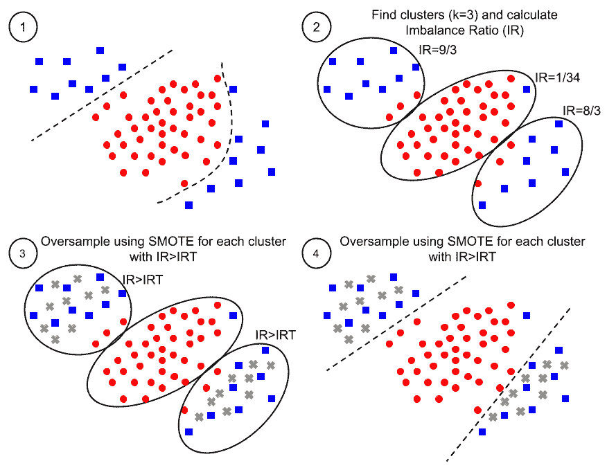

图 5.6 – k-means SMOTE 的四个主要步骤的示意图（Last 等人，2017 年）

这里是数据生成 k-means SMOTE 方法中的步骤，您可以通过`kmeans-smote` Python 库使用它们：

1.  根据原始数据确定决策边界。

1.  使用 k-means 聚类将数据点聚类到 k 个簇中。

1.  对于**不平衡率**（**IR**）大于**不平衡率阈值**（**IRT**）的簇使用 SMOTE 进行过采样。

1.  重复决策边界识别过程。（注意：IRT 可以由用户选择或像超参数一样优化。）

您可以使用 SMOTE 的不同变体进行练习，找出最适合您数据集的版本，但 Borderline-SMOTE 和 K-means SMOTE 可以作为良好的起点。

接下来，您将学习一些技术，这些技术有助于在模型训练之前提高您数据的质量。

# 改进预训练数据处理

在机器学习生命周期的早期阶段，在模型训练和评估之前进行的数据处理决定了我们输入训练、验证和测试过程的数据质量，从而决定了我们实现高性能和可靠模型的成功。

## 异常检测和异常值移除

您数据中的异常值和离群点可能会降低您模型在生产中的性能和可靠性。训练数据、用于模型评估的数据以及生产中的未见数据中的离群点可能产生不同的影响：

+   **模型训练中的离群点**：监督学习模型的训练数据中存在离群点可能会导致模型泛化能力降低。它可能导致分类中的决策边界过于复杂，或者在回归模型中产生不必要的非线性。

+   **模型评估中的离群点**：验证和测试数据中的离群点可能会降低模型性能。由于模型不一定是为离群数据点设计的，它们会影响模型性能评估的可靠性，导致模型无法正确预测其标签或连续值。这个问题可能会使模型选择过程变得不可靠。

+   **生产中的离群点**：生产中的未见数据点可能远离训练或甚至测试数据的分布。我们的模型可能被设计来识别这些异常值，例如在欺诈检测的情况下，但如果这不是目标，那么我们应该将这些数据点标记为样本，这些样本不是我们的模型有信心处理或为它们设计的。例如，如果我们设计了一个基于肿瘤遗传信息的模型来建议癌症患者的药物，那么我们的模型应该对需要被视为离群样本的患者报告低置信度，因为错误的药物可能具有致命的后果。

*表 5.4* 提供了一些您可以用来识别数据中的异常值并在必要时移除离群点的异常检测方法的总结：

| **方法** | **文章和网址** |
| --- | --- |
| **隔离森林（iForest**） | 刘等人，2008[`ieeexplore.ieee.org/abstract/document/4781136`](https://ieeexplore.ieee.org/abstract/document/4781136) |
| **轻量级在线异常检测器（Loda**） | 彭维，2016[`link.springer.com/article/10.1007/s10994-015-5521-0`](https://link.springer.com/article/10.1007/s10994-015-5521-0) |
| **局部离群因子（LOF**） | 布伦尼格等人，2000[`dl.acm.org/doi/abs/10.1145/342009.335388`](https://dl.acm.org/doi/abs/10.1145/342009.335388) |
| **基于角度的离群点检测（ABOD**） | 克里格尔等人，2008[`dl.acm.org/doi/abs/10.1145/1401890.1401946`](https://dl.acm.org/doi/abs/10.1145/1401890.1401946) |
| **鲁棒核密度估计（RKDE**） | 金和斯科特，2008[`ieeexplore.ieee.org/document/4518376`](https://ieeexplore.ieee.org/document/4518376) |
| 用于新颖性检测的支持向量方法 | 施洛克夫等人，1999[`proceedings.neurips.cc/paper/1999/hash/8725fb777f25776ffa9076e44fcfd776-Abstract.html`](https://proceedings.neurips.cc/paper/1999/hash/8725fb777f25776ffa9076e44fcfd776-Abstract.html) |

表 5.4 – 广泛使用的异常检测技术（Emmott 等人，2013 和 2015）

异常检测的有效方法之一是 `scikit-learn`。为了尝试它，我们首先生成以下合成训练数据集：

```py
n_samples, n_outliers = 100, 20rng = np.random.RandomState(12)
# Generating two synthetic clusters of datapoints sampled from a univariate "normal" (Gaussian) distribution of mean 0 and variance 1
cluster_1 = 0.2 * rng.randn(n_samples, 2) + np.array(
    [1, 1])
cluster_2 = 0.3 * rng.randn(n_samples, 2) + np.array(
    [5, 5])
# Generating synthetic outliers
outliers = rng.uniform(low=2, high=4, size=(n_outliers, 2))
X = np.concatenate([cluster_1, cluster_2, outliers])
y = np.concatenate(
    [np.ones((2 * n_samples), dtype=int),
        -np.ones((n_outliers), dtype=int)])
```

然后，我们使用 `scikit-learn` 中的 `IsolationForest()`：

```py
# initializing iForestclf = IsolationForest(n_estimators = 10, random_state=10)
# fitting iForest using training data
clf.fit(X)
# plotting the results
scatter = plt.scatter(X[:, 0], X[:, 1])
handles, labels = scatter.legend_elements()
disp = DecisionBoundaryDisplay.from_estimator(
    clf,
    X,
    plot_method = "contour",
    response_method="predict",
    alpha=1
)
disp.ax_.scatter(X[:, 0], X[:, 1], s = 10)
disp.ax_.set_title("Binary decision boundary of iForest (
    n_estimators = 10)")
plt.xlabel('Dimension 1', fontsize = 12)
plt.ylabel('Dimension 2', fontsize = 12)
plt.show()
```

在之前的代码中，我们使用了 10 个决策树，当初始化 `IsolationForest()` 时，`n_estimator = 10`。这是 iForest 的一个超参数，我们可以通过调整它来获得更好的结果。你可以看到 `n_estimator = 10` 和 `n_estimator = 100` 的结果边界。

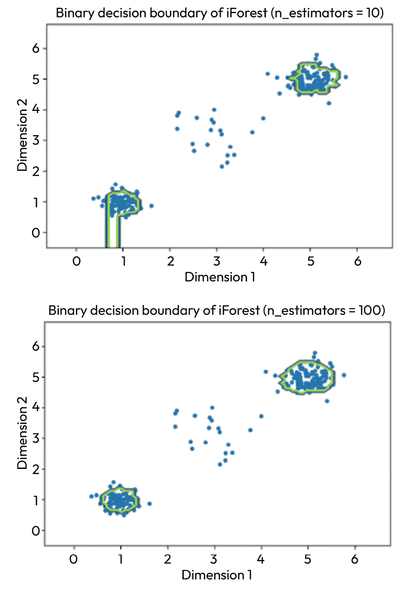

图 5.7 – 使用不同估计器数量的 iForest 的决策边界

如果你未经进一步调查就接受异常检测方法（如 iForest）的结果，你可能会决定只使用显示边界内的数据。然而，这些技术可能存在问题，就像任何其他机器方法一样。尽管 iForest 不是一个监督学习方法，但用于识别异常的边界可能容易过拟合，并且不适用于进一步的评估或在生产环境中对未见数据的使用。此外，超参数的选择可能会导致错误地将大量数据点视为异常值。

## 利用低质量或相关性较低的数据

在进行监督机器学习时，我们理想情况下希望能够访问大量高质量的数据。然而，我们访问到的数据点中的特征或输出值并不具有相同程度的确定性。例如，在分类的情况下，标签可能并不都具有相同的有效性。换句话说，我们对不同数据点标签的信心可能不同。一些常用的数据点标签过程是通过平均实验测量值（例如，在生物或化学环境中）或使用多个专家（或非专家）的注释来进行的。

你也可能遇到这样的问题，比如预测乳腺癌患者对特定药物的反应，而你又有数据可以访问患者对其他癌症类型中相同或类似药物的反应。那么，你的一部分数据与乳腺癌患者对药物反应的目标相关性较低。

我们更希望在这些情况下依赖高质量的数据，或者高度可靠的注释和标签。然而，我们可能能够访问大量质量较低或与我们目标相关性较低的数据点。尽管这些方法并不总是成功，但我们有几种方法可以利用这些低质量或相关性较低的数据点：

+   在`scikit-learn`中，初始化一个随机森林模型，例如`rf_model = RandomForestClassifier(random_state = 42)`后，你可以在拟合步骤中指定每个数据点的权重，作为`rf_model.fit(X_train,y_train, sample_weight = weights_array)`，其中`weights_array`是训练集中每个数据点的权重数组。这些权重可以是根据数据点与目标的相关性或其质量而对你拥有的置信度分数。例如，如果你使用 10 位不同的专家注释员为一系列数据点分配标签，你可以使用其中的一部分来达成对类别标签的共识，作为每个数据点的权重。如果一个数据点的类别为 1，但只有 7 位注释员同意这个类别，那么它将比所有 10 位注释员都同意其标签的类别-1 数据点获得更低的权重。

+   **集成学习**：如果你考虑每个数据点的质量或置信度分数的分布，那么你可以使用分布的每个部分的数据点构建不同的模型，然后结合这些模型的预测，例如，使用它们的加权平均值（见*图 5.8*）。分配给每个模型的权重可以是一个数字，代表用于其训练的数据点的质量。

+   **迁移学习**：在迁移学习中，我们可以在一个参考任务上训练一个模型，通常有更多的数据点，然后在小任务上进行微调，以得出特定任务的预测（Weiss 等人，2016 年，Madani Tonekaboni 等人，2020 年）。这种方法可以用于具有不同置信度水平的数据（Madani Tonekaboni 等人，2020 年）。你可以在具有不同标签置信度水平的大型数据集上训练一个模型（见*图 5.8*），排除非常低置信度的数据，然后在其数据集的高置信度部分上进行微调。

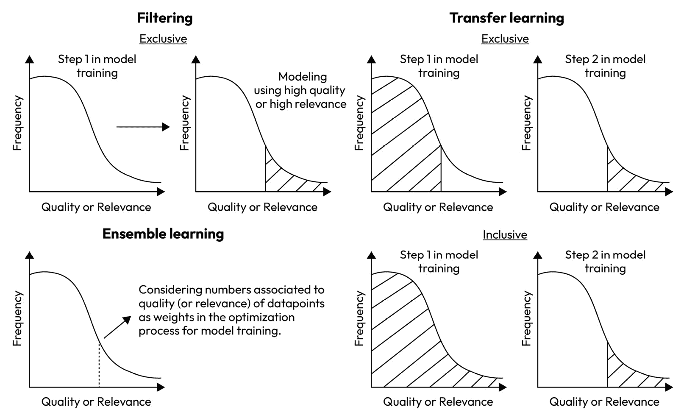

图 5.8 – 在训练机器学习模型时使用不同质量或相关性的目标问题数据点的技术

这些方法可以帮助你减少生成更多高质量数据的需求。然而，如果可能的话，拥有更多高质量且高度相关的数据是首选的。

作为本章的最后一种方法，我们将讨论正则化作为一种控制过拟合并帮助生成具有更高泛化可能性的模型的技术。

# 正则化以改善模型泛化能力

在上一章中，我们了解到模型的高复杂度可能导致过拟合。控制模型复杂度和减少影响模型泛化能力的特征的影响的一种方法是通过**正则化**。在正则化过程中，我们在训练过程中优化的损失函数中考虑一个正则化或惩罚项。在简单的线性建模情况下，正则化可以如下添加到优化过程中的损失函数中：

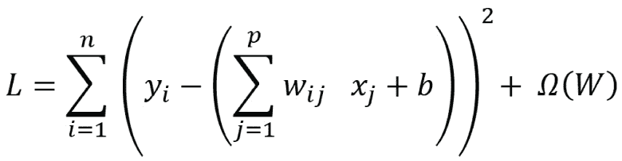

其中第一个项是损失，Ω(W)是模型权重或参数 W 的正则化项作为函数。然而，正则化可以与不同的机器学习方法一起使用，如 SVM 或**LightGBM**（参见*表 5.2*）。以下表格显示了三种常见的正则化项，包括**L1 正则化**、**L2 正则化**及其组合。

| **方法** | **正则化项** | **参数** |
| --- | --- | --- |
| L2 正则化 | Ω(W) = λ∑ j=1 p w j 2 | λ: 决定正则化强度的一个正则化参数 |
| L1 正则化 | Ω(W) = λ∑ j=1 p &#124;w p&#124; | λ: 与 L2 正则化中相同 |
| L2 和 L1 | Ω(W) = λ( 1 − α _ 2  ∑ j=1 p w j 2 + α∑ j=1 p &#124;w j&#124;) | λ: 与 L1 和 L2 正则化中相同α: 决定正则化过程中 L1 与 L2 影响的一个缺失参数 |

表 5.5 – 机器学习建模中常用的正则化方法

我们可以将带有正则化的优化过程视为尽可能接近最优参数集 ˆβ 的过程，同时将参数约束在约束区域内，如图*图 5.9*所示：

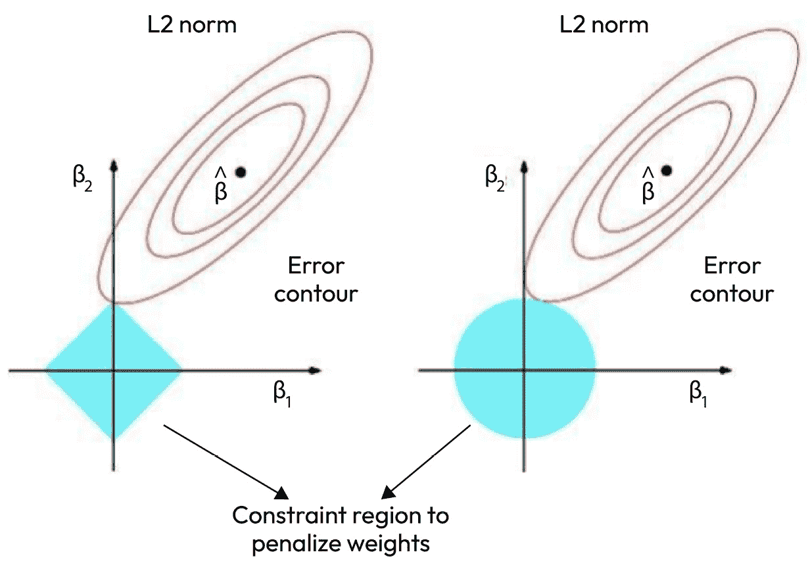

图 5.9 – L1 和 L2 范数正则化在二维特征空间中控制过拟合的示意图

在 L1 正则化的参数约束区域中，角落会导致一些参数被消除，或者使它们的相关权重变为零。然而，L2 正则化约束参数区域的凸性只会通过降低权重来降低参数的影响。这种差异通常会导致 L1 正则化对异常值的鲁棒性更高。

带有 L1 正则化和 L2 正则化的线性分类模型分别称为**Lasso**和**Ridge**回归（Tibshirani，1996）。Elastic-Net 后来被提出，它结合了 L1 正则化和 L2 正则化项（Zou 等人，2005）。在这里，我们想练习使用这三种方法，但你也可以使用其他方法的正则化超参数，例如 SVM 或 XGBoost 分类器（见*表 5.2*）。

我们首先导入必要的库并设计一个绘图函数来直观地显示正则化参数值的影响。我们还从`scikit-learn`加载数字数据集用于模型训练和评估：

```py
random_state = 42# loading and splitting digit data to train and test sets
digits = datasets.load_digits()
x = digits.data
y = digits.target
# using stratified k-fold (k=5) cross-validation
stratified_kfold_cv = StratifiedKFold(n_splits = 5,
    shuffle=True, random_state=random_state)
# function for plotting the CV score across different hyperparameter values
def reg_search_plot(search_fit, parameter: str):
    """
    :param search_fit: hyperparameter search object after model fitting
    :param parameter: hyperparameter name
    """
    parameters = [search_fit.cv_results_[
        'params'][iter][parameter] for iter in range(
            0,len(search_fit.cv_results_['params']))]
    mean_test_score = search_fit.cv_results_[
        'mean_test_score']
    plt.scatter(parameters, mean_test_score)
    plt.xticks(fontsize = 12)
    plt.yticks(fontsize = 12)
    plt.xlabel(parameter, fontsize = 12)
    plt.ylabel('accuracy', fontsize = 12)
    plt.show()
```

我们可以使用`GridSearchCV()`函数评估以下模型中不同正则化参数值的效果。在`scikit-learn`中，正则化参数通常命名为`alpha`而不是λ，混合参数称为`l1_ratio`而不是α。在这里，我们首先评估不同`alpha`值对 Lasso 模型的影响，使用 L1 正则化，用数字数据集进行训练和评估：

```py
# Defining hyperparameter gridparameter_grid = {"alpha": [0, 0.1, 0.2, 0.3, 0.4, 0.5]}
# generating the grid search
lasso_search = GridSearchCV(Lasso(
    random_state = random_state),
    parameter_grid,cv = stratified_kfold_cv,n_jobs=-1)
# fitting the grid search cross-validation
lasso_search.fit(x, y)
reg_search_plot(search_fit = lasso_search,
    parameter = 'alpha')
```

最优的`alpha`值被确定为 0.1，如下面的图表所示，这导致了在考虑的值中达到最高的准确率。这意味着在`alpha`值为`0.1`之后增加正则化的效果会增加模型偏差，导致模型在训练中的性能降低。

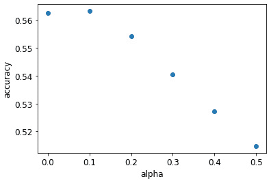

图 5.10 – Lasso 模型中准确率与正则化参数 alpha 的关系

如果我们在岭回归模型中评估不同`alpha`值的效果，使用 L2 正则化，我们可以看到随着正则化强度的增加，性能会提高（参见*图 5.11*）。

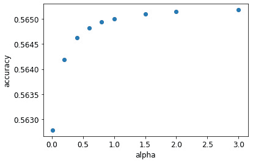

图 5.11 – 岭回归模型中准确率与正则化参数 alpha 的关系

这两种方法的替代方案是 Elastic-Net，它结合了 L1 和 L2 正则化的效果。在这种情况下，`alpha`对模型性能的影响趋势与 Lasso 更相似；然而，与仅依赖 L1 正则化的 Lasso 相比，准确率值的范围更窄（参见*图 5.12*）。

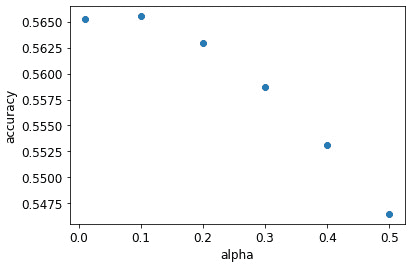

图 5.12 – Elastic-Net 模型中准确率与正则化参数 alpha 的关系

如果你的数据集不是非常小，更复杂的模型可以帮助你实现更高的性能。只有在极少数情况下，你才会考虑线性模型作为你的最终模型。为了评估正则化对更复杂模型的影响，我们选择了 SVM 分类器，并检查了`sklearn.svm.SVC()`中作为正则化参数的不同`C`值的效果：

```py
# Defining hyperparameter gridparameter_grid = {"C": [0.01, 0.2, 0.4, 0.6, 0.8, 1]}
# generating the grid search
svc_search = GridSearchCV(SVC(kernel = 'poly',
    random_state = random_state),parameter_grid,
    cv = stratified_kfold_cv,n_jobs=-1)
# fitting the grid search cross-validation
svc_search.fit(x, y)
reg_search_plot(search_fit = svc_search, parameter = 'C')
```

如下所示，模型的准确率范围更高，在 0.92 到 0.99 之间，与准确率低于 0.6 的线性模型相比，但更高的正则化控制过拟合并实现了更好的性能。

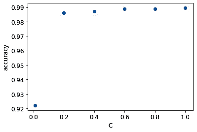

图 5.13 – SVM 分类模型中准确率与正则化参数 C 的关系

在*第十二章*《超越机器学习调试的深度学习》，你还将了解深度神经网络模型中的正则化技术。

# 摘要

在本章中，你学习了提高模型性能和减少偏差与方差的技术。你学习了除了深度学习之外广泛使用的机器学习方法的超参数，这些将在本书的后续章节中介绍，以及帮助你在识别最佳超参数集的 Python 库。你还学习了正则化作为另一种帮助你训练泛化机器学习模型的技术。你还学习了如何通过合成数据生成和异常值检测等方法提高输入训练过程的数据质量。

在下一章中，你将了解机器学习建模中的可解释性和可说明性，以及如何使用相关技术和 Python 工具来识别改进模型的机会。

# 问题

1.  增加更多特征和训练数据点是否会减少模型方差？

1.  你能提供一些方法示例，用于结合具有不同置信度类别标签的数据吗？

1.  如何通过过采样提高你的监督机器学习模型的泛化能力？

1.  DSMOTE 和 Borderline-SMOTE 之间的区别是什么？

1.  在超参数优化过程中，你是否需要检查每个模型的每个超参数的每个值的效果？

1.  L1 正则化能否消除某些特征对监督模型预测的贡献？

1.  如果使用相同的训练数据训练，Lasso 回归和 Ridge 回归模型在相同的测试数据上会产生相同的性能吗？

# 参考文献

+   Bergstra, James 和 Yoshua Bengio. “*随机搜索用于超参数优化*.” *机器学习研究杂志* 13.2 (2012).

+   Bergstra, James 等. “*超参数优化的算法*.” *神经信息处理系统进展* 24 (2011).

+   Nguyen, Vu. “*贝叶斯优化加速超参数调整*.” *2019 IEEE 第二届人工智能与知识工程国际会议 (AIKE)*. IEEE (2019).

+   Li, Lisha 等. “*Hyperband：一种基于 bandit 的超参数优化新方法*.” *机器学习研究杂志* 18.1 (2017): pp. 6765-6816.

+   Falkner, Stefan, Aaron Klein, 和 Frank Hutter. “*BOHB：大规模鲁棒且高效的超参数优化*.” *机器学习国际会议*. PMLR (2018).

+   Ng, Andrew, 斯坦福 CS229：机器学习课程，2018 年秋季。

+   Wong, Sebastien C. 等. “*理解数据增强在分类中的应用：何时进行扭曲？*.” *2016 国际数字图像计算：技术与应用 (DICTA)*. IEEE (2016).

+   Mikołajczyk, Agnieszka 和 Michał Grochowski. “*数据增强用于改进图像分类问题中的深度学习*.” *2018 年国际跨学科博士研讨会（IIPhDW）*。IEEE (2018).

+   Shorten, Connor 和 Taghi M. Khoshgoftaar. “*关于深度学习图像数据增强的综述*.” *大数据杂志* 6.1 (2019): pp. 1-48.

+   Taylor, Luke 和 Geoff Nitschke. “*通过通用数据增强改进深度学习*.” *2018 年 IEEE 计算智能系列研讨会* (2018).

+   Shorten, Connor, Taghi M. Khoshgoftaar 和 Borko Furht. “*文本数据增强用于深度学习*.” *大数据杂志* 8.1 (2021): pp. 1-34.

+   Perez, Luis 和 Jason Wang. “*在深度学习图像分类中使用数据增强的有效性*.” arXiv 预印本 arXiv:1712.04621 (2017).

+   Ashrapov, Insaf. “*用于不均匀分布的表格生成对抗网络*.” arXiv 预印本 arXiv:2010.00638 (2020).

+   Xu, Lei 等人. “*使用条件生成对抗网络建模表格数据*.” *神经信息处理系统进展* 32 (2019).

+   Chawla, Nitesh V. 等人. “*SMOTE: 生成少数类过采样技术*.” *人工智能研究杂志* 16 (2002): pp. 321-357.

+   Han, H., Wang, WY., Mao, BH. (2005). “*Borderline-SMOTE: 不平衡数据集学习中的新过采样方法*.” 载于: 黄德顺，张晓平，黄国宾 (编). *智能计算进展*. ICIC 2005. 计算机科学讲座笔记，第 3644 卷. Springer, Berlin, Heidelberg.

+   He, Haibo, Yang Bai, E. A. Garcia 和 Shutao Li. “*ADASYN: 用于不平衡学习的自适应合成采样方法*.” *2008 年 IEEE 国际神经网络联合会议（IEEE 世界计算智能大会）* (2008): pp. 1322-1328，doi: 10.1109/IJCNN.2008.4633969.

+   X. Xiaolong, C. Wen 和 S. Yanfei. “*不平衡数据分类的过采样算法*，”载于*系统工程与电子学杂志*，第 30 卷，第 6 期，pp. 1182-1191，2019 年 12 月，doi: 10.21629/JSEE.2019.06.12.

+   Last, Felix, Georgios Douzas 和 Fernando Bacao. “*基于 k-means 和 SMOTE 的不平衡学习过采样*.” arXiv 预印本 arXiv:1711.00837 (2017).

+   Emmott, Andrew F. 等人. “*从真实数据中系统地构建异常检测基准*.” *ACM SIGKDD 异常检测与描述研讨会论文集*. 2013.

+   Emmott, Andrew, 等人. “*异常检测问题的元分析*.” arXiv 预印本 arXiv:1503.01158 (2015).

+   Liu, Fei Tony, Kai Ming Ting 和 Zhi-Hua Zhou. “*隔离森林*.” *2008 年第八届 IEEE 国际数据挖掘会议*。IEEE (2008).

+   Pevný, Tomáš. “*Loda: 轻量级在线异常检测器*.” *机器学习* 102 (2016): pp. 275-304.

+   Breunig, Markus M. 等人. “*LOF: 基于密度的局部异常识别*.” *2000 年 ACM SIGMOD 国际数据管理会议论文集* (2000).

+   Kriegel, Hans-Peter，Matthias Schubert，和 Arthur Zimek。 “*高维数据中的基于角度的异常值检测*。” *《第 14 届 ACM SIGKDD 国际知识发现和数据挖掘会议论文集*》（2008 年）。

+   Joo Seuk Kim 和 C. Scott，“*鲁棒核密度估计*。” *2008 年 IEEE 国际声学、语音和信号处理会议*，拉斯维加斯，内华达州，美国（2008 年）：第 3381-3384 页，doi: 10.1109/ICASSP.2008.4518376。

+   Schölkopf, Bernhard, et al. “*支持向量方法用于新颖性检测*。” *《神经信息处理系统进展*》12（1999 年）。

+   Weiss, Karl，Taghi M. Khoshgoftaar，和 DingDing Wang。 “*迁移学习综述*。” *《大数据杂志*》3.1（2016 年）：第 1-40 页。

+   Tonekaboni, Seyed Ali Madani, et al. “*使用过滤迁移学习跨越标签置信度分布进行学习*。” *2020 年第 19 届 IEEE 国际机器学习与应用会议（ICMLA）*。IEEE（2020 年）。

+   Tibshirani, Robert. “*通过 lasso 进行回归收缩和选择*。” *《皇家统计学会系列 B（方法论）*》58.1（1996 年）：第 267-288 页。

+   Hastie, Trevor, et al. *《统计学习的要素：数据挖掘、推理和预测》*。第 2 卷。纽约：Springer，2009 年。

+   Zou, Hui，和 Trevor Hastie。 “*通过弹性网进行正则化和变量选择*。” *《皇家统计学会系列 B（统计方法论）*》67.2（2005 年）：第 301-320 页。
