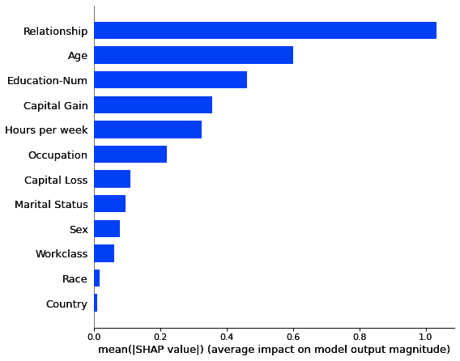

# 6

# 机器学习建模中的可解释性和可解释性

我们使用或开发的绝大多数机器学习模型都是复杂的，需要使用可解释性技术来识别改进它们性能、减少偏差和增加可靠性的机会。

在本章中，我们将探讨以下主题：

+   可解释性机器学习与黑盒机器学习

+   机器学习中的可解释性方法

+   在 Python 中练习机器学习可解释性

+   审视为什么可解释性并不足够

到本章结束时，您将了解机器学习建模中可解释性的重要性，并练习使用 Python 中的某些可解释性技术。

# 技术要求

在本章中，以下要求应予以考虑，因为它们有助于您更好地理解所提到的概念，在您的项目中使用它们，并使用提供的代码进行实践：

+   Python 库要求：

    +   `sklearn` >= 1.2.2

    +   `numpy` >= 1.22.4

    +   `matplotlib` >= 3.7.1

您可以在 GitHub 上找到本章的代码文件：[`github.com/PacktPublishing/Debugging-Machine-Learning-Models-with-Python/tree/main/Chapter06`](https://github.com/PacktPublishing/Debugging-Machine-Learning-Models-with-Python/tree/main/Chapter06)。

# 可解释性机器学习与黑盒机器学习

如线性回归这样的可解释和简单模型使得评估改进它们的可能性、发现它们的问题（如需要检测和消除的偏差）以及建立对使用此类模型的信任变得容易。然而，为了实现更高的性能，我们通常不会止步于这些简单模型，而是依赖于复杂或所谓的黑盒模型。在本节中，我们将回顾一些可解释模型，然后介绍您可以用来解释您的黑盒模型的技术。

## 可解释的机器学习模型

线性模型，如线性回归和逻辑回归、浅层决策树和朴素贝叶斯分类器，是简单且可解释的方法的例子（*图 6.1*）。我们可以轻松地提取这些模型在预测输出中对特征贡献的部分，并识别改进它们性能的机会，例如通过添加或删除特征或改变特征归一化。我们还可以轻松地识别模型中是否存在偏差——例如，对于特定的种族或性别群体。然而，这些模型非常简单，能够访问成千上万或数百万样本的大型数据集使我们能够训练高性能但复杂的模型：


图 6.1 – 可解释分类方法的示例

复杂模型，例如具有许多深度决策树或深度神经网络的随机森林模型，虽然它们几乎像黑盒系统一样工作，但有助于我们实现更高的性能。为了能够理解这些模型并解释它们是如何得出预测的，以及建立对其有用性的信任，我们可以使用机器学习可解释性技术。

## 复杂模型的可解释性

可解释性技术就像复杂机器学习模型和用户之间的桥梁。它们应该提供忠实于模型工作方式的解释。另一方面，它们应该提供对用户有用且易于理解的解释。这些解释可用于识别改进模型性能的机会、减少模型对特征值变化敏感性的影响、提高模型训练中的数据效率、帮助在模型中进行适当的推理、避免虚假相关性，并帮助实现公平性（Weber 等人，2022 年；*图 6.2*）：


图 6.2 – 使用可解释性对机器学习模型的影响

现在你已经更好地理解了可解释性在机器学习建模中的重要性，我们准备深入了解可解释性技术的细节。

# 机器学习中的可解释性方法

在使用或开发机器学习建模的可解释性技术时，我们需要牢记以下考虑因素（Ribeiro 等人，2016 年）：

+   **可解释性**：解释需要用户能够理解。机器学习解释的主要目标之一是使复杂模型对用户可理解，并在可能的情况下提供可操作的信息。

+   **局部忠实度（忠实性）**：捕捉模型的复杂性，以便它们完全忠实并满足全局忠实度标准，并非所有技术都能实现。然而，解释至少应该对模型局部忠实。换句话说，解释需要恰当地解释模型在研究数据点的邻近区域是如何表现的。

+   **模型无关性**：尽管有一些技术是为特定的机器学习方法设计的，例如随机森林，但它们应该对使用不同超参数或针对不同数据集构建的模型保持无关。可解释性技术需要将模型视为黑盒，并为模型提供全局或局部的解释。

可解释性技术可以分为**局部可解释性**和**全局可解释性**方法。局部可解释性方法旨在满足之前列出的标准，而全局可解释性技术试图超越局部可解释性，并为模型提供全局解释。

## 局部可解释性技术

局部可解释性帮助我们理解模型在特征空间中接近数据点的行为。尽管这些模型满足局部保真度标准，但被识别为局部重要的特征可能不是全局重要的，反之亦然（Ribeiro 等人，2016）。这意味着我们无法轻易地从全局解释推断出局部解释，反之亦然。在本节中，我们将讨论五种局部解释技术：

+   特征重要性

+   反事实

+   基于样本的可解释性

+   基于规则的解释性

+   显著性图

之后，我们还将介绍一些全局可解释性技术。

### 特征重要性

局部可解释性的主要方法之一是解释每个特征在预测目标数据点在邻域中的结果时的局部贡献。这类方法的广泛使用例子包括 **SHapley Additive exPlanations**（SHAP）（Lundberg 等人，2017）和 **Local Interpretable Model-agnostic Explanations**（LIME）（Ribeiro 等人，2016）。让我们简要讨论这两种方法背后的理论，并在 Python 中实践它们。

#### 使用 SHAP 的局部解释

SHAP 是由 Scott Lundberg 和 Su-In Lee（Lundberg 和 Lee，2017）引入的 Python 框架。这个框架的想法是基于使用 Shapely 值，这是一个以美国博弈论家、诺贝尔奖获得者 Lloyd Shapley 命名的已知概念（Winter，2022）。SHAP 可以确定每个特征对模型预测的贡献。由于特征在确定分类模型的决策边界并最终影响模型预测方面是协同工作的，SHAP 尝试首先识别每个特征的边际贡献，然后提供 Shapely 值作为每个特征在整个特征集合作下对模型预测贡献的估计。从理论角度来看，这些边际贡献可以通过单独移除特征以及在不同的组合中移除特征来计算，计算每个特征集移除的效果，然后对贡献进行归一化。由于可能的组合数量可能呈指数增长到数十亿，即使对于具有 40 个特征的模型，这个过程也不能对所有可能的特征组合重复进行。相反，这个过程只使用有限次数来得到 Shapely 值的近似。此外，由于在大多数机器学习模型中无法移除特征，特征值要么由随机分布中的替代值替换，要么由每个特征的背景集合中的有意义且可能的值替换。我们不想深入探讨这个过程的细节，但将在下一节中练习使用这种方法。

#### 使用 LIME 的局部解释

LIME 是 SHAP 的替代品，用于局部可解释性，它以模型无关的方式通过局部近似可解释模型来解释任何分类器或回归器的预测（*图 6**.3*；Ribeiro 等人，2016）：


图 6.3 – LIME 中局部可解释建模的示意图

该技术的某些优点，如 Ribeiro 等人（2016）的原论文中提到的，包括以下内容：

+   理论和提供的解释直观且易于理解

+   提供稀疏解释以增加可解释性

+   与不同类型的结构化和非结构化数据一起工作，例如文本和图像

### 反事实

反事实示例或解释有助于我们识别在实例中需要改变什么才能改变分类模型的输出。这些反事实可以帮助在许多应用中识别可操作路径，例如金融、零售、营销、招聘和医疗保健。一个例子是向银行客户建议他们如何改变其贷款申请被拒绝的情况（Guidotti, 2022）。反事实还可以帮助识别模型中的偏差，这有助于我们提高模型性能或消除模型中的公平性问题。在生成和使用反事实解释时，我们需要考虑以下因素（Guidotti, 2022）：

+   **有效性**：只有当反事实示例的分类结果与原始样本不同时，反事实示例才是有效的。

+   **相似性**：反事实示例应尽可能与原始数据点相似。

+   **多样性**：尽管反事实示例应与它们所派生的原始样本相似，但它们之间需要具有多样性，以提供不同的选项（即不同的可能特征变化）。

+   **可操作性**：并非所有特征值的变化都具有可操作性。由反事实方法建议的反事实的可操作性是实际受益的重要因素。

+   **合理性**：反事实示例的特征值应该是合理的。反事实的合理性增加了从它们中推导出解释的信任度。

我们还必须注意，反事实解释器需要高效且足够快地生成反事实，并且在生成与相似数据点相关的反事实时保持稳定（Guidotti, 2022）。

### 基于样本的可解释性

另一种解释性的方法是依靠真实或合成数据点的特征值和结果来帮助局部模型解释性。在这个解释性技术类别中，我们的目标是找出哪些样本被错误分类，以及哪些特征集导致错误分类的概率增加，以帮助我们解释我们的模型。我们还可以评估哪些训练数据点导致决策边界的改变，以便我们可以预测测试或生产数据点的输出。有一些统计方法，如**影响函数**（Koh 和 Liang 2017），这是一种评估样本对模型参数影响的经典方法，我们可以用它来识别样本对模型决策过程的贡献。

### 基于规则的解释性

基于规则的解释方法，如**锚点解释**，旨在找出导致高概率得到相同输出的特征值条件（Ribeiro 等，2018）。例如，在预测数据集中个人的薪水低于或等于 50k 或高于 50k 的情况下，“教育程度≤高中导致薪水≤50k”可以被视为基于规则的解释中的一个规则。这些解释需要局部忠实。

### 显著性图

显著性图的目标是解释哪些特征对数据点的预测输出贡献更多或更少。这些方法通常用于在图像数据上训练的机器学习或深度学习模型（Simonyan 等，2013）。例如，我们可以使用显著性图来确定分类模型是否使用背景森林来识别它是一张熊的图片而不是泰迪熊，或者是否使用熊的身体部件来识别它。

## 全局解释

尽管为机器学习模型实现可靠的全球解释很困难，但它可以增加对它们的信任（Ribeiro 等，2016）。在开发和部署机器学习模型时，性能并不是建立信任的唯一方面。虽然局部解释在调查单个样本和提供可操作信息方面非常有帮助，但可能不足以建立这种信任。在这里，我们将讨论三种超越局部解释的方法，包括收集局部解释、知识蒸馏和反事实的摘要。

### 收集局部解释

**子模可加选择 LIME**（**SP-LIME**）是一种全局解释技术，它使用 LIME 的局部解释来提供一个模型行为的全局视角（Riberio 等，2016）。由于可能无法使用所有数据点的局部解释，SP-LIME 选择了一组代表性的多样化样本，这些样本能够代表模型的全局行为。

### 知识蒸馏

**知识蒸馏**的思想是使用简单的可解释模型（如决策树）来近似复杂模型的行为，这一概念最初是为神经网络模型提出的（Hinton 等人，2015 年；Frosst 和 Hinton，2017 年）。换句话说，我们的目标是构建简单的模型，如决策树，以近似给定样本集的复杂模型的预测。

### 反事实的摘要

我们可以使用为多个数据点生成的反事实摘要（包括正确和错误的预测结果）来了解特征在输出预测中的贡献以及预测对特征扰动的敏感性。我们将在本章后面练习使用反事实，你将看到并非所有反事实都是可接受的，并且它们需要根据特征及其值的含义来选择。

# 在 Python 中实践机器学习可解释性

有几个 Python 库你可以用来提取你的机器学习模型的局部和全局解释（*表 6.1*）。在这里，我们想练习一些专注于局部模型可解释性的库：

| **库** | **导入和安装库名称** | **URL** |
| --- | --- | --- |
| SHAP | `Shap` | [`pypi.org/project/shap/`](https://pypi.org/project/shap/) |
| LIME | `Lime` | [`pypi.org/project/lime/`](https://pypi.org/project/lime/) |
| Shapash | `shapash` | [`pypi.org/project/shapash/`](https://pypi.org/project/shapash/) |
| ELI5 | `eli5` | [`pypi.org/project/eli5/`](https://pypi.org/project/eli5/) |
| 解释仪表板 | `explainer dashboard` | [`pypi.org/project/explainerdashboard/`](https://pypi.org/project/explainerdashboard/) |
| Dalex | `dalex` | [`pypi.org/project/dalex/`](https://pypi.org/project/dalex/) |
| OmniXAI | `omnixai` | [`pypi.org/project/omnixai/`](https://pypi.org/project/omnixai/) |
| CARLA | `carla` | [`carla-counterfactual-and-recourse-library.readthedocs.io/en/latest/`](https://carla-counterfactual-and-recourse-library.readthedocs.io/en/latest/) |
| **Diverse Counterfactual Explanations (DiCE**) | `dice-ml` | [`pypi.org/project/dice-ml/`](https://pypi.org/project/dice-ml/) |
| 机器学习库扩展 | `mlxtend` | [`pypi.org/project/mlxtend/`](https://pypi.org/project/mlxtend/) |
| 锚点 | `anchor` | [`github.com/marcotcr/anchor`](https://github.com/marcotcr/anchor) |

表 6.1 – 具有机器学习模型可解释性功能的 Python 库或存储库

首先，我们将使用 SHAP 进行练习，这是一种广泛用于机器学习可解释性的技术。

## SHAP 中的解释

我们将首先探讨使用 SHAP 进行局部解释，随后再讨论全局解释。

### 局部解释

在本节中，我们将使用 SHAP 从我们的机器学习模型中提取特征重要性。我们将使用**加州大学欧文分校**（**UCI**）的成年人数据集来预测 90 年代人们是否年收入超过 50k；这也可以作为 SHAP 库的一部分的成年人收入数据集。您可以在[`archive.ics.uci.edu/ml/datasets/adult`](https://archive.ics.uci.edu/ml/datasets/adult)上阅读有关特征定义和其他有关此数据集的信息。

首先，在使用任何可解释性方法之前，我们需要使用此数据集构建一个监督机器学习模型。我们将使用**XGBoost**作为表格数据的高性能机器学习方法来练习 SHAP：

```py
# loading UCI adult income dataset# classification task to predict if people made over $50k in the 90s or not
X,y = shap.datasets.adult()
# split the data to train and test sets
X_train, X_test, y_train, y_test = train_test_split(
    X, y, test_size = 0.3, random_state=10)
# initializing a XGboost model
xgb_model = xgboost.XGBClassifier(random_state=42)
# fitting the XGboost model with training data
xgb_model.fit(X_train, y_train)
# generating predictions for the test set
y_pred = xgb_model.predict(X_test)
# identifying misclassified datapoints in the test set
misclassified_index = np.where(y_test != y_pred)[0]
# calculating roc-auc of predictions
print("ROC-AUC of predictions: {}".format(
    roc_auc_score(y_test, xgb_model.predict_proba(
        X_test)[:, 1])))
print("First 5 misclassified test set datapoints:
    {}".format(misclassified_index[0:5]))
```

SHAP 库中提供了不同的方法来近似特征重要性，例如`shap.LinearExplainer()`、`shap.KernelExplainer()`、`shap.TreeExplainer()`和`shap.DeepExplainer()`。在基于树的方法（如随机森林和 XGBoost）的情况下，您可以使用`shap.TreeExplainer()`。让我们使用训练好的模型构建一个解释器对象，然后提取 Shapely 值：

```py
# generate the Tree explainerexplainer = shap.TreeExplainer(xgb_model)
# extract SHAP values from the explainer object
shap_values = explainer.shap_values(X_test)
```

SHAP 库中有多个绘图函数，可以提供使用 Shapely 值的特征重要性的视觉说明。例如，我们可以使用`shap.dependence_plot()`来识别*教育程度数*特征的 Shapely 值：

```py
# If interaction_index of "auto" is chosen then# the strongest interaction is used to color the dots.
shap.dependence_plot("Education-Num", shap_values, X_test)
```

下面的依赖性图清楚地表明，更高的*教育程度数*值会导致更高的 Shapely 值或更大的预测积极结果（即，>50k 薪水）的贡献：


图 6.4 – 成年人收入数据集测试集中教育程度数特征的 SHAP 值

我们可以用其他特征重复此过程，例如*年龄*，这将产生与*教育程度数*相似的解释。使用`shap.dependence_plot()`对*教育程度数*和*年龄*的唯一区别在于`interaction_index`，对于*年龄*被指定为`None`：

```py
# generate dependence plot for "Age" featureshap.dependence_plot("Age", shap_values, X_test,
    interaction_index=None)
```


图 6.5 – 成年人收入数据集测试集中年龄特征的 SHAP 值

如果我们需要从数据集的特定子集中提取模型解释，我们可以使用相同的函数，但使用我们想要调查的数据子集而不是整个数据集。我们还可以使用训练集和测试集来识别用于模型训练的数据中的解释以及我们想要用于评估模型性能的未见数据。为了展示这一点，我们将使用以下代码调查测试集中被错误分类的子集中*年龄*的重要性：

```py
# generate dependence plot for "Age" featureshap.dependence_plot("Age",
    shap_values[misclassified_index],
    X_test.iloc[misclassified_index,:],
    interaction_index=None)
```

如您所见，SHAP 值对于错误分类的数据点（*图 6.6*）和整个数据集（*图 6.5*）具有相似的趋势：


图 6.6 – 成年人收入数据集测试集中误分类数据点的年龄特征 SHAP 值

除了从一系列数据点中提取 Shapely 值之外，我们还需要调查特征是如何对一个数据点的正确或错误预测做出贡献的。在这里，我们选择了两个样本：`样本 12`，实际标签为 False 或 0（即低收入），预测标签为 True 或 1（即高收入），以及 `样本 24`，实际和预测标签分别为 True 和 False。在这里，我们可以使用 `shap.plots._waterfall.waterfall_legacy()` 并提取输入特征的预期值，如图 *图 6.7* 所示。在这种 SHAP 绘图中，对于每个特征 *X*，*f(X)* 是给定 *X* 的预测值，而 *E[f(X)]* 是目标变量的预期值（即所有预测的平均值，*mean(model.predict(X))*）。此图显示了单个特征对预测的影响程度：

```py
# extracting expected valuesexpected_value = explainer.expected_value
# generate waterfall plot for observation 12
shap.plots._waterfall.waterfall_legacy(expected_value,
    shap_values[12], features=X_test.iloc[12,:],
    feature_names=X.columns, max_display=15, show=True)
# generate waterfall plot for observation 24
shap.plots._waterfall.waterfall_legacy(expected_value,
    shap_values[24],features=X_test.iloc[24,:],
    feature_names=X.columns,max_display=15, show=True)
```

*图 6.7*，针对 `样本 12`，显示 *关系* 和 *教育程度* 是影响最大的特征，而 *种族* 和 *国家* 对该样本结果的影响最小：


图 6.7 – 成年人收入数据集中样本 12 的 SHAP 瀑布图

*关系* 和 *教育程度* 也是对 `样本 24` 影响最大的特征（*图 6.8*）。然而，在 `样本 12` 中，第三大贡献来自 *每周小时数*，它对 `样本 24` 的结果影响较小。这种分析类型可以帮助我们比较一些错误的预测，并识别出可能有助于提高模型性能的建议。或者，我们可以提取出改善该数据集中个人未来收入的可操作建议：


图 6.8 – 成年人收入数据集中样本 24 的 SHAP 瀑布图

尽管 SHAP 提供了易于理解的见解，但我们仍需确保模型中的特征依赖性在解释 Shapely 值时不会导致混淆。

### 全局解释

虽然 `shap.dependence_plot()` 可能看起来提供了全局解释，因为它显示了特征对所有或数据点的子集的影响，但我们仍需要模型特征和数据点的解释来建立对模型的信任。`shap.summary_plot()` 是此类全局解释的一个例子，它总结了指定数据点集中特征的全局 Shapely 值。这类摘要图和结果对于识别最有效的特征以及了解模型中是否存在诸如种族或性别之类的偏见非常重要。通过以下摘要图（图 6.9），我们可以轻松地看到 *性别* 和 *种族* 并不是影响最大的特征之一，尽管它们的影响可能并不一定可以忽略，可能需要进一步调查。我们将在下一章讨论模型偏差和公平性：



图 6.9 – 成人收入数据集的 SHAP 摘要图

以下是生成之前摘要图的代码：

```py
# create a SHAP beeswarm plot (i.e. SHAP summary plot)shap.summary_plot(shap_values, X_test,plot_type="bar")
```

## 使用 LIME 的解释

在学习了如何使用 SHAP 进行解释后，我们现在将注意力转向 LIME。我们将首先从局部解释开始。

### 局部解释

LIME 是获取单个数据点易于理解的局部解释的另一种方法。我们可以使用 `lime` Python 库来构建解释器对象，然后使用它来识别感兴趣样本的局部解释。在这里，我们再次将使用为 SHAP 训练的 XGBoost 模型，并为 `sample 12` 和 `sample 24` 生成解释，以表明它们的预测结果是不正确的。

默认情况下，`lime` 使用 *岭回归* 作为生成局部解释的可解释模型。我们可以在 `lime.lime_tabular.LimeTabularExplainer()` 类中通过将 `feature_selection` 改为 `none` 来更改此方法，以进行无特征选择的线性建模，或者使用 `lasso_path`，它使用 `scikit-learn` 的 `lasso_path()`，作为另一种带有正则化的监督线性建模形式。

注意

```py
xgb_model.fit(np.array(X_train), y_train) makes the model usable for the lime library:
```

```py
# create explainerexplainer = lime.lime_tabular.LimeTabularExplainer(
    np.array(X_train), feature_names=X_train.columns,
    #X_train.to_numpy()
    class_names=['Lower income','Higher income'],
    verbose=True)
# visualizing explanation by LIME
print('actual label of sample 12: {}'.format(y_test[12]))
print('prediction for sample 12: {}'.format(y_pred[12]))
exp = explainer.explain_instance(
    data_row = X_test.iloc[12],
    predict_fn = xgb_model.predict_proba)
exp.show_in_notebook(show_table=True)
```

您可以将图 6.10 中中间的图解释为 `sample 12` 预测结果为 *高收入* 或 *低收入* 的局部特征贡献。与 SHAP 类似，*教育程度* 和 *关系* 特征对样本被错误预测为 *高收入* 的贡献最大。另一方面，*资本收益* 和 *资本损失* 对推动样本输出预测为另一类别的贡献最大。但我们也必须注意特征值，因为对于这个样本，*资本收益* 和 *资本损失* 都是零：


图 6.10 – 成人收入数据集中样本 12 的 LIME 局部解释

同样，我们可以调查 `sample 24` 的 LIME 结果，如图 6.11 所示：


图 6.11 – 成年人收入数据集中样本 24 的 LIME 局部解释

*资本收益*、*教育年限*和*每周工作时间*对预测输出在正负方向上的贡献最大。然而，*资本收益*不影响这个特定的数据点，因为其值为零。

### 全局解释

使用 `lime.submodular_pick.SubmodularPick()` 来选择这些样本。以下是此类的参数，这些参数可以帮助您解释全局回归或分类模型：

+   `predict_fn`（预测函数）：对于 `ScikitClassifiers`，这是 `classifier.predict_proba()`，而对于 `ScikitRegressors`，这是 `regressor.predict()`

+   `sample_size`：如果选择 `method == 'sample'`，则要解释的数据点的数量

+   `num_exps_desired`：返回的解释对象的数量

+   `num_features`：解释中存在的最大特征数：

```py
sp_obj = submodular_pick.SubmodularPick(explainer,    np.array(X_train), xgb_model.predict_proba,
    method='sample', sample_size=3, num_features=8,
    num_exps_desired=5)
# showing explanation for the picked instances for explanation if you are using Jupyter or Colab notebook
[exp.show_in_notebook() for exp in sp_obj.explanations]
```

*图 6**.12* 展示了 SP-LIME 选出的三个数据点：


图 6.12 – SPI-LIME 为全局可解释性选择的数据点

但您可以选择不可视化选定的实例，而是为每个解释对象使用 `as_map()` 参数而不是 `show_in_notebook()`，作为 `sp_obj.explanations` 中的解释对象的一部分，然后为更大的数据点集总结信息，而不是调查少量样本。对于此类分析，您可以使用少量数据点，例如在具有数万个数据点的非常大的数据集中，使用 1%或更低的百分比。

## 使用多样化的反事实解释（DiCE）生成反事实

您可以使用 `dice_ml` Python 库（Mothilal 等人，2020 年）来生成反事实，并了解模型如何从一个预测切换到另一个预测，正如本章前面所解释的。首先，我们必须训练一个模型，然后使用 `dice_ml.Dice()` Python 类创建一个解释对象，在安装并导入 `dice_ml` 库之后，如下所示：

```py
### This example is taken from https://github.com/interpretml/DiCE ###dataset = helpers.load_adult_income_dataset()
target = dataset["income"] # outcome variable
train_dataset, test_dataset, _, _ = train_test_split(
    dataset,target,test_size=0.2,random_state=0,
    stratify=target)
# Dataset for training an ML model
d = dice_ml.Data(dataframe=train_dataset,
    continuous_features=['age','hours_per_week'],
    outcome_name='income')
# Pre-trained ML model
m = dice_ml.Model(
    model_path=dice_ml.utils.helpers.get_adult_income_modelpath(),
    backend='TF2', func="ohe-min-max")
# DiCE explanation instance
exp = dice_ml.Dice(d,m)
```

然后，我们可以使用生成的解释对象为单个或多个样本生成反事实。在这里，我们为 `sample 1` 生成 10 个反事实：

```py
query_instance = test_dataset.drop(columns="income")[0:1]dice_exp = exp.generate_counterfactuals(query_instance,
    total_CFs=10, desired_class="opposite",
    random_seed = 42)
# Visualize counterfactual explanation
dice_exp.visualize_as_dataframe()
```

*图 6**.13* 展示了目标样本的特征值以及 10 个相应的反事实：


图 6.13 – 成年人收入数据集中选定的数据点和生成的反事实

尽管所有反事实都符合切换目标样本结果的目标（即，`样本 1`），但并非所有反事实都符合每个特征的定义和意义，是可行的。例如，如果我们想建议一个 29 岁的人将他们的结果从低薪改为高薪，建议他们在 80 岁时会赚高薪并不是一个有效和可行的建议。同样，建议将*每周工作小时数*从 38 小时增加到>90 小时也是不可行的。你需要使用这样的考虑来拒绝反事实，以便你可以识别模型性能的机会，并为用户提供可操作的建议。此外，你可以切换到不同的技术来为你的模型和应用生成更有意义反事实。

有更多最近的 Python 库，如`Dalex`（Baniecki 等人，2021 年）和`OmniXA`（杨等人，2022 年），你可以用于模型可解释性。我们还将讨论如何使用这些方法和 Python 库来减少偏差，并帮助我们朝着在新开发或修改我们已训练的机器学习模型时实现公平性迈进。

# 回顾为什么仅仅拥有可解释性是不够的

可解释性帮助我们为模型用户建立信任。正如你在本章所学，你可以使用可解释性技术来理解你的模型是如何生成数据集中一个或多个实例的输出的。这些解释有助于从性能和公平性的角度改进我们的模型。然而，我们并不能仅仅通过盲目地使用这些技术并在 Python 中生成一些结果来实现这样的改进。例如，正如我们在*使用多样化的反事实解释（DiCE）生成反事实*部分所讨论的，一些生成的反事实可能并不合理和有意义，我们不能依赖它们。或者，当使用 SHAP 或 LIME 为单个或多个数据点生成局部解释时，我们需要注意特征的意义、每个特征值的范围及其背后的意义，以及我们调查的每个数据点的特征。使用可解释性进行决策的一个方面是区分模型和我们在训练、测试或生产中调查的特定数据点的问题。一个数据点可能是一个异常值，它使我们的模型对它来说不那么可靠，但并不一定使我们的模型整体上不那么可靠。在下一章，*第七章*，*减少偏差和实现公平性*中，我们将讨论偏差检测并不仅仅是识别我们的模型依赖于诸如*年龄*、*种族*或*肤色*等特征。

总的来说，这些考虑告诉我们，仅仅运行几个 Python 类来为我们的模型使用可解释性是不够的，以达到信任并生成有意义的解释。这还远不止于此。

# 摘要

在本章中，你学习了可解释的机器学习模型以及可解释性技术如何帮助你提高模型的表现力和可靠性。你学习了不同的局部和全局可解释性技术，如 SHAP 和 LIME，并在 Python 中进行了实践。你还有机会使用提供的 Python 代码进行实践，学习如何在项目中使用机器学习可解释性技术。

在下一章中，你将学习如何检测和减少模型中的偏差，以及如何使用 Python 中可用的功能在开发机器学习模型时满足必要的公平性标准。

# 问题

1.  可解释性如何帮助你提高模型的表现？

1.  局部可解释性和全局可解释性之间有什么区别？

1.  由于其可解释性，使用线性模型是否更好？

1.  可解释性分析是否会使机器学习模型更可靠？

1.  你能解释一下 SHAP 和 LIME 在机器学习可解释性方面的区别吗？

1.  你如何在开发机器学习模型时从反事实中受益？

1.  假设一个机器学习模型被用于银行的贷款审批。所有建议的反事实对建议一个人如何提高获得批准的机会都很有用吗？

# 参考文献

+   Weber, Leander，等人。*超越解释：基于 XAI 的模型改进的机会和挑战*. 信息融合 (2022)。

+   Linardatos, Pantelis，Vasilis Papastefanopoulos，和 Sotiris Kotsiantis. *可解释人工智能：机器学习可解释性方法综述*. 混沌 23.1 (2020): 18.

+   Gilpin, Leilani H.，等人。*解释解释：机器学习可解释性的概述*. 2018 IEEE 第 5 届数据科学和高级分析国际会议（DSAA）。IEEE，2018。

+   Carvalho, Diogo V.，Eduardo M. Pereira，和 Jaime S. Cardoso. *机器学习可解释性：方法与度量综述*. 电子学 8.8 (2019): 832.

+   Winter, Eyal. *Shapley 值*. 游戏理论及其在经济应用中的手册 3 (2002): 2025-2054.

+   *使用 Python 的**可解释人工智能指南**：[`www.thepythoncode.com/article/explainable-ai-model-python`](https://www.thepythoncode.com/article/explainable-ai-model-python)

+   Burkart, Nadia，和 Marco F. Huber. *监督机器学习可解释性综述*. 人工智能研究杂志 70 (2021): 245-317.

+   Guidotti, Riccardo. *反事实解释及其发现：文献综述和基准测试*. 数据挖掘与知识发现 (2022): 1-55.

+   Ribeiro, Marco Tulio，Sameer Singh，和 Carlos Guestrin. *锚：高精度无模型可解释性*. AAAI 人工智能会议论文集。第 32 卷。第 1 期。2018 年。

+   Hinton, Geoffrey，Oriol Vinyals，和 Jeff Dean. *从神经网络中提取知识*. arXiv 预印本 arXiv:1503.02531 (2015).

+   Simonyan, Karen, Andrea Vedaldi, and Andrew Zisserman. *卷积网络内部深探：可视化图像分类模型和显著性图*. arXiv 预印本 arXiv:1312.6034 (2013)。

+   Frosst, Nicholas, and Geoffrey Hinton. *将神经网络蒸馏成软决策树*. arXiv 预印本 arXiv:1711.09784 (2017)。

+   Lundberg, Scott M., and Su-In Lee. *解释模型预测的统一方法*. 神经信息处理系统进展第 30 卷 (2017)。

+   Ribeiro, Marco Tulio, Sameer Singh, and Carlos Guestrin. *“为什么我应该相信你？”解释任何分类器的预测*. 第 22 届 ACM SIGKDD 国际知识发现和数据挖掘会议论文集，2016 年。

+   Baniecki, Hubert, et al. *Dalex: 在 Python 中实现具有交互式可解释性和公平性的负责任机器学习*. 机器学习研究杂志第 22 卷第 1 期 (2021): 9759-9765。

+   Yang, Wenzhuo, et al. *OmniXAI: 一个可解释人工智能库*. arXiv 预印本 arXiv:2206.01612 (2022)。

+   Hima Lakkaraju, Julius Adebayo, Sameer Singh, *AAAI 2021 教程：解释机器学习预测*。

+   Mothilal, Ramaravind K., Amit Sharma, and Chenhao Tan. *通过多样化的反事实解释解释机器学习分类器*. 2020 年公平、问责和透明度会议论文集。
