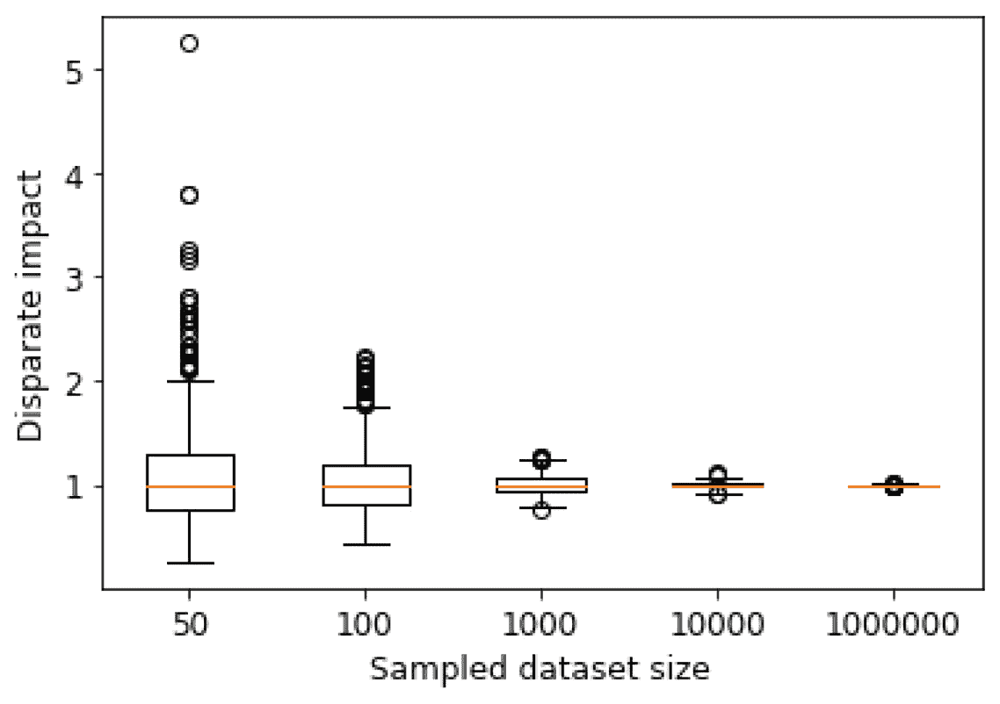
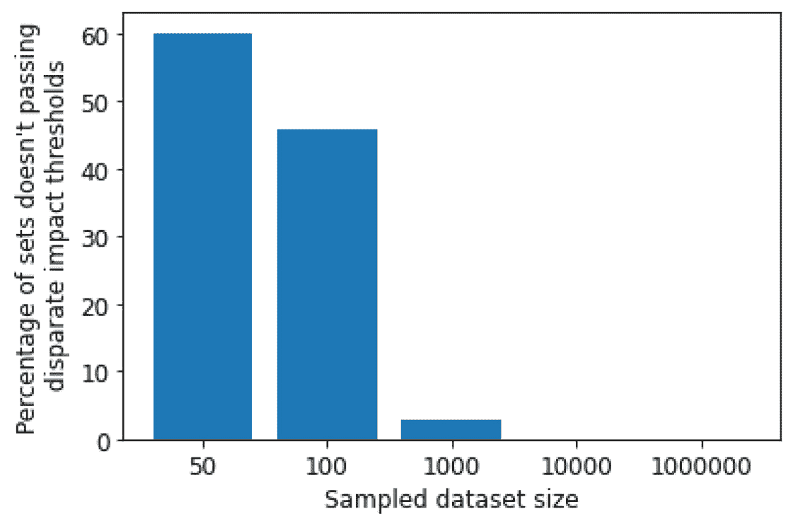
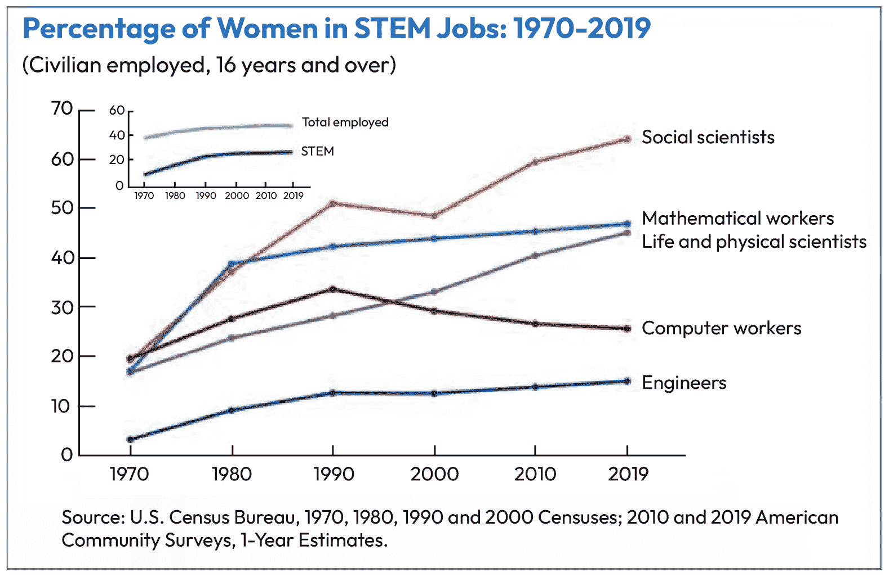
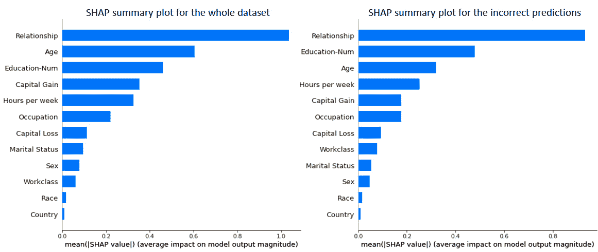
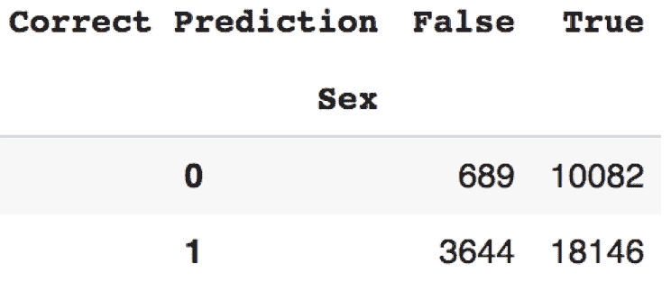
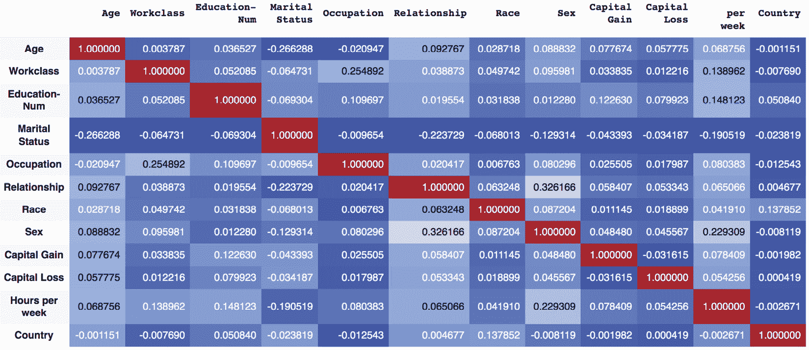
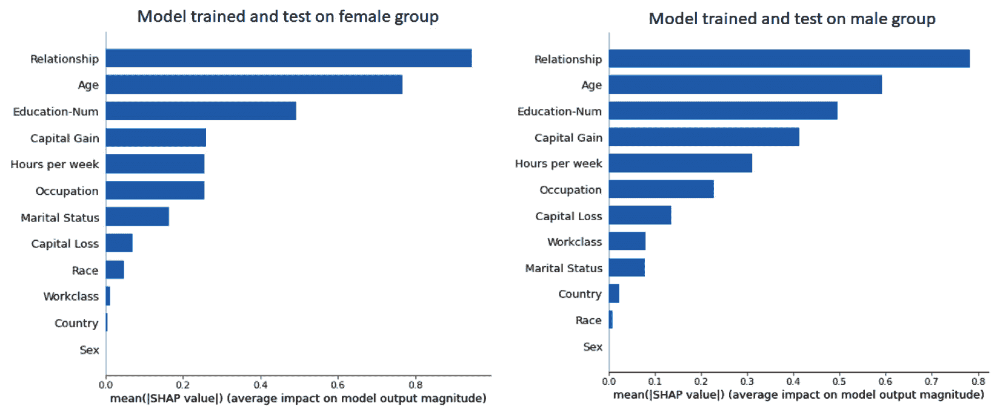
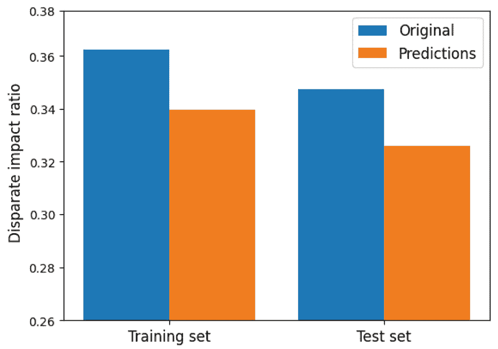
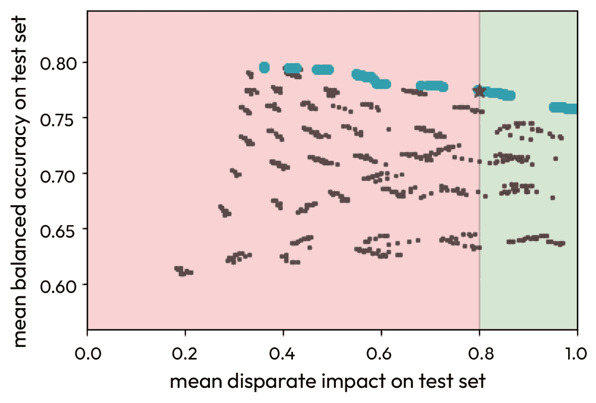

# 7

# 降低偏见和实现公平性

当使用机器学习跨越不同行业时，公平性是一个重要的话题，正如我们在*第三章*，“向负责任的人工智能调试”中讨论的那样。在本章中，我们将向您提供一些在机器学习环境中广泛使用的公平性概念和定义，以及如何使用旨在不仅帮助您评估模型中的公平性，而且在此方面改进它们的公平性和可解释性 Python 库。

本章包含许多图表和代码示例，以帮助您更好地理解这些概念，并在项目中开始从中受益。请注意，一个章节远远不足以使您成为公平性主题的专家，但本章将为您提供开始在实际项目中实践这一主题所需的知识和工具。您可以通过使用更多致力于机器学习公平性的高级资源来了解更多关于这个主题的信息。

在本章中，我们将涵盖以下主题：

+   机器学习建模中的公平性

+   偏见的来源

+   使用可解释性技术

+   Python 中的公平性评估和改进

到本章结束时，您将了解一些技术细节和 Python 工具，您可以使用它们来评估模型的公平性并减少偏见。您还将了解如何从您在*第六章*，“机器学习建模中的可解释性和可解释性”中学习的机器学习可解释性技术中受益。

# 技术要求

以下要求应在本章中考虑，因为它们将帮助您更好地理解概念，在项目中使用它们，并使用提供的代码进行实践：

+   Python 库要求：

    +   `sklearn` >= 1.2.2

    +   `numpy` >= 1.22.4

    +   `pytest` >= 7.2.2

    +   `shap` >= 0.41.0

    +   `aif360` >= 0.5.0

    +   `fairlearn` >= 0.8.0

+   对上一章中讨论的机器学习可解释性概念的基本了解

您可以在 GitHub 上找到本章的代码文件，网址为[`github.com/PacktPublishing/Debugging-Machine-Learning-Models-with-Python/tree/main/Chapter07`](https://github.com/PacktPublishing/Debugging-Machine-Learning-Models-with-Python/tree/main/Chapter07)。

# 机器学习建模中的公平性

要评估公平性，我们需要在心中考虑特定的因素，然后使用适当的指标来量化模型中的公平性。*表 7.1*为您提供了评估或实现机器学习建模中公平性的考虑因素、定义和方法的示例。我们将讨论**人口统计学平等**、**机会均等**或**均衡机会**和**机会平等**的数学定义，作为不同的群体公平性定义。群体公平性定义确保具有共同属性和特征的人群群体的公平性，而不是个人：

| **机器学习公平主题** | **描述** |
| --- | --- |
| 人口统计学平等 | 确保预测不依赖于给定的敏感属性，例如种族、性别或种族 |
| 概率平等 | 确保预测对给定敏感属性的独立性，例如在给定真实输出时对种族、性别或种族的独立性 |
| 机会平等 | 确保为个人或人群提供的平等机会 |
| 个人公平 | 确保对个人而不是具有共同属性的群体公平 |
| 一致性 | 不仅在相似的数据点或用户之间，而且在时间上提供决策的一致性 |
| 通过无意识实现公平 | 如果你在决策过程中不知道敏感属性，则可以实现公平 |
| 通过透明度实现公平 | 通过透明度和通过可解释性建立信任来提高公平性 |

表 7.1 – 机器学习和人工智能中关于公平性的重要主题和考虑因素

人口统计学平等是一个群体公平定义，确保模型预测不依赖于给定的敏感属性，例如种族或性别。从数学上讲，我们可以将其定义为预测类别的概率相等，例如 C i，对于给定属性的各个群体，如下所示：

P(C = C i|G = g 1) = P(C = C i|G = g 2)

为了更好地理解人口统计学平等的含义，我们可以考虑以下例子，这些例子符合人口统计学平等的公平性：

+   在 COMPAS 中每个种族群体中拒绝保释的百分比相同。我们已在*第三章*中介绍了 COMPAS，*向负责任的 AI 调试*。

+   男女贷款申请的接受率相同。

+   贫富社区之间住院的可能性相同。我们已在*第三章*中详细介绍了这个问题，*向负责任的 AI 调试*。

**差异影响比率**（**DIR**）是一个衡量基于人口统计学平等差异的指标：

DIR =  P(C = 1|G = g 1)  _____________  P(C = 1|G = g 2)

DIR 值范围是[0, ∞)，其中 1 的值满足人口统计学平等，而向更高或更低值的偏差则表示根据此定义的公平性偏差。大于和小于 1 的 DIR 值分别被称为正偏差和负偏差，考虑到我们在分子中使用的群体。

尽管人口统计学上的平等在公平性中很重要，但它有其局限性。例如，在数据本身中的 DIR（即不同群体之间类别普遍性的差异）的情况下，一个完美的模型将不会满足人口统计学上的平等标准。此外，它也不反映每个群体的预测质量。其他定义有助于我们改进公平性评估。机会平等或均衡机会是一个这样的定义。当给定预测与给定敏感属性所属的群体以及真实输出无关时，均衡机会得到满足：

P( ˆ y |y, G = g 1) = P( ˆ y |y, G = g 2) = P( ˆ y |y)

机会平等的定义与均衡机会非常相似，它评估预测与给定真实输出相关的群体的独立性。但机会平等专注于特定的真实值标签。通常，正类被认为是目标类，代表为个人提供机会，例如入学或高薪。以下是机会平等的公式：

P( ˆ y |y = 1, G = g 1) = P( ˆ y |y = 1, G = g 2) = P( ˆ y |y = 1)

根据这些公平性的概念，每个概念都可能给出不同的结果。你需要考虑不同概念之间的差异，以免基于一个或另一个定义泛化公平性。

## 敏感变量的代理

在评估机器学习模型中的公平性时，一个挑战是存在敏感属性（如性别和种族）的代理。这些代理可能是生成模型输出的主要贡献者，并可能导致我们的模型对特定群体产生偏差。然而，我们不能简单地移除它们，因为这可能会对性能产生重大影响。*表 7.2*提供了这些代理的示例，针对不同的敏感属性：

| **敏感变量** | **示例代理** |
| --- | --- |
| 性别 | 教育水平、工资和收入（在某些国家），职业，犯罪指控历史，用户生成内容中的关键词（例如，在简历或社交媒体中），作为大学教职员工 |
| 种族 | 犯罪指控历史、用户生成内容中的关键词（例如，在简历或社交媒体中）、ZIP 或邮政编码 |
| 残疾 | 行走速度、眼动、身体姿势 |
| 婚姻状况 | 教育水平、工资和收入（在某些国家），以及房屋大小和卧室数量 |
| 年龄 | 姿势和用户生成内容中的关键词（例如，在简历或社交媒体中） |

表 7.2 – 在公平性的背景下，一些重要敏感变量的代理示例（Caton 和 Haas，2020）

现在你已经了解了公平性的重要性以及这个主题下的一些重要定义，让我们回顾一下可能产生偏差的来源，这些偏差可能会阻碍你在模型中实现公平性的目标。

# 偏差的来源

机器学习生命周期中存在不同的偏差来源。偏差可能存在于收集的数据中，在数据子采样、清理和过滤中引入，或者在模型训练和选择中。在这里，我们将回顾这些来源的例子，以帮助您更好地理解如何在机器学习项目的整个生命周期中避免或检测此类偏差。

## 数据生成和收集中引入的偏差

我们输入到模型中的数据可能默认就有偏差，甚至在建模开始之前。我们在这里想要回顾的第一个这种偏差的来源是数据集大小的问题。将数据集视为更大人群的一个样本——例如，100 名学生的调查或 200 名银行客户的贷款申请信息。这些数据集的小规模可能会增加偏差的机会。让我们用一个简单的随机数据生成来模拟这一点。我们将编写一个函数，使用`np.random.randint()`生成两个随机二进制值的向量，然后计算两个 0 和 1 组之间的*DIR*：

```py
np.random.seed(42)def disparate_impact_randomsample(sample_size,
    sampling_num = 100): disparate_impact = []
    for sam_iter in range(0, sampling_num):
        # generating random array of 0 and 1 as two groups with different priviledges (e.g. male versus female)
        group_category = np.random.randint(2,
            size=sample_size)
    # generating random array of 0 and 1 as the output labels (e.g. accepted for loan or not)
    output_labels = np.random.randint(2, size=sample_size)
    group0_label1 = [iter for iter in range(0, len(
        group_category)) if group_category[iter] == 0 
        and output_labels[iter] == 1]
    group1_label1 = [iter for iter in range(0, len(
        group_category)) if group_category[iter] == 1 and 
        output_labels[iter] == 1]
    # calculating disparate impact 
    disparate_impact.append(len
        (group1_label1)/len(group0_label1))
    return disparate_impact
```

现在，让我们使用这个函数来计算 1,000 个不同规模的不同组别的 DIR，包括`50`、`100`、`1000`、`10000`和`1000000`个数据点：

```py
sample_size_list = [50, 100, 1000, 10000, 1000000]disparate_impact_list = []
for sample_size_iter in sample_size_list:
    disparate_impact_list.append(
        disparate_impact_randomsample(
            sample_size = sample_size_iter,
            sampling_num = 1000))
```

以下箱线图显示了不同样本规模下*DIR*的分布。你可以看到，较小的样本规模具有更宽的分布，覆盖了非常低或高的*DIR*值，远离理想的 1 值：



图 7.1 – 不同采样规模下的 DIR 分布

我们还可以计算不同规模样本组的百分比，这些组没有通过特定的阈值，例如>=0.8 和<=1.2。*图 7.2*显示，较高的数据集规模导致具有正或负偏差的数据集的机会降低：



图 7.2 – 未通过 DIR 阈值的样本集百分比

数据集中现有偏差的来源可能不仅仅是小样本大小的产物。例如，如果你要训练一个模型来预测个人是否会进入 STEM 领域，STEM 是科学、技术、工程和数学领域的缩写，那么你必须考虑这样一个现实：在工程等领域的相应数据中，男性相对于女性的存在是不平衡的，甚至直到最近（*图 7.3*）：



图 7.3 – 1970 年至 2019 年间 STEM 职业中女性的百分比

多年来，工程师中女性比例不到 20%，这可能是由于她们对这一领域的兴趣较低、招聘过程中的偏见，或是社会中的刻板印象，这导致了该领域工作者数据中的偏见。如果数据处理的建模任务中不公平，可能会导致预测男性进入 STEM 领域的可能性高于女性，尽管她们拥有才能、知识和经验。

数据中还存在另一类内在偏见，尽管在开发机器学习模型时需要考虑它。例如，不到 1%的乳腺癌病例发生在男性身上([www.breastcancer.org](https://www.breastcancer.org))。男性和女性之间这种患病率的差异并非由数据生成或收集中的任何偏见，或社会存在的偏见所导致。这是男性和女性乳腺癌发生率的自然差异。但如果负责开发用于诊断乳腺癌的机器学习模型，男性可能会出现较高的假阴性率（即未诊断出乳腺癌）。如果你的模型没有考虑到女性比男性高得多的患病率，那么它将不是一个对男性公平的乳腺癌诊断模型。这是一个高级示例，用于阐明这类偏见。在构建用于癌症诊断的机器学习工具时，还有许多其他需要考虑的因素。

## 模型训练和测试中的偏见

如果数据集在男性或女性、不同种族或其他敏感属性方面存在高度不平衡，我们的模型可能会因为相应的机器学习算法在预测数据点结果时使用特征的方式而产生偏见。例如，我们的模型可能会高度依赖敏感属性或它们的代理（*表 7.2*）。这是模型选择过程中的一个重要考虑因素。在模型选择过程中，我们需要从训练的模型中选择一个，使用不同的方法或同一方法的超参数，以进行进一步的测试或生产。如果我们仅基于性能做出决定，那么我们可能会选择一个不公平的模型。如果我们有敏感属性，并且这些模型将直接或间接影响不同群体的人，那么在模型选择过程中，我们需要同时考虑公平性和性能。

## 生产中的偏见

由于训练、测试和生产阶段数据分布的不同，生产过程中可能会出现偏见和不公平现象。例如，在生产和测试数据中不存在的性别差异可能会在生产的某个阶段出现。这种情况可能导致在生命周期早期阶段无法检测到的生产偏见。我们将在*第十一章*中更详细地讨论这类差异，*避免和检测数据与概念漂移*。

本章的下一步是开始练习使用帮助你在检测和消除模型偏差方面的技术和 Python 库。首先，我们将练习使用在*第六章*中介绍的*机器学习建模中的可解释性和可解释性技术*。

# 使用可解释性技术

我们可以使用可解释性技术来识别我们模型中的潜在偏差，然后计划改进它们以实现公平性。在这里，我们想通过 SHAP 练习这个概念，并识别我们在上一章练习的成人收入数据集中男性和女性群体之间的公平性问题。使用我们在上一章为成人收入数据训练的 XGBoost 模型构建的相同的 SHAP 解释器对象，在下面的条形图中，我们可以看到，关于整个数据集或仅错误预测的数据点，对*性别*的依赖性很低，但并非微不足道：



图 7.4 – 整个成人收入数据集和错误预测数据点的 SHAP 摘要图

现在，我们可以提取每个性别群体中误分类数据点的比例，如下所示：

```py
X_WithPred.groupby(['Sex', 'Correct Prediction']).size().unstack(fill_value=0)
```

这将产生以下结果：



图 7.5 – 正确和错误预测中男性和女性的数量

在这里，我们分别有女性和男性群体的 6.83%和 20.08%的误分类百分比。测试集中仅针对男性和女性群体的模型预测的 ROC-AUC 分别为 0.90 和 0.94。

你可以考虑将识别特征之间的相关性作为一种识别代理和潜在去除模型中偏差的方法。以下代码和热图（*图 7.6*）显示了该数据集特征之间的相关性：

```py
corr_features = X.corr()corr_features.style.background_gradient(cmap='coolwarm')
```

输出将如下所示：



图 7.6 – 成人收入数据集特征之间的相关性 DataFrame

然而，使用这种相关性分析作为处理代理识别问题或甚至用于过滤特征以提高性能的方法存在缺点。以下是其中两个缺点：

+   你需要考虑每对特征适当的关联度量。例如，*皮尔逊*相关不能用于所有特征对，因为每对数据的分布必须满足该方法的使用假设。两个变量都需要遵循正态分布，数据不应有任何异常值，这是*皮尔逊*相关适当使用时的两个假设之一。这意味着为了正确使用特征相关性分析方法，你需要使用适当的关联度量来比较特征。非参数统计度量，如*斯皮尔曼*等级相关，可能更适合，因为在使用不同变量对时，其背后的假设较少。

+   并非所有数值都有相同的意义。一些特征是分类的，并且通过不同的方法被转换成数值特征。性别就是这些特征之一。0 和 1 的值可以用来表示女性和男性群体，但它们在数值特征（如年龄或薪水）中没有任何数值意义。

可解释性技术如 SHAP 会告诉你关于敏感属性及其对数据点结果贡献的依赖关系。然而，默认情况下，它们并不提供改进模型公平性的方法。在这个例子中，我们可以尝试将数据分割成男性和女性群体进行训练和测试。以下代码展示了针对女性群体的这种方法。同样，你可以通过使用“性别”特征的`1`来分离训练和测试输入输出数据，为男性群体重复此操作。为男性和女性群体分别构建的模型分别得到了 0.90 和 0.93 的 ROC-AUC 值，这几乎与分组分离的性能相同：

```py
X_train = X_train.reset_index(drop=True)X_test = X_test.reset_index(drop=True)
# training a model only for female category (Sex category of 0 in this dataset)
X_train_only0 = X_train[X_train['Sex'] == 0]
X_test_only0 = X_test[X_test['Sex'] == 0]
X_only0 = X[X['Sex'] == 0]
y_train_only0 = [y_train[iter] for iter in X_train.index[
    X_train['Sex'] == 0].tolist()]
y_test_only0 = [y_test[iter] for iter in X_test.index[
    X_test['Sex'] == 0].tolist()]
# initializing an XGboost model
xgb_model = xgboost.XGBClassifier(random_state=42)
# fitting the XGboost model with training data
xgb_model.fit(X_train_only0, y_train_only0)
# calculating roc-auc of predictions
print("ROC-AUC of predictions:
    {}".format(roc_auc_score(y_test_only0,
        xgb_model.predict_proba(X_test_only0)[:, 1])))
# generate the Tree explainer
explainer_xgb = shap.TreeExplainer(xgb_model)
# extract SHAP values from the explainer object
shap_values_xgb = explainer_xgb.shap_values(X_only0)
# create a SHAP beeswarm plot (i.e. SHAP summary plot)
shap.summary_plot(shap_values_xgb, X_only0,
    plot_type="bar")
```

我们没有从模型中移除“性别”特征。这个特征不能对模型的性能做出贡献，因为每个模型的数据点中这个特征的值没有差异。这也在条形图中通过零 Shapely 值得到了体现：



图 7.7 – 分别在女性和男性群体上训练和测试的模型的 SHAP 摘要图

根据敏感属性分离群体的这种做法，尽管有时被视为一种选择，但并不是处理公平性问题的一个理想方式。它可能不是一个有效的办法，因为模型可能高度依赖于其他敏感特征。此外，我们无法根据数据集中所有敏感属性的组合将数据分割成小块。有一些公平性工具可以帮助你不仅评估公平性和检测偏差，还可以选择一个更好地满足公平性概念的模型。

除了用于可解释性的库之外，还有一些专门为机器学习建模中的公平性检测和改进设计的 Python 库，我们将在下一部分介绍。

# Python 中的公平性评估和改进

在评估模型公平性的 Python 库中，广泛使用的并不多（*表 7.3*）。您可以使用这些库来识别模型是否满足根据数据集中不同的敏感属性所定义的公平性：

| **库** | **导入和安装库名称** | **URL** |
| --- | --- | --- |
| IBM AI Fairness 360 | `aif360` | [`pypi.org/project/aif360/`](https://pypi.org/project/aif360/) |
| Fairlearn | `fairlearn` | [`pypi.org/project/fairlearn/`](https://pypi.org/project/fairlearn/) |
| 黑盒审计 | `BlackBoxAuditing` | [`pypi.org/project/BlackBoxAuditing/`](https://pypi.org/project/BlackBoxAuditing/) |
| Aequitas | `aequitas` | [`pypi.org/project/aequitas/`](https://pypi.org/project/aequitas/) |
| 负责任 AI 工具箱 | `responsibleai` | [`pypi.org/project/responsibleai/`](https://pypi.org/project/responsibleai/) |
| 负责任地 | `responsibly` | [`pypi.org/project/responsibly/`](https://pypi.org/project/responsibly/) |
| Amazon Sagemaker Clarify | `smclarify` | [`pypi.org/project/smclarify/`](https://pypi.org/project/smclarify/) |
| 公平感知机器学习 | `fairness` | [`pypi.org/project/fairness/`](https://pypi.org/project/fairness/) |
| 偏差校正 | `biascorrection` | [`pypi.org/project/biascorrection/`](https://pypi.org/project/biascorrection/) |

表 7.3 – 具有机器学习公平性可用功能的 Python 库或存储库

首先，让我们加载成人收入数据集，在导入所需的库之后，并准备训练和测试集，如下所示：

```py
# loading UCI adult income dataset# classification task to predict if people made over $50k in the 90s or not
X,y = shap.datasets.adult()
# split the data to train and test sets
X_train, X_test, y_train, y_test = train_test_split(
    X, y, test_size = 0.3, random_state=10)
# making a dataframe out of y values with "Sex" being their indices
y_train = pd.DataFrame({'label': y_train},
    index = X_train['Sex'])
y_test = pd.DataFrame({'label': y_test},
    index = X_test['Sex'])
```

现在，我们可以训练和测试一个 XGBoost 模型：

```py
xgb_model = xgboost.XGBClassifier(random_state=42)# fitting the XGboost model with training data
xgb_model.fit(X_train, y_train)
# calculating roc-auc of predictions
print("ROC-AUC of predictions:
    {}".format(roc_auc_score(y_test,
        xgb_model.predict_proba(X_test)[:, 1])))
# generating predictions for the test set
y_pred_train = xgb_model.predict(X_train)
y_pred_test = xgb_model.predict(X_test)
```

在这里，我们希望使用`aif360`根据`Sex`属性计算训练和测试数据中真实和预测结果的方向性指标（DIR）：

```py
# calculating disparate impact ratiodi_train_orig = disparate_impact_ratio(y_train,
    prot_attr='Sex', priv_group=1, pos_label=True)
di_test_orig = disparate_impact_ratio(y_test,
    prot_attr='Sex', priv_group=1, pos_label=True)
di_train = disparate_impact_ratio(y_train, y_pred_train,
    prot_attr='Sex', priv_group=1, pos_label=True)
di_test = disparate_impact_ratio(y_test, y_pred_test,
    prot_attr='Sex', priv_group=1, pos_label=True)
```

下面的分组条形图显示，预测在训练和测试集中使 DIR 变得更糟：



图 7.8 – 原始数据和预测输出的 DIR 比较

我们可以使用`aif360`来提高我们的模型向公平性发展。拒绝选项分类是一种后处理技术，在决策边界最高不确定性的置信区间内，对无特权群体给予有利结果，对特权群体给予不利结果（[`aif360.readthedocs.io/`](https://aif360.readthedocs.io/), Kamira 等，2012）。首先，让我们导入在 Python 中执行此操作所需的全部必要库和功能：

```py
# importing Reject option classification, a post processing technique that gives favorable outcomes to unprivileged groups and unfavourable outcomes to# privileged groups in a confidence band around the decision boundary
# with the highest uncertainty
from aif360.sklearn.postprocessing import RejectOptionClassifierCV
# importing PostProcessingMeta,  a meta-estimator which wraps a given
# estimator with a post-processing step.
# fetching adult dataset from aif360 library
X, y, sample_weight = fetch_adult()
X.index = pd.MultiIndex.from_arrays(X.index.codes,
    names=X.index.names)
y.index = pd.MultiIndex.from_arrays(y.index.codes,
    names=y.index.names)
y = pd.Series(y.factorize(sort=True)[0], index=y.index)
X = pd.get_dummies(X)
```

然后，我们可以使用 `RejectOptionClassifierCV()` 在 `aif360` 中可用的成人数据集上训练和验证一个随机森林分类器。我们之所以从 XGBoost 切换到随机森林，只是为了练习不同的模型。我们需要将一个初始的随机森林模型和 `RejectOptionClassifierCV()` 与 `PostProcessingMeta()` 对象拟合。在过程中，`'sex'` 被认为是敏感特征：

```py
metric = 'disparate_impact'ppm = PostProcessingMeta(RF(n_estimators = 10,
    random_state = 42),
    RejectOptionClassifierCV('sex', scoring=metric,
        step=0.02, n_jobs=-1))
ppm.fit(X, y)
```

然后，我们可以绘制平衡准确率和 *DIR* 在网格搜索中不同尝试的图表，以显示最佳选择的参数，这是 *图 7**.9* 中散点图中的星号点。蓝色点向您展示了平衡准确率和 *DIR* 之间的权衡的帕累托前沿：



图 7.9 – 网格搜索中平衡准确率与 DIR 的比较

如您所见，在这种情况下，性能和公平性之间存在权衡。但在这个例子中，性能降低不到 4% 就能将 *DIR* 从低于 0.4 提高到 0.8。

正如您在示例中看到的那样，我们可以使用 `aif360` 来评估公平性，并在性能损失很小的情况下提高我们模型的公平性。您可以使用 Python 中的其他库以类似的方式做到这一点。每个库都有其功能，用于机器学习建模中的公平性评估和改进的两个目标。

我们在本章中提供的内容只是机器学习公平性冰山的一角。但到目前为止，您已经准备好尝试不同的库和技术，并通过我们经历过的实践来了解它们。

# 摘要

在本章中，您学习了更多关于机器学习时代公平性的概念，以及评估公平性的指标、定义和挑战。我们讨论了诸如 *sex* 和 *race* 这样的敏感属性的示例代理。我们还讨论了可能的偏差来源，例如数据收集或模型训练。您还学习了如何使用 Python 库来评估模型的可解释性和公平性，以评估或改进您的模型，以及避免不仅不道德，而且可能对您的组织产生法律和财务后果的偏差。

在下一章中，您将学习测试驱动开发以及单元测试和差分测试等概念。我们还将讨论机器学习实验跟踪以及它在模型训练、测试和选择过程中如何帮助我们避免模型问题。

# 问题

1.  公平性是否只取决于可观察的特征？

1.  `'sex'` 的代理特征有哪些例子？

1.  如果一个模型根据人口统计学平等是公平的，那么根据其他公平性概念，如均衡机会，它是否也是公平的？

1.  作为两种公平性指标，人口统计学平等和均衡机会有何区别？

1.  如果您的模型中有一个 `'sex'` 特征，并且您的模型对它的依赖性较低，这意味着您的模型在不同性别群体中是公平的吗？

1.  你如何使用可解释性技术来评估你模型中的公平性？

# 参考文献

+   Barocas, Solon, Moritz Hardt 和 Arvind Narayanan. *机器学习中的公平性*. Nips 教程 1 (2017): 2017.

+   Mehrabi, Ninareh, 等人. *机器学习中的偏差与公平性调查*. ACM 计算机调查 (CSUR) 54.6 (2021): 1-35.

+   Caton, Simon 和 Christian Haas. *机器学习中的公平性：调查*. arXiv 预印本 arXiv:2010.04053 (2020).

+   Pessach, Dana 和 Erez Shmueli. *机器学习中的公平性综述*. ACM 计算机调查 (CSUR) 55.3 (2022): 1-44.

+   Lechner, Tosca, 等人. *公平表示的不可能性结果*. arXiv 预印本 arXiv:2107.03483 (2021).

+   McCalman, Lachlan, 等人. *评估金融中的 AI 公平性*. 计算机 55.1 (2022): 94-97.

+   F. Kamiran, A. Karim 和 X. Zhang，*歧视感知分类的决策理论*. 国际数据挖掘会议，2012.

# 第三部分：低错误机器学习开发和部署

在本书的这一部分，我们将提供确保机器学习模型稳健性和可靠性的基本实践，尤其是在生产环境中。我们将从采用测试驱动开发开始，说明它在模型开发过程中降低风险的关键作用。随后，我们将深入研究测试技术和模型监控的重要性，确保我们的模型在部署后仍保持可靠性。然后，我们将解释通过代码、数据和模型版本化实现机器学习可重复性的技术和挑战。最后，我们将讨论数据漂移和概念漂移的挑战，以确保在生产中有可靠的模型。

本部分包含以下章节：

+   *第八章*, *使用测试驱动开发控制风险*

+   *第九章*, *生产环境下的测试和调试*

+   *第十章*, *版本控制和可重复的机器学习建模*

+   *第十一章*, *避免和检测数据及概念漂移*
