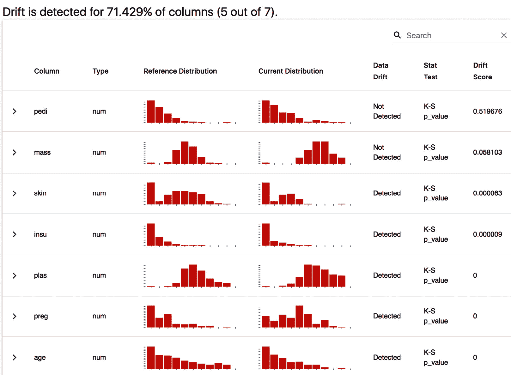
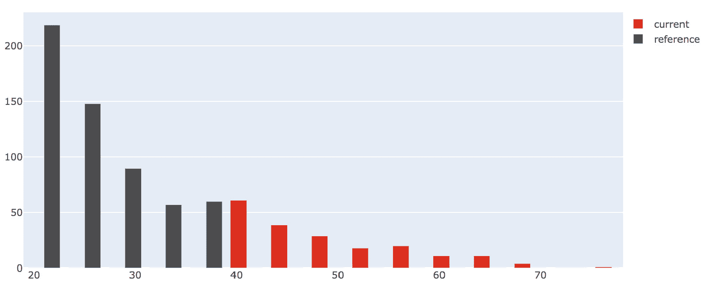

# 避免和检测数据和相关漂移

我们在*第九章* *生产测试和调试*中讨论了数据和相关漂移在机器学习建模中的影响。在本章中，我们想要更深入地探讨这些概念，并在 Python 中练习检测漂移。

在这里，你将了解我们之前介绍的概念的重要性，例如模型版本控制和模型监控，以避免漂移，并练习使用一些用于漂移检测的 Python 库。

在本章中，我们将涵盖以下主题：

+   避免模型中的漂移

+   漂移检测

到本章结束时，你将能够在 Python 中检测你的机器学习模型中的漂移，并在生产中拥有可靠的模型。

# 技术要求

以下要求适用于本章，因为它们有助于你更好地理解这些概念，让你能够在项目中使用它们，并使用提供的代码进行练习：

+   Python 库需求如下：

    +   `sklearn` >= 1.2.2

    +   `numpy` >= 1.22.4

    +   `pandas` >= 1.4.4

    +   `alibi_detect` >= 0.11.1

    +   `lightgbm` >= 3.3.5

    +   `evidently` >= 0.2.8

+   需要理解以下内容：

    +   数据和相关漂移

    +   数据和模型版本控制

你可以在 GitHub 上找到本章的代码文件：[`github.com/PacktPublishing/Debugging-Machine-Learning-Models-with-Python/tree/main/Chapter11`](https://github.com/PacktPublishing/Debugging-Machine-Learning-Models-with-Python/tree/main/Chapter11)。

# 避免模型中的漂移

数据和相关漂移挑战了机器学习模型在生产中的可靠性。我们机器学习项目中的漂移可能具有不同的特征。以下是一些可以帮助你在项目中检测漂移并计划解决它们的特征：

+   **幅度**：我们可能会面对数据分布中的差异幅度，导致我们的机器学习模型发生漂移。数据分布中的小变化可能难以检测，而大变化可能更明显。

+   **频率**：漂移可能以不同的频率发生。

+   **渐进与突然**：数据漂移可能逐渐发生，数据分布的变化在时间上缓慢发生，或者可能突然发生，变化快速且出乎意料。

+   **可预测性**：某些类型的漂移可能是可预测的，例如季节性变化或由于外部事件引起的变化。其他类型的漂移可能是不可预测的，例如消费者行为或市场趋势的突然变化。

+   **意图性**：漂移可能是故意的，例如对数据生成过程所做的更改，或者无意的，例如随着时间的推移自然发生的变化。

我们需要使用帮助我们在机器学习建模项目中避免漂移发生和累积的技术和实践。

## 避免数据漂移

在机器学习生命周期的不同阶段访问我们模型的不同数据版本可以帮助我们通过比较训练和生产的数据、评估预处理数据处理或识别可能导致漂移的数据选择标准来更好地检测漂移。模型监控还有助于我们尽早识别漂移并避免累积。

让我们通过简单地检查用于模型训练的数据版本之间的特征分布的均值，以及生产中的新数据来练习漂移监控。我们首先定义一个用于监控数据漂移的类。在这里，我们假设如果两个数据版本之间的分布均值之差大于 0.1，则认为特征发生了漂移：

```py
class DataDriftMonitor:    def __init__(self, baseline_data: np.array,
        threshold_mean: float = 0.1):
            self.baseline = self.calculate_statistics(
                baseline_data)
            self.threshold_mean = threshold_mean
    def calculate_statistics(self, data: np.array):
        return np.mean(data, axis=0)
    def assess_drift(self, current_data: np.array):
        current_stats = self.calculate_statistics(
            current_data)
        drift_detected = False
        for feature in range(0, len(current_stats)):
            baseline_stat = self.baseline[feature]
            current_stat = current_stats[feature]
            if np.abs(current_stat - baseline_stat) > self.threshold_mean:
                drift_detected = True
                print('Feature id with drift:
                    {}'.format(feature))
                print('Mean of original distribution:
                    {}'.format(baseline_stat))
                print('Mean of new distribution:
                    {}'.format(current_stat))
                break
        return drift_detected
```

然后，我们使用它来识别两个合成数据集之间的漂移：

```py
np.random.seed(23)# Generating a synthetic dataset, as the original data, with 100 datapoints and 5 features
# from a normal distribution centered around 0 with std of 1
baseline_data = np.random.normal(loc=0, scale=1,
    size=(100, 5))
# Create a DataDriftMonitor instance
monitor = DataDriftMonitor(baseline_data,
    threshold_mean=0.1)
# Generating a synthetic dataset, as the original data, with 100 datapoints and 5 features from a normal distribution #centered around 0.2 with std of 1
current_data = np.random.normal(loc=0.15, scale=1,
    size=(100, 5))
# Assess data drift
drift_detected = monitor.assess_drift(current_data)
if drift_detected:
    print("Data drift detected.")
else:
    print("No data drift detected.")
```

这会产生以下结果：

```py
Feature id with drift: 1Mean of original distribution: -0.09990597519469419
Mean of new distribution: 0.09662442557421645
Data drift detected.
```

## 应对概念漂移

我们可以同样定义具有检测概念漂移标准的类和函数，就像我们练习数据漂移检测那样。但我们还可以检查，无论是通过编程还是作为将我们的机器学习模型投入生产时的质量保证的一部分，外部因素可能导致的漂移，例如环境因素、机构或政府政策的变更等。除了监控数据外，我们还可以从特征工程中受益，选择对概念漂移更鲁棒的特征，或者使用动态适应概念漂移的集成模型。

虽然在我们的模型中避免漂移是理想的，但在实践中我们需要准备好检测和消除它。接下来，你将学习检测模型中漂移的技术。从实际的角度来看，避免和检测模型中的漂移非常相似。但比简单地检查特征分布的均值（如我们在本节中用于避免数据漂移）更好的技术，我们将在下一节中练习。

# 检测漂移

在所有模型中完全避免漂移是不可能的，但我们可以努力尽早检测并消除它们。在这里，我们将通过在 Python 中使用`alibi_detect`和`evidently`来练习漂移检测。

## 使用 alibi_detect 进行漂移检测的练习

我们想要练习的广泛使用的 Python 库之一是`alibi_detect`。我们首先导入必要的 Python 函数和类，并使用`scikit-learn`中的`make_classification`生成一个具有 10 个特征和 10,000 个样本的合成数据集：

```py
import numpy as npimport pandas as pd
import lightgbm as lgb
from alibi_detect.cd import KSDrift
from sklearn.datasets import make_classification
from sklearn.model_selection import train_test_split
from sklearn.metrics import balanced_accuracy_score as bacc
# Generate synthetic data
X, y = make_classification(n_samples=10000, n_features=10,
    n_classes=2, random_state=42)
```

然后，我们将数据分为训练集和测试集：

```py
# Split into train and test setsX_train, X_test, y_train, y_test = train_test_split(X, y,
    test_size=0.2, random_state=42)
```

然后，我们在训练数据上训练一个`LightGBM`分类器：

```py
train_data = lgb.Dataset(X_train, label=y_train)params = {
    "objective": "binary",
    "metric": "binary_logloss",
    "boosting_type": "gbdt"
}
clf = lgb.train(train_set = train_data, params = params,
    num_boost_round=100)
```

现在，我们评估模型在测试集上的性能，并定义一个用于漂移检测的测试标签 DataFrame：

```py
# Predict on the test sety_pred = clf.predict(X_test)
y_pred = [1 if iter > 0.5 else 0 for iter in y_pred]
# Calculate the balanced accuracy of the predictions
balanced_accuracy = bacc(y_test, y_pred)
print('Balanced accuracy on the synthetic test set:
    {}'.format(balanced_accuracy))
# Create a DataFrame from the test data and predictions
df = pd.DataFrame(X_test,
    columns=[f"feature_{i}" for i in range(10)])
df["actual"] = y_test
df["predicted"] = y_pred
```

现在，我们使用测试数据点的预测和实际标签定义的 DataFrame 来检测漂移。我们从 `alibi_detect` 包初始化 `KSDrift` 检测器并将其拟合到训练数据上。我们使用检测器的 `predict` 方法在测试数据上计算漂移分数和 p 值。漂移分数表示每个特征的漂移水平，而 p 值表示漂移的统计显著性。如果任何漂移分数或 p 值超过某个阈值，我们可能认为模型正在经历漂移，并采取适当的行动，例如使用更新后的数据重新训练模型：

```py
# Initialize the KSDrift detectordrift_detector = KSDrift(X_train)
# Calculate the drift scores and p-values
drift_scores = drift_detector.predict(X_test)
p_values = drift_detector.predict(X_test,
    return_p_val=True)
# Print the drift scores and p-values
print("Drift scores:")
print(drift_scores)
print("P-values:")
print(p_values)
```

这里是生成的漂移分数和 p 值。由于所有 p 值都大于 0.1，并且考虑到阈值是 0.005，我们可以说在这种情况下没有检测到漂移：

```py
Drift scores:{'data': {'is_drift': 0, 'distance': array([0.02825 , 0.024625, 0.0225  , 0.01275 , 0.014   , 0.017125,0.01775 , 0.015125, 0.021375, 0.014625], dtype=float32), 'p_val': array([0.15258548, 0.28180763, 0.38703775, 0.95421314, 0.907967 ,0.72927415, 0.68762517, 0.8520056 , 0.45154762, 0.87837887],dtype=float32), 'threshold': 0.005}, 'meta': {'name': 'KSDrift', 'online': False, 'data_type': None, 'version': '0.11.1', 'detector_type': 'drift'}}
P-values:
{'data': {'is_drift': 0, 'distance': array([0.02825 , 0.024625, 0.0225  , 0.01275 , 0.014   , 0.017125,0.01775 , 0.015125, 0.021375, 0.014625], dtype=float32), 'p_val': array([0.15258548, 0.28180763, 0.38703775, 0.95421314, 0.907967 ,0.72927415, 0.68762517, 0.8520056 , 0.45154762, 0.87837887],dtype=float32), 'threshold': 0.005}, 'meta': {'name': 'KSDrift', 'online': False, 'data_type': None, 'version': '0.11.1', 'detector_type': 'drift'}}
```

## 使用 `evidently` 进行漂移检测实践

另一个广泛使用的用于漂移检测的 Python 库，我们将在下面进行实践的是 `evidently`。在导入必要的库之后，我们从 `scikit-learn` 加载糖尿病数据集：

```py
import pandas as pdimport numpy as np
from sklearn import datasets
from evidently.report import Report
from evidently.metrics import DataDriftTable
from evidently.metrics import DatasetDriftMetric
diabetes_data = datasets.fetch_openml(name='diabetes',
    version=1, as_frame='auto')
diabetes = diabetes_data.frame
diabetes = diabetes.drop(['class', 'pres'], axis = 1)
```

以下表格显示了我们要从糖尿病数据集中用于漂移检测的特征及其含义：

| **特征** | **描述** |
| --- | --- |
| `preg` | 怀孕次数 |
| `plas` | 口服葡萄糖耐量测试 2 小时后的血浆葡萄糖浓度 |
| `skin` | 三角肌皮肤褶皱厚度（毫米） |
| `insu` | 2 小时血清胰岛素（微 U/ml） |
| `mass` | 体重指数（千克/(米)²) |
| `pedi` | 糖尿病家系函数 |
| `Age` | 年龄（年） |

表 11.1 – 用于漂移检测的糖尿病数据集中特征名称及其描述（Efron 等，2004）

我们将数据点分为两组，称为参考集和当前集，然后使用 `evidently.report.Reference` 集中的 `Report()` 生成漂移报告，包括所有年龄小于或等于 40 岁的个体，以及当前集包括数据集中年龄大于 40 岁的其他个体：

```py
diabetes_reference = diabetes[diabetes.age <= 40]diabetes_current = diabetes[diabetes.age > 40]
data_drift_dataset_report = Report(metrics=[
    DatasetDriftMetric(),
    DataDriftTable(),
])
data_drift_dataset_report.run(
    reference_data=diabetes_reference,
    current_data=diabetes_current)
Data_drift_dataset_report
```

以下插图是我们为糖尿病数据集生成的报告，考虑了所选特征和分离的参考和当前数据集：



图 11.1 – 糖尿病数据集中分离的参考和当前数据的漂移报告

我们可以看到，`age`、`preg`、`plas`、`insu`和`skin`是参考集和当前集中分布差异显著的特性，这些特性在*图 11.1*所示的报告中指定为检测到漂移的特征。尽管分布之间的差异很重要，但拥有如均值差异这样的补充统计数据可能有助于开发更可靠的漂移检测策略。我们还可以从报告中获取特征的分布，例如*图 11.2*和*11.3*中分别显示的`age`和`preg`在参考集和当前集中的分布：



图 11.2 – 当前和参考数据中 age 特征的分布


图 11.3 – 当前和参考数据中 preg 特征的分布

当我们在模型中检测到漂移时，我们可能需要通过摄取新数据或过滤可能引起漂移的部分数据来重新训练它们。如果检测到概念漂移，我们还可能需要更改模型训练。

# 摘要

在本章中，你了解了避免机器学习模型中漂移的重要性，以及如何通过使用你在前几章中学到的概念（如模型版本化和监控）来从中受益。你还练习了两个用于 Python 中漂移检测的库：`alibi_detect`和`evidently`。使用这些或类似的库将有助于你在模型中消除漂移，并在生产中拥有可靠的模型。

在下一章中，你将了解不同类型的深度神经网络模型以及如何使用 PyTorch 开发可靠的深度学习模型。

# 问题

1.  你能解释一下在机器学习建模中，漂移的两个特征——幅度和频率之间的区别吗？

1.  我们可以使用哪种统计测试来检测数据漂移？

# 参考文献

+   Ackerman, Samuel, 等人。“*检测影响机器学习模型性能随时间变化的数据漂移和异常值*。”arXiv 预印本 arXiv:2012.09258（2020）。

+   Ackerman, Samuel, 等人。“*自动检测机器学习分类器中的数据漂移*。”arXiv 预印本 arXiv:2111.05672（2021）。

+   Efron, Bradley, Trevor Hastie, Iain Johnstone, 和 Robert Tibshirani（2004）“*最小角度回归*，”统计年鉴（附带讨论），407-499

+   Gama, João, 等人。“*概念漂移适应的调查*。”ACM 计算调查（CSUR）46.4（2014）：1-37。

+   Lu, Jie, 等人。“*在概念漂移下的学习：综述*。”IEEE 知识数据工程杂志 31.12（2018）：2346-2363。

+   Mallick, Ankur, 等人。“*Matchmaker：在机器学习中为大规模系统减轻数据漂移*。”机器学习和系统会议论文集 4（2022）：77-94。

+   Zenisek, Jan, Florian Holzinger, 和 Michael Affenzeller. “*基于机器学习的概念漂移检测用于预测性维护*。” 计算机与工业工程 137 (2019): 106031。

# 第四部分：深度学习建模

在本书的这一部分，我们将通过介绍深度学习的底层理论来奠定基础，然后过渡到对全连接神经网络的动手探索。接着，我们将学习更高级的技术，包括卷积神经网络、转换器和图神经网络。在本部分的结尾，我们将聚焦于机器学习的尖端进展，特别关注生成建模，并介绍强化学习和自监督学习。在这些章节中，我们将通过 Python 和 PyTorch 提供实际示例，确保我们既获得理论知识，也获得实践经验。

本部分包含以下章节：

+   *第十二章*, *超越机器学习调试的深度学习*

+   *第十三章*, *高级深度学习技术*

+   *第十四章*, *机器学习最新进展简介*
