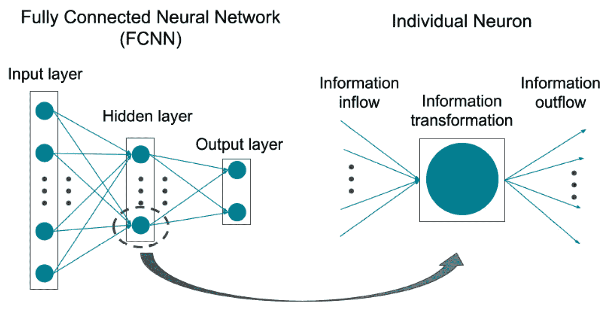
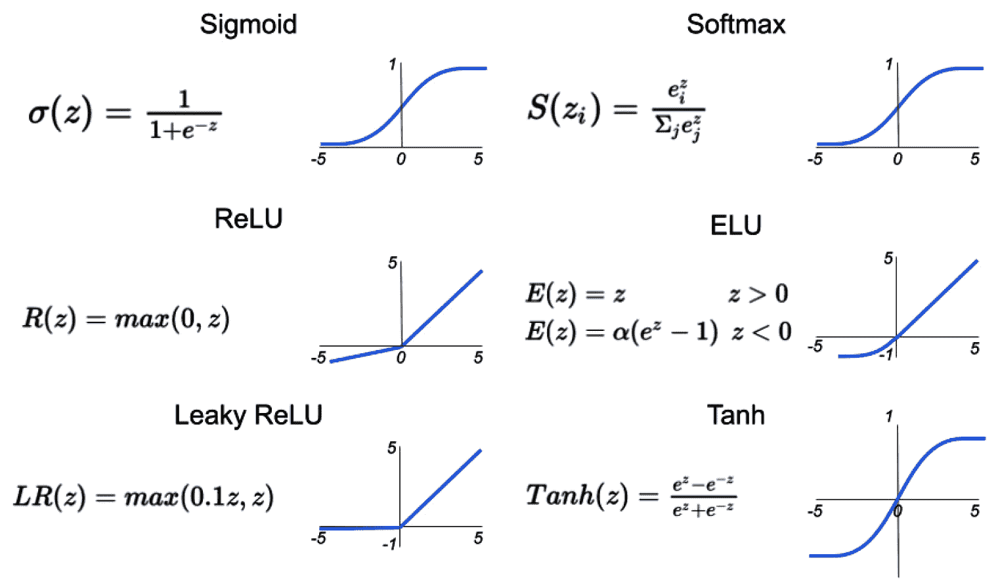
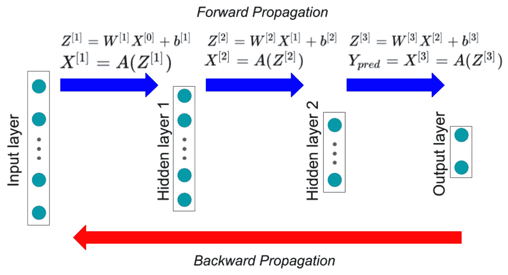
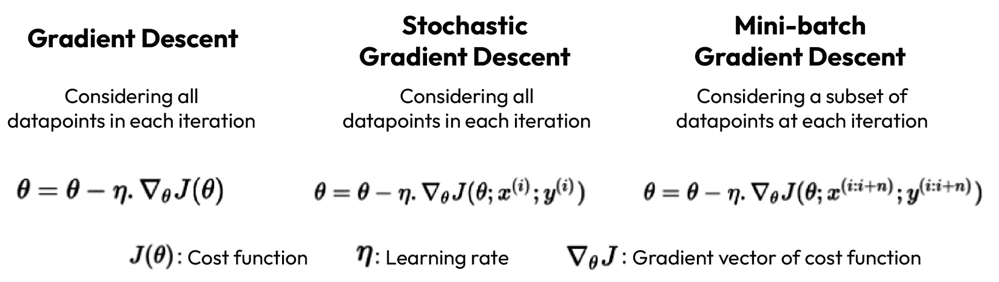

# 第十二章：深度学习超越机器学习调试

机器学习最新的进展是通过深度学习建模实现的。在本章中，我们将介绍深度学习以及 PyTorch 作为深度学习建模的框架。由于本书的重点不是详细介绍不同的机器学习和深度学习算法，我们将关注深度学习为你提供的机会，以开发高性能模型，或使用可用的模型，这些模型可以建立在本章和下一章回顾的技术之上。

本章将涵盖以下主题：

+   人工神经网络简介

+   神经网络建模框架

到本章结束时，你将了解深度学习的某些理论方面，重点关注全连接神经网络。你还将使用广泛使用的深度学习框架 PyTorch 进行实践。

# 技术要求

以下要求应考虑本章，因为它们将帮助你更好地理解概念，在项目中使用它们，并使用提供的代码进行实践：

+   Python 库要求：

    +   `torch` >= 2.0.0

    +   `torchvision` >= 0.15.1

+   你还需要了解不同类型机器学习模型之间的基本区别，例如分类、回归和聚类

你可以在 GitHub 上找到本章的代码文件，链接为[`github.com/PacktPublishing/Debugging-Machine-Learning-Models-with-Python/tree/main/Chapter12`](https://github.com/PacktPublishing/Debugging-Machine-Learning-Models-with-Python/tree/main/Chapter12)。

# 人工神经网络简介

我们的大脑神经网络作为决策系统工作，其中信息处理单元称为神经元，帮助我们识别朋友的面孔等。**人工神经网络**（**ANNs**）的工作原理类似。与我们的身体中存在一个庞大的神经元网络，负责所有决策（主动或被动）不同，ANNs 被设计为针对特定问题。例如，我们有用于图像分类、信用风险估计、目标检测等任务的 ANNs。为了简化，本书中将使用神经网络而不是 ANNs。

首先，我们想专注于**全连接神经网络**（**FCNNs**），它们在表格数据上工作（*图 12*）。在许多资源中，FCNNs 和**多层感知器**（**MLPs**）被互换使用。为了更好地比较不同类型的神经网络，本书中将使用 FCNNs 而不是 MLPs：



图 12.1 – FCNN 和单个神经元的示意图

用于监督学习的 FCNN 有一个输入、一个输出和一个或多个隐藏（中间）层。包含输入和输出层的监督模型中超过三层的神经网络称为深度神经网络，深度学习指的是使用这种网络进行建模（Hinton 和 Salakhutdinov，2006）。

输入层不过是用于建模的数据点的特征。输出层神经元的数量也是根据实际问题确定的。例如，在二元分类的情况下，输出层中的两个神经元代表两个类别。隐藏层的数量和大小是 FCNN 的超参数之一，可以通过优化来提高 FCNN 的性能。

FCNN 中的每个神经元接收来自前一层的神经元的加权输出值的总和，对接收到的值的总和应用线性或非线性变换，然后将结果值输出到下一层的其他神经元。每个神经元输入值计算中使用的权重是训练过程中的学习权重（参数）。非线性变换是通过预定的激活函数实现的（*图 12**.2*）。FCNN 以其在输入特征值和输出之间产生复杂非线性关系而闻名，这使得它们在确定（可能）输入和输出之间不同类型的关系时非常灵活。在 FCNN 中，应用于接收到的神经元信息的激活函数负责这种复杂性或灵活性：



图 12.2 – 神经网络建模中广泛使用的激活函数

这些激活函数，例如`sigmoid`和`softmax`函数，通常用于输出层，将输出神经元的分数转换为介于零和一之间的值，用于分类模型；这些被称为预测的概率。还有其他激活函数，如**高斯误差线性单元**（**GELU**）（Hendrycks 和 Gimpel，2016），这些在更近期的模型中如**生成预训练转换器**（**GPT**）中已被使用，这将在下一章中解释。以下是 GELU 的公式：

GELU(z) = 0.5z(1 + tanh(√ _  2 _ π  (z + 0.044715 z 3)))

监督学习有两个主要过程：预测输出和从预测的不正确性或正确性中学习。在全连接神经网络（FCNNs）中，预测发生在前向传播中。输入和第一个隐藏层之间的 FCNNs 的权重用于计算第一个隐藏层中神经元的输入值，以及其他 FCNN 中的层也是如此（*图 12*.3）。从输入到输出的过程称为前向传播或前向传递，它为每个数据点生成输出值（预测）。然后，在反向传播（反向传递）中，FCNN 使用预测输出及其与实际输出的差异来调整其权重，从而实现更好的预测：



图 12.3 – 分别用于输出预测和参数更新的前向传播和反向传播的示意图

神经网络的参数在训练过程中通过优化算法来确定。现在，我们将回顾一些在神经网络设置中广泛使用的优化算法。

## 优化算法

优化算法在幕后工作，试图最小化损失函数以识别训练机器学习模型时的最佳参数。在训练过程的每一步，优化算法决定如何更新神经网络中的每个权重或参数，或其他机器学习模型。大多数优化算法依赖于成本函数的梯度向量来更新权重。主要区别在于如何使用梯度向量以及使用哪些数据点来计算它。

在梯度下降中，所有数据点都用于计算成本函数的梯度；然后，模型的权重在成本最大减少的方向上更新。尽管这种方法对于小数据集是有效的，但它可能变得计算成本高昂，不适用于大数据集，因为对于学习的每一次迭代，都需要同时计算所有数据点的成本。另一种方法是**随机梯度下降**（**SGD**）；在每次迭代中，不是所有数据点，而是选择一个数据点来计算成本和更新权重。但每次只使用一个数据点会导致权重更新时出现高度振荡的行为。相反，我们可以使用迷你批梯度下降，这在教程和工具中通常被称为 SGD，其中不是每个迭代中所有数据点或仅一个，而是使用一批数据点来更新权重。这些三种方法背后的数学原理在*图 12*.4 中展示：



图 12.4 – 梯度下降、随机梯度下降和小批量梯度下降优化算法

近年来，已经提出了其他优化算法来提高神经网络模型在各种应用中的性能，例如 Adam 优化器（Kingma 和 Ba，2014）。这种方法的背后直觉是避免优化过程中的梯度消失。深入探讨不同优化算法的细节超出了本书的范围。

在神经网络建模中，有两个重要的术语你需要了解其定义：*epoch* 和 *batch size*。当使用不同的框架训练神经网络模型时，我们将在下一节中回顾，你需要指定 *batch size* 和 *epoch* 的数量。在优化的每一次迭代中，数据点的一个子集，或者说是小批量梯度下降中的小批量（如图 12.4*），被用来计算损失；然后，使用反向传播更新模型的参数。这个过程会重复进行，以覆盖训练数据中的所有数据点。Epoch 是我们在优化过程中用来指定所有训练数据被使用多少次的术语。例如，指定 5 个 epoch 意味着模型在优化过程中会使用训练过程中的所有数据点五次。

现在你已经了解了神经网络建模的基础知识，我们将介绍用于神经网络建模的框架。

# 神经网络建模框架

已有多个框架被用于神经网络建模：

+   PyTorch ([`pytorch.org/`](https://pytorch.org/))

+   TensorFlow ([`www.tensorflow.org/learn`](https://www.tensorflow.org/learn))

+   Keras ([`keras.io/`](https://keras.io/))

+   Caffe ([`caffe.berkeleyvision.org/`](https://caffe.berkeleyvision.org/))

+   MXNet ([`mxnet.apache.org/versions/1.9.1/`](https://mxnet.apache.org/versions/1.9.1/))

在本书中，我们将专注于 PyTorch 来实践深度学习，但我们介绍的概念与你在项目中使用的框架无关。

## 用于深度学习建模的 PyTorch

PyTorch 是一个开源的深度学习框架，基于 Meta AI 开发的 `Torch` 库。你可以在深度学习项目中轻松地将 PyTorch 与 Python 的科学计算库集成。在这里，我们将通过查看使用 MNIST 数字数据集构建 FCNN 模型的一个简单示例来练习使用 PyTorch。这是一个常用的示例，其目标仅仅是理解如果你没有相关经验，如何使用 PyTorch 训练和测试深度学习模型。

首先，我们将导入所需的库并加载用于训练和测试的数据集：

```py
import torchimport torchvision
import torchvision.transforms as transforms
torch.manual_seed(10)
# Device configuration
device = torch.device(
    'cuda' if torch.cuda.is_available() else 'cpu')
# MNIST dataset
batch_size = 100
train_dataset = torchvision.datasets.MNIST(
    root='../../data',train=True,
    transform=transforms.ToTensor(),download=True)
test_dataset = torchvision.datasets.MNIST(
    root='../../data', train=False,
    transform=transforms.ToTensor())
# Data loader
train_loader = torch.utils.data.DataLoader(
    dataset=train_dataset,batch_size=batch_size,
    shuffle=True)
test_loader = torch.utils.data.DataLoader(
    dataset=test_dataset,  batch_size=batch_size,
    shuffle=False)
```

接下来，我们将确定模型的超参数及其`input_size`，这是输入层中的神经元数量；这等同于我们数据中的特征数量。在这个例子中，它等于每张图像中的像素数，因为我们把每个像素视为一个特征来构建一个全连接神经网络（FCNN）模型：

```py
input_size = 784# size of hidden layer
hidden_size = 256
# number of classes
num_classes = 10
# number of epochs
num_epochs = 10
# learning rate for the optimization process
learning_rate = 0.001
```

然后，我们将导入`torch.nn`，从中我们可以为我们的 FCNN 模型添加线性神经网络层，并编写一个类来确定我们网络的架构，这是一个包含一个大小为 256（256 个神经元）的隐藏层的网络：

```py
import torch.nn as nnclass NeuralNet(nn.Module):
    def __init__(self, input_size, hidden_size,
        num_classes):
        super(NeuralNet, self).__init__()
        Self.fc_layer_1 = nn.Linear(input_size, hidden_size)
        self.fc_layer_2 = nn.Linear(hidden_size, num_classes)
    def forward(self, x):
        out = self.fc_layer_1(x)
        out = nn.ReLU()(out)
        out = self.fc_layer_2(out)
        return out
model = NeuralNet(input_size, hidden_size,
    num_classes).to(device)
```

`torch.nn.Linear()`类添加一个线性层，并有两个输入参数：当前层和下一层的神经元数量。对于第一个`nn.Linear()`，第一个参数必须等于特征数量，而网络初始化类中最后一个`nn.Linear()`输入参数的第二个参数需要等于数据中的类别数量。

现在，我们必须使用`torch.optim()`中的 Adam 优化器定义我们的交叉熵损失函数和优化器对象：

```py
criterion = nn.CrossEntropyLoss()optimizer = torch.optim.Adam(model.parameters(),
    lr=learning_rate)
```

我们现在准备好训练我们的模型了。正如你在下面的代码块中可以看到的，我们有一个关于 epochs 的循环，以及另一个关于每个批次的内部循环。在内部循环中，我们有三个在大多数使用 PyTorch 的监督模型中常见的步骤：

1.  获取批次内数据点的模型输出。

1.  使用该批次的真实标签和预测输出计算损失。

1.  反向传播并更新模型的参数。

接下来，我们必须在 MNIST 训练集上训练模型：

```py
total_step = len(train_loader)for epoch in range(num_epochs):
    for i, (images, labels) in enumerate(train_loader):
        images = images.reshape(-1, 28*28).to(device)
        labels = labels.to(device)
        # Forward pass to calculate output and loss
        outputs = model(images)
        loss = criterion(outputs, labels)
        # Backpropagation and optimization
        optimizer.zero_grad()
        loss.backward()
        optimizer.step()
```

在第 10 个 epoch 结束时，我们在训练集中有一个损失为 0.0214 的模型。现在，我们可以使用以下代码来计算测试集中模型的准确率：

```py
with torch.no_grad():    correct = 0
    total = 0
    for images, labels in test_loader:
        images = images.reshape(-1, 28*28).to(device)
        labels = labels.to(device)
        outputs = model(images)
        _, predicted = torch.max(outputs.data, 1)
        total += labels.size(0)
        correct += (predicted == labels).sum().item()
    print('Accuracy of the network on the test images:
         {} %'.format(100 * correct / total))
```

这使得 MNIST 测试集中的模型达到了 98.4%的准确率。

PyTorch（[`pytorch.org/docs/stable/optim.html`](https://pytorch.org/docs/stable/optim.html)）中提供了超过 10 种不同的优化算法，包括 Adam 优化算法，这些算法可以帮助你在训练深度学习模型时。

接下来，我们将讨论深度学习设置中的超参数调整、模型可解释性和公平性。我们还将介绍 PyTorch Lightning，这将有助于你在深度学习项目中。

### 深度学习超参数调整

在深度学习建模中，超参数是决定其性能的关键因素。以下是一些你可以用来提高你的深度学习模型性能的 FCNN 超参数：

+   **架构**: FCNN 的架构指的是隐藏层的数量和它们的大小，或者神经元的数量。更多的层会导致深度学习模型具有更高的深度，并可能导致更复杂的模型。尽管神经网络模型的深度在许多情况下已被证明可以提高大型数据集上的性能（Krizhevsky 等人，2012 年；Simonyan 和 Zisserman，2014 年；Szegedy 等人，2015 年；He 等人，2016 年），但大多数关于更高深度对性能产生积极影响的成功故事都发生在 FCNN 之外。但架构仍然是一个需要优化的重要超参数，以找到高性能模型。

+   **激活函数**: 尽管每个领域和问题中都有常用的激活函数，但你仍然可以为你自己的问题找到最佳的一个。记住，你不需要在所有层中使用相同的函数，尽管我们通常坚持使用一个。

+   **批量大小**: 改变批量大小会改变你模型的性能和收敛速度。但通常，它对性能没有显著影响，除了在第一个几个训练轮数学习曲线的陡峭部分。

+   **学习率**: 学习率决定了收敛的速度。较高的学习率会导致收敛速度加快，但也可能导致在局部最优点的振荡，甚至发散。例如，Adam 优化器等算法在优化过程中接近局部最优时，会控制收敛率的衰减，但我们仍然可以将学习率作为深度学习建模的超参数进行调整。

+   **训练轮数**: 深度学习模型在前几轮的训练中学习曲线陡峭，这取决于学习率和批量大小，然后性能开始趋于平稳。使用足够的训练轮数对于确保你从训练中得到最佳模型至关重要。

+   **正则化**: 我们在*第五章*《提高机器学习模型性能》中讨论了正则化在控制过拟合和提升泛化能力方面的重要性，通过防止模型过度依赖单个神经元，从而可能提高泛化能力。例如，如果设置 dropout 为 0.2，每个神经元在训练过程中有 20%的概率被置零。

+   **权重衰减**: 这是一种 L2 正则化形式，它对神经网络中的权重添加惩罚。我们在*第五章*《提高机器学习模型性能》中介绍了 L2 正则化。

您可以使用不同的超参数优化工具，如 Ray Tune，与 PyTorch 一起训练您的深度学习模型并优化其超参数。您可以在 PyTorch 网站上的这个教程中了解更多信息：[`pytorch.org/tutorials/beginner/hyperparameter_tuning_tutorial.html`](https://pytorch.org/tutorials/beginner/hyperparameter_tuning_tutorial.html)。

除了超参数调整之外，PyTorch 还具有不同的功能和相关库，用于模型可解释性和公平性等任务。

### PyTorch 中的模型可解释性

在*第六章*《机器学习建模中的可解释性和可解释性》中，我们介绍了多种可解释性技术和库，可以帮助您解释复杂的机器学习和深度学习模型。Captum AI ([`captum.ai/`](https://captum.ai/)) 是由 Meta AI 开发的一个开源模型可解释性库，用于使用 PyTorch 的深度学习项目。您可以将 Captum 容易地集成到现有的或未来的基于 PyTorch 的机器学习管道中。您可以通过 Captum 利用不同的可解释性和可解释性技术，如集成梯度、GradientSHAP、DeepLIFT 和显著性图。

### PyTorch 开发的深度学习模型中的公平性

在*第七章*《减少偏差和实现公平性》中，我们讨论了公平性的重要性，并介绍了不同的概念、统计指标和技术，以帮助您评估和消除模型中的偏差。`FairTorch` ([`github.com/wbawakate/fairtorch`](https://github.com/wbawakate/fairtorch)) 和 `inFairness` ([`github.com/IBM/inFairness`](https://github.com/IBM/inFairness)) 是另外两个库，您可以使用它们来评估使用 PyTorch 的深度学习建模中的公平性和偏差。您可以从 `inFairness` 中受益，用于审计、训练和后处理模型以实现个体公平性。`Fairtorch` 还为您提供了减轻分类和回归中偏差的工具，尽管目前这仅限于二元分类。

### PyTorch Lightning

PyTorch Lightning 是一个开源的高级框架，简化了使用 PyTorch 开发和训练深度学习模型的过程。以下是 PyTorch Lightning 的一些特性：

+   **结构化代码**：PyTorch Lightning 将代码组织成 Lightning Module，这有助于您分离模型架构、数据处理和训练逻辑，使代码更加模块化且易于维护。

+   **训练循环抽象**：您可以使用 PyTorch Lightning 避免训练、验证和测试循环中的重复代码

+   **分布式训练**：PyTorch Lightning 简化了在多个 GPU 或节点上扩展深度学习模型的过程

+   **实验跟踪和日志记录**：PyTorch Lightning 与实验跟踪和日志记录工具（如 MLflow 和 Weights & Biases）集成，这使得您更容易监控深度学习模型训练。

+   **自动优化**：PyTorch Lightning 自动处理优化过程，管理优化器和学习率调度器，并使得在不同优化算法之间切换更加容易。

尽管有这些因素，深度学习建模的内容远不止 FCNNs，正如我们在下一章中将要看到的。

# 摘要

在本章中，你学习了使用 FCNNs 进行深度学习建模。我们通过使用 PyTorch 和一个简单的深度学习模型来练习，帮助你开始使用 PyTorch 进行深度学习建模（如果你还没有这样的经验）。你还学习了 FCNNs 的重要超参数、可用于深度学习环境中的模型可解释性和公平性工具，以及 PyTorch Lightning 作为简化深度学习建模的开源高级框架。你现在可以学习更多关于 PyTorch、PyTorch Lightning 和深度学习的内容，并开始从它们中受益于你的问题。

在下一章中，你将学习到其他更高级的深度学习模型，包括卷积神经网络、转换器和图卷积神经网络模型。

# 问题

1.  神经网络模型的参数在反向传播中会更新吗？

1.  随机梯度下降和批量梯度下降有什么区别？

1.  你能解释一下批量（batch）和周期（epoch）之间的区别吗？

1.  你能提供一个例子说明在您的神经网络模型中需要使用 sigmoid 和 softmax 函数的地方吗？

# 参考文献

+   LeCun, Yann, Yoshua Bengio, 和 Geoffrey Hinton. *深度学习*. 自然 521.7553 (2015): 436-444。

+   Hinton, G. E., & Salakhutdinov, R. R. (2006). *使用神经网络降低数据维度*. 科学，313(5786)，504-507。

+   Abiodun, Oludare Isaac, 等人. *人工神经网络应用中的最新进展：一项调查*. Heliyon 4.11 (2018): e00938。

+   Hendrycks, D., & Gimpel, K. (2016). *高斯误差线性单元 (GELUs)*. arXiv 预印本 arXiv:1606.08415。

+   Kingma, D. P., & Ba, J. (2014). *Adam: 一种用于随机优化的方法*. arXiv 预印本 arXiv:1412.6980。

+   Kadra, Arlind, 等人. *精心调优的简单网络在表格数据集上表现出色*. 神经信息处理系统进展 34 (2021): 23928-23941。

+   Krizhevsky, A., Sutskever, I., & Hinton, G. E. (2012). *使用深度卷积神经网络进行 ImageNet 分类*. 在神经信息处理系统进展（第 1097-1105 页）。

+   Simonyan, K., & Zisserman, A. (2014). *非常深的卷积网络在大规模图像识别中的应用*. arXiv 预印本 arXiv:1409.1556。

+   He, K., Zhang, X., Ren, S., & Sun, J. (2016). *深度残差学习在图像识别中的应用*. 在 IEEE 计算机视觉与模式识别会议论文集（第 770-778 页）。

+   Szegedy, C., Liu, W., Jia, Y., Sermanet, P., Reed, S., Anguelov, D., ... & Rabinovich, A. (2015). *使用卷积进行更深入的学习*。载于 IEEE 计算机视觉与模式识别会议论文集（第 1-9 页）。
