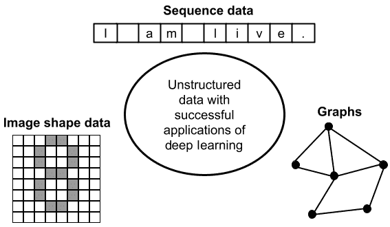
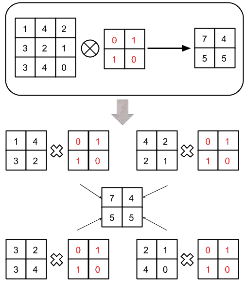
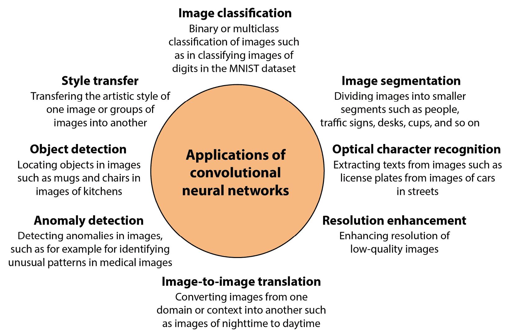
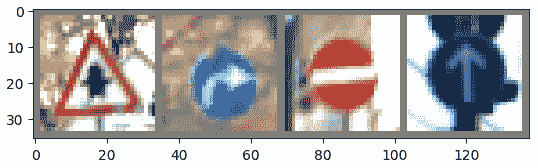
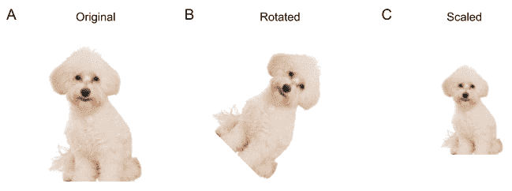
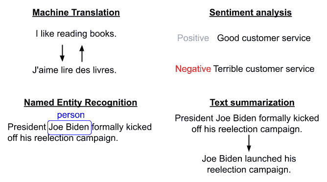
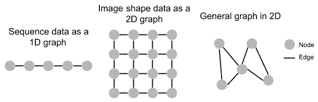
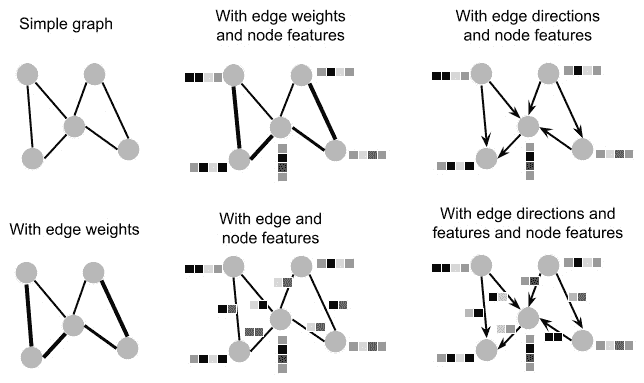
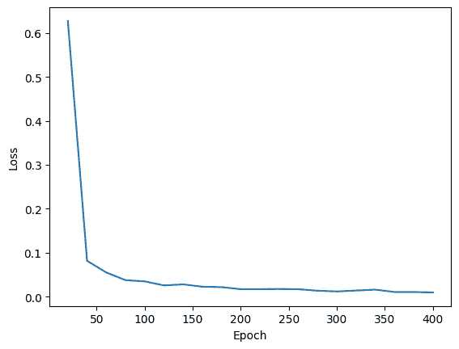
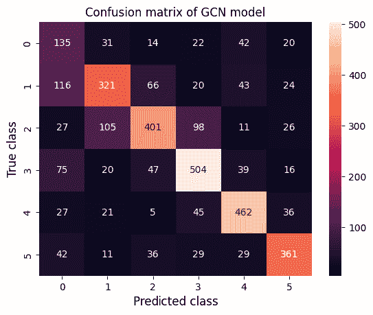

# 高级深度学习技术

在上一章中，我们回顾了神经网络建模和深度学习的概念，同时关注全连接神经网络。在本章中，我们将讨论更多高级技术，这些技术让您能够使用深度学习模型跨越不同的数据类型和结构，例如图像、文本和图。这些技术是人工智能在各个行业取得进步的主要推动力，例如在聊天机器人、医疗诊断、药物发现、股票交易和欺诈检测等领域。尽管我们将介绍不同数据类型中最著名的深度学习模型，但本章旨在帮助您理解概念，并使用 PyTorch 和 Python 进行实践，而不是为每个数据类型或主题领域提供最先进的模型。

在本章中，我们将涵盖以下主题：

+   神经网络类型

+   用于图像形状数据的卷积神经网络

+   用于语言建模的转换器

+   使用深度神经网络建模图

到本章结束时，您将了解**卷积神经网络**（**CNNs**）、转换器和图神经网络作为深度学习建模的三个重要类别，以在您感兴趣的问题中开发高性能模型。您还将了解如何使用 PyTorch 和 Python 开发此类模型。

# 技术要求

对于本章，以下要求应予以考虑，因为它们将帮助您更好地理解概念，在项目中使用它们，并使用提供的代码进行实践：

+   Python 库要求：

    +   `torch` >= 2.0.0

    +   `torchvision` >= 0.15.1

    +   `transformers` >= 4.28.0

    +   `datasets` >= 2.12.0

    +   `torch_geometric` == 2.3.1

+   您需要具备以下基本知识：

    +   深度学习建模和全连接神经网络

    +   如何使用 PyTorch 进行深度学习建模

您可以在 GitHub 上找到本章的代码文件，链接为 [`github.com/PacktPublishing/Debugging-Machine-Learning-Models-with-Python/tree/main/Chapter13`](https://github.com/PacktPublishing/Debugging-Machine-Learning-Models-with-Python/tree/main/Chapter13)。

# 神经网络类型

本书迄今为止提供的示例主要集中在表格数据上，无论是机器学习还是深度学习建模，作为机器学习建模的一个类别。然而，机器学习和特别是深度学习在处理非表格数据、非结构化文本、图像和图的问题上已经取得了成功。首先，在本节中，我们将介绍涉及此类数据类型的不同问题；然后，我们将回顾可以帮助您为这些问题构建可靠模型的深度学习技术。

## 基于数据类型的分类

结构化数据，也称为表格数据，是指可以组织成电子表格和结构化数据库的数据。正如我们在本书中使用这种数据类型一样，我们通常在表格、矩阵或 DataFrame 的列中具有不同的特征，甚至输出。DataFrame 的行代表数据集中的不同数据点。然而，我们还有其他类型的数据，它们不是结构化的，将它们重新格式化为 DataFrame 或矩阵会导致信息丢失。“图 13.1”显示了三种最重要的非结构化数据类型——即文本等序列数据、家庭照片等图像形状数据以及社交网络等图数据：



图 13.1 – 使用深度学习可以建模的不同数据类型

*表 13.1* 提供了一些问题和它们对应的数据如何适合图 13.1 中提到的每个类别的一些示例：

| **数据类型** | **示例** |
| --- | --- |
| 序列数据 | 文本、股票价格等时间序列数据、声音波序列的音频数据、物体运动序列的地理位置数据、大脑电活动序列的 EEG 数据、心脏电活动序列的 ECG 数据 |
| 图像形状数据 | 照片、安全监控图像、X 射线或 CT 扫描等医学图像、视觉艺术和绘画图像、卫星捕获的图像，如天气模式、显微镜捕获的图像，如细胞图像 |
| 图 | 道路网络、网页之间的连接（网络图）、概念之间的关系（知识图）、个人和群体之间的连接（社交网络）、基因或其他生物实体之间的连接（生物网络） |

表 13.1 – 每种数据类型的示例问题

将不同数据类型重新格式化为表格数据时的一些挑战和问题如下：

+   将序列数据重新格式化为表格形状的数据对象会导致关于数据顺序（如单词）的信息丢失

+   将图像重新格式化为表格格式会导致局部模式（如二维图像像素之间的关系）的丢失

+   将图重新格式化为表格数据将消除数据点或特征之间的依赖关系

现在我们已经理解了不将所有数据集和数据类型重新格式化为表格数据的重要性，我们可以开始使用不同的深度学习技术来了解我们如何为非表格数据构建成功的模型。我们将从查看图像形状数据开始。

# 用于图像形状数据的卷积神经网络

CNNs 允许我们在图像数据上构建深度学习模型，而无需将图像重新格式化为表格格式。这类深度学习技术的名称来源于卷积的概念，在深度学习中指的是将滤波器应用于图像形状数据以产生一个次级图像形状特征图（如*图 13**.2*所示）：



图 13.2 – 将预定义的卷积滤波器应用于 3x3 图像形状数据点的简单示例

当训练一个深度学习模型时，例如使用 PyTorch，卷积滤波器或其他我们将在本章后面介绍的滤波器并不是预定义的，而是通过学习过程来学习的。卷积和其他 CNN 建模中的滤波器及过程使我们能够使用这类深度学习技术处理不同图像形状的数据（正如我们在*图 13**.1*中看到的）。

CNNs 的应用不仅限于图像分类的监督学习，这是它最著名的应用之一。CNNs 已被用于不同的问题，包括**图像分割**、**分辨率增强**、**目标检测**等（*图 13**.3*）：



图 13.3 – 卷积神经网络的一些成功应用

*表 13.2*列出了 CNN 在不同应用中的高性能模型，您可以在项目中使用或在构建更好的模型时参考：

| **问题** | **一些广泛使用的模型和相关技术** |
| --- | --- |
| 图像分类 | ResNet（He et al., 2016）；EfficientNets（Tan and Le, 2019）；MobileNets（Howard et al., 2017；Sandler et al., 2018）；Xception（Chollet, 2017） |
| 图像分割 | U-Net（Ronneberger et al., 2015）；Mask R-CNN（He et al., 2017）；DeepLab（Chen et al., 2017）；PSPNet（Chao et al., 2017） |
| 目标检测 | Mask R-CNN（He et al., 2017）；Faster R-CNN（Ren et al., 2015）；YOLO（Redmon et al., 2016） |
| 图像超分辨率 | SRCNN（Dong et el., 2015）；FSRCNN（Dong et al., 2016）；EDSR（Lim et al., 2017） |
| 图像到图像翻译 | Pix2Pix（Isola et al., 2017）；CycleGAN（Zhu et al., 2017） |
| 风格迁移 | 艺术风格神经算法（Gatys et al., 2016）；AdaIN-Style（Huang et al., 2017） |
| 异常检测 | AnoGAN（Schlegl et al., 2017）；RDA（Zhou et al., 2017）；Deep SVDD（Ruff et al., 2018） |
| 光学字符识别 | EAST（Zhou et al., 2017）；CRAFT（Bake et al., 2019） |

表 13.2 – 不同问题下的高性能 CNN 模型

你可以在二维或三维图像形状数据上训练 CNN 模型。你也可以构建处理此类数据点序列的模型，例如视频，作为图像序列。你可以玩的一些在视频上使用 CNN 的最著名模型或方法包括 C3D（Tran 等，2015 年）、I3D（Carreira 和 Zisserman，2017 年）和 SlowFast（Feichtenhofer 等，2019 年）。

接下来，我们将了解一些评估 CNN 模型性能的方法。

## 性能评估

你可以使用在第*第四章*中介绍的机器学习模型性能和效率问题检测的性能指标，例如 ROC-AUC、PR-AUC、精确率和召回率，用于 CNN 分类模型。然而，对于*图 13**.3*中提出的一些问题，还有其他更具体的指标，如下所示：

+   **像素精度**：这个指标定义为正确分类的像素数与总像素数的比率。这个指标与准确度类似，当像素存在类别不平衡时可能会产生误导。

+   **Jaccard 指数**：Jaccard 指数定义为交集与并集的比率，可以用来计算预测分割与真实分割的交集，并按它们的并集进行归一化。

## 使用 PyTorch 进行 CNN 建模

PyTorch 中的 CNN 建模过程与我们之前章节中介绍的构建全连接神经网络非常相似。它从指定网络架构开始，然后初始化优化器，最后通过不同的周期和批次从训练数据点中学习。在这里，我们想使用`torchvision`库在 PyTorch 中练习 CNN 建模。此数据集中图像的示例在*图 13**.4*中显示：



图 13.4 – torchvision 数据集中德国交通标志识别基准（GTSRB）数据集的图像示例

除了`torch.nn.Conv2d`卷积滤波器外，`torch.nn`模块中还有其他滤波器和层可供使用，你可以使用它们来训练高性能的 CNN 模型。除了`torch.nn.Conv2d`之外，广泛使用的另一个滤波器是`torch.nn.MaxPool2d`，它可以用作 CNN 建模中的池化层（LeCun 等，1989 年）。你可以在 PyTorch 网站上阅读这两个滤波器所需的参数（[`pytorch.org/docs/stable/nn.html`](https://pytorch.org/docs/stable/nn.html)）。

让我们开始使用 GTSRB 数据集练习 CNN 建模。首先，我们必须加载用于模型训练和测试的数据，然后指定分类模型中的类别数：

```py
transform = transforms.Compose([    transforms.Resize((32, 32)),
    transforms.ToTensor(),
    transforms.Normalize((0.3337, 0.3064, 0.3171),
        ( 0.2672, 0.2564, 0.2629))
])
batch_size = 6
n_class = 43
# Loading train and test sets of
# German Traffic Sign Recognition Benchmark (GTSRB) Dataset.
trainset = torchvision.datasets.GTSRB(
    root='../../data',split = 'train',
    download=True,transform=transform)
trainloader = torch.utils.data.DataLoader(trainset,
    batch_size=batch_size,shuffle=True, num_workers=2)
testset = torchvision.datasets.GTSRB(
    root='../../data',split = 'test',
    download=True,transform=transform)
testloader = torch.utils.data.DataLoader(testset,
    batch_size=batch_size,shuffle=False,num_workers=2)
```

然后，我们必须定义一个名为`Net`的神经网络类，它决定了网络的架构，包括两层卷积加上池化滤波器，然后是 ReLU 激活函数，接着是三层具有 ReLU 激活函数的全连接神经网络：

```py
import torch.nn as nnimport torch.nn.functional as F
class Net(nn.Module):
    def __init__(self):
        super().__init__()
        self.conv1 = nn.Conv2d(3, 6, 5)
        self.pool = nn.MaxPool2d(2, 2)
        self.conv2 = nn.Conv2d(6, 16, 5)
        self.fc1 = nn.Linear(16 * 5 * 5, 128)
        self.fc2 = nn.Linear(128, 64)
        self.fc3 = nn.Linear(64, n_class)
    def forward(self, x):
        x = self.pool(F.relu(self.conv1(x)))
        x = self.pool(F.relu(self.conv2(x)))
        x = torch.flatten(x, 1)
        x = F.relu(self.fc1(x))
        x = F.relu(self.fc2(x))
        x = self.fc3(x)
        return x
```

然后，我们必须初始化网络和优化器，如下所示：

```py
import torch.optim as optimnet = Net()
criterion = nn.CrossEntropyLoss()
optimizer = optim.SGD(net.parameters(), lr=0.001,
    momentum=0.9)
```

现在，我们已经准备好使用初始化的架构和优化器来训练网络。在这里，我们将使用三个 epoch 来训练网络。批大小不需要在这里指定，因为它们在从`torchvision`加载数据时就已经确定，在这个例子中指定为`6`（这可以在本书的 GitHub 仓库中找到）：

```py
n_epoch = 3for epoch in range(n_epoch):
    # running_loss = 0.0
    for i, data in enumerate(trainloader, 0):
        # get the input data
        inputs, labels = data
        # zero the parameter gradients
        optimizer.zero_grad()
        # output identification
        outputs = net(inputs)
        # loss calculation and backward propagation for parameter update
        loss = criterion(outputs, labels)
        loss.backward()
        optimizer.step()
```

经过 3 个 epoch 后的最终计算损失为 0.00008。

这只是一个使用 PyTorch 进行 CNN 建模的简单示例。在构建 CNN 模型时，PyTorch 还有其他你可以从中受益的功能，例如数据增强。我们将在下一节讨论这个问题。

## CNN 的图像数据转换和增强

作为机器学习生命周期预训练阶段的一部分，你可能需要转换你的图像，例如通过裁剪它们，或者实现数据增强作为一系列用于合成数据生成的技术，以提高你模型的性能，如第五章中所述，*提高机器学习模型的性能*。*图 13.5*展示了数据增强的一些简单示例，包括旋转和缩放，这些可以帮助你生成合成但高度相关的数据点，以帮助你的模型：



图 13.5 – 基于规则的图像数据增强示例 – (A) 原始图像，(B) 旋转图像，和(C) 缩放图像

虽然你可以实现数据增强的简单规则示例，但在 PyTorch 中有许多类可以用于数据转换和增强，如[`pytorch.org/vision/stable/transforms.html`](https://pytorch.org/vision/stable/transforms.html)中所述。

## 使用预训练模型

在深度学习环境中，我们通常依赖于预训练模型来进行推理或进一步微调以解决我们手头的特定问题。卷积神经网络（CNNs）也不例外，你可以在 PyTorch 中找到许多用于图像分类或其他 CNN 应用的预训练模型（[`pytorch.org/vision/stable/models.html`](https://pytorch.org/vision/stable/models.html)）。你还可以在相同的 URL 上找到如何使用这些模型的代码示例。你可以在[`pytorch.org/tutorials/beginner/finetuning_torchvision_models_tutorial.html`](https://pytorch.org/tutorials/beginner/finetuning_torchvision_models_tutorial.html)找到必要的代码，教你如何使用新数据微调这些模型。

虽然我们迄今为止一直专注于将 CNN 应用于图像数据，但它们可以用来建模任何图像形状数据。例如，音频数据可以从时域转换到频域，从而产生可以结合序列建模算法使用 CNN 来建模的图像形状数据，正如本章后面所介绍的 ([`pytorch.org/audio/main/models.html`](https://pytorch.org/audio/main/models.html))。

除了图像和图像形状数据之外，深度学习模型和算法已经被开发出来，以在多种应用中正确地建模序列数据，例如在**自然语言处理**（**NLP**）中，为了简便起见，我们在这里将其称为语言建模。在下一节中，我们将回顾用于语言建模的 Transformer，以帮助您在手中有一个相关想法或项目时开始从这些模型中受益。

# 用于语言建模的 Transformer

Transformer 在一篇名为 *Attention is All You Need* 的著名论文（Vaswani et al., 2017）中被引入，作为一种新的序列到序列数据建模任务的方法，例如将一种语言的陈述翻译成另一种语言（即机器翻译）。这些模型建立在自注意力概念之上，该概念有助于模型在训练过程中关注句子或信息序列中的其他重要部分。这种注意力机制有助于模型更好地理解输入序列元素之间的关系——例如，在语言建模中输入序列中的单词之间的关系。使用 Transformer 构建的模型通常比使用如 **长短期记忆**（**LSTM**）和 **循环神经网络**（**RNNs**）（Vaswani et al., 2017; Devlin et al., 2018）等前辈技术构建的模型表现更好。

*图 13.6* 展示了通过 Transformer 模型成功解决的四个传统语言建模问题：



图 13.6 – 深度学习技术在语言建模中成功应用的四个传统问题

一些著名的模型已经在这些或其他语言建模任务中直接使用或经过一些修改。以下是一些例子：

+   BERT (Devlin et al., 2018; [`github.com/google-research/bert`](https://github.com/google-research/bert))

+   GPT (Radford et al., 2018) 及其更近的版本 ([`openai.com/product/gpt-4`](https://openai.com/product/gpt-4))

+   DistilBERT (Sanh et al., 2019; [`huggingface.co/docs/transformers/model_doc/distilbert`](https://huggingface.co/docs/transformers/model_doc/distilbert))

+   RoBERTa (Liu et al., 2019; [`github.com/facebookresearch/fairseq/tree/main/examples/roberta`](https://github.com/facebookresearch/fairseq/tree/main/examples/roberta))

+   BART（Lewis et al., 2019；[`github.com/huggingface/transformers/tree/main/src/transformers/models/bart`](https://github.com/huggingface/transformers/tree/main/src/transformers/models/bart))

+   XLNet（Yang et al., 2019；[`github.com/zihangdai/xlnet/`](https://github.com/zihangdai/xlnet/))

+   T5（Raffel et al., 2020；[`github.com/google-research/text-to-text-transfer-transformer`](https://github.com/google-research/text-to-text-transfer-transformer))

+   LLaMA（Touvron et al., 2023；[`github.com/facebookresearch/llama`](https://github.com/facebookresearch/llama))

变压器模型也被用于其他领域和序列数据，例如电子健康记录（Li et al., 2020）、蛋白质结构预测（Jumpter et al., 2021）和时间序列异常检测（Xu et al., 2021）。

生成模型是机器学习建模中另一个重要的概念，变压器和 CNNs 已经成功地被用于此类模型。此类模型的例子包括 GPT 的不同版本，如 GPT-4 ([`openai.com/product/gpt-4`](https://openai.com/product/gpt-4))。你将在*第十四章*，“机器学习最新进展导论”中了解生成模型。有一个公开的**大型语言模型**（**LLM**）排行榜，提供了最新的开源 LLM 模型列表([`huggingface.co/spaces/HuggingFaceH4/open_llm_leaderboard`](https://huggingface.co/spaces/HuggingFaceH4/open_llm_leaderboard))。你还可以查看 LLMs 的实用指南资源列表[`github.com/Mooler0410/LLMsPracticalGuide`](https://github.com/Mooler0410/LLMsPracticalGuide)。

我们不想深入探讨变压器背后的理论细节，但你在用 PyTorch 构建一个变压器架构的过程中，将会了解其组成部分。然而，其他广泛使用的性能指标也被用于序列数据和语言模型，例如以下内容：

+   **困惑度** ([`torchmetrics.readthedocs.io/en/stable/text/perplexity.html`](https://torchmetrics.readthedocs.io/en/stable/text/perplexity.html))

+   **BLEU**评分（**Bilingual Evaluation Understudy**）([`torchmetrics.readthedocs.io/en/stable/text/bleu_score.html`](https://torchmetrics.readthedocs.io/en/stable/text/bleu_score.html))

+   **ROUGE**评分（**Recall-Oriented Understudy for Gisting Evaluation**）([`torchmetrics.readthedocs.io/en/stable/text/rouge_score.html`](https://torchmetrics.readthedocs.io/en/stable/text/rouge_score.html))

这些指标可以帮助你评估你的序列模型。

## 分词

在训练和测试 transformer 模型之前，我们需要通过一个称为分词的过程将数据转换成正确的格式。分词是将数据分成更小的片段，如单词，如在**单词分词**中，或者字符，如在**字符分词**中。例如，句子“我喜欢读书”可以被转换成其包含的单词——即[“我”，“喜欢”，“读书”，“书籍”]。在构建分词器时，需要指定允许的最大标记数。例如，对于一个有 1,000 个标记的分词器，最频繁的 1,000 个单词将从提供给构建分词器的文本中用作标记。然后，每个标记将是这 1,000 个最频繁标记中的一个。之后，这些标记每个都会得到一个 ID；这些数字将在之后的神经网络模型训练和测试中使用。分词器标记之外的字词和字符会得到一个共同的值，例如，0 或 1。在文本分词中，另一个挑战是语句和单词序列的不同长度。为了应对这一挑战，在称为填充的过程中，通常会在每个单词序列或句子中的标记 ID 之前或之后使用一个共同的 ID，例如 0。

近期的大型语言模型（LLM）在分词过程中的标记数不同。例如，OpenAI 的 **gpt-4-32k** 模型提供 32,000 个标记 ([`help.openai.com/en/articles/7127966-what-is-the-difference-between-the-gpt-4-models`](https://help.openai.com/en/articles/7127966-what-is-the-difference-between-the-gpt-4-models))，而 Claude 的 LLM 提供 100k 个标记 ([`www.anthropic.com/index/100k-context-windows`](https://www.anthropic.com/index/100k-context-windows))。标记数的差异可能会影响模型在相应文本相关任务中的性能。

常用的分词库包括 Hugging Face 的 transformer ([`huggingface.co/transformers/v3.5.1/main_classes/tokenizer.html`](https://huggingface.co/transformers/v3.5.1/main_classes/tokenizer.html))、SpaCy ([`spacy.io/`](https://spacy.io/)) 和 NLTK ([`www.nltk.org/api/nltk.tokenize.html`](https://www.nltk.org/api/nltk.tokenize.html))。让我们通过练习 Hugging Face 的 transformer 库来更好地理解分词是如何工作的。

首先，让我们导入 `transformers.AutoTokenizer()` 并加载 `bert-base-cased` 和 `gpt2` 预训练的分词器：

```py
from transformers import AutoTokenizertokenizer_bertcased = AutoTokenizer.from_pretrained(
    'bert-base-cased')
tokenizer_gpt2 = AutoTokenizer.from_pretrained('gpt2')
```

为了练习这两个分词器，我们必须制作一个包含两个语句的列表，用于分词过程：

```py
batch_sentences = ["I know how to use machine learning in my projects","I like reading books."]
```

然后，我们必须使用每个加载的分词器对这两个语句进行分词和编码，以得到相应的 ID 列表。首先，让我们使用 `gpt2`，如下所示：

```py
encoded_input_gpt2 = tokenizer_gpt2(batch_sentences)
```

上述代码将这些两个语句转换成以下二维列表，其中包含每个语句中每个标记的 ID。例如，由于这两个语句都以“I”开头，因此它们的第一 ID 都是 40，这是`gpt2`分词器中“I”的标记：

```py
[[40, 760, 703, 284, 779, 4572, 4673, 287, 616, 4493], [40, 588, 3555, 3835, 13]]
```

现在，我们将使用`bert-base-cased`，但这次，我们将要求分词器也使用填充来生成相同长度的 ID 列表，并以张量格式返回生成的 ID，这对于后续在神经网络建模中使用，例如使用 PyTorch，是合适的：

```py
encoded_input_bertcased = tokenizer_bertcased(    batch_sentences, padding=True, return_tensors="pt")
```

以下张量显示了生成的两个句子 ID 的长度相同：

```py
tensor([[ 101,  146, 1221, 1293, 1106, 1329, 3395, 3776,    1107, 1139, 3203,  102],
    [ 101,146, 1176, 3455, 2146, 119, 102, 0, 0, 0, 0, 0]])
```

我们还可以使用这些分词器的解码功能将 ID 转换回原始语句。首先，我们必须使用`gpt2`解码生成的 ID：

```py
[tokenizer_gpt2.decode(input_id_iter) for input_id_iter in encoded_input_gpt2["input_ids"]]
```

这生成了以下语句，这些语句与原始输入语句相匹配：

```py
['I know how to use machine learning in my projects', 'I like reading books.']
```

然而，假设我们使用`bert-base-cased`分词器进行 ID 解码，如下所示：

```py
[tokenizer_bertcased.decode(input_id_iter) for input_id_iter in encoded_input_bertcased["input_ids"]]
```

生成的语句不仅包含原始语句，还显示了填充标记的解码方式。这显示为`[PAD]`、`[CLS]`，这相当于句子的开始，以及`[SEP]`，它显示了另一个句子开始的位置：

```py
['[CLS] I know how to use machine learning in my projects [SEP]', '[CLS] I like reading books. [SEP] [PAD] [PAD] [PAD] [PAD] [PAD]']
```

## 语言嵌入

我们可以将每个单词的识别 ID 转换成更信息丰富的嵌入。这些 ID 本身可以用作 one-hot 编码，如在第*第四章*中讨论的，*检测机器学习模型的性能和效率问题*，其中每个单词都得到一个所有元素为零、对应单词的标记为 1 的长向量。但这些 one-hot 编码并没有提供任何关于单词之间关系的信息，这些关系在语言建模的单词级别上类似于数据点。

我们可以将词汇表中的单词转换为嵌入，这些嵌入可以用来捕捉它们之间的语义关系，并帮助我们的机器学习和深度学习模型从不同语言建模任务中的新信息丰富的特征中受益。尽管 BERT 和 GPT-2 等模型并非专为文本嵌入提取而设计，但它们可以用来为文本语料库中的每个单词生成嵌入。但还有其他一些较老的方法，如 Word2Vec（Mikolov 等人，2013 年）、GloVe（Pennington 等人，2014 年）和 fast-text（Bojanowski 等人，2017 年），它们是为嵌入生成而设计的。还有更多最近且更全面的词嵌入模型，如 Cohere（[`txt.cohere.com/embedding-archives-wikipedia/`](https://txt.cohere.com/embedding-archives-wikipedia/)），您可以使用它来生成文本嵌入，用于嵌入和建模的不同语言。

## 使用预训练模型进行语言建模

我们可以将预训练模型导入到不同的深度学习框架中，例如 PyTorch，仅用于推理或使用新数据进行进一步的微调。在这里，我们想用 DistilBERT（Sanh et al., 2019）来练习这个过程，它是 BERT（Devlin et al., 2018）的一个更快、更轻量级的版本。具体来说，我们想使用基于 DistilBERT 架构的`DistilBertForSequenceClassification()`模型，该模型已被调整为用于序列分类任务。在这些过程中，模型会被训练并可用于对给定句子或陈述分配标签的任务的推理。此类标签分配的例子包括垃圾邮件检测或语义标记，如正面、负面和中立。

首先，我们将从`torch`和`transformers`库中导入必要的库和类：

```py
import torchfrom torch.utils.data import DataLoader
from transformers import DistilBertTokenizerFast, DistilBertForSequenceClassification, Trainer, TrainingArguments
```

然后，我们将加载`imdb`数据集，以便我们可以使用它来训练一个模型，作为一个微调版本的`DistilBertForSequenceClassification()`：

```py
from datasets import load_datasetdataset = load_dataset("imdb")
```

现在，我们可以在`DistilBertTokenizerFast()`分词器的基础上定义一个分词器函数，其中使用`distilbert-base-uncased`作为预训练的分词器：

```py
tokenizer = DistilBertTokenizerFast.from_pretrained(    "distilbert-base-uncased")
def tokenize(batch):
    return tokenizer(batch["text"], padding=True,
        truncation=True, max_length=512)
```

然后，我们可以将`imdb`数据集的一小部分（1%）分离出来用于训练和测试，因为我们只想练习这个过程，而使用整个数据集在训练和测试方面需要花费很长时间：

```py
train_dataset = dataset["train"].train_test_split(    test_size=0.01)["test"].map(tokenize, batched=True)
test_dataset = dataset["test"].train_test_split(
    test_size=0.01)["test"].map(tokenize, batched=True)
```

现在，我们可以在分类过程中指定标签的数量来初始化`DistilBertForSequenceClassification()`模型。这里，这是`2`：

```py
model = DistilBertForSequenceClassification.from_pretrained(    "distilbert-base-uncased", num_labels=2)
```

现在，我们可以使用`imdb`数据集的独立训练数据来训练模型，进行`3`个 epoch 的训练：

```py
training_args = TrainingArguments(output_dir="./results",    num_train_epochs=3,per_device_train_batch_size=8,
    per_device_eval_batch_size=8, logging_dir="./logs")
trainer = Trainer(model=model, args=training_args,
    train_dataset=train_dataset,eval_dataset=test_dataset)
trainer.train()
```

这样，模型就已经训练好了，我们可以使用`imdb`数据集的独立测试集来评估它：

```py
eval_results = trainer.evaluate()
```

这导致了 0.35 的评估损失。

在你的语言建模或推理任务中，有许多其他可用的模型可以使用（例如，PyTorch Transformers 库：[`pytorch.org/hub/huggingface_pytorch-transformers/`](https://pytorch.org/hub/huggingface_pytorch-transformers/)）。还有其他序列模型，除了语言建模之外，适用于以下领域：

+   音频建模：[`pytorch.org/audio/main/models.html`](https://pytorch.org/audio/main/models.html)

+   时间序列建模：[`huggingface.co/docs/transformers/model_doc/time_series_transformer`](https://huggingface.co/docs/transformers/model_doc/time_series_transformer)

+   预测：[`pytorch-forecasting.readthedocs.io/en/stable/models.html`](https://pytorch-forecasting.readthedocs.io/en/stable/models.html)

+   视频建模：[`pytorchvideo.org/`](https://pytorchvideo.org/))

你可以在[`pytorch.org/tutorials/beginner/transformer_tutorial.html`](https://pytorch.org/tutorials/beginner/transformer_tutorial.html)了解更多关于 transformer 建模以及如何在 PyTorch 中从头开始构建新架构，而不是使用预训练模型。

在本节中，你学习了将文本建模为一种序列数据类型。接下来，我们将介绍建模图，这是一种更复杂的数据结构。

# 使用深度神经网络建模图

我们可以将图视为我们用于机器学习和深度学习建模的几乎所有非表格数据的更通用结构。序列可以被认为是**一维的**（1D），而图像或图像形状数据可以被认为是**二维的**（2D）（参见*图 13.7*）。在本章的早期，你学习了如何在 Python 和 PyTorch 中开始从 CNN 和变压器中受益，用于序列和图像形状数据。但更通用的图不适用于这些两个图，它们具有预定义的结构（参见*图 13.7*），我们不能简单地使用 CNN 或序列模型来建模它们：



图 13.7 – 不同非结构化数据的图表示

图有两个重要的元素，称为节点和边。边连接节点。图中的节点和边可以具有不同的特征，这些特征将它们彼此区分开来（参见*图 13.8*）：



图 13.8 – 根据节点和边特征分类的图类型

我们可以有节点具有特征、边具有权重或特征，或者边具有方向的图。无向图（具有无向边的图）在许多应用中很有用，例如社交媒体网络。假设社交媒体图中的每个节点都是一个节点，那么边可以确定哪些人相连。此类图中的节点特征可以是社交媒体网络中人们的不同特征，例如他们的年龄、研究领域或职称、居住城市等。有向图可用于不同的应用，例如因果建模，我们将在*第十五章* *相关性* *与因果关系* 中讨论。

如本节开头所述，CNN 和变压器等技术不能直接应用于图。因此，我们将回顾其他神经网络技术，这些技术可以帮助你在项目中建模图。

## 图神经网络

与 2D 图像和 1D 序列数据相比，图可能具有更复杂的结构。然而，我们可以使用与 CNN 和变压器模型相同的理念，通过依赖数据中的局部模式和关系来建模它们。我们可以在图中依赖局部模式，让神经网络从相邻节点中学习，而不是试图学习关于整个图的信息，这个图可能包含成千上万的节点和数百万的边。这就是**图神经网络**（GNNs）背后的理念。

我们可以使用 GNNs（图神经网络）来完成不同的任务，例如以下内容：

+   **节点分类**：我们可以通过使用图神经网络（GNNs）来预测图中每个节点的类别。例如，如果你考虑一个城市中酒店的图，其中边是它们之间的最短路径，你可以预测在假期期间哪个酒店会被预订。或者如果你有化学背景，你可以使用节点分类来注释蛋白质中的氨基酸，使用蛋白质的 3D 结构（Abdollahi 等人，2023 年）。

+   **节点选择**：对于 GNNs 的节点选择与 CNNs 的对象检测任务类似。我们可以设计 GNNs 来识别和选择具有特定特征的节点，例如在产品与消费者图中选择推荐产品的人。

+   **链接预测**：我们可以旨在预测已存在节点或图中新节点之间的未知边。例如，在一个代表社交媒体网络的图中，链接预测可能是预测人与人之间的联系。然后，这些个人可以被推荐给对方，以便他们可以将彼此添加到他们的联系网络中。

+   **图分类**：我们不是旨在预测或选择节点或边，而是可以设计 GNNs 来预测整个图的特征（[`chrsmrrs.github.io/datasets/`](https://chrsmrrs.github.io/datasets/)）。在这种情况下，可能会有代表数据点的图，例如用于图分类 GNN 模型的药物分子。

存在着不同 GNNs 的一般分类法，例如 Wu 等人（2020 年）提出的分类法。但在这里，我们想专注于广泛使用的方法的例子，而不是过于技术性地涉及 GNNs 的不同类别。成功用于建模图的方 法的例子包括**图卷积网络**（**GCNs**）（Kipf 和 Welling 在 2016 年），**图样本和聚合**（**GraphSAGE**）（Hamilton 等人，2017 年），以及**图注意力网络**（**GATs**）（Veličković等人，2018 年）。虽然大多数 GNN 技术考虑节点的特征，但并非所有都考虑边特征。**消息传递神经网络**（**MPNNs**）是一种考虑节点和边特征的技术示例，最初是为生成药物分子的图而设计的（Gilmer 等人，2017 年）。

你可以从手头的数据构建图，或者使用公开可用的数据集，如**斯坦福大型网络数据集收集**（**SNAP**）来练习不同的 GNN 技术。SNAP 拥有你可以下载并开始练习的最大的图数据集之一（[`snap.stanford.edu/data/`](https://snap.stanford.edu/data/)）。

接下来，我们将使用 PyTorch 练习 GNN 建模，以帮助你更好地理解如何在 Python 中构建此类模型。

## PyTorch Geometric 中的 GNNs

PyTorch Geometric 是一个基于 PyTorch 的 Python 库，它帮助您训练和测试 GNN。有一系列教程您可以从中受益，了解如何使用 PyTorch Geometric 进行 GNN 建模（[`pytorch-geometric.readthedocs.io/en/latest/notes/colabs.html`](https://pytorch-geometric.readthedocs.io/en/latest/notes/colabs.html)）。在这里，我们将通过改编自这些教程之一的代码来练习节点分类问题（[`colab.research.google.com/drive/14OvFnAXggxB8vM4e8vSURUp1TaKnovzX?usp=sharing#scrollTo=0YgHcLXMLk4o`](https://colab.research.google.com/drive/14OvFnAXggxB8vM4e8vSURUp1TaKnovzX?usp=sharing#scrollTo=0YgHcLXMLk4o)）。

首先，让我们从 PyTorch Geometric 中的 `Planetoid` 导入 *CiteSeer* 引用网络数据集（Yang et al., 2016）：

```py
from torch_geometric.datasets import Planetoidfrom torch_geometric.transforms import NormalizeFeatures
dataset = Planetoid(root='data/Planetoid', name='CiteSeer',
    transform=NormalizeFeatures())
data = dataset[0]
```

现在，类似于初始化 FCNN 和 CNN 的神经网络，我们必须为 GNN 建模初始化一个 `GCNet` 类，但我们将使用 `GCNConv` 图卷积层而不是线性层和卷积层：

```py
import torchfrom torch_geometric.nn import GCNConv
import torch.nn.functional as F
torch.manual_seed(123)
class GCNet(torch.nn.Module):
    def __init__(self, hidden_channels):
        super().__init__()
        self.gcn_layer1 = GCNConv(dataset.num_features,
            hidden_channels[0])
        self.gcn_layer2 = GCNConv(hidden_channels[0],
            hidden_channels[1])
        self.gcn_layer3 = GCNConv(hidden_channels[1],
            dataset.num_classes)
    def forward(self, x, edge_index):
        x = self.gcn_layer1(x, edge_index)
        x = x.relu()
        x = F.dropout(x, p=0.3, training=self.training)
        x = self.gcn_layer2(x, edge_index)
        x = x.relu()
        x = self.gcn_layer3(x, edge_index)
        return x
```

在上一节课中，我们使用了三个 `GCNConv` 层，结合 ReLU 激活函数和 dropout 进行正则化。

现在，我们可以使用定义的 `GCNet` 类来初始化我们的模型，其隐藏层的大小为 128 和 16，在这段实践代码中都是任意的。我们还需要在指定算法的同时初始化一个优化器，在这个例子中是 `Adam`，学习率为 `0.01`，权重衰减为 `1e-4` 以进行正则化：

```py
model = GCNet(hidden_channels=[128, 16])optimizer = torch.optim.Adam(model.parameters(), lr=0.01,
    weight_decay=1e-4)
criterion = torch.nn.CrossEntropyLoss()
```

现在，我们可以定义我们的训练函数，它将被用于单 epoch 训练：

```py
def train():        model.train()
        optimizer.zero_grad()
        out = model(data.x, data.edge_index)
        loss = criterion(out[data.train_mask],
            data.y[data.train_mask])
        loss.backward()
        optimizer.step()
        return loss
```

这样，我们就准备好了一系列的 epoch 并开始训练模型。请注意，以下用于训练模型 400 个 epoch 的循环可能需要很长时间：

```py
import numpy as npepoch_list = []
loss_list = []
for epoch in np.arange(1, 401):
    loss = train()
    if epoch%20 == 0:
        print(f'Epoch: {epoch:03d}, Loss: {loss:.4f}')
        epoch_list.append(epoch)
        loss_list.append(loss.detach().numpy())
```

下面的图显示了训练过程中的学习曲线（损失与 epoch 的关系）：



图 13.9 – 在 CiteSeer 数据集上示例 GCN 模型的学习曲线

我们还可以在数据集的测试部分测试模型，如下所示：

```py
model.eval()pred = model(data.x, data.edge_index).argmax(dim=1)
test_correct = pred[data.test_mask] ==
    data.y[data.test_mask]
test_acc = int(test_correct.sum()) / int(
    data.test_mask.sum())
```

这导致准确率为 0.655。我们还可以生成测试集上预测的混淆矩阵：

```py
from sklearn.metrics import confusion_matrixcf = confusion_matrix(y_true = data.y, y_pred = model(
    data.x, data.edge_index).argmax(dim=1))
import seaborn as sns
sns.set()
sns.heatmap(cf, annot=True, fmt="d")
```

这导致以下矩阵，以热图的形式展示。尽管大多数数据点的预测和真实类别匹配，但其中许多被错误分类，并且总结在混淆矩阵的对角线元素之外：



图 13.10 – 在 CiteSeer 数据集上示例 GCN 模型的测试集预测混淆矩阵

在本节中，我们讨论了使用深度学习建模不同数据类型和问题的技术。现在，你准备好学习更多关于这些高级技术并在你的项目中使用它们了。

# 摘要

在本章中，你学习了高级深度学习技术，包括卷积神经网络（CNNs）、转换器（transformers）和图神经网络（GNNs）。你了解了一些使用这些技术开发的广泛使用或著名的模型。你还练习了使用 Python 和 PyTorch 从头开始构建这些高级模型或微调它们。这些知识帮助你更深入地了解这些技术，并在你的项目中开始使用它们，以便你可以对图像和图像形状数据进行建模，对文本和序列数据进行建模，以及对图进行建模。

在下一章中，你将学习到最近在生成建模和提示工程以及自监督学习方面的进展，这些进展将帮助你开发项目或为你提供开发有趣和有用的工具和应用程序的机会。

# 问题

1.  你可以使用 CNNs 和 GNNs 解决哪些问题的示例？

1.  应用卷积是否可以保留图像中的局部模式？

1.  减少标记数是否会导致语言模型中的错误更多？

1.  文本标记过程中的填充（padding）是什么？

1.  我们在 PyTorch 中为 CNNs 和 GNNs 构建的网络架构类是否相似？

1.  在构建 GNNs 时，何时需要边缘特征？

# 参考文献

+   He, Kaiming 等人。*用于图像识别的深度残差学习*。IEEE 计算机视觉和模式识别会议论文集。2016 年。

+   Tan, Mingxing 和 Quoc Le. *Efficientnet：重新思考卷积神经网络的模型缩放*。机器学习国际会议。PMLR，2019 年。

+   Howard, Andrew G.等人。*Mobilenets：用于移动视觉应用的效率卷积神经网络*。arXiv 预印本 arXiv:1704.04861（2017 年）。

+   Sandler, Mark 等人。*Mobilenetv2：倒置残差和线性瓶颈*。IEEE 计算机视觉和模式识别会议论文集。2018 年。

+   Chollet, François。*Xception：使用深度可分离卷积的深度学习*。IEEE 计算机视觉和模式识别会议论文集。2017 年。

+   Ronneberger, Olaf，Philipp Fischer 和 Thomas Brox. *U-net：用于生物医学图像分割的卷积网络*。医学图像计算和计算机辅助干预（MICCAI 2015）：第 18 届国际会议，德国慕尼黑，2015 年 10 月 5-9 日，第 III 部分 18。Springer 国际出版社，2015 年。

+   He, Kaiming 等人。*Mask r-cnn*。IEEE 国际计算机视觉会议。2017 年。

+   Chen, Liang-Chieh 等人。*Deeplab：使用深度卷积网络、扩张卷积和全连接 crfs 进行语义图像分割*。IEEE 模式分析杂志第 40 卷第 4 期（2017 年）：834-848。

+   Zhao, Hengshuang 等人。*金字塔场景解析网络*。IEEE 计算机视觉和模式识别会议论文集。2017 年。

+   Ren, Shaoqing 等人。*Faster r-cnn：使用区域提议网络的实时目标检测*。神经信息处理系统进展第 28 卷（2015 年）。

+   Redmon, Joseph, et al. *一次检测：统一、实时目标检测*. IEEE 计算机视觉与模式识别会议论文集。2016.

+   Dong, Chao, et al. *使用深度卷积网络进行图像超分辨率*. IEEE 模式分析杂志 38.2 (2015): 295-307.

+   Dong, Chao, Chen Change Loy, 和 Xiaoou Tang. *加速超分辨率卷积神经网络*. 计算机视觉–ECCV 2016：第 14 届欧洲会议，荷兰阿姆斯特丹，2016 年 10 月 11-14 日，会议论文集第 II 部分 14\. Springer International Publishing, 2016.

+   Lim, Bee, et al. *用于单图像超分辨率的增强深度残差网络*. IEEE 计算机视觉与模式识别会议论文集 workshops。2017.

+   Isola, Phillip, et al. *使用条件对抗网络进行图像到图像翻译*. IEEE 计算机视觉与模式识别会议论文集。2017.

+   Zhu, Jun-Yan, et al. *使用循环一致对抗网络的无配对图像到图像翻译*. IEEE 国际计算机视觉会议论文集。2017.

+   Gatys, Leon A., Alexander S. Ecker, 和 Matthias Bethge. *使用卷积神经网络进行图像风格迁移*. IEEE 计算机视觉与模式识别会议论文集。2016.

+   Huang, Xun, 和 Serge Belongie. *实时自适应实例归一化在任意风格转换中的应用*. IEEE 国际计算机视觉会议论文集。2017.

+   Schlegl, Thomas, et al. *无监督异常检测与生成对抗网络引导标记发现*. 医学图像处理：第 25 届国际会议，IPMI 2017，美国北卡罗来纳州博恩，2017 年 6 月 25-30 日，会议论文集。Cham: Springer International Publishing, 2017.

+   Ruff, Lukas, et al. *深度单类分类*. 国际机器学习会议。PMLR，2018.

+   Zhou, Chong, 和 Randy C. Paffenroth. *使用鲁棒深度自编码器的异常检测*. 第 23 届 ACM SIGKDD 国际知识发现和数据挖掘会议论文集。2017.

+   Baek, Youngmin, et al. *文本检测中的字符区域感知*. IEEE/CVF 计算机视觉与模式识别会议论文集。2019.

+   Zhou, Xinyu, et al. *East：一种高效准确的场景文本检测器*. IEEE 计算机视觉与模式识别会议论文集。2017.

+   Tran, Du, et al. *使用 3D 卷积网络学习时空特征*. IEEE 国际计算机视觉会议论文集。2015.

+   Carreira, Joao, 和 Andrew Zisserman. *动作识别何去何从？一个新的模型和 Kinetics 数据集*. IEEE 计算机视觉与模式识别会议论文集。2017.

+   Feichtenhofer, Christoph, et al. *用于视频识别的 Slowfast 网络*. IEEE/CVF 国际计算机视觉会议论文集。2019.

+   LeCun, Yann, 等人. *使用反向传播网络进行手写数字识别*. 神经信息处理系统进展 2 (1989).

+   Vaswani, Ashish, 等人. *注意力即一切*. 神经信息处理系统进展 30 (2017).

+   Devlin, Jacob, 等人. *BERT: 用于语言理解的深度双向变换器预训练*. arXiv 预印本 arXiv:1810.04805 (2018).

+   Touvron, Hugo, 等人. *Llama: 开放且高效的通用语言模型*. arXiv 预印本 arXiv:2302.13971 (2023).

+   Li, Yikuan, 等人. *BEHRT: 用于电子健康记录的变换器*. 科学报告 10.1 (2020): 1-12.

+   Jumper, John, 等人. *使用 AlphaFold 进行高度精确的蛋白质结构预测*. 自然 596.7873 (2021): 583-589.

+   Xu, Jiehui, 等人. *异常变换器：基于关联差异的时间序列异常检测*. arXiv 预印本 arXiv:2110.02642 (2021).

+   Yuan, Li, 等人. *从零开始训练图像 Net 上的视觉变换器：tokens-to-token vit*. 2021 年 IEEE/CVF 国际计算机视觉会议论文集. 2021.

+   Liu, Yinhan, 等人. *Roberta: 一种鲁棒优化的 BERT 预训练方法*. arXiv 预印本 arXiv:1907.11692 (2019).

+   Lewis, Mike, 等人. *Bart: 用于自然语言生成、翻译和理解的去噪序列到序列预训练*. arXiv 预印本 arXiv:1910.13461 (2019).

+   Radford, Alec, 等人. *通过生成预训练改进语言理解*. (2018).

+   Raffel, Colin, 等人. *通过统一的文本到文本变换器探索迁移学习的极限*. 机器学习研究杂志 21.1 (2020): 5485-5551.

+   Sanh, Victor, 等人. *DistilBERT，BERT 的精炼版本：更小、更快、更便宜、更轻*. arXiv 预印本 arXiv:1910.01108 (2019).

+   Yang, Zhilin, 等人. *Xlnet: 用于语言理解的广义自回归预训练*. 神经信息处理系统进展 32 (2019).

+   Mikolov, Tomas, 等人. *在向量空间中高效估计词表示*. arXiv 预印本 arXiv:1301.3781 (2013).

+   Pennington, Jeffrey, Richard Socher, 和 Christopher D. Manning. *Glove: 用于词表示的全局向量*. 2014 年自然语言处理实证方法会议论文集 (EMNLP). 2014.

+   Bojanowski, Piotr, 等人. *通过子词信息丰富词向量*. 计算语言学协会会刊 5 (2017): 135-146.

+   Wu, Zonghan, 等人. *图神经网络综述*. 电气和电子工程师协会神经网络和机器学习系统交易 32.1 (2020): 4-24.

+   Abdollahi, Nasim, 等人. *NodeCoder: 一种基于图的机器学习平台，用于预测建模蛋白质结构的活性位点*. arXiv 预印本 arXiv:2302.03590 (2023).

+   Kipf, Thomas N., 和 Max Welling. *使用图卷积网络进行半监督分类*. arXiv 预印本 arXiv:1609.02907 (2016).

+   Hamilton, Will, Zhitao Ying, and Jure Leskovec. *在大图上进行归纳表示学习*. 神经信息处理系统进展 30 (2017).

+   Velickovic, Petar, et al. *图注意力网络*. stat 1050.20 (2017): 10-48550.

+   Gilmer, Justin, et al. *神经消息传递在量子化学中的应用*. 机器学习国际会议. PMLR, 2017.

+   Yang, Zhilin, William Cohen, and Ruslan Salakhudinov. *重新审视使用图嵌入的半监督学习*. 机器学习国际会议. PMLR, 2016.
