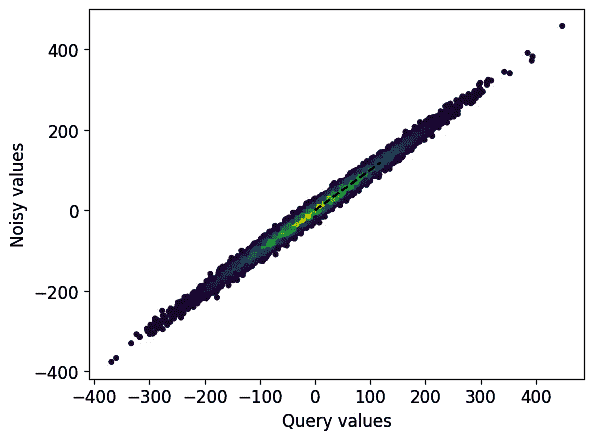
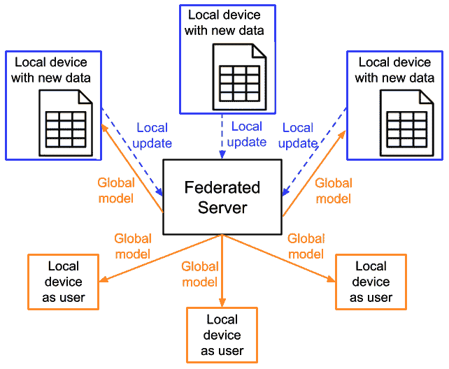

# 机器学习中的安全和隐私

在我们生活的数字世界中，保护用户数据和个人隐私，以及确保他们的数字信息和资产的安全，在技术发展中具有重要意义。这对于建立在机器学习模型之上的技术也不例外。我们在*第三章*中简要讨论了这一主题，即*调试* *向负责任的人工智能*迈进。在本章中，我们将为您提供更多详细信息，以帮助您开始学习更多关于在开发机器学习模型和技术中保护隐私和确保安全的知识。

在本章中，我们将涵盖以下主题：

+   加密技术及其在机器学习中的应用

+   同态加密

+   差分隐私

+   联邦学习

到本章结束时，您将了解在机器学习环境中保护隐私和确保安全所面临的挑战，并学习一些应对这些挑战的技术。

# 技术要求

以下要求适用于本章，因为它们将帮助您更好地理解概念，能够在项目中使用它们，并使用提供的代码进行实践：

+   Python 库要求：

    +   `numpy` >= 1.22.4

    +   `matplotlib` >= 3.7.1

    +   `tenseal` >= 0.3.14

    +   `pycryptodome` = 3.18.0

    +   `pycryptodomex` = 3.18.0

如果您是 Mac 用户并且遇到`tenseal`安装问题，您可以按照[`github.com/OpenMined/TenSEAL/issues`](https://github.com/OpenMined/TenSEAL/issues)中解释的方法直接克隆其存储库进行安装。

本章的代码文件可在 GitHub 上找到，网址为[`github.com/PacktPublishing/Debugging-Machine-Learning-Models-with-Python/tree/main/Chapter16`](https://github.com/PacktPublishing/Debugging-Machine-Learning-Models-with-Python/tree/main/Chapter16)。

# 加密技术及其在机器学习中的应用

我们可以使用不同的加密技术来加密原始数据、用于模型训练和推理的处理数据、模型参数或需要保护的其他敏感信息。有一个术语叫做*密钥*，通常是一串数字或字母，在大多数加密技术中都很重要。密钥通过加密算法进行编码和解码数据的处理。有几种加密技术，其中一些如下（Bhanot 等人，2015；Dibas 等人，2021）：

+   **高级加密标准**（**AES**）：AES 是保护数据的最强大的加密算法之一。AES 接受不同的密钥大小：128 位、192 位或 256 位。

+   **Rivest-Shamir-Adleman (RSA) 安全性**：RSA 是安全性最高的加密算法之一，是一种广泛用于安全数据传输的公钥加密算法。

+   **三重数据加密标准 (DES)**：三重 DES 是一种使用 56 位密钥加密数据块的加密方法。

+   **Blowfish**：Blowfish 是一种对称密钥加密技术，用作 DES 加密算法的替代方案。Blowfish 速度快，在数据加密方面非常有效。它将数据，例如字符串和消息，分割成 64 位的块，并分别加密它们。

+   **Twofish**：Twofish 是 Blowfish 的后继者，是一种对称加密算法，可以解密 128 位数据块。

接下来，我们将使用 Python 来练习使用 AES 进行数据加密，这是最常见的加密技术之一。

## 在 Python 中实现 AES 加密

在这里，我们希望通过 Python 练习 AES 在数据加密中的应用。这次练习的唯一目的是帮助您更好地了解如何从 Python 中受益于数据加密，以及如何在 Python 中加密和解密数据是多么容易，以及您如何从中受益以保护数据隐私并在机器学习环境中确保安全性。

我们首先导入`Cryptodome.Cipher.AES()`进行加密（加密）和解密，以及`Cryptodome.Random.get_random_bytes()`用于密钥生成：

```py
from Cryptodome.Cipher import AESfrom Cryptodome.Random import get_random_bytes
```

我们可以使用 AES 加密文本，如`我的名字是 Ali`或其他类型的信息。在这里，我们希望用它来加密所谓的 SMILES，这是一种表示化学化合物的序列。例如，`CC(=O)NC1=CC=C(C=C1)O`代表一种著名的药物叫做对乙酰氨基酚（来源：[`pubchem.ncbi.nlm.nih.gov/compound/Acetaminophen`](https://pubchem.ncbi.nlm.nih.gov/compound/Acetaminophen)）：

```py
data = b'CC(=O)NC1=CC=C(C=C1)O'key_random = get_random_bytes(16)
cipher_molecule = AES.new(key_random, AES.MODE_EAX)
ciphertext, tag = cipher_molecule.encrypt_and_digest(data)
out_encrypt = open("molecule_enc.bin", "wb")
[out_encrypt.write(x) for x in (cipher_molecule.nonce, tag,
    ciphertext) ]
out_encrypt.close()
```

如果我们有密钥，我们可以解密并安全地加载数据：

```py
in_encrypt = open("molecule_enc.bin", "rb")nonce, tag, ciphertext = [in_encrypt.read(x) for x in (16,
    16, -1) ]
in_encrypt.close()
# let's assume that the key is somehow available again
decipher_molecule = AES.new(key_random, AES.MODE_EAX,nonce)
data = decipher_molecule.decrypt_and_verify(ciphertext,tag)
print('Decrypted data: {}'.format(data))
```

这将重新生成我们加密的序列`CC(=O)NC1=CC=C(C=C1)O`。

在这个例子中，AES 帮助我们加密有关药物的信息，这对于制药和生物技术公司在开发新药的过程中可能很重要。然而，您可以通过 Python 使用 AES 加密其他类型的数据。

接下来，我们将讨论另一种称为同态加密的技术。

# 同态加密

另一种允许我们在加密数据上执行计算的技术称为**同态加密**。这种能力在机器学习环境中非常有用，例如，在不需要解密的情况下使用模型对加密数据进行推理。然而，实现全同态加密可能很复杂，计算成本高，内存效率低（Armknecht 等人，2015；Gentry 等人，2009；Yousuf 等人，2020）。

有几个 Python 库可以帮助我们练习同态加密方案，如下所示：

+   `TenSEAL` ([`github.com/OpenMined/TenSEAL`](https://github.com/OpenMined/TenSEAL))，它可以与 PyTorch 和 NumPy 集成

+   `PySEAL` ([`github.com/Huelse/PySEAL`](https://github.com/Huelse/PySEAL))

+   `HElib` (https://github.com/homenc/HElib)

让我们看看使用 TenSEAL 进行同态加密的一个简单示例。

我们首先导入`TenSEAL`库，并使用`tenseal.context()`生成一个`context`对象。`context`对象生成并存储加密计算所需的必要密钥：

```py
import tenseal as tscontext = ts.context(ts.SCHEME_TYPE.BFV,
    poly_modulus_degree=4096, plain_modulus=1032193)
```

`poly_modulus_degree`参数用于确定多项式模的次数，这是一个具有整数系数的多项式。`plain_modulus`参数用于指定编码明文消息到可以加密和同态处理的多项式的模数。如果`plain_modulus`参数太小，消息可能会溢出并导致错误的结果，而如果太大，密文可能会变得过大并减慢同态操作的速度。

在之前的代码中，我们使用了**Brakerski-Fan-Vercauteren**（**BFV**）方案。BFV 是一种支持整数算术的同态加密方案。它包括不同的多项式时间算法，用于生成公钥和私钥、加密明文消息、解密密文消息、对两个密文进行加法和减法以及乘法运算。密文是加密信息，在没有适当的密钥或执行加密或解密算法的情况下，我们或计算机无法读取，或者算法无法解密它。

现在我们定义一个包含三个数字的列表：

```py
plain_list = [50, 60, 70]
```

然后我们使用之前定义的`context`对象实现解密：

```py
encrypted_list = ts.bfv_vector(context, plain_list)
```

然后我们首先实现以下操作过程：

```py
add_result = encrypted_vector + [1, 2, 3]
```

生成的`add_result`列表将是`[51, 62, 73]`，这是原始值列表`[50, 60, 70]`和`[1, 2, 3]`逐元素求和的结果。

虽然同态加密或其他加密技术看起来非常安全，但它仍然需要访问密钥，例如在云服务器上，这可能导致安全担忧。有解决方案可以降低这种风险，例如使用密钥管理服务，如 AWS KMS（[`aws.amazon.com/kms/`](https://aws.amazon.com/kms/)) 或**多因素认证**（**MFA**）。

接下来，我们将简要回顾**差分隐私**（**DP**）作为一种保护单个数据点隐私的技术。

# 差分隐私

**差分隐私**的目标是确保删除或添加单个数据点不会影响建模的结果。例如，通过向正态分布添加随机噪声，它试图使单个数据点的特征变得模糊。如果可以访问大量数据点，基于**大数定律**（Dekking et al., 2005），可以消除噪声在学习中的影响。为了更好地理解这个概念，我们想要生成一个随机数字列表，并从正态分布中向它们添加噪声，以帮助您更好地理解为什么这种技术有效。在这个过程中，我们还将定义一些广泛使用的技术术语。

我们首先定义一个名为`gaussian_add_noise()`的函数，用于向查询值列表添加**高斯**噪声：

```py
def gaussian_add_noise(query_result: float,    sensitivity: float, epsilon: float):
        std_dev = sensitivity / epsilon
        noise = np.random.normal(loc=0.0, scale=std_dev)
        noisy_result = query_result + noise
    return noisy_result
```

在前面的函数中，我们使用了`sensitivity`和`epsilon`作为函数的输入参数，其意义可以简化如下：

+   `sensitivity`: DP 机制中所需的噪声水平由灵敏度参数确定。灵敏度告诉我们查询结果对变化的影响。较大的`sensitivity`值将导致更好的隐私，但响应的准确性较低。

+   `epsilon (隐私预算)`: 隐私预算是一个参数，它限制了噪声数据和查询数据之间偏差的程度。较小的`epsilon`值将导致更好的隐私，但响应的准确性较低。

然后，我们使用一个简单的`for`循环来生成符合正态分布的随机值作为查询值，然后使用定义的`gaussian_mechanism()`函数向它们添加噪声：

```py
query_list = []noisy_list = []
for iter in range(1000):
    # Generating a random value between 0 and 100
    query_val = np.random.rand()*100
    noisy_val = gaussian_add_noise(query_val, sensitivity,
        epsilon_budget)
    query_list.append(query_val)
    noisy_list.append(noisy_val)
print('Mean of the original distribution:
    {}'.format(np.mean(query_list)))
print('Mean of the nosiy distribution:
    {}'.format(np.mean(noisy_list)))
print('Standard deviation of the original distribution:
    {}'.format(np.std(query_list)))
print('Standard deviation of the nosiy distribution:
    {}'.format(np.std(noisy_list)))
```

结果的噪声和查询分布非常相似，平均值为 0.78 和 0.82，标准差分别为 99.32 和 99.67。*图 16**.1*显示了这两组值的散点图。你可以通过调整`sensitivity`和`epsilon`参数来改变查询值和噪声值之间的距离。



图 16.1 – 添加噪声前后变量值的比较

此外，还有一些 Python 库可以帮助你实现 DP，如下所示：

+   `Diffprivlib`) ([`github.com/IBM/differential-privacy-library`](https://github.com/IBM/differential-privacy-library))

+   `PyDP`([`github.com/OpenMined/PyDP`](https://github.com/OpenMined/PyDP))

+   `Opacus`([`github.com/pytorch/opacus`](https://github.com/pytorch/opacus))

本章最后要介绍的主题被称为**联邦学习**，它帮助我们超越中央存储系统的隐私保护。

# 联邦学习

**联邦学习**（**FL**）依赖于去中心化学习、数据分析和解推理的想法，因此允许用户数据保持在单个设备或本地数据库中（Kaissis 等人，2020 年；Yang 等人，2019 年）。通过 FL，我们可以从无法存储在集中式数据存储系统中的本地设备和用户数据中受益，以训练和改进我们的机器学习模型。如图*图 16**.2*所示，本地设备或用户可以提供本地数据以更新全局模型和我们正在训练的模型，并改善中心服务器。然后全局模型得到更新和改进，并向本地用户和设备提供更新的推理。



图 16.2 – 使用本地数据更新模型并反馈全局模型到本地设备和用户的示意图

在实现联邦学习（FL）时，你可以从以下 Python 库中受益：

+   `PySyft` (`https://github.com/OpenMined/PySyft`)

+   TensorFlow `Federated` ([`www.tensorflow.org/federated`](https://www.tensorflow.org/federated))

+   `FedML` ([`github.com/FedML-AI/FedML`](https://github.com/FedML-AI/FedML))

+   `Flower` ([`github.com/adap/flower`](https://github.com/adap/flower))

+   `FATE` ([`github.com/FederatedAI/FATE`](https://github.com/FederatedAI/FATE))

然而，在实践中使用联邦学习的挑战超出了编程或基础设施设计。尽管这是存储用户数据本地化的绝佳替代方案，但在不同应用中从联邦学习中受益仍存在伦理、法律和商业挑战。医疗保健是一个联邦学习可以带来最大利益的领域，但法律和伦理挑战仍然存在，这减缓了其实际应用的实施。许多机构、医院、制药公司和政府机构仍然要求用于建模的数据，即使通过联邦学习，也需要经过通常用于完全访问数据的伦理、法律和商业审批流程。然而，随着联邦学习算法和相关基础设施的改进，机构、医院和机构也将提出解决方案，以利用这项技术。

除了本章中关于数据隐私和安全的讨论，你还可以在*第三章* *向负责任的人工智能调试*中回顾机器学习设置中的重要攻击主题。你还可以检查其他资源，如 Papernot 等人 2018 年发表的优秀文章《Sok：机器学习中的安全和隐私》以了解更多关于这些重要主题的信息。

# 摘要

在本章中，你了解了一些帮助你保护隐私和确保安全的重要概念和技术，包括数据加密技术、同态加密、差分隐私和联邦学习。你学习了同态加密如何提供与传统数据加密技术相比不同类型操作和机器学习推理的可能性。你还学习了如何通过向数据添加噪声、在差分隐私中，或者与去中心化数据合作并省略传输原始数据的需求，如在联邦学习中，来确保数据隐私。你还在 Python 中实践了一些这些技术。这些知识可以成为你进一步了解这些概念并从你的机器学习项目中受益的起点。

在下一章中，你将了解将人类反馈整合到机器学习建模中的重要性以及有助于这一主题的技术。

# 问题

1.  解释三种可以帮助你在机器学习项目中使用的加密技术。

1.  在机器学习设置中，同态加密有什么好处？

1.  什么是差分隐私？

1.  使用联邦学习或差分隐私时有哪些非技术挑战？

# 参考文献

+   Shafahi, Ali, 等人. “*免费对抗训练!*.” *神经信息处理系统进展* 32 (2019).

+   Gaur, Shailendra Singh, Hemanpreet Singh Kalsi, 和 Shivani Gautam. “*加密算法的比较研究和分析：RSA, DES, AES, BLOWFISH, 3-DES, 和 TWOFISH*。”

+   Bhanot, Rajdeep, 和 Rahul Hans. “*各种加密算法的综述和比较分析*.” *国际安全与应用杂志* 9.4 (2015): 289-306.

+   Dibas, Hasan, 和 Khair Eddin Sabri. “*对称算法（AES, 3DES, Blowfish 和 Twofish）的全面性能实证研究*.” *信息技术国际会议 (ICIT)*. IEEE (2021).

+   Armknecht, Frederik, 等人. “*完全同态加密指南*.” 密码学电子档案 (2015).

+   Gentry, Craig. *全同态加密方案*. 斯坦福大学，2009.

+   Yousuf, Hana, 等人. “*关于全同态加密方案及其应用的系统综述*.” *智能系统和智能应用最新进展* (2020): 537-551.

+   Yang, Qiang, 等人. “*联邦机器学习：概念和应用*.” *ACM 智能系统与技术交易 (TIST)* 10.2 (2019): 1-19.

+   Abadi, Martin, 等人. “*具有差分隐私的深度学习*.” *2016 年 ACM SIGSAC 计算机和通信安全会议论文集* (2016).

+   Dekking, Frederik Michel, 等人. *现代概率与统计导论：理解为什么以及如何*. 第 488 卷. 伦敦：Springer (2005).

+   Kaissis, Georgios A., 等人. “*医学图像中的安全、隐私保护和联邦机器学习*.” *自然机器智能* 2.6 (2020): 305-311.

+   Yang, Qiang, 等人. “*联邦机器学习：概念和应用*.” *ACM 智能系统与技术交易 (TIST)* 10.2 (2019): 1-19.

+   Papernot, Nicolas, 等人. “*机器学习中的安全和隐私（Sok）*.” *IEEE 欧洲安全与隐私研讨会 (EuroS&P)*. IEEE (2018).
