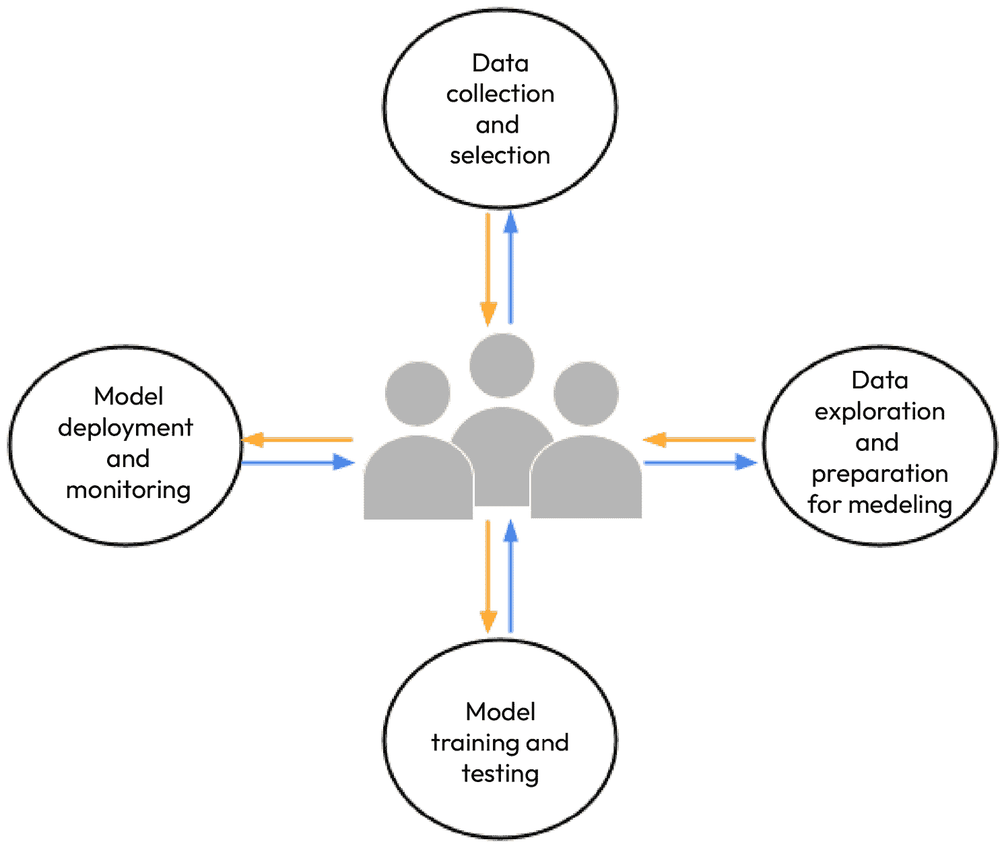

# 人类在环机器学习

机器学习建模不仅仅是机器学习开发者和工程师坐在电脑后面构建和修改机器学习生命周期的组件。融入领域专家或非专家群体的反馈对于将更可靠和应用导向的模型投入生产至关重要。这个被称为人类在环机器学习的概念，是关于在不同生命周期阶段利用人类智能和专业知识来进一步提高我们模型的性能和可靠性。

本章将涵盖以下主题：

+   机器学习生命周期中的人类

+   人类在环建模

到本章结束时，你将了解在机器学习建模项目中融入人类智能的好处和挑战。

# 机器学习生命周期中的人类

开发和改进机器学习生命周期的不同组件，以将可靠且高性能的模型投入生产是一个需要专家和非专家人类反馈的协作努力（*图 17.1*）：



图 17.1 – 机器学习生命周期中的人类

例如，放射科医生可以在标注放射学图像时提供帮助，而大多数具有良好视觉能力的人可以轻松地标注猫和狗的图像。但融入人类反馈并不限于生命周期开始时的数据标注。

我们可以利用人类智能和专业知识来改进生命周期中的数据准备、特征工程和表示学习等方面，以及模型训练和测试，最终实现模型的部署和监控。在这些每个阶段，人类反馈都可以被动或主动地融入，这使我们能够将更好的模型投入生产。

被动的人类在环是关于收集专家和非专家的反馈和信息，并在下一次修改相应的机器学习建模系统的组件时从中受益。在这个过程中，反馈和额外信息有助于识别改进生命周期组件的机会，以及识别数据漂移和概念漂移，以将更好的模型投入生产。在主动的人类在环机器学习中，基础设施和生命周期的一个或所有组件需要以某种方式设计，以便额外的人类在环信息和数据可以主动和持续地融入，以改进数据分析建模。

首先，我们将回顾专家反馈收集以及如何有效地从中受益来改进我们的模型。

## 专家反馈收集

在一个或多个机器学习模型之上构建一项技术的最终目标是提供一个工具，供用户、专家或非专家用于特定目标，例如医疗图像分类、股价预测、信用风险评估以及亚马逊等平台上的产品推荐。例如，我们可以收集数据标注或生产阶段后期用于漂移检测的反馈。然后我们可以利用这些反馈来改进我们的模型。然而，这种反馈可能超出了仅仅数据标注或识别数据和概念漂移的目的。

我们可以将专家反馈纳入四个主要目的：数据生成和标注、数据过滤、模型选择和模型监控。专家反馈收集对于标注和监控通常与非专家数据收集相似，除了在某些应用中，专业知识是必需的，例如在分类放射学图像时。

对于模型选择，我们可以利用专家反馈，不仅依赖于我们用于模型性能评估的性能指标，而且根据错误预测检测红旗，或者根据模型的解释性信息进行选择，例如，如果对预测贡献最大的特征具有最低的相关性。

我们还可以从专家的反馈中受益，以监控我们的模型。正如在*第十一章*“避免和检测数据及概念漂移”中讨论的那样，漂移检测对于确保我们的模型在生产中的可靠性至关重要。在许多应用中，我们模型的使用者可能是特定领域的专家，例如医疗保健和药物发现。在这种情况下，我们需要确保我们持续收集他们的反馈，并利用这些反馈来检测和消除模型中的漂移。

从我们机器学习模型的使用者那里收集专家反馈不应仅限于获取他们“好”与“坏”的二进制响应。我们需要提供关于我们的模型及其预测的足够信息，并要求专家提供以下反馈：

+   **提供足够的信息**：当我们向我们的模型专家用户请求反馈时，我们需要提供足够的信息以获得更好和更相关的反馈。例如，除了我们的模型在测试和生产中的性能，或针对一组特定数据点的错误和正确预测之外，我们还可以提供关于模型如何针对这些数据点做出决策的解释性信息。这类信息可以帮助用户提供更好的反馈，从而帮助我们改进模型。

+   **不要要求翻译**：我们模型的许多用户可能对统计和机器学习建模知识有限。因此，要求他们将自己的意见和想法转换为技术术语将限制有效的反馈收集。你需要提供足够的信息，并要求他们的反馈，进行双向对话，将他们的见解转化为改进模型的行动项。

+   **设计自动化反馈收集**：虽然最好不要求翻译，如前所述，你可以通过使用清晰详细的问题和适当的基础设施设计来收集反馈并将其纳入模型，从而朝着更自动化的反馈收集迈进。例如，你可以使用机器学习可解释性，并询问模型用于预测特定数据点集输出的最有信息量的特征是否与任务相关。

环境中的人类建模有其自身的挑战，例如，当需要第三方公司监控模型和管道时，或者在分享来自合作者和商业伙伴的数据时存在特定的法律障碍，我们团队和组织中的其他人。在设计时，我们需要牢记这些挑战，以便我们可以在机器学习生命周期中从人类反馈中受益。

尽管我们可以在机器学习生命周期的不同阶段收集反馈来改进我们的模型，但还有一些技术，如主动学习（我们将在下一节中介绍），可以帮助我们以更低的成本将更好的模型投入生产。

# 环境中的人类建模

尽管更多高质量的标注数据点更有价值，但标注数据的成本可能非常高，尤其是在需要领域专业知识的情况下。主动学习是一种帮助我们以较低成本生成和标注数据以改进模型性能的策略。在主动学习环境中，我们旨在利用有限的数据量，迭代选择新的数据点进行标注，或识别其连续值，以达到更高的性能（Wu et al., 2022; Ren et al., 2021; Burbidge et al., 2007）。模型会查询需要由专家或非专家标注的新实例，或者通过任何计算或实验技术识别其标签或连续值。然而，与随机选择实例不同，有新技术用于选择新实例，以帮助我们以更少的实例和迭代次数实现更好的模型（*表 17.1*）。每种技术都有其优缺点。例如，*不确定性采样*简单，但如果实例预测输出的不确定性没有高度相关于模型错误，其对性能的影响可能有限：

| **数据中心** | **模型中心** |
| --- | --- |
| **不确定性采样**选择具有最大不确定性的实例（在推理中），这些实例可能是分类问题中离决策边界最近的实例 | **预期模型变化**选择已知标签的实例，对当前模型的影响最大 |
| **密度加权不确定性采样**选择不仅具有最高不确定性，而且代表了许多其他依赖特征空间数据密度的数据点的实例 | **误差减少估计**选择已知标签的实例，将导致最大的未来误差减少 |
| **委员会查询**多个模型（委员会）被训练，并选择预测中分歧最大的实例 | **方差减少**选择已知标签的实例，将导致模型对其参数的不确定性减少最多 |

表 17.1 – 每个步骤中用于实例选择的主动学习技术

在本章中，我们专注于介绍人类在循环背后的概念和技术。然而，有一些 Python 库，如`modAL` ([`modal-python.readthedocs.io/en/latest/`](https://modal-python.readthedocs.io/en/latest/))，可以帮助你在项目中实现一些这些技术，将人类反馈引入你的机器学习生命周期。

# 摘要

在本章中，你了解了一些人类在循环机器学习中的重要概念，这些概念可以帮助你在与专家或非专家的团队合作中更好地建立协作，以便你可以将他们的反馈纳入你的机器学习建模项目中。

这是本书的最后一章。我希望你学到了足够多的关于提高机器学习模型和构建更好模型的不同方法，以便你可以开始你的旅程，成为这个领域的专家。

# 问题

1.  人类在循环机器学习是否仅限于数据标注和标签化？

1.  在主动学习过程的每个步骤中，不确定性采样和密度加权不确定性采样在实例选择上的区别是什么？

# 参考文献

+   Amershi, Saleema, 等人。*赋予人民力量：人类在交互式机器学习中的作用*. 人工智能杂志 35.4（2014）：105-120。

+   Wu, Xingjiao, 等人。*人机交互机器学习综述*. 未来一代计算机系统 135（2022）：364-381。

+   Ren, Pengzhen, 等人。*深度主动学习综述*. ACM 计算调查（CSUR）54.9（2021）：1-40。

+   Burbidge, Robert, Jem J. Rowland, 和 Ross D. King. *基于委员会查询的回归主动学习*. 智能数据工程与自动学习-IDEAL 2007：第 8 届国际会议，英国伯明翰，2007 年 12 月 16-19 日。第 8 卷。Springer Berlin Heidelberg，2007。

+   Cai, Wenbin, Ya Zhang, 和 Jun Zhou. *最大化回归中主动学习的预期模型变化*. 2013 年第 13 届国际数据挖掘会议。IEEE，2013。

+   Roy, Nicholas, 和 Andrew McCallum. *通过蒙特卡洛估计误差减少实现最优主动学习*. ICML，威廉斯塔特 2（2001）：441-448。

+   Donmez, Pinar, Jaime G. Carbonell, 和 Paul N. Bennett. *双重策略主动学习*. 机器学习：ECML 2007：第 18 届欧洲机器学习会议，波兰华沙，2007 年 9 月 17-21 日。第 18 卷。Springer Berlin Heidelberg，2007。

# 评估

# *第一章* – 超越代码调试

1.  是的——这里有一个在本章中提供的例子：

    ```py
    def odd_counter(num_list: list):    """    :param num_list: list of integers to be checked for identifying odd numbers    :return: return an integer as the number of odd numbers in the input list    """    odd_count = 0    for num in num_list:        if (num % 2) == 0:            print("{} is even".format(num))        else:            print("{} is even".format(num))        odd_count += 1    return odd_countnum_list = [1, 2, 5, 8, 9]print(odd_counter(num_list))
    ```

1.  这里是它们的定义：

    +   `AttributeError`：当对一个未为其定义属性的对象使用属性时，会引发此类错误。例如，`isnull`未在列表中定义。因此，`my_list. isnull()`会导致`AttributeError`。

    +   `NameError`：当你尝试调用未在代码中定义的函数、类或其他名称和模块时，会引发此错误。例如，如果你没有在代码中定义`neural_network`类，但在代码中调用它为`neural_network()`，你将得到`NameError`消息。

1.  高维性使得特征空间更稀疏，可能会降低模型在分类设置中识别可推广决策边界的信心。

1.  当你在 Python 中遇到错误信息时，它通常会提供必要的信息来帮助你找到问题。这些信息创建了一个类似报告的消息，关于代码中发生错误的行，错误类型，以及导致这些错误的功能或类调用。这种类似报告的消息在 Python 中称为**回溯**。

1.  **增量编程**：为每个小组件编写代码，然后测试它，例如使用 PyTest 编写测试代码，这可以帮助你避免每个编写的功能或类的问题。它还帮助你确保作为另一个模块输入的模块的输出是兼容的。

**日志记录**：当你用 Python 开发函数和类时，你可以从日志记录中受益，将信息、错误和其他类型的消息记录下来，以帮助你识别在收到错误信息时的潜在问题来源。

1.  例如，如果你使用专家，如放射科医生，为癌症诊断标注医学图像，那么对图像标签的信心可能不同。这些信心可以在建模阶段考虑，无论是在数据收集过程中，例如通过要求更多专家标注相同的图像，还是在建模过程中，例如通过根据标签的信心为每个图像分配权重。你的数据特征也可能具有不同的质量。例如，你可能具有高度稀疏的特征，这些特征在数据点中大部分为零值，或者具有不同置信水平的特征。例如，如果你使用卷尺来捕捉物体尺寸（如骰子）之间的毫米差异，而不是使用相同的卷尺来捕捉更大物体（如家具）之间的差异，那么测量特征将具有较低的置信度。

1.  你可以通过控制模型复杂度来控制欠拟合和过拟合。

1.  是的，这是可能的。用于训练和测试机器学习模型的数据可能会过时。例如，服装市场趋势的变化可能会使服装推荐模型的预测变得不可靠。

1.  仅通过调整模型超参数，你无法开发出最佳可能的模型。同样，通过增加数据和超参数的质量和数量，同时保持模型超参数不变，你也不能达到最佳性能。因此，数据和超参数是相辅相成的。

# *第二章* – 机器学习生命周期

1.  清洗过程的例子包括在数据中填充缺失值和移除异常值。

1.  One-hot 编码为每个分类特征类别生成一个新特征。标签编码保持相同的特征，只是将每个类别替换为分配给该类别的数字。

1.  检测异常值的最简单方法是通过使用变量值分布的分位数。超出上下界限的数据点被认为是异常值。下限和上限可以计算为*Q1-a.IQR*和*Q3+a.IQR*，其中*a*可以是一个介于 1.5 和 3 之间的实数值。*a*的常用值也是默认用于绘制箱线图的 1.5，但使用更高的值会使异常值识别过程不那么严格，并允许检测到更少的数据点作为异常值。

1.  如果你想在医院医生的电脑上部署一个模型，以便临床医生直接使用，你需要考虑所有必要的困难和规划，以设置适当的生产环境以及所有软件依赖项。你还需要确保他们的本地系统满足必要的硬件要求。如果你想在银行系统中部署在聊天机器人背后的模型，这些就不是需要考虑的因素。

# *第三章* – 负责任的人工智能调试

1.  **数据收集偏差**：收集的数据可能存在偏差，例如性别偏差，如在亚马逊的应聘者排序示例中，种族偏差，如在 COMPAS 中，社会经济偏差，如在住院示例中，或其他类型的偏差。

**抽样偏差**：数据偏差的另一个来源可能是数据收集阶段的生命周期中数据点的抽样或人群的抽样过程。例如，在抽样学生填写调查时，我们的抽样过程可能偏向于女孩或男孩，富裕或贫穷的学生家庭，或高年级与低年级学生。

1.  **完美知识白盒攻击**：攻击者了解系统的所有信息。

**零知识黑盒攻击**：攻击者对系统本身没有任何了解，但通过在生产中对模型进行预测来收集信息。

1.  加密过程将信息、数据或算法转换成新的（即，加密）形式。如果个人有权访问加密密钥（即，解密过程中必要的密码式密钥），则加密数据可以被解密（即，成为可读或机器可理解的）。这样，在没有加密密钥的情况下获取数据和算法将几乎不可能或非常困难。

1.  **差分隐私**试图确保删除或添加单个数据点不会影响建模的结果。它试图从数据点的组中学习模式。例如，通过添加来自正态分布的随机噪声，它试图使单个数据点的特征变得模糊。如果可以访问大量数据点，则可以根据大数定律消除学习中的噪声效应。

**联邦学习**依赖于分散学习、数据分析和推理的想法，从而允许用户的数据保留在单个设备或本地数据库中。

1.  透明度有助于在用户中建立信任，并可能增加信任并使用您模型的用户数量。

# *第四章* – 在机器学习模型中检测性能和效率问题

1.  在初步诊断测试中，随着更精确的后续测试，我们希望确保我们不会失去任何我们正在测试的疾病患者。因此，我们需要旨在减少假阴性，同时尝试减少假阳性。因此，我们可以旨在最大化**召回率**，同时控制**精确度**和**特异性**。

1.  在这种情况下，您需要确保您有 **精确度** 来控制风险并建议良好的投资机会。这可能会导致较低的 **召回率**，这是可以接受的，因为不良投资可能导致个人投资者资本的重大损失。在这里，我们不考虑投资风险管理的细节，而希望对如何选择良好的性能指标有一个高层次的理解。如果您是这个领域的专家，考虑您的知识，并选择一个满足您已知要求的良好性能指标。

1.  ROC-AUC 是一个汇总指标。具有相同 ROC-AUC 的两个模型可能对个别数据点的预测不同。

1.  **MCC** 关注预测标签，而 **log-loss** 关注测试数据点的预测概率。因此，较低的 **log-loss** 并不一定导致较低的 **MCC**。

1.  不一定。*R*2 并不考虑数据维度（即特征、输入或独立变量的数量）。具有更多特征的模型可能导致更高的 *R*2，但这不一定是一个更好的模型。

1.  这取决于用于评估模型泛化能力的性能指标和测试数据。我们需要为生产中的目标使用正确的性能指标，并使用一组数据点进行模型测试，这组数据点将更能反映生产中未见数据。

# *第五章* – 提高机器学习模型的性能

1.  增加更多的训练数据点可以帮助减少方差，而增加更多的特征可以帮助减少偏差。然而，通过添加新的数据点来减少方差，或者新特征是否有助于减少方差，都没有保证。

**优化过程中的权重分配**：在训练机器学习模型时，您可以根据类别标签的置信度，为每个数据点分配一个权重。

**集成学习**：如果您考虑每个数据点的质量或置信度分数的分布，那么您可以使用分布的每个部分的数据点构建不同的模型，然后结合这些模型的预测，例如使用它们的加权平均。

**迁移学习**：您可以在具有不同标签置信度级别的大数据集上训练一个模型（参见 *图 5**.3*），排除非常低置信度的数据，然后在数据集非常高置信度的部分进行微调。

1.  通过提高识别决策边界的置信度，在分类设置中，少数类是稀疏的。

1.  如果我们使用 Borderline-SMOTE，新合成的数据点将接近多数类数据点，这有助于识别一个可推广的决策边界。

在 DSMOTE 中，**DBSCAN** 用于将少数类的数据点划分为三个组：核心样本、边界样本和噪声（即异常）样本，然后仅使用核心和边界样本进行过采样。

1.  如本章所述，搜索所有可能的超参数组合并不是必要的。

1.  是的，L1 正则化可以消除特征对正则化过程的贡献。

1.  是的，这是可能的。

# *第六章* – 机器学习建模中的可解释性和可解释性

1.  可解释性可以帮助提高性能，例如通过减少模型对特征值小变化的敏感性，提高模型训练中的数据效率，试图帮助模型进行适当的推理，以及避免虚假相关性。

1.  **局部可解释性**帮助我们理解模型在特征空间中接近数据点的行为。尽管这些模型满足局部保真度标准，但被识别为局部重要的特征可能不是全局重要的，反之亦然。

**全局可解释性**技术试图超越局部可解释性，并为模型提供全局解释。

1.  线性模型虽然可解释，但通常性能较低。相反，我们可以从更复杂、性能更高的模型中受益，并使用可解释性技术来理解模型是如何得出其预测的。

1.  是的，确实如此。可解释性技术可以帮助我们了解哪些模型是预测一组数据点的主要贡献者。

1.  SHAP 可以确定每个特征对模型预测的贡献。由于特征在确定分类模型的决策边界并最终影响模型预测方面是协同工作的，SHAP 尝试首先识别每个特征的边际贡献，然后提供 Shapely 值作为每个特征与整个特征集合作预测模型的估计。

LIME 是 SHAP 的替代品，用于 **局部可解释性**，它以模型无关的方式解释任何分类器或回归器的预测，通过在局部近似一个可解释的模型。

1.  反事实示例或解释有助于我们确定在实例中需要改变什么才能改变分类模型的输出。这些反事实可以帮助在许多应用中识别可操作的路径，例如金融、零售、营销、招聘和医疗保健。例如，我们可以用它们来建议银行客户如何改变其贷款申请被拒绝的情况。

1.  如在*使用多样化的反事实解释（DiCE）生成反事实*部分所述，并非所有反事实都符合每个特征的定义和意义。例如，如果我们想建议一个 30 岁的人改变他们的结果，建议他们等到 50 多岁才这样做并不是一个有效且可行的建议。同样，建议将`hours_per_week`的工作时间从 38 小时增加到>80 小时也是不可行的。

# *第七章* – 减少偏差和实现公平性

1.  不一定。我们的模型中可能有敏感属性的代理，但不是我们的模型中。

1.  薪酬和收入（在某些国家），职业，犯罪指控的历史。

1.  不一定。根据**人口比例**来满足公平性并不一定会导致模型根据**均衡机会**来表现公平。

1.  **人口比例**是一个群体公平性定义，旨在确保模型的预测不依赖于给定的敏感属性，如种族或性别。

**均衡机会**在给定预测与给定敏感属性组独立且与真实输出无关时得到满足。

1.  不一定。例如，模型预测的主要贡献者中可能有 `'sex'` 的特征代理。

1.  我们可以使用可解释性技术来识别模型中的潜在偏差，然后计划改进它们以实现公平性。例如，我们可以识别男性和女性群体之间的公平性问题。

# *第八章* – 使用测试驱动开发控制风险

1.  `pytest`是一个简单易用的 Python 库，你可以用它来设计单元测试。设计的测试可以简单地用来测试代码的变化，并在整个开发过程和未来代码的变化中控制潜在错误的危险。

1.  在数据分析和机器学习建模的编程中，我们需要使用来自不同变量或数据对象的数据，这些数据可能来自本地机器或云端的文件，也可能来自数据库的查询，或者来自我们的测试的 URL。固定装置（Fixtures）通过消除在测试中重复相同代码的需要来帮助我们完成这些过程。将固定装置函数附加到测试上会在每个测试运行之前运行它，并将数据返回给测试。我们可以使用`pytest`文档页面上的示例（[`docs.pytest.org/en/7.1.x/how-to/fixtures.html`](https://docs.pytest.org/en/7.1.x/how-to/fixtures.html)）。

1.  差分测试试图检查同一输入上的软件的两个版本，即基版和测试版，并比较输出。这个过程有助于确定输出是否相同，并识别意外的差异。在差分测试中，基版已经过验证，被认为是批准的版本，而测试版需要与基版进行比较，以产生正确的输出。

1.  `mlflow`是一个广泛使用的机器学习实验跟踪库，我们可以在 Python 中使用它。跟踪我们的机器学习实验将帮助我们减少无效结论的风险和选择不可靠模型的风险。机器学习中的实验跟踪是关于保存有关实验的信息，例如已使用的数据、测试性能和用于性能评估的指标，以及用于建模的算法和超参数。

# *第九章* – 生产测试和调试

1.  **数据漂移**：如果生产中特征或独立变量的特征和意义与建模阶段不同，就会发生数据漂移。想象一下，你使用第三方工具为人们的健康或财务状况生成分数。该工具背后的算法可能会随时间变化，并且当你的模型在生产中使用时，其范围和意义将不会相同。如果你没有相应地更新你的模型，那么你的模型将不会按预期工作，因为特征值的含义在用于训练的数据和部署后的用户数据之间将不同。

**概念漂移**：概念漂移是指输出变量定义的任何变化。例如，由于概念漂移，训练数据和生产数据之间的实际决策边界可能不同，这意味着训练中的努力可能导致生产中的决策边界远离现实。

1.  **模型断言**可以帮助你早期发现问题，例如输入数据漂移或其他可能影响模型性能的意外行为。我们可以将模型断言视为在模型训练、验证甚至部署期间进行检查的一组规则，以确保模型的预测满足预定义的条件。模型断言可以从许多方面帮助我们，例如检测和诊断模型或输入数据的问题，使我们能够在它们影响模型性能之前解决这些问题。

1.  这里有一些集成测试组件的例子：

    +   **测试数据管道**：我们需要评估在模型训练之前的数据预处理组件，如数据整理，在训练和部署阶段之间是否一致。

    +   **测试 API**：如果我们的机器学习模型通过 API 公开，我们可以测试 API 端点以确保它们正确处理请求和响应。

    +   **测试模型部署**：我们可以使用集成测试来评估模型的部署过程，无论它是作为独立服务、容器内还是嵌入在应用程序中部署。这个过程帮助我们确保部署环境提供必要的资源，例如 CPU、内存和存储，并且如果需要，模型可以更新。

    +   **测试与其他组件的交互**：我们需要验证我们的机器学习模型能够与数据库、用户界面或第三方服务无缝工作。这可能包括测试模型预测在应用程序中如何存储、显示或使用。

    +   **测试端到端功能**：我们可以使用模拟真实场景和用户交互的端到端测试来验证模型的预测在整体应用程序的上下文中是准确、可靠和有用的。

1.  IaC 和配置管理工具，如 Chef、Puppet 和 Ansible，可以用于自动化软件和硬件基础设施的部署、配置和管理。这些工具可以帮助我们确保在不同环境中的一致性和可靠性。首先，在描述这些 IaC 工具对我们有什么用之前，我们需要定义两个重要的术语：客户端和服务器：

    +   **Chef** ([`www.chef.io/products/chef-infrastructure-management`](https://www.chef.io/products/chef-infrastructure-management)): Chef 是一款开源配置管理工具，它依赖于客户端-服务器模型，其中 Chef 服务器存储期望的配置，Chef 客户端将其应用于节点。

    +   **Puppet** ([`www.puppet.com/`](https://www.puppet.com/)): Puppet 是另一款开源配置管理工具，它可以在客户端-服务器模式下工作，也可以作为独立应用程序运行。Puppet 通过定期从 Puppet 主服务器拉取配置来强制执行节点上的期望配置。

    +   **Ansible** ([`www.ansible.com/`](https://www.ansible.com/)): Ansible 是一款开源且易于使用的配置管理、编排和自动化工具，它采用无代理架构来与节点通信并应用配置。

# *第十章* – 版本控制和可重复的机器学习建模

1.  **MLflow**: 我们在之前的章节中介绍了 MLflow 用于实验跟踪和模型监控，但您也可以用它进行数据版本化 ([`mlflow.org/`](https://mlflow.org/))。

**DVC**: 一个用于管理数据、代码和机器学习模型的开源版本控制系统。它旨在处理大型数据集，并与 Git 集成 ([`dvc.org/`](https://dvc.org/))。

**Pachyderm**: 一个提供机器学习工作流程可重复性、溯源和可扩展性的数据版本化平台 ([`www.pachyderm.com/`](https://www.pachyderm.com/))。

1.  No. 同一个数据文件的多个版本可以以相同的名称存储，并在需要时恢复和检索。

1.  在将数据分割为训练集和测试集或模型初始化时简单更改随机状态可能会导致训练集和评估集的参数值和性能不同。

# *第十一章* – 避免和检测数据漂移和概念漂移

1.  **幅度**：我们可能会遇到数据分布中不同的幅度差异，导致我们的机器学习模型发生漂移。数据分布中的小变化可能难以检测，而大变化可能更明显。

**频率**：漂移可能发生在不同的频率上。

1.  Kolmogorov-Smirnov 测试可用于数据漂移检测。

# *第十二章* – 深度学习超越 ML 调试

1.  是的，在正向传递中，已经计算出的参数被用于输出生成；然后，实际输出和预测输出之间的差异被用于反向传播过程中更新权重。

1.  在随机梯度下降中，每个迭代使用一个数据点来优化和更新模型权重，而在小批量梯度下降中，使用数据点的小批量（小子集）。

1.  每个批次或小批量是训练集中用于计算损失和更新模型权重的数据点的小子集。在每个 epoch 中，多个批次被迭代以覆盖所有训练数据。

1.  Sigmoid 和 softmax 函数通常用于输出层，将输出神经元的分数转换为介于零和一之间的值，用于分类模型。这被称为预测的概率。

# *第十三章* – 高级深度学习技术

1.  CNNs 可用于图像分类或分割——例如，用于放射学图像以识别恶性肿瘤（肿瘤区域）。另一方面，GNNs 可用于社交和生物网络。

1.  是的，确实如此。

1.  这可能会导致更多的错误。

1.  为了应对这一挑战，在称为填充的过程中，在单词序列或句子中的每个单词的标记 ID 之前或之后使用一个常见的 ID，例如 0。

1.  我们为 CNNs 和 GNNs 构建的类别具有相似的代码结构。

1.  边缘特征有助于你包含一些关键信息，具体取决于应用。例如，在化学中，你可以将化学键的类型作为边缘特征，而节点可以是图中的原子。

# *第十四章* – 机器学习最新进展简介

1.  基于 Transformer 的文本生成，VAEs 和 GANs。

1.  LLaMA 和 GPT 的不同版本。

1.  生成器，它可以是用于生成所需数据类型的神经网络架构，例如图像，生成图像的目的是欺骗判别器将其识别为真实数据。判别器学习在识别生成数据与真实数据相比保持良好。

1.  你可以通过具体说明问题和指定数据生成对象来提高你的提示。

1.  在 RLHF 中，奖励是根据人类反馈计算的，无论是专家还是非专家，这取决于问题。但奖励并不是像考虑语言模型等问题的复杂性那样预定义的数学公式。人类提供的反馈导致模型逐步改进。

1.  对比学习的想法是学习表示，使得相似数据点彼此更接近，而不同数据点则更远。

# *第十五章* – 相关性 versus 因果性

1.  是的。在监督学习中，你可以有与输出高度相关的特征，而这些特征并不是因果的。

1.  建立因果关系的一种方法是通过实验，如在**实验设计**中，我们测量因果特征变化对目标变量的影响。然而，这种实验研究可能并不总是可行或道德的。在**观察性研究**中，我们使用观察数据，而不是控制实验，并试图通过控制混杂变量来识别因果关系。

1.  **工具变量**用于因果分析，以克服观察性研究中常见的共同问题，即治疗变量和结果变量由其他变量（或混杂因素）共同决定，而这些变量未包含在模型中。这种方法从识别一个与治疗变量相关且与结果变量不相关（除了通过其对治疗变量的影响）的工具变量开始。

1.  从特征到结果的方向并不一定意味着因果性。但**贝叶斯**网络可以用来估计变量对结果的影响，同时控制混杂变量。

# *第十六章* – 机器学习中的安全和隐私

1.  **高级加密标准**（**AES**）：AES 是保护数据的最强大的加密算法之一。AES 接受不同的密钥大小：128 位、192 位或 256 位。

**三重数据加密标准**（**DES**）：三重 DES 是一种使用 56 位密钥加密数据块的加密方法。

**Blowfish**：Blowfish 是一种对称密钥加密技术，用作 DES 加密算法的替代方案。Blowfish 加密速度快，对数据加密非常有效。它将数据，例如字符串和消息，分成 64 位的块，并分别加密它们。

1.  我们可以在不需要解密的情况下使用模型对加密数据进行推理。

1.  **差分隐私**（**DP**）的目标是确保删除或添加单个数据点不会影响建模的结果。例如，通过向正态分布添加随机噪声，它试图使单个数据点的特征变得模糊不清。

1.  在实践中使用联邦学习（FL）或差分隐私（DP）的挑战不仅限于编程或基础设施设计。尽管存储用户数据本地有这样一个很好的替代方案，但在从不同应用中受益于 FL 时，仍然存在伦理、法律和商业挑战。

# *第十七章* – 循环中的人类机器学习

1.  不，例如，您可以通过**主动学习**将人类专家引入循环。

1.  在**不确定性采样**中，数据点仅根据推理中的不确定性被选中。但在**密度加权不确定性采样**中，实例不仅基于它们最高的不确定性被选中，还要代表依赖于特征空间中数据密度的许多其他数据点。
