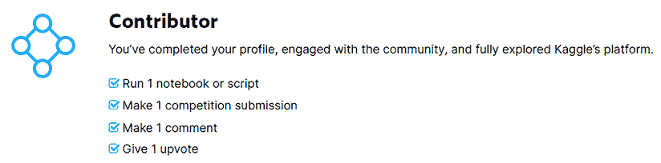
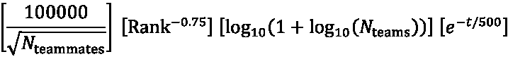

# 第一章：介绍 Kaggle 及其基本功能

Kaggle 是当前主要的竞争性预测建模平台。在这里，那些对机器学习充满热情的人，无论是专家还是新手，都有一个协作和竞争的环境来学习、获得认可、分享知识和回馈社区。该公司于 2010 年启动，最初只提供机器学习竞赛。目前，它是一个包含**竞赛**、**数据集**、**代码**、**讨论**、**学习**和最新增加的**模型**等标题的数据平台。

2011 年，Kaggle 经历了一轮投资，公司估值超过 2500 万美元。2017 年，它被 Google（现在是 Alphabet Inc.）收购，成为 Google Cloud 的一部分。Kaggle 最著名的关键人物是联合创始人 Anthony Goldbloom（长期 CEO，直到 2022 年）和 Ben Hammer（CTO）。最近，传奇的 Google 工程师 D. Sculley 成为 Kaggle 的新 CEO，继 Anthony Goldbloom 辞职参与新创业公司的发展之后。

在本章中，我们将探讨 Kaggle 平台为会员提供的主要部分。我们还将学习如何创建账户，了解平台的结构以及其主要部分。简而言之，本章将涵盖以下主题：

+   Kaggle 平台

+   Kaggle 竞赛

+   Kaggle 数据集

+   Kaggle 代码

+   Kaggle 讨论

+   Kaggle 学习

+   Kaggle 模型

如果您熟悉 Kaggle 平台，您可能已经了解这些功能。您可以选择继续阅读以下部分以刷新您对平台的知识，或者您可以选择跳过它们并直接进入下一章。

# Kaggle 平台

要开始使用 Kaggle，您必须创建一个账户。您可以使用电子邮件和密码注册，或者直接使用 Google 账户进行身份验证。一旦注册，您可以通过创建包含您的姓名、图片、角色和当前组织的个人资料开始。然后您可以添加您的位置，这是可选的，以及一个简短的个人介绍。在您完成短信验证并在平台上添加一些基本内容（运行一个笔记本或脚本、提交一个竞赛、发表一条评论或给予一个点赞）之后，您也将从**新手**晋升到**贡献者**。以下图显示了如何成为贡献者的清单。如您所见，所有项目都已勾选，这意味着用户已经晋升到**贡献者**级别。

图 1.1：成为贡献者的清单

在完成整个**贡献者**清单后，您就准备好开始您的 Kaggle 之旅了。

当前平台包含多个功能。其中最重要的包括：

+   **竞赛**：这是 Kagglers 可以参加竞赛并提交解决方案以获得评分的地方。

+   **数据集**：在这个部分，用户可以上传数据集。

+   **代码**：这是 Kaggle 最复杂的功能之一。也称为内核或笔记本，它允许用户添加代码（独立或与数据集和比赛相关联），修改它，运行它以执行分析，准备模型，并为比赛生成提交文件。

+   **讨论**：在这个部分，平台上的贡献者可以为比赛、笔记本或数据集添加主题和评论。主题也可以独立添加，并链接到如*入门*等主题。

每个这些部分都允许你根据 Kaggle 的进步系统获得奖牌。一旦你开始为这些部分中的任何一个做出贡献，你还可以在相应部分的 Kaggle 整体排名系统中获得排名。获得奖牌主要有两种方法：在比赛中获得前几名，以及在**数据集**、**代码**和**讨论**部分获得点赞。

除了**比赛**、**数据集**、**代码**和**讨论**之外，Kaggle 还有两个更多内容相关的部分：

+   **学习**：这是 Kaggle 最酷的功能之一。它包含了一系列关于各种主题的讲座和教程，从编程语言的基本介绍到高级主题，如计算机视觉、模型可解释性和 AI 伦理。你可以使用 Kaggle 的所有其他资源作为讲座的支持材料（数据集、比赛、代码和讨论）。

+   **模型**：这是 Kaggle 上最新引入的功能。它允许你将模型加载到你的代码中，就像你现在添加数据集一样。

现在我们已经快速了解了 Kaggle 平台的各种功能，以下部分将深入介绍比赛、数据集、代码、讨论、学习和模型。让我们开始吧！

# Kaggle 比赛

所有这一切都始于 12 年多前的比赛。第一个比赛只有少数参与者。随着对机器学习的兴趣日益增长以及 Kaggle 社区的扩大，比赛的复杂性、参与者的数量以及围绕比赛的兴趣显著增加。

要开始一场比赛，比赛主办方准备一个数据集，通常分为训练集和测试集。在最常见的形式中，训练集包含可用的标记数据，而测试集只包含特征数据。主办方还会添加有关数据的信息以及比赛目标的展示。这包括对问题的描述，为竞争者设定背景。主办方还会添加有关用于评估比赛解决方案的指标的信息。比赛的条件和条款也做了规定。

竞赛者每天可以提交有限数量的解决方案，并且最终将根据用于计算公共分数的测试集的一部分来评估，选出最佳的两个解决方案。竞赛者也有权根据自己的判断选择两个解决方案。然后，这两个选定的解决方案将在预留的测试数据子集上进行评估，以生成私人分数。这将作为最终分数用于排名竞赛者。

竞赛有几种类型：

+   **特色竞赛**：最重要的是特色竞赛。目前，特色竞赛可能会聚集数千个团队，提交数十甚至数百万个解决方案。特色竞赛通常由公司举办，但有时也由研究机构或大学举办，通常旨在解决与公司或研究主题相关的一个难题。组织者转向庞大的 Kaggle 社区，以带来他们的知识和技能，并且设置中的竞争性方面加速了解决方案的开发。通常，特色竞赛还会有一个重大的奖金，将根据竞赛规则分配给排名靠前的竞赛者。有时，主办方可能不会提供奖金，但会提供不同的激励措施，例如招募顶尖竞赛者为他们工作（对于知名公司来说，这可能比奖金更有趣），提供云资源使用券，或者接受顶尖解决方案在知名会议上展示。除了特色竞赛之外，还有入门、研究、社区、游乐场、模拟和数据分析竞赛。

+   **入门竞赛**：这些主要针对初学者，解决易于接触的机器学习问题，以帮助建立基本技能。这些竞赛定期重启，排行榜重置。最引人注目的是 *泰坦尼克号 – 灾难机器学习*，*数字识别器*，*房价 – 高级回归技术* 和 *灾难推文的自然语言处理*。

+   **研究竞赛**：在研究竞赛中，主题与通过应用机器学习方法解决医学、遗传学、细胞生物学和天文学等各个领域中的难题相关。近年来最受欢迎的一些竞赛来自这一类别，随着机器学习在许多基础和应用研究领域的广泛应用，我们可以预期这种类型的竞赛将越来越频繁和受欢迎。

+   **社区竞赛**：这些是由 Kagglers 创建的，可以是公开竞赛或私人竞赛，只有受邀者才能参加。例如，你可以作为一个学校或大学项目举办社区竞赛，邀请学生加入并竞争获得最佳成绩。

    Kaggle 提供了基础设施，这使得你非常容易定义并启动一个新的竞赛。你必须提供训练数据和测试数据，但这可以简单到两个 CSV 格式的文件。此外，你需要添加一个提交样本文件，该文件给出了提交的预期格式。竞赛中的参与者必须用他们自己的预测替换文件中的预测，保存文件，然后提交。然后，你必须选择一个指标来评估机器学习模型的性能（无需定义，因为你有一系列预定义的指标）。同时，作为主办方，你将需要上传一个包含正确、预期解决方案的文件到竞赛挑战中，这将作为所有竞争者提交的参考。一旦完成这些，你只需要编辑条款和条件，选择竞赛的开始和结束日期，编写数据描述和目标，然后就可以开始了。你还可以选择的其他选项包括是否允许参与者组队，以及是否允许所有人或只有收到竞赛链接的人加入竞赛。

+   **游乐场竞赛**：大约三年前，一个新的竞赛部分被推出：游乐场竞赛。这些竞赛通常很简单，就像入门竞赛一样，但寿命会更短（最初是一个月，但目前是从一到四周）。这些竞赛的难度较低或中等，将帮助参与者获得新技能。这类竞赛非常推荐给初学者，但也适合有更多经验的竞争者，他们希望在某个领域内磨练自己的技能。

+   **模拟竞赛**：如果前两种都是监督式机器学习竞赛，那么模拟竞赛通常是一类优化竞赛。最著名的是圣诞节和新年期间的竞赛（圣诞老人竞赛）以及 Lux AI 挑战赛，目前正在进行第三季。一些模拟竞赛也是周期性的，将获得一个额外的类别：年度竞赛。这类竞赛的例子包括既属于模拟类型又属于年度竞赛的圣诞老人竞赛。

+   **分析竞赛**：这些竞赛在目标和评分方式上都有所不同。目标是详细分析竞赛数据集，从数据中获得洞察。评分通常基于组织者的判断，在某些情况下，也基于竞争解决方案的受欢迎程度；在这种情况下，组织者将根据 Kagglers 的点赞数，将部分奖金授予最受欢迎的笔记本。在**第五章**中，我们将分析一次早期分析竞赛的数据，并就如何应对这类竞赛提供一些见解。

很长一段时间内，竞赛要求参与者准备一个包含测试集预测的提交文件。对准备提交的方法没有其他约束；竞争者应该使用自己的计算资源来训练模型、验证它们并准备提交。最初，平台上没有可用于准备提交的资源。Kaggle 开始提供计算资源后，你可以使用 Kaggle Kernels（后来更名为 Notebooks，现在称为 Code）来准备模型，并直接从平台提交，但对此没有限制。通常，提交文件会即时评估，结果几乎会立即显示。结果（即根据竞赛指标的分数）仅计算测试集的一部分。这个百分比在竞赛开始时宣布，并且是固定的。此外，在竞赛期间用于计算显示分数（公开分数）的测试数据子集是固定的。竞赛结束后，使用剩余的测试数据计算最终分数，这个最终分数（也称为私人分数）是每个竞争者的最终分数。在竞赛期间用于评估解决方案和提供公开分数的测试数据百分比可以从几个百分点到超过 50%不等。在大多数竞赛中，这个比例往往小于 50%。

Kaggle 采用这种方法的理由是为了防止一种不受欢迎的现象。竞争者可能会倾向于优化他们的解决方案，以尽可能完美地预测测试集，而不是考虑他们在训练数据上的交叉验证分数。换句话说，竞争者可能会倾向于在测试集上过度拟合他们的解决方案。通过分割这些数据，并且只提供测试集的一部分——公开分数——组织者意图防止这种情况的发生。

随着越来越多的复杂竞赛（有时伴随着非常大的训练和测试集），一些拥有更多计算资源的参与者可能会获得优势，而资源有限的参与者可能难以开发高级模型。特别是在特征竞赛中，目标通常是创建稳健、生产兼容的解决方案。然而，如果没有对解决方案的获取方式设定限制，实现这一目标可能会很困难，尤其是如果使用不切实际资源消耗的解决方案变得普遍。为了限制“军备竞赛”带来的负面影响，几年前，Kaggle 引入了代码竞赛。这类竞赛要求所有解决方案都必须从 Kaggle 平台上的运行笔记本提交。这样，解决方案的运行基础设施就完全由 Kaggle 控制。

此外，在这些竞赛中，不仅计算资源有限，还有额外的限制：运行时间和互联网访问（以防止通过使用外部 API 或其他远程计算资源来使用额外的计算能力）。

Kagglers 很快发现这只是一个针对解决方案推断部分的限制，并出现了一种适应方法：参赛者开始在线下训练大型模型，这些模型不会超出代码竞赛规定的计算能力和运行时间限制。然后，他们将线下训练的模型（有时使用非常大量的计算资源）作为数据集上传，并在观察代码竞赛对内存和计算时间的限制的推断代码中加载这些模型。

在某些情况下，多个在线训练的模型被加载为数据集，推断将这些多个模型结合起来创建更精确的解决方案。随着时间的推移，代码竞赛变得更加精细。其中一些竞赛只会公开测试集的一小部分行，而不透露用于公开或未来私有测试集的真实测试集的大小。因此，Kagglers 不得不求助于巧妙的探测技术来估计在运行最终、私有测试集时可能产生的限制，以避免出现代码因超出内存或运行时间限制而失败的情况。

目前，也存在一些代码竞赛，在竞赛的活跃部分（即，当参赛者被允许继续完善他们的解决方案时）结束后，不会公布私有分数，而是会使用几组新的测试数据重新运行代码，并重新评估两组选定的解决方案与这些以前从未见过的新的数据集。其中一些竞赛是关于股市、加密货币估值或信用绩效预测的，并且使用真实数据。代码竞赛的演变与平台可用计算资源的演变并行，为用户提供所需的计算能力。

一些竞赛（特别是特色竞赛和研究竞赛）会授予参赛者排名点和奖牌。排名点用于计算 Kagglers 在平台总排行榜中的相对位置。自 2015 年 5 月以来，计算竞赛所授予的排名点的公式没有变化：

图 1.2：计算排名点的公式

点数随着当前竞赛团队中队友数量的平方根而减少。对于团队数量较多的竞赛，会授予更多分数。随着时间的推移，点数也会减少，以保持排名的时效性和竞争性。

奖牌的数量用于在 Kaggle 竞赛进阶系统中获得晋升。竞赛奖牌是根据竞赛排行榜顶部位置获得的。实际系统要复杂一些，但一般来说，前 10% 将获得铜牌，前 5% 将获得银牌，前 1% 将获得金牌。随着参与者数量的增加，授予的奖牌数量也会增加，但这是基本原理。

拿到两枚铜牌，你就能达到竞赛专家级别。拿到两枚银牌和一枚金牌，你就能达到竞赛大师级别。而如果你单独获得一枚金牌（即，你没有和其他人组队获得这枚金牌）以及总共五枚金牌，你就能达到最有价值的 Kaggle 级别：竞赛宗师。目前，在准备这本书的时候，在 Kaggle 上超过 1200 万用户中，有 280 位 Kaggle 竞赛宗师和 1936 位大师。

排名系统根据用户在排行榜上的位置增加积分，从而授予排名积分。这些积分不是永久的，正如我们从 *图 1.2* 中可以看到的，积分减少的公式相当复杂。如果你不继续参加比赛并获得新的积分，你的积分会迅速下降，而你过去辉煌的唯一提醒将是你在过去达到的最高排名。然而，一旦你获得了一枚奖牌，你将永远拥有那枚奖牌，即使你的排名位置发生变化或你的积分随时间下降。

# Kaggle 数据集

Kaggle 数据集是在几年前才加入的。目前，平台上已有超过 20 万个数据集可供使用，由用户贡献。当然，过去也有与竞赛相关的数据集。随着新的 **数据集** 部分的加入，Kagglers 可以根据平台上其他用户对贡献的数据集的认可，通过点赞来获得奖牌和排名。

每个人都可以贡献数据集，添加数据集的过程相当简单。你首先需要确定一个有趣的主题和数据来源。这可以是一个你在 Kaggle 上镜像的外部数据集，只要存在正确的许可，或者数据是你自己收集的。数据集也可以集体创作。将会有一个主要作者，即启动数据集的人，但他们可以添加具有查看或编辑角色的其他贡献者。在 Kaggle 上定义数据集有几个必经的步骤。

首先，您需要上传一个或多个文件，并为数据集命名。或者，您可以将数据集设置为从公共链接提供，该链接应指向一个文件或 GitHub 上的公共仓库。另一种提供数据集的方法是从 Kaggle 笔记本；在这种情况下，笔记本的输出将是数据集的内容。数据集也可以从 Google Cloud Storage 资源创建。在创建数据集之前，您可以选择将其设置为公开，并且您还可以检查您当前的私有配额。每个 Kaggler 都有一个有限的私有配额（随着时间的推移略有增加；目前，超过 100 GB）。如果您决定保留数据集为私有，您必须将所有私有数据集放入此配额中。如果数据集保持私有，您可以在任何时间决定删除它，如果您不再需要它。数据集初始化后，您可以通过添加附加信息来开始改进它。

在创建数据集时，您可以选择添加副标题、描述（需要至少一定数量的字符），以及关于数据集中每个文件的信息。对于表格数据集，您还可以为每个列添加标题和说明。然后，您可以添加标签，使数据集更容易通过搜索找到，并清楚地指定主题、数据类型以及可能的商业或研究领域，供感兴趣的人参考。您还可以更改与数据集关联的图片。建议使用公共领域或个人图片。添加关于作者的元数据、生成**DOI**（**数字对象标识符**）引用、指定来源和预期更新频率都有助于提高数据集的可见性。它还将提高您的贡献被正确引用和在其他作品中使用的可能性。许可信息也很重要，您可以从大量常用许可中选择。在描述和关于贡献数据集的元数据中添加每个元素时，您也提高了由 Kaggle 自动计算的可用性评分。并不是总是可以达到 10/10 的可用性评分（尤其是当您有一个包含数万个文件的数据库时），但始终建议尝试改进与数据集相关的信息。

一旦您发布数据集，它将在平台的**数据集**部分可见，并且根据 Kaggle 内容管理员对可用性和质量的感觉，您可能会获得**特色数据集**的特殊状态。特色数据集在搜索中具有更高的可见性，并且当您选择**数据集**部分时，它们被包含在推荐数据集的顶部部分。除了**特色**数据集，在**趋势数据集**通道下展示之外，您还会看到类似**体育**、**健康**、**软件**、**食品**和**旅行**等主题的通道，以及**最近查看的数据集**。

数据集可以包括所有类型的文件格式。最常用的格式是 CSV。它也是 Kaggle 之外非常流行的格式，并且是表格数据的最佳格式选择。当一个文件是 CSV 格式时，Kaggle 会显示它，你可以选择详细查看内容、按列查看或以紧凑的形式查看。其他可能使用的数据格式包括 JSON、SQLite 和存档。尽管 ZIP 存档本身不是数据格式，但在 Kaggle 上它有完全的支持，你可以直接读取存档的内容，而无需解包。数据集还包括特定模态的格式，各种图像格式（JPEG、PNG 等）、音频信号格式（WAV、OGG 和 MP3）以及视频格式。特定领域的格式，如医学成像的 DICOM，也广泛使用。BigQuery，这是特定于 Google Cloud 的数据集格式，也用于 Kaggle 上的数据集，并且有完全支持访问内容。

如果你为数据集做出贡献，你还可以获得排名积分和奖牌。该系统基于其他用户的点赞、你自己的点赞或新手 Kagglers 的点赞，或者旧点赞不计入授予排名积分或奖牌的计算。如果你获得三个铜牌，你可以达到数据集专家级别，如果你获得一个金牌和四个银牌，你可以达到大师级别，如果你获得五个金牌和五个银牌，你可以达到数据集宗师级别。在数据集中获得奖牌并不容易，因为用户不会轻易地给予数据集点赞，你需要 5 个点赞才能获得铜牌，20 个点赞才能获得银牌，50 个点赞才能获得金牌。一旦你获得了奖牌，由于这些奖牌是基于投票的，随着时间的推移，你可能会失去奖牌，甚至可能失去专家、大师或宗师的地位，如果给你点赞的用户取消点赞或如果他们被禁止在平台上使用。这种情况有时会发生，而且比你想象的要频繁。所以，如果你想确保你的位置，最好的方法就是始终创建高质量的内容；这将为你带来比所需最低数量更多的点赞和奖牌。

# Kaggle 代码

Kaggle 代码是平台上最活跃的部分之一。代码的旧名称是 Kernels 和 Notebooks，你经常会听到它们被交替使用。截至本书编写时，当前贡献者的数量超过 260,000，仅略低于**讨论**部分。

代码用于分析数据集或竞赛数据集，用于准备竞赛提交的模型，以及用于生成模型和数据集。在过去，代码可以使用 R、Python 或 Julia 作为编程语言；目前，你只能选择 Python（默认选项）和 R。你可以将你的编辑器设置为**脚本**或**笔记本**。你可以选择运行你的代码的计算资源，**CPU**是默认选项。

或者，如果您使用 Python 作为编程语言，可以选择四种加速器选项；如果使用 R，则可以选择两种。加速器免费提供，但有一定的配额，每周重置。对于需求量大的加速器资源，可能还会有等待名单。

代码处于源代码控制之下，在编辑时，您可以选择仅保存（并创建一个版本）或保存并运行（您将创建一个代码版本和一个运行版本）。您可以将代码附加到代码数据集、竞赛数据集以及外部实用脚本和模型。只要您不重新运行笔记本，对所使用资源所做的更改不会影响其可见性。如果您尝试重新运行代码并刷新数据集或实用脚本版本，可能需要考虑这些数据和代码版本的变化。代码的输出可以用作其他代码的输入，就像您包括数据集和模型一样。默认情况下，您的代码是私有的，您不需要将其公开即可提交输出到竞赛。

如果您将代码公开，可以获得点赞，这些点赞既计入笔记本类别的排名，也用于获得奖牌。在笔记本类别中，您需要 5 枚铜牌才能达到专家级别，10 枚银牌才能达到大师级别，15 枚金牌才能达到大师级别。一枚铜牌需要 5 个点赞，一枚银牌需要 20 个点赞，一枚金牌需要 50 个点赞。笔记本中的点赞可以被撤销，您也可以将您的公开笔记本再次设为私有（或删除它们）。在这种情况下，与该笔记本相关的所有点赞和奖牌将不再计入您的排名或表现级别。与竞赛、数据集和模型相关的代码部分。在撰写本书时，有 125 位笔记本大师和 472 位大师。

Kaggle 作为一个数据平台和竞争性机器学习平台，以及一个社区，持续发展和变化。在撰写本书时，从新的 *2023 Kaggle AI 报告* 开始，Kaggle 为 Notebook 竞赛引入了一个评审系统，要求所有提交论文的参与者也为其他三位参与者的论文提供评审。关于哪个提交将赢得比赛的最终决定由一群经验丰富的 Kaggle 大师组成的专家小组做出。

Kaggle 代码的许多功能和选项将在下一章中更详细地描述。

# Kaggle 讨论区

Kaggle 讨论区要么与其他部分相关联，要么是独立的。竞赛和数据集都有讨论区。对于代码，有一个评论区。在讨论区，你可以添加讨论主题或对某个主题的评论。对于代码，你可以添加评论。除了这些上下文之外，你还可以在论坛下添加主题或评论，或者你可以在 Kaggle 部分的讨论区下跟踪讨论。论坛按主题分组，你可以选择**通用**、**入门**、**产品反馈**、**问答**和**竞赛举办**。在 Kaggle 的讨论区下，你可以搜索内容或专注于一个标记的子主题，如你的**活动**、**书签**、**初学者**、**数据可视化**、**计算机视觉**、**NLP**、**神经网络**等等。

讨论区还有一个进度系统，你可以通过积累点赞来获得排名积分和奖牌。与其他部分不同，在讨论区，你也可以获得踩。排名积分会随着时间的推移而消失，只有来自非新手且新的点赞才会计入奖牌。在讨论区你不能给自己点赞。

讨论区的性能等级从专家开始，你可以通过积累 50 枚铜牌来获得这个等级。要达到下一个等级，大师，你需要 50 枚银牌和总共 200 枚奖牌，要达到大师级，你需要 50 枚金牌和总共 500 枚奖牌。与数据集和代码的情况一样，投票不是永久的。用户可以决定撤回他们的点赞；因此，你可能会失去一些点赞、排名积分、奖牌，甚至性能等级状态。

在撰写这本书的时候，讨论区有 62 位大师和 103 位大师。

# Kaggle Learn

Kaggle Learn 是 Kaggle 上不太为人所知的瑰宝之一。它包含紧凑的学习模块，每个模块都围绕与数据科学或机器学习相关的一个主题。每个学习模块都有几个课程，每个课程都包含一个**教程**部分和一个**练习**部分。**教程**和**练习**部分以交互式 Kaggle 笔记本的形式提供。要完成一个学习模块，你需要通过所有课程。在每个课程中，你需要复习培训材料并成功运行练习笔记本。练习笔记本中的一些单元格与验证相关联。如果你需要帮助，笔记本中也有特殊的单元格，可以揭示关于如何解决当前练习的提示。完成整个学习模块后，你将获得 Kaggle 的完成证书。

目前，Kaggle Learn 被组织成三个主要部分：

+   **你的课程**，其中包含你已经完成和现在正在进行的（活跃的）课程。

+   可以进一步探索的**开放课程**。这个主要部分中的课程从绝对初学者课程（如*编程入门*、*Python*、*Pandas*、*SQL 入门*和*机器学习入门*）到中级课程（如*数据清洗*、*中级机器学习*、*特征工程*和*高级 SQL*）。它还包含特定主题的课程，如*可视化*、*地理空间分析*、*计算机视觉*、*时间序列*和*游戏 AI 和强化学习入门*。一些课程涉及非常有趣的主题，例如 AI 伦理和机器学习可解释性。

+   **指南**，专注于各种程序、框架或感兴趣领域的学习指南。这包括*JAX 指南*、*TensorFlow 指南*、*计算机视觉迁移学习指南*、*Kaggle 竞赛指南*、*自然语言处理指南*和*R 指南*。

Kaggle 还致力于支持持续学习和帮助任何人从 Kaggle 平台和 Kaggle 社区积累的知识中受益。在过去的两年里，Kaggle 开始通过 KaggleX **BIPOC**（**黑人、原住民和有色人种**）补助金计划，以配对 Kagglers 作为导师与 BIPOC 社区的专业人士作为学员的形式，帮助来自代表性不足社区的专业人士获得数据科学和机器学习的技能和经验。

在下一节中，我们将熟悉 Kaggle 平台的一个快速发展的功能：**模型**。

# Kaggle 模型

**模型**是平台上新引入的章节；在撰写本书时，它还不到一个月。模型开始以多种方式由用户贡献，出于几个目的。最常见的是，模型在自定义代码训练后作为 Notebooks（代码）的输出保存，通常是在竞赛的背景下。随后，这些模型可以选择性地包含在数据集中或直接在代码中使用。有时，平台外构建的模型作为数据集上传，然后包含在用户的管道中，以准备竞赛的解决方案。同时，模型存储库可以通过公共云（如 Google Cloud、AWS 或 Azure）或专门提供此类服务的公司（如 Hugging Face）获得。

随着可下载模型的概念准备就绪，可用于使用或轻松微调以进行定制任务，Kaggle 选择将**模型**包含在这个平台上。目前，你可以在几个类别中进行搜索：*文本分类*、*图像特征向量*、*目标检测*和*图像分割*。或者，你可以使用*模型查找器*功能探索特定模态的模型：*图像*、*文本*、*音频*、*多模态*或*视频*。在搜索模型库时，你可以根据*任务*、*数据类型*、*框架*、*语言*、*许可*和*大小*以及功能标准，如*可微调*来应用过滤器。

目前还没有与模型相关的排名积分或性能等级。模型可以被点赞，并且每个模型都有一个与之相关的代码和讨论部分。在未来，我们可能会看到这里的演变，如果可能的话，模型将会有排名积分和性能等级，以便能够贡献模型并获得认可。目前，模型仅由谷歌贡献。

我们可能在不久的将来看到“模型”功能有巨大的发展，为社区提供一个灵活且强大的工具，用于在 Kaggle 平台上创建模块化和可扩展的解决方案，以训练和添加推理到机器学习管道。

# 摘要

在本章中，我们简要了解了 Kaggle 平台的历史、资源和功能。然后，我们介绍了如何创建账户并开始利用平台资源以及与其他用户的互动。

初始时，Kaggle 只是一个用于预测建模竞赛的平台，现在已经发展成为一个复杂的数据平台，包括竞赛、数据集、代码（笔记本）和讨论等部分。因此，我们学习了如何通过在竞赛中积累排名积分和奖牌，在数据集、笔记本和讨论中获得奖牌来提升排名。在未来，Kaggle 可能会为竞赛以外的其他部分也添加排名积分，尽管这在 Kaggle 社区中是一个有争议的话题。此外，Kaggle 提供了一个学习平台（带有**学习**标签）和**模型**（可以在笔记本中使用）。

现在是时候准备开始使用 Kaggle 资源环游数据分析世界了。在下一章中，你将学习如何充分利用平台进行编码，熟悉开发环境，并了解如何将其发挥到极致。让我们做好准备！

# 加入我们书籍的 Discord 空间

加入我们的 Discord 社区，与志同道合的人相聚，并在以下地点与超过 5000 名成员一起学习：

[`packt.link/kaggle`](https://packt.link/kaggle)

