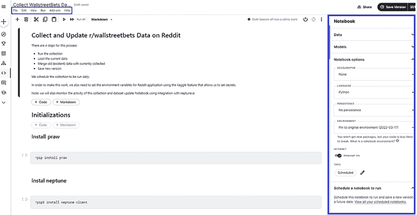
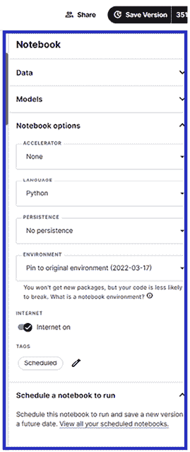
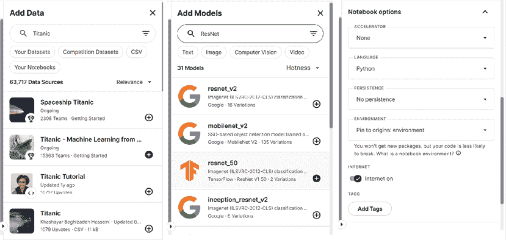
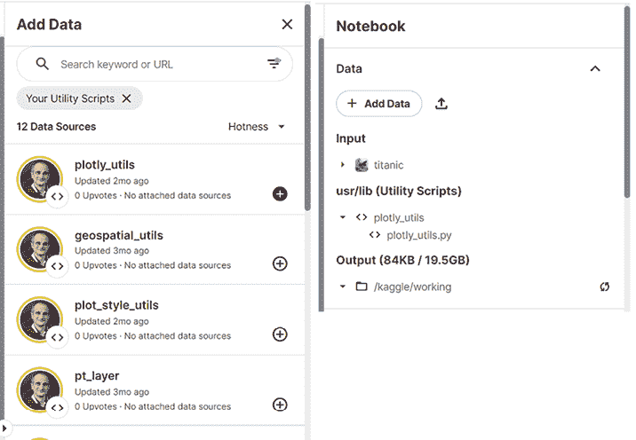
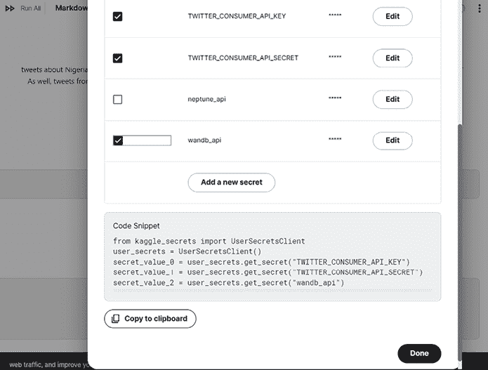
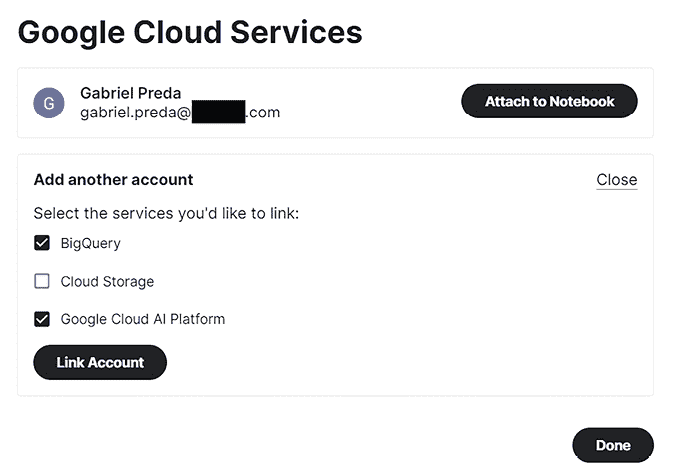
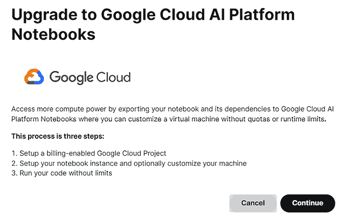
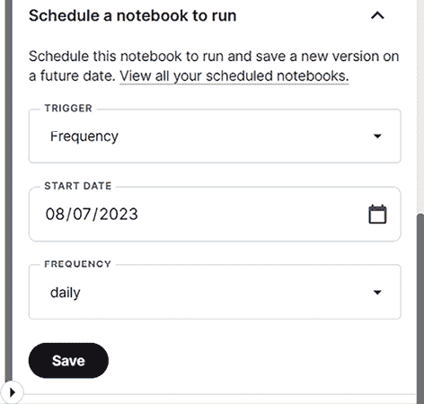

# 2

# 准备您的 Kaggle 环境

在上一章中，我们学习了如何创建您的 Kaggle 账户，以及关于竞赛、数据集、代码（笔记本）、讨论和 Kaggle 学习和模型最重要的知识。在本章中，我们将探讨 Kaggle 笔记本的功能。有时，核（Kernels）和代码（Code）被用作笔记本的替代名称，核是旧名称，代码是新菜单名称。这两个术语，无论是旧的还是新的，都说明了 Kaggle 笔记本的一个重要特性。

我们将首先介绍什么是 Kaggle 笔记本，并解释 Kaggle 脚本和 Kaggle 笔记本之间的区别。然后我们将展示如何创建一个笔记本，无论是从头开始还是从现有的一个衍生出来。在您开始编辑笔记本后，您有多种选择，我们将在本章中逐一回顾它们，从最常见的选择（编辑数据源和模型、更改计算资源等）开始，然后继续介绍其他选项（将笔记本设置为脚本、向笔记本添加实用脚本、添加和使用密钥等）。

简而言之，本章将涵盖以下主要内容：

+   什么是 Kaggle 笔记本？

+   如何创建笔记本

+   探索笔记本功能

+   使用 Kaggle API

# 什么是 Kaggle 笔记本？

Kaggle 笔记本是集成开发环境，允许您编写代码、版本控制、运行（使用 Kaggle 平台计算资源）并以各种形式生成结果。当您开始在一个笔记本上工作时，您启动了一个代码编辑器。这反过来又启动了一个 Docker 容器，配置了最常用的 Python 数据分析和机器学习包，在 Google Cloud 分配的虚拟机中运行。代码本身与代码仓库相链接。

您可以使用两种语言之一编写代码：Python 或 R。目前，Kaggle 上的大多数用户使用 Python，本书中的所有示例也只使用 Python。

术语**笔记本**是通用的，但 Kaggle 笔记本有两种类型：脚本和笔记本。

+   **Kaggle 脚本**：脚本是一系列将依次执行的代码文件。脚本的执行输出将打印在控制台。如果您愿意，也可以只执行脚本的一部分，只需选择几行并按下**运行**按钮。如果您使用 R 语言进行开发，可以使用一种特殊的脚本，即 RMarkdown 脚本。开发环境与 Python 或 R 脚本类似，但您可以使用 RMarkdown 语法，输出将结合 R 代码执行结果和 RMarkdown 语法用于文本和图形效果。

+   **Kaggle 笔记本**：笔记本的外观和感觉与 Jupyter 笔记本相似。它们相似但不相同。Kaggle 笔记本有多个额外的选项来支持与 Kaggle 环境的集成和更好的用户体验。笔记本由一系列的单元格组成，这些单元格包含代码或 Markdown 内容，并且每个单元格可以独立执行。您可以使用 R 或 Python 在笔记本中编码。在运行单元格时，代码单元格的输出将显示在单元格下方。

在简要概述了 Kaggle 笔记本及其基本组件之后，现在让我们看看您如何创建一个笔记本。

# 如何创建笔记本

开始笔记本的方式有多种。您可以从主菜单的**代码**（*图 2.1*），从数据集的上下文（*图 2.2*），一个竞赛（*图 2.3*），或者通过分叉（复制并编辑）现有的笔记本来开始。

![图片 B20963_02_01.png]

图 2.1：从代码菜单创建一个新的笔记本

当您从**代码**菜单创建一个新的笔记本时，这个新的笔记本将出现在您的笔记本列表中，但不会添加到任何数据集或竞赛上下文中。

如果您选择从 Kaggle 数据集开始，数据集将已经添加到与笔记本关联的数据列表中，当您编辑笔记本时，您将在右侧面板中看到它（参见图 2.5）。

![图片 B20963_02_02.png]

图 2.2：在数据集的上下文中创建一个新的笔记本

在竞赛的情况下也是如此。与之关联的数据集在您初始化笔记本时已经存在于数据集列表中。



图 2.3：在竞赛的上下文中创建一个新的笔记本

要分叉（复制并编辑）现有的笔记本，请按该笔记本**编辑**按钮旁边的三个垂直点，然后从下拉列表中选择**复制并编辑笔记本**菜单项。

![图片 B20963_02_04.png]

图 2.4：从现有的笔记本中分叉一个笔记本

创建后，笔记本将可供编辑，如下面的屏幕截图所示。在左上角，有一个常规菜单（**文件**、**编辑**、**查看**、**运行**、**附加组件**和**帮助**），下面有编辑和运行的快速操作图标。在右侧，有一个可伸缩的面板，包含更多的快速操作。


图 2.5：Kaggle 笔记本的主要编辑窗口，右侧面板带有快速菜单

**文件**菜单复杂，提供了输入和输出选项，以及与其他平台资源（模型、实用脚本和笔记本）交互的各种设置。它有菜单项可以导入外部笔记本或导出当前笔记本，甚至可以将数据或模型添加到笔记本中。您还可以将当前笔记本保存为实用脚本或将实用脚本添加到笔记本中。您可以选择设置语言（到 R 或 Python；默认设置为 Python）。还有一个选项可以将当前笔记本设置为脚本或笔记本（默认为笔记本）。

额外的选项是用于在 GitHub 上发布和共享笔记本。要在 GitHub 上发布笔记本，您必须通过授权 Kaggle 访问您的 GitHub 账户来将 Kaggle 账户与 GitHub 账户链接。一旦执行此操作，笔记本的更新也将同步到 GitHub。使用**共享菜单**项，您可以设置谁可以查看或编辑笔记本。最初，您将是唯一具有读写访问权限的用户，但一旦添加了贡献者，他们也可以被分配读写访问权限，或者只有读（查看）访问权限。如果您发布笔记本，那么每个人都可以读取它，能够分叉（复制并编辑）它，然后编辑工作。

**编辑**菜单允许您移动单元格（上下移动）或删除选定的单元格。在**视图**中，您有选项调整编辑器的外观和感觉（添加或删除主题、行号和设置编辑器布局）以及生成的输出 HTML 内容（查看或隐藏选定单元格的输入或输出，或折叠或展开单元格）。

**运行**菜单项提供了运行单个单元格、所有单元格、所有单元格之前或之后的单元格，以及开始/停止会话的控制。在会话重启时，内核（即笔记本运行的 Docker 容器）也会重启，并且当我们运行某些单元格时初始化的所有上下文数据都会重置。当你编辑时想要重置包含所有变量的环境，这是一个非常有用的选项。附加菜单组、秘密管理、Google Cloud 服务以及 Google Cloud SDK——这些每个都扩展了笔记本的功能，将在本章后面的**高级功能**部分进行介绍。

现在我们已经学习了如何创建、编辑和运行笔记本，让我们继续探索更多的笔记本功能。

# 探索笔记本功能

笔记本作为数据探索、模型训练和运行推理的强大工具。在本节中，我们将检查 Kaggle 笔记本提供的各种功能。

我们将从笔记本最常用的功能开始。我们将通过选项将各种资源添加到笔记本中（数据和模型），并修改执行环境。然后，我们将继续介绍更高级的功能，包括设置实用脚本、添加或使用密钥、使用 Google Cloud 服务或升级笔记本到 Google Cloud AI 笔记本。让我们开始吧！

## 基本功能

在右侧面板上，我们有快速菜单操作，用于访问笔记本常用的功能。在以下截图中，我们将更详细地查看这些快速菜单操作。



图 2.6：右侧面板的放大视图，包含快速菜单

如您所见，第一个快速菜单操作被分组在**数据**部分下。在这里，您有按钮来添加或从笔记本中删除数据集。点击**添加数据**按钮，您可以添加一个现有数据集。您有搜索文本框和快速按钮，可以从您的数据集、竞赛数据集和笔记本中进行选择。当您选择笔记本时，您可以将笔记本的输出作为当前笔记本的数据源。您还在**添加数据**按钮旁边有一个上传按钮，您可以使用它在上传到笔记本之前上传一个新的数据集。在面板上的相同**数据**部分，您有输入和输出文件夹浏览器，以及每个项目的按钮，以便您可以复制这两个文件夹或文件的路径。

在**数据**部分下方，我们有**模型**部分（见*图 2.6*）。在这里，我们可以将模型添加到笔记本中。**模型**是平台上的新功能，它允许您在笔记本中使用强大的预训练模型。

在**笔记本选项**部分，我们可以根据我们的偏好配置加速器、语言、持久化选项、环境和互联网访问（见*图 2.6*）。默认情况下，笔记本将仅使用**中央处理器**（**CPU**）。请参阅以下截图，了解右侧面板中**添加数据**、**添加模型**和**笔记本选项**的扩展视图：



图 2.7：右侧面板菜单，用于添加数据、模型以及笔记本选项

您可以通过数据集的名称或路径进行搜索，并且您有速度过滤器来搜索竞赛或笔记本的输出。对于**模型**，您也可以通过名称进行搜索，并通过类型（文本、图像、计算机视觉或视频）进行筛选。**笔记本选项**允许选择加速器类型（**无**表示仅 CPU），编程语言、持久化类型以及环境选项。

通过选择加速器，您可以切换到使用两种硬件加速器选项之一，用于**图形处理单元（GPU**）或**张量处理单元（TPU**）。在撰写本文时，CPU 配置和加速器配置的技术规范见*表 2.1*。对于所有这些规范，无论是使用 CPU 还是 GPU，您都有最多 12 小时的连续执行时间。然而，输入数据的大小不受限制。输出限制在 20 GB。额外的 20 GB 只能在运行时临时使用，运行结束后不会保存。

默认情况下，您的笔记本设置为不使用任何持久性。您可以选择确保文件和变量的持久性，仅文件，或仅变量。

| **配置** | **核心** | **RAM** |
| --- | --- | --- |
| CPU | 4 CPU 核心 | 30 GB |
| P100 GPU | 1 个 Nvidia Tesla P100 GPU 2 CPU 核心 | 13 GB |
| T4 x 2 GPU | 2 个 Nvidia Tesla T4 GPU 2 CPU 核心 | 13 GB |
| TPU | 1 个 TPU 4 CPU 核心 | 16 GB |
| TPU 1VM | 96 CPU 核心 | 330 GB |

表 2.1：CPU 或加速器规格的技术规范

您可以将笔记本设置为始终使用原始环境或将其固定到最新环境。根据您使用的库和执行的数据处理，选择使用原始环境或使用最新可用的环境可能很有用。当您选择原始环境时，每次运行笔记本的新版本时，原始环境的设置都将保持不变。使用最新可用的环境作为替代选项时，环境（带有预定义的库版本）将更新到最新版本。

互联网访问默认设置为“开启”，但在某些情况下，您可能希望将其设置为“关闭”。对于某些代码竞赛，不允许访问互联网。在这种情况下，您可以在训练笔记本中下载动态资源，但您必须确保在运行推理笔记本进行该代码竞赛时，每个必需的资源要么在笔记本内部，要么在附带的模型、实用脚本或数据集中。

我们已经了解了笔记本的基本功能以及如何添加数据、模型和配置运行环境。现在让我们看看更高级的功能。

## 高级功能

基本笔记本功能使我们能够进行快速实验、测试想法和原型解决方案。然而，如果我们想构建更复杂的功能，我们将需要编写可重用的代码，将配置（包括像 API 密钥这样的机密信息）与代码分开，甚至将我们的代码与外部系统或组件集成。

Kaggle 环境提供了丰富的计算资源，但这些资源是有限的。我们可能希望将 Kaggle 笔记本与外部资源相结合，或者我们可能希望将 Kaggle（笔记本、数据集）的组件与其他组件、Google Cloud 或我们的本地环境集成。在接下来的章节中，我们将学习如何实现所有这些。

### 设置笔记本为实用脚本或添加实用脚本

在大多数情况下，您将在同一文件中连续的单元格中编写您笔记本的所有代码。对于更复杂的代码，尤其是在您想要重用一些代码而不在笔记本之间复制代码的情况下，您可以选择开发实用模块。Kaggle 笔记本为此目的提供了一个有用的功能，即**实用脚本**。

**实用脚本**的创建方式与笔记本相同。您必须启动一个笔记本，然后从**文件**菜单中选择**设置为实用脚本**菜单项。如果您想在当前笔记本中使用实用脚本，您需要从**文件**菜单中选择**添加实用脚本**菜单项。这将打开右侧面板上的实用脚本选择器窗口，在这里，您可以从现有的实用脚本中选择一个或多个添加到笔记本中。正如您在下面的屏幕截图中所见，添加的实用脚本旁边会出现一个**+**按钮（在左侧面板上可见），并且它们被添加到笔记本中，位于单独的组**usr/lib（实用脚本）**下，正好在**输入**数据部分下方和**输出**数据部分之前（在右侧面板上可见）：



图 2.8：选择实用脚本

要在代码中使用实用脚本，您必须以与导入 Python 包相同的方式导入模块。在下面的代码片段中，我们导入了一个实用脚本中包含的模块或函数：

```py
from data_quality_stats import missing_data 
```

正如您所见，`missing_data`函数是在实用脚本`data_quality_stats`中定义的。

### 添加和使用密钥

有时候，您可能需要在笔记本中添加环境变量，并且希望它们保密，尤其是如果您使笔记本公开。这类变量的例子可以是您用于实验跟踪服务的连接令牌，如 Neptune.ai 或 Weights & Biases，或者各种 API 密钥或令牌。在这种情况下，您很可能会想使用其中一个附加组件，**Kaggle Secrets**。

选择**Kaggle Secrets**菜单项后，将出现类似于以下屏幕截图的窗口。在这个弹出窗口中，您可以通过按下**添加一个新密钥**按钮来添加新的密钥。要包含当前笔记本中的密钥，只需勾选您想要包含的密钥旁边的复选框。



图 2.9：添加并选择密钥

在前面的屏幕截图中，选择了三个密钥（两个用于 Twitter API 连接和一个用于 Weights & Biases 实验跟踪）。对于每个选定的密钥，窗口底部都会生成一条额外的类似**代码片段**的行。您可以将所有生成的行复制到剪贴板，以便将其包含在笔记本代码中。按下**完成**后，您将能够将代码粘贴到笔记本中。

一旦定义，密钥将可用于包含在任何笔记本中。您可以使用其名称旁边的**编辑**按钮修改一个密钥的文本。请注意，当您分支添加了密钥的笔记本时，密钥将不再与新的笔记本关联。为了使密钥对新或分支的笔记本可用，您只需在编辑该笔记本时进入**密钥**窗口并按下**完成**即可。当然，如果有人复制您的笔记本，那个 Kaggle 用户（Kaggle 用户）将必须设置他们自己的密钥。如果那个 Kaggle 用户选择为与密钥关联的变量使用不同的名称，他们还需要在代码中进行更改。此功能不仅允许您管理有用的环境变量，而且还可以轻松配置您的笔记本。

### 在 Kaggle 笔记本中使用 Google Cloud 服务

要在笔记本中利用 Google Cloud 服务，从**附加组件**菜单中选择**Google Cloud 服务**。在打开的对话框窗口中，您可以通过点击**附加到笔记本**将您的 Google 账户与笔记本同步。您还可以选择您想要与 Kaggle 环境集成的 Google Cloud 服务。

目前，Kaggle 提供与 Google Cloud Storage、BigQuery 和 AutoML 的集成。当通过 Kaggle 笔记本使用这些服务时，您需要知道这将根据您的计划产生费用。如果您选择仅使用 BigQuery 的公共数据，则不会产生任何费用。

在以下图中，我们展示了您如何选择这些服务：



图 2.10：Kaggle 集成选项

选择在 Kaggle 笔记本中要使用的 Google Cloud 服务。如前所述，您需要将您的 Google Cloud 账户链接到 Kaggle。在选择屏幕上，您可以从**BigQuery**、**Cloud Storage**和**Google Cloud AI Platform**（Vertex AI Workbench）中选择。在我们的示例中，选定了三种可用服务中的两种。

### 将您的 Kaggle 笔记本升级到 Google Cloud AI 笔记本

如果您达到 Kaggle 笔记本可用的资源限制（RAM、核心数或执行时间），您可以选择将您的笔记本提升到 Google Cloud AI 笔记本，通过将笔记本导出到 Google Cloud 来实现。Google Cloud AI 笔记本是 Google Cloud 的一项付费服务，它为您提供了使用笔记本作为**集成开发环境**（**IDE**）访问 Google Cloud 机器学习计算资源的机会。为此操作，选择**文件** | **升级到 Google AI 笔记本**，您将被引导到以下窗口：



图 2.11：升级到 Google Cloud AI 平台笔记本

按照以下三个步骤进行：设置一个启用计费的 Google Cloud 项目，设置您的网络实例，并运行您的代码。现在，您的代码可以不受资源限制地运行。

现在我们来看看如何使用笔记本来自动化数据集的更新。

### 使用笔记本自动更新数据集

您可以通过结合两个功能来自动化使用 Kaggle 笔记本生成数据集：笔记本的定时重跑和笔记本运行时的数据集更新。

首先，创建一个用于收集数据的笔记本。例如，可以是一个爬取特定网站页面以检索 RSS 新闻源或连接到 Twitter API（如前例所示）以下载推文的笔记本。将收集到的数据设置为笔记本的输出。

笔记本首次运行后，通过选择**输出** | **创建数据集**来初始化数据集，并设置数据集在每次笔记本运行时更新的选项。

然后，再次编辑笔记本，并按您希望数据更新的频率安排其运行，如下截图所示。一旦设置好，您将自动运行笔记本，因为数据集有在运行笔记本时更新的设置，所以数据集的更新将自动进行。



图 2.12：从 2023 年 8 月 7 日开始每天运行笔记本的安排

这里描述的机制允许您使用用户界面中可用的 Kaggle 工具执行整个自动化过程。对于更复杂的过程，您始终可以使用 Kaggle API 来定义和自动执行您的任务。在下一个小节中，我们将描述 Kaggle API 的基本功能，重点关注操作笔记本。

# 使用 Kaggle API 创建、更新、下载和监控您的笔记本

Kaggle API 是一个强大的工具，它扩展了 Kaggle 用户界面中可用的功能。您可以使用它执行各种任务：定义、更新和下载数据集，提交到比赛，定义新的笔记本，推送或拉取笔记本的版本，或验证运行状态。

您只需两个简单的步骤就可以开始使用 Kaggle API。让我们开始吧：

1.  首先，您需要创建一个身份验证令牌。转到您的账户，然后从右侧图标中选择菜单项 **Account**。然后转到 **API** 部分。在这里，点击 **Create new API token** 按钮下载您的身份验证令牌（它是一个名为 `kaggle.json` 的文件）。如果您将从 Windows 机器上使用 Kaggle API，其位置是 `C:\Users\<your_name>\.kaggle\kaggle.json`。在 Mac 或 Linux 机器上，文件的路径应该是 `~/.kaggle/kaggle.json`。

1.  接下来，您需要安装 Kaggle API 的 Python 模块。在您选择的 Python 或 conda 环境中运行以下命令：

    ```py
    !pip install kaggle 
    ```

通过这两个步骤，您就可以开始使用 Kaggle API 了。

API 还提供了多个选项来列出您账户中的笔记本，检查笔记本状态，下载副本，创建笔记本的第一版，运行它等等。让我们看看这些选项中的每一个：

+   要根据特定的名称模式列出所有笔记本，请运行以下命令：

    ```py
    Kaggle kernels list -s <name-pattern> 
    ```

    命令将返回一个表格，包含 `{username}/{kernel-slug}`，这与名称模式匹配，最后运行时间，投票数，笔记本标题和作者可读名称。

+   要验证您环境中某个笔记本的状态，请运行以下命令：

    ```py
    kaggle kernels status {username}/{kernel-slug}. 
    ```

    在这里，`{username}/{kernel-slug}` 不是 Kaggle 上笔记本的完整路径，而是将跟随平台路径 `https://www.kaggle.com` 的路径部分。

+   前面的命令将返回内核状态。例如，如果内核执行完成，它将返回：

    ```py
    {username}/{kernel-slug} has status "complete" 
    ```

+   您可以通过运行以下命令下载笔记本：

    ```py
    kaggle kernels pull {username}/{kernel-slug} /path/to/download 
    ```

    在这种情况下，一个名为 `{kernel-slug}.ipynb` 的 Jupyter Notebook 将下载到 `/path/to/download` 指定的文件夹中。

+   要创建笔记本的第一版并运行它，首先使用以下命令定义 Kaggle 元数据文件：

    ```py
    kaggle kernels init -p /path/to/kernel 
    ```

    您生成的 Kaggle 元数据文件将看起来像这样：

    ```py
    {
    "id": "{username}/INSERT_KERNEL_SLUG_HERE",
    "title": "INSERT_TITLE_HERE",
    "code_file": "INSERT_CODE_FILE_PATH_HERE",
    "language": "Pick one of: {python,r,rmarkdown}",
    "kernel_type": "Pick one of: {script,notebook}",
    "is_private": "true",
    "enable_gpu": "false",
    "enable_internet": "true",
    "dataset_sources": [],
    "competition_sources": [],
    "kernel_sources": [],
    "model_sources": []
    } 
    ```

    为了演示目的，我编辑了元数据文件以生成一个名为 `Test Kaggle API` 的笔记本，该笔记本使用 Python。为了您的方便，我用 `{username}` 替换了我的用户名。您需要小心地将 `{kernel-slug}` 与实际标题相关联，因为通常 `{kernel-slug}` 是生成的小写版本，没有特殊字符，并将空格替换为连字符。以下是结果：

    ```py
    {
    "id": "{username}/test-kaggle-api",
    "title": "Test Kaggle API",
    "code_file": "test_kaggle_api.ipynb",
    "language": "python",
    "kernel_type": "notebook",
    "is_private": "true",
    "enable_gpu": "false",
    "enable_internet": "true",
    "dataset_sources": [],
    "competition_sources": [],
    "kernel_sources": [],
    "model_sources": []
    } 
    ```

+   编辑元数据文件后，您可以使用以下命令启动笔记本：

    ```py
    Kaggle kernels push -p /path/to/kernel 
    ```

+   如果您也在 `/path/to/kernel` 文件夹中创建了笔记本的原型，并且命名为 `test_kaggle_api.ipynb`，您将收到以下命令的响应：

    ```py
    Kernel version 1 successfully pushed. Please check progress at https://www.kaggle.com/code/{username} /test-kaggle-api 
    ```

+   您也可以使用 API 下载现有笔记本的输出。为此，请使用以下代码：

    ```py
    Kaggle kernels output {username}/{kernel-slug} 
    ```

这将在当前文件夹中下载一个名为 `{kernel-slug}.log` 的文件。或者，您可以指定以下目标的路径：

```py
Kaggle kernels output {username}/{kernel-slug} – p /path/to/dest 
```

文件包含内核上次运行的执行日志。

我们学习了如何创建认证令牌并安装 Kaggle API。然后，我们看到了如何使用 Kaggle API 来创建笔记本、更新它并下载它。

更多关于如何使用 Kaggle API 来提升平台使用的方法，可以在 Kaggle 文档中关于 API 的部分找到，链接为[`www.kaggle.com/docs/api`](https://www.kaggle.com/docs/api)。

# 摘要

在本章中，我们学习了 Kaggle 笔记本是什么，我们可以使用哪些类型，以及可以使用哪些编程语言。我们还学习了如何创建、运行和更新笔记本。然后，我们参观了使用笔记本的一些基本功能，这将使您能够有效地开始使用笔记本，从数据集或比赛中摄取和分析数据，开始训练模型，并为比赛准备提交。此外，我们还回顾了一些高级功能，甚至介绍了 Kaggle API 的使用，以进一步扩展您对笔记本的使用，允许您构建与 Kaggle 环境集成的外部数据和 ML 管道。

更高级的功能为您在 Kaggle 笔记本的使用中提供了更多的灵活性。通过实用脚本，您可以创建模块化代码，使用专门的 Python 模块来摄取数据，对其进行统计分析，准备可视化，生成特征和构建模型。您可以在笔记本之间重用这些模块，而无需从一本笔记本复制代码到另一本。另一方面，通过密钥，您可以公开使用 API 密钥访问外部服务的笔记本，而不会暴露您的个人密钥；这是 Kaggle 的密码保险库等效物。

通过与 Google Cloud 的集成，您可以扩展您的计算或存储资源，并超越 Kaggle 平台上此类资源的限制。我们还学习了 Kaggle API 的基础知识。现在您知道如何使用 Kaggle API 来搜索现有的笔记本，创建新的笔记本，或下载现有笔记本的输出。这为您提供了定义集成 Kaggle、Google Cloud 和本地资源的混合管道的灵活性。您还可以从外部脚本中控制您的 Kaggle 笔记本。

在下一章中，我们将开始我们的数据世界之旅，第一站：对**泰坦尼克**比赛数据集的经典探索。

# 加入我们书籍的 Discord 空间

加入我们的 Discord 社区，与志同道合的人见面，并在以下地点与超过 5000 名成员一起学习：

[`packt.link/kaggle`](https://packt.link/kaggle)


