# 3

# 开始我们的旅行 - 生存泰坦尼克号灾难

在本章中，我们将开始我们的数据世界之旅。我们将分析的第一组数据来自比赛 *泰坦尼克号 - 灾难中的机器学习*（在本章末尾的 *参考文献 1* 中找到该数据集的链接）。这是一个相当小的数据集，因为它与比赛相关，所以它被分为训练集和测试集。

在本章中，除了比赛方法之外，我们还将介绍我们系统化的探索性数据分析方法，并将其应用于熟悉数据、更详细地了解数据以及提取有用见解。我们还将简要介绍使用数据分析结果构建模型训练流程的过程。在深入实际数据之前，了解背景和理想情况下定义分析的可能目标是很有用的。

本章中所有的代码快照和图表都是从配套的笔记本中提取的，*泰坦尼克号 - 数据世界之旅的开始*（在本章末尾的 *参考文献 2* 中找到笔记本的链接）。该笔记本也位于 GitHub 仓库的 *Chapter-03* 文件夹中（见 *参考文献 3* 和 *参考文献 4*）。

简而言之，在本章中我们将做以下事情：

+   了解泰坦尼克号数据集背后的故事。我们将学习 1912 年那个命运攸关的日子泰坦尼克号沉没时发生了什么，我们将了解船员的人数，有多少乘客在船上，以及有多少人死亡。

+   熟悉数据，解释特征的意义，了解数据质量的第一印象，并探索有关数据的某些统计信息。

+   在我们介绍通过分析使用的图形元素：定制的调色板和派生的颜色图之后，继续使用单变量分析进行数据探索。

+   使用多元分析添加更多见解，以捕捉特征之间的复杂交互。

+   使用记录的乘客姓名进行详细分析，从中我们将提取多个特征。

+   通过对特征变化的聚合视图来探索特征的丰富性。

+   准备一个基线模型。

# 仔细看看泰坦尼克号

泰坦尼克号是一艘英国客轮，1912 年 4 月在北大西洋的首航中沉没。这场悲剧是由于撞上冰山而引起的，导致 2,224 名船员和乘客中的 1,500 多人死亡（美国官员的估计为 1,517 人，英国调查委员会的估计为 1,503 人）。大多数遇难者是船员，其次是三等舱乘客。

这是如何发生的？泰坦尼克号在 20 世纪初使用最先进的技术建造时被认为是一艘永不沉没的船。这种信心正是灾难的配方。正如我们所知，它确实沉没了，因为与冰山的接触损坏了几个水密舱室——足以破坏其完整性。这艘船最初的设计是携带 48 艘救生艇，但船上只有 20 艘，而且大多数救生艇在放入水中时容量不足 60%。

泰坦尼克号的长度为 269 米，最大宽度为 28 米。它有七个用字母 A 到 G 标识的甲板（A 和 B 是头等舱乘客的，C 主要留给船员，D 到 G 是二等和三等舱乘客的）。它还有两个额外的甲板：甲板（救生艇从这里放入水中）和 Orlop 甲板（在水线下）。尽管三等和二等舱的设施不如头等舱豪华舒适，但所有舱位都有共同的休闲设施，如图书馆、吸烟室，甚至还有健身房。乘客还可以使用露天或室内散步区。与那个时代的其他客轮相比，泰坦尼克号在舒适度和设施方面都更为先进。

泰坦尼克号从南安普顿起航，并计划了两个其他停靠点——一个在法国的瑟堡，一个在爱尔兰的昆士敦。乘客们分别乘坐从伦敦和巴黎到南安普顿和瑟堡的专用火车。这次首航中，泰坦尼克号上的船员大约有 885 人。船员中的大多数不是水手，而是服务员，他们照顾乘客，消防员，仓库管理员和工程师，他们负责船上的引擎。

# 进行数据检查

泰坦尼克号的传奇故事引人入胜。对于那些对数据探索感兴趣的人来说，关于这场悲剧的数据同样引人入胜。让我们先从对竞赛数据的简要介绍开始。来自 *Titanic - Machine Learning from Disaster* 的数据集包含三个 **CSV** （逗号分隔值）文件，正如你将在许多 Kaggle 竞赛中遇到的那样：

+   `train.csv`

+   `test.csv`

+   `sample_submission.csv`

我们将首先将这些文件加载到一个新的笔记本中。你已经在上一章的 *基本功能* 部分学习了如何这样做。你也可以通过复制一个已存在的笔记本来创建一个新的笔记本。在我们的情况下，我们将从头开始创建一个新的笔记本。

通常，笔记本从导入包的单元格开始。我们在这里也会这样做。在接下来的一个单元格中，我们希望读取训练数据和测试数据。一般来说，你需要用到的 CSV 文件与这个例子中的目录相似：

```py
train_df = pd.read_csv("/kaggle/input/titanic/train.csv")
test_df = pd.read_csv("/kaggle/input/titanic/test.csv") 
```

在我们加载数据后，我们将手动检查它，查看每个列包含的内容——也就是说，查看数据样本。我们将对数据集中的每个文件都这样做，但现在我们主要会关注训练和测试文件。

## 理解数据

在*图 3.1*和*图 3.2*中，我们可以看到一些值的选取。从这次视觉检查中，我们已能看出一些数据特征。让我们尝试总结它们。以下列在训练文件和测试文件中都是共同的：

+   `乘客 ID（PassengerId）`: 每位乘客的唯一标识符。

+   `乘客等级（Pclass）`: 每位乘客所乘坐的等级。我们知道从我们的背景信息来看，可能的值是 1、2 或 3。这可以被视为一个分类数据类型。因为等级的顺序传达了意义并且是有序的，所以我们可以将其视为有序或数值类型。

+   `姓名（Name）`: 这是一个文本类型的字段。这是乘客的全名，包括他们的姓氏、名字，在某些情况下，婚前名字以及昵称。它还包含他们的社会阶层、背景、职业或在某些情况下，王室的头衔。

+   `性别（Sex）`: 这也是一个分类字段。考虑到当时他们优先救助妇女和儿童，我们可以假设这是重要的信息。

+   `年龄`: 这是一个数值字段。此外，他们的年龄是一个重要的特征，因为儿童被优先考虑进行救助。

+   `兄弟姐妹或配偶数量（SibSp）`: 这个字段提供了每位乘客的兄弟姐妹或配偶信息。它是衡量乘客所旅行家庭或团体规模的一个指标。这是重要信息，因为我们可以安全地假设一个人在没有兄弟姐妹、姐妹或伴侣的情况下不会登上救生艇。

+   `父母数量（Parch）`: 这是儿童乘客的父母数量或成人乘客的儿童数量。考虑到父母会在登船前等待所有孩子，这也是一个重要的特征。与`SibSp`（兄弟姐妹数量）一起，`Parch`可以用来计算每位乘客的家庭规模。

+   `船票（Ticket）`: 这是一个与船票相关的代码。它是一个字母数字字段，既不是分类的也不是数值的。

+   `船票价格（Fare）`: 这是一个数值字段。从样本中我们可以观察到，`Fare`值变化很大（从 3 等舱到 1 等舱有一个数量级的变化），但我们也可以看到同一舱位的乘客中有些人的`Fare`值相当不同。

+   `船舱（Cabin）`: 这是一个字母数字字段。从我们在*图 3.1*和*图 3.2*中看到的小样本中，我们可以看到一些值是缺失的。在其他情况下，同一乘客预订了多个船舱（可能是富裕的乘客带着家人旅行）。船舱的名称以字母开头（C、D、E 或 F）。我们记得泰坦尼克号有多个甲板，所以我们可以猜测字母代表甲板，然后后面跟着该甲板上的船舱号码。

+   `Embarked`：这是一个分类字段。在这里的样本中，我们只看到字母 C、S 和 Q，我们已经知道泰坦尼克号从南安普顿出发，在法国的瑟堡停靠，并在昆士敦（今天称为科布，科克港，爱尔兰）停靠。我们可以推断 S 代表南安普顿（起始港口），C 代表瑟堡，Q 代表昆士敦。

训练文件还包含一个`Survived`字段，这是目标特征。它可以是`1`或`0`的值，其中`1`表示乘客幸存，`0`表示他们不幸没有幸存。

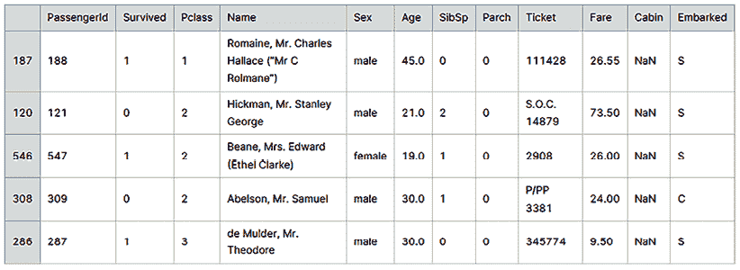

图 3.1：训练数据文件样本

测试文件不包括目标特征，如以下样本所示：

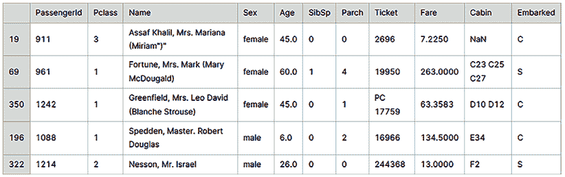

图 3.2：测试数据文件样本

一旦我们查看了训练和测试文件中的列，我们就可以继续进行一些额外的检查，以找到数据集的维度和特征分布：

1.  使用`shape()`函数检查每个数据集（`train_df`和`test_df`）的形状。这将给出训练和测试文件（行数和列数）的维度。

1.  对每个数据集运行`info()`函数。这将给出更复杂的信息，例如每列的非空数据量以及数据类型。

1.  对每个数据集运行`describe()`函数。这仅适用于数值数据，并将创建关于数据分布的统计，包括最小值、最大值以及前 25%、50%和 75%的值，以及平均值和标准差。

前面的检查为我们提供了关于训练和测试数据集中数值数据分布的初步信息。我们可以在分析中继续使用更复杂和详细的工具，但到目前为止，你可以将这些步骤视为调查你手头任何表格数据集的一般初步方法。

## 分析数据

通过评估数据集的形状、值类型、空值数量和特征分布，我们将形成一个关于数据集的初步印象。

我们可以构建自己的工具来检查数据统计。在这里，我将介绍三个小脚本，用于获取缺失值统计、唯一值和最频繁的值。

首先，检索缺失数据的代码：

```py
def missing_data(data):
    total = data.isnull().sum()
    percent = (data.isnull().sum()/data.isnull().count()*100)
    tt = pd.concat([total, percent], axis=1, keys=['Total', 'Percent'])
    types = []
    for col in data.columns:
        dtype = str(data[col].dtype)
        types.append(dtype)
    tt['Types'] = types
    return(np.transpose(tt)) 
```

接下来，显示最频繁值的代码：

```py
def most_frequent_values(data):
    total = data.count()
    tt = pd.DataFrame(total)
    tt.columns = ['Total']
    items = []
    vals = []
    for col in data.columns:
        try:
            itm = data[col].value_counts().index[0]
            val = data[col].value_counts().values[0]
            items.append(itm)
            vals.append(val)
        except Exception as ex:
            print(ex)
            items.append(0)
            vals.append(0)
            continue
    tt['Most frequent item'] = items
    tt['Frequence'] = vals
    tt['Percent from total'] = np.round(vals / total * 100, 3)
    return(np.transpose(tt)) 
```

最后，唯一值的代码：

```py
def unique_values(data):
    total = data.count()
    tt = pd.DataFrame(total)
    tt.columns = ['Total']
    uniques = []
    for col in data.columns:
        unique = data[col].nunique()
        uniques.append(unique)
    tt['Uniques'] = uniques
    return(np.transpose(tt)) 
```

在下一章中，我们将重新使用这些函数。在 Kaggle 上，你可以通过实现实用脚本来实现这一点。我们将将这些函数包含在一个可重用的实用脚本中，然后将其包含在其他笔记本中。

在下面的图中，我们看到将`missing_data`函数应用于训练（*a*）和测试（*b*）数据集的结果：

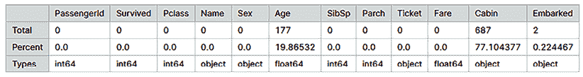

a

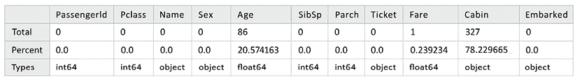

b

图 3.3：（a）训练集和（b）测试集中的缺失值，分别

一些字段，如`Age`和`Cabin`，在训练集和测试集中都显示出相当比例的缺失数据。从缺失数据百分比的检查中，我们还可以初步评估数据相对于训练-测试分割的质量。如果某个特征的缺失值百分比在训练集和测试集中差异很大，我们就可以怀疑分割没有捕捉到整体数据分布。在我们的案例中，训练集和测试集中每个特征的缺失值百分比非常接近。

在以下图中，我们可以看到训练集（*a*）和测试集（*b*）中特征的频繁值：

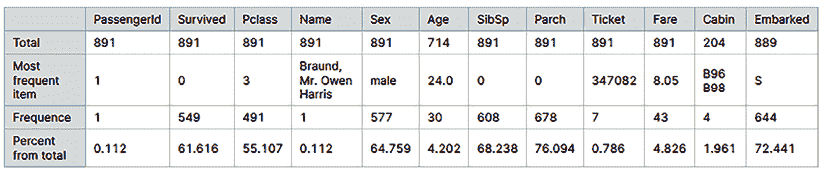

a

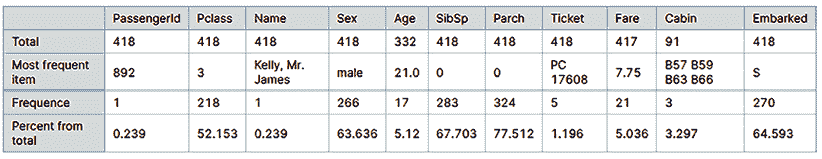

b

图 3.4：分别显示（a）训练集和（b）测试集中的最频繁值。

从前面的数据中，我们可以看到，泰坦尼克号上大多数人是男性（这种多数在训练集和测试集中都有所体现），大多数乘客和船员在南安普顿（`S`）登船。对于像`Age`这样的更细粒度的特征，训练集和测试集中的最频繁值不同，尽管最大频率的值很接近（训练集中的`Age`值为`21`，而测试数据集中的`Age`值为`24`）。这表明直接使用`Age`作为机器学习模型中的特征存在局限性，因为我们已经观察到训练集和测试集之间的整体分布不同。

下图展示了应用`unique_values`函数对训练集和测试集数据集的唯一值统计结果：

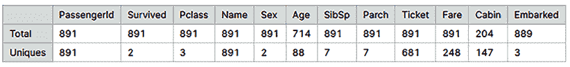

a

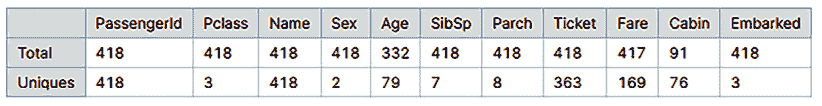

b

图 3.5：分别显示（a）训练集和（b）测试集中的唯一值

如您所见，对于分类类型的字段，训练集中存在的所有类别也在测试集中存在。理想情况下，我们希望对于`SibSp`或`Parch`等数值特征也能得到相同的结果。然而，在`Parch`的情况下，我们可以看到训练集中的唯一值数量为`7`，而在测试数据中为`8`。

在本节中，我们首先进行了初步的数据检查，以了解数据集的特征，然后检查数据质量，以查看是否存在缺失值。我们还对训练集和测试集中的特征进行了统计分析。接下来，在我们的数据探索中，我们将对训练集和测试集的分类和数值特征进行单变量分析。包含各种特征绘图图像的图片提供了更多信息，并且更容易理解和解释，即使是对于非技术读者来说也是如此。

# 进行单变量分析

在开始构建我们的第一个图表之前，我们将为笔记本设置一个独特的配色方案。确保整个笔记本的颜色和风格统一有助于我们保持演示的一致性，并确保读者有一个良好的平衡体验。笔记本将有一个一致的演示，视觉元素将连贯地支持笔记本的叙述。

因此，我们将定义在整个笔记本中使用的颜色集合。我们将选择一个调色板，以创建我们工作的特定视觉身份。这可以是已经定义的调色板或颜色集合，或者我们可以定义自己的调色板，基于一组选定的颜色以匹配主题。对于这个与航海（或航海）相关的笔记本，我选择了一组带有多种蓝色阴影的海洋颜色。基于这组颜色，我还定义了一个调色板。定义和显示调色板的代码如下：

```py
import matplotlib.pyplot as plt
from matplotlib.colors import ListedColormap
import seaborn as sns
def set_color_map(color_list):
    cmap_custom = ListedColormap(color_list)
    print("Notebook Color Schema:")
    sns.palplot(sns.color_palette(color_list))
    plt.show()
    return cmap_custom
color_list = ["#A5D7E8", "#576CBC", "#19376D", "#0b2447"]
cmap_custom = set_color_map(color_list) 
```

在以下图表中，我们展示了组成我们自定义调色板的颜色集合。笔记本配色方案使用从浅淡的晴空色到深蓝色调的蓝色阴影：


图 3.6：笔记本配色方案

我们将定义两个绘图函数（一个用于分类值，另一个用于连续/数值值）来表示同一图像上某个特征的分布，按生存状态或按训练/测试集分组。

我们将把训练数据和测试数据合并到一个数据集中（并添加一个新列来存储原始/源数据集）。这些函数使用了两个最常用的数据绘图库：`matplotlib`和`seaborn`。由于我们将为多个特征绘制这些图表，定义几个绘图函数是更好的选择，这样我们就不需要重复代码。

在第一个函数中，我们使用`seaborn`的`countplot`函数的`hue`选项显示两组值：

```py
def plot_count_pairs(data_df, feature, title, hue="set"):
    f, ax = plt.subplots(1, 1, figsize=(8, 4))
    sns.countplot(x=feature, data=data_df, hue=hue, palette= color_list)
    plt.grid(color="black", linestyle="-.", linewidth=0.5, axis="y", which="major")
    ax.set_title(f"Number of passengers / {title}")
    plt.show() 
```

在第二个函数中，为了显示特征分布，我们两次调用`seaborn`中的`histplot`函数——一次用于每个特征：

```py
def plot_distribution_pairs(data_df, feature, title, hue="set"):
    f, ax = plt.subplots(1, 1, figsize=(8, 4))
    for i, h in enumerate(data_df[hue].unique()):
        g = sns.histplot(data_df.loc[data_df[hue]==h, feature], color=color_list[i], ax=ax, label=h)
    #plt.grid(color="black", linestyle="-.", linewidth=0.5, axis="y", which="major")
    ax.set_title(f"Number of passengers / {title}")
    g.legend()
    plt.show() 
```

要查看完整的图像列表，请访问书籍存储库并检查“*泰坦尼克号 - 数据世界之旅的开始*”笔记本（*参考 3*）。或者，您可以通过以下路径在 Kaggle 上访问相同的内容：[`www.kaggle.com/code/gpreda/titanic-start-of-a-journey-around-data-world`](https://www.kaggle.com/code/gpreda/titanic-start-of-a-journey-around-data-world) (*参考 2*)。

这里，我们只展示了一小部分图像，仅针对两个特征——一个用于分类值，一个用于数值值。在笔记本中，我们表示了`Sex`、`Pclass`、`SibSp`、`Parch`和`Embark`以及`Age`和`Fare`的图表。

我们将用两个图表来表示这些特征中的每一个：一个图表显示了所有乘客的该特征分布，按列车/测试分组。另一个图表显示了相同特征的分布，仅针对训练数据，并显示了`Survived`/`Not Survived`之间的分割。

我们从`Pclass`（这是一个分类特征）开始，展示了所有乘客的特征分布，按训练/测试数据集分组。注意在下面的截图里，有三个类别，`1`、`2`和`3`：

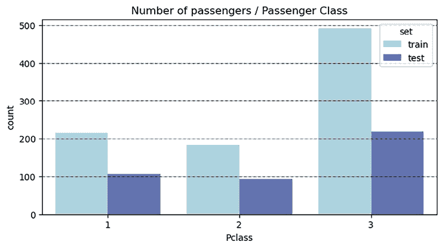

图 3.7：按乘客类别分组的乘客数量，按训练和测试分组

对于相同的`Pclass`特征，但仅从训练集中，我们表示按`Survived`分组的数据：

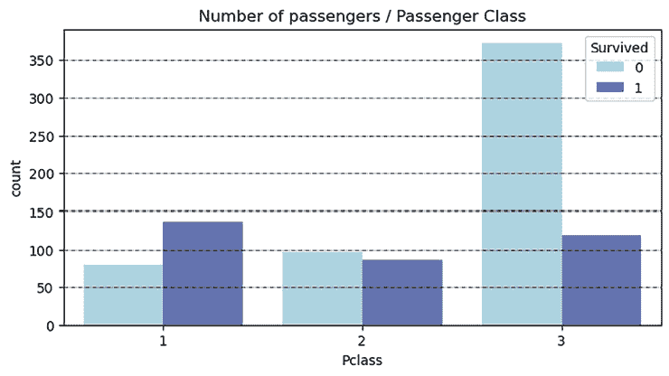

图 3.8：训练集中按乘客类别分组的乘客数量，按 Survived 分组

接下来是`Age`（这是一个数值）。在*图 3.9*中，我们展示了所有数据（训练和测试）中`Age`的直方图，按训练/测试分组。在这里我们使用直方图，因为这个特征虽然不是一个连续的数字（仍然是离散的），但有许多值（根据我们运行的数据统计，似乎至少有 88 个独特的`Age`值），并且从我们分析的角度来看，就像一个连续的数字。

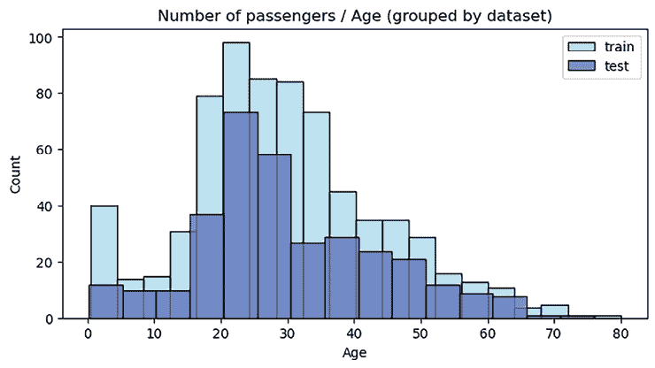

图 3.9：按乘客类别分组的乘客数量，按训练和测试分组

*图 3.10*显示了训练集中`Age`的直方图，按生存状态分组。

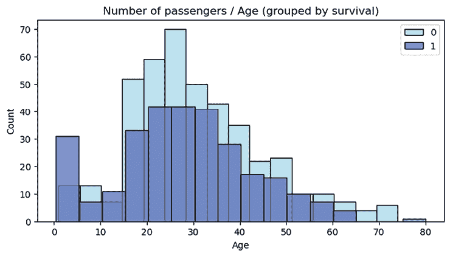

图 3.10：训练集中按 Age 分组的乘客数量，按生存状态分组

通过简单检查这些分类或连续（数值）数据的单变量分布，我们已能从数据中理解一些有趣的事实。例如，在*图 3.7*和*3.8*中，我们可以看到训练集和测试集中的数据在三个类别（`1`、`2`和`3`）的分布比率相当相似。同时，从 Survived/Not Survived 分布中，我们可以看到虽然大约 60%的头等舱乘客幸存，但二等舱的 Survived/Not Survived 比例大约是 50-50%，而在三等舱中，只有大约 25%的乘客幸存。同样，我们还可以从`Sex`、`SibSp`（兄弟姐妹或配偶）或`Parch`（父母或孩子的数量）的单变量分布中提取有用的见解。

在某些情况下，我们希望从现有特征中构建新的特征——换句话说，进行特征工程。特征工程涉及从原始数据中提取和转换有用的信息。特征工程的一种技术是将新特征定义为其他特征的函数。我们注意到`Parch`和`SibSp`一起提供了关于在泰坦尼克号上存在的家庭的信息。通过将`Parch`和`SibSp`相加并加`1`（代表实际乘客），对于每个乘客，我们得到他们在泰坦尼克号上的家庭规模。

在*图 3.11*中，我们可以看到所有乘客的家庭规模图，按训练/测试数据集分组：

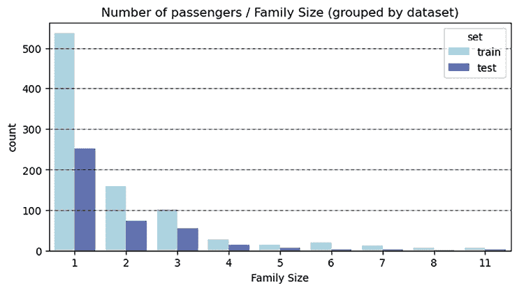

图 3.11：按家庭规模分组的乘客数量，按训练和测试分组

在下一个图中，我们看到的是按 Survived/Not Survived 分组，相同家庭规模的训练数据图：


图 3.12：按家庭规模分组的不同年龄区间的乘客数量

我们可以观察到，单身乘客的数量很普遍（而且这个大量也突出了这种乘客在头等舱中的高频率）。然后是家庭成员没有孩子的家庭和单身父母，接着是小型和大型家庭，成员人数最多可达 8 人甚至 11 人。正如你所看到的，这种模式来自建模前的数据探索性分析。

如果我们看一下生存率，我们可以看到单身乘客的生存率很小（大约 30%），而小型家庭（有 2、3 或 4 名成员）的生存率超过 50%。随着家庭规模的增加超过 4 人，我们可以看到生存率严重下降，有 8 人或 11 名成员的家庭生存率为零。

这可能是因为他们乘坐的是更便宜的舱位（我们知道三等舱的生存率低于头等舱）或者因为他们花费了太多时间试图在前往救生艇之前聚集所有家庭成员。我们将在本章稍后对这些细节进行一些调查。

我们可以观察到`年龄`和`票价`是分布值。虽然知道某个乘客的确切年龄是有用的，但在构建包含确切年龄的模型时，其价值并不大。实际上，通过学习各种年龄，模型可能会过度拟合训练数据，其泛化能力将下降。为了分析和建模的目的，将年龄（或票价）聚合到价值区间是有意义的。

```py
Age Interval, to form five classes, from 0 to 4, corresponding to Age intervals between 0 and 16, 16 and 32, 32 and 48, 48 and 64, and above 64, respectively:
```

```py
all_df["Age Interval"] = 0.0
all_df.loc[ all_df['Age'] <= 16, 'Age Interval']  = 0
all_df.loc[(all_df['Age'] > 16) & (all_df['Age'] <= 32), 'Age Interval'] = 1
all_df.loc[(all_df['Age'] > 32) & (all_df['Age'] <= 48), 'Age Interval'] = 2
all_df.loc[(all_df['Age'] > 48) & (all_df['Age'] <= 64), 'Age Interval'] = 3
all_df.loc[ all_df['Age'] > 64, 'Age Interval'] = 4 
```

下面的代码块计算了一个新的特征，称为`票价区间`，其中`0`到`3`（四个类别）的值分别来自`票价`在`0`到`7.91`、`7.91`到`14.454`、`14.454`到`31`以及高于`31`的值：

```py
all_df['Fare Interval'] = 0.0
all_df.loc[ all_df['Fare'] <= 7.91, 'Fare Interval'] = 0
all_df.loc[(all_df['Fare'] > 7.91) & (all_df['Fare'] <= 14.454), 'Fare Interval'] = 1
all_df.loc[(all_df['Fare'] > 14.454) & (all_df['Fare'] <= 31), 'Fare Interval']   = 2
all_df.loc[ all_df['Fare'] > 31, 'Fare Interval'] = 3 
```

上文所述的`年龄`和`票价`的特征转换具有正则化的效果。在下图中，我们展示了所有乘客的`年龄`区间，按训练集和测试集分开：

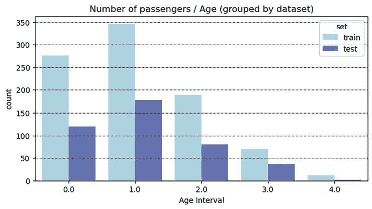

图 3.13：按训练集和测试集分组的不同年龄区间的乘客数量

下图显示了生存乘客与非生存乘客的`年龄`区间的分布：

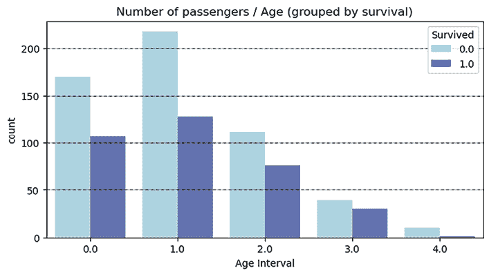

图 3.14：按生存状态分组的不同年龄区间的乘客数量

到目前为止，我们已经分析了单个特征。我们将训练集和测试集合并，并在同一张图上表示了训练集和测试集之间的数据分割。我们还只显示了一个特征的训练数据，分割为生存和未生存，并可视化了一些工程特征。在下一节中，我们将通过使用多元分析在同一张图上表示多个特征来继续。

# 执行多元分析

我们看到，通过使用每个特征的分布图，我们可以从数据中获得非常有趣的见解。然后，我们通过特征工程来获取有用、更相关的特征。虽然单独观察变量可以帮助我们获得数据分布的初步印象，但分组值并一次观察多个特征可以揭示相关性以及不同特征如何相互作用的更多见解。

现在，我们将使用各种图形来探索特征之间的相关性，同时我们也会探索可视化选项。我们将继续使用我们最初的选项，即结合使用`matplotlib`和`seaborn`图形库。

*图 3.15*显示了按乘客等级分组的每个年龄区间的乘客数量。我们可以从这张图片中看到，在第三等级中，大多数乘客处于第一个和第二个年龄区间（即 0-16 岁和 16-32 岁之间），而在头等舱，我们拥有最均衡的年龄组。三个等级中最均衡的年龄区间是第三个年龄区间。

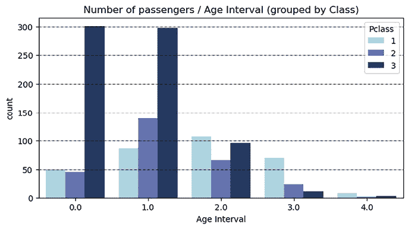

图 3.15：按等级分组的每个年龄区间的乘客数量

如*图 3.16*中下一个图表所示，大多数乘客在南安普顿（以初始**S**标识）登船。这些乘客中的大多数年龄都在 32 岁以下（年龄区间**0**和**1**）。在瑟堡（以初始**C**标识）登船的人，年龄组更加均衡。在昆士兰州（以初始**Q**标识）登船的乘客大多处于第一个年龄组。

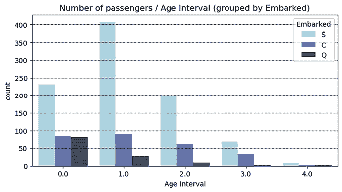

图 3.16：按登船港口分组的每个年龄区间的乘客数量

从以下图表中，我们可以看到，随着家庭规模的增加和乘客等级的降低，生存的可能性降低。最糟糕的生存率是三等舱大家庭，几乎没有人生还。即使是小家庭，在第三等级中也极大地降低了他们的生存可能性。

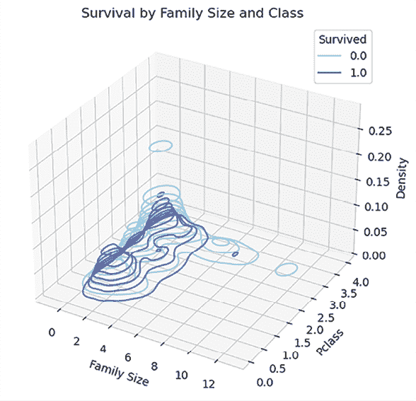

图 3.17：家庭规模和乘客等级（Pclass）的分布，按生存状态分组

我们还可以创建组合特征——例如，我们可以将`Sex`和`Pclass`这两个最具预测性的因素合并成一个单一特征；让我们称它为`Sex_Pclass`。以下图表显示了根据生存状态划分值时该新特征的分布。一等和二等舱的女性生存率超过 90%。在三等舱，女性的生存率约为 50%。一等和二等舱的男性生存率分别约为 30%和 20%，三等舱的大部分男性都死了。

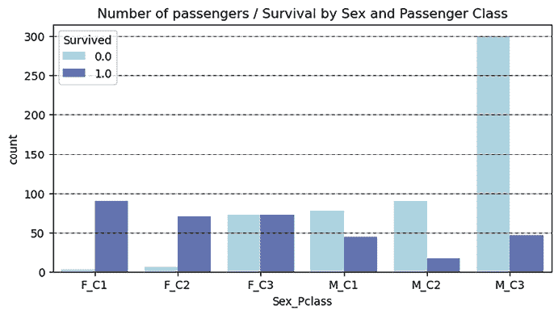

图 3.18：按生存状态分组的组合特征 Sex_Pclass 的分布

在数据质量评估之后，我们展示了如何进行单变量分析。然后，我们给出了一些数值数据的特征工程示例，并进行了多元分析。接下来，我们将探索乘客姓名中可以找到的信息的丰富性。让我们看看*名字中有什么*。

# 从乘客姓名中提取有意义的信息

我们现在继续我们的分析，包括分析乘客的姓名以提取有意义的信息。如您从本章开头所记得的，`姓名`列也包含一些附加信息。经过我们的初步视觉分析，很明显，所有姓名都遵循一个类似的结构。它们以`姓氏`开头，后面跟着一个逗号，然后是一个`头衔`（简短版本，后面跟着一个句号），然后是`名字`，在通过婚姻获得新名字的情况下，是之前的或`婚前名`。让我们处理数据以提取这些信息。提取这些信息的代码如下：

```py
def parse_names(row):
    try:
        text = row["Name"]
        split_text = text.split(",")
        family_name = split_text[0]
        next_text = split_text[1]
        split_text = next_text.split(".")
        title =  (split_text[0] + ".").lstrip().rstrip()
        next_text = split_text[1]
        if "(" in next_text:
            split_text = next_text.split("(")
            given_name = split_text[0]
            maiden_name = split_text[1].rstrip(")")
            return pd.Series([family_name, title, given_name, maiden_name])
        else:
            given_name = next_text
            return pd.Series([family_name, title, given_name, None])
    except Exception as ex:
        print(f"Exception: {ex}")
all_df[["Family Name", "Title", "Given Name", "Maiden Name"]] = all_df.apply(lambda row: parse_names(row), axis=1) 
```

如您可能已经注意到的，我们选择使用`split`函数来实现`姓氏`、`头衔`、`名字`和`婚前名`的提取。我们也可以使用更紧凑的实现，使用正则表达式。

让我们首先通过查看`头衔`和`性别`的分布来检查结果：

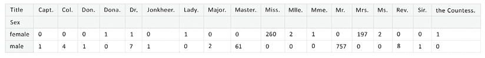

图 3.19：按性别划分的标题分布

我们可以看到，大多数头衔都是性别特定的，其中最常见的是女性的`Miss`（带有`Mlle.`版本）和`Mrs.`（带有`Mme.`和`Dona.`版本），以及男性的`Mr.`（和`Ms.`或`Don.`版本）和`Master`。一些头衔很少见，如军事（`Capt.`, `Col.`, `Major`和`Jonkheer`）、职业（`Dr.`和`Rev.`）或贵族（`Sir`, `Lady`和`Countess`）。`Dr.`是唯一一个被两种性别使用的头衔，我们将在本章稍后对其进行更详细的探讨。

让我们看看`头衔`按`年龄段`的分布：

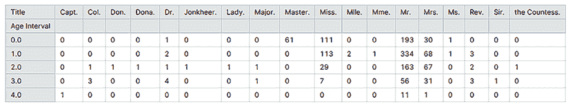

图 3.20：按年龄段划分的标题分布

从这个新视角来看，我们可以看到一些头衔是为特定年龄段保留的，而其他头衔则分布在所有年龄段。`Master`似乎只用于 18 岁以下的男性，但`Mr.`也用于这个年龄段。从我们所看到的，`Master`头衔仅用于与家人一起旅行的男性儿童，而年轻的男性头衔为`Mr.`的是独自旅行，因为已经独立，被视为年轻人。`Miss`头衔不遵循相同的模式，因为它同样被赋予女性儿童、年轻或未婚女性（但在较高级别时较少）。有趣的是看到`Dr.`头衔在广泛的年龄段中分布得很好。

现在，让我们看看第三等级中的一些大家庭。如果我们按`Family Name`（姓氏）、`Family Size`（家庭规模）、`Ticket`（车票，以保持同一车票旅行的人在一起）和`Age`（年龄）排序数据，我们将获得来自同一真实家庭的乘客序列。出现频率最高的`Family Name`值是安德森（11 条记录）、萨格（11 条记录）、古德温（Goodwin）（8 条记录）、阿斯普伦德（Asplund）（8 条记录）和戴维斯（Davies）（7 条记录）。我们还不知道他们是否也来自同一个家庭，或者只是共享同一个姓氏。让我们看看共享安德森姓氏的乘客数据。

从*图 3.21*中，我们看到有一个名叫安德森的家庭，父亲名叫安德斯·约翰（Anders Johan），母亲名叫阿尔弗里达·康斯坦蒂亚（Alfrida Konstantia），他们带着五个孩子（四个女儿和一个儿子）一起旅行，年龄在 2 到 11 岁之间。已婚的妇女在家庭中注册时，会先写上她们的头衔，然后是丈夫的名字，并在括号内加上她们的婚前名字。这个家庭中没有人在三等舱中幸存。

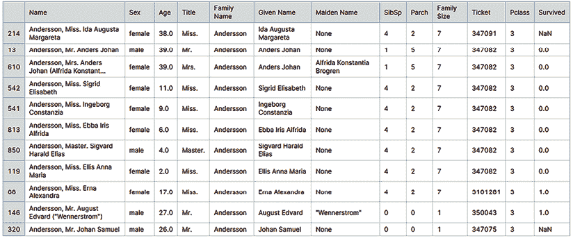

图 3.21：共享安德森姓氏的乘客

只有那些持有同一张车票的人才属于同一个家庭。这意味着只有持有车票号码 347082 的人属于安德森（Andersson）家庭，而其他人则是单独旅行的。他们的数据似乎不太准确，因为其中一些人似乎属于一个更大的家庭，但我们找不到他们的亲戚。

最大的家庭群体是萨格（Sage），正如我们从*图 3.22*中可以看到的那样。这是一个 11 口之家（两位父母和九个孩子）。我们不知道他们的年龄（除了其中一个男孩，他 14.5 岁）；我们只知道他们的名字，以及有五个男孩和四个女孩的事实。我们推测其中三个男孩已经成年，因为他们的头衔是`先生`。我们只知道 11 个人中的 9 个没有幸存（那些**Survived**没有指定值的其他家庭成员是测试集的一部分）。

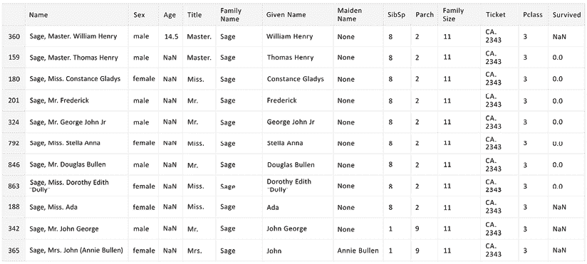

图 3.22：共享萨格姓氏的乘客

这些家庭在新世界中寻找更好生活的故事令人感动，尤其是当我们意识到，遗憾的是，这些有很多孩子的大家庭并没有设法自救。我们不知道决定性因素是什么：他们可能等待得太久才上甲板，希望团聚，或者也许他们在前往救生艇的路上努力保持在一起。无论如何，将家庭规模信息添加到模型中可能会给我们一个有用的特征来预测生存，因为我们可以看到，大家庭中的人生存的机会较低。

此外，我们还可以进行一些其他有趣的统计分析，这些分析对生存的预测价值较少，但可以给我们提供更多关于数据分布的见解。以下图显示了整体数据的`Given Name`分布（按性别分组）：

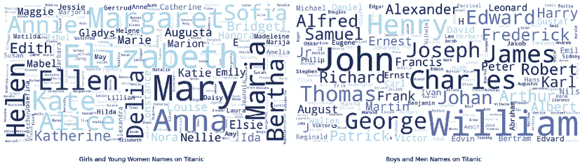

图 3.23：乘客的给定名字（女孩/未婚女性和男孩/男性）

下图显示了整体姓氏分布以及按启航港口的分布。我们注意到大多数乘客在 Southampton（用**S**表示）登船；因此，该港口登船乘客的姓氏分布将主导整体情况。其他两个启航港口是法国的 Cherbourg（用**C**表示）和爱尔兰的 Queenstown（用**Q**表示）。我们可以观察到各种启航港口中民族名字的普遍性，在南安普顿是斯堪的纳维亚人；在 Cherbourg 是法国人、意大利人、希腊人和北非人；在 Queenstown 是爱尔兰人和苏格兰人。

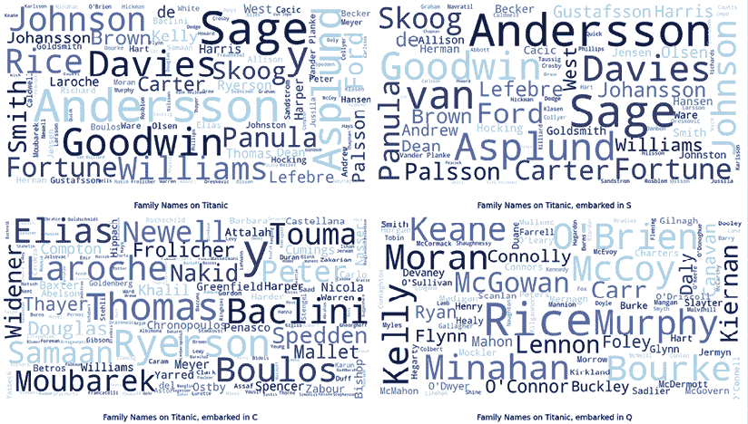

图 3.24：按启航港口分组的姓氏

在*图 3.25*中，我们看到两位共享舱位**D17**的乘客。其中一位有头衔`Dr.`，并且是女性。她与另一位女性同伴，Mrs. Swift，一起头等舱旅行。她们两人都幸存了下来。

我们创建了一个工程特征`Title`，因为 Dr. Leader 既是`Mrs.`（我们知道她已婚，因为她的婚前名字也被提及）又是`Dr.`；我们必须选择给她分配哪个头衔。`Dr.`在那个时代主要与男性（生存可能性较低）相关联。作为一个女性，她会有更高的生存概率。虽然这当然是一个有争议的问题，但我在这里提到它只是为了给你一个更好的形象，说明我们在为预测模型构建候选特征时可以达到的深度。

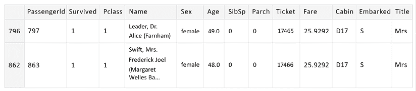

图 3.25：共享舱位 D17 的乘客 – 其中一位是女性，并且有 Dr.头衔

在介绍了单变量和多变量分析以及一些类型的特征工程，包括处理名字以提取头衔之后，我们还对大家庭和一些罕见案例进行了详细分析：非常大的家庭和具有不寻常头衔的乘客。在下一节中，我们将创建一个包含多个图表的仪表板图，每个图表都有单变量或双变量分析。我们可以使用这样的复杂图表来更好地捕捉复杂的特征交互，而不会在一个图表中加载过多的特征。

# 创建显示多个图表的仪表板

我们已经探索了分类数据、数值数据和文本数据。我们学习了如何从文本数据中提取各种特征，并从一些数值数据中构建了聚合特征。现在，让我们通过分组**头衔**和**家庭规模**来构建两个更多特征。我们将创建两个新的特征：

+   **标题**：通过将相似标题（如`Miss`与`Mlle.`，或`Mrs.`和`Mme.`）或罕见的（如`Dona.`、`Don.`、`Capt.`、`Jonkheer`、`Rev.`和`Countess`）聚类在一起，并保留最频繁的几个——`Mr.`、`Mrs.`、`Master`和`Miss`

+   **家庭类型**：通过从**家庭大小**值创建三个聚类——**Single**表示家庭大小为 1，**Small**表示由最多 4 名成员组成的家庭，**Large**表示有超过 4 名成员的家庭

然后，我们将几个简单或派生特征（我们了解到它们具有重要的预测价值）表示在单个图表上。我们展示了乘客的生存率，包括`Sex`、乘客等级（`Pclass`）、`Age Interval`、`Fare Interval`、`Family Type`和`Title`（聚类）。图表还显示了子集（由类别和生存状态共同决定）占所有乘客的百分比：

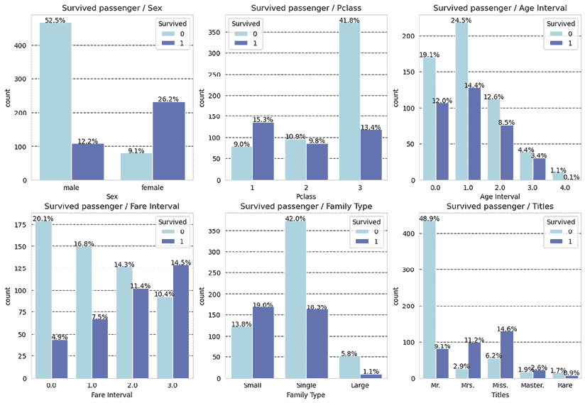

图 3.26：不同特征的乘客生存率（原始或派生）

通过这样，我们已经对“泰坦尼克号——灾难中的机器学习”竞赛数据集进行了逐步的探索性数据分析。现在，凭借我们对数据分布、特征之间的关系以及各种特征与目标特征（`Survived`字段）之间的相关性的了解，我们将创建一个基线模型。

# 构建基线模型

通过我们的数据分析，我们能够识别出一些具有预测价值的特征。现在，我们可以利用这些知识来选择相关特征，构建模型。我们将从一个只使用我们调查的众多特征中的两个特征的模型开始。这被称为基线模型，它被用作解决方案增量优化的起点。

对于基线模型，我们选择了`RandomForestClassifier`模型。该模型使用简单，默认参数下就能给出良好的结果，并且可以通过特征重要性轻松解释。

让我们从以下代码块开始实现模型。首先，我们导入一些准备模型所需的库。然后，我们将分类数据转换为数值。我们需要这样做，因为我们选择的模型只处理数字。将分类特征值转换为数字的操作称为标签编码。然后，我们将训练数据集分成训练集和验证集，使用 80-20%的分割。然后，使用训练子集对模型进行拟合，并使用验证子集来评估训练（拟合）后的模型：

```py
from sklearn.model_selection import train_test_split
from sklearn import metrics
from sklearn.ensemble import RandomForestClassifier
# convert categorical data in numerical
for dataset in [train_df, test_df]:
    dataset['Sex'] = dataset['Sex'].map( {'female': 1, 'male': 0} ).astype(int)
# train-validation split (20% validation)
VALID_SIZE = 0.2
train, valid = train_test_split(train_df, test_size=VALID_SIZE, random_state=42, shuffle=True)
# define predictors and target feature (labels)
predictors = ["Sex", "Pclass"]
target = 'Survived'
# train and validation data and labels
train_X = train[predictors]
train_Y = train[target].values
valid_X = valid[predictors]
valid_Y = valid[target].values
# define the classification model (Random Forest)
clf = RandomForestClassifier(n_jobs=-1, 
                             random_state=42,
                             criterion="gini",
                             n_estimators=100,
                             verbose=False)
# fit the model with training data and labels
clf.fit(train_X, train_Y)
# predict the survival status for the validation set
preds = clf.predict(valid_X) 
```

在图 3.27 中，我们展示了验证集的`precision`、`recall`和`f1-score`（使用`sklearn.metrics`模块中的`classification_report`函数获得）。

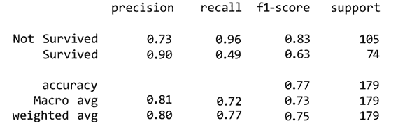

图 3.27：使用性别和 Pclass 特征训练的基线模型的验证数据分类报告

使用此基线模型获得的前置结果仍然很差。我们必须使用模型细化技术来细化模型，从训练和验证错误观察开始。基于这些观察，我们可能想要先改进训练，然后再专注于改进模型泛化。因此，我们可能会选择添加更多具有预测价值的特征（通过选择现有特征或通过特征工程创建新特征），执行超参数优化，选择更好的分类算法，或者结合不同的算法。

# 摘要

在本章中，我们乘坐泰坦尼克号开始了在数据世界中的旅程。我们首先对每个特征进行了初步的统计分析，然后继续进行单变量分析和特征工程，以创建派生或聚合特征。我们从文本中提取了多个特征，并且还创建了复杂的图表来同时可视化多个特征并揭示它们的预测价值。然后我们学习了如何通过在整个笔记本中使用自定义颜色图来为我们的分析分配统一的视觉身份。

对于一些特征——最明显的是，那些从名字中派生出来的特征——我们进行了深入的探索，以了解泰坦尼克号上大家庭的命运以及根据登船港口的名字分布情况。一些分析和可视化工具很容易重用，在下一章中，我们将看到如何提取它们作为实用脚本在其他笔记本中使用。

在下一章中，我们将对包含地理数据的两个数据集进行详细的数据探索性分析。对于每个数据集，我们将从数据质量评估开始，然后继续进行数据探索，介绍针对地理数据分析的特定分析方法、工具和库。我们将学习如何操作多边形数据，以及如何合并、融合和裁剪存储为多边形集合的地理数据集。我们还将介绍用于地理数据可视化的各种库。在对两个数据集进行单独分析后，我们将结合两个数据集的信息来构建包含来自两个数据集的多层信息的先进地图。

# 参考文献

1.  泰坦尼克号 - 从灾难中学习机器学习，Kaggle 比赛：[`www.kaggle.com/competitions/titanic`](https://www.kaggle.com/competitions/titanic)

1.  Gabriel Preda，泰坦尼克号 - 数据世界之旅的开始，Kaggle 笔记本：[`www.kaggle.com/code/gpreda/titanic-start-of-a-journey-around-data-world`](https://www.kaggle.com/code/gpreda/titanic-start-of-a-journey-around-data-world)

1.  Developing-Kaggle-Notebooks，Packt Publishing GitHub 仓库：[`github.com/PacktPublishing/Developing-Kaggle-Notebooks/`](https://github.com/PacktPublishing/Developing-Kaggle-Notebooks/)

1.  开发-Kaggle 笔记本，Packt 出版 GitHub 仓库，第三章：[`github.com/PacktPublishing/Developing-Kaggle-Notebooks/tree/main/Chapter-03`](https://github.com/PacktPublishing/Developing-Kaggle-Notebooks/tree/main/Chapter-03)

# 加入我们书籍的 Discord 空间

加入我们的 Discord 社区，与志同道合的人相聚，并和超过 5000 名成员一起学习，详情请见：

[`packt.link/kaggle`](https://packt.link/kaggle)


