# 5

# 让发展中国家重新回到工作岗位并优化微型贷款

接近一个新的数据集类似于考古挖掘，有时也像警察调查。我们继续挖掘数据堆下面隐藏的洞察力，或者我们尝试使用系统的方法，有时是枯燥的过程，来揭示难以捉摸的证据，这分别类似于考古学家的技术学科或侦探的方法。所有数据都能讲述一个故事。这是分析师的选择，这个故事是以科学报告的风格讲述，还是以侦探小说生动、吸引人的形式讲述。

在本章中，我们将结合我们在前几章中开发的技巧来分析表格（数值和分类）、文本和地理空间数据。这涉及到结合来自多个来源的数据，并展示如何用这些数据讲述故事。我们将继续分析来自早期 Kaggle 竞赛的数据，*数据科学为善：Kiva 筹款*（见*参考文献 1*）。您将学习如何以既信息丰富又吸引读者的方式使用数据讲故事。然后，我们将对另一个竞赛数据集中的一个假设进行详细分析，该假设特别关注 Kaggle 元数据，Meta Kaggle（见*参考文献 2*）。

总结来说，本章将涵盖以下主题：

+   对 *数据科学为善：Kiva 筹款* 分析竞赛的探索性数据分析

+   同样分析竞赛的解决方案，试图了解哪些因素导致贫困

+   对 *Meta Kaggle* 数据集的分析以验证（或否定）几年前 Kaggle 竞赛团队规模突然增加的感知

# 介绍 Kiva 分析竞赛

Kiva.org 是一个在线众筹平台，其使命是向世界各地的贫困和金融排斥人群提供金融服务的好处。这些人可以通过 Kiva 的服务借取小额资金。这些微型贷款由 Kiva 通过与金融机构的合作，在贷款接收者居住的国家提供。

在过去，Kiva 向其目标社区提供了超过 10 亿美元的微型贷款。为了扩大其援助范围，同时提高对世界各地贫困人群的具体需求和影响因素的理解，Kiva 想要更好地了解每位潜在借款人的状况。由于世界各地问题的多样性、每个案例的特定性和众多影响因素，Kiva 识别出最需要其财务援助的案例的任务相当困难。

Kiva 向 Kaggle 的数据科学社区提出了一个分析竞赛。竞赛的范围是将每个贷款的特征与各种贫困数据集相结合，并确定潜在借款人的实际福利水平，按地区、性别和行业进行分类。在这个竞赛中，对参赛者贡献的评价基于分析的粒度，强调对当地具体情况的遵守、解释的清晰度和方法的原创性。竞赛组织者旨在直接使用最佳分析，因此强调了本地化和清晰的解释。

*数据科学为善：Kiva 众筹*分析竞赛要求参与者识别或收集相关数据，除了组织者提供的数据之外。组织者提供的数据包括贷款信息、按地区和位置提供的 Kiva 全球**多维贫困指数**（**MPI**）、贷款主题以及按地区划分的贷款主题。

贷款信息包括以下内容：

+   一个唯一的 ID

+   贷款主题 ID 和类型

+   当地金融机构合作伙伴 ID

+   资金金额（Kiva 提供给当地合作伙伴的金额）

+   贷款金额（当地合作伙伴向借款人发放的金额）

+   借款人的活动

+   贷款的用途（贷款将如何使用，或贷款目的）

+   行业、国家代码、国家名称、地区和货币

+   发布时间、发放时间、资金时间以及贷款发放的持续时间

+   为一笔贷款做出贡献的贷款人总数

+   借款人的性别

+   还款间隔

Kiva 按地区和位置提供的 MPI 信息包括以下内容：

+   地区或国家名称

+   该国的 ISO-3 代码

+   世界地区

+   当前地区的 MPI 值和地理位置（纬度和经度）

贷款主题包括：

+   一个唯一的 ID

+   贷款主题 ID

+   贷款主题类型

+   相应的合作伙伴 ID

贷款主题按地区数据集包含以下内容：

+   一个合作伙伴 ID

+   场地合作伙伴名称

+   行业

+   贷款主题 ID 和类型

+   国家和地区

+   地理编码（四种变体）

+   ISO-3 代码

+   金额

+   位置名称

+   MPI 地区和 MPI 地理编码（可能重复其他地理编码）

+   当前地区的农村百分比

在这个竞赛数据集中有大量的信息。我们不会对数据进行深入细致的分析，而是将目标集中在数据的一个方面。

**分析竞赛的好解决方案是什么？**

从一开始就强调，一个分析竞赛的好解决方案并不一定是完整的数据探索分析。根据我在几个分析竞赛中的经验和对顶尖解决方案的审查，我可以这样说，有时分析竞赛的评分标准恰恰相反。虽然标准可能会随着时间的推移而演变，但有些标准会被反复采用。例如，评估者经常优先考虑方法的原创性，而不是构成和记录。

要在这些标准上获得高分，作者必须充分准备自己。对数据的扩展探索仍然是必要的，以便所呈现的结果可以得到充分记录。虽然这种方法对研究目的很有用，但不需要完全包含在解决方案笔记本的叙述中。作者可以在他们的故事中选取并讨论数据的一部分，只要叙述是一致的，并且能够提出一个强烈、有说服力的案例。

作者必须从他们所探索的丰富数据中，仅选择那些将支持他们故事的部分。因此，构成同样重要，所选和解释的数据应提供有力的证据来支持叙述。如果叙述、结构和内容是原创的，故事的影响力将会更高。

# 数据越多，洞察力越强——分析 Kiva 数据竞赛

对于这次分析，我们更喜欢包括一个额外的数据源，`Country Statistics – UNData`（见*参考文献 3*）。数据是由 Kiva 分析竞赛的一位参与者收集的，汇编了国家的基本统计指标。这个特定数据集基于**联合国统计司**（**UNSD**）的**经济和社会事务部**（**DESA**）。关键指标可以分为四个类别：一般信息、经济指标、社会指标和环境及基础设施指标。

`Country Statistics – UNData`数据集中有两个 CSV 文件：

+   包含`Country Statistics – UNData`数据集中所有国家关键指标的

+   仅涵盖`Data Science for Good: Kiva Crowdfunding`数据集中存在的国家

`Country Statistics – UNData`数据集中共有 50 列，从国家和地理区域、人口、人口密度、性别比、**国内生产总值**（**GDP**）、人均 GDP 和 GDP 增长率开始，接着是经济中的农业、工业、服务业的百分比、同一部门的就业情况、农业产量、贸易指标、城市人口和城市人口增长率。还包括诸如移动订阅百分比或女性在国家议会中的席位等信息。

一些有趣的因素包括使用改善后的饮用水的人口百分比、使用改善后的卫生设施的人口百分比、婴儿死亡率和生育率，以及预期寿命。UNData 中包含的许多这些特征与贫困的定义相关，我们将在我们的旅程中探讨它们。

我们分析的主要目标是理解如何衡量贫困，以便我们可以为组织者提供优化微贷分配所需的信息。

## 理解借款人人口统计

我们从关注谁获得贷款开始我们的探索，试图回答问题，“谁是借款人？”在 Kiva 数据集中，有 1,071,308 名女性借款人和 274,904 名男性借款人。女性不仅在总数上，而且在与贷款相关的借款人数上似乎都占主导地位。与贷款相关的女性人数是 50，而男性人数是 44。有多笔贷款既有女性又有男性借款人，也有只有男性或只有女性的贷款。

如您在以下图表中可以看到，大多数贷款与仅限女性的借款人相关，其次是仅限男性的借款人：

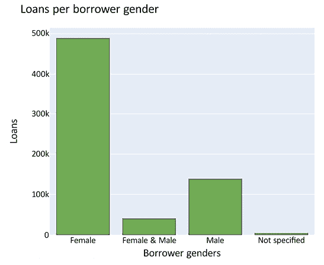

图 5.1：借款人性别

在以下图表中，让我们看看女性借款人（左）和男性借款人（右）的分布情况，从每个行业的平均女性和男性借款人数开始：

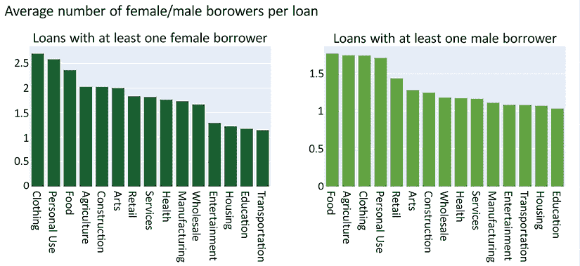

图 5.2：每笔贷款中女性/男性借款人的平均数量

如您所见，每笔贷款中女性借款人的平均数量分解为**服装**2.7，**个人用途**2.6，**食品**2.4，以及接近 2 的**农业**和**建筑**。对于男性借款人，每笔贷款的平均借款人数接近**食品**、**农业**、**服装**和**个人用途**的 1.75。

接下来，我们可以看到，女性借款人最多的类别是**服装**、**食品**和**零售**。对于男性借款人，**个人用途**和**农业**有最多的借款人：

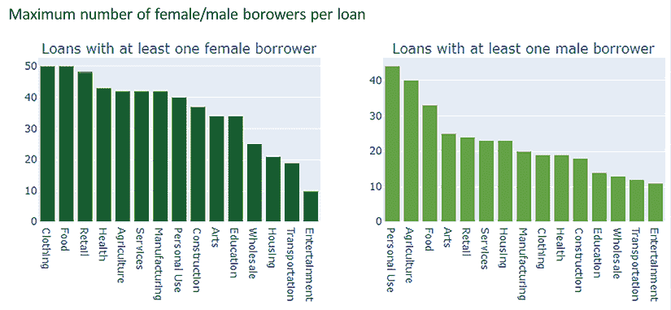

图 5.3：每笔贷款中女性/男性借款人的最大数量

这些图表是使用 Plotly 构建的，Plotly 是一个强大且多功能的开源 Python 图形库。通过*Kiva Microloans – 数据探索*笔记本（见*参考文献 4*），我们将广泛使用 Plotly，用于低或高复杂度的图表。以下代码摘录用于构建*图 5.3*中的图表：

```py
df = df.sort_values(by="max", ascending=False)
sectors_f = go.Bar(
        x = df['sector'],
        y = df['max'],
        name="Female borrowers",
        marker=dict(color=color_list[4]))
df2 = df2.sort_values(by="max", ascending=False)
sectors_m = go.Bar(
        x = df2['sector'],
        y = df2['max'],
        name="Male borrowers",
        marker=dict(color=color_list[3]))
fig = make_subplots(rows=1, cols=2, start_cell="top-left",
                   subplot_titles=("Loans with at least one female borrower", 
                                   "Loans with at least one male borrower"))
fig.add_trace(sectors_f, row=1, col=1)
fig.add_trace(sectors_m, row=1, col=2)
layout = go.Layout(height=400, width=900, title="Maximum number of female/male borowers/loan")
fig.update_layout(layout)
fig.update_layout(showlegend=False)
fig.show() 
```

代码创建了两个并排的条形图，使用 Plotly 的`make_subplots`函数。

借款人将贷款分多次偿还。还款方案多种多样，我们也可以在*图 5.4*中看到女性和男性还款分布的差异。仅女性借款组的贷款在**每月**和**不规律**还款间隔中几乎数量相同，只有一小部分贷款是一次性偿还（**子弹**）。仅男性借款组的还款主要是每月类型，并且**子弹**还款类型的比例远大于**不规律**。**子弹**类型很可能是周期性活动（如农业）的特征，当收入稀缺时，还款只能在收获时间（或收获付款时）进行。

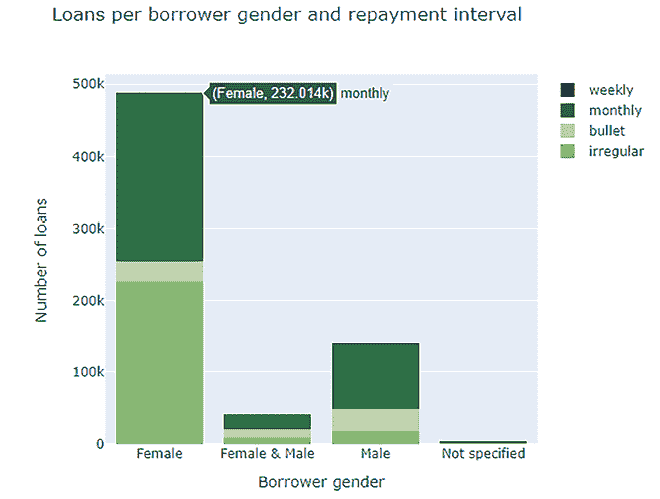

图 5.4：借款人性别还款间隔

## 探索 MPI 与其他因素的关联

联合国开发计划署开发了**多维贫困指数**，或简称**MPI**（参见*参考文献 5*和*6*）。我们分析中使用的值是 2017 年的。当前可用的报告是 2022 年的。在当前报告中，联合国强调有 12 亿人是多维贫困的，其中 5.93 亿是 18 岁以下的儿童。在这 12 亿人中，有 5.79 亿生活在撒哈拉以南非洲，其次是南亚，有 3.85 亿（参见本章末尾的*参考文献 3*）。

MPI 是一个综合指数，包括三个维度、多个指标和贫困衡量标准。这三个维度是健康、教育和生活水平。与健康维度相关的指标是营养和儿童死亡率。教育与两个指标相关：学年和出勤率。这些在 MPI 值中各占 1/6 的权重。然后，有六个与生活水平维度相关的指标：烹饪燃料、卫生、饮用水、电力、住房和资产。这些在 MPI 值中各占 1/18 的权重（参见*参考文献 3*）。

MPI 的值介于 0 和 1 之间，较大的值意味着更高的贫困暴露度。联合国创建的这个多维因素的组成突出了贫困的复杂性。如 GDP 或人均 GDP 这样的指标并不能讲述整个故事。我们将尝试更好地理解贫困的衡量标准，以及 Kiva 和 UNData 数据集中的一些特征如何描绘它。

现在，让我们看看借款人居住的地方。为此，我们将使用 leaflet 地图表示 Kiva 地区的位置。为了构建这张地图，我们首先删除错误的纬度和经度元组（例如，纬度大于 90 或小于-90 的值）。然后，我们还将删除具有错误属性的数据。在地图上，我们还将使用与 MPI 成比例大小的标记表示每个地区，如前所述，MPI 是 Kiva 使用的贫困指数。在下一节中，我们将详细讨论这个指标。显示地图的代码如下：

```py
# map with entire World
m = folium.Map(location=[0, 0], zoom_start=2, tiles="CartoDB Positron")
for _, r in region_df.iterrows():
    folium.CircleMarker(location=[r['lat'], r['lon']],
        fill=True,
        color=color_list[3],
        fill_color=color_list[3],
        weight=0.9,
        radius= 10 * (0.1 + r['MPI']),
        popup=folium.Popup("<strong>Region</strong>: {}<br>\
               <strong>Country</strong>: {}<br>\
               <strong>Location Name</strong>: {}<br>\
               <strong>World Region</strong>: {}<br>\
               <strong>MPI</strong>: {}".format(r['region'], r['country'],  r['LocationName'],\
                   r['world_region'], r['MPI']), min_width=100, max_width=300)).add_to(m)
m 
```

在*图 5.5*中，我们展示了每个地区的 MPI 分布。地图中包含一些基于错误纬度/经度对分配的错误位置，这些错误将在我们代表国家或更大世界区域层面的汇总数据时得到纠正。

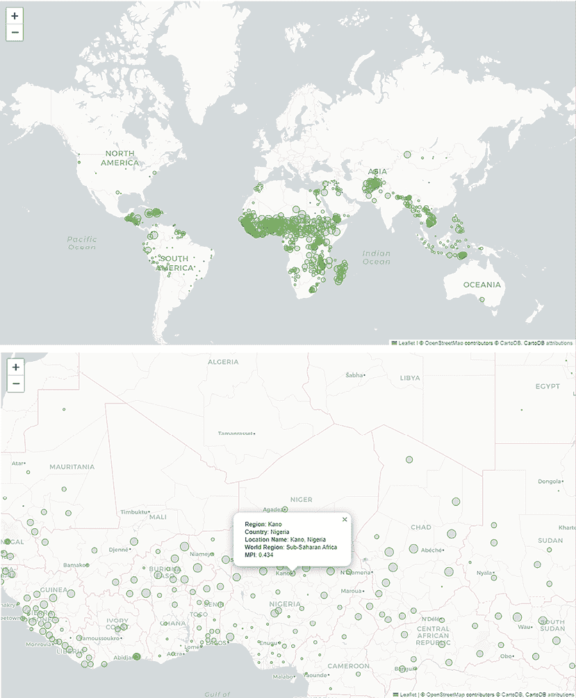

图 5.5：具有 MPI 贫困指数的世界地区。顶部为完整的世界地图，底部为撒哈拉以南非洲的放大图

让我们也看看国家和大陆级别的 MPI 分布。在当前章节相关的分析笔记本中，我们将查看 MPI 的最小值、最大值和平均值。在这里，我们只展示平均值，因为空间限制。

在*图 5.6*中，我们可以看到国家级别的 MPI 值。请注意，高 MPI 值最大的集中区域在撒哈拉以南国家，其次是东南亚。

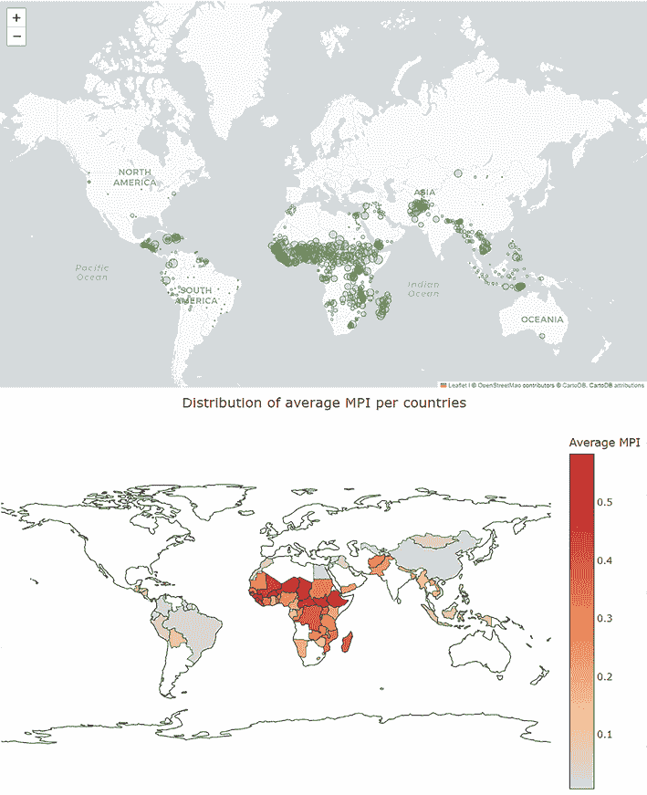

图 5.6：具有平均 MPI 贫困指数的国家。MPI 平均值的最大值在撒哈拉以南非洲

类似地，*图 5.7*显示了世界区域级别的 MPI 值。再次，最大的平均 MPI 在撒哈拉以南非洲、南亚、东亚和太平洋，其次是阿拉伯国家。

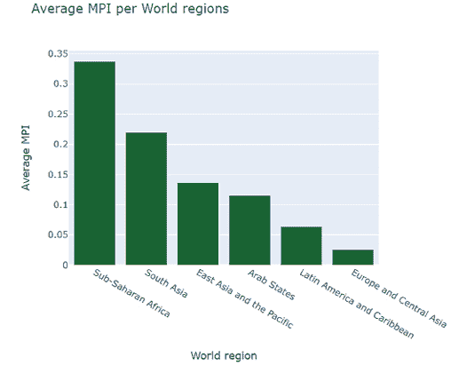

图 5.7：具有平均 MPI 贫困指数的国家

让我们看看每个贷款行业的平均 MPI 是多少。在*图 5.8*中，我们可以看到每个行业的平均 MPI 值的分布。与最大平均 MPI 相关联的行业是**农业**，其次是**个人用途**、**教育**、**零售**和**建筑**：

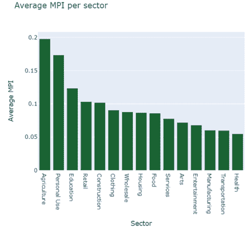

图 5.8：每个贷款行业的平均 MPI

如您所见，**农业**行业的贷款平均 MPI 为**0.2**，其次是**个人用途**，约为**0.18**，以及**教育**为**0.12**。

我们分别研究了 MPI 与**世界区域**、**行业**和**借款人性别**之间的关系。现在让我们看看所有这些特征之间的关系。我们将查看这些特征类别中贷款数量和每笔贷款金额的分布。由于贷款金额使用各种货币，我们只以美元为单位查看。见*图 5.9*了解贷款数量：

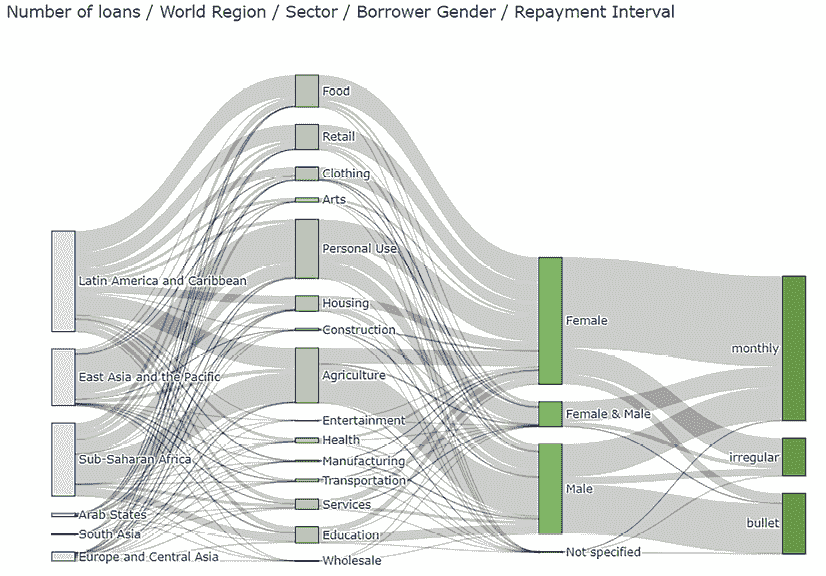

图 5.9：世界各地区、各行业、借款人性别和还款间隔的贷款分布（即贷款数量）

*图 5.9*和*图 5.10*中的图表使用桑基图。在 Plotly 中生成这些桑基图的代码包含在实用脚本`plotly_utils`中（有关书籍代码仓库的链接，请参阅*参考文献 7*）。由于代码过长，无法在此完整展示，所以我们只包含以下代码片段中的原型和参数定义：

```py
def plotly_sankey(df,cat_cols=[],value_cols='',title='Sankey Diagram', color_palette=None, height=None):
    """
    Plot a Sankey diagram
    Args:
        df: dataframe with data
        cat_cals: grouped by features
        valie_cols: feature grouped on
        title: graph title
        color_palette: list of colors
        height: graph height
    Returns:
        figure with the Sankey diagram
    """ 
```

接下来，查看仅包含美元贷款金额的*图 5.10*：

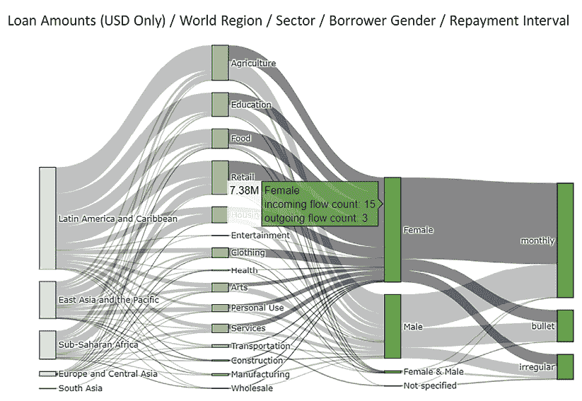

图 5.10：世界各地区、各行业、借款人性别和还款间隔的贷款金额（美元）分布

我们还希望将几个数值特征与 MPI 相关联。我们从 Kiva 数据集中可用的信息开始。在*图 5.11*中，我们可以看到男性借款人数、女性借款人数、贷款金额、已资助金额、月数和 MPI 值之间的相关矩阵。请注意，我们不仅选择了在 MPI 计算中作为贫困因素的列，还选择了其他特征。

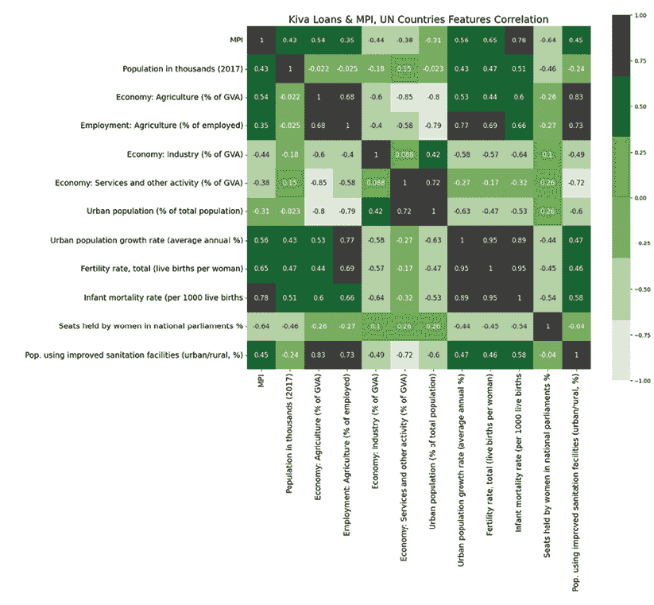

图 5.11：MPI、贷款数据特征和所选 UNData 列之间的相关矩阵

男性与女性的数量呈负相关（这是正常的，因为贷款会有男性或女性借款人，当一个类别的数量增加时，另一个类别将减少）。

资助金额与借款金额之间始终存在非常高的相关性。MPI 与 Kiva 包含的任何数值指标之间都存在非常小的负相关性（即无相关性，因为此值的绝对值小于 0.1）。我们需要查看 MPI 与 UNData 中的特征之间的相关性，因为我们确实有许多与贫困相关的指标。

为了准备前面的相关矩阵（如图 5.11 所示），我们将贷款数据与 MPI 数据和 UNData 合并：

```py
kiva_mpi_un_df = loan_mpi_df.merge(kiva_country_profiles_variables_df)
kiva_loans_corr = kiva_mpi_un_df.loc[loan_mpi_df.currency=="USD"][sel_columns].corr()
fig, ax = plt.subplots(1, 1, figsize = (16, 16))
sns.heatmap(kiva_loans_corr, 
            xticklabels=kiva_loans_corr.columns.values,
            yticklabels=kiva_loans_corr.columns.values, 
            cmap=cmap_custom, vmin=-1, vmax=1, annot=True, square=True,
            annot_kws={"size":8})
plt.suptitle('Kiva Loans & MPI, UN Countries Features Correlation')
plt.show() 
```

从查看*图 5.11*中，我们可以观察到 MPI 与婴儿死亡率有非常强的正相关，并且与生育率（0.78）相关。它还与人口、使用改善的卫生设施（0.45）、城市人口增长率（0.56）、经济中农业的百分比（0.54）或参与农业的人口百分比（0.35）呈正相关。这些都是当贫困更多时将会增加的因素的例子。有趣的是，城市人口增长率与 MPI 相关。这是因为人口流动并不总是由于更多的人为了就业而搬到城市，而是因为许多人由于农村地区资源匮乏而被流离失所。它还与卫生总支出（-0.2）、议会中女性的席位（-0.64）以及经济中工业（-0.21）和服务（-0.36）的百分比呈负相关。

工业发展和更多服务是发达经济的属性，为穷人提供更多机会；因此，随着这些因素（工业发展和服务）的增加，MPI 会降低。一个非常有趣的因素（强负相关）是女性在国家议会中的存在。这标志着更加发达、包容和富裕的社会，该社会准备赋权女性并给予她们更多机会。

## 贫困维度的雷达可视化

我们本节开始时探讨了借款人的信息。我们了解到，他们大多是女性，来自撒哈拉以南地区的贫困地区或南亚。然而，需求多样性很大，行业信息并没有揭示所有这些信息。只有通过查看与每个行业相关的详细活动，我们才能开始揭示每个借款人的具体需求，从而揭示导致贫困的特殊条件。

从 Kiva 数据和联合国的 MPI 定义中，我们了解到贫困是多种因素的组合。导致贫困的这种特定因素组合取决于每个地区，甚至每个具体案例。我们采用可视化工具来突出贫困的多维本质。我们将使用雷达图（也称为蜘蛛图）来展示几个国家与贫困相关的选定维度。在雷达图（或蜘蛛图——之所以这样命名是因为它类似于蜘蛛网）中，轴（径向）代表考虑中的个体特征。图形的面积反映了个体特征的累积效应的大小。对于小特征，我们得到小的面积。对于大特征，面积较大。在我们的情况下，我们希望通过特征或导致贫困的因素的数量来展示贫困（或 MPI 累积因素）。

以下代码片段使用 Plotly 为可视化准备数据，使用自定义构建的雷达图，按国家分组数据并计算每个国家的平均值：

```py
region_df = kiva_mpi_region_locations_df.loc[~kiva_mpi_region_locations_df.MPI.isna()]
df = region_df.groupby(["country"])["MPI"].agg(["mean", "median"]).reset_index()
df.columns = ["country", "MPI_mean", "MPI_median"]
kiva_mpi_country_df = kiva_country_profiles_variables_df.merge(df)
df = kiva_mpi_country_df.sort_values(by="MPI_median", ascending = False)[0:10]
df['MPI_median'] = df['MPI_median'] * 100
df['MPI_mean'] = df['MPI_mean'] * 100 
```

我们只选择了介于 1 到 100 之间的特征（我们还将一些特征，如 MPI，缩放到同一区间）。我们还计算了*100 - 值*，当值与 MPI 值呈负相关时。我们这样做是为了确保雷达图轴上表示的特征都与 MPI 呈正相关：

```py
df['Infant mortality rate /1000 births'] = df['Infant mortality rate (per 1000 live births']
df["Employment: Agriculture %"] = df['Employment: Agriculture (% of employed)'].apply(lambda x: abs(x))
df["No improved sanitation facilit. %"] = df['Pop. using improved sanitation facilities (urban/rural, %)'].apply(lambda x: 100 - float(x))
df ['No improved drinking water % (U)'] = df['Pop. using improved drinking water (urban/rural, %)'].apply(lambda x: 100 - float(x.split("/")[0]))
df ['No improved drinking water % (R)'] = df['Pop. using improved drinking water (urban/rural, %)'].apply(lambda x: 100 - float(x.split("/")[1])) 
```

然后，我们定义雷达图的特征：

```py
radar_columns = ["No improved sanitation facilit. %",
                 "MPI_median", "MPI_mean",
                 'No improved drinking water % (U)',
                 'No improved drinking water % (R)',
                 'Infant mortality rate /1000 births',
                 "Employment: Agriculture %"] 
```

使用以下代码创建雷达图：

```py
fig = make_subplots(rows=1, shared_xaxes=True)
for _, row in df.iterrows():
    r = []
    for f in radar_columns:
        r.append(row[f])
    radar = go.Scatterpolar(r=r,
       theta=radar_columns,
       fill = 'toself',
       opacity=0.7,
       name = row['country'])
    fig.add_trace(radar)
fig.update_layout(height=900, width=900,
        title="Selcted poverty dimmensions in the 10 countries with highest median MPI rate",
        polar=dict(
            radialaxis=dict(visible=True, range=[0,100], gridcolor='black'),
            bgcolor='white',
            angularaxis=dict(visible=True, linecolor='black', gridcolor='black')
        ),
        margin=go.layout.Margin(l=200,r=200,b=50, t=100)
    )
fig.show() 
```

结果图显示在*图 5.12*中。我们得到的是一个雷达图，其中包含 10 个最高中位（按国家计算）MPI 率国家的选定贫困维度。这些维度被选为与 MPI 呈正相关。更大的总面积意味着更高的实际贫困。

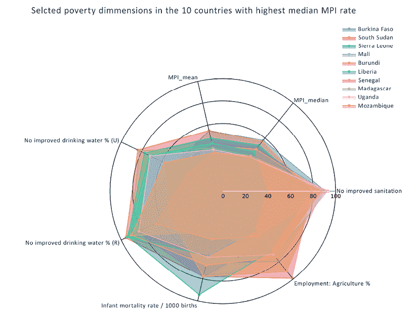

图 5.12：包含 10 个最高中位 MPI 率国家的选定贫困维度的雷达图

我们确定了与贫困相关的因素，使用雷达图来展示这些因素及其对维持贫困的累积影响。

## 最后的评论

我们分析了 Kiva 数据竞赛的一部分，关注的焦点不是实际的贷款和 Kiva 的合作伙伴领域，而是借款人和定义他们贫困的因素。我们的目的是创建一个针对贫困因素的分析，理解这些因素以及它们各自如何导致贫困的持续。

与围绕全面、综合的数据分析构建故事不同，我们需要在数据中导航，以讲述我们想要的故事。我们没有在这里描述初步步骤，其中我们进行了对数据的详尽分析（就像我们在上一章中做的那样，其中为两个数据集分别准备了最终分析，并得到了我们初步的 EDAs 的支持）。我们的重点是理解什么最能定义贫困，为此，我们将 Kiva 数据与来自联合国的额外数据相结合。

总之，我们可以断言，通过优先考虑最易受贫困特征不同方面影响的地区、国家和类别，Kiva 可以通过目标优化得到改进。雷达图可以是一个有用的工具。在设计它时，我们选择了那些指标或修改了一些指标，以获得更高的贫困总面积。

人均 GDP 并不是唯一表征贫困的指标；它可能采取不同的形式，并由多个因素定义，有时这些因素是相互依赖的。针对那些可能影响其他因素的潜在因素，如提高学校入学率、改善卫生条件、食物和医疗保健，以及通过 Kiva 反贫困项目，可能会增加积极的社会影响。

# 从不同的数据集讲述不同的故事

我们从分析 Kaggle 举办的第一场分析竞赛的数据开始本章，那是在 5 年多以前。我们将继续查看更近期的竞赛数据，特别是那些使用 Kaggle 自己的数据的竞赛。我们将查看 Meta Kaggle 数据集（见*参考文献 2*）中的数据，并尝试回答一个与近期在竞赛中创建大型团队趋势感知相关的问题。最终目的是表明，通过仔细检查可用数据，我们可以获得重要的见解。

## 图表

几年前，在 2019 年，一场竞赛即将结束时，关于近期竞争者团队数量增加的趋势进行了讨论，尤其是在高知名度、特色竞赛中。我对讨论板上这一趋势的说法很感兴趣，并决定使用 Kaggle 自己的数据（该数据集由 Kaggle 不断更新）来验证这一信息。为了保持该分析的结果，我将限制 Meta Kaggle 的数据到 2019 年底之前。自 2019 年以来，一些元数据关键词已更改。以前被称为“课堂”的比赛现在更名为“社区”。尽管在当前数据集版本中，该类别现在命名为“社区”，但我们将使用这两个术语，有时甚至只使用“课堂”，因为这是首次进行此分析时使用的术语。

## 实际的历史

如果我们按年份和团队规模分组查看团队数量，我们可以观察到大型团队并不仅限于 2017 年或 2018 年。让我们看看这些统计数据，如图*5.13*所示。

最大团队包括：

+   2012 年（有 40 名和 23 名团队成员）

+   2013 年（最大团队有 24 名团队成员）

+   2014 年（有 25 名团队成员的团队）

+   2017 年（最大团队有 34 名团队成员）

2017 年和 2018 年发生的情况是，团队数量（2017 年）和中型团队（4-8 名团队成员）的数量突然增加。

当检查每年的比赛数量时，我们也注意到，2018 年发生的情况是，没有限制团队规模的比赛数量占总比赛数量的百分比增加了。这在一定程度上解释了我们观察到的模式——2018 年有更多的大型团队。

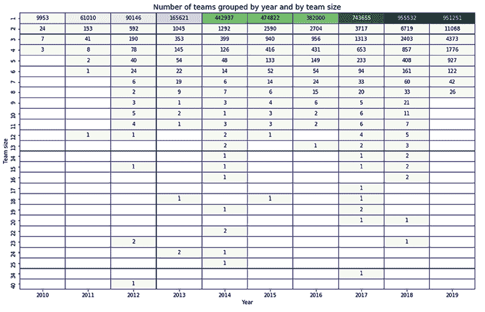

图 5.13：按年份和团队规模分组的团队数量

如果我们排除社区竞赛，我们将获得*图 5.14*中显示的统计数据。就大型队伍而言，统计数据变化不大，因为大多数多成员队伍是为除社区类型以外的竞赛而组建的。

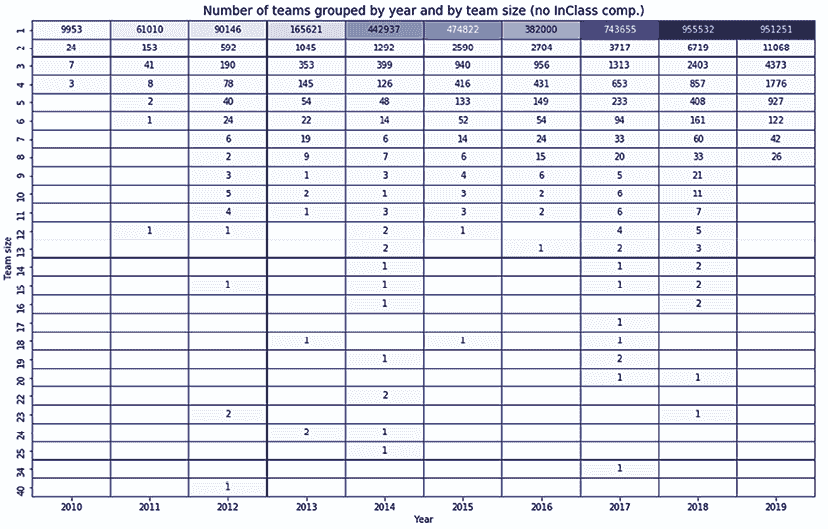

图 5.14：按年份和队伍规模分组的队伍数量，除了社区竞赛

让我们使用 Plotly Express 散点图查看金牌、银牌和铜牌随时间分布的情况，将奖牌按队伍规模分组为单独的轨迹。

在 y 轴上，我们使用了对数刻度来表示队伍数量；在 x 轴上，我们显示了队伍规模，标记的大小与奖牌的重要性成比例（金牌最大，铜牌最小）。如图*图 5.15*所示，我们展示了这些结果。我们可以观察到，在每年的获奖队伍中，最大的队伍如下：

+   2010 年：1 支队伍获得金牌，共有 4 名成员。

+   2011 年：1 支队伍获得金牌，共有 12 名成员。

+   2012 年：1 支队伍获得铜牌，共有 40 名成员。

+   2013 年：2 支队伍获得金牌，共有 24 名成员。

+   2014 年：1 支队伍获得铜牌，共有 6 名成员。

+   2015 年：1 支队伍获得铜牌，共有 18 名成员。

+   2016 年：1 支队伍获得金牌，共有 13 名成员。

+   2017 年：1 支队伍获得铜牌，共有 34 名成员。

+   2018 年：1 支队伍获得银牌，共有 23 名成员。

+   2019 年：2 支队伍获得金牌，共有 8 名成员，4 支队伍获得银牌，共有 8 名成员；请注意，对于 2019 年，结果仍然是不完整的。

让我们再看看一个按年份和队伍规模分组的热力图，其中我们只选择了特色竞赛。这些是最受瞩目的竞赛，因此吸引了最高的关注度，而且，队伍规模也最大。在*图 5.16*中，我们展示了这个热力图。我们可以观察到几个方面：

+   在 2018 年，只有 2 人、5 人和 7 人队伍的金牌数量有所增加。

+   在 2013 年（24 人和 10 人）、2012 年（23 人、15 人和 12 人）、2011 年（12 人）、2016 年（13 人和 11 人）以及 2017 年（10 人）中，获得金牌的最大队伍。

因此，关于特色竞赛中大型队伍数量最近才增加的这种看法是错误的。实际上，在 2012 年，获得奖牌的最大队伍有 40 名队员，而在 2013 年，有两支 24 人的队伍获得了金牌！

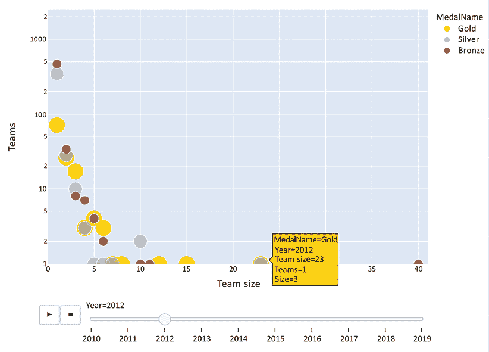

图 5.15：按奖牌（金牌、银牌和铜牌）和按年份过滤的队伍数量与队伍规模

对于研究竞赛，也可以得出类似的观察结果。在每年的研究竞赛中，获得奖牌的最大队伍如下：

+   2012 年：1 支队伍获得金牌和 1 枚银牌，共有 11 名成员

+   2013 年：1 支队伍获得铜牌，共有 9 名成员

+   2014 年：1 支队伍获得铜牌，共有 24 名成员

+   2015 年：1 支队伍获得银牌，共有 8 名成员

+   2016 年：1 支队伍获得银牌，共有 8 名成员

+   2017 年：4 支队伍获得铜牌，共有 8 名成员

+   2018 年：1 支队伍获得金牌，共有 9 名成员

结论是，在研究竞赛中获得铜牌、银牌或金牌的大队伍并非近期趋势。早在 2012 年，11 人组成的队伍就获得了金牌和银牌。2017 年，有四支队伍获得了铜牌。

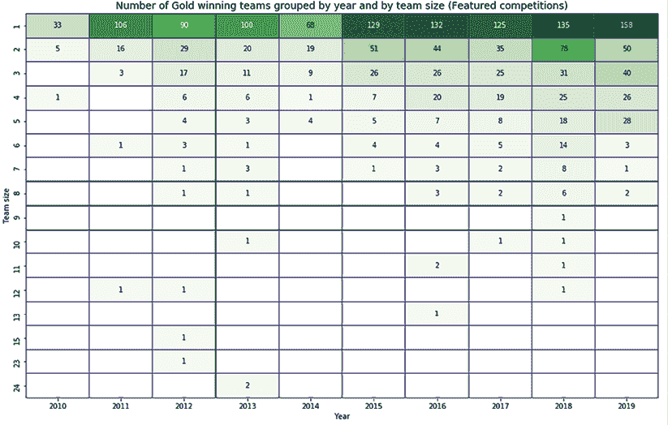

图 5.16：按年份和团队规模分组获胜队伍的数量（仅限特色竞赛）

我们选择特色竞赛的队伍，并检查团队规模是否以任何方式与团队排名相关。为此，我们统计了每个队伍和年份的团队成员数量。然后，我们将结果与“队伍”数据集合并，以在一个数据集中拥有每个队伍的团队成员数量以及公众和私人排行榜排名。*图 5.17*显示了 2010 年至 2019 年间的团队规模和团队排名（公众和私人排行榜）的热力图。尽管存在一个非常小的负相关性值，但我们观察到以下情况：在私人排行榜和公众排行榜排名与团队规模之间的相关性值。存在一个非常小的逆相关性因子，表明团队规模往往随着排名值的降低而增加。换句话说，团队越接近顶部，其规模就越大。这些值在-0.02 到-0.12 之间（非常小的逆相关性值），并且随着时间的推移（绝对值）增加。

通常情况下，**公众**的逆相关性较大，这意味着团队在公众排行榜上的位置越高，团队规模往往越大；这也许可以让我们推测大团队，尤其是超大团队的投机性质。然而，实际上相关性太低，无法从中提取任何有意义的见解。

在分析竞赛和队伍数据后，我们了解到，在过去几年中，大队伍获得奖牌的频率是相等的，早在 2012 年就有超大队伍获得了竞赛奖牌。2012 年，一支 40 人的队伍获得了一枚铜牌，2016 年，一支 13 人的队伍在特色竞赛中获得了金牌。相比之下，2018 年一支 23 人的队伍获得了银牌。

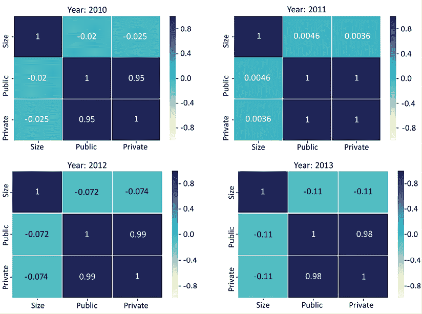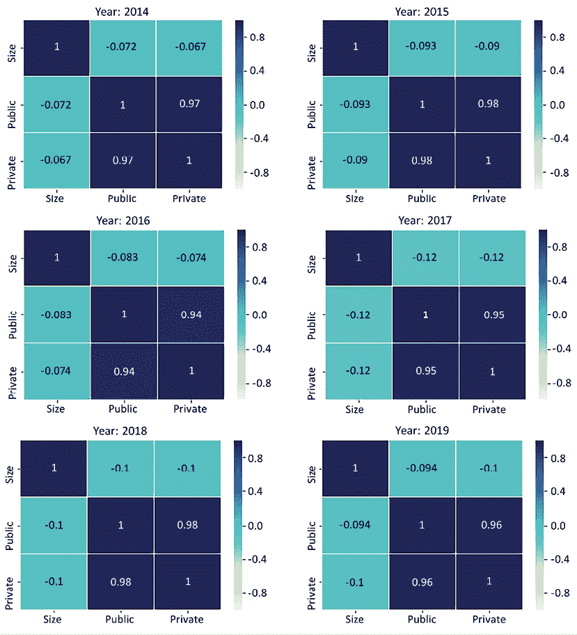

图 5.17：公众和私人排行榜排名以及团队规模的关联矩阵

我们可以观察到，虽然公众排行榜和私人排行榜排名之间存在明显的强相关性，但团队规模与公众或私人排行榜排名之间没有相关性（对于小于 0.1 和负值）。

## 结论

结论是，尽管最近有一种增加大型团队组建频率的感知，但这并不是一个新现象（根据 2018-2019 年的观察）；过去有更大的团队赢得了奖牌。

最近发生显著变化的是 Kagglers 的数量。让我们也检查一下这个信息。*图 5.18*显示了截至 2019 年的 Kaggle 用户分布。

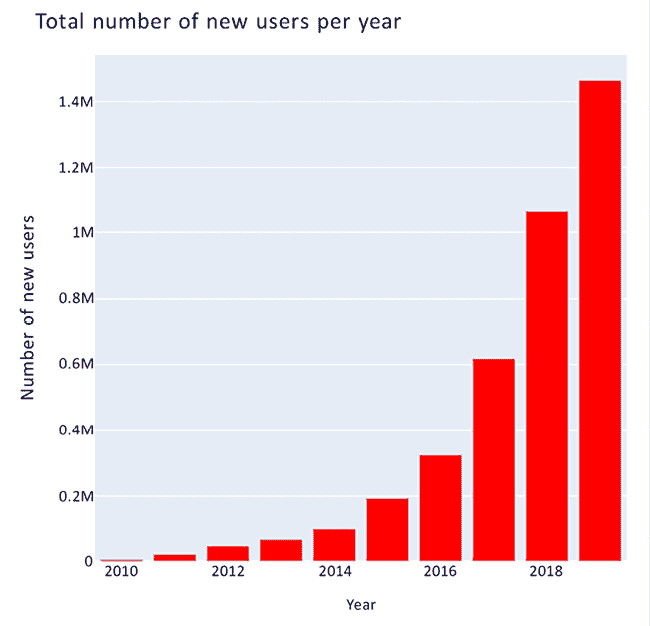

图 5.18：2010 年至 2019 年的用户动态

这种动态表明，目前 70%的 Kaggle 用户实际上几年前并不存在——这包括我本人。新用户数量的增加实际上是指数级的。因此，所谓的社区记忆可能是一个有偏见的形象，因为大多数 Kagglers 几年前并没有参与过大型团队。

# 摘要

在本章中，我们探讨了数据分析竞赛，分析了 Kiva 数据分析竞赛的数据，然后是*Meta Kaggle*数据集，该数据集由 Kaggle 频繁更新，也是众多数据分析笔记本的主题。

使用 Kiva 数据，我们选择研究一个主题——理解贫困是什么——而不是进行详尽的数据探索分析。使用 Meta Kaggle 数据集，我们选择回答一个与创建大型团队参加比赛，尤其是旨在赢得高知名度比赛奖牌的参赛者感知相关的问题。构建一个有说服力的叙事，由详细记录的数据和清晰的视觉呈现支持，在数据分析竞赛中比详尽的数据探索分析更有效。

我们还开始在本章中使用 Plotly 作为可视化库。在下一章中，我们将重用我们为 Kiva 和 Meta Kaggle 分析开发的某些可视化脚本。

# 参考文献

1.  数据科学善行：Kiva 众筹，Kaggle 数据集：[`www.kaggle.com/kiva/data-science-for-good-kiva-crowdfunding`](https://www.kaggle.com/kiva/data-science-for-good-kiva-crowdfunding)

1.  Meta Kaggle，Kaggle 数据集：[`www.kaggle.com/datasets/kaggle/meta-kaggle`](https://www.kaggle.com/datasets/kaggle/meta-kaggle)

1.  国家统计数据 – 联合国数据，Kaggle 数据集：[`www.kaggle.com/sudalairajkumar/undata-country-profiles`](https://www.kaggle.com/sudalairajkumar/undata-country-profiles)

1.  Kiva 微型贷款——数据探索，Kaggle 笔记本：[`github.com/PacktPublishing/Developing-Kaggle-Notebooks/blob/develop/Chapter-05/kiva-microloans-a-data-exploration.ipynb`](https://github.com/PacktPublishing/Developing-Kaggle-Notebooks/blob/develop/Chapter-05/kiva-microloans-a-data-exploration.ipynb)

1.  多维贫困指数（MPI）：[`hdr.undp.org/en/content/multidimensional-poverty-index-mpi`](http://hdr.undp.org/en/content/multidimensional-poverty-index-mpi)

1.  多维贫困指数在维基百科上的介绍：[`en.wikipedia.org/wiki/Multidimensional_Poverty_Index`](https://en.wikipedia.org/wiki/Multidimensional_Poverty_Index)

1.  `plotly-utils` Kaggle 工具脚本：[`github.com/PacktPublishing/Developing-Kaggle-Notebooks/blob/develop/Chapter-05/plotly-utils.ipynb`](https://github.com/PacktPublishing/Developing-Kaggle-Notebooks/blob/develop/Chapter-05/plotly-utils.ipynb)

1.  Kiva：改变生活的贷款：[`theglobalheroes.wordpress.com/2012/11/01/kiva-loans-that-change-lives/`](https://theglobalheroes.wordpress.com/2012/11/01/kiva-loans-that-change-lives/)

1.  理解贫困以优化微型贷款，Kaggle 笔记本：[`github.com/PacktPublishing/Developing-Kaggle-Notebooks/blob/develop/Chapter-05/understand-poverty-to-optimize-microloans.ipynb`](https://github.com/PacktPublishing/Developing-Kaggle-Notebooks/blob/develop/Chapter-05/understand-poverty-to-optimize-microloans.ipynb)

# 加入我们书籍的 Discord 空间

加入我们的 Discord 社区，与志同道合的人相聚，并和超过 5000 名成员一起学习，详情请见：

[`packt.link/kaggle`](https://packt.link/kaggle)


