# 6

# 你能预测蜜蜂的亚种吗？

在本章中，我们将学习如何处理图像数据并开始构建用于图像分类的模型。多年来，计算机视觉在数据科学和数据分析中的应用呈指数增长。在 Kaggle 上一些最引人注目的（拥有大量点赞和复制的，例如复制和编辑）笔记本并不是 **探索性数据分析**（**EDA**）笔记本，而是构建模型的笔记本。

在本章中，我们将演示如何使用您深入的数据分析来准备构建模型，并且我们还将向您介绍模型迭代优化过程的一些见解。这不仅仅是为了比赛，而是为了一个图像数据集。数据集是 *BeeImage Dataset: Annotated Honey Bee Images*（参见 *参考文献 1*）。在前一章中，我们也开始使用 Plotly 作为可视化库。在本章中，我们将继续使用 Plotly 来可视化数据集特征。我们将一些有用的可视化函数与 Plotly 一起放在一个实用脚本中，名为 `plotly-utils`（参见 *参考文献 2*）。与本章相关的笔记本是 *Honeybee Subspecies Classification*（参见 *参考文献 3*）。

本章将涵盖以下主题：

+   对 *BeeImage Dataset: Annotated Honey Bee Images* 的全面数据探索。

+   在准备模型基线之后，逐步优化模型，分析对训练和验证指标变化的影响，并采取新措施进一步改进模型。

# 数据探索

*BeeImage Dataset: Annotated Honey Bee Images* 包含一个 **逗号分隔格式** (.**csv**) 文件，`bee_data.csv`，包含 5172 行和 9 列，以及一个包含 5172 张图片的文件夹：

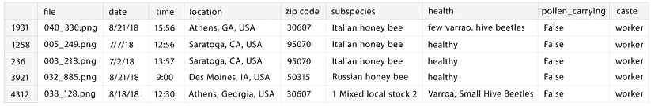

图 6.1：bee_data.csv 数据文件的样本

正如您所看到的，前面的数据框包含以下列：

+   **file**: 图片文件名

+   **date**: 拍摄图片的日期

+   **time**: 拍摄图片的时间

+   **location**: 美国位置，包括城市、州和国家名称

+   **zip code**: 与位置相关的邮政编码

+   **subspecies**: 当前图像中蜜蜂所属的亚种

+   **health**: 当前图像中蜜蜂的健康状态

+   **pollen_carrying**: 表示图片中蜜蜂是否带有花粉附着在其腿上

+   **caste**: 蜜蜂的社会阶层

我们将开始数据探索之旅，进行一些质量检查，重点关注 `bee_data.csv` 文件，然后是图像。对于数据质量检查，我们将使用在 *第四章* 中之前介绍的一个实用脚本，`data_quality_stats`。

## 数据质量检查

如下所示，数据集没有任何缺失值。所有特征都是 `string` 类型。

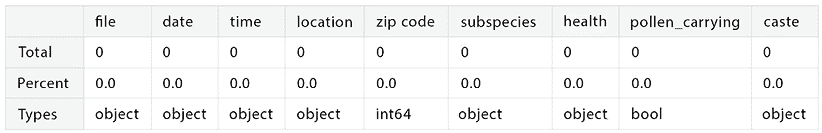

图 6.2：bee_data.csv 文件中的缺失值。结果使用 data_quality_stats 函数获得

在*图 6.3*中，我们展示了数据集特征的唯一值。数据是在以下情况下收集的：

+   在 6 个不同的日期和 35 个不同的时间

+   在 8 个地点，7 个不同的邮编

在数据中，有七个亚种，用六个不同的健康问题表示。

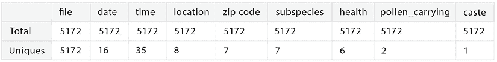

图 6.3：bee_data.csv 文件中的唯一值。结果使用 data_quality_stats 函数获得

从*图 6.4*所示的数据中可以看出，21%的图像来自单一日期（16 个不同日期中的一个）。曾经有 11%的图像是在某个时间收集的。有一个单一的位置（加利福尼亚州的萨拉托加，邮编 95070），在那里收集了 2000 张（或 39%）的图像。意大利蜜蜂是最常见的物种。65%的图像代表健康的蜜蜂。几乎所有图像都显示了不带花粉的蜜蜂，而且所有图像都来自工蜂群体。

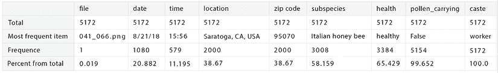

图 6.4：bee_data.csv 文件中最频繁的值。结果使用 data_quality_stats 函数获得

接下来，我们将与`bee_data.csv`中的特征并行回顾图像数据。我们还将介绍读取和可视化图像的函数。

## 探索图像数据

首先，我们检查数据集中存在的所有图像名称是否也存在于图像文件夹中：

```py
file_names = list(honey_bee_df['file'])
print("Matching image names: {}".format(len(set(file_names).intersection(image_files)))) 
```

结果是，所有在`.csv`文件中索引的图像都存在于`images`文件夹中。接下来，我们检查图像大小。为此，我们可以使用以下代码读取图像：

```py
def read_image_sizes(file_name):
    """
    Read images size using skimage.io
    Args:
        file_name: the name of the image file
    Returns:
        A list with images shape
    """
    image = skimage.io.imread(config['image_path'] + file_name)
    return list(image.shape) 
```

或者，我们可以使用以下代码根据 OpenCSV（`cv2`）库读取图像：

```py
def read_image_sizes_cv(file_name):
    """
    Read images size using OpenCV
    Args:
        file_name: the name of the image file
    Returns:
        A list with images shape
    """
    image = cv2.imread(config['image_path'] + file_name)
    return list(image.shape) 
skimage.io:
```

```py
%timeit m = np.stack(subset.apply(read_image_sizes)) 
```

下面的代码用于使用基于 opencv 的方法测量读取图像的执行时间：

```py
%timeit m = np.stack(subset.apply(read_image_sizes_cv)) 
```

比较显示，使用基于`opencv`的方法执行更快：

+   使用`skimage.io`：

`129 ms ± 4.12 ms 每循环（7 次运行的平均值±标准差，每次循环 1 次）`

+   使用`opencv`：

`127 ms ± 6.79 ms 每循环（7 次运行的平均值±标准差，每次循环 10 次）`

然后，我们应用最快的方法提取每个图像的形状（宽度、高度和深度，或颜色维度的数量）并将其添加到每个图像的数据集中：

```py
t_start = time.time()
m = np.stack(honey_bee_df['file'].apply(read_image_sizes_cv))
df = pd.DataFrame(m,columns=['w','h','c'])
honey_bee_df = pd.concat([honey_bee_df,df],axis=1, sort=False)
t_end = time.time()
print(f"Total processing time (using OpenCV): {round(t_end-t_start, 2)} sec.") 
```

执行前面代码的输出是：

```py
Total processing time (using OpenCV): 34.38 sec. 
boxplot. In the first, we show the image width distribution, and in the second, the image height distribution. The boxplot shows the minimum, first quartile, median, third quartile, and maximum values in the distribution of the value we plot. We also show the outliers’ values as points on each of the traces:
```

```py
traceW = go.Box(
    x = honey_bee_df['w'],
    name="Width",
     marker=dict(
                color='rgba(238,23,11,0.5)',
                line=dict(
                    color='red',
                    width=1.2),
            ),
    orientation='h')
traceH = go.Box(
    x = honey_bee_df['h'],
    name="Height",
    marker=dict(
                color='rgba(11,23,245,0.5)',
                line=dict(
                    color='blue',
                    width=1.2),
            ),
    orientation='h')
data = [traceW, traceH]
layout = dict(title = 'Width & Heights of images',
          xaxis = dict(title = 'Size', showticklabels=True), 
          yaxis = dict(title = 'Image dimmension'),
          hovermode = 'closest',
         )
fig = dict(data=data, layout=layout)
iplot(fig, filename='width-height') 
```

结果绘制在*图 6.5*中。宽度和高度的中间值分别为 61 和 62。宽度和高度都有许多异常值（宽度最大值为 520，高度最大值为 392）。

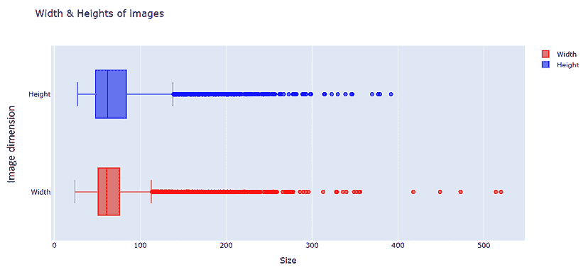

图 6.5：图像的宽度和高度分布

在我们的分析中，我们包括了数据集中的所有特征，而不仅仅是与图像相关的特征。在我们开始构建预测模型的基线之前，我们希望了解与*蜜蜂图像数据集：标注的蜜蜂图像*相关的所有方面。

## 位置

通过按拍摄图片的位置和 ZIP 代码对数据集中的数据进行分组，我们可以观察到有一个位置具有相同的 ZIP 代码和类似的名字：

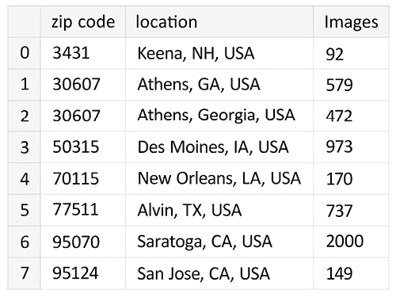

图 6.6：拍摄带有蜜蜂的图片的位置和 ZIP 代码

我们可以观察到，美国乔治亚州的雅典出现了两个略有不同的名称。我们只是使用以下代码将它们合并：

```py
honey_bee_df = honey_bee_df.replace({'location':'Athens, Georgia, USA'}, 'Athens, GA, USA') 
```

现在，让我们使用 Plotly 实用脚本模块中的一个函数来可视化结果位置数据的分布：

```py
tmp = honey_bee_df.groupby(['zip code'])['location'].value_counts()
df = pd.DataFrame(data={'Images': tmp.values}, index=tmp.index).reset_index()
df['code'] = df['location'].map(lambda x: x.split(',', 2)[1])
plotly_barplot(df, 'location', 'Images', 'Tomato', 'Locations', 'Number of images', 'Number of bees images per location') 
```

函数`plotly_barplot`的代码如下：

```py
def plotly_barplot(df, x_feature, y_feature, col, x_label, y_label, title):
    """
    Plot a barplot with number of y for category x
    Args:
        df: dataframe
        x_feature: x feature
        y_feature: y feature
        col: color for markers
        x_label: x label
        y_label: y label
        title: title

    Returns:
        None
    """
    trace = go.Bar(
            x = df[x_feature],
            y = df[y_feature],
            marker=dict(color=col),
            #text=df['location']
        )
    data = [trace]
    layout = dict(title = title,
              xaxis = dict(title = x_label, showticklabels=True, tickangle=15), 
              yaxis = dict(title = y_label),
              hovermode = 'closest'
             )
    fig = dict(data = data, layout = layout)
    iplot(fig, filename=f'images-{x_feature}-{y_feature}') 
```

在*图 6.7*中，我们展示了拍摄蜜蜂图像的位置分布。大多数图像来自加利福尼亚州的萨拉托加（2000 张图像），其次是乔治亚州的雅典和爱荷华州的迪莫因。

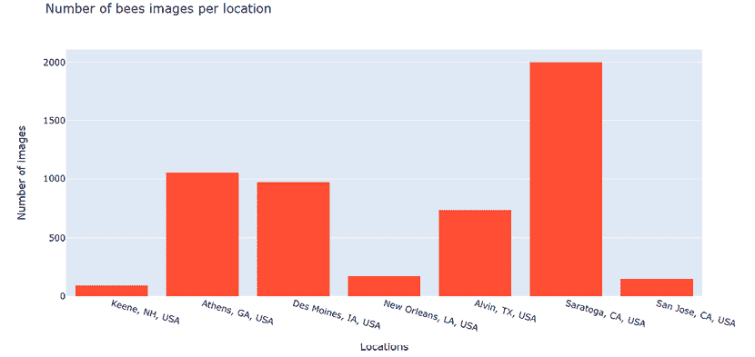

图 6.7：位置分布

我们还基于一个选定的标准构建了一个用于可视化图像子集的函数。以下代码是根据位置选择图像并显示它们的子集（一行五张，来自同一位置）：

```py
#list of locations
locations = (honey_bee_df.groupby(['location'])['location'].nunique()).index
def draw_category_images(var,cols=5):
    categories = (honey_bee_df.groupby([var])[var].nunique()).index
    f, ax = plt.subplots(nrows=len(categories),ncols=cols, figsize=(2*cols,2*len(categories)))
    # draw a number of images for each location
for i, cat in enumerate(categories):
        sample = honey_bee_df[honey_bee_df[var]==cat].sample(cols)
        for j in range(0,cols):
            file=config['image_path'] + sample.iloc[j]['file']
            im=imageio.imread(file)
            ax[i, j].imshow(im, resample=True)
            ax[i, j].set_title(cat, fontsize=9)  
    plt.tight_layout()
    plt.show() 
```

在*图 6.8*中，展示了这个选择的一部分（仅限于前两个位置）。完整的图像可以在相关的笔记本中查看：

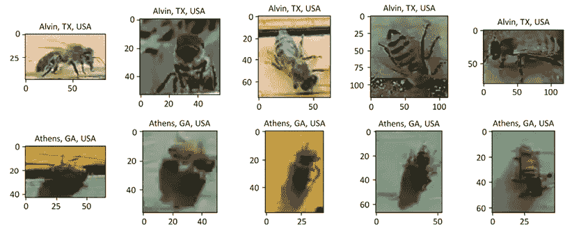

图 6.8：来自两个地点的蜜蜂图像（从完整图片中选择，使用前面的代码获取）

## 日期和时间

让我们继续详细分析我们数据集中的特征。我们现在开始分析`date`和`time`数据。我们将`date`转换为`datetime`并提取年、月和日。我们还转换`time`并提取小时和分钟：

```py
honey_bee_df['date_time'] = pd.to_datetime(honey_bee_df['date'] + ' ' + honey_bee_df['time'])
honey_bee_df["year"] = honey_bee_df['date_time'].dt.year
honey_bee_df["month"] = honey_bee_df['date_time'].dt.month
honey_bee_df["day"] = honey_bee_df['date_time'].dt.day
honey_bee_df["hour"] = honey_bee_df['date_time'].dt.hour
honey_bee_df["minute"] = honey_bee_df['date_time'].dt.minute 
```

在*图 6.9*中展示了每天和大约的小时及位置的蜜蜂图像数量的可视化。这个可视化的代码首先通过`date_time`和`hour`对数据进行分组，并计算每个日期和一天中的时间收集到的图像数量：

```py
tmp = honey_bee_df.groupby(['date_time', 'hour'])['location'].value_counts()
df = pd.DataFrame(data={'Images': tmp.values}, index=tmp.index).reset_index() 
```

然后，我们构建当我们在图中的某个点上悬停时显示的文本。这个文本将包括小时、位置和图像数量。然后我们将悬停文本作为新数据集中的一个新列添加：

```py
hover_text = []
for index, row in df.iterrows():
    hover_text.append(('Date/time: {}<br>'+
                      'Hour: {}<br>'+
                      'Location: {}<br>'+
                      'Images: {}').format(row['date_time'],
                                            row['hour'],
                                            row['location'],
                                            row['Images']))
df['hover_text'] = hover_text 
```

然后，我们为每个位置绘制一个散点图，表示图片收集的时间和小时。每个点的尺寸与在该位置、一天中的某个时间点和某个日期拍摄的图像数量成比例：

```py
locations = (honey_bee_df.groupby(['location'])['location'].nunique()).index
data = []
for location in locations:
    dfL = df[df['location']==location]
    trace = go.Scatter(
        x = dfL['date_time'],y = dfL['hour'],
        name=location,
        marker=dict(
            symbol='circle',
            sizemode='area',
            sizeref=0.2,
            size=dfL['Images'],
            line=dict(
                width=2
            ),),
        mode = "markers",
        text=dfL['hover_text'],
    )
    data.append(trace)

layout = dict(title = 'Number of bees images per date, approx. hour and location',
          xaxis = dict(title = 'Date', showticklabels=True), 
          yaxis = dict(title = 'Hour'),
          hovermode = 'closest'
         )
fig = dict(data = data, layout = layout)
iplot(fig, filename='images-date_time') 
```

在下一张图像，*图 6.9*中，我们看到运行上述代码的结果。大多数图片是在八月份拍摄的。大多数图片也是在下午时段拍摄的。

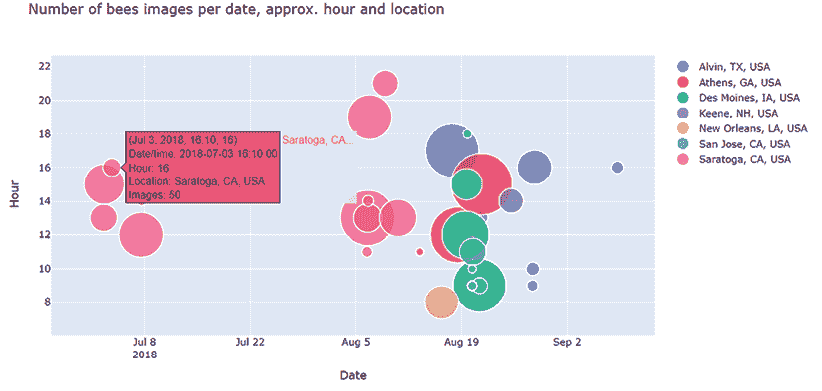

图 6.9：每天和大约的小时及位置的蜜蜂图像数量

## 亚种

我们使用相同的 `plotly_barplot` 函数来可视化亚种的分布。大多数蜜蜂是意大利蜜蜂，其次是俄罗斯蜜蜂和卡尼奥兰蜜蜂（见 *图 6.10*）。其中 428 张图像未被分类（标签值为**-1**）。我们将未分类的图像归为一个亚种类别。

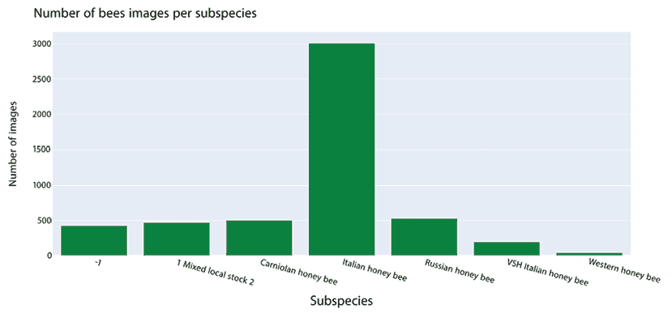

图 6.10：按日期和大约的小时及位置划分的蜜蜂图像数量

在 *图 6.11* 中，我们展示了一些图像的选择，其中只包含少数亚种样本：

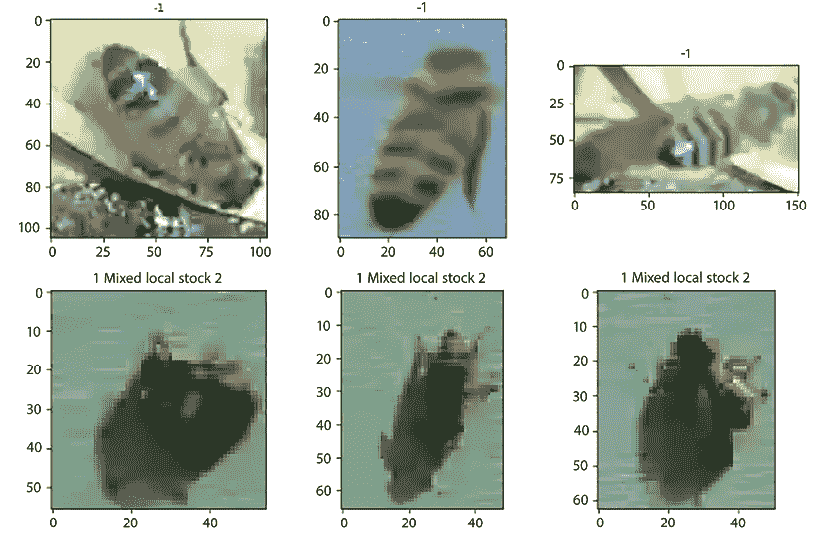

图 6.11：几个亚种蜜蜂图像的样本

现在，让我们表示每个亚种和位置的图像数量，以及每个亚种和小时的图像数量（见 *图 6.12*）。收集到的图像数量最多的是来自加利福尼亚州萨拉托加（1972 张图像），所有图像都是意大利蜜蜂。在 13 点收集到的图像数量最多，所有图像也都是意大利蜜蜂（909 张图像）。

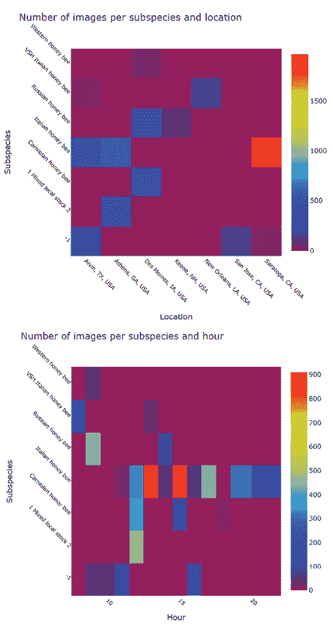

图 6.12：按亚种和位置划分的图像数量（上方）以及按亚种和小时划分的图像数量（下方）

`Subspecies` 图像在重量和高度上具有很大的多样性。*图 6.13* 使用箱线图展示了重量和高度的分布。

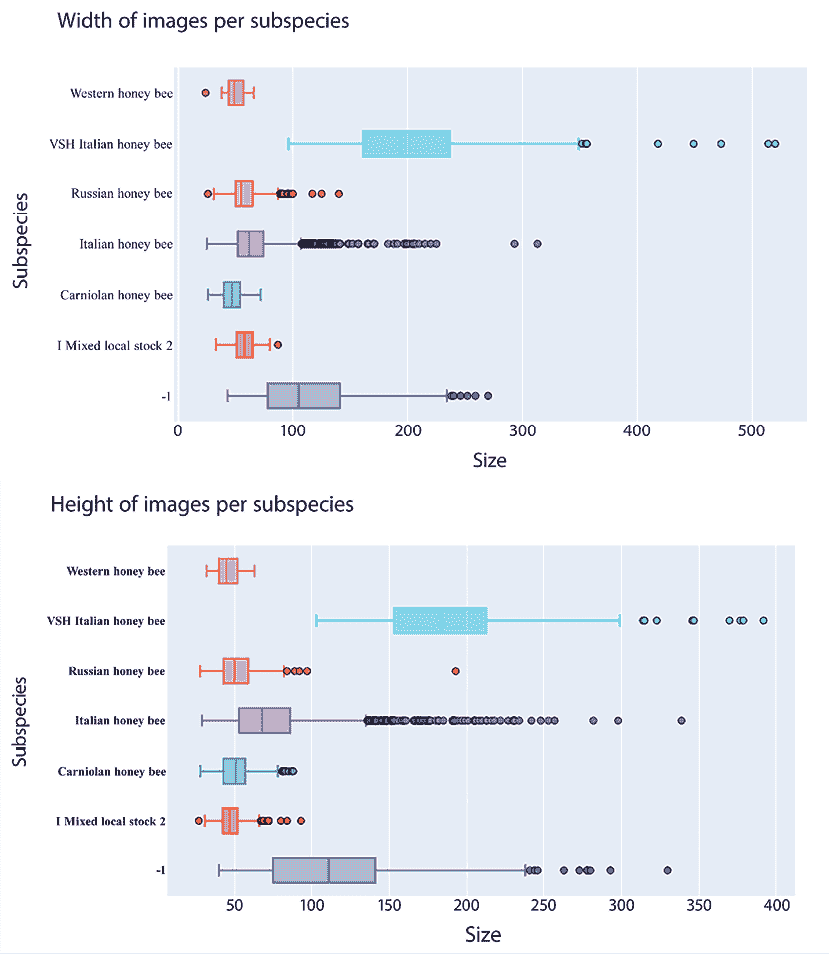

图 6.13：每个亚种的图像大小分布 – 宽度（上方）和高度（下方）

**VSH 意大利蜜蜂**在宽度和高度上都有最大的平均值和最大的方差。**西方蜜蜂**、**卡尼奥兰蜜蜂**和**混合本地种群 2**在重量和高度上的分布最为紧凑（方差较低）。数量最多的亚种**意大利蜜蜂**显示出较小的中位数和较大的方差，有很多异常值。在下图中，我们将在同一个散点图上展示重量和高度分布：

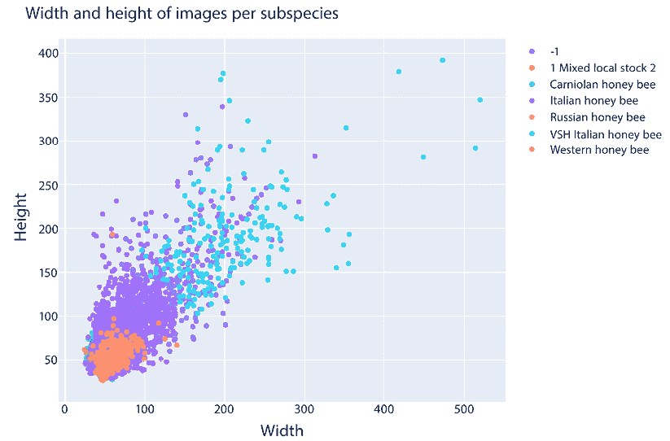

图 6.14：每个亚种的图像大小分布 – 散点图

前面的图示使用散点图展示了重量和高度分布，下面的代码展示了这一可视化的实现。首先，我们定义一个函数来绘制散点图，其中图像宽度在 `x` 轴上，图像高度在 `y` 轴上：

```py
def draw_trace_scatter(dataset, subspecies):
    dfS = dataset[dataset['subspecies']==subspecies];
    trace = go.Scatter(
        x = dfS['w'],y = dfS['h'],
        name=subspecies,
        mode = "markers",
        marker = dict(opacity=0.8),
        text=dfS['subspecies'], 
    )
    return trace 
```

我们现在使用上面定义的函数为每个亚种绘制散点图。每次函数调用都会创建一个轨迹，我们将这些轨迹添加到 Plotly 图中：

```py
subspecies = (honey_bee_df.groupby(['subspecies'])['subspecies'].nunique()).index
def draw_group(dataset, title,height=600):
    data = list()
    for subs in subspecies:
        data.append(draw_trace_scatter(dataset, subs))

    layout = dict(title = title,
              xaxis = dict(title = 'Width',showticklabels=True),
              yaxis = dict(title = 'Height', showticklabels=True, tickfont=dict(
                family='Old Standard TT, serif',
                size=8,
                color='black'),), 
              hovermode = 'closest',
              showlegend=True,
                  width=800,
                  height=height,
             )
    fig = dict(data=data, layout=layout)
    iplot(fig, filename='subspecies-image')
draw_group(honey_bee_df,  "Width and height of images per subspecies") 
```

## 健康

*图 6.15* 展示了具有各种健康问题的图像分布。大多数图像是**健康**蜜蜂（3384），其次是**少量瓦拉罗，蜂箱甲虫**（579），**瓦拉罗，小蜂箱甲虫**（472），以及**蚂蚁问题**（457）：

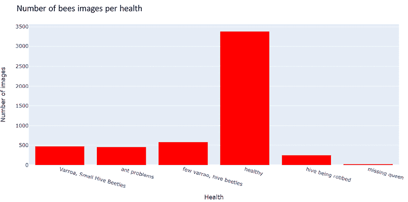

图 6.15：不同健康问题的图像数量

如果我们分析每个亚种和健康问题的图像数量（见*图 6.16*），我们可以观察到只有少量健康和亚种值组合存在。大多数图像是**健康的意大利蜜蜂**（1972），其次是**少量瓦螨、蜂箱甲虫**，然后是**意大利蜜蜂**（579），最后是**健康的俄罗斯蜜蜂**（527）。未知亚种要么是**健康的**（177）要么是**蜂群被盗**（251）。

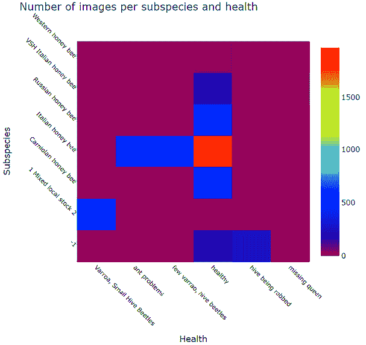

图 6.16：每个亚种和不同健康问题的蜜蜂图像数量

在*图 6.17*中，我们绘制了每个地点、亚种和健康问题的图像数量：

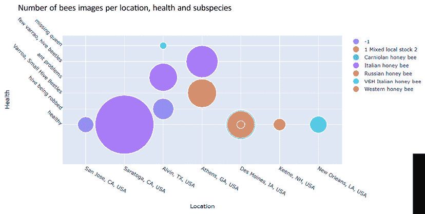

图 6.17：每个地点、亚种和健康问题的图像数量

## 其他

携带花粉的蜜蜂图像数量很少。*图 6.18*显示了一些携带花粉和不携带花粉的蜜蜂图像。所有蜜蜂都来自同一个等级：工蜂等级。

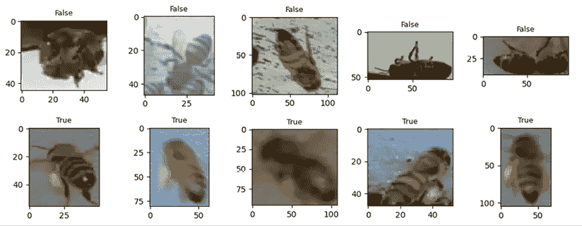

图 6.18：携带和不携带花粉的蜜蜂图像的选择

## 结论

我们使用`plotly_sankey`脚本从`plotly_utils`实用脚本模块中绘制的桑基图，来绘制*图 6.19*中的摘要图。桑基图主要用于可视化流程或流动，例如，在经济学中能源的生产及其来源和消费者。我这里用它来达到另一个目的，即总结具有多个特征的数据分布。它显示了同一图表中按日期、时间、地点、ZIP 代码、亚种和健康分布的图像。由于空间限制，这里没有给出桑基图的适配代码（请参考*参考文献 2*获取与本章相关的代码示例）；我们只包含了适配蜜蜂数据以使用此功能的代码：

```py
tmp = honey_bee_df.groupby(['location', 'zip code', 'date', 'time', 'health'])['subspecies'].value_counts()
df = pd.DataFrame(data={'Images': tmp.values}, index=tmp.index).reset_index()
fig = plotly_sankey(df,cat_cols=['date', 'time', 'location', 'zip code', 'subspecies', 'health'],value_cols='Images',
                    title='Honeybee Images: date | time | location | zip code | subspecies | health', 
                 color_palette=[ "darkgreen", "lightgreen", "green", "gold", "black", "yellow"],
           height=800)
iplot(fig, filename='Honeybee Images') 
```

*图 6.19*中的可视化，一个漏斗形图，使我们能够在一个单一的图表中捕捉多个特征之间的关系：

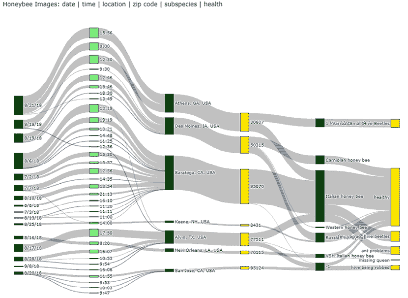

图 6.19：图像摘要

到目前为止，我们分析了数据集中特征分布。现在，我们对数据集中的数据有了更好的理解。在本章接下来的部分，我们将开始准备构建一个机器学习模型，以对亚种进行图像分类，这是本章的第二大且更为重要的目标。

# 亚种分类

本节的目标将是使用迄今为止调查的图像构建一个机器学习模型，该模型可以正确预测亚种。由于我们只有一个数据集，我们将首先将数据分割成三个子集：用于训练、验证和测试数据。我们将在训练过程中使用训练和验证数据：训练数据用于向模型提供数据，验证数据用于验证模型如何使用新数据预测类别（即亚种）。然后，训练和验证后的模型将用于预测测试集中的类别，该类别既未用于训练也未用于验证。

## 数据分割

首先，我们将数据分割成`train`和`test`，使用 80%–20%的分割。然后，再次将`train`数据分割成训练和验证，使用相同的 80%–20%分割。分割使用`stratify`和`subspecies`作为参数执行，确保平衡的子集，同时尊重训练、验证和测试子样本集中类的整体分布。这里选择的训练/验证/测试分割的百分比是任意选择的，并不是研究或优化的结果。在您的实验中，您可以处理不同的训练/验证/测试子集值，也可以选择不使用`stratify`：

```py
train_df, test_df = train_test_split(honey_bee_df, test_size=config['test_size'], random_state=config['random_state'], 
             stratify=honey_bee_df['subspecies'])
train_df, val_df = train_test_split(train_df, test_size=config['val_size'], random_state=config['random_state'], 
             stratify=train_df['subspecies']) 
```

最终，我们将有三个子集，如下所示：

+   训练集行数：3309

+   验证集行数：828

+   测试集行数：1035

我们将图像分割成子集，对应于图像名称的子集。我们创建了读取图像并将它们全部调整到配置中定义的相同维度的函数，使用`skimage.io`和`opencv`。我们决定将所有图像调整到 100 x 100 像素。我们的决定是基于对图像尺寸分布的分析。您可以选择修改笔记本中提供的代码（*参考 3*）并尝试不同的图像尺寸。

以下代码使用`skimage.io`读取图像并根据配置中设置的尺寸调整大小。您可以更改配置并调整图像大小，使用不同的图像高度和宽度值：

```py
def read_image(file_name):
    """
    Read and resize the image to image_width x image_height
    Args:
        file_name: file name for current image
    Returns:
        resized image
    """
    image = skimage.io.imread(config['image_path'] + file_name)
    image = skimage.transform.resize(image, (config['image_width'], config['image_height']), mode='reflect')
    return image[:,:,:config['image_channels']] 
```

下面的代码使用 OpenCV 读取并调整图像大小。该函数与上面展示的之前的函数不同之处仅在于读取图像文件的方法：

```py
def read_image_cv(file_name):
    """
    Read and resize the image to image_width x image_height
    Args:
        file_name: file name for current image
    Returns:
        resized image
    """
    image = cv2.imread(config['image_path'] + file_name)
    image = cv2.resize(image, (config['image_width'], config['image_height']))
    return image[:,:,:config['image_channels']] 
```

然后，我们将这些函数应用于所有数据集文件，以读取和调整数据集中的图像大小。

我们还创建了与分类目标变量对应的虚拟变量。我们更喜欢使用这种方法，因为我们将为多类分类准备一个模型，该模型为每个类别输出概率：

```py
def categories_encoder(dataset, var='subspecies'):
    X = np.stack(dataset['file'].apply(read_image))
    y = pd.get_dummies(dataset[var], drop_first=False)
    return X, y
s_time = time.time()
X_train, y_train = categories_encoder(train_df)
X_val, y_val = categories_encoder(val_df)
X_test, y_test = categories_encoder(test_df)
e_time = time.time()
print(f"Total time: {round(e_time-s_time, 2)} sec.") 
```

通过这一点，我们已经展示了如何读取和调整我们的图像大小。接下来，我们将看到如何通过乘以我们的图像来增加训练集中的数据量，以便向模型展示更多种类的数据。

## 数据增强

我们将使用深度学习模型来对图像中的亚种进行分类。通常，深度学习模型在训练数据量较大时表现更好。使用数据增强，我们还创建了更多样化的数据，这对模型质量也有益。如果我们在训练过程中让模型接触到更多样化的数据，我们的模型将提高其泛化能力。

我们基于`keras.preprocessing.image`中的`ImageDataGenerator`定义了一个数据增强组件。在本笔记本中，我们将使用 Keras 构建模型的各个组件。`ImageDataGenerator`组件通过应用以下参数初始化，以创建训练数据集的随机变化：

+   对原始图像进行旋转（0 到 180 度范围内）

+   缩放（10%）

+   水平和垂直方向上的平移（10%）

+   水平和垂直方向的平移（10%）

这些变化可以分别控制。并非所有用例都允许或从应用上述所有转换中受益（例如，考虑具有建筑或其他地标图像的情况，对于这些图像，旋转并不太有意义）。以下代码可以用于我们的情况来初始化和拟合图像生成器：

```py
image_generator = ImageDataGenerator(
        featurewise_center=False,
        samplewise_center=False,
        featurewise_std_normalization=False,
        samplewise_std_normalization=False,
        zca_whitening=False,
        rotation_range=180,
        zoom_range = 0.1, 
        width_shift_range=0.1,
        height_shift_range=0.1, 
        horizontal_flip=True,
        vertical_flip=True)
image_generator.fit(X_train) 
```

然后，我们继续构建和训练基线模型。

## 构建基线模型

几乎总是建议您从一个简单的模型开始，然后进行错误分析。根据错误分析，您将需要进一步细化您的模型。例如，如果您观察到您的基线模型在训练中获得了很大的误差，您需要首先改进训练。您可以通过添加更多数据、改进您的数据标注或创建更好的特征来实现这一点。如果您的训练误差很小，但您有较高的验证误差，这意味着您的模型可能过度拟合了训练数据。在这种情况下，您需要尝试提高模型泛化能力。您可以尝试各种技术来提高模型泛化能力。关于此类分析，请参阅本章末尾的*参考 4*。

我们将使用`Keras`库来定义我们的模型。Keras（见*参考 5*）是 TensorFlow 机器学习平台（见*参考 6*）的包装器。它允许您通过定义具有专用层的顺序结构来创建强大的深度学习模型。我们将向我们的模型添加以下层：

+   一个具有 3 维度的 16 个滤波器的`Conv2D`层

+   一个具有 2 倍缩减因子的`MaxPooling2D`层

+   一个具有 3 维度的 16 个滤波器的卷积层

+   一个`Flatten`层

+   一个具有亚种目标特征类别数量的`Dense`层

上述架构是一个非常简单的**卷积神经网络**的例子。`convolutional2d`层的作用是对 2D 输入应用滑动卷积滤波器。`maxpool2d`层将通过在输入窗口（参见*参考文献 5*获取更多详细信息）上取最大值来沿其空间维度（宽度和高度）对输入进行下采样。

构建所述架构的代码如下：

```py
model1=Sequential()
model1.add(Conv2D(config['conv_2d_dim_1'], 
                  kernel_size=config['kernel_size'], 
                  input_shape=(config['image_width'], config['image_height'],config['image_channels']), 
                  activation='relu', padding='same'))
model1.add(MaxPool2D(config['max_pool_dim']))
model1.add(Conv2D(config['conv_2d_dim_2'],  kernel_size=config['kernel_size'],
                  activation='relu', padding='same'))
model1.add(Flatten())
model1.add(Dense(y_train.columns.size, activation='softmax'))
model1.compile(optimizer='adam', loss='categorical_crossentropy', metrics=['accuracy']) 
```

在*图 6.20*中，我们展示了模型的摘要信息。如您所见，可训练参数的总数是 282,775：

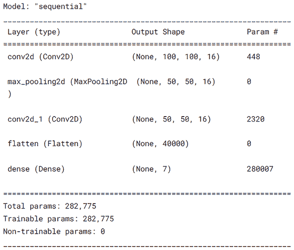

图 6.20：基准模型的摘要

对于基准模型，我们从一个小模型开始，并减少 epoch 的数量进行训练。输入图像的大小是 100 x 100 x 3（如我们之前解释的）。我们将对这个模型进行五次 epoch 的训练。批大小设置为 32。运行训练的代码如下：

```py
train_model1  = model1.fit_generator(image_generator.flow(X_train, y_train, batch_size=config['batch_size']),
                        epochs=config['no_epochs_1'],
                        validation_data=[X_val, y_val],
                        steps_per_epoch=len(X_train)/config['batch_size']) 
```

*图 6.21*显示了基准模型的训练日志。在训练过程中，我们没有保存最佳模型版本；最后一步的模型权重将用于测试。

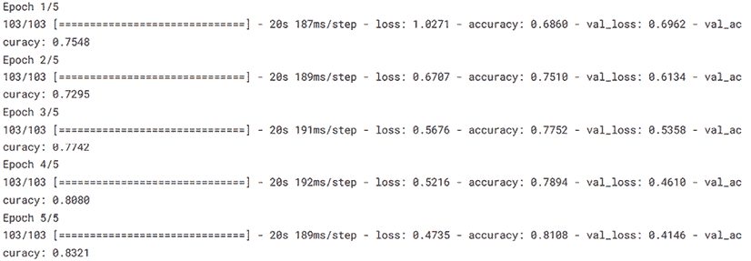

图 6.21：基准模型的训练日志。显示了每个步骤的训练损失和准确率以及验证损失和准确率。

在每个批次之后更新训练损失和准确率，在每个 epoch 结束时计算验证损失和准确率。接下来，在模型训练和验证之后，我们将评估测试集的损失和准确率：

```py
score = model1.evaluate(X_test, y_test, verbose=0)
print('Test loss:', score[0])
print('Test accuracy:', score[1]) 
```

在*图 6.22*中，我们展示了训练和验证损失以及训练和验证准确率：

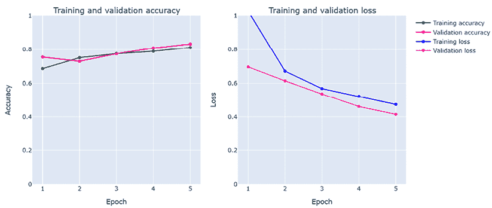

图 6.22：基准模型 – 训练和验证准确率（左）和训练和验证损失（右）

得到的结果如下：

+   测试损失：**0.42**

+   测试准确率：**0.82**

测试损失指的是损失函数，这是一个数学函数，用于衡量预测值与真实值之间的差异。在训练过程中，通过测量这个值，对于训练集和验证集，我们可以监控模型的学习和预测的改进情况。

使用`sklearn`中的`metrics.classification_report`指标分类报告，我们计算了训练数据中每个类的精确度、召回率、f1 分数和准确率。相应的代码如下：

```py
def test_accuracy_report(model):
    predicted = model.predict(X_test)
    test_predicted = np.argmax(predicted, axis=1)
    test_truth = np.argmax(y_test.values, axis=1)
    print(metrics.classification_report(test_truth, test_predicted, target_names=y_test.columns)) 
    test_res = model.evaluate(X_test, y_test.values, verbose=0)
    print('Loss function: %s, accuracy:' % test_res[0], test_res[1]) 
```

在*图 6.23*中，我们展示了测试集的分类报告，其中我们使用了基于训练数据的基线模型拟合。精确度、召回率和 f1 分数的宏平均分别为**0.78**、**0.72**和**0.74**（支持数据为**1035**）。加权平均精确度、召回率和 f1 分数分别为**0.82**、**0.83**和**0.82**。

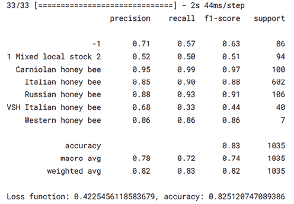

图 6.23：使用基线模型对测试数据的分类报告

这些加权平均分数较高，因为与所有类别分数的简单平均值不同，这些是加权平均值，所以与更好表示的类别相关的较高分数将对整体平均有更高的贡献。**1 Mixed local stock 2**（0.52）和**VSH 意大利蜜蜂**（0.68）的精确度/类别分数是最差的。最差的整体分数是**VSH 意大利蜜蜂**，其中召回率为 0.33。

## 逐步优化模型

如果我们现在回到训练和验证错误，我们可以看到验证和训练准确率大约是 0.81 和 0.82。

我们将继续训练模型，为了避免过拟合，我们还将引入两个`Dropout`层，每个层的系数为 0.4。`Dropout`层在神经网络中用作正则化方法。其目的是防止过拟合并提高模型的泛化能力。作为参数给出的系数是在每个训练 epoch 中随机选择的输入百分比，将其设置为 0。模型的结构在*图 6.24*中描述。可训练参数的数量将保持不变。

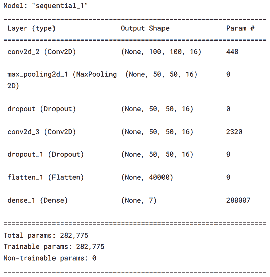

图 6.24：优化模型摘要。添加了两个 Dropout 层

我们还将 epoch 的数量扩展到 10。让我们看看*图 6.25*中的结果，其中我们展示了训练和验证准确率以及训练和验证损失。

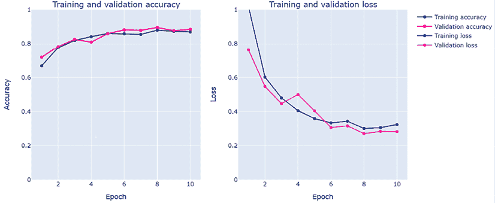

图 6.25：优化后的模型（版本 2）- 训练和验证准确率（左）和训练和验证损失（右）

最终训练损失为 0.32，最终训练准确率为 0.87。最终验证损失为 0.28，最终验证准确率为 0.88。这些都是改进的结果。当然，训练准确率主要是由于我们训练了更多的 epoch。

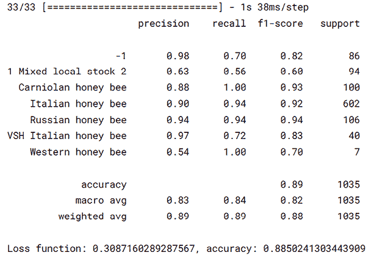

图 6.26：使用第二次优化的模型（训练 epoch 增加到 10 并添加 Dropout 层）的测试数据分类报告

根据验证准确度，结果是更多的训练周期以及添加`Dropout`层的结果，这些层保持了过拟合的控制。现在让我们检查测试损失和准确度，以及查看测试数据的整个分类报告。

宏平均和加权平均的度量标准在精确度、召回率和 f1 分数上都有所提高。我们还可以看到，对于使用基线获得的小分数类别，精确度、召回率和 f1 分数有了显著提高。**1 混合本地股票 2**的精确度为 0.52，现在精确度为 0.63。至于**VSH 意大利蜜蜂**，精确度为 0.68，现在为 0.97。我们注意到**西方蜜蜂**的精确度有所下降，但这个少数类的支持只有 7，所以这个结果是预期的。

我们继续优化我们的模型以提高验证和测试度量标准——换句话说，提高模型性能。在下一个迭代中，我们将训练周期数增加到 50。此外，我们将添加三个回调函数，如下所示：

+   一个学习率调度器，用于实现学习率变化的非线性函数。通过在每个周期改变学习率，我们可以改善训练过程。我们引入的用于控制学习率的函数将逐渐降低学习函数的值。

+   一个早期停止器，基于损失函数的演变（如果损失在一定数量的周期内没有改善）和一个耐心因子（在监控函数没有看到任何改善之后的周期数，我们停止训练）来停止训练周期。

+   每次获得最佳准确度时，都会有一个检查指针来保存表现最佳的模型。这将使我们能够使用的不是最后一次训练周期的模型参数，而是所有周期中表现最佳的模型。

三个回调函数的代码如下：

```py
annealer3 = LearningRateScheduler(lambda x: 1e-3 * 0.995 ** (x+config['no_epochs_3']))
earlystopper3 = EarlyStopping(monitor='loss', patience=config['patience'], verbose=config['verbose'])
checkpointer3 = ModelCheckpoint('best_model_3.h5',
                                monitor='val_accuracy',
                                verbose=config['verbose'],
                                save_best_only=True,
                                save_weights_only=True) 
```

适配模型的代码也如下所示：

```py
train_model3  = model3.fit_generator(image_generator.flow(X_train, y_train, batch_size=config['batch_size']),
                        epochs=config['no_epochs_3'],
                        validation_data=[X_val, y_val],
                        steps_per_epoch=len(X_train)/config['batch_size'],
                        callbacks=[earlystopper3, checkpointer3, annealer3]) 
```

训练可能需要分配的最大周期数，或者如果满足早期停止标准（即，在等于耐心因子的周期数之后没有损失函数的改善），它可能会提前结束。无论如何，实现了最佳验证准确度的模型将被保存并用于测试。

在*图 6.27*中，我们展示了此进一步优化的模型的训练和验证准确度以及训练和验证损失的变化。最终获得的训练损失为 0.18，最终训练准确度为 0.93。对于验证，最后的验证损失为 0.21，最后的验证准确度为 0.91。在最后一个周期，学习率为 6.08e-4。最佳验证准确度是在第 46 个周期获得的，为 0.92。

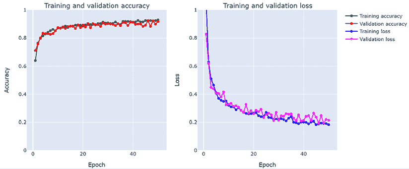

图 6.27：经过优化的模型（版本 3，包含学习率调度器、提前停止和检查点）——训练和验证准确率（左）和训练和验证损失（右）

我们使用保存的模型检查点（用于第 46 个 epoch）来预测测试数据。在*图 6.28*中，我们展示了第三个模型的分类报告。

宏平均指标进一步改进，分别达到精确度、召回率和 f1 分数的 0.88、0.90 和 0.89。精确度、召回率和 f1 分数的加权平均值也分别提高到 0.91、0.90 和 0.90。

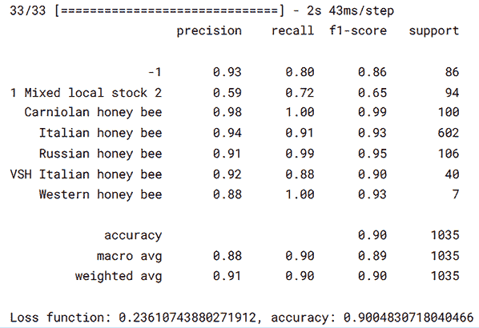

图 6.28：使用第三个优化模型的测试数据分类报告（训练 epochs 增加到 50，并添加了学习率调度器、提前停止器和模型检查点）

在这里，我们将停止迭代改进模型的过程。您可以继续对其进行优化。您可以尝试添加更多的卷积和 maxpool 层，使用不同的内核数量和步长值来处理不同的超参数，包括不同的批量大小或学习率调度器。您还可以更改优化方案。改变模型的另一种方法是，通过数据增强控制类别图像的平衡（目前，蜜蜂图像在`亚种`类别上不平衡）。

您还可以尝试各种数据增强参数，并尝试使用不同的数据增强解决方案。参见*参考文献 5*，了解一个目前非常流行的图像数据增强库的示例，**Albumentations**，由一群数据科学家、研究人员和计算机视觉工程师创建，其中包括著名的 Kaggle 大师 Vladimir Iglovikov。

# 摘要

在本章中，我们首先介绍了一个新的数据集，其中包含了在不同日期和不同地点收集的图像元数据，包括各种患有不同疾病的蜜蜂亚种。我们还介绍了一些函数，用于基于`skimage.io`和 opencv (`cv2`)读取、缩放和从图像中提取特征。

我们使用了一个新创建的实用脚本，基于 Plotly 可视化表格数据，并利用 Plotly 的灵活性创建定制的图形，从而创建了有洞察力的可视化。我们还创建了图像的可视化函数。

在详细的数据探索分析（EDA）之后，我们转向构建蜜蜂亚种的预测模型。在这里，我们介绍了一种数据增强方法，通过从原始图像集中创建变化（旋转、缩放、平移和镜像）来增加初始可用训练数据。我们使用 `stratify` 将数据分为训练、验证和测试子集，以在随机采样三个子集时考虑类别不平衡。我们首先训练和验证了一个基线模型，然后，在执行错误分析后，我们逐步改进了初始模型，通过添加更多步骤，引入 `Dropout` 层，然后使用几个回调：学习率调度器、早期停止器和模型检查点。我们分析了训练、验证和测试错误的迭代改进，不仅关注训练和验证损失和准确率，还关注测试数据的分类报告。

在下一章中，我们将介绍文本数据分析的技术和工具，展示您如何准备数据以创建使用文本数据的基线模型。

# 参考文献

1.  BeeImage 数据集：标注的蜜蜂图像：[`www.kaggle.com/datasets/jenny18/honey-bee-annotated-images`](https://www.kaggle.com/datasets/jenny18/honey-bee-annotated-images)

1.  `plotly-script` 和 Kaggle 工具脚本：[`github.com/PacktPublishing/Developing-Kaggle-Notebooks/blob/develop/Chapter-06/plotly-utils.ipynb`](https://github.com/PacktPublishing/Developing-Kaggle-Notebooks/blob/develop/Chapter-06/plotly-utils.ipynb)

1.  蜜蜂亚种分类，Kaggle 笔记本：[`github.com/PacktPublishing/Developing-Kaggle-Notebooks/blob/develop/Chapter-06/honeybee-subspecies-classification.ipynb`](https://github.com/PacktPublishing/Developing-Kaggle-Notebooks/blob/develop/Chapter-06/honeybee-subspecies-classification.ipynb)

1.  安德鲁·吴，机器学习渴望：[`info.deeplearning.ai/machine-learning-yearning-book`](https://info.deeplearning.ai/machine-learning-yearning-book)

1.  Keras：[`keras.io/`](https://keras.io/)

1.  TensorFlow：[`www.tensorflow.org/`](https://www.tensorflow.org/)

1.  使用 Albumentations 与 Tensorflow：[`github.com/albumentations-team/albumentations_examples/blob/master/notebooks/tensorflow-example.ipynb`](https://github.com/albumentations-team/albumentations_examples/blob/master/notebooks/tensorflow-example.ipynb)

# 加入我们书籍的 Discord 空间

加入我们的 Discord 社区，与志同道合的人相聚，并在以下地点与超过 5000 名成员一起学习：

[`packt.link/kaggle`](https://packt.link/kaggle)


