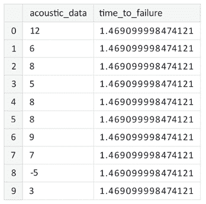
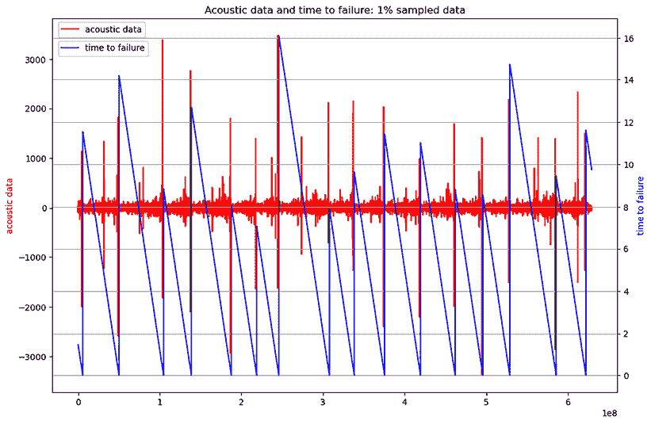
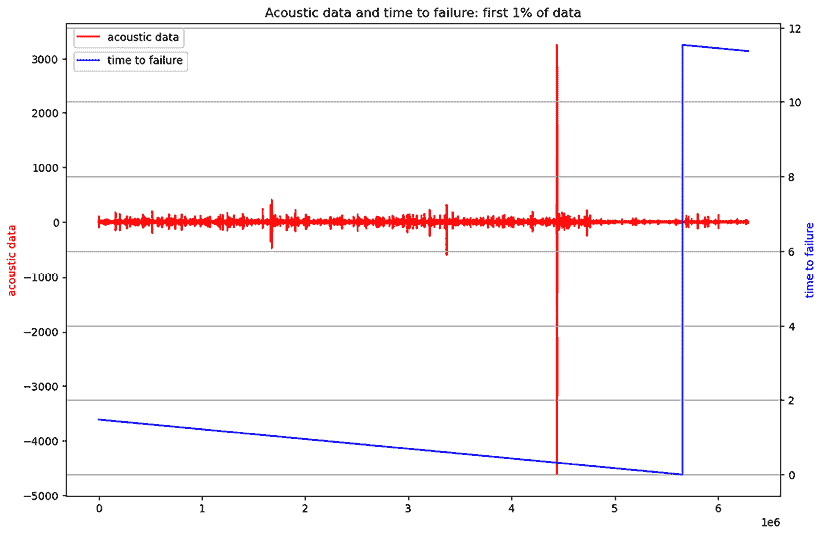
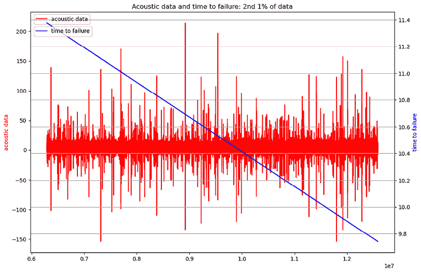
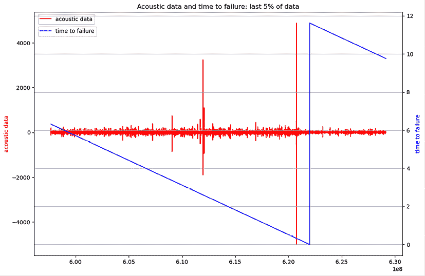
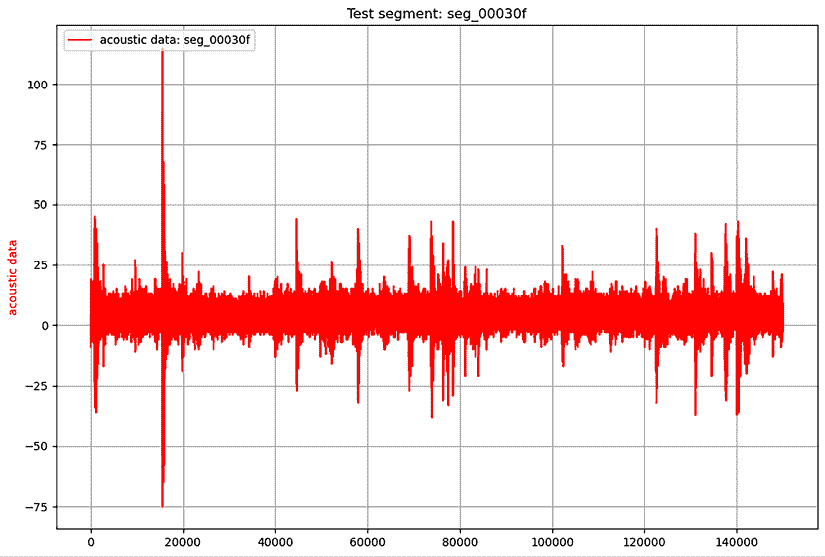
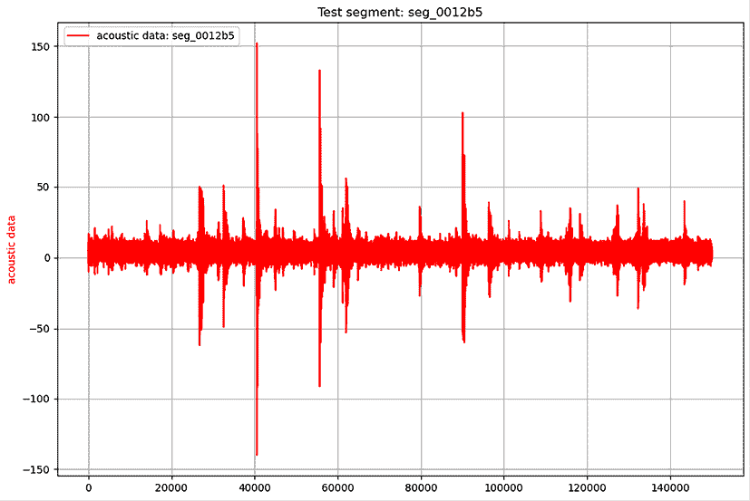
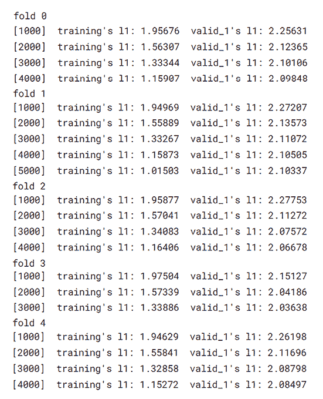
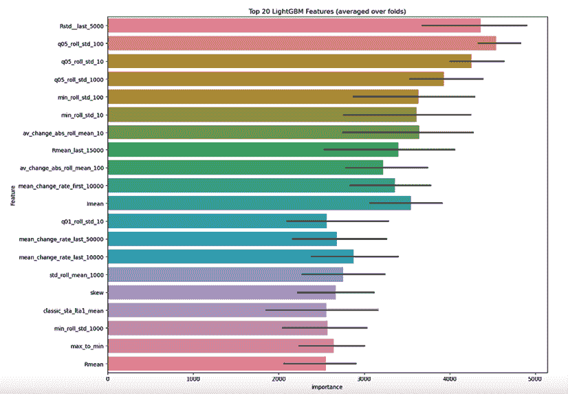

# 8

# 分析声学信号以预测下一次模拟地震

在前面的章节中，我们探讨了基本的表格格式数据，包括分类、有序和数值数据，以及文本、地理坐标和图像。当前章节将我们的关注点转向不同的数据类别，特别是模拟或实验信号数据。这种数据类型通常以多种格式出现，而不仅仅是标准的 CSV 文件格式。

我们的主要案例研究将是*LANL 地震预测* Kaggle 竞赛的数据（参见*参考文献 1*）。我为此竞赛贡献了一个广为人知且经常被分叉的笔记本，名为*LANL 地震 EDA 和预测*（参见*参考文献* *2*），它将作为本章主要笔记本的基础资源。然后我们将深入研究特征工程，采用各种对开发竞赛预测模型至关重要的信号分析技术。我们的目标是构建一个初始模型，该模型可以预测竞赛的目标变量：故障时间，即下一次模拟实验室地震前的剩余时间。

在地震预测领域的的研究表明，在地震发生之前，板块的运动会在低频声学频谱中产生信号。通过研究这些信号，研究人员试图理解信号的轮廓与故障（即地震）发生时刻之间的关系。在实验室中，模拟板块的滑动和剪切。这个竞赛使用实验室测量数据，包括声学信号以及故障发生的时间。

总结来说，本章将涵盖以下主题：

+   用于各种信号数据的数据格式

+   探索*LANL 地震预测* Kaggle 竞赛数据

+   特征工程

+   训练*LANL 地震预测*竞赛的模型

# 介绍 LANL 地震预测竞赛

*LANL 地震预测*竞赛的核心是利用地震信号来确定实验室诱导地震的确切时间。目前，预测自然地震仍然超出了我们的科学知识和技术能力。科学家理想的情景是预测此类事件的时间、地点和震级。

然而，在高度控制的模拟环境中创造的模拟地震，模仿了真实的地震活动。这些模拟允许使用在自然环境中观察到的相同类型的信号来预测实验室生成的地震。在这场比赛中，参与者使用声学数据输入信号来估计下一次人工地震发生的时间，如*参考文献 3*中详细说明。挑战在于预测地震的时间，解决地震预测中的三个关键未知因素之一：它将在何时发生，将在哪里发生，以及它将有多强大。

训练数据是一个包含两列的单个文件：声学信号幅度和时间至失效。测试数据由多个文件组成（总共 2,526 个），包含声学信号幅度段，我们将需要预测每个段的时间至失效。一个样本提交文件包含一个列，即段 ID `seg_id` 和要预测的值：`time_to_failure`。

竞赛者需要使用训练文件中的声学信号和时间至失效数据来训练他们的模型，并预测测试文件夹中每个文件的每个段的时间至失效。这些竞赛数据格式非常方便，即**逗号分隔值**（**CSV**）格式，但这不是必需的。Kaggle 上其他带有信号数据的竞赛或数据集使用不同的、不太常见的格式。因为本章是关于分析信号数据的，所以这里是回顾这种格式的正确位置。让我们首先了解一下这些格式中的一些。

# 信号数据的格式

在 Kaggle 上举办的几场比赛使用了声音数据作为常规表格特征的补充。2021 年、2022 年和 2023 年，康奈尔鸟类实验室的 BirdCLEF（LifeCLEF 鸟类识别挑战）组织了三场比赛，用于从鸟鸣样本中预测鸟种（参见*参考文献 4*以了解这些比赛中的一个示例）。这些比赛使用的格式是`.ogg`。`.ogg`格式用于以更少的带宽存储音频数据，技术上被认为优于`.mp3`格式。

我们可以使用`librosa`库（参见*参考文献 5*）读取这些类型的文件格式。以下代码可以用来加载一个`.ogg`文件并显示声音波形：

```py
import matplotlib.pyplot as plt
import librosa
def display_sound_wave(sound_path=None,
               text="Test", 
               color="green"):
    """
    Display a sound wave
    Args
        sound_path: path to the sound file
        text: text to display
        color: color for text to display
    Returns
        None
    """
if not sound_path:
        return    
    y_sound, sr_sound = librosa.load(sound_path)
    audio_sound, _ = librosa.effects.trim(y_sound)
    fig, ax = plt.subplots(1, figsize = (16, 3))
    fig.suptitle(f'Sound Wave: {text}', fontsize=12)
    librosa.display.waveshow(y = audio_sound, sr = sr_sound, color = color) 
```

当`librosa`库加载音频声音时，将返回一个时间序列，包含浮点数值（参见*参考文献 6*）。它不仅支持`.ogg`格式；它还可以与 soundfile 或 Audioread 支持的任何代码一起工作。默认采样率为 22050，但也可以在加载时设置，使用参数*sr*。在加载音频波形时还可以使用的其他参数是偏移量和持续时间（两者都以秒为单位 - 一起，它们允许您选择要加载的声音波形的时问间隔）。

在 BirdCLEF 竞赛的早期版本中，*康奈尔鸟鸣识别*（见*参考文献 7*），数据集中的音频声音以`.mp3`格式给出。对于这种格式，我们可以使用 librosa 来加载、转换或可视化声音波。**波形音频文件**格式（或**WAV**），另一种常用格式，也可以使用 librosa 加载。

对于`.wav`格式，我们可以使用`scipy.io`模块的`wavfile`来加载数据。以下代码将加载并显示一个`.wav`格式的文件。在这种情况下，振幅没有缩放到-1:1 的区间（最大值为 32K）：

```py
import matplotlib.pyplot as plt
from scipy.io import wavfile
def display_wavefile(sound_path=None,
               text="Test", 
               color="green"):
    """
    Display a sound wave - load using wavefile
    sr: sample rate
    y_sound: sound samples
    Args
        sound_path: path to the sound file
        text: text to display
        color: color for text to display
    Returns
        None
    """
if not sound_path:
        return    
    sr_sound, y_sound = wavfile.load(sound_path)
    fig, ax = plt.subplots(1, figsize = (16, 3))
    fig.suptitle(f'Sound Wave: {text}', fontsize=12)
    ax.plot(np.linspace(0, sr_sound/len(y_sound), sr_sound), y_sound) 
```

信号，不仅仅是音频信号，也可以存储在`.npy`或`.npz`格式中，这两种格式都是`numpy`格式，用于存储数组数据。这些格式可以使用`numpy`函数加载，如下面的代码片段所示。对于`.npy`格式，这将加载一个多列数组：

```py
import numpy as np
f = np.load('data_path/file.npy', allow_pickle=True)
columns_, data_  = f
data_df = pd.DataFrame(data_, columns = columns_) 
```

对于`.npz`格式，以下代码将加载一个类似的结构，之前已压缩（只有一个文件）：

```py
import numpy as np
f = np.load('data_path/file.npz', allow_pickle=True)
columns_, data_ = f['arr_0']
data_df = pd.DataFrame(data_, columns = columns_) 
```

对于存储在`.rds`格式中的数据，这是一种用于保存数据的 R 特定格式，我们可以使用以下代码加载数据：

```py
!pip install pyreadr
import pyreadr
f = pyreadr.read_r('data_path/file.rds')
data_df = f[None] 
for CO, focusing on the COCL dimension (Column Burden kg m-2), and includes values for latitude, longitude, and time:
```

```py
from netCDF4 import Dataset
data = Dataset(file_path, more="r")
lons = data.variables['lon'][:]
lats = data.variables['lat'][:]
time = data.variables['time'][:]
COCL = data.variables['COCL'][:,:,:]; COCL = COCL[0,:,:] 
```

更多详情，请参阅*参考文献 9*。现在，让我们回到我们的竞赛数据，它以 CSV 格式存储，尽管它代表音频信号（声波），正如我们之前所阐明的。

# 探索我们的竞赛数据

`LANL 地震预测`数据集包含以下数据：

+   一个只有两列的`train.csv`文件：

    +   `acoustic_data`: 这是声学信号的振幅。

    +   `time_to_failure`: 这是指当前数据段对应的故障时间。

+   一个包含 2,624 个文件的小段声学数据的测试文件夹。

+   一个`sample_submission.csv`文件；对于每个测试文件，参赛者需要提供一个故障时间的估计。

训练数据（9.56 GB）包含 6.92 亿行。训练数据中样本的实际时间常数是由`time_to_failure`值的连续变化引起的。声学数据是整数，从-5,515 到 5,444，平均值为 4.52，标准差为 10.7（值在 0 附近波动）。`time_to_failure`值是实数，范围从 0 到 16，平均值为 5.68，标准差为 3.67。为了减少训练数据的内存占用，我们以减少的维度读取声学数据和`time_to_failure`：

```py
%%time
train_df = pd.read_csv(os.path.join(PATH,'train.csv'), dtype={'acoustic_data': np.int16, 'time_to_failure': np.float32}) 
```

让我们检查`training`数据中的第一个值。我们不会使用所有的`time_to_failure`数据（只有与时间间隔结束相关的值，我们将对这些值进行聚合以获取声学数据）；因此，将时间到故障的大小从双精度浮点数缩小到浮点数不是很重要：



图 8.1\. 训练数据中的第一行数据

让我们在同一张图上可视化声音信号值和故障时间。我们将使用 1/100 的子采样率（每 100 行取一个样本）来表示完整训练数据（参见*图 8.2*）。我们将使用以下代码来表示这些图表：

```py
def plot_acc_ttf_data(idx, train_ad_sample_df, train_ttf_sample_df, title="Acoustic data and time to failure: 1% sampled data"):
    """
    Plot acoustic data and time to failure
    Args:
        train_ad_sample_df: train acoustic data sample
        train_ttf_sample_df: train time to failure data sample
        title: title of the plot
    Returns:
        None
    """
    fig, ax1 = plt.subplots(figsize=(12, 8))
    plt.title(title)
    plt.plot(idx, train_ad_sample_df, color='r')
    ax1.set_ylabel('acoustic data', color='r')
    plt.legend(['acoustic data'], loc=(0.01, 0.95))
    ax2 = ax1.twinx()
    plt.plot(idx, train_ttf_sample_df, color='b')
    ax2.set_ylabel('time to failure', color='b')
    plt.legend(['time to failure'], loc=(0.01, 0.9))
    plt.grid(True) 
```



图 8.2\. 整个训练集的声音信号数据和故障时间数据，以 1/100 的比例进行子采样

让我们放大时间间隔的第一部分。我们将展示前 1%的数据（不进行子采样）。在*图 8.3*中，我们在同一张图上展示了前 6.29 百万行数据的声音信号和故障时间。我们可以观察到在故障前（但时间上不是非常接近），有一个大的振荡，既有负峰也有正峰。这个振荡还由几个较小的不规则振荡在非规则的时间间隔前导。



图 8.3：数据前 1%的声音信号数据和故障时间数据

让我们也看看训练数据的下一个 1%（不进行子采样）。在*图 8.4*中，我们展示了声音信号值和故障时间的时序图。在这个时间间隔内没有发生故障。我们观察到许多不规则的小振荡，既有负峰也有正峰。



图 8.4：训练集中第 2%的数据的声音信号数据和故障时间

让我们也看看训练集中数据的最后几个百分比（最后 5%的时间）在训练集中。在*图 8.5*中，我们观察到几个较大的振荡叠加在较小的不规则振荡上，并且在故障前有一个主要振荡：



图 8.5：训练集中最后 5%的数据的声音信号数据和故障时间

现在，让我们也看看测试数据样本中声音信号变化的一些例子。测试数据中有 2,624 个数据段文件。我们将从中选择一些进行可视化。由于测试数据中我们只有声音信号，我们将使用修改后的可视化函数：

```py
def plot_acc_data(test_sample_df, segment_name):
    """
    Plot acoustic data for a train segment
    Args:
        test_sample_df: test acoustic data sample
        segment_name: title of the plot
    Returns:
        None
    """
    fig, ax1 = plt.subplots(figsize=(12, 8))
    plt.title(f"Test segment: {segment_name}")
    plt.plot(test_sample_df, color='r')
    ax1.set_ylabel('acoustic data', color='r')
    plt.legend([f"acoustic data: {segment_name}"], loc=(0.01, 0.95))
    plt.grid(True) 
```

在*图 8.6*中，我们展示了**seg_00030f**段的声音信号图：



图 8.6：测试段 seg_00030f 的声音信号数据

在下一张图中，我们展示了**seg_0012b5**段的声音信号图：



图 8.7：测试段 seg_0012b5 的声音信号数据

在与本章相关的笔记本中，您可以查看更多此类测试声学信号的示例。测试段显示了相当大的信号波形多样性，描述了相同的小振荡序列，其中穿插着不同振幅的峰值，类似于我们在之前下采样的`训练`数据中可以看到的。

## 解决方案方法

竞赛中的任务是准确预测测试数据集中每个段落的单一`time_to_failure`值。`test`集的每个段由 150,000 个数据行组成。相比之下，`training`数据集非常庞大，包含 6.92 亿行，其中一列专门用于我们的目标变量：失效时间。我们计划将训练数据分成均匀的段，每个段包含 150,000 行，并使用每个段的最终失效时间值作为该段的目标变量。这种方法旨在使训练数据与测试数据的格式相匹配，从而促进更有效的模型训练。

此外，我们还将通过聚合训练和测试数据集中的值来构建新的特征，从而得到一个包含每个数据段多个特征的单一行。下一节将深入探讨用于特征生成的信号处理技术。

# 特征工程

我们将使用几个特定于信号处理的库来生成大多数特征。从 SciPy（Python 科学库）中，我们使用了`signal`模块的一些函数。Hann 函数返回一个 Hann 窗口，它修改信号以平滑采样信号末尾的值到 0（使用余弦“钟形”函数）。Hilbert 函数通过`Hilbert`变换计算解析信号。Hilbert 变换是信号处理中使用的数学技术，具有将原始信号的相位移动 90 度的特性。

其他使用的库函数来自`numpy`：快速傅里叶变换（FFT）、`mean`、`min`、`max`、`std`（标准差）、`abs`（绝对值）、`diff`（信号中两个连续值之间的差值）和`quantile`（将样本分为相等大小、相邻的组）。我们还使用了一些来自`pandas`的统计函数：`mad`（中值绝对偏差）、`kurtosis`、`skew`和`median`。我们正在实现计算趋势特征和经典 STA/LTA 的函数。经典 STA/LTA 表示 STA 长度短时间窗口信号振幅与长时间窗口 LTA 的比率。让我们深入探讨吧！

## 趋势特征和经典 STA/LTA

我们首先定义两个函数，用于计算趋势特征和经典的**短期平均**/**长期平均**（**STA**/**LTA**）。STA/LTA 是地震信号分析技术，在地震学中应用。它测量短期信号平均值与长期信号平均值的比率。在地震检测中很有用，因为它可以识别地震数据中的独特模式。因此，它也将是我们模型中一个有用的特征。

我们在此处展示了计算趋势特征的代码。这是使用线性回归模型（用于 1D 数据）来检索结果回归线的斜率。我们在进行回归（即计算数据的绝对值的斜率/趋势）之前将所有采样数据转换为正值。趋势数据包含有关整体信号的重要信息：

```py
def add_trend_feature(arr, abs_values=False):
    """
    Calculate trend features
    Uses a linear regression algorithm to extract the trend
    from the list of values in the array (arr)
    Args:
        arr: array of values
        abs_values: flag if to use abs values, default is False

    Returns:
        trend feature
    """
    idx = np.array(range(len(arr)))
    if abs_values:
        arr = np.abs(arr)
    lr = LinearRegression()
    lr.fit(idx.reshape(-1, 1), arr)
    return lr.coef_[0] 
```

接下来，我们计算经典的 STA/LTA，它表示长度为`STA`的短时间窗口信号幅度与长时间窗口`LTA`的比值。该函数接收信号和短时间平均窗口以及长时间平均窗口的长度作为参数：

```py
def classic_sta_lta(x, length_sta, length_lta):
    """
    Calculate classic STA/LTA
    STA/LTA represents the ratio between amplitude of the
    signal on a short time window of length LTA and on a
    long time window LTA
    Args:
        length_sta: length of short time average window
        length_lta: length of long time average window
    Returns:
        STA/LTA
    """
    sta = np.cumsum(x ** 2)
    # Convert to float
    sta = np.require(sta, dtype=np.float)
    # Copy for LTA
    lta = sta.copy()
    # Compute the STA and the LTA
    sta[length_sta:] = sta[length_sta:] - sta[:-length_sta]
    sta /= length_sta
    lta[length_lta:] = lta[length_lta:] - lta[:-length_lta]
    lta /= length_lta
    # Pad zeros
    sta[:length_lta - 1] = 0
# Avoid division by zero by setting zero values to tiny float
    dtiny = np.finfo(0.0).tiny
    idx = lta < dtiny
    lta[idx] = dtiny
    return sta / lta 
```

接下来，我们实现一个计算特征的功能，该功能接收样本索引、数据子样本和转换后的训练数据句柄作为参数。此功能将使用各种信号处理算法从每个段的时间变化声学信号中构建聚合特征。在训练数据的情况下，我们使用训练集的 150K 行窗口（没有步长）。在测试集的情况下，每个测试文件代表 150K 的段。在以下小节中，我们将回顾将包含在模型中的工程特征。

## 由 FFT 派生的特征

模型的特征之一是对整个段应用**快速傅里叶变换**（**FFT**）；这并不是直接用作特征，而是作为计算多个聚合函数的基础（参见下一小节）。FFT 使用快速实现的离散傅里叶变换来计算。

我们使用`numpy`实现的一维数组**FFT**（`fft.fft`），这非常快，因为`numpy`基于**BLAS**（**基本线性代数子程序**）和**Lapack**（**线性代数包**），这两个库提供了执行基本向量和矩阵操作以及求解线性代数方程的程序。这里使用的函数的输出是一个复数值的一维数组。然后，我们从复数值数组中提取实部和虚部的向量，并计算以下特征：

+   提取 FFT 的实部和虚部；这是进一步处理声学信号快速傅里叶变换的第一步。

+   计算 FFT 的实部和虚部的平均值、标准差、最小值和最大值。从之前的变换中，该变换将 FFT 的实部和虚部分开，然后我们计算这些聚合函数。

+   计算 FFT 向量末尾 5K 和 15K 数据点的 FFT 的实部和虚部的平均值、标准差、最小值和最大值。

创建文件段以及 FFT 和由 FFT 派生的特征的代码如下。首先，我们计算声学数据子集的 FFT。然后，我们计算 FFT 的实部和虚部。从实 FFT 分量中，我们使用 pandas 的聚合函数计算平均值、标准差、最大值和最小值。然后，我们从 FFT 信号的虚部计算类似值：

```py
def create_features(seg_id, seg, X):
    """
    Create features
    Args:
        seg_id: the id of current data segment to process
        seg: the current selected segment data
        X: transformed train data
    Returns:
        None
    """
    xc = pd.Series(seg['acoustic_data'].values)
    zc = np.fft.fft(xc)

    #FFT transform values
    realFFT = np.real(zc)
    imagFFT = np.imag(zc)
    X.loc[seg_id, 'Rmean'] = realFFT.mean()
    X.loc[seg_id, 'Rstd']  = realFFT.std()
    X.loc[seg_id, 'Rmax']  = realFFT.max()
    X.loc[seg_id, 'Rmin']  = realFFT.min()
    X.loc[seg_id, 'Imean'] = imagFFT.mean()
    X.loc[seg_id, 'Istd']  = imagFFT.std()
    X.loc[seg_id, 'Imax']  = imagFFT.max()
    X.loc[seg_id, 'Imin']  = imagFFT.min()
    X.loc[seg_id, 'Rmean_last_5000']  = realFFT[-5000:].mean()
    X.loc[seg_id, 'Rstd__last_5000']  = realFFT[-5000:].std()
    X.loc[seg_id, 'Rmax_last_5000']   = realFFT[-5000:].max()
    X.loc[seg_id, 'Rmin_last_5000']   = realFFT[-5000:].min()
    X.loc[seg_id, 'Rmean_last_15000'] = realFFT[-15000:].mean()
    X.loc[seg_id, 'Rstd_last_15000'] = realFFT[-15000:].std()
    X.loc[seg_id, 'Rmax_last_15000'] = realFFT[-15000:].max()
    X.loc[seg_id, 'Rmin_last_15000'] = realFFT[-15000:].min() 
```

我们接着计算由各种聚合函数派生的特征。

## 由聚合函数派生的特征

使用 pandas 的聚合函数`mean`、`std`、`max`和`min`计算整个段落的平均值、标准差、最大值和最小值的代码如下：

```py
 xc = pd.Series(seg['acoustic_data'].values)
    zc = np.fft.fft(xc)

    X.loc[seg_id, 'mean'] = xc.mean()
    X.loc[seg_id, 'std'] = xc.std()
    X.loc[seg_id, 'max'] = xc.max()
    X.loc[seg_id, 'min'] = xc.min() 
```

我们继续计算额外的聚合特征。对于我们的模型，我们将包括各种信号处理技术，正如您将注意到的，然后，在训练我们的基线模型后，通过测量特征重要性，我们将确定哪些特征对我们的模型预测贡献更大。

接下来，我们计算整个段落的平均变化量；这里的“段落”指的是原始的声学数据子集。“变化”是通过`numpy`函数`diff`和参数`1`计算的。此函数接收一个值数组，并计算数组中每个连续值之间的差异。然后我们计算差异值数组的平均值。我们还计算整个声学数据段的变化率的平均值。这是通过将新变化向量中的非零值的平均值除以数据段中的原始值来计算的。这些特征的代码如下：

```py
 X.loc[seg_id, 'mean_change_abs'] = np.mean(np.diff(xc))
    X.loc[seg_id, 'mean_change_rate'] = np.mean(nonzero(np.diff(xc) / xc[:-1])[0]) 
```

此外，我们还计算每个整个段落的绝对值（最大值和最小值）。在计算绝对值之后，我们再计算最小值和最大值。

当我们聚合时间信号时，我们试图包括一个多样化的特征范围，以尽可能多地捕捉信号模式。这个代码如下：

```py
 X.loc[seg_id, 'abs_max'] = np.abs(xc).max()
    X.loc[seg_id, 'abs_min'] = np.abs(xc).min() 
```

可以计算每个声学数据段前 10K、50K 和最后 10K 值的聚合函数集，如下所示：

+   每个声学数据段前 50K 和最后 10K 值的平均值

+   每个声学数据段前 50K 和最后 10K 值的平均值

+   每个声学数据段前 50K 和最后 10K 值的最小值

+   每个声学数据段前 50K 和最后 10K 值的最大值

这些特征正在聚合信号的一部分较小部分，因此它们将只从故障前更小的时间间隔中捕获信号特征。在整个信号长度和信号较小部分上的聚合特征组合将增加更多关于信号的信息。这些特征的代码如下：

```py
 X.loc[seg_id, 'std_first_50000'] = xc[:50000].std()
    X.loc[seg_id, 'std_last_50000'] = xc[-50000:].std()
    X.loc[seg_id, 'std_first_10000'] = xc[:10000].std()
    X.loc[seg_id, 'std_last_10000'] = xc[-10000:].std()

    X.loc[seg_id, 'avg_first_50000'] = xc[:50000].mean()
    X.loc[seg_id, 'avg_last_50000'] = xc[-50000:].mean()
    X.loc[seg_id, 'avg_first_10000'] = xc[:10000].mean()
    X.loc[seg_id, 'avg_last_10000'] = xc[-10000:].mean()

    X.loc[seg_id, 'min_first_50000'] = xc[:50000].min()
    X.loc[seg_id, 'min_last_50000'] = xc[-50000:].min()
    X.loc[seg_id, 'min_first_10000'] = xc[:10000].min()
    X.loc[seg_id, 'min_last_10000'] = xc[-10000:].min()

    X.loc[seg_id, 'max_first_50000'] = xc[:50000].max()
    X.loc[seg_id, 'max_last_50000'] = xc[-50000:].max()
    X.loc[seg_id, 'max_first_10000'] = xc[:10000].max()
    X.loc[seg_id, 'max_last_10000'] = xc[-10000:].max() 
```

接下来，我们包括整个声学数据段的极大值与极小值之比以及极大值与极小值之间的差值。我们还添加了超过一定振荡幅度（超过 500 个单位）的值的数量以及整个段的值总和。我们试图使用我们构建的这些特征多样性来捕获信号中的某些隐藏模式。特别是，这里我们包括信号极端振荡的信息：

```py
 X.loc[seg_id, 'max_to_min'] = xc.max() / np.abs(xc.min())
    X.loc[seg_id, 'max_to_min_diff'] = xc.max() - np.abs(xc.min())
    X.loc[seg_id, 'count_big'] = len(xc[np.abs(xc) > 500])
    X.loc[seg_id, 'sum'] = xc.sum() 
```

我们继续添加多样化的聚合特征，试图捕获原始信号的各个特征。我们进一步计算每个声学数据段前 10K 和最后 50K 数据点的平均变化率（排除空值）：

```py
 X.loc[seg_id, 'mean_change_rate_first_50000'] = np.mean(nonzero((np.diff(xc[:50000]) / xc[:50000][:-1]))[0])
    X.loc[seg_id, 'mean_change_rate_last_50000'] = np.mean(nonzero((np.diff(xc[-50000:]) / xc[-50000:][:-1]))[0])
    X.loc[seg_id, 'mean_change_rate_first_10000'] = np.mean(nonzero((np.diff(xc[:10000]) / xc[:10000][:-1]))[0])
    X.loc[seg_id, 'mean_change_rate_last_10000'] = np.mean(nonzero((np.diff(xc[-10000:]) / xc[-10000:][:-1]))[0]) 
```

我们添加的一些特征将排除数据中的`0`元素，以确保只将非零值包含在聚合函数的计算中。使用`nonzero`函数的代码如下：

```py
def nonzero(x):
    """
    Utility function to simplify call of numpy `nonzero` function
    """
return np.nonzero(np.atleast_1d(x)) 
```

一组工程特征涉及分位数，具体是整个声学数据段的 01%，05%，95%，和 99%分位数值。分位数是使用`numpy`的`quantile`函数计算的。分位数是一个统计术语，指的是将数据集分成等概率的区间。例如，75%的分位数值是 75%的数据值小于该数值的点。50%的分位数是 50%的数据值小于该数值的点（也称为中位数）。我们还添加了 01%，05%，95%，和 99%分位数的绝对值。以下代码用于计算这些特征：

```py
 X.loc[seg_id, 'q95'] = np.quantile(xc, 0.95)
    X.loc[seg_id, 'q99'] = np.quantile(xc, 0.99)
    X.loc[seg_id, 'q05'] = np.quantile(xc, 0.05)
    X.loc[seg_id, 'q01'] = np.quantile(xc, 0.01)

    X.loc[seg_id, 'abs_q95'] = np.quantile(np.abs(xc), 0.95)
    X.loc[seg_id, 'abs_q99'] = np.quantile(np.abs(xc), 0.99)
    X.loc[seg_id, 'abs_q05'] = np.quantile(np.abs(xc), 0.05)
    X.loc[seg_id, 'abs_q01'] = np.quantile (np.abs(xc), 0.01) 
```

另一种引入的工程特征类型是趋势值（使用不带绝对标志的`add_trend_values`函数计算）。趋势值将捕获声学数据信号变化的一般方向。对于显示围绕 0 高频振荡的信号，趋势将捕获实际信号平均值的变化。

我们还添加了绝对趋势值（使用带有绝对标志的`add_trend_values`函数计算）。我们包括这种工程特征来捕获信号绝对值中出现的模式。在这种情况下，对于趋势的计算，我们使用原始信号的绝对值。因此，这种趋势将捕获信号绝对值变化的方向。相应的代码如下：

```py
 X.loc[seg_id, 'trend'] = add_trend_feature(xc)
    X.loc[seg_id, 'abs_trend'] = add_trend_feature(xc, abs_values=True) 
```

接下来，我们包括绝对值的平均值和绝对值的标准差。中位数绝对偏差（`mad`）、`峰度`、`偏度`（偏度）和中位数值也被计算。这些函数使用`numpy`实现。中位数绝对偏差是定量数据单变量样本变异性的稳健度量。峰度是分布尾部的综合权重相对于分布中心的度量。偏度（来自偏度）是对称分布的不对称或扭曲的度量。中位数，正如我们之前观察到的，是分隔数据集上半部分和下半部分值的数值。所有这些聚合函数都捕捉到关于信号的有益信息。这些聚合函数的计算代码如下所示：

```py
 X.loc[seg_id, 'abs_mean'] = np.abs(xc).mean()
    X.loc[seg_id, 'abs_std'] = np.abs(xc).std()

    X.loc[seg_id, 'mad'] = xc.mad()
    X.loc[seg_id, 'kurt'] = xc.kurtosis()
    X.loc[seg_id, 'skew'] = xc.skew()
    X.loc[seg_id, 'med'] = xc.median() 
```

接下来，我们包括几个通过使用信号处理特定的变换函数计算的特征。

## 使用希尔伯特变换和汉宁窗口派生的特征

我们还计算希尔伯特均值。我们使用`scipy.signal.hilbert`函数对声学信号段应用希尔伯特变换。这通过希尔伯特变换计算解析信号，然后，我们计算变换数据的绝对值的平均值。希尔伯特变换在信号处理中经常被使用，并捕捉到关于信号的重要信息。因为我们使用聚合函数从我们的时间数据中生成特征，我们希望包括大量、多样化的现有信号处理技术，在训练模型时添加信号的重要补充元素：

```py
 X.loc[seg_id, 'Hilbert_mean'] = np.abs(hilbert(xc)).mean() 
```

接下来，我们包括一个由汉宁窗口均值派生的特征。我们使用这个由汉宁窗口派生的特征来减少信号边缘的突然不连续性。汉宁窗口均值是通过将原始信号与汉宁窗口的结果进行卷积，然后除以汉宁窗口中所有值的总和来计算的：

```py
 X.loc[seg_id, 'Hann_window_mean'] = (convolve(xc, hann(150), mode='same') / sum(hann(150))).mean() 
```

我们之前介绍了经典 STA/LTA 的定义。我们计算了 500-10K、5K-100K、3,333-6,666 和 10K-25K STA/LTA 窗口的经典 STA/LTA 均值等几个特征。这些是通过之前介绍的 STA/LTA 函数计算的。我们在聚合工程特征中包括各种变换，试图捕捉不同的信号特性：

```py
 X.loc[seg_id, 'Hilbert_mean'] = np.abs(hilbert(xc)).mean()
    X.loc[seg_id, 'Hann_window_mean'] = (convolve(xc, hann(150), mode='same') / sum(hann(150))).mean()
    X.loc[seg_id, 'classic_sta_lta1_mean'] = classic_sta_lta(xc, 500, 10000).mean()
    X.loc[seg_id, 'classic_sta_lta2_mean'] = classic_sta_lta(xc, 5000, 100000).mean()
    X.loc[seg_id, 'classic_sta_lta3_mean'] = classic_sta_lta(xc, 3333, 6666).mean()
    X.loc[seg_id, 'classic_sta_lta4_mean'] = classic_sta_lta(xc, 10000, 25000).mean() 
```

最后，我们还将计算基于移动平均的特征。

## 基于移动平均的特征

接下来，我们计算几个移动平均值，如下所示：

+   700、1.5K、3K 和 6K 窗口的移动平均值均值（排除 NaNs）

+   指数加权移动平均，跨度为 300、3K 和 6K

+   700 和 400 窗口的平均标准差移动平均值

+   700 大小窗口加减 2 倍平均标准差的移动平均值

移动平均线帮助我们辨别模式，减少噪声，并清晰地展示数据中潜在趋势的图像。相应的代码如下：

```py
 X.loc[seg_id, 'Moving_average_700_mean'] = xc.rolling(window=700).mean().mean(skipna=True)
    X.loc[seg_id, 'Moving_average_1500_mean'] = xc.rolling(window=1500).mean().mean(skipna=True)
    X.loc[seg_id, 'Moving_average_3000_mean'] = xc.rolling(window=3000).mean().mean(skipna=True)
    X.loc[seg_id, 'Moving_average_6000_mean'] = xc.rolling(window=6000).mean().mean(skipna=True)
    ewma = pd.Series.ewm
    X.loc[seg_id, 'exp_Moving_average_300_mean'] = (ewma(xc, span=300).mean()).mean(skipna=True)
    X.loc[seg_id, 'exp_Moving_average_3000_mean'] = ewma(xc, span=3000).mean().mean(skipna=True)
    X.loc[seg_id, 'exp_Moving_average_30000_mean'] = ewma(xc, span=6000).mean().mean(skipna=True)
    no_of_std = 2
    X.loc[seg_id, 'MA_700MA_std_mean'] = xc.rolling(window=700).std().mean()
    X.loc[seg_id,'MA_700MA_BB_high_mean'] = (X.loc[seg_id, 'Moving_average_700_mean'] + no_of_std * X.loc[seg_id, 'MA_700MA_std_mean']).mean()
    X.loc[seg_id,'MA_700MA_BB_low_mean'] = (X.loc[seg_id, 'Moving_average_700_mean'] - no_of_std * X.loc[seg_id, 'MA_700MA_std_mean']).mean()
    X.loc[seg_id, 'MA_400MA_std_mean'] = xc.rolling(window=400).std().mean()
    X.loc[seg_id,'MA_400MA_BB_high_mean'] = (X.loc[seg_id, 'Moving_average_700_mean'] + no_of_std * X.loc[seg_id, 'MA_400MA_std_mean']).mean()
    X.loc[seg_id,'MA_400MA_BB_low_mean'] = (X.loc[seg_id, 'Moving_average_700_mean'] - no_of_std * X.loc[seg_id, 'MA_400MA_std_mean']).mean()
    X.loc[seg_id, 'MA_1000MA_std_mean'] = xc.rolling(window=1000).std().mean() 
```

我们还计算**四分位距**（IQR）、0.01%和 99.9%的分位数。**四分位距**（IQR，即**四分位数范围**）是通过从 75%分位数减去 25%分位数（使用`numpy`函数）来计算的。四分位距是数据中 50%所在的范围。0.01%和 99.9%的分位数也使用`numpy`函数进行计算。IQR 和我们所包含的其他分位数是有用的，因为它们提供了关于信号集中趋势和分散的重要信息：

```py
 X.loc[seg_id, 'iqr'] = np.subtract(*np.percentile(xc, [75, 25]))
    X.loc[seg_id, 'q999'] = np.quantile(xc,0.999)
    X.loc[seg_id, 'q001'] = np.quantile(xc,0.001)
    X.loc[seg_id, 'ave10'] = stats.trim_mean(xc, 0.1) 
```

对于 10、100 和 1,000 个窗口，我们计算移动平均和移动标准差。有了这些值，我们随后计算最小值、最大值、平均值、标准差、平均绝对变化和相对变化、1%、5%、95%和 99%的分位数，以及绝对最大滚动值。我们包括这些特征，因为它们揭示了在指定窗口内信号局部特性的信息。随后，对于从 10、100 和 1,000 个窗口计算得到的移动平均标准差派生出的特征，代码如下：

```py
for windows in [10, 100, 1000]:
        x_roll_std = xc.rolling(windows).std().dropna().values

        X.loc[seg_id, 'ave_roll_std_' + str(windows)] = x_roll_std.mean()
        X.loc[seg_id, 'std_roll_std_' + str(windows)] = x_roll_std.std()
        X.loc[seg_id, 'max_roll_std_' + str(windows)] = x_roll_std.max()
        X.loc[seg_id, 'min_roll_std_' + str(windows)] = x_roll_std.min()
        X.loc[seg_id, 'q01_roll_std_' + str(windows)] = np.quantile(x_roll_std, 0.01)
        X.loc[seg_id, 'q05_roll_std_' + str(windows)] = np.quantile(x_roll_std, 0.05)
        X.loc[seg_id, 'q95_roll_std_' + str(windows)] = np.quantile(x_roll_std, 0.95)
        X.loc[seg_id, 'q99_roll_std_' + str(windows)] = np.quantile(x_roll_std, 0.99)
        X.loc[seg_id, 'av_change_abs_roll_std_' + str(windows)] = np.mean(np.diff(x_roll_std))
        X.loc[seg_id, 'av_change_rate_roll_std_' + str(windows)] = np.mean(nonzero((np.diff(x_roll_std) / x_roll_std[:-1]))[0])
        X.loc[seg_id, 'abs_max_roll_std_' + str(windows)] = np.abs(x_roll_std).max() 
```

对于从 10、100 和 1,000 个窗口计算得到的移动平均平均值派生出的特征，代码如下：

```py
 for windows in [10, 100, 1000]:
        x_roll_mean = xc.rolling(windows).mean().dropna().values

        X.loc[seg_id, 'ave_roll_mean_' + str(windows)] = x_roll_mean.mean()
        X.loc[seg_id, 'std_roll_mean_' + str(windows)] = x_roll_mean.std()
        X.loc[seg_id, 'max_roll_mean_' + str(windows)] = x_roll_mean.max()
        X.loc[seg_id, 'min_roll_mean_' + str(windows)] = x_roll_mean.min()
        X.loc[seg_id, 'q01_roll_mean_' + str(windows)] = np.quantile(x_roll_mean, 0.01)
        X.loc[seg_id, 'q05_roll_mean_' + str(windows)] = np.quantile(x_roll_mean, 0.05)
        X.loc[seg_id, 'q95_roll_mean_' + str(windows)] = np.quantile(x_roll_mean, 0.95)
        X.loc[seg_id, 'q99_roll_mean_' + str(windows)] = np.quantile(x_roll_mean, 0.99)
        X.loc[seg_id, 'av_change_abs_roll_mean_' + str(windows)] = np.mean(np.diff(x_roll_mean))
        X.loc[seg_id, 'av_change_rate_roll_mean_' + str(windows)] = np.mean(nonzero((np.diff(x_roll_mean) / x_roll_mean[:-1]))[0])
        X.loc[seg_id, 'abs_max_roll_mean_' + str(windows)] = np.abs(x_roll_mean).max() 
```

对于从训练数据生成的每个 150K 行段，我们计算这些特征。然后，选择当前段最后一行的值作为故障时间：

```py
# iterate over all segments
for seg_id in tqdm_notebook(range(segments)):
    seg = train_df.iloc[seg_id*rows:seg_id*rows+rows]
    create_features(seg_id, seg, train_X)
    train_y.loc[seg_id, 'time_to_failure'] = seg['time_to_failure'].values[-1] 
```

接下来，我们使用`StandardScaler`对所有特征进行缩放。如果我们使用基于决策树（如随机森林或 XGBoost）的模型，这一步不是必须的。我们包括这一步是为了考虑到我们可能想使用其他模型的情况，例如基于神经网络的模型，在这种情况下，对特征进行归一化将是一个必要的步骤：

```py
scaler = StandardScaler()
scaler.fit(train_X)
scaled_train_X = pd.DataFrame(scaler.transform(train_X), columns=train_X.columns) 
```

我们对测试数据段重复同样的过程：

```py
for seg_id in tqdm_notebook(test_X.index):
    seg = pd.read_csv('../input/LANL-Earthquake-Prediction/test/' + seg_id + '.csv')
    create_features(seg_id, seg, test_X)
scaled_test_X = pd.DataFrame(scaler.transform(test_X), columns=test_X.columns) 
```

在我们分析数据后，我们生成了一组工程特征。我们打算使用这些特征来构建一个基线模型。然后，基于模型评估，我们可以进一步选择保留哪些特征，并最终创建新的特征。

# 构建基线模型

从原始的时间数据中，通过特征工程，我们为训练数据中的每个时间段生成了时间聚合特征，其持续时间与一个测试集相等。对于本次比赛中展示的基线模型，我们选择了`LGBMRegressor`，这是当时表现最好的算法之一，在很多情况下，其性能与`XGBoost`相似。训练数据使用`KFold`分割成五个部分，我们对每个部分进行训练和验证，直到达到最终的迭代次数或者验证误差在指定步骤数后不再改善（由`patience`参数给出）。对于每个分割，我们还会对测试集进行预测，使用的是当前折叠的最佳模型——即使用当前折叠的训练分割进行训练的模型，也就是使用训练集的 4/5。最后，我们将计算每个折叠获得的预测的平均值。我们可以使用这种交叉验证方法，因为我们的数据不再是时间序列数据。我们将数据分割成 150K 行的段，与测试数据长度相同，然后从这些数据中创建了聚合特征：

```py
n_fold = 5
folds = KFold(n_splits=n_fold, shuffle=True, random_state=42)
train_columns = scaled_train_X.columns.values 
```

模型参数如下代码片段所示。我们为 LightGBM 设置了以下一些常用参数：

+   **叶子节点数**：此参数控制每个树中的叶子节点（或终端节点）的数量。增加叶子节点的数量允许模型捕捉更复杂的模式，但也增加了过拟合的风险。

+   **叶子节点中的最小数据量**：如果一个叶子节点的样本数低于此阈值，则该节点不会分裂。此参数有助于控制过拟合。

+   **目标**：这是我们的模型的回归。

+   **学习率**：这将控制模型学习的速度。

+   **提升方法**：我们可以选择梯度提升决策树（*gbdt*）、dart 梯度提升（*dgb*）和基于梯度的单侧采样（*goss*）。在这里我们使用*gbdt*。

+   **特征分数**：这是在算法使用的树集成中，向树展示的数据子集中的特征百分比。

+   **袋装频率、袋装分数和袋装种子**：这些控制我们在对算法进行子采样以展示给不同的树时如何划分样本集。

+   **度量标准**：在这种情况下，*mae*，即平均绝对误差。

+   **正则化因子 lambda_l1**

+   **详细程度**：此参数控制算法在训练过程中打印到控制台的信息量。详细程度为 0 表示静默模式（无信息），而详细程度为 1 会打印有关训练进度的消息。

+   **并行处理线程数**：此参数控制算法在训练期间使用的并行线程数。

+   **随机化因子 random_state**：此参数是用于初始化算法各种参数的随机种子。

```py
params = {'num_leaves': 51,
         'min_data_in_leaf': 10, 
         'objective':'regression',
         'max_depth': -1,
         'learning_rate': 0.001,
         "boosting": "gbdt",
         "feature_fraction": 0.91,
         "bagging_freq": 1,
         "bagging_fraction": 0.91,
         "bagging_seed": 42,
         "metric": 'mae',
         "lambda_l1": 0.1,
         "verbosity": -1,
         "nthread": -1,
         "random_state": 42} 
```

训练、验证和测试（每个折叠）的代码如下：

```py
oof = np.zeros(len(scaled_train_X))
predictions = np.zeros(len(scaled_test_X))
feature_importance_df = pd.DataFrame()
#run model
for fold_, (trn_idx, val_idx) in enumerate(folds.split(scaled_train_X,train_y.values)):
    strLog = "fold {}".format(fold_)
    print(strLog)

    X_tr, X_val = scaled_train_X.iloc[trn_idx], scaled_train_X.iloc[val_idx]
    y_tr, y_val = train_y.iloc[trn_idx], train_y.iloc[val_idx]
    model = lgb.LGBMRegressor(**params, n_estimators = 20000, n_jobs = -1)
    model.fit(X_tr, 
              y_tr, 
              eval_set=[(X_tr, y_tr), (X_val, y_val)], 
              eval_metric='mae',
              verbose=1000, 
              early_stopping_rounds=500)
    oof[val_idx] = model.predict(X_val, num_iteration=model.best_iteration_)
    #feature importance
    fold_importance_df = pd.DataFrame()
    fold_importance_df["Feature"] = train_columns
    fold_importance_df["importance"] = model.feature_importances_[:len(train_columns)]
    fold_importance_df["fold"] = fold_ + 1
    feature_importance_df = pd.concat([feature_importance_df, fold_importance_df], axis=0)
    #predictions
    predictions += model.predict(scaled_test_X, num_iteration=model.best_iteration_) / folds.n_splits 
```

我们将预测向量（其维度与提交文件的维度相同，即每个测试段一个条目）初始化为零。我们还初始化了一个超出折叠的向量（训练数据的长度，即训练段的数量）。

对于每个折叠，我们为训练集和验证集采样数据子集和目标值。然后，我们将它们用作模型的输入，`LGBMRegressor`，使用之前定义的模型参数初始化（我们还将估计器的数量和工人的数量添加进去）。我们使用当前折叠对应的训练集子集来拟合模型，并使用相应的训练数据验证子集进行验证。

我们还设置了评估指标：*mae*——表示*平均绝对误差*——打印评估错误的频率，以及早期停止的迭代次数。此参数（早期停止的迭代次数）控制算法在验证错误在训练期间没有改进时停止等待的步数。我们在**oof**（**超出折叠**）向量中累积验证结果，并将当前折叠的特征重要性向量连接到特征重要性 DataFrame 中。早期停止用于在训练期间保持最佳模型进行预测。

特征重要性将用于在特征工程、特征选择和模型训练的迭代过程中观察——如果对于使用某些特征训练的模型，特征重要性在折叠间没有高变化。在每个折叠中，我们也在运行整个测试集的预测，使用每个折叠训练和验证的模型。然后，我们将每个折叠的值加到预测向量中，除以折叠数。这相当于一个模型集成，其中每个模型都使用对应于每个折叠分割的不同数据子集进行训练。

当评估当前模型时，我们将检查三块信息：训练和验证错误、这些错误在折叠间的变化，以及特征重要性在折叠间的变化。理想情况下，这些变化——训练和验证错误在折叠间的变化，以及特征重要性在折叠间的变化——应该更小。*图 8.8*显示了基线模型训练的评估图。

如您所见，我们在每 1,000 步（详细程度设置为`1000`）处绘制训练进度，并在 500 步时实施早期停止（如果验证错误在最后 500 次迭代中没有改进，则停止训练）。保留最佳模型（就验证错误而言）用于测试预测。测试预测是五个分割的平均值。



图 8.8：模型训练评估输出 – 训练和验证错误

*图 8.9*显示了特征重要性图，包括每个折的平均值和标准差：



图 8.9：特征重要性：平均和标准差值（来自五个折的值） – 前 20 个特征

在我们进行数据分析之后，我们继续构建时间聚合特征，这些特征是在与测试集相同持续时间的训练集子集上形成的。使用具有工程特征的新的数据集，我们训练了一个基线模型。对于基线模型，我们使用了五折交叉验证，并使用每个折的模型来预测测试集。最终预测是通过平均每个折的预测来形成的。

# 摘要

在本章中，我们深入探讨了处理信号数据的方法，特别是音频信号。我们探讨了此类数据的各种存储格式，并检查了用于加载、转换和可视化此类数据类型的库。为了开发强大的特征，我们应用了一系列信号处理技术。我们的特征工程努力将每个训练段的时间序列数据转换为特征，并为每个测试集汇总特征。

我们将所有特征工程过程合并为一个单一函数，适用于所有训练段和测试集。转换后的特征经过了缩放。然后我们使用这些准备好的数据，利用 LGBMRegressor 算法训练了一个基线模型。该模型采用了交叉验证，我们使用每个折训练的模型来生成测试集的预测。随后，我们将这些预测汇总以创建提交文件。此外，我们还捕获并可视化了每个折的特征重要性。

# 参考文献

1.  LANL 地震预测，你能预测即将到来的实验室地震吗？Kaggle 竞赛：[`www.kaggle.com/competitions/LANL-Earthquake-Prediction`](https://www.kaggle.com/competitions/LANL-Earthquake-Prediction)

1.  Gabriel Preda, LANL 地震 EDA 和预测：[`www.kaggle.com/code/gpreda/lanl-earthquake-eda-and-prediction`](https://www.kaggle.com/code/gpreda/lanl-earthquake-eda-and-prediction)

1.  LANL 地震预测，数据集描述：[`www.kaggle.com/competitions/LANL-Earthquake-Prediction/data`](https://www.kaggle.com/competitions/LANL-Earthquake-Prediction/data)

1.  BirdCLEF 2021 - 鸟鸣识别，在声音景观录音中识别鸟鸣，Kaggle 竞赛：[`www.kaggle.com/competitions/birdclef-2021`](https://www.kaggle.com/competitions/birdclef-2021)

1.  McFee, Brian, Colin Raffel, Dawen Liang, Daniel PW Ellis, Matt McVicar, Eric Battenberg, 和 Oriol Nieto. “librosa: Python 中的音频和音乐信号分析.” 在第 14 届 Python 科学会议论文集中，第 18-25 页。2015

1.  librosa 加载函数：[`librosa.org/doc/main/generated/librosa.load.html`](https://librosa.org/doc/main/generated/librosa.load.html)

1.  康奈尔鸟鸣识别，Kaggle 比赛：[`www.kaggle.com/competitions/birdsong-recognition`](https://www.kaggle.com/competitions/birdsong-recognition)

1.  EarthData MERRA2 CO，地球数据 NASA 卫星测量，Kaggle 数据集：[`www.kaggle.com/datasets/gpreda/earthdata-merra2-co`](https://www.kaggle.com/datasets/gpreda/earthdata-merra2-co)

1.  加布里埃尔·普雷达，EARTHDATA-MERRA2 数据探索，Kaggle 笔记本：[`www.kaggle.com/code/gpreda/earthdata-merra2-data-exploration`](https://www.kaggle.com/code/gpreda/earthdata-merra2-data-exploration)

# 加入我们书籍的 Discord 空间

加入我们的 Discord 社区，与志同道合的人相聚，并在以下地点与超过 5000 名成员一起学习：

[`packt.link/kaggle`](https://packt.link/kaggle)


