# 第九章：你能找出哪部电影是深度伪造的吗？

在前几章中，我们探讨了各种数据格式：表格、地理空间、文本、图像和声学，同时使用 Kaggle 数据集，了解 shapefile 可视化，构建图像或文本分类模型，以及声学信号分析。

在本章中，我们将介绍视频数据分析。我们将首先描述一个 Kaggle 比赛，*深度伪造检测挑战*。这个挑战要求参与者对哪些视频是人工生成以创造逼真的虚假内容进行分类。接下来，我们将快速探索最常用的视频格式，然后介绍用于数据分析的两个实用脚本。首先是一个具有操作视频内容功能的实用脚本，即读取、从视频中可视化图像和播放视频文件。其次是一个具有身体、面部和面部元素检测功能的实用脚本。我们将继续从竞赛数据集中的元数据探索，然后应用所介绍的实用脚本分析竞赛数据集中的视频数据。

简而言之，本章将涵盖以下主题：

+   **深度伪造检测挑战**比赛的介绍

+   用于视频数据操作和视频数据中目标检测的实用脚本

+   竞赛数据集的元数据分析和视频数据分析

# 介绍比赛

在本章中，我们考察了来自知名 Kaggle 比赛**深度伪造检测挑战**（**DFDC**）的数据。该比赛在*参考文献 1*中有详细描述，于 2019 年 12 月 11 日开始，并于 2020 年 3 月 31 日结束。它吸引了 2,265 个团队，共有 2,904 名参与者，他们共同提交了 8,951 份作品。竞争者争夺总额为 100 万美元的奖金池，其中一等奖为 50 万美元。

该活动是 AWS、Facebook、Microsoft、人工智能媒体完整性指导委员会的合作伙伴关系以及多个学术实体共同协作的结果。当时，技术行业领袖和学者们普遍认为媒体内容操纵的技术复杂性和快速变化性质。比赛的目的是鼓励全球研究人员设计创新和有效的技术来检测深度伪造和媒体操纵。与后来专注于代码的比赛不同，这次比赛要求获奖者在一个“黑盒”环境中测试他们的代码。测试数据不在 Kaggle 上可用，需要更长的处理过程，导致私人排行榜比平时晚公布，正式公布日期为 2020 年 6 月 12 日，尽管比赛已于 2020 年 4 月 24 日结束。

DFDC 吸引了众多高排名的 Kaggle 大师，他们参与数据分析并开发了提交的模型。值得注意的是，最初的第一名获奖者后来被组织者取消资格。这个团队以及其他排名靠前的参与者，通过使用公开数据扩展了他们的训练集。虽然他们遵守了关于使用外部数据的比赛规则，但他们未能满足获奖提交的文档要求。这些规则包括从所有出现在额外训练数据中的图像中的人物获得书面同意。

竞赛数据提供了两个单独的集合。在第一个集合中，提供了 400 个用于训练的视频样本和 400 个用于测试的视频，分别放在两个文件夹中，一个用于训练数据，一个用于测试数据。这些文件是 MP4 格式，这是最常用的视频格式之一。

为了训练，提供了一个超过 470 GB 的大型数据集作为下载链接。或者，相同的数据也以 50 个大约 10 GB 的小文件的形式提供。对于当前的分析，我们只会使用第一组的数据（包含 400 个训练文件和 400 个测试文件，格式为`.mp4`）。

**视频数据格式**

视频格式指的是用于编码、压缩和存储视频数据的标准。目前，存在多种并行使用的格式。其中一些视频格式是由微软、苹果和 Adobe 等科技公司创建和推广的。他们决定开发专有格式可能与其控制自身设备或运行其操作系统的设备上的渲染质量的需求有关。

此外，专有格式可以给你带来竞争优势和更大的对许可和与格式相关的版税的控制。其中一些格式包含了之前使用的格式中不存在的新颖功能和实用功能。与技术领导者的开发并行，其他格式是在技术进步、市场需求和对齐行业标准的需求的响应下开发的。

仅举几个常用格式的例子，我们可以提到**Windows Media Video**（**WMV**）和**Audio Video Interleave**（**AVI**），这两者都是由微软开发的。MOV（QuickTime Movie）格式是由苹果开发的，用于在其 macOS 和 iOS 平台上运行。所有这些格式都支持多种音频和视频编解码器。然后，我们还有由 Adobe 开发的**Flash Video**（**FLV**）。此外，一个广泛采用的格式是**MPEG-4 Part 14**（**MP4**），它是开源的，也可以包含许多视频和音频编解码器。**运动图像专家组**（**MPEG**）指的是一组开发音频和视频压缩以及编码/解码标准的行业专家。从 MPEG-1 到 MPEG-4 的后续标准，对媒体行业的发展产生了巨大影响。

# 介绍竞赛实用脚本

让我们先从两个 Kaggle 实用脚本中分组具有视频操作可重用功能的 Python 模块。第一个实用脚本将加载和显示视频或播放视频文件的功能分组。第二个则专注于视频中的对象检测——更具体地说，是检测人脸和身体——使用几种替代方法。

## 视频数据工具

我们开发了一个实用脚本，帮助我们操作视频数据。让我们介绍一个实用脚本，我们将使用与当前章节相关的笔记本来读取视频数据，以及可视化视频文件的帧。

`video_utils`实用脚本包括加载、转换和显示视频图像的函数。此外，它还包含一个播放视频内容的函数。对于视频操作，我们将使用 OpenCV 库。OpenCV 是一个开源的计算机视觉库，广泛用于图像和视频处理。OpenCV 是用 C 和 C++开发的，也提供了一个 Python 接口。

以下代码块展示了包含的库以及从视频文件中显示一张图片的功能：

```py
import os
import cv2 as cv
import matplotlib.pyplot as plt
from IPython.display import HTML
from base64 import b64encode
def display_image_from_video(video_path):
    '''
    Display image from video
    Process
        1\. perform a video capture from the video
        2\. read the image
        3\. display the image
    Args:
        video_path - path for video
    Returns:
        None
    '''
    capture_image = cv.VideoCapture(video_path)
    ret, frame = capture_image.read()
    fig = plt.figure(figsize=(10,10))
    ax = fig.add_subplot(111)
    frame = cv.cvtColor(frame, cv.COLOR_BGR2RGB)
    ax.imshow(frame) 
```

在前面的代码中，函数`display_image_from_video`接收一个参数，即视频文件的路径，从视频中捕获图像，读取图像，创建一个 Matplotlib Pyplot 图像，将其从 BGR（蓝绿红）转换为 RGB（红绿蓝），并显示。RGB 是一种用于在数字图像中表示颜色的颜色模型。RGB 和 BGR 之间的区别在于颜色信息存储的顺序。在 RGB 的情况下，蓝色存储为最低有效位，然后是绿色，最后是红色。在 BGR 的情况下，顺序相反。

接下来，我们定义一个函数来表示从视频文件列表中捕获的一组图像：

```py
def display_images_from_video_list(video_path_list, data_folder, video_folder):
    '''
    Display images from video list
    Process:
        0\. for each video in the video path list
            1\. perform a video capture from the video
            2\. read the image
            3\. display the image
    Args:
        video_path_list: path for video list
        data_folder: path for data
        video_folder: path for video folder
    Returns:
        None
    '''
    plt.figure()
    fig, ax = plt.subplots(2,3,figsize=(16,8))
    # we only show images extracted from the first 6 videos
for i, video_file in enumerate(video_path_list[0:6]):
        video_path = os.path.join(data_folder, video_folder,video_file)
        capture_image = cv.VideoCapture(video_path)
        ret, frame = capture_image.read()
        frame = cv.cvtColor(frame, cv.COLOR_BGR2RGB)
        ax[i//3, i%3].imshow(frame)
        ax[i//3, i%3].set_title(f"Video: {video_file}")
        ax[i//3, i%3].axis('on') 
```

函数`display_images_from_video_list`接收一个参数，即视频文件名列表的路径，相对于其文件夹的路径，以及数据集的路径。该函数将对列表中的前六个视频文件执行与`display_image_from_video`相同的处理。我们限制从视频文件中捕获的图像数量以方便操作。

实用脚本还包括一个播放视频的函数。该函数使用 IPython `display`模块中的`HTML`函数。代码如下：

```py
def play_video(video_file, data_folder, subset):
    '''
    Display video given by composed path
    Args
        video_file: the name of the video file to display
        data_folder: data folder
        subset: the folder where the video file is located
    Returns:
        a HTML objects running the video
    '''
    video_url = open(os.path.join(data_folder, subset,video_file),'rb').read()
    data_url = "data:video/mp4;base64," + b64encode(video_url).decode()
    return HTML("""<video width=500 controls><source src="img/%s" type="video/mp4"></video>""" % data_url) 
```

函数`play_video`接收要播放的视频文件名、数据文件夹、数据文件夹中的文件夹以及视频文件所在位置作为参数。该函数使用`base64`库中的`b64encode`函数解码 MP4 视频格式，并将解码后的内容以 500 像素的受控宽度显示在视频帧中，使用`HTML`控件。

我们引入了用于视频图像处理的实用脚本，它可以加载视频，从视频中可视化图像，并播放视频文件。在下一节中，我们将介绍更多用于图像中对象检测的实用脚本。这些 Python 模块包含用于对象检测的专业类。这些模块实现了两种人脸对象检测的替代方案，两者都基于计算机视觉算法。

## 人脸和身体检测工具

在深度伪造视频的检测中，分析视频特征，如声音与唇部动作不同步或视频中人物面部部分的不自然动作，在这次比赛时，是训练模型识别深度伪造视频的有价值元素。因此，我们在此包括专门用于检测身体和脸部的实用脚本。

第一个用于人脸检测的模块使用了**Haar 级联**算法。Haar 级联是一种轻量级的机器学习算法，用于对象检测。它通常被训练来识别特定对象。该算法使用 Haar-like 特征和 Adaboost 分类器来创建一个强大的分类器。算法在滑动窗口上操作，应用一系列弱分类器，拒绝图像中不太可能包含感兴趣对象的部分。在我们的案例中，我们希望使用该算法来识别视频图像中的细节，这些细节在深度伪造的情况下通常会被改变，例如面部表情、眼神和嘴型。此模块包括两个类。我们从其中一个类开始。**CascadeObjectDetector**是一个用于使用**Haar** **级联**算法检测对象的通用类。从*参考文献 3*中的代码修改而来的**CascadeObjectDetector**类有一个`init`函数，其中我们使用存储训练模型的特定**Haar 级联**对象初始化对象。该类还有一个**detect**函数。以下是**CascadeObjectDetector**的代码。在`init`函数中，我们初始化`cascade`对象：

```py
import os
import cv2 as cv
import matplotlib.pyplot as plt
class CascadeObjectDetector():
    '''
    Class for Cascade Object Detection
    '''
def __init__(self,object_cascade_path):
        '''
        Args:
        object_cascade_path: path for the *.xml defining the parameters
                for {face, eye, smile, profile} detection algorithm
                source of the haarcascade resource is:
                https://github.com/opencv/opencv/tree/master/data/haarcascades
        Returns:
            None
        '''
        self.object_cascade=cv.CascadeClassifier(object_cascade_path) 
detect function of the CascadeObjectDetector class. This function returns the rectangle coordinates of the object detected in the image:
```

```py
def detect(self, image, scale_factor=1.3,
           min_neighbors=5,
           min_size=(20,20)):
    '''
    Function return rectangle coordinates of object for given image
    Args:
        image: image to process
        scale_factor: scale factor used for object detection
        min_neighbors: minimum number of parameters considered during object detection
        min_size: minimum size of bounding box for object detected
    Returns:
        rectangle with detected object

    '''
    rects=self.object_cascade.detectMultiScale(image,
                                            scaleFactor=scale_factor,
                                            minNeighbors=min_neighbors,
                                            minSize=min_size)
    return rects 
```

为了这次比赛，我创建了一个专门的 Kaggle 数据集，该数据集来源于在[`github.com/opencv/opencv/tree/master/data/haarcascades`](https://github.com/opencv/opencv/tree/master/data/haarcascades)定义的 Haar 级联算法，作为 OpenCV 库分发的一部分。这个数据库的链接，称为*Haar 级联人脸检测*，在*参考文献 2*中给出。`init`函数接收数据库中包含的一个目标检测模型的路径。`detect`函数接收用于对象提取的图像和处理检测的几个参数，这些参数可以用来调整检测。这些参数是缩放因子、检测中使用的最小邻居数以及用于对象检测的最小边界框大小。在`detect`函数内部，我们调用 Haar 级联模型中的`detectMultiscale`函数。

在实用脚本中定义的下一个类是`FaceObjectDetector`。这个类初始化了四个`CascadeObjectDetector`对象，用于面部、面部侧面、眼睛和微笑检测。下面的代码块显示了带有`init`函数的类定义，其中定义了这些对象。

对于每个面部元素，即一个人的正面视图、侧面视图、眼睛视图和微笑视图，我们首先使用到 Haar 级联资源的路径初始化一个专用变量。然后，对于每个资源，我们初始化一个`CascadeObjectDetector`对象（参见上面关于`CascadeObjectDetector`类的代码解释）：

```py
class FaceObjectDetector():
    '''
    Class for Face Object Detection
    '''
def __init__(self, face_detection_folder):
        '''
        Args:
        face_detection_folder: path for folder where the *.xmls
                for {face, eye, smile, profile} detection algorithm
        Returns:
            None
        '''
        self.path_cascade=face_detection_folder
        self.frontal_cascade_path= os.path.join(self.path_cascade,'haarcascade_frontalface_default.xml')
        self.eye_cascade_path= os.path.join(self.path_cascade,'haarcascade_eye.xml')
        self.profile_cascade_path= os.path.join(self.path_cascade,'haarcascade_profileface.xml')
        self.smile_cascade_path= os.path.join(self.path_cascade,'haarcascade_smile.xml')
        #Detector object created
# frontal face
        self.face_detector=CascadeObjectDetector(self.frontal_cascade_path)
        # eye
        self.eyes_detector=CascadeObjectDetector(self.eye_cascade_path)
        # profile face
        self.profile_detector=CascadeObjectDetector(self.profile_cascade_path)
        # smile
        self.smile_detector=CascadeObjectDetector(self.smile_cascade_path) 
```

这些对象存储为成员变量`face_detector`、`eyes_detector`、`profile_detector`和`smile_detector`。

```py
detect_object function of the FaceObjectDetector class, and the detect function of the CascadeObjectDetector object initialized with the eyes Haar cascade object. Then, we use the OpenCV Circle function to mark on the initial image, with a circle, the position of the eyes detected in the image:
```

```py
def detect_objects(self,
                   image,
                   scale_factor,
                   min_neighbors,
                   min_size,
                   show_smile=False):
    '''
    Objects detection function
    Identify frontal face, eyes, smile and profile face and display the detected objects over the image
    Args:
        image: the image extracted from the video
        scale_factor: scale factor parameter for `detect` function of CascadeObjectDetector object
        min_neighbors: min neighbors parameter for `detect` function of CascadeObjectDetector object
        min_size: minimum size parameter for f`detect` function of CascadeObjectDetector object
        show_smile: flag to activate/deactivate smile detection; set to False due to many false positives
    Returns:
        None
    '''
    image_gray=cv.cvtColor(image, cv.COLOR_BGR2GRAY)
    eyes=self.eyes_detector.detect(image_gray,
                   scale_factor=scale_factor,
                   min_neighbors=min_neighbors,
                   min_size=(int(min_size[0]/2), int(min_size[1]/2)))
    for x, y, w, h in eyes:
        #detected eyes shown in color image
        cv.circle(image,(int(x+w/2),int(y+h/2)),(int((w + h)/4)),(0, 0,255),3) 
```

接下来，我们将相同的方法应用于图像中的`smile`对象。我们首先检测微笑，如果检测到，我们使用`opencv`函数在检测到的对象的边界框上绘制矩形来显示它。因为这个函数倾向于给出很多误报，所以默认情况下，这个功能是禁用的，使用一个设置为`False`的标志：

```py
 # deactivated by default due to many false positive
if show_smile:
            smiles=self.smile_detector.detect(image_gray,
                          scale_factor=scale_factor,
                          min_neighbors=min_neighbors,
                          min_size=(int(min_size[0]/2), int(min_size[1]/2)))
            for x, y, w, h in smiles:
               #detected smiles shown in color image
               cv.rectangle(image,(x,y),(x+w, y+h),(0, 0,255),3) 
```

最后，我们使用专门的 Haar 级联算法提取`profile`和`face`对象。如果检测到，我们绘制矩形来标记检测到的对象的边界框：

```py
 profiles=self.profile_detector.detect(image_gray,
                       scale_factor=scale_factor,
                       min_neighbors=min_neighbors,
                       min_size=min_size)
        for x, y, w, h in profiles:
            #detected profiles shown in color image
            cv.rectangle(image,(x,y),(x+w, y+h),(255, 0,0),3)
        faces=self.face_detector.detect(image_gray,
                       scale_factor=scale_factor,
                       min_neighbors=min_neighbors,
                       min_size=min_size)
        for x, y, w, h in faces:
            #detected faces shown in color image
            cv.rectangle(image,(x,y),(x+w, y+h),(0, 255,0),3)
        # image
        fig = plt.figure(figsize=(10,10))
        ax = fig.add_subplot(111)
        image = cv.cvtColor(image, cv.COLOR_BGR2RGB)
        ax.imshow(image) 
```

对于四个专门的对象检测器（面部、面部侧面、眼睛和微笑），我们调用检测函数，并获取结果（一个包含检测到的对象边界框的矩形列表），然后在初始图像的上下文中绘制围绕检测到的对象的圆（用于眼睛）或矩形（用于微笑、面部和面部侧面）。最后，该函数显示图像，叠加的层标记了检测到的对象的边界框。因为`smile`模型的误报很多，我们设置了一个额外的参数，一个标志，用来决定我们是否显示带有微笑的提取边界框。

接下来，这个类有一个用于提取图像对象的功能。该函数接收一个视频路径，从视频中捕获图像，并在图像捕获上应用`detect_objects`函数以检测该图像中的面部和面部细节（眼睛、微笑等）。下面的代码块显示了提取函数：

```py
 def extract_image_objects(self,
                              video_file,
                              data_folder,
                              video_set_folder,
                              show_smile=False
 ):
        '''
        Extract one image from the video and then perform face/eyes/smile/profile detection on the image
        Args:
            video_file: the video from which to extract the image from which we extract the face
            data_folder: folder with the data
            video_set_folder: folder with the video set
            show_smile: show smile (False by default)
        Returns:
            None
        '''
        video_path = os.path.join(data_folder, video_set_folder,video_file)
        capture_image = cv.VideoCapture(video_path)
        ret, frame = capture_image.read()
        #frame = cv.cvtColor(frame, cv.COLOR_BGR2RGB)
        self.detect_objects(image=frame,
                scale_factor=1.3,
                min_neighbors=5,
                min_size=(50, 50),
                show_smile=show_smile) 
```

我们引入了一个使用 Haar 级联算法进行面部检测的模块。接下来，我们将回顾一种替代方法，其中我们使用**MTCNN**模型进行面部检测。我们想测试多种方法以决定哪种方法更适合面部检测。**MTCNN**代表**多任务级联卷积网络**，它基于在论文*使用多任务级联卷积网络进行联合面部检测和校准*中首先提出的概念（见*参考文献 4*）。在另一篇题为*使用 MTCNN 进行面部检测*的文章中，作者提出了一种“使用子模型不同特征的级联多任务框架”（见*参考文献 5*）。使用 MTCNN 方法进行面部元素提取的实现是在实用脚本`face_detection_mtcnn`中完成的。

在此模块中，我们定义了`MTCNNFaceDetector`类。在下一个代码块中，我们展示了带有`init`函数的类定义：

```py
class MTCNNFaceDetector():
    '''
    Class for MTCNN Face Detection
    Detects the face and the face keypoints: right & left eye,
    nose, right and left lips limits
    Visualize a image capture from a video and marks the
    face boundingbox and the features
    On top of the face boundingbox shows the confidence score
    '''
def __init__(self, mtcnn_model):
        '''
        Args:
            mtcnn_model: mtcnn model instantiated already
        Returns:
            None
        '''
        self.detector = mtcnn_model
        self.color_face = (255,0,0)
        self.color_keypoints = (0, 255, 0)
        self.font = cv.FONT_HERSHEY_SIMPLEX
        self.color_font = (255,0,255) 
```

`init`函数接收 MTCNN 模型的一个实例作为参数，该实例在调用应用程序中从`mtcnn`库导入并实例化。类成员变量 detector 用此对象初始化。其余的类变量用于检测到的对象的可视化。

该类还有一个`detect`函数。下一个代码块显示了`detect`函数的实现：

```py
 def detect(self, video_path):
        '''
        Function plot image
        Args:
            video_path: path to the video from which to capture
            image and then apply detector
        Returns:
            rectangle with detected object

        '''
        capture_image = cv.VideoCapture(video_path)
        ret, frame = capture_image.read()
        image = cv.cvtColor(frame, cv.COLOR_BGR2RGB)

        results = self.detector.detect_faces(image)
        if results:
            for result in results:
                print(f"Extracted features: {result}")
                x, y, w, h = bounding_box = result['box']
                keypoints = result['keypoints']
                confidence = f"{round(result['confidence'], 4)}"
                cv.rectangle(image, (x, y),(x+w,y+h), self.color_face, 3)
                # add all the internal features
for key in keypoints:
                    xk, yk = keypoints[key]
                    cv.rectangle(image, (xk-2, yk-2), (xk+2, yk+2), self.color_keypoints, 3)
                image = cv.putText(image, confidence, (x, y-2),
                                   self.font, 1,
                                   self.color_font, 2,
                                   cv.LINE_AA)
        fig = plt.figure(figsize=(15, 15))
        ax = fig.add_subplot(111)
        ax.imshow(image)
        plt.show() 
```

函数接收视频文件的路径作为参数。从视频文件中捕获图像后，我们读取它并将其从 BGR 格式转换为 RGB 格式。这种转换是必要的，因为我们想使用期望 RGB 颜色顺序的库函数。在将 MTCNN 模型的`detect_faces`函数应用于转换后的图像后，检测器返回一个提取的 JSON 列表。每个提取的 JSON 具有以下格式：

```py
{
   'box': [906, 255, 206, 262],
   'confidence': 0.9999821186065674,
   'keypoints':
{
       'left_eye': (965, 351),
       'right_eye': (1064, 354),
       'nose': (1009, 392),
       'mouth_left': (966, 453),
       'mouth_right': (1052, 457)
     }
} 
```

在`'box'`字段中是检测到的面部区域的边界框。在`'``keypoints'`字段中是五个检测到的对象的键和坐标：左眼、右眼、鼻子、最左侧的嘴部限制和最右侧的嘴部限制。还有一个额外的字段`'confidence'`，它给出了模型的置信因子。

对于真实的人脸，置信因子高于 0.99（最大值为 1）。如果模型检测到伪影，或者像带有面部图像的海报这样的东西，这个因子可能高达 0.9。低于 0.9 的置信因子最可能是与伪影检测（或假阳性）相关。

在我们的实现中（见前面的代码），我们解析检测 JSON 列表，并为每个面部添加一个矩形，并为五个面部特征中的每一个添加一个点（或一个非常小的矩形）。在面部边界框矩形的顶部，我们写下置信因子（四舍五入到小数点后四位）。

除了用于从视频捕获图像和播放视频的实用脚本，以及用于从视频数据中检测对象的实用脚本之外，我们还将重用我们在*第四章*中开始使用的用于数据质量和绘图的数据质量实用脚本。

在下一节中，我们开始进行一些准备工作，并继续对竞赛数据进行元数据探索。在本节中，我们将介绍导入库、对数据文件进行一些检查以及元数据文件的统计分析。

# 元数据探索

我们首先从数据质量、绘图工具、视频工具和面部对象检测实用脚本中导入实用函数和类。以下代码块显示了从实用脚本中导入的内容：

```py
from data_quality_stats import missing_data, unique_values, most_frequent_values
from plot_style_utils import set_color_map, plot_count
from video_utils import display_image_from_video, display_images_from_video_list, play_video
from face_object_detection import CascadeObjectDetector, FaceObjectDetector
from face_detection_mtcnn import MTCNNFaceDetector 
```

在加载完数据文件（训练和测试样本）后，我们就可以开始我们的分析了。以下代码块检查 `TRAIN_SAMPLE_FOLDER` 中文件的类型：

```py
train_list = list(os.listdir(os.path.join(DATA_FOLDER, TRAIN_SAMPLE_FOLDER)))
ext_dict = []
for file in train_list:
    file_ext = file.split('.')[1]
    if (file_ext not in ext_dict):
        ext_dict.append(file_ext)
print(f"Extensions: {ext_dict}") 
```

结果显示有两种类型的文件，JSON 文件和 MP4 文件。以下代码检查 `TRAIN_SAMPLE_FOLDER` 中存在的 JSON 文件的内容。它从包含在 JSON 文件中的 `TRAIN_SAMPLE_FOLDER` 中的文件中采样前五条记录：

```py
json_file = [file for file in train_list if  file.endswith('json')][0]
def get_meta_from_json(path):
    df = pd.read_json(os.path.join(DATA_FOLDER, path, json_file))
    df = df.T
    return df
meta_train_df = get_meta_from_json(TRAIN_SAMPLE_FOLDER)
meta_train_df.head() 
```

在 *图 9.1* 中，我们展示了从 JSON 文件创建 DataFrame `meta_train_df` 时获得的数据样本。索引是文件名。**label** 是 **FAKE**（用于深度伪造视频）或 **REAL**（用于真实视频）。**split** 字段给出了视频所属的集合（`train`）。**original** 是初始视频的名称，深度伪造是从该视频创建的。

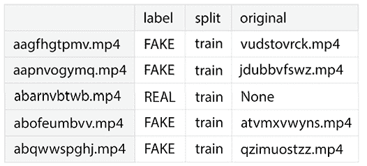

图 9.1：训练样本文件夹中的文件样本

我们还使用来自数据质量、绘图工具、视频工具和面部对象检测实用脚本的一些统计函数来检查元数据的一些统计信息。这些函数在 *第三章* 中介绍。

*图 9.2* 展示了 `meta_train_df` 中的缺失值。如图所示，**19.25**% 的原始字段是缺失的。

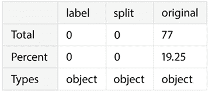

图 9.2：样本训练数据中的缺失值

在 *图 9.3* 中，我们展示了 **meta_train_df** 中的唯一值。有 **323** 个原始值，其中 **209** 个是唯一的。其他两个字段 **label** 和 **split** 有 400 个值，其中 **label** 有 **2** 个唯一值（伪造和真实），**split** 有 **1** 个（训练）。

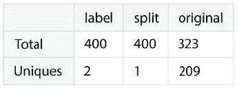

图 9.3：样本训练数据中的唯一值

*图 9.4* 展示了 **meta_train_df** 中最频繁的值。在总共 **400** 个标签中，**323** 个或 **80.75**% 是伪造的。最频繁的 **原始** 值是 **atvmxvwyns.mp4**，频率为 **6**（即，它在 6 个伪造视频中使用了）。**split** 列中的所有值都是 **train**。

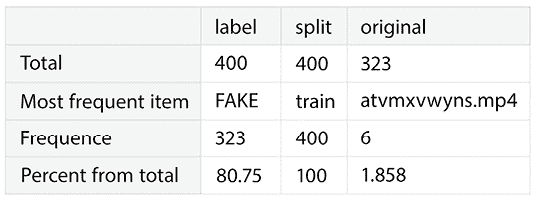

图 9.4：样本训练数据中的最频繁值

在这次分析中，我们将使用自定义颜色方案，包括蓝色和灰度的色调。以下代码块显示了生成自定义颜色图的代码：

```py
color_list = ['#4166AA', '#06BDDD', '#83CEEC', '#EDE8E4', '#C2AFA8']
cmap_custom = set_color_map(color_list) 
```

在*图 9.5*中，我们展示了颜色图。

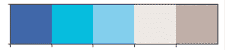

图 9.5：样本训练数据中最频繁的值

*图 9.6*显示了样本训练数据中的**标签**分布。有 323 条记录带有**FAKE**标签，其余标签的值为**REAL**。

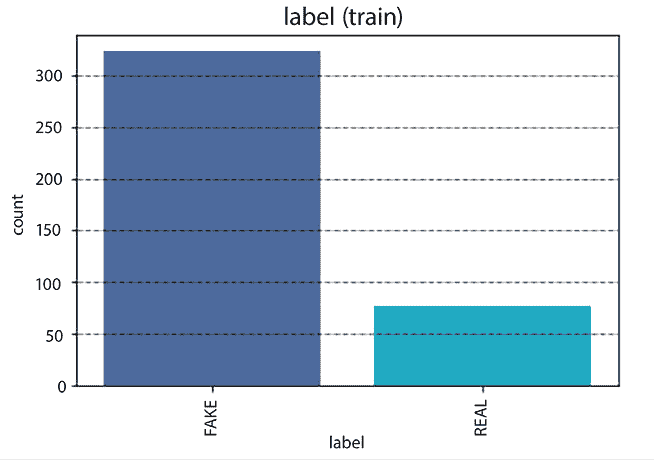

图 9.6：样本训练数据中最频繁的值

在下一节中，我们将开始分析视频数据。

# 视频数据探索

在本节中，我们将可视化一些文件样本，然后我们将开始执行目标检测，试图从图像中捕获在创建深度伪造时可能出现的异常特征。这些主要是眼睛、嘴巴和身体。

我们将首先可视化样本文件，包括真实图像和深度伪造图像。然后，我们将应用之前介绍的第一种算法，用于人脸、眼睛和嘴巴检测，即基于 Haar 级联的算法。接着，我们将使用基于 MTCNN 的替代算法。

## 可视化样本文件

以下代码块从一组假视频中选取一些视频文件，然后使用来自实用脚本`video_utils`的`display_image_from_video`函数可视化它们的图像捕获：

```py
fake_train_sample_video = list(meta_train_df.loc[meta_train_df.label=='FAKE'].sample(3).index)
for video_file in fake_train_sample_video:
    display_image_from_video(os.path.join(DATA_FOLDER, TRAIN_SAMPLE_FOLDER, video_file)) 
```

前面的代码将为三个视频中的每一个绘制一个图像捕获。在*图 9.7*中，我们只展示这些图像捕获中的一个，即第一个视频的：

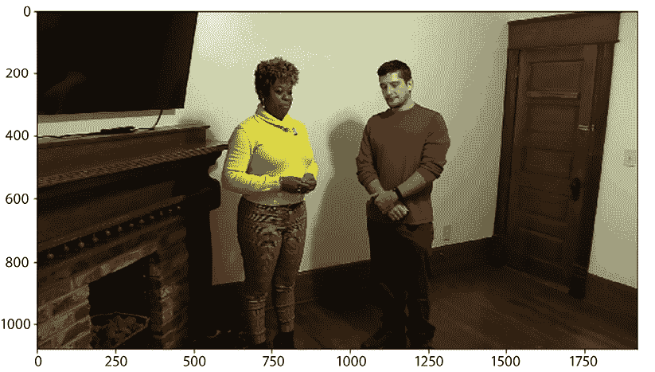

图 9.7：伪造视频的图像捕获示例

下一个代码块选择三个真实视频的样本，然后为每个选定的视频创建并绘制一个图像捕获：

```py
real_train_sample_video = list(meta_train_df.loc[meta_train_df.label=='REAL'].sample(3).index)
for video_file in real_train_sample_video:
    display_image_from_video(os.path.join(DATA_FOLDER, TRAIN_SAMPLE_FOLDER, video_file)) 
```

在*图 9.8*中，我们展示了从第一段真实视频中捕获的一张图像：

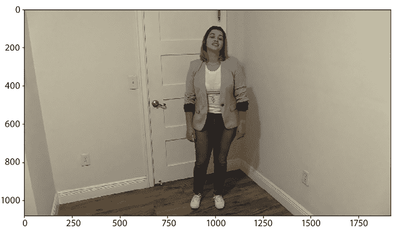

图 9.8：来自真实视频的图像捕获示例

我们还希望检查所有都源自同一原始视频的视频。我们将从同一原始视频中选取六个视频，并展示每个视频的一个图像捕获。以下代码块执行此操作：

```py
same_original_fake_train_sample_video = \
        list(meta_train_df.loc[meta_train_df.original=='meawmsgiti.mp4'].index)
display_images_from_video_list(video_path_list=same_original_fake_train_sample_video,
                               data_folder=DATA_FOLDER,
                               video_folder=TRAIN_SAMPLE_FOLDER) 
```

在*图 9.9*中，我们展示了来自几个不同视频的这些图像捕获中的两个，其中我们使用了相同的原始文件进行深度伪造。


图 9.9：从同一原始文件修改的伪造视频的图像捕获

我们还对测试集的视频进行了类似的检查。当然，在测试集的情况下，我们无法事先知道哪个视频是真实的还是伪造的。以下代码从数据中的两个样本视频中选择了图像捕获：

```py
display_images_from_video_list(test_videos.sample(2).video, DATA_FOLDER, TEST_FOLDER) 
```

*图 9.10* 显示了这些选定的图像：

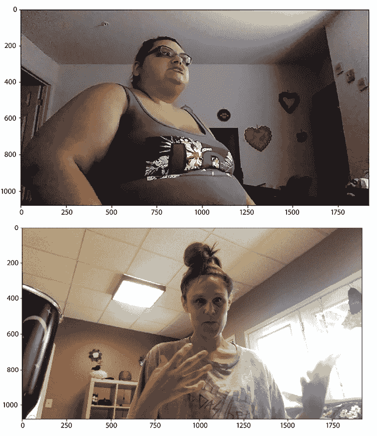

图 9.10：从同一原始文件修改的伪造视频中的图像捕获

让我们现在开始使用**人脸和身体检测**工具部分中介绍的人脸检测算法。

## 执行对象检测

首先，让我们使用来自`face_object_detection`模块的**Haar 级联**算法。我们使用`FaceObjectDetector`对象提取面部、面部轮廓、眼睛和微笑。`CascadeObjectDetector`类初始化上述人员属性的专用级联分类器（使用专用导入的资源）。`detect`函数使用 OpenCV 中的`CascadeClassifier`方法在图像中检测对象。对于每个属性，我们将使用不同的形状和颜色来标记/突出显示提取的对象，如下所示：

+   **正面面部**：绿色矩形

+   **眼睛**：红色圆圈

+   **微笑**：红色矩形

+   **侧面面部**：蓝色矩形

注意，由于大量误报，我们已禁用了微笑检测器。

我们将人脸检测函数应用于训练样本视频中的一些图像。以下代码块执行此操作：

```py
same_original_fake_train_sample_video = \
    list(meta_train_df.loc[meta_train_df.original=='kgbkktcjxf.mp4'].index)
for video_file in same_original_fake_train_sample_video[1:4]:
    print(video_file)
    face_object_detector.extract_image_objects(video_file=video_file,
                          data_folder=DATA_FOLDER,
                          video_set_folder=TRAIN_SAMPLE_FOLDER,
                          show_smile=False 
                          ) 
```

上述代码运行将生成三个不同视频的三个图像捕获。每个图像都装饰了提取的突出显示对象。以下图示显示了带有提取对象的三个图像捕获。在*图 9.11a*中，我们看到了检测到的正面和侧面面部以及一个检测到的眼睛。*图 9.11b*显示了检测到的正面和侧面面部以及两个检测到的眼睛。*图 9.11c*显示了检测到的正面和侧面面部，正确检测到的两个眼睛，以及一个误报（其中一个鼻孔被检测为眼睛）。在这种情况下，微笑检测未激活（误报太多）。


a

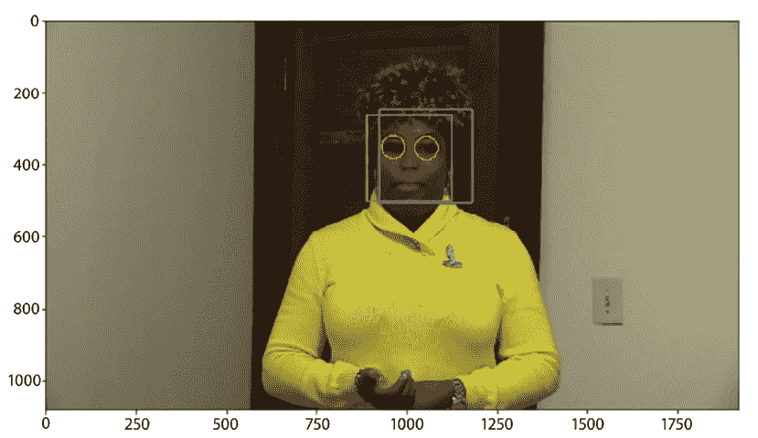

b

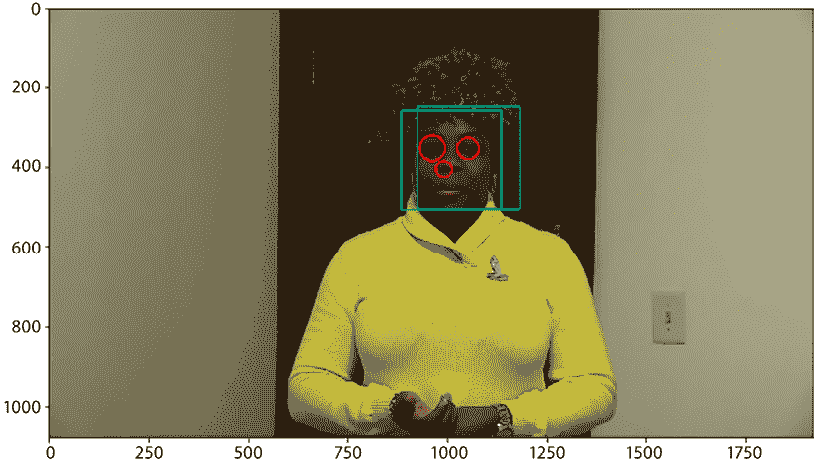

c

图 9.11：从三个不同视频的图像捕获中检测到的面部、面部轮廓和眼睛

使用其他图像运行这些算法，我们可以看到它们并不非常稳健，并且经常产生误报以及不完整的结果。在*图 9.12*中，我们展示了这种不完整检测的两个示例。在*图 9.12a*中，只检测到了面部。在*图 9.12b*中，只检测到了一个面部轮廓，尽管场景中有两个人。

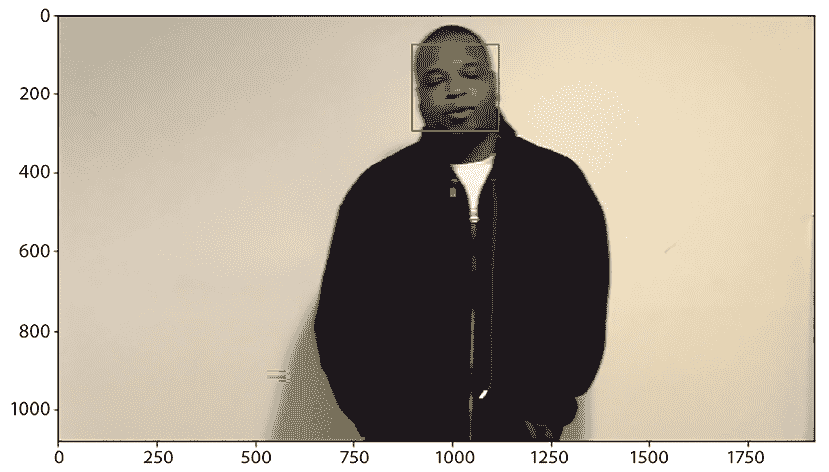

a

*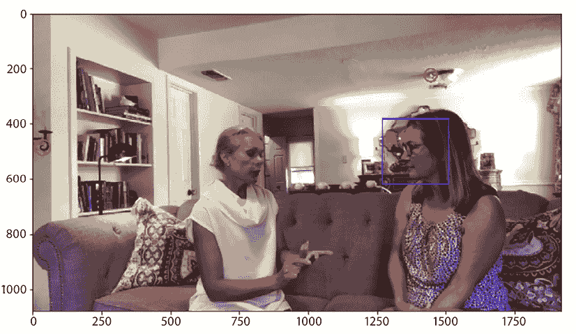*

b

图 9.12：从两个不同视频捕获的图像中的面部、面部轮廓和眼部检测

在前面的图像中，也存在一种奇怪的检测；天花板上的消防喷淋头被检测为眼睛，远左边的烛台也是如此。这类错误检测（假阳性）在这些过滤器中相当常见。一个常见问题是眼睛、鼻子或嘴唇等物体在没有人脸的区域被检测到。由于这些不同物体的搜索是独立进行的，因此出现这种假阳性的可能性相当大。

我们在`face_detection_mtcnn`中实施的替代解决方案使用了一个独特的框架来同时检测人脸边界框和面部元素（如眼睛、鼻子和嘴唇）的位置。让我们比较使用 Haar 级联算法获得的与使用 MTCNN 算法获得的相同图像的结果，如图*图 9.11*和*图 9.12*所示。

在*图 9.13*中，我们展示了一张身穿黄色衣服的人的图像；这次，我们使用的是我们的**MTCNNFaceDetector**进行人脸检测：

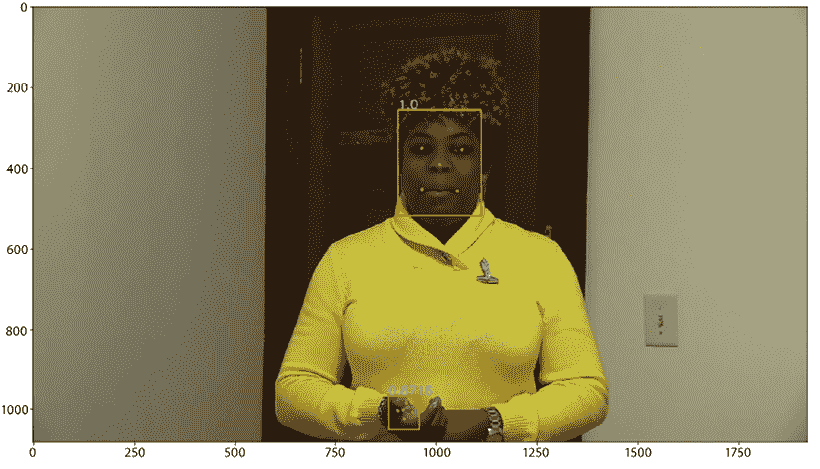

图 9.13：MTCNN 人脸检测：一个真实人脸和一个人工制品的检测

检测到两个面部对象。一个是正确的，另一个是人工制品。检测的 JSON 如下：

```py
Extracted features: {'box': [906, 255, 206, 262], 'confidence': 0.9999821186065674, 'keypoints': {'left_eye': (965, 351), 'right_eye': (1064, 354), 'nose': (1009, 392), 'mouth_left': (966, 453), 'mouth_right': (1052, 457)}}
Extracted features: {'box': [882, 966, 77, 84], 'confidence': 0.871575653553009, 'keypoints': {'left_eye': (905, 1003), 'right_eye': (926, 985), 'nose': (919, 1002), 'mouth_left': (921, 1024), 'mouth_right': (942, 1008)}} 
```

在我们对大量样本进行的实验中，我们得出结论，真实的人脸将有一个非常接近 1 的置信因子。因为第二个检测到的“人脸”置信度为`0.87`，我们可以很容易地将其排除。只有置信因子高于`0.99`的人脸才是可信的。

让我们再看另一个例子。在*图 9.14*中，我们比较了*图 9.12*中相同图像的结果。在这两个图中，场景中所有人的面部都被正确识别。在所有情况下，置信度得分都高于 0.999。没有错误地将人工制品提取为人像。该算法似乎比使用 Haar 级联的替代实现更稳健。

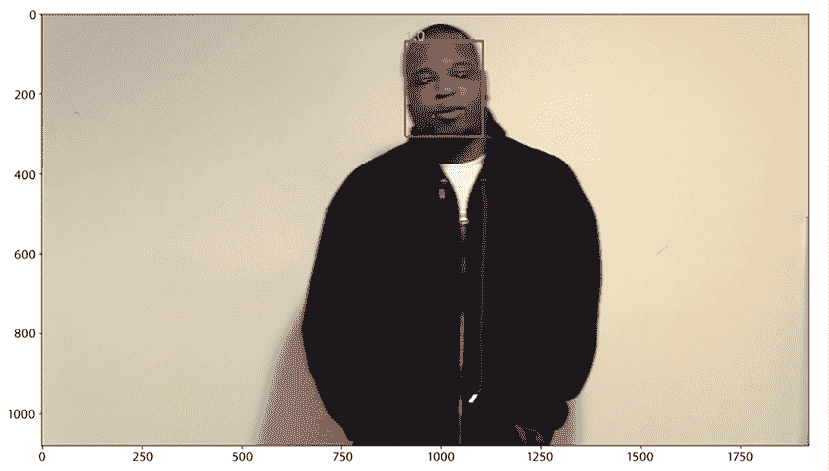

a

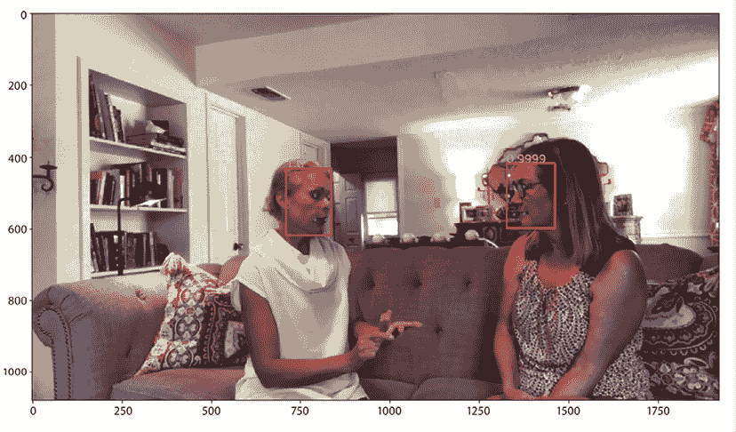

b

图 9.14：MTCNN 人脸检测：一个人和一个两个人的场景

对于下一个例子，我们选择了一个案例，如果视频中存在两个人，那么从视频中捕获的图像中的人脸被正确识别，置信度得分也较高。在同一图像中，还识别了一个被误认为是人脸的人工制品：

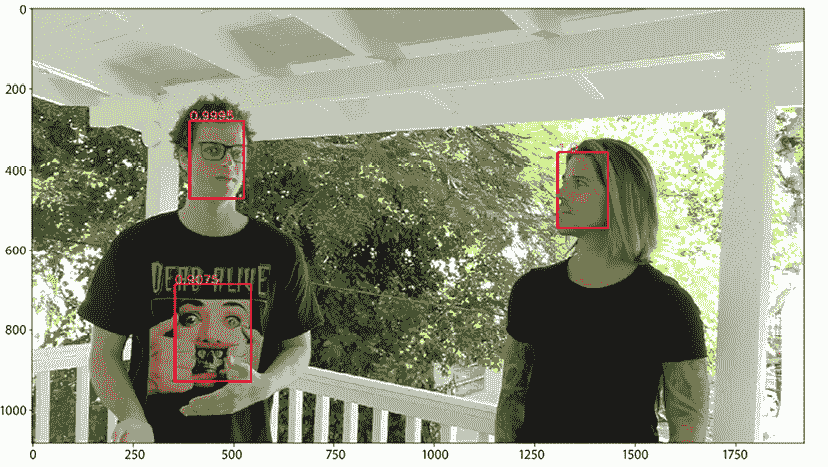

图 9.15：MTCNN 面部检测：两人场景

除了两个真实人物，其置信度因子分别为 0.9995 和 0.9999（四舍五入为 1）之外，场景中第一人 T 恤上的*Dead Alive*角色面部也被检测为面部。边界框被正确检测，所有面部元素也被正确检测。唯一表明这是一个误报的迹象是较低的置信度因子，在这种情况下为 0.9075。这样的例子可以帮助我们正确校准我们的面部检测方法。只有置信度高于 0.95 或甚至 0.99 的面部检测应该被考虑。

在与本章相关的笔记本中，*Deepfake Exploratory Data Analysis* ([`www.kaggle.com/code/gpreda/deepfake-exploratory-data-analysis`](https://www.kaggle.com/code/gpreda/deepfake-exploratory-data-analysis))，我们提供了使用这里介绍的方法进行面部提取的更多示例。

# 摘要

在本章中，我们首先介绍了一系列实用脚本，这些是 Kaggle 上可重用的 Python 模块，用于视频数据处理。其中一个脚本`video_utils`用于可视化视频中的图像并播放它们。另一个脚本`face_object_detection`使用 Haar 级联模型进行面部检测。

第三段脚本`face_detection_mtcnn`使用了 MTCNN 模型来识别面部以及如眼睛、鼻子和嘴巴等关键点。然后我们检查了 DFDC 竞赛数据集的元数据和视频数据。在这个数据集中，我们将上述面部检测方法应用于训练和测试视频中的图像，发现 MTCNN 模型方法更稳健、更准确，且误报率更低。

随着我们接近数据探索的尾声，我们将反思我们通过各种数据格式（包括表格、文本、图像、声音和现在视频）的旅程。我们深入研究了多个 Kaggle 数据集和竞赛数据集，学习了如何进行探索性数据分析、创建可重用代码、为我们的笔记本建立视觉身份，以及用数据编织故事。在某些情况下，我们还引入了特征工程元素并建立了模型基线。在一个案例中，我们展示了逐步细化我们的模型以增强验证指标的过程。前几章和当前章节的重点是制作高质量的 Kaggle 笔记本。

在下一章中，我们将探讨使用 Kaggle 的大型语言模型，可能还会结合其他技术，如 LangChain 和向量数据库。这将展示生成式 AI 在各个应用中的巨大潜力。

# 参考文献

1.  深度伪造检测挑战，Kaggle 竞赛，识别带有面部或声音操纵的视频：[`www.kaggle.com/competitions/deepfake-detection-challenge`](https://www.kaggle.com/competitions/deepfake-detection-challenge)

1.  人脸检测的 Haar 级联，Kaggle 数据集：[`www.kaggle.com/datasets/gpreda/haar-cascades-for-face-detection`](https://www.kaggle.com/datasets/gpreda/haar-cascades-for-face-detection)

1.  Serkan Peldek – 使用 OpenCV 进行人脸检测，Kaggle 笔记本：[`www.kaggle.com/code/serkanpeldek/face-detection-with-opencv/`](https://www.kaggle.com/code/serkanpeldek/face-detection-with-opencv/)

1.  张凯鹏，张占鹏，李志锋，乔宇 – 使用多任务级联卷积网络进行人脸检测与对齐：[`arxiv.org/abs/1604.02878`](https://arxiv.org/abs/1604.02878)

1.  Justin Güse – 使用 MTCNN 进行人脸检测 — 专注于速度的人脸提取指南：[`towardsdatascience.com/face-detection-using-mtcnn-a-guide-for-face-extraction-with-a-focus-on-speed-c6d59f82d49`](https://towardsdatascience.com/face-detection-using-mtcnn-a-guide-for-face-extraction-with-a-focus-on-speed-c6d59f82d49)

# 加入我们书籍的 Discord 空间

加入我们的 Discord 社区，与志同道合的人相聚，并在以下地点与超过 5000 名成员一起学习：

[`packt.link/kaggle`](https://packt.link/kaggle)


