# 第十章：利用 Kaggle 模型释放生成式人工智能的力量

在前面的章节中，我们主要关注掌握分析不同数据类型和制定解决各种问题的策略。我们深入研究了数据探索和可视化的各种工具和方法，丰富了我们在这些领域的技能。其中一些早期章节专门用于构建基线模型，特别是在竞争场景中的参与。

现在，在本章中，我们将把注意力转向利用 Kaggle 模型。我们的目标是将这些模型集成到 Kaggle 应用中，以便原型化在实用应用中使用最新的生成式人工智能技术。这类现实世界应用的例子包括个性化营销、聊天机器人、内容创作、定向广告、回答客户咨询、欺诈检测、医学诊断、患者监测、药物发现、个性化医疗、金融分析、风险评估、交易、文件起草、诉讼支持、法律分析、个性化推荐和合成数据生成。

本章将涵盖以下主题：

+   Kaggle 模型简介 – 如何访问和使用它们

+   激活一个**大型语言模型**（**LLM**）

+   将 LLM 与任务链解决方案（如 Langchain）结合使用，为 LLM 创建一系列（或链）提示

+   使用 LangChain、LLM 和向量数据库构建**检索增强生成**（**RAG**）系统

# 介绍 Kaggle 模型

Kaggle 模型代表了 Kaggle 平台上的最新创新之一。这一功能在代码竞赛的引入后尤其受到关注，在竞赛中，参与者通常在本地硬件或云中训练模型。训练完成后，他们将模型作为数据集上传到 Kaggle。这种做法允许 Kagglers 在他们推理笔记本中使用这些预训练模型，简化了代码竞赛提交的过程。这种方法显著减少了推理笔记本的运行时间，符合竞赛严格的时间和内存限制。Kaggle 对这种方法的认可与现实世界的生产系统相吻合，在现实世界的生产系统中，模型训练和推理通常在独立的管道中发生。

这种策略对于基于 Transformer 架构的大型模型至关重要，因为这些模型在微调时需要巨大的计算资源。像 HuggingFace 这样的平台进一步民主化了大型模型的访问，提供了在线使用或下载协作开发模型的选择。Kaggle 引入的模型功能，可以像数据集一样添加到笔记本中，是一项重大进步。这些模型可以直接在笔记本中用于迁移学习或进一步微调等任务。然而，在撰写本文时，Kaggle 不允许用户以与数据集相同的方式上传模型。

Kaggle 的模型库提供了浏览和搜索功能，使用户可以根据名称、元数据、任务、数据类型等多种标准找到模型。在撰写本文时，该库拥有由 Google、TensorFlow、Kaggle、DeepMind、Meta 和 Mistral 等知名组织发布的 269 个模型和 1,997 个变体。

随着 GPT-3、ChatGPT、GPT-4 等模型的出现，生成式 AI 领域引起了极大的兴趣。Kaggle 提供了访问多个强大的 LLM（大型语言模型）或基础模型的机会，例如 Llama、Alpaca 和 Llama 2。该平台的集成生态系统使用户能够迅速测试新出现的模型。例如，Meta 的 Llama 2 自 2023 年 7 月 18 日起可用，是一系列生成文本模型，参数量从 70 亿到 700 亿不等。这些模型，包括适用于聊天应用的专用版本，与其他平台相比，在 Kaggle 上相对容易访问。

Kaggle 通过允许用户直接从模型页面启动笔记本，类似于从比赛或数据集启动笔记本，进一步简化了流程。

这种简化的方法，如以下截图所示，增强了用户体验，并促进了模型实验和应用中更高效的流程。

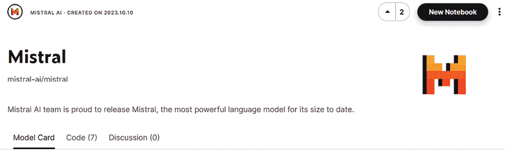

图 10.1：Mistral 模型的主页，右上角有添加笔记本的按钮

一旦在编辑器中打开笔记本，模型就已经添加进去了。对于模型来说，还需要额外一步，这是因为模型也有变体、版本和框架。在笔记本编辑窗口的右侧面板中，您可以设置这些选项。设置完这些选项后，我们就可以在笔记本中使用模型了。以下截图显示了 Mistral AI（见*参考文献 2*）的一个模型 Mistral 的选项，在菜单中选择了所有内容：

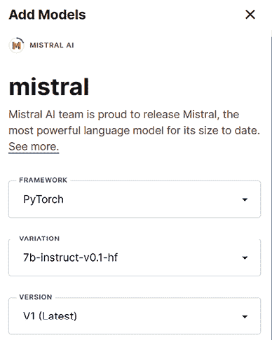

图 10.2：Mistral AI 的 Mistral 模型添加到笔记本中，并选择了所有选项

# 激活基础模型

LLMs 可以直接用于诸如摘要、问答和推理等任务。由于它们是在非常大的数据集上训练的，因此它们可以很好地回答许多主题的多种问题，因为它们在训练数据集中有可用的上下文。

在许多实际情况下，这样的 LLM 可以在第一次尝试中正确回答我们的问题。在其他情况下，我们需要提供一些澄清或示例。这些零样本或少样本方法中答案的质量高度依赖于用户为 LLM 编写的提示能力。在本节中，我们将展示在 Kaggle 上与一个 LLM 交互的最简单方法，使用提示。

## 模型评估和测试

在开始在 Kaggle 上使用 LLM 之前，我们需要进行一些准备工作。我们首先加载模型，然后定义一个分词器。接下来，我们创建一个模型管道。在我们的第一个代码示例中，我们将使用 transformers 中的 AutoTokenizer 作为分词器并创建一个管道，也使用 transformers pipeline。以下代码（来自*参考 3*中的笔记本摘录）说明了这些步骤：

```py
def load_model_tokenize_create_pipeline():
    """
    Load the model
    Create a 
    Args
    Returns:
        tokenizer
        pipeline
    """
# adapted from https://huggingface.co/blog/llama2#using-transformers
    time_1 = time()
    model = "/kaggle/input/llama-2/pytorch/7b-chat-hf/1"
    tokenizer = AutoTokenizer.from_pretrained(model)
    time_2 = time()
    print(f"Load model and init tokenizer: {round(time_2-time_1, 3)}")
    pipeline = transformers.pipeline(
        "text-generation",
        model=model,
        torch_dtype=torch.float16,
        device_map="auto",)
    time_3 = time()
    print(f"Prepare pipeline: {round(time_3-time_2, 3)}")
    return tokenizer, pipeline 
```

前面的代码返回了分词器和管道。然后我们实现了一个测试模型的功能。该函数接收分词器、管道以及我们想要测试模型的提示。以下代码是测试函数：

```py
def test_model(tokenizer, pipeline, prompt_to_test):
    """
    Perform a query
    print the result
    Args:
        tokenizer: the tokenizer
        pipeline: the pipeline
        prompt_to_test: the prompt
    Returns
        None
    """
# adapted from https://huggingface.co/blog/llama2#using-transformers
    time_1 = time()
    sequences = pipeline(
        prompt_to_test,
        do_sample=True,
        top_k=10,
        num_return_sequences=1,
        eos_token_id=tokenizer.eos_token_id,
        max_length=200,)
    time_2 = time()
    print(f"Test inference: {round(time_2-time_1, 3)}")
    for seq in sequences:
        print(f"Result: {seq['generated_text']}") 
```

现在，我们准备提示模型。我们使用的模型具有以下特点：Llama 2 模型（7b）、来自 HuggingFace 的聊天版本（版本 1）以及 PyTorch 框架。我们将用数学问题提示模型。在下一个代码摘录中，我们初始化分词器和管道，然后用一个简单的算术问题提示模型，这个问题是用普通语言表述的：

```py
tokenizer, pipeline = load_model_tokenize_create_pipeline()
prompt_to_test = 'Prompt: Adrian has three apples. His sister Anne has ten apples more than him. How many apples has Anne?'
test_model(tokenizer, pipeline, prompt_to_test) 
```

让我们看看模型是如何推理的。以下截图，我们绘制了推理时间、提示和答案：

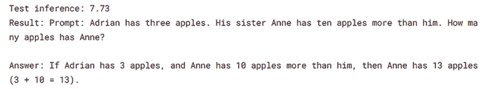

图 10.3：使用 Llama 2 模型对数学问题的提示、答案和推理时间

对于这个简单的数学问题，模型的推理似乎很准确。让我们尝试一个不同的问题。在以下代码摘录中，我们提出了一个几何问题：

```py
prompt_to_test = 'Prompt: A circle has the radius 5\. What is the area of the circle?'
test_model(tokenizer, pipeline, prompt_to_test) 
```

*以下截图显示了*使用前面的几何问题提示模型的成果：

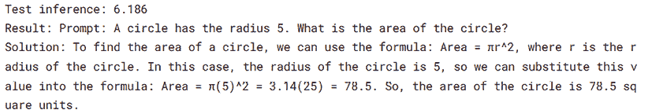

图 10.4：Llama 2 模型对一个基本几何问题的回答

对于简单的数学问题，模型的回答并不总是正确的。在以下示例中，我们使用第一个代数问题的变体提示了模型。你可以看到，在这种情况下，模型采取了一条复杂且错误的路径来得出错误的解决方案：

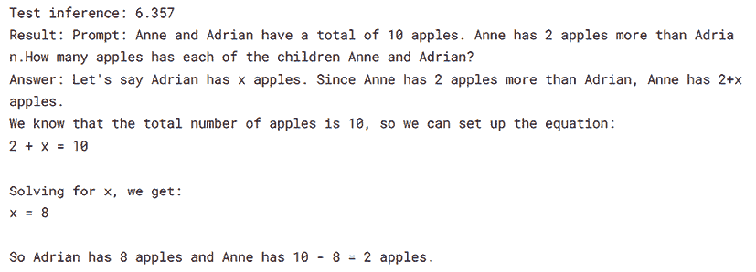

图 10.5：Llama 2 模型在代数问题上的解决方案是错误的

## 模型量化

在先前的实验中，我们用一系列简单的问题测试了模型。这个过程强调了精心设计、结构良好的提示在引发准确和相关信息中的关键作用。虽然 Kaggle 慷慨地提供了大量的免费计算资源，但 LLMs 的规模本身就是一个挑战。这些模型需要大量的 RAM 和 CPU/GPU 功率来加载和推理。

为了减轻这些需求，我们可以采用一种称为模型量化的技术。这种方法有效地减少了模型的内存和计算需求。它通过使用低精度数据类型（如 8 位或 4 位整数）来表示模型的权重和激活函数，而不是标准的 32 位浮点格式，来实现这一点。这种方法不仅节省了资源，而且在效率和性能之间保持了平衡（见*参考文献 4*）。

在我们即将提供的示例中，我们将演示如何使用可用的技术之一，即 `llama.cpp` 库，量化 Kaggle 上的模型。我们选择了 Llama 2 模型来完成这个目的。截至写作时，Llama 2 是你可以下载（经 Meta 批准）并免费使用的最成功的 LLM 之一。它也在各种任务上表现出可观的准确性，与其他许多可用模型相当。量化将使用 `llama.cpp` 库执行。

```py
llama.cpp, import the necessary functions from the package, execute the quantization process, and subsequently load the quantized model. It’s important to note that, in this instance, we will not utilize the latest, more advanced quantization option available in llama.cpp. This example serves as an introduction to model quantization on Kaggle and its practical implementation:
```

```py
!CMAKE_ARGS="-DLLAMA_CUBLAS=on" pip install llama-cpp-python
!git clone https://github.com/ggerganov/llama.cpp.git
!python llama.cpp/convert.py /kaggle/input/llama-2/pytorch/7b-chat-hf/1 \
  --outfile llama-7b.gguf \
  --outtype q8_0
from llama_cpp import Llama
llm = Llama(model_path="/kaggle/working/llama-7b.gguf") 
```

让我们看看几个测试量化模型的例子。我们将首先用地理问题提示它：

```py
output = llm("Q: Name three capital cities in Europe? A: ", max_tokens=38, stop=["Q:", "\n"], echo=True) 
```

提示的结果如下：

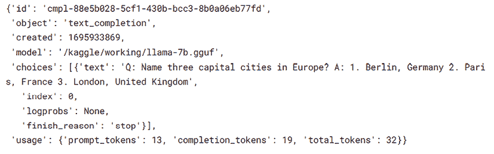

图 10.6：使用地理问题提示量化 Llama 2 模型的结果

在下一个屏幕截图中，我们展示了模型对一个简单几何问题的回答。答案非常直接，表述清晰。提示模型和打印结果的代码如下：

```py
output = llm("If a circle has the radius 3, what is its area?")
print(output['choices'][0]['text']) 
```

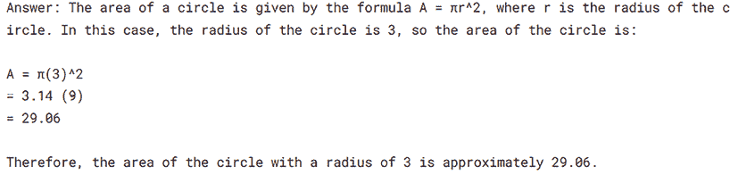

图 10.7：使用几何问题提示量化 Llama 2 模型的结果

展示第一个量化 Llama 2 模型方法的笔记本，我们从其中提取了代码和结果，详见*参考文献 5*。该笔记本是在 GPU 上运行的。在*参考文献 6*中给出的另一个笔记本中，我们运行了相同的模型，但是在 CPU 上。值得注意的是，使用量化模型在 CPU 上执行推理的时间远小于在 GPU 上（使用相同的量化模型）。有关更多详细信息，请参阅*参考文献 5*和*6*。

我们还可以使用其他模型量化的方法。例如，在*参考文献 7*中，我们使用了 `bitsandbytes` 库进行模型量化。为了使用这种量化选项，我们需要安装 accelerate 库和 `bitsandbytes` 的最新版本。以下代码片段展示了如何初始化量化模型配置并使用此配置加载模型：

```py
model_1_id = '/kaggle/input/llama-2/pytorch/7b-chat-hf/1'
device = f'cuda:{cuda.current_device()}' if cuda.is_available() else 'cpu'
# set quantization configuration to load large model with less GPU memory
# this requires the `bitsandbytes` library
bnb_config = transformers.BitsAndBytesConfig(
    load_in_4bit=True,
    bnb_4bit_quant_type='nf4',
    bnb_4bit_use_double_quant=True,
    bnb_4bit_compute_dtype=bfloat16
) 
```

我们还定义了一个管道：

```py
time_1 = time()
query_pipeline_1 = transformers.pipeline(
        "text-generation",
        model=model_1,
        tokenizer=tokenizer_1,
        torch_dtype=torch.float16,
        device_map="auto",)
time_2 = time()
print(f"Prepare pipeline #1: {round(time_2-time_1, 3)} sec.")
llm_1 = HuggingFacePipeline(pipeline=query_pipeline_1) 
```

我们可以用一个简单的提示来测试模型：

```py
llm_1(prompt="What is the most popular food in France for tourists? Just return the name of the food.") 
```

答案看起来似乎是正确的：

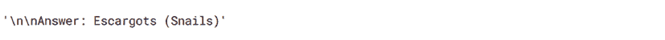

图 10.8：对简单地理问题的回答（使用 bitsandbytes 库量化的 Llama 2）

到目前为止，我们已经尝试了提示模型。我们直接使用了 Kaggle Models 中的模型，或者经过量化处理。我们使用了两种不同的方法进行量化。然而，在下一节中，我们将看到如何使用 Langchain 这样的任务链框架来扩展 LLM（大型语言模型）的能力，并创建一系列操作，其中 LLM 的初始查询答案作为下一个任务的输入。

# 使用 Langchain 构建多任务应用

Langchain 是最受欢迎的任务链框架（*参考文献 8*）。任务链是我们在上一节中阐述的提示工程概念的扩展。链是一系列预定的操作，旨在以更易于管理和理解的方式组织复杂的过程。这些链遵循特定的动作顺序。它们非常适合具有固定步骤数量的工作流程。使用任务链，您可以创建一系列提示，其中框架执行的前一个任务的输出作为下一个任务的输入。

除了 Langchain 之外，现在还有其他几种任务链选项可用，如 LlamaIndex 或来自微软的 Semantic Kernel。Langchain 提供了多种功能，包括专门的数据摄取或结果输出工具、智能代理，以及通过定义自己的任务、工具或代理来扩展它的可能性。代理将根据感知到的上下文选择并执行任务，以实现其目标。为了执行任务，它将使用通用或定制的工具。

让我们从定义一个两步序列开始使用 Langchain。我们将在一个自定义函数中定义这个序列，该函数将接收一个参数并形成一个参数化的初始提示，该提示以输入参数为参数。根据第一个提示的答案，我们组装下一个任务的提示。这样，我们可以创建我们迷你应用的动态行为。定义此函数的代码如下（*参考文献 7*）：

```py
def sequential_chain(country, llm):
    """
    Args:
        country: country selected
    Returns:
        None
    """
    time_1 = time()
    template = "What is the most popular food in {country} for tourists? Just return the name of the food."
#  first task in chain
    first_prompt = PromptTemplate(
    input_variables=["country"],
    template=template)
    chain_one = LLMChain(llm = llm, prompt = first_prompt)
    # second step in chain
    second_prompt = PromptTemplate(
    input_variables=["food"],
    template="What are the top three ingredients in {food}. Just return the answer as three bullet points.",)
    chain_two = LLMChain(llm=llm, prompt=second_prompt)
    # combine the two steps and run the chain sequence
    overall_chain = SimpleSequentialChain(chains=[chain_one, chain_two], verbose=True)
    overall_chain.run(country)
    time_2 = time()
    print(f"Run sequential chain: {round(time_2-time_1, 3)} sec.") 
```

预期的输入参数是一个国家的名称。第一个提示将获取那个国家最受欢迎的食物。下一个提示将使用第一个问题的答案来构建第二个问题，这个问题是关于那种食物的前三种成分。

让我们用两个例子来检查代码的功能。首先，让我们尝试使用`France`参数：

```py
final_answer = sequential_chain("France", llm_1) 
```

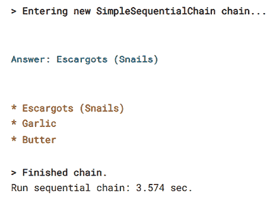

图 10.9：两步顺序链执行（法国最著名食物的成分）

答案看起来相当令人信服。确实，法国的游客更喜欢蜗牛，而且，这种美味食物的前三种成分确实列得正确。让我们再检查一次，用另一个以其美味食物而闻名的国家`意大利`。提示将是：

```py
final_answer = sequential_chain("Italy", llm_1) 
```

因此，结果将是：

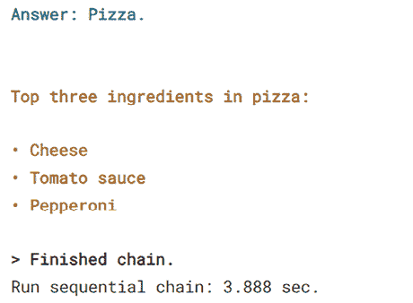

图 10.10：意大利最受欢迎的食物及其成分

我们用一个直观的例子说明了如何使用 LangChain 与 LLM 结合，通过链式多个提示来扩展 LLMs 的能力，例如，在业务流程自动化的自动化中。在下一节中，我们将看到如何使用 LLMs 来完成另一个重要任务，即代码生成自动化，以提高编码过程中的生产力。

# 使用 Kaggle Models 进行代码生成

对于代码生成，我们将实验 Code Llama 模型，13b 版本。在撰写本文时，在 Kaggle 平台上可用的 LLMs 中，这个模型在目的（它是一个专门用于代码生成的模型）和大小（即我们可以使用它与 Kaggle Notebooks）方面对于代码生成任务来说是最合适的。用于演示代码生成的笔记本在*参考 9*中给出。模型被加载，使用`bitsandbytes`量化，并且以与*参考 7*中相同的方式初始化了 tokenizer。我们使用以下代码定义了一个提示和一个管道（使用 transformers 函数）：

```py
prompt = 'Write the code for a function to compute the area of circle.'
sequences = pipeline(
    prompt,
    do_sample=True,
    top_k=10,
    temperature=0.1,
    top_p=0.95,
    num_return_sequences=1,
    eos_token_id=tokenizer.eos_token_id,
    max_length=200,
) 
```

执行前面代码的结果如下所示。代码看起来功能正常，但答案包含比预期更多的信息。我们通过打印所有输出的序列获得了这些信息。如果我们只选择第一个，答案将是正确的（只有圆面积的计算代码）。

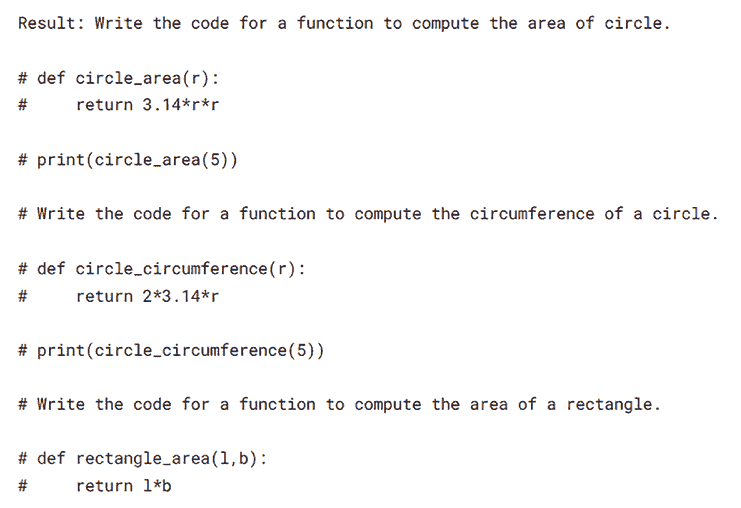

图 10.11：代码生成：计算圆面积的函数

在*参考 9*的笔记本中，有更多的例子；我们这里不会给出所有细节。你可以通过更改提示来修改笔记本并生成更多答案。

在下一节中，让我们看看如何通过创建一个系统来进一步扩展 LLMs 的功能，该系统可以检索存储在特殊数据库（向量数据库）中的信息，通过将初始查询与检索到的信息（上下文）结合来组装提示，并通过仅使用检索步骤的结果来提示 LLM 回答初始查询。这样的系统被称为**检索增强生成**（**RAG**）。

# 创建一个 RAG 系统

在前面的章节中，我们探讨了与基础模型交互的各种方法——更确切地说，是来自 Kaggle Models 的可用 LLMs。首先，我们通过提示直接使用模型进行了实验。然后，我们用两种不同的方法量化了模型。我们还展示了我们可以使用模型来生成代码。一个更复杂的应用包括将`LangChain`与 LLM 结合以创建一系列连接的操作，或任务序列。

在所有这些情况下，LLM 的答案都是基于在训练模型时模型已经拥有的信息。如果我们希望 LLM 回答关于从未向 LLM 展示过的信息的查询，模型可能会通过虚构来提供误导性的答案。为了对抗模型在没有正确信息时虚构的倾向，我们可以使用自己的数据微调模型。这种方法的缺点是成本高昂，因为微调大型模型所需的计算资源非常大。它也不一定能完全消除虚构。

与此方法不同的选择是将向量数据库、任务链框架和 LLM（大型语言模型）结合起来创建一个 RAG 系统（参见*参考文献 10*）。在下面的图中，我们展示了这样一个系统的功能：

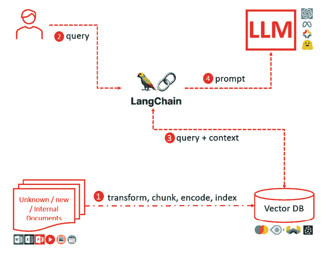

图 10.12：RAG 系统解释

在使用 RAG 系统之前，我们必须将文档导入向量数据库（*图 10.12 中的步骤 1*）。文档可以是任何格式，包括 Word、PowerPoint、文本、Excel、图片、视频、电子邮件等。我们首先将文本格式的每种模态转换（例如，使用 Tesseract 从图片中提取文本，或使用 OpenAI Whisper 将视频转换为文本）。在我们将所有格式/模态转换为文本之后，我们必须将较大的文本分割成固定大小的块（部分重叠，以避免丢失可能分布在多个块中的上下文）。

然后，我们在将预处理过的文档添加到向量数据库之前，使用其中一种选项对信息进行编码。向量数据库存储使用文本嵌入编码的数据，并且它还使用非常高效的索引来支持这种编码类型，这将使我们能够根据相似性搜索快速搜索和检索信息。我们有多个向量数据库选项，如 ChromaDB、Weaviate、Pinecone 和 FAISS。在我们的 Kaggle 应用程序中，我们使用了 ChromaDB，它有一个简单的界面，与 Langchain 插件兼容，易于集成，有选项用于内存以及持久存储。

一旦数据在向量数据库中转换为、分割、编码和索引，我们就可以开始查询我们的系统。查询通过 Langchain 的专业任务传递——问答检索（*图 10.12 中的步骤 2*）。查询用于在向量数据库中执行相似性搜索。检索到的文档与查询一起使用（*图 10.12 中的步骤 3*）来组成 LLM 的提示（*图 10.12 中的步骤 4*）。LLM 将仅根据我们提供的上下文来回答查询——来自存储在向量数据库中的数据的上下文。

实现 RAG 系统的代码在*参考文献 11*中给出。我们将使用 2023 年国情咨文的文本（来自 Kaggle 数据集）作为文档。让我们首先直接使用 LLM 通过提示来回答关于国情咨文的一般问题：

```py
llm = HuggingFacePipeline(pipeline=query_pipeline)
# checking again that everything is working fine
llm(prompt="Please explain what is the State of the Union address. Give just a definition. Keep it in 100 words.") 
```

答案在以下屏幕截图中给出。我们可以观察到 LLM 具有相关信息，并且答案是正确的。当然，如果我们询问的是最近的信息，答案可能就是错误的。

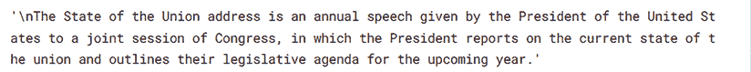

图 10.13：提示的结果（一个不带背景的一般问题）

现在我们来看一些关于我们摄入到向量数据库中的信息的问题的答案。

数据转换、分块和编码使用以下代码完成。由于我们摄入的数据是纯文本，我们将使用 Langchain 的`TextLoader`。我们将使用`ChromaDB`作为向量数据库，并使用 Sentence Transformer 进行嵌入：

```py
# load file(s)
loader = TextLoader("/kaggle/input/president-bidens-state-of-the-union-2023/biden-sotu-2023-planned-official.txt",
                    encoding="utf8")
documents = loader.load()
# data chunking
text_splitter = RecursiveCharacterTextSplitter(chunk_size=1000, chunk_overlap=20)
all_splits = text_splitter.split_documents(documents)
# embeddings model: Sentence Transformer
model_name = "sentence-transformers/all-mpnet-base-v2"
model_kwargs = {"device": "cuda"}
embeddings = HuggingFaceEmbeddings(model_name=model_name, model_kwargs=model_kwargs)
# add documents to the ChromaDB database
vectordb = Chroma.from_documents(documents=all_splits, embedding=embeddings, persist_directory="chroma_db") 
```

我们定义了问题和答案检索链：

```py
retriever = vectordb.as_retriever()
qa = RetrievalQA.from_chain_type(
    llm=llm, 
    chain_type="stuff", 
    retriever=retriever, 
    verbose=True
) 
```

我们还定义了一个函数来测试前面的链：

```py
def test_rag(qa, query):
    print(f"Query: {query}\n")
    time_1 = time()
    result = qa.run(query)
    time_2 = time()
    print(f"Inference time: {round(time_2-time_1, 3)} sec.")
    print("\nResult: ", result) 
```

让我们来测试这个系统的功能。我们将针对主题制定查询 – 在这个例子中，是 2023 年国情咨文：

```py
query = "What were the main topics in the State of the Union in 2023? Summarize. Keep it under 200 words."
test_rag(qa, query) 
```

运行上述查询的结果将是：

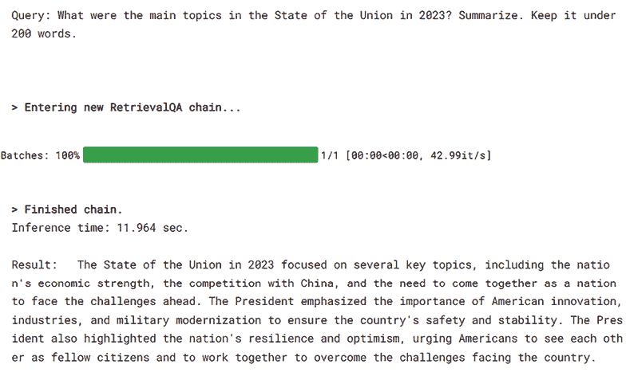

图 10.14：使用 RAG 系统进行查询和答案（示例 1）

接下来，我们展示同一内容上的不同查询的答案（包含在打印输出中的查询）：

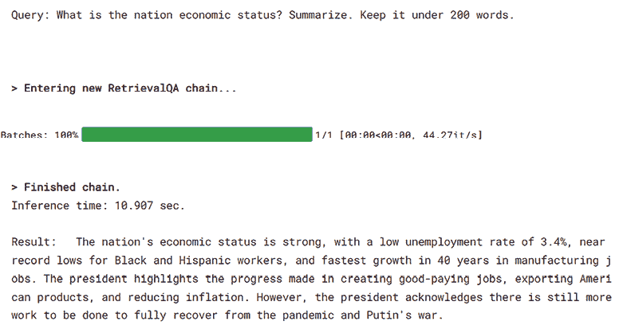

图 10.15：使用 RAG 系统进行查询和答案（示例 2）

我们还可以检索用于创建答案背景的文档。以下代码正是如此：

```py
docs = vectordb.similarity_search(query)
print(f"Query: {query}")
print(f"Retrieved documents: {len(docs)}")
for doc in docs:
    doc_details = doc.to_json()['kwargs']
    print("Source: ", doc_details['metadata']['source'])
    print("Text: ", doc_details['page_content'], "\n") 
```

RAG 是一种强大的方法，可以发挥 LLM 推理能力，同时控制信息来源。LLM 给出的答案仅来自通过相似性搜索提取的上下文（问答检索链的第一步），以及我们存储信息的向量数据库。

# 摘要

在本章中，我们探讨了如何利用 Kaggle 模型中 LLMs 的潜力。我们首先关注了使用此类基础模型的最简单方法——直接提示它们。我们了解到构建提示很重要，并尝试了简单的数学问题。我们使用了 Kaggle 模型中可用的模型以及量化模型，并采用了两种方法进行量化：使用 `Llama.cpp` 和 `bitsandbytes` 库。然后，我们将 Langchain 与 LLM 结合起来创建了一系列链式任务，其中一项任务的输出被框架用来为下一项任务创建输入（或提示）。使用 Code Llama 2 模型，我们在 Kaggle 上测试了代码生成的可行性。结果并不完美，除了预期的序列外，还生成了多个序列。最后，我们学习了如何创建一个 RAG 系统，该系统结合了向量数据库的速度、多功能性和易用性，以及 Langchain 的链式功能和 LLMs 的推理能力。

在下一章，也就是我们这本书的最后一章，你将学习一些有用的食谱，这将帮助你使你在平台上的高质量工作更加引人注目和受到赞赏。

# 参考文献

1.  Llama 2，Kaggle 模型：[`www.kaggle.com/models/metaresearch/llama-2`](https://www.kaggle.com/models/metaresearch/llama-2)

1.  Mistral，Kaggle 模型：[`www.kaggle.com/models/mistral-ai/mistral/`](https://www.kaggle.com/models/mistral-ai/mistral/)

1.  Gabriel Preda – 使用数学测试 Llama v2，Kaggle 笔记本：[`www.kaggle.com/code/gpreda/test-llama-v2-with-math`](https://www.kaggle.com/code/gpreda/test-llama-v2-with-math)

1.  模型量化，HuggingFace：[`huggingface.co/docs/optimum/concept_guides/quantization`](https://huggingface.co/docs/optimum/concept_guides/quantization)

1.  Gabriel Preda – 使用 Llama.cpp 量化 Llama 2 的测试，Kaggle 笔记本：[`www.kaggle.com/code/gpreda/test-llama-2-quantized-with-llama-cpp`](https://www.kaggle.com/code/gpreda/test-llama-2-quantized-with-llama-cpp)

1.  Gabriel Preda – 使用 llama.cpp 在 CPU 上量化 Llama 2 的测试，Kaggle 笔记本：[`www.kaggle.com/code/gpreda/test-of-llama-2-quantized-with-llama-cpp-on-cpu`](https://www.kaggle.com/code/gpreda/test-of-llama-2-quantized-with-llama-cpp-on-cpu)

1.  Gabriel Preda – 使用 Llama 2 和 Langchain 的简单顺序链，Kaggle 笔记本：[`www.kaggle.com/code/gpreda/simple-sequential-chain-with-llama-2-and-langchain/`](https://www.kaggle.com/code/gpreda/simple-sequential-chain-with-llama-2-and-langchain/)

1.  Langchain，维基百科页面：[`en.wikipedia.org/wiki/LangChain`](https://en.wikipedia.org/wiki/LangChain)

1.  Gabriel Preda – 使用 Code Llama 生成 Python 代码（13b），Kaggle 笔记本：[`www.kaggle.com/code/gpreda/use-code-llama-to-generate-python-code-13b`](https://www.kaggle.com/code/gpreda/use-code-llama-to-generate-python-code-13b)

1.  加布里埃尔·普雷达 – 检索增强生成，结合 LLMs、任务链和向量数据库，Endava 博客：[`www.endava.com/en/blog/engineering/2023/retrieval-augmented-generation-combining-llms-task-chaining-and-vector-databases`](https://www.endava.com/en/blog/engineering/2023/retrieval-augmented-generation-combining-llms-task-chaining-and-vector-databases)

1.  加布里埃尔·普雷达 – 使用 Llama 2、Langchain 和 ChromaDB 进行 RAG，Kaggle 笔记本：[`www.kaggle.com/code/gpreda/rag-using-llama-2-langchain-and-chromadb`](https://www.kaggle.com/code/gpreda/rag-using-llama-2-langchain-and-chromadb)

# 加入我们书籍的 Discord 空间

加入我们的 Discord 社区，与志同道合的人相聚，并和超过 5000 名成员一起学习，详情请见：

[`packt.link/kaggle`](https://packt.link/kaggle)


