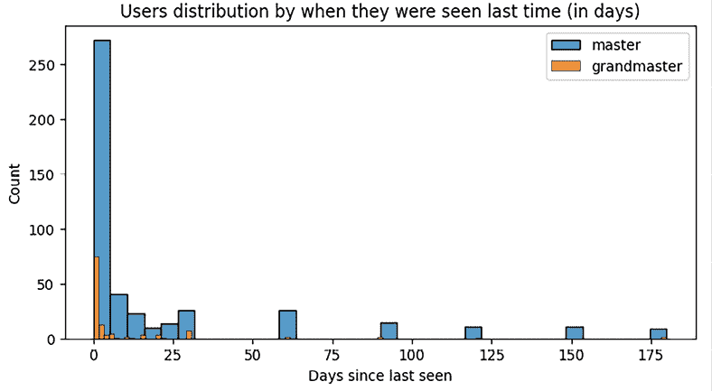
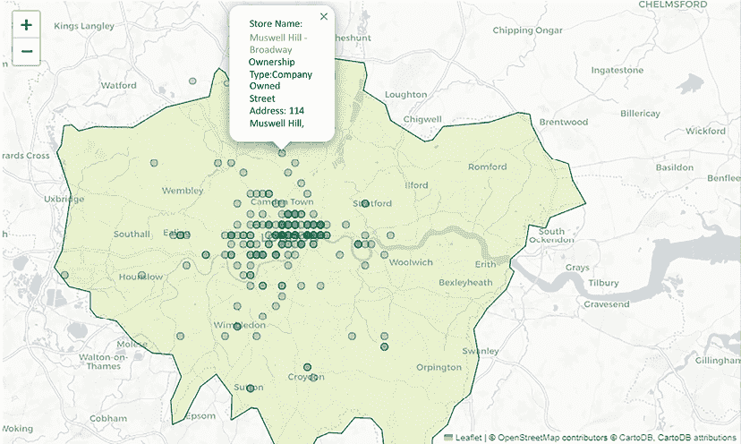
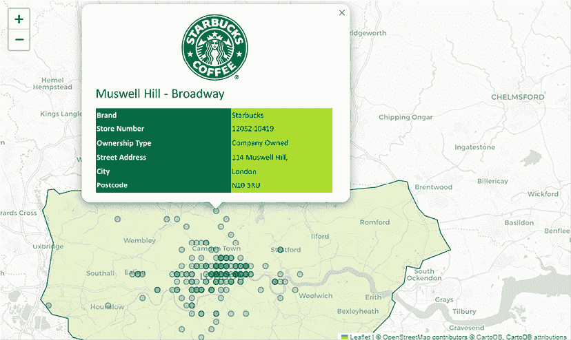

# 11

# 结束我们的旅程：如何保持相关性和领先地位

我们接近了通过数据科学领域的启迪之旅的尾声，我们已经穿越了多样化的挑战领域，从地理空间分析到自然语言处理，再到图像分类和时间序列预测。这次探险丰富了我们对如何巧妙结合各种尖端技术的理解。我们深入研究了大型语言模型，例如 Kaggle 开发的模型，探索了向量数据库，并发现了任务链框架的效率，所有这些都是为了利用生成式 AI 的变革潜力。

我们的学习之旅还包括处理各种数据类型和格式。我们参与了特征工程，构建了几个基线模型，并掌握了迭代优化这些模型的能力。这个过程对于掌握综合数据分析所必需的众多工具和技术至关重要。

除去技术层面，我们已拥抱数据可视化的艺术。我们不仅学习了技术，还学会了如何根据每个独特的数据集和分析调整风格和视觉效果。此外，我们还探索了如何围绕数据构建引人入胜的故事，从而超越单纯的报告技术，让数据生动起来。

在本章中，我打算分享一些有见地的想法、技巧和窍门。这些不仅可以帮助你在创建有价值且影响深远的数据科学笔记本方面达到精通，还可以帮助你获得对你工作的认可。通过这些指南，你可以确保你的工作脱颖而出，帮助你保持在不断发展的数据科学领域的领先地位。

# 向最佳学习：观察成功的宗师

在本书的前几章中，我们探讨了各种分析方法、可视化工具和定制选项。这些技术被我和许多其他尊敬的 Kaggle 笔记本宗师有效地利用。我成为第 8 位笔记本宗师并长期保持前三名排名，不仅仅是因为深入分析、高质量的视觉或在我的笔记本中构建引人入胜的故事。这同样是对坚持少数最佳实践的证明。

当我们深入研究这些最佳实践时，我们将了解是什么让成功的 Kagglers 与众不同，特别是 Kaggle 笔记本大师和宗师。让我们从一份迷人的数据集的硬证据开始：*Meta Kaggle 大师成就快照*。这个数据集（见*参考文献 1*）包含两个文件：一个详细描述成就，另一个描述用户：

+   在成就文件中，我们看到 Kagglers 在**竞赛**、**数据集**、**笔记本**和**讨论**类别中达到的层级，以及他们在所有这些类别中的最高排名。此文件仅包括在 Kaggle 四个类别中至少达到 Master 层级的用户。

+   第二个文件提供了这些用户的详细资料，包括头像、地址、国家、地理坐标以及从他们的个人资料中提取的元数据。这些元数据提供了他们对 Kaggle 的任期以及他们在平台上最近的活动情况，例如“13 年前加入，过去一天内最后一次出现。”

我们将分析这些用户在平台上的“最后看到”的天数，并检查 Notebooks 类别中的 Masters 和 Grandmasters 对此指标的分布。解析和提取此信息的代码在此提供，为我们提供了深入了解顶级 Kagglers 习惯和参与度的宝贵窗口：

```py
profiles_df["joined"] = profiles_df["Metadata"].apply(lambda x: x.split(" · ")[0])
profiles_df["last_seen"] = profiles_df["Metadata"].apply(lambda x: x.split(" · ")[1])
def extract_last_seen(last_seen):
    """
    Extract and return when user was last time seen
    Args:
        last_seen: the text showing when user was last time seen
    Returns:
        number of days from when the user was last time seen
    """
    multiplier = 1
    last_seen = re.sub("last seen ", "", last_seen)
    if last_seen == "in the past day":
        return 0
    last_seen = re.sub(" ago", "", last_seen)
    quantity, metric = last_seen.split(" ")
    if quantity == "a":
        quantity = 1
else:
        quantity = int(quantity)
    if metric == "year" or metric == "years":
        multiplier = 356
elif metric == "month" or metric == "months":
        multiplier = 30
return quantity * multiplier
profiles_df["tenure"] = profiles_df["joined"].apply(lambda x: extract_tenure(x))
profiles_df["last_seen_days"] = profiles_df["last_seen"].apply(lambda x: extract_last_seen(x)) 
```

我们以天为单位给出结果。让我们可视化 Notebooks 类别中 Masters 和 Contributors 最后被看到的天数分布。为了清晰起见，我们移除了在过去 6 个月内没有出现过的用户。我们认为这些用户目前不活跃，其中一些用户在平台上最后一次出现的时间长达 10 年前。

同时，过去 6 个月内没有出现过的用户（来自 Notebooks 类别的 Masters 和 Grandmasters）的比例为 6%。对于 Notebooks 类别中其余 94%的 Masters 和 Grandmasters，我们展示了与最后看到的天数相关的分布，如图*11.1*所示。



图 11.1：Kaggle 平台上用户最后出现的天数的分布

我们可以很容易地看出，Notebooks 类别中的大多数 Masters 和 Grandmasters 每天都会访问平台（最后看到的天数为 0 意味着他们在当天也是活跃的）。因此，每天在线是大多数成功 Masters 和 Grandmasters 的一个属性。我可以从我个人的经验中证实，在我成为 Master 然后成为 Grandmaster 的过程中，我几乎每天都在平台上活跃，创建新的笔记本并使用它们来分析数据集，准备比赛提交以及进行详细分析。

# 定期回顾和改进你的工作

当我创建一个笔记本时，仅仅把它放在一边然后开始研究新的主题是非常不寻常的。大多数时候，我会多次回到它，并添加新的想法。在笔记本的第一版中，我试图专注于数据探索，真正理解各自数据集（或数据集）的独特特征。在下一版中，我专注于细化图形，并可能为数据准备、分析和可视化提取函数。我更好地组织代码，消除重复部分，并将通用部分保存在实用脚本中。使用实用脚本的最佳部分是，你现在有了可重用的代码，可以在多个笔记本中使用。当我创建实用脚本时，我会采取措施使代码更通用、可定制和健壮。

接下来，我也对笔记本的视觉身份进行了细化。我检查了构图的整体性，对风格进行了调整，以更好地适应我想创造的故事。当然，随着笔记本的成熟和接近稳定版本，我会进一步努力提高可读性，并真正尝试创造一个好的叙述。修订没有限制。

我也会查看评论，并试图回应批评者，同时采纳改进建议，包括新的叙事元素。一个好的故事需要一个好的评论者，大多数时候，笔记本的读者都是优秀的评论者。即使评论无关紧要，甚至负面，我们仍然需要保持冷静和沉着，试图找到问题的根源：我们在分析中是否遗漏了重要方面？我们是否未能对所有数据细节给予足够的关注？我们是否使用了正确的可视化工具？我们的叙述是否连贯？对评论的最佳回应，除了表达你的感激之情外，就是当评论者的建议合理时，采纳这些建议。

让我们将这个原则应用到本书包含的一个项目中。在*第四章*中，我们学习了如何构建具有多个叠加层的复杂图形，包括市区的多边形和酒吧或星巴克咖啡店的位置。在*图 11.2*中，我们展示了一张原始地图。在选择星巴克咖啡店之一后，会弹出一个显示商店名称和地址的弹出窗口。这张地图很棒，但弹出窗口看起来并不完全合适，不是吗？文本没有对齐，弹出窗口的大小小于显示所有信息所需的尺寸，而且外观和感觉似乎与地图的质量不相符。



图 11.2：伦敦市区轮廓与星巴克商店位置及弹出窗口（之前的设计）

```py
Chapter 4 to define a CircleMarker with a popup:
```

```py
for _, r in coffee_df.iterrows():
    folium.CircleMarker(location=[r['Latitude'], r['Longitude']],
                        fill=True,
                        color=color_list[2],
                        fill_color=color_list[2],
                        weight=0.5,
                        radius=4,
                        popup="<strong>Store Name</strong>: <font color='red'>{}</font><br><strong>Ownership Type</strong>:{}<br>\
                        <strong>Street Address</strong>: {}".format(r['Store Name'], r['Ownership Type'],r['Street Address'])).add_to(m) 
```

我们可以使用更复杂的 HTML 代码来定义弹出窗口的布局和内容。以下代码片段用于添加星巴克的店铺标志，将店铺名称作为标题，并在与星巴克颜色协调的 HTML 表格中，显示品牌、店铺编号、所有权类型、地址、城市和邮编。我们将函数代码分成几个部分来分别解释每个部分。

函数的第一部分定义了星巴克图像的 URL。我们使用维基百科的图像作为标志，但在即将到来的屏幕截图中有意将其模糊处理，以遵守版权法。然后，我们定义了一些变量来保持我们将包含在表格中的每列的值。我们还定义了表格背景的颜色。下一行代码用于星巴克图像的可视化：

```py
def popup_html(row):
    store_icon = "https://upload.wikimedia.org/wikipedia/en/3/35/Starbucks_Coffee_Logo.svg"
    name = row['Store Name']
    brand = row['Brand']
    store_number = row['Store Number']
    ownership_type = row['Ownership Type']
    address = row['Street Address']
    city = row['City']
    postcode = row['Postcode']
    left_col_color = "#00704A"
    right_col_color = "#ADDC30"

    html = """<!DOCTYPE html>
    <html>
    <head>
    <center></center>

    <h4 style="margin-bottom:10"; width="200px">{}</h4>""".format(name) + """ 
```

接下来，我们定义表格。每条信息都在表格的单独一行中显示，右列包含变量的名称，左列包含实际值。我们包含在表格中的信息是名称、品牌、店铺编号、地址、城市和邮编：

```py
 </head>
<table style="height: 126px; width: 350px;">
<tbody>
<tr>
<td style="background-color: """+ left_col_color +""";"><span style="color: #ffffff;">Brand</span></td>
<td style="width: 150px;background-color: """+ right_col_color +""";">{}</td>""".format(brand) + """
    </tr>
<tr>
<td style="background-color: """+ left_col_color +""";"><span style="color: #ffffff;">Store Number</span></td>
<td style="width: 150px;background-color: """+ right_col_color +""";">{}</td>""".format(store_number) + """
    </tr>
<tr>
<td style="background-color: """+ left_col_color +""";"><span style="color: #ffffff;">Ownership Type</span></td>
<td style="width: 150px;background-color: """+ right_col_color +""";">{}</td>""".format(ownership_type) + """
    </tr>
<tr>
<td style="background-color: """+ left_col_color +""";"><span style="color: #ffffff;">Street Address</span></td>
<td style="width: 150px;background-color: """+ right_col_color +""";">{}</td>""".format(address) + """
    </tr>
<tr>
<td style="background-color: """+ left_col_color +""";"><span style="color: #ffffff;">City</span></td>
<td style="width: 150px;background-color: """+ right_col_color +""";">{}</td>""".format(city) + """
    </tr>
<tr>
<td style="background-color: """+ left_col_color +""";"><span style="color: #ffffff;">Postcode</span></td>
<td style="width: 150px;background-color: """+ right_col_color +""";">{}</td>""".format(postcode) + """
    </tr>
</tbody>
</table>
</html>
    """
    return html 
```

接下来，以下代码用于定义要添加到`CircleMarker`的弹出窗口小部件，以替换之前用字符串格式定义的弹出窗口。请注意，我们用对新定义的`popup`函数的调用替换了之前的弹出窗口代码：

```py
for _, r in coffee_df.iterrows():
    html = popup_html(r)
    popup = folium.Popup(folium.Html(html, script=True), max_width=500)
    folium.CircleMarker(location=[r['Latitude'], r['Longitude']],
                        fill=True,
                        color=color_list[2],
                        fill_color=color_list[2],
                        weight=0.5,
                        radius=4,
                        popup = popup).add_to(m) 
```

在*图 11.3*中，我们展示了弹出窗口的改进版本，其中我们使用 HTML 代码生成一个更高质量的弹出窗口：



图 11.3：伦敦地区轮廓图，星巴克店铺位置和弹出窗口（当前，新设计）

# 认识到他人的贡献，并加入你个人的风格

要在 Kaggle 等平台上提升你的笔记本，持续进行改进和创新至关重要，既要借鉴社区反馈，也要借鉴他人的工作。根据建设性评论定期回顾和更新你的笔记本，表明你对卓越的承诺。你还可以看看别人都做了什么。仅仅复制他们的工作不会给你带来太多的点赞。然而，如果你从其他用户的工作开始，通过扩展他们的观察并改进可视化或结果解释来带来新的见解，这可以帮助你在排名中上升。

此外，正确地说明你从别人的工作中开始，并清楚地了解你自己的贡献，这一点非常重要。如果你想结合来自不同来源的笔记本想法，建议从包含最多内容的来源进行分支。仔细为你在自己的笔记本中包含的他们工作的部分进行致谢。

当从多个来源采纳想法时，花些时间对齐符号、编程约定、函数、类和实用脚本，确保你不会创建出一个弗兰肯斯坦式的笔记本，而是一个代码感觉统一的笔记本。

当然，更重要的是要努力在可视化的外观和感觉以及笔记本的风格上创造一致性。平台用户会返回并欣赏你的工作，不仅是因为其质量，还因为你的个人风格。即使是从其他用户的笔记本开始，通过分叉它，也要保持你的个人风格。

# 要迅速：不要等待完美

一些快速崛起的新 Kaggle 笔记本大师有一些共同点：他们在新的竞赛启动后仅用几天，有时甚至几小时，就开始分析数据并发布探索性数据分析或基线模型解决方案。他们是第一批在 Kaggle 不断变化的数据探索领域中占据新领域的人。通过这样做，他们将追随者的注意力集中在他们的工作上，他们收到了最多的评论，这有助于他们改进工作，并且他们的工作会被许多人分叉（为了方便）。这反过来又增加了他们笔记本的病毒性。

然而，如果你等待太久，你可能会发现你的分析想法也被其他人想到了，等你最终将其完善到足以满足你的标准时，一大群人已经对其进行了探索、发表并获得了认可。有时，关键在于速度；有时，则在于原创性。在许多情况下，成功的 Kaggle 笔记本大师在处理新的竞赛数据方面都是早起的鸟儿。

数据集和模型也是如此：首先发布，然后根据之前的建议继续完善和改进原始工作的人会获得更多的追随者和来自评论的反馈，他们可以将这些反馈应用于进一步的改进，并从平台上的病毒性因素中受益。

# 要慷慨：分享你的知识

一些最受欢迎的 Kaggle 笔记本大师的崛起不仅归功于他们能够创建出精美叙述的笔记本，还归功于他们愿意分享重要的知识。通过提供高质量、解释详尽的模型基线，这些大师赢得了追随者的广泛赞誉，获得了稳固的地位，并在笔记本类别中攀升排名。

在 Kaggle 平台上，用户多次分享了关于数据的见解，这些见解对于显著提高竞赛提交的模型至关重要。通过提供有用的起点、突出重要的数据特征或提出解决新类型问题的方法，这些用户加强了社区，并帮助他们的追随者提高技能。除了通过 notebooks 获得认可，这些 Grandmasters 还通过讨论和数据集传播有价值的信息。他们创建并发布额外的数据集，帮助竞争者完善他们的模型，并在与特定竞赛或数据集相关的讨论主题中提供建议。

许多成功的 Kaggle Notebook Grandmasters，如 Bojan Tunguz、Abhishek Thakur 和 Chris Deotte，他们是四重 Grandmasters（在所有类别中都达到了最高级别），在讨论和数据集中广泛分享他们的知识。在长期担任 Kaggle Grandmasters 的典范人物中，有 Gilberto Titericz（Giba），他曾是竞赛中的第一名，以通过 notebooks 分享见解和在备受瞩目的特色竞赛中提供新视角而闻名。这些顶级 Kagglers 表明，在所有类别中保持活跃不仅增强了他们在每个单独类别中的个人档案，而且对他们的整体成功做出了重大贡献。他们持续的平台存在，加上他们的谦逊、愿意回答问题和在讨论部分帮助他人，体现了慷慨和协作的精神。记住他们在自己通往顶峰的旅程中获得的帮助，他们发现帮助他人进步是一种满足感，这是维持他们在 Kaggle 社区中显赫地位的关键因素。

# 走出你的舒适区

保持领先比达到目标更困难。Kaggle 是一个极具竞争性的协作和竞赛平台，它位于信息技术行业中增长最快、变化最大的领域之一，即机器学习。这个领域的变革速度难以跟上。

在 Kaggle 最高排名者中保持位置可能是一项艰巨的任务。特别是在 Notebooks 中，进步可以比在竞赛中更快（而且竞争非常激烈），非常才华横溢的新用户经常出现，挑战那些位于最高位置的人。要保持领先，你需要不断革新自己，而除非你走出舒适区，否则无法做到这一点。试着每天学习新事物，并且立即付诸实践。

挑战自己，保持动力，投身于你认为困难的事情。你还需要探索平台上的新功能，这为你提供了为对生成 AI 最新应用感兴趣的 Kagglers 创建教育性和吸引性内容的新机会。

现在，您可以使用笔记本将数据集和模型结合起来，创建原创且富有信息量的笔记本，例如，展示如何创建一个检索增强生成系统（见*参考文献 2*）。这样一个系统结合了大型语言模型的强大“语义大脑”、从向量数据库索引和检索信息的灵活性，以及 LangChain 或 LlamaIndex 等任务链框架的通用性。在*第十章*中，我们探讨了 Kaggle 模型在构建此类强大应用方面所提供的丰富潜力。

# 感恩

感恩在通过 Kaggle 等级晋升至笔记本大师级并登上排行榜前列的过程中起着至关重要的作用，尽管这往往被忽视。这不仅仅关乎创作出具有吸引力的叙事的优秀内容；对社区支持的感激同样重要。

当你在 Kaggle 上变得活跃并赢得通过点赞和有见地的评论支持你工作的追随者时，承认并表达对这种支持的感激至关重要。深思熟虑地回应评论，认可有价值的建议，向那些分支你数据的人提供建设性的反馈，这些都是表达感激的有效方式。虽然分支可能不会直接像点赞那样直接贡献于赢得奖牌，但它们增加了你工作的可见性和影响力。将模仿视为真诚的赞赏形式，并对它带来的社区参与表示感谢，这加强了你在平台上的存在，并培养了一个支持性和协作的环境。

# 摘要

在本章的最后，我们回顾了 Kaggle 上优秀笔记本内容作者的“秘诀”。他们有几个共同点：他们在平台上保持持续活跃，早期开始处理新的数据集或竞赛数据集，不断改进他们的工作，认可并赞赏他人创作的优质内容，是持续学习者，谦逊，分享他们的知识，并且不断在舒适区之外工作。这些并非目标本身，而是对分析数据和创建优秀预测模型所知一切充满热情和持续兴趣的体现。

当我们结束这本书，让你开始 Kaggle 笔记本冒险之旅时，我祝愿你一路平安。希望你喜欢阅读，请记住，数据科学的世界是持续变化的。继续实验，保持好奇心，带着自信和技能深入数据。愿你的未来 Kaggle 笔记本充满惊人的洞察力，灵光一现的时刻，也许还有一些令人挠头的挑战。快乐编码！

# 参考文献

1.  Meta Kaggle-Master Achievements Snapshot，Kaggle 数据集：[`www.kaggle.com/datasets/steubk/meta-kagglemaster-achievements-snapshot`](https://www.kaggle.com/datasets/steubk/meta-kagglemaster-achievements-snapshot)

1.  Gabriel Preda，使用 Llama 2、LangChain 和 ChromaDB 的 RAG，Kaggle 笔记本：[`www.kaggle.com/code/gpreda/rag-using-llama-2-langchain-and-chromadb`](https://www.kaggle.com/code/gpreda/rag-using-llama-2-langchain-and-chromadb)

# 加入我们书籍的 Discord 空间

加入我们的 Discord 社区，与志同道合的人相聚，并在以下地点与超过 5000 名成员一起学习：

[`packt.link/kaggle`](https://packt.link/kaggle)


