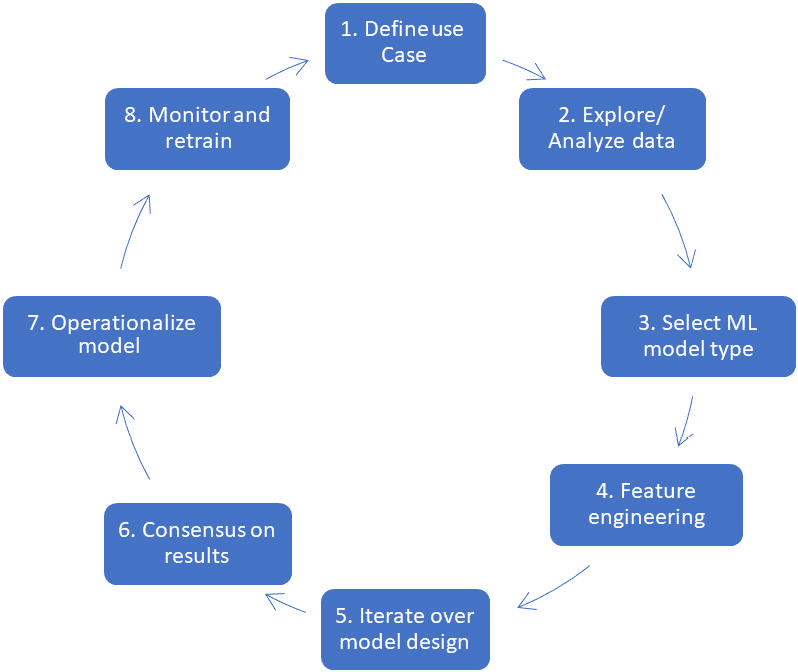
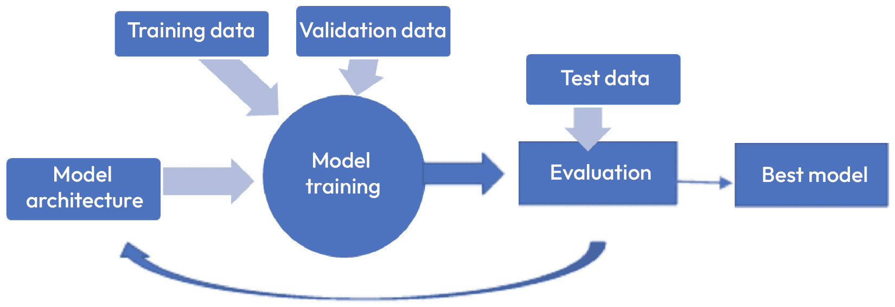
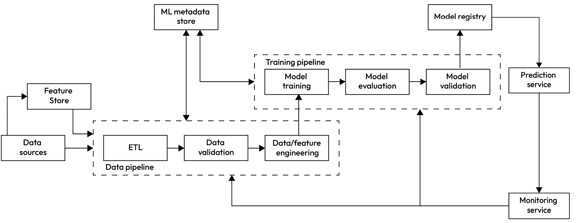

# 1

# 机器学习项目生命周期和挑战

今天，**机器学习**（**ML**）和**人工智能**（**AI**）对于许多组织的业务战略来说是不可或缺的部分，每年都有更多的组织使用它们。这种采用的重大原因是机器学习和人工智能解决方案在增加收入、品牌价值和成本节约方面的力量。这种对 AI 和 ML 的采用增加需要更多有技能的数据和机器学习专家以及技术领导者。如果你是机器学习从业者或初学者，这本书将帮助你成为一位自信的机器学习工程师或数据科学家，并了解谷歌的最佳实践。在本章中，我们将讨论生命周期的基础以及开发实际应用时机器学习的挑战和限制。

机器学习项目通常涉及从问题陈述到部署的一系列定义明确的步骤。理解这些步骤的重要性以及其中常见的挑战对于完成一个成功且具有影响力的项目至关重要。在本章中，我们将讨论理解业务问题的必要性，典型机器学习项目生命周期中的常见步骤，以及机器学习在细节上的挑战和限制。这将帮助新的机器学习从业者了解基本的项目流程；此外，它还将为本书后续章节的展开奠定基础。

本章涵盖了以下主题：

+   机器学习项目生命周期

+   开发实际机器学习解决方案的常见挑战

+   机器学习的局限性

# 机器学习项目生命周期

在本节中，我们将了解机器学习项目的典型生命周期，从定义问题到模型开发，最后到模型的运营化。*图 1.1*显示了几乎每个机器学习项目都会经历的高级步骤。让我们详细地过一遍所有这些步骤。

图 1.1 – 典型机器学习项目生命周期

就像**软件开发生命周期**（**SDLC**）一样，**机器学习项目**（**MDLC**）指导了机器学习模型开发和运营的端到端过程。在高级别上，企业环境中典型机器学习项目的生命周期保持相对一致，包括八个关键步骤：

1.  定义机器学习用例：任何机器学习项目的第一步是机器学习团队与业务利益相关者合作，评估预测分析的业务需求，并确定一个可以使用机器学习的用例，同时包括一些成功标准、性能指标和可能用于构建模型的可能数据集。

    例如，如果 ABC 保险公司的销售/营销部门希望更好地利用其资源，以针对更有可能购买特定产品的客户，他们可能会联系机器学习团队构建一个解决方案，该解决方案可以筛选所有可能的潜在客户/客户，并根据每个潜在客户的（年龄、以往购买、保单历史长度、收入水平等）数据点，识别最有可能购买保单的客户。然后销售团队可以要求他们的客户代表优先联系这些客户，而不是盲目地联系所有可能的客户。这可以显著提高代表的外出电话结果，并提高与销售相关的关键绩效指标。

    一旦定义了用例，下一步就是定义一组 KPI 来衡量解决方案的成功。对于这个销售用例，这可能是客户注册率——销售代表与多少比例的客户交谈后注册了新的保险政策？

    为了衡量机器学习解决方案的有效性，销售团队和机器学习团队可能同意在机器学习模型上线后，测量客户注册率的增加或减少，并迭代改进模型以优化注册率。

    在这个阶段，还将讨论可以用于模型训练的可能数据集。这些可能包括以下内容：

    +   由营销和销售团队生成的内部客户/产品数据集，例如，客户元数据，如他们的年龄、教育背景、收入水平、以往购买行为、拥有的车辆数量和类型等。

    +   可以通过第三方获取的外部数据集；例如，一个外部营销咨询公司可能已经收集了关于车主的保险购买行为的数据，基于他们拥有的汽车品牌。这些额外的数据可以用来预测他们购买 ABC 保险公司所售保险政策的可能性。

1.  探索/分析数据：下一步是对数据集进行详细分析。这通常是一个迭代过程，其中机器学习团队与数据和业务领域的专家紧密合作，更好地理解现有数据集的细微差别，包括以下内容：

    +   数据来源

    +   数据粒度

    +   更新频率

    +   单个数据点的描述及其商业意义

    这是一个关键步骤，数据科学家/机器学习工程师会分析现有数据，并决定哪些数据集可能与正在考虑的机器学习解决方案相关，分析数据的稳健性，并识别任何差距。团队在这个阶段可能识别出的问题可能与数据的清洁性和完整性，或者数据在生产中的及时可用性问题有关。例如，客户的年龄可能是一个很好的购买行为的指标，但如果它是在客户资料中的可选字段，那么可能只有少数客户提供了他们的出生日期或年龄。

    因此，团队需要确定他们是否想使用该字段，如果是的话，如何处理缺失年龄的样本。他们还可以与销售和营销团队合作，确保在客户在线请求保险报价并在系统中生成潜在客户时，该字段成为*必填字段*。

1.  选择机器学习模型类型：一旦确定了用例以及可能用于训练模型的数据库，下一步就是考虑可以使用哪些类型的模型来实现要求。在这里我们不会深入探讨一般模型选择的话题，因为关于这个话题可以写整本书，但在接下来的几章中，你将看到在 Vertex AI 中可以针对特定用例构建的不同模型类型。在非常高的层面上，这一阶段的关键考虑因素如下：

    +   模型类型：例如，在保险客户/潜在客户排名示例中，我们可以构建一个分类模型，预测新客户购买保单的可能性是*高/中/低*。或者可以构建一个回归模型，为每个可能的客户输出销售概率数值。

    +   传统的机器学习模型是否满足我们的要求，或者我们需要深度学习模型？

    +   可解释性要求：是否需要对每个预测进行解释，说明为什么样本被分类为某种方式？

    +   单个模型与集成模型：我们需要一个单一的模型来给出最终预测，还是需要使用一组相互关联的模型？例如，第一个模型可能将客户分配到特定的客户组，下一个模型可能使用该分组来确定最终购买的可能性。

    +   模型分离：例如，有时我们可能需要为整个客户群构建一个单一的全局模型，或者由于不同地区产品和用户行为存在显著差异，我们可能需要为每个地区分别构建模型。

1.  特征工程：这个过程通常是最耗时的，涉及以下几个步骤：

    1.  数据清理—在可能的情况下填补缺失值，删除具有太多缺失值的字段

    1.  数据和特征增强—将数据集合并以引入额外的字段，以及交叉合并现有特征以生成新特征

    1.  特征分析—计算特征相关性，分析共线性，检查特征中的数据泄露

    由于这是一个极其广泛的话题，我们不会深入探讨，并建议你参考其他关于这个话题的书籍。

1.  迭代模型设计/构建：机器学习模型的实际设计和构建是一个迭代过程，涉及以下关键步骤：

    1.  选择模型架构

    1.  将获取的数据分为训练/验证/测试子集

    1.  运行模型训练实验，调整超参数

    1.  使用测试数据集评估训练好的模型

    1.  排序并选择最佳模型

    *图 1**.2*展示了典型的机器学习模型开发生命周期：

图 1.2 – 机器学习模型开发生命周期

1.  对结果达成共识：一旦获得令人满意的模型，机器学习团队将与业务利益相关者分享结果，以确保结果完全符合业务需求，并执行额外的优化和后处理步骤，使模型预测对业务可用。为了确保业务利益相关者相信机器学习解决方案与业务目标一致，并且足够准确以驱动价值，机器学习团队可以使用多种方法之一：

    +   使用历史测试数据集进行评估：机器学习团队可以将历史数据通过新的机器学习模型，并评估预测与真实值的一致性。例如，在之前讨论的保险用例中，机器学习团队可以取上个月关于客户潜在客户的资料，并使用机器学习模型预测哪些客户最有可能购买新的保险政策。然后，他们可以将模型的预测与上个月的实际购买历史进行比较，看看模型的预测有多准确。如果模型的输出接近客户的实际购买行为，那么模型按预期工作，并且可以将此信息展示给业务利益相关者，以使他们相信机器学习解决方案在驱动额外收入方面的有效性。相反，如果模型的输出与客户的行为有显著偏差，机器学习团队需要回过头来改进模型。这通常是一个迭代过程，可能需要多次迭代，具体取决于模型的复杂性。

    +   使用实时数据进行评估：在某些情况下，一个组织可能会决定在一个生产环境中使用实时数据进行小规模的试点，以评估新机器学习模型的性能。这通常在以下情况下进行：

        +   当没有可用历史数据进行评估，或者使用历史数据进行测试预期不会很准确时；例如，在 COVID 疫情初期，客户行为模式突然发生变化，以至于使用任何历史数据进行测试几乎毫无用处。

        +   当生产环境中已经存在用于关键实时预测的现有模型时，新模型的合理性检查不仅需要在准确性方面，还需要在对其下游关键绩效指标（如每用户会话收入）的微妙影响方面进行。

    在这种情况下，团队可能会在生产环境中部署模型，将少量预测请求转向新模型，并定期比较对关键绩效指标（KPIs）的整体影响。例如，在一个电子商务网站上部署的推荐模型，推荐模型可能会开始推荐比旧模型在生产中已有的预测更便宜的产品。在这种情况下，客户完成购买的可能性会增加，但与此同时，每个用户会话产生的收入会减少，从而影响组织的整体收入。因此，尽管可能看起来机器学习模型按预期工作，但可能不会被业务/销售利益相关者视为成功，还需要更多讨论来优化它。

1.  实施模型：一旦模型获得在生产环境中部署的批准，机器学习团队将与组织的 IT 和数据工程团队合作，部署模型，以便其他应用程序可以开始利用它来生成洞察。根据组织的大小，这些团队所扮演的角色可能会有很大的重叠。

    实际部署架构将取决于以下因素：

    +   预测服务级别协议（SLAs） – 范围从周期性批量作业到需要亚秒级预测性能的解决方案。

    +   合规性要求 – 用户数据能否发送到第三方云提供商，或者是否需要始终位于组织的数据中心内？

    +   基础设施要求 – 这取决于模型的大小及其计算需求。小型模型可以从共享的计算节点提供服务。一些大型模型可能需要一个连接有大型 GPU 的节点。

    我们将在后续章节中详细讨论这个主题，但以下图示显示了一些你可能考虑作为部署架构一部分的关键组件。

图 1.3 – 机器学习模型训练和部署的关键组件

1.  监控和重新训练：似乎一旦模型实施完毕，机器学习团队的工作就完成了，但在现实世界的部署中，大多数模型需要定期或有时是持续的监控，以确保模型在所需的性能阈值内运行。模型性能可能因以下几个原因而变得次优：

    +   数据漂移：用于生成预测的数据发生变化可能会显著影响，并影响模型的表现。正如我们之前讨论的，在 COVID 期间，客户行为发生了显著变化。在 COVID 前客户行为数据上训练的模型无法应对这种突然的使用模式变化。由于疫情引起的变化相对较少但影响较大，但预测输入数据中还有许多其他较小的变化可能会对模型的表现产生不利影响。影响可能从精度微妙下降到模型生成错误响应。因此，密切关注你机器学习解决方案的关键性能指标是很重要的。

    +   预测请求量变化：如果你的解决方案被设计为每秒处理 100 个请求，但现在看到大约每秒 1,000 个请求的周期性流量激增，你的解决方案可能无法满足需求，或者延迟可能会超过可接受的水平。因此，你的解决方案也需要内置监控和一定程度的自动扩展来处理此类情况。对于流量量的较大变化，你可能甚至需要完全重新思考服务架构。

    在某些情况下，通过监控，你会发现你的机器学习模型不再满足预测精度，需要重新训练。如果数据模式的变化是可以预期的，机器学习团队应该设计解决方案以支持自动定期重新训练。例如，在零售行业，产品目录、定价和促销活动不断演变，需要定期重新训练模型。在其他情况下，变化可能是渐进的或出乎意料的，当监控系统向机器学习团队发出模型性能下降的警报时，他们需要决定是否使用更近期的数据进行模型重新训练，或者甚至完全使用新特征重新构建模型。

既然我们已经对机器学习项目的生命周期有了很好的了解，让我们来了解一下机器学习开发者在创建和部署机器学习解决方案时面临的常见挑战。

# 开发现实世界机器学习解决方案的常见挑战

现实世界的机器学习项目总是充满了我们在不同阶段体验到的意外挑战。主要原因在于现实世界中的数据和机器学习算法并不完美。尽管这些挑战会妨碍整体机器学习设置的性能，但它们并不会阻止我们创建有价值的机器学习应用。在一个新的机器学习项目中，很难事先知道挑战。它们通常在项目的不同阶段被发现。其中一些挑战并不明显，需要熟练或有经验的机器学习从业者（或数据科学家）来识别它们，并采取对策来减少它们的影响。

在本节中，我们将了解在开发典型机器学习解决方案过程中遇到的一些常见挑战。以下列表展示了我们将更详细讨论的一些常见挑战：

+   数据收集和安全

+   非代表性训练集

+   数据质量差

+   训练数据集欠拟合

+   训练数据集过拟合

+   基础设施需求

现在，让我们详细了解这些常见挑战。

## 数据收集和安全

组织面临的最常见挑战之一是数据可用性。机器学习算法需要大量高质量的数据才能提供高质量的结果。因此，对于想要实施机器学习的业务来说，原始数据的可用性至关重要。有时，即使原始数据可用，收集数据也不是唯一的问题；我们通常需要以我们的机器学习算法支持的方式转换或处理数据。

数据安全是机器学习开发者经常面临的一个重要挑战。当我们从一家公司获取数据时，为了正确和高效地实施机器学习，区分敏感和非敏感信息是至关重要的。数据敏感部分需要存储在完全安全的服务器（存储系统）中，并且始终应保持加密。出于安全目的，应避免使用敏感数据，并且只应将不太敏感的数据访问权限授予在项目上工作的可信团队成员。如果数据包含**个人身份信息**（**PII**），则可以通过适当匿名化来使用。

## 非代表性训练数据

一个好的机器学习模型是在未见数据集和训练数据集上表现同样出色的模型。只有在你的训练数据是大多数可能业务场景的良好代表时，这才能实现。有时，当数据集较小时，它可能不是固有分布的真实代表，并且尽管在训练数据集上具有高质量的结果，但该模型在未见数据集上可能提供不准确的预测。这种非代表性数据要么是采样偏差的结果，要么是数据不可用。因此，在非代表性数据集上训练的机器学习模型在生产部署时可能价值较低。

如果无法为业务问题获取真实代表性的训练数据集，那么最好将问题范围限制在我们有足够训练样本的场景。这样，我们将在未见数据集中只获得已知场景，并且模型应该提供高质量的预测。有时，与业务问题相关的数据会随着时间的推移而不断变化，可能无法开发一个单一静态的模型来很好地工作；在这种情况下，对模型进行持续重新训练以使用最新数据变得至关重要。

## 数据质量差

机器学习算法的性能对训练样本的质量非常敏感。少数异常值、缺失数据案例或一些异常情况可能会显著影响模型的质量。因此，在训练任何机器学习算法之前，在分析数据时仔细处理这些情况非常重要。有多种方法用于识别和处理异常值；最佳方法取决于问题的性质和数据本身。同样，也有多种处理缺失值的方法。例如，均值、中位数、众数等是一些常用的方法来填充缺失数据。如果训练数据量足够大，删除少量带有缺失值的行也是一个不错的选择。

正如讨论的那样，如果我们希望我们的机器学习系统能够准确学习并在未见过的数据集上提供高质量的结果，那么训练数据集的质量是非常重要的。这意味着机器学习生命周期中的数据预处理部分应该非常认真对待。

## 欠拟合训练数据集

欠拟合机器学习模型意味着模型过于简单，无法学习训练数据集的固有信息或结构。这可能发生在我们尝试使用如线性回归这样的线性机器学习算法来拟合非线性分布时。当我们在训练模型时仅使用最小特征集（这些特征可能对目标分布的信息不多）时，也可能发生欠拟合。这种类型的模型可能过于简单，无法学习目标分布。欠拟合的模型从训练数据中学习得太少，因此在对未见或测试数据集的错误判断上。

解决欠拟合问题的方法有很多。以下是一些常见方法的列表：

+   特征工程——添加更多代表目标分布的特征

+   非线性算法——如果目标分布不是线性的，则切换到非线性算法

+   从数据中去除噪声

+   增加模型的力量——增加可训练参数，增加基于树的集成中的深度或树的数量

就像在训练数据上欠拟合模型一样，过拟合也是一个大问题。让我们深入探讨一下。

## 过拟合训练数据集

过拟合问题与欠拟合问题是相反的。过拟合是机器学习模型从训练数据中学习太多不必要信息，并且无法在测试或未见数据集上进行泛化的场景。在这种情况下，模型在训练数据集上表现极好，但指标值（如准确率）在测试集上非常低。过拟合通常发生在我们在简单数据集上实现一个非常复杂的算法时。

解决过拟合问题的常见方法如下：

+   增加训练数据量——机器学习模型通常在小型数据集上过拟合

+   使用更简单的模型——当问题简单或本质上是线性的，选择简单的机器学习算法

+   正则化 – 有多种正则化方法可以防止复杂模型在训练数据集上过度拟合

+   降低模型复杂度 – 使用更少的可训练参数，进行更少的训练轮数，并减少基于树的模型的深度

过度拟合和欠拟合是常见的挑战，应像之前讨论的那样仔细处理。现在，让我们讨论一些与基础设施相关的问题。

## 基础设施需求

机器学习成本高昂。典型的机器学习项目通常涉及处理包含数百万或数十亿样本的大型数据集。对这类数据集进行切片和切块需要大量的内存和高端的多核处理器。此外，一旦项目开发完成，还需要专用服务器来部署模型并匹配消费者的规模。因此，愿意实践机器学习的商业组织需要一些专用基础设施来高效地实施和消费机器学习。当与大型、深度学习模型（如变换器、**大型语言模型（LLMs**）等）一起工作时，这一需求进一步增加。这些模型通常需要一套加速器、**图形处理单元（GPUs**）或**张量处理单元（TPUs**）来进行训练、微调和部署。

正如我们之前讨论的，基础设施对于实践机器学习至关重要。缺乏此类基础设施的公司可以咨询其他公司或采用基于云的服务来开始开发基于机器学习的应用程序。

现在我们已经了解了在开发机器学习项目过程中面临的常见挑战，我们应该能够就这些问题做出更明智的决定。接下来，让我们了解一些机器学习的限制。

# 机器学习的限制

机器学习非常强大，但并非每个问题的答案。有些问题机器学习根本不适用，有些情况下由于技术或业务限制，机器学习无法应用。作为一名机器学习从业者，发展出在机器学习可以提供显著价值的相关业务问题中找到相关问题的能力非常重要，而不是盲目地将其应用于任何地方。此外，还有一些算法特定的限制，可能导致机器学习解决方案在某些商业应用中不可用。在本节中，我们将了解一些在寻找相关用例时应注意的常见机器学习限制。

请记住，我们在此节中讨论的限制非常普遍。在现实世界的应用中，由于我们解决问题的性质，可能存在更多可能的限制。我们将详细讨论的一些常见限制如下：

+   数据相关的担忧

+   问题的确定性

+   解释性和可重复性的缺乏

+   与成本和定制相关的担忧

+   伦理担忧和偏见

让我们现在深入探讨这些常见限制的每一个。

## 数据相关的担忧

机器学习模型的质量高度依赖于其提供的训练数据的质量。现实世界中的数据通常是嘈杂的、不完整的、未标记的，有时甚至无法使用。此外，大多数监督学习算法需要大量的正确标记的训练数据才能产生好的结果。某些算法（例如深度学习）的训练数据需求非常高，以至于手动标记数据都不是一个选项。即使我们设法手动标记数据，由于人类偏见，这也常常是容易出错的。

另一个主要问题是信息不完整或数据缺失。例如，考虑自动语音识别的问题。在这种情况下，模型结果高度偏向于训练数据集中存在的口音。一个训练于美式口音的模型在其他带口音的语音上无法产生好的结果。由于口音在我们前往世界不同地区时会发生显著变化，因此很难收集和标记与每个可能的口音相关的相关数量的训练数据。因此，开发一个适用于所有人的单一语音识别模型目前还不可行，因此，提供语音识别解决方案的科技巨头通常开发针对特定口音的模型。为每个新的口音开发新的模型并不具有很强的可扩展性。

## 问题的不确定性

机器学习在解决一些高度复杂的问题上取得了巨大的成功，例如数值天气预报。大多数当前机器学习算法的一个问题是它们本质上是随机的，因此在问题是确定性的情况下不能盲目信任。考虑到数值天气预报的案例，今天我们有机器学习模型可以以可接受的精度预测降雨、风速、气压等，但它们完全无法理解真实天气系统背后的物理。例如，一个机器学习模型可能会提供密度等参数的负值估计。

然而，在不久的将来克服这类限制的可能性非常大。机器学习领域的未来研究可能会发现足够智能的新算法，能够理解我们世界的物理。这样的模型将在未来开辟无限的可能性。

## 解释性和可重复性的缺乏

许多机器学习算法（以及通常神经网络）的一个主要问题是结果的可解释性不足。许多商业应用，如欺诈检测和疾病预测，需要为模型结果提供合理的解释。如果一个机器学习模型将一笔金融交易分类为欺诈，它也应该为这个决策提供坚实的证据；否则，这种输出可能对业务没有帮助。深度学习或神经网络模型通常缺乏可解释性，这类模型的可解释性是一个活跃的研究领域。已经为模型的可解释性或可解释性目的开发了多种方法。尽管这些方法可以为结果提供一些见解，但它们仍然远远不能满足实际需求。

另一方面，可重复性是机器学习解决方案中另一个复杂且日益增长的问题。一些最新的研究论文可能通过在固定数据集上使用一些技术进步，展示了结果的巨大改进，但在现实世界场景中，同样的方法可能不起作用。其次，机器学习模型通常是不稳定的，这意味着它们在训练不同数据集分区时会产生不同的结果。这是一个具有挑战性的情况，因为为某个业务部门开发的模型可能对另一个业务部门完全无用，尽管潜在的问题陈述是相似的。这使得它们的可重用性降低。

## 与成本和定制相关的担忧

开发和维护机器学习解决方案通常成本高昂，尤其是在深度学习算法的情况下。开发成本可能来自雇佣高度熟练的开发者以及用于数据分析和学习实验的基础设施。深度学习模型通常需要高性能计算资源，如 GPU 和 TPU 进行训练和实验。使用这些模型进行超参数调整作业的成本更高，耗时也更长。一旦模型准备就绪，它需要专门的资源进行部署、监控和维护。随着你将部署扩展到为大量客户服务，这种成本还会进一步增加，如果还有非常低的延迟要求，成本会更高。因此，在进入开发阶段之前，了解我们的解决方案将要带来的价值非常重要，并检查它是否值得投资。

另一个关于机器学习解决方案的担忧是它们缺乏定制性。机器学习模型通常很难定制，这意味着很难改变它们的参数或使它们适应新的数据集。预构建的通用机器学习解决方案通常在特定的商业用例上效果不佳，这使它们面临两个选择——要么从头开始开发解决方案，要么定制预构建的通用解决方案。尽管在这里定制预构建模型似乎是一个更好的选择，但在机器学习模型的情况下，即使是定制也不是一件容易的事情。机器学习模型的定制需要一组具有深厚技术概念（如深度学习、预测建模和迁移学习）理解的数据工程师和机器学习专家。

## 伦理问题和偏见

机器学习（ML）非常强大，并且今天被许多组织采用来指导他们的商业策略和决策。正如我们所知，这些机器学习算法中的一些是*黑盒*；它们可能不会提供其决策背后的原因。机器学习系统是在有限的数据集上训练的，它们可能不适用于某些现实世界场景；如果在未来遇到这些场景，我们无法预测机器学习系统将做出什么决策。与这种黑盒决策相关的伦理问题可能存在。例如，如果一辆自动驾驶汽车发生了交通事故，你应该责怪谁——司机、开发 AI 系统的团队，还是汽车制造商？因此，很明显，当前机器学习和人工智能的进步并不适合伦理或道德决策。此外，我们需要一个框架来解决涉及机器学习和人工智能系统的伦理问题。

机器学习解决方案的准确性和速度通常值得称赞，但这些解决方案并不总是可以信赖它们是公平和无偏见的。考虑一下识别给定图像中人脸或物体的 AI 软件；这个系统可能在相机无法正确捕捉种族敏感性照片时出错，或者它可能将某种类型的狗（与猫有些相似）分类为猫。这种偏见可能来自用于开发 AI 系统的有偏见的训练或测试数据集。现实世界中的数据通常由人类收集和标记；因此，人类中存在的偏见被转移到 AI 系统中。完全避免偏见是不可能的，因为我们都是人类，因此都有偏见，但我们可以采取一些措施来减少它。建立伦理文化并组建来自不同背景的团队可以是在一定程度上减少偏见的好步骤。

# 摘要

机器学习（ML）是任何企业战略和许多组织决策的不可或缺部分，因此正确地执行它非常重要。在本章中，我们了解了典型机器学习项目开发生命周期中涉及的一般步骤及其重要性。我们还强调了机器学习实践者在项目开发过程中面临的一些常见挑战。最后，我们列出了一些机器学习在现实场景中的常见局限性，以帮助我们选择合适的企业问题和相应的机器学习算法来解决它。

在本章中，我们学习了选择正确的企业问题的重要性，以便利用机器学习产生最大的影响。我们还了解了典型机器学习项目的总体流程。现在，我们应该对识别业务流程中潜在的机器学习相关挑战并做出明智的决策充满信心。最后，我们学习了机器学习算法的常见局限性，这将帮助我们更好地应用机器学习，从中获得最佳效果。

仅开发一个高性能的机器学习模型是不够的。真正的价值在于它在现实世界中的应用和部署。将机器学习模型投入生产并非易事，并且应该以正确的方式进行。下一章将详细介绍在将机器学习模型投入运营时应遵循的指南和最佳实践，这在深入研究本书后续章节之前将极为重要。
