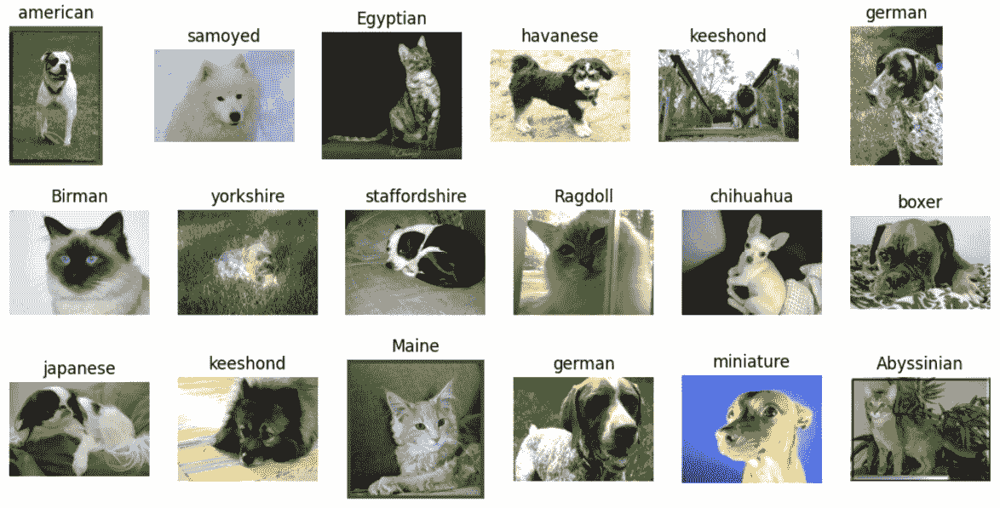
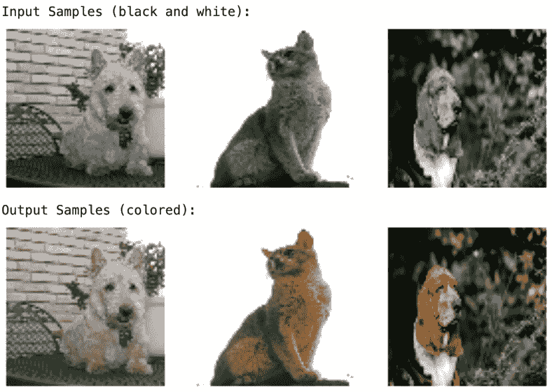
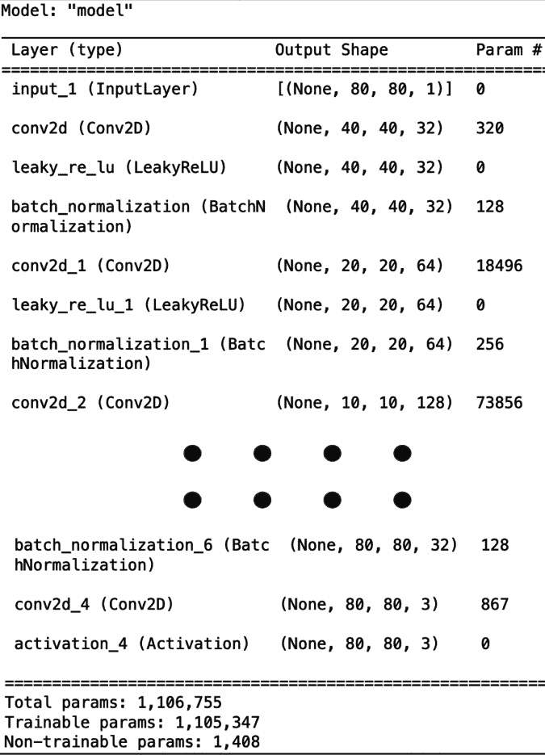
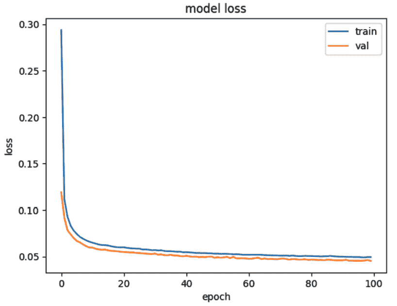
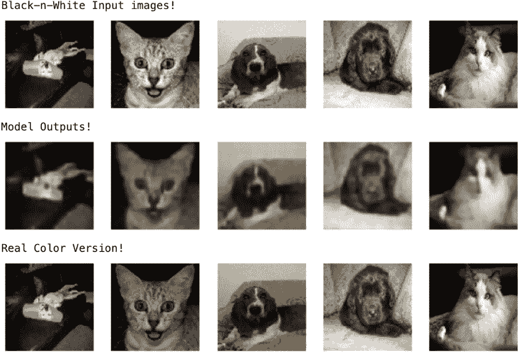
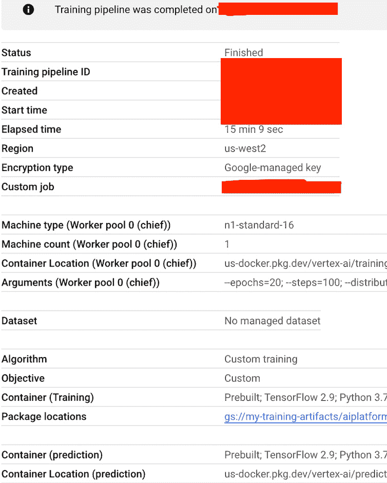
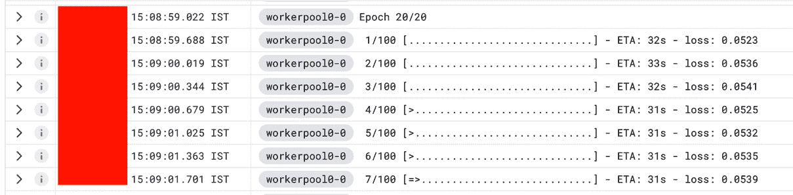
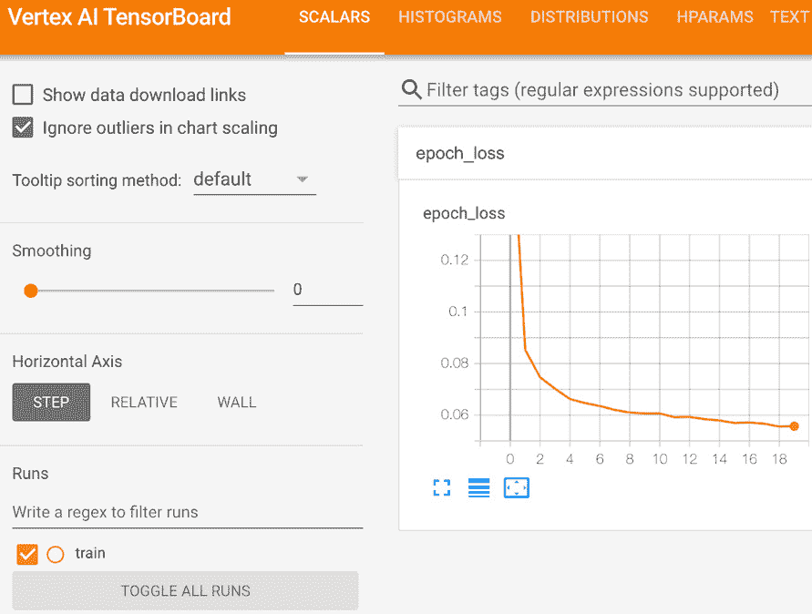

# 第七章：使用 Vertex AI 训练完全自定义的 ML 模型

在前面的章节中，我们学习了如何使用最小技术专长训练无代码（Auto-ML）以及低代码（BQML）**机器学习**（**ML**）模型。当解决常见的机器学习问题时，这些解决方案非常实用。然而，有时问题或数据本身非常复杂，需要开发自定义的**人工智能**（**AI**）模型，在大多数情况下是大型基于深度学习的模型。在自定义模型上工作需要机器学习、深度学习和人工智能领域的显著技术专长。有时，即使拥有这种专长，由于资源、计算能力和适当的元数据跟踪机制不足，管理大规模自定义深度学习模型的训练和实验也变得非常困难。

为了使机器学习开发者的生活更轻松，Vertex AI 提供了一个托管环境，用于启动大规模的自定义训练作业。Vertex AI 管理的作业让我们能够跟踪有用的元数据，通过 Google Cloud 控制台 UI 监控作业，并且无需主动监控即可启动大规模批量推理作业。在本章中，我们将学习如何在 Google Vertex AI 上使用自定义深度学习模型。具体来说，我们将涵盖以下主题：

+   使用 TensorFlow 构建基本的深度学习模型

+   将模型打包以提交给 Vertex AI 进行训练作业

+   监控模型训练进度

+   评估训练后的模型

# 技术要求

本章需要具备深度学习框架 TensorFlow 和神经网络的入门级知识。代码工件可以在以下 GitHub 仓库中找到 - [`github.com/PacktPublishing/The-Definitive-Guide-to-Google-Vertex-AI/tree/main/Chapter07`](https://github.com/PacktPublishing/The-Definitive-Guide-to-Google-Vertex-AI/tree/main/Chapter07)

# 使用 TensorFlow 构建基本的深度学习模型

**TensorFlow**，简称**TF**，是一个用于构建机器学习模型的端到端平台。TensorFlow 框架的主要重点是简化深度神经网络的开发、训练、评估和部署。当涉及到处理非结构化数据（例如图像、视频、音频等）时，基于神经网络的解决方案比主要依赖于手工特征的传统的机器学习方法取得了显著更好的结果。深度神经网络擅长从高维数据点中理解复杂模式（例如，包含数百万像素的图像）。在本节中，我们将使用 TensorFlow 开发一个基本的基于神经网络的模型。在接下来的几节中，我们将看到 Vertex AI 如何帮助设置可扩展和系统化的自定义模型训练/调优。

重要提示

需要注意的是，TensorFlow 并不是 Vertex AI 支持的唯一机器学习框架。Vertex AI 支持许多不同的机器学习框架和开源项目，包括 Pytorch、Spark 和 XGBoost。Pytorch 是增长最快的机器学习框架之一，借助 Vertex AI 的 Pytorch 集成，我们可以轻松地在生产环境中训练、部署和编排 PyTorch 模型。Vertex AI 提供了预构建的训练和托管容器，并支持 PyTorch 模型的优化分布式训练。同样，Vertex AI 为包括 XGBoost、TensorFlow、Pytorch 和 Scikit-learn 在内的多个机器学习框架提供了预构建的训练、托管和可解释性功能。

## 实验 – 将黑白图像转换为彩色图像

在这个实验中，我们将开发一个基于 TensorFlow 的深度学习模型，该模型以黑白图像为输入，并将它们转换为彩色图像。由于这个练习需要开发一个自定义模型，我们将从 Jupyter Notebook 中的初始开发工作开始。第一步是在 Vertex AI Workbench 中使用预配置的 TensorFlow 图像创建一个用户管理的 Jupyter Notebook。有关如何成功创建 Vertex AI Workbench 笔记本实例的更多详细信息，请参阅*第四章*，*Vertex AI Workbench*。接下来，让我们从 JupyterLab 应用程序启动一个 Jupyter Notebook。我们现在已经准备好开始我们的实验了。

我们将在笔记本的第一个单元格中开始导入有用的库（预构建的 Python 包）。在这个实验中，我们将使用以下 Python 库 – `numpy`用于多维数组操作，TensorFlow 用于开发深度学习模型，OpenCV（或`cv2`）用于图像处理，以及`matplotlib`用于绘制图像或图表：

```py
import numpy as np
import tensorflow
import glob
import cv2
import matplotlib.pyplot as plt
%matplotlib inline
```

我们需要一个包含至少几千张图像的图像数据集来训练和测试我们的模型。在这个实验中，我们将使用**Oxford-IIIT Pet**数据集，这是一个公开且免费使用的数据集。该数据集包含来自 30 多个不同标注类别的约 7k 张宠物图像。数据集可以从以下网站下载：[`www.robots.ox.ac.uk/~vgg/data/pets/`](https://www.robots.ox.ac.uk/~vgg/data/pets/)。

我们也可以使用以下终端命令下载这个数据集：

```py
wget https://thor.robots.ox.ac.uk/~vgg/data/pets/images.tar.gz
wget https://thor.robots.ox.ac.uk/~vgg/data/pets/annotations.tar.gz
```

下载完成后，将压缩文件放在与我们的笔记本相同的目录中。现在，让我们在笔记本单元格中创建一个`!`符号，这样我们就可以在 Jupyter Notebook 中运行终端命令了）：

```py
!mkdir data
!tar -xf images.tar.gz -C data
!mkdir labels
!tar -xf annotations.tar.gz -C labels
```

由于我们当前的实验是关于将黑白图像转换为彩色版本，我们将不会使用标注。现在，让我们快速在一个新单元格中验证是否已成功将所有图像复制到**data**文件夹中：

```py
all_image_files = glob.glob("data/images/*.jpg")
print("Total number of image files : ", \
    len(all_image_files))
```

在这里，`glob`模块通过列出数据目录内所有的`.jpg`图像路径来帮助我们。这个列表的长度将与图像数量相等。前面的代码应该打印出以下输出：

```py
Total number of image files :  7390
```

现在我们已经成功下载并提取了数据，让我们检查一些图像以确保一切正常。下面的代码块将绘制一些带有注释的随机图像：

```py
for i in range(3):
    plt.figure(figsize=(13, 13))
    for j in range(6):
        img_path = np.random.choice(all_image_files)
        img = cv2.imread(img_path)
        img_class = img_path.split("/")[-1].split("_")[0]
        img = cv2.cvtColor(img, cv2.COLOR_BGR2RGB)
        plt.subplot(660 + 1 + j)
        plt.imshow(img)
        plt.axis('off')
        plt.title(img_class)
    plt.show()
```

在这里，我们通过从图像路径名称本身提取图像类别（或注释），因为所有图像的文件名中都有宠物类别。前面代码的输出应该类似于*图 7.1*中所示。



图 7.1 – 宠物数据集的一些样本

现在我们已经验证了我们的数据集，让我们将这些图像分成三个集合——训练集、验证集和测试集——就像我们通常为训练/验证和测试机器学习模型所做的那样。我们将保留 60%的图像用于训练，20%用于验证，剩下的 20%用于测试。完成这些分割的一个简单方法如下：

```py
train_files = all_image_files[:int( \
    len(all_image_files)*0.6)]
validation_files = all_image_files[int( \
    len(all_image_files)*0.6):int(len(all_image_files)*0.8)]
test_files = all_image_files[int( \
    len(all_image_files)*0.8):]
print(len(train_files), len(validation_files), \
    len(test_files))
```

本实验的主要重点是开发一个深度学习模型，该模型可以将黑白图像转换为彩色图像。为了学习这种映射，模型将需要黑白图像及其对应的彩色版本对来学习这种映射。我们的数据集已经包含了彩色图像。我们将利用 OpenCV 库将它们转换为灰度（黑白）图像，并将它们作为模型输入。我们将比较输出与它们的彩色版本。需要注意的是，我们的深度学习模型将接受固定大小的图像作为输入，因此我们还需要将所有输入图像调整到相同的分辨率。在我们的实验中，我们将所有图像的分辨率更改为 80x80。我们已经有图像路径的训练、验证和测试分割。我们现在可以读取这些文件，为训练、验证和测试准备数据。下面的代码块可以用来准备之前描述的数据集。

让我们先定义空列表来分别存储训练、验证和测试数据：

```py
train_x = []
train_y = []
val_x = []
val_y = []
test_x = []
test_y = []
```

在这里，我们读取训练图像，将它们调整到所需的大小，为每个图像创建一个黑白版本，并将它们存储为目标图像：

```py
for file in train_files:
    try:
        img = cv2.imread(file)
        img = cv2.resize(img, (80,80))
        color_img = cv2.cvtColor(img, cv2.COLOR_BGR2RGB)
        black_n_white_img = cv2.cvtColor(color_img, \
            cv2.COLOR_RGB2GRAY)
    except:
        continue
    train_x.append((black_n_white_img-127.5)/127.5)
    train_y.append((color_img-127.5)/127.5)
```

同样，我们对验证文件重复相同的流程：

```py
for file in validation_files:
    try:
        img = cv2.imread(file)
        img = cv2.resize(img, (80,80))
        color_img = cv2.cvtColor(img, cv2.COLOR_BGR2RGB)
        black_n_white_img = cv2.cvtColor(color_img, \
            cv2.COLOR_RGB2GRAY)
    except:
        continue
    val_x.append((black_n_white_img-127.5)/127.5)
    val_y.append((color_img-127.5)/127.5)
```

现在，以类似的方式准备测试文件：

```py
for file in test_files:
    try:
        img = cv2.imread(file)
        img = cv2.resize(img, (80,80))
        color_img = cv2.cvtColor(img, cv2.COLOR_BGR2RGB)
        black_n_white_img = cv2.cvtColor(color_img, \
            cv2.COLOR_RGB2GRAY)
    except:
        continue
    test_x.append((black_n_white_img-127.5)/127.5)
    test_y.append((color_img-127.5)/127.5)
```

注意，图像是用 0 到 255 之间的像素值表示的。我们通过减去并除以 127.5 来归一化像素值，并将它们带入[-1, 1]的范围内。数据归一化使得深度学习模型的优化更加平滑和稳定。

现在我们已经成功地将数据集准备好，包括训练集、验证集和测试集的分割，让我们检查一些样本以确认数据已经被正确准备。下面的代码块选择了一些随机的训练集图像并将它们绘制出来。

让我们绘制一些输入图像，以了解数据：

```py
# input images
indexes = np.random.choice(range(0,4000), size=3)
print("Input Samples (black and white): ")
plt.figure(figsize=(7,7))
for i in range(3):
    plt.subplot(330+1+i)
    plt.imshow((train_x[indexes[i]]+1.0)/2.0, cmap='gray')
    plt.axis('off')
plt.show()
```

我们还将绘制这些随机选择的图像的输出版本（彩色版本）：

```py
# corresponding output images
print("Output Samples (colored): ")
plt.figure(figsize=(7,7))
for i in range(3):
    plt.subplot(330+1+i)
    plt.imshow((train_y[indexes[i]]+1.0)/2.0)
    plt.axis('off')
plt.show()
```

如果一切正确，我们应该看到输入-输出对图像与*图 7**.2*中的非常相似。



图 7.2 – 数据验证的样本输入-输出对

由于我们在这里处理图像数据，我们将使用基于**卷积神经网络**（**CNN**）的模型，以便我们可以从图像数据中提取有用的特征。当前的研究表明，CNN 在从图像数据中提取特征和其他有用信息方面非常有用。由于我们将在这里使用 CNN，我们需要将我们的图像数据集转换为 NumPy 数组，并且还需要为每个黑白输入图像添加一个通道维度（CNN 接受图像输入为一个三维数组，每个维度分别对应宽度、高度和通道）。彩色图像已经具有三个通道，每个通道对应一个颜色值 – R、G 和 B。以下代码块根据之前描述的步骤准备我们的最终数据集：

```py
train_x = np.expand_dims(np.array(train_x),-1)
val_x = np.expand_dims(np.array(val_x),-1)
test_x = np.expand_dims(np.array(test_x),-1)
train_y = np.array(train_y)
val_y = np.array(val_y)
test_y = np.array(test_y)
```

现在，再次检查我们数据集分割的维度：

```py
print(train_x.shape, train_y.shape, val_x.shape, \
    val_y.shape, test_x.shape, test_y.shape)
```

应该打印出类似以下内容：

```py
(4430, 80, 80, 1) (4430, 80, 80, 3) (1478, 80, 80, 1) (1478, 80, 80, 3) (1476, 80, 80, 1) (1476, 80, 80, 3)
```

从数据角度来看，一切看起来都很不错。让我们跳转到定义我们的神经网络架构。

在这个实验中，我们将定义一个基于 TensorFlow 的 CNN，它以黑白图像为输入，并预测它们的彩色变体作为输出。模型架构可以大致分为两部分 – **编码器**和**解码器**。模型的编码器部分以黑白图像为输入，并通过四个下采样卷积层从中提取有用的特征。每个卷积层后面跟着 LeakyReLU 激活层和批归一化层，除了最后一层，它用**dropout**层代替了批归一化层。通过编码器模型后，一个尺寸为（80, 80, 1）的输入图像变成了一个尺寸为（5, 5, 256）的特征向量。

模型的第二部分被称为解码器。解码器部分从编码器的输出中获取特征向量，并将其转换回对应输入图像的彩色版本。解码器由四个转置卷积或上采样层组成。每个解码器层后面跟着 ReLU 激活层和批归一化层，除了最后一层，它有 tanh 激活而没有归一化层。tanh 激活将最终输出向量的值限制在[-1,1]的范围内，这是我们输出图像所期望的。

以下代码块定义了 TensorFlow 模型：

```py
def tf_model():
    black_n_white_input = tensorflow.keras.layers.Input( \
        shape=(80, 80, 1))
    enc = black_n_white_input
```

编码器部分从这里开始，在同一个函数内：

```py
    #Encoder part
    enc = tensorflow.keras.layers.Conv2D(32, kernel_size=3, \
        strides=2, padding='same')(enc)
    enc = tensorflow.keras.layers.LeakyReLU(alpha=0.2)(enc)
    enc = tensorflow.keras.layers.BatchNormalization(momentum=0.8)(enc)
    enc = tensorflow.keras.layers.Conv2D(64, kernel_size=3, \
        strides=2, padding='same')(enc)
    enc = tensorflow.keras.layers.LeakyReLU(alpha=0.2)(enc)
    enc = tensorflow.keras.layers.BatchNormalization(momentum=0.8)(enc)
    enc = tensorflow.keras.layers.Conv2D(128, \
        kernel_size=3, strides=2, padding='same')(enc)
    enc = tensorflow.keras.layers.LeakyReLU(alpha=0.2)(enc)
    enc = tensorflow.keras.layers.BatchNormalization(momentum=0.8)(enc)
    enc = tensorflow.keras.layers.Conv2D(256, \
        kernel_size=1, strides=2, padding='same')(enc)
    enc = tensorflow.keras.layers.LeakyReLU(alpha=0.2)(enc)
    enc = tensorflow.keras.layers.Dropout(0.5)(enc)
```

解码器部分从这里开始，在同一个函数内：

```py
    #Decoder part
    dec = enc
    dec = tensorflow.keras.layers.Conv2DTranspose(256, \
        kernel_size=3, strides=2, padding='same')(dec)
    dec = tensorflow.keras.layers.Activation('relu')(dec)
    dec = tensorflow.keras.layers.BatchNormalization(momentum=0.8)(dec)
    dec = tensorflow.keras.layers.Conv2DTranspose(128, \
        kernel_size=3, strides=2, padding='same')(dec)
    dec = tensorflow.keras.layers.Activation('relu')(dec)
    dec = tensorflow.keras.layers.BatchNormalization(momentum=0.8)(dec)
    dec = tensorflow.keras.layers.Conv2DTranspose(64, \
        kernel_size=3, strides=2, padding='same')(dec)
    dec = tensorflow.keras.layers.Activation('relu')(dec)
    dec = tensorflow.keras.layers.BatchNormalization(momentum=0.8)(dec)
    dec = tensorflow.keras.layers.Conv2DTranspose(32, \
        kernel_size=3, strides=2, padding='same')(dec)
    dec = tensorflow.keras.layers.Activation('relu')(dec)
    dec = tensorflow.keras.layers.BatchNormalization(momentum=0.8)(dec)
    dec = tensorflow.keras.layers.Conv2D(3, kernel_size=3,\
        padding='same')(dec)
```

最后，添加 tanh 激活函数以获得所需输出的彩色图像：

```py
    color_image = tensorflow.keras.layers.Activation('tanh')(dec)
    return black_n_white_input, color_image
```

现在，让我们创建一个 TensorFlow 模型对象并打印我们模型的摘要：

```py
black_n_white_input, color_image = tf_model()
model = tensorflow.keras.models.Model( \
    inputs=black_n_white_input, outputs=color_image)
model.summary()
```

这应该会打印出如图*图 7.3*所示的模型摘要。



图 7.3 – TensorFlow 模型摘要（在 GitHub 上查看完整摘要）

从摘要中我们可以看出，我们的模型大约有 110 万个可训练参数。下一步是编译 TensorFlow 模型：

```py
_optimizer = tensorflow.keras.optimizers.Adam(\
    learning_rate=0.0002, beta_1=0.5)
model.compile(loss='mse', optimizer=_optimizer)
```

我们使用学习率为 0.0002 的 Adam 优化器以及值为 0.5 的`beta_1`参数。在这里，`beta_1`代表第一矩估计的指数衰减率，学习率告诉优化器在训练期间更新模型参数值的速率。其余的参数值保持默认。我们的想法是传递一个黑白图像并重建其彩色版本，因此我们将使用**均方误差**（**MSE**）作为像素级别的重建损失函数。

现在我们已经准备好开始训练了。我们将在这个实验中使用 128 个批次的尺寸，训练模型大约 100 个周期，并检查结果。以下代码片段开始训练：

```py
history = model.fit(
    train_x,
    train_y,
    batch_size=128,
    epochs=100,
    validation_data=(val_x, val_y),
)
```

输出日志应类似于以下内容：

```py
Epoch 1/100
35/35 [==============================] - 25s 659ms/step - loss: 0.2940 - val_loss: 0.1192
Epoch 2/100
35/35 [==============================] - 20s 585ms/step - loss: 0.1117 - val_loss: 0.0917
Epoch 3/100
35/35 [==============================] - 20s 580ms/step - loss: 0.0929 - val_loss: 0.0784
Epoch 4/100
35/35 [==============================] - 20s 577ms/step - loss: 0.0832 - val_loss: 0.0739
Epoch 5/100
35/35 [==============================] - 20s 573ms/step - loss: 0.0778 - val_loss: 0.0698
. . . . .
. . . . .
. . . . .
. . . . .
Epoch 100/100
35/35 [==============================] - 20s 559ms/step - loss: 0.0494 - val_loss: 0.0453
```

为了检查我们的训练是否顺利，我们可以查看`history`变量中的损失图表：

```py
plt.plot(history.history['loss'])
plt.plot(history.history['val_loss'])
plt.title('model loss')
plt.ylabel('loss')
plt.xlabel('epoch')
plt.legend(['train', 'val'], loc='upper right')
plt.show()
```

前面的代码片段将绘制所有训练周期的训练和验证损失作为折线图。输出图表应类似于*图 7.4*。正如我们所见，随着训练的进行，训练和验证损失持续下降。我们的训练朝着正确的方向进行，这让人感到放心。



图 7.4 – 训练和验证损失

最后一步是检查一个未见过的测试数据集上的结果。以下代码从`test_set`中选择一些随机样本并为它们生成模型输出。我们还绘制了输入图像、模型生成的彩色图像和实际彩色图像，以便理解。

```py
samples = np.random.choice(range(0, len(test_files)), size=5)
```

绘制几个测试图像以验证模型输出：

```py
# show input images
print("Black-n-White Input images!")
plt.figure(figsize=(8,8))
for i in range(5):
    plt.subplot(550+1+i)
    plt.imshow((test_x[samples[i]]+1.0)/2.0, cmap='gray')
    plt.axis('off')
plt.show()
```

在这里，模型生成一个彩色版本：

```py
# generate color images from model
print("Model Outputs!")
plt.figure(figsize=(8,8))
for i in range(5):
    plt.subplot(550+1+i)
    model_input = test_x[samples[i]]
    output = model.predict(np.array([model_input]))
    plt.imshow((output[0]+1.0)/2.0)
    plt.axis('off')
plt.show()
```

此外，还可以绘制一个参考的彩色版本：

```py
# show real color output images
print("Real Color Version!")
plt.figure(figsize=(8,8))
for i in range(5):
    plt.subplot(550+1+i)
    plt.imshow((test_y[samples[i]]+1.0)/2.0)
    plt.axis('off')
plt.show()
```

当绘制模型输出或输入图像时，我们将 1.0 加到图像数组上，然后除以 2.0。我们这样做是因为在数据预处理过程中，我们将图像像素值归一化到[-1,1]的范围内。但理想情况下，图像像素值不能为负，因此我们需要对图像绘制目的进行逆变换。所以，加 1.0 并除以 2.0 将像素值带入[0,1]的范围内，这是 Matplotlib 绘图所支持的。参见*图 7.5*。



图 7.5 – 黑白到彩色模型输出

如前所述的输出所示，我们的模型正在学习某种着色，这当然不是理想的，但看起来仍然相当不错。一个有趣的现象是它不是随机填充颜色渐变；我们可以清楚地看到主要对象，因为它们与背景有不同的对比度。鉴于我们有一个非常小的模型和小的训练数据集，这种性能相当有希望。

然而，这并不是解决图像着色问题的最佳模型架构。如今，生成模型如 **生成对抗网络**（GANs）为这类问题提供了最佳结果。我们将在本书的后面部分研究 GANs，但现在，让我们继续这个简单的实验。接下来，我们将使用其他 Vertex AI 工具，这些工具将使我们的实验更容易进行。

# 将模型打包以提交给 Vertex AI 作为训练作业

上一节演示了在 Vertex AI Workbench 笔记本上进行的小型图像着色实验。笔记本非常适合小规模和快速实验，但当涉及到大规模实验（具有更多的计算和/或内存需求）时，建议将其作为 Vertex AI 作业启动，并指定所需的机器规格（如果需要，指定加速器如 GPU 或 TPU）以实现最佳实验。Vertex AI 作业还允许我们并行执行大量实验，而无需等待单个实验的结果。使用 Vertex AI 作业进行实验跟踪也非常简单，因此，借助保存的元数据和 Vertex AI UI，比较您最新的实验与过去的实验变得更加容易。现在，让我们使用上一节中的模型实验设置，并将其作为 Vertex AI 训练作业启动。

重要注意事项

Vertex AI 作业在容器化环境中运行，因此为了启动一个实验，我们必须将我们的整个代码（包括读取数据、预处理、模型构建、训练和评估）打包成一个在容器内运行的单一脚本。Google Cloud 提供了大量的预构建容器镜像用于训练和评估（预先安装了所需的框架依赖，如 TensorFlow、PyTorch 等）。此外，我们还可以灵活地定义我们自己的自定义容器，包含我们可能需要的任何类型的依赖。

对于上一节中的实验，由于我们将开源数据下载到我们的 Jupyter 环境中，这些数据尚未存在于 **Google Cloud Storage**（GCS）（即 GCS 存储桶或 BigQuery）。因此，首先，我们需要将这些数据存储在某个地方，以便我们的 Vertex AI 训练作业可以在训练容器内读取它。为了让我们更容易操作，我们将我们的预处理数据上传到存储桶中。这将节省我们在作业容器内再次准备数据的精力。我们可以使用以下脚本将我们的准备数据保存到 GCS 存储桶中：

```py
from io import BytesIO
import numpy as np
from tensorflow.python.lib.io import file_io
dest = 'gs://data-bucket-417812395597/' # Destination to save in GCS
## saving training data
np.save(file_io.FileIO(dest+'train_x', 'w'), train_x)
np.save(file_io.FileIO(dest+'train_y', 'w'), train_y)
## saving validation data
np.save(file_io.FileIO(dest+'val_x', 'w'), val_x)
np.save(file_io.FileIO(dest+'val_y', 'w'), val_y)
## saving test data
np.save(file_io.FileIO(dest+'test_x', 'w'), test_x)
np.save(file_io.FileIO(dest+'test_y', 'w'), test_y)
```

注意，在执行此代码之前，我们必须创建一个存储桶，用于存储这些 NumPy 数组。在这种情况下，我们已创建了一个名为 `data-bucket-417812395597` 的存储桶。

我们可以使用以下脚本在任意数量的训练作业/实验中读取这些 NumPy 数组：

```py
train_x = np.load(BytesIO(file_io.read_file_to_string( \
    dest+'train_x', binary_mode=True)))
train_y = np.load(BytesIO(file_io.read_file_to_string( \
    dest+'train_y', binary_mode=True)))
val_x = np.load(BytesIO(file_io.read_file_to_string( \
    dest+'val_x', binary_mode=True)))
val_y = np.load(BytesIO(file_io.read_file_to_string( \
    dest+'val_y', binary_mode=True)))
test_x = np.load(BytesIO(file_io.read_file_to_string( \
    dest+'test_x', binary_mode=True)))
test_y = np.load(BytesIO(file_io.read_file_to_string( \
    dest+'test_y', binary_mode=True)))
```

我们的数据需求现在已经全部设置好了。接下来，让我们着手设置我们的 Vertex AI 训练作业。

首先，我们将安装一些必要的包，这些包用于定义和启动 Vertex AI 作业：

```py
# Install the packages
! pip3 install --upgrade google-cloud-aiplatform \
                        google-cloud-storage \
                        pillow
```

一旦完成包安装，我们将转到一个新的笔记本并导入有用的库：

```py
import numpy as np
import glob
import matplotlib.pyplot as plt
import os
from google.cloud import aiplatform
%matplotlib inline
```

接下来，我们将定义我们的项目配置：

```py
PROJECT_ID='41xxxxxxxxx7'
REGION='us-west2'
BUCKET_URI='gs://my-training-artifacts'
```

注意，我们已经创建了一个名为 `my-training-artifacts` 的存储桶，用于存储 Vertex AI 作业产生的所有中间元数据和工件。

接下来，让我们使用我们的项目配置初始化 Vertex AI SDK：

```py
aiplatform.init(project=PROJECT_ID, location=REGION, \
    staging_bucket=BUCKET_URI)
```

对于我们的实验，我们将使用预构建的 TensorFlow 图像作为我们的模型也是基于 TensorFlow。让我们定义要使用的图像：

```py
TRAIN_VERSION = "tf-cpu.2-9"
DEPLOY_VERSION = "tf2-cpu.2-9"
TRAIN_IMAGE = "us-docker.pkg.dev/vertex-ai/training/{}:latest".format(TRAIN_VERSION)
DEPLOY_IMAGE = "us-docker.pkg.dev/vertex-ai/prediction/{}:latest".format(DEPLOY_VERSION)
```

在本节中，我们只是启动一个简单的训练作业。在下一节中，我们还将部署和测试我们的训练好的模型。

接下来，让我们为训练定义一些命令行参数（这些可以根据需要修改）：

```py
JOB_NAME = "vertex_custom_training"
MODEL_DIR = "{}/{}".format(BUCKET_URI, JOB_NAME)
TRAIN_STRATEGY = "single"
EPOCHS = 20
STEPS = 100
CMDARGS = [
    "--epochs=" + str(EPOCHS),
    "--steps=" + str(STEPS),
    "--distribute=" + TRAIN_STRATEGY,
]
```

我们还应该提供一个有意义的作业名称；这将帮助我们区分我们的实验与其他并行运行的实验。

下一步是写下我们的整个训练脚本——从读取数据、定义模型、训练到将模型保存到一个文件中。我们将把上一节中的整个代码写入一个名为 `task.py` 的文件。以下是我们 `task.py` 文件的内容：

```py
%%writefile task.py
# Single, Mirror and Multi-Machine Distributed Training
import tensorflow as tf
import tensorflow
from tensorflow.python.client import device_lib
import argparse
import os
import sys
from io import BytesIO
import numpy as np
from tensorflow.python.lib.io import file_io
```

文件的下述部分解析命令行参数：

```py
# parse required arguments
parser = argparse.ArgumentParser()
parser.add_argument('--lr', dest='lr', \
                    default=0.001, type=float, \
                    help='Learning rate.')
parser.add_argument('--epochs', dest='epochs', \
                    default=10, type=int, \
                    help='Number of epochs.')
parser.add_argument('--steps', dest='steps', \
                    default=35, type=int, \
                    help='Number of steps per epoch.')
parser.add_argument('--distribute', dest='distribute', \
                    type=str, default='single', \
                    help='distributed training strategy')
args = parser.parse_args()
```

在这里，我们打印一些版本和环境配置以跟踪当前设置：

```py
print('Python Version = {}'.format(sys.version))
print('TensorFlow Version = {}'.format(tf.__version__))
print('TF_CONFIG = {}'.format(os.environ.get('TF_CONFIG', \
    'Not found')))
print('DEVICES', device_lib.list_local_devices())
```

在这里，我们定义了一个训练策略：

```py
# Single Machine, single compute device
if args.distribute == 'single':
    if tf.test.is_gpu_available():
        strategy = tf.distribute.OneDeviceStrategy(device="/gpu:0")
    else:
        strategy = tf.distribute.OneDeviceStrategy(device="/cpu:0")
# Single Machine, multiple compute device
elif args.distribute == 'mirror':
    strategy = tf.distribute.MirroredStrategy()
# Multiple Machine, multiple compute device
elif args.distribute == 'multi':
    strategy = tf.distribute.experimental.MultiWorkerMirroredStrategy()
# Multi-worker configuration
print('num_replicas_in_sync = {}'.format(strategy.num_replicas_in_sync))
```

现在，我们准备用于训练、验证和测试的数据集：

```py
# Preparing dataset
BUFFER_SIZE = 10000
BATCH_SIZE = 128
def make_datasets_unbatched():
    # Load train, validation and test sets
    dest = 'gs://data-bucket-417812395597/'
    train_x = np.load(BytesIO(
        file_io.read_file_to_string(dest+'train_x', \
            binary_mode=True)
    ))
    train_y = np.load(BytesIO(
        file_io.read_file_to_string(dest+'train_y', \
            binary_mode=True)
    ))
    val_x = np.load(BytesIO(
        file_io.read_file_to_string(dest+'val_x', \
            binary_mode=True)
    ))
    val_y = np.load(BytesIO(
        file_io.read_file_to_string(dest+'val_y', \
            binary_mode=True)
    ))
    test_x = np.load(BytesIO(
        file_io.read_file_to_string(dest+'test_x', \
            binary_mode=True)
    ))
    test_y = np.load(BytesIO(
        file_io.read_file_to_string(dest+'test_y', \
            binary_mode=True)
    ))
    return train_x, train_y, val_x, val_y, test_x, test_y
```

现在，我们像之前讨论的那样定义我们的 TensorFlow 模型：

```py
def tf_model():
    black_n_white_input = tensorflow.keras.layers.Input(shape=(80, 80, 1))
    enc = black_n_white_input
```

这里是 TF 模型编码器部分的定义：

```py
    #Encoder part
    enc = tensorflow.keras.layers.Conv2D(
        32, kernel_size=3, strides=2, padding='same'
    )(enc)
    enc = tensorflow.keras.layers.LeakyReLU(alpha=0.2)(enc)
    enc = tensorflow.keras.layers.BatchNormalization(momentum=0.8)(enc)
    enc = tensorflow.keras.layers.Conv2D(
        64, kernel_size=3, strides=2, padding='same'
    )(enc)
    enc = tensorflow.keras.layers.LeakyReLU(alpha=0.2)(enc)
    enc = tensorflow.keras.layers.BatchNormalization(momentum=0.8)(enc)
    enc = tensorflow.keras.layers.Conv2D(
        128, kernel_size=3, strides=2, padding='same'
    )(enc)
    enc = tensorflow.keras.layers.LeakyReLU(alpha=0.2)(enc)
    enc = tensorflow.keras.layers.BatchNormalization(momentum=0.8)(enc)
    enc = tensorflow.keras.layers.Conv2D(
        256, kernel_size=1, strides=2, padding='same'
    )(enc)
    enc = tensorflow.keras.layers.LeakyReLU(alpha=0.2)(enc)
    enc = tensorflow.keras.layers.Dropout(0.5)(enc)
```

编码器部分现在已经完成。接下来，我们在同一个函数中定义模型的解码器部分：

```py
    #Decoder part
    dec = enc
    dec = tensorflow.keras.layers.Conv2DTranspose(
        256, kernel_size=3, strides=2, padding='same'
    )(dec)
    dec = tensorflow.keras.layers.Activation('relu')(dec)
    dec = tensorflow.keras.layers.BatchNormalization(momentum=0.8)(dec)
    dec = tensorflow.keras.layers.Conv2DTranspose(
        128, kernel_size=3, strides=2, padding='same'
    )(dec)
    dec = tensorflow.keras.layers.Activation('relu')(dec)
    dec = tensorflow.keras.layers.BatchNormalization(momentum=0.8)(dec)
    dec = tensorflow.keras.layers.Conv2DTranspose(
        64, kernel_size=3, strides=2, padding='same'
    )(dec)
    dec = tensorflow.keras.layers.Activation('relu')(dec)
    dec = tensorflow.keras.layers.BatchNormalization(momentum=0.8)(dec)
    dec = tensorflow.keras.layers.Conv2DTranspose(
        32, kernel_size=3, strides=2, padding='same'
    )(dec)
    dec = tensorflow.keras.layers.Activation('relu')(dec)
    dec = tensorflow.keras.layers.BatchNormalization(momentum=0.8)(dec)
    dec = tensorflow.keras.layers.Conv2D(
        3, kernel_size=3, padding='same'
    )(dec)
Here, we apply tanh activation function to get the colored output image -
    color_image = tensorflow.keras.layers.Activation('tanh')(dec)
    return black_n_white_input, color_image
```

现在，我们已经准备好构建和编译我们的 TensorFlow 模型：

```py
# Build the and compile TF model
def build_and_compile_tf_model():
    black_n_white_input, color_image = tf_model()
    model = tensorflow.keras.models.Model(
        inputs=black_n_white_input,
        outputs=color_image
    )
    _optimizer = tensorflow.keras.optimizers.Adam(
        learning_rate=0.0002,
        beta_1=0.5
    )
    model.compile(
        loss='mse',
        optimizer=_optimizer
    )
    return model
```

下面的代码块使用定义的设置启动训练，并将训练好的模型保存下来：

```py
# Train the model
NUM_WORKERS = strategy.num_replicas_in_sync
# Here the batch size scales up by number of workers since
# `tf.data.Dataset.batch` expects the global batch size.
GLOBAL_BATCH_SIZE = BATCH_SIZE * NUM_WORKERS
MODEL_DIR = os.getenv("AIP_MODEL_DIR")
train_x, train_y, _, _, _, _ = make_datasets_unbatched()
with strategy.scope():
    # Creation of dataset, and model building/compiling need to be within
    # `strategy.scope()`.
    model = build_and_compile_tf_model()
model.fit(
    train_x,
    train_y,
    epochs=args.epochs,
    steps_per_epoch=args.steps
)
model.save(MODEL_DIR)
```

现在我们已经设置了所有配置，并且我们的训练脚本 `task.py` 已经准备好了，我们就可以定义并启动我们的自定义训练作业在 Vertex AI 上。

让我们定义我们的自定义 Vertex AI 训练作业：

```py
job = aiplatform.CustomTrainingJob(
    display_name=JOB_NAME,
    script_path="task.py",
    container_uri=TRAIN_IMAGE,
    requirements=[],
    model_serving_container_image_uri=DEPLOY_IMAGE,
)
```

最后一步是启动作业：

```py
MODEL_DISPLAY_NAME = "tf_bnw_to_color"
# Start the training job
model = job.run(
    model_display_name=MODEL_DISPLAY_NAME,
    args=CMDARGS,
    machine_type = "n1-standard-16",
    replica_count=1,
)
```

此设置在 `n1-standard-16` 机器上启动一个 Vertex AI 自定义训练作业，正如前面 `job.run` 方法中定义的参数。当我们在一个笔记本单元中启动作业时，它给我们一个 Google Cloud 控制台 UI 的 URL。通过点击它，我们可以在 Vertex AI UI 中监控我们的作业日志。

Vertex AI 训练作业在 Google Cloud 控制台 UI 中看起来类似于 *图 7**.6*。在这里，我们可以重新验证我们在启动时定义的作业配置和参数：



图 7.6 – Vertex AI 训练作业

Vertex AI UI 允许我们监控所有训练/定制作业的近乎实时日志。我们可以在 UI 中监控我们的训练，看起来类似于 *图 7**.7*：



图 7.7 – Google Cloud 控制台上的 Vertex AI 训练作业实时日志

通过日志来监控训练进度可能不是最佳方式，因为我们可能想要跟踪一些参数，例如损失和准确度。在下一节中，我们将学习如何设置基于 TensorBoard 的实时监控训练进度。然而，这些日志对于调试目的来说确实非常有用；如果我们的管道在执行成功完成之前失败，我们总是可以检查这些日志来识别根本原因。

# 监控模型训练进度

在上一节中，我们看到了如何轻松地使用所需的配置和机器类型启动 Vertex AI 定制训练作业。这些 Vertex AI 训练作业对于运行需要高计算能力（多个 GPU 或 TPUs）的大型实验非常有用，这些实验可能需要运行几天。在基于 Jupyter Notebook 的环境中运行这种长时间运行的实验并不可行。启动 Vertex AI 作业的另一个优点是，所有元数据和血缘关系都以系统化的方式跟踪，这样我们就可以稍后回来查看过去的实验，并以简单准确的方式与最新的实验进行比较。

另一个重要方面是监控训练作业的实时进度（包括损失和准确度等指标）。为此，我们可以在 Vertex AI 作业中轻松设置 Vertex AI TensorBoard，并以近乎实时的方式跟踪进度。在本节中，我们将为之前的实验设置一个 TensorBoard 实例。

大多数代码/脚本将与上一节相似。在这里，我们只需检查设置 TensorBoard 监控所需的修改。

首先，我们需要在 `task.py` 文件中进行一些小的修改，以考虑 TensorFlow 回调，因为我们想监控训练损失。为了保持整洁，我们将修改一个重命名为 `task2.py` 的 `task.py` 文件副本。以下是在 `model.fit` 函数中的更改：

```py
### Create a TensorBoard callback and write to the gcs path provided by AIP_TENSORBOARD_LOG_DIR
tensorboard_callback = tf.keras.callbacks.TensorBoard(
    log_dir=os.environ['AIP_TENSORBOARD_LOG_DIR'],
    histogram_freq=1)
model.fit(
    train_x,
    train_y,
    epochs=args.epochs,
    steps_per_epoch=args.steps,
    callbacks=[tensorboard_callback],
)
```

在前面的脚本中，我们只定义了一个 TensorFlow 回调对象，并将其传递到 `model.fit` 函数中。

使用 TensorBoard 需要一个服务账户（而不是个人用户账户）。如果我们还没有设置服务账户，我们可以使用以下脚本快速设置一个服务账户。服务账户用于在 Google Cloud 上授予服务、虚拟机和其他工具的权限：

```py
SERVICE_ACCOUNT="dummy-sa"
IS_COLAB=False
if (
    SERVICE_ACCOUNT == ""
    or SERVICE_ACCOUNT is None
    or SERVICE_ACCOUNT == "dummy-sa"
):
    # Get your service account from gcloud
    if not IS_COLAB:
        shell_output = ! gcloud auth list 2>/dev/null
        SERVICE_ACCOUNT = shell_output[2].replace("*", \
            "").strip()
```

如果我们在使用 colab，以下代码片段将相应地创建一个服务账户：

```py
    else:  # IS_COLAB:
        shell_output = ! gcloud projects describe  $PROJECT_ID
        project_number = shell_output[-1].split(":")[1].strip().replace("'", "")
        SERVICE_ACCOUNT = f"{project_number}-compute@developer.gserviceaccount.com"
    print("Service Account:", SERVICE_ACCOUNT)
```

下一步是创建一个我们将用于监控训练的 Vertex AI TensorBoard 实例。

设置 TensorBoard 实例：

```py
TENSORBOARD_NAME = "training-monitoring"  # @param {type:"string"}
if (
    TENSORBOARD_NAME == ""
    or TENSORBOARD_NAME is None
    or TENSORBOARD_NAME == "training-monitoring"
):
    TENSORBOARD_NAME = PROJECT_ID + "-tb-" + TIMESTAMP
tensorboard = aiplatform.Tensorboard.create(
    display_name=TENSORBOARD_NAME, project=PROJECT_ID, \
        location=REGION
)
Let's verify if the TensorBoard instance was successfully created or not - TENSORBOARD_RESOURCE_NAME = tensorboard.gca_resource.name
print("TensorBoard resource name:", TENSORBOARD_RESOURCE_NAME)
```

我们需要一个用于我们的 Vertex AI 作业的临时存储桶，以便它可以将事件日志写入该位置：

```py
BUCKET_URI = "gs://tensorboard-staging"  # @param {type:"string"}
if BUCKET_URI == "" or BUCKET_URI is None or BUCKET_URI == "gs://[your-bucket-name]":
    BUCKET_URI = "gs://" + PROJECT_ID + "aip-" + TIMESTAMP
! gsutil mb -l {REGION} -p {PROJECT_ID} {BUCKET_URI}
GCS_BUCKET_OUTPUT = BUCKET_URI + "/output/"
```

我们现在已经准备好定义我们的自定义训练作业：

```py
JOB_NAME = "tensorboard-example-job-{}".format(TIMESTAMP)
BASE_OUTPUT_DIR = "{}{}".format(GCS_BUCKET_OUTPUT, JOB_NAME)
job = aiplatform.CustomTrainingJob(
    display_name=JOB_NAME,
    script_path="task2.py",
    container_uri=TRAIN_IMAGE,
    requirements=[],
    model_serving_container_image_uri=DEPLOY_IMAGE,
    staging_bucket=BASE_OUTPUT_DIR,
)
```

我们现在可以使用以下脚本启动 Vertex AI 作业。在这里，我们可以选择机器类型，还可以指定`replica_count`参数，该参数控制当前作业要运行的副本数量：

```py
MODEL_DISPLAY_NAME = "tf_bnw_to_color_tb"
# Start the training job
model = job.run(
    model_display_name=MODEL_DISPLAY_NAME,
    service_account=SERVICE_ACCOUNT,
    tensorboard=TENSORBOARD_RESOURCE_NAME,
    args=CMDARGS,
    machine_type = "n1-standard-8",
    replica_count=1,
)
```

一旦我们启动作业，它将给我们一个 URL，用于在 Google Cloud 控制台 UI 中定位 Vertex AI 作业，就像上一节中那样；但这次，它还会给我们一个指向 Vertex TensorBoard UI 的 URL。使用这个 URL，我们将能够以近乎实时的方式监控我们的训练。

这就是我们的小实验看起来像什么（见*图 7.8*）：



图 7.8 – 用于实时监控实验的 Vertex TensorBoard

我们可以配置它以显示更多我们实验中所需的指标。现在我们能够启动 Vertex AI 训练、监控它，并且还能保存我们的 TensorFlow 训练模型，让我们继续到模型评估部分。

# 评估训练模型

在本节中，我们将从上一节中提取已经训练好的模型，并在测试数据上启动一个批量推理作业。这里的第一个步骤将是将我们的测试数据加载到 Jupyter Notebook 中：

```py
from io import BytesIO
import numpy as np
from tensorflow.python.lib.io import file_io
dest = 'gs://data-bucket-417812395597/'
test_x = np.load(BytesIO(file_io.read_file_to_string(dest+'test_x',\
    binary_mode=True)))
test_y = np.load(BytesIO(file_io.read_file_to_string(dest+'test_y',\
    binary_mode=True)))
print(test_x.shape, test_y.shape)
```

下一步是从我们的测试数据中创建实例的 JSON 有效负载并将其保存到云存储位置。批推理模块将能够读取这些实例并执行推理：

```py
import json
BATCH_PREDICTION_INSTANCES_FILE = "batch_prediction_instances.jsonl"
BATCH_PREDICTION_GCS_SOURCE = (
    BUCKET_URI + "/batch_prediction_instances/" + BATCH_PREDICTION_INSTANCES_FILE
)
```

在这里，我们将输入图像转换为可序列化的格式，以便预测服务可以接受 JSON 文件作为输入：

```py
# converting to serializable format
x_test = [(image).astype(np.float32).tolist() for image in test_x]
# Write instances at JSONL
with open(BATCH_PREDICTION_INSTANCES_FILE, "w") as f:
    for x in x_test:
        f.write(json.dumps(x) + "\n")
# Upload to Cloud Storage bucket
! gsutil cp batch_prediction_instances.jsonl BATCH_PREDICTION_GCS_SOURCE
print("Uploaded instances to: ", BATCH_PREDICTION_GCS_SOURCE)
```

现在我们的测试数据集实例已准备好在云存储桶中。我们可以对它们启动批量预测，批推理模块将输出结果保存到同一存储桶中的新文件夹中：

```py
MIN_NODES = 1
MAX_NODES = 1
# The name of the job
BATCH_PREDICTION_JOB_NAME = "bnw_to_color_batch_prediction"
# Folder in the bucket to write results to
DESTINATION_FOLDER = "batch_prediction_results"
# The Cloud Storage bucket to upload results to
BATCH_PREDICTION_GCS_DEST_PREFIX = BUCKET_URI + "/" + DESTINATION_FOLDER
```

在这里，我们使用 SDK 调用批预测服务：

```py
# Make SDK batch_predict method call
batch_prediction_job = model.batch_predict(
    instances_format="jsonl",
    predictions_format="jsonl",
    job_display_name=BATCH_PREDICTION_JOB_NAME,
    gcs_source=BATCH_PREDICTION_GCS_SOURCE,
    gcs_destination_prefix = BATCH_PREDICTION_GCS_DEST_PREFIX,
    model_parameters=None,
    starting_replica_count=MIN_NODES,
    max_replica_count=MAX_NODES,
    machine_type="n1-standard-4",
    sync=True,
)
```

如果需要，我们还可以在 Google Cloud 控制台 UI 中监控批量预测作业的进度。一旦这个作业完成，我们可以在定义的目标文件夹中检查输出。

# 摘要

在本章中，我们学习了如何使用基于 Vertex AI 的托管训练环境以及启动自定义训练任务。在 Vertex AI 上启动自定义训练任务具有许多优势，例如托管元数据跟踪、无需主动监控任务，以及能够并行启动任意数量的实验，选择你想要的机器规格来运行你的实验，使用云控制台 UI 以近乎实时的方式监控训练进度和结果，并在保存的模型上运行托管批量推理任务。它还与其他 GCP 产品紧密集成。

阅读本章后，你应该能够开发并在 Vertex AI Workbench 笔记本上运行自定义深度学习模型（使用如 TensorFlow 等框架）。其次，你应该能够启动长时间运行的 Vertex AI 自定义训练任务，并理解托管 Vertex AI 训练框架的优势。托管的 Google Cloud 控制台界面和 TensorBoard 使得监控和评估各种 Vertex AI 训练任务变得容易。

现在我们已经对在 GCP 上使用 Vertex AI 进行模型训练有了很好的理解，接下来我们将学习下一章中的模型可解释性。
