# 第八章：机器学习模型的可解释性

在快速发展的机器学习（ML）和人工智能（AI）世界中，开发能够提供准确预测的模型不再是唯一目标。随着组织越来越依赖数据驱动的决策，理解模型预测背后的理由变得至关重要。机器学习模型中可解释性需求的增长源于道德、监管和实际方面的考虑，这就是可解释人工智能（XAI）概念发挥作用的地方。

本章深入探讨了可解释机器学习模型的复杂性，这是机器学习操作（MLOps）景观中的一个关键组成部分，重点关注它们在 Google Cloud 生态系统中的实现。尽管对 XAI 技术和工具的全面探索超出了本章的范围，但我们旨在为您提供构建透明、可解释和有责任感的机器学习模型所需的知识和技能，这些模型可以使用 GCP 上的可解释机器学习工具。

本章将涵盖以下主题：

+   可解释人工智能是什么，为什么它对机器学习操作（MLOps）从业者来说很重要？

+   可解释人工智能技术的概述

+   可解释人工智能功能在 Google Cloud Vertex AI 中可用

+   使用 Vertex AI 的可解释性功能的动手练习

随着我们进入本章，我们将确立可解释性的重要性及其在增强机器学习模型中的信任、责任和公平性方面的作用。接下来，我们将讨论实现机器学习可解释性的各种技术，从传统的可解释模型到用于更复杂模型（如深度学习）的解释技术。然后，我们将深入了解 Google Cloud 的可解释人工智能（XAI）产品，这些产品有助于开发和使用可解释机器学习模型。

除了理解可解释机器学习模型外，本章还将通过实际操作示例指导您，说明这些概念在实际场景中的应用。

到本章结束时，您将准备好设计、部署和评估 Google Cloud 上的可解释机器学习模型，确保您的组织在迈向道德和负责任的人工智能采用的竞赛中保持领先。

# 可解释人工智能是什么，为什么它对机器学习操作（MLOps）从业者来说很重要？

XAI 指的是在人工智能领域使用的方法和技术，旨在使人工智能模型的决策过程对人类透明、可解释和可理解。XAI 不是作为黑盒运行，其中输入数据进入，决策或预测出来，而决策过程不清晰，XAI 寻求揭示模型的内部运作。这种透明度使用户、开发人员和利益相关者能够信任并验证系统的决策，确保它们符合道德、法律和实际考虑。

随着机器学习的持续进步及其应用渗透到各个行业，对透明和可解释模型的需求已成为一个紧迫的问题。XAI 旨在通过开发理解、解释和解释 ML 模型的技术来解决这个问题。对于与 Google Cloud 合作的 MLOps 从业者来说，将 XAI 纳入他们的工作流程可以带来几个好处，包括提高信任度、合规性和增强模型性能。

首先，让我们看看 XAI 对 MLOps 从业者的重要性及其对 ML 模型开发和部署的影响的关键原因。

## 建立信任和信心

XAI 可以通过提供模型如何做出决策的清晰易懂的解释来帮助 MLOps 从业者建立对模型的信任。这对于处理可能没有技术背景的利益相关者尤为重要，因为解释模型行为的能力可以增加对其预测的信心。此外，对模型内部运作有更深入的理解，使从业者能够更好地传达他们解决方案的限制和优势，从而在合作者和最终用户之间培养信任。

### 监管合规

随着机器学习模型被更广泛地采用，世界各地的监管机构越来越要求人工智能系统具有更高的透明度和问责制。XAI 技术可以帮助 MLOps 从业者通过提供模型决策过程的见解来确保遵守这些规定。这在医疗保健、金融和人力资源等行业尤为重要，在这些行业中，有偏见或不公平决策的后果可能非常严重。通过将 XAI 纳入他们的工作流程，从业者可以证明他们的模型遵守相关法律和伦理指南。

### 模型调试和改进

XAI 在模型开发和调试过程中对 MLOps 从业者来说非常有价值。通过提供模型预测方式的见解，XAI 可以帮助识别模型可能表现不佳、过拟合或存在偏差的区域。有了这些信息，从业者可以对他们的模型进行有针对性的调整，从而提高性能并实现更稳健的解决方案。这个迭代过程可以节省时间和资源，使从业者能够专注于解决影响他们模型的最关键问题。

### 伦理考量

随着机器学习模型的力量和影响力增长，MLOps 从业者的责任也随之增加，以确保这些模型被道德地使用。XAI 可以帮助从业者识别和解决模型可能产生的任何意外后果或偏差。通过理解模型是如何做出决定的，从业者可以更好地确保他们的解决方案是公平的、无偏见的，并与伦理原则一致。

在 Google Cloud 生态系统中将 XAI 集成到 MLOps 工作流程中可以为从业者带来众多好处。从与利益相关者建立信任和确保合规性，到提高模型性能和解决伦理问题，XAI 的重要性不容小觑。随着机器学习领域的不断发展，将 XAI 集成到 MLOps 实践中将变得越来越重要，这对于开发和应用透明、可解释和负责任的 AI 解决方案至关重要。

# 可解释人工智能技术

不同的技术可供选择，以适应各种类型的数据，包括表格、图像和文本数据。每种数据类型都带来其自身的挑战和复杂性，需要定制的方法来为机器学习模型的决策过程提供有意义的见解。本小节将列出适用于表格、图像和文本数据的各种 XAI 技术。下一节将深入探讨在 Google Cloud 中作为开箱即用功能提供的那些技术。

## 全局与局部可解释性

可解释性可以分为两类：局部可解释性和全局可解释性。这些术语有时也被称为局部和全局特征重要性：

+   **全局可解释性**关注特征对模型的整体影响。这通常是通过在整个数据集上计算平均特征归因值来获得的。具有高绝对值的特征表明它对模型预测有显著影响。

+   **局部可解释性**提供了关于每个特征对特定实例预测贡献多少的见解。特征归因值提供了关于特定特征相对于基线预测对预测的影响的信息。

## 图像数据技术

XAI 技术在图像数据中通常关注可视化图像中对于模型预测贡献最大的区域。以下是一些关键技术：

+   **集成梯度**

    集成梯度是一种专门为深度学习模型（如神经网络）设计的归因技术。它计算模型输出相对于输入特征（在图像数据的情况下为像素）的梯度，并将这些梯度沿从基线输入到感兴趣实例的直线路径进行积分。这个过程为图像中的每个像素分配一个重要性值，反映其对模型预测的贡献。集成梯度提供了对每个像素重要性的见解，并有助于识别模型预测中的潜在偏差或不足：

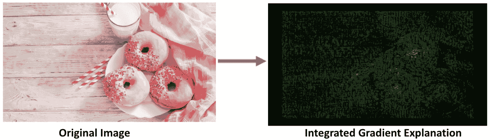

图 8.1 – 集成梯度解释

前面的图展示了集成梯度方法对图像的解释，它突出了模型在预测期间赋予高重要性的图像像素。

+   **扩展相关性加权重要性归因**（**XRAI**）

    XRAI 是一种 XAI 方法，用于可视化给定模型预测中图像的最重要区域。它是集成梯度方法的扩展，该方法结合了像素级归因与分割技术，以生成更连贯和可解释的视觉表示。通过识别图像中最重要的部分，XRAI 提供了对模型决策过程的洞察，并有助于识别模型预测中的潜在偏差或问题：

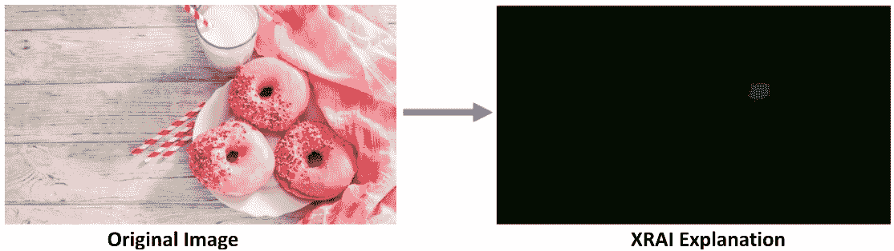

图 8.2 – XRAI

前面的图展示了 XRAI 对图像解释的方法，它突出了模型在预测期间赋予高重要性的图像区域。

+   **局部可解释模型无关** **解释** （**LIME**）

    LIME 是一种 XAI 技术，为任何分类器的单个预测提供局部解释。在图像数据的上下文中，LIME 在特定实例周围生成合成数据点（扰动图像），从模型中获得预测，并使用这些数据点与实例的邻近度进行加权，拟合一个可解释的模型（例如，线性回归）。生成的模型提供了对特定实例预测中最重要的区域的洞察。通过可视化这些区域，从业者可以更好地理解模型的决策过程，并识别模型预测中的潜在偏差或问题。

+   **梯度加权类激活** **映射** （**Grad-CAM**）

    Grad-CAM 是一种针对深度学习模型（特别是**卷积神经网络**（**CNNs**））的可视化技术。它为给定模型预测中的图像生成最重区域的热图可视化。Grad-CAM 计算预测类别分数相对于最后一层卷积层的特征图的梯度，然后使用这些梯度计算特征图的加权总和。生成的热图突出了对模型预测贡献最大的图像区域。Grad-CAM 提供了对模型决策过程的洞察，并有助于识别模型预测中的潜在偏差或不足。

这些技术提供了对模型决策过程的洞察，并有助于识别模型预测中的潜在偏差或不足。

## 表格数据技术

由结构化行和列组成的表格数据是机器学习中遇到的最常见数据类型之一。可以采用各种 XAI 技术来解释在表格数据上训练的模型：

+   **局部可解释模型无关** **解释** （**LIME**）

    如其名所示，LIME 是一种 XAI 技术，为任何分类器的单个预测提供*局部*解释。它是通过在特定实例的附近用一个更简单、可解释的模型（例如，线性回归）来近似复杂模型来实现的。LIME 在实例周围生成合成数据点，从复杂模型中获取预测，并使用这些数据点拟合一个可解释的模型，这些数据点根据它们与实例的接近程度进行加权。生成的模型提供了关于对特定实例的预测贡献最大的特征的见解。

    在下面的图中，我们使用 LIME 报告来解释一个训练有素的机器学习模型的决策，该模型根据乘客的属性（如性别、支付的票价、他们所乘坐的乘客等级等）预测泰坦尼克号乘客的生存概率。泰坦尼克号生存数据集是一个常见的公开可用数据集，用作分类模型的示例。让我们看看 LIME 是否可以帮助我们了解模型的行为：

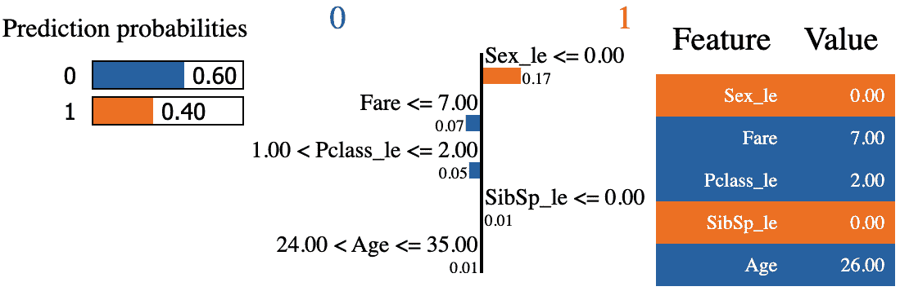

图 8.3 – 使用 LIME 解释分类模型

最左侧的图表显示了所选乘客的预测生存概率。在这个例子中，模型预测这位乘客基于其关键属性有 40%的生存概率。中间的图表显示了使用 LIME 生成的按重要性排序的特征列表。根据这个图表，似乎决定泰坦尼克号乘客是否生存的前三个最重要的特征是他们的性别/性别、支付的票价以及他们所乘坐的乘客等级。这很有道理，因为我们知道女性首先被疏散，给了她们更高的整体生存机会。我们也知道支付较低票价和持有低等级票的乘客住在船的下层甲板/楼层，这些地方首先被淹没，而支付较高票价的乘客住在上层甲板，给了他们更好的生存机会。所以，你可以看到 LIME 和类似技术如何帮助解析黑盒机器学习模型，并帮助我们更好地理解为什么做出了特定的预测。你也会很高兴地知道，我们之前用来举例的泰坦尼克号乘客是一位 26 岁的女士，名叫 Laina Heikkinen，她在三等舱乘客区支付了 7.925 美元的票价，尽管我们的模型给她低于 40%的生存机会，但她还是幸存了下来。

+   **Shapley Additive exPlanations** (**SHAP**)（在 Vertex AI 上原生支持）

    SHAP 是一种基于合作博弈论的特征重要性统一度量，提供了一种一致且公平的方式来分配特征重要性。通过计算每个特征的平均边际贡献，SHAP 为每个特征分配一个重要性值，该值反映了其对特定实例预测的贡献。Shapley 值是通过平均所有可能的特征组合中一个特征的边际贡献来计算的。SHAP 值提供了关于驱动模型预测的最具影响力的特征的见解，并且可以与各种模型一起使用。推荐模型类型包括非可微分的模型，如树的集成。它们也可以用于神经网络，其中 SHAP 可以提供关于每个输入特征对网络最终预测贡献的见解。通过分析 SHAP 值，您可以确定哪些特征对网络的输出影响最大，并了解输入与输出之间的关系：

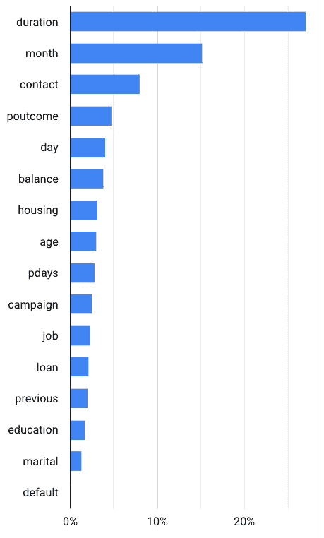

图 8.4 – 基于 Shapley 方法的 Vertex AI 中的特征重要性图

+   **置换** **特征重要性**

    置换特征重要性是一种模型无关的技术，通过测量当特征值随机打乱时模型性能的变化来估计每个特征的重要性。这个过程重复多次，平均性能下降被用作特征重要性的估计。通过破坏特征与目标变量之间的关系，置换重要性有助于识别对模型预测影响最大的特征。

+   **部分依赖** **图** （**PDP**）

    PDP 是一种可视化技术，它描绘了特定特征与模型预测结果之间的关系，同时保持所有其他特征不变。通过说明单个特征如何影响预测，PDP 可以帮助从业者更好地理解其模型的行为，并识别潜在的偏差或不一致性。

+   **特征重要性**（例如，GINI 重要性和线性模型中的系数）

    特征重要性是一组量化输入特征对模型预测影响的技巧。这些方法可以帮助从业者识别最相关的特征，使他们能够在模型开发和调试期间专注于最重要的变量。以下是一些常见的特征重要性方法：

    +   **GINI 重要性**：在决策树和随机森林中应用，GINI 重要性衡量的是特定特征在整个森林中所有树上的平均纯度减少（**GINI 指数**）。

    +   **线性模型中的系数**：在线性回归和逻辑回归中，模型的系数可以用作特征重要性的度量，表示每个特征与目标变量之间关系的幅度和方向。较大的绝对系数值表示特征与目标变量之间关系更强。

这些技术有助于从业者理解输入特征与模型预测之间的关系，识别最有影响力的特征，并评估特定特征对单个预测的影响。

## 文本数据的技术

对于使用文本数据的自然语言处理模型，目标是识别对模型预测有最大贡献的最重要单词或短语。以下是一些针对文本数据的 XAI 技术：

+   **文本特定 LIME**：这是针对文本数据特别设计的 LIME 的一个版本，通过突出显示最重要的单词或短语来为单个预测提供解释。

    在以下示例中，我们使用 LIME 来解释我们构建的用于将电影评论分类为正面或负面的机器学习模型为何得出特定的结论：

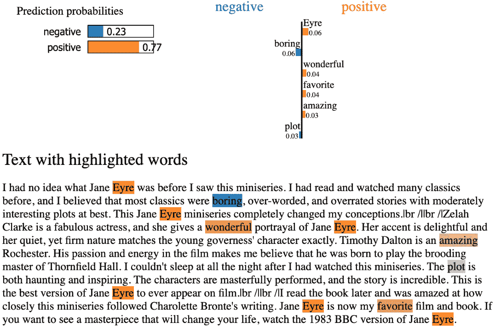

图 8.5 – 基于 LIME 的文本分类解释

如我们所见，电影评论预测为正面的概率为 0.77（77%）。橙色高亮的单词有助于提高正面的概率，而蓝色高亮的单词对将最终预测推向“负面”标签有显著贡献。右上角的图表显示了每个高亮单词对最终决策的相应贡献。例如，如果我们从评论文本中删除“amazing”这个词，正面的概率将下降 0.03：

+   **文本特定 SHAP**：这是针对文本数据特别设计的 SHAP 的一个版本，将重要性值分配给给定文本中的单个单词或短语

+   **注意力机制**：在像 Transformers 这样的深度学习模型中，注意力机制可以通过可视化注意力权重来提供关于单词与模型预测之间关系的见解。

现在我们已经熟悉了各种流行的 XAI 技术，让我们来看看 Google Cloud Vertex AI 中可用的不同功能，这些功能可以帮助我们使用这些技术构建 XAI 解决方案。

# Google Cloud Vertex AI 中可用的可解释人工智能功能

**Google Cloud Vertex AI** 提供了一套工具和选项，旨在使人工智能系统更加易于理解。本节深入探讨了 Vertex AI 中可用的各种可解释人工智能（XAI）选项，展示了该平台如何推进透明机器学习的前沿。

广义上，Vertex AI 中可用的 XAI 选项可以分为两种类型：

+   **基于特征的**：特征归因指的是模型中每个特征对特定实例预测的贡献程度。在做出预测请求时，您会收到由您的模型生成的预测值。然而，在请求解释时，您不仅会收到预测值，还会收到特征归因信息。

重要的是要注意，特征归因主要适用于表格数据，但也包括图像数据的内置可视化功能。这使得更直观地理解和解释归因变得更容易。

+   **基于示例的**：Vertex AI 利用最近邻搜索来提供基于示例的解释。这种方法涉及找到与输入最接近的示例（通常来自训练数据），并返回最相似示例的列表。这种方法利用了相似输入可能产生相似预测的原则，使我们能够深入了解模型的行为。通过检查这些相似示例，我们可以更好地理解和解释模型输出。

## Vertex AI 上可用的基于特征的解释技术

下表展示了 GCP 中可用的基于特征的解释方法。

| **方法** | **兼容的 Vertex AI 模型资源** | **示例** **用例** |
| --- | --- | --- |
| 样本 Shapley（SHAP） |

+   任何自定义训练的模型（在任何预测容器中运行）

+   AutoML 表格模型

|

+   表格数据的分类和回归

|

| 集成梯度 |
| --- |

+   使用 TensorFlow 预构建容器进行预测服务的自定义训练 TensorFlow 模型

+   AutoML 图像模型

|

+   表格数据的分类和回归

+   图像数据的分类

|

| XRAI（基于排序面积积分的解释） |
| --- |

+   使用 TensorFlow 预构建容器进行预测服务的自定义训练 TensorFlow 模型

+   AutoML 图像模型

|

+   图像数据的分类

|

表 8.1 – GCP 中可用的特征归因方法。来源：[`cloud.google.com/vertex-ai/docs/explainable-ai/overview`](https://cloud.google.com/vertex-ai/docs/explainable-ai/overview)

接下来，我们将学习如何使用这些 Vertex AI 功能来生成模型输出的解释。

## 使用 AutoML 表格数据模型中的模型特征重要性（基于 SHAP）功能

在以下练习中，我们将学习如何使用 Vertex AI 中的 XAI 功能来评估结构化数据 ML 模型中的特征重要性。

## 练习 1

目标：使用 Vertex AutoML Tables 的**特征重要性**功能来解释全局（模型级别）和局部（样本级别）行为

要使用的数据集：*银行营销数据集*（可在本书 GitHub 仓库的*第八章*文件夹中找到）

模型目标：预测客户是否会开设新的定期存款（**特征标签 –** **deposit(是/否)**）

按以下步骤操作：

1.  按照*第五章*中所示步骤，创建一个 AutoML 分类模型来预测客户开设定期存款的概率。

1.  模型训练完成后，导航到**模型注册** | **您的模型** | **您的模型版本**（*1 为新模型*） | **评估**选项卡。

1.  滚动到**特征** **重要性**部分。

1.  下面的**特征重要性**图显示了不同模型特征的相对重要性：

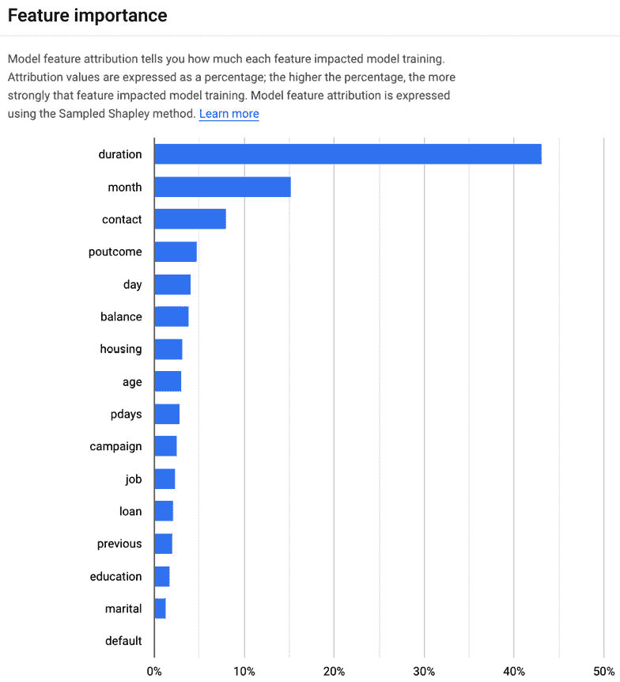

图 8.6 – Vertex AI AutoML Tables 中的特征重要性图

如前一个图所示，我们模型中预测客户是否会响应外展并开设新的定期存款的最重要特征如下：

+   **持续时间**：客户与银行的关系时长

+   **月份**：这可能是因为业务的季节性

+   **联系方式**（方法 – 手机/固定电话）：这可能是因为不同类型客户的通信偏好不同

+   **结果**：对这位客户最后一次促销活动的结果

下面的是最不重要的特征，根据前一个图：

+   **默认**：客户之前是否违约过？

+   **婚姻（状态**）

+   **教育**：达到的教育水平

+   **之前**：在此活动之前联系次数的数量

前面的信息可以帮助数据科学团队更好地理解模型的行为，并可能揭示他们对数据和客户行为的更多见解，并为未来的实验提供重要指导。

虽然在训练数据集上执行探索性数据分析超出了本书的范围，但对于感兴趣的任何人，你可以查看笔记本（*第八章* *– 机器学习模型可解释性 – 练习 1 补充资料*）以了解特征与预测标签之间的相关性分析。

从这个特征重要性信息中，我们可以得出以下见解：

+   (`Deposit_Signup`)，这与前一个图中特征重要性方面持续时间高的趋势相一致。

+   **联系方式**：同样，相关性分析还显示，拥有手机的人与对活动做出存款响应的人有很强的相关性。

+   **结果**：相关性分析还显示，“成功”与有人开设存款之间存在强烈的关联。这意味着如果有人对上次活动做出了积极回应，那么这个人受到当前活动影响的可能性更大。

+   **月份**：在相关性分析中，我们还可以看到一些月份（特别是三月和五月）与活动的积极结果有很强的相关性。这可能意味着 AutoML 将月份作为一个重要特征呈现。

## 练习 2

目标：使用 Vertex AI 的特征归因功能来解释图像分类预测

要使用的数据集：`Fast_Food_Classification_Dataset`

按以下步骤创建图像分类模型：

1.  从 Kaggle 下载并解压数据集：[`www.kaggle.com/datasets/utkarshsaxenadn/fast-food-classification-dataset`](https://www.kaggle.com/datasets/utkarshsaxenadn/fast-food-classification-dataset)

1.  按照第 *5 章* 中所示步骤，使用 `Fast_Food_Classification_Dataset` 创建一个 AutoML 图像分类数据集。确保选择数据类型和目标为**图像分类（单标签**），如图所示。

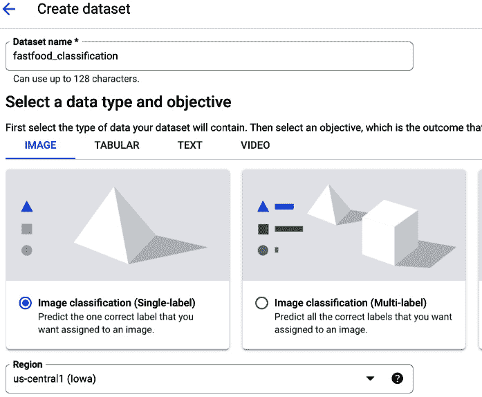

图 8.7 – 模型目标 – 图像分类（单标签）

1.  一旦创建了空数据集，转到 **浏览** 选项卡并为您计划包含在模型中的每种食物类型添加新标签。在此示例中，我们上传了我们最喜欢的快餐，包括汉堡、甜甜圈、热狗和披萨，但请随意使用您想要的任何食物类型。

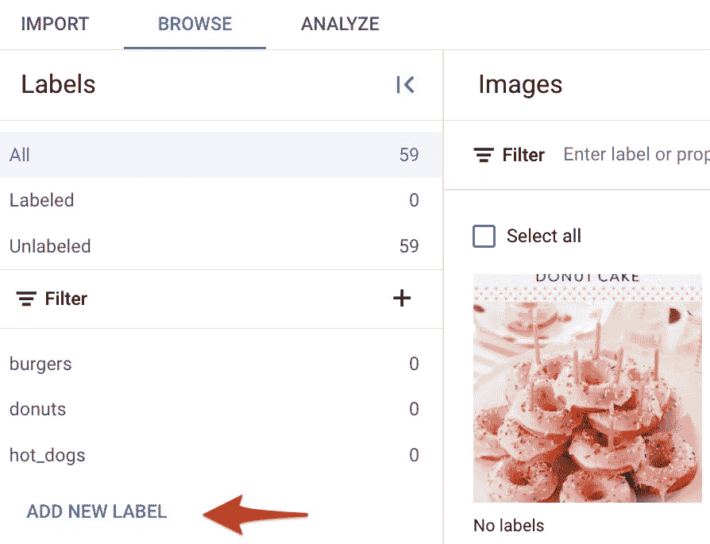

图 8.8 – 创建标签名称

1.  现在，让我们上传不同快餐类型的图像并将它们标注/标记。您不需要数据集中所有的图像。每种食物类型只需大约 50 张图像就足够了。

    对每种食物类型重复以下步骤：

    +   上传图像 – 逐个标记图像很困难。为了使标记图像变得更容易，一次上传一种食物类型的图像。

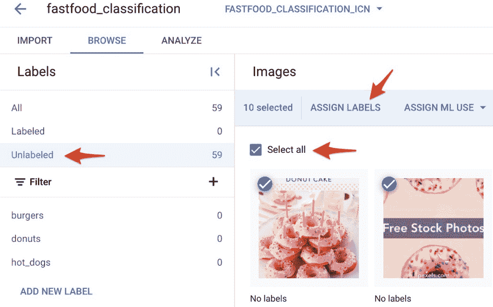

图 8.9 – 为图像添加标签

如所示，一旦上传了特定食物项目的图像，您可以点击 **未标记** 然后点击 **全选** 以选择所有需要标记的图像。如果您一次上传并标记一种食物类型，则确保您只选择该类型的图像。如果您一次性上传所有图像，那么点击 **未标记** 选项卡最终会选中所有未标记的图像，需要您手动选择一种类型的图像。

1.  选择图像后，点击 **分配标签** 并选择正确的食物类型标签。然后点击 **保存**。

    *对所有的不同* *食物类型* 进行此过程。

1.  一旦所有图像都已上传并标记，导航到 Vertex AI 中的数据集并转到 **浏览** 选项卡。

1.  点击 **训练** **新模型**：

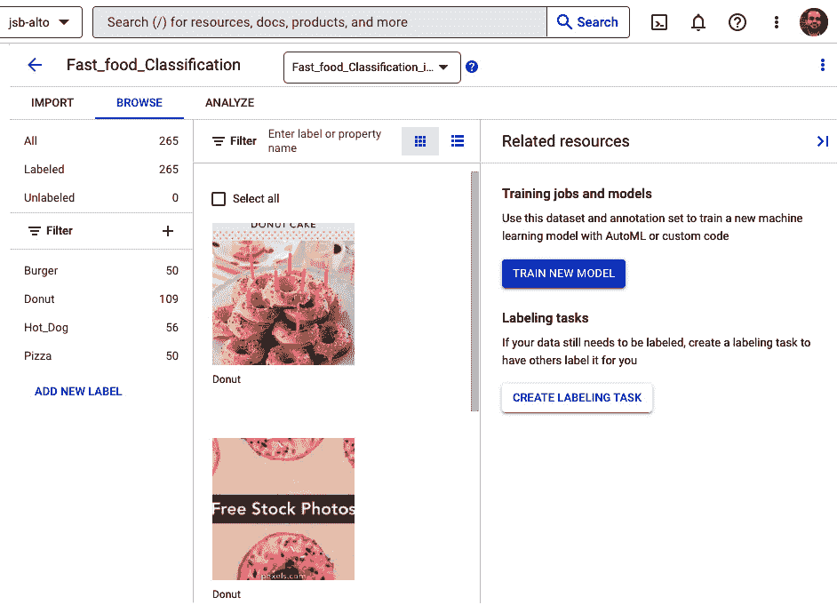

图 8.10 – 启动模型训练

1.  在下一屏幕上，选择您用于训练新模型的数据集和注释集。然后选择以下选项并点击 **继续**：

    目标：**图像** **分类**（**单标签**）

    模型训练方法：**AutoML**

    选择模型的使用位置：**云**

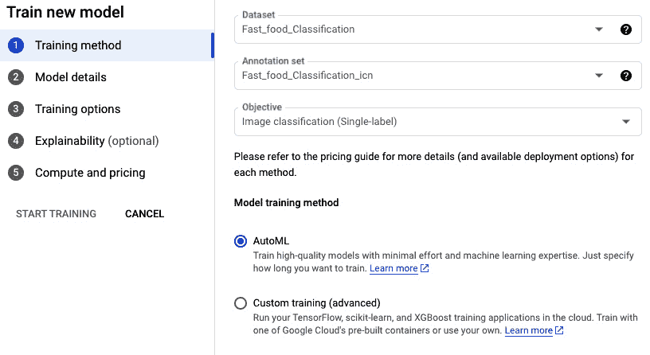

图 8.11 – 训练配置/选项

1.  在下一屏，选择**训练新模型**并输入新模型的名称。您可以保留所有其他选项不变，然后点击**继续**。

1.  在下一屏，选择**默认**作为目标并点击**继续**：

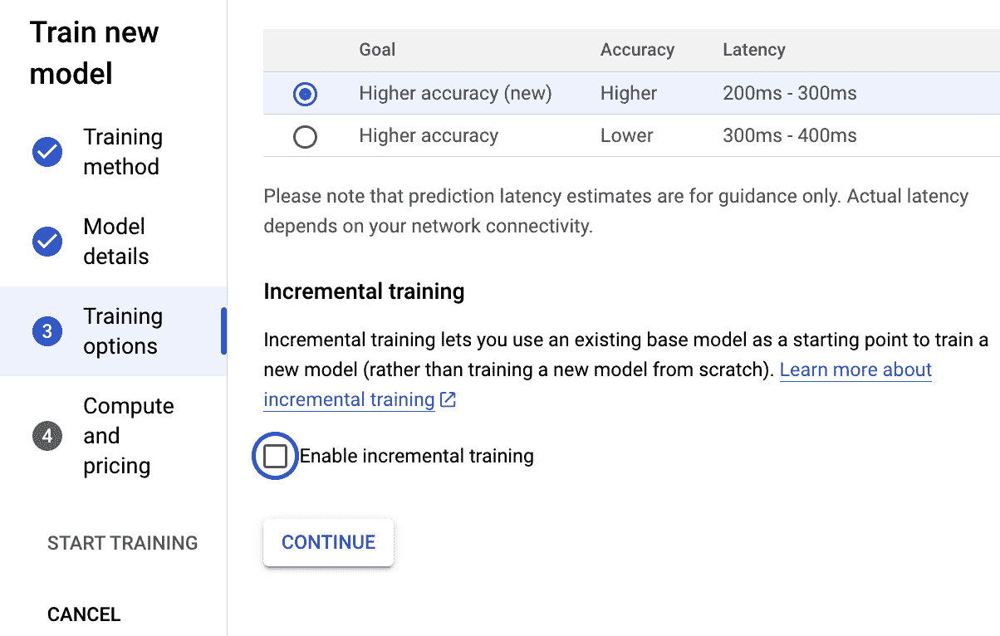

图 8.12– 训练配置/选项

1.  在下一屏（**可解释性**选项卡）中，勾选**生成可解释位图**选项。

1.  在**正**上强调具有最高正影响力的区域。本质上，它照亮了模型做出积极预测的像素，对积极预测有显著贡献。将极性更改为**负**将强调区域，使模型远离预测正类，并有助于定位导致假阴性的区域。还有一个选择**两者都**，它通过显示正负贡献来提供全面的视图。

1.  `pink_green`默认，其中绿色表示正贡献，粉色表示负贡献。另一方面，XRAI 可视化使用渐变色方案，默认为`Viridis`。在这个设置中，最有影响力的区域被黄色笼罩，而影响力较小的区域则被蓝色阴影覆盖。有关可用调色板的完整列表，请参阅 API 文档中的**可视化**消息。

1.  **叠加类型**：此设置定义了原始图像在可视化中的展示方式。调整叠加可以增强可见性，尤其是在初始图像的固有属性掩盖了可视化细节时。

1.  **步骤**：可以在此处指定用于近似路径积分的步骤数。建议从 50 开始，逐渐增加，直到“求和到差”属性落在所需的误差范围内。此值的有效范围在 1 到 100 之间：

图 8.13 – 可解释性配置

+   在**计算和定价**选项卡中，将预算设置为 8 小时。这指定了训练将运行的最大时间。

1.  点击**开始训练**。

    （咖啡休息时间太短了，所以也许可以去准备一顿七道菜的晚餐，然后几个小时后回来检查训练状态！）

    模型训练完成后，我们需要按照以下步骤将模型部署到 Vertex AI 端点。

1.  导航到**模型注册** | **您的模型** | **您的模型版本**（*1 用于* *新模型*）。

1.  导航到**部署与测试**选项卡并点击**部署到端点**。

1.  输入端点名称并点击**继续**：

图 8.14 – 模型部署选项

1.  在**模型设置**选项卡中，勾选**为此模型启用特征归因**，然后点击下方的**编辑**按钮以打开**可解释性****选项**菜单：

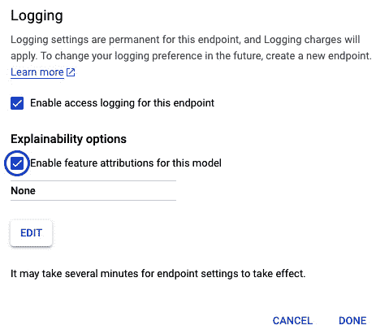

图 8.15 – 可解释性部署配置

1.  在**可解释性选项**菜单中，选择**集成梯度**选项，因为我们首先创建一个端点来测试集成梯度技术。点击**完成**。

1.  现在，重复这些步骤以创建一个用于**XRAI**可解释性选项的端点。这次，在端点名称后缀加上 XRAI，并在**可解释性选项**屏幕上选择**XRAI**。

1.  到此为止，应该已经为模型创建了两个端点。

现在，通过上传一个甜甜圈的样本图片来测试模型，并评估模型返回的预测和解释：

1.  在模型的**部署与测试**标签页中，通过点击**端点 ID**选择**集成梯度**端点。不要点击端点的名称，因为这会带您进入端点的设置屏幕。

1.  点击**上传并解释**并选择您想要测试的图片。

1.  Vertex AI 将处理图像，并展示图像的最终分类结果，以及一个解释（图像叠加将显示图像中重要性高的区域）：

图 8.16 – 上传的图片

以下截图显示了基于机器学习模型的类别预测，以及 Vertex AI 生成的基于集成梯度的解释。解释图像展示了图像中帮助模型做出最终决策认为这是一张甜甜圈的关键区域/像素：

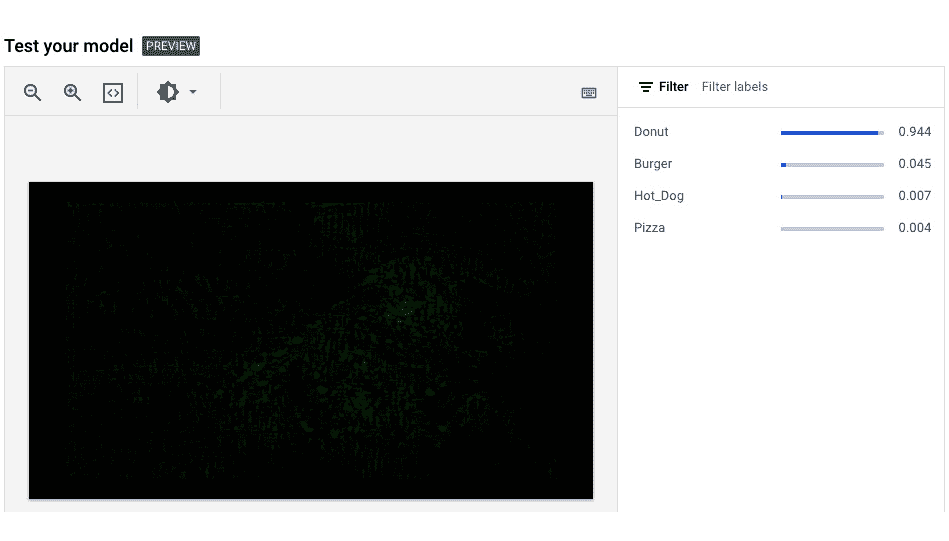

图 8.17 – 结果集成梯度解释和预测类别

1.  您可以使用 XRAI 端点重复此步骤以获取使用 XRAI 技术生成的解释：

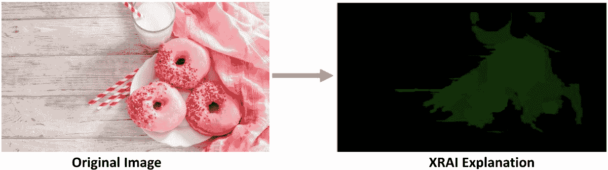

图 8.18 – XRAI 解释

如您所见，通过集成梯度和 XRAI 技术生成的解释图像，图像中靠近甜甜圈位置的区域/像素被突出显示，模型似乎专注于正确的区域。

现在，让我们看看基于示例的解释，在这里，我们不是根据输入实例的特征来解释结果，而是尝试通过查看数据集中与输入实例相似的示例来解释结果。

## 基于示例的解释

Vertex AI 的基于示例的解释功能使用最近邻搜索算法来找到与样本最接近的匹配项。本质上，当给定一个输入时，Vertex AI 会识别并提供一组示例，这些示例通常来自训练数据，并且与给定输入非常相似。这一功能基于一个共同的预期，即具有相似属性的输入将导致相应的预测。因此，这些识别出的示例成为理解并阐明我们模型的工作方式和决策的一种直观方式。

此方法在以下场景中可能非常有帮助：

+   **识别错误标记的示例**：如果解决方案定位到在向量空间中彼此靠近但标签不同的数据样本或嵌入，那么数据样本可能被错误标记。

+   **决策支持**：如果对新数据点的预测标签与在向量空间中出现在新数据点附近的其他数据点的真实标签相似，那么这可以帮助确认预测的有效性。

+   **主动学习**：在向量空间中，您可以识别出现在有标签样本附近的未标记样本，并将它们添加到训练数据中，标签与附近样本的标签相同。

Vertex AI 中基于示例的解释功能可以被任何为其输入提供嵌入（潜在表示）的模型利用。这意味着该模型应该能够将输入数据转换为潜在空间中的一组相关特征或向量。这排除了某些类型的模型，例如决策树等基于树的模型，因为它们固有的性质不创建这些潜在空间。

## 使用基于示例的解释的关键步骤

这里是关键步骤：

1.  在模型创建时启用解释：首先创建一个已启用解释的模型并将其上传到 Vertex AI。当您创建/导入模型时，您可以使用模型的`explanationSpec`字段为所有解释设置默认配置。

    为了促进基于示例的解释生成，您的模型应满足某些标准。存在两种潜在的情景：

    +   您可以实现一个**深度神经网络**（**DNN**）模型，在这种情况下，应提供特定层或签名的名称。然后，该层或签名的输出被用作潜在空间。

    +   或者，模型可以被设计为直接输出嵌入，从而作为潜在空间的表示。

    这个潜在空间对于过程至关重要，因为它包含了在生成解释中起关键作用的示例表示。

1.  将模型部署到端点：接下来，创建一个端点资源并将您的模型部署到该资源，从而建立一个可交互的通道。

1.  探索生成的解释：最后，向部署的模型发出解释请求，并仔细审查提供的解释，以了解您的模型决策过程。

## 练习 3

自定义训练一个图像分类模型以生成实时预测并提供基于示例的解释——参见*笔记 8.3 – 使用 Vertex AI 实现基于示例的解释* ([`github.com/PacktPublishing/The-Definitive-Guide-to-Google-Vertex-AI/blob/main/Chapter08/Chapter8_Explainable_AI_example_based.ipynb`](https://github.com/PacktPublishing/The-Definitive-Guide-to-Google-Vertex-AI/blob/main/Chapter08/Chapter8_Explainable_AI_example_based.ipynb))

# 摘要

在本章中，我们深入探讨了可解释人工智能（XAI）的世界及其在现代机器学习运维（MLOps）中的相关性。我们讨论了 XAI 如何帮助建立信任、确保合规性、调试和改进模型，以及解决伦理问题。

我们探讨了针对不同类型数据的多种解释技术，包括表格数据、图像数据和文本数据。对于表格数据，讨论了 LIME、SHAP、排列特征重要性等技巧。对于图像数据，解释了集成梯度和 XRAI 等方法，而对于文本数据，则展示了针对文本数据的特定 LIME。

本章还概述了 GCP 中可用的 XAI 功能，包括基于特征和基于示例的解释。

到目前为止，您应该已经对 XAI、其重要性、各种技术和在 Vertex AI 背景下的实际应用有了很好的理解。随着人工智能领域的不断发展，XAI 在创建透明、值得信赖和公平的机器学习模型中的作用将只会增长。作为 MLOps 从业者，掌握这些技能对于引领道德和负责任的 AI 采用至关重要。

在下一章中，我们将介绍各种 Vertex AI 工具，这些工具可以帮助您迭代模型超参数，以提升您的机器学习解决方案的性能。

# 参考文献

[`cloud.google.com/vertex-ai/docs/explainable-ai/overview`](https://cloud.google.com/vertex-ai/docs/explainable-ai/overview)

Munn, Michael; Pitman, David. *可解释人工智能实践者*. O’Reilly Media.
