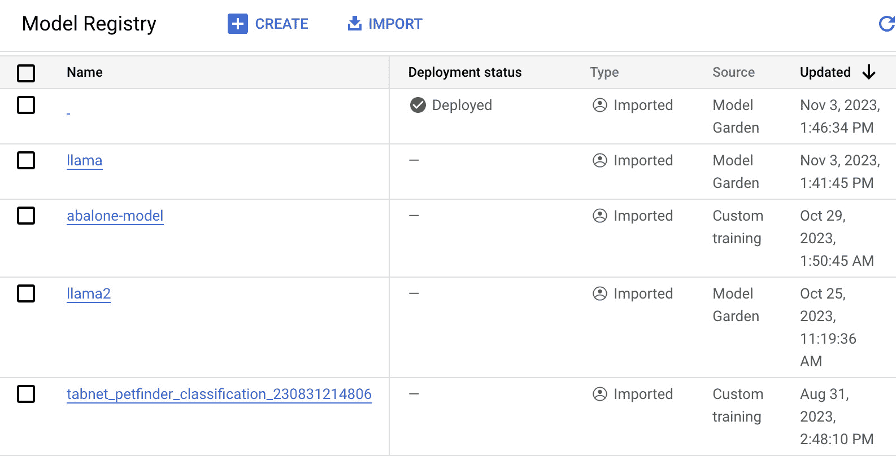
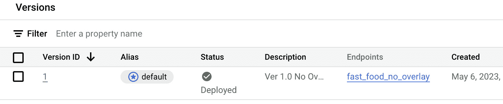
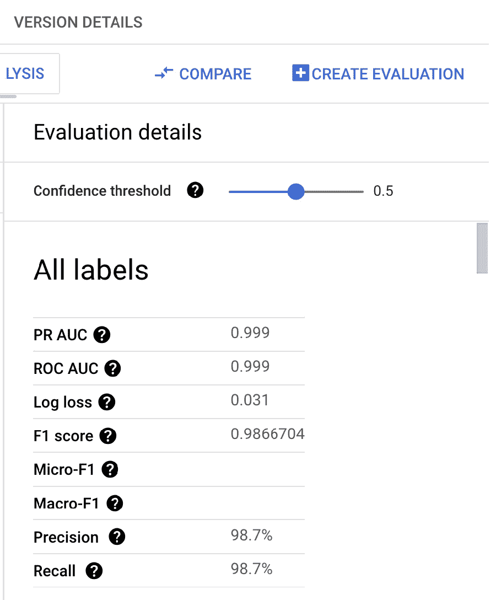
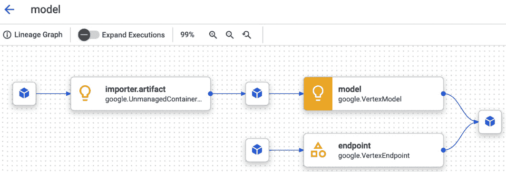
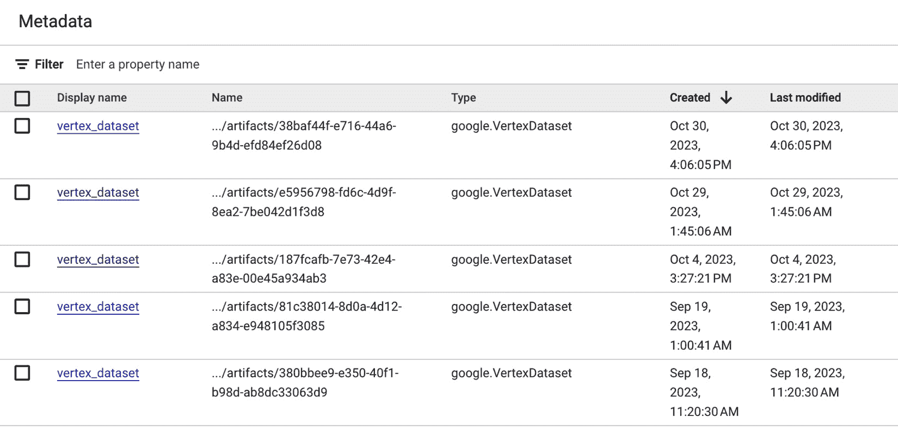

# 11

# 使用 Vertex AI 的 MLOps 治理

在快速发展的数字时代，成功实施机器学习（ML）解决方案并不仅仅是创建能够准确预测复杂用例结果的复杂模型。虽然这无疑是必要的，但人工智能（AI）/机器学习操作（MLOps）的熟练管理和治理同样重要。这在企业环境中尤为重要，公司必须确保他们遵守多项内部政策和法规合规要求。本章深入探讨不同的 MLOps 治理组件以及如何利用 Google Cloud 中可用的功能来实施它们。

MLOps 治理围绕建立一个结构化的方法来管理和优化机器学习操作的各个组成部分。它包括确保机器学习项目顺利运行并符合所需政策和法规的过程、工具和指南。

在本章中，我们将涵盖 Google Cloud 上的 MLOps 治理，重点关注以下关键领域：

+   理解 MLOps 治理

+   MLOps 治理案例研究

+   在 Google Cloud 上实施 MLOps 治理

到本章结束时，我们的目标是让您全面了解 MLOps 治理、在 Google Cloud 上的实施以及它在维护成功、可扩展和合规的机器学习操作中的关键作用。

# 什么是 MLOps 治理及其关键组成部分？

MLOps 是指将机器学习（ML）、数据科学和 DevOps 原则相结合的学科，以有效地管理机器学习模型的整个生命周期。MLOps 的目标是创建一个简化的管道，用于开发、部署和维护机器学习模型，确保这些模型提供可靠和一致的结果。然而，实施和管理这种实践需要治理框架来确保遵守最佳实践和标准。我们所说的 MLOps 治理就是指这个治理框架。

MLOps 治理是实施和管理组织内部机器学习模型的一个基本但往往被忽视的方面。它包含了一套全面的规则、程序和指南，旨在监督机器学习模型在其整个生命周期中的运行。这种治理在确保 MLOps 管道平稳和道德地运行、减轻与机器学习模型部署和使用相关的任何风险方面发挥着关键作用。

MLOps 治理的主要焦点是在组织内部创建一个可靠、透明和可问责的机器学习（ML）系统。这包括监督数据管理、模型开发、模型部署、模型监控和模型审计，可以分为两个关键方面：**数据治理**和**模型治理**。

## 数据治理

ML 模型的质量仅取决于其训练所使用的数据。在 MLOps 管理中，数据处理指的是对数据收集、存储、处理和使用的管理。它包括确保数据的质量和相关性、保护数据隐私以及遵守相关法规。这保证了用于模型训练的数据不仅质量高，而且来源和用途符合伦理。

## 模型治理

模型治理包括以下组件：

+   **模型部署管理**：监督模型部署包括确保模型正确集成到组织的系统中，并按预期运行。它还涉及检查模型是否无意中造成任何有害后果，例如偏差结果或隐私侵犯。

+   **模型审计**：MLOps 管理确保对 ML 模型在性能、伦理影响和整体对组织影响方面进行系统性的审查。模型审计对于保持透明度和问责制至关重要，尤其是在模型的预测对商业决策或用户体验有重大影响的情况下。

+   **模型监控**：一旦模型部署，MLOps 管理要求持续监控其性能的任何变化。这包括跟踪模型的准确性、检测数据漂移，并确保模型持续提供可靠的预测。

MLOps 管理不是一刀切的做法；它需要根据每个组织的具体需求和情况量身定制。这可能涉及根据处理的数据的性质、使用的 ML 模型类型、这些模型的具体应用以及更广泛的监管环境来定制管理体系。

总结来说，MLOps 管理是任何采用 ML 模型的组织的关键组成部分。通过建立强大的 MLOps 管理体系，组织可以确保其 MLOps 实践不仅有效，而且符合道德、透明和合规。

# 突出 MLOps 管理重要性的企业场景

为了理解 MLOps 管理的重要性，让我们通过一些强调这一点的现实场景来探讨。

## 场景 1 – 限制 AI 解决方案中的偏差

考虑一家金融服务业公司部署了一套机器学习模型来预测信用风险。金融领域的这家大型公司会有一系列内部政策，涉及数据访问、使用和预测模型的风险评估，其机器学习解决方案需要遵守这些政策。这可能包括限制可用于此类目的的数据，以及谁可以访问模型输出。它还必须遵守多项监管要求，例如防止决策模型中对受保护群体的偏见。例如，银行需要确保其贷款审批的决策过程不会基于种族或性别产生偏见。即使监管者无法解读底层机器学习模型，他们也可以进行统计分析，以检测贷款审批与种族等因素之间是否存在显著的相关性。如果发现银行在决策中存在偏见，除了会受到监管机构的重大罚款外，还会面临重大的公关灾难。因此，银行需要在机器学习开发的生命周期中建立制衡机制，以标记其开发中的模型中可能出现的任何此类问题，并防止此类模型进入生产环境。

## 场景 2 – 持续监控特征分布的变化

考虑一个在线电子商务巨头广泛使用人工智能为零售客户提供个性化推荐的情况。它有一套在生产中似乎运行良好的模型。现在，零售商正在进行大规模的市场推广，以获取其客户基础中迄今为止代表性不足的额外地区的用户。随着来自新地区客户的大量涌入，零售商的业务发展团队根据新的月度销售分析报告注意到其点击率和每用户会话收入急剧下降。当其分析师深入研究可能的原因时，他们意识到新地区用户的年龄分布与现有地区客户的年龄分布存在显著差异。这种特征/数据分布的变化在 MLOps 术语中被称为**数据漂移**，可能会对用户体验和公司最终底线产生重大影响。尽管我们正在考虑一个假设场景，即公司向额外地区的扩张导致数据发生变化，但这可能由多种不同的情况引起，包括但不限于营销策略的变化、经济的变化和产品供应的变化。

因此，重要的是要建立检查机制，以便及早发现推理输入数据中的此类重大变化，以便数据科学团队能够通过构建使用更近期数据的更新模型或构建更针对性的模型来减轻其影响。

## 场景 3 – 监控成本的需求

权力越大，责任越大。就像云中的任何其他可扩展技术一样，如果资源没有合理规划，并且没有在 Google Cloud 项目中设置适当的预算和限制作为安全措施，您的团队可能会产生巨额账单。考虑这样一种情况，数据科学家启动了一个 Vertex AI Workbench 环境，节点上连接了一个昂贵的 GPU 进行快速实验，但后来忘记了关闭机器。另一个类似的场景是，有人试图安排一个每月运行一次的 MLOps 管道，使用一个极其庞大的 GPU 集群，但错误地将其配置为每天运行一次，从而使成本增加了 30 倍。这样的错误可能本身不会让一家典型的中型公司破产，但您可以想象这样的成本如何迅速累积，尤其是在大型、分散的团队中，没有人完全清楚在价值 10,000 美元/月的集群上运行了 3 天的训练作业是否是实际跟踪的实验，或者它只是个错误。因此，设置成本管理政策非常重要，更重要的是，设置自动控制，以限制在 **Google Cloud 平台**（**GCP**）上特定资源的使用。

## 场景 4 – 监控训练数据的来源

尽管数据控制主要将由数据所有者处理，但 AI 产品/解决方案领导者需要意识到他们从哪里获取数据。如果用于训练模型的发现数据未授权或来自数据质量可疑的来源，这可能导致大量资源浪费，包括基础设施成本和人力成本。

现在，让我们看看 Vertex AI 内部可用的不同工具和功能，这些工具可以帮助您在您的机器学习解决方案中实施 MLOps 治理。

# Vertex AI 中可以帮助进行治理的工具

Vertex AI 提供了几个工具来帮助进行机器学习解决方案的治理和监控，您可以使用这些工具来实施和跟踪您组织的标准治理政策和更通用的治理最佳实践。请记住，对于许多治理政策，特别是关于安全和成本管理的政策，您将需要使用 Vertex AI 之外的工具。例如，为了设置每月的成本限制和预算，您将需要使用 GCP 的原生计费工具。

让我们详细了解 Vertex AI 内部可用于作为 MLOps 治理流程一部分的不同工具：

## 模型注册表

Vertex AI 模型注册表提供了一个集中、组织和安全的位置，用于管理组织内部的所有机器学习模型。这促进了从开发、验证到部署和监控的流畅和高效的机器学习操作：

图 11.1 – Vertex AI 模型注册表

作为管理您的机器学习模型生命周期的中心枢纽，Vertex AI 模型注册表提供了对您模型的鸟瞰图，从而使得跟踪和训练新模型版本的方法更加有序和高效。它作为部署您首选模型版本到端点的接入点，无论是直接部署还是通过使用别名。

Vertex AI 模型注册表扩展了对所有 AutoML 数据类型的自定义模型的支持——无论是文本、表格数据、图像还是视频。此外，它还可以集成 BigQuery ML 模型，这意味着如果您有通过 BigQuery ML 训练的模型，您可以轻松地在 Vertex AI 模型注册表中注册它们。

导航到模型版本详情页面，您将获得许多选项：您可以评估模型、将其部署到端点、设置批量预测，并检查与模型相关的特定细节。凭借其用户友好的简化界面，Vertex AI 模型注册表简化了您管理和部署最佳模型到生产环境的方式。

让我们探讨 Vertex AI 模型注册表如何促进机器学习治理：

+   **模型集中存储库**：模型注册表提供了一个单一的位置，用于存储组织中的所有模型。这个集中存储库使得数据科学家、机器学习工程师和 DevOps 团队能够轻松地存储、访问和管理模型。它还促进了跨职能的可见性和协作，这是维护强大治理框架的必要元素。

+   **版本控制和模型血缘**：每次训练新模型或更新现有模型时，模型注册表中都会创建一个新的版本。它维护了模型所有版本的记录，使得跟踪和比较不同版本变得容易，并确保任何更新或修改都得到适当的记录和考虑：

图 11.2 – Vertex AI 模型注册表（版本视图）

+   **模型元数据管理**：结合元数据存储，它可以帮助记录模型的血缘关系，提供有关用于构建模型每个版本的训练数据集、模型参数和训练管道的信息。这种血缘信息对于审计和合规目的至关重要，是机器学习治理的关键方面。

+   **模型验证和测试**：在将模型部署到生产环境之前，需要对其进行验证和测试，以确保其满足所需的性能指标。模型注册表通过集成 Vertex AI 的模型评估工具来支持这一点。这些工具可以比较不同的模型版本，并验证它们是否符合预定义的指标，确保只有准确且可靠的模型被部署。您可以直接从模型详情页面查看有关您模型的详细信息，包括性能指标：

图 11.3 – Vertex AI 模型评估

+   **与其他 Vertex AI 服务的集成**：模型注册表无缝集成到其他 Vertex AI 服务中，包括训练管道和预测服务。Vertex AI 模型注册表允许您通过几点击或几行代码轻松地将模型部署到端点进行实时预测。与 BigQuery 的集成允许您将 BQML 模型注册到 Vertex AI 模型注册表中，以便您可以在一个地方跟踪所有模型。这种集成促进了端到端的 MLOps 治理，允许高效、一致和受控的机器学习操作。

接下来，让我们看看元数据存储。

## 元数据存储

Vertex AI 元数据存储提供了一个强大、可扩展的系统，用于跟踪和管理与您的机器学习工作流程相关的所有元数据。在此背景下，元数据指的是关于使用的数据、模型训练运行细节、这些运行中使用的参数、生成的指标、创建的工件等信息：

图 11.4 – Vertex AI 元数据存储模型血缘

通过系统地收集和组织这些元数据，Vertex AI 元数据存储能够全面跟踪整个机器学习生命周期，从而促进有效的机器学习治理。以下是具体方法：

+   **可追溯性**：Vertex AI 元数据存储的一个关键特性是能够为跟踪的机器学习工作流程提供端到端的可追溯性。对于每个构建的模型，它可以追溯数据来源和预处理、特征工程、模型训练、验证和部署过程中所采取的步骤。

+   **模型实验和比较**：Vertex AI 元数据存储允许您跟踪和比较不同的模型版本、参数和指标。这有助于治理，确保模型开发和选择是系统化和透明的，从而更容易复制和审计您的流程。

+   **一致性和标准化**：通过使用 Vertex AI 元数据存储，组织可以在不同的机器学习工作流程中标准化元数据。这促进了机器学习工作流程执行和跟踪的一致性，使得应用治理政策和程序更加容易。

+   **合规性和监管遵从性**：在医疗保健或金融等行业，机器学习模型必须遵守严格的监管要求。Vertex AI 元数据存储通过提供详细的模型血缘来帮助实现合规性，该血缘可以将最终训练好的模型与数据源联系起来，并展示在模型部署到生产之前遵循了最佳实践和满足了适当的评估标准。

+   **可重现性**：Vertex AI 元数据存储在确保机器学习实验的可重现性方面也发挥着重要作用，这是机器学习治理的一个关键方面。通过跟踪实验的所有元素，包括数据、配置、参数和结果，它确保实验可以在未来可靠地重现。

+   **协作和沟通**：元数据存储可以促进团队内部的更好协作和沟通。通过全面跟踪机器学习工作流程，团队成员可以了解其他人正在做什么，促进透明度和有效协作。

Vertex AI 元数据存储是您机器学习操作相关元数据的综合存储库，以图形的形式呈现：

图 11.5 – Vertex AI 元数据存储

在这个基于图形的元数据框架中，艺术品和执行形成节点，而事件作为连接边，指定艺术品为特定执行的输入或输出。*上下文*表示逻辑子组，包含选定的艺术品和执行集合，以便于参考。

Vertex AI 元数据存储允许将元数据作为键值对应用于艺术品、执行和上下文中。例如，一个训练好的模型可以携带元数据，提供有关所使用的训练框架的详细信息，性能指标，如准确率、精确率和召回率等。

要全面掌握您的机器学习系统性能的变化，对由您的机器学习工作流程产生的元数据和其艺术品的家谱进行彻底分析是强制性的。一个艺术品的家谱包含了所有对其起源有贡献的元素，以及从这个根艺术品起源的后续艺术品和元数据。

以一个模型的谱系为例，它可能包括以下元素：

+   用于模型训练、测试和评估的数据集

+   模型训练过程中使用的超参数

+   在训练模型中起关键作用的特定代码库

+   从训练和评估阶段积累的元数据，例如模型的准确率

+   从这个父模型派生出的艺术品，例如批量预测结果

Vertex ML 元数据系统以分层结构组织资源，需要所有资源都属于元数据存储。因此，建立元数据存储是创建元数据资源的先决条件。

让我们深入了解在 Vertex ML 元数据中使用的核心概念和术语，这构成了组织资源和组件的基础：

+   **元数据存储**：这是元数据资源的顶级容器。元数据存储是区域特定的，并与一个唯一的 Google Cloud 项目相关联。通常，组织在每个项目中使用一个共享的元数据存储来管理元数据资源。

+   **元数据资源**：Vertex ML Metadata 提供了一个类似于图的数据模型来体现来自和由 ML 工作流使用的元数据。该模型下的主要概念包括工件、执行、事件和上下文。

+   **工件**：在 ML 工作流中，工件是一个生成的或消耗的独立实体或数据片段。它可以是数据集、模型、输入文件、训练日志等等。

+   **上下文**：上下文被用来将工件和执行分组到一个可搜索和分类型的类别下。它可以用来表示一组元数据。例如，一个 ML 管道的运行可以被指定为一个上下文。

为了说明，上下文可以封装以下元数据集：

+   Vertex AI Pipelines 管道的一次运行，其中上下文代表运行过程，每个执行符号化 ML 管道中的一个步骤。这展示了如何将工件、执行和上下文融合到 Vertex ML Metadata 的图数据模型中。

+   从 Jupyter Notebook 运行的实验。在这里，上下文可以代表笔记本，每个执行可以表示笔记本中的单元格：

    +   **事件**：事件是用来描述工件和执行之间连接的术语。每个工件可以由一个执行生成，并由其他执行消耗。事件通过将工件和执行链接在一起，有助于在 ML 工作流中建立工件的血缘关系。

    +   **执行**：执行是 ML 工作流中单个步骤的日志，通常带有其运行时参数。执行的例子包括模型训练、模型评估、模型部署、数据验证和数据摄取。

    +   **元数据模式**：MetadataSchema 为特定类型的工件、执行或上下文提供了一个模式。这些模式在创建相应的元数据资源时用于验证键值对。模式验证仅检查资源和 MetadataSchema 之间的匹配字段。这些类型的模式使用 OpenAPI 模式对象表示，通常使用 YAML 进行描述。

### 练习 - 使用 Vertex AI 元数据存储跟踪 ML 模型开发

请参阅附带的笔记本，*Chp11_Metadata_Store.ipynb*，[`github.com/PacktPublishing/The-Definitive-Guide-to-Google-Vertex-AI/blob/main/Chapter11/Chp11_Metadata_Store.ipynb`](https://github.com/PacktPublishing/The-Definitive-Guide-to-Google-Vertex-AI/blob/main/Chapter11/Chp11_Metadata_Store.ipynb)，它将指导你完成创建元数据存储以存储 Vertex AI Pipeline 运行中工件的操作。

接下来让我们谈谈特征存储。

## 特征存储

Google Cloud 的 Vertex AI 特征存储是一个托管服务，允许数据科学家和 ML 工程师创建、管理和共享 ML 特征。该服务有助于加速将原始数据转换为 ML 模型的过程，确保模型是用既可靠又一致的高质量数据构建的。

虽然 Vertex AI 特征存储主要简化了模型开发过程，但它也在支持机器学习治理方面发挥着重要作用。让我们深入了解该服务如何协助机器学习治理的各个方面：

+   **数据管理和可追溯性**：机器学习治理的一个关键方面是确保用于开发机器学习模型的数据是准确、相关且可追溯的。Vertex AI 特征存储通过维护模型血缘的元数据来促进这一点。这种可追溯性使得有效地审计整个数据管道成为可能，从而在机器学习操作中促进透明度和问责制。

+   **数据一致性**：在训练和部署模型使用的数据一致性对于机器学习治理至关重要。不一致性可能导致结果偏差，对模型的性能和可靠性产生负面影响。Vertex AI 特征存储为训练和在线部署提供统一的存储，确保在这些阶段使用相同的数据特征。

+   **数据质量监控**：维护数据质量是机器学习治理的另一个重要方面。差劣的数据质量可能导致有偏或错误的模型预测。Vertex AI 特征存储通过提供监控和验证输入到特征存储中的数据的功能来帮助管理这一点。它可以帮助识别数据分布随时间的变化或异常，从而允许及时干预和纠正。

+   **数据版本控制和可重复性**：在机器学习治理的背景下，管理特征的多个版本对于跟踪时间变化和实现可重用性至关重要。Vertex AI 特征存储自动跟踪数据更新并支持时间点查找，这有助于训练实验的一致性和模型的可重复性。

+   **隐私和安全**：机器学习治理还涉及确保遵守数据隐私和安全法规。Vertex AI 特征存储建立在 Google Cloud 强大的安全模型之上，确保敏感数据在静态和传输过程中都得到加密。借助 Google Cloud 的**身份和访问管理**（**IAM**），组织还可以对特征存储实施细粒度的访问控制，确保只有授权人员才能访问敏感数据特征。

使用特征存储时的最佳实践如下：

+   **为多个实体建模特征**：存在一些特征适用于多种类型实体的场景。例如，考虑一个跟踪用户对产品点击的计数值。这样的特征共同描述了产品-用户对。在这些情况下，建议创建一个新的实体类型，如**产品-用户**，以分组共享的特征。如果 ID 是字符串，可以通过组合涉及实体的 ID 来形成实体 ID。这些共同形成的实体类型被称为复合实体类型。

+   **使用 IAM 策略管理访问权限**：IAM 角色和策略为满足不同需求的多个团队提供了强大的管理访问权限的方式。例如，您可能拥有机器学习研究人员、数据科学家、DevOps 和站点可靠性工程师，他们都需要访问相同的特征存储，但他们的访问范围可能不同。资源级 IAM 策略可以用于控制对特定特征存储或实体类型的访问。这允许您的组织中的每个角色或角色都有预定义的 IAM 角色，以适应所需的特定访问级别。

+   **通过资源监控和调整优化批量导入**：批量导入作业可能会增加特征存储的 CPU 利用率，从而影响在线服务性能。为了达到平衡，可以考虑为每个在线服务节点启动一个工作进程，然后监控导入期间的 CPU 使用情况。可以根据监控结果调整工作进程的数量，以优化吞吐量和 CPU 使用率。

+   **使用 disableOnlineServing 字段管理历史数据**：在回填过程中（即，导入历史特征值）期间，您可以禁用在线服务，这实际上绕过了对在线存储的任何修改。

+   **采用自动扩展以优化成本**：对于面临负载频繁波动的用户，自动扩展可以帮助优化成本。这使 Vertex AI 特征存储能够根据 CPU 利用率自动调整节点数量。然而，值得注意的是，自动扩展可能不是管理流量突然激增的最佳解决方案。

+   **测试在线服务节点以评估实时服务性能**：测试在线服务节点的性能对于确保特征存储的实时性能至关重要。这可以通过基准测试 QPS、延迟和 API 等参数来实现。请记住，从同一区域运行这些测试，使用 SDK 中的 gRPC API 以获得更好的性能，并执行长时间测试以获得更准确的指标。

+   `batchReadFeatureValues`或`exportFeatureValues`请求。这确保请求在可用特征数据的一个子集上运行查询，这可以在离线存储使用成本上带来显著节省。

### 练习 - 使用 Vertex AI 特征存储对特征进行编目和监控

请参阅随附的笔记本，*Chp11_feature_store.ipynb*，[`github.com/PacktPublishing/The-Definitive-Guide-to-Google-Vertex-AI/blob/main/Chapter11/Chp11_feature_store.ipynb`](https://github.com/PacktPublishing/The-Definitive-Guide-to-Google-Vertex-AI/blob/main/Chapter11/Chp11_feature_store.ipynb)，它将指导您完成在 Vertex AI 中启用模型监控的练习

我们将在下一节讨论 Kubeflow 管道。

## Vertex AI 管道

此主题在*第十章*中详细讨论，*Vertex AI 部署和自动化工具*。

Vertex AI Pipelines 旨在帮助管理和编排 ML 工作流，它在 ML 治理中发挥着重要作用。通过提供一个构建、部署和管理 ML 工作流的平台，这个工具使组织能够为其 ML 操作实施有效的治理流程：

+   **定义和复用 ML 管道**：Vertex AI Pipelines 和 Kubeflow Pipelines 支持将管道定义为一系列组件化步骤。这些步骤可以封装数据预处理、模型训练、评估、部署等。通过定义这些步骤，您可以强制执行最佳实践，确保管道的每一步都是可追踪的，并保证所有模型都是一致开发的。

+   在多个工作流中复用管道和组件是另一个显著优势。这有助于在不同机器学习（ML）项目中实现标准化，这是 ML 治理的关键方面。标准化不仅促进了代码和流程的复用，还降低了错误的风险，并确保了 ML 模型构建和部署的一致性。

+   **版本控制和实验跟踪**：Vertex AI Pipelines 和 Kubeflow Pipelines 都提供了版本控制和实验跟踪的功能。通过 ML 模型版本控制，可以管理不同版本的模型，并在必要时回滚旧版本。

+   实验跟踪对于治理也至关重要。它提供了不同模型参数和数据集如何影响模型性能的可见性。记录和比较实验的能力也促进了可审计性，使您能够了解每个模型背后的决策过程。

+   **自动化和可重复的管道**：自动化 ML 工作流确保所有步骤都一致且可靠地执行，这是 ML 治理的一个基本方面。Vertex AI Pipelines 和 Kubeflow Pipelines 都允许创建自动化管道，这意味着 ML 过程中的每一步都是可重复的。

+   可重复性是 ML 治理中经常被低估的方面。可重复的管道意味着您可以在管道的每一步跟踪数据、代码、配置和结果，这对于调试和审计至关重要。当您的模型需要遵守某些法规时，这些法规要求透明的可解释模型开发过程，这一点尤为重要。

+   **与其他 Google Cloud 服务的集成**：Vertex AI Pipelines 和 Kubeflow Pipelines 被设计成与其他 Google Cloud 服务无缝协作，例如 BigQuery 用于数据管理，Cloud Storage 用于存储模型和数据，以及 AI Platform 用于模型部署。这种集成使得在整个机器学习工作流程中实施管理流程变得更加容易。例如，您可以通过使用 BigQuery 的数据管理功能来确保数据隐私和安全，或者使用 AI Platform 的功能来管理访问控制和监控模型性能。Vertex AI Pipelines 和 Kubeflow Pipelines 提供了各种支持机器学习管理的功能，包括管道定义和重用、版本控制、实验跟踪、自动化、可重复性和与其他 Google Cloud 服务的集成。通过利用这些功能，组织可以有效地管理他们的机器学习操作，确保遵守最佳实践和法规，并创建一个透明、负责且高效的机器学习工作流程。

现在，让我们详细谈谈监控！

## 模型监控

Vertex AI 监控在 MLOps 管理流程中发挥着关键作用，它提供了实时监控和管理机器学习模型的工具。它使组织能够在他们的机器学习过程中建立透明度、责任感和可靠性。以下是 Vertex AI 监控如何帮助机器学习管理的概述：

+   **模型监控**：Vertex AI 监控提供了对在生产中部署的模型的自动化监控。这意味着系统会持续跟踪模型的表现，识别数据中的任何潜在漂移以及模型性能的下降。如果模型的表现低于预定义的阈值，它会向适当的利益相关者发出警报。这种持续的监控对于保持模型的准确性和相关性至关重要，这是 MLOps 管理的基本方面。

+   **数据偏差和漂移检测**：Vertex AI 监控的主要功能之一是其检测数据偏差和漂移的能力。数据偏差是用于训练模型的训练数据与用于提供预测的服务数据之间的差异。另一方面，漂移是数据随时间的变化。两者都可能导致模型性能下降。Vertex AI 监控自动检测这些差异并提供及时的警报，允许快速修复。确保数据的一致性和可靠性符合数据管理的原则，这是 MLOps 管理的关键组成部分。

+   **自动警报**：Vertex AI 监控的自动警报为生产中模型的任何潜在问题提供了一个早期预警系统。及时的警报确保任何问题都能被迅速识别和解决，防止对模型的表现或业务运营产生长期影响。这一功能对于风险管理至关重要，是 MLOps 管理的关键方面。

+   **与其他 Google Cloud 工具的集成**：Vertex AI Monitoring 可以无缝集成到其他 Google Cloud 工具中，例如 Cloud Logging 和 Cloud Monitoring。这使得您能够创建综合仪表板来可视化您的 ML 模型的健康状况和性能，并接收任何检测到的问题的警报。这些功能使监控和故障排除能力更加强大，从而提高了 ML 模型的总体治理水平。

现在，让我们看看监控解决方案如何计算训练-服务偏斜和预测漂移的细节。

Vertex AI Monitoring 通过计算分布和距离得分来使用**TensorFlow Data Validation**（**TFDV**）检测训练-服务偏斜和预测漂移。这个过程涉及两个步骤：

1.  计算基线统计分布

    在 Vertex AI Monitoring 的上下文中，偏斜检测和漂移检测的关键在于准确定义基线统计分布。这两个方面的基线之间的区别在于用于计算它们的数据：

    +   **偏斜检测**：基线是从训练数据中存在的特征值统计分布推导出来的

    +   **漂移检测**：相反，对于漂移检测，基线是从最近的生产数据中观察到的特征值的统计分布中制定的

    计算这些分布的过程如下：

    +   **分类特征**：分类特征的分布是通过计算特征每个潜在值的数量或比例来确定的。

    +   **数值特征**：在处理数值特征时，Vertex AI Monitoring 将整个可能的特征值范围划分为均匀的区间。随后，计算每个区间内特征值的数量或百分比。

    重要的是要注意，基线最初是在创建模型监控作业时设置的，并且只有在分配给作业的训练数据集有更新时才会重新计算。

1.  计算生产中看到的最近特征值的统计分布

    该过程通过计算距离得分，将最近在生产环境中观察到的特征值分布与基线分布进行对比来启动。对于不同类型的特征，使用不同的方法：

    +   **分类特征**：使用 L-infinity 距离法来计算距离得分

    +   **数值特征**：使用 Jensen-Shannon 散度法来计算距离得分

    当计算出的距离得分超过预定义的阈值时，表明两个统计分布之间存在显著差异，Vertex AI Monitoring 会识别并标记这种不一致性，将其标记为偏斜或漂移。

以下是在使用 Vertex AI Monitoring 时的最佳实践：

+   **预测请求采样率**：为了提高成本效率，可以配置预测请求采样率。此功能允许监控模型的生产输入的一部分，而不是整个数据集。

+   **监控频率**：可以定义最近记录的部署模型输入被审查偏斜或漂移的频率。这个频率，也称为监控窗口大小，决定了每次监控运行中评估的日志数据的时间范围。

+   **警报阈值**：您可以设置每个被监控特征的警报阈值。如果输入特征分布与其相应的基线之间的统计距离超过此阈值，则生成警报。默认情况下，分类和数值特征都被监控，每个特征都有一个阈值为 0.3。

+   **跨多个模型的共享配置参数**：在线预测端点可以托管多个模型。当在端点上启用偏斜或漂移检测时，包括检测类型、监控频率和监控的输入请求比例在内的某些配置参数将在该端点上托管的所有模型之间共享。

+   **模型特定的配置参数**：除了共享参数外，还可以为每个模型的其它配置参数指定不同的值。这种灵活性允许您根据每个模型的独特需求和行为定制监控设置。

### 练习 - 使用 Vertex AI 监控功能跟踪生产环境中部署的模型性能的[notebook]

请参考随附的笔记本，`Chp11_Model_Monitoring.ipynb`，[`github.com/PacktPublishing/The-Definitive-Guide-to-Google-Vertex-AI/blob/main/Chapter11/Chp11_Model_Monitoring.ipynb`](https://github.com/PacktPublishing/The-Definitive-Guide-to-Google-Vertex-AI/blob/main/Chapter11/Chp11_Model_Monitoring.ipynb)，它将指导您在 Vertex AI 中启用模型监控的练习。

我们将在下一节中查看账单监控。

## 账单监控

**GCP**提供了一套强大的账单和成本管理工具，这些工具在 MLOps 治理中可以发挥关键作用。这些工具提供了对资源如何被利用的精细可见性，帮助组织有效管理与其 ML 工作流程相关的成本。以下是方法：

+   **预算和警报**：GCP 的预算和警报功能允许组织为其 GCP 项目或账单账户建立自定义预算，并在实际支出超过定义的阈值时配置警报。这个工具在跟踪和控制与训练、部署和运行 ML 模型相关的成本方面起着至关重要的作用。当集成到 MLOps 治理框架中时，它确保与 ML 工作流程相关的支出不超过其分配的预算，防止成本超支并促进财务责任。

+   **详细的账单报告**：GCP 的详细账单报告提供了关于每个服务具体成本的洞察。例如，一个组织可以查看关于 Vertex AI、云存储、BigQuery 和 Compute Engine 等服务产生的详细费用报告。这些报告使组织能够了解哪些机器学习工作流或组件成本更高，需要优化。这种细粒度的可见性对于 MLOps 中的成本管理至关重要，它使组织能够战略性地规划资源使用并管理成本。

+   **账单导出到 BigQuery**：GCP 允许您将详细的账单数据导出到 BigQuery，这是 Google 高度可扩展且成本效益高的数据仓库。此功能使组织能够以编程方式分析其 GCP 账单数据，并使用数据可视化工具（如 Data Studio）构建自定义仪表板。通过这种方式，MLOps 团队可以更好地理解和管理与各种机器学习项目相关的成本，并识别节省和优化的机会。

+   **成本管理工具**：GCP 的成本管理工具，如定价计算器和**总拥有成本**（**TCO**）工具，帮助组织预测其云费用，并将这些费用与在本地或其他云平台上运行相同基础设施的成本进行比较。这些工具有助于在机器学习项目的规划和预算阶段，使 MLOps 团队能够做出更明智的资源分配和成本优化决策。

+   **用于自动化成本控制的云函数**：GCP 的无服务器执行环境 Cloud Functions 可以用来创建基于自定义逻辑自动停止或启动服务的函数。例如，您可以编写一个函数，当 Compute Engine 实例未被使用时自动停止，从而节省成本。这种级别的自动化成本控制对于管理运行机器学习模型相关的成本非常有价值，这是 MLOps 治理的一个关键方面。

由于账单和预算监控是一个比 Vertex AI 更广泛的话题，它超出了本书的范围，但您可以参考 GCP 账单文档（[`cloud.google.com/billing/docs/how-to`](https://cloud.google.com/billing/docs/how-to)）以深入了解此主题。

# 摘要

在本章中，我们讨论了 MLOps 治理的基础知识，详细说明了它在保持机器学习系统效率、准确性和可靠性中的关键作用。为了强调 MLOps 治理在现实场景中的重要性，我们探讨了来自各个行业的案例研究，展示了这种治理模式如何显著影响 AI/ML 实施的成败。

随着我们深入探讨这个主题，我们明确了 MLOps 治理的核心组件——数据治理和模型治理，提供了它们在机器学习模型生命周期中的功能和必要性的概述。此外，我们还讨论了一些现实世界的场景，这些场景有效地强调了 MLOps 治理的相关性和重要性。

在技术方面，我们列举并讨论了 Vertex AI 内部可用的几个有助于机器学习解决方案治理和监控的工具。我们提到了模型注册、元数据存储、特征存储、Vertex AI 管道、模型监控和 GCP 的成本管理工具的功能。通过它们的联合使用，我们展示了如何建立强大、透明和合规的机器学习操作。

我们通过使用 Vertex AI 实施机器学习治理的示例和练习来补充本章，以巩固这些概念。这些实践练习提供了对 Vertex AI 的模型注册、元数据存储和模型监控功能的实际操作经验。

在本书的下一部分，*第三部分*，*GCP 中可用的预建/一站式机器学习解决方案*，我们将介绍不同的现成机器学习模型和解决方案，例如 GenAI/LLM 模型、文档 AI、视觉 API 和 NLP API，你可以利用这些工具为不同的用例构建机器学习解决方案。

# 参考文献

要了解更多关于本章所涉及的主题，请查看以下资源：

GCP Vertex AI 元数据存储文档：[`cloud.google.com/vertex-ai/docs/ml-metadata`](https://cloud.google.com/vertex-ai/docs/ml-metadata)

GCP Vertex AI 账单和预算功能：[`cloud.google.com/billing/docs/how-to`](https://cloud.google.com/billing/docs/how-to)

MLOps 实践指南：[`cloud.google.com/resources/mlops-whitepaper`](https://cloud.google.com/resources/mlops-whitepaper)

# 第三部分：GCP 中可用的预建/一站式机器学习解决方案

在本部分，你将了解 Google Cloud 中一些最常用的预建机器学习解决方案。许多这些解决方案可以立即使用，并且可以迅速与实际应用场景集成。最重要的是，本部分还涵盖了最近在 Vertex AI 中推出的生成式人工智能解决方案。

本部分包含以下章节：

+   *第十二章*，*Vertex AI – 生成式人工智能工具*

+   *第十三章*，*文档 AI – 处理文档的端到端解决方案*

+   *第十四章*，*视觉、自然语言处理和语音的机器学习 API*
