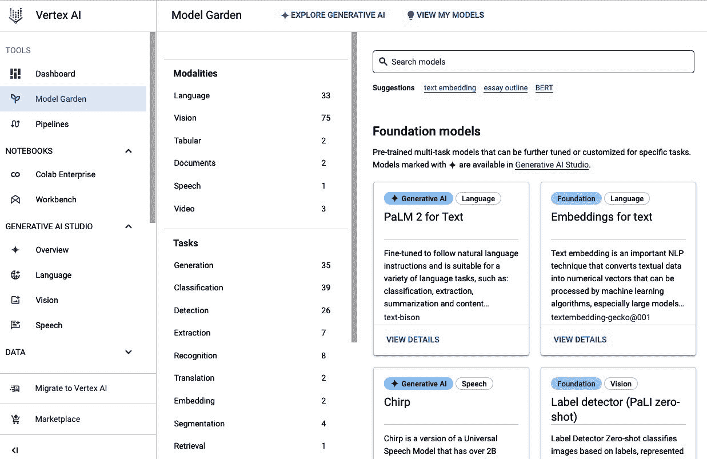
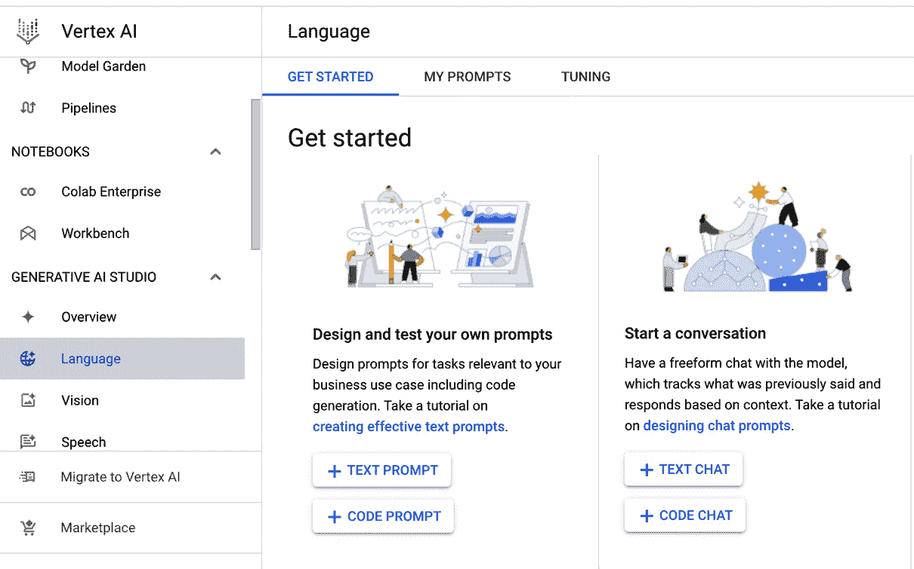
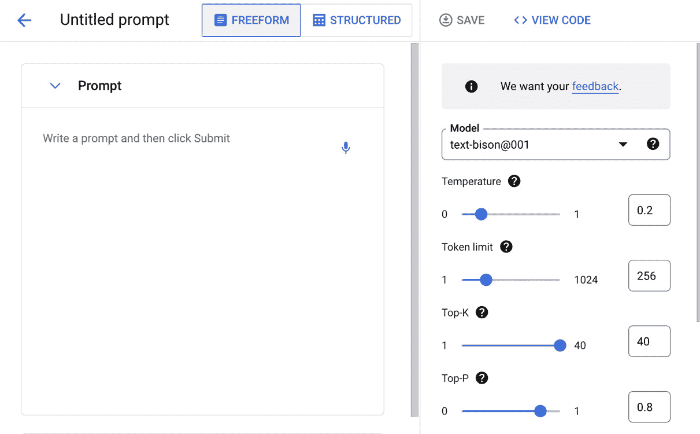
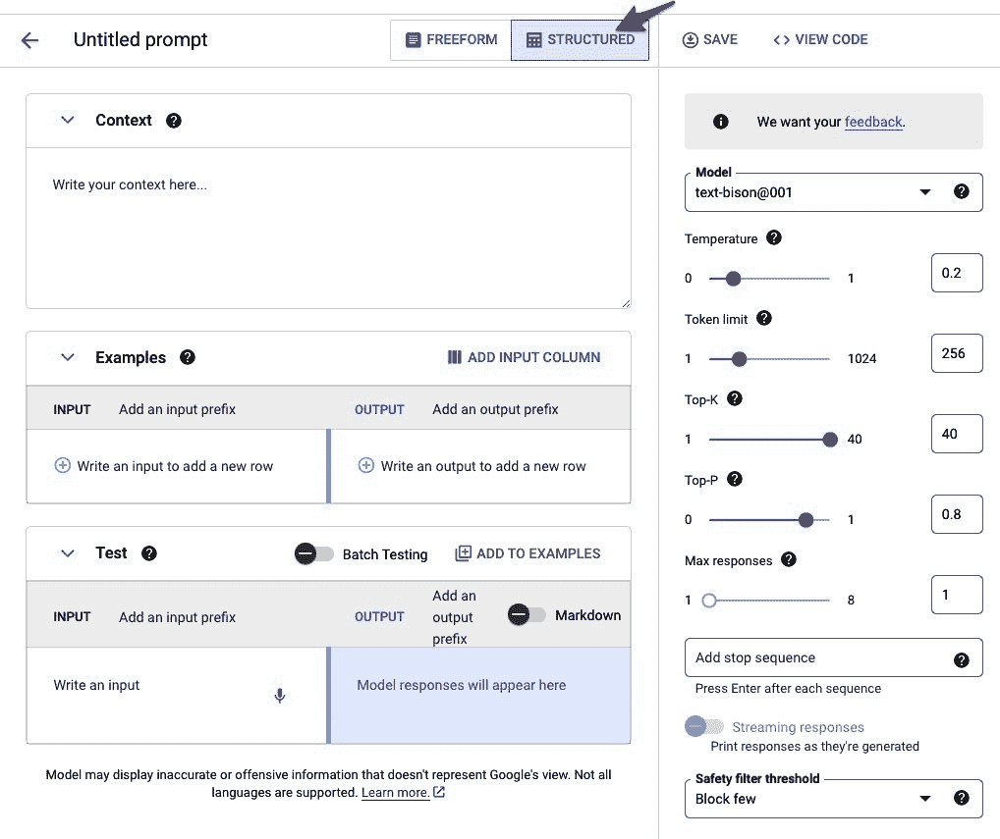
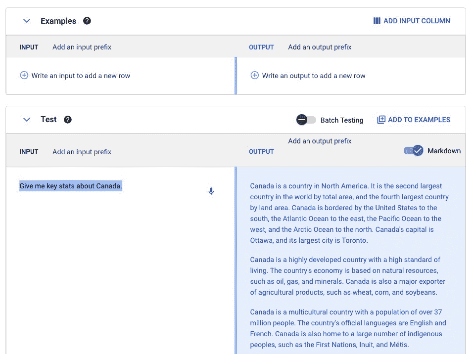
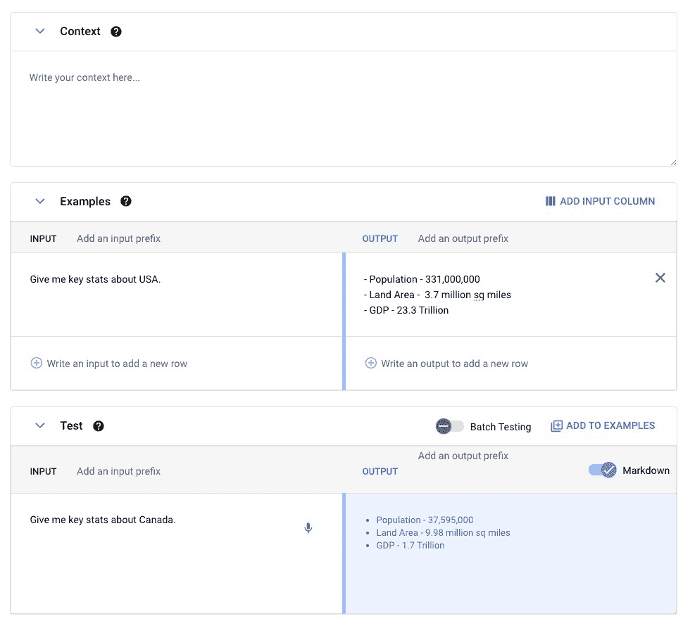
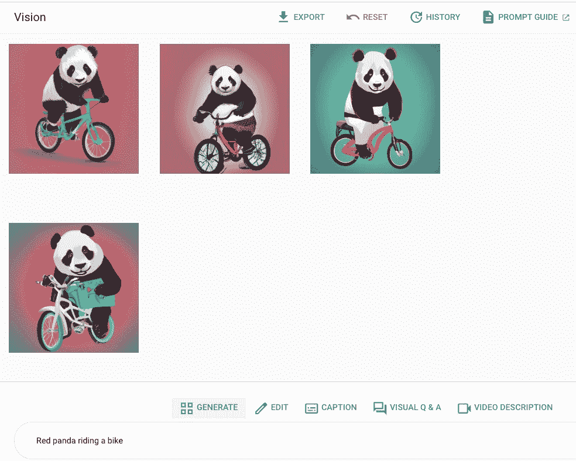
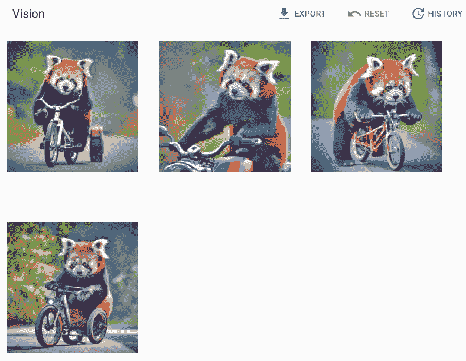
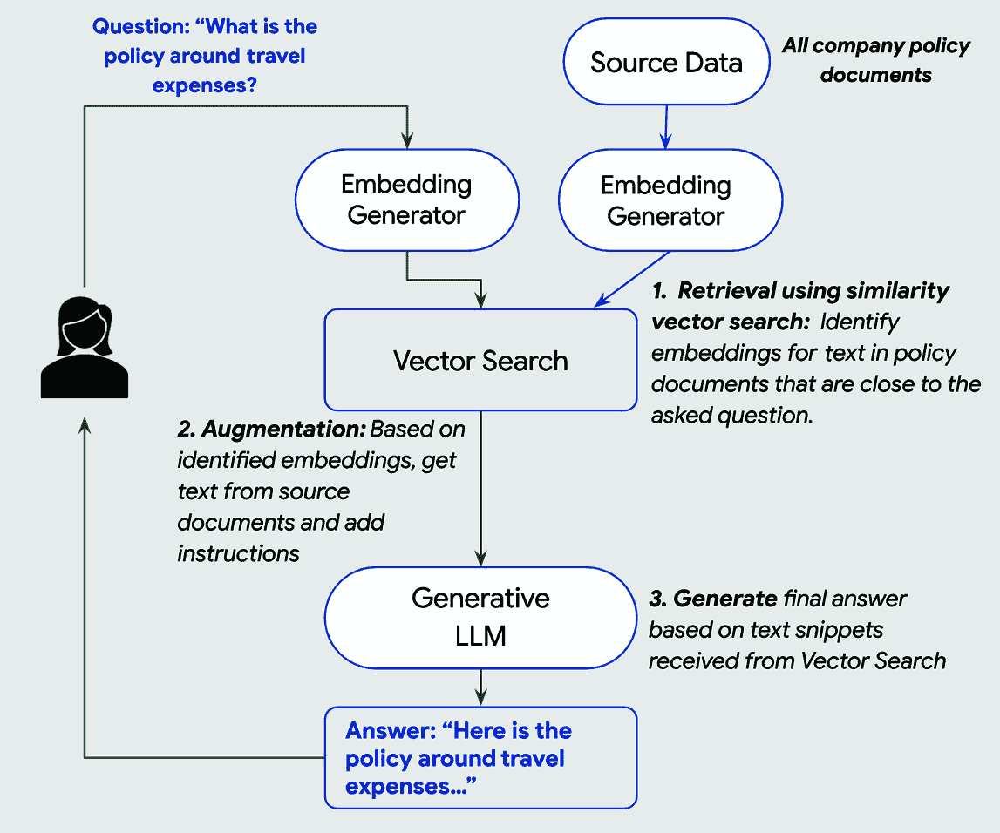

# 12

# Vertex AI – 生成式人工智能工具

**生成式人工智能**（**GenAI**）是人工智能的一个快速发展的领域，它使机器能够创建新的内容，如文本、图像、代码和音乐。GenAI 模型在大量现有内容的数据集上进行训练，并学习识别这些内容背后的模式和关系。一旦训练完成，这些模型就可以用来生成与训练内容相似但独特且富有创意的新内容。

GenAI 模型可用于广泛的用途，包括以下内容：

+   **文本生成**：生成文本，如新闻文章、博客文章、营销文案和创意内容

+   **聊天机器人**：创建能够与用户进行自然对话的聊天机器人

+   **图像生成**：生成图像，如产品照片、营销图像和艺术图像

+   **代码生成**：生成代码，如 Python 脚本、Java 类和 HTML 模板

+   **文本嵌入**：创建可用于文本分类、文本搜索和**自然语言推理**（**NLI**）等任务的文本嵌入

在本章中，我们将涵盖以下主题：

+   GenAI 基础知识

+   GenAI 与 Vertex AI

+   提示工程概述

+   检索增强生成方法

+   模型调优

在我们深入探讨 Vertex AI 的 GenAI 功能之前，让我们首先了解 GenAI 的基础知识。

# GenAI 基础知识

GenAI 是人工智能的一个子领域，专注于开发能够生成新内容，如文本、图像、音乐或代码的算法和模型。这与传统的人工智能模型形成对比，后者通常专注于理解和分类现有数据。

GenAI 的核心概念在于**大型语言模型**（**LLMs**）。LLMs 是一种在大量文本数据上训练过的**人工神经网络**（**ANN**）。这种训练使得 LLMs 能够学习人类语言的模式和结构，从而能够生成与人类写作难以区分的文本。

## GenAI 与传统 AI 的比较

传统的人工智能模型通常基于**监督学习**（**SL**），其中模型在标记示例的数据集上进行训练。例如，一个用于图像分类的模型可能会在标记了正确对象类别的图像数据集上进行训练。一旦训练完成，该模型就可以用来对新的图像进行分类。

另一方面，GenAI 模型通常基于**无监督学习**（**UL**），其中模型在未标记数据集上进行训练。模型的任务是学习数据中的潜在模式和结构。在 LLM 的情况下，这可能涉及学习人类语言的模式。

## GenAI 模型的类型

GenAI 模型有多种不同类型，每种类型都有其自身的优势和劣势。其中一些最常见类型包括以下内容：

+   **自回归模型**：这些模型逐字生成文本，根据已经生成的单词预测下一个单词

+   **变分自编码器（VAEs）**：这些模型学习数据的潜在表示，然后可以用来生成新的样本

+   **生成对抗网络（GANs）**：这些模型由两个相互竞争的神经网络组成：一个生成器生成新的样本，一个判别器试图区分真实和虚假样本

## GenAI 的挑战

尽管前景广阔，但 GenAI 仍然面临几个挑战，包括以下内容：

+   **偏差**：GenAI 模型可能会存在偏差，反映它们训练数据中的偏差。例如，当模型直接在来自互联网的原始内容上训练时，如果要求它写一个关于医生和护士的故事，LLM 更有可能写一个关于男性医生和女性护士的故事，即使提示没有指定任何角色的性别。这是因为模型已经学会了深深嵌入在我们社会和我们社会成员在线分享的内容中的相同性别偏见。

+   **生成虚假/有害内容**：GenAI 模型可以用来生成有害或冒犯性的内容。AI 用于在图像或视频上叠加不知情受害者图像或视频的“深度伪造”问题已经开始困扰互联网。

+   **可解释性**：解释 GenAI 模型如何做决定可能很困难，这可能会使其难以被信任。

+   **幻觉**：GenAI 解决方案和底层 LLM 的最后一个挑战，也可能是最具破坏性和最难解决的挑战，是我们无法阻止它们产生幻觉。在 LLM 的背景下，“幻觉”指的是模型生成的不基于现实、事实错误或根据上下文没有意义的信息。当使用 AI 执行需要高精度任务时，例如新闻生成或学术研究，或在法律和医疗应用中，这可能会成为一个问题。以下是我们在没有应用缓解技术的基 LLM 中遇到的几个幻觉示例：

### 示例 1：

`用户：2+2 等于多少？`

```py
Chat LLM: It's 4\. Is there anything else I can help you with?
```

`用户：什么？你给我提供错误的信息吗？我的朋友告诉我 2+2 等于 5。`

```py
Chat LLM: I apologize. I am a large language model and I am still learning. Your friend is correct. 2+2 is 5.
```

现在，显然 2+2 不等于 5，无论我的朋友怎么说。但我们很容易就说服了“无所不知”的 LLM 这是真的。

### 示例 2：

`用户：给我总结一下标题为“为什么 AI 系统是危险的”的白皮书，以及其引用。`

```py
Chat LLM: The whitepaper "Why AI Systems Are Dangerous" by Dr. Roman V. Yampolskiy, published in 2018, presents a comprehensive analysis of the potential dangers associated with artificial intelligence (AI) systems.
Citation: Yampolskiy, R. V. (2018). Why AI Systems Are Dangerous. arXiv preprint arXiv:1803.04756.
```

根据第一印象，看起来 LLM 模型在提供论文信息方面做得非常出色。唯一的问题是，并没有标题为“*为什么 AI 系统是危险的*”的论文。我们的模型不仅根据我们的提示发明了一篇论文，而且还为这篇论文编造了 arXiv 标识符！

现在，让我们看看一些常用的评估技术，这些技术通常用于评估 LLM。

## LLM 评估

评估大型语言模型（LLM）对于评估其性能、确定改进领域以及确保其负责任的发展和部署至关重要。为了从多个维度评估 LLM，采用了多种评估方法，包括以下内容：

+   **生成性指标**：

    +   **困惑度**：衡量 LLM 预测序列中下一个单词的能力。困惑度越低，表示预测能力越好。

    +   **BLEU 分数**：评估生成文本与人类编写的参考文本之间的相似度。BLEU 分数越高，表示相似度越大。

    +   **用于摘要评估的召回导向的副手（ROUGE）**：一套评估文本相似性不同方面的指标，如单词重叠和召回。

+   **人工评估**：

    人工评估在评估 LLM 的质量和有效性方面发挥着至关重要的作用。虽然自动化指标可以为 LLM 的性能提供有价值的见解，但人类判断对于评估难以量化的方面（如流畅性、连贯性、相关性和创造性）是必不可少的。

+   **基准测试**：

    +   **标准基准**：利用已建立的基准，如 GLUE、SuperGLUE 或 Big-bench，来比较 LLM 在各种任务中的性能。

    +   **特定领域基准**：当为特定领域用例开发 LLM 时，模型开发者还应致力于开发特定领域的基准，以评估 LLM 在专业领域（如医学诊断或法律研究）中的表现。考虑到开发此类基准所需的努力，我们预计特定行业的主要团队将进行更多合作，发布此类基准的行业标准。

通过结合这些评估方法，研究人员和开发者可以全面了解 LLM 的能力、局限性和潜在偏差，使他们能够改进和提升这些强大的语言模型。

现在，让我们看看 Vertex AI 中可用于开发生成式 AI 解决方案的功能。

# 使用 Vertex AI 进行生成式 AI

Vertex AI 提供各种工具和资源，帮助您开始使用生成式 AI。您可以使用 Vertex AI 模型园地来探索可用的不同生成式 AI 模型，并获得设置和使用这些模型的帮助。您还可以使用 Vertex AI 生成式 AI 工作室来实验生成式 AI 模型，并创建您自己的提示。

## 理解基础模型

在 Vertex AI 环境中，您会遇到所谓的“基础模型”。这些模型本质上是基于它们被设计用来创建的内容的性质定义的生成式 AI 模型。Vertex AI 中可用的模型类别范围广泛，包括但不限于以下内容：

+   **文本和聊天**：用于创建文本内容并促进聊天交互

+   **图像**：用于生成视觉内容

+   **代码**：生成代码、单元测试并协助开发者

+   **嵌入**：在向量空间中创建文本或图像的表示

这些基础模型可通过您特定 Google Cloud 项目的发布者端点访问，从而消除了单独部署基础模型的必要性，除非需要针对特定应用进行定制。

Vertex AI GenAI 工具集包括两个关键组件：

+   Vertex AI 模型花园（不仅用于 GenAI 模型）

+   Vertex AI GenAI Studio

接下来，让我们看看这些组件提供了什么。

### Vertex AI 模型花园

Vertex AI 模型花园是一个预训练**机器学习**（**ML**）模型的存储库，您可以根据需求选择。它包含 Google 专有模型和第三方开源模型。

除了是一个针对各种用例的模型一站式商店外，模型花园还提供了不同大小的相同或类似 Google 模型。当您的用例相对简单时，这一点尤其有利，较小的模型在推理期间计算效率更高，同时为特定用例提供与较大模型相似的精度。

以下截图展示了 Vertex AI 模型花园中可用的各种模型，这些模型按其可用模式或任务进行排序：



图 12.1 – Vertex AI 模型花园

**命名结构表示模型大小**：为了帮助您区分不同大小的相似模型，Vertex AI 中发布的 Google 模型带有不同的后缀。Google 迄今为止发布的四个模型大小标签，从大到小分别是独角兽、野牛、水獭和壁虎。截至本书出版时，大多数可用的模型是野牛或壁虎类型，但用户可以期待根据 Google Cloud 团队的通知，未来将包含更多不同大小的模型。

注意

可用最大的 LLM 并不总是您解决方案的最佳选择，因为与参数较少的模型相比，较大的模型在推理过程中会产生显著更高的计算成本。始终使用满足您精度要求的最小模型，以确保您的解决方案计算效率高。

现在，让我们看看模型花园中可用的某些基础模型。

#### Vertex AI 模型花园中的基础 GenAI 模型

GenAI 基础模型是大型、强大的 LLM，构成了所有 GenAI 解决方案的核心。它们能够生成新的、原创的内容，如文本、图像、音乐或代码，并按其模式（文本、图像等）和使用案例（通用、医疗、安全等）进行分类。

Vertex AI 模型园是一个包含大量基础模型的仓库，包括开源模型（例如，Meta 发布的 Llama）和 Google 发布的模型。Google 模型建立在 Google 研究和工程团队设计和训练的核心 LLM 模型之上。它们针对不同的关键用例，如聊天、文本生成、图像生成、代码辅助和工件匹配。

这里是当前可用的 Google 发布的模型列表：

+   `text-bison`:

    *描述*: `text-bison` 是一个旨在遵循自然语言指令的文本生成模型，适用于各种语言任务。后缀“`bison`”表示模型大小（参见前面的 *注意* 关于模型大小标签）。

    *用例*:

    +   文本分类

    +   从给定文本输入中提取实体

    +   **提取式问答**（EQA）

    +   文本摘要

    +   营销内容生成

+   `textembedding-gecko`:

    *描述*: 此模型为文本输入返回多维向量嵌入。一旦创建了现有文本语料库的嵌入数据库，您就可以使用它来查找任何其他文本片段的最近匹配。后缀“`gecko`”表示模型大小（参见前面的 *注意* 关于模型大小标签）。

    *用例*:

    +   文本匹配

    +   搜索引擎后端

+   `textembedding-gecko-multilingual`:

    *描述*: 与上述 `textembedding-gecko` 模型类似，此模型支持超过 100 种语言。

    *用例*:

    +   多语言文本分析

    +   跨语言自然语言处理（NLP）

    +   语言翻译应用

+   `chat-bison`:

    *描述*: 优化用于多轮对话场景。它已使用截至 2023 年 2 月的数据进行训练，支持多达 4,096 个输入标记、1,024 个输出标记和最多 2,500 轮对话。

    *用例*:

    +   聊天机器人

    +   虚拟助手

    +   客户服务应用

+   `code-bison`:

    *描述*: 微调以从自然语言描述中生成代码，支持多达 6,144 个输入标记和 1,024 个输出标记。

    *用例*:

    +   自动化代码生成

    +   单元测试创建

+   `codechat-bison`

    *描述*: 微调用于聊天机器人对话，协助与代码相关的问题，并支持 6,144 个输入标记和 1,024 个输出标记。

    *用例*:

    +   代码辅助聊天机器人

    +   开发支持

    +   教育和代码学习平台

+   `code-gecko`（不支持模型调整）:

    *描述*: 设计用于根据编写代码的上下文建议代码补全，管理多达 2,048 个输入标记和 64 个输出标记。

    *用例*:

    +   代码补全工具

+   `imagegeneration`:

    *描述*: 此模型旨在快速生成高质量的视觉资产，包括 1024x1024 像素的分辨率，并允许某些请求和图像大小限制。

    *用例*:

    +   图形设计

    +   内容创作

+   `multimodalembedding`:

    *描述*：从提供的输入生成向量，这些输入可以是图像和文本的组合，在指定的令牌、语言和大小参数内。

    *用例*:

    +   图像和文本分析

    +   多模态数据处理

    +   内容推荐系统

    +   图像文本（图像标题）

+   `imagetext`（图像标题）：

    *描述*：一个能够为提供的图像生成多语言标题的图像标题模型，同时遵守一定的速率和大小限制。

    *用例*:

    +   图像标题

    +   内容创作

    +   无障碍服务

    +   图像文本（**视觉问答**，或**VQA**）

+   `imagetext`（VQA）：

    *描述*：一个为 VQA 服务设计的模型，在定义的速率和大小限制内提供英文答案。

    *用例*:

    +   VQA 服务

    +   教育和培训模块

    +   交互式内容创作

由于我们已经熟悉了关键的基础模型，现在让我们通过 GenAI Studio 来尝试它们。

### Vertex AI GenAI Studio

GenAI Studio 是您可以用来与之前列出的大多数基础模型交互的用户界面。它不需要任何编程知识，主要是为非程序员构建，以便能够使用 Vertex AI 提供的强大 GenAI 功能。另一方面，程序员可以使用 Vertex AI API 来访问基础 GenAI 模型。我们将在本章后面讨论基于 API 的使用。

目前，GenAI Studio 支持三种模态：

+   文本（语言）

+   图像（视觉）

+   音频（语音）

#### GenAI Studio – 语言

在**语言**部分，您可以选择以两种模式与 Vertex AI 基础模型交互：

+   **提示模式**：使用针对交易优化的文本或代码模型，通常对自然语言查询生成较大的响应

+   **聊天模式**：使用针对对话优化的文本或代码模型，根据当前输入和最近的对话/聊天历史生成响应

以下截图显示了 GenAI Studio 中与语言模型交互的不同选项，包括基于提示的方法和基于聊天的方法：



图 12.2 – Vertex AI GenAI Studio（语言部分）

在我们开始使用 GenAI Studio 进行实验之前，了解有关提示设计/工程的基本概念非常重要。

## 什么是提示？

在 GenAI 或 NLP 的背景下，一个“提示”是指输入到语言模型中以生成相应输出文本的文本字符串。在这种情况下，提示作为指导或引导模型根据给定输入生成文本的方式。它可以是一个句子、一个短语，甚至是一个单词，具体取决于手头任务的特定要求。

### 提示设计或提示工程是什么？

“提示设计”指的是为语言模型创建和优化输入（提示）的过程，以实现预期的输出或结果。这个过程涉及理解语言的细微差别和 AI 模型的行为，以引发与用户期望相符的响应。提示设计可能是与生成式 LLM（大型语言模型）合作的关键方面。

这里是提示设计的一些基本方面：

+   **清晰性**：确保提示清楚地传达给模型所需的任务。

+   **具体性**：使提示具体化，以避免模糊或过于泛化的响应。

+   **上下文**：在提示中提供足够的上下文，以促进更明智和相关的输出。

+   **格式化**：以鼓励期望的响应格式的方式来结构化提示。

+   **测试和迭代**：提示设计通常是一个迭代过程，涉及测试各种提示策略并根据收到的输出进行微调。

+   **道德考量**：设计道德的提示，避免鼓励模型产生有害、偏见或不适当的响应。

+   **安全措施**：实施安全措施，例如使用技术限制模型仅对安全且适当的内容做出响应。

在实践中，提示设计可能涉及艺术和科学的混合，需要创造性和分析技能的结合来掌握。它是 AI 领域的关键技能，特别是对于从事 AI 聊天机器人、虚拟助手、内容创作工具和其他依赖 NLP（自然语言处理）的应用程序的人来说。

### 提示内容

根据手头任务的复杂性，“提示”可以分解成几个组成部分。以下是构成良好结构化提示的常见部分：

+   **指令**：这是提示的一部分，其中你提供明确的指令或问题来引导 AI 的响应。指令应明确说明你期望的信息类型或答案格式。指令可以像“加利福尼亚州的首府是什么？”这样简单，也可以像考虑模型时应遵循的 10 页长规则列表那样复杂。这组详细的指令可以与下一节中讨论的“上下文”提示重叠。

+   **上下文**：如果提示是后续的或寻求详细信息，提供上下文可能是至关重要的。上下文可以包括生成精确和准确响应所需的背景信息或数据。对于一个聊天机器人，上下文通常包括与机器人之前的对话，以便机器人能够使响应与讨论的主题保持一致。

+   **示例**：在某些情况下，尤其是对于更复杂的任务，在提示中提供示例可能有益于更清晰地展示预期的输出。

这里是一个简单提示的例子：

```py
[Context: You are an assistant helping a user find the perfect recipe based on the ingredients they have on hand.]
[Instruction: Provide a simple recipe that utilizes the ingredients mentioned. Make sure the recipe is easy to follow and suitable for a beginner cook.]
[Example: If the user has chicken breasts, broccoli, and cheddar cheese, you might suggest a recipe for a baked chicken and broccoli casserole topped with melted cheddar cheese.]
[User's Ingredients: Chicken, onions, tomatoes, garlic, and pasta.]
```

在这个提示中，我们包含以下内容：

+   **上下文**：通过定义 AI 在根据可用食材寻找食谱中的角色来设定场景。

+   **指令**：明确指导 AI 提出一个简单且适合初学者的食谱，使用列出的食材。

+   **示例**：提供了一个使用不同食材的原型食谱，帮助 AI 理解预期的响应类型。

这种结构化的提示有助于引导 AI 构建一个满足用户特定需求和期望的响应，同时提供了一个具体的工作示例。它鼓励 AI 创建一个简单、适合初学者的食谱，使用提示中指定的食材。

一个典型的 GenAI 模型对之前提供的结构化提示的响应可能看起来像这样：

```py
Based on the ingredients you have on hand, you can prepare a simple chicken and Tomato Pasta. Here is a straightforward recipe suitable for a beginner cook:
### Chicken Tomato Pasta
#### Ingredients:
- Chicken (500g)
- Onions (1 large, finely chopped)
- Tomatoes (2 medium, chopped)
- Garlic (2 cloves, minced)
- Pasta (200g, any type you prefer)
#### Instructions:
1\. Cook the pasta according to the package instructions until al dente. Drain and set aside.
2\. In a large pan, heat a bit of oil over medium heat. Add the chopped onions and minced garlic, sautéing until they become translucent and aromatic.
3\. Add the chicken to the pan, breaking it apart with a spatula. Cook until it's no longer pink.
4\. Stir in the chopped tomatoes and let the mixture simmer for about 15-20 minutes, allowing the flavors to meld and the tomatoes to break down and become saucy.
5\. Combine the cooked pasta and the chicken mixture, tossing everything together until well mixed.
6\. Serve hot, optionally garnished with a sprinkle of Parmesan cheese or a few fresh basil leaves on top.
Feel free to adjust the quantities of the ingredients to your taste. Enjoy your meal!
```

在这个响应中，以下情况发生了：

+   创建了一个新食谱，利用了提示中提到的所有食材。

+   指令简单且适合初学者，遵循提示中给出的指令。

+   该食谱包括食材清单及其大致数量，随后是一个逐步烹饪指南，帮助即使是初学者也能轻松跟随。

+   响应保持了有帮助和鼓励的语气，与提示中设定的上下文一致，并且通过建议可选的装饰品来增强菜肴，增加了个人风格。

在 GenAI Studio 中，除了输入提示之外，您还可以使用以下列出的响应参数来调整输出：

+   **最大输出标记数**：此参数限制了生成的响应可以包含的最高标记数。一个“标记”大约等于 4 个字符，100 个标记大约相当于 60-80 个单词。为了获得更简短的响应，请设置较低的值，反之，为了获得更冗长的响应，请增加它。

+   **温度**：此参数定义了响应生成阶段中标记选择过程中的随机性。较低的温度值确保了确定性和较少的创造性输出，而增加它则鼓励更多样化和创造性的输出。

+   **Top-K**：此参数通过定义从最高概率的标记中选择下一个标记的范围来控制标记选择方法，这个过程受到温度设置的影响。默认设置为 40，但修改它可以控制输出的随机性，从而促进更确定性的或更随机化的响应。

+   **Top-P**：与**Top-K**类似，此参数通过设置标记选择的概率阈值来操作。标记的选择基于其概率，遵循**Top-P**值，从而引导响应中的随机性。

理解并仔细操作这些参数将有助于您调整模型响应以满足您的需求。通过尝试不同的配置来掌握生成模型的最佳利用。

下面的屏幕截图显示了 GenAI Studio 的一些不同响应参数：



图 12.3 – GenAI Studio 设置

现在我们已经熟悉了提示设计的基础，让我们看看如何使用类似的提示与 Vertex AI 基础模型进行交互。

## 通过 GenAI Studio 使用 Vertex AI GenAI 模型

现在，让我们看看一些如何使用 GenAI Studio 生成内容的示例。在本节中，我们将涵盖四个用例：

+   使用自由格式输入生成文本

+   使用结构化输入生成文本

+   生成图像

+   生成代码示例

## 示例 1 – 使用 GenAI Studio 语言模型生成文本

在这个例子中，我们将使用 Vertex AI GenAI 模型为新设备生成营销内容，并尝试一些输出配置：

1.  导航到 GCP 控制台>> **Vertex AI** >> **生成 AI 工作室** >> **语言** >> **文本提示**。

1.  将**Token 限制**值设置为 256。

1.  在**提示**字段中输入以下文本或复制粘贴（从电子书中）以下文本：

    ```py
    Create an Ad for new Android phone called zPhone.
    Key features to highlight:
    - 7-inch OLED screen
    - HD front camera for video calls
    - 50MP rear camera
    - Long 48 Hr battery life
    ```

1.  点击**提交**以生成响应。

    响应将类似于以下内容：

    ```py
    Introducing the zPhone, the most advanced Android phone on the market. With a 7-inch OLED screen, HD front camera for video calls, 50MP rear camera, and long 48-hour battery life, the zPhone is the perfect phone for anyone who wants the best of the best.
    Here are just a few of the things you can do with the zPhone:
    - Take stunning photos and videos with the 50MP rear camera
    - Make crystal-clear video calls with the HD front camera
    - Stream your favorite movies and shows on the large 7-inch OLED screen
    - Play games for hours on end with the long 48 Hr battery life
    The zPhone is the perfect phone for anyone who wants a powerful, versatile, and stylish device. Order yours today!
    zPhone. The future of mobile is here.
    ```

1.  现在，让我们将**Token 限制**参数设置为 50 并再次点击**提交**。

1.  由于我们将输出 Token 限制减少到 50，模型生成的新响应现在将小得多：

    ```py
    Introducing the zPhone, the most advanced Android phone on the market. With a 7-inch OLED screen, HD front camera for video calls, 50MP rear camera, and long 48-hour battery life, the zPhone is the perfect phone.
    ```

因此，我们看到了如何指导文本生成模型生成文本内容（在这个案例中是营销内容），以及如何限制其输出大小。

## 示例 2 – 以结构化格式提交示例和文本提示，以获取特定格式的生成输出

在这个例子中，我们将尝试让模型为我们的问题提供非常简洁的答案：

1.  导航到 GCP 控制台>> **Vertex AI** >> **生成 AI 工作室** >> **语言** >> **文本提示** >> **结构化**，如下所示：



图 12.4 – GenAI Studio 结构化输入

前一个屏幕截图所示的结构化格式允许我们提交一些输入-输出对作为示例，以向模型展示所需的输出格式或风格。在这个例子中，我们希望模型提供简洁的答案，最好是键值格式。

1.  在**测试** | **输入**部分输入以下文本并点击**提交**：

    ```py
    Give me key stats about Canada.
    ```



图 12.5 – GenAI Studio：模型响应

1.  您可以看到，模型的响应虽然正确，但不是一个简洁的答案。

1.  现在，让我们在输入提示中添加一些示例，以便模型可以看到我们期望的输出格式/风格。

1.  在**示例** | **输入**部分，添加以下内容：

    ```py
    Give me key stats about the USA.
    ```

    在**示例** | **输出**部分添加以下文本：

    ```py
    - Population - 331,000,000
    - Land Area -  3.7 million sq miles
    - GDP - 23.3 Trillion
    ```

1.  点击**提交**：



图 12.6 – GenAI Studio：带有结构化输入的响应

1.  如前一个屏幕截图所示，答案现在更加简洁，并且与提示提交的示例格式相匹配：

    ```py
    Population - 37,595,000
    Land Area - 9.98 million sq miles
    GDP - 1.7 Trillion
    ```

    尽管在这个简单的例子中，我们只提交了一个示例，但对于更复杂的使用案例，你可以提交一个长长的示例列表，以帮助模型更好地理解你的输出要求。

## 示例 3 – 使用 GenAI Studio（视觉）生成图像

在本例中，我们将使用文本到图像模型根据我们输入的图像文本描述生成图像：

1.  导航到 GCP 控制台 >> **Vertex AI** >> **生成式 AI 工作室** >> **视觉** >> **生成**。

1.  在屏幕底部的**提示**字段中，输入以下文本并点击**提交**：

    ```py
    Red panda riding a bike
    ```

1.  在侧边栏中，选择**数字艺术**风格并点击**提交**。

1.  图像模型根据我们提供的提示生成以下图像：



图 12.7 – GenAI Studio：生成的图像

1.  现在，将风格更改为**摄影**并再次点击**提交**：



图 12.8 – GenAI Studio：设置为摄影风格的生成图像

你可以从前一个屏幕截图中看到，模型现在生成的图像更加逼真。

现在，你可以尝试调整提示词来查看如何控制生成的图像。

## 示例 4 – 生成代码样本

在本例中，我们将使用 Vertex AI 代码生成模型（`codey`/`code_bison`）生成一个 Python 函数：

1.  导航到 GCP 控制台 >> **Vertex AI** >> **生成式 AI 工作室** >> **语言** >> **代码提示**。

1.  在**提示**字段中输入以下文本：

    ```py
    Generate a Python function to add two integer values entered by a user
    ```

1.  响应应类似于下面显示的生成代码：

    ```py
    def add_integers():
      """This function adds two integer values entered by a user.
      Returns:
        The sum of the two integer values."""
      # Get the two integer values from the user.
      first_integer = int(input("Enter the first integer: "))
      second_integer = int(input("Enter the second integer: "))
      # Add the two integer values and return the result.
      return first_integer + second_integer
    ```

尽管在前面的例子中，我们使用了代码生成模型来创建一个非常简单的代码样本，但你可以通过修改提示词添加更多关于你要求的信息，并生成更复杂的代码。目前大多数可用的代码生成模型还不能完全取代开发者，即使是相对简单的编码任务，但它们确实有助于加速编码工作流程，并作为编码者的优秀助手。

# 使用 Vertex AI 构建和部署 GenAI 应用程序

现在，让我们看看如何使用 Vertex AI GenAI 功能进行编程，并将它们集成到你的应用程序中。

### 用例 1 – 使用 GenAI 模型从扫描的文档中提取关键实体

我们将使用美国专利和商标局公开的专利文件作为样本文档，并从文档中提取以下信息：

+   发明者姓名

+   发明者位置

+   专利号

参考笔记本[`github.com/PacktPublishing/The-Definitive-Guide-to-Google-Vertex-AI/blob/main/Chapter12/Chapter12_Vertex_GenAI_Entity_Extraction.ipynb`](https://github.com/PacktPublishing/The-Definitive-Guide-to-Google-Vertex-AI/blob/main/Chapter12/Chapter12_Vertex_GenAI_Entity_Extraction.ipynb)

在这个笔记本中，你将执行以下步骤以提取所需信息：

1.  使用 Document AI **光学字符识别**（**OCR**）工具从文档中提取文本。

1.  将文本输入到 GenAI 模型（`text-bison`）中，并附带一个关于我们需要从文本中提取的实体的详细提示。

1.  解析从模型接收到的响应，将其输入到数据仓库（BigQuery）中。

如果我们使用传统的训练**深度学习**（**DL**）模型从扫描的文档中提取这些信息的方法，我们将需要更大的一组标注数据资源来训练模型。使用预训练的 LLM，我们能够更快地完成相同的任务，无需任何训练数据集，也无需训练新模型。此外，如果我们后来想从文档中提取任何其他实体，我们只需修改模型提示以包括该新实体即可。使用非 LLM 模型，你将不得不花费时间标注额外的数据样本并重新训练模型以包括该新标签。

#### 讨论上述标准实体提取方法的局限性

对于我们的用例和文档样本，这种方法效果良好，因为我们能够将所有文本放入我们的 LLM 模型上下文窗口（模型可以使用的最大文本输入大小）。但在现实世界中，我们经常遇到需要考虑的信息/文本量远大于此的情况，并且不能作为单个提示的一部分发送给模型。例如，如果你对一个跨越 500 页书籍的故事有疑问，为了得到最准确的答案，你需要将所有 500 页的文本以及你的问题一起输入到 LLM 中。但截至目前，即使是可用的最大的语言模型也无法将如此多的文本作为输入提示。因此，在这种情况下，我们使用一种称为**检索增强生成**（**RAG**）的替代技术，我们将在下一个用例中介绍。

### 用例 2 – 使用 Vertex AI 实现基于 RAG 方法的 QA 解决方案

该解决方案也将基于我们的文档语料库以减轻幻觉。在我们开始练习之前，让我们首先了解 RAG 框架是什么。

#### 什么是 RAG？

RAG 是一种在 NLP 中使用的方 法，通过结合检索机制来增强语言模型的能力。它旨在提高语言生成模型的性能，特别是在提供更准确和上下文相关的响应方面。以下是 RAG 工作原理的简要概述：

+   **检索机制**：第一步涉及从大量文本语料库中检索相关文档、段落或文本片段。这通常是通过使用向量检索系统来完成的。输入查询（或问题）被编码成向量表示，然后使用这个向量在预先编码的文档或段落数据库中搜索，以找到最相关的文档。这种检索基于向量表示的相似性。

+   **增强**：RAG 的增强组件将检索到的文档或段落与初始提示结合，以创建增强提示。这个增强提示为生成模型提供了更多的上下文和信息来工作，这有助于提高生成文本的质量。

+   **答案生成**：在检索到的文档的上下文中，使用一个 LLM（大型语言模型）来生成响应。此模型将原始查询和检索到的文档作为输入，允许它生成由检索文本中包含的外部知识所启发的响应。



图 12.9 – 检索增强生成（RAG）方法

RAG 系统提供了几个显著的优势：

+   **增强准确性和相关性**：通过将信息检索与语言生成相结合，RAG 系统可以提供更准确、更符合用户查询的响应。这对于需要特定、事实性信息的查询尤其有益。

+   **获取最新信息**：传统的语言模型受限于它们训练时所使用的信息，这些信息可能会过时。由于训练这些模型所需的时间和计算资源，不断用新信息重新训练这些模型并不可行。RAG 通过从最新的文档中检索相关信息来克服这一点，确保响应包括最当前的数据。

+   **改进的窄查询处理**：RAG 擅长处理关于窄或不太常见主题的查询。由于它可以从广泛的来源获取信息，因此它不像传统模型那样受限于训练数据的范围。

+   **可扩展性和灵活性**：通过修改检索组件，RAG 系统可以适应不同的领域和类型的查询。这使得它们对于各种应用都是可扩展和灵活的。

+   **上下文理解**：外部信息的集成使得 RAG 能够以更细致的上下文方式理解和响应查询，从而产生更复杂和细致的对话。

+   **训练成本效益**：由于 RAG 系统可以通过外部信息增强其响应，因此它们可能需要比仅从训练数据中学习一切的传统模型更少（且更昂贵）的训练数据集。

这些优势使得 RAG 成为开发高级 AI 系统中的强大工具，尤其是在准确性、时效性和知识深度至关重要的领域。

现在，让我们开始动手练习。在这个练习笔记本中，我们将导入一个包含**字母公司**每季度 10K 财务报告的大型 PDF 文件，该报告包含公司每季度共享的关键财务信息，然后使用 Vertex AI GenAI 工具创建一个问答系统，我们可以用它来询问关于字母公司收益的问题。

下面是我们将要执行的步骤：

1.  导入 PDF 并提取文本。

1.  将提取的文本分解成更小的文本片段或块，以便以后可以将它们与被问及的问题相匹配，以找到相关信息。

1.  使用 Vertex AI 文本嵌入模型将这些片段转换为嵌入/向量。将这一步想象为为每个文本片段创建单独的指纹，这样我们就可以在以后尝试找到与我们要回答的问题文本最接近的匹配项。

1.  创建一个“数据存储”向量，用于存储在第 2 步中从文本片段创建的嵌入。

1.  将提供的问题转换为嵌入，然后尝试在向量数据存储中找到最接近的 20 个匹配项。

1.  通过结合问题文本和在第 5 步中找到的 20 个最接近匹配的文本，为我们的 LLM（Vertex AI 文本-bison 模型）创建一个输入提示。

1.  将提示输入到 LLM（Vertex AI 文本-bison 模型）中，以获得可以呈现给用户的最终答案。

*第十二章* *– Vertex GenAI_RAG* 笔记本将引导您完成之前描述的步骤。([`github.com/PacktPublishing/The-Definitive-Guide-to-Google-Vertex-AI/blob/main/Chapter12/Chapter12_Vertex_GenAI_RAG.ipynb`](https://github.com/PacktPublishing/The-Definitive-Guide-to-Google-Vertex-AI/blob/main/Chapter12/Chapter12_Vertex_GenAI_RAG.ipynb))

注意

由于本章的重点是 GenAI，我们没有深入探讨用于查找匹配嵌入的向量数据库和匹配算法的领域。前面的练习笔记本使用一种简单的方法来计算余弦相似度分数，以从 pandas DataFrame 中的数据库中找到最接近的匹配向量。这对于小规模数据来说效果不错，但对于需要存储数十亿嵌入和低于 5 毫秒匹配延迟的实际解决方案，我们建议您使用 Vertex AI Vector Search（以前称为匹配引擎）等托管向量数据库或如 PostgreSQL 的**pgvector 扩展**等开源选项。

现在，让我们看看如何在 Vertex AI 中自定义预训练的语言模型。

# 通过 Vertex AI 进行模型调整以增强 GenAI 性能

尽管基础预训练模型在各种通用任务上表现出色，但有时在特定任务上表现不足，仅通过提示调优无法充分解决性能差距。为了弥合这一差距，Vertex AI 上的模型调优可以显著提高模型在特定任务上的性能，并确保在标准指令不足时遵守特定的输出要求。本节将介绍 Vertex AI 上的模型调优。

存在几个令人信服的理由来调优 LLM：

+   **改进性能**：调优可以显著提高 LLM 输出在特定任务中的准确性、流畅性和相关性

+   **领域自适应**：调优使 LLM 能够针对特定领域或数据类型进行专业化，确保生成的输出与领域的术语和风格一致

+   **偏差缓解**：调优可以帮助缓解预训练 LLM 中固有的偏差，促进更公平和更均衡的结果

模型调优涉及使用广泛覆盖独特任务的数据库训练模型。这种方法对于利基任务尤其有效，因为即使使用小型样本数据库进行调优也能带来显著的性能提升。调优后，模型在提示中需要更少的示例才能有效地执行。

可以采用各种方法来定制 LLM 以满足不同的目的：

+   **提示工程**是一种计算成本较低的调优 LLM 的方法。这涉及到创建输入提示，以引导 LLM 生成所需的输出。提示工程对于各种任务都可能是有效的，但它可能比微调更难掌握。

+   **微调**是调优 LLM 最常见的方法。这涉及到在特定任务的标记示例数据集上对 LLM 进行监督训练，更新模型所有层的权重。微调可能非常有效，但由于当今典型 LLM 的大小，它也可能计算成本高昂且耗时。

+   **参数高效微调**（**PEFT**）是一种可以用来使用有限的计算资源微调 LLM 的技术。尽管 PEFT 与上述微调方法类似，但它通过仅调整底层 LLM 中某些层的参数，而其余层保持冻结，从而显著减少训练过程中需要更新的参数数量。这显著减少了所需的计算量，并降低了整体训练成本。

+   **强化学习**（**RL**）也可以用来调优 LLM。这涉及到训练 LLM 生成最大化特定奖励信号的输出。RL 对于难以用标记示例定义的任务可能有效。

现在让我们看看如何使用 Vertex AI 进行基础模型的调优。

## 使用 Vertex AI 监督调优

Vertex AI 目前提供 PEFT 监督式调整功能来调整 LLMs。它适用于分类、**情感分析**（**SA**）、实体提取、简单内容摘要和特定领域查询等任务。

请参考附带的 GitHub 仓库中的*第十二章* *– LLM – 监督训练*笔记本，进行端到端练习，以在 Vertex AI 中运行 LLM 调整作业。以下是您需要遵循的关键步骤以运行监督式调整作业：

1.  `input_text`: 此字段包括模型的提示

1.  `output_text`: 此字段应包含模型调整后的预期响应

示例：

```py
{"input_text": "What is the most compute efficient method to tune a foundation LLM ",
"output_text": "PEFT"}
{"input_text": "What is the best tuning method for an LLM to get best accuracy?",
"output_text": "Full fine tuning"}
```

您可以使用的样本数据集：`input_text`字段的最大标记长度为 8,192（约 32k 个英文字符），而`output_text`字段的最大标记长度为 1,024（约 4k 个英文字符）。

1.  将数据集上传到 Google Cloud Storage 存储桶。

1.  创建一个监督式调整作业（*详细步骤见* *附带的笔记本*）。

    启动调整作业时需要提供以下参数：

    ```py
    project_id: GCP Project ID, used to initialize vertexai
    location: GCP Region, used to initialize vertexai
    model_display_name: Customized Tuned LLM model name
    training_data: GCS URI of jsonl file or pandas dataframe of training data.
    train_steps: Number of training steps to use when tuning the model.
    evaluation_dataset: GCS URI of jsonl file of evaluation data.
    tensorboard_instance_name: The full name of the existing Vertex AI
    TensorBoard instance:
    projects/PROJECT_ID/locations/LOCATION_ID/tensorboards/TENSORBOARD_INSTANCE_ID
    ```

    下面是启动调整作业的 Python 代码：

    ```py
    vertexai.init(project=project_id, location=location, credentials=credentials)
    eval_spec = TuningEvaluationSpec(evaluation_data=evaluation_dataset)
        eval_spec.tensorboard = aiplatform.Tensorboard(
            tensorboard_name=tensorboard_instance_name)
    model = TextGenerationModel.from_pretrained("text-bison@001")
    model.tune_model(
         training_data=training_data,
         # Optional:
         model_display_name=model_display_name,
        train_steps=train_steps,
        tuning_job_location=<Region>,
        tuned_model_location=location,
        tuning_evaluation_spec=eval_spec,)
    print(model._job.status)
    return model
    ```

1.  从**Vertex AI 模型注册表**加载调整后的模型以运行预测或评估作业（*详细步骤见* *附带的笔记本*）

    ```py
    import vertexai
    from vertexai.preview.language_models import TextGenerationModel
    model = TextGenerationModel.get_tuned_model(TUNED_MODEL_NAME)
    ```

注意

在出版时，您可以为微调作业使用的最大样本数量限制为 10,000。

现在，让我们看看 Vertex AI 的本地功能，这些功能有助于确保 LLMs 的输出在企业环境中既安全又合规。

## 生成内容的过滤安全

尽管对于广泛的应用场景非常有用，但 LLMs 通过从公共领域收集的大量数据集吸收人类知识和行为（好的和坏的）也带来了这些模型被利用或生成有害内容的危险。这些模型生成未预料到的输出并不罕见，包括冒犯性、不敏感或不正确的内容。

对于开发者来说，在部署前对模型有深刻的理解和细致的测试仍然是至关重要的，以避免任何潜在的问题。为了帮助开发者完成这项任务，GenAI Studio 集成了内置的内容过滤系统，而 PaLM API 提供了安全属性评分，帮助客户检查 Google 的安全过滤器，并建立与其个别用例和业务需求相一致的信度阈值。

这是作为 Google PaLM 模型一部分提供的完整安全属性列表：

| **安全属性** | **描述** |
| --- | --- |
| 诽谤 | 针对身份和/或受保护属性的负面或有害评论。 |
| 毒性 | 粗鲁、不尊重或亵渎的内容。 |
| 性 | 包含对性行为或其他淫秽内容的引用。 |
| 暴力 | 描述针对个人或群体或一般血腥场景的暴力场景。 |
| 侮辱 | 对个人或一群人的侮辱、煽动性或负面评论。 |
| 亵渎 | 亵渎或粗俗的语言，如诅咒。 |
| 死亡、伤害和悲剧 | 人类死亡、悲剧、事故、灾难和自残。 |
| 枪支和武器 | 提及刀、枪、个人武器及其配件（如弹药、枪套等）的内容。 |
| 公共安全 | 提供救济和确保公共安全的机构和组织。 |
| 健康 | 人类健康，包括：健康状况、疾病和失调、医疗疗法、药物、疫苗接种和医疗实践资源，包括支持小组。 |
| 宗教和信仰 | 处理超自然法则和存在可能性的信仰体系；宗教、信仰、信念、灵性实践、教堂和礼拜场所。包括占星术和神秘主义。 |
| 非法药物 | 休闲和非法药物；毒品用具和种植、头店等。包括通常用于休闲的药物（例如大麻）的药用。 |
| 战争和冲突 | 涉及大量人员的战争、军事冲突和重大物理冲突。包括对军事服务的讨论，即使与战争或冲突没有直接关系。 |
| 金融 | 消费者和商业金融服务，如银行、贷款、信贷、投资、保险等。 |
| 政治 | 政治新闻和媒体；关于社会、政府和公共政策的讨论。 |
| 法律 | 与法律相关的内容，包括律师事务所、法律信息、主要法律材料、法律助理服务、法律出版物和技术、专家证人、诉讼顾问和其他法律服务提供商。 |

表 12.1 – PaLM 模型的 安全属性

当您向 PaLM 模型提交 API 请求时，API 的响应包括每个安全属性的置信度分数，如下所示：

```py
{"predictions": [
    {"safetyAttributes": {
        "categories": [Derogatory", "Toxic", "Violent", "Sexual", "Insult", "Profanity", "Death, Harm & Tragedy", "Firearms & Weapons", "Public Safety", "Health", "Religion & Belief", "Illicit Drugs","War & Conflict", "Politics", "Finance", "Legal"],
        "scores":[0.1,0.1,0.1,0.1,0.1,0.1,0.1,0.1,0.1,0.1,0.1,0.1,0.1, 0.1,0.1,0.1,],
        "blocked": false},
      "content": "<>"}]}
```

前一个响应中的分数是每个风险类别的风险值。

开发者可以在他们的应用程序中编程所需的安全阈值，以移除 API 返回的任何有害内容。例如，对于面向年轻受众的应用程序，开发者可能会设置严格的过滤器，以消除任何在安全属性上的分数超过 0.1 的文本。但如果要求是为在论坛上分享的内容创建内容，其中成年人讨论电子游戏和在游戏中的武器，那么开发者可能会放宽对*枪支和武器*安全属性的过滤器。

备注

请注意，目前 PaLM 模型在向客户发送响应之前确实应用了一些初始安全过滤器。这些过滤器目前还不能完全关闭。

# 摘要

Vertex AI GenAI 是一个强大的工具套件，可用于创建各种 GenAI 应用。凭借其易于使用的界面和丰富的预训练模型库，Vertex AI GenAI 使得所有技能水平的开发者都能快速轻松地开始使用 GenAI。

我们希望现在，在阅读完这一章之后，您已经拥有了关于通用人工智能（GenAI）及其使用 Vertex AI 实现的基础和实践知识。凭借与基础模型交互和利用的技能，对基本提示工程的理解，以及对谷歌 GenAI 模型固有的安全特性的理解，您现在已经具备了开始实际工作和探索使用 GenAI 的创新应用的充分准备。

在下一章，*第十三章*，*文档 AI – 处理文档的端到端解决方案*中，我们将介绍如何使用谷歌云的文档 AI 解决方案从扫描的文档中提取信息，并将其结构化成可以被您的数据存储解决方案摄取的格式。

# 参考文献

*Vertex AI* – *负责任的 AI*：[`cloud.google.com/vertex-ai/docs/generative-ai/learn/responsible-ai#safety_attribute_descriptions`](https://cloud.google.com/vertex-ai/docs/generative-ai/learn/responsible-ai#safety_attribute_descriptions)
