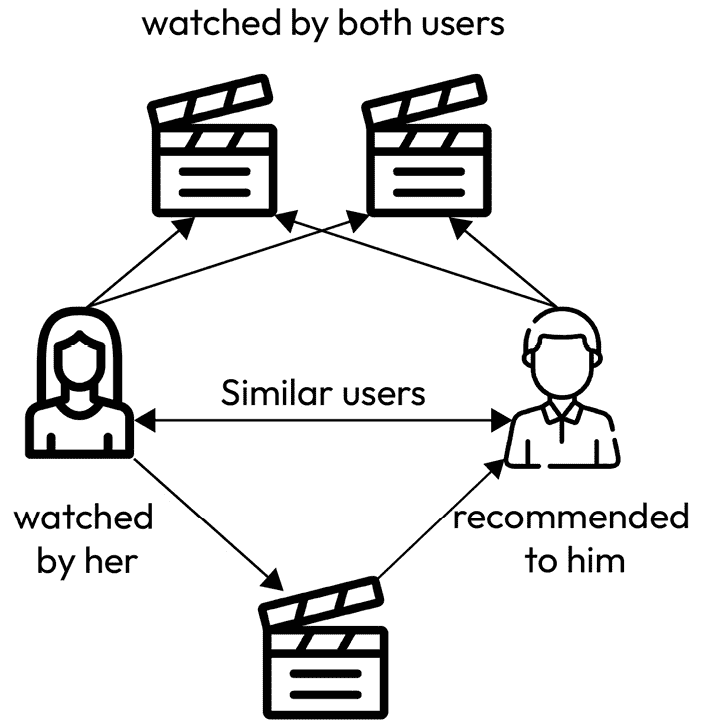
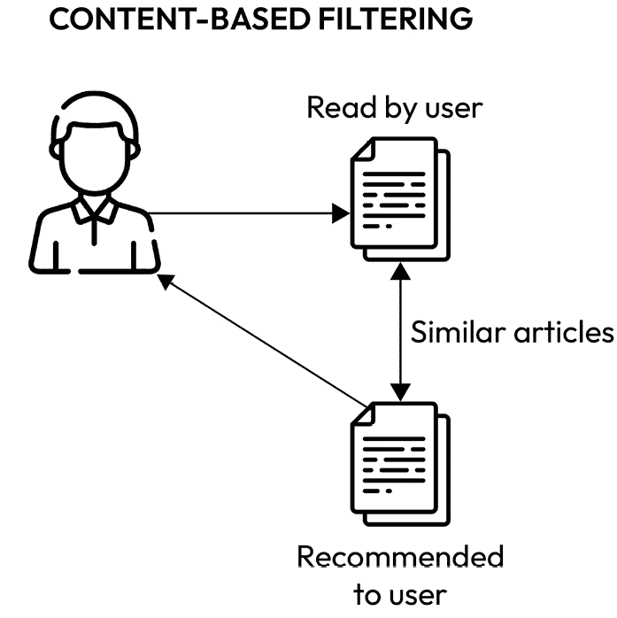

# 第十五章：推荐系统 – 预测用户想看哪些电影

如其名所示，推荐系统是针对基于各种参数（如过去的行为、项目相似性，甚至用户人口统计信息）向用户提供推荐的设计解决方案。这些系统被广泛应用于各种应用中，例如在 YouTube 上推荐视频、Netflix 上的电影或 Amazon 上的产品。

推荐系统的主要目标是使在线用户体验个性化，以推动业务成果，如提高用户参与度和增加收入。随着可用内容和选择的增加，个性化推荐对于提升用户体验和确保客户不会被可用的选项所淹没变得至关重要。

在本章中，我们将涵盖以下主题：

+   不同类型推荐系统的概述

+   在 Vertex AI 上部署电影推荐系统

首先，我们将探讨在野外通常可以找到的不同类型的推荐系统。

# 不同类型的推荐系统

在本节中，我们将深入探讨各种类型的推荐引擎，揭示它们的方法论以及每种推荐引擎带来的独特优势：

+   **协同过滤**：

    这种方法基于这样一个理念：过去同意过某些物品偏好的用户在未来也可能会同意。如图所示，该模型通过观察用户的观看/阅读行为来尝试找到相似用户，并将一个用户的观看内容推荐给其他相似用户：



图 15.1 – 协同过滤

+   **基于内容的过滤**：

    此方法使用项目属性，根据用户的先前行为或明确反馈推荐与用户喜欢的类似的其他项目。

    例如，如果一个用户表现出对克里斯托弗·诺兰执导的电影的偏好，那么在推荐时，系统会优先推荐他执导的电影。在这里，电影的（导演、类型、演员等）内容被考虑在内。

    **优势**：可以处理新项目，因此不需要其他用户的数据。

    **挑战**：过度专业化（可能只显示非常相似的项目）且需要高质量的元数据。

    如下图所示，在基于内容的过滤中，模型试图找到与用户过去观看的内容相似的内容，并在未来向用户推荐相似内容：



图 15.2 – 基于内容的过滤

+   **人口统计过滤**：

    人口统计推荐器通过根据个人属性对用户进行分类，然后根据人口统计类别提供个性化推荐。

    例如，如果数据显示某个特定地区的 18-24 岁男性对动作电影如《速度与激情》有很高的亲和力，那么来自该地区该年龄段的男性更有可能收到对该电影或类似动作电影的推荐。

    **优点**：简单直接，不需要过去的用户-项目交互。

    **挑战**：个性化程度较低，基于刻板印象，且需要用户人口统计数据。

    在实践中，许多最先进的系统使用混合方法，结合多种推荐技术元素，以克服任何单一方法的局限性。Netflix 的推荐引擎就是一个例子，它结合了协同过滤、基于内容的和其他技术，为用户提供电影和电视剧推荐。

接下来，我们将探讨如何通过用户行为和反馈评估内容推荐系统在现实世界中的应用。

## 推荐系统在现实世界中的评估

在现实世界中，推荐系统的评估不仅超越了传统的机器学习指标，还涵盖了更广泛的**关键绩效指标**（**KPIs**），这些指标与商业目标和用户体验更加紧密地一致。与典型的“实验室”环境不同，在“实验室”环境中，如精确度、召回率或 RMSE 等准确性指标被强调，现实世界的评估更优先考虑 KPIs，如**点击率**（**CTR**）、转化率和用户参与度。这些 KPIs 直接反映了用户在真实环境中如何与推荐内容互动。

例如，高 CTR 表明用户认为推荐内容足够相关，值得进一步探索，而强的转化率表明推荐内容在驱动期望的用户行为方面是有效的，例如购买或内容消费。

此外，如**客户终身价值**（**CLV**）和**净推荐值**（**NPS**）等指标提供了关于推荐系统对商业收入和用户忠诚度长期影响的见解。通过关注这些 KPIs，组织可以评估其推荐系统在现实世界中的实际效果，确保它们不仅在机器学习指标上表现良好，而且对用户满意度和商业目标有积极贡献。这种方法认识到推荐系统最终的成功在于它们增强用户体验和推动业务成果的能力，而不仅仅是实现传统评估指标上的高分。让我们更深入地了解不同类型的指标：

+   **参与度指标**：

    参与度指标评估用户如何与推荐内容互动，从而提供关于系统捕捉和保持用户兴趣能力的见解。

    让我们来看看一些不同的参与度指标：

    +   **CTR**：点击次数与显示推荐次数的比率，表明推荐内容的吸引力

    +   **转化率**：导致期望行动（如购买或订阅）的推荐所占的百分比

    +   **平均花费时间**：用户与推荐内容互动的时间量，反映了用户参与度和内容相关性

+   **用户满意度**：

    用户满意度指标评估用户对推荐的满意程度，作为系统成功直接指标的用户视角。

    以下是一些用户满意度指标：

    +   **用户反馈和评分**：对推荐项目的直接用户反馈，提供对用户满意度的见解

    +   **NPS（净推荐值）**：通过询问用户他们向他人推荐系统的可能性来衡量用户满意度和忠诚度的指标

+   **业务影响指标**：

    业务影响指标量化了推荐系统对组织财务目标的贡献的经济价值和有效性。

    以下是一些关键的业务影响指标：

    +   **每用户收入（RPU）**：每个用户产生的平均收入，表明推荐的经济价值

    +   **CLV（客户终身价值）**：用户在其整个生命周期内预期的总收入，受推荐效果的影响

+   **覆盖度指标**：

    覆盖度指标决定了推荐系统有效利用可用内容并触及广泛用户群体的程度。

    以下是一些不同的覆盖度指标：

    +   **目录覆盖度**：推荐给用户的目录中项目的比例，反映了系统利用整个库存的能力

    +   **用户覆盖度**：收到相关推荐的用户的百分比。这对于用户包容性和参与度至关重要

在推荐系统中，KPI（关键绩效指标）对于监控性能、理解用户偏好以及将推荐与业务目标对齐至关重要。在准确性、用户参与度、满意度和业务影响之间保持平衡的关注，确保开发出一个有效且以用户为中心的推荐系统。持续监控和优化这些 KPI 对于在动态用户环境中保持相关性和有效性至关重要。

现在，让我们看看如何在 Vertex AI 上构建和部署推荐系统。

# 在 Vertex AI 上部署电影推荐系统

现在，让我们通过一个基于协同过滤类型模型的电影推荐系统创建示例，将其部署在 Vertex AI 上，然后查询它以获取特定用户和电影类型推荐的电影。关键步骤如下：

1.  数据准备

1.  模型设计和训练

1.  本地模型测试

1.  在 Vertex AI 上注册模型

1.  模型部署

1.  获取预测

注意

本练习的笔记本可以在 [`github.com/PacktPublishing/The-Definitive-Guide-to-Google-Vertex-AI/blob/main/Chapter15/Chp-15_Movie_Recommender.ipynb`](https://github.com/PacktPublishing/The-Definitive-Guide-to-Google-Vertex-AI/blob/main/Chapter15/Chp-15_Movie_Recommender.ipynb) 找到。

**数据集**：为了训练模型，我们将使用 **MovieLens 数据集** (*F. Maxwell Harper 和 Joseph A. Konstan. 2015\. The MovieLens Datasets: History and Context. ACM Transactions on Interactive Intelligent Systems (TiiS) 5, 4:* *19:1–19:19.* [`doi.org/10.1145/2827872`](https://doi.org/10.1145/2827872))。

MovieLens 数据集是推荐系统领域中使用的最受欢迎的数据集之一。它是一组电影评分，由明尼苏达大学的 *GroupLens 研究项目* 制作。

关于此数据集的更多详细信息：

数据：该数据集包含多个版本，大小不同（从 100k 评分到 25M 评分不等）。它包括电影评分、电影元数据（类型和发行年份）以及用户的统计数据。

数据字段：

+   **用户数据**：用户 ID、年龄、性别、职业和邮政编码

+   **电影数据**：电影 ID、标题、上映日期和相关的类型（如动作、冒险、喜剧等）

+   **评分**：用户 ID、电影 ID、评分（通常在 1 到 5 的范围内）和时间戳

用例：主要用于实验协作过滤、基于内容的过滤和混合推荐算法。

该数据集有助于理解用户在电影评分中的行为和模式。

MovieLens 数据集的流行源于其相对干净的数据，其中缺乏在更大、更真实世界数据集中发现的许多噪声和不一致性。这使得它非常适合原型设计、学习和推荐系统领域的初步实验。

现在，让我们使用这个数据集来创建一个简单的基于协作过滤的电影推荐解决方案。

## 数据准备

在本节中，我们将下载并预处理 MovieLens 数据集，以便为推荐模型准备模型训练数据。请按照以下步骤操作：

1.  包含 MovieLens 数据集的 `ml-latest-small.zip` 文件：

    ```py
    # Download the actual data from http://files.grouplens.org/datasets/movielens/ml-latest-small.zip"
    movielens_data_url = (
        "http://files.grouplens.org/datasets/movielens/ml-latest-small.zip")
    movielens_zip_file = keras.utils.get_file(
        "ml-latest-small.zip", movielens_data_url, extract=False)
    movie_datasets_path = Path(movielens_zip_file).parents[0]
    movielens_dir = movie_datasets_path / "ml-latest-small"
    with ZipFile(movielens_zip_file, "r") as zip:
    zip.extractall(path=movie_datasets_path)
    ```

1.  将 `ratings.csv` 文件转换为 DataFrame 以进行处理：

    ```py
    # Load the Movie Ratings file
    ratings_file = movielens_dir / "ratings.csv"
    df = pd.read_csv(ratings_file)
    ```

1.  **编码数据**：将用户和电影 ID 编码为整数索引以进行模型训练：

    ```py
    # Extract the unique user IDs from the 'userId' column and convert them to a list
    user_ids = df["userId"].unique().tolist()
    # Create a dictionary that maps each user ID to a unique integer (encoded form)
    user2user_encoded = {x: i for i, x in enumerate(user_ids)}
    # Create a dictionary that maps each unique integer back to its original user ID
    userencoded2user = {i: x for i, x in enumerate(user_ids)}
    # Extract the unique movie IDs from the 'movieId' column and convert them to a list
    movie_ids = df["movieId"].unique().tolist()
    # Create a dictionary that maps each movie ID to a unique integer (encoded form)
    movie2movie_encoded = {x: i for i, x in enumerate(movie_ids)}
    # Create a dictionary that maps each unique integer back to its original movie ID
    movie_encoded2movie = {i: x for i, x in enumerate(movie_ids)}
    # Map the original user IDs in the 'userId' column to their encoded forms and store in a new column 'user'
    df["user"] = df["userId"].map(user2user_encoded)
    # Map the original movie IDs in the 'movieId' column to their encoded forms and store in a new column 'movie'
    df["movie"] = df["movieId"].map(movie2movie_encoded)
    ```

由于我们的训练数据现在已准备好，以 `users` 和 `movies` DataFrame 的形式，让我们构建推荐模型。

## 模型构建

在本节中，我们将使用 Keras 构建我们的深度学习推荐模型结构，并在上一节中创建的数据集上对其进行训练：

`RecommendationModel` 模型类，它使用用户和电影的嵌入：

```py
class RecommendationModel(keras.Model):
    def __init__(self, num_users, num_movies, embedding_size, **kwargs):
        super().__init__(**kwargs)
        self.num_users = num_users
        self.num_movies = num_movies
        self.embedding_size = embedding_size
        # User embeddings layer: Represents each user as a vector in the embedding space
        self.user_embedding = layers.Embedding(
            num_users, embedding_size,
            embeddings_initializer="he_normal",
            embeddings_regularizer=keras.regularizers.l2(1e-6),)
        self.user_bias = layers.Embedding(num_users, 1)
        # Movie embeddings layer: Represents each movie as a vector in the embedding space
        self.movie_embedding = layers.Embedding(
            num_movies, embedding_size,
            embeddings_initializer="he_normal",
            embeddings_regularizer=keras.regularizers.l2(1e-6),)
        self.movie_bias = layers.Embedding(num_movies, 1)
```

模型通过用户和电影嵌入的点积来计算匹配分数。

```py
# Forward pass: Given user and movie IDs, predict the rating
    def call(self, inputs):
        user_vector = self.user_embedding(inputs[:, 0])
        user_bias = self.user_bias(inputs[:, 0])
        movie_vector = self.movie_embedding(inputs[:, 1])
        movie_bias = self.movie_bias(inputs[:, 1])
        dot_user_movie = tf.tensordot(user_vector, movie_vector, 2)
        x = dot_user_movie + user_bias + movie_bias
        # The sigmoid activation forces the rating to between 0 and 1
        return tf.nn.sigmoid(x))
```

**模型编译**：使用二元交叉熵作为损失函数和 Adam 作为优化器来编译模型：

```py
# # Instantiate the Recommender model with the defined number of users, movies, and embedding size
model = RecommendationModel(num_users, num_movies, EMBEDDING_SIZE)
# Compile the Recommender model
model.compile(
    #Define loss function
    loss=tf.keras.losses.BinaryCrossentropy(),
    #Define Optimizer function
 optimizer=keras.optimizers.Adam(learning_rate=0.001))
```

**模型训练**：使用训练数据训练模型，并使用验证数据验证模型：

```py
# Train the model
history = model.fit(
    x=x_train,y=y_train,batch_size=64,
    epochs=5,verbose=1,validation_data=(x_val, y_val),)
```

## 本地模型测试

在部署模型之前，让我们在本地测试其预测以确保其按预期工作：

1.  **准备测试数据**：对于随机用户，创建一个他们尚未观看的电影数组：

    ```py
    #Load the metadata for the movies
    movie_df = pd.read_csv(movielens_dir / "movies.csv")
    # Pick a user and select their top recommendations.
    user_id = df.userId.sample(1).iloc[0]
    movies_watched_by_user = df[df.userId == user_id]
    movies_not_watched = movie_df[~movie_df["movieId"] .isin(
        movies_watched_by_user.movieId.values)]["movieId"]
    movies_not_watched = list(set(movies_not_watched).intersection(
        set(movie2movie_encoded.keys())))
    movies_not_watched = [[movie2movie_encoded.get(x)] for x in movies_not_watched]
    user_encoder = user2user_encoded.get(user_id)
    #Create a array of data instances to be sent for predictions
    user_prediction_array = np.hstack(([[user_encoder]] * len(movies_not_watched), movies_not_watched))
    ```

1.  **预测评分**：使用模型预测用户之前未评分的电影的评分：

    ```py
    #Get predicted ratings for the unwatched movies and the selected user
    ratings = model.predict(user_movie_array).flatten()
    ```

1.  **推荐电影**：现在，根据预测的评分，让我们识别并显示用户的顶级 10 部电影推荐：

    ```py
    # Sort and pick top 10 ratings
    movie_indices_top10 = ratings.argsort()[-10:][::-1]
    movie_recommendations_ids = [
        movie_encoded2movie.get(movies_not_watched[x][0]) for x in movie_indices_top10
    ]
    print("----" * 10)
    print("Top movies recommendations for user id: {}".format(user_id))
    print("----" * 10)
    recommended_movies = movie_df[movie_df["movieId"].isin(
        movie_recommendations_ids)]
    for row in recommended_movies.itertuples():
        print(row.title, ":", row.genres)
    ```

    模型的最终预测结果如下。您的电影列表将根据用户从数据集中选择的用户而变化：

    ```py
    --------------------------------
    Top 10 movie recommendations
    --------------------------------
    Volunteers (1985) : Comedy
    Emperor's New Clothes, The (2001) : Comedy
    Caveman (1981) : Comedy
    Juwanna Mann (2002) : Comedy
    Top Secret! (1984) : Comedy
    Unfaithfully Yours (1948) : Comedy
    Oh, God! You Devil (1984) : Comedy
    Fish Story (Fisshu sutôrî) (2009) : Comedy
    Kevin Smith: Too Fat For 40 (2010) : Comedy
    War Dogs (2016) : Comedy
    ```

因此，看起来模型在本地环境中运行良好，可以生成电影推荐。现在，让我们将模型部署到云端。

## 在 Google Cloud 上部署模型

第一步是在 GCP 上部署模型，这样我们就可以在 Vertex AI 上上传和注册我们的本地模型。请按照以下步骤操作：

1.  **在 Vertex AI 上注册模型**：要在 Vertex AI 上注册/上传模型，我们需要将核心机器学习模型工件保存到**Google Cloud Storage**（**GCS**）桶中：

    ```py
    # Save the model in GCS bucket so that we can import it into Vertex AI Model Registry
    MODEL_DIR = BUCKET_URI + "/model/"
    model.save(MODEL_DIR)
    ```

    现在，我们必须将保存的模型上传到 Vertex AI 模型注册表。为此，我们需要传递以下参数：

    +   `display_name`：将在 Vertex AI 模型注册表中显示的模型的显示名称。

    +   `artifact_uri`：保存模型在 GCS 中的位置。

    +   `serving_container_image_uri`：用作服务容器的 Docker 镜像。您可以使用 Vertex AI 提供的镜像之一，或者将自定义容器镜像上传到 GCP 工件注册表。本章的 Jupyter Notebook 提供了更多详细信息。

    +   `is_default_version`：这指定了这将是否是模型资源的默认版本。

    +   `version_ailiases`：模型版本的替代别名。

    +   `version_description`：用户对模型版本的描述。

    ```py
    #Define service container configuration
    DEPLOY_GPU, DEPLOY_NGPU = (None, None)
    TF = "2.12".replace(".", "-")
    if DEPLOY_GPU:
        DEPLOY_VERSION = "tf2-gpu.{}".format(TF)
    else:
        DEPLOY_VERSION = "tf2-cpu.{}".format(TF)
    DEPLOY_IMAGE = "{}-docker.pkg.dev/vertex-ai/prediction/{}:latest".format(
        REGION.split("-")[0], DEPLOY_VERSION)
    #Upload the Model to Vertex AI Model Registry
    model = aip.Model.upload(
        display_name="recommender_model_chp15",
        artifact_uri=MODEL_DIR,
        serving_container_image_uri=DEPLOY_IMAGE,
        is_default_version=True,
        version_aliases=["v1"],
        version_description="This is the first version of the model",)
    ```

1.  **将模型部署为 Vertex AI 端点**：

    在 Vertex AI 上创建端点并部署模型以进行实时推理。请确保您提供显示名称：

    ```py
    endpoint = aip.Endpoint.create(
        display_name="recommender_model_chp15",
        project=PROJECT_ID,
        location=REGION,)
    print(endpoint)
    ```

    现在，在指定机器类型和其他配置设置的同时，将模型部署到新创建的端点：

    ```py
    #Deploy the model to the Vertex AI endpoint
    DEPLOY_COMPUTE = "n1-standard-4" #Virtual Machine type
    response = endpoint.deploy(
        model=model,
        deployed_model_display_name="example_",
        machine_type=DEPLOY_COMPUTE,)
    print(endpoint)
    ```

## 使用模型进行推理

这是最有趣的部分！我们将使用部署在 Google Cloud Vertex AI 上的机器学习模型，通过 API 调用进行预测。首先，我们将创建一个 Python 函数来发送预测请求，然后创建一个测试/推理数据集，我们可以将其作为请求的一部分发送给模型。最后，我们将解析从模型收到的预测响应。让我们开始吧：

1.  `predict_custom_trained_model_sample`，这样您就可以使用部署在 Vertex AI 上的模型进行预测：

    ```py
    def predict_custom_trained_model_sample(
        project: str,
        endpoint_id: str,
        instances: Union[Dict, List[Dict]],
        location: str = "us-central1",
        api_endpoint: str = "us-central1-aiplatform.googleapis.com",):
        # Initialize client that will be used to create and send requests.
        client_options = {"api_endpoint": api_endpoint}
        client = aiplatform.gapic.PredictionServiceClient(
            client_options=client_options)
        # The format of each instance should conform to the deployed model's prediction
        instances = [
            json_format.ParseDict(instance_dict, Value()) for instance_dict in instances]
        parameters_dict = {}
        parameters = json_format.ParseDict(parameters_dict, Value())
        endpoint = client.endpoint_path(
            project=project, location=location, endpoint=endpoint_id)
        response = client.predict(
            endpoint=endpoint, instances=instances, parameters=parameters)
         print(" deployed_model_id:", response.deployed_model_id)
        # The predictions are a google.protobuf.Value representation of the model's predictions.
        predictions = response.predictions
        return(predictions)
    ```

1.  **创建推理数据集**：为用户和流派创建一个样本推理数据集：

    ```py
    # Pick a random user for whom we can try to predict movie predictions
    user_id = df.userId.sample(1).iloc[0]
    #Add filter for the category for which you need recommendations
    genre_filter = "Drama"
    ```

    +   创建一个预测输入数据集，包含用户未观看（未评分）的所选流派中的所有电影：

        ```py
        # Create Test Dataset for a User and the selected Genre
        movie_df = pd.read_csv(movielens_dir / "movies.csv")
        movies_watched_by_user = df[df.userId == user_id]
        #Create Dataframe with Movies not watched by the User
        movies_not_watched_df = movie_df[
            (~movie_df["movieId"].isin(movies_watched_by_user.movieId.values)) & (movie_df["genres"].str.contains(genre_filter))
        ][["movieId","title","genres"]]
        #Get the list of Movie Ids which can the be encoded using the movie id encoder we had built earlier
        movies_not_watched = movies_not_watched_df["movieId"]
        movies_not_watched = list(
            set(movies_not_watched).intersection(set(movie2movie_encoded.keys())))
        movies_not_watched = [[movie2movie_encoded.get(x)] for x in movies_not_watched]
        #Get the encoded value of the user id based on the encoder built earlier
        user_encoder = user2user_encoded.get(user_id)
        user_movie_array = np.hstack(([[user_encoder]] * len(movies_not_watched), movies_not_watched))
        #Create data instances that would be sent to the API for inference
        instances = user_movie_array.tolist()
        ```

1.  **发送预测请求**：将推理数据集提交到 Vertex AI 预测 API 端点：

    ```py
    # Get predicted ratings for the unwatched movies and the selected user
    predictions = predict_custom_trained_model_sample(
        project=endpoint.project,
        endpoint_id=endpoint.name,
        location=endpoint.location,
        instances = instances)
    ```

1.  **解析结果**：解析从 API 端点收到的预测并将它们组合：

    ```py
    # Create a DataFrame from the predictions list/array
    predictions_df = pd.DataFrame(predictions)
    # Rename the column in the predictions DataFrame to 'rating'
    predictions_df.columns = ['rating']
    ```

1.  **创建 DataFrame**：从实例列表/数组创建 DataFrame：

    ```py
    instances_df = pd.DataFrame(instances)
    # Rename the columns in the instances DataFrame to 'userId' and 'movieId' respectively
    instances_df.columns = ['userId','movieId']
    # Merge the instances and predictions DataFrames
    combined_results = instances_df.join(predictions_df)
    # Sort the results by the rating column in descending order
    combined_results_sorted = combined_results.sort_values('rating',ascending=False)
    # Filter the results to show only the top 15 results
    combined_results_sorted_top = combined_results_sorted.head(15)["movieId"].values
    # Map the encoded Movie IDs to the actual Movie IDs
    recommended_movie_ids = [
        movie_encoded2movie.get(x) for x in combined_results_sorted_top]
    ```

1.  **打印**：打印最终推荐的影片列表：

    ```py
    print("----" * 10)
    print("Top 15 recommended movies recommendations for User:",user_id," and Genre",genre_filter)
    print("Genre:",genre_filter)
    print("----" * 10)
    recommended_movies = movie_df[movie_df["movieId"].isin(recommended_movie_ids)]
    for row in recommended_movies.itertuples():
        print(row.title, ":", row.genres)
    ```

1.  输出将类似于以下内容：

    ```py
    ----------------------------------------
    Top 15 recommended movies recommendations for User: 551
    Genre: Drama
    --------------------------------
    Stunt Man, The (1980) : Action|Adventure|Comedy|Drama|Romance|Thriller
    Affair of the Necklace, The (2001) : Drama
    Baran (2001) : Adventure|Drama|Romance
    Business of Strangers, The (2001) : Action|Drama|Thriller
    No Man's Land (2001) : Drama|War
    Blue Angel, The (Blaue Engel, Der) (1930) : Drama
    Moscow on the Hudson (1984) : Comedy|Drama
    Iris (2001) : Drama
    Kandahar (Safar e Ghandehar) (2001) : Drama
    Lantana (2001) : Drama|Mystery|Thriller
    Brothers (Brødre) (2004) : Drama
    Flightplan (2005) : Action|Drama|Thriller
    Green Street Hooligans (a.k.a. Hooligans) (2005) : Crime|Drama
    History of Violence, A (2005) : Action|Crime|Drama|Thriller
    Oliver Twist (2005) : Drama
    ```

从一个用户评分的电影数据集开始，我们能够训练一个模型，现在可以为组内的用户提供电影推荐。

# 摘要

在本章中，我们简要概述了推荐系统、构建它们所使用的不同技术，以及如何在 Google Cloud 的 Vertex AI 上训练、部署和查询电影推荐模型的详细步骤。由于关键目标是展示如何使用 GCP Vertex AI 解决真实世界的用例，我们保持了核心模型相对简单。但如果你对深入了解推荐解决方案感兴趣，可以查看 Coursera 上的*推荐系统专项课程*。

在下一章中，我们将探讨另一个真实世界的用例，即构建基于视觉的机器学习解决方案，以在制造过程中检测缺陷。

# 参考文献

要了解更多关于本章所涉及主题的信息，请查看以下资源：

*电影推荐中的协同过滤*：[`keras.io/examples/structured_data/collaborative_filtering_movielens/`](https://keras.io/examples/structured_data/collaborative_filtering_movielens/)

*开始使用 Vertex AI 模型注册表*：[`github.com/GoogleCloudPlatform/vertex-ai-samples/blob/main/notebooks/official/model_registry/get_started_with_model_registry.ipynb`](https://github.com/GoogleCloudPlatform/vertex-ai-samples/blob/main/notebooks/official/model_registry/get_started_with_model_registry.ipynb)
