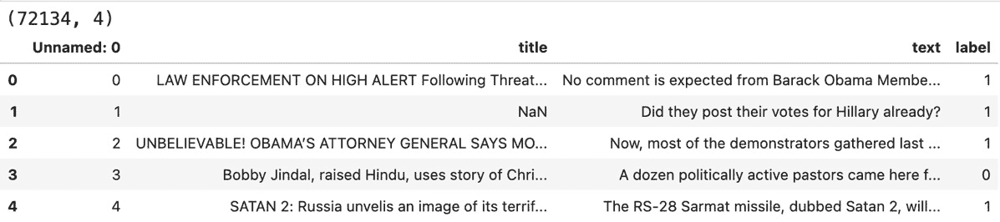
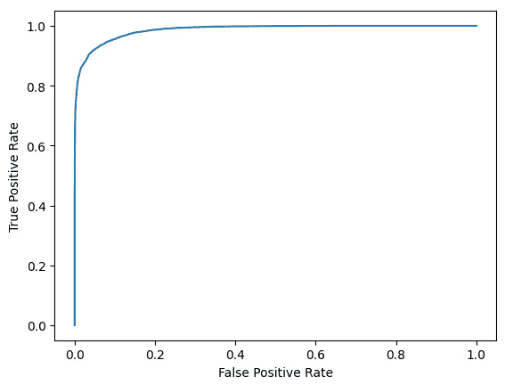

# 第十七章：自然语言模型 – 检测假新闻文章！

互联网上大量的内容是以文本格式存在的。几乎每个组织都存储了大量的内部数据和资源作为文本文档。**自然语言处理**（**NLP**）是机器学习的一个子领域，它关注于组织、理解和基于文本输入数据做出决策。在过去十年中，NLP 已经成为转变业务流程和做出明智决策的最重要方面。例如，情感分析模型可以帮助企业了解其客户对其产品和服务的整体情感。将主题建模算法与情感分析相结合可以找出客户的关键痛点，从而可以告知企业将客户满意度作为优先事项。

在本章中，我们将开发一个机器学习系统，该系统能够识别假新闻文章。这样的系统可以帮助确保互联网上的信息和新闻更加准确和安全。我们将涵盖以下主要主题：

+   使用 NLP 检测假新闻

+   在 Vertex AI 上启动模型训练

+   基于 BERT 的假新闻分类

# 技术要求

本章中使用的代码示例可以在本书的 GitHub 仓库中找到：[`github.com/PacktPublishing/The-Definitive-Guide-to-Google-Vertex-AI/tree/main/Chapter17`](https://github.com/PacktPublishing/The-Definitive-Guide-to-Google-Vertex-AI/tree/main/Chapter17)。

# 使用 NLP 检测假新闻

现在，由于互联网使用的增加，散布假新闻变得非常容易。每天都有大量用户通过他们的社交媒体账户在互联网上消费和发布内容。区分真实新闻和假新闻变得困难。然而，假新闻可以对个人、社会、组织或政党造成重大损害。从规模上看，手动或使用人工审阅员浏览每一篇文章是不可能的。因此，有必要开发智能算法，能够自动检测假新闻文章，并在假新闻生成时立即阻止其传播。

基于机器学习的分类算法可以用来检测假新闻。首先，我们需要一个良好的训练数据集来训练分类模型，以便它能够学习假新闻的共同模式，从而自动将其与真实新闻区分开来。在本节中，我们将训练一个机器学习模型来将文章分类为“假”或“真”。

## 使用随机森林进行假新闻分类

在本节中，我们将使用一种名为随机森林的基于树的分类算法来检测假新闻文章。在本章的最后部分，我们还将训练一个基于复杂深度学习的分类器，并比较两个模型的准确率。让我们开始实验。与这些实验相关的所有代码都可以在本书的 GitHub 仓库中找到，如技术要求部分所述。

## 关于数据集

我们已从 Kaggle 下载了数据集，该数据集具有开放使用的许可。数据集包含约 72k 篇新闻文章，包括标题、文本和标签。大约 50%的文章是“假新闻”，其余的是“真实新闻”。我们将利用这个数据集来训练一个基于 NLP 的分类模型，该模型可以检测假新闻。我们将保留数据集的一部分作为未见数据，以便在训练后测试模型结果。下载数据的链接可以在本书 GitHub 仓库中的 Jupyter 笔记本中找到。

注意

我们已经将数据下载并解压缩到与 Jupyter 笔记本相同的目录中。

现在，让我们进入实现部分。我们将从导入有用的 Python 库开始。

## 导入有用的库

第一步是在笔记本单元格中加载一些有用的 Python 库：

```py
import numpy as np
import pandas as pd
import matplotlib.pyplot as plt
from tqdm import tqdm_notebook
from sklearn.model_selection import train_test_split
from sklearn.metrics import classification_report, confusion_matrix
from sklearn.feature_extraction.text import TfidfVectorizer
from sklearn.ensemble import RandomForestClassifier
from sklearn.metrics import roc_curve
%matplotlib inline
```

接下来，我们将加载并验证输入数据集。

## 读取和验证数据

在这里，我们将从 CSV 文件中读取数据到名为`news_df`的 pandas DataFrame 中。我们将打印 DataFrame 的形状和一些顶级条目：

```py
news_df = pd.read_csv("WELFake_Dataset.csv")
print(news_df.shape)
news_df.head()
```

该单元格的输出显示在*图 17.1*。正如我们所见，这个表中包含 72,134 篇新闻文章，每篇都有标题、正文和标签：



图 17.1 – 假新闻文章检测数据集概述

现在，让我们看看这个数据表中是否有任何缺失值。

## NULL 值检查

我们需要检查数据集中是否存在任何 NULL 值。处理 NULL 值有不同的方法。如果 NULL 值的百分比非常低，我们可以选择从表中删除这些行；否则，我们可以用某个值填充这些条目。在我们的情况下，我们将使用空字符串值填充 NULL 字段：

```py
news_df.isnull().sum()
```

这是该单元格的输出：

```py
Unnamed: 0      0
title         558
text           39
label           0
dtype: int64
```

如我们所见，有非常少数的条目具有 NULL 值。让我们用空字符串填充它们：

```py
news_df.fillna('', inplace=True)
```

我们现在可以继续进行数据清洗和预处理。

## 将标题和文本合并到单列

让我们创建一个名为`content`的新列，其中包含合并的`title`和`text`元素，以便它包含有关新闻文章的所有可用文本信息。一旦我们完成这项工作，我们就可以使用这个列进行模型训练和分类：

```py
news_df['content'] = [x + ' ' + y for x,y in zip(news_df.title, news_df.text)]
```

现在我们文本内容在单列中，我们可以开始清洗并准备它以供模型使用。

## 清洗和预处理数据

机器学习算法对噪声数据非常敏感。因此，在将数据传递到模型进行训练之前进行数据清洗和处理至关重要；这将允许模型从中学习有用的信息。由于我们在这里使用的是经典的机器学习算法，我们需要进行一些积极的清洗和预处理。在深度学习的情况下，数据预处理不是必需的（如本章最后部分所示）。当我们使用经典的机器学习算法解决 NLP 问题时，我们通常使用诸如 TF 和 TF-IDF 之类的特征提取方法。正如我们所知，这些特征提取方法对单词计数敏感，因此从文本中删除不太有意义的单词（如停用词）和字符变得很重要。

在这个实验中，我们将遵循以下步骤来清洗和预处理数据：

1.  从文本中删除特殊字符和数字。

1.  将文本转换为小写（这样“HELLO”和“hello”对分类算法来说是相同的）。

1.  通过空格分割内容以获取单词列表。

1.  删除停用词。这些是常见的英语单词，在句子中通常没有意义。例如包括 they、the、and、he 和 him。

1.  应用词干提取。这涉及到将单词还原为其基本形式（例如，“happiness”应还原为“happy”，以便相同单词的不同变体对模型来说是相同的）。

```py
Join words with spaces in between to create text.
We will require some NLP-specific libraries that will help in preparing the data. Here, we will utilize the nltk (Natural Language Toolkit) library to remove stopwords and apply the stemming operation. To convert our text data into a numerical format, we will utilize the TfidfVectorizer method from the sklearn library:
import re
from nltk.corpus import stopwords
from nltk.stem.porter import PorterStemmer
from sklearn.feature_extraction.text import TfidfVectorizer
```

注意

当我们安装`nltk`库时，它不会自动下载与之相关的所有必需资源。在我们的情况下，我们将必须明确在终端中运行以下命令来下载英语语言中的停用词：

```py
nltk.download("stopwords")
```

这里是我们的数据清洗和预处理函数。由于这个函数在整个数据集上运行，所以需要一些时间来完成：

```py
def clean_and_prepare_content(text):
    text = re.sub('[^a-zA-Z]',' ', text)
    text = text.lower()
    text_words = text.split()
    imp_text_words = [word for word in text_words if not word in stopwords.words('english')]
    stemmed_words = [porter_stemmer.stem(word) for word in imp_text_words]
    processed_text = ' '.join(stemmed_words)
    return processed_text
porter_stemmer = PorterStemmer()
news_df['processed_content'] = news_df.content.apply(lambda content: clean_and_prepare_content(content))
```

现在，让我们将内容和标签分离成数组，以便进行建模。

## 分离数据和标签

在这里，我们正在分离数据和标签，并将它们放入两个单独的列表中：

```py
X = news_df.processed_content.values
y = news_df.label.values
print(X.shape, y.shape)
Here's the output:
(72134,) (72134,)
```

现在，让我们将文本转换为数值。

## 将文本转换为数值数据

由于机器学习算法只理解数字，我们需要将文本数据转换为数值格式。在我们的实验中，我们将创建 TF-IDF 特征：

```py
vectorizer = TfidfVectorizer()
vectorizer.fit(X)
X = vectorizer.transform(X)
print(X.shape)
Here's the output:
(72134, 162203)
```

我们现在可以将数据分成训练集和测试集，以便在训练后测试我们模型的成果。

注意

在实际的 NLP 项目中，在应用数值转换之前，我们必须将数据集分成训练集和测试集。转换函数（如`TfidfVectorizer`）应该仅对训练数据进行拟合，然后应用于测试数据。这是因为，在现实世界的设置中，我们可能在数据集中遇到一些未知单词，我们的模型在训练期间不应该看到这些单词。这种设置的问题还包括它会导致数据泄露，因为整个数据集上计算出的统计数据也属于测试分区。在这个例子中，我们为了简单起见，在分割数据集之前就进行了这种转换。

## 数据分割

接下来，我们必须将数据分割为训练和测试分区。我们将使用大约 80%的数据进行训练，剩余的 20%用于测试：

```py
X_train, X_test, y_train, y_test = train_test_split(X, y, test_size = 0.2, stratify=y, random_state=42)
```

我们的训练和测试数据分区现在已准备好输入模型。接下来，我们将定义模型。

## 定义随机森林分类器

对于我们的简单实验，我们正在使用随机森林模型的默认超参数值。然而，在实际应用中，我们可以尝试不同的超参数值组合以获得最佳结果。或者，我们可以利用超参数调优来找到我们模型的最佳超参数：

```py
rf_model = RandomForestClassifier()
```

让我们继续在训练分区上训练模型。

## 训练模型

让我们将模型拟合到训练数据集：

```py
rf_model.fit(X_train, y_train)
```

下面是输出结果：

```py
RandomForestClassifier()
```

我们现在已完成模型训练，这意味着我们可以开始预测测试数据以检查模型的结果。

## 预测测试数据

在这里，我们使用训练好的随机森林分类器对测试分区进行预测。`predict`函数给出类别级别的输出，而`predict_proba`函数给出概率输出：

```py
y_pred = rf_model.predict(X_test)
y_proba = rf_model.predict_proba(X_test)
```

在这里，我们已经对整个数据集进行了预测。让我们看看我们的模型做得如何。

## 在测试数据集上检查结果/指标

下一个重要步骤是检查并验证我们的模型在测试数据集上的性能。在这里，我们将使用 sklearn 的分类报告方法来获取每个类别的精确度、召回率和 F1 分数。查看以下代码片段：

```py
# classification report
print(
    classification_report(
        y_test,
        y_pred,
        target_names=['Real', 'Fake'],
    )
)
```

下面是分类报告的输出：

```py
              precision    recall  f1-score   support
        Real       0.94      0.92      0.93      7006
        Fake       0.93      0.94      0.94      7421
    accuracy                           0.93     14427
   macro avg       0.93      0.93      0.93     14427
weighted avg       0.93      0.93      0.93     14427
```

如我们所见，我们的模型对于两个类别都有大约 93%的精确度和召回率。总体准确率也大约是 93%。因此，我们可以说我们的模型足够好，能够识别大约 93%的假新闻文章。

接下来，让我们绘制 ROC 曲线。ROC 曲线是分类模型的**假阳性率**（**FPR**）和**真阳性率**（**TPR**）之间的图形：

```py
def plot_roc_curve(y_true, y_prob):
    """
    plots the roc curve based of the probabilities
    """
    fpr, tpr, thresholds = roc_curve(y_true, y_prob)
    plt.plot(fpr, tpr)
    plt.xlabel('False Positive Rate')
    plt.ylabel('True Positive Rate')
plot_roc_curve(y_test, y_proba[:,1])
```

查看*图 17.2*以了解我们实验的 ROC 曲线。在典型的 ROC 曲线中，X 轴代表 FPR，Y 轴代表 TPR。**ROC 曲线下的面积**，也称为**ROC-AUC**，表示分类模型的质量。面积值越高，表示模型越好：



图 17.2 – 假新闻分类模型的 ROC 曲线

让我们也查看混淆矩阵，看看我们的模型在哪里出错。

## 混淆矩阵

最后，让我们也打印出我们分类的混淆矩阵。混淆矩阵显示了每个类别的正确和错误分类的数量。它还显示了如果分类错误（假阳性和假阴性）的话，哪些其他类别被预测为错误：

```py
confusion_matrix(y_test, y_pred,)
```

下面是输出结果：

```py
array([[6455,  551],
       [ 409, 7012]])
```

我们的实验现在已经完成。如果结果令人满意，我们可以继续部署此模型作为 API。如果结果仍然不可接受，我们可以进行更多不同设置的实验。

如果我们要并行进行大量实验，我们可以通过 Vertex AI 训练作业启动许多并行实验，而无需不断监控它们，并在训练完成后稍后再进行检查。在下一节中，我们将看到如何配置 Vertex AI 训练作业。

# 在 Vertex AI 上启动模型训练。

在本节中，我们将以 Vertex AI 训练作业的形式启动我们的训练实验。与在 Jupyter Notebook 中执行相比，在 Vertex AI 上启动训练作业有多个优点：

+   可以灵活地启动任意数量的并行实验。

+   我们可以选择最佳的硬件进行模型训练，这在需要训练深度学习模型时非常重要。

+   我们不需要对训练进度进行主动监控。

+   没有 Jupyter Notebook 崩溃的担忧。

+   Vertex AI 训练作业可以配置为在 Google Cloud Console UI 中记录元数据和实验。

+   在本节中，我们将为我们的实验创建并启动一个 Vertex AI 训练作业。启动 Vertex AI 训练作业主要有两件事要做。首先，我们需要将数据集放置在一个 Vertex AI 作业可访问的位置（例如 GCS 或 BigQuery）。其次，我们需要将模型训练代码整理到一个单独的`task.py`文件中，以便将其打包到包含所有必要依赖项的训练容器中。

这里是我们需要遵循的步骤来创建和启动我们的 Vertex AI 训练作业：

1.  将数据集上传到 GCS 或 BigQuery（我们将使用 GCS）。

1.  创建一个执行以下操作的`task.py`文件：

    +   从 GCS 读取数据。

    +   进行必要的数据准备。

    +   训练 RF 模型。

    +   将训练好的模型保存到 GCS。

    +   在测试集上进行预测。

    +   （可选）将预测保存到 GCS。

    +   打印一些结果/指标。

1.  使用预构建的训练镜像。

1.  启动 Vertex AI 训练。

1.  在 Google Cloud Console UI 上监控进度。

考虑到这些步骤，我们已经在我们的实验中创建了一个`task.py`文件；它可以在本书的 GitHub 仓库中找到。接下来，我们将学习如何使用这个`task.py`文件来启动作业。

## 设置配置。

在这里，我们将定义在 Vertex AI 上启动训练作业时必要的与项目和数据位置相关的配置。以下代码片段显示了与我们实验相关的某些配置：

```py
PROJECT_ID='417xxxxxxx97'
REGION='us-west2'
BUCKET_URI='gs://my-training-artifacts'
DATA_LOCATION='gs://my-training-artifacts/WELFake_Dataset.csv'
# prebuilt training containers
TRAIN_VERSION = "tf-cpu.2-9"
TRAIN_IMAGE = "us-docker.pkg.dev/vertex-ai/training/{}:latest".format(TRAIN_VERSION)
```

让我们使用适当的变量初始化 Vertex AI SDK。

## 初始化 Vertex AI SDK。

在这里，我们正在初始化 Vertex AI SDK 以设置作业的项目、位置和暂存存储桶：

```py
from google.cloud import aiplatform
aiplatform.init(project=PROJECT_ID, location=REGION, staging_bucket=BUCKET_URI)
```

现在我们已经设置了配置，我们可以开始定义 Vertex AI 训练作业。

## 定义 Vertex AI 训练作业。

以下代码块定义了我们的实验的 Vertex AI 训练作业。在这里，我们传递`display_name`，这将帮助我们定位控制台 UI 中的作业。请注意，我们正在将我们的`task.py`文件作为脚本路径变量传递。`container_uri`是用于启动作业的预构建容器。最后，我们可以指定运行我们的训练代码所需的任何额外的 Python 包。在我们的情况下，我们需要安装`nltk`包以实现一些 NLP 相关的功能：

```py
job = aiplatform.CustomTrainingJob(
    display_name="fake_news_detection",
    script_path="task.py",
    container_uri=TRAIN_IMAGE,
    requirements=["nltk"],
)
```

我们基于 Vertex AI 的自定义训练作业现在已准备就绪。让我们运行它。

## 运行 Vertex AI 作业

我们已经准备好启动我们的训练作业。我们使用`n1-standard-16`类型的机器进行实验，可以根据我们的需求进行修改。查看以下代码片段，它将在 Vertex AI 上启动我们的训练作业：

```py
# Start the training job
model = job.run(
    machine_type = "n1-standard-16",
    replica_count=1,
)
```

启动作业后，我们应该在输出中看到一个 URL，指向云控制台 UI 中的作业。输出应该看起来像这样：

```py
Training script copied to:
gs://my-training-artifacts/aiplatform-2023-09-04-04:41:36.367-aiplatform_custom_trainer_script-0.1.tar.gz.
Training Output directory:
gs://my-training-artifacts/aiplatform-custom-training-2023-09-04-04:41:36.625
View Training:
https://console.cloud.google.com/ai/platform/locations/us-west2/training/8404xxxxxxxxxx898?project=417xxxxxxxx7
CustomTrainingJob projects/417xxxxxxxx7/locations/us-west2/trainingPipelines/840xxxxxxxxxx92 current state:
PipelineState.PIPELINE_STATE_RUNNING
View backing custom job:
https://console.cloud.google.com/ai/platform/locations/us-west2/training/678xxxxxxxxxxx48?project=417xxxxxxxx7
CustomTrainingJob projects/417xxxxxxxx7/locations/us-west2/trainingPipelines/840xxxxxxxxxx92 current state:
PipelineState.PIPELINE_STATE_RUNNING
```

有了这些，我们已经成功地将我们的实验作为一个训练作业在 Vertex 上启动。现在我们可以使用云控制台 UI 监控作业的进度。接下来，我们将使用深度学习方法来解决这个问题，希望得到更好的结果。

# 基于 BERT 的虚假新闻分类

在我们的第一个实验中，我们使用 TF-IDF 特征在经典随机森林分类器上进行训练，以检测虚假新闻与真实新闻文章，并获得了大约 93%的准确率。在本节中，我们将训练一个深度学习模型来完成相同的任务，并看看我们是否能比经典的基于树的算法获得更高的准确率。深度学习已经改变了我们解决自然语言处理（NLP）问题的方式。经典方法需要手工制作的特征，其中大部分与文档中出现的单词频率有关。考虑到语言的复杂性，仅仅知道段落中单词的数量是不够的。单词出现的顺序也对段落或句子的整体意义有显著影响。深度学习方法，如**长短期记忆网络（LSTM**）也考虑了句子或段落中单词的顺序依赖性，以获得更有意义的特征表示。LSTM 在许多 NLP 任务中取得了巨大成功，但也存在一些局限性。由于这些模型是按顺序训练的，因此很难扩展这些模型。其次，当我们处理非常长的序列时，LSTMs 会遭受上下文丢失，因此它们不适合理解较长序列的上下文。由于一些局限性，包括这里讨论的局限性，人们发明了从顺序输入中学习上下文的新方法。

基于转换器的模型的出现对自然语言处理（NLP）和视觉人工智能领域具有里程碑意义。基于转换器的模型严重依赖于注意力机制来捕捉上下文和序列间的模式，并且它们也能够处理非常长的输入序列。**来自转换器的双向编码器表示**（**BERT**）是一系列基于转换器架构一部分的 NLP 模型。基于 BERT 的模型在众多 NLP 任务中取得了巨大成功，其中一些在过去几十年中似乎几乎不可能实现。

与深度学习模型合作的一个优点是，我们不必每次都从头开始训练它们。我们总是利用预训练模型，然后在我们的特定领域数据上微调它们，以更快地获得出色的结果，而且不需要大量的特定领域训练数据。这种方法被称为**迁移学习**，这是大型深度学习模型在大量数据上预训练后，可以用于许多下游特定领域任务，因为它们可以用少量特定领域训练数据进行微调。

## BERT 用于假新闻分类

在这个实验中，我们将利用一个预训练的 BERT 模型，并在我们的新闻文章训练数据集上稍作微调。让我们开始吧。

## 导入有用的库

在这个实验中，我们将利用 PyTorch 作为微调 BERT 模型的框架。我们还利用 Hugging Face 的 `transformers` 库来加载基于 BERT 的模型的预训练权重，以及一些用于设置微调的有用工具：

```py
import torch
from transformers import BertTokenizer
from transformers import BertForSequenceClassification
from transformers import AdamW
from transformers import get_linear_schedule_with_warmup
from torch.utils.data import TensorDataset
from torch.utils.data import random_split, DataLoader
```

现在，让我们开始准备数据集。

## 数据集

我们将使用与第一个实验中相同的同一个数据集。因此，我们在这里也将遵循相同的步骤——我们将加载数据，处理 NULL 值，并创建一个包含所有必要文本的内容列：

```py
news_df = pd.read_csv("WELFake_Dataset.csv")
news_df.fillna('', inplace=True)
news_df['content'] = [x + ' ' + y for x,y in zip(news_df.title, news_df.text)]
```

接下来，我们将内容列中的文本转换为小写：

```py
news_df['content'] = news_df['content'].apply(lambda text: text.lower())
```

现在，我们将文本和标签分开，并将它们存储为列表：

```py
texts = news_df.content.values
labels = news_df.label.values
print(len(texts), len(labels))
```

这是输出：

72134 72134

现在，让我们根据 BERT 模型输入的要求准备我们的数据集。

## 数据准备

由于我们现在正在使用 BERT 模型，我们不需要执行大量的数据清理，例如删除数字、删除停用词、词干提取等。每个 BERT 模型都有一个标记器，用于将文本数据转换为数字 ID。因此，我们需要找到适当的 BERT 标记器（可以通过 Hugging Face 的 `transformers` 库加载），进行标记化，并为训练目的创建注意力掩码。

让我们创建标记器对象：

```py
tokenizer = BertTokenizer.from_pretrained('bert-base-uncased')
```

在这里，我们定义了一个函数，该函数将创建用于训练的标记化文本和注意力掩码：

```py
def prepare_tokenized_data(texts, labs='None'):
    global labels
    input_id_list = []
    attention_masks = []
```

接下来，我们必须为每个输入文本生成编码和注意力掩码：

```py
    for text in tqdm_notebook(texts):
        encoded_dict = tokenizer.encode_plus(
            text,
            add_special_tokens = True,
            truncation = 'longest_first',
            max_length = 100,
            pad_to_max_length = True,
            return_attention_mask = True,
            return_tensors = 'pt'
        )
        input_id_list.append(encoded_dict['input_ids'])
       attention_masks.append(encoded_dict['attention_mask'])
```

现在，让我们将列表转换为 PyTorch 张量：

```py
    input_id_list = torch.cat(input_id_list, dim=0)
    attention_masks = torch.cat(attention_masks, dim=0)
    if labs != 'None':
        labels = torch.tensor(labels)
        return input_id_list, attention_masks, labels
    else:
        return input_id_list, attention_masks
```

在这里，我们调用必要的函数，以准备我们的数据：

```py
input_id_list, attention_masks, labels = (
    prepare_tokenized_data(texts, labels)
)
```

现在，让我们将我们的数据分成训练和测试部分。

## 数据分割

在这里，我们将从输入 ID、注意力掩码和标签创建一个张量数据集，并将其分为训练集和测试集。类似于第一个实验，我们将使用大约 80%的数据进行训练（或微调）目的，剩余的 20%用于测试结果和指标。以下代码片段显示了如何创建和分割张量数据集：

```py
tensor_dataset = TensorDataset(input_id_list, attention_masks, labels)
# lets keep 80% articles for training and 20% for test
train_size = int(0.8 * len(tensor_dataset))
test_size = len(tensor_dataset) - train_size
train_data, test_data = random_split(tensor_dataset, [train_size, test_size])
print(len(train_data.indices), len(test_data.indices))
```

这是输出：

```py
(57707, 14427)
```

现在，让我们定义具有所需批量大小的数据加载器对象。

## 创建用于批处理的数据加载器对象

下一步是为训练和测试分区创建数据加载器对象。我们将为训练数据设置 32 个批大小，为测试数据设置 1 个批大小：

```py
batch_size = 32
num_workers = 4
train_data_loader = DataLoader(
    dataset=train_data,
    batch_size=batch_size,
    shuffle=True,
    num_workers=num_workers,
)
# test data loader with batch size of 1
test_data_loader = DataLoader(
    dataset=test_data,
    batch_size=1,
    shuffle=False,
)
```

我们的数据现在已准备好用于模型。这意味着我们可以加载模型并开始训练。

## 加载预训练的 BERT 模型

在这里，我们将加载基于 BERT 的模型的预训练权重，以便我们可以在自定义数据集上进一步微调。许多 BERT 变体的预训练权重都可在 Hugging Face 上找到，并且可以通过`transformers`库加载，如下面的代码片段所示：

```py
device = 'cpu'
bert_model = BertForSequenceClassification.from_pretrained(
    'bert-base-uncased',
    num_labels=2,
    output_attentions=False,
    output_hidden_states=False,
)
bert_model.to(device)
```

使用`device`变量，我们可以选择在加速器上加载我们的模型，例如 GPU。此代码片段下载了具有两个标签分类层的`bert-base-uncased`模型的预训练权重。执行此代码片段还会打印 BERT 架构摘要，其外观类似于以下内容：

```py
BertForSequenceClassification(
  (bert): BertModel(
    (embeddings): BertEmbeddings(
      (word_embeddings): Embedding(30522, 768, padding_idx=0)
      (position_embeddings): Embedding(512, 768)
      (token_type_embeddings): Embedding(2, 768)
      (LayerNorm): LayerNorm((768,), eps=1e-12, elementwise_affine=True)
      (dropout): Dropout(p=0.1, inplace=False)
    )
   . . . . . . . . . . .
   . . . . . . . . . . .
```

现在，我们的模型已经加载，让我们定义优化设置。

优化器

在这里，我们定义了`AdamW`优化器并设置了自定义学习率：

```py
optimizer = torch.optim.AdamW(
    bert_model.parameters(),
    lr=6e-6,
    eps=1e-8,
)
```

让我们也为模型训练定义一个调度器。

## 调度器

在这里，我们设置训练步骤和训练调度器。我们计划在我们的训练分区上微调模型仅`3`个周期，之后我们将检查测试集上的结果：

```py
num_epochs = 3
steps_per_epoch = len(train_data_loader)
total_steps = steps_per_epoch * num_epochs
scheduler = get_linear_schedule_with_warmup(
    optimizer,
    num_warmup_steps = 0,
    num_training_steps = total_steps,
)
```

现在，我们已经准备好开始训练模型。

## 训练 BERT

在这里，我们将根据前一个子节中定义的`3`个周期，在训练数据上微调 BERT 模型：

```py
bert_model.train()
for epoch in range(num_epochs):
    total_loss = 0
    for i, (ids, masks, labels) in enumerate(train_data_loader):
        ids = ids.to(device)
        masks = masks.to(device)
        labels = labels.to(device)
        loss = bert_model(ids, token_type_ids=None, attention_mask=masks, labels=labels)[0]
        optimizer.zero_grad()
        loss.backward()
        optimizer.step()
        scheduler.step()
        total_loss += loss.item()
    print('Epoch: {}, Loss: {:.4f}'.format(epoch+1, total_loss / steps_per_epoch))
```

此训练代码片段在每个训练周期完成后打印模型损失。我们的实验的损失输出如下：

```py
Epoch: 1, Loss: 0.0803
Epoch: 2, Loss: 0.0229
Epoch: 3, Loss: 0.0112
```

现在，我们的模型训练（或微调）已完成，我们可以保存模型权重：

```py
# save trained model locally
torch.save(bert_model.state_dict(), 'BERT.ckpt')
```

这样，我们已经成功训练并保存了模型。现在，让我们继续进行模型评估。

## 加载模型权重进行评估

在这里，我们加载我们的训练模型权重以进行评估：

```py
bert_model.eval()
bert_model.load_state_dict(
    torch.load('BERT.ckpt'),
)
Output:
<All keys matched successfully>
```

让我们检查训练模型在测试数据集上的准确率。

## 计算测试数据集的准确率

现在，我们的模型已经训练并加载用于评估，我们可以在测试数据集上进行预测并检查其准确率。

我们将在以下变量中存储预测结果，并计算正确预测的数量：

```py
correct_predictions = 0
predictions = []
reals = []
```

在这里，我们在测试数据上运行模型预测：

```py
for i, (ids, masks, labels) in enumerate(test_data_loader):
    ids = ids.to(device)
    masks = masks.to(device)
    labels = labels.to(device)
    bert_out = bert_model(ids, token_type_ids=None, attention_mask=masks, labels=labels)[1]
    prediction = torch.max(bert_out, 1)[1][0].item()
    true_label = labels[0].item()
    correct_predictions += int(prediction == true_label)
    predictions.append(prediction)
    reals.append(true_label)
```

我们可以通过将正确预测的数量除以总预测数量来计算准确率：

```py
avg_correct_predictions = correct_predictions / len(test_data)
print('Accuracy: {:.4f}\n'.format(avg_correct_predictions))
```

这个单元格的输出显示，我们的模型在测试数据集上的准确率约为 99%。这比经典的随机森林模型有了巨大的改进：

```py
Accuracy: 0.9902
```

最后，让我们打印出混淆矩阵：

```py
print(confusion_matrix(reals, predictions,))
```

下面是输出结果：

```py
[[7025   53]
 [  88 7261]]
```

现在，我们可以为我们的模型生成一个分类报告。

## 分类报告

最后，我们将打印出我们实验的分类报告，以了解每个类别的精确率、召回率和 F1 分数：

```py
print(
    classification_report(
        reals,
        predictions,
        target_names=['Real', 'Fake'],
    )
)
```

下面是输出结果：

```py
              precision    recall  f1-score   support
        Real       0.99      0.99      0.99      7078
        Fake       0.99      0.99      0.99      7349
    accuracy                           0.99     14427
   macro avg       0.99      0.99      0.99     14427
weighted avg       0.99      0.99      0.99     14427
```

上述输出表明，我们的基于 BERT 的分类模型非常准确，准确率约为 99%。同样，对于每个类别，我们都有大约 99%的精确率和召回率。这个实验表明，使用预训练的深度学习模型可以大幅度提高分类的准确率。

# 摘要

本章介绍了关于检测假新闻的真实世界 NLP 应用案例。在当前互联网时代，传播假新闻变得相当容易，这对个人、社会、组织或政党的声誉可能构成危险。正如我们在实验中所看到的，机器学习分类可以被用作检测假新闻文章的强大工具。基于深度学习的方案可以进一步提高文本分类用例的结果，而无需进行大量的微调数据。

在阅读本章之后，你应该对在文本分类用例（如假新闻检测）中训练和应用分类模型充满信心。你也应该对应用经典模型（如随机森林）所需的清理和预处理步骤有很好的理解。此时，你应该能够启动大规模机器学习实验作为 Vertex AI 训练作业。最后，你应该对如何应用和微调基于深度学习的 BERT 模型以用于文本分类用例有很好的理解。
