# *第二章*：检查特征与目标变量之间的双变量和多变量关系

在本章中，我们将探讨可能特征与目标变量之间的相关性。使用交叉表（双向频率）、相关性、散点图和分组箱线图的双变量探索性分析可以揭示建模的关键问题。常见问题包括特征之间高度相关以及特征与目标变量之间的非线性关系。在本章中，我们将使用 pandas 方法进行双变量分析，并使用 Matplotlib 进行可视化。我们还将讨论我们在特征工程和建模方面发现的影响。

我们还将使用多元技术来理解特征之间的关系。这包括依赖一些机器学习算法来识别可能存在问题的观测值。之后，我们将就消除某些观测值以及转换关键特征提供初步建议。

在本章中，我们将涵盖以下主题：

+   在双变量关系中识别异常值和极端值

+   使用散点图查看连续特征之间的双变量关系

+   使用分组箱线图查看连续和分类特征之间的双变量关系

+   使用线性回归识别具有显著影响的数据点

+   使用 K 近邻算法寻找异常值

+   使用隔离森林算法寻找异常值

# 技术要求

本章将大量依赖 pandas 和 Matplotlib 库，但你不需要对这些库有任何先前的知识。如果你是从科学发行版安装的 Python，例如 Anaconda 或 WinPython，那么这些库可能已经安装好了。我们还将使用 Seaborn 进行一些图形，并使用 statsmodels 库进行一些汇总统计。如果你需要安装任何包，可以从终端窗口或 Windows PowerShell 运行`pip install [package name]`。本章的代码可以在本书的 GitHub 仓库[`github.com/PacktPublishing/Data-Cleaning-and-Exploration-with-Machine-Learning`](https://github.com/PacktPublishing/Data-Cleaning-and-Exploration-with-Machine-Learning)中找到。

# 在双变量关系中识别异常值和极端值

没有一个好的双变量关系感，很难开发出一个可靠的模型。我们不仅关心特定特征与目标变量之间的关系，还关心特征如何一起移动。如果特征高度相关，那么建模它们的独立效应可能变得棘手或没有必要。即使特征只是在某个值域内高度相关，这也可能是一个挑战。

对双变量关系的良好理解对于识别异常值也很重要。一个值可能出乎意料，即使它不是一个极端值。这是因为当第二个特征具有某些值时，某些特征的值可能是不寻常的。当其中一个特征是分类的，而另一个是连续的时，这一点很容易说明。

下面的图表说明了多年来每天鸟类观测的数量，但显示了两个地点不同的分布。一个地点每天的平均观测数为 33，而另一个地点为 52。（这是一个从我的*Python 数据清洗食谱*中提取的虚构示例。）整体平均数（未显示）为 42。对于每天 58 次观测的值我们应该如何看待？它是异常值吗？这取决于观察的是哪个地点。如果地点 A 一天有 58 次观测，那么 58 将是一个非常高的数字。然而，对于地点 B 来说，58 次观测并不会与该地点的平均值有很大不同：

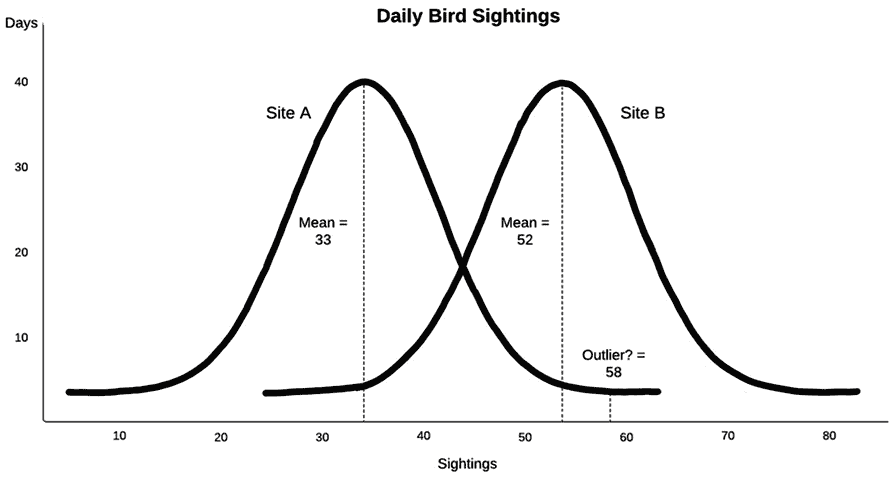

图 2.1 – 每日鸟类观测

这暗示了一个有用的经验法则：当感兴趣的特征与另一个特征相关时，我们在尝试识别异常值（或任何与该特征相关的建模）时应该考虑这种关系。更精确地表述这一点并将其扩展到两个特征都是连续的情况是有帮助的。如果我们假设特征*x*和特征*y*之间存在线性关系，我们可以用熟悉的*y = mx + b*方程来描述这种关系，其中*m*是斜率，*b*是*y*轴截距。然后，我们可以预期*y*的值将接近*x*乘以估计的斜率，加上*y*轴截距。意外值是那些与这种关系有较大偏差的值，其中*y*的值远高于或低于根据*x*的值预测的值。这可以扩展到多个*x*，或预测变量。

在本节中，我们将学习如何通过考察一个特征与另一个特征之间的关系来识别异常值和意外值。在本章的后续部分，我们将使用多元技术来进一步提高我们的异常值检测。

在本节中，我们将基于各国 COVID-19 病例的数据进行工作。数据集包含每百万人口中的病例和死亡人数。我们将把这两个列都视为可能的靶标。它还包含每个国家的人口统计数据，例如人均 GDP、中位数年龄和糖尿病患病率。让我们开始吧：

注意

Our World in Data 在[`ourworldindata.org/coronavirus-source-data`](https://ourworldindata.org/coronavirus-source-data)提供 COVID-19 公共使用数据。本节所使用的数据集是在 2021 年 7 月 9 日下载的。数据中包含的列比我包含的要多。我根据国家创建了`region`列。

1.  让我们从加载 COVID-19 数据集并查看其结构开始。我们还将导入 Matplotlib 和 Seaborn 库，因为我们将会进行一些可视化：

    ```py
    import pandas as pd
    import matplotlib.pyplot as plt
    import seaborn as sns
    covidtotals = pd.read_csv("data/covidtotals.csv")
    covidtotals.set_index("iso_code", inplace=True)
    covidtotals.info()
    <class 'pandas.core.frame.DataFrame'>
    Index: 221 entries, AFG to ZWE
    Data columns (total 16 columns):
     #  Column                  Non-Null Count     Dtype
    --  --------                ---------------    -------
     0  lastdate                221    non-null    object 
     1  location                221    non-null    object 
     2  total_cases             192    non-null    float64
     3  total_deaths            185    non-null    float64
     4  total_cases_mill        192    non-null    float64
     5  total_deaths_mill       185    non-null    float64
     6  population              221    non-null    float64
     7  population_density      206    non-null    float64
     8  median_age              190    non-null    float64
     9  gdp_per_capita          193    non-null    float64
    10  aged_65_older           188    non-null    float64
    11  total_tests_thous        13    non-null    float64
    12  life_expectancy         217    non-null    float64
    13  hospital_beds_thous     170    non-null    float64
    14  diabetes_prevalence     200    non-null    float64
    15  region                  221    non-null    object
    dtypes: float64(13), object(3)
    memory usage: 29.4+ KB
    ```

1.  在我们检查双变量关系的过程中，从相关性开始是一个很好的起点。首先，让我们创建一个包含一些关键特征的 DataFrame：

    ```py
    totvars = ['location','total_cases_mill', 
      'total_deaths_mill']
    demovars = ['population_density','aged_65_older', 
      'gdp_per_capita','life_expectancy', 
      'diabetes_prevalence']
    covidkeys = covidtotals.loc[:, totvars + demovars]
    ```

1.  现在，我们可以获取这些特征的皮尔逊相关矩阵。病例和每百万死亡之间的正相关系数为 0.71。65 岁或以上的人口百分比与病例和死亡都呈正相关，两者均为 0.53。预期寿命也与每百万病例高度相关。似乎至少有一些与**国内生产总值**（**GDP**）每人相关的病例：

    ```py
    corrmatrix = covidkeys.corr(method="pearson")
    corrmatrix
                      total_cases_mill  total_deaths_mill\
    total_cases_mill              1.00               0.71
    total_deaths_mill             0.71               1.00
    population_density            0.04              -0.03
    aged_65_older                 0.53               0.53
    gdp_per_capita                0.46               0.22
    life_expectancy               0.57               0.46
    diabetes_prevalence           0.02              -0.01
                    population_density  aged_65_older  gdp_per_capita\
    total_cases_mill         0.04          0.53       0.46
    total_deaths_mill       -0.03          0.53       0.22
    population_density       1.00          0.06       0.41
    aged_65_older            0.06          1.00       0.49
    gdp_per_capita           0.41          0.49       1.00
    life_expectancy          0.23          0.73       0.68
    diabetes_prevalence      0.01         -0.06       0.12
                      life_expectancy  diabetes_prevalence
    total_cases_mill        0.57           0.02  
    total_deaths_mill       0.46          -0.01  
    population_density      0.23           0.01  
    aged_65_older           0.73          -0.06  
    gdp_per_capita          0.68           0.12  
    life_expectancy         1.00           0.19  
    diabetes_prevalence     0.19           1.00
    ```

值得注意的是，可能特征之间的相关性，例如，预期寿命和人均 GDP（0.68）以及预期寿命和 65 岁或以上人群（0.73）之间的相关性。

1.  将相关矩阵作为热图查看可能会有所帮助。这可以通过将相关矩阵传递给 Seaborn 的`heatmap`方法来完成：

    ```py
    sns.heatmap(corrmatrix, xticklabels =
      corrmatrix.columns, yticklabels=corrmatrix.columns, 
      cmap="coolwarm")
    plt.title('Heat Map of Correlation Matrix')
    plt.tight_layout()
    plt.show()
    ```

这会创建以下图表：

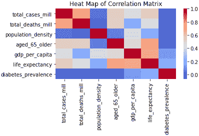

图 2.2 – COVID 数据的热图，最强的相关性用红色和桃色表示

我们需要关注用较暖色调显示的细胞——在这种情况下，主要是桃色。我发现使用热图有助于我在建模时记住相关性。

注意

本书包含的所有彩色图像都可以下载。请查看本书的*前言*以获取相应的链接。

1.  让我们更仔细地看看每百万总病例数和每百万死亡数之间的关系。比仅仅通过相关系数更好地理解这一点的一种方法是比较每个的高值和低值，看看它们是如何一起变化的。在下面的代码中，我们使用`qcut`方法为病例创建一个具有五个值的分类特征，这些值从非常低到非常高分布得相对均匀：我们为死亡也做了同样的事情：

    ```py
    covidkeys['total_cases_q'] = \
      pd.qcut(covidkeys['total_cases_mill'],
      labels=['very low','low','medium','high',
      'very high'], q=5, precision=0)
    covidkeys['total_deaths_q'] = \
      pd.qcut(covidkeys['total_deaths_mill'],
      labels=['very low','low','medium','high',
      'very high'], q=5, precision=0)
    ```

1.  我们可以使用`crosstab`函数查看每个病例五分位数和死亡五分位数的国家数量。正如我们所预期的，大多数国家都在对角线上。有 27 个国家病例和死亡都非常低，有 25 个国家病例和死亡都非常高。有趣的是那些不在对角线上的计数，例如，四个病例非常高但死亡中等的国家，以及一个病例中等但死亡非常高的国家。让我们也看看我们特征的均值，这样我们以后可以参考它们：

    ```py
    pd.crosstab(covidkeys.total_cases_q, 
      covidkeys.total_deaths_q)
    total_deaths_q  very low  low  medium  high  very high
    total_cases_q                                         
    very low              27    7       0     0          0
    low                    9   24       4     0          0
    medium                 1    6      23     6          1
    high                   0    0       6    21         11
    very high              0    0       4    10         25
    covidkeys.mean()
    total_cases_mill         36,649
    total_deaths_mill           683
    population_density          453
    aged_65_older                 9
    gdp_per_capita           19,141
    life_expectancy              73
    diabetes_prevalence           8
    ```

1.  让我们仔细看看远离对角线的国家。四个国家——塞浦路斯、科威特、马尔代夫和卡塔尔——的每百万死亡数低于平均水平，但每百万病例数则远高于平均水平。有趣的是，这四个国家在人口规模上都非常小；其中三个国家的人口密度远低于平均的 453；再次，其中三个国家的 65 岁或以上人口比例远低于平均水平：

    ```py
    covidtotals.loc[(covidkeys.total_cases_q=="very high")
      & (covidkeys.total_deaths_q=="medium")].T
    iso_code            CYP        KWT        MDV    QAT
    lastdate            2021-07-07 2021-07-07 2021-07-07  2021-07-07
    location            Cyprus    Kuwait   Maldives  Qatar
    total_cases         80,588    369,227  74,724  222,918
    total_deaths        380       2,059    213     596
    total_cases_mill    90,752    86,459   138,239 77,374
    total_deaths_mill   428       482      394     207
    population         888,005 4,270,563 540,542 2,881,060
    population_density  128       232      1,454    227
    median_age          37        34       31       32
    gdp_per_capita      32,415    65,531   15,184   116,936
    aged_65_older       13        2        4        1
    total_tests_thous   NaN       NaN      NaN     NaN
    life_expectancy     81        75       79      80
    hospital_beds_thous 3         2        NaN     1
    diabetes_prevalence 9         16       9       17
    region              Eastern   West     South   West  
                        Europe    Asia     Asia    Asia
    ```

1.  让我们仔细看看那些根据病例数预期死亡数较多的国家。对于墨西哥来说，每百万病例数远低于平均水平，而每百万死亡数则相当高于平均水平：

    ```py
    covidtotals.loc[(covidkeys. total_cases_q=="medium")
      & (covidkeys.total_deaths_q=="very high")].T
    iso_code                         MEX
    lastdate                  2021-07-07
    location                      Mexico
    total_cases                2,558,369
    total_deaths                 234,192
    total_cases_mill              19,843
    total_deaths_mill              1,816
    population               128,932,753
    population_density                66
    median_age                        29
    gdp_per_capita                17,336
    aged_65_older                      7
    total_tests_thous                NaN
    life_expectancy                   75
    hospital_beds_thous                1
    diabetes_prevalence               13
    region                 North America
    ```

当我们想要了解数据集中双变量关系时，相关系数和热图是一个好的起点。然而，仅用相关系数来可视化连续变量之间的关系可能很困难。这尤其适用于关系不是线性的情况——也就是说，当它基于特征的取值范围而变化时。我们通常可以通过散点图来提高我们对两个特征之间关系的理解。我们将在下一节中这样做。

# 使用散点图查看连续特征之间的双变量关系

在本节中，我们将学习如何获取数据的散点图。

我们可以使用散点图来获取比仅通过相关系数所能检测到的更完整的两个特征之间的关系图景。这在数据关系随数据范围变化而变化时尤其有用。在本节中，我们将创建一些与上一节中考察的相同特征的散点图。让我们开始吧：

1.  通过数据点绘制回归线是有帮助的。我们可以使用 Seaborn 的`regplot`方法来做这件事。让我们再次加载 COVID-19 数据，以及 Matplotlib 和 Seaborn 库，并生成`total_cases_mill`与`total_deaths_mill`的散点图：

    ```py
    import pandas as pd
    import numpy as np
    import matplotlib.pyplot as plt
    import seaborn as sns
    covidtotals = pd.read_csv("data/covidtotals.csv")
    covidtotals.set_index("iso_code", inplace=True)
    ax = sns.regplot(x="total_cases_mill",
      y="total_deaths_mill", data=covidtotals)
    ax.set(xlabel="Cases Per Million", ylabel="Deaths Per 
      Million", title="Total COVID Cases and Deaths by 
      Country")
    plt.show()
    ```

这会产生以下图表：

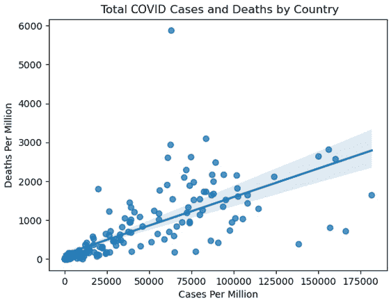

图 2.3 – 按国家划分的 COVID 病例和死亡总数

回归线是对每百万病例和每百万死亡之间关系的估计。线的斜率表明，我们可以预期每百万死亡数随着每百万病例数增加 1 个单位而增加多少。那些在散点图上显著高于回归线的点应该被更仔细地检查。

1.  死亡率每百万接近 6,000 例，病例率每百万低于 75,000 例的国家显然是异常值。让我们仔细看看：

    ```py
    covidtotals.loc[(covidtotals.total_cases_mill<75000) \
      & (covidtotals.total_deaths_mill>5500)].T
    iso_code                           PER
    lastdate                    2021-07-07
    location                          Peru
    total_cases                  2,071,637
    total_deaths                   193,743
    total_cases_mill                62,830
    total_deaths_mill                5,876
    population                  32,971,846
    population_density                  25
    median_age                          29
    gdp_per_capita                  12,237
    aged_65_older                        7
    total_tests_thous                  NaN
    life_expectancy                     77
    hospital_beds_thous                  2
    diabetes_prevalence                  6
    region                   South America
    ```

在这里，我们可以看到异常值国家是秘鲁。秘鲁的确每百万人口病例数高于平均水平，但其每百万死亡人数仍然远高于按病例数预期的数值。如果我们画一条垂直于*x*轴的线，在 62,830 处，我们可以看到它在大约每百万 1,000 人死亡处与回归线相交，这比秘鲁的 5,876 要少得多。在秘鲁的数据中，除了病例数之外，还有两个非常不同于数据集平均值的数值也引人注目，那就是人口密度和人均 GDP，这两个数值都显著低于平均水平。在这里，我们没有任何特征能帮助我们解释秘鲁的高死亡率。

注意

当创建散点图时，通常会将一个特征或预测变量放在*x*轴上，将目标变量放在*y*轴上。如果画了一条回归线，那么它代表的是预测变量增加 1 个单位时目标变量的增加。但散点图也可以用来检查两个预测变量或两个可能的目标变量之间的关系。

回顾我们在*第一章*中定义的异常值，即*检查特征和目标变量的分布*，可以认为秘鲁是一个异常值。但我们还需要做更多的工作才能得出这个结论。秘鲁并不是唯一一个在散点图上点远高于或低于回归线的国家。通常来说，调查这些点中的许多点是件好事。让我们来看看：

1.  创建包含大多数关键连续特征的散点图可以帮助我们识别其他可能的异常值，并更好地可视化我们在本章第一部分观察到的相关性。让我们创建 65 岁及以上人口和人均 GDP 与每百万总病例数的散点图：

    ```py
    fig, axes = plt.subplots(1,2, sharey=True)
    sns.regplot(x=covidtotals.aged_65_older, 
      y=covidtotals.total_cases_mill, ax=axes[0])
    sns.regplot(x=covidtotals.gdp_per_capita, 
      y=covidtotals.total_cases_mill, ax=axes[1])
    axes[0].set_xlabel("Aged 65 or Older")
    axes[0].set_ylabel("Cases Per Million")
    axes[1].set_xlabel("GDP Per Capita")
    axes[1].set_ylabel("")
    plt.suptitle("Age 65 Plus and GDP with Cases Per 
      Million")
    plt.tight_layout()
    fig.subplots_adjust(top=0.92)
    plt.show()
    ```

这会产生以下图表：

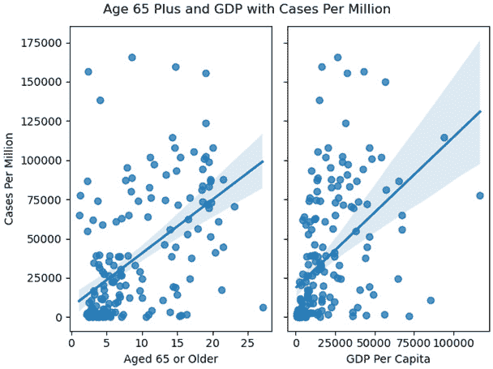

图 2.4 – 65 岁及以上人口和人均 GDP 与每百万总病例数

这些散点图显示，一些每百万病例数非常高的国家，其数值接近我们根据人口年龄或 GDP 预期的数值。这些是极端值，但并不一定是我们定义的异常值。

使用散点图可以展示两个特征与目标之间的关系，所有这些都在一个图形中。让我们回到上一章中我们处理过的陆地温度数据，来探讨这一点。

数据注意

陆地温度数据集包含了 2019 年从全球超过 12,000 个气象站读取的平均温度（以摄氏度为单位），尽管大多数站点位于美国。该数据集是从全球历史气候学网络综合数据库中检索的。它已由美国国家海洋和大气管理局在[`www.ncdc.noaa.gov/data-access/land-based-station-data/land-based-datasets/global-historical-climatology-network-monthly-version-4`](https://www.ncdc.noaa.gov/data-access/land-based-station-data/land-based-datasets/global-historical-climatology-network-monthly-version-4)上提供给公众使用。

1.  我们预计气象站的平均温度会受到纬度和海拔的影响。假设我们之前的分析表明，海拔对温度的影响直到大约 1,000 米才开始显著。我们可以将`landtemps`数据框分为低海拔和高海拔站，以 1,000 米为阈值。在下面的代码中，我们可以看到这给我们带来了 9,538 个低海拔站，平均温度为 12.16 摄氏度，以及 2,557 个高海拔站，平均温度为 7.58：

    ```py
    landtemps = pd.read_csv("data/landtemps2019avgs.csv")
    low, high = landtemps.loc[landtemps.elevation<=1000],
      landtemps.loc[landtemps.elevation>1000]
    low.shape[0], low.avgtemp.mean()
    (9538, 12.161417937651676)
    high.shape[0], high.avgtemp.mean()
    (2557, 7.58321486951755)
    ```

1.  现在，我们可以在一个散点图中可视化海拔和纬度与温度之间的关系：

    ```py
    plt.scatter(x="latabs", y="avgtemp", c="blue",
      data=low)
    plt.scatter(x="latabs", y="avgtemp", c="red", 
      data=high)
    plt.legend(('low elevation', 'high elevation'))
    plt.xlabel("Latitude (N or S)")
    plt.ylabel("Average Temperature (Celsius)")
    plt.title("Latitude and Average Temperature in 2019")
    plt.show()
    ```

这产生了以下散点图：

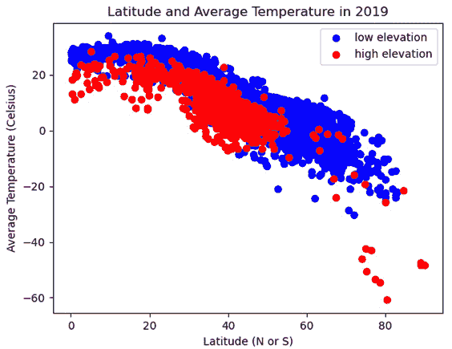

图 2.5 – 2019 年纬度和平均温度

在这里，我们可以看到随着赤道距离（以纬度衡量）的增加，温度逐渐降低。我们还可以看到高海拔气象站（那些带有红色圆点的）通常位于低海拔站下方——也就是说，在相似的纬度上，它们的温度较低。

1.  似乎高海拔和低海拔站点之间的斜率也有至少一些差异。随着纬度的增加，高海拔站点的温度似乎下降得更快。我们可以在散点图上绘制两条回归线——一条用于高海拔站点，一条用于低海拔站点——以获得更清晰的图像。为了简化代码，让我们为低海拔和高海拔站点创建一个分类特征，`elevation_group`：

    ```py
    landtemps['elevation_group'] = 
      np.where(landtemps.elevation<=1000,'low','high')
    sns.lmplot(x="latabs", y="avgtemp", 
      hue="elevation_group", palette=dict(low="blue", 
      high="red"), legend_out=False, data=landtemps)
    plt.xlabel("Latitude (N or S)")
    plt.ylabel("Average Temperature")
    plt.legend(('low elevation', 'high elevation'), 
      loc='lower left')
    plt.yticks(np.arange(-60, 40, step=20))
    plt.title("Latitude and Average Temperature in 2019")
    plt.tight_layout()
    plt.show()
    ```

这产生了以下图形：

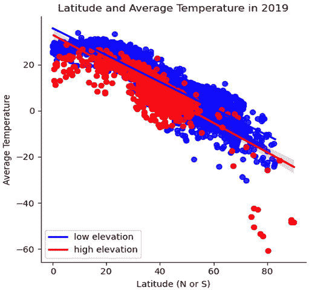

图 2.6 – 2019 年纬度和平均温度及回归线

在这里，我们可以看到高海拔站点的更陡峭的负斜率。

1.  如果我们想看到一个包含两个连续特征和一个连续目标的散点图，而不是像上一个例子中那样将一个特征强制二分，我们可以利用 Matplotlib 的 3D 功能：

    ```py
    fig = plt.figure()
    plt.suptitle("Latitude, Temperature, and Elevation in 
      2019")
    ax = plt.axes(projection='3d')
    ax.set_xlabel("Elevation")
    ax.set_ylabel("Latitude")
    ax.set_zlabel("Avg Temp")
    ax.scatter3D(landtemps.elevation, landtemps.latabs, 
      landtemps.avgtemp)
    plt.show()
    ```

这产生了以下三维散点图：

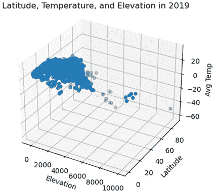

图 2.7 – 2019 年的纬度、温度和海拔

散点图是揭示连续特征之间关系的首选可视化工具。我们比仅通过相关系数更能感受到这些关系。然而，如果我们正在检查连续特征和分类特征之间的关系，我们需要一个非常不同的可视化。分组箱线图在这种情况下非常有用。在下一节中，我们将学习如何使用 Matplotlib 创建分组箱线图。

# 使用分组箱线图查看连续和分类特征之间的双变量关系

分组箱线图是一种被低估的视觉化工具。当我们检查连续和分类特征之间的关系时，它们非常有帮助，因为它们显示了连续特征的分布如何因分类特征的不同值而变化。

我们可以通过回到上一章中我们使用过的**国家纵向调查**（**NLS**）数据来探索这一点。NLS 对每位调查受访者有一个观测值，但收集有关教育和就业的年度数据（每年数据被捕获在不同的列中）。

数据备注

如*第一章*中所述，*检查特征和目标分布*，青年国家纵向调查由美国劳工统计局进行。可以从相应的存储库下载 SPSS、Stata 和 SAS 的单独文件。NLS 数据可以从[`www.nlsinfo.org/investigator/pages/search`](https://www.nlsinfo.org/investigator/pages/search)下载。

按照以下步骤创建分组箱线图：

1.  在 NLS DataFrame 的许多列中，有`highestdegree`和`weeksworked17`，分别代表受访者获得的最高学位和 2017 年该人工作的周数。让我们看看获得不同学位的人的工作周数的分布。首先，我们必须定义一个函数`gettots`来获取我们想要的描述性统计。然后，我们必须使用`apply`将一个`groupby`系列对象`groupby(['highestdegree'])['weeksworked17']`传递给该函数：

    ```py
    nls97 = pd.read_csv("data/nls97.csv")
    nls97.set_index("personid", inplace=True)
    def gettots(x):
      out = {}
      out['min'] = x.min()
      out['qr1'] = x.quantile(0.25)
      out['med'] = x.median()
      out['qr3'] = x.quantile(0.75)
      out['max'] = x.max()
      out['count'] = x.count()
      return pd.Series(out)
    nls97.groupby(['highestdegree'])['weeksworked17'].\
      apply(gettots).unstack()
                       min   qr1   med   qr3   max   count
    highestdegree                                  
    0\. None              0     0    40    52    52     510
    1\. GED               0     8    47    52    52     848
    2\. High School       0    31    49    52    52   2,665
    3\. Associates        0    42    49    52    52     593
    4\. Bachelors         0    45    50    52    52   1,342
    5\. Masters           0    46    50    52    52     538
    6\. PhD               0    46    50    52    52      51
    7\. Professional      0    47    50    52    52      97
    ```

在这里，我们可以看到没有高中学位的人的工作周数的分布与拥有学士学位或更高学位的人的分布有多么不同。对于没有学位的人，超过 25%的人在一年中工作了 0 周。对于拥有学士学位的人，即使在第 25 百分位的人，一年中也工作了 45 周。四分位距覆盖了没有学位的个人的整个分布（0 到 52），但对于拥有学士学位的个人的分布（45 到 52）只覆盖了一小部分。

我们还应该注意`highestdegree`的类别不平衡。在硕士学位之后，计数变得相当小，而高中学位的计数几乎是下一个最大组的两倍。在我们使用这些数据进行任何建模之前，我们可能需要合并一些类别。

1.  分组箱线图使分布差异更加明显。让我们用相同的数据创建一些。我们将使用 Seaborn 来绘制此图：

    ```py
    import seaborn as sns
    myplt = sns.boxplot(x='highestdegree', 
      y= 'weeksworked17' , data=nls97,
      order=sorted(nls97.highestdegree.dropna().unique()))
    myplt.set_title("Boxplots of Weeks Worked by Highest 
      Degree")
    myplt.set_xlabel('Highest Degree Attained')
    myplt.set_ylabel('Weeks Worked 2017')
    myplt.set_xticklabels(myplt.get_xticklabels(),
      rotation=60, horizontalalignment='right')
    plt.tight_layout()
    plt.show()
    ```

这产生了以下图表：

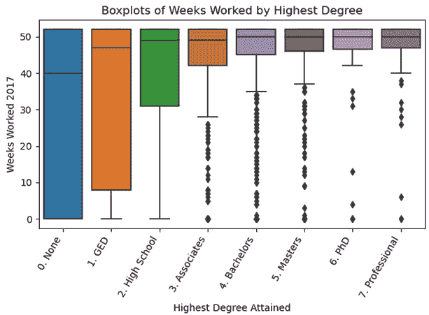

图 2.8 – 按最高学位划分的每周工作箱线图

分组箱线图说明了按学位获得的每周工作时间之间的四分位距的显著差异。在副学士学位水平（美国两年制学院学位）或以上，有低于须股的值，用点表示。在副学士学位以下，箱线图没有识别出任何异常值或极端值。例如，对于没有学位的人来说，0 周工作值不是极端值，但对于拥有副学士学位或更高学位的人来说，则是。

1.  我们还可以使用分组箱线图来展示 COVID-19 病例的分布如何因地区而异。让我们也添加一个 swarmplot 来查看数据点，因为它们并不多：

    ```py
    sns.boxplot(x='total_cases_mill', y='region',
      data=covidtotals)
    sns.swarmplot(y="region", x="total_cases_mill",
      data=covidtotals, size=1.5, color=".3", linewidth=0)
    plt.title("Boxplots of Total Cases Per Million by 
      Region")
    plt.xlabel("Cases Per Million")
    plt.ylabel("Region")
    plt.tight_layout()
    plt.show()
    ```

这产生了以下图表：

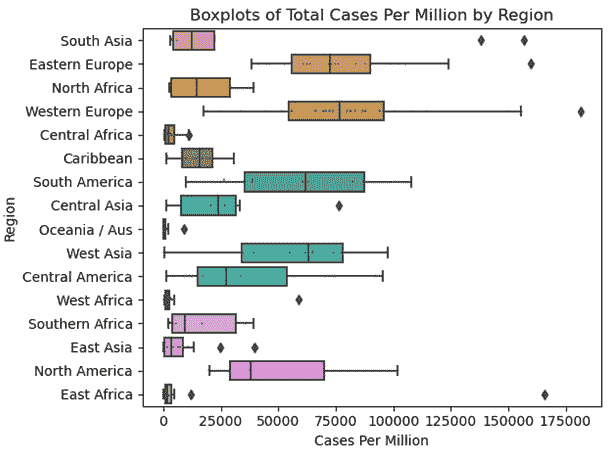

图 2.9 – 按地区划分的每百万总病例箱线图

这些分组箱线图显示了每百万个案例的中位数如何因地区而异，从东非和东亚的低端到东欧和西欧的高端。东亚的极端高值低于西欧的第一四分位数。鉴于大多数地区的计数（国家数量）相当小，我们可能应该避免从那以后得出太多结论。

到目前为止，在本章中，我们主要关注特征之间的双变量关系，以及特征与目标之间的那些关系。我们生成的统计和可视化将指导我们将要进行的建模。我们已经开始对可能的特征、它们对目标的影响以及某些特征的分布如何随着另一个特征的值而变化有所了解。

我们将在本章剩余部分探索多元关系。在我们开始建模之前，我们希望对多个特征如何一起移动有所了解。一旦包含其他特征，某些特征是否不再重要？哪些观测值对我们的参数估计的影响大于其他观测值，这对模型拟合有什么影响？同样，哪些观测值与其他观测值不同，因为它们要么具有无效值，要么似乎在捕捉与其他观测值完全不同的现象？我们将在接下来的三个部分中开始回答这些问题。尽管我们不会在构建模型之前得到任何明确的答案，但我们可以通过预测来开始做出困难的建模决策。

# 使用线性回归来识别具有显著影响的数据点

发现一些观测值对我们的模型、参数估计和预测有出奇高的影响力并不罕见。这可能是或可能不是所希望的。如果这些观测值反映了与数据中的其他部分不同的社会或自然过程，那么具有显著影响力的观测值可能是有害的。例如，假设我们有一个关于飞行动物的飞行距离的数据集，这些动物几乎都是鸟类，除了关于帝王蝶的数据。如果我们使用翅膀结构作为预测迁移距离的因素，那么帝王蝶的数据可能应该被移除。

我们应该回到第一部分中提到的极端值和异常值之间的区别。我们提到，异常值可以被视为具有特征值或特征值之间关系异常的观测值，这些关系在数据中的其他部分无法解释。另一方面，极端值可能反映了特征中的自然且可解释的趋势，或者在整个数据中观察到的特征之间的相同关系。

在具有高影响力的观测值中区分异常值和极端值最为重要。回归分析中影响的一个标准度量是**库克距离**（**Cook's D**）。这给出了如果从数据中删除一个观测值，我们的预测将如何变化的度量。

让我们在本节中构建一个相对简单的多元回归模型，使用我们一直在使用的 COVID-19 数据，并为每个观测值生成一个 Cook's D 值：

1.  让我们加载 COVID-19 数据和 Matplotlib 以及 statsmodels 库：

    ```py
    import pandas as pd
    import matplotlib.pyplot as plt
    import statsmodels.api as sm
    covidtotals = pd.read_csv("data/covidtotals.csv")
    covidtotals.set_index("iso_code", inplace=True)
    ```

1.  现在，让我们来看看每百万人口中的总病例分布以及一些可能的预测因素：

    ```py
    xvars = ['population_density','aged_65_older',
      'gdp_per_capita','diabetes_prevalence']
    covidtotals[['total_cases_mill'] + xvars].\
      quantile(np.arange(0.0,1.05,0.25)) 
      total_cases_mill  population_density  aged_65_older\
    0.00             8.52                0.14         1.14
    0.25         2,499.75               36.52         3.50 
    0.50        19,525.73               87.25         6.22
    0.75        64,834.62              213.54        13.92
    1.00       181,466.38           20,546.77        27.05
             gdp_per_capita  diabetes_prevalence  
    0.00             661.24                 0.99  
    0.25           3,823.19                 5.34  
    0.50          12,236.71                 7.20  
    0.75          27,216.44                10.61  
    1.00         116,935.60                30.53
    ```

1.  接下来，让我们定义一个函数`getlm`，该函数使用 statsmodels 运行线性回归模型并生成影响统计量，包括 Cook's D。此函数接受一个 DataFrame，目标列的名称，以及特征列的名称（通常将目标称为*y*，将特征称为*X*）。

我们将使用`dropna`函数删除任何特征值缺失的观测值。该函数返回估计的系数（包括`pvalues`），每个观测值的影响度量，以及完整的回归结果（`lm`）：

```py
def getlm(df, ycolname, xcolnames):
  df = df[[ycolname] + xcolnames].dropna()
  y = df[ycolname]
  X = df[xcolnames]
  X = sm.add_constant(X)
  lm = sm.OLS(y, X).fit()
  influence = lm.get_influence().summary_frame()
  coefficients = pd.DataFrame(zip(['constant'] + 
    xcolnames, lm.params, lm.pvalues),
    columns=['features','params','pvalues'])
  return coefficients, influence, lm 
```

1.  现在，我们可以调用`getlm`函数，同时指定每百万人口中的总病例数作为目标，人口密度（每平方英里的人数），65 岁及以上的人口百分比，人均 GDP 和糖尿病患病率作为预测因素。然后，我们可以打印参数估计值。通常，我们希望查看模型的完整摘要，这可以通过`lm.summary()`生成。这里我们将跳过这一步，以便于理解：

    ```py
    coefficients, influence, lm = getlm(covidtotals,
      'total_cases_mill', xvars)
    coefficients
    features                        params       pvalues
    0  constant                 -1,076.471         0.870
    1  population_density           -6.906         0.030
    2  aged_65_older             2,713.918         0.000
    3  gdp_per_capita                0.532         0.001
    4  diabetes_prevalence         736.809         0.241
    ```

人口密度、65 岁及以上人口和 GDP 的系数在 95%的水平上都是显著的（p 值小于 0.05）。人口密度的结果很有趣，因为我们的双变量分析没有揭示人口密度与每百万病例数之间的关系。系数表明，每平方英里人口增加 1 人，每百万病例数减少 6.9 点。更广泛地说，一旦我们控制了 65 岁或以上人口的比例和人均 GDP，人口密度更高的国家每百万人口病例数会更少。这可能是一个偶然的关系，也可能是一个只能通过多元分析检测到的关系。（也可能是因为人口密度与一个对每百万病例数有更大影响的特征高度相关，但这个特征被遗漏在模型之外。这将给我们一个关于人口密度的有偏系数估计。）

1.  我们可以使用我们在调用`getlm`时创建的影响 DataFrame 来更仔细地查看那些 Cook's D 值高的观测值。定义高 Cook's D 的一种方法是用所有观测值的 Cook's D 平均值的三倍。让我们创建一个包含所有高于该阈值的值的`covidtotalsoutliers` DataFrame。

有 13 个国家的 Cook's D 值超过了阈值。让我们按 Cook's D 值降序打印出前五个国家。巴林和马尔代夫在病例分布的前四分之一（参见本节之前我们打印的描述性统计）中。它们的人口密度也较高，65 岁或以上的人口比例较低。在其他条件相同的情况下，根据我们的模型关于人口密度与病例之间关系的说法，我们预计这两个国家的每百万病例数会较低。然而，巴林的人均 GDP 非常高，我们的模型告诉我们这与病例数的高发有关。

新加坡和香港的人口密度极高，每百万病例数低于平均水平，尤其是香港。这两个地方单独可能就解释了人口密度系数的方向。它们的人均 GDP 也非常高，这可能会对该系数产生拖累。可能只是我们的模型不应该包括城邦这样的地区：

```py
influencethreshold = 3*influence.cooks_d.mean()
covidtotals = covidtotals.join(influence[['cooks_d']])
covidtotalsoutliers = \
  covidtotals.loc[covidtotals.cooks_d >
  influencethreshold]
covidtotalsoutliers.shape
(13, 17)
covidtotalsoutliers[['location','total_cases_mill', 
  'cooks_d'] + xvars].sort_values(['cooks_d'],
  ascending=False).head()
     location  total_cases_mill   cooks_d    population_density\
iso_code               
BHR  Bahrain        156,793.409     0.230    1,935.907
SGP  Singapore       10,709.116     0.200    7,915.731
HKG  Hong Kong        1,593.307     0.181    7,039.714
JPN  Japan            6,420.871     0.095    347.778
MDV  Maldives       138,239.027     0.069    1,454.433
         aged_65_older  gdp_per_capita  diabetes_prevalence  
iso_code                                                      
BHR              2.372      43,290.705          16.520
SGP             12.922      85,535.383          10.990
HKG             16.303      56,054.920           8.330
JPN             27.049      39,002.223           5.720
MDV              4.120      15,183.616           9.190
```

1.  那么，让我们看看如果我们移除香港和新加坡，我们的回归模型估计会有什么变化：

    ```py
    coefficients, influence, lm2 = \
      getlm(covidtotals.drop(['HKG','SGP']),
      'total_cases_mill', xvars)
    coefficients
       features                  params     pvalues
    0  constant              -2,864.219       0.653
    1  population_density        26.989       0.005
    2  aged_65_older          2,669.281       0.000
    3  gdp_per_capita             0.553       0.000
    4  diabetes_prevalence      319.262       0.605
    ```

模型中的重大变化是人口密度系数现在已改变方向。这表明人口密度估计对异常观测值的敏感性，这些观测值的特征和目标值可能无法推广到其他数据。在这种情况下，这可能适用于像香港和新加坡这样的城邦。

使用线性回归生成影响度量是一种非常有用的技术，并且它有一个优点，那就是它相对容易解释，正如我们所看到的。然而，它确实有一个重要的缺点：它假设特征之间存在线性关系，并且特征是正态分布的。这通常并不成立。我们还需要足够理解数据中的关系，以创建*标签*，将每百万总病例数识别为目标。这也不总是可能的。在接下来的两个部分中，我们将探讨不做出这些假设的异常值检测机器学习算法。

# 使用 K 近邻算法寻找异常值

当我们拥有未标记数据时，机器学习工具可以帮助我们识别与其他观测值不同的观测值——也就是说，当没有目标或因变量时。即使选择目标和特征相对简单，也可能有助于在不假设特征之间的关系或特征分布的情况下识别异常值。

尽管我们通常使用**K 近邻算法**（**KNN**）来处理标记数据，用于分类或回归问题，我们也可以用它来识别异常观测值。这些观测值的特点是它们的价值与最近邻的价值之间差异最大。KNN 是一个非常受欢迎的算法，因为它直观、对数据的结构假设很少，并且相当灵活。KNN 的主要缺点是它不如许多其他方法高效，尤其是像线性回归这样的参数技术。我们将在*第九章*，*K 近邻、决策树、随机森林和梯度提升回归*，以及*第十二章*，*K 近邻在分类中的应用*中更详细地讨论这些优点。

我们将使用**PyOD**，即**Python 异常值检测**，来识别 COVID-19 数据中与其他国家显著不同的国家。PyOD 可以使用多种算法来识别异常值，包括 KNN。让我们开始吧：

1.  首先，我们需要从 PyOD 库中导入 KNN 模块，以及从`sklearn`的预处理实用函数中导入`StandardScaler`。我们还加载了 COVID-19 数据：

    ```py
    import pandas as pd
    from pyod.models.knn import KNN
    from sklearn.preprocessing import StandardScaler
    covidtotals = pd.read_csv("data/covidtotals.csv")
    covidtotals.set_index("iso_code", inplace=True)
    ```

接下来，我们需要标准化数据，这在我们的特征范围差异很大时很重要，例如从每百万总病例数和人均 GDP 超过 100,000 到糖尿病患病率和 65 岁及以上人口数不到 20。我们可以使用 scikit-learn 的标准缩放器，它将每个特征值转换为 z 分数，如下所示：

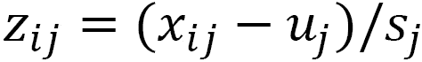

这里，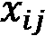是第 j 个特征的第 i 个观测值的值，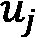是特征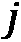的均值，而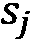是该特征的标准差。

1.  我们可以使用缩放器仅针对我们将在模型中包含的特征，然后删除一个或多个特征缺失值的所有观测值：

    ```py
    standardizer = StandardScaler()
    analysisvars =['location', 'total_cases_mill', 
      'total_deaths_mill','population_density',
      'diabetes_prevalence', 'aged_65_older', 
      'gdp_per_capita']
    covidanalysis = 
      covidtotals.loc[:,analysisvars].dropna()
    covidanalysisstand = 
      standardizer.fit_transform(covidanalysis.iloc[:,1:])
    ```

1.  现在，我们可以运行模型并生成预测和异常分数。首先，我们必须将`contamination`设置为`0.1`，以表示我们希望 10%的观测值被识别为异常值。这相当随意，但不是一个坏的开始。在用`fit`方法运行 KNN 算法后，我们得到预测（异常值为 1，内点值为 0）和异常分数，这是预测的基础（在这种情况下，异常分数最高的前 10%将被预测为 1）：

    ```py
    clf_name = 'KNN'
    clf = KNN(contamination=0.1)
    clf.fit(covidanalysisstand)
    y_pred = clf.labels_
    y_scores = clf.decision_scores_
    ```

1.  我们可以将预测和异常分数的两个 NumPy 数组（分别命名为`y_pred`和`y_scores`）合并，并将它们转换为 DataFrame 的列。这使得查看异常分数的范围及其相关的预测变得更容易。有 18 个国家被识别为异常值（这是将`contamination`设置为`0.1`的结果）。异常值的异常分数在 1.77 到 9.34 之间，而内点值的分数在 0.11 到 1.74 之间：

    ```py
    pred = pd.DataFrame(zip(y_pred, y_scores), 
      columns=['outlier','scores'], 
      index=covidanalysis.index)
    pred.outlier.value_counts()
    0    156
    1     18
    pred.groupby(['outlier'])[['scores']].\
      agg(['min','median','max'])
                   scores            
               min      median    max
    outlier                   
    0         0.11        0.84   1.74
    1         1.77        2.48   9.34
    ```

1.  让我们更仔细地看看异常分数最高的国家：

    ```py
    covidanalysis = covidanalysis.join(pred).\
      loc[:,analysisvars + ['scores']].\
      sort_values(['scores'], ascending=False)
    covidanalysis.head(10)
          location           total_cases_mill   total_deaths_mill\
    iso_code                                                     …  
    SGP   Singapore                 10,709.12         6.15
    HKG   Hong Kong                  1,593.31        28.28
    PER   Peru                      62,830.48     5,876.01
    QAT   Qatar                     77,373.61       206.87
    BHR   Bahrain                  156,793.41       803.37
    LUX   Luxembourg               114,617.81     1,308.36
    BRN   Brunei                       608.02         6.86
    KWT   Kuwait                    86,458.62       482.14
    MDV   Maldives                 138,239.03       394.05
    ARE   United Arab Emirates      65,125.17       186.75
              aged_65_older    gdp_per_capita    scores
    iso_code                                         
    SGP               12.92         85,535.38      9.34
    HKG               16.30         56,054.92      8.03
    PER                7.15         12,236.71      4.37
    QAT                1.31        116,935.60      4.23
    BHR                2.37         43,290.71      3.51
    LUX               14.31         94,277.96      2.73
    BRN                4.59         71,809.25      2.60
    KWT                2.35         65,530.54      2.52
    MDV                4.12         15,183.62      2.51
    ARE                1.14         67,293.48      2.45
    ```

在上一节中我们确定的具有高影响力的几个地点，包括新加坡、香港、巴林和马尔代夫，它们的异常分数都很高。这进一步证明我们需要对这些国家的数据进行更仔细的审查。可能存在无效数据，或者有理论上的原因导致它们与其他数据差异很大。

与上一节中的线性模型不同，这里没有定义的目标。在这种情况下，我们包括每百万总病例数和每百万总死亡数。秘鲁在这里被识别为异常值，尽管在线性模型中并不是。这部分是因为秘鲁每百万死亡人数非常高，是数据集中的最高值（我们没有在线性回归模型中使用每百万死亡人数）。

1.  注意到日本并不在这个异常值列表中。让我们看看它的异常分数：

    ```py
    covidanalysis.loc['JPN','scores']
    2.03
    ```

异常分数是数据集中第 15 高的。与上一节中日本第 4 高的 Cook's D 分数进行比较。

将这些结果与我们可以用 Isolation Forest 进行的类似分析进行比较是很有趣的。我们将在下一节中这样做。

注意

这只是一个简化的例子，展示了我们通常在机器学习项目中采取的方法。这里最重要的遗漏是我们对整个数据集进行分析。正如我们将在*第四章*“编码、转换和特征缩放”的开始部分讨论的那样，我们希望在早期就将数据分成训练集和测试集。我们将在本书的剩余章节中学习如何在机器学习管道中集成异常值检测。

# 使用 Isolation Forest 寻找异常值

**隔离森林**是一种相对较新的机器学习技术，用于识别异常值。它迅速变得流行，部分原因在于其算法被优化以寻找异常值，而不是正常值。它通过连续划分数据来找到异常值，直到数据点被孤立。需要较少划分才能孤立的数据点会获得更高的异常分数。这个过程在系统资源上表现得相当容易。在本节中，我们将学习如何使用它来检测异常的 COVID-19 病例和死亡。

1.  我们可以使用与上一节类似的分析方法，用隔离森林（Isolation Forest）而不是 KNN。让我们首先加载 scikit-learn 的`StandardScaler`和`IsolationForest`模块，以及 COVID-19 数据：

    ```py
    import pandas as pd
    import matplotlib.pyplot as plt
    from sklearn.preprocessing import StandardScaler
    from sklearn.ensemble import IsolationForest
    covidtotals = pd.read_csv("data/covidtotals.csv")
    covidtotals.set_index("iso_code", inplace=True)
    ```

1.  接下来，我们必须标准化数据：

    ```py
    analysisvars = ['location','total_cases_mill','total_deaths_mill',
      'population_density','aged_65_older','gdp_per_capita']
    standardizer = StandardScaler()
    covidanalysis = covidtotals.loc[:, analysisvars].dropna()
    covidanalysisstand =
      standardizer.fit_transform(covidanalysis.iloc[:, 1:])
    ```

1.  现在，我们已经准备好运行我们的异常检测模型。`n_estimators`参数表示要构建多少棵树。将`max_features`设置为`1.0`将使用我们所有的特征。`predict`方法为我们提供异常预测，对于异常值为`-1`。这是基于异常分数，我们可以通过`decision_function`获取：

    ```py
    clf=IsolationForest(n_estimators=50, 
      max_samples='auto', contamination=.1, 
      max_features=1.0)
    clf.fit(covidanalysisstand)
    covidanalysis['anomaly'] = 
      clf.predict(covidanalysisstand)
    covidanalysis['scores'] = 
      clf.decision_function(covidanalysisstand)
    covidanalysis.anomaly.value_counts()
     1    156
    -1     18
    Name: anomaly, dtype: int64
    ```

    ```py
    inlier, outlier = 
      covidanalysis.loc[covidanalysis.anomaly==1],\
      covidanalysis.loc[covidanalysis.anomaly==-1]
    outlier[['location','total_cases_mill',
      'total_deaths_mill',
      'scores']].sort_values(['scores']).head(10)
         location   total_cases_mill  total_deaths_mill   scores
    iso_code                                              
    SGP  Singapore      10,709.12          6.15     -0.20
    HKG  Hong Kong       1,593.31         28.28     -0.16
    BHR  Bahrain       156,793.41        803.37     -0.14
    QAT  Qatar          77,373.61        206.87     -0.13
    PER  Peru           62,830.48      5,876.01     -0.12
    LUX  Luxembourg    114,617.81      1,308.36     -0.09
    JPN  Japan           6,420.87        117.40     -0.08
    MDV  Maldives      138,239.03        394.05     -0.07
    CZE  Czechia       155,782.97      2,830.43     -0.06
    MNE  Montenegro    159,844.09      2,577.77     -0.03
    ```

1.  查看异常值和内属值的可视化很有帮助：

    ```py
    fig = plt.figure()
    ax = plt.axes(projection='3d')
    ax.set_title('Isolation Forest Anomaly Detection')
    ax.set_zlabel("Cases Per Million (thous.)")
    ax.set_xlabel("GDP Per Capita (thous.)")
    ax.set_ylabel("Aged 65 Plus %")
    ax.scatter3D(inlier.gdp_per_capita/1000,
      inlier.aged_65_older, inlier.total_cases_mill/1000, 
      label="inliers", c="blue")
    ax.scatter3D(outlier.gdp_per_capita/1000,
      outlier.aged_65_older, 
      outlier.total_cases_mill/1000, label="outliers", 
      c="red")
    ax.legend()
    plt.show()
    ```

这会产生以下图表：

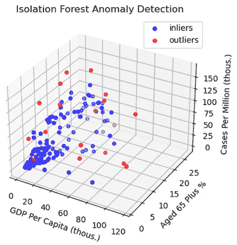

图 2.10 – 隔离森林异常检测 – 人均 GDP 和每百万人口病例数

尽管我们只能通过这种可视化看到三个维度，但图表确实展示了使异常值成为异常值的一些原因。我们预计随着人均 GDP 和 65 岁及以上人口比例的增加，案例数量也会增加。我们可以看到，异常值偏离了预期的模式，其每百万人口病例数明显高于或低于具有相似 GDP 和 65 岁及以上人口值的其他国家。

# 摘要

在本章中，我们使用了双变量和多变量统计技术和可视化方法，以更好地理解特征之间的双变量关系。我们研究了常见的统计量，例如皮尔逊相关系数。我们还通过可视化来考察双变量关系，当两个特征都是连续变量时使用散点图，当一个特征是分类变量时使用分组箱线图。本章的最后三节探讨了用于考察关系和识别异常值的多变量技术，包括 KNN 和隔离森林等机器学习算法。

现在我们已经对数据的分布有了很好的了解，我们准备开始构建我们的特征，包括填充缺失值和编码、转换以及缩放我们的变量。这将是下一章的重点。
