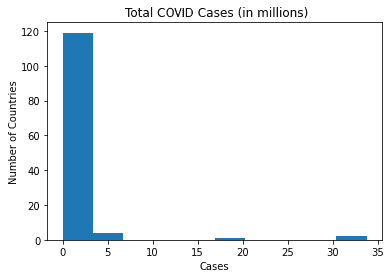
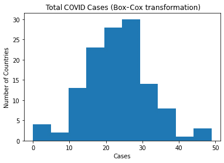

# 第四章：*第四章*：编码、转换和缩放特征

本书的前三章重点介绍了数据清洗、探索以及如何识别缺失值和异常值。接下来的几章将深入探讨特征工程，本章将从编码、转换和缩放数据以提高机器学习模型性能的技术开始。

通常，机器学习算法需要以某种形式对变量进行编码。此外，我们的模型在缩放后通常表现更好，这样具有更高变异性的特征就不会压倒优化过程。我们将向您展示如何在使用特征范围差异很大的情况下使用不同的缩放技术。

具体来说，在本章中，我们将探讨以下主要主题：

+   创建训练数据集并避免数据泄露

+   识别要删除的不相关或冗余观察结果

+   编码分类特征

+   使用中等或高基数编码特征

+   转换特征

+   分箱特征

+   特征缩放

# 技术要求

在本章中，我们将与`feature-engine`和`category_encoders`包以及`sklearn`库进行大量工作。您可以使用`pip`安装这些包，命令为`pip install feature-engine`，`pip install category_encoders`，以及`pip install scikit-learn`。本章中的代码使用了`sklearn`的 0.24.2 版本，`feature-engine`的 1.1.2 版本，以及`category_encoders`的 2.2.2 版本。请注意，无论是`pip install feature-engine`还是`pip install feature_engine`都可以工作。

本章的所有代码都可以在 GitHub 上找到，链接为[`github.com/PacktPublishing/Data-Cleaning-and-Exploration-with-Machine-Learning/tree/main/4.%20PruningEncodingandRescalingFeatures`](https://github.com/PacktPublishing/Data-Cleaning-and-Exploration-with-Machine-Learning/tree/main/4.%20PruningEncodingandRescalingFeatures)。

# 创建训练数据集并避免数据泄露

我们模型性能的最大威胁之一是数据泄露。**数据泄露**发生在我们的模型被训练数据集中没有的数据所告知的情况下。有时，我们无意中用无法仅从训练数据中获取的信息帮助我们的模型训练，最终导致我们对模型准确性的评估过于乐观。

数据科学家并不真的希望这种情况发生，因此有了“泄露”这个术语。这不是一种“不要这样做”的讨论。我们都知道不要这样做。这更像是一种“我应该采取哪些步骤来避免这个问题？”的讨论。实际上，除非我们制定预防措施，否则很容易出现数据泄露。

例如，如果我们有一个特征的缺失值，我们可能会使用整个数据集的平均值来插补这些值。然而，为了验证我们的模型，我们随后将数据分为训练和测试数据集。这样我们就会意外地将来自完整数据集（即全局平均值）的信息引入到训练数据集中。

数据科学家为了避免这种情况采取的一种做法是在分析开始尽可能早地建立单独的训练和测试数据集。在交叉验证等验证技术中，这可能会变得稍微复杂一些，但在接下来的章节中，我们将介绍如何在各种情况下避免数据泄露。

我们可以使用 scikit-learn 为**国家纵向青年调查**数据创建训练和测试 DataFrame。

注意

**国家纵向青年调查**（**NLS**）由美国劳工统计局进行。这项调查始于 1997 年，调查对象为 1980 年至 1985 年间出生的一批人，每年进行一次年度跟踪调查，直至 2017 年。在本节中，我从调查中的数百个数据项中提取了 89 个关于成绩、就业、收入和对政府态度的变量。可以从存储库下载 SPSS、Stata 和 SAS 的单独文件。NLS 数据可以从[`www.nlsinfo.org/investigator/pages/search`](https://www.nlsinfo.org/investigator/pages/search)下载供公众使用。

让我们开始创建 DataFrame：

1.  首先，我们从`sklearn`导入`train_test_split`模块并加载 NLS 数据：

    ```py
    import pandas as pd
    from sklearn.model_selection import train_test_split
    nls97 = pd.read_csv("data/nls97b.csv")
    nls97.set_index("personid", inplace=True)
    ```

1.  然后，我们可以为特征（`X_train`和`X_test`）和目标（`y_train`和`y_test`）创建训练和测试 DataFrame。在本例中，`wageincome`是目标变量。我们将`test_size`参数设置为`0.3`，以保留 30%的观测值用于测试。请注意，我们只将使用 NLS 中的**学术能力评估测试**（**SAT**）和**平均成绩点**（**GPA**）数据：

    ```py
    feature_cols = ['satverbal','satmath','gpascience',
      'gpaenglish','gpamath','gpaoverall']
    X_train, X_test, y_train, y_test =  \
      train_test_split(nls97[feature_cols],\
      nls97[['wageincome']], test_size=0.3, \
      random_state=0)
    ```

1.  让我们看看使用`train_test_split`创建的训练 DataFrame。我们得到了预期的观测数，6,288，这是 NLS DataFrame 中 8,984 个观测总数的 70%：

    ```py
    nls97.shape[0]
    8984
    X_train.info()
    <class 'pandas.core.frame.DataFrame'>
    Int64Index: 6288 entries, 574974 to 370933
    Data columns (total 6 columns):
     #   Column        Non-Null Count     Dtype
    ---  ------        --------------   -------
     0   satverbal      1001 non-null   float64
     1   satmath      1001 non-null   float64
     2   gpascience     3998 non-null   float64
     3   gpaenglish     4078 non-null   float64
     4   gpamath        4056 non-null   float64
     5   gpaoverall     4223 non-null   float64
    dtypes: float64(6)
    memory usage: 343.9 KB
    y_train.info()
    <class 'pandas.core.frame.DataFrame'>
    Int64Index: 6288 entries, 574974 to 370933
    Data columns (total 1 columns):
     #   Column        Non-Null Count    Dtype
    ---  ------        --------------  -------
     0   wageincome    3599 non-null   float64
    dtypes: float64(1)
    memory usage: 98.2 KB
    ```

1.  此外，让我们看看测试 DataFrame。我们得到了预期的 30%的观测总数：

    ```py
    X_test.info()
    <class 'pandas.core.frame.DataFrame'>
    Int64Index: 2696 entries, 363170 to 629736
    Data columns (total 6 columns):
     #   Column        Non-Null Count    Dtype
    ---  ------        --------------  -------  
     0   satverbal      405 non-null   float64
     1   satmath        406 non-null   float64
     2   gpascience    1686 non-null   float64
     3   gpaenglish    1720 non-null   float64
     4   gpamath       1710 non-null   float64
     5   gpaoverall    1781 non-null   float64
    dtypes: float64(6)
    memory usage: 147.4 KB
    y_test.info()
    <class 'pandas.core.frame.DataFrame'>
    Int64Index: 2696 entries, 363170 to 629736
    Data columns (total 1 columns):
     #   Column          Non-Null Count    Dtype
    ---  ------          --------------  -------  
     0   wageincome      1492 non-null   float64
    dtypes: float64(1)
    memory usage: 42.1 KB
    ```

我们将在本章的其余部分使用 scikit-learn 的`test_train_split`来创建单独的训练和测试 DataFrame。我们将在*第六章* *准备模型评估*中介绍构建验证测试数据集的更复杂策略。

接下来，我们开始我们的特征工程工作，通过移除明显无用的特征。这是因为它们与另一个特征具有相同的数据，或者响应中没有变化。

# 移除冗余或无用的特征

在数据清洗和处理的过程中，我们经常会得到不再有意义的数据。也许我们根据单个特征值对数据进行子集划分，尽管现在所有观测值都具有相同的值，我们仍然保留了该特征。或者，对于我们所使用的数据子集，两个特征具有相同的值。理想情况下，我们在数据清洗过程中捕捉到这些冗余。然而，如果我们在这个过程中没有捕捉到它们，我们可以使用开源的`feature-engine`包来帮助我们。

此外，可能存在高度相关的特征，我们几乎不可能构建一个能够有效使用所有这些特征的模型。`feature-engine`有一个名为`DropCorrelatedFeatures`的方法，它使得在特征高度相关时移除特征变得容易。

在本节中，我们将处理陆地温度数据，以及 NLS 数据。请注意，我们在这里只加载波兰的温度数据。

数据备注

陆地温度数据集包含了 2019 年来自全球超过 12,000 个站点的平均温度读数（以摄氏度为单位），尽管大多数站点位于美国。原始数据是从全球历史气候学网络集成数据库中检索的。它已经由美国国家海洋和大气管理局在[`www.ncdc.noaa.gov/data-access/land-based-station-data/land-based-datasets/global-historical-climatology-network-monthly-version-4`](https://www.ncdc.noaa.gov/data-access/land-based-station-data/land-based-datasets/global-historical-climatology-network-monthly-version-4)上提供给公众使用。

让我们开始移除冗余和无用的特征：

1.  让我们从`feature_engine`和`sklearn`模块中导入所需的模块，并加载波兰的 NLS 数据和温度数据。波兰的数据是从全球 12,000 个气象站的大数据集中提取的。我们使用`dropna`来删除任何缺失数据的观测值：

    ```py
    import pandas as pd
    import feature_engine.selection as fesel
    from sklearn.model_selection import train_test_split
    nls97 = pd.read_csv("data/nls97b.csv")
    nls97.set_index("personid", inplace=True)
    ltpoland = pd.read_csv("data/ltpoland.csv")
    ltpoland.set_index("station", inplace=True)
    ltpoland.dropna(inplace=True)
    ```

1.  接下来，我们创建训练和测试 DataFrame，就像我们在上一节中所做的那样：

    ```py
    feature_cols = ['satverbal','satmath','gpascience',
      'gpaenglish','gpamath','gpaoverall']
    X_train, X_test, y_train, y_test =  \
      train_test_split(nls97[feature_cols],\
      nls97[['wageincome']], test_size=0.3, \
      random_state=0)
    ```

1.  我们可以使用 pandas 的`corr`方法来查看这些特征之间的相关性：

    ```py
    X_train.corr()
              satverbal  satmath  gpascience  gpaenglish \
    satverbal     1.000    0.729       0.439      0.444  
    satmath       0.729    1.000       0.480      0.430
    gpascience    0.439    0.480       1.000      0.672
    gpaenglish    0.444    0.430       0.672      1.000
    gpamath       0.375    0.518       0.606      0.600
    gpaoverall    0.421    0.485       0.793      0.844
                gpamath   gpaoverall  
    satverbal     0.375        0.421  
    satmath       0.518        0.485  
    gpascience    0.606        0.793  
    gpaenglish    0.600        0.844  
    gpamath       1.000        0.750  
    gpaoverall    0.750        1.000  
    ```

在这里，`gpaoverall`与`gpascience`、`gpaenglish`和`gpamath`高度相关。`corr`方法默认返回皮尔逊相关系数。当我们假设特征之间存在线性关系时，这是可以的。然而，当这个假设没有意义时，我们应该考虑请求 Spearman 相关系数。我们可以通过将`spearman`传递给`corr`方法的参数来实现这一点。

1.  让我们删除与另一个特征相关性高于 0.75 的特征。我们将 0.75 传递给`DropCorrelatedFeatures`的`threshold`参数，表示我们想要使用皮尔逊相关系数，并且我们想要通过将变量设置为`None`来评估所有特征。我们在训练数据上使用`fit`方法，然后转换训练和测试数据。`info`方法显示，结果训练 DataFrame（`X_train_tr`）除了`gpaoverall`以外的所有特征，`gpaoverall`与`gpascience`和`gpaenglish`的相关性分别为 0.793 和 0.844（`DropCorrelatedFeatures`将从左到右进行评估，因此如果`gpamath`和`gpaoverall`高度相关，它将删除`gpaoverall`。如果`gpaoverall`在`gpamath`左侧，它将删除`gpamath`）：

    ```py
    tr = fesel.DropCorrelatedFeatures(variables=None, method='pearson', threshold=0.75)
    tr.fit(X_train)
    X_train_tr = tr.transform(X_train)
    X_test_tr = tr.transform(X_test)
    X_train_tr.info()
    <class 'pandas.core.frame.DataFrame'>
    Int64Index: 6288 entries, 574974 to 370933
    Data columns (total 5 columns):
     #   Column       Non-Null Count     Dtype
    ---  ------        --------------  -------  
     0   satverbal     1001 non-null   float64
     1   satmath       1001 non-null   float64
     2   gpascience    3998 non-null   float64
     3   gpaenglish    4078 non-null   float64
     4   gpamath       4056 non-null   float64
    dtypes: float64(5)
    memory usage: 294.8 KB
    ```

通常，我们在决定删除特征之前会更仔细地评估特征。然而，有时特征选择是管道的一部分，我们需要自动化这个过程。这可以通过`DropCorrelatedFeatures`来实现，因为所有的`feature_engine`方法都可以被纳入 scikit-learn 管道。

1.  现在，让我们从波兰的陆地温度数据中创建训练和测试 DataFrame。`year`的值对所有观测值都是相同的，`country`的值也是如此。此外，对于每个观测值，`latabs`的值与`latitude`相同：

    ```py
    feature_cols = ['year','month','latabs', 
      'latitude','elevation', 'longitude','country']
    X_train, X_test, y_train, y_test =  \
      train_test_split(ltpoland[feature_cols],\
      ltpoland[['temperature']], test_size=0.3, \
      random_state=0)
    X_train.sample(5, random_state=99)
             year  month  latabs  latitude  elevation  longitude country
    station  
    SIEDLCE   2019   11    52    52    152    22    Poland
    OKECIE    2019    6    52    52    110    21    Poland
    BALICE    2019    1    50    50    241    20    Poland
    BALICE    2019    7    50    50    241    20    Poland
    BIALYSTOK 2019   11    53    53    151    23    Poland
    X_train.year.value_counts()
    2019    84
    Name: year, dtype: int64
    X_train.country.value_counts()
    Poland    84
    Name: country, dtype: int64
    (X_train.latitude!=X_train.latabs).sum()
    0
    ```

1.  让我们删除在整个训练数据集中具有相同值的特征。注意，在转换后删除了`year`和`country`：

    ```py
    tr = fesel.DropConstantFeatures()
    tr.fit(X_train)
    X_train_tr = tr.transform(X_train)
    X_test_tr = tr.transform(X_test)
    X_train_tr.head()

             month  latabs  latitude  elevation  longitude
    station                                                 
    OKECIE       1      52        52        110         21
    LAWICA       8      52        52         94         17
    LEBA        11      55        55          2         18
    SIEDLCE     10      52        52        152         22
    BIALYSTOK   11      53        53        151         23
    ```

1.  让我们删除具有与其他特征相同值的特征。在这种情况下，转换删除了`latitude`，因为它与`latabs`具有相同的值：

    ```py
    tr = fesel.DropDuplicateFeatures()
    tr.fit(X_train_tr)
    X_train_tr = tr.transform(X_train_tr)
    X_train_tr.head()
               month   latabs   elevation   longitude
    station                                       
    OKECIE         1       52         110          21
    LAWICA         8       52          94          17
    LEBA          11       55           2          18
    SIEDLCE       10       52         152          22
    BIALYSTOK     11       53         151          23
    ```

这解决了 NLS 数据中我们的特征和波兰陆地温度数据中的一些明显问题。我们从包含其他 GPA 特征的 DataFrame 中删除了`gpaoverall`，因为它与它们高度相关。此外，我们删除了冗余数据，删除了在整个 DataFrame 中具有相同值的特征以及重复另一个特征值的特征。

本章的其余部分探讨了某些较为混乱的特征工程挑战：编码、转换、分箱和缩放。

# 对分类特征进行编码

我们可能需要在使用大多数机器学习算法之前对特征进行编码的几个原因。首先，这些算法通常需要数值数据。其次，当一个分类特征*是*用数字表示时，例如，女性为 1，男性为 2，我们需要对这些值进行编码，以便它们被识别为分类数据。第三，该特征实际上可能是有序的，具有代表某些有意义排名的离散数值。我们的模型需要捕捉这种排名。最后，一个分类特征可能具有大量值（称为高基数），我们可能希望我们的编码能够合并类别。

我们可以使用独热编码来处理具有有限值的特征，例如 15 或更少。在本节中，我们首先将介绍独热编码，然后讨论顺序编码。在下一节中，我们将探讨处理具有高基数类别特征的战略。

## 独热编码

对特征进行独热编码会为该特征的每个值创建一个二进制向量。因此，如果一个名为 *letter* 的特征有三个唯一值，*A*，*B* 和 *C*，独热编码会创建三个二进制向量来表示这些值。第一个二进制向量，我们可以称之为 *letter_A*，当 *letter* 的值为 *A* 时为 1，而当它是 *B* 或 *C* 时为 0。*letter_B* 和 *letter_C* 的编码方式类似。转换后的特征，*letter_A*，*letter_B* 和 *letter_C*，通常被称为**虚拟变量**。*图 4.1* 展示了独热编码：


图 4.1 – 类别特征的独热编码

NLS 数据中的许多特征适合进行独热编码。在下面的代码块中，我们将对其中一些特征进行编码：

1.  让我们从导入 `feature_engine` 中的 `OneHotEncoder` 模块并加载数据开始。此外，我们还从 scikit-learn 中导入 `OrdinalEncoder` 模块，因为我们稍后会使用它：

    ```py
    import pandas as pd
    from feature_engine.encoding import OneHotEncoder
    from sklearn.preprocessing import OrdinalEncoder
    from sklearn.model_selection import train_test_split
    nls97 = pd.read_csv("data/nls97b.csv")
    nls97.set_index("personid", inplace=True)
    ```

1.  接下来，我们为 NLS 数据创建训练和测试 DataFrame：

    ```py
    feature_cols =['gender','maritalstatus','colenroct99']
    nls97demo = nls97[['wageincome'] + feature_cols].dropna()
    X_demo_train, X_demo_test, y_demo_train, y_demo_test=\
      train_test_split(nls97demo[feature_cols],\
      nls97demo[['wageincome']], test_size=0.3, \
      random_state=0)
    ```

1.  我们用于编码的一个选项是 pandas 的 `get_dummies` 方法。我们可以用它来指示我们想要转换 `gender` 和 `maritalstatus` 特征。`get_dummies` 为 `gender` 和 `maritalstatus` 的每个值提供一个虚拟变量。例如，`gender` 有 `Female` 和 `Male` 的值。`get_dummies` 创建一个特征，`gender_Female`，当 `gender` 为 `Female` 时为 1，而当 `gender` 为 `Male` 时为 0。当 `gender` 为 `Male` 时，`gender_Male` 为 1 而 `gender_Female` 为 0。这是一个经过验证的方法来进行此类编码，并且多年来一直为统计学家提供了良好的服务：

    ```py
    pd.get_dummies(X_demo_train, \
      columns=['gender','maritalstatus']).head(2).T
    personid                    736081          832734
    colenroct99                 1.Not enrolled  1.Not enrolled
    gender_Female               1               0
    gender_Male                 0               1
    maritalstatus_Divorced      0               0
    maritalstatus_Married       1               0
    maritalstatus_Never-married 0               1
    maritalstatus_Separated     0               0
    maritalstatus_Widowed       0               0
    ```

我们没有保存由 `get_dummies` 创建的 DataFrame，因为在本节的后面部分，我们将使用不同的技术进行编码。

通常，我们为特征的 *k* 个唯一值创建 *k-1* 个虚拟变量。因此，如果 `gender` 在我们的数据中有两个值，我们只需要创建一个虚拟变量。如果我们知道 `gender_Female` 的值，我们也知道 `gender_Male` 的值；因此，后者变量是冗余的。同样，如果我们知道其他 `maritalstatus` 虚拟变量的值，我们也知道 `maritalstatus_Divorced` 的值。以这种方式创建冗余被不优雅地称为**虚拟变量陷阱**。为了避免这个问题，我们从每个组中删除一个虚拟变量。

注意

对于某些机器学习算法，例如线性回归，实际上需要删除一个虚拟变量。在估计线性模型的参数时，矩阵会被求逆。如果我们的模型有截距，并且所有虚拟变量都被包含在内，那么矩阵就无法求逆。

1.  我们可以将`get_dummies`的`drop_first`参数设置为`True`以从每个组中删除第一个虚拟变量：

    ```py
    pd.get_dummies(X_demo_train, \
      columns=['gender','maritalstatus'],
      drop_first=True).head(2).T
    personid                      736081          832734
    colenroct99                  1\. Not enrolled  1\. Not enrolled
    gender_Male                  0                1
    maritalstatus_Married        1                0
    maritalstatus_Never-married  0                1
    maritalstatus_Separated      0                0
    maritalstatus_Widowed        0                0
    ```

`get_dummies`的一个替代方案是`sklearn`或`feature_engine`中的 one-hot 编码器。这些 one-hot 编码器有优势，它们可以轻松地集成到机器学习流程中，并且可以将从训练数据集中收集到的信息持久化到测试数据集中。

1.  让我们使用`feature_engine`中的`OneHotEncoder`模块来进行编码。我们将`drop_last`设置为`True`以从每个组中删除一个虚拟变量。我们将编码拟合到训练数据，然后转换训练数据和测试数据：

    ```py
    ohe = OneHotEncoder(drop_last=True,
      variables=['gender','maritalstatus'])
    ohe.fit(X_demo_train)
    X_demo_train_ohe = ohe.transform(X_demo_train)
    X_demo_test_ohe = ohe.transform(X_demo_test)
    X_demo_train_ohe.filter(regex='gen|mar', axis="columns").head(2).T
    personid                     736081          832734
    gender_Female                1               0
    maritalstatus_Married        1               0
    maritalstatus_Never-married  0               1
    maritalstatus_Divorced       0               0
    maritalstatus_Separated      0               0
    ```

这表明 one-hot 编码是准备名义数据供机器学习算法使用的一种相当直接的方法。但如果我们分类特征是有序的而不是名义的，那会怎样？在这种情况下，我们需要使用有序编码。

## 有序编码

如同在*第一章*中讨论的，分类特征可以是名义的或有序的。性别和婚姻状况是名义的。它们的值不表示顺序。例如，“未婚”并不比“离婚”的值高。

然而，当一个分类特征是有序的时，我们希望编码能够捕捉到值的排序。例如，如果我们有一个具有低、中、高值的特征，one-hot 编码会丢失这个排序。相反，一个具有低、中、高分别为 1、2、3 的转换特征会更好。我们可以通过有序编码来实现这一点。

NLS 数据集中的大学入学特征可以被认为是有序特征。其值范围从*1. 未入学*到*3. 四年制大学*。我们应该使用有序编码来为建模做准备。我们将在下一步做这件事：

1.  我们可以使用`sklearn`的`OrdinalEncoder`模块来对 1999 年的大学入学特征进行编码。首先，让我们看一下编码前的`colenroct99`的值。这些值是字符串，但存在隐含的顺序：

    ```py
    X_demo_train.colenroct99.unique()
    array(['1\. Not enrolled', '2\. 2-year college ', 
           '3\. 4-year college'], dtype=object)
    X_demo_train.head()
                gender   maritalstatus   colenroct99
    personid                                           
    736081      Female   Married         1\. Not enrolled
    832734      Male     Never-married   1\. Not enrolled
    453537      Male     Married         1\. Not enrolled
    322059      Female   Divorced        1\. Not enrolled
    324323      Female   Married         2\. 2-year college
    ```

1.  我们可以通过将前面的数组传递给`categories`参数来告诉`OrdinalEncoder`模块按相同的顺序对值进行排序。然后，我们可以使用`fit_transform`来转换大学入学字段`colenroct99`。（`sklearn`的`OrdinalEncoder`模块的`fit_transform`方法返回一个 NumPy 数组，因此我们需要使用 pandas DataFrame 方法来创建一个 DataFrame。）最后，我们将编码后的特征与训练数据中的其他特征合并：

    ```py
    oe = OrdinalEncoder(categories=\
      [X_demo_train.colenroct99.unique()])
    colenr_enc = \
      pd.DataFrame(oe.fit_transform(X_demo_train[['colenroct99']]),
        columns=['colenroct99'], index=X_demo_train.index)
    X_demo_train_enc = \
      X_demo_train[['gender','maritalstatus']].\
      join(colenr_enc)
    ```

1.  让我们看看结果 DataFrame 的几个观察结果。此外，我们还应该比较原始大学入学特征计数与转换特征计数：

    ```py
    X_demo_train_enc.head()
                 gender       maritalstatus    colenroct99
    personid                                    
    736081       Female       Married          0
    832734       Male         Never-married    0
    453537       Male         Married          0
    322059       Female       Divorced         0
    324323       Female       Married          1
    X_demo_train.colenroct99.value_counts().sort_index()
    1\. Not enrolled        3050
    2\. 2-year college       142
    3\. 4-year college       350
    Name: colenroct99, dtype: int64
    X_demo_train_enc.colenroct99.value_counts().sort_index()
    0       3050
    1       142
    2       350
    Name: colenroct99, dtype: int64
    ```

序列编码将 `colenroct99` 的初始值替换为从 0 到 2 的数字。现在它以许多机器学习模型可消费的形式存在，并且我们保留了有意义的排名信息。

注意

序列编码适用于非线性模型，如决策树。在线性回归模型中可能没有意义，因为这会假设在整个分布中值之间的距离具有同等意义。在本例中，这会假设从 0 到 1 的增加（即从无入学到 2 年入学）与从 1 到 2 的增加（即从 2 年入学到 4 年入学）是同一件事。

One-hot 编码和序列编码是工程化分类特征的相对直接的方法。当有更多唯一值时，处理分类特征可能更复杂。在下一节中，我们将介绍处理这些特征的一些技术。

# 对中等或高基数的分类特征进行编码

当我们处理具有许多唯一值的分类特征时，例如 10 个或更多，为每个值创建虚拟变量可能是不切实际的。当基数高，即具有非常多的唯一值时，某些值可能观察到的样本太少，无法为我们提供很多信息。在极端情况下，对于 ID 变量，每个值只有一个观察值。

处理中等或高基数的方法有几个。一种方法是为前 *k* 个类别创建虚拟变量，并将剩余的值组合到一个 *其他* 类别中。另一种方法是使用特征哈希，也称为哈希技巧。在本节中，我们将探讨这两种策略。我们将使用 COVID-19 数据集作为示例：

1.  让我们从 COVID-19 数据中创建训练和测试 DataFrame，并导入 `feature_engine` 和 `category_encoders` 库：

    ```py
    import pandas as pd
    from feature_engine.encoding import OneHotEncoder
    from category_encoders.hashing import HashingEncoder
    from sklearn.model_selection import train_test_split
    covidtotals = pd.read_csv("data/covidtotals.csv")
    feature_cols = ['location','population',
        'aged_65_older','diabetes_prevalence','region']
    covidtotals = covidtotals[['total_cases'] + feature_cols].dropna()
    X_train, X_test, y_train, y_test =  \
      train_test_split(covidtotals[feature_cols],\
      covidtotals[['total_cases']], test_size=0.3, 
      random_state=0)
    ```

特征区域有 16 个唯一值，其中前 6 个的计数为 10 或更多：

```py
X_train.region.value_counts()
Eastern Europe  16
East Asia  12
Western Europe  12
West Africa  11
West Asia  10
East Africa  10
South America  7
South Asia  7
Central Africa  7
Southern Africa  7
Oceania / Aus  6
Caribbean  6
Central Asia  5
North Africa  4
North America  3
Central America  3
Name: region, dtype: int64
```

1.  我们可以再次使用 `feature_engine` 中的 `OneHotEncoder` 模块来编码 `region` 特征。这次，我们使用 `top_categories` 参数来指示我们只想为前六个类别值创建虚拟变量。任何不属于前六个的值都将为所有虚拟变量设置 0：

    ```py
    ohe = OneHotEncoder(top_categories=6, variables=['region'])
    covidtotals_ohe = ohe.fit_transform(covidtotals)
    covidtotals_ohe.filter(regex='location|region',
      axis="columns").sample(5, random_state=99).T
              97      173      92         187        104
    Location  Israel  Senegal  Indonesia  Sri Lanka  Kenya
    region_Eastern Europe  0      0      0      0      0
    region_Western Europe  0      0      0      0      0
    region_West Africa     0      1      0      0      0
    region_East Asia       0      0      1      0      0
    region_West Asia       1      0      0      0      0
    region_East Africa     0      0      0      0      1
    ```

当分类特征具有许多唯一值时，一种替代 one-hot 编码的方法是使用 **特征哈希**。

## 特征哈希

特征哈希将大量的唯一特征值映射到更少的虚拟变量。我们可以指定要创建的虚拟变量的数量。然而，可能出现冲突；也就是说，一些特征值可能映射到相同的虚拟变量组合。随着我们减少请求的虚拟变量数量，冲突的数量会增加。

我们可以使用 `category_encoders` 中的 `HashingEncoder` 进行特征哈希。我们使用 `n_components` 来表示我们想要六个虚拟变量（我们在变换之前复制了 `region` 特征，这样我们就可以将原始值与新的虚拟变量进行比较）：

```py
X_train['region2'] = X_train.region
```

```py
he = HashingEncoder(cols=['region'], n_components=6)
```

```py
X_train_enc = he.fit_transform(X_train)
```

```py
X_train_enc.\
```

```py
 groupby(['col_0','col_1','col_2','col_3','col_4',
```

```py
   'col_5','region2']).\
```

```py
    size().reset_index().rename(columns={0:'count'})
```

```py
  col_0 col_1 col_2 col_3 col_4 col_5 region2         count
```

```py
0   0     0     0     0     0     1   Caribbean       6
```

```py
1   0     0     0     0     0     1   Central Africa  7
```

```py
2   0     0     0     0     0     1   East Africa     10
```

```py
3   0     0     0     0     0     1   North Africa    4
```

```py
4   0     0     0     0     1     0   Central America 3
```

```py
5   0     0     0     0     1     0   Eastern Europe  16
```

```py
6   0     0     0     0     1     0   North America   3
```

```py
7   0     0     0     0     1     0   Oceania / Aus   6
```

```py
8   0     0     0     0     1     0   Southern Africa 7
```

```py
9   0     0     0     0     1     0   West Asia       10
```

```py
10  0     0     0     0     1     0   Western Europe  12
```

```py
11  0     0     0     1     0     0   Central Asia    5
```

```py
12  0     0     0     1     0     0   East Asia       12
```

```py
13  0     0     0     1     0     0   South Asia      7
```

```py
14  0     0     1     0     0     0   West Africa     11
```

```py
15  1     0     0     0     0     0   South America   7
```

不幸的是，这给我们带来了大量的冲突。例如，加勒比海、中非、东非和北非都得到了相同的虚拟变量值。在这种情况下，至少使用独热编码并指定类别数量，就像我们在上一节中所做的那样，是一个更好的解决方案。

在前两节中，我们介绍了常见的编码策略：独热编码、顺序编码和特征哈希。我们的大部分分类特征在使用模型之前都需要进行某种形式的编码。然而，有时我们需要以其他方式修改我们的特征，包括变换、分箱和缩放。在接下来的三个部分中，我们将考虑我们可能需要以这种方式修改特征的原因，并探讨实现这些修改的工具。

# 使用数学变换

有时，我们希望使用不具有高斯分布的特征，而机器学习算法假设我们的特征是以这种方式分布的。当这种情况发生时，我们可能需要改变我们关于使用哪种算法的想法（例如，我们可以选择 KNN 而不是线性回归）或者变换我们的特征，使它们近似于高斯分布。在本节中，我们将介绍几种实现后者的策略：

1.  我们首先从 `feature_engine` 导入变换模块，从 `sklearn` 导入 `train_test_split`，从 `scipy` 导入 `stats`。此外，我们使用 COVID-19 数据创建训练和测试 DataFrame：

    ```py
    import pandas as pd
    from feature_engine import transformation as vt
    from sklearn.model_selection import train_test_split
    import matplotlib.pyplot as plt
    from scipy import stats
    covidtotals = pd.read_csv("data/covidtotals.csv")
    feature_cols = ['location','population',
        'aged_65_older','diabetes_prevalence','region']
    covidtotals = covidtotals[['total_cases'] + feature_cols].dropna()
    X_train, X_test, y_train, y_test =  \
      train_test_split(covidtotals[feature_cols],\
      covidtotals[['total_cases']], test_size=0.3, \
      random_state=0)
    ```

1.  让我们看看按国家划分的病例总数是如何分布的。我们还应该计算偏斜：

    ```py
    y_train.total_cases.skew()
    6.313169268923333
    plt.hist(y_train.total_cases)
    plt.title("Total COVID Cases  (in millions)")
    plt.xlabel('Cases')
    plt.ylabel("Number of Countries")
    plt.show()
    ```

这产生了以下直方图：



图 4.2 – COVID 病例总数的直方图

这说明了病例总数的极高偏斜。实际上，它看起来是对数正态分布的，考虑到有大量非常低的值和几个非常高的值，这并不令人惊讶。

注意

有关偏斜和峰度的度量方法更多信息，请参阅*第一章*，*检查特征和目标分布*。

1.  让我们尝试对数变换。我们只需要调用`LogTranformer`并传递我们想要变换的特征或特征即可：

    ```py
    tf = vt.LogTransformer(variables = ['total_cases'])
    y_train_tf = tf.fit_transform(y_train)
    y_train_tf.total_cases.skew()
    -1.3872728024141519
    plt.hist(y_train_tf.total_cases)
    plt.title("Total COVID Cases (log transformation)")
    plt.xlabel('Cases')
    plt.ylabel("Number of Countries")
    plt.show()
    ```

这会产生以下直方图：


图 4.3 – 对数变换后的总 COVID 病例数直方图

实际上，对数变换会增加分布下端的变异性，并减少上端的变异性。这会产生一个更对称的分布。这是因为对数函数的斜率对于较小的值比较大的值更陡峭。

1.  这确实是一个很大的改进，但现在有一些负偏斜。也许 Box-Cox 变换会产生更好的结果。让我们试试：

    ```py
    tf = vt.BoxCoxTransformer(variables = ['total_cases'])
    y_train_tf = tf.fit_transform(y_train)
    y_train_tf.total_cases.skew()
    0.07333475786753735
    plt.hist(y_train_tf.total_cases)
    plt.title("Total COVID Cases (Box-Cox transformation)")
    plt.xlabel('Cases')
    plt.ylabel("Number of Countries")
    plt.show()
    ```

这会产生以下图表：



图 4.4 – Box-Cox 变换后的总 COVID 病例数直方图

Box-Cox 变换确定一个介于-5 和 5 之间的 lambda 值，该值生成一个与正态分布最接近的分布。它使用以下方程进行变换：


或者


在这里，是我们的变换特征。为了好玩，让我们看看用于变换`total_cases`的 lambda 值：

```py
stats.boxcox(y_train.total_cases)[1]
```

```py
0.10435377585681517
```

Box-Cox 变换的 lambda 值为`0.104`。相比之下，具有高斯分布的特征的 lambda 值为 1.000，这意味着不需要进行变换。

现在我们转换后的总病例特征看起来很好，我们可以用它作为目标来构建模型。此外，我们可以在预测时设置我们的管道以将值恢复到原始缩放。`feature_engine`有其他一些变换，它们的实现方式类似于对数和 Box-Cox 变换。

# 特征分箱

有时，我们可能希望将一个连续特征转换为分类特征。从分布的最小值到最大值创建*k*个等间隔区间的过程称为**分箱**，或者，不那么友好的术语，**离散化**。分箱可以解决特征的一些重要问题：偏斜、过度峰度和异常值的存在。

## 等宽和等频分箱

在 COVID 病例数据中，分箱可能是一个不错的选择。让我们试试（这可能在数据集中的其他变量中也很有用，包括总死亡人数和人口，但我们现在只处理总病例数。`total_cases`是以下代码中的目标变量，因此它是一个列——`y_train` DataFrame 上的唯一列）：

1.  首先，我们需要从`feature_engine`导入`EqualFrequencyDiscretiser`和`EqualWidthDiscretiser`。此外，我们还需要从 COVID 数据创建训练集和测试集 DataFrame：

    ```py
    import pandas as pd
    from feature_engine.discretisation import EqualFrequencyDiscretiser as efd
    from feature_engine.discretisation import EqualWidthDiscretiser as ewd
    from sklearn.preprocessing import KBinsDiscretizer
    from sklearn.model_selection import train_test_split
    covidtotals = pd.read_csv("data/covidtotals.csv")
    feature_cols = ['location','population',
        'aged_65_older','diabetes_prevalence','region']
    covidtotals = covidtotals[['total_cases'] + feature_cols].dropna()
    X_train, X_test, y_train, y_test =  \
      train_test_split(covidtotals[feature_cols],\
      covidtotals[['total_cases']], test_size=0.3, random_state=0)
    ```

1.  我们可以使用 pandas 的`qcut`方法和其`q`参数来创建 10 个相对等频的箱子：

    ```py
    y_train['total_cases_group'] = pd.qcut(y_train.total_cases, q=10, labels=[0,1,2,3,4,5,6,7,8,9])
    y_train.total_cases_group.value_counts().sort_index()
    0   13
    1   13
    2   12
    3   13
    4   12
    5   13
    6   12
    7   13
    8   12
    9   13
    Name: total_cases_group, dtype: int64
    ```

1.  我们可以使用`EqualFrequencyDiscretiser`实现相同的功能。首先，我们定义一个函数来运行转换。该函数接受一个`feature_engine`转换和训练集和测试集 DataFrame。它返回转换后的 DataFrame（定义函数不是必需的，但在这里这样做是有意义的，因为我们稍后会重复这些步骤）：

    ```py
    def runtransform(bt, dftrain, dftest):
      bt.fit(dftrain)
      train_bins = bt.transform(dftrain)
      test_bins = bt.transform(dftest)
      return train_bins, test_bins
    ```

1.  接下来，我们创建一个`EqualFrequencyDiscretiser`转换器，并调用我们刚刚创建的`runtransform`函数：

    ```py
    y_train.drop(['total_cases_group'], axis=1, inplace=True)
    bintransformer = efd(q=10, variables=['total_cases'])
    y_train_bins, y_test_bins = runtransform(bintransformer, y_train, y_test)
    y_train_bins.total_cases.value_counts().sort_index()
    0  13
    1  13
    2  12
    3  13
    4  12
    5  13
    6  12
    7  13
    8  12
    9  13
    Name: total_cases, dtype: int64
    ```

这给我们带来了与`qcut`相同的结果，但它有一个优点，即更容易将其引入机器学习流程，因为我们使用`feature_engine`来生成它。等频分箱解决了偏斜和异常值问题。

注意

我们将在本书中详细探讨机器学习流程，从*第六章*，*准备模型评估*开始。在这里，关键点是特征引擎转换器可以是包含其他`sklearn`兼容转换器的流程的一部分，甚至包括我们自己构建的。

1.  `EqualWidthDiscretiser`的工作方式类似：

    ```py
    bintransformer = ewd(bins=10, variables=['total_cases'])
    y_train_bins, y_test_bins = runtransform(bintransformer, y_train, y_test)
    y_train_bins.total_cases.value_counts().sort_index()
    0  119
    1  4
    5  1
    9  2
    Name: total_cases, dtype: int64
    ```

这是一个远不如成功的转换。在分箱之前的数据中，几乎所有值都位于分布的底部，因此等宽分箱会产生相同的问题并不令人惊讶。它只产生了 4 个箱子，尽管我们请求了 10 个。

1.  让我们检查每个箱子的范围。在这里，我们可以看到由于分布顶部的观察值数量很少，等宽分箱器甚至无法构建等宽箱子：

    ```py
    pd.options.display.float_format = '{:,.0f}'.format
    y_train_bins = y_train_bins.\
      rename(columns={'total_cases':'total_cases_group'}).\
      join(y_train)
    y_train_bins.groupby("total_cases_group")["total_cases"].agg(['min','max'])
      min  max
    total_cases_group       
    0  1           3,304,135
    1  3,740,567   5,856,682
    5  18,909,037  18,909,037
    9  30,709,557  33,770,444
    ```

尽管在这种情况下，等宽分箱是一个糟糕的选择，但很多时候它是有意义的。当数据分布更均匀或等宽在实质上有意义时，它可能很有用。

## K-means 分箱

另一个选项是使用 k-means 聚类来确定箱子。k-means 算法随机选择 k 个数据点作为聚类的中心，然后将其他数据点分配到最近的聚类。计算每个聚类的平均值，并将数据点重新分配到最近的新的聚类。这个过程重复进行，直到找到最佳中心。

当使用 k-means 进行分箱时，同一聚类中的所有数据点将具有相同的序数值：

1.  我们可以使用 scikit-learn 的`KBinsDiscretizer`使用 COVID 病例数据创建箱子：

    ```py
    kbins = KBinsDiscretizer(n_bins=10, encode='ordinal', strategy='kmeans')
    y_train_bins = \
      pd.DataFrame(kbins.fit_transform(y_train),
      columns=['total_cases'])
    y_train_bins.total_cases.value_counts().sort_index()
    0  49
    1  24
    2  23
    3  11
    4  6
    5  6
    6  4
    7  1
    8  1
    9  1
    Name: total_cases, dtype: int64
    ```

1.  让我们比较原始总病例变量的偏斜和峰度与分箱变量的偏斜和峰度。回想一下，对于一个具有高斯分布的变量，我们预计偏斜为 0，峰度接近 3。分箱变量的分布与高斯分布非常接近：

    ```py
    y_train.total_cases.agg(['skew','kurtosis'])
    skew          6.313
    kurtosis     41.553
    Name: total_cases, dtype: float64
    y_train_bins.total_cases.agg(['skew','kurtosis'])
    skew            1.439
    kurtosis        1.923
    Name: total_cases, dtype: float64
    ```

分箱可以帮助我们解决数据中的偏斜、峰度和异常值。然而，它确实掩盖了特征中的大部分变化，并减少了其解释潜力。通常，某种形式的缩放，如最小-最大或 z 分数，是一个更好的选择。让我们接下来检查特征缩放。

# 特征缩放

通常，我们想在模型中使用的特征在非常不同的尺度上。简单来说，最小值和最大值之间的距离，或者说范围，在可能的特征之间有很大的变化。例如，在 COVID-19 数据中，总病例特征从 1 到近 3400 万，而 65 岁及以上的人口从 9% 到 27%（数字代表人口百分比）。

特征尺度差异很大会影响许多机器学习算法。例如，KNN 模型通常使用欧几里得距离，范围更大的特征将对模型产生更大的影响。缩放可以解决这个问题。

在本节中，我们将介绍两种流行的缩放方法：**最小-最大缩放**和**标准**（或**z 分数**）缩放。最小-最大缩放将每个值替换为其在范围内的位置。更确切地说，以下情况发生：

 = 

在这里， 是最小-最大分数， 是  观测的  特征的值，而  和  是该  特征的最小值和最大值。

标准缩放将特征值标准化到均值为 0 的周围。那些学习过本科统计学的人会将其识别为 z 分数。具体来说，如下所示：


在这里， 是  特征的  观测的值， 是特征  的均值，而  是该特征的标准差。

我们可以使用 scikit-learn 的预处理模块来获取最小-最大和标准缩放器：

1.  我们首先导入预处理模块，并从 COVID-19 数据中创建训练和测试 DataFrame：

    ```py
    import pandas as pd
    from sklearn.model_selection import train_test_split
    from sklearn.preprocessing import MinMaxScaler, StandardScaler, RobustScaler
    covidtotals = pd.read_csv("data/covidtotals.csv")
    feature_cols = ['population','total_deaths',
        'aged_65_older','diabetes_prevalence']
    covidtotals = covidtotals[['total_cases'] + feature_cols].dropna()
    X_train, X_test, y_train, y_test =  \
      train_test_split(covidtotals[feature_cols],\
      covidtotals[['total_cases']], test_size=0.3, random_state=0)
    ```

1.  现在，我们可以运行最小-最大缩放器。`sklearn` 的 `fit_transform` 方法将返回一个 `numpy` 数组。我们使用训练 DataFrame 的列和索引将其转换为 pandas DataFrame。注意，现在所有特征现在都有介于 0 和 1 之间的值：

    ```py
    scaler = MinMaxScaler()
    X_train_mms = pd.DataFrame(scaler.fit_transform(X_train),
      columns=X_train.columns, index=X_train.index)
    X_train_mms.describe()
         population total_deaths aged_65_older diabetes_prevalence
    count  123.00      123.00        123.00        123.00
    mean   0.04        0.04          0.30          0.41
    std    0.13        0.14          0.24          0.23
    min    0.00        0.00          0.00          0.00
    25%    0.00        0.00          0.10          0.26
    50%    0.01        0.00          0.22          0.37
    75%    0.02        0.02          0.51          0.54
    max    1.00        1.00          1.00          1.00
    ```

1.  我们以相同的方式运行标准缩放器：

    ```py
    scaler = StandardScaler()
    X_train_ss = pd.DataFrame(scaler.fit_transform(X_train),
      columns=X_train.columns, index=X_train.index)
    X_train_ss.describe()
           population  total_deaths  aged_65_older  diabetes_prevalence
    count  123.00      123.00        123.00       123.00
    mean  -0.00       -0.00         -0.00        -0.00
    std    1.00        1.00          1.00         1.00
    min   -0.29       -0.32         -1.24        -1.84
    25%   -0.27       -0.31         -0.84        -0.69
    50%   -0.24       -0.29         -0.34        -0.18
    75%   -0.11       -0.18          0.87         0.59
    max    7.58        6.75          2.93         2.63
    ```

如果我们的数据中有异常值，鲁棒缩放可能是一个不错的选择。鲁棒缩放从变量的每个值中减去中位数，并将该值除以四分位距。因此，每个值如下所示：


在这里，是特征的值，而、和分别是特征的均值、第三四分位数和第一四分位数。由于鲁棒缩放不使用均值或方差，因此它对极端值不太敏感。

1.  我们可以使用 scikit-learn 的`RobustScaler`模块来进行鲁棒缩放：

    ```py
    scaler = RobustScaler()
    X_train_rs = pd.DataFrame(
      scaler.fit_transform(X_train),
      columns=X_train.columns, index=X_train.index)
    X_train_rs.describe()
         population total_deaths aged_65_older diabetes_prevalence
    count  123.00      123.00      123.00      123.00
    mean   1.47        2.22        0.20        0.14
    std    6.24        7.65        0.59        0.79
    min   -0.35       -0.19       -0.53       -1.30
    25%   -0.24       -0.15       -0.30       -0.40
    50%    0.00        0.00        0.00        0.00
    75%    0.76        0.85        0.70        0.60
    max    48.59       53.64       1.91        2.20
    ```

我们在大多数机器学习算法中使用特征缩放。尽管它不是经常必需的，但它会产生明显更好的结果。最小-最大缩放和标准缩放是流行的缩放技术，但在某些情况下，鲁棒缩放可能是更好的选择。

# 摘要

在本章中，我们涵盖了广泛的特征工程技术。我们使用了工具来删除冗余或高度相关的特征。我们探讨了最常见的编码类型——独热编码、顺序编码和哈希编码。在此之后，我们使用了转换来改善我们特征的分布。最后，我们使用了常见的分箱和缩放方法来解决偏斜、峰度和异常值，以及调整具有广泛不同范围的特性。

本章中我们讨论的一些技术对于大多数机器学习模型是必需的。我们几乎总是需要为算法编码我们的特征以便正确理解它们。例如，大多数算法无法理解*女性*或*男性*值，或者不知道不要将邮编视为有序值。虽然通常不是必需的，但当我们的特征具有非常不同的范围时，缩放通常是一个非常不错的想法。当我们使用假设特征具有高斯分布的算法时，可能需要对特征进行某种形式的转换，以便与该假设保持一致。

现在，我们对特征的分布有了很好的了解，已经填充了缺失值，并在必要时进行了一些特征工程。我们现在准备开始模型构建过程中最有趣和最有意义的一部分——特征选择。

在下一章中，我们将检查关键的特征选择任务，这些任务建立在到目前为止我们所做的特征清洗、探索和工程工作之上。
