# *第六章*: 准备模型评估

在开始运行模型之前，思考如何评估模型性能是一个好主意。一种常见的技术是将数据分为训练集和测试集。我们在早期阶段就做这件事，以避免所谓的数据泄露；也就是说，基于原本打算用于模型评估的数据进行分析。在本章中，我们将探讨创建训练集的方法，包括如何确保训练数据具有代表性。我们还将探讨交叉验证策略，如**K 折**，它解决了使用静态训练/测试分割的一些局限性。我们还将开始更仔细地评估模型性能。

你可能会想知道为什么我们在详细讨论任何算法之前讨论模型评估。这是因为有一个实际考虑。我们倾向于在具有相似目的的算法中使用相同的指标和评估技术。在评估分类模型时，我们检查准确率和敏感性，在检查回归模型时，我们检查平均绝对误差和 R 平方。我们对所有监督学习模型进行交叉验证。因此，我们将在以下章节中多次重复介绍这些策略。你甚至可能会在概念稍后重新引入时回到这些页面。

除了这些实际考虑因素之外，当我们不将数据提取、数据清洗、探索性分析、特征工程和预处理、模型指定和模型评估视为离散的、顺序的任务时，我们的建模工作会得到改善。如果你只构建了 6 个月的机器学习模型，或者超过 30 年，你可能会欣赏到这种严格的顺序与数据科学家的工作流程不一致。我们总是在准备模型验证，并且总是在清理数据。这是好事。当我们整合这些任务时，我们会做得更好；当我们选择特征时继续审查我们的数据清洗，以及当我们计算精确度或均方根误差后回顾双变量相关或散点图时。

我们还将花费相当多的时间构建这些概念的可视化。在处理分类问题时，养成查看混淆矩阵和累积准确率轮廓的习惯是一个好主意，而在处理连续目标时，则查看残差图。这同样会在后续章节中对我们大有裨益。

具体来说，在本章中，我们将涵盖以下主题：

+   测量二分类的准确率、敏感性、特异性和精确度

+   检查二分类的 CAP、ROC 和精确度-敏感性曲线

+   评估多分类模型

+   评估回归模型

+   使用 K 折交叉验证

+   使用管道预处理数据

# 技术要求

在本章中，我们将使用`feature_engine`和`matplotlib`库，以及 scikit-learn 库。您可以使用`pip`安装这些包。本章的代码文件可以在本书的 GitHub 仓库中找到，网址为[`github.com/PacktPublishing/Data-Cleaning-and-Exploration-with-Machine-Learning`](https://github.com/PacktPublishing/Data-Cleaning-and-Exploration-with-Machine-Learning)。

# 测量二元分类的准确率、灵敏度、特异度和精确度

在评估分类模型时，我们通常想知道我们正确的情况有多频繁。在二元目标的情况下——目标有两个可能的分类值——我们计算**准确率**为预测正确分类的次数与观察总数之比。

但是，根据分类问题，准确率可能不是最重要的性能指标。也许我们愿意接受更多的假阳性，以换取能够识别更多真正正面的模型，即使这意味着较低的准确率。这可能适用于预测患有乳腺癌、安全漏洞或桥梁结构损坏的可能性模型。在这些情况下，我们可能更强调**灵敏度**（识别正案例的倾向）而不是准确率。

另一方面，我们可能希望有一个模型能够以高可靠性识别出负面案例，即使这意味着它不能很好地识别正面案例。**特异度**是模型识别出的所有负面案例的百分比。

**精确度**，即预测为正的预测值实际上是正的百分比，是另一个重要的度量。对于某些应用，限制假阳性可能很重要，即使这意味着我们必须容忍较低的灵敏度。一个苹果种植者，使用图像识别来识别坏苹果，可能更倾向于选择高精确度的模型，而不是更灵敏的模型，不希望不必要地丢弃苹果。

这可以通过查看混淆矩阵来更清楚地说明：

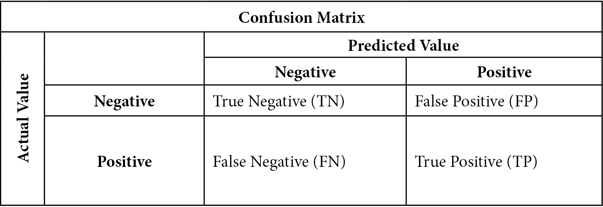

图 6.1 – 混淆矩阵

混淆矩阵帮助我们理解准确率、灵敏度、特异性和精确度。准确率是指我们的预测正确的观察值的百分比。这可以更精确地表述如下：

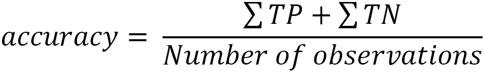

灵敏度是指我们正确预测正面的次数除以正面的总数。回顾一下混淆矩阵，确认实际的正值可以是**预测正值**（**TP**）或**预测负值**（**FN**）。灵敏度也被称为**召回率**或**真正率**：

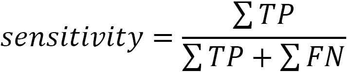

**特异度**是指我们正确预测负值的次数除以实际的负值总数（**TN + FP**）。特异度也被称为**真正率**：


精确度是指我们正确预测**正值**（**TP**）的次数除以预测的正值总数：

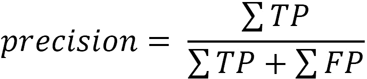

当存在类别不平衡时，如准确率和灵敏度这样的指标可能会给我们关于模型性能的非常不同的估计。一个极端的例子将说明这一点。黑猩猩有时会尝试**白蚁捕捞**，把一根棍子插进蚁丘里，希望能捕获几只白蚁。这只有偶尔会成功。我不是灵长类学家，但我们可以将成功的捕捞尝试建模为使用棍子的大小、年份和时间以及黑猩猩年龄的函数。在我们的测试数据中，捕捞尝试只有 2%的时间会成功。（这些数据是为了演示而编造的。）

让我们再假设我们构建了一个成功白蚁捕捞的分类模型，其灵敏度为 50%。因此，如果我们测试数据中有 100 次捕捞尝试，我们只会正确预测其中一次成功的尝试。还有一个假阳性，即我们的模型在捕捞失败时预测了成功的捕捞。这给我们以下混淆矩阵：


图 6.2 – 成功白蚁捕捞的混淆矩阵

注意，我们得到了一个非常高的准确率 98%——即（97+1）/ 100。我们得到了高准确率和低灵敏度，因为大部分捕捞尝试都是负的，这很容易预测。一个总是预测失败的模型也会有一个 98%的准确率。

现在，让我们用真实数据来查看这些模型评估指标。我们可以通过实验一个**k 最近邻**（**KNN**）模型来预测学士学位的获得，并评估其准确率、灵敏度、特异性和精确率：

1.  我们将首先加载用于编码和标准化数据的库，以及用于创建训练和测试数据框（DataFrames）的库。我们还将加载 scikit-learn 的 KNN 分类器和`metrics`库：

    ```py
    import pandas as pd
    import numpy as np
    from feature_engine.encoding import OneHotEncoder
    from sklearn.model_selection import train_test_split
    from sklearn.preprocessing import StandardScaler
    from sklearn.neighbors import KNeighborsClassifier
    import sklearn.metrics as skmet
    import matplotlib.pyplot as plt
    ```

1.  现在，我们可以创建训练和测试数据框，并对数据进行编码和缩放：

    ```py
    nls97compba = pd.read_csv("data/nls97compba.csv")
    feature_cols = ['satverbal','satmath','gpaoverall',
      'parentincome','gender']
    X_train, X_test, y_train, y_test =  \
      train_test_split(nls97compba[feature_cols],\
      nls97compba[['completedba']], test_size=0.3, random_state=0)
    ohe = OneHotEncoder(drop_last=True, variables=['gender'])
    ohe.fit(X_train)
    X_train_enc, X_test_enc = \
      ohe.transform(X_train), ohe.transform(X_test)
    scaler = StandardScaler()
    standcols = X_train_enc.iloc[:,:-1].columns
    scaler.fit(X_train_enc[standcols])
    X_train_enc = \
      pd.DataFrame(scaler.transform(X_train_enc[standcols]),
      columns=standcols, index=X_train_enc.index).\
      join(X_train_enc[['gender_Female']])
    X_test_enc = \
      pd.DataFrame(scaler.transform(X_test_enc[standcols]),
      columns=standcols, index=X_test_enc.index).\
      join(X_test_enc[['gender_Female']])
    ```

1.  让我们创建一个 KNN 分类模型。我们不会太在意如何指定它，因为我们只想关注本节中的评估指标。我们将使用`feature_cols`中列出的所有特征。我们使用 KNN 分类器的预测方法从测试数据中生成预测：

    ```py
    knn = KNeighborsClassifier(n_neighbors = 5)
    knn.fit(X_train_enc, y_train.values.ravel())
    pred = knn.predict(X_test_enc)
    ```

1.  我们可以使用 scikit-learn 绘制混淆矩阵。我们将传递测试数据中的实际值（`y_test`）和预测值到`confusion_matrix`方法：

    ```py
    cm = skmet.confusion_matrix(y_test, pred, labels=knn.classes_)
    cmplot = skmet.ConfusionMatrixDisplay(
      confusion_matrix=cm, 
      display_labels=['Negative', 'Positive'])
    cmplot.plot()
    cmplot.ax_.set(title='Confusion Matrix', 
      xlabel='Predicted Value', ylabel='Actual Value')
    ```

这生成了以下图表：


图 6.3 – 实际值和预测值的混淆矩阵

1.  我们也可以只返回真正的负值、假阳性、假阴性和真正阳性的计数：

    ```py
    tn, fp, fn, tp = skmet.confusion_matrix(
      y_test.values.ravel(), pred).ravel()
    tn, fp, fn, tp
    (53, 63, 31, 126)
    ```

1.  我们现在有了计算准确率、灵敏度、特异性和精确率所需的所有信息：

    ```py
    accuracy = (tp + tn) / pred.shape[0]
    accuracy
    0.6556776556776557
    sensitivity = tp / (tp + fn)
    sensitivity
    0.802547770700637
    specificity = tn / (tn+fp)
    specificity
    0.45689655172413796
    precision = tp / (tp + fp)
    precision
    0.6666666666666666
    ```

这个模型相对精度较低，但灵敏度略好；也就是说，它更好地识别了测试数据中完成学士学位的人，而不是正确识别所有学位完成者和未完成者的整体情况。如果我们回顾混淆矩阵，我们会看到有相当数量的假阳性，因为我们的模型预测测试数据中有 63 个人将会有学士学位，而实际上并没有。

1.  我们还可以使用 scikit-learn 提供的便捷方法直接生成这些统计数据：

    ```py
    skmet.accuracy_score(y_test.values.ravel(), pred)
    0.6556776556776557
    skmet.recall_score(y_test.values.ravel(), pred)
    0.802547770700637
    skmet.precision_score(y_test.values.ravel(), pred)
    0.6666666666666666
    ```

仅为了比较，让我们尝试使用随机森林分类器，看看是否能得到更好的结果。

1.  让我们将随机森林分类器拟合到相同的数据，并再次调用`confusion_matrix`：

    ```py
    rfc = RandomForestClassifier(n_estimators=100, 
      max_depth=2, n_jobs=-1, random_state=0)
    rfc.fit(X_train_enc, y_train.values.ravel())
    pred = rfc.predict(X_test_enc)
    tn, fp, fn, tp = skmet.confusion_matrix(
      y_test.values.ravel(), pred).ravel()
    tn, fp, fn, tp
    (49, 67, 17, 140)
    accuracy = (tp + tn) / pred.shape[0]
    accuracy
    0.6923076923076923
    sensitivity = tp / (tp + fn)
    sensitivity
    0.89171974522293
    specificity = tn / (tn+fp)
    specificity
    0.4224137931034483
    precision = tp / (tp + fp)
    precision
    0.6763285024154589
    ```

第二个模型比第一个模型显著减少了假阴性，并增加了真阳性。它不太可能预测测试数据中的个体没有完成学士学位，而当个人完成了学士学位时，更有可能预测这个人有学士学位。较低的 FP 和较高的 TP 的主要影响是灵敏度显著提高。第二个模型有 89%的时间识别出实际正值，而第一个模型只有 80%。

我们在本节中讨论的措施——准确性、灵敏度、特异性和精确度——在评估分类模型时都值得一看。但是，例如，在精度和灵敏度之间，我们有时可能会面临难以权衡的情况。数据科学家在构建分类模型时，会依赖几种标准的可视化方法来提高我们对这些权衡的认识。我们将在下一节中探讨这些可视化方法。

# 检查二元分类的 CAP、ROC 和精度-灵敏度曲线

可视化二元分类模型性能的方法有很多。一种相对直接的可视化方法是**累积准确率曲线**（**CAP**），它显示了我们的模型识别正类（或积极案例）的能力。它显示了 X 轴上的累积案例和 Y 轴上的累积积极结果。CAP 曲线是了解我们的模型在区分正类观察方面做得如何的好方法。（在讨论二元分类模型时，我将交替使用*正类*和*积极*这两个术语。）

**接收者操作特征**（**ROC**）曲线说明了在调整分类正值的阈值时，模型灵敏度（能够识别正值）与假阳性率之间的权衡。同样，精度-灵敏度曲线显示了在调整阈值时，我们积极预测的可靠性（它们的精度）与灵敏度（我们的模型识别实际正值的能）力之间的关系。

## 构建 CAP 曲线

让我们从学士学位完成 KNN 模型的 CAP 曲线开始。让我们也将其与决策树模型进行比较。同样，我们在这里不会进行太多的特征选择。上一章详细介绍了特征选择。

除了我们模型的曲线外，CAP 曲线还有用于比较的**随机模型**和**完美模型**的图表。随机模型除了提供正值的整体分布信息外，没有其他信息。完美模型精确地预测正值。为了说明这些图表是如何绘制的，我们将从一个假设的例子开始。想象一下，你从一副洗好的牌中抽取前六张牌。你创建一个表格，其中一列是累积牌总数，下一列是红牌的数量。它可能看起来像这样：

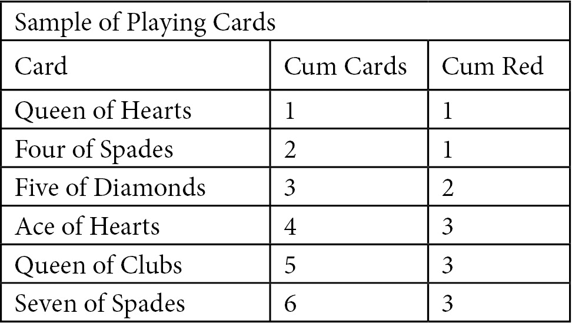

图 6.4 – 玩牌样本

我们可以根据我们对红牌数量的了解绘制一个随机模型。随机模型只有两个点，(0,0)和(6,3)，但这就足够了。

完美模型图表需要更多的解释。如果我们的模型完美预测红牌，并且按预测降序排列，我们会得到*图 6.5*。累积 in-class count 与牌的数量相匹配，直到红牌耗尽，在这个例子中是 3 张。使用完美模型的累积 in-class total 图表将有两个斜率；在达到 in-class total 之前等于 1，之后为 0：

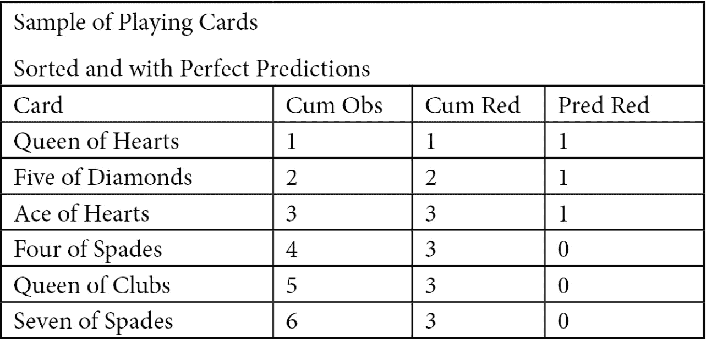

图 6.5 – 玩牌样本

现在我们已经足够了解如何绘制随机模型和完美模型。完美模型将有三点：(0,0)，(in-class count, in-class count)，和(number of cards, in-class count)。在这种情况下，in-class count 是`3`，卡片数量是`6`：

```py
numobs = 6
```

```py
inclasscnt = 3
```

```py
plt.yticks([1,2,3])
```

```py
plt.plot([0, numobs], [0, inclasscnt], c = 'b', label = 'Random Model')
```

```py
plt.plot([0, inclasscnt, numobs], [0, inclasscnt, inclasscnt], c = 'grey', linewidth = 2, label = 'Perfect Model')
```

```py
plt.title("Cumulative Accuracy Profile")
```

```py
plt.xlabel("Total Cards")
```

```py
plt.ylabel("In-class (Red) Cards")
```

这会产生以下图表：

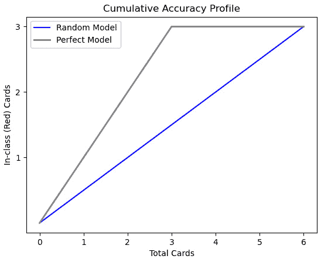

图 6.6 – 使用玩牌数据的 CAP

要理解完美模型相对于随机模型的改进，可以考虑随机模型在中间点预测多少红牌 – 那就是说，3 张牌。在那个点上，随机模型会预测 1.5 张红牌。然而，完美模型会预测 3 张。(记住，我们已经按预测顺序降序排列了牌。)

使用虚构数据构建了随机模型和完美模型的图表后，让我们用我们的学士学位完成数据试试：

1.  首先，我们必须导入与上一节相同的模块：

    ```py
    import pandas as pd
    import numpy as np
    from feature_engine.encoding import OneHotEncoder
    from sklearn.model_selection import train_test_split
    from sklearn.preprocessing import StandardScaler
    from sklearn.neighbors import KNeighborsClassifier
    from sklearn.ensemble import RandomForestClassifier
    import sklearn.metrics as skmet
    import matplotlib.pyplot as plt
    import seaborn as sb
    ```

1.  然后，我们加载、编码和缩放 NLS 学士学位数据：

    ```py
    nls97compba = pd.read_csv("data/nls97compba.csv")
    feature_cols = ['satverbal','satmath','gpaoverall',
      'parentincome','gender']
    X_train, X_test, y_train, y_test =  \
      train_test_split(nls97compba[feature_cols],\
      nls97compba[['completedba']], test_size=0.3, random_state=0)
    ohe = OneHotEncoder(drop_last=True, variables=['gender'])
    ohe.fit(X_train)
    X_train_enc, X_test_enc = \
      ohe.transform(X_train), ohe.transform(X_test)
    scaler = StandardScaler()
    standcols = X_train_enc.iloc[:,:-1].columns
    scaler.fit(X_train_enc[standcols])
    X_train_enc = \
      pd.DataFrame(scaler.transform(X_train_enc[standcols]),
      columns=standcols, index=X_train_enc.index).\
      join(X_train_enc[['gender_Female']])
    X_test_enc = \
      pd.DataFrame(scaler.transform(X_test_enc[standcols]),
      columns=standcols, index=X_test_enc.index).\
      join(X_test_enc[['gender_Female']])
    ```

1.  接下来，我们创建`KNeighborsClassifier`和`RandomForestClassifier`实例：

    ```py
    knn = KNeighborsClassifier(n_neighbors = 5)
    rfc = RandomForestClassifier(n_estimators=100, max_depth=2, 
      n_jobs=-1, random_state=0)
    ```

我们现在可以开始绘制我们的 CAP 曲线了。我们将首先绘制一个随机模型，然后是一个完美模型。这些模型不使用任何信息（除了正值的整体分布）并且提供完美信息。

1.  我们计算测试数据中的观测数和正值的数量。我们将使用(0,0)和(观测数，类内计数)来绘制随机模型线。对于完美模型，我们将从(0,0)到(类内计数，类内计数)绘制一条线，因为该模型可以完美地区分类内值（它永远不会出错）。在该点右侧是平的，因为再也没有更多的正值可以找到。

我们还将绘制一条垂直线在中间，以及与随机模型线相交的水平线。这将在以后更有用：

```py
numobs = y_test.shape[0]
inclasscnt = y_test.iloc[:,0].sum()
plt.plot([0, numobs], [0, inclasscnt], c = 'b', label = 'Random Model')
plt.plot([0, inclasscnt, numobs], [0, inclasscnt, inclasscnt], c = 'grey', linewidth = 2, label = 'Perfect Model')
plt.axvline(numobs/2, color='black', linestyle='dashed', linewidth=1)
plt.axhline(numobs/2, color='black', linestyle='dashed', linewidth=1)
plt.title("Cumulative Accuracy Profile")
plt.xlabel("Total Observations")
plt.ylabel("In-class Observations")
plt.legend()
```

这产生了以下图表：

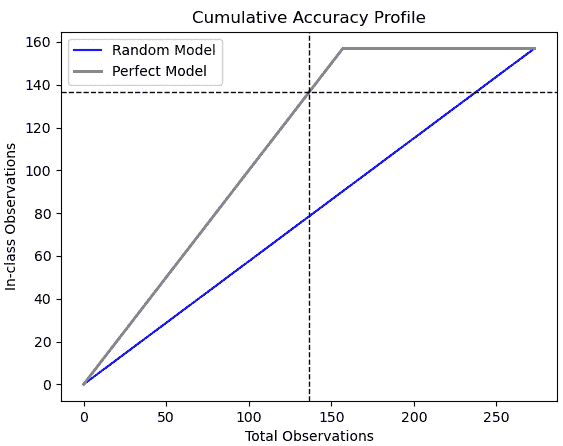

图 6.7 – 仅使用随机和完美模型的 CAP

1.  接下来，我们定义一个函数来绘制我们传递给它的模型的 CAP 曲线。我们将使用`predict_proba`方法来获取一个数组，该数组包含测试数据中每个观测值在类内（在这种情况下，已完成学士学位）的概率。然后，我们将创建一个包含这些概率和实际目标值的 DataFrame，按概率降序排序，并计算正实际目标值的累计总和。

我们还将得到中间观测值的累计值，并在该点绘制一条水平线。最后，我们将绘制一条线，其 x 值为从 0 到观测数的数组，y 值为累计的类内总数：

```py
def addplot(model, X, Xtest, y, modelname, linecolor):
  model.fit(X, y.values.ravel())
  probs = model.predict_proba(Xtest)[:, 1]

  probdf = pd.DataFrame(zip(probs, y_test.values.ravel()),
    columns=(['prob','inclass']))
  probdf.loc[-1] = [0,0]
  probdf = probdf.sort_values(['prob','inclass'],
    ascending=False).\
    assign(inclasscum = lambda x: x.inclass.cumsum())
  inclassmidpoint = \
    probdf.iloc[int(probdf.shape[0]/2)].inclasscum
  plt.axhline(inclassmidpoint, color=linecolor,
    linestyle='dashed', linewidth=1)
  plt.plot(np.arange(0, probdf.shape[0]),
    probdf.inclasscum, c = linecolor,
    label = modelname, linewidth = 4)
```

1.  现在，让我们使用相同的数据运行 KNN 和随机森林分类器模型的函数：

    ```py
    addplot(knn, X_train_enc, X_test_enc, y_train,
      'KNN', 'red')
    addplot(rfc, X_train_enc, X_test_enc, y_train,
      'Random Forest', 'green')
    plt.legend()
    ```

这更新了我们的早期图表：

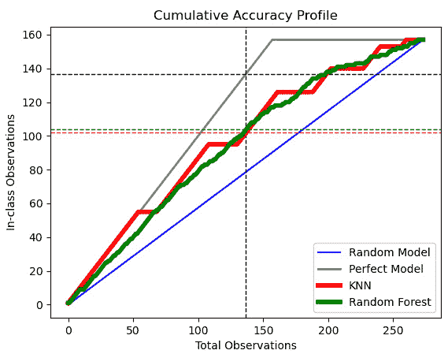

图 6.8 – 使用 KNN 和随机森林模型的 CAP 更新

毫不奇怪，CAP 曲线显示我们的 KNN 和随机森林模型比随机猜测要好，但不如完美模型好。问题是，分别有多好和多差。水平线给我们一些想法。一个完美模型会在 138 个观测值中正确识别出 138 个正值。（回想一下，观测值是按最高可能性为正的顺序排序的。）随机模型会识别出 70 个（线未显示），而 KNN 和随机森林模型分别会识别出 102 和 103 个。我们的两个模型在区分正值方面与完美模型一样好，分别是 74%和 75%。在 70%到 80%之间被认为是好的模型；高于这个百分比的模型非常好，而低于这个百分比的模型较差。

## 绘制接收者操作特征（ROC）曲线

ROC 曲线说明了在调整阈值时，假阳性率与真阳性率（也称为灵敏度）之间的权衡。在进一步讨论之前，我们应该讨论假阳性率。它是模型错误地将实际负例（真负例加上假阳性）识别为正例的百分比：

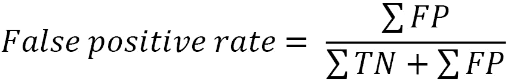

在这里，你可以看到假阳性率与特异性之间的关系，这是在本章开头讨论过的。差异是分子。特异性是我们模型正确地将实际负例识别为负例的百分比：

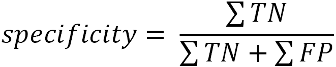

我们还可以将假阳性率与灵敏度进行比较，灵敏度是实际正例（真阳性加上假阴性）的百分比，我们模型正确地将它们识别为正例：

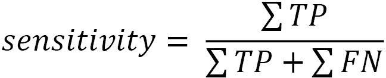

我们通常面临灵敏度和假阳性率之间的权衡。我们希望我们的模型能够识别大量实际正例，但我们不希望假阳性率过高。什么是“过高”取决于你的上下文。

当区分负例和正例变得更加困难时，灵敏度和假阳性率之间的权衡就变得更加复杂。当我们绘制预测概率时，我们可以通过我们的学士学位完成模型看到这一点：

1.  首先，让我们再次调整我们的随机森林分类器并生成预测和预测概率。我们会看到，当预测概率大于 `0.500` 时，该模型预测这个人将完成学士学位：

    ```py
    rfc.fit(X_train_enc, y_train.values.ravel())
    pred = rfc.predict(X_test_enc)
    pred_probs = rfc.predict_proba(X_test_enc)[:, 1]
    probdf = pd.DataFrame(zip(
      pred_probs, pred, y_test.values.ravel()),
      columns=(['prob','pred','actual']))
    probdf.groupby(['pred'])['prob'].agg(['min','max'])
                    min             max
    pred             
    0.000           0.305           0.500
    1.000           0.502           0.883
    ```

1.  将这些概率的分布与实际类别值进行比较是有帮助的。我们可以使用密度图来完成这项工作：

    ```py
    sb.kdeplot(probdf.loc[probdf.actual==1].prob, 
      shade=True, color='red',
      label="Completed BA")
    sb.kdeplot(probdf.loc[probdf.actual==0].prob,  
      shade=True, color='green',
      label="Did Not Complete")
    plt.axvline(0.5, color='black', linestyle='dashed', linewidth=1)
    plt.axvline(0.65, color='black', linestyle='dashed', linewidth=1)
    plt.title("Predicted Probability Distribution")
    plt.legend(loc="upper left")
    ```

这会产生以下图表：

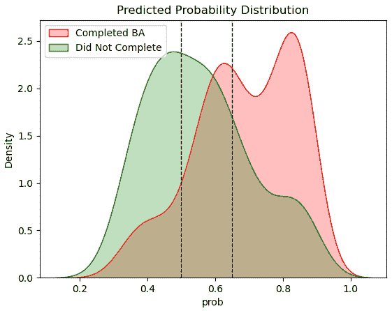

图 6.9 – 在课内和课外观察的密度图

在这里，我们可以看到我们的模型在区分实际正例和负例方面有些困难，因为课内和课外重叠的部分相当多。阈值为 0.500（左侧虚线）会产生很多假阳性，因为课外观察分布（那些没有完成学士学位的人）中有相当一部分预测概率大于 0.500。如果我们提高阈值，比如到 0.650，我们会得到更多的假阴性，因为许多课内观察的概率低于 0.65。

1.  基于测试数据和随机森林模型，构建 ROC 曲线很容易。`roc_curve`方法返回不同阈值（`ths`）下的假阳性率（`fpr`）和灵敏度（真阳性率，`tpr`）。

首先，让我们通过阈值绘制单独的假阳性率和灵敏度线：

```py
fpr, tpr, ths = skmet.roc_curve(y_test, pred_probs)
ths = ths[1:]
fpr = fpr[1:]
tpr = tpr[1:]
fig, ax = plt.subplots()
ax.plot(ths, fpr, label="False Positive Rate")
ax.plot(ths, tpr, label="Sensitivity")
ax.set_title('False Positive Rate and Sensitivity by Threshold')
ax.set_xlabel('Threshold')
ax.set_ylabel('False Positive Rate and Sensitivity')
ax.legend()
```

这会产生以下图表：

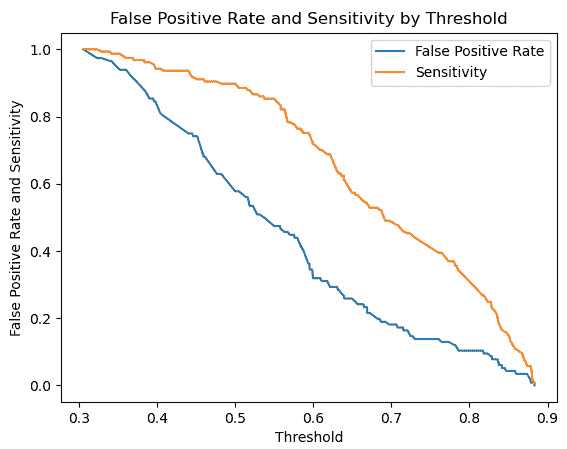

图 6.10 – 假阳性率和灵敏度线

在这里，我们可以看到提高阈值将提高（降低）我们的假阳性率，但也会降低我们的灵敏度。

1.  现在，让我们绘制相关的 ROC 曲线，该曲线绘制了每个阈值下的假阳性率与灵敏度：

    ```py
    fig, ax = plt.subplots()
    ax.plot(fpr, tpr, linewidth=4, color="black")
    ax.set_title('ROC curve')
    ax.set_xlabel('False Positive Rate')
    ax.set_ylabel('Sensitivity')
    ```

这会产生以下图表：

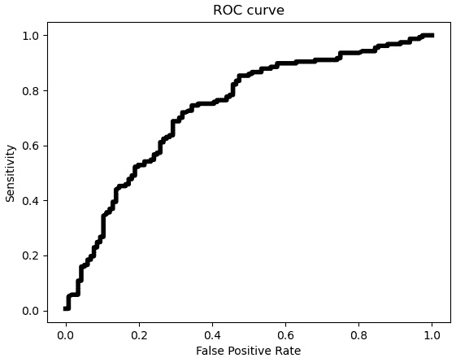

图 6.11 – 带有假阳性率和灵敏度的 ROC 曲线

ROC 曲线表明，假阳性率和灵敏度之间的权衡在假阳性率约为 0.5 或更高时相当陡峭。让我们看看这对随机森林模型预测中使用的 0.5 阈值意味着什么。

1.  让我们从阈值数组中选择一个接近 0.5 的索引，以及一个接近 0.4 和 0.6 的索引进行比较。然后，我们将为那些索引绘制垂直线表示假阳性率，以及为那些索引绘制水平线表示灵敏度值：

    ```py
    tholdind = np.where((ths>0.499) & (ths<0.501))[0][0]
    tholdindlow = np.where((ths>0.397) & (ths<0.404))[0][0]
    tholdindhigh = np.where((ths>0.599) & (ths<0.601))[0][0]
    plt.vlines((fpr[tholdindlow],fpr[tholdind],
      fpr[tholdindhigh]), 0, 1, linestyles ="dashed", 
      colors =["green","blue","purple"])
    plt.hlines((tpr[tholdindlow],tpr[tholdind],
      tpr[tholdindhigh]), 0, 1, linestyles ="dashed", 
      colors =["green","blue","purple"])
    ```

这更新了我们的图表：

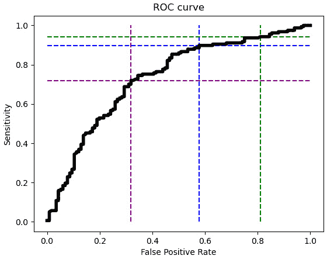

图 6.12 – 带有阈值线的 ROC 曲线

这说明了在 0.5 阈值（蓝色虚线）下，预测中假阳性率和灵敏度之间的权衡。ROC 曲线在 0.5 以上的阈值处斜率非常小，例如 0.6 阈值（绿色虚线）。因此，将阈值从 0.6 降低到 0.5 会导致假阳性率显著降低（从超过 0.8 降低到低于 0.6），但灵敏度降低不多。然而，通过将阈值从 0.5 降低到 0.4（从蓝色到紫色线），假阳性率（降低）将导致灵敏度显著下降。它从近 90%下降到略高于 70%。

## 绘制精度-灵敏度曲线

当调整阈值时，检查精度和灵敏度之间的关系通常很有帮助。记住，精度告诉我们当我们预测一个正值时，我们正确的时间百分比：

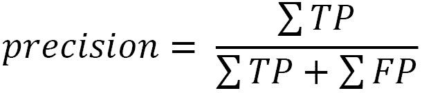

我们可以通过提高将值分类为正的阈值来提高精度。然而，这可能会意味着灵敏度的降低。随着我们提高预测正值时正确的时间（精度），我们将减少我们能够识别的正值数量（灵敏度）。精度-灵敏度曲线，通常称为精度-召回曲线，说明了这种权衡。

在绘制精度-灵敏度曲线之前，让我们先看看分别针对阈值绘制的精度和灵敏度线：

1.  我们可以使用`precision_recall_curve`方法获得精度-灵敏度曲线的点。我们移除最高阈值值的一些不规则性，这有时可能发生：

    ```py
    prec, sens, ths = skmet.precision_recall_curve(y_test, pred_probs)
    prec = prec[1:-10]
    sens = sens[1:-10]
    ths  = ths[:-10]
    fig, ax = plt.subplots()
    ax.plot(ths, prec, label='Precision')
    ax.plot(ths, sens, label='Sensitivity')
    ax.set_title('Precision and Sensitivity by Threshold')
    ax.set_xlabel('Threshold')
    ax.set_ylabel('Precision and Sensitivity')
    ax.set_xlim(0.3,0.9)
    ax.legend()
    ```

这会产生以下图表：

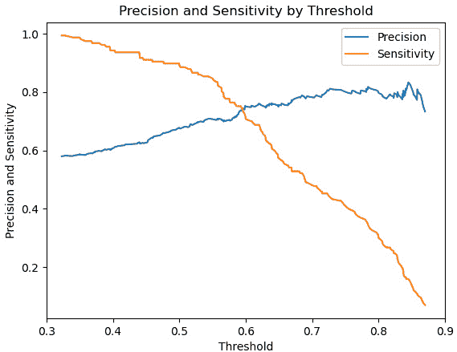

图 6.13 – 精确度和灵敏度线

在这里，我们可以看到，当阈值高于 0.5 时，灵敏度下降更为陡峭。这种下降并没有在 0.6 阈值以上带来多少精确度的改进。

1.  现在，让我们绘制灵敏度与精确度之间的关系，以查看精确度-灵敏度曲线：

    ```py
    fig, ax = plt.subplots()
    ax.plot(sens, prec)
    ax.set_title('Precision-Sensitivity Curve')
    ax.set_xlabel('Sensitivity')
    ax.set_ylabel('Precision')
    plt.yticks(np.arange(0.2, 0.9, 0.2))
    ```

这生成了以下图表：

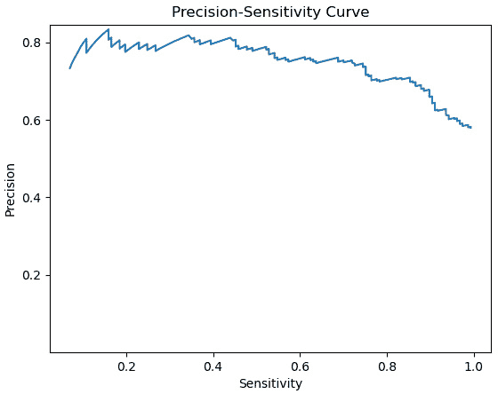

图 6.14 – 精确度-灵敏度曲线

精确度-灵敏度曲线反映了这样一个事实：对于这个特定的模型，灵敏度对阈值的反应比精确度更敏感。这意味着我们可以将阈值降低到 0.5 以下，以获得更高的灵敏度，而不会显著降低精确度。

注意

阈值的选择部分是判断和领域知识的问题，并且在存在显著类别不平衡的情况下主要是一个问题。然而，在*第十章**，逻辑回归*中，我们将探讨如何计算一个最优阈值。

本节以及上一节演示了如何评估二元分类模型。它们表明模型评估不仅仅是一个简单的赞成或反对的过程。它更像是在做蛋糕时品尝面糊。我们对模型规格做出良好的初始假设，并使用模型评估过程进行改进。这通常涉及准确度、灵敏度、特异性和精确度之间的权衡，以及抵制一刀切建议的建模决策。这些决策在很大程度上取决于特定领域，并且是专业判断的问题。

本节中的讨论以及大多数技术同样适用于多类建模。我们将在下一节讨论如何评估多类模型。

# 评估多类模型

我们用来评估二元分类模型的所有相同原则也适用于多类模型评估。计算混淆矩阵同样重要，尽管它更难解释。我们还需要检查一些相互竞争的指标，如精确度和灵敏度。这也比二元分类更复杂。

再次，我们将使用 NLS 学位完成数据。在这种情况下，我们将目标从学士学位完成与否更改为高中完成、学士学位完成和研究生学位完成：

1.  我们将首先加载必要的库。这些库与前面两节中使用的相同：

    ```py
    import pandas as pd
    import numpy as np
    from feature_engine.encoding import OneHotEncoder
    from sklearn.model_selection import train_test_split
    from sklearn.preprocessing import StandardScaler
    from sklearn.neighbors import KNeighborsClassifier
    import sklearn.metrics as skmet
    import matplotlib.pyplot as plt
    ```

1.  接下来，我们将加载 NLS 学位达成数据，创建训练和测试数据框，并对数据进行编码和缩放：

    ```py
    nls97degreelevel = pd.read_csv("data/nls97degreelevel.csv")
    feature_cols = ['satverbal','satmath','gpaoverall',
      'parentincome','gender']
    X_train, X_test, y_train, y_test =  \
      train_test_split(nls97degreelevel[feature_cols],\
      nls97degreelevel[['degreelevel']], test_size=0.3, random_state=0)
    ohe = OneHotEncoder(drop_last=True, variables=['gender'])
    ohe.fit(X_train)
    X_train_enc, X_test_enc = \
      ohe.transform(X_train), ohe.transform(X_test)
    scaler = StandardScaler()
    standcols = X_train_enc.iloc[:,:-1].columns
    scaler.fit(X_train_enc[standcols])
    X_train_enc = \
      pd.DataFrame(scaler.transform(X_train_enc[standcols]),
      columns=standcols, index=X_train_enc.index).\
      join(X_train_enc[['gender_Female']])
    X_test_enc = \
      pd.DataFrame(scaler.transform(X_test_enc[standcols]),
      columns=standcols, index=X_test_enc.index).\
      join(X_test_enc[['gender_Female']])
    ```

1.  现在，我们将运行一个 KNN 模型，并为每个学位级别类别预测值：

    ```py
    knn = KNeighborsClassifier(n_neighbors = 5)
    knn.fit(X_train_enc, y_train.values.ravel())
    pred = knn.predict(X_test_enc)
    pred_probs = knn.predict_proba(X_test_enc)[:, 1]
    ```

1.  我们可以使用这些预测来生成一个混淆矩阵：

    ```py
    cm = skmet.confusion_matrix(y_test, pred)
    cmplot = skmet.ConfusionMatrixDisplay(confusion_matrix=cm, display_labels=['High School', 'Bachelor','Post-Graduate'])
    cmplot.plot()
    cmplot.ax_.set(title='Confusion Matrix', 
      xlabel='Predicted Value', ylabel='Actual Value')
    ```

这生成了以下图表：

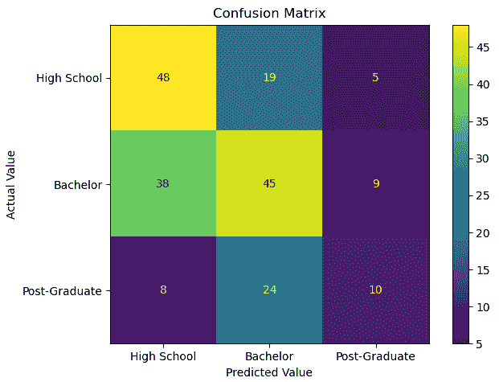

图 6.15 – 具有多类目标的混淆矩阵

可以手动计算评估指标。精度是我们预测中实际属于类内的百分比。因此，对于我们的高中预测，它是 48 / (48 + 38 + 8) = 0.51。高中类别的灵敏度——即我们模型预测的实际高中值的百分比——是 48 / (48 + 19 + 5) = 0.67。然而，这相当繁琐。幸运的是，scikit-learn 可以为我们完成这项工作。

1.  我们可以通过调用 `classification_report` 方法来获取这些统计数据，传递实际和预测值（记住召回率和灵敏度是相同的度量）：

    ```py
    print(skmet.classification_report(y_test, pred,
      target_names=['High School', 'Bachelor', 'Post-Graduate']))
                   precision    recall  f1-score   support
      High School       0.51      0.67      0.58        72
         Bachelor       0.51      0.49      0.50        92
    Post-Graduate       0.42      0.24      0.30        42
         accuracy                           0.50       206
        macro avg       0.48      0.46      0.46       206
     weighted avg       0.49      0.50      0.49       206
    ```

除了按类别计算的精度和灵敏度比率之外，我们还会得到一些其他统计数据。F1 分数是精度和灵敏度的调和平均值。

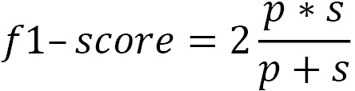

在这里，*p* 代表精度，而 *s* 代表灵敏度。

要获得类别的平均精度、灵敏度和 F1 分数，我们可以使用简单的平均（宏平均）或调整类别大小的加权平均。使用加权平均，我们得到精度、灵敏度和 F1 分数分别为 0.49、0.50 和 0.49。（由于这里的类别相对平衡，宏平均和加权平均之间没有太大差异。）

这演示了如何将我们讨论的二分类模型评估指标扩展到多类评估。虽然实现起来更困难，但相同的概念和技术同样适用。

到目前为止，我们关注的是指标和可视化，以帮助我们评估分类模型。我们尚未检查评估回归模型的指标。这些指标可能比分类指标更为直接。我们将在下一节中讨论它们。

# 评估回归模型

回归模型评估的指标通常基于目标变量的实际值和模型预测值之间的距离。最常见的指标——均方误差、均方根误差、平均绝对误差和 R 平方——都追踪我们的预测如何成功地捕捉目标变量的变化。

实际值和我们的预测值之间的距离被称为残差或误差。**均方误差**（**MSE**）是残差平方的平均值：

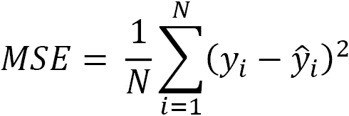

在这里，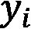 是第 i 次观察的实际目标变量值，而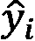 是我们对目标值的预测。由于预测值高于实际值，残差被平方以处理负值。为了使我们的测量值返回到一个更有意义的尺度，我们通常使用均方误差（MSE）的平方根。这被称为**均方根误差**（**RMSE**）。

由于平方，均方误差（MSE）将对较大的残差进行更多的惩罚，而不是较小的残差。例如，如果我们对五个观测值进行预测，其中一个残差为 25，其他四个残差为 0，我们将得到均方误差为 *(0+0+0+0+625)/5 = 125*。然而，如果所有五个观测值的残差都是 5，均方误差将是 *(25+25+25+25+25)/5 = 25*。

将残差的平方作为替代方案是取它们的绝对值。这给我们带来了平均绝对误差：

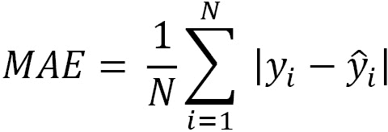

R-squared，也称为确定系数，是我们模型捕获目标变量变化的估计比例。我们平方残差，就像我们在计算均方误差（MSE）时做的那样，并将其除以每个实际目标值与其样本均值之间的偏差。这给我们带来了仍然未解释的变异，我们从 1 中减去它以得到解释的变异：

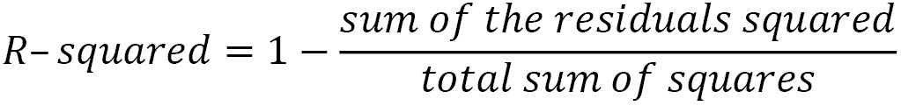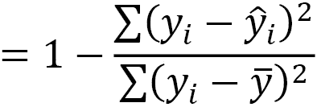

幸运的是，scikit-learn 使得生成这些统计数据变得容易。在本节中，我们将构建一个关于陆地温度的线性回归模型，并使用这些统计数据来评估它。我们将使用来自美国国家海洋和大气管理局 2019 年气象站平均年度温度、海拔和纬度的数据。

注意

陆地温度数据集包含了 2019 年来自全球超过 12,000 个站点的平均温度读数（以摄氏度为单位），尽管大多数站点位于美国。原始数据是从全球历史气候学网络综合数据库中检索的。它已由美国国家海洋和大气管理局在[`www.ncdc.noaa.gov/data-access/land-based-station-data/land-based-datasets/global-historical-climatology-network-monthly-version-4`](https://www.ncdc.noaa.gov/data-access/land-based-station-data/land-based-datasets/global-historical-climatology-network-monthly-version-4)上提供给公众使用。

让我们开始构建一个线性回归模型：

1.  我们将首先加载所需的库和陆地温度数据。我们还将创建训练和测试数据框：

    ```py
    import pandas as pd
    import numpy as np
    from sklearn.model_selection import train_test_split
    from sklearn.linear_model import LinearRegression
    import sklearn.metrics as skmet
    import matplotlib.pyplot as plt
    landtemps = pd.read_csv("data/landtemps2019avgs.csv")
    feature_cols = ['latabs','elevation']
    X_train, X_test, y_train, y_test =  \
      train_test_split(landtemps[feature_cols],\
      landtemps[['avgtemp']], test_size=0.3, random_state=0)
    ```

    注意

    `latabs` 特征是纬度的值，不带北或南指示符；因此，埃及开罗大约在北纬 30 度，巴西的波尔图阿雷格里大约在南纬 30 度，它们具有相同的值。

1.  现在，我们缩放我们的数据：

    ```py
    scaler = StandardScaler()
    scaler.fit(X_train)
    X_train = \
      pd.DataFrame(scaler.transform(X_train),
      columns=feature_cols, index=X_train.index)
    X_test = \
      pd.DataFrame(scaler.transform(X_test),
      columns=feature_cols, index=X_test.index)
    scaler.fit(y_train)
    y_train, y_test = \
      pd.DataFrame(scaler.transform(y_train),
      columns=['avgtemp'], index=y_train.index),\
      pd.DataFrame(scaler.transform(y_test),
      columns=['avgtemp'], index=y_test.index)
    ```

1.  接下来，我们实例化一个 scikit-learn `LinearRegression` 对象，并在训练数据上拟合一个模型。我们的目标是年度平均温度 (`avgtemp`)，而特征是纬度 (`latabs`) 和 `elevation`。`coef_` 属性给我们每个特征的系数：

    ```py
    lr = LinearRegression()
    lr.fit(X_train, y_train)
    np.column_stack((lr.coef_.ravel(),
      X_test.columns.values))
    array([[-0.8538957537748768, 'latabs'],
           [-0.3058979822791853, 'elevation']], dtype=object)
    ```

`latabs`系数的解释是，标准化平均年温度每增加一个标准差，将下降 0.85。（`LinearRegression`模块不返回 p 值，这是系数估计的统计显著性的度量。你可以使用`statsmodels`来查看普通最小二乘模型的完整摘要。）

1.  现在，我们可以获取预测值。让我们也将测试数据中的特征和目标与返回的 NumPy 数组结合起来。然后，我们可以通过从实际值（`avgtemp`）中减去预测值来计算残差。尽管存在轻微的负偏斜和过度的峰度，但残差看起来还不错：

    ```py
    pred = lr.predict(X_test)
    preddf = pd.DataFrame(pred, columns=['prediction'],
      index=X_test.index).join(X_test).join(y_test)
    preddf['resid'] = preddf.avgtemp-preddf.prediction
    preddf.resid.agg(['mean','median','skew','kurtosis'])
    mean             -0.021
    median           0.032
    skew              -0.641
    kurtosis        6.816
    Name: resid, dtype: float64
    ```

值得注意的是，在本书中，我们大多数时候在处理回归模型时都会以这种方式生成预测值和计算残差。如果你对前面代码块中我们刚刚做的事情感到有些不清楚，再次回顾一下可能是个好主意。

1.  我们应该绘制残差图，以更好地了解它们的分布。

    ```py
    Plt.hist(preddf.resid, color="blue")
    plt.axvline(preddf.resid.mean(), color='red', linestyle='dashed', linewidth=1)
    plt.title("Histogram of Residuals for Temperature Model")
    plt.xlabel("Residuals")
    plt.ylabel("Frequency")
    ```

这会产生以下图表：

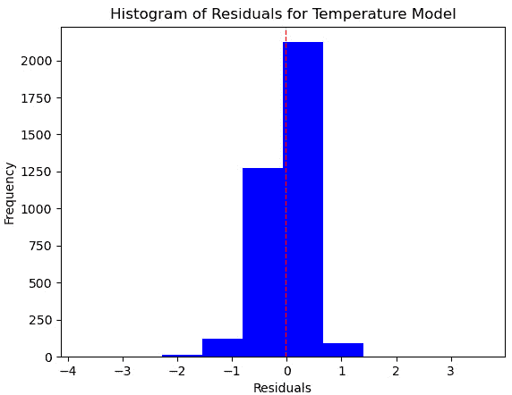

图 6.16 – 线性回归模型的残差直方图

这看起来并不太糟糕，但我们有更多的正残差，在我们预测的测试数据中的温度低于实际温度的情况下，比负残差更多。

1.  通过残差绘制我们的预测可能让我们更好地理解正在发生的情况：

    ```py
    plt.scatter(preddf.prediction, preddf.resid, color="blue")
    plt.axhline(0, color='red', linestyle='dashed', linewidth=1)
    plt.title("Scatterplot of Predictions and Residuals")
    plt.xlabel("Predicted Temperature")
    plt.ylabel("Residuals")
    ```

这会产生以下图表：


图 6.17 – 线性回归模型的预测残差散点图

这看起来并不糟糕。残差在 0 附近随机波动。然而，在 1 到 2 个标准差之间的预测值更有可能过低（具有正残差），而不是过高。超过 2，预测值总是过高（它们具有负残差）。这个模型线性假设可能并不合理。我们应该探索我们在*第四章*中讨论的一些转换，或者尝试一个非参数模型，如 KNN 回归。

也可能极端值在相当大的程度上拉动了我们的系数。一个不错的下一步可能是移除异常值，正如我们在*第一章*的*识别极端值和异常值*部分所讨论的，*检查特征和目标的分布*。然而，我们在这里不会这么做。

1.  让我们看看一些评估指标。这可以通过 scikit-learn 的`metrics`库轻松完成。我们可以调用相同的函数来获取 RMSE 作为 MSE。我们只需要将平方参数设置为`False`：

    ```py
    mse = skmet.mean_squared_error(y_test, pred)
    mse
    0.18906346144036693
    rmse = skmet.mean_squared_error(y_test, pred, squared=False)
    rmse
    0.4348142838504353
    mae = skmet.mean_absolute_error(y_test, pred)
    mae
    0.318307379728143
    r2 = skmet.r2_score(y_test, pred)
    r2
    0.8162525715296725
    ```

标准差以下 0.2 的均方误差（MSE）和标准差以下 0.3 的绝对误差（MAE）看起来相当不错，尤其是对于这样一个稀疏模型。R-squared 超过 80%也是相当有希望的。

1.  让我们看看如果我们使用 KNN 模型会得到什么结果：

    ```py
    knn = KNeighborsRegressor(n_neighbors=5)
    knn.fit(X_train, y_train)
    pred = knn.predict(X_test)
    mae = skmet.mean_absolute_error(y_test, pred)
    mae
    0.2501829988751876
    r2 = skmet.r2_score(y_test, pred)
    r2
    0.8631113217183314
    ```

这个模型实际上在 MAE 和 R-squared 方面都有所改进。

1.  我们也应该再次审视残差：

    ```py
    preddf = pd.DataFrame(pred, columns=['prediction'],
      index=X_test.index).join(X_test).join(y_test)
    preddf['resid'] = preddf.avgtemp-preddf.prediction
    plt.scatter(preddf.prediction, preddf.resid, color="blue")
    plt.axhline(0, color='red', linestyle='dashed', linewidth=1)
    plt.title("Scatterplot of Predictions and Residuals with KNN Model")
    plt.xlabel("Predicted Temperature")
    plt.ylabel("Residuals")
    plt.show()
    ```

这会产生以下图表：

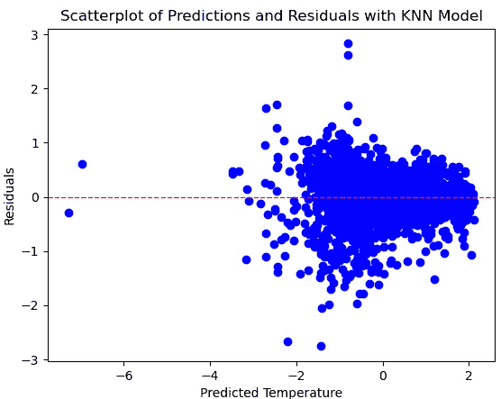

图 6.18 – KNN 模型的预测残差散点图

这个残差图表看起来也好多了。在目标分布的任何部分，我们都不太可能过度预测或低估。

本节介绍了评估回归模型的关键措施及其解释方法。同时，还展示了如何通过可视化，尤其是模型残差的可视化，来提高这种解释的准确性。

然而，到目前为止，我们在使用回归和分类度量时都受到了我们构建的训练和测试数据框的限制。如果，出于某种原因，测试数据在某些方面不寻常呢？更普遍地说，我们基于什么结论认为我们的评估措施是准确的？如果我们使用 K 折交叉验证，我们可以更有信心地使用这些措施，我们将在下一节中介绍。

# 使用 K 折交叉验证

到目前为止，我们已经保留了 30%的数据用于验证。这不是一个坏策略。它防止我们在训练模型时提前查看测试数据。然而，这种方法并没有充分利用所有可用数据，无论是用于训练还是测试。如果我们使用 K 折交叉验证，我们就可以使用所有数据，同时避免数据泄露。也许这听起来太好了，但事实并非如此，这并不是因为一个巧妙的小技巧。

**K 折交叉验证**在 K 个折（或部分）中的所有但一个上训练我们的模型，留出一个用于测试。这重复*k*次，每次排除一个不同的折用于测试。性能指标是基于 K 个折的平均分数。

在开始之前，我们还需要再次考虑数据泄露的可能性。如果我们对我们将用于训练模型的所有数据进行缩放，然后将其分成折，我们将在训练中使用所有折的信息。为了避免这种情况，我们需要在每个迭代中仅对训练折进行缩放，以及进行任何其他预处理。虽然我们可以手动完成这项工作，但 scikit-learn 的`pipeline`库可以为我们做很多这项工作。我们将在本节中介绍如何使用管道进行交叉验证。

让我们尝试使用 K 折交叉验证评估上一节中指定的两个模型。同时，我们也来看看随机森林回归器可能表现如何：

1.  除了我们迄今为止已经使用的库之外，我们还需要 scikit-learn 的`make_pipeline`、`cross_validate`和`Kfold`库：

    ```py
    import pandas as pd
    from sklearn.model_selection import train_test_split
    from sklearn.preprocessing import StandardScaler
    from sklearn.linear_model import LinearRegression
    from sklearn.neighbors import KNeighborsRegressor
    from sklearn.ensemble import RandomForestRegressor
    from sklearn.pipeline import make_pipeline
    from sklearn.model_selection import cross_validate
    from sklearn.model_selection import KFold
    ```

1.  我们再次加载陆地温度数据并创建训练和测试 DataFrame。我们仍然想留出一些数据用于最终验证，但这次，我们只留出 10%。我们将使用剩余的 90%进行训练和测试：

    ```py
    landtemps = pd.read_csv("data/landtemps2019avgs.csv")
    feature_cols = ['latabs','elevation']
    X_train, X_test, y_train, y_test =  \
      train_test_split(landtemps[feature_cols],\
      landtemps[['avgtemp']],test_size=0.1,random_state=0)
    ```

1.  现在，我们创建一个`KFold`对象，并指出我们想要五个折，并且数据要打乱（如果数据尚未随机排序，打乱数据是一个好主意）：

    ```py
    kf = Kfold(n_splits=5, shuffle=True, random_state=0)
    ```

1.  接下来，我们定义一个函数来创建一个管道。然后，该函数运行`cross_validate`，它接受管道和我们之前创建的`KFold`对象：

    ```py
    def getscores(model):
      pipeline = make_pipeline(StandardScaler(), model)
      scores = cross_validate(pipeline, X=X_train, 
        y=y_train, cv=kf, scoring=['r2'], n_jobs=1)
      scorelist.append(dict(model=str(model),
        fit_time=scores['fit_time'].mean(),
        r2=scores['test_r2'].mean()))
    ```

1.  现在，我们准备调用线性回归、随机森林回归和 KNN 回归模型的`getscores`函数：

    ```py
    scorelist = []
    getscores(LinearRegression())
    getscores(RandomForestRegressor(max_depth=2))
    getscores(KNeighborsRegressor(n_neighbors=5))
    ```

1.  我们可以将`scorelist`列表打印出来查看我们的结果：

    ```py
    scorelist
    [{'model': 'LinearRegression()',
      'fit_time': 0.004968833923339844,
      'r2': 0.8181125031214872},
     {'model': 'RandomForestRegressor(max_depth=2)',
      'fit_time': 0.28124608993530276,
      'r2': 0.7122492698889024},
     {'model': 'KNeighborsRegressor()',
      'fit_time': 0.006945991516113281,
      'r2': 0.8686733636724104}]
    ```

根据 R-squared 值，KNN 回归模型比线性回归或随机森林回归模型表现更好。随机森林回归模型也有一个显著的缺点，那就是它的拟合时间要长得多。

# 使用管道预处理数据

在上一节中，我们只是触及了 scikit-learn 管道可以做的事情的表面。我们经常需要将所有的预处理和特征工程折叠到一个管道中，包括缩放、编码以及处理异常值和缺失值。这可能很复杂，因为不同的特征可能需要不同的处理。我们可能需要用数值特征的中间值和分类特征的众数来填充缺失值。我们可能还需要转换我们的目标变量。我们将在本节中探讨如何做到这一点。

按照以下步骤：

1.  我们将首先加载本章中已经使用过的库。然后，我们将添加`ColumnTransformer`和`TransformedTargetRegressor`类。我们将使用这些类分别转换我们的特征和目标：

    ```py
    import pandas as pd
    import numpy as np
    from sklearn.model_selection import train_test_split
    from sklearn.preprocessing import StandardScaler
    from sklearn.linear_model import LinearRegression
    from sklearn.impute import SimpleImputer
    from sklearn.pipeline import make_pipeline
    from feature_engine.encoding import OneHotEncoder
    from sklearn.impute import KNNImputer
    from sklearn.model_selection import cross_validate, KFold
    import sklearn.metrics as skmet
    from sklearn.compose import ColumnTransformer
    from sklearn.compose import TransformedTargetRegressor
    ```

1.  列转换器非常灵活。我们甚至可以使用我们自定义的预处理函数。以下代码块从`helperfunctions`子文件夹中的`preprocfunc`模块导入`OutlierTrans`类：

    ```py
    import os
    import sys
    sys.path.append(os.getcwd() + "/helperfunctions")
    from preprocfunc import OutlierTrans
    ```

1.  `OutlierTrans`类通过距离四分位数范围来识别极端值。这是我们演示过的技术，见*第三章*，*识别和修复缺失值*。

要在 scikit-learn 管道中工作，我们的类必须具有 fit 和 transform 方法。我们还需要继承`BaseEstimator`和`TransformerMixin`类。

在这个类中，几乎所有操作都在`transform`方法中完成。任何超过第三四分位数 1.5 倍或低于第一四分位数的值都被分配为缺失值：

```py
class OutlierTrans(BaseEstimator,TransformerMixin):
  def __init__(self,threshold=1.5):
    self.threshold = threshold

  def fit(self,X,y=None):
    return self

  def transform(self,X,y=None):
    Xnew = X.copy()
    for col in Xnew.columns:
      thirdq, firstq = Xnew[col].quantile(0.75),\
        Xnew[col].quantile(0.25)
      inlierrange = self.threshold*(thirdq-firstq)
      outlierhigh, outlierlow = inlierrange+thirdq,\
        firstq-inlierrange
      Xnew.loc[(Xnew[col]>outlierhigh) | \
        (Xnew[col]<outlierlow),col] = np.nan
    return Xnew.values                                 
```

我们的`OutlierTrans`类可以在我们的管道中以与我们在上一节中使用`StandardScaler`相同的方式使用。我们将在稍后这样做。

1.  现在，我们已经准备好加载需要处理的数据。在本节中，我们将使用 NLS 每周工资数据。每周工资将是我们的目标，我们将使用高中 GPA、母亲和父亲最高学历、家庭收入、性别以及个人是否完成学士学位作为特征。

我们将创建一个特征列表，以不同的方式处理这些特征。这将在我们指导管道对数值、分类和二进制特征执行不同操作时很有帮助：

```py
nls97wages = pd.read_csv("data/nls97wagesb.csv")
nls97wages.set_index("personid", inplace=True)
nls97wages.dropna(subset=['wageincome'], inplace=True)
nls97wages.loc[nls97wages.motherhighgrade==95,
  'motherhighgrade'] = np.nan
nls97wages.loc[nls97wages.fatherhighgrade==95,
  'fatherhighgrade'] = np.nan
num_cols = ['gpascience','gpaenglish','gpamath','gpaoverall',
  'motherhighgrade','fatherhighgrade','parentincome']
cat_cols = ['gender']
bin_cols = ['completedba']
target = nls97wages[['wageincome']]
features = nls97wages[num_cols + cat_cols + bin_cols]
X_train, X_test, y_train, y_test =  \
  train_test_split(features,\
  target, test_size=0.2, random_state=0)
```

1.  让我们看看一些描述性统计。一些变量有超过一千个缺失值（`gpascience`、`gpaenglish`、`gpamath`、`gpaoverall`和`parentincome`）：

    ```py
    nls97wages[['wageincome'] + num_cols].agg(['count','min','median','max']).T
                     count    min      median    max
    wageincome       5,091    0        40,000    235,884
    gpascience       3,521    0        284       424
    gpaenglish       3,558    0        288       418
    gpamath          3,549    0        280       419
    gpaoverall       3,653    42       292       411
    motherhighgrade  4,734    1        12        20
    fatherhighgrade  4,173    1        12        29
    parentincome     3,803   -48,100   40,045    246,474
    ```

1.  现在，我们可以设置一个列转换器。首先，我们将为处理数值数据（`standtrans`）、分类数据和二进制数据创建管道。

对于数值数据，我们希望将异常值视为缺失。在这里，我们将`2`这个值传递给`OutlierTrans`的阈值参数，表示我们希望将高于或低于该范围两倍四分位距的值设置为缺失。记住，默认值是 1.5，所以我们相对保守一些。

然后，我们将创建一个`ColumnTransformer`对象，将其传递给刚刚创建的三个管道，并指明使用哪个管道来处理哪些特征：

```py
standtrans = make_pipeline(OutlierTrans(2),
  StandardScaler())
cattrans = make_pipeline(SimpleImputer(strategy="most_frequent"),
  OneHotEncoder(drop_last=True))
bintrans = make_pipeline(SimpleImputer(strategy="most_frequent"))
coltrans = ColumnTransformer(
  transformers=[
    ("stand", standtrans, num_cols),
    ("cat", cattrans, ['gender']),
    ("bin", bintrans, ['completedba'])
  ]
)
```

1.  现在，我们可以将列转换器添加到包含我们想要运行的线性模型的管道中。我们将向管道中添加 KNN 插补来处理缺失值。

我们还需要对目标进行缩放，这在我们管道中无法完成。我们将使用 scikit-learn 的`TransformedTargetRegressor`来完成这个任务。我们将刚刚创建的管道传递给目标回归器的`regressor`参数：

```py
lr = LinearRegression()
pipe1 = make_pipeline(coltrans,
  KNNImputer(n_neighbors=5), lr)
ttr=TransformedTargetRegressor(regressor=pipe1,
  transformer=StandardScaler())
```

1.  让我们使用这个管道进行 K 折交叉验证。我们可以通过目标回归器`ttr`将我们的管道传递给`cross_validate`函数：

    ```py
    kf = KFold(n_splits=10, shuffle=True, random_state=0)
    scores = cross_validate(ttr, X=X_train, y=y_train,
      cv=kf, scoring=('r2', 'neg_mean_absolute_error'),
      n_jobs=1)
    print("Mean Absolute Error: %.2f, R-squared: %.2f" % 
      (scores['test_neg_mean_absolute_error'].mean(),
      scores['test_r2'].mean()))
    Mean Absolute Error: -23781.32, R-squared: 0.20
    ```

虽然这些分数并不理想，但这并不是这次练习的真正目的。关键要点是我们通常希望将大部分预处理工作整合到管道中。这是避免数据泄露的最佳方式。列转换器是一个极其灵活的工具，允许我们对不同的特征应用不同的转换。

# 摘要

本章介绍了关键模型评估指标和技术，以便在本书的剩余章节中广泛使用和扩展时，它们将变得熟悉。我们研究了分类和回归模型评估的非常不同的方法。我们还探讨了如何使用可视化来改进我们对预测的分析。最后，我们使用管道和交叉验证来获取模型性能的可靠估计。

我希望这一章也给了你一个机会去适应这本书接下来的一般方法。尽管在接下来的章节中我们将讨论大量算法，但我们仍将继续探讨我们在前几章中讨论的预处理问题。当然，我们将讨论每个算法的核心概念。但是，以真正的*动手实践*方式，我们还将处理现实世界数据的杂乱无章。每一章将从相对原始的数据开始，到特征工程，再到模型指定和模型评估，高度依赖 scikit-learn 的管道来整合所有内容。

在接下来的几章中，我们将讨论回归算法——那些允许我们建模连续目标的算法。我们将探讨一些最受欢迎的回归算法——线性回归、支持向量回归、K 最近邻回归和决策树回归。我们还将考虑对回归模型进行修改，以解决欠拟合和过拟合问题，包括非线性变换和正则化。
