# *第七章*: 线性回归模型

线性回归可能是最著名的机器学习算法，其起源至少可以追溯到 200 年前的统计学习。如果你在大学里学习了统计学、计量经济学或心理测量学课程，你很可能已经接触到了线性回归，即使你在机器学习在本科课程中教授之前就已经上了这门课。实际上，许多社会和物理现象都可以成功地被建模为预测变量线性组合的函数。尽管如此，线性回归对机器学习来说仍然非常有用，就像这些年来对统计学习一样，不过，在机器学习中，我们更关心预测而不是参数值。

假设我们的特征和目标具有某些特性，线性回归是建模连续目标的一个非常好的选择。在本章中，我们将讨论线性回归模型的假设，并使用与这些假设大部分一致的数据构建模型。然而，我们还将探索替代方法，例如非线性回归，当这些假设不成立时我们会使用它。我们将通过查看解决过拟合可能性的技术来结束本章，例如 lasso 回归。

在本章中，我们将涵盖以下主题：

+   关键概念

+   线性回归与梯度下降

+   使用经典线性回归

+   使用 lasso 回归

+   使用非线性回归

+   使用梯度下降进行回归

# 技术要求

在本章中，我们将坚持使用大多数 Python 科学发行版中可用的库——NumPy、pandas 和 scikit-learn。本章的代码可以在本书的 GitHub 仓库中找到，网址为[`github.com/PacktPublishing/Data-Cleaning-and-Exploration-with-Machine-Learning`](https://github.com/PacktPublishing/Data-Cleaning-and-Exploration-with-Machine-Learning)。

# 关键概念

经常从事预测建模的分析师通常会构建数十个，甚至数百个线性回归模型。如果你像我一样，在 20 世纪 80 年代末为一家大型会计师事务所工作，并且从事预测工作，你可能每天都会花整天时间指定线性模型。你会运行所有可能的独立变量排列和因变量变换，并勤奋地寻找异方差性（残差中的非恒定方差）或多重共线性（高度相关的特征）的证据。但最重要的是，你努力识别关键预测变量，并解决任何参数估计（你的系数或权重）中的偏差。

## 线性回归模型的关键假设

那些努力的大部分至今仍然适用，尽管现在对预测准确性的重视程度超过了参数估计。我们现在担心过度拟合，而 30 年前我们并没有这样做。当线性回归模型的假设被违反时，我们也更有可能寻求替代方案。这些假设如下：

+   特征（自变量）与目标（因变量）之间存在线性关系

+   偶然误差（实际值与预测值之间的差异）是正态分布的

+   偶然误差在观测之间是独立的

+   偶然误差的方差是恒定的

在现实世界中，这些假设中有一个或多个被违反并不罕见。特征与目标之间的关系通常是线性的。特征的影响可能在该特征的范围内变化。任何熟悉“*厨房里的人太多*”这个表达的人可能都会欣赏到，第五个厨师带来的边际生产力的增加可能不如第二个或第三个厨师那么大。

我们的偶然误差有时不是正态分布的。这表明我们的模型在目标的一些范围内可能不够准确。例如，在目标范围的中间部分（比如第 25 到第 75 百分位数）可能会有较小的偶然误差，而在两端可能会有较大的偶然误差。这可能是由于与目标的关系是非线性的。

偶然误差可能不独立的原因有几个。这在时间序列数据中通常是这种情况。对于一个日股价模型，相邻天的偶然误差可能是相关的。这被称为自相关。这也可能是纵向或重复测量数据的问题。例如，我们可能有 20 个不同教室中 600 名学生的考试成绩，或者 100 人的年度工资收入。如果我们的模型未能考虑到某些特征在群体中不存在变化——在这些例子中是教室决定和个人决定的特征——那么我们的偶然误差就不会是独立的。

最后，我们的偶然误差在不同特征的不同范围内可能会有更大的变异性。如果我们正在预测全球气象站的温度，并且纬度是我们使用的特征之一，那么在较高的纬度值上可能会有更大的偶然误差。这被称为异方差性。这也可能表明我们的模型遗漏了重要的预测因子。

除了这四个关键假设之外，线性回归的另一个常见挑战是特征之间的高度相关性。这被称为多重共线性。正如我们在*第五章*中讨论的[*特征选择*]，当我们的模型难以隔离特定特征的独立影响，因为它与另一个特征变化很大时，我们可能会增加过拟合的风险。对于那些花费数周时间构建模型的人来说，这将是熟悉的，其中系数随着每个新规格的提出而大幅变动。

当违反这些假设中的一个或多个时，我们仍然可以使用传统的回归模型。然而，我们可能需要以某种方式转换数据。我们将在本章中讨论识别这些假设违反的技术、这些违反对模型性能的影响以及解决这些问题的可能方法。

## 线性回归和普通最小二乘法

线性回归中最常见的估计技术是**普通最小二乘法**（**OLS**）。OLS 选择系数，使得实际目标值与预测值之间平方距离之和最小。更精确地说，OLS 最小化以下：

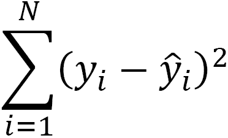

在这里，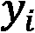是第 i 个观测的实际值，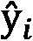是预测值。正如我们讨论过的，实际目标值与预测目标值之间的差异，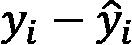，被称为残差。

从图形上看，普通最小二乘法（OLS）通过我们的数据拟合一条线，使得数据点到这条线的垂直距离最小。以下图表展示了一个具有一个特征（称为简单线性回归）的模型，使用的是虚构的数据点。每个数据点到回归线的垂直距离是残差，可以是正数或负数：

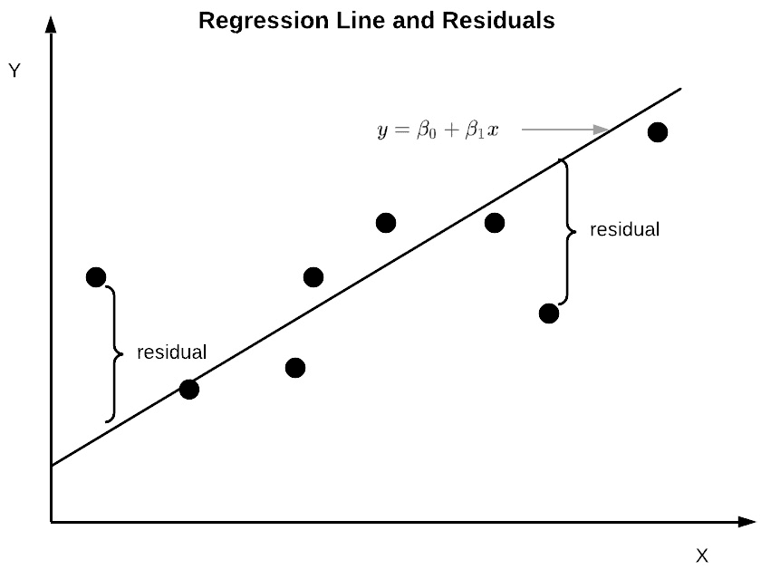

图 7.1 – 普通最小二乘法回归线

这条线，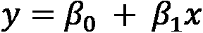，给出了每个*x*值的*y*预测值。它等于估计的截距，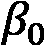，加上特征估计系数乘以特征值，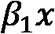。这就是 OLS 线。任何其他穿过数据的直线都会导致平方残差之和更高。这可以扩展到多线性回归模型 – 即具有一个以上特征的模型：

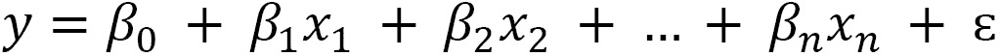

在这里，*y* 是目标，每个 *x* 是一个特征，每个 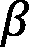 是一个系数（或截距），*n* 是特征的数量，*ɛ* 是一个误差项。每个系数是从关联特征 1 单位变化引起的目标估计变化。这是一个很好的地方来注意到系数在整个特征的范围上是恒定的；也就是说，特征从 0 到 1 的增加被认为对目标的影响与从 999 到 1000 的影响相同。然而，这并不总是有道理。在本章的后面，我们将讨论当特征与目标之间的关系不是线性的情况下如何使用变换。

线性回归的一个重要优点是它不像其他监督回归算法那样计算量大。当线性回归表现良好，基于我们之前章节讨论的指标时，它是一个好的选择。这尤其适用于你有大量数据需要训练或你的业务流程不允许大量时间用于模型训练的情况。算法的效率还可以使其使用更资源密集的特征选择技术成为可能，例如我们讨论过的包装方法，这在*第五章* *特征选择*中提到。正如我们看到的，你可能不想使用决策树回归器的穷举特征选择。然而，对于线性回归模型来说，这可能是完全可行的。

# 线性回归和梯度下降

我们可以使用梯度下降而不是普通最小二乘法来估计我们的线性回归参数。梯度下降通过迭代可能的系数值来找到那些使残差平方和最小的值。它从随机的系数值开始，并计算该迭代的平方误差总和。然后，它为系数生成新的值，这些值比上一步的残差更小。当我们使用梯度下降时，我们指定一个学习率。学习率决定了每一步残差改进的量。

当处理非常大的数据集时，梯度下降通常是一个不错的选择。如果整个数据集无法装入你的机器内存，它可能就是唯一的选择。在下一节中，我们将使用 OLS 和梯度下降来估计我们的参数。

# 使用经典线性回归

在本节中，我们将指定一个相当直接的线性模型。我们将使用它来根据几个国家的经济和政治指标预测隐含的汽油税。但在我们指定模型之前，我们需要完成本书前几章讨论的预处理任务。

## 对我们的回归模型进行数据预处理

在本章中，我们将使用管道来预处理我们的数据，并在本书的其余部分也是如此。我们需要在数据缺失的地方填充值，识别和处理异常值，以及编码和缩放我们的数据。我们还需要以避免数据泄露并清理训练数据而不提前查看测试数据的方式来做这些。正如我们在*第六章*中看到的，*准备模型评估*，scikit-learn 的管道可以帮助我们完成这些任务。

我们将使用的数据集包含每个国家的隐含汽油税和一些可能的预测因子，包括人均国民收入、政府债务、燃料收入依赖性、汽车使用范围以及民主过程和政府有效性的衡量指标。

注意

这个关于各国隐含汽油税的数据集可以在哈佛数据共享平台[`dataverse.harvard.edu/dataset.xhtml?persistentId=doi:10.7910/DVN/RX4JGK`](https://dataverse.harvard.edu/dataset.xhtml?persistentId=doi:10.7910/DVN/RX4JGK)上供公众使用。它由*Paasha Mahdavi*、*Cesar B. Martinez-Alvarez*和*Michael L. Ross*编制。隐含汽油税是根据每升汽油的世界基准价格和当地价格之间的差异来计算的。当地价格高于基准价格表示征税。当基准价格更高时，它可以被视为补贴。我们将使用每个国家的 2014 年数据进行分析。

让我们先对数据进行预处理：

1.  首先，我们加载了许多我们在上一章中使用的库。然而，我们还需要两个新的库来构建我们的数据管道——`ColumnTransformer`和`TransformedTargetRegressor`。这些库允许我们构建一个对数值和分类特征进行不同预处理的管道，并且还可以转换我们的目标：

    ```py
    import pandas as pd
    import numpy as np
    from sklearn.model_selection import train_test_split
    from sklearn.preprocessing import StandardScaler
    from sklearn.linear_model import LinearRegression
    from sklearn.impute import SimpleImputer
    from sklearn.pipeline import make_pipeline
    from sklearn.compose import ColumnTransformer
    from sklearn.compose import TransformedTargetRegressor
    from sklearn.feature_selection import RFE
    from sklearn.impute import KNNImputer
    from sklearn.model_selection import cross_validate, KFold
    import sklearn.metrics as skmet
    import matplotlib.pyplot as plt
    ```

1.  我们可以通过添加自己的类来扩展 scikit-learn 管道的功能。让我们添加一个名为`OutlierTrans`的类来处理极端值。

要将这个类包含在管道中，它必须继承自`BaseEstimator`类。我们还必须继承自`TransformerMixin`，尽管还有其他可能性。我们的类需要`fit`和`transform`方法。我们可以在`transform`方法中放置将极端值赋为缺失值的代码。

但在我们能够使用我们的类之前，我们需要导入它。为了导入它，我们需要追加`helperfunctions`子文件夹，因为那里是我们放置包含我们的类的`preprocfunc`模块的地方：

```py
import os
import sys
sys.path.append(os.getcwd() + “/helperfunctions”)
from preprocfunc import OutlierTrans
```

这导入了`OutlierTrans`类，我们可以将其添加到我们创建的管道中：

```py
class OutlierTrans(BaseEstimator,TransformerMixin):
  def __init__(self,threshold=1.5):
    self.threshold = threshold

  def fit(self,X,y=None):
    return self

  def transform(self,X,y=None):
    Xnew = X.copy()
    for col in Xnew.columns:
      thirdq, firstq = Xnew[col].quantile(0.75),\
        Xnew[col].quantile(0.25)
      interquartilerange = self.threshold*(thirdq-firstq)
      outlierhigh, outlierlow = interquartilerange+thirdq,\
        firstq-interquartilerange
      Xnew.loc[(Xnew[col]>outlierhigh) | \
        (Xnew[col]<outlierlow),col] = np.nan
    return Xnew.values
```

`OutlierTrans`类使用一个相当标准的单变量方法来识别异常值。它计算每个特征的**四分位数范围**（**IQR**），然后将任何高于第三四分位数 1.5 倍或低于第一四分位数 1.5 倍以上的值设置为缺失。如果我们想更保守一些，可以将阈值改为其他值，例如 2.0。（我们在*第一章*，*检查特征和目标的分布*中讨论了识别异常值的技术。）

1.  接下来，我们加载 2014 年的汽油税数据。有 154 行——数据框中每个国家一行。一些特征有一些缺失值，但只有`motorization_rate`有两位数的缺失。`motorization_rate`是每人的汽车数量：

    ```py
    fftaxrate14 = pd.read_csv(“data/fossilfueltaxrate14.csv”)
    fftaxrate14.set_index(‘countrycode’, inplace=True)
    fftaxrate14.info()
    <class ‘pandas.core.frame.DataFrame’>
    Index: 154 entries, AFG to ZWE
    Data columns (total 19 columns):
    #   Column                     Non-Null Count  Dtype
                                   --------------  -----  
    0   country                    154 non-null    object
    1   region                     154 non-null    object
    2   region_wb                  154 non-null    object
    3   year                       154 non-null    int64
    4   gas_tax_imp                154 non-null    float64
    5   bmgap_diesel_spotprice_la  146 non-null    float64
    6   fuel_income_dependence     152 non-null    float64
    7   national_income_per_cap    152 non-null    float64
    8   VAT_Rate                   151 non-null    float64
    9   gov_debt_per_gdp           139 non-null    float64
    10  polity                     151 non-null    float64
    11  democracy_polity           151 non-null    float64
    12  autocracy_polity           151 non-null    float64
    13  goveffect                  154 non-null    float64
    14  democracy_index            152 non-null    float64
    15  democracy                  154 non-null    int64
    16  nat_oil_comp               152 non-null    float64
    17  nat_oil_comp_state         152 non-null    float64
    18  motorization_rate          127 non-null    float64
    dtypes: float64(14), int64(2), object(3)
    memory usage: 24.1+ KB
    ```

1.  让我们将特征分为数值特征和二进制特征。我们将`motorization_rate`放入一个特殊类别，因为我们预计需要比其他特征做更多的工作：

    ```py
    num_cols = [‘fuel_income_dependence’, 
      ’national_income_per_cap’, ‘VAT_Rate’,  
      ‘gov_debt_per_gdp’, ’polity’, ’goveffect’,
      ‘democracy_index’]
    dummy_cols = ‘democracy_polity’,’autocracy_polity’,
      ‘democracy’,’nat_oil_comp’,’nat_oil_comp_state’]
    spec_cols = [‘motorization_rate’]
    ```

1.  我们应该查看一些数值特征和目标的描述性统计。我们的目标`gas_tax_imp`的中位数为 0.52。请注意，一些特征的范围非常不同。超过一半的国家`polity`得分为 7 或更高；10 是可能的最高`polity`得分，意味着最民主。大多数国家的政府有效性值为负。`democracy_index`与`polity`是非常相似的一个度量，尽管有更多的变化：

    ```py
    fftaxrate14[[‘gas_tax_imp’] + num_cols + spec_cols].\
      agg([‘count’,’min’,’median’,’max’]).T
                          count min    median   max
    gas_tax_imp             154 -0.80  0.52     1.73
    fuel_income_dependence  152 0.00   0.14     34.43
    national_income_per_cap 152 260.00 6,050.00 104,540.00
    VAT_Rate                151 0.00   16.50    27.00
    gov_debt_per_gdp        139 0.55   39.30    194.76
    polity                  151 -10.00 7.00     10.00
    goveffect               154 -2.04  -0.15    2.18
    democracy_index         152 0.03   0.57     0.93
    motorization_rate       127 0.00   0.20     0.81
    ```

1.  让我们再看看二进制特征的分布。我们必须将`normalize`设置为`True`以生成比率而不是计数。`democracy_polity`和`autocracy_polity`特征是`polity`特征的二进制版本；非常高的`polity`得分得到`democracy_polity`值为 1，而非常低的`polity`得分得到`autocracy_polity`值为 1。同样，`democracy`是一个虚拟特征，用于那些`democracy_index`值较高的国家。有趣的是，近一半的国家（0.46）拥有国家石油公司，而几乎四分之一（0.23）拥有国有国家石油公司：

    ```py
    fftaxrate14[dummy_cols].apply(pd.value_counts, normalize=True).T
                                   0               1
    democracy_polity               0.41            0.59
    autocracy_polity               0.89            0.11
    democracy                      0.42            0.58
    nat_oil_comp                   0.54            0.46
    nat_oil_comp_state             0.77            0.23
    ```

所有这些都看起来相当不错。然而，我们需要对几个特征的缺失值做一些工作。我们还需要做一些缩放，但不需要进行任何编码，因为我们可以直接使用二进制特征。一些特征是相关的，因此我们需要进行一些特征消除。

1.  我们通过创建训练和测试数据框开始预处理。我们将只为测试保留 20%：

    ```py
    target = fftaxrate14[[‘gas_tax_imp’]]
    features = fftaxrate14[num_cols + dummy_cols + spec_cols]
    X_train, X_test, y_train, y_test =  \
      train_test_split(features,\
      target, test_size=0.2, random_state=0)
    ```

1.  我们需要构建一个包含列转换的管道，以便我们可以对数值数据和分类数据进行不同的预处理。我们将为`num_cols`中的所有数值列构建一个管道，命名为`standtrans`。首先，我们想要将异常值设置为缺失值。我们将异常值定义为超过第三四分位数两倍以上的值，或者低于第一四分位数的值。我们将使用`SimpleImputer`将缺失值设置为该特征的中间值。

我们不希望对`dummy_cols`中的二元特征进行缩放，但我们确实想要使用`SimpleImputer`将每个分类特征的缺失值设置为最频繁的值。

我们不会为`motorization_rate`使用`SimpleImputer`。记住，`motorization_rate`不在`num_cols`列表中——它在`spec_cols`列表中。我们为`spec_cols`中的特征设置了一个特殊的管道，`spectrans`。我们将使用`motorization_rate`值：

```py
standtrans = make_pipeline(OutlierTrans(2), 
  SimpleImputer(strategy=”median”), StandardScaler())
cattrans = make_pipeline(
  SimpleImputer(strategy=”most_frequent”))
spectrans = make_pipeline(OutlierTrans(2), 
  StandardScaler())
coltrans = ColumnTransformer(
  transformers=[
    (“stand”, standtrans, num_cols),
    (“cat”, cattrans, dummy_cols),
    (“spec”, spectrans, spec_cols)
  ]
)
```

这设置了我们在汽油税数据上想要进行的所有预处理。要进行转换，我们只需要调用列转换器的`fit`方法。然而，我们目前不会这样做，因为我们还想要将特征选择添加到管道中，并使其运行线性回归。我们将在接下来的几个步骤中完成这些操作。

## 运行和评估我们的线性模型

我们将使用**递归特征消除**（**RFE**）来选择模型的特征。RFE 具有包装特征选择方法的优点——它根据选定的算法评估特征，并在评估中考虑多元关系。然而，它也可能在计算上很昂贵。由于我们没有很多特征或观测值，在这种情况下这并不是一个大问题。

在选择特征后，我们运行线性回归模型并查看我们的预测。让我们开始吧：

1.  首先，我们创建线性回归和递归特征消除实例，并将它们添加到管道中。我们还创建了一个`TransformedTargetRegressor`对象，因为我们仍然需要转换目标。我们将我们的管道传递给`TransformedTargetRegressor`的回归器参数。

现在，我们可以调用目标回归器的`fit`方法。之后，管道的`rfe`步骤的`support_`属性将给我们提供选定的特征。同样，我们可以通过获取`linearregression`步骤的`coef_`值来获取系数。关键在于通过引用`ttr.regressor`我们能够访问到管道：

```py
lr = LinearRegression()
rfe = RFE(estimator=lr, n_features_to_select=7)
pipe1 = make_pipeline(coltrans, 
  KNNImputer(n_neighbors=5), rfe, lr)
ttr=TransformedTargetRegressor(regressor=pipe1,
  transformer=StandardScaler())
ttr.fit(X_train, y_train)
selcols = X_train.columns[ttr.regressor_.named_steps[‘rfe’].support_]
coefs = ttr.regressor_.named_steps[‘linearregression’].coef_
np.column_stack((coefs.ravel(),selcols))
array([[0.44753064726665703, ‘VAT_Rate’],
       [0.12368913577287821, ‘gov_debt_per_gdp’],
       [0.17926454403985687, ‘goveffect’],
       [-0.22100930246392841, ‘autocracy_polity’],
       [-0.15726572731003752, ‘nat_oil_comp’],
       [-0.7013454686632653, ‘nat_oil_comp_state’],
       [0.13855012574945422, ‘motorization_rate’]], dtype=object)
```

我们的特征选择确定了增值税率、政府债务、政府有效性指标（`goveffect`）、国家是否属于威权主义类别、是否有国家石油公司以及是否为国有企业，以及机动化率作为前七个特征。特征的数目是一个超参数的例子，我们在这里选择七个是相当随意的。我们将在下一节讨论超参数调整的技术。

注意到在数据集中的几个威权/民主措施中，似乎最重要的是威权虚拟变量，对于`polity`得分非常低的国家的值为 1。它被估计对汽油税有负面影响；也就是说，会减少它们。

1.  让我们来看看预测值和残差。我们可以将测试数据中的特征传递给 transformer 的/pipeline 的`predict`方法来生成预测值。存在一点正偏斜和整体偏差；残差总体上是负的：

    ```py
    pred = ttr.predict(X_test)
    preddf = pd.DataFrame(pred, columns=[‘prediction’],
      index=X_test.index).join(X_test).join(y_test)
    preddf[‘resid’] = preddf.gas_tax_imp-preddf.prediction
    preddf.resid.agg([‘mean’,’median’,’skew’,’kurtosis’])
    mean                -0.09
    median              -0.13
    skew                 0.61
    kurtosis             0.04
    Name: resid, dtype: float64
    ```

1.  让我们也生成一些整体模型评估统计信息。我们得到平均绝对误差为`0.23`。考虑到汽油税价格的中间值为`0.52`，这不是一个很好的平均误差。然而，r-squared 值还不错：

    ```py
    print(“Mean Absolute Error: %.2f, R-squared: %.2f” % 
      (skmet.mean_absolute_error(y_test, pred),
      skmet.r2_score(y_test, pred)))
    Mean Absolute Error: 0.23, R-squared: 0.75
    ```

1.  通常查看残差的图表是有帮助的。让我们也画一条代表残差平均值的红色虚线：

    ```py
    plt.hist(preddf.resid, color=”blue”, bins=np.arange(-0.5,1.0,0.25))
    plt.axvline(preddf.resid.mean(), color=’red’, linestyle=’dashed’, linewidth=1)
    plt.title(“Histogram of Residuals for Gax Tax Model”)
    plt.xlabel(“Residuals”)
    plt.ylabel(“Frequency”)
    plt.xlim()
    plt.show()
    ```

这产生了以下图表：

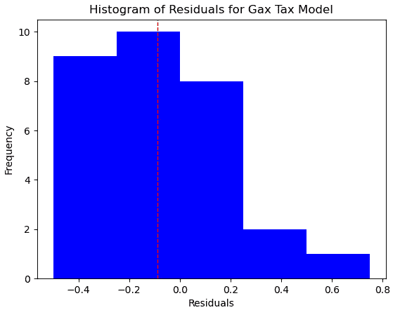

图 7.2 – 汽油税模型残差

这个图表显示了正偏斜。此外，我们的模型更有可能高估汽油税而不是低估它。（当预测值大于实际目标值时，残差为负。）

1.  让我们也看看预测值与残差的散点图。让我们在*Y*轴上画一条代表 0 的红色虚线：

    ```py
    plt.scatter(preddf.prediction, preddf.resid, color=”blue”)
    plt.axhline(0, color=’red’, linestyle=’dashed’, linewidth=1)
    plt.title(“Scatterplot of Predictions and Residuals”)
    plt.xlabel(“Predicted Gax Tax”)
    plt.ylabel(“Residuals”)
    plt.show()
    ```

这产生了以下图表：

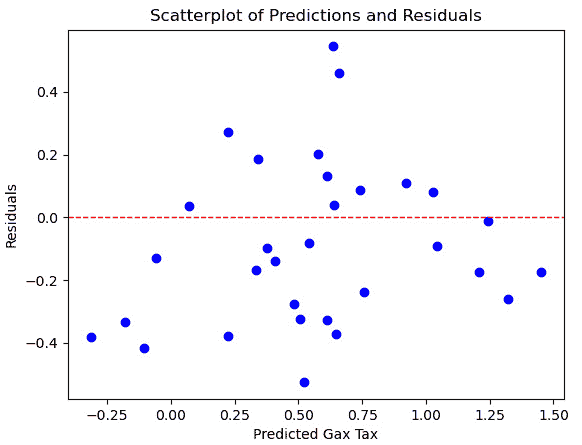

图 7.3 – 预测值与残差的散点图

在这里，高估发生在预测值的整个范围内，但没有低估（正残差）出现在预测值低于 0 或高于 1 的情况下。这应该让我们对我们的线性假设产生一些怀疑。

## 提高我们的模型评估

我们到目前为止评估模型的一个问题是，我们没有充分利用数据。我们只在大约 80%的数据上进行了训练。我们的指标也相当依赖于测试数据是否代表我们想要预测的真实世界。然而，可能并不总是如此。正如前一章所讨论的，我们可以通过 k 折交叉验证来提高我们的机会。

由于我们一直在使用 pipelines 进行我们的分析，我们已经为 k 折交叉验证做了很多工作。回想一下前一章，k 折模型评估将我们的数据分成 k 个相等的部分。其中一部分被指定为测试，其余部分用于训练。这重复 k 次，每次使用不同的折进行测试。

让我们尝试使用我们的线性回归模型进行 k 折交叉验证：

1.  我们将首先创建新的训练和测试 DataFrames，留下 10%用于后续验证。虽然保留数据用于验证不是必须的，但保留一小部分数据总是一个好主意：

    ```py
    X_train, X_test, y_train, y_test =  \
      train_test_split(features,\
      target, test_size=0.1, random_state=1)
    ```

1.  我们还需要实例化`KFold`和`LinearRegression`对象：

    ```py
    kf = KFold(n_splits=3, shuffle=True, random_state=0)
    ```

1.  现在，我们已经准备好运行我们的 k 折交叉验证。我们表示我们想要每个分割的 r-squared 和平均绝对误差。"cross_validate"自动为我们提供每个折叠的拟合和评分时间：

    ```py
    scores = cross_validate(ttr, X=X_train, y=y_train,
      cv=kf, scoring=(‘r2’, ‘neg_mean_absolute_error’), n_jobs=1)
    print(“Mean Absolute Error: %.2f, R-squared: %.2f” % 
      (scores[‘test_neg_mean_absolute_error’].mean(),
      scores[‘test_r2’].mean()))
    Mean Absolute Error: -0.25, R-squared: 0.62
    ```

这些分数并不十分令人印象深刻。我们没有解释掉我们希望解释的那么多方差。R-squared 分数在三个折叠中平均约为 0.62。这部分的理由是每个折叠的测试 DataFrame 相当小，每个大约有 40 个观测值。尽管如此，我们应该探索对经典线性回归方法的修改，例如正则化和非线性回归。

正则化的一个优点是，我们可能在不需要经过计算成本高昂的特征选择过程的情况下获得类似的结果。正则化还可以帮助我们避免过拟合。在下一节中，我们将使用相同的数据探索 lasso 回归。我们还将研究非线性回归策略。

# 使用 lasso 回归

OLS 的关键特征是它以最小的偏差产生参数估计。然而，OLS 估计可能比我们想要的方差更高。当我们使用经典线性回归模型时，我们需要小心过拟合。减少过拟合可能性的一个策略是使用正则化。正则化还可能允许我们将特征选择和模型训练结合起来。这对于具有大量特征或观测值的数据集可能很重要。

与 OLS 最小化均方误差不同，正则化技术寻求最小误差和减少特征数量。我们在本节中探讨的 lasso 回归使用 L1 正则化，它惩罚系数的绝对值。岭回归类似。它使用 L2 正则化，惩罚系数的平方值。弹性网络回归使用 L1 和 L2 正则化。

再次强调，我们将使用上一节中的汽油税数据：

1.  我们将首先导入与上一节相同的库，除了我们将导入`Lasso`模块而不是`linearregression`模块：

    ```py
    import pandas as pd
    import numpy as np
    from sklearn.model_selection import train_test_split
    from sklearn.preprocessing import StandardScaler
    from sklearn.linear_model import Lasso
    from sklearn.impute import SimpleImputer
    from sklearn.pipeline import make_pipeline
    from sklearn.compose import ColumnTransformer
    from sklearn.compose import TransformedTargetRegressor
    from sklearn.model_selection import cross_validate, KFold
    import sklearn.metrics as skmet
    import matplotlib.pyplot as plt
    ```

1.  我们还需要我们创建的`OutlierTrans`类：

    ```py
    import os
    import sys
    sys.path.append(os.getcwd() + “/helperfunctions”)
    from preprocfunc import OutlierTrans
    ```

1.  现在，让我们加载汽油税数据并创建测试和训练 DataFrame：

    ```py
    fftaxrate14 = pd.read_csv(“data/fossilfueltaxrate14.csv”)
    fftaxrate14.set_index(‘countrycode’, inplace=True)
    num_cols = [‘fuel_income_dependence’,’national_income_per_cap’,
      ‘VAT_Rate’,  ‘gov_debt_per_gdp’,’polity’,’goveffect’,
      ‘democracy_index’]
    dummy_cols = [‘democracy_polity’,’autocracy_polity’,
    ‘democracy’,’nat_oil_comp’,’nat_oil_comp_state’]
    spec_cols = [‘motorization_rate’]
    target = fftaxrate14[[‘gas_tax_imp’]]
    features = fftaxrate14[num_cols + dummy_cols + spec_cols]
    X_train, X_test, y_train, y_test =  \
      train_test_split(features,\
      target, test_size=0.2, random_state=0)
    ```

1.  我们还需要设置列转换：

    ```py
    standtrans = make_pipeline(
      OutlierTrans(2), SimpleImputer(strategy=”median”),
      StandardScaler())
    cattrans = make_pipeline(SimpleImputer(strategy=”most_frequent”))
    spectrans = make_pipeline(OutlierTrans(2), StandardScaler())
    coltrans = ColumnTransformer(
      transformers=[
        (“stand”, standtrans, num_cols),
        (“cat”, cattrans, dummy_cols),
        (“spec”, spectrans, spec_cols)
      ]
    )
    ```

1.  现在，我们已经准备好拟合我们的模型。我们将从一个相当保守的 alpha 值 0.1 开始。alpha 值越高，我们的系数惩罚就越大。在 0 时，我们得到与线性回归相同的结果。除了列转换和 lasso 回归之外，我们的管道还使用 KNN 插补缺失值。我们还将使用目标转换器来缩放汽油税目标。在我们拟合之前，我们将刚刚创建的管道传递给目标转换器的回归器参数：

    ```py
    lasso = Lasso(alpha=0.1,fit_intercept=False)
    pipe1 = make_pipeline(coltrans, KNNImputer(n_neighbors=5), lasso)
    ttr=TransformedTargetRegressor(regressor=pipe1,transformer=StandardScaler())
    ttr.fit(X_train, y_train)
    ```

1.  让我们看看 lasso 回归的系数。如果我们将它们与上一节中线性回归的系数进行比较，我们会注意到我们最终选择了相同的特征。那些在递归特征选择中被消除的特征，在很大程度上与 lasso 回归中得到接近零值的特征相同：

    ```py
    coefs = ttr.regressor_[‘lasso’].coef_
    np.column_stack((coefs.ravel(), num_cols + dummy_cols + spec_cols))
    array([[‘-0.0026505240129231175’, ‘fuel_income_dependence’],
           [‘0.0’, ‘national_income_per_cap’],
           [‘0.43472262042825915’, ‘VAT_Rate’],
           [‘0.10927136643326674’, ‘gov_debt_per_gdp’],
           [‘0.006825858127837494’, ‘polity’],
           [‘0.15823493727828816’, ‘goveffect’],
           [‘0.09622123660935211’, ‘democracy_index’],
           [‘0.0’, ‘democracy_polity’],
           [‘-0.0’, ‘autocracy_polity’],
           [‘0.0’, ‘democracy’],
           [‘-0.0’, ‘nat_oil_comp’],
           [‘-0.2199638245781246’, ‘nat_oil_comp_state’],
           [‘0.016680304258453165’, ‘motorization_rate’]], dtype=’<U32’)
    ```

1.  让我们看看这个模型的预测值和残差。残差看起来相当不错，几乎没有偏差，也没有很大的偏斜：

    ```py
    pred = ttr.predict(X_test)
    preddf = pd.DataFrame(pred, columns=[‘prediction’],
      index=X_test.index).join(X_test).join(y_test)
    preddf[‘resid’] = preddf.gas_tax_imp-preddf.prediction
    preddf.resid.agg([‘mean’,’median’,’skew’,’kurtosis’])
    mean                 -0.06
    median               -0.07
    skew                  0.33
    kurtosis              0.10
    Name: resid, dtype: float64
    ```

1.  让我们也生成平均绝对误差和 r 平方。这些分数并不令人印象深刻。r 平方低于线性回归，但平均绝对误差大致相同：

    ```py
    print(“Mean Absolute Error: %.2f, R-squared: %.2f” % 
      (skmet.mean_absolute_error(y_test, pred),
      skmet.r2_score(y_test, pred)))
    Mean Absolute Error: 0.24, R-squared: 0.68
    ```

1.  我们应该查看残差直方图。残差的分布与线性回归模型相当相似：

    ```py
    plt.hist(preddf.resid, color=”blue”, bins=np.arange(-0.5,1.0,0.25))
    plt.axvline(preddf.resid.mean(), color=’red’, linestyle=’dashed’, linewidth=1)
    plt.title(“Histogram of Residuals for Gax Tax Model”)
    plt.xlabel(“Residuals”)
    plt.ylabel(“Frequency”)
    plt.show()
    ```

这产生了以下图表：

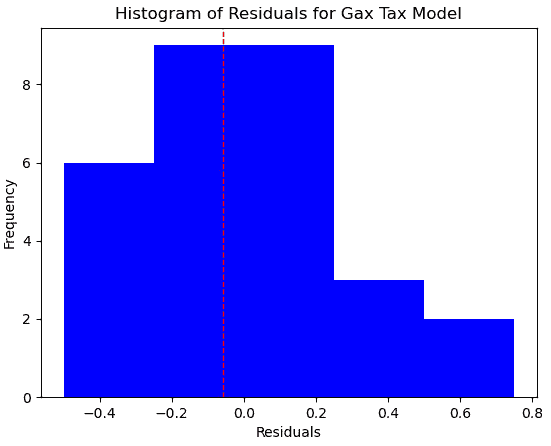

图 7.4 – 汽油税模型残差

1.  让我们也看看预测值与残差的散点图。我们的模型可能在较低范围内高估，在较高范围内低估。这与线性模型不同，线性模型在两个极端都持续高估：

    ```py
    plt.scatter(preddf.prediction, preddf.resid, color=”blue”)
    plt.axhline(0, color=’red’, linestyle=’dashed’, linewidth=1)
    plt.title(“Scatterplot of Predictions and Residuals”)
    plt.xlabel(“Predicted Gax Tax”)
    plt.ylabel(“Residuals”)
    plt.show()
    ```

这产生了以下图表：

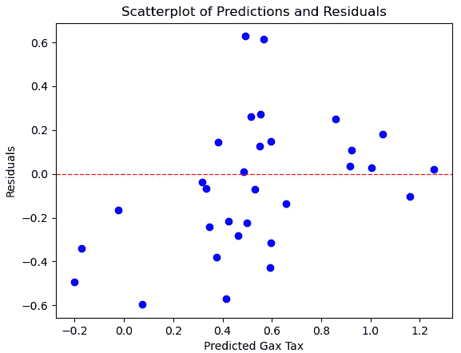

图 7.5 – 预测值与残差的散点图

1.  我们将通过在模型上执行 k 折交叉验证来结束。这些分数低于线性回归模型的分数，但接近：

    ```py
    X_train, X_test, y_train, y_test =  \
      train_test_split(features,\
      target, test_size=0.1, random_state=22)
    kf = KFold(n_splits=4, shuffle=True, random_state=0)
    scores = cross_validate(ttr, X=X_train, y=y_train,
      cv=kf, scoring=(‘r2’, ‘neg_mean_absolute_error’), n_jobs=1)
    print(“Mean Absolute Error: %.2f, R-squared: %.2f” % 
      (scores[‘test_neg_mean_absolute_error’].mean(),
      scores[‘test_r2’].mean()))
    Mean Absolute Error: -0.27, R-squared: 0.57
    ```

这给我们提供了一个模型，它并不比我们的原始模型更好，但它至少更有效地处理了特征选择过程。也有可能如果我们尝试不同的 alpha 超参数值，我们可能会得到更好的结果。为什么不试试 0.05 或 1.0 呢？我们将在接下来的两个步骤中尝试回答这个问题。

## 使用网格搜索调整超参数

确定超参数的最佳值，例如前一个例子中的 alpha 值，被称为超参数调整。scikit-learn 中用于超参数调整的一个工具是 `GridSearchCV`。CV 后缀表示交叉验证。

使用 `GridSearchCV` 非常简单。如果我们已经有了管道，就像我们在这个例子中做的那样，我们将它传递给一个 `GridSearchCV` 对象，以及一个参数字典。`GridSearchCV` 将尝试所有参数组合，并返回最佳组合。让我们在我们的 lasso 回归模型上试一试：

1.  首先，我们将实例化一个 `lasso` 对象，并创建一个包含要调整的超参数的字典。这个字典 `lasso_params` 表示我们想要尝试 0.05 和 0.9 之间的所有 alpha 值，以 0.5 的间隔。我们无法为字典键选择任何想要的名称。`regressor__lasso__alpha` 是基于管道中步骤的名称。注意，我们正在使用双下划线。单下划线将返回错误：

    ```py
    lasso = Lasso()
    lasso_params = {‘regressor__lasso__alpha’: np.arange(0.05, 1, 0.05)}
    ```

1.  现在，我们可以运行网格搜索。我们将传递管道，在这个案例中是一个 `TransformedTargetRegressor`，以及字典到 `GridSearchCV`。`best_params_` 属性表明最佳 alpha 值为 `0.05`。当我们使用该值时，我们得到一个 r-squared 值为 `0.60`：

    ```py
    gs = GridSearchCV(ttr,param_grid=lasso_params, cv=5)
    gs.fit(X_train, y_train)
    gs.best_params_
    {‘regressor__lasso__alpha’: 0.05}
    gs.best_score_
    0.6028804486340877
    ```

Lasso 回归模型在平均绝对误差和 r-squared 方面接近线性模型，但并不完全一样。Lasso 回归的一个优点是，在训练我们的模型之前，我们不需要进行单独的特征选择步骤。（回想一下，对于包装特征选择方法，模型需要在特征选择期间以及之后进行训练，正如我们在 *第五章* 中讨论的，*特征选择*。）

# 使用非线性回归

线性回归假设特征与目标之间的关系在特征的范围内是恒定的。你可能还记得，我们在本章开头讨论的简单线性回归方程为每个特征有一个斜率估计：

![图片 B17978_07_010.jpg]

在这里，*y* 是目标，每个 *x* 是一个特征，每个 β 是一个系数（或截距）。如果特征与目标之间的真实关系是非线性的，我们的模型可能表现不佳。

幸运的是，当我们无法假设特征与目标之间存在线性关系时，我们仍然可以很好地利用 OLS。我们可以使用与上一节相同的线性回归算法，但使用特征的多项式变换。这被称为多项式回归。

我们给特征添加一个幂来运行多项式回归。这给我们以下方程：

![图片 B17978_07_011.jpg]

下面的图比较了线性回归与多项式回归的预测值。多项式曲线似乎比线性回归线更好地拟合了虚构的数据点：

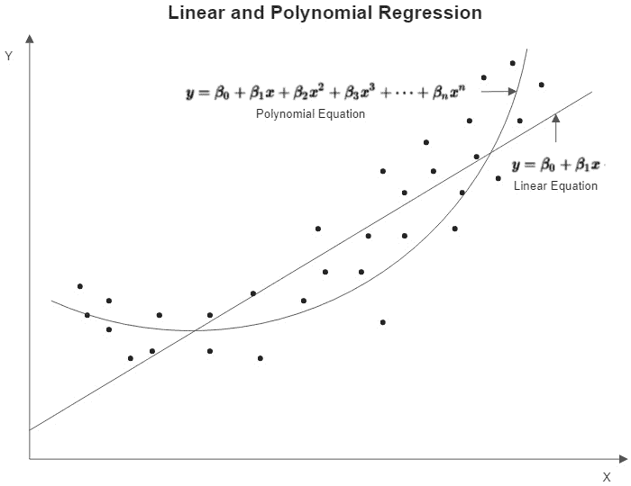

图 7.6 – 多项式方程曲线和线性方程线的示意图

在本节中，我们将对全球气象站平均年温度的线性模型和非线性模型进行实验。我们将使用纬度和海拔作为特征。首先，我们将使用多元线性回归来预测温度，然后尝试使用多项式变换的模型。按照以下步骤进行：

1.  我们将首先导入必要的库。如果你一直在本章中工作，这些库将很熟悉：

    ```py
    import pandas as pd
    from sklearn.model_selection import train_test_split
    from sklearn.preprocessing import StandardScaler, PolynomialFeatures
    from sklearn.linear_model import LinearRegression
    from sklearn.pipeline import make_pipeline
    from sklearn.model_selection import cross_validate
    from sklearn.model_selection import KFold
    from sklearn.impute import KNNImputer
    import matplotlib.pyplot as plt
    ```

1.  我们还需要导入包含我们用于识别异常值类别的模块：

    ```py
    import os
    import sys
    sys.path.append(os.getcwd() + “/helperfunctions”)
    from preprocfunc import OutlierTrans
    ```

1.  我们加载陆地温度数据，识别我们想要的特征，并生成一些描述性统计。对于海拔高度有一些缺失值，对于平均年温度有一些极端的负值。目标和特征值的范围差异很大，所以我们可能需要缩放我们的数据：

    ```py
    landtemps = pd.read_csv(“data/landtempsb2019avgs.csv”)
    landtemps.set_index(‘locationid’, inplace=True)
    feature_cols = [‘latabs’,’elevation’]
    landtemps[[‘avgtemp’] + feature_cols].\
      agg([‘count’,’min’,’median’,’max’]).T
                 count      min      median    max
    avgtemp      12,095    -60.82    10.45     33.93
    latabs       12,095     0.02     40.67     90.00
    elevation    12,088    -350.00   271.30    4,701.00
    ```

1.  接下来，我们创建训练和测试数据框：

    ```py
    X_train, X_test, y_train, y_test =  \
      train_test_split(landtemps[feature_cols],\
      landtemps[[‘avgtemp’]], test_size=0.1, random_state=0)
    ```

1.  现在，我们构建一个管道来处理我们的预处理 – 将异常值设置为缺失，对所有缺失值进行 KNN 插补，并对特征进行缩放 – 然后运行线性模型。我们进行 10 折交叉验证，得到平均 r-squared 为 0.79，平均绝对误差为-2.8：

    ```py
    lr = LinearRegression()
    knnimp = KNNImputer(n_neighbors=45)
    pipe1 = make_pipeline(OutlierTrans(3),knnimp,
      StandardScaler(), lr)
    ttr=TransformedTargetRegressor(regressor=pipe1,
      transformer=StandardScaler())
    kf = KFold(n_splits=10, shuffle=True, random_state=0)
    scores = cross_validate(ttr, X=X_train, y=y_train,
      cv=kf, scoring=(‘r2’, ‘neg_mean_absolute_error’), n_jobs=1)
    scores[‘test_r2’].mean(), scores[‘test_neg_mean_absolute_error’].mean()
    (0.7933471824738406, -2.8047627785750913)
    ```

注意，我们在识别异常值方面非常保守。我们传递了一个阈值为 3，这意味着一个值需要比四分位数范围高或低三倍以上。显然，我们通常会更多地考虑异常值的识别。在这里，我们只演示了在决定这样做是有意义之后，如何在管道中处理异常值。

1.  让我们看看预测值和残差。总体上几乎没有偏差（残差的平均值是 0），但有一些负偏斜：

    ```py
    ttr.fit(X_train, y_train)
    pred = ttr.predict(X_test)
    preddf = pd.DataFrame(pred, columns=[‘prediction’],
      index=X_test.index).join(X_test).join(y_test)
    preddf.resid.agg([‘mean’,’median’,’skew’,’kurtosis’])
    mean                 0.00
    median               0.50
    skew                -1.13
    kurtosis             3.48
    Name: resid, dtype: float64
    ```

1.  如果我们创建残差的直方图，很容易看到这种偏斜。有一些极端的负残差 – 即我们过度预测平均温度的次数：

    ```py
    plt.hist(preddf.resid, color=”blue”)
    plt.axvline(preddf.resid.mean(), color=’red’, 
      linestyle=’dashed’, linewidth=1)
    plt.title(“Histogram of Residuals for Linear Model of Temperature”)
    plt.xlabel(“Residuals”)
    plt.ylabel(“Frequency”)
    plt.show()
    ```

这会产生以下图表：

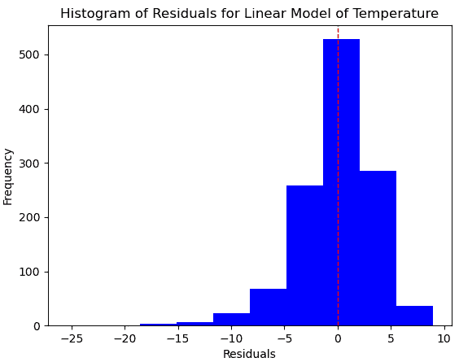

图 7.7 – 温度模型残差

1.  也可以通过绘制预测值与残差的关系图来有所帮助：

    ```py
    plt.scatter(preddf.prediction, preddf.resid, color=”blue”)
    plt.axhline(0, color=’red’, linestyle=’dashed’, linewidth=1)
    plt.title(“Scatterplot of Predictions and Residuals”)
    plt.xlabel(“Predicted Temperature”)
    plt.ylabel(“Residuals”)
    plt.xlim(-20,40)
    plt.ylim(-27,10)
    plt.show()
    ```

这会产生以下图表：

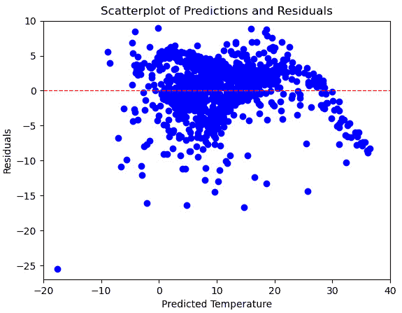

图 7.8 – 预测值与残差的散点图

我们的模型在预测大约 28 摄氏度以上的所有预测值时都会过度预测。它也可能会在预测 18 到 28 之间的值时低估。

让我们看看多项式回归是否能得到更好的结果：

1.  首先，我们将创建一个`PolynomialFeatures`对象，其`degree`为`4`，并进行拟合。我们可以通过传递原始特征名称给`get_feature_names`方法来获取变换后返回的列名。每个特征的二次、三次和四次幂值被创建，以及变量之间的交互效应（例如`latabs` * `elevation`）。在这里我们不需要运行拟合，因为那将在管道中发生。我们只是在这里做这个来了解它是如何工作的：

    ```py
    polytrans = PolynomialFeatures(degree=4, include_bias=False)
    polytrans.fit(X_train.dropna())
    featurenames = polytrans.get_feature_names(feature_cols)
    featurenames
    [‘latabs’,
     ‘elevation’,
     ‘latabs²’,
     ‘latabs elevation’,
     ‘elevation²’,
     ‘latabs³’,
     ‘latabs² elevation’,
     ‘latabs elevation²’,
     ‘elevation³’,
     ‘latabs⁴’,
     ‘latabs³ elevation’,
     ‘latabs² elevation²’,
     ‘latabs elevation³’,
     ‘elevation⁴’]
    ```

1.  接下来，我们将为多项式回归创建一个管道。这个管道基本上与线性回归相同，只是在 KNN 插补之后插入多项式变换步骤：

    ```py
    pipe2 = make_pipeline(OutlierTrans(3), knnimp,
      polytrans, StandardScaler(), lr)
    ttr2 = TransformedTargetRegressor(regressor=pipe2,\
      transformer=StandardScaler())
    ```

1.  现在，让我们基于多项式模型创建预测值和残差。与线性模型相比，残差中的偏斜度要小一些：

    ```py
    ttr2.fit(X_train, y_train)
    pred = ttr2.predict(X_test)
    preddf = pd.DataFrame(pred, columns=[‘prediction’],
      index=X_test.index).join(X_test).join(y_test)
    preddf[‘resid’] = preddf.avgtemp-preddf.prediction
    preddf.resid.agg([‘mean’,’median’,’skew’,’kurtosis’])
    mean                 0.01
    median               0.20
    skew                -0.98
    kurtosis             3.34
    Name: resid, dtype: float64
    ```

1.  我们应该看一下残差的直方图：

    ```py
    plt.hist(preddf.resid, color=”blue”)
    plt.axvline(preddf.resid.mean(), color=’red’, linestyle=’dashed’, linewidth=1)
    plt.title(“Histogram of Residuals for Temperature Model”)
    plt.xlabel(“Residuals”)
    plt.ylabel(“Frequency”)
    plt.show()
    ```

这产生了以下图表：

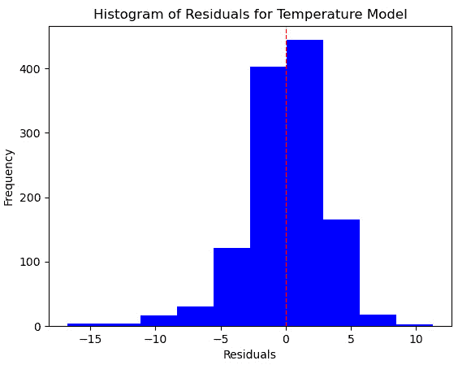

图 7.9 – 温度模型残差

1.  让我们也做一个预测值与残差的散点图。这些看起来比线性模型的残差要好一些，尤其是在预测的上限范围内：

    ```py
    plt.scatter(preddf.prediction, preddf.resid, color=”blue”)
    plt.axhline(0, color=’red’, linestyle=’dashed’, linewidth=1)
    plt.title(“Scatterplot of Predictions and Residuals”)
    plt.xlabel(“Predicted Temperature”)
    plt.ylabel(“Residuals”)
    plt.xlim(-20,40)
    plt.ylim(-27,10)
    plt.show()
    ```

这产生了以下图表：

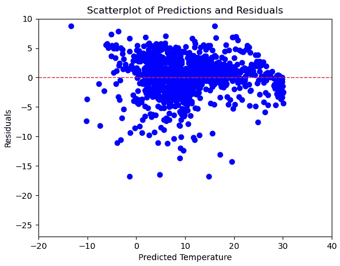

图 7.10 – 预测值与残差的散点图

1.  让我们再次进行 k 折交叉验证，并取各折的平均 r-squared 值。与线性模型相比，r-squared 和平均绝对误差都有所提高：

    ```py
    scores = cross_validate(ttr2, X=X_train, y=y_train,
      cv=kf, scoring=(‘r2’, ‘neg_mean_absolute_error’),
      n_jobs=1)
    scores[‘test_r2’].mean(), scores[‘test_neg_mean_absolute_error’].mean()
    (0.8323274036342788, -2.4035803290965507)
    ```

多项式变换提高了我们的整体结果，尤其是在预测变量的某些范围内。高温下的残差明显较低。当我们的残差表明特征和目标之间可能存在非线性关系时，尝试多项式变换通常是一个好主意。

# 梯度下降回归

梯度下降可以是有序最小二乘法优化线性模型损失函数的一个很好的替代方案。这在处理非常大的数据集时尤其正确。在本节中，我们将使用梯度下降和陆地温度数据集，主要为了演示如何使用它，并给我们另一个机会探索穷举网格搜索。让我们开始吧：

1.  首先，我们将加载我们迄今为止一直在使用的相同库，以及来自 scikit-learn 的随机梯度下降回归器：

    ```py
    import pandas as pd
    import numpy as np
    from sklearn.model_selection import train_test_split
    from sklearn.preprocessing import StandardScaler
    from sklearn.linear_model import SGDRegressor
    from sklearn.compose import TransformedTargetRegressor
    from sklearn.pipeline import make_pipeline
    from sklearn.impute import KNNImputer
    from sklearn.model_selection import GridSearchCV
    import os
    import sys
    sys.path.append(os.getcwd() + “/helperfunctions”)
    from preprocfunc import OutlierTrans
    ```

1.  然后，我们将再次加载陆地温度数据集并创建训练和测试数据框：

    ```py
    landtemps = pd.read_csv(“data/landtempsb2019avgs.csv”)
    landtemps.set_index(‘locationid’, inplace=True)
    feature_cols = [‘latabs’,’elevation’]
    X_train, X_test, y_train, y_test =  \
      train_test_split(landtemps[feature_cols],\
      landtemps[[‘avgtemp’]], test_size=0.1, random_state=0)
    ```

1.  接下来，我们将设置一个管道来处理异常值，在运行梯度下降之前填充缺失值并缩放数据：

    ```py
    knnimp = KNNImputer(n_neighbors=45)
    sgdr = SGDRegressor()
    pipe1 = make_pipeline(OutlierTrans(3),knnimp,StandardScaler(), sgdr)
    ttr=TransformedTargetRegressor(regressor=pipe1,transformer=StandardScaler())
    ```

1.  现在，我们需要创建一个字典来指示我们想要调整的超参数和要尝试的值。我们想要尝试 alpha、损失函数、epsilon 和惩罚的值。我们将为字典中的每个键添加前缀`regressor__sgdregressor__`，因为随机梯度下降回归器可以在管道中找到。

`alpha`参数决定了惩罚的大小。默认值是`0.0001`。我们可以选择 L1、L2 或弹性网络正则化。我们将选择`huber`和`epsilon_insensitive`作为要包含在搜索中的损失函数。默认损失函数是`squared_error`，但这只会给我们普通的有序最小二乘法。

`huber`损失函数对异常值不如 OLS 敏感。它的敏感度取决于我们指定的 epsilon 的值。使用`epsilon_insensitive`损失函数，给定范围（epsilon）内的错误不会受到惩罚（我们将在下一章构建具有 epsilon-insensitive 管的模型，我们将检查支持向量回归）：

```py
sgdr_params = {
 ‘regressor__sgdregressor__alpha’: 10.0 ** -np.arange(1, 7),
 ‘regressor__sgdregressor__loss’: [‘huber’,’epsilon_insensitive’],
 ‘regressor__sgdregressor__penalty’: [‘l2’, ‘l1’, ‘elasticnet’],
 ‘regressor__sgdregressor__epsilon’: np.arange(0.1, 1.6, 0.1)
}
```

1.  现在，我们已经准备好运行一个全面的网格搜索。最佳参数是 alpha 为`0.001`，epsilon 为`1.3`，损失函数为`huber`，正则化为弹性网络：

    ```py
    gs = GridSearchCV(ttr,param_grid=sgdr_params, cv=5, scoring=”r2”)
    gs.fit(X_train, y_train)
    gs.best_params_
    {‘regressor__sgdregressor__alpha’: 0.001,
     ‘regressor__sgdregressor__epsilon’: 1.3000000000000003,
     ‘regressor__sgdregressor__loss’: ‘huber’,
     ‘regressor__sgdregressor__penalty’: ‘elasticnet’}
    gs.best_score_
    0.7941051735846133
    ```

1.  我通常发现查看一些其他网格搜索迭代的超参数很有帮助。具有弹性网络或 L2 正则化的 Huber 损失模型表现最佳：

    ```py
    Results = \
      pd.DataFrame(gs.cv_results_[‘mean_test_score’], \
        columns=[‘meanscore’]).\
      join(pd.DataFrame(gs.cv_results_[‘params’])).\
      sort_values([‘meanscore’], ascending=False)
    results.head(3).T
                                             254      252      534
    meanscore                           0.794105 0.794011 0.794009
    regressor__sgdregressor__alpha      0.001000 0.001000 0.000001
    regressor__sgdregressor__epsilon    1.300000 1.300000 1.500000
    regressor__sgdregressor__loss          huber    huber    huber
    regressor__sgdregressor__penalty  elasticnet       l2       l2
    ```

随机梯度下降是一种通用的优化方法，可以应用于许多机器学习问题。它通常非常高效，正如我们在这里所看到的。我们能够相当快地运行一个关于惩罚、惩罚大小、epsilon 和损失函数的全面网格搜索。

# 摘要

本章使我们能够探索一个非常著名的机器学习算法：线性回归。我们考察了使特征空间成为线性模型良好候选者的特性。我们还探讨了在必要时如何通过正则化和变换来改进线性模型。然后，我们研究了随机梯度下降作为 OLS 优化的替代方案。我们还学习了如何将我们自己的类添加到管道中以及如何进行超参数调整。

在下一章中，我们将探索支持向量回归。
