# 第十章：*第十章*：逻辑回归

在本章和接下来的几章中，我们将探讨分类模型。这些模型涉及具有两个或多个类别值的目标，例如学生是否会通过一门课程，或者顾客在只有鸡肉、牛肉和豆腐三种选择的情况下会选择哪一种。对于这类分类问题，存在几种机器学习算法。在本章中，我们将查看其中一些最受欢迎的算法。

逻辑回归已经用于构建具有二元目标的模型数十年了。传统上，它被用来生成独立变量或变量对二元结果概率影响估计。由于我们的重点是预测，而不是每个特征的影响，我们还将探讨正则化技术，如 lasso 回归。这些技术可以提高我们的分类预测准确性。我们还将检查预测多类别目标（当存在超过两个可能的目标值时）的策略。

在本章中，我们将涵盖以下主题：

+   逻辑回归的关键概念

+   使用逻辑回归进行二元分类

+   使用逻辑回归进行正则化

+   多项式逻辑回归

# 技术要求

在本章中，我们将坚持使用在大多数 Python 科学发行版中可用的库：pandas、NumPy 和 scikit-learn。本章中的所有代码都可以在 scikit-learn 版本 0.24.2 和 1.0.2 上正常运行。

# 逻辑回归的关键概念

如果你熟悉线性回归，或者阅读了本书的*第七章*，*线性回归模型*，你可能会预见到我们将在本章讨论的一些问题——正则化、回归器的线性关系和正态分布的残差。如果你过去构建过监督机器学习模型，或者阅读过本书的最后一章，那么你很可能预见到我们将花一些时间讨论偏差-方差权衡以及它如何影响我们选择模型。

我记得 35 年前在一门大学课程中第一次接触到逻辑回归。在本科教科书中，它通常几乎被呈现为线性回归的一个特例；也就是说，具有二元因变量的线性回归，并伴随一些变换以保持预测值在 0 到 1 之间。

它确实与数值目标变量的线性回归有许多相似之处。逻辑回归相对容易训练和解释。线性回归和逻辑回归的优化技术都是高效的，可以生成低偏差的预测器。

同样地，与线性回归一样，逻辑回归也是基于分配给每个特征的权重来预测目标。但为了将预测概率约束在 0 到 1 之间，我们使用 sigmoid 函数。这个函数将任何值映射到 0 到 1 之间的值：

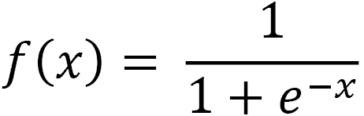

当*x*趋近于无穷大时，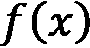趋近于 1。当*x*趋近于负无穷大时，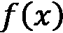趋近于 0。

下面的图示说明了 sigmoid 函数：

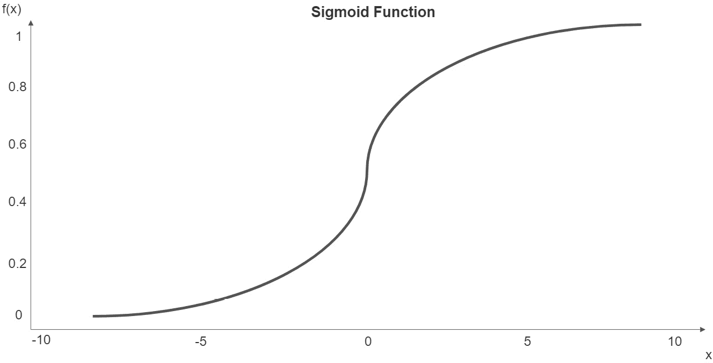

图 10.1 – Sigmoid 函数

我们可以将线性回归的熟悉方程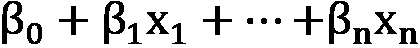代入 sigmoid 函数来预测类成员的概率：

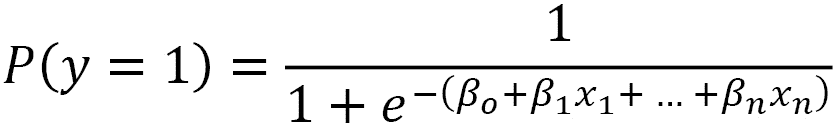

在这里，是二元情况下类成员的预测概率。系数（β）可以转换为优势比以进行解释，如下所示：

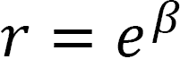

在这里，*r*是优势比，β是系数。特征值增加 1 个单位会乘以类成员的优势比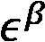。同样，对于二元特征，一个真值有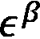倍类成员的优势比，而一个假值也有相同特征的优势比，其他条件相同。

逻辑回归作为分类问题的算法具有几个优点。特征可以是二元的、分类的或数值的，且不需要服从正态分布。目标变量可以具有超过两个的可能值，正如我们稍后将要讨论的，它可以是无序的或有序的。另一个关键优点是，特征与目标之间的关系不假设是线性的。

这里的命名有点令人困惑。为什么我们使用回归算法来解决分类问题？好吧，逻辑回归预测类成员的概率。我们应用决策规则来预测这些概率。对于二元目标，默认阈值通常是 0.5；预测概率大于或等于 0.5 的实例被赋予正类或 1 或 True；那些小于 0.5 的实例被分配 0 或 False。

## 逻辑回归的扩展

在本章中，我们将考虑逻辑回归的两个关键扩展。我们将探讨多类模型——即目标值超过两个的模型。我们还将检查逻辑模型的正则化以改善（减少）方差。

在构建多类模型时，**多项式逻辑回归**（**MLR**）是一个流行的选择。使用 MLR，预测概率分布是一个多项式概率分布。我们可以用 softmax 函数替换我们用于二元分类器的方程：

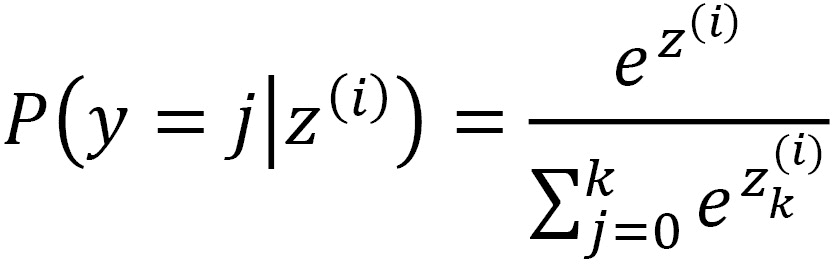

在这里，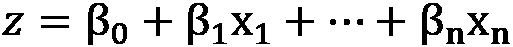。这为每个类别标签*j*计算一个概率，其中*k*是类别的数量。

当我们拥有超过两个类别时，**一对余**（**OVR**）逻辑回归是多项式逻辑回归的一个替代方案。这种逻辑回归的扩展将多类别问题转化为二分类问题，估计类别成员资格相对于所有其他类别的成员资格的概率。这里的关键假设是每个类别的成员资格是独立的。在本章的例子中，我们将使用 MLR。它相较于 OVR 的一个优点是预测概率更加可靠。

如前所述，逻辑回归与线性回归有一些相同的挑战，包括我们的预测的低偏差伴随着高方差。当几个特征高度相关时，这更有可能成为一个问题。幸运的是，我们可以通过正则化来解决这个问题，就像我们在*第七章*，“线性回归模型”中看到的那样。

正则化会给损失函数添加一个惩罚项。我们仍然寻求最小化误差，但同时也约束参数的大小。**L1**正则化，也称为 lasso 回归，惩罚权重（或系数）的绝对值：

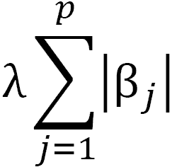

在这里，*p*是特征的数量，λ决定了正则化的强度。**L2**正则化，也称为岭回归，惩罚权重（或系数）的平方值：

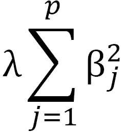

L1 和 L2 正则化都将权重推向 0，尽管 L1 正则化更有可能导致稀疏模型。在 scikit-learn 中，我们使用*C*参数来调整λ的值，其中*C*只是λ的倒数：

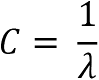

我们可以通过弹性网络回归在 L1 和 L2 之间取得平衡。在弹性网络回归中，我们调整 L1 比率。0.5 的值表示 L1 和 L2 同等使用。我们可以使用超参数调整来选择 L1 比率的最佳值。

正则化可能导致具有更低方差模型的产生，当我们对预测的关注超过对系数的关注时，这是一个很好的权衡。

在构建具有正则化的模型之前，我们将构建一个相当简单的具有二元目标的逻辑模型。我们还将花大量时间评估该模型。这将是本书中我们将构建的第一个分类模型，并且模型评估对于这些模型与回归模型看起来非常不同。

# 逻辑回归的二分类

当目标为二元时，逻辑回归常用于建模健康结果，例如，一个人是否患有疾病。在本节中，我们将通过一个例子来展示这一点。我们将构建一个模型，根据个人的吸烟和饮酒习惯、健康特征（包括 BMI、哮喘、糖尿病和皮肤癌）以及年龄等个人特征来预测一个人是否会患有心脏病。

注意

在本章中，我们将专门使用可在[`www.kaggle.com/datasets/kamilpytlak/personal-key-indicators-of-heart-disease`](https://www.kaggle.com/datasets/kamilpytlak/personal-key-indicators-of-heart-disease)公开下载的心脏病数据。这个数据集来源于 2020 年美国疾病控制与预防中心超过 40 万个人的数据。数据列包括受访者是否曾经患有心脏病、体重指数、是否吸烟、大量饮酒、年龄、糖尿病和肾病。在本节中，我们将使用 30,000 个个体样本以加快处理速度，但完整的数据集可以在本书 GitHub 仓库的同一文件夹中找到。

在本章中，我们将比以前章节进行更多的预处理。我们将把大部分工作整合到我们的管道中。这将使将来重用此代码更容易，并减少数据泄露的可能性。请按照以下步骤操作：

1.  我们将首先导入我们在过去几章中使用的相同库。我们还将导入 `LogisticRegression` 和 `metrics` 模块。我们将使用 scikit-learn 的 `metrics` 模块来评估本书这一部分中的每个分类模型。除了 `matplotlib` 用于可视化外，我们还将使用 `seaborn`：

    ```py
    import pandas as pd
    import numpy as np
    from sklearn.model_selection import train_test_split
    from sklearn.preprocessing import StandardScaler
    from sklearn.preprocessing import OneHotEncoder
    from sklearn.pipeline import make_pipeline
    from sklearn.impute import SimpleImputer
    from sklearn.compose import ColumnTransformer
    from sklearn.model_selection import StratifiedKFold
    from sklearn.feature_selection import RFECV
    from sklearn.linear_model import LogisticRegression
    import sklearn.metrics as skmet
    import matplotlib.pyplot as plt
    import seaborn as sns
    ```

1.  我们还需要几个自定义类来处理预处理。我们已经看到了 `OutlierTrans` 类。在这里，我们添加了两个新的类——`MakeOrdinal` 和 `ReplaceVals`：

    ```py
    import os
    import sys
    sys.path.append(os.getcwd() + "/helperfunctions")
    from preprocfunc import OutlierTrans,\
      MakeOrdinal, ReplaceVals
    ```

`MakeOrdinal` 类接受一个字符特征并根据字母数字排序分配数值。例如，一个有三个可能值（不好、一般、好）的特征将被转换为一个序数特征，其值分别为 0、1 和 2。

请记住，scikit-learn 管道转换器必须具有 `fit` 和 `transform` 方法，并且必须继承自 `BaseEstimator`。它们通常也继承自 `TransformerMixin`，尽管还有其他选项。

`MakeOrdinal` 类中的所有操作都在 `transform` 方法中完成。我们遍历通过列转换器传递给它的所有列。对于每一列，我们找到所有唯一的值并按字母数字顺序排序，将唯一的值存储在我们命名为 `cats` 的 NumPy 数组中。然后，我们使用 lambda 函数和 NumPy 的 `where` 方法来找到与每个特征值关联的 `cats` 的索引：

```py
class MakeOrdinal(BaseEstimator,TransformerMixin):
  def fit(self,X,y=None):
    return self

  def transform(self,X,y=None):
    Xnew = X.copy()
    for col in Xnew.columns:
      cats = np.sort(Xnew[col].unique())
      Xnew[col] = Xnew.\
        apply(lambda x: int(np.where(cats==\
        x[col])[0]), axis=1)
    return Xnew.values
```

当字母数字顺序与一个有意义的顺序相匹配时，`MakeOrdinal` 将正常工作，就像前面的例子一样。当这不是真的时，我们可以使用 `ReplaceVals` 来分配适当的序数值。这个类根据传递给它的字典替换任何特征中的值。

我们本可以使用 pandas 的 `replace` 方法而不将其放入管道中，但这样更容易将我们的重新编码与其他管道步骤（如特征缩放）集成：

```py
class ReplaceVals(BaseEstimator,TransformerMixin):
  def __init__(self,repdict):
    self.repdict = repdict
  def fit(self,X,y=None):
    return self

  def transform(self,X,y=None):
    Xnew = X.copy().replace(self.repdict)
return Xnew.values
```

如果你现在不完全理解我们将如何使用这些类，请不要担心。当我们将它们添加到列转换中时，一切都会变得清晰。

1.  接下来，我们将加载心脏病数据并查看几行。一些字符串特征在概念上是二元的，例如`alcoholdrinkingheavy`，当一个人是重度饮酒者时为`Yes`，否则为`No`。在运行模型之前，我们需要对这些特征进行编码。

`agecategory`特征是表示年龄区间的字符数据。我们需要将这个特征转换为数值：

```py
healthinfo = pd.read_csv("data/healthinfo.csv")
healthinfo.set_index("personid", inplace=True)
healthinfo.head(2).T
personid                    299391       252786
heartdisease                Yes          No
bmi                         28.48        25.24
smoking                     Yes          Yes
alcoholdrinkingheavy        No           No
stroke                      No           No
physicalhealthbaddays       7            0
mentalhealthbaddays         0            2
walkingdifficult            No           No
gender                      Male         Female
agecategory                 70-74        65-69
ethnicity                   White        White
diabetic    No, borderline diabetes      No
physicalactivity            Yes          Yes
genhealth                   Good         Very good
sleeptimenightly            8            8
asthma                      No           No
kidneydisease               No           No
skincancer                  No           Yes
```

1.  让我们看看 DataFrame 的大小以及有多少缺失值。有 30,000 个实例，但 18 个数据列中没有任何缺失值。这太好了。当我们构建管道时，我们不必担心这一点：

    ```py
    healthinfo.shape
    (30000, 18)
    healthinfo.isnull().sum()
    heartdisease                0
    bmi                         0
    smoking                     0
    alcoholdrinkingheavy        0
    stroke                      0
    physicalhealthbaddays       0
    mentalhealthbaddays         0
    walkingdifficult            0
    gender                      0
    agecategory                 0
    ethnicity                   0
    diabetic                    0
    physicalactivity            0
    genhealth                   0
    sleeptimenightly            0
    asthma                      0
    kidneydisease               0
    skincancer                  0
    dtype: int64
    ```

1.  让我们将`heartdisease`变量，也就是我们的目标变量，转换为`0`和`1`变量。这将减少我们以后需要担心的事情。立即要注意的一件事是，目标变量的值非常不平衡。我们观察结果中不到 10%的人患有心脏病。这当然是好消息，但也给我们的建模带来了一些挑战，我们需要处理这些挑战：

    ```py
    healthinfo.heartdisease.value_counts()
    No        27467
    Yes       2533
    Name: heartdisease, dtype: int64
    healthinfo['heartdisease'] = \
      np.where(healthinfo.heartdisease=='No',0,1).\
         astype('int')
    healthinfo.heartdisease.value_counts()
    0        27467
    1        2533
    Name: heartdisease, dtype: int64
    ```

1.  我们应该根据我们将要对它们进行的预处理来组织我们的特征。我们将对数值特征进行缩放，并对分类特征进行独热编码。我们希望将当前为字符串的`agecategory`和`genhealth`特征转换为有序特征。

我们需要对`diabetic`特征进行特定的清理。有些人表示没有，但他们处于边缘状态。为了我们的目的，我们将它们视为`no`。有些人怀孕期间只有糖尿病。我们将它们视为`yes`。对于`genhealth`和`diabetic`，我们将设置一个字典，以指示特征值应该如何替换。我们将在管道的`ReplaceVals`转换器中使用该字典：

```py
num_cols = ['bmi','physicalhealthbaddays',
   'mentalhealthbaddays','sleeptimenightly']
binary_cols = ['smoking','alcoholdrinkingheavy',
  'stroke','walkingdifficult','physicalactivity',
  'asthma','kidneydisease','skincancer']
cat_cols = ['gender','ethnicity']
spec_cols1 = ['agecategory']
spec_cols2 = ['genhealth']
spec_cols3 = ['diabetic']
rep_dict = {
  'genhealth': {'Poor':0,'Fair':1,'Good':2,
    'Very good':3,'Excellent':4},
  'diabetic': {'No':0,
    'No, borderline diabetes':0,'Yes':1,
    'Yes (during pregnancy)':1}           
}
```

1.  我们应该查看一些二元特征以及其他分类特征的频率。很大比例的个人（42%）报告说他们是吸烟者。14%的人报告说他们走路有困难：

    ```py
    healthinfo[binary_cols].\
      apply(pd.value_counts, normalize=True).T
                            No       Yes
    smoking                 0.58     0.42
    alcoholdrinkingheavy    0.93     0.07
    stroke                  0.96     0.04
    walkingdifficult        0.86     0.14
    physicalactivity        0.23     0.77
    asthma                  0.87     0.13
    kidneydisease           0.96     0.04
    skincancer              0.91     0.09
    ```

1.  让我们也看看其他分类特征的频率。男性和女性的数量几乎相等。大多数人报告他们的健康状况非常好或非常好：

    ```py
    for col in healthinfo[cat_cols + 
    ['genhealth','diabetic']].columns:
      print(col, "----------------------",
      healthinfo[col].value_counts(normalize=True).\
          sort_index(), sep="\n", end="\n\n")
    ```

这会产生以下输出：

```py
gender
----------------------
Female   0.52
Male     0.48
Name: gender, dtype: float64
ethnicity
----------------------
American Indian/Alaskan Native   0.02
Asian                            0.03
Black                            0.07
Hispanic                         0.09
Other                            0.03
White                            0.77
Name: ethnicity, dtype: float64
genhealth
----------------------
Excellent   0.21
Fair        0.11
Good        0.29
Poor        0.04
Very good   0.36
Name: genhealth, dtype: float64
diabetic
----------------------
No                        0.84
No, borderline diabetes   0.02
Yes                       0.13
Yes (during pregnancy)    0.01
Name: diabetic, dtype: float64
```

1.  我们还应该查看一些数值特征的描述性统计。对于不良的身体健康和心理健康天数的中位数都是 0；也就是说，至少一半的观察结果报告没有不良的身体健康天数，至少一半报告没有不良的心理健康天数：

    ```py
    healthinfo[num_cols].\
      agg(['count','min','median','max']).T
                           count    min    median  max
    bmi                    30,000   12     27      92
    physicalhealthbaddays  30,000   0      0       30
    mentalhealthbaddays    30,000   0      0       30
    sleeptimenightly       30,000   1      7       24
    ```

我们需要进行一些缩放。我们还需要对分类特征进行编码。数值特征也有一些极端值。`sleeptimenightly`的值为 24 似乎不太可能！处理它们可能是个好主意。

1.  现在，我们已经准备好构建我们的流水线。让我们创建训练和测试的 DataFrame：

    ```py
    X_train, X_test, y_train, y_test =  \
      train_test_split(healthinfo[num_cols + 
        binary_cols + cat_cols + spec_cols1 +
        spec_cols2 + spec_cols3],\
      healthinfo[['heartdisease']], test_size=0.2,
        random_state=0)
    ```

1.  接下来，我们将设置列转换。我们将创建一个 one-hot 编码器实例，我们将使用它来处理所有分类特征。对于数值列，我们将使用`OutlierTrans`对象去除极端值，然后填充中位数。

我们将使用`MakeOrdinal`转换器将`agecategory`特征转换为有序特征，并使用`ReplaceVals`转换器对`genhealth`和`diabetic`特征进行编码。

我们将在下一步将列转换添加到我们的流水线中：

```py
ohe = OneHotEncoder(drop='first', sparse=False)
standtrans = make_pipeline(OutlierTrans(3),
  SimpleImputer(strategy="median"),
  StandardScaler())
spectrans1 = make_pipeline(MakeOrdinal(),
  StandardScaler())
spectrans2 = make_pipeline(ReplaceVals(rep_dict),
  StandardScaler())
spectrans3 = make_pipeline(ReplaceVals(rep_dict))
bintrans = make_pipeline(ohe)
cattrans = make_pipeline(ohe)
coltrans = ColumnTransformer(
  transformers=[
    ("stand", standtrans, num_cols),
    ("spec1", spectrans1, spec_cols1),
    ("spec2", spectrans2, spec_cols2),
    ("spec3", spectrans3, spec_cols3),
    ("bin", bintrans, binary_cols),
    ("cat", cattrans, cat_cols),
  ]
)
```

1.  现在，我们已经准备好设置和调整我们的流水线。首先，我们将实例化逻辑回归和分层 k 折对象，我们将使用递归特征消除。回想一下，递归特征消除需要一个估计器。我们使用分层 k 折来确保每个折叠中目标值的分布大致相同。

现在，我们必须为我们的模型创建另一个逻辑回归实例。我们将`class_weight`参数设置为`balanced`。这应该会提高模型处理类别不平衡的能力。然后，我们将列转换、递归特征消除和逻辑回归实例添加到我们的流水线中，然后对其进行调整：

```py
lrsel = LogisticRegression(random_state=1, 
  max_iter=1000)
kf = StratifiedKFold(n_splits=5, shuffle=True)
rfecv = RFECV(estimator=lrsel, cv=kf)
lr = LogisticRegression(random_state=1,
  class_weight='balanced', max_iter=1000)
pipe1 = make_pipeline(coltrans, rfecv, lr)
pipe1.fit(X_train, y_train.values.ravel())
```

1.  在调整后，我们需要做一些工作来恢复流水线中的列名。我们可以使用`bin`转换器的 one-hot 编码器的`get_feature_names`方法和`cat`转换器的`get_feature_names`方法。这为我们提供了编码后的二元和分类特征的列名。数值特征的名称保持不变。我们将在后面使用这些特征名：

    ```py
    new_binary_cols = \
      pipe1.named_steps['columntransformer'].\
      named_transformers_['bin'].\
      named_steps['onehotencoder'].\
      get_feature_names(binary_cols)
    new_cat_cols = \
      pipe1.named_steps['columntransformer'].\
      named_transformers_['cat'].\
      named_steps['onehotencoder'].\
      get_feature_names(cat_cols)
    new_cols = np.concatenate((np.array(num_cols +
      spec_cols1 + spec_cols2 + spec_cols3),
      new_binary_cols, new_cat_cols))
    new_cols
    array(['bmi', 'physicalhealthbaddays',
           'mentalhealthbaddays', 'sleeptimenightly',
           'agecategory', 'genhealth', 'diabetic',
           'smoking_Yes', 'alcoholdrinkingheavy_Yes',
           'stroke_Yes', 'walkingdifficult_Yes',
           'physicalactivity_Yes', 'asthma_Yes',
           'kidneydisease_Yes', 'skincancer_Yes',
           'gender_Male', 'ethnicity_Asian',
           'ethnicity_Black', 'ethnicity_Hispanic',
           'ethnicity_Other', 'ethnicity_White'],
          dtype=object)
    ```

1.  现在，让我们看看递归特征消除的结果。我们可以使用`rfecv`对象的`ranking_`属性来获取每个特征的排名。那些排名为*1*的特征将被选入我们的模型。

如果我们使用`rfecv`对象的`get_support`方法或`support_`属性代替`ranking_`属性，我们只会得到那些将在我们的模型中使用的特点——即那些排名为 1 的特点。我们将在下一步做这个：

```py
rankinglabs = \
 np.column_stack((pipe1.named_steps['rfecv'].ranking_,
 new_cols))
pd.DataFrame(rankinglabs,
 columns=['rank','feature']).\
 sort_values(['rank','feature']).\
 set_index("rank")
                       feature
rank                          
1                  agecategory
1     alcoholdrinkingheavy_Yes
1                   asthma_Yes
1                     diabetic
1              ethnicity_Asian
1              ethnicity_Other
1              ethnicity_White
1                  gender_Male
1                    genhealth
1            kidneydisease_Yes
1                  smoking_Yes
1                   stroke_Yes
1         walkingdifficult_Yes
2           ethnicity_Hispanic
3               skincancer_Yes
4                          bmi
5        physicalhealthbaddays
6             sleeptimenightly
7          mentalhealthbaddays
8         physicalactivity_Yes
9              ethnicity_Black
```

1.  我们可以从逻辑回归的系数中获取优势比。回想一下，优势比是指数化的系数。有 13 个系数，这是有意义的，因为我们之前学习到有 13 个特征得到了 1 的排名。

我们将使用`rfecv`步骤的`get_support`方法来获取所选特征的名称，并创建一个包含这些名称和优势比（`oddswithlabs`）的 NumPy 数组。然后我们创建一个 pandas DataFrame，并按优势比降序排序。

毫不奇怪，那些曾经中风的人和老年人患心脏病的可能性要大得多。如果个人曾经中风，他们在其他条件相同的情况下患心脏病的几率是三倍。另一方面，随着年龄类别的增加，患心脏病的几率增加 2.88 倍。另一方面，随着总体健康状况的提高，患心脏病的几率大约减少一半（57%）；比如说，从“一般”到“良好”。令人惊讶的是，在控制其他条件的情况下，大量饮酒与心脏病几率降低有关：

```py
oddsratios = np.exp(pipe1.\
  named_steps['logisticregression'].coef_)
oddsratios.shape
(1, 13)
selcols = new_cols[pipe1.\
  named_steps['rfecv'].get_support()]
oddswithlabs = np.column_stack((oddsratios.\
  ravel(), selcols))
pd.DataFrame(oddswithlabs, 
  columns=['odds','feature']).\
  sort_values(['odds'], ascending=False).\
  set_index('odds')
                        feature
odds                          
3.01                stroke_Yes
2.88               agecategory
2.12               gender_Male
1.97         kidneydisease_Yes
1.75                  diabetic
1.55               smoking_Yes
1.52                asthma_Yes
1.30      walkingdifficult_Yes
1.27           ethnicity_Other
1.22           ethnicity_White
0.72           ethnicity_Asian
0.61  alcoholdrinkingheavy_Yes
0.57                 genhealth
```

现在我们已经拟合了逻辑回归模型，我们准备对其进行评估。在下一节中，我们将花时间探讨各种性能指标，包括准确率和灵敏度。我们将使用我们在*第六章*，“准备模型评估”中介绍的一些概念。

## 评估逻辑回归模型

一个分类模型性能的最直观的衡量标准是其准确率——也就是说，我们的预测有多正确。然而，在某些情况下，我们可能至少和准确率一样关心灵敏度——即我们正确预测的阳性案例的百分比；我们甚至可能愿意牺牲一点准确率来提高灵敏度。疾病预测模型通常属于这一类。但是，每当存在类别不平衡时，准确率和灵敏度等指标可能会给我们提供关于模型性能的非常不同的估计。

除了关注准确率或灵敏度之外，我们还可能担心我们的模型的**特异性**或**精确度**。我们可能希望有一个模型能够以高可靠性识别出负面案例，即使这意味着它不能很好地识别正面案例。特异性是模型识别出的所有负面案例所占的百分比。

精确度，即预测为正面的案例中实际为正面的比例，是另一个重要的衡量指标。对于某些应用来说，限制误报非常重要，即使这意味着我们必须容忍较低的灵敏度。一个使用图像识别来识别坏苹果的苹果种植者可能更倾向于选择一个高精确度的模型，而不是一个更灵敏的模型，不希望不必要地丢弃苹果。

通过查看混淆矩阵可以使这一点更加清晰：

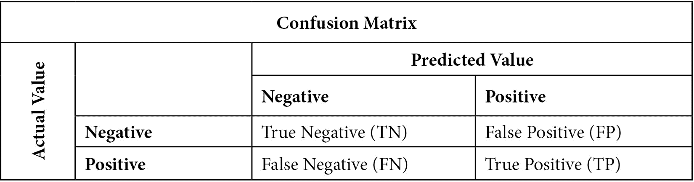

图 10.2 – 二元目标按预测值预测的实际值混淆矩阵

混淆矩阵帮助我们理解准确率、灵敏度、特异性和精确度。准确率是我们预测正确的观察值的百分比。这可以更精确地表述如下：

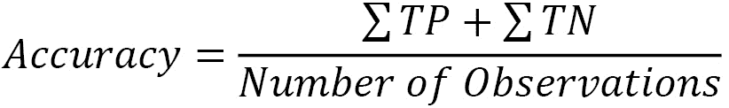

敏感性是指我们正确预测正值的次数除以正值的总数。再次查看混淆矩阵可能会有所帮助，以确认实际正值可以是预测正值（TP）或预测负值（FN）。敏感性也被称为**召回率**或**真正阳性率**：

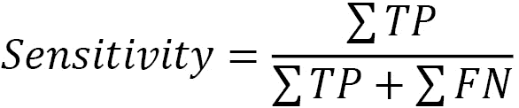

特异性是指我们正确预测负值的次数（TN）除以实际负值总数（TN + FP）。特异性也被称为**真正阴性率**：

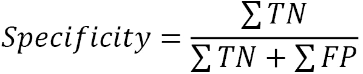

精确度是指我们正确预测正值的次数（TP）除以预测的正值总数：

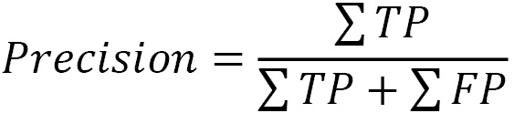

我们在*第六章*中更详细地介绍了这些概念，*准备模型评估*。在本节中，我们将检查心脏病逻辑回归模型的准确性、敏感性、特异性和精确度：

1.  我们可以使用上一节中拟合的管道的`predict`方法来从我们的逻辑回归中生成预测。然后，我们可以生成一个混淆矩阵：

    ```py
    pred = pipe1.predict(X_test)
    cm = skmet.confusion_matrix(y_test, pred)
    cmplot = skmet.ConfusionMatrixDisplay(confusion_matrix=cm, display_labels=['Negative', 'Positive'])
    cmplot.plot()
    cmplot.ax_.set(title='Heart Disease Prediction Confusion Matrix', 
      xlabel='Predicted Value', ylabel='Actual Value')
    ```

这产生了以下图表：


图 10.3 – 心脏病预测混淆矩阵

这里首先要注意的是，大部分动作都在左上角，我们在测试数据中正确预测了实际负值。这将大大有助于我们的准确性。尽管如此，我们还是有相当数量的假阳性。当没有心脏病时，我们预测心脏病 1,430 次（在 5,506 个负实例中）。我们似乎在识别正性心脏病实例方面做得还不错，正确分类了 392 个实例（在 494 个正实例中）。

1.  让我们计算准确性、敏感性、特异性和精确度。总体准确性并不高，为 74%。敏感性相当不错，为 79%。（当然，敏感性的好坏取决于领域和判断。对于像心脏病这样的领域，我们可能希望它更高。）这可以在以下代码中看到：

    ```py
    tn, fp, fn, tp = skmet.confusion_matrix(y_test.values.ravel(), pred).ravel()
    tn, fp, fn, tp
    (4076, 1430, 102, 392)
    accuracy = (tp + tn) / pred.shape[0]
    accuracy
    0.7446666666666667
    sensitivity = tp / (tp + fn)
    sensitivity
    0.7935222672064778
    specificity = tn / (tn+fp)
    specificity
    0.7402833272793317
    precision = tp / (tp + fp)
    precision
    0.21514818880351264
    ```

1.  我们可以使用`metrics`模块以更直接的方式来进行这些计算（我在上一步中选择了更迂回的方法来展示计算过程）：

    ```py
    print("accuracy: %.2f, sensitivity: %.2f, specificity: %.2f, precision: %.2f"  %
      (skmet.accuracy_score(y_test.values.ravel(), pred),
      skmet.recall_score(y_test.values.ravel(), pred),
      skmet.recall_score(y_test.values.ravel(), pred,
      pos_label=0),
      skmet.precision_score(y_test.values.ravel(), pred)))
    accuracy: 0.74, sensitivity: 0.79, specificity: 0.74, precision: 0.22
    ```

我们模型的最大问题是精确度非常低——即 22%。这是由于大量的假阳性。我们的模型预测正性的大多数情况下都是错误的。

除了我们已经计算出的四个指标之外，获取假阳性率也可能很有帮助。假阳性率是指我们的模型在实际值为负时预测为正的倾向：

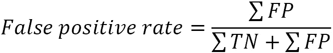

1.  让我们计算假阳性率：

    ```py
    falsepositiverate = fp / (tn + fp)
    falsepositiverate
    0.25971667272066834
    ```

因此，26%的时间，当一个人没有心脏病时，我们预测他有心脏病。虽然我们当然希望限制假阳性的数量，但这通常意味着牺牲一些敏感性。我们将在本节后面演示为什么这是真的。

1.  我们应该仔细查看模型生成的预测概率。在这里，正类预测的阈值是 0.5，这在逻辑回归中通常是默认值。（回想一下，逻辑回归预测的是类成员的概率。我们需要一个伴随的决策规则，比如 0.5 阈值，来预测类别。）这可以在以下代码中看到：

    ```py
    pred_probs = pipe1.predict_proba(X_test)[:, 1]
    probdf = \
      pd.DataFrame(zip(pred_probs, pred,
      y_test.values.ravel()),
      columns=(['prob','pred','actual']))
    probdf.groupby(['pred'])['prob'].\
      agg(['min','max','count'])
            min        max        count
    pred                 
    0       0.01       0.50       4178
    1       0.50       0.99       1822
    ```

1.  我们可以使用**核密度估计**（**KDE**）图来可视化这些概率。我们还可以看到不同的决策规则可能如何影响我们的预测。例如，我们可以将阈值从 0.5 移动到 0.25。乍一看，这有一些优点。两个可能阈值之间的区域比没有心脏病病例的心脏病病例要多一些。我们将得到虚线之间的棕色区域，正确预测心脏病，而不会在 0.5 阈值下这样做。这比线之间的绿色区域更大，在 0.5 阈值下，我们将一些真正的阴性预测变成了 0.25 阈值下的假阳性：

    ```py
    sns.kdeplot(probdf.loc[probdf.actual==1].prob,
      shade=True, color='red',label="Heart Disease")
    sns.kdeplot(probdf.loc[probdf.actual==0].prob,
      shade=True,color='green',label="No Heart Disease")
    plt.axvline(0.25, color='black', linestyle='dashed',
      linewidth=1)
    plt.axvline(0.5, color='black', linestyle='dashed',
      linewidth=1)
    plt.title("Predicted Probability Distribution")
    plt.legend(loc="upper left")
    ```

这会产生以下图表：

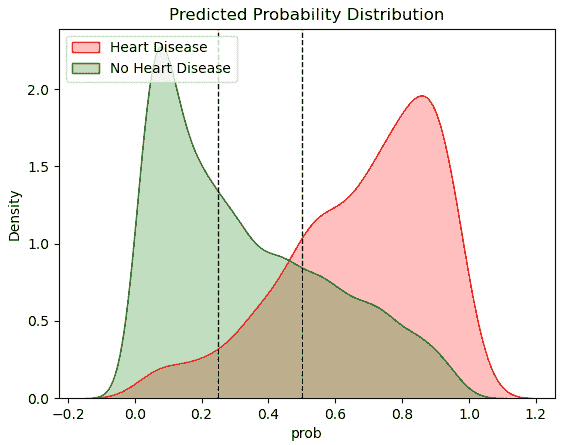

图 10.4 – 预测的心脏病概率分布

让我们比之前更仔细地考虑精确度和敏感性之间的权衡。记住，精确度是我们预测正类值时正确率的比率。敏感性，也称为召回率或真正阳性率，是我们识别实际正例为正例的比率。

1.  我们可以如下绘制精确度和敏感性曲线：

    ```py
    prec, sens, ths = skmet.precision_recall_curve(y_test, pred_probs)
    sens = sens[1:-20]
    prec = prec[1:-20]
    ths  = ths[:-20]
    fig, ax = plt.subplots()
    ax.plot(ths, prec, label='Precision')
    ax.plot(ths, sens, label='Sensitivity')
    ax.set_title('Precision and Sensitivity by Threshold')
    ax.set_xlabel('Threshold')
    ax.set_ylabel('Precision and Sensitivity')
    ax.legend()
    ```

这会产生以下图表：

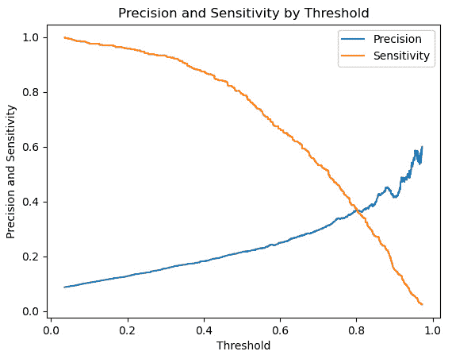

图 10.5 – 阈值值下的精确度和敏感性

当阈值超过 0.2 时，敏感性的下降比精确度的增加更为明显。

1.  通常，查看假阳性率与敏感性率也是很有帮助的。假阳性率是我们模型在实际值为负时预测为正的倾向。了解这种关系的一种方法是通过 ROC 曲线：

    ```py
    fpr, tpr, ths = skmet.roc_curve(y_test, pred_probs)
    ths = ths[1:]
    fpr = fpr[1:]
    tpr = tpr[1:]
    fig, ax = plt.subplots()
    ax.plot(fpr, tpr, linewidth=4, color="black")
    ax.set_title('ROC curve')
    ax.set_xlabel('False Positive Rate')
    ax.set_ylabel('Sensitivity')
    ```

这会产生以下图表：

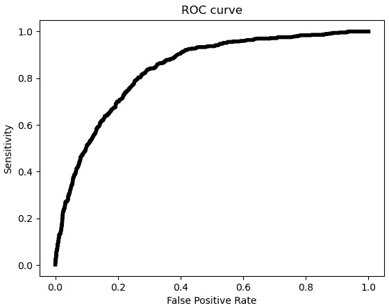

图 10.6 – ROC 曲线

在这里，我们可以看到，随着假阳性率的增加，我们获得的敏感性增加越来越少。超过 0.5 的假阳性率，几乎没有回报。

1.  可能还有助于仅通过阈值绘制假阳性率和敏感性：

    ```py
    fig, ax = plt.subplots()
    ax.plot(ths, fpr, label="False Positive Rate")
    ax.plot(ths, tpr, label="Sensitivity")
    ax.set_title('False Positive Rate and Sensitivity by Threshold')
    ax.set_xlabel('Threshold')
    ax.set_ylabel('False Positive Rate and Sensitivity')
    ax.legend()
    ```

这会产生以下图表：

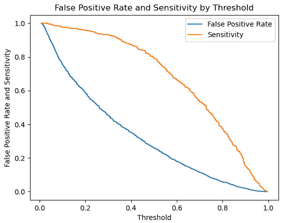

图 10.7 – 灵敏度和假阳性率

这里，我们可以看到，当我们把阈值降低到 0.25 以下时，假阳性率比灵敏度增加得更快。

这最后两个可视化暗示了找到最佳阈值值——即在灵敏度和假阳性率之间有最佳权衡的值；至少在数学上，忽略领域知识。

1.  我们将计算`argmax`函数。我们想要这个索引处的阈值值。根据这个计算，最佳阈值是 0.46，这与默认值并不太不同：

    ```py
    jthresh = ths[np.argmax(tpr – fpr)]
    jthresh
    0.45946882675453804
    ```

1.  我们可以根据这个替代阈值重新做混淆矩阵：

    ```py
    pred2 = np.where(pred_probs>=jthresh,1,0)
    cm = skmet.confusion_matrix(y_test, pred2)
    cmplot = skmet.ConfusionMatrixDisplay(
      confusion_matrix=cm, 
      display_labels=['Negative', 'Positive'])
    cmplot.plot()
    cmplot.ax_.set(
      title='Heart Disease Prediction Confusion Matrix', 
      xlabel='Predicted Value', ylabel='Actual Value')
    ```

这产生了以下图表：

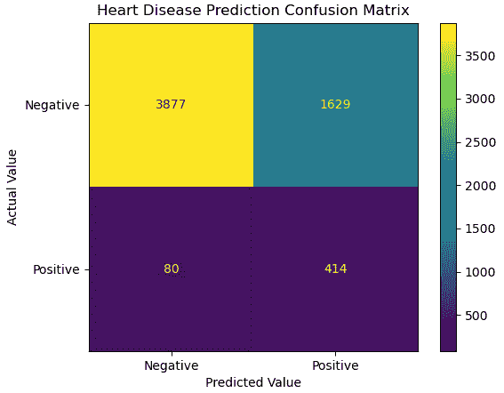

图 10.8 – 心脏病预测混淆矩阵

1.  这给我们带来了灵敏度的微小提升：

    ```py
    skmet.recall_score(y_test.values.ravel(), pred)
    0.7935222672064778
    skmet.recall_score(y_test.values.ravel(), pred2)
    0.8380566801619433
    ```

这里要说明的不是我们应该随意更改阈值。这通常是一个坏主意。但我们应该记住两点。首先，当我们有一个高度不平衡的类别时，0.5 的阈值可能没有意义。其次，这是依赖领域知识的一个重要地方。对于某些分类问题，假阳性远不如假阴性重要。

在本节中，我们关注了灵敏度、精确度和假阳性率作为模型性能的度量。这部分是因为空间限制，也因为这个特定目标的问题——不平衡的类别和可能对灵敏度的偏好。在接下来的几章中，我们将强调其他度量，如准确性和特异性，在其他我们将构建的模型中。在本章的其余部分，我们将探讨逻辑回归的几个扩展，包括正则化和多项式逻辑回归。

# 使用逻辑回归进行正则化

如果你已经阅读了*第七章*《线性回归模型》并阅读了本章的第一节，你对正则化的工作原理已经有了很好的了解。我们向估计器添加一个惩罚，以最小化我们的参数估计。这个惩罚的大小通常基于模型性能的度量来调整。我们将在本节中探讨这一点。按照以下步骤进行：

1.  我们将加载与上一节中使用的相同模块，以及我们需要进行必要超参数调整的模块。我们将使用`RandomizedSearchCV`和`uniform`来找到我们惩罚强度的最佳值：

    ```py
    import pandas as pd
    import numpy as np
    from sklearn.model_selection import train_test_split
    from sklearn.preprocessing import StandardScaler
    from sklearn.preprocessing import OneHotEncoder
    from sklearn.pipeline import make_pipeline
    from sklearn.impute import SimpleImputer
    from sklearn.compose import ColumnTransformer
    from sklearn.model_selection import RepeatedStratifiedKFold
    from sklearn.linear_model import LogisticRegression
    from sklearn.model_selection import RandomizedSearchCV
    from scipy.stats import uniform
    import os
    import sys
    sys.path.append(os.getcwd() + "/helperfunctions")
    from preprocfunc import OutlierTrans,\
      MakeOrdinal, ReplaceVals
    ```

1.  接下来，我们将加载心脏病数据并进行一些处理：

    ```py
    healthinfo = pd.read_csv("data/healthinfosample.csv")
    healthinfo.set_index("personid", inplace=True)
    healthinfo['heartdisease'] = \
      np.where(healthinfo.heartdisease=='No',0,1).\
      astype('int')
    ```

1.  接下来，我们将组织我们的特征，以便于我们在接下来的几个步骤中进行的列转换：

    ```py
    num_cols = ['bmi','physicalhealthbaddays',
       'mentalhealthbaddays','sleeptimenightly']
    binary_cols = ['smoking','alcoholdrinkingheavy',
      'stroke','walkingdifficult','physicalactivity',
      'asthma','kidneydisease','skincancer']
    cat_cols = ['gender','ethnicity']
    spec_cols1 = ['agecategory']
    spec_cols2 = ['genhealth']
    spec_cols3 = ['diabetic']
    rep_dict = {
      'genhealth': {'Poor':0,'Fair':1,'Good':2,
        'Very good':3,'Excellent':4},
      'diabetic': {'No':0,
        'No, borderline diabetes':0,'Yes':1,
        'Yes (during pregnancy)':1}           
    }
    ```

1.  现在，我们必须创建测试和训练数据框：

    ```py
    X_train, X_test, y_train, y_test =  \
      train_test_split(healthinfo[num_cols + 
        binary_cols + cat_cols + spec_cols1 +
        spec_cols2 + spec_cols3],\
      healthinfo[['heartdisease']], test_size=0.2,
        random_state=0)
    ```

1.  然后，我们必须设置列转换：

    ```py
    ohe = OneHotEncoder(drop='first', sparse=False)
    standtrans = make_pipeline(OutlierTrans(3),
      SimpleImputer(strategy="median"),
      StandardScaler())
    spectrans1 = make_pipeline(MakeOrdinal(),
      StandardScaler())
    spectrans2 = make_pipeline(ReplaceVals(rep_dict),
      StandardScaler())
    spectrans3 = make_pipeline(ReplaceVals(rep_dict))
    bintrans = make_pipeline(ohe)
    cattrans = make_pipeline(ohe)
    coltrans = ColumnTransformer(
      transformers=[
        ("stand", standtrans, num_cols),
        ("spec1", spectrans1, spec_cols1),
        ("spec2", spectrans2, spec_cols2),
        ("spec3", spectrans3, spec_cols3),
        ("bin", bintrans, binary_cols),
        ("cat", cattrans, cat_cols),
      ]
    )
    ```

1.  现在，我们已经准备好运行我们的模型了。我们将实例化逻辑回归和重复分层 k 折对象。然后，我们将创建一个包含之前步骤中的列转换和逻辑回归的管道。

之后，我们将为超参数创建一个字典列表，而不是像在这本书中之前所做的那样只创建一个字典。这是因为并非所有超参数都能一起工作。例如，我们不能使用`newton-cg`求解器与 L1 惩罚一起使用。字典键名前缀的`logisticregression__`（注意双下划线）表示我们希望将这些值传递到管道的逻辑回归步骤。

我们将设置随机网格搜索的`n_iter`参数为`20`，以便它采样超参数 20 次。每次，网格搜索都将从列出的一个字典中选择超参数。我们将指示我们希望网格搜索的评分基于 ROC 曲线下的面积：

```py
lr = LogisticRegression(random_state=1, class_weight='balanced', max_iter=1000)
kf = RepeatedStratifiedKFold(n_splits=7, n_repeats=3, random_state=0)
pipe1 = make_pipeline(coltrans, lr)
reg_params = [
  {
    'logisticregression__solver': ['liblinear'],
    'logisticregression__penalty': ['l1','l2'],
    'logisticregression__C': uniform(loc=0, scale=10)
  },
  {
    'logisticregression__solver': ['newton-cg'],
    'logisticregression__penalty': ['l2'],
    'logisticregression__C': uniform(loc=0, scale=10)
  },
  {
    'logisticregression__solver': ['saga'],
    'logisticregression__penalty': ['elasticnet'],
    'logisticregression__l1_ratio': uniform(loc=0, scale=1),   
    'logisticregression__C': uniform(loc=0, scale=10)
  }
]
rs = RandomizedSearchCV(pipe1, reg_params, cv=kf, 
  n_iter=20, scoring='roc_auc')
rs.fit(X_train, y_train.values.ravel())
```

1.  在拟合搜索后，`best_params`属性给出了与最高分数相关的参数。弹性网络回归，其 L1 比率更接近 L1 而不是 L2，表现最佳：

    ```py
    rs.best_params_
    {'logisticregression__C': 0.6918282397356423,
     'logisticregression__l1_ratio': 0.758705704020254,
     'logisticregression__penalty': 'elasticnet',
     'logisticregression__solver': 'saga'}
    rs.best_score_
    0.8410275986723489
    ```

1.  让我们看看网格搜索的一些其他高分。最好的三个模型得分几乎相同。一个使用弹性网络回归，另一个使用 L1，另一个使用 L2。

网格搜索的`cv_results_`字典为我们提供了关于尝试过的 20 个模型的大量信息。该字典中的`params`列表结构有些复杂，因为某些键在某些迭代中不存在，例如`L1_ratio`。我们可以使用`json_normalize`来简化结构：

```py
results = \
  pd.DataFrame(rs.cv_results_['mean_test_score'], \
    columns=['meanscore']).\
  join(pd.json_normalize(rs.cv_results_['params'])).\
  sort_values(['meanscore'], ascending=False)
results.head(3).T
                              15          4      12
meanscore                     0.841       0.841  0.841
logisticregression__C         0.692       1.235  0.914
logisticregression__l1_ratio  0.759       NaN    NaN
logisticregression__penalty   elasticnet  l1     l2
logisticregression__solver  saga  liblinear  liblinear
```

1.  让我们看看混淆矩阵：

    ```py
    pred = rs.predict(X_test)
    cm = skmet.confusion_matrix(y_test, pred)
    cmplot = \
      skmet.ConfusionMatrixDisplay(confusion_matrix=cm,
      display_labels=['Negative', 'Positive'])
    cmplot.plot()
    cmplot.ax_.\
      set(title='Heart Disease Prediction Confusion Matrix', 
      xlabel='Predicted Value', ylabel='Actual Value')
    ```

这生成了以下图表：

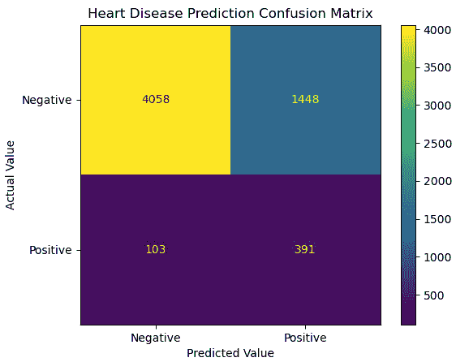

图 10.9 – 心脏病预测混淆矩阵

1.  让我们也看看一些度量指标。我们的分数与没有正则化的模型基本没有变化：

    ```py
    print("accuracy: %.2f, sensitivity: %.2f, specificity: %.2f, precision: %.2f"  %
      (skmet.accuracy_score(y_test.values.ravel(), pred),
      skmet.recall_score(y_test.values.ravel(), pred),
      skmet.recall_score(y_test.values.ravel(), pred,
        pos_label=0),
      skmet.precision_score(y_test.values.ravel(), pred)))
    accuracy: 0.74, sensitivity: 0.79, specificity: 0.74, precision: 0.21
    ```

尽管正则化并没有明显提高我们模型的表现，但很多时候它确实做到了。在使用 L1 正则化时，也不必过于担心特征选择，因为不太重要的特征的权重将会是 0。

尽管我们还没有解决如何处理目标值超过两个的可能值的模型，尽管上一两节的几乎所有讨论也适用于多类模型。在下一节中，我们将学习如何使用多项式逻辑回归来建模多类目标。

# 多项式逻辑回归

如果逻辑回归只适用于二元分类问题，那么它就不会那么有用。幸运的是，当我们的目标值超过两个时，我们可以使用多项式逻辑回归。

在本节中，我们将处理关于空气和工艺温度、扭矩和旋转速度作为机器故障函数的数据。

注意

这个关于机器故障的数据集可在[`www.kaggle.com/datasets/shivamb/machine-predictive-maintenance-classification`](https://www.kaggle.com/datasets/shivamb/machine-predictive-maintenance-classification)公开使用。有 10,000 个观测值，12 个特征，以及两个可能的目标。一个是二元的——也就是说，机器故障或未故障。另一个是故障类型。这个数据集中的实例是合成的，由一个旨在模仿机器故障率和原因的过程生成。

让我们学习如何使用多项式逻辑回归来建模机器故障：

1.  首先，我们将导入现在熟悉的库。我们还将导入`cross_validate`，我们首次在第六章*准备模型评估*中使用它，以帮助我们评估我们的模型：

    ```py
    import pandas as pd
    import numpy as np
    from sklearn.model_selection import train_test_split
    from sklearn.preprocessing import StandardScaler
    from sklearn.preprocessing import OneHotEncoder
    from sklearn.pipeline import make_pipeline
    from sklearn.impute import SimpleImputer
    from sklearn.compose import ColumnTransformer
    from sklearn.model_selection import RepeatedStratifiedKFold
    from sklearn.linear_model import LogisticRegression
    from sklearn.model_selection import cross_validate
    import os
    import sys
    sys.path.append(os.getcwd() + "/helperfunctions")
    from preprocfunc import OutlierTrans
    ```

1.  我们将加载机器故障数据并查看其结构。我们没有缺失数据。这是个好消息：

    ```py
    machinefailuretype = pd.read_csv("data/machinefailuretype.csv")
    machinefailuretype.info()
    <class 'pandas.core.frame.DataFrame'>
    RangeIndex: 10000 entries, 0 to 9999
    Data columns (total 10 columns):
     #   Column              Non-Null Count      Dtype
    ---  ------             --------------       ----  
     0   udi                 10000 non-null      int64
     1   product             10000 non-null      object 
     2   machinetype         10000 non-null      object 
     3   airtemp             10000 non-null      float64
     4   processtemperature  10000 non-null      float64
     5   rotationalspeed     10000 non-null      int64
     6   torque              10000 non-null      float64
     7   toolwear            10000 non-null      int64
     8   fail                10000 non-null      int64
     9   failtype            10000 non-null      object 
    dtypes: float64(3), int64(4), object(3)
    memory usage: 781.4+ KB
    ```

1.  让我们查看几行。`machinetype`的值为`L`、`M`和`H`。这些值分别是低、中、高质机器的代理：

    ```py
    machinefailuretype.head()
       udi product machinetype airtemp processtemperature\
    0  1   M14860  M           298     309 
    1  2   L47181  L           298     309 
    2  3   L47182  L           298     308 
    3  4   L47183  L           298     309 
    4  5   L47184  L           298     309 
       Rotationalspeed  torque  toolwear  fail  failtype  
    0   1551             43       0        0    No Failure
    1   1408             46       3        0    No Failure
    2   1498             49       5        0    No Failure
    3   1433             40       7        0    No Failure
    4   1408             40       9        0    No Failure
    ```

1.  我们还应该生成一些频率：

    ```py
    machinefailuretype.failtype.value_counts(dropna=False).sort_index()
    Heat Dissipation Failure    112
    No Failure                  9652
    Overstrain Failure          78
    Power Failure               95
    Random Failures             18
    Tool Wear Failure           45
    Name: failtype, dtype: int64
    machinefailuretype.machinetype.\
      value_counts(dropna=False).sort_index()
    H    1003
    L    6000
    M    2997
    Name: machinetype, dtype: int64
    ```

1.  让我们将`failtype`值合并，并为它们创建数字代码。由于随机故障的计数很低，我们将随机故障和工具磨损故障合并：

    ```py
    def setcode(typetext):
      if (typetext=="No Failure"):
        typecode = 1
      elif (typetext=="Heat Dissipation Failure"):
        typecode = 2
      elif (typetext=="Power Failure"):
        typecode = 3
      elif (typetext=="Overstrain Failure"):
        typecode = 4
      else:
        typecode = 5
      return typecode
    machinefailuretype["failtypecode"] = \
      machinefailuretype.apply(lambda x: setcode(x.failtype), axis=1)
    ```

1.  我们应该确认`failtypecode`是否按我们的意图工作：

    ```py
    machinefailuretype.groupby(['failtypecode','failtype']).size().\
      reset_index()
      failtypecode   failtype                     0
    0     1          No Failure                   9652
    1     2          Heat Dissipation Failure     112
    2     3          Power Failure                95
    3     4          Overstrain Failure           78
    4     5          Random Failures              18
    5     5          Tool Wear Failure            45
    ```

1.  让我们也获取一些描述性统计信息：

    ```py
    num_cols = ['airtemp','processtemperature','rotationalspeed',
      'torque','toolwear']
    cat_cols = ['machinetype']
    machinefailuretype[num_cols].agg(['min','median','max']).T
                          min      median    max
    airtemp               295      300       304
    processtemperature    306      310       314
    rotationalspeed       1,168    1,503     2,886
    torque                4        40        77
    toolwear              0        108       253
    ```

1.  现在，让我们创建测试和训练数据框。我们还将设置列转换：

    ```py
    X_train, X_test, y_train, y_test =  \
      train_test_split(machinefailuretype[num_cols +
      cat_cols], machinefailuretype[['failtypecode']],
      test_size=0.2, random_state=0)
    ohe = OneHotEncoder(drop='first', sparse=False)
    standtrans = make_pipeline(OutlierTrans(3),
      SimpleImputer(strategy="median"),
      StandardScaler())
    cattrans = make_pipeline(ohe)
    coltrans = ColumnTransformer(
      transformers=[
        ("stand", standtrans, num_cols),
        ("cat", cattrans, cat_cols),
      ]
    )
    ```

1.  现在，让我们设置一个包含我们的列转换和多项逻辑回归模型的管道。当我们实例化逻辑回归时，只需将`multi_class`属性设置为多项式即可：

    ```py
    lr = LogisticRegression(random_state=0, 
      multi_class='multinomial', solver='lbfgs',
      max_iter=1000)
    kf = RepeatedStratifiedKFold(n_splits=10,
      n_repeats=5, random_state=0)
    pipe1 = make_pipeline(coltrans, lr)
    ```

1.  现在，我们可以生成一个混淆矩阵：

    ```py
    cm = skmet.confusion_matrix(y_test, 
       pipe1.fit(X_train, y_train.values.ravel()).\
       predict(X_test))
    cmplot = \
       skmet.ConfusionMatrixDisplay(confusion_matrix=cm,
       display_labels=['None', 'Heat','Power','Overstrain','Other'])
    cmplot.plot()
    cmplot.ax_.\
      set(title='Machine Failure Type Confusion Matrix', 
      xlabel='Predicted Value', ylabel='Actual Value')
    ```

这会产生以下图表：

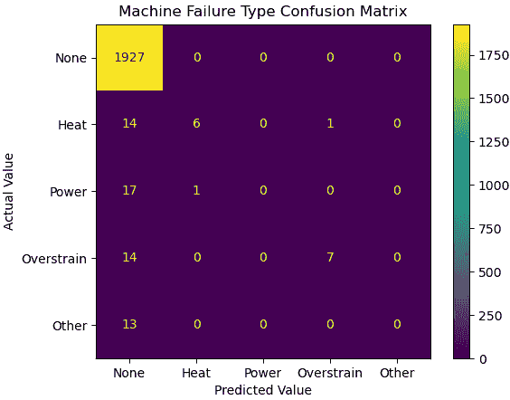

图 10.10 – 预测机器故障类型的混淆矩阵

混淆矩阵显示，当存在故障时，我们的模型在预测故障类型方面做得并不好，尤其是电力故障或其他故障。

1.  我们可以使用`cross_validate`来评估这个模型。我们主要得到准确率、精确率和敏感度（召回率）的优异成绩。然而，这是误导性的。当类别如此不平衡（几乎所有实例都是`无故障`）时，加权分数会受到包含几乎所有值的类别的严重影响。我们的模型能够可靠地正确预测`无故障`。

如果我们查看`f1_macro`分数（回忆一下*第六章*，*准备模型评估*，其中`f1`是精确率和敏感性的调和平均值），我们会看到，除了`无故障`类别之外，我们的模型在其它类别上表现并不好。（`macro`分数只是一个简单的平均值。）

我们本可以使用分类报告在这里，就像我们在*第六章*，“准备模型评估”中做的那样，但我有时发现生成我需要的统计数据很有帮助：

```py
scores = cross_validate(
  pipe1, X_train, y_train.values.ravel(), \
  scoring=['accuracy', 'precision_weighted',
           'recall_weighted', 'f1_macro',
           'f1_weighted'], 
  cv=kf, n_jobs=-1)
accuracy, precision, sensitivity, f1_macro, f1_weighted = \
  np.mean(scores['test_accuracy']),\
  np.mean(scores['test_precision_weighted']),\
  np.mean(scores['test_recall_weighted']),\
  np.mean(scores['test_f1_macro']),\
  np.mean(scores['test_f1_weighted'])
accuracy, precision, sensitivity, f1_macro, f1_weighted
(0.9716499999999999,
 0.9541025493784612,
 0.9716499999999999,
 0.3820938909478524,
 0.9611411229222823)
```

在本节中，我们探讨了如何构建多项逻辑回归模型。这种方法无论目标变量是名义变量还是有序变量都适用。在这种情况下，它是名义变量。我们还看到了如何将用于具有二元目标的逻辑回归模型中的模型评估方法进行扩展。我们回顾了当我们有超过两个类别时如何解释混淆矩阵和评分指标。

# 摘要

逻辑回归多年来一直是我预测分类目标的首选工具。它是一个高效且偏差低的算法。一些其缺点，如高方差和难以处理高度相关的预测因子，可以通过正则化和特征选择来解决。我们在本章中探讨了如何做到这一点。我们还考察了如何处理不平衡类别，以及这些目标对建模和结果解释的含义。

在下一章中，我们将探讨分类中一个非常流行的逻辑回归替代方案——决策树。我们会看到决策树具有许多优点，使得它们在需要建模复杂性时成为一个特别好的选择，而不必像使用逻辑回归那样过多地担心我们的特征是如何指定的。
