# *第十三章*：支持向量机分类

支持向量分类模型和 k 最近邻模型之间有一些相似之处。它们都是直观且灵活的。然而，由于算法的性质，支持向量分类比 k 最近邻有更好的可扩展性。与逻辑回归不同，它可以很容易地处理非线性模型。使用支持向量机进行分类的策略和问题与我们讨论的相似，见*第八章*，*支持向量回归*，当时我们使用支持向量机进行回归。

**支持向量分类**（**SVC**）的一个关键优势是它赋予我们减少模型复杂度的能力，同时不增加我们的特征空间。但它也提供了多个我们可以调整的杠杆，以限制过拟合的可能性。我们可以选择线性模型，或从几个非线性核中选择。我们可以使用正则化参数，就像我们在逻辑回归中所做的那样。通过扩展，我们还可以使用这些相同的技巧来构建多类模型。

在本章中，我们将探讨以下主题：

+   SVC 的关键概念

+   线性 SVC 模型

+   非线性 SVM 分类模型

+   多类分类的 SVM

# 技术要求

在本章中，我们将坚持使用 pandas、NumPy 和 scikit-learn 库。本章中的所有代码都使用 scikit-learn 版本 0.24.2 和 1.0.2 进行了测试。显示决策边界的代码需要 scikit-learn 版本 1.1.1 或更高版本。

# SVC 的关键概念

我们可以使用**支持向量机**（**SVMs**）来找到一条线或曲线，通过类别来分离实例。当类别可以通过一条线来区分时，它们被称为**线性可分**。

然而，正如我们在*图 13.1*中可以看到的，可能有许多可能的线性分类器。每条线都成功地使用两个特征 x1 和 x2 来区分由点表示的两个类别，关键的区别在于这些线如何对新的实例进行分类，这些新实例由透明矩形表示。使用离正方形最近的线会将透明矩形分类为点。使用其他两条线中的任何一条都会将其分类为正方形。

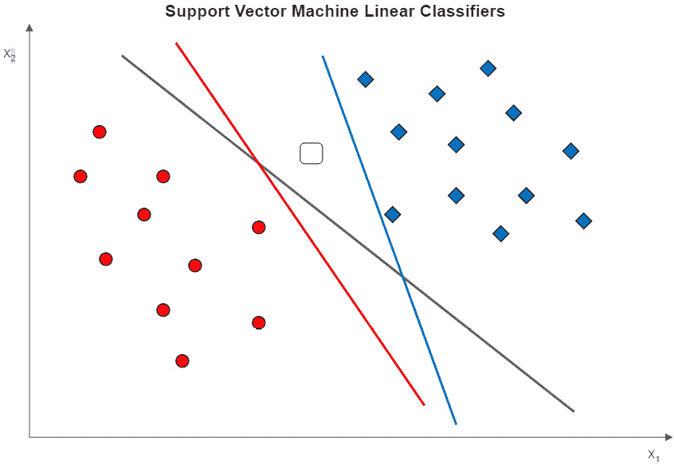

图 13.1 – 三种可能的线性分类器

当线性判别器非常接近训练实例时，就像*图 13.2*中的两条线一样，就有更大的风险将新实例分类错误。我们希望得到一个能够给出最大类别间间隔的线；一个离每个类别的边界数据点最远的线。那就是*图 13.1*中的中间线，但在*图 13.2*中可以看得更清楚：

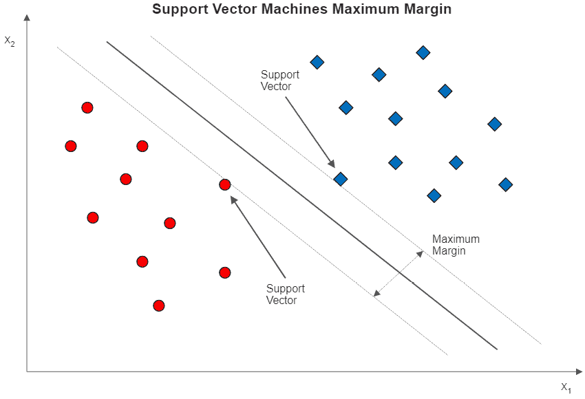

图 13.2 – SVM 分类和最大间隔

粗体线分割了最大间隔，被称为决策边界。每个类别的边界数据点被称为支持向量。

我们使用支持向量机来寻找类别之间具有最大间隔的线性判别式。它是通过找到一个可以最大化的间隔的方程来实现的，其中间隔是数据点到分离超平面的距离。在具有两个特征的情况下，如*图 13.2*所示，该超平面只是一条线。然而，这可以推广到具有更多维度的特征空间。

对于像*图 13.2*中的数据点，我们可以使用所谓的**硬间隔分类**而不会出现问题；也就是说，我们可以对每个类别的所有观察值在决策边界的正确一侧非常严格。但如果我们数据点的样子像*图 13.3*中的那些呢？在这里，有一个方形非常接近点。硬间隔分类器是左侧的线，给我们非常小的间隔。

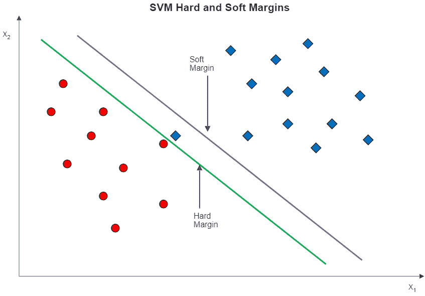

图 13.3 – 带有硬间隔和软间隔的支持向量机

如果我们使用**软间隔分类**，则得到右侧的线。软间隔分类放宽了所有实例都必须正确分离的约束。正如*图 13.3*中的数据所示，允许训练数据中有少量错误分类可以给我们更大的间隔。我们忽略偏离的方形，得到由软间隔线表示的决策边界。

约束放宽的程度由*C*超参数决定。*C*的值越大，对间隔违规的惩罚就越大。不出所料，具有较大*C*值的模型更容易过拟合。*图 13.4*说明了间隔如何随着*C*值的改变而变化。在*C = 1*时，错误分类的惩罚较低，给我们比*C*为 100 时更大的间隔。然而，即使在*C*为 100 的情况下，仍然会发生一些间隔违规。

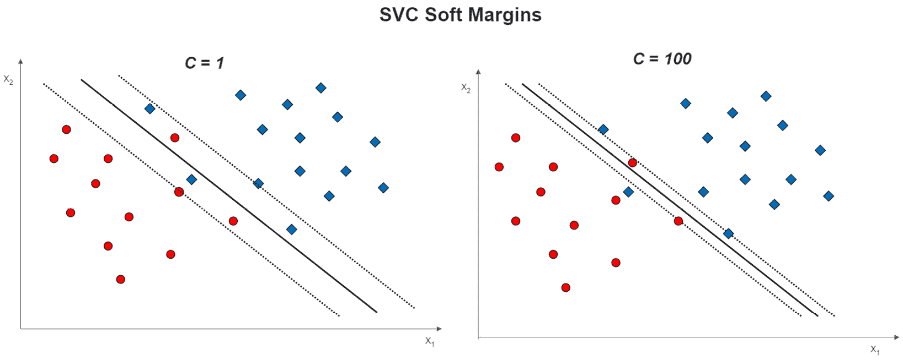

图 13.4 – 不同 C 值下的软间隔

在实际操作中，我们几乎总是用软间隔构建我们的 SVC 模型。scikit-learn 中*C*的默认值是 1。

## 非线性支持向量机和核技巧

我们尚未完全解决 SVC 的线性可分性问题。为了简单起见，回到一个涉及两个特征的分类问题是有帮助的。假设两个特征与分类目标的关系图看起来像*图 13.5*中的插图。目标有两个可能的值，由点和正方形表示。x1 和 x2 是数值，具有负值。

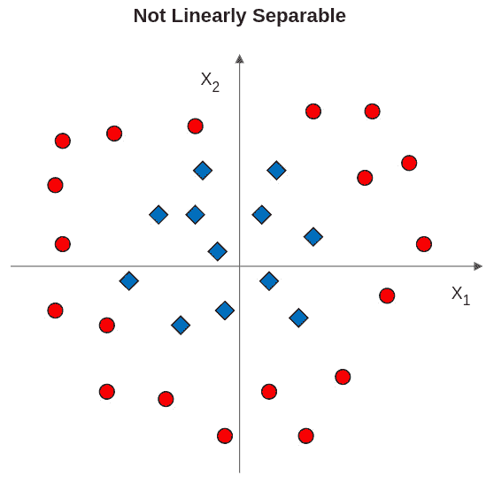

图 13.5 – 使用两个特征无法线性分离的类别标签

在这种情况下，我们如何识别类之间的边界？通常情况下，在更高的维度中可以识别出边界。在这个例子中，我们可以使用图 13.6 中所示的多项式变换：

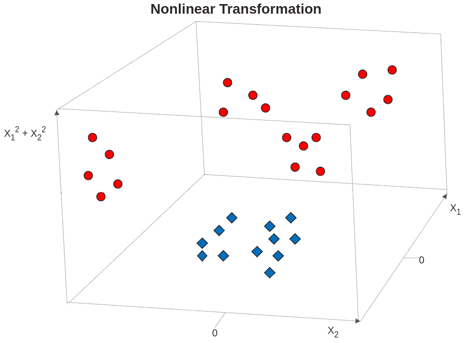

图 13.6 – 使用多项式变换建立边界

现在有一个第三维度，它是 x1 和 x2 平方和的总和。点都高于平方。这与我们使用多项式变换进行线性回归的方式相似。

这种方法的缺点之一是我们可能会迅速拥有太多特征，以至于模型无法良好地执行。这就是**核技巧**大显身手的地方。SVC 可以使用核函数隐式地扩展特征空间，而不实际创建更多特征。这是通过创建一个可以用来拟合非线性边界的值向量来实现的。

虽然这允许我们拟合一个类似于图 13.6 中假设的假设多项式变换，但 SVC 中最常用的核函数是**径向基函数**（RBF）。RBF 之所以受欢迎，是因为它比其他常见的核函数更快，并且可以使用伽马超参数提供额外的灵活性。RBF 核的方程如下：

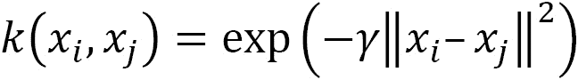

在这里，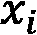 和 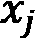 是数据点。伽马值，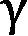，决定了每个点的影响力大小。当伽马值较高时，点必须非常接近才能被分组在一起。在伽马值非常高的情况下，我们开始看到点的岛屿。

当然，伽马值或*C*的高值取决于我们的数据。一个好的方法是，在大量建模之前，创建不同伽马值和*C*值的决策边界可视化。这将让我们了解在不同的超参数值下，我们是否过度拟合或欠拟合。在本章中，我们将绘制不同伽马值和*C*值的决策边界。

## SVC 的多类分类

到目前为止，我们关于支持向量机（SVC）的所有讨论都集中在二元分类上。幸运的是，适用于二元分类支持向量机的所有关键概念也适用于我们的目标值超过两个的可能值时的分类。我们将多类问题建模为**一对一**或**一对余**问题，从而将其转化为二元分类问题。

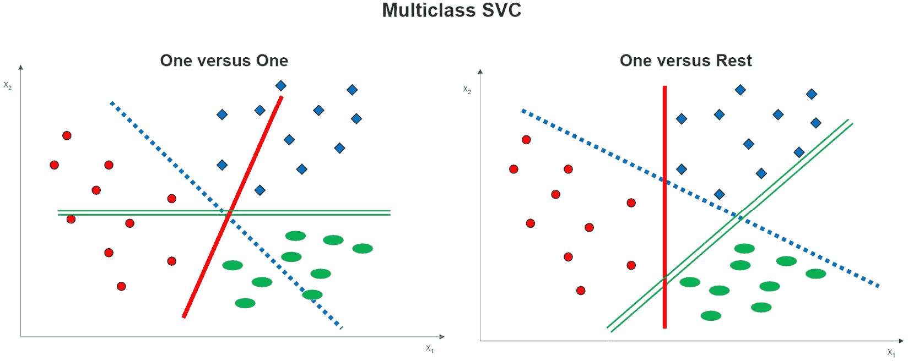

图 13.7 – 多类 SVC 选项

在三类示例中，一对一分类很容易说明，如图 13.7 的左侧所示。每个类别与每个其他类别之间估计一个决策边界。例如，虚线是点类与正方形类之间的决策边界。实线是点与椭圆形之间的决策边界。

在一对一分类中，每个类别与不属于该类别的实例之间构建一个决策边界。这如图 13.7 的右侧所示。实线是点与不是点（即正方形或椭圆形）的实例之间的决策边界。虚线和双线分别是正方形与剩余实例和椭圆形与剩余实例之间的决策边界。

我们可以使用一对一或一对一分类来构建线性和非线性 SVC 模型。我们还可以指定*C*的值来构建软边界。然而，使用这些技术中的每一个构建更多的决策边界需要比二分类 SVC 更多的计算资源。如果我们有大量的观察结果、许多特征和多个参数需要调整，我们可能需要非常好的系统资源才能及时获得结果。

三类示例隐藏了一个关于一对一和一对一分类器不同之处。对于三个类别，它们使用相同数量的分类器（三个），但随着一对一的增加，分类器的数量相对迅速地增加。在一对一分类中，分类器的数量始终等于类别值的数量，而在一对一分类中，它等于以下：

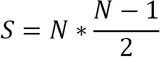

在这里，*S*是分类器的数量，*N*是目标的目标值（类别值）的基数。因此，基数是 4 时，一对一分类需要 4 个分类器，而一对一分类使用 6 个。

我们在本章的最后部分探讨了多类 SVC 模型，但让我们从一个相对简单的线性模型开始，看看 SVC 的实际应用。在为 SVC 模型进行预处理时，有两个需要注意的事项。首先，SVC 对特征的规模很敏感，因此在我们拟合模型之前需要解决这一点。其次，如果我们使用硬边界或高*C*值，异常值可能会对我们的模型产生很大的影响。

# 线性 SVC 模型

我们通常可以通过使用线性 SVC 模型获得良好的结果。当我们有超过两个特征时，没有简单的方法来可视化我们的数据是否线性可分。我们通常根据超参数调整来决定是线性还是非线性。在本节中，我们将假设我们可以通过线性模型和软边界获得良好的性能。

在本节中，我们将处理关于**美国职业篮球联赛**（**NBA**）比赛的数据。数据集包含了从 2017/2018 赛季到 2020/2021 赛季每场 NBA 比赛的统计数据。这包括主队、主队是否获胜、客队、客队和主队的投篮命中率、失误、篮板和助攻，以及许多其他指标。

注意

NBA 比赛数据可在[`www.kaggle.com/datasets/wyattowalsh/basketball`](https://www.kaggle.com/datasets/wyattowalsh/basketball)供公众下载。该数据集从 1946/1947 赛季的 NBA 赛季开始。它使用`nba_api`从[nba.com](http://nba.com)获取统计数据。该 API 可在[`github.com/swar/nba_api`](https://github.com/swar/nba_api)找到。

让我们构建一个线性 SVC 模型：

1.  我们首先加载熟悉的库。唯一的新模块是`LinearSVC`和`DecisionBoundaryDisplay`。我们将使用`DecisionBoundaryDisplay`来显示线性模型的边界：

    ```py
    import pandas as pd
    import numpy as np
    from sklearn.model_selection import train_test_split
    from sklearn.preprocessing import OneHotEncoder, StandardScaler
    from sklearn.svm import LinearSVC
    from scipy.stats import uniform
    from sklearn.impute import SimpleImputer
    from sklearn.pipeline import make_pipeline
    from sklearn.compose import ColumnTransformer
    from sklearn.feature_selection import RFECV
    from sklearn.inspection import DecisionBoundaryDisplay
    from sklearn.model_selection import cross_validate, \
      RandomizedSearchCV, RepeatedStratifiedKFold
    import sklearn.metrics as skmet
    import seaborn as sns
    import os
    import sys
    sys.path.append(os.getcwd() + "/helperfunctions")
    from preprocfunc import OutlierTrans
    ```

1.  我们已经准备好加载 NBA 比赛数据。我们只需做一些清理工作。少数观测值的目标`WL_HOME`（主队是否获胜）有缺失值。我们移除这些观测值。我们将`WL_HOME`特征转换为`0`和`1`特征。

在这里，类别不平衡的问题并不大。这将在以后为我们节省一些时间：

```py
nbagames = pd.read_csv("data/nbagames2017plus.csv", parse_dates=['GAME_DATE'])
nbagames = \
  nbagames.loc[nbagames.WL_HOME.isin(['W','L'])]
nbagames.shape
(4568, 149)
nbagames['WL_HOME'] = \
  np.where(nbagames.WL_HOME=='L',0,1).astype('int')
nbagames.WL_HOME.value_counts(dropna=False)
1    2586
0    1982
Name: WL_HOME, dtype: int64
```

1.  让我们按数据类型组织我们的特征：

    ```py
    num_cols = ['FG_PCT_HOME','FTA_HOME','FG3_PCT_HOME',
      'FTM_HOME','FT_PCT_HOME','OREB_HOME','DREB_HOME',
      'REB_HOME','AST_HOME','STL_HOME','BLK_HOME',
      'TOV_HOME','FG_PCT_AWAY','FTA_AWAY','FG3_PCT_AWAY',
      'FT_PCT_AWAY','OREB_AWAY','DREB_AWAY','REB_AWAY',
      'AST_AWAY','STL_AWAY','BLK_AWAY','TOV_AWAY']
    cat_cols = ['SEASON']
    ```

1.  让我们看看一些描述性统计。 （为了节省空间，我已经从打印输出中省略了一些特征。）我们需要缩放这些特征，因为它们的范围差异很大。没有缺失值，但当我们为极端值分配缺失值时，我们将生成一些缺失值：

    ```py
    nbagames[['WL_HOME'] + num_cols].agg(['count','min','median','max']).T
                      count     min     median  max
    WL_HOME           4,568     0.00    1.00    1.00
    FG_PCT_HOME       4,568     0.27    0.47    0.65
    FTA_HOME          4,568     1.00    22.00   64.00
    FG3_PCT_HOME      4,568     0.06    0.36    0.84
    FTM_HOME          4,568     1.00    17.00   44.00
    FT_PCT_HOME       4,568     0.14    0.78    1.00
    OREB_HOME         4,568     1.00    10.00   25.00
    DREB_HOME         4,568     18.00   35.00   55.00
    REB_HOME          4,568     22.00   45.00   70.00
    AST_HOME          4,568     10.00   24.00   50.00
    .........
    FT_PCT_AWAY       4,568     0.26    0.78    1.00
    OREB_AWAY         4,568     0.00    10.00   26.00
    DREB_AWAY         4,568     18.00   34.00   56.00
    REB_AWAY          4,568     22.00   44.00   71.00
    AST_AWAY          4,568     9.00    24.00   46.00
    STL_AWAY          4,568     0.00    8.00    19.00
    BLK_AWAY          4,568     0.00    5.00    15.00
    TOV_AWAY          4,568     3.00    14.00   30.00
    ```

1.  我们还应该回顾一下特征的相关性：

    ```py
    corrmatrix = nbagames[['WL_HOME'] + \
      num_cols].corr(method="pearson")
    sns.heatmap(corrmatrix, 
      xticklabels=corrmatrix.columns,
      yticklabels=corrmatrix.columns, cmap="coolwarm")
    plt.title('Heat Map of Correlation Matrix')
    plt.tight_layout()
    plt.show()
    ```

这产生了以下图表：

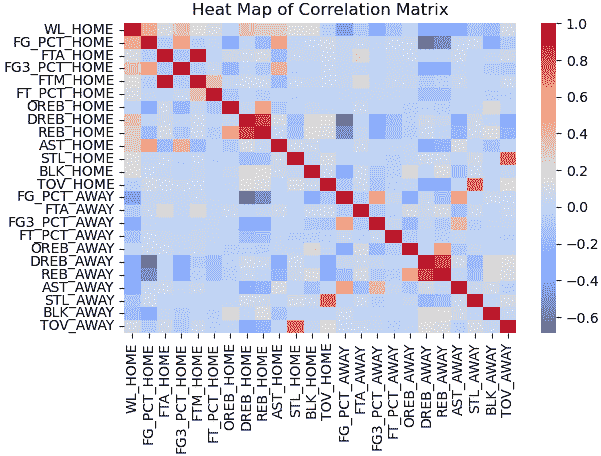

图 13.8 – NBA 比赛统计数据相关性热图

一些特征与目标相关，包括主队的投篮命中率（`FG_PCT_HOME`）和主队的防守篮板球（`DREB_HOME`）。

特征之间也存在相关性。例如，主队的投篮命中率（`FG_PCT_HOME`）和主队的 3 分投篮命中率（`FG3_PCT_HOME`）呈正相关，这并不令人意外。此外，主队的篮板球（`REB_HOME`）和防守篮板球（`DREB_HOME`）可能过于紧密地相关，以至于任何模型都无法分离它们的影响。

1.  接下来，我们创建训练和测试数据框：

    ```py
    X_train, X_test, y_train, y_test =  \
      train_test_split(nbagames[num_cols + cat_cols],\
      nbagames[['WL_HOME']], test_size=0.2, random_state=0)
    ```

1.  我们需要设置列转换。对于数值列，我们检查异常值并缩放数据。我们将一个分类特征`SEASON`进行独热编码。我们将在网格搜索中使用这些转换：

    ```py
    ohe = OneHotEncoder(drop='first', sparse=False)
    cattrans = make_pipeline(ohe)
    standtrans = make_pipeline(OutlierTrans(2),
      SimpleImputer(strategy="median"), StandardScaler())
    coltrans = ColumnTransformer(
      transformers=[
        ("cat", cattrans, cat_cols),
        ("stand", standtrans, num_cols)
      ]
    )
    ```

1.  在构建我们的模型之前，让我们看看一个线性 SVC 模型的决策边界。我们基于与目标相关的两个特征来设置边界：主队的投篮命中率(`FG_PCT_HOME`)和主队的防守篮板(`DREB_HOME`)。

我们创建了一个函数`dispbound`，它将使用`DecisionBoundaryDisplay`模块来显示边界。这个模块在 scikit-learn 版本 1.1.1 或更高版本中可用。`DecisionBoundaryDisplay`需要一个模型来拟合，两个特征和目标值：

```py
pipe0 = make_pipeline(OutlierTrans(2),
  SimpleImputer(strategy="median"), StandardScaler())
X_train_enc = pipe0.\
  fit_transform(X_train[['FG_PCT_HOME','DREB_HOME']])
def dispbound(model, X, xvarnames, y, title):
  dispfit = model.fit(X,y)
  disp = DecisionBoundaryDisplay.from_estimator(
    dispfit, X, response_method="predict",
    xlabel=xvarnames[0], ylabel=xvarnames[1],
    alpha=0.5,
  )
  scatter = disp.ax_.scatter(X[:,0], X[:,1],
    c=y, edgecolor="k")

  disp.ax_.set_title(title)
  legend1 = disp.ax_.legend(*scatter.legend_elements(),
    loc="lower left", title="Home Win")
  disp.ax_.add_artist(legend1)
dispbound(LinearSVC(max_iter=1000000,loss='hinge'),
  X_train_enc, ['FG_PCT_HOME','DREB_HOME'],
  y_train.values.ravel(),
  'Linear SVC Decision Boundary')
```

这产生了以下图表：

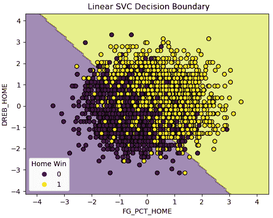

图 13.9 – 双特征线性 SVC 模型的决策边界

我们只使用两个特征就得到了一个相当不错的线性边界。这是个好消息，但让我们构建一个更精心设计的模型。

1.  为了构建我们的模型，我们首先实例化一个线性 SVC 对象并设置递归特征消除。然后我们将列转换、特征选择和线性 SVC 添加到管道中并拟合它：

    ```py
    svc = LinearSVC(max_iter=1000000, loss='hinge',
       random_state=0)
    rfecv = RFECV(estimator=svc, cv=5)
    pipe1 = make_pipeline(coltrans, rfecv, svc)
    pipe1.fit(X_train, y_train.values.ravel())
    ```

1.  让我们看看从我们的递归特征消除中选择了哪些特征。我们首先需要获取一元编码后的列名。然后我们可以使用`rfecv`对象的`get_support`方法来获取选定的特征。（如果你使用的是 scikit-learn 版本 1 或更高版本，你会得到一个关于`get_feature_names`的弃用警告。不过，你可以使用`get_feature_names_out`代替，尽管这不会与 scikit-learn 的早期版本兼容。）

    ```py
    new_cat_cols = \
      pipe1.named_steps['columntransformer'].\
      named_transformers_['cat'].\
      named_steps['onehotencoder'].\
      get_feature_names(cat_cols)
    new_cols = np.concatenate((new_cat_cols, np.array(num_cols)))
    sel_cols = new_cols[pipe1['rfecv'].get_support()]
    np.set_printoptions(linewidth=55)
    sel_cols
    array(['SEASON_2018', 'SEASON_2019', 'SEASON_2020',
           'FG_PCT_HOME', 'FTA_HOME', 'FG3_PCT_HOME',
           'FTM_HOME', 'FT_PCT_HOME', 'OREB_HOME',
           'DREB_HOME', 'REB_HOME', 'AST_HOME',
           'TOV_HOME', 'FG_PCT_AWAY', 'FTA_AWAY',
           'FG3_PCT_AWAY', 'FT_PCT_AWAY', 'OREB_AWAY',
           'DREB_AWAY', 'REB_AWAY', 'AST_AWAY',
           'BLK_AWAY', 'TOV_AWAY'], dtype=object)
    ```

1.  我们应该看看系数。对于每个选定的列的系数可以通过`linearsvc`对象的`coef_`属性来访问。也许并不令人惊讶，主队的投篮命中率(`FG_PCT_HOME`)和客队的投篮命中率(`FG_PCT_AWAY`)是主队获胜的最重要正负预测因子。接下来最重要的特征是客队和主队的失误次数：

    ```py
    pd.Series(pipe1['linearsvc'].\
      coef_[0], index=sel_cols).\
      sort_values(ascending=False)
    FG_PCT_HOME     2.21
    TOV_AWAY        1.20
    REB_HOME        1.19
    FTM_HOME        0.95
    FG3_PCT_HOME    0.94
    FT_PCT_HOME     0.31
    AST_HOME        0.25
    OREB_HOME       0.18
    DREB_AWAY       0.11
    SEASON_2018     0.10
    FTA_HOME       -0.05
    BLK_AWAY       -0.07
    SEASON_2019    -0.11
    SEASON_2020    -0.19
    AST_AWAY       -0.44
    OREB_AWAY      -0.47
    DREB_HOME      -0.49
    FT_PCT_AWAY    -0.53
    REB_AWAY       -0.63
    FG3_PCT_AWAY   -0.80
    FTA_AWAY       -0.81
    TOV_HOME       -1.19
    FG_PCT_AWAY    -1.91
    dtype: float64
    ```

1.  让我们看看预测结果。我们的模型在预测主队获胜方面做得很好：

    ```py
    pred = pipe1.predict(X_test)
    print("accuracy: %.2f, sensitivity: %.2f, specificity: %.2f, precision: %.2f"  %
      (skmet.accuracy_score(y_test.values.ravel(), pred),
      skmet.recall_score(y_test.values.ravel(), pred),
      skmet.recall_score(y_test.values.ravel(), pred, pos_label=0),
      skmet.precision_score(y_test.values.ravel(), pred)))
    accuracy: 0.93, sensitivity: 0.95, specificity: 0.92, precision: 0.93
    ```

1.  我们应该通过进行交叉验证来确认这些指标不是偶然的。我们使用重复的有放回分层 k 折来进行验证，这意味着我们想要 7 个折和 10 次迭代。我们得到的结果与之前步骤中的结果几乎相同：

    ```py
    kf = RepeatedStratifiedKFold(n_splits=7,n_repeats=10,\
      random_state=0)
    scores = cross_validate(pipe1, X_train, \
      y_train.values.ravel(), \
      scoring=['accuracy','precision','recall','f1'], \
      cv=kf, n_jobs=-1)
    print("accuracy: %.2f, precision: %.2f, sensitivity: %.2f, f1: %.2f"  %
      (np.mean(scores['test_accuracy']),\
      np.mean(scores['test_precision']),\
      np.mean(scores['test_recall']),\
      np.mean(scores['test_f1'])))
    accuracy: 0.93, precision: 0.93, sensitivity: 0.95, f1: 0.94
    ```

1.  到目前为止，我们一直在使用`C`的默认值`1`。我们可以尝试使用随机网格搜索来识别一个更好的`C`值：

    ```py
    svc_params = {
     'linearsvc__C': uniform(loc=0, scale=100)
    }
    rs = RandomizedSearchCV(pipe1, svc_params, cv=10, 
      scoring='accuracy', n_iter=20, random_state=0)
    rs.fit(X_train, y_train.values.ravel())
    rs.best_params_
    {'linearsvc__C': 54.88135039273247}
    rs.best_score_
    0.9315809566584325
    ```

最佳的`C`值是 2.02，最佳的准确度得分是 0.9316。

1.  让我们仔细看看 20 次网格搜索中每次的得分。每个得分是 10 个折的准确度得分的平均值。实际上，无论`C`值如何，我们得到的分数都差不多：

    ```py
    results = \
      pd.DataFrame(rs.cv_results_['mean_test_score'], \
        columns=['meanscore']).\
      join(pd.DataFrame(rs.cv_results_['params'])).\
      sort_values(['meanscore'], ascending=False)
    results
                  meanscore        linearsvc__C
    0             0.93             54.88
    8             0.93             96.37
    18            0.93             77.82
    17            0.93             83.26
    13            0.93             92.56
    12            0.93             56.80
    11            0.93             52.89
    1             0.93             71.52
    10            0.93             79.17
    7             0.93             89.18
    6             0.93             43.76
    5             0.93             64.59
    3             0.93             54.49
    2             0.93             60.28
    19            0.93             87.00
    9             0.93             38.34
    4             0.93             42.37
    14            0.93             7.10
    15            0.93             8.71
    16            0.93             2.02
    ```

1.  让我们现在看看一些预测结果。我们的模型在各个方面都做得很好，但并没有比初始模型做得更好：

    ```py
    pred = rs.predict(X_test)
    print("accuracy: %.2f, sensitivity: %.2f, specificity: %.2f, precision: %.2f"  %
      (skmet.accuracy_score(y_test.values.ravel(), pred),
      skmet.recall_score(y_test.values.ravel(), pred),
      skmet.recall_score(y_test.values.ravel(), pred, pos_label=0),
      skmet.precision_score(y_test.values.ravel(), pred)))
    accuracy: 0.93, sensitivity: 0.95, specificity: 0.92, precision: 0.93
    ```

1.  让我们也看看一个混淆矩阵：

    ```py
    cm = skmet.confusion_matrix(y_test, pred)
    cmplot = \
      skmet.ConfusionMatrixDisplay(confusion_matrix=cm, display_labels=['Loss', 'Won'])
    cmplot.plot()
    cmplot.ax_.set(title='Home Team Win Confusion Matrix', 
      xlabel='Predicted Value', ylabel='Actual Value')
    ```

这产生了以下图表：

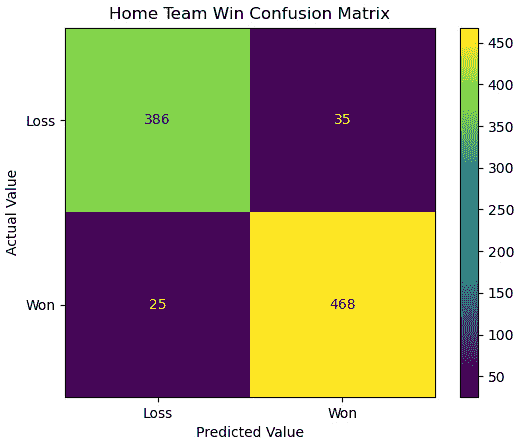

图 13.10 – 主队胜负的混淆矩阵

我们的模型在很大程度上正确预测了主队的胜负。调整`C`的值并没有带来太大的变化，因为我们几乎无论`C`值如何都能获得相同的准确率。

注意

你可能已经注意到，我们在处理 NBA 比赛数据时比在之前章节中处理的心脏病和机器故障数据时更频繁地使用准确率指标。我们更关注那个数据的敏感性。这有两个原因。首先，当类别几乎平衡时，准确率是一个更有说服力的度量标准，正如我们在*第六章*“准备模型评估”中详细讨论的那样。其次，在预测心脏病和机器功率故障时，我们倾向于敏感性，因为那些领域中的假阴性成本高于假阳性。而对于预测 NBA 比赛，则没有这样的偏见。

线性 SVC 模型的一个优点是它们很容易解释。我们能够查看系数，这有助于我们理解模型并与其他人沟通我们预测的基础。尽管如此，确认我们不会使用非线性模型获得更好的结果也是有帮助的。我们将在下一节中这样做。

# 非线性 SVM 分类模型

虽然非线性 SVC 在概念上比线性 SVC 更复杂，正如我们在本章第一节中看到的，使用 scikit-learn 运行非线性模型相对简单。与线性模型的主要区别是我们需要进行相当多的超参数调整。我们必须指定`C`、`gamma`的值以及我们想要使用的核函数。

虽然有一些理论上的理由可以假设对于特定的建模挑战，某些超参数值可能比其他值更有效，但我们通常通过经验方法（即超参数调整）来解决这个问题。我们将在本节中使用与上一节相同的 NBA 比赛数据来尝试这样做：

1.  我们加载了上一节中使用的相同库。我们还导入了`LogisticRegression`模块。我们稍后将会使用该模块与特征选择包装器方法结合：

    ```py
    import pandas as pd
    import numpy as np
    from sklearn.preprocessing import MinMaxScaler
    from sklearn.pipeline import make_pipeline
    from sklearn.svm import SVC
    from sklearn.linear_model import LogisticRegression
    from scipy.stats import uniform
    from sklearn.feature_selection import RFECV
    from sklearn.impute import SimpleImputer
    from scipy.stats import randint
    from sklearn.model_selection import RandomizedSearchCV
    import sklearn.metrics as skmet
    import os
    import sys
    sys.path.append(os.getcwd() + "/helperfunctions")
    from preprocfunc import OutlierTrans
    ```

1.  我们导入了`nbagames`模块，其中包含加载和预处理 NBA 比赛数据的代码。这仅仅是我们在上一节中运行以准备建模数据的代码的副本。在这里没有必要重复那些步骤。

我们还导入了上一节中使用的`dispbound`函数来显示决策边界。我们将那段代码复制到了当前目录下的`helperfunctions`子目录中，文件名为`displayfunc.py`：

```py
import nbagames as ng
from displayfunc import dispbound
```

1.  我们使用`nbagames`模块来获取训练和测试数据：

    ```py
    X_train = ng.X_train
    X_test = ng.X_test
    y_train = ng.y_train
    y_test = ng.y_test
    ```

1.  在构建模型之前，让我们看看具有两个特征（主队的投篮命中率 `FG_PCT_HOME` 和主队的防守篮板 `DREB_HOME`）的几个不同核的决策边界。我们首先使用 `rbf` 核，并使用不同的 `gamma` 和 `C` 值：

    ```py
    pipe0 = make_pipeline(OutlierTrans(2),
      SimpleImputer(strategy="median"),
      StandardScaler())
    X_train_enc = \
      pipe0.fit_transform(X_train[['FG_PCT_HOME',
       'DREB_HOME']])
    dispbound(SVC(kernel='rbf', gamma=30, C=1),
      X_train_enc,['FG_PCT_HOME','DREB_HOME'],
      y_train.values.ravel(),
      "SVC with rbf kernel-gamma=30, C=1")
    ```

以几种不同的方式运行此操作会产生以下图表：

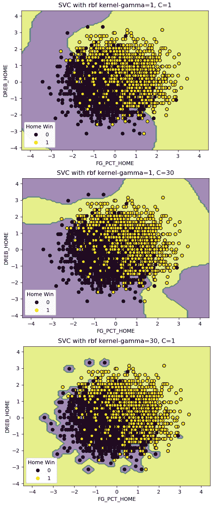

图 13.11 – 使用 rbf 核和不同 gamma 和 C 值的决策边界

在 `gamma` 和 `C` 的值接近默认值时，我们看到决策边界有一些弯曲，以适应损失类中的几个偏离的点。这些是主队尽管有很高的防守篮板总数却输掉比赛的情况。使用 `rbf` 核，其中两个这样的实例现在被正确分类。还有一些主队投篮命中率很高但防守篮板很低的实例，现在也被正确分类。然而，与上一节中的线性模型相比，我们的预测整体上并没有太大变化。

但如果我们增加 `C` 或 `gamma` 的值，这种变化会显著。回想一下，`C` 的较高值会增加误分类的惩罚。这导致边界围绕实例旋转。

将 `gamma` 增加到 `30` 会导致严重的过度拟合。`gamma` 的高值意味着数据点必须非常接近才能被分组在一起。这导致决策边界紧密地与少数实例相关联，有时甚至只有一个实例。

1.  我们还可以展示多项式核的边界。我们将保持默认的 `C` 值，以关注改变度数的影响：

    ```py
    dispbound(SVC(kernel='poly', degree=7),
      X_train_enc, ['FG_PCT_HOME','DREB_HOME'],
      y_train.values.ravel(),
      "SVC with polynomial kernel - degree=7")
    ```

以几种不同的方式运行此操作会产生以下图表：

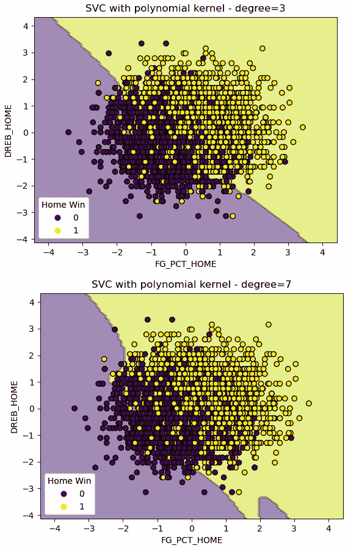

图 13.12 – 使用多项式核和不同度数的决策边界

我们可以看到在较高度数级别上决策边界的某些弯曲，以处理几个不寻常的实例。这里并没有过度拟合，但我们的预测也没有真正得到很大改善。

这至少暗示了当我们构建模型时可以期待什么。我们应该尝试一些非线性模型，但有很大可能性它们不会比我们在上一节中使用的线性模型带来太多改进。

1.  现在，我们已准备好设置我们将用于非线性 SVC 的管道。我们的管道将执行列转换和递归特征消除。我们使用逻辑回归进行特征选择：

    ```py
    rfecv = RFECV(estimator=LogisticRegression())
    svc = SVC()
    pipe1 = make_pipeline(ng.coltrans, rfecv, svc)
    ```

1.  我们创建一个字典用于我们的超参数调整。这个字典的结构与我们用于此目的的其他字典略有不同。这是因为某些超参数只能与某些其他超参数一起使用。例如，`gamma`不能与线性核一起使用：

    ```py
    svc_params = [
      {
        'svc__kernel': ['rbf'],
        'svc__C': uniform(loc=0, scale=20),
        'svc__gamma': uniform(loc=0, scale=100)
      },
      {
        'svc__kernel': ['poly'],
        'svc__degree': randint(1, 5),
        'svc__C': uniform(loc=0, scale=20),
        'svc__gamma': uniform(loc=0, scale=100)
      },
      {
        'svc__kernel': ['linear','sigmoid'],
        'svc__C': uniform(loc=0, scale=20)
      }
    ]
    ```

    注意

    你可能已经注意到我们将使用的一个核是线性的，并想知道这与我们在上一节中使用的线性 SVC 模块有何不同。`LinearSVC`通常会更快地收敛，尤其是在大型数据集上。它不使用核技巧。我们可能也会得到不同的结果，因为优化在几个方面都不同。

1.  现在我们已经准备好拟合一个 SVC 模型。最佳模型实际上是一个线性核的模型：

    ```py
    rs = RandomizedSearchCV(pipe1, svc_params, cv=5, 
      scoring='accuracy', n_iter=10, n_jobs=-1,
      verbose=5, random_state=0)
    rs.fit(X_train, y_train.values.ravel())
    rs.best_params_
    {'svc__C': 1.1342595463488636, 'svc__kernel': 'linear'}
    rs.best_score_
    0.9299405955437289
    ```

1.  让我们更仔细地看看选定的超参数和相关的准确率分数。我们可以从网格对象的`cv_results_`字典中获取`params`列表中的 20 个随机选择的超参数组合。我们也可以从同一个字典中获取平均测试分数。

我们按准确率分数降序排序。线性核优于多项式核和`rbf`核，尽管在`3`、`4`和`5`度上并不比多项式核显著更好。`rbf`核的表现尤其糟糕：

```py
results = \
  pd.DataFrame(rs.cv_results_['mean_test_score'], \
    columns=['meanscore']).\
  join(pd.json_normalize(rs.cv_results_['params'])).\
  sort_values(['meanscore'], ascending=False)
results
            C          gamma     kernel     degree
meanscore                              
0.93        1.13       NaN       linear     NaN
0.89        1.42       64.82     poly       3.00
0.89        9.55       NaN       sigmoid    NaN
0.89        11.36      NaN       sigmoid    NaN
0.89        2.87       75.86     poly       5.00
0.64        12.47      43.76     poly       4.00
0.64        15.61      72.06     poly       4.00
0.57        11.86      84.43     rbf        NaN
0.57        16.65      77.82     rbf        NaN
0.57        19.57      79.92     rbf        NaN
```

注意

我们使用 pandas 的`json_normalize`方法来处理我们从`params`列表中提取的有些混乱的超参数组合。这是因为不同的超参数取决于所使用的核。这意味着`params`列表中的 20 个字典将具有不同的键。例如，多项式核将具有度数的值。线性核和`rbf`核则没有。

1.  我们可以通过`best_estimator_`属性访问支持向量。有 625 个支持向量*支撑*着决策边界：

    ```py
    rs.best_estimator_['svc'].\
      support_vectors_.shape
    (625, 18)
    ```

1.  最后，我们可以看一下预测结果。不出所料，我们没有比上一节中运行的线性 SVC 模型得到更好的结果。我说不出所料，因为最佳模型被发现是一个线性核的模型：

    ```py
    pred = rs.predict(X_test)
    print("accuracy: %.2f, sensitivity: %.2f, specificity: %.2f, precision: %.2f"  %
      (skmet.accuracy_score(y_test.values.ravel(), pred),
      skmet.recall_score(y_test.values.ravel(), pred),
      skmet.recall_score(y_test.values.ravel(), pred, 
        pos_label=0),
      skmet.precision_score(y_test.values.ravel(), pred)))
    accuracy: 0.93, sensitivity: 0.94, specificity: 0.91, precision: 0.93
    ```

虽然我们没有改进上一节中的模型，但尝试一些非线性模型仍然是一项值得的练习。事实上，我们通常就是这样发现我们是否有可以成功线性分离的数据。这通常很难可视化，所以我们依赖于超参数调整来告诉我们哪个核最适合我们的数据。

本节和上一节展示了使用 SVM 进行二类分类的关键技术。我们迄今为止所做的大部分内容也适用于多类分类。在下一节中，当我们的目标值超过两个时，我们将探讨 SVC 建模策略。

# 多类分类的 SVM

当我们进行多类分类时，所有我们在使用 SVC 进行二类分类时遇到的问题都适用。我们需要确定类别是否线性可分，如果不是，哪个核将产生最佳结果。正如本章第一节所讨论的，我们还需要决定这种分类是否最好建模为一对一或一对多。一对一找到将每个类别与其他每个类别分开的决策边界。一对多找到将每个类别与所有其他实例区分开的决策边界。我们在本节中尝试这两种方法。

我们将使用我们在前几章中使用过的机器故障数据。

注意

这个关于机器故障的数据集可以在[`www.kaggle.com/datasets/shivamb/machine-predictive-maintenance-classification`](https://www.kaggle.com/datasets/shivamb/machine-predictive-maintenance-classification)上公开使用。有 10,000 个观测值，12 个特征，以及两个可能的目标。一个是二元的：机器故障或未故障。另一个是故障类型。这个数据集中的实例是合成的，由一个旨在模拟机器故障率和原因的过程生成。

让我们构建一个多类 SVC 模型：

1.  我们首先加载本章中一直在使用的相同库：

    ```py
    import pandas as pd
    from sklearn.model_selection import train_test_split
    from sklearn.preprocessing import OneHotEncoder, MinMaxScaler
    from sklearn.pipeline import make_pipeline
    from sklearn.svm import SVC
    from scipy.stats import uniform
    from sklearn.impute import SimpleImputer
    from sklearn.compose import ColumnTransformer
    from sklearn.model_selection import RandomizedSearchCV
    import sklearn.metrics as skmet
    import os
    import sys
    sys.path.append(os.getcwd() + "/helperfunctions")
    from preprocfunc import OutlierTrans
    ```

1.  我们将加载机器故障类型数据集并查看其结构。这里有字符和数值数据的混合。没有缺失值：

    ```py
    machinefailuretype = pd.read_csv("data/machinefailuretype.csv")
    machinefailuretype.info()
    <class 'pandas.core.frame.DataFrame'>
    RangeIndex: 10000 entries, 0 to 9999
    Data columns (total 10 columns):
     #   Column                 Non-Null Count     Dtype
    ---  ------                 --------------     -----  
     0   udi                    10000 non-null     int64
     1   product                10000 non-null     object 
     2   machinetype            10000 non-null     object 
     3   airtemp                10000 non-null     float64
     4   processtemperature     10000 non-null     float64
     5   rotationalspeed        10000 non-null     int64
     6   torque                 10000 non-null     float64
     7   toolwear               10000 non-null     int64
     8   fail                   10000 non-null     int64
     9   failtype               10000 non-null     object 
    dtypes: float64(3), int64(4), object(3)
    memory usage: 781.4+ KB
    ```

1.  让我们看看一些观测值：

    ```py
    machinefailuretype.head()
       udi product machinetype airtemp processtemperature\
    0  1   M14860       M         298        309 
    1  2   L47181       L         298        309 
    2  3   L47182       L         298        308 
    3  4   L47183       L         298        309 
    4  5   L47184       L         298        309 
       rotationalspeed  torque  toolwear  fail  failtype  
    0        1551         43        0       0   No Failure  
    1        1408         46        3       0   No Failure  
    2        1498         49        5       0   No Failure  
    3        1433         40        7       0   No Failure  
    4        1408         40        9       0   No Failure
    ```

1.  让我们也看看目标值的分布。我们有显著的类别不平衡，所以我们需要以某种方式处理这个问题：

    ```py
    machinefailuretype.failtype.\
      value_counts(dropna=False).sort_index()
    Heat Dissipation Failure     112
    No Failure                   9652
    Overstrain Failure           78
    Power Failure                95
    Random Failures              18
    Tool Wear Failure            45
    Name: failtype, dtype: int64
    ```

1.  我们可以通过为故障类型创建一个数字代码来节省一些麻烦，我们将使用这个数字代码而不是字符值。我们不需要将其放入管道中，因为我们没有在转换中引入任何数据泄露：

    ```py
    def setcode(typetext):
      if (typetext=="No Failure"):
        typecode = 1
      elif (typetext=="Heat Dissipation Failure"):
        typecode = 2
      elif (typetext=="Power Failure"):
        typecode = 3
      elif (typetext=="Overstrain Failure"):
        typecode = 4
      else:
        typecode = 5
      return typecode
    machinefailuretype["failtypecode"] = \
      machinefailuretype.apply(lambda x: setcode(x.failtype), axis=1)
    ```

1.  我们还应该查看一些描述性统计。我们需要对特征进行缩放：

    ```py
    num_cols = ['airtemp','processtemperature',
      'rotationalspeed','torque','toolwear']
    cat_cols = ['machinetype']
    machinefailuretype[num_cols].agg(['min','median','max']).T
                           min        median     max
    airtemp                295.30     300.10     304.50
    processtemperature     305.70     310.10     313.80
    rotationalspeed        1,168.00   1,503.00   2,886.00
    torque                 3.80       40.10      76.60
    toolwear               0.00       108.00     253.00
    ```

1.  现在让我们创建训练和测试数据框。我们还应该使用`stratify`参数来确保训练和测试数据中目标值的分布均匀：

    ```py
    X_train, X_test, y_train, y_test =  \
      train_test_split(machinefailuretype[num_cols + cat_cols],\
      machinefailuretype[['failtypecode']],\
      stratify=machinefailuretype[['failtypecode']], \
      test_size=0.2, random_state=0)
    ```

1.  我们设置了需要运行的列转换。对于数值列，我们将异常值设置为中位数，然后缩放值。我们对一个分类特征`machinetype`进行了一元编码。它有`H`、`M`和`L`值，分别代表高质量、中质量和低质量：

    ```py
    ohe = OneHotEncoder(drop='first', sparse=False)
    cattrans = make_pipeline(ohe)
    standtrans = make_pipeline(OutlierTrans(3),
      SimpleImputer(strategy="median"),
      MinMaxScaler())
    coltrans = ColumnTransformer(
      transformers=[
        ("cat", cattrans, cat_cols),
        ("stand", standtrans, num_cols),
      ]
    )
    ```

1.  接下来，我们设置一个包含列转换和 SVC 实例的管道。我们将`class_weight`参数设置为`balanced`以处理类别不平衡。这会应用一个与目标类别频率成反比的权重：

    ```py
    svc = SVC(class_weight='balanced', probability=True)
    pipe1 = make_pipeline(coltrans, svc)
    ```

在这种情况下，我们只有少量特征，所以我们不会担心特征选择。（我们可能仍然会担心高度相关的特征，但在这个数据集中这不是一个问题。）

1.  我们创建了一个字典，包含用于网格搜索的超参数组合。这基本上与我们在上一节中使用的字典相同，只是我们添加了一个决策函数形状键。这将导致网格搜索尝试一对一（`ovo`）和一对多（`ovr`）分类：

    ```py
    svc_params = [
      {
        'svc__kernel': ['rbf'],
        'svc__C': uniform(loc=0, scale=20),
        'svc__gamma': uniform(loc=0, scale=100),
        'svc__decision_function_shape': ['ovr','ovo']
      },
      {
        'svc__kernel': ['poly'],
        'svc__degree': np.arange(0,6),
        'svc__C': uniform(loc=0, scale=20),
        'svc__gamma': uniform(loc=0, scale=100),
        'svc__decision_function_shape': ['ovr','ovo']
      },
      {
        'svc__kernel': ['linear','sigmoid'],
        'svc__C': uniform(loc=0, scale=20),
        'svc__decision_function_shape': ['ovr','ovo']
      }
    ]
    ```

1.  现在我们已经准备好运行随机网格搜索。我们将基于 ROC 曲线下的面积来评分。最佳超参数包括一对一决策函数和`rbf`核：

    ```py
    rs = RandomizedSearchCV(pipe1, svc_params, cv=7, scoring="roc_auc_ovr", n_iter=10)
    rs.fit(X_train, y_train.values.ravel())
    rs.best_params_
    {'svc__C': 5.609789456747942,
     'svc__decision_function_shape': 'ovo',
     'svc__gamma': 27.73459801111866,
     'svc__kernel': 'rbf'}
    rs.best_score_
    0.9187636814475847
    ```

1.  让我们看看每次迭代的分数。除了我们在上一步中看到的最佳模型外，还有几个其他超参数组合的分数几乎一样高。使用线性核的一对多几乎与表现最好的模型一样好：

    ```py
    results = \
      pd.DataFrame(rs.cv_results_['mean_test_score'], \
        columns=['meanscore']).\
      join(pd.json_normalize(rs.cv_results_['params'])).\
      sort_values(['meanscore'], ascending=False)
    results
    meanscore  svc__C svc__decision_function_shape  svc__gamma svc__kernel
    7     0.92     5.61     ovo     27.73     rbf
    5     0.91     9.43     ovr     NaN       linear
    3     0.91     5.40     ovr     NaN       linear
    0     0.90     19.84    ovr     28.70     rbf
    8     0.87     5.34     ovo     93.87     rbf
    6     0.86     8.05     ovr     80.57     rbf
    9     0.86     4.41     ovo     66.66     rbf
    1     0.86     3.21     ovr     85.35     rbf
    4     0.85     0.01     ovo     38.24     rbf
    2     0.66     7.61     ovr     NaN       sigmoid
    ```

1.  我们应该看一下混淆矩阵：

    ```py
    pred = rs.predict(X_test)
    cm = skmet.confusion_matrix(y_test, pred)
    cmplot = skmet.ConfusionMatrixDisplay(confusion_matrix=cm,
       display_labels=['None', 'Heat','Power','Overstrain','Other'])
    cmplot.plot()
    cmplot.ax_.set(title='Machine Failure Type Confusion Matrix', 
      xlabel='Predicted Value', ylabel='Actual Value')
    ```

这产生了以下图表：

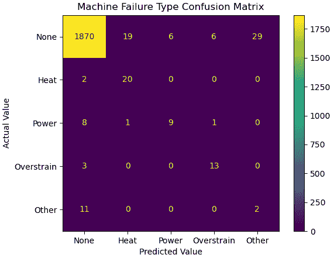

图 13.13 – 预测机器故障类型的混淆矩阵

1.  让我们也做一个分类报告。尽管我们的模型在预测热和过载故障方面做得相当不错，但对于大多数类别，我们并没有获得很高的敏感性分数：

    ```py
    print(skmet.classification_report(y_test, pred,
      target_names=['None', 'Heat','Power', 'Overstrain', 'Other']))
                  precision    recall  f1-score   support
            None       0.99      0.97      0.98      1930
            Heat       0.50      0.91      0.65        22
           Power       0.60      0.47      0.53        19
      Overstrain       0.65      0.81      0.72        16
           Other       0.06      0.15      0.09        13
        accuracy                           0.96      2000
       macro avg       0.56      0.66      0.59      2000
    weighted avg       0.97      0.96      0.96      2000
    ```

当建模目标，如具有高类别不平衡的机器故障类型时，我们通常更关心除了准确性之外的指标。这部分取决于我们的领域知识。避免假阴性可能比避免假阳性更重要。过早地对机器进行彻底检查肯定比过晚进行更好。

96%到 97%的加权精确度、召回率（敏感性）和 f1 分数并不能很好地反映我们模型的表现。它们主要反映了类别不平衡很大，以及预测没有机器故障非常容易的事实。远低于宏观平均值（这些只是类别间的简单平均值）表明，我们的模型在预测某些类型的机器故障方面存在困难。

这个例子说明了将 SVC 扩展到具有多于两个值的目标的模型相对容易。我们可以指定是否想要使用一对一或一对多分类。当类别数量超过三个时，一对一方法可能会更快，因为将训练更少的分类器。

# 摘要

在本章中，我们探讨了实现 SVC 的不同策略。我们使用了线性 SVC（不使用核），当我们的类别是线性可分时，它可以表现得非常好。然后我们检查了如何使用核技巧将 SVC 扩展到类别不可分的情况。最后，我们使用一对一和一对多分类来处理多于两个值的目标。

SVC 是一种特别有用的二分类和多分类技术。它能够处理特征与目标之间的简单和复杂关系。对于几乎所有的监督学习问题，SVMs 至少都应该被考虑。然而，它在处理非常大的数据集时效率并不高。

在下一章中，我们将探讨另一种流行且灵活的分类算法，朴素贝叶斯。
