# *第十四章*：朴素贝叶斯分类

本章中，我们将探讨在哪些情况下朴素贝叶斯可能比我们迄今为止考察的某些分类器更有效率。朴素贝叶斯是一个非常直观且易于实现的分类器。假设我们的特征是独立的，我们甚至可能比逻辑回归得到更好的性能，尤其是如果我们不使用后者进行正则化的话。

本章中，我们将讨论朴素贝叶斯的基本假设以及算法如何用于解决我们已探索的一些建模挑战，以及一些新的挑战，如文本分类。我们将考虑何时朴素贝叶斯是一个好的选择，何时不是。我们还将检查朴素贝叶斯模型的解释。

本章我们将涵盖以下主题：

+   关键概念

+   朴素贝叶斯分类模型

+   朴素贝叶斯用于文本分类

# 技术要求

本章中，我们将主要使用 pandas、NumPy 和 scikit-learn 库。唯一的例外是 imbalanced-learn 库，可以使用 `pip install imbalanced-learn` 安装。本章中的所有代码都使用 scikit-learn 版本 0.24.2 和 1.0.2 进行了测试。

# 关键概念

朴素贝叶斯分类器使用贝叶斯定理来预测类别成员资格。贝叶斯定理描述了事件发生的概率与给定新、相关数据的事件发生概率之间的关系。给定新数据的事件的概率称为**后验概率**。在新的数据之前发生事件的概率适当地称为**先验概率**。

贝叶斯定理给出了以下方程：

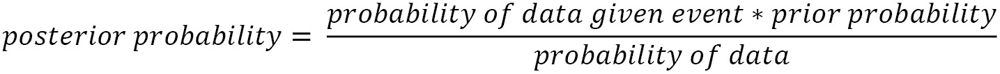

后验概率（给定新数据的事件的概率）等于数据给定事件的概率，乘以事件的先验概率，除以新数据的概率。

稍微不那么口语化地，这通常如下所示：

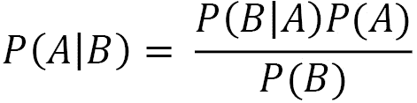

在这里，*A* 是一个事件，例如类别成员资格，而 *B* 是新信息。当应用于分类时，我们得到以下方程：

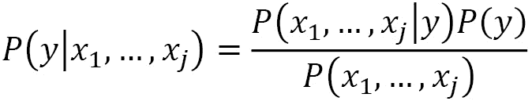

在这里，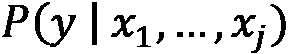 是给定实例的特征后实例属于该类别的概率，而 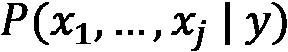 是给定类别成员资格的特征概率。*P(y)* 是类别成员资格的概率，而 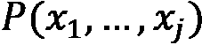 是特征值的概率。因此，后验概率，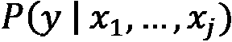，等于给定类别成员资格的特征值概率，乘以类别成员资格的概率，除以特征值的概率。

这里的假设是特征之间相互独立。这就是给这个方法带来*朴素*这个形容词的原因。然而，作为一个实际问题，特征独立性并不是使用朴素贝叶斯获得良好结果所必需的。

简单贝叶斯可以处理数值或分类特征。当我们主要拥有数值特征时，我们通常使用高斯贝叶斯。正如其名所示，高斯贝叶斯假设特征值的条件概率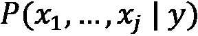遵循正态分布。然后可以使用每个类中特征的标准差和均值相对简单地计算出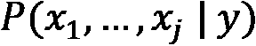。

当我们的特征是离散的或计数时，我们可以使用多项式贝叶斯。更普遍地说，当特征值的条件概率遵循多项式分布时，它效果很好。多项式贝叶斯的一个常见应用是与使用**词袋**方法的文本分类。在词袋中，特征是文档中每个词的计数。我们可以应用贝叶斯定理来估计类成员的概率：

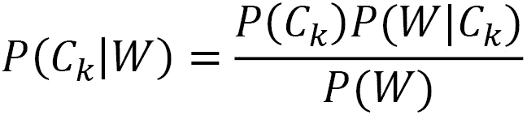

在这里，是给定一个词频向量*W*时属于*k*类的概率。我们将在本章的最后部分充分利用这一点。

简单贝叶斯适用于相当广泛的文本分类任务。它在情感分析、垃圾邮件检测和新闻故事分类等方面都有应用，仅举几个例子。

简单贝叶斯是一种既适用于训练又适用于预测的高效算法，并且通常表现良好。它相当可扩展，可以很好地处理大量实例和特征。它也非常容易解释。当模型复杂性对于良好的预测不是必需的时候，算法表现最佳。即使简单贝叶斯不太可能是产生最少偏差的方法，它也经常用于诊断目的，或者检查不同算法的结果。

我们在上一章中使用过的 NBA 数据可能是用简单贝叶斯建模的好候选。我们将在下一节中探讨这一点。

# 简单贝叶斯分类模型

简单贝叶斯的一个吸引力在于，即使数据量很大，你也能快速获得不错的结果。在系统资源上，拟合和预测都相对容易。另一个优点是，可以捕捉相对复杂的关系，而无需转换特征空间或进行大量的超参数调整。我们可以用我们在上一章中使用的 NBA 数据来证明这一点。

在本节中，我们将使用关于**国家篮球协会**（**NBA**）比赛的数据。该数据集包含了从 2017/2018 赛季到 2020/2021 赛季每场 NBA 比赛的统计数据。这包括主队；主队是否获胜；客队；客队和主队的投篮命中率；两队的失误、篮板和助攻；以及其他一些指标。

注意

NBA 比赛数据可以通过以下链接由公众下载：[`www.kaggle.com/datasets/wyattowalsh/basketball`](https://www.kaggle.com/datasets/wyattowalsh/basketball)。这个数据集包含从 1946/1947 赛季开始的比赛数据。它使用`nba_api`从`nba.com`获取统计数据。该 API 可在[`github.com/swar/nba_api`](https://github.com/swar/nba_api)找到。

让我们使用朴素贝叶斯构建一个分类模型：

1.  我们将加载我们在过去几章中使用过的相同库：

    ```py
    import pandas as pd
    import numpy as np
    from sklearn.model_selection import train_test_split
    from sklearn.preprocessing import OneHotEncoder, StandardScaler
    from sklearn.impute import SimpleImputer
    from sklearn.pipeline import make_pipeline
    from sklearn.compose import ColumnTransformer
    from sklearn.feature_selection import RFE
    from sklearn.naive_bayes import GaussianNB
    from sklearn.linear_model import LogisticRegression
    from sklearn.model_selection import cross_validate, \
      RandomizedSearchCV, RepeatedStratifiedKFold
    import sklearn.metrics as skmet
    import os
    import sys
    sys.path.append(os.getcwd() + "/helperfunctions")
    from preprocfunc import OutlierTrans
    ```

1.  接下来，我们将加载 NBA 比赛数据。在这里我们需要进行一些数据清理。一些观测值在主队是否获胜（`WL_HOME`）方面有缺失值。我们将删除这些值，因为那将是我们的目标。我们还将`WL_HOME`转换为整数。请注意，没有太多的类别不平衡，我们不需要采取激进的措施来处理它：

    ```py
    nbagames = pd.read_csv("data/nbagames2017plus.csv", parse_dates=['GAME_DATE'])
    nbagames = nbagames.loc[nbagames.WL_HOME.isin(['W','L'])]
    nbagames.shape
    (4568, 149)
    nbagames['WL_HOME'] = \
      np.where(nbagames.WL_HOME=='L',0,1).astype('int')
    nbagames.WL_HOME.value_counts(dropna=False)
    1    2586
    0    1982
    Name: WL_HOME, dtype: int64
    ```

1.  现在，让我们创建训练和测试数据框，按数值和分类特征组织它们。我们还应该生成一些描述性统计。由于我们在上一章中已经做了，所以这里不再重复；然而，回顾那些数字可能有助于为建模阶段做好准备：

    ```py
    num_cols = ['FG_PCT_HOME','FTA_HOME','FG3_PCT_HOME',
      'FTM_HOME','FT_PCT_HOME','OREB_HOME','DREB_HOME',
      'REB_HOME','AST_HOME','STL_HOME','BLK_HOME',
      'TOV_HOME', 'FG_PCT_AWAY','FTA_AWAY','FG3_PCT_AWAY',
      'FT_PCT_AWAY','OREB_AWAY','DREB_AWAY','REB_AWAY',
      'AST_AWAY','STL_AWAY','BLK_AWAY','TOV_AWAY']
    cat_cols = ['TEAM_ABBREVIATION_HOME','SEASON']
    X_train, X_test, y_train, y_test =  \
      train_test_split(nbagames[num_cols + cat_cols],\
      nbagames[['WL_HOME']], test_size=0.2,random_state=0)
    ```

1.  现在，我们需要设置列转换。我们将处理数值特征的异常值，将这些值和任何缺失值分配给中位数。然后，我们将使用标准缩放器。我们将为分类特征设置独热编码：

    ```py
    ohe = OneHotEncoder(drop='first', sparse=False)
    cattrans = make_pipeline(ohe)
    standtrans = make_pipeline(OutlierTrans(2),
      SimpleImputer(strategy="median"), StandardScaler())
    coltrans = ColumnTransformer(
      transformers=[
        ("cat", cattrans, cat_cols),
        ("stand", standtrans, num_cols)
      ]
    )
    ```

1.  现在，我们已经准备好运行一个朴素贝叶斯分类器。我们将在列转换和一些递归特征消除之后，将高斯朴素贝叶斯实例添加到一个管道中：

    ```py
    nb = GaussianNB()
    rfe = RFE(estimator=LogisticRegression(),
      n_features_to_select=15)
    pipe1 = make_pipeline(coltrans, rfe, nb)
    ```

1.  让我们用 K 折交叉验证来评估这个模型。我们得到了不错的分数，虽然不如上一章中支持向量分类的分数好：

    ```py
    kf = RepeatedStratifiedKFold(n_splits=7,n_repeats=10,\
      random_state=0)
    scores = cross_validate(pipe1, X_train, \
      y_train.values.ravel(), \
      scoring=['accuracy','precision','recall','f1'], \
      cv=kf, n_jobs=-1)
    print("accuracy: %.2f, precision: %.2f, 
      sensitivity: %.2f, f1: %.2f"  %
      (np.mean(scores['test_accuracy']),\
       np.mean(scores['test_precision']),\
       np.mean(scores['test_recall']),\
       np.mean(scores['test_f1'])))
    accuracy: 0.81, precision: 0.84, sensitivity: 0.83, f1: 0.83
    ```

1.  对于高斯朴素贝叶斯，我们只有一个超参数需要担心调整。我们可以通过`var_smoothing`超参数确定使用多少平滑度。我们可以进行随机网格搜索以找出最佳值。

`var_smoothing`超参数决定了添加到方差中的量，这将导致模型对接近平均值实例的依赖性降低：

```py
nb_params = {
    'gaussiannb__var_smoothing': np.logspace(0,-9, num=100)
}
rs = RandomizedSearchCV(pipe1, nb_params, cv=kf, \
  scoring='accuracy')
rs.fit(X_train, y_train.values.ravel())
```

1.  我们得到了更好的准确性：

    ```py
    rs.best_params_
    {'gaussiannb__var_smoothing': 0.657933224657568}
    rs.best_score_
    0.8608648056923919
    ```

1.  我们还应该查看不同迭代的结果。正如我们所见，较大的平滑值表现更好：

    ```py
    results = \
      pd.DataFrame(rs.cv_results_['mean_test_score'], \
        columns=['meanscore']).\
      join(pd.DataFrame(rs.cv_results_['params'])).\
      sort_values(['meanscore'], ascending=False)
    results
             meanscore     gaussiannb__var_smoothing
    2        0.86086        0.65793
    1        0.85118        0.03511
    9        0.81341        0.00152
    5        0.81212        0.00043
    7        0.81180        0.00019
    8        0.81169        0.00002
    3        0.81152        0.00000
    6        0.81152        0.00000
    0        0.81149        0.00000
    4        0.81149        0.00000
    ```

1.  我们还可以查看每次迭代的平均拟合和评分时间：

    ```py
    print("fit time: %.3f, score time: %.3f"  %
      (np.mean(rs.cv_results_['mean_fit_time']),\
      np.mean(rs.cv_results_['mean_score_time'])))
    fit time: 0.660, score time: 0.029
    ```

1.  让我们看看最佳模型的预测结果。除了提高准确性外，敏感性也有所提高，从`0.83`提升到`0.92`：

    ```py
    pred = rs.predict(X_test)
    print("accuracy: %.2f, sensitivity: %.2f, \
      specificity: %.2f, precision: %.2f"  %
      (skmet.accuracy_score(y_test.values.ravel(), pred),
      skmet.recall_score(y_test.values.ravel(), pred),
      skmet.recall_score(y_test.values.ravel(), pred, \
         pos_label=0),
      skmet.precision_score(y_test.values.ravel(), pred)))
    accuracy: 0.86, sensitivity: 0.92, specificity: 0.79, precision: 0.83
    ```

1.  同时查看一个混淆矩阵来更好地了解模型的表现也是一个好主意：

    ```py
    cm = skmet.confusion_matrix(y_test, pred)
    cmplot = skmet.ConfusionMatrixDisplay(
      confusion_matrix=cm, display_labels=['Loss', 'Won'])
    cmplot.plot()
    cmplot.ax_.set(title='Home Team Win Confusion Matrix', 
      xlabel='Predicted Value', ylabel='Actual Value')
    ```

这产生了以下图表：

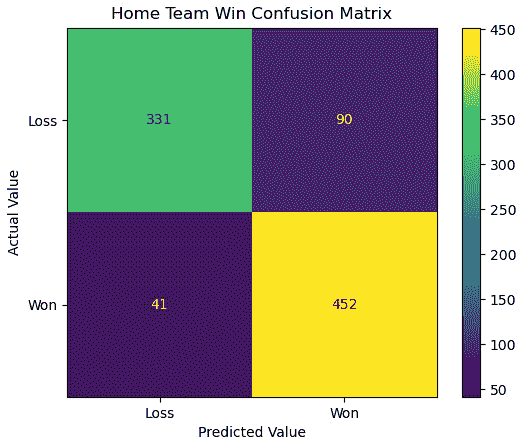

图 14.1 – 基于高斯朴素贝叶斯模型的主队获胜混淆矩阵

虽然这还不错，但仍然不如我们之前章节中的支持向量模型好。特别是，我们希望在预测损失方面做得更好。这也在我们之前步骤中看到的相对较低的**0.79**特异性得分中得到了反映。记住，特异性是我们正确预测实际负值的负值比率。

另一方面，拟合和评分运行得相当快。我们也不需要做太多的超参数调整。朴素贝叶斯在建模二元或多类目标时通常是一个好的起点。

朴素贝叶斯已经成为文本分类中更受欢迎的选项。我们将在下一节中使用它。

# 文本分类的朴素贝叶斯

也许令人惊讶的是，一个基于计算条件概率的算法对文本分类是有用的。但这与一个关键简化假设相当直接。让我们假设我们的文档可以通过文档中每个单词的计数很好地表示，不考虑单词顺序或语法。这被称为词袋。词袋与分类目标之间的关系——比如说，垃圾邮件/非垃圾邮件或正面/负面——可以用多项式朴素贝叶斯成功建模。

在本节中，我们将使用短信数据。我们将使用的数据集包含垃圾邮件和非垃圾邮件的标签。

注意

该短信数据集可以通过[`www.kaggle.com/datasets/team-ai/spam-text-message-classification`](https://www.kaggle.com/datasets/team-ai/spam-text-message-classification)供公众下载。它包含两列：短信文本和垃圾邮件或非垃圾邮件（ham）标签。

让我们用朴素贝叶斯进行一些文本分类：

1.  我们将需要几个我们在这本书中尚未使用的模块。我们将导入`MultinomialNB`，这是我们构建多项式朴素贝叶斯模型所需的。我们还需要`CountVectorizer`来创建词袋。我们将导入`SMOTE`模块来处理类别不平衡。请注意，我们将使用一个*imbalanced-learn*管道而不是一个*scikit-learn*管道。这是因为我们将在我们的管道中使用`SMOTE`：

    ```py
    import pandas as pd
    import numpy as np
    from sklearn.model_selection import train_test_split
    from imblearn.pipeline import make_pipeline
    from imblearn.over_sampling import SMOTE
    from sklearn.naive_bayes import MultinomialNB
    from sklearn.feature_extraction.text import CountVectorizer
    import sklearn.metrics as skmet
    ```

    注意

    在本节中，我们使用`SMOTE`进行过采样；也就是说，我们将复制代表性不足的类别的实例。当我们担心我们的模型在捕捉一个类别的变化方面做得不好，因为我们相对于一个或多个其他类别的实例太少时，过采样可以是一个好的选择。过采样会复制该类别的实例。

1.  接下来，我们将加载短信数据集。我们将把我们的目标转换为整数变量，并确认它按预期工作。注意显著的类别不平衡。让我们查看前几行，以更好地了解数据：

    ```py
    spamtext = pd.read_csv("data/spamtext.csv")
    spamtext['spam'] = np.where(spamtext.category=='spam',1,0)
    spamtext.groupby(['spam','category']).size()
    spam  category
    0     ham         4824
    1     spam         747
    dtype: int64
    spamtext.head()
     category  message                                spam
    0  ham     Go until jurong point, crazy..         0
    1  ham     Ok lar... Joking wif u oni...          0
    2  spam    Free entry in 2 a wkly comp to win...  1
    3  ham     U dun say so early hor... U c already..0
    4  ham     Nah I don't think he goes to usf, ..   0
    ```

1.  现在，我们创建训练和测试数据框。我们将使用`stratify`参数来确保训练和测试数据中目标值的分布相等。

我们还将实例化一个`CountVectorizer`对象来创建我们后面的词袋。我们指出我们想要忽略一些单词，因为它们不提供有用的信息。我们本可以创建一个停用词列表，但在这里，我们将利用 scikit-learn 的英文停用词列表：

```py
X_train, X_test, y_train, y_test =  \
  train_test_split(spamtext[['message']],\
  spamtext[['spam']], test_size=0.2,\
  stratify=spamtext[['spam']], random_state=0)
countvectorizer = CountVectorizer(analyzer='word', \
  stop_words='english')
```

1.  让我们看看向量器是如何与我们的数据中的几个观察结果一起工作的。为了便于查看，我们只会从包含少于 50 个字符的消息中提取信息。

使用向量器，我们为每个观察结果中使用的所有非停用词获取计数。例如，`like`在第一条消息中使用了一次，而在第二条消息中一次也没有使用。这给`like`在转换数据中的第一个观察结果赋予了一个值为`1`，而在第二个观察结果中赋予了一个值为`0`。

我们不会在我们的模型中使用这一步骤中的任何内容。我们这样做只是为了说明目的：

```py
smallsample = \
  X_train.loc[X_train.message.str.len()<50].\
    sample(2, random_state=35)
smallsample
                                        message
2079                I can take you at like noon
5393  I dont know exactly could you ask chechi.
ourvec = \
    pd.DataFrame(countvectorizer.\
    fit_transform(smallsample.values.ravel()).\
    toarray(),\
    columns=countvectorizer.get_feature_names())
ourvec
    ask   chechi  dont   exactly  know  like  noon
0    0    0       0      0        0     1     1
1    1    1       1      1        1     0     0
```

1.  现在，让我们实例化一个`MultinomialNB`对象并将其添加到管道中。我们将使用`SMOTE`进行过采样以处理类别不平衡：

    ```py
    nb = MultinomialNB()
    smote = SMOTE(random_state=0)
    pipe1 = make_pipeline(countvectorizer, smote, nb)
    pipe1.fit(X_train.values.ravel(), 
      y_train.values.ravel())
    ```

1.  现在，让我们看看一些预测结果。我们得到了令人印象深刻的**0.97**准确率和同样好的特异性。这种出色的特异性表明我们没有许多误报。相对较低的反应性表明我们没有捕捉到一些正例（垃圾邮件），尽管我们仍然做得相当不错：

    ```py
    pred = pipe1.predict(X_test.values.ravel())
    print("accuracy: %.2f, sensitivity: %.2f, specificity: %.2f, precision: %.2f"  %
      (skmet.accuracy_score(y_test.values.ravel(), pred),
      skmet.recall_score(y_test.values.ravel(), pred),
      skmet.recall_score(y_test.values.ravel(), pred, pos_label=0),
      skmet.precision_score(y_test.values.ravel(), pred)))
    accuracy: 0.97, sensitivity: 0.87, specificity: 0.98, precision: 0.87
    ```

1.  使用混淆矩阵可视化我们模型的表现是有帮助的：

    ```py
    cm = skmet.confusion_matrix(y_test, pred)
    cmplot = skmet.ConfusionMatrixDisplay(
      confusion_matrix=cm, \
      display_labels=['Not Spam', 'Spam'])
    cmplot.plot()
    cmplot.ax_.set(
      title='Spam Prediction Confusion Matrix', 
      xlabel='Predicted Value', ylabel='Actual Value')
    ```

这会产生以下图表：

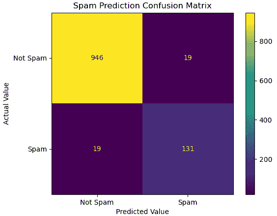

图 14.2 – 使用多项式朴素贝叶斯进行垃圾邮件预测

朴素贝叶斯在构建文本分类模型时可以产生很好的结果。指标通常非常好且非常高效。这是一个非常直接的二元分类问题。然而，朴素贝叶斯也可以在多类文本分类问题中有效。该算法可以以与我们在这里使用多类目标相同的方式应用。

# 摘要

朴素贝叶斯是一个很好的算法，可以添加到我们的常规工具包中，用于解决分类问题。它并不总是产生最少偏差的预测方法。然而，另一方面也是真的。过拟合的风险较小，尤其是在处理连续特征时。它也非常高效，能够很好地扩展到大量观察和大量特征空间。

本书接下来的两章将探讨无监督学习算法——那些我们没有预测目标的情况。在下一章中，我们将研究主成分分析，然后在下一章中研究 K-means 聚类。
