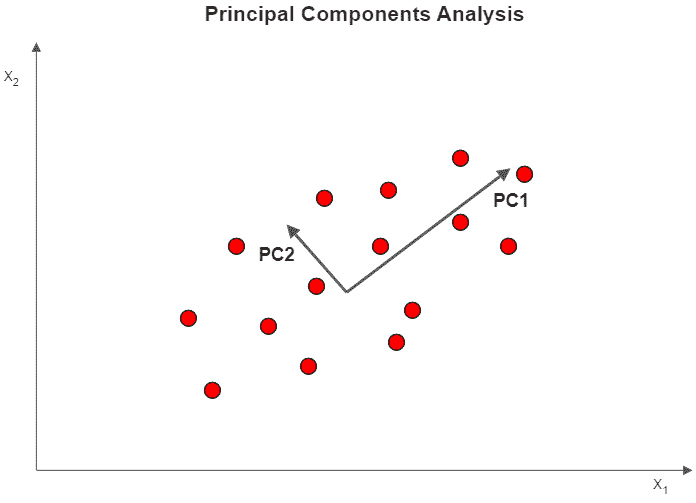
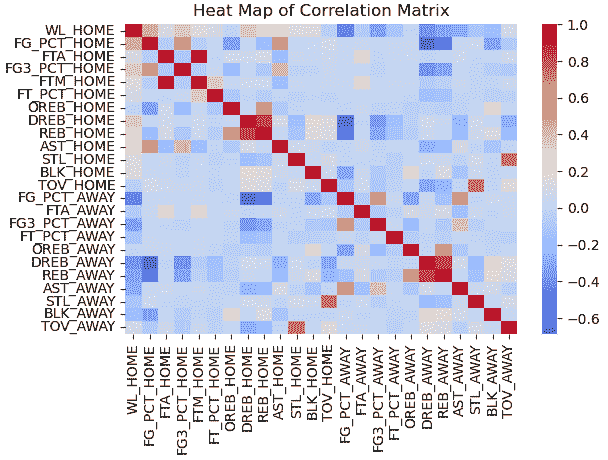
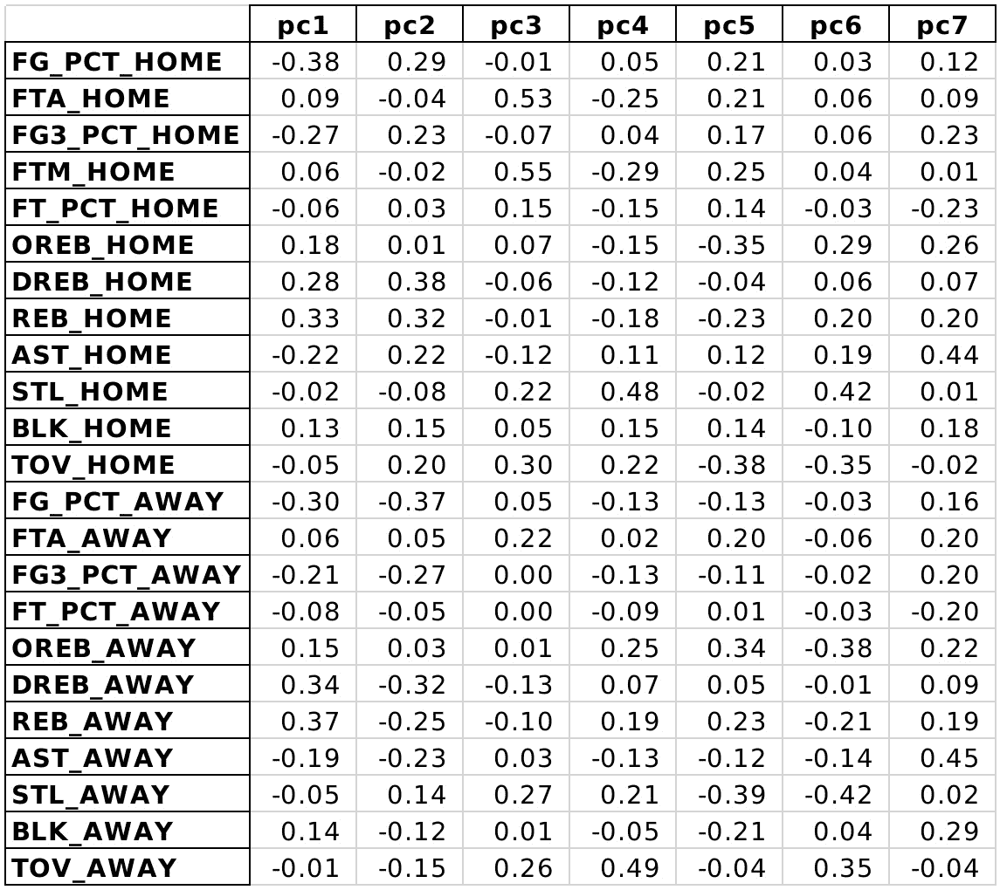
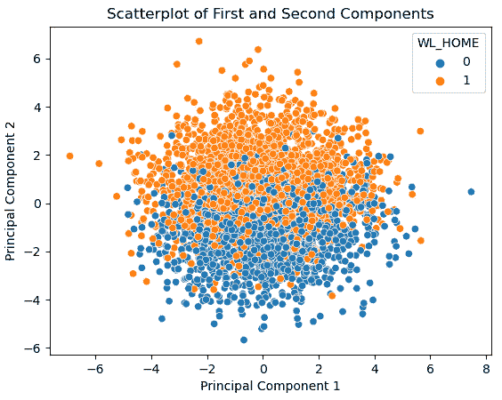
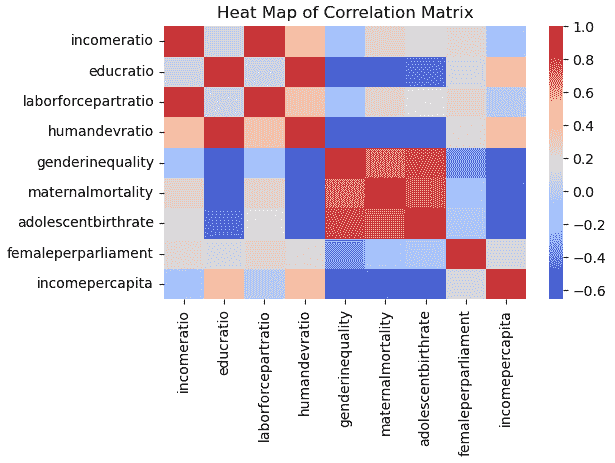

# *第十五章*: 主成分分析

维度降低是机器学习中的重要概念/策略之一。有时它与特征选择等同，但这是对维度降低过于狭隘的看法。我们的模型通常必须处理过多的特征，其中一些特征正在捕获相同的信息。不解决这一问题会大大增加过拟合或不稳定结果的风险。但放弃我们的一些特征并不是我们工具箱中唯一的工具。特征提取策略，如**主成分分析**（**PCA**），通常可以产生良好的结果。

我们可以使用 PCA 在不损失显著预测能力的情况下降低数据集的维度（特征数量）。通常，捕捉数据中大部分方差所需的主成分数量小于特征数量，通常要少得多。

这些成分可以用在我们的回归或分类模型中，而不是初始特征。这不仅能够加快我们的模型学习速度，还可能降低我们估计的方差。这种特征提取策略的关键缺点是，新特征通常更难以解释。当我们有分类特征时，PCA 也不是一个好的选择。

我们将通过首先检查每个成分是如何构建的来发展我们对 PCA 工作原理的理解。我们将构建一个 PCA，解释结果，然后在一个分类模型中使用这些结果。最后，当我们的成分可能不是线性可分时，我们将使用核来改进 PCA。

具体来说，在本章中我们将探讨以下主题：

+   PCA 的关键概念

+   使用 PCA 进行特征提取

+   使用 PCA 的核

# 技术要求

在本章中，我们将主要使用 pandas、NumPy 和 scikit-learn 库。所有代码都使用 scikit-learn 版本 0.24.2 和 1.0.2 进行了测试。

本章的代码可以从 GitHub 仓库下载：[`github.com/PacktPublishing/Data-Cleaning-and-Exploration-with-Machine-Learning`](https://github.com/PacktPublishing/Data-Cleaning-and-Exploration-with-Machine-Learning)。

# PCA 的关键概念

PCA 产生多个特征组合，每个组合都是一个成分。它识别出一个成分，该成分捕捉到最大的方差量，然后是一个第二个成分，该成分捕捉到剩余的最大方差量，接着是第三个成分，以此类推，直到达到我们指定的停止点。这个停止点可以是基于成分的数量、解释的变异百分比或领域知识。

主成分的一个非常有用的特性是它们是相互正交的。这意味着它们是不相关的，这对建模来说是个好消息。*图 15.1*展示了由特征 x1 和 x2 构建的两个成分。最大方差由*PC1*捕获，剩余的最大方差由*PC2*捕获。（图中的数据点是虚构的。）请注意，这两个向量是正交的（垂直的）。



图 15.1 – 具有两个特征的 PCA 示意图

那些做过大量因子分析的人可能已经得到了一个大致的概念，即使这是你们第一次探索 PCA。主成分与因子并没有很大差别，尽管它们在概念和数学上存在一些差异。在 PCA 中，分析的是所有的方差。而因子分析只分析变量之间的共享方差。在因子分析中，未观察到的因子被认为是**导致**了观察到的变量。在 PCA 中不需要对潜在的、未观察到的力量做出任何假设。

那么，这个计算上的魔法是如何实现的呢？主成分可以通过以下步骤计算得出：

1.  标准化你的数据。

1.  计算你的变量的协方差矩阵。

1.  计算协方差矩阵的特征向量和特征值。

1.  按特征值降序排列特征向量。第一个特征向量是主成分 1，第二个是主成分 2，依此类推。

完全理解这些步骤并不是理解本章其余部分讨论的必要条件。我们将让 scikit-learn 为我们完成这项工作。尽管如此，如果你计算了一个非常小的数据子集（两三列和几行）的协方差矩阵，然后计算该矩阵的特征分解，这可能会提高你的直觉。一个相对简单的方法来实验构建成分，同时仍然具有说明性，是使用 NumPy 线性代数函数（`numpy.linalg`）。这里的关键点是推导主成分的计算有多么简单。

PCA 被用于许多机器学习任务。它可以用于调整图像大小，分析金融数据，或用于推荐系统。本质上，它可能是一个在有许多特征且许多特征相关的情况下适用的好选择。

你们中的一些人无疑已经注意到，我在没有特别指出的情况下，提到了 PCA 构建**特征线性组合**。当线性可分性不可行时，比如我们在支持向量机中遇到的情况，我们该怎么办？好吧，结果是我们依赖的支持向量机的核技巧也适用于 PCA。在本章中，我们将探讨如何实现核 PCA。然而，我们将从一个相对简单的 PCA 示例开始。

# 使用 PCA 进行特征提取

PCA 可用于在准备随后运行的模型之前进行降维。尽管 PCA 严格来说不是一个特征选择工具，但我们可以以与我们在*第五章*中运行的包装特征选择方法相同的方式运行它，即*特征选择*。经过一些预处理（如处理异常值）后，我们生成组件，然后我们可以将它们用作我们的新特征。有时我们实际上并不在模型中使用这些组件。相反，我们主要生成它们来帮助我们更好地可视化数据。

为了说明 PCA 的使用，我们将与**国家篮球协会**（**NBA**）比赛的有关数据一起工作。该数据集包含了从 2017/2018 赛季到 2020/2021 赛季每场 NBA 比赛的统计数据。这包括主队；主队是否获胜；客队；客队和主队的投篮命中率；两队的失误、篮板和助攻；以及其他一些指标。

注意

NBA 比赛数据可在[`www.kaggle.com/datasets/wyattowalsh/basketball`](https://www.kaggle.com/datasets/wyattowalsh/basketball)供公众下载。该数据集从 1946/1947 赛季的 NBA 赛季开始。它使用`nba_api`从 nba.com 获取统计数据。该 API 可在[`github.com/swar/nba_api`](https://github.com/swar/nba_api)找到。

让我们在模型中使用 PCA：

1.  我们首先加载所需的库。您在之前的章节中已经看到了所有这些库，除了 scikit-learn 的`PCA`模块：

    ```py
    import pandas as pd
    import numpy as np
    from sklearn.model_selection import train_test_split
    from sklearn.preprocessing import StandardScaler
    from sklearn.pipeline import make_pipeline
    from sklearn.impute import SimpleImputer
    from sklearn.linear_model import LogisticRegression
    from sklearn.decomposition import PCA
    from sklearn.model_selection import RandomizedSearchCV
    from scipy.stats import uniform
    from scipy.stats import randint
    import os
    import sys
    sys.path.append(os.getcwd() + “/helperfunctions”)
    from preprocfunc import OutlierTrans
    ```

1.  接下来，我们加载 NBA 数据并进行一些清理。有几个实例没有主队是否获胜的值，`WL_HOME`，所以我们删除了它们。`WL_HOME`将是我们的目标。我们将在构建我们的组件之后尝试对其进行建模。请注意，主队大多数时候都会获胜，但类别不平衡并不严重：

    ```py
    nbagames = pd.read_csv(“data/nbagames2017plus.csv”, parse_dates=[‘GAME_DATE’])
    nbagames = nbagames.loc[nbagames.WL_HOME.isin([‘W’,’L’])]
    nbagames.shape
    (4568, 149)
    nbagames[‘WL_HOME’] = \
      np.where(nbagames.WL_HOME==’L’,0,1).astype(‘int’)
    nbagames.WL_HOME.value_counts(dropna=False)
    1    2586
    0    1982
    Name: WL_HOME, dtype: int64
    ```

1.  我们应该查看一些描述性统计：

    ```py
    num_cols = [‘FG_PCT_HOME’,’FTA_HOME’,’FG3_PCT_HOME’,
      ‘FTM_HOME’,’FT_PCT_HOME’,’OREB_HOME’,’DREB_HOME’,
      ‘REB_HOME’,’AST_HOME’,’STL_HOME’,’BLK_HOME’,
      ‘TOV_HOME’, ‘FG_PCT_AWAY’,’FTA_AWAY’,’FG3_PCT_AWAY’,
      ‘FT_PCT_AWAY’,’OREB_AWAY’,’DREB_AWAY’,’REB_AWAY’,
      ‘AST_AWAY’,’STL_AWAY’,’BLK_AWAY’,’TOV_AWAY’]
    nbagames[[‘WL_HOME’] + num_cols].agg([‘count’,’min’,’median’,’max’]).T
    ```

这产生了以下输出。没有缺失值，但我们的特征范围差异很大。我们需要进行一些缩放：

```py
                count       min     median    max
WL_HOME         4,568.00    0.00    1.00      1.00
FG_PCT_HOME     4,568.00    0.27    0.47      0.65
FTA_HOME        4,568.00    1.00    22.00     64.00
FG3_PCT_HOME    4,568.00    0.06    0.36      0.84
FTM_HOME        4,568.00    1.00    17.00     44.00
FT_PCT_HOME     4,568.00    0.14    0.78      1.00
OREB_HOME       4,568.00    1.00    10.00     25.00
DREB_HOME       4,568.00    18.00   35.00     55.00
REB_HOME        4,568.00    22.00   45.00     70.00
AST_HOME        4,568.00    10.00   24.00     50.00
STL_HOME        4,568.00    0.00    7.00      22.00
BLK_HOME        4,568.00    0.00    5.00      20.00
TOV_HOME        4,568.00    1.00    14.00     29.00
FG_PCT_AWAY     4,568.00    0.28    0.46      0.67
FTA_AWAY        4,568.00    3.00    22.00     54.00
FG3_PCT_AWAY    4,568.00    0.08    0.36      0.78
FT_PCT_AWAY     4,568.00    0.26    0.78      1.00
OREB_AWAY       4,568.00    0.00    10.00     26.00
DREB_AWAY       4,568.00    18.00   34.00     56.00
REB_AWAY        4,568.00    22.00   44.00     71.00
AST_AWAY        4,568.00    9.00    24.00     46.00
STL_AWAY        4,568.00    0.00    8.00      19.00
BLK_AWAY        4,568.00    0.00    5.00      15.00
TOV_AWAY        4,568.00    3.00    14.00     30.00
```

1.  让我们也检查我们的特征是如何相关的：

    ```py
    corrmatrix = nbagames[[‘WL_HOME’] + num_cols].\
      corr(method=”pearson”)
    sns.heatmap(corrmatrix, xticklabels=corrmatrix.columns,
      yticklabels=corrmatrix.columns, cmap=”coolwarm”)
    plt.title(‘Heat Map of Correlation Matrix’)
    plt.tight_layout()
    plt.show()
    ```

这产生了以下图表：



图 15.2 – NBA 特征的散点图

许多特征与正或负相关显著。例如，主队的投篮命中率（射门）(`FG_PCT_HOME`)和主队的 3 分投篮命中率(`FG3_PCT_HOME`)正相关，这并不令人惊讶。此外，主队的篮板(`REB_HOME`)和防守篮板(`DREB_HOME`)可能过于紧密地相关，以至于任何模型都无法分离它们的影响。

这个数据集可能是 PCA 的良好候选者。尽管一些特征高度相关，但我们仍然会通过删除一些特征而丢失信息。PCA 至少提供了处理相关性而不丢失这些信息的机会。

1.  现在我们创建训练和测试数据框：

    ```py
    X_train, X_test, y_train, y_test =  \
      train_test_split(nbagames[num_cols],\
      nbagames[[‘WL_HOME’]],test_size=0.2, random_state=0)
    ```

1.  现在，我们准备创建这些成分。我们有些任意地指出我们想要七个成分。（稍后，我们将使用超参数调整来选择成分的数量。）我们在运行 PCA 之前设置我们的管道进行一些预处理：

    ```py
    pca = PCA(n_components=7)
    pipe1 = make_pipeline(OutlierTrans(2),
          SimpleImputer(strategy=”median”),
          StandardScaler(), pca)
    pipe1.fit(X_train)
    ```

1.  现在，我们可以使用`pca`对象的`components_`属性。这返回了所有 23 个特征在每个七个成分上的得分：

    ```py
    components = pd.DataFrame(pipe1[‘pca’].components_,
      columns=num_cols)
    components.T.to_excel(‘views/components.xlsx’)
    ```

这生成了以下电子表格：



图 15.3 – NBA 特征的成分图

每个特征在每个成分中解释了部分方差。（如果对每个成分，你对 23 个得分中的每一个进行平方然后求和，你得到总和为 1。）如果你想了解哪些特征真正驱动了成分，寻找那些具有最大绝对值的特征。对于成分 1，主队的投篮命中率（`FG_PCT_HOME`）是最重要的，其次是客队的篮板球数（`REB_AWAY`）。

回想一下本章开头我们讨论的内容，每个成分试图捕捉在之前成分或成分之后剩余的方差。

1.  让我们展示前三个成分最重要的五个特征。第一个成分似乎主要关于主队的投篮命中率以及每个队的篮板球。第二个成分看起来并没有太大区别，但第三个成分是由主队做出的投篮和尝试（`FTM_HOME`和`FTA_HOME`）以及失误（`TOV_HOME`和`TOV_AWAY`）驱动的：

    ```py
    components.pc1.abs().nlargest(5)
    FG_PCT_HOME    0.38
    REB_AWAY       0.37
    DREB_AWAY      0.34
    REB_HOME       0.33
    FG_PCT_AWAY    0.30
    Name: pc1, dtype: float64
    components.pc2.abs().nlargest(5)
    DREB_HOME      0.38
    FG_PCT_AWAY    0.37
    DREB_AWAY      0.32
    REB_HOME       0.32
    FG_PCT_HOME    0.29
    Name: pc2, dtype: float64
    components.pc3.abs().nlargest(5)
    FTM_HOME    0.55
    FTA_HOME    0.53
    TOV_HOME    0.30
    STL_AWAY    0.27
    TOV_AWAY    0.26
    Name: pc3, dtype: float64
    ```

1.  我们可以使用`pca`对象的`explained_variance_ratio_`属性来检查每个成分捕获了多少方差。第一个成分解释了特征方差的 14.5%。第二个成分解释了另一个 13.4%。如果我们使用 NumPy 的`cumsum`方法，我们可以看到七个成分总共解释了约 65%的方差。

因此，仍然存在相当多的方差。我们可能想要在构建任何模型时使用更多的成分：

```py
np.set_printoptions(precision=3)
pipe1[‘pca’].explained_variance_ratio_
array([0.145, 0.134, 0.095, 0.086, 0.079, 0.059, 0.054])
np.cumsum(pipe1[‘pca’].explained_variance_ratio_)
array([0.145, 0.279, 0.374, 0.46 , 0.539, 0.598, 0.652])
```

1.  我们可以将前两个主成分绘制出来，看看它们能多好地分离主队的胜负。我们可以使用管道的`transform`方法创建一个包含主成分的数据框，并将其与目标数据框连接起来。

我们使用 Seaborn 的`scatterplot`的便捷`hue`属性来显示胜负情况。前两个主成分在仅占特征总方差约 28%的情况下，还算不错地分离了胜负：

```py
X_train_pca = pd.DataFrame(pipe1.transform(X_train),
  columns=components.columns, index=X_train.index).join(y_train)
sns.scatterplot(x=X_train_pca.pc1, y=X_train_pca.pc2, hue=X_train_pca.WL_HOME)
plt.title(“Scatterplot of First and Second Components”)
plt.xlabel(“Principal Component 1”)
plt.ylabel(“Principal Component 2”)
plt.show()
```

这生成了以下图表：



图 15.4 – 第一和第二个主成分的胜负散点图

1.  让我们使用主成分来预测主队是否会获胜。我们只需在我们的管道中添加一个逻辑回归即可。我们还进行网格搜索以找到最佳超参数值：

    ```py
    lr = LogisticRegression()
    pipe2 = make_pipeline(OutlierTrans(2),
      SimpleImputer(strategy=”median”), StandardScaler(),
      pca, lr)
    lr_params = {
      “pca__n_components”: randint(3, 20),
      “logisticregression__C”: uniform(loc=0, scale=10)
    }
    rs = RandomizedSearchCV(pipe2, lr_params, cv=4, 
      n_iter=40, scoring=’accuracy’, random_state=1)
    rs.fit(X_train, y_train.values.ravel())
    ```

1.  现在，我们可以查看最佳参数和得分。正如我们之前一步所怀疑的那样，网格搜索表明我们的逻辑回归模型在更多组件的情况下表现更好。我们得到了一个非常高的分数。

我们在*第十章**中详细讨论了超参数*C*，即逻辑回归：

```py
rs.best_params_
{‘logisticregression__C’: 6.865009276815837, ‘pca__n_components’: 19}
rs.best_score_
0.9258345296842831
```

本节展示了如何从我们的数据集中生成主成分以及如何解释这些成分。我们还探讨了如何在模型中使用主成分而不是初始特征。但我们假设主成分可以很好地描述为特征的线性组合。这通常并不是情况。在下一节中，我们将使用核 PCA 来处理非线性关系。

# 使用 PCA 核

对于某些数据，无法构建出线性可分的主成分。在建模之前，这可能实际上不容易可视化。幸运的是，我们有工具可以使用来确定将产生最佳结果的核，包括线性核。使用线性核的核 PCA 应该与标准 PCA 的表现相似。

在本节中，我们将使用核 PCA 对劳动力参与率、教育成就、青少年出生频率以及国家层面的性别政治参与数据等特征进行特征提取。

注意

该性别在教育成果和劳动力成果方面的差异数据集由联合国开发计划署在[`www.kaggle.com/datasets/undp/human-development`](https://www.kaggle.com/datasets/undp/human-development)提供，供公众使用。每个国家有一个记录，包括 2015 年按性别汇总的就业、收入和教育数据。

让我们开始构建模型：

1.  我们将导入我们一直在使用的相同库以及 scikit-learn 的`KernelPCA`模块。我们还将导入`RandomForestRegressor`模块：

    ```py
    import pandas as pd
    import numpy as np
    from sklearn.model_selection import train_test_split
    from sklearn.preprocessing import MinMaxScaler
    from sklearn.pipeline import make_pipeline
    from sklearn.impute import SimpleImputer
    from sklearn.decomposition import KernelPCA
    from sklearn.ensemble import RandomForestRegressor
    from sklearn.model_selection import RandomizedSearchCV
    import seaborn as sns
    import matplotlib.pyplot as plt
    import os
    import sys
    sys.path.append(os.getcwd() + “/helperfunctions”)
    from preprocfunc import OutlierTrans
    ```

1.  我们根据性别加载教育和劳动力成果数据。我们构建了女性与男性收入比、教育年限比、劳动力参与比和人类发展指数比的时间序列：

    ```py
    un_income_gap = pd.read_csv(“data/un_income_gap.csv”)
    un_income_gap.set_index(‘country’, inplace=True)
    un_income_gap[‘incomeratio’] = \
      un_income_gap.femaleincomepercapita / \
        un_income_gap.maleincomepercapita
    un_income_gap[‘educratio’] = \
      un_income_gap.femaleyearseducation / \
         un_income_gap.maleyearseducation
    un_income_gap[‘laborforcepartratio’] = \
      un_income_gap.femalelaborforceparticipation / \
         un_income_gap.malelaborforceparticipation
    un_income_gap[‘humandevratio’] = \
      un_income_gap.femalehumandevelopment / \
         un_income_gap.malehumandevelopment
    un_income_gap.dropna(subset=[‘incomeratio’], inplace=True)
    ```

1.  让我们查看一些描述性统计。有一些缺失值，尤其是对于`genderinequality`和`humandevratio`。一些特征的范围比其他特征大得多：

    ```py
    num_cols = [‘educratio’,’laborforcepartratio’,
      ‘humandevratio’,’genderinequality’,
      ‘maternalmortality’,’adolescentbirthrate’,
      ‘femaleperparliament’,’incomepercapita’]
    gap_sub = un_income_gap[[‘incomeratio’] + num_cols]
    gap_sub.\
      agg([‘count’,’min’,’median’,’max’]).T
                           count    min    median  max
    incomeratio            177.00   0.16   0.60    0.93
    educratio              169.00   0.24   0.93    1.35
    laborforcepartratio    177.00   0.19   0.75    1.04
    humandevratio          161.00   0.60   0.95    1.03
    genderinequality       155.00   0.02   0.39    0.74
    maternalmortality     174.00   1.00   60.00  1,100.00
    adolescentbirthrate    177.00   0.60   40.90  204.80
    femaleperparliament    174.00   0.00   19.35    57.50
    incomepercapita        177.00   581.00 10,512.00  123,124.00
    ```

1.  我们还应该查看一些相关性：

    ```py
    corrmatrix = gap_sub.corr(method=”pearson”)
    sns.heatmap(corrmatrix, 
      xticklabels=corrmatrix.columns,
      yticklabels=corrmatrix.columns, cmap=”coolwarm”)
    plt.title(‘Heat Map of Correlation Matrix’)
    plt.tight_layout()
    plt.show()
    ```

这产生了以下图表：



图 15.5 – NBA 比赛数据的相关矩阵

`humandevratio`和`educratio`高度相关，同样`genderinequality`和`adolescentbirthrate`也高度相关。我们可以看到`educratio`和`maternalmortality`高度负相关。考虑到这些特征的高度相关性，构建一个表现良好的模型可能会有困难。然而，我们可能能够通过核 PCA 来降低维度。

1.  我们创建了训练和测试 DataFrame：

    ```py
    X_train, X_test, y_train, y_test =  \
      train_test_split(gap_sub[num_cols],\
      gap_sub[[‘incomeratio’]], test_size=0.2,
      random_state=0)
    ```

1.  现在，我们已经准备好实例化`KernelPCA`和`RandomForestRegressor`对象。我们将它们都添加到管道中。我们还创建了一个包含核 PCA 和随机森林回归器的超参数的字典。

字典为成分数量、gamma 以及与核 PCA 一起使用的核提供了一系列超参数值。对于不使用 gamma 的核，这些值被忽略。请注意，核的一个选项是线性核。

我们在*第八章**，支持向量回归*和*第十三章**，支持向量机分类*中更详细地讨论了 gamma：

```py
rfreg = RandomForestRegressor()
kpca = KernelPCA()
pipe1 = make_pipeline(OutlierTrans(2),
  SimpleImputer(strategy=”median”), MinMaxScaler(),
  kpca, rfreg)
rfreg_params = {
 ‘kernelpca__n_components’:
    randint(2, 9),
 ‘kernelpca__gamma’:
     np.linspace(0.03, 0.3, 10),
 ‘kernelpca__kernel’:
     [‘linear’, ‘poly’, ‘rbf’, 
      ‘sigmoid’, ‘cosine’],
 ‘randomforestregressor__max_depth’:
     randint(2, 20),
 ‘randomforestregressor__min_samples_leaf’:
     randint(5, 11)
}
```

1.  现在，让我们使用这些超参数值进行随机网格搜索。对于随机森林回归器，给我们带来最佳性能的 PCA 核是多项式。我们得到了一个很好的均方误差平方，大约是均方误差的 10%大小：

    ```py
    rs = RandomizedSearchCV(pipe1, rfreg_params,
      cv=4, n_iter=40,
      scoring=’neg_mean_absolute_error’,
      random_state=1)
    rs.fit(X_train, y_train.values.ravel())
    rs.best_params_
    {‘kernelpca__gamma’: 0.12000000000000001,
     ‘kernelpca__kernel’: ‘poly’,
     ‘kernelpca__n_components’: 4,
     ‘randomforestregressor__max_depth’: 18,
     ‘randomforestregressor__min_samples_leaf’: 5}
    rs.best_score_
    -0.06630618838886537
    ```

1.  让我们来看看其他表现最好的模型。一个具有`rbf`核和一个具有 sigmoid 核的模型几乎表现相同。表现第二和第三好的模型比表现最好的模型有更多的主成分：

    ```py
    results = \
      pd.DataFrame(rs.cv_results_[‘mean_test_score’], \
        columns=[‘meanscore’]).\
      join(pd.DataFrame(rs.cv_results_[‘params’])).\
      sort_values([‘meanscore’], ascending=False)
    results.iloc[1:3].T
    39     0 
    meanscore                              -0.067 -0.070
    kernelpca__gamma                        0.240  0.180
    kernelpca__kernel                       rbf    sigmoid
    kernelpca__n_components                 6      6
    randomforestregressor__max_depth        12     10
    randomforestregressor__min_samples_leaf 5      6
    ```

核 PCA 是一种相对容易实现的降维选项。当我们有许多高度相关的特征，而这些特征可能不是线性可分的时候，它最为有用，而且预测的解释并不重要。

# 摘要

本章探讨了主成分分析，包括其工作原理以及我们可能想要使用它的时机。我们学习了如何检查 PCA 创建的成分，包括每个特征对每个成分的贡献以及解释了多少方差。我们还讨论了如何可视化成分以及如何在后续分析中使用成分。此外，我们还考察了如何使用核 PCA 以及何时这可能会给我们带来更好的结果。

在下一章中，我们将探讨另一种无监督学习技术，即 k-means 聚类。
