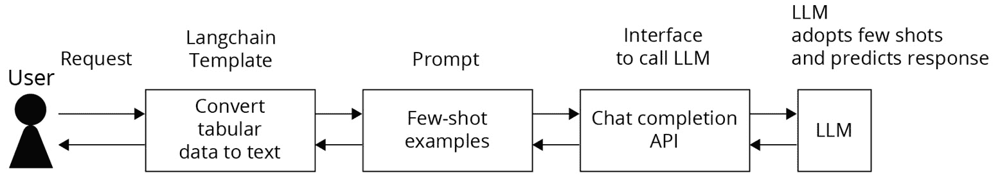
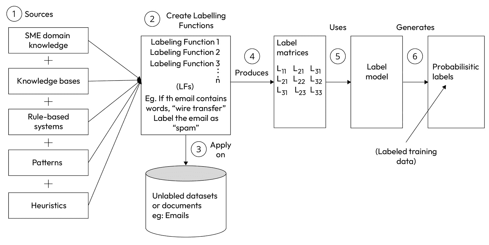
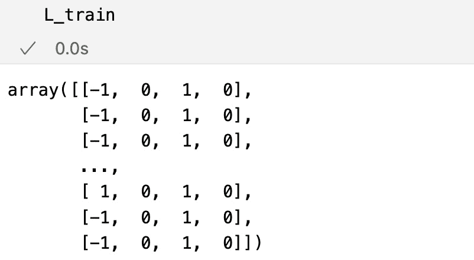
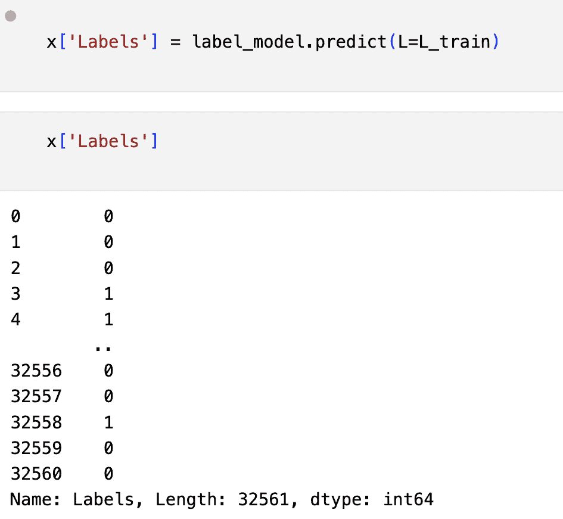
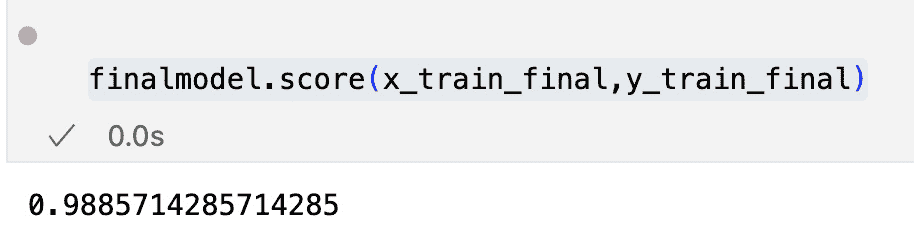
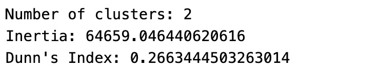
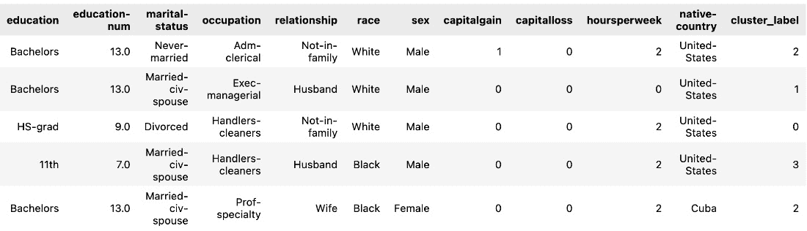

# 2

# 为分类任务标记数据

在本章中，我们将学习如何通过使用 Python 库以编程方式应用业务规则来标记表格数据。在实际应用案例中，并非所有我们的数据都会有标签。但我们需要为训练**机器学习模型**和**微调****基础模型**准备标记数据。手动标记大量数据或文档既繁琐又昂贵。在手动标记的情况下，标签是逐个创建的。此外，偶尔与组织外部的众包团队共享私有数据也不安全。

因此，需要通过编程方式对数据进行标记，以实现数据标记的自动化并快速标记大规模数据集。在编程标记的情况下，主要有三种方法。在第一种方法中，用户创建**标记函数**并将其应用于大量未标记的数据以自动标记大型训练数据集。在第二种方法中，用户应用**半监督学习**来创建**伪标签**。**K-means 聚类**是另一种将相似数据集分组并标记这些聚类的途径。在本章中，我们将深入探讨这三种方法，并对示例表格数据集进行标记。我们还将发现如何利用**大型语言模型**（**LLMs**）在表格数据分类任务中预测标签。

到本章结束时，您将能够创建标记函数和标记模型，并最终能够使用该标记模型预测标签。

在本章中，我们将涵盖以下主要主题：

+   使用 LLMs 预测表格数据的标签

+   使用基于规则的生成模型进行数据标记

+   使用半监督学习进行数据标记

+   使用 K-means 聚类进行数据标记

# 技术要求

我们需要使用以下命令安装 Snorkel 库：

```py
%pip install snorkel
```

您可以从以下链接下载数据集和 Python 笔记本：

[`github.com/PacktPublishing/Data-Labeling-in-Machine-Learning-with-Python/code/Ch02`](https://github.com/PacktPublishing/Data-Labeling-in-Machine-Learning-with-Python/code/Ch02)

OpenAI 的设置要求与第一章中提到的相同。

# 使用 LLMs 预测表格数据的标签

我们将探讨使用**大型语言模型**（**LLMs**）和少样本学习预测表格数据分类任务标签的过程。

在少样本学习的情况下，我们以文本形式提供一些训练数据示例，并附上对模型的提示。模型适应上下文并响应用户的新问题。

首先，让我们看看如何使用 LLMs 预测表格数据的标签。

对于表格数据，第一步是将数据转换为使用 LangChain 模板的序列化文本数据。LangChain 模板允许通过将列映射到带有变量的文本片段来将数据行转换为流畅的句子或段落，这些变量根据单元格值填充。一旦我们有了文本数据，我们就可以将其作为包含问题及其对应标签（答案）对的少样本示例使用。随后，我们将这些少样本数据发送给模型。



图 2.1 – LLM 几个示例用于预测标签

现在我们将使用 LangChain 模板将表格数据转换为自然语言文本。

| **患者 ID** | **年龄** | **血压** | **糖尿病** | **死亡事件** |
| --- | --- | --- | --- | --- |
| 1 | 70 | 高 | 是 | 是 |
| 2 | 45 | 高 | 否 | 否 |
| 3 | 50 | 正常 | 是 | ? |

表 2.1 – 几个示例数据表格格式

以下是将单元格值转换为文本后得到的文本：

```py
User message :"The age is 70 and blood pressure is high and diabetes is yes.
Does this patient had death event? "
System: Yes
```

同样，我们可以将第二行转换为文本，并使用`ChatCompletion` API 将其作为几个示例与提示一起发送给 LLM。

这些几个示例与一个提示一起发送给 LLM，然后 LLM 对新文本预测标签，回答“是”或“否”：

```py
User message :"The age is 50 and blood pressure is normal and diabetes is yes.
Does this patient had death event? "
Then system responds "yes"
```

我们已经看到了如何利用少样本学习来预测表格数据的标签。

序列化数据和少样本学习示例被用来为 LLM 模型提供上下文，以便它能够理解数据的含义并学习如何分类新的表格数据集。LLM 模型根据输入生成响应。

现在，让我们探索第二个示例，使用少样本学习和 LLM 预测文本数据的标签。

如前所述，在少样本学习的情况下，提供一小组训练数据示例，并附上提示给 LLM。

以下代码展示了使用提示和 LLM 进行标签预测的少样本学习示例。在这个例子中，定义了一个系统角色来引导模型理解上下文和期望的情感标签。

用户提供了一条表达对新房子情感的新消息。然后代码调用`ChatCompletion` API，使用指定的 GPT 模型部署生成响应。系统和用户消息被结构化以引导模型理解情感。从 API 响应中获取情感分析输出并打印。

这种方法使模型能够从系统角色和用户消息中提供的示例中学习，从而能够预测用户输入的情感标签：

```py
# Set the system role and user message variables
system_role = """Provide text sentiment in given text:
: I like Arkansas state. Because it is natural state and beautiful!!!
positive
: I hate winters. It's freezing and bad weather.
negative"""
user_message = f"""
ChatCompletion API to send a response:

```

# 发送完成调用以生成情感分析

response = openai.ChatCompletion.create(

engine = "",

messages = [

"role": "system", "content": system_role,

"role": "user", "content": user_message,

]

)

# 打印情感分析输出

print(response['choices'][0]['message']['content'])

```py

 When you check the output, you will see `Positive` in the response. We have seen how to send text messages as few-shot examples, along with a prompt, to the LLM using `ChatCompletion` API and how the LLM responds with the sentiment based on user input messages. Next, we’ll discuss labeling data using Snorkel library.
Data labeling using Snorkel
In this section, we are going to learn what Snorkel is and how we can use it to label data in Python programmatically.
Labeling data is an important step of a data science project and critical for training models to solve specific business problems.
In many real-world cases, training data does not have labels, or very little data with labels is available. For example, in a housing dataset, in some neighborhoods, historical housing prices may not be available for most of the houses. Another example, in the case of finance, is all transactions may not have an associated invoice number. Historical data with labels is critical for businesses to train models and automate their business processes using **machine learning** (**ML**) and artificial intelligence. However, this requires either outsourcing the data labeling to expensive domain experts or the business waiting for a long time to get new training data with labels.
This is where Snorkel comes into the picture to help us programmatically build labels and manage the training data at a relatively lower cost than hiring domain experts. It is also faster than manual labeling. In some cases, data may be sensitive due to it including personal information such as date of birth and social security number. In such cases, the organization cannot share data outside of the organization with a third party. So, organizations prefer to label the data programmatically with a team of in-house developers to protect data privacy and comply with government and consumer data regulations.
What is Snorkel?
Snorkel is a Python open source library ([`www.snorkel.org/`](https://www.snorkel.org/)) that is used to create labels based on heuristics for tabular data. Using this library saves the time and cost of manual labeling. Snorkel uses a list of defined rules to label the data programmatically. With Snorkel, business knowledge is applied to generate “weak” labels for the dataset. This is also called a weak supervision model.
The weak generative model created by Snorkel generates noisy labels. These noisy labels are used to train a classifier that generalizes the model.


Figure 2.2 – Programmatic data labeling (preparing training data)
Here is an overview of the Snorkel system:

1.  Domain specific rules are extracted from various sources such as **subject matter experts** (**SMEs**), knowledge bases, legacy rule based systems, patterns and heuristics using **exploratory data** **analysis** (**EDA**).
2.  Labeling functions are created based on the rules obtained from various sources. One labeling function is created for each business rule.
3.  These labeling functions are applied to the unlabeled dataset to generate the label matrix.
4.  Label matrix (`i*j`) consists of `i` rows and `j` columns where `i` is the number of observations in the dataset and `j` is the number of labeling functions. Each labeling function creates one label for each row in the dataset.
5.  Then, Snorkel’s label model is trained on this label matrix to create a generative model. This generative label model combines the outputs of the various **labeling functions** (**LFs**) and produces a single, noise-aware probabilistic training label set.
6.  Finally, this probabilistic training label set is used to train a downstream discriminative ML model such as logistic regression.

Why is Snorkel popular?
Snorkel is used by several large companies, such as Google, Apple, Stanford Medicine, and Tide, and it has proven to solve business problems on a large scale. For example, as mentioned on the *snorkel.ai* website, Google used Snorkel to replace 100K+ hand-annotated labels in critical ML pipelines for text classification. Another example is, researchers at Stanford Medicine used Snorkel to label medical imaging and monitoring datasets, converting years of work of hand-labeling into a several-hour job using Snorkel. Apple built a solution called Overton that utilizes Snorkel’s framework of weak supervision to overcome cost, privacy, and cold-start issues. A UK-based fintech company, Tide, used Snorkel to label matching invoices with transactions, which otherwise would have required investing in expensive subject matter experts to hand-label historical data. Excerpts of these case studies and more can be found at [`snorkel.ai/case-studies`](https://snorkel.ai/case-studies).
Snorkel creates weak labels using business rules and patterns in the absence of labeled data. Using Snorkel requires relatively less development effort compared to crowdsourcing manual labeling. The cost of development also comes down due to automation using Python programming instead of hiring expensive business domain experts.
The weak labels developed by Snorkel label model can be used to train a machine learning classifier for classification and information extraction tasks. In the following sections, we are going to see the step-by-step process of generating weak labels using Snorkel. For that, first, let’s load some unlabeled data from a CSV file.
In the following example, we have a limited dataset related to adult income with labels.
In this adult income dataset, we have the `income` label and features such as age, working hours, education, and work class. The `income` label class is available only for a few observations. The majority of observations are unlabeled without any value for `income`. So, our goal is to generate the labels using the Snorkel Python library.
We will come up with business rules after analyzing the correlation between each individual feature of the `income` label class. Using those business rules, we will create one labeling function for each business rule with the Snorkel Python library. Then, we will generate labels for the unlabeled income dataset by applying those labeling functions.
Loading unlabeled data
We will first load the adult income dataset for predicting weak labels. Let us load the data using Pandas into a DataFrame:

```

# 加载数据集

#df = pd.read_csv("<YourPath>/adult_income.csv", encoding='latin-1)'

```py

 Here, don’t forget to replace `<YourPath>` with the path in your system. The target column name is `income`. Let us make sure the data is loaded correctly:

```

df.head()

```py

 Let us model the input and output:

```

x = df.iloc[:,:-1]

y = df["income"]

```py

 In this section, we have loaded the income dataset from a CSV file into a Pandas DataFrame.
Creating the labeling functions
Labeling functions implement the rules that are used to create the labeling model. Let us import the following method, which is required to implement the labeling functions:

```

from snorkel.labeling import labeling_function

```py

 We need to create at least four labeling functions to create an accurate labeling generative model. In order to create labeling functions, let’s first define the labeling rules based on the available small dataset labels. If no data is available, subject matter expert knowledge is required to define the rules for labeling. Labeling functions use the following labeling rules for the classification of income range for the given adult income dataset.
Labeling rules
The labeling rules from our small-volume income dataset are as follows:

*   **Age rule**: Based on exploratory bi-variate analysis of age and income, we come up with a heuristics rule that if the age range is between 28 and 58, then income is greater than $50K; else, it is less than $50K.
*   **Education rule**: Based on a bi-variate analysis of education and income, we come up with a heuristic rule that if education is bachelor’s or master’s, then income is > $50K; otherwise, income is < $50K.
*   **Working hours rule**: Based on a bi-variate analysis of working hours and income, we come up with the heuristic rule that if working hours are greater than 40, then income is greater than $50K; otherwise, it is less than $50K
*   `Self-emp-inc` or `Federal-gov`, then income is greater than $50K; otherwise, it is less than $50K.

Constants
Let us define various constants that are used in our labeling functions as follows.

*   Each labeling function returns either one of the following labels as output:
    *   `income_high` indicates income > $50K
    *   `income_low` indicates income < $50K
*   Let us assign the numerical values to the output labels as follows:
    *   `income_high` = `1`
    *   `income_low` = `0`
    *   `Abstain` = `-1`

    `Abstain` indicates that income does not fall within any range for that observation data point:

Labeling functions
Now, let’s create labeling functions using these labeling rules and constants. We’ll discuss each function one by one as follows.
Age rule function
The age rule function is used to check whether the age of the person is greater than 28; if so, the income is greater than $50K.
We have defined our function with the help of the `@labeling_function()` decorator. This decorator, when applied to a Python function, returns a label. Let us apply this decorator to the `age` function to return the label based on age:

```

@labeling_function()

def age(record):

if record['age'] < 28 and record['age'] > 58:

return "收入低"

elif record['age'] >28 and record['age']< 58:

return "收入高"

else:

return "弃权"

```py

 Later, we will apply this age rule labeling function to the unlabeled income dataset using the Pandas LF applier, which returns a label accordingly for each observation in the dataset.
Education rule function
The education rule function is used to check whether the education of the person is bachelor’s or master’s; if so, the income is greater than $50K.
We have defined our labeling function for education with the help of the labeling function decorator as follows:

```

@labeling_function()

def education(record):

if record['education'] == "Bachelors" or record['education'] == "Masters":

return "收入高"

else:

return "收入低"

```py

 Later, we are going to apply this labeling function to our unlabeled income dataset using the Pandas LF applier, which returns the label accordingly for each observation in the dataset.
Hours per week rule function
The hours per week rule function is used to check whether the working hours per week of the person is greater than 40; if so, the income is greater than $50K.
We have defined our labeling function for education with the help of the labeling function decorator as follows:

```

@labeling_function()

def hours_per_week(record):

if record['hours.per.week'] > 40 or record['hours.per.week'] < 60:

return "收入高"

else:

return "收入低"

```py

 Later, we are going to apply this labeling function to our unlabeled income dataset using the Pandas LF applier, which returns the label accordingly for each observation in the dataset.
Work class rule function
The work class rule function is used to check whether the work class of the person is greater than self-employed or federal government; if so, the income is greater than $50K.
We have defined our labeling function for the work class with the help of the labeling function decorator as follows:

```

@labeling_function()

def work_class(record):

if record['workclass'] == "Self-emp-inc" or record['workclass'] == "Federal-gov":

return "收入高"

else:

return "收入低"

```py

 Creating a label model
Now, we are going to apply all the labeling functions that we created to the unlabeled income dataset using the Pandas LF applier:

```

lfs = [age,education,hours_per_week,work_class]

from snorkel.labeling import PandasLFApplier

applier = PandasLFApplier(lfs=lfs)

L_train = applier.apply(df=x)

```py

 Here is the output that we got after applying the label functions (`lfs`) to the input data (`df`):


Figure 2.3 – Label matrix
Here, `L_train` is the label matrix that is returned after applying the four label functions on the unlabeled dataset. For each labeling function, one label (`-1`, `1`, or `0`) will be returned. As we have created four labeling functions, four labels will be returned for each observation. The size of the label matrix will be [n*m], where `n` is the number of observations and `m` is the number of labeling functions, which is the same as the number of labels for each observation.
Next, we will use the label matrix (`L_train`) that was returned in the previous step:

```

From snorkel.labeling.model.label_model import LabelModel

label_model = LabelModel(verbose=False)

```py

 Train the label model using the `L_train` label matrix:

```

label_model.fit(L_train=L_train, n_epochs=1000, seed=100)

```py

 Now, let us predict the labels using the trained label model.
Predicting labels
`L_train` is passed to the label model to predict the labels, as follows:

```

X['Labels'] = label_model.predict(L=L_train)

```py

 We get the following result:


Figure 2.4 – Probabilistic labels
As we have seen, we have generated a label matrix containing labels after applying label functions to a dataset. Then, we used that label matrix to train the label model, and then finally used that generative label model to predict the noise-aware probabilistic labels. Here, the label value `0` indicates `income` < $50K and the label value `1` indicates `income` > $50K. These values are defined using the `income_high` and `income_low` constants before implementing the labeling functions.
We can further use these noise-aware probabilistic labels training set to train the discriminative ML model and then predict accurate labels.
Labeling data using the Compose library
Compose is an open source Python library developed to generate the labels for supervised machine learning. Compose creates labels from historical data using LabelMaker.
Subject matter experts or end users write labeling functions for the outcome of interest. For example, if the outcome of interest is the amount spent by customers in the last five days, then the labeling function returns the amount spent by taking the last five days of transaction data as input. We will take a look at this example as follows.
Let us first install the `composeml` Python package. It is an open source Python library for prediction engineering:

```

pip install composeml

```py

 We will create the label for the total purchase spend amount in the next five days based on the customer’s transactions data history.
For this, let us first import `composeml`:

```

import composeml as cp

```py

 Then, load the sample data:

```

from demo.next_purchase import load_sample

df = load_sample()

```py

 Next, to start using the Compose function, we need to define the labeling function:

```

def amount_spent(df):

total = df['amount'].sum()

return total

```py

 Next, we will build `LabelMaker` to run a search to automatically extract training examples from historical data. LabelMaker generates labels using labeling functions. Now, let us build `LabelMaker` using the labeling function:

```

label_maker = cp.LabelMaker(

target_dataframe_name="customer_id",

time_index="交易时间",

labeling_function=amount_spent,

window_size="5d",

)

```py

 Now, let us search and extract the labels using label search:

```

labels = label_maker.search(

df.sort_values('transaction_time'),

num_examples_per_instance=-1,

gap=1,

verbose=True,

)

labels.head()

```py

 We can transform the labels by applying a threshold to binary labels as follows:

```

labels = labels.threshold(300)

labels.head()

```py

 Now, the labels DataFrame contains a label for the amount (`amount_spent`) forecast to be spent in the next five days. So, we have seen that Compose is used to generate labels for the transactions by defining labeling function and LabelMaker. This labeled data will be used for supervised learning for prediction problems. More documentation about *Compose* can be found at ([`compose.alteryx.com/en/stable/index.html`](https://compose.alteryx.com/en/stable/index.html)).
Labeling data using semi-supervised learning
In this section, let us see how to generate labels using semi-supervised learning.
What is semi-supervised learning?
Semi-supervised learning falls in between supervised learning and unsupervised learning:

*   In the case of supervised learning, all the training dataset is labeled
*   In the case of unsupervised learning, all the training dataset is unlabeled
*   In the case of semi-supervised learning, a very small set of data is labeled and the majority of the dataset is unlabeled

In this case, first we will generate the pseudo-labels using a small part of the labeled dataset with supervised learning:

1.  In this first step, we use this training dataset to train the supervised model and generate the additional pseudo labeled dataset:

    *Training dataset = small set of* *labeled dataset*

2.  In this second step, we will use the small set of labeled dataset along with the pseudo-labeled dataset generated in the first step:

    *Training dataset = small set of labeled dataset +* *pseudo-labeled dataset*

What is pseudo-labeling?
Pseudo-labeling is a **semi-supervised machine learning** technique that generates labels for unlabeled data by leveraging a model trained on a separate small set of labeled data using supervised learning.
For this demonstration, let’s download the *heart failure dataset* from GitHub repo using the link in the *Technical* *requirements* section.
We know our demo dataset, heart failure dataset, is already labeled. But we are going to modify the dataset by splitting it into two parts. One will have labels and the other will be unlabeled. We generate pseudo-labels for unlabeled data from a labeled dataset. Then, finally, we will combine this pseudo-labeled dataset with the initial labeled dataset to train the final model.
Let’s import the libraries as follows:

```

import pandas as pd

import numpy as np

from sklearn.model_selection import train_test_split

from sklearn.ensemble import RandomForestClassifier

```py

 Let’s download the income dataset:

```

data = pd.read_csv("<your_path>/heart_failure_dataset.csv ", encoding='latin-1')

y = training.DEATH_EVENT #每个示例的输出

x = training.drop('DEATH_EVENT', axis=1)  #输入

```py

 Let’s split the data with and without labels in the 30:70 ratio. Here, we want 30% of the data to have labels and 70% of the data to be unlabeled to demonstrate a real-world scenario where we have less data with labels and more data without labels:

```

x_train,x_test,y_train,_ = train_test_split(x,y,test_size=.7)

x_train.shape,y_train.shape,x_test.shape

```py

 Now, let’s fit the data to the model and create the model. Here, we will use the Random Forest classifier. Think of Random Forest as a group of clever friends in the world of computers. Each friend knows a little something about the data we give them and can make decisions. When we put all their ideas together, we get a smart tool that can help us understand and predict things. It’s like having a team of experts to guide us through the jungle of data. In this chapter, we’ll explore how this friendly Random Forest can assist us in making sense of data and making better decisions.
Random Forest is a versatile ML algorithm that can be used for both regression and classification tasks. The following subsection provides an explanation of both.
Random Forest classifier
In classification tasks, the Random Forest classifier is used to predict and assign a class or category to a given input based on a set of input features. It’s particularly useful for tasks such as spam detection, image classification, and sentiment analysis. The algorithm works by constructing multiple decision trees during the training process. Each decision tree is like a “vote” on which class an input should be assigned to.
The final prediction is made by taking a majority vote among all the decision trees in the forest. This ensemble approach often results in robust and accurate classification:

```

pseudomodel = RandomForestClassifier(n_estimators = 10, criterion = 'entropy', random_state = 0)

```py

 We are training the pseudo-model with 30% of the labeled training data:

```

pseudomodel.fit(x_train,y_train)

```py

 Let us calculate the accuracy score for data label model training:

```

pseudomodel.score(x_train,y_train)

0.95

```py

 Now, let us use this pseudo-model to predict the labels for the 70% unlabeled data with `x_test`:

```

y_new = pseudomodel.predict(x_test)

y_new.shape

```py

 Let us concatenate both the datasets’ features and labels, that is, the original labels and pseudo-labels:

```

# 从测试集中取一个子集，并附加到

# the training set

from sklearn.utils import shuffle

sampled_pseudo_data = pseudo_data.sample(n=150)

temp_train = pd.concat([x, y], axis=1)

augmented_train = pd.concat([sampled_pseudo_data, temp_train])

shuffle(augmented_train)

x = augmented_train.drop('DEATH_EVENT', axis=1)

y = augmented_train.DEATH_EVENT

x_train_final, x_test_final, y_train_final, y_test_final = train_test_split(x, y, test_size=0.3, random_state=42)

```py

 Now, let us create a model for the entire dataset using `RandomForestClassifier`:

```

finalmodel = RandomForestClassifier(n_estimators = 10, criterion = 'entropy', random_state = 0)

#此模型使用增强数据

finalmodel.fit(x_train_final,y_train_final)

finalmodel.score(x_train_final,y_train_final)

```py

 We get the following result:


Figure 2.5 – final model
To summarize, we have imported the *heart failure dataset* and then changed it to split the dataset into labeled and unlabeled datasets. Then, we applied semi-supervised learning to generate pseudo-labels. After that, we combined the original and pseudo-labeled training datasets and again applied the Random Forest regressor to generate the final labels for the unseen dataset using the final model.
Labeling data using K-means clustering
In this section, we are going to learn what the K-means clustering algorithm is and how the K-means clustering algorithm is used to predict labels. Let us understand what unsupervised learning is.
What is unsupervised learning?
**Unsupervised learning** is a category of machine learning where the algorithm is tasked with discovering patterns, structures, or relationships within a dataset without explicit guidance or labeled outputs. In other words, the algorithm explores the inherent structure of the data on its own. The primary goal of unsupervised learning is often to uncover hidden patterns, group similar data points, or reduce the dimensionality of the data.
In the case of **unsupervised learning**, we have data with no target variable. We group observations based on similarity into different clusters. Once we have a limited number of clusters, we can register the labels for those clusters.
For example, in the case of customer segmentation, customers with a similar income range are grouped and formed into clusters, and then their spending power is associated with those clusters. Any new training data without labels can be measured for similarity to identify the cluster, and then the same label can be associated with all observations in the same cluster.
K-means clustering is a specific algorithm within the realm of unsupervised learning. It is a partitioning technique that divides a dataset into distinct, non-overlapping subsets or clusters. Now, let’s dive deep into K-means clustering.
K-means clustering
Traversing the world of data is like finding your way through a maze. Imagine you have a bunch of colorful marbles and you want to group similar ones. K-means clustering is your helper in this quest. It’s like a sorting magician that organizes your marbles into distinct groups, making it easier to understand them. K-means clustering is a cool trick that helps you make sense of your data by finding hidden patterns and grouping things that go together.
Let us download the *adult income* dataset, using the link in the *Technical* *requirements* section.
The selected features from this dataset will be used as input to the K-means algorithm, which will then partition the data into clusters based on the patterns in these selected features.

```

# 选择聚类特征

selected_features = ['hoursperweek', 'education-num']

```py

 `selected_features` is a list that contains the names of the features (columns) you want to use for clustering. In this case, the features selected are `‘hoursperweek’` and `‘education-num’`. These are likely columns from a dataset containing information about individuals, where `‘hoursperweek’` represents the number of hours worked per week, and `‘education-num’` represents the number of years of education.
When performing K-means clustering, it’s common to choose relevant features that you believe might contribute to the formation of meaningful clusters. The choice of features depends on the nature of your data and the problem you’re trying to solve. We will identify similar features and then group them into clusters using K-means clustering.
In the case of K-means clustering, the following sequence of steps needs to be followed:

1.  First, identify the number of clusters randomly:

    ```

    n_clusters = random.randint(2,4)

    ```py

    A random number of clusters (between 2 and 4) is chosen.

     2.  Initialize K-means with random centroids:

    ```

    kmeans = KMeans(n_clusters=n_clusters, init='random', random_state=0)

    kmeans.fit(X_scaled)

    ```py

    The K-means algorithm is initialized with random centroids and fitted to the scaled data.

     3.  Perform K-means clustering and update centroids until convergence:

    ```

    while True:

    # 将数据点分配到聚类中

    cluster_labels = kmeans.predict(X_scaled)

    # 计算新的质心

    new_centroids = np.array([X_scaled[cluster_labels == i].mean(axis=0) for i in range(n_clusters)])

    ```py

    The code calculates new centroids by computing the mean of the data points in each cluster:

    ```

    # 通过比较新旧质心来检查收敛性

    if np.allclose(kmeans.cluster_centers_, new_centroids):

    break

    ```py

    The loop checks for convergence by comparing the old centroids with the new centroids. If they are very close, indicating that the centroids have not changed significantly, the loop breaks, and the clustering process stops:

    ```

    # 更新质心

    kmeans.cluster_centers_ = new_centroids

    # 更新惯性

    inertia = kmeans.inertia_

    ```py

    `kmeans.cluster_centers_` and `inertia` are updated within the loop, ensuring that the model parameters are adjusted in each iteration.

     4.  Calculate metrics (Dunn’s Index). Inter-cluster and intra-cluster distances are calculated to compute Dunn’s Index:

    ```

    intercluster_distances = pairwise_distances(kmeans.cluster_centers_)

    intracluster_distances = np.array([np.max(pdist(X_scaled[cluster_labels == i])) for i in range(n_clusters)])

    ```py

    For each cluster, `pdist` (pairwise distance) is used to calculate the distances between all pairs of data points within the cluster. `np.max` then finds the maximum distance within each cluster. This results in an array where each element represents the maximum intra-cluster distance for a specific cluster:

    ```

    min_intercluster_distances = min(np.min(intercluster_distances[~np.eye(n_clusters, dtype=bool)]), min_intercluster_distances)

    max_intracluster_distances = max(np.max(intracluster_distances), max_intracluster_distances)

    ```py

    `min_intercluster_distances` is updated by finding the minimum inter-cluster distance, excluding diagonal elements (distances between a cluster and itself), and comparing it with the current minimum.

    `max_intracluster_distances` is updated by finding the maximum intra-cluster distance across all clusters and comparing it with the current maximum.

    **Dunn’s index** is calculated by dividing the minimum inter-cluster distance by the maximum intra-cluster distance:

    *dunn_index = min_intercluster_distances /* *max_intracluster_distances*

    It is a measure of how well-separated clusters are relative to their internal cohesion:

    ```

    # 打印结果

    print(f"聚类数量: {n_clusters}")

    print(f"惯性: {inertia}")

    print(f"Dunn 指数: {dunn_index}")

    ```py

    We get the following result:



Figure 2.6 – K-means clustering metrics
Let us understand the metrics Inertia and Dunn's index in the results.
Inertia
Inertia is nothing but the sum of the distance of all the points from the centroid.
If all the points are close to each other, that means they are similar and it is a good cluster. So, we aim for a small distance for all points from the centroid.
Dunn's index
If the clusters are far from each other, that means the different clusters are clearly separate groups of observations. So, we measure the distance between the centroids of each cluster, which is called the inter-cluster distance. A large inter-cluster distance is ideal for good clusters.
Now, let us print the cluster labels obtained in K-means clustering:

```

# 将聚类标签作为新列添加到原始数据集中

X['cluster_label'] = kmeans.labels_

# 打印带有聚类标签的数据集

X.head()

```py

 We get the following result:


Figure 2.7 – Cluster labels
We can use the cluster labels as a feature to predict the adult income using regression.
To summarize, we have seen what the K-means clustering algorithm is and how it is used to create clusters for *adult income* dataset. The selected features from this dataset will be used as input to the K-means algorithm, which will then partition the data into clusters based on the patterns in these selected features.
The complete code notebook is available in this book’s GitHub repository.
Summary
In this chapter, we have seen the implementation of rules using Snorkel labeling functions for predicting the income range and labeling functions using the Compose library to predict the total amount spent by a customer during a given period. We have learned how semi-supervised learning can be used to generate pseudo-labels and data augmentation. We also learned how K-means clustering can be used to cluster the income features and then predict the income for each cluster based on business knowledge.
In the next chapter, we are going to learn how we can label data for regression using the Snorkel Python library, semi-supervised learning, and K-means clustering. Let us explore that in the next chapter.

```
