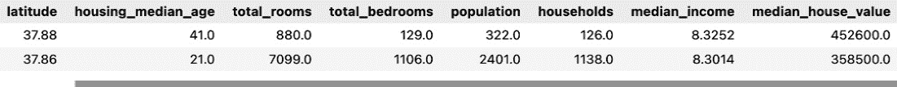
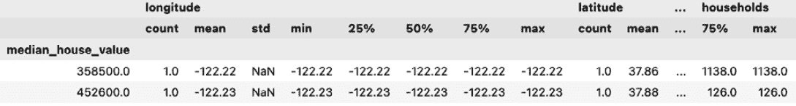
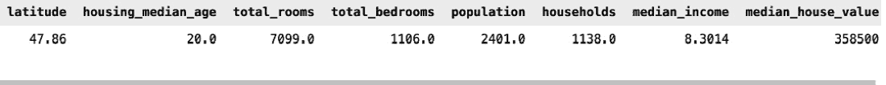
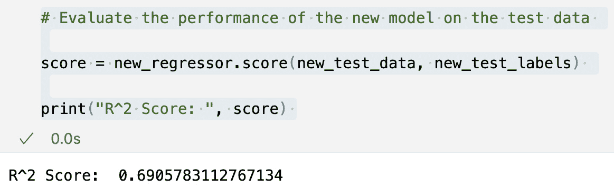
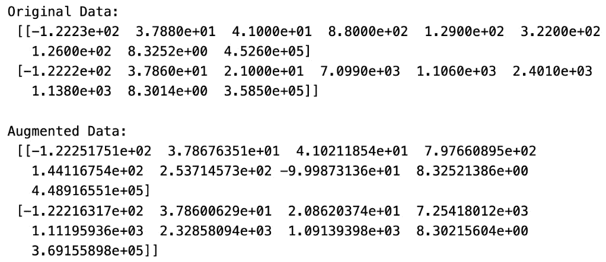
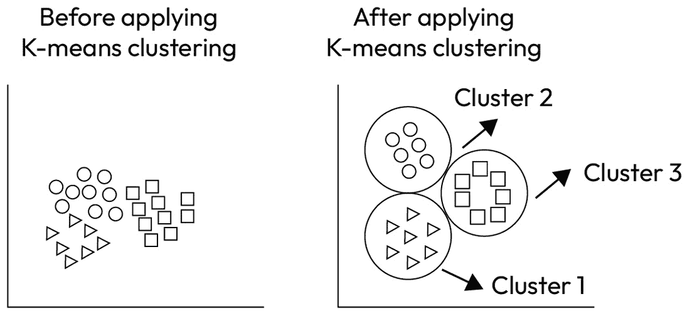
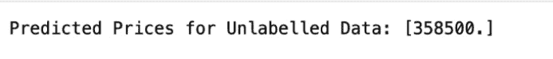

# 3

# 为回归数据标签化

在本章中，我们将探讨在训练数据中可用标签数据不足的情况下，为基于回归的机器学习任务（如预测房价）进行数据标签的过程。回归任务涉及使用标记的训练数据集预测数值，这使得它们对金融和经济等领域至关重要。然而，现实场景往往面临挑战：标记数据是一种珍贵的商品，通常供应不足。

如果缺乏标记数据来训练机器学习模型，您仍然可以使用汇总统计、半监督学习和聚类来预测未标记数据的目标标签。我们已通过使用房价数据作为示例并使用 Python 编程生成房价预测的预测标签来演示这一点。我们将探讨使用 Snorkel 库、半监督学习、数据增强和 K-means 聚类方法进行回归数据标签化的不同方法。在现实世界的项目中，获取训练机器学习回归模型所需的标记数据是一项挑战。例如，可能没有足够的数据来训练模型以预测房价。在这些情况下，我们通过使用各种 Python 库来准备训练数据。

在本章中，我们将涵盖以下主要内容：

+   使用基于汇总统计的规则生成房价标签进行回归

+   使用半监督学习为房价预测进行回归标签化

+   使用数据增强生成房价数据标签以生成回归的合成数据

+   使用 K-means 聚类为回归房价数据标签化

到本章结束时，您将能够使用 Python 库编程方式生成回归数据的标签。此外，您将具备克服回归挑战的专业技能，确保您的数据驱动项目能够成功。

# 技术要求

我们将使用加利福尼亚房价数据集([`www.kaggle.com/datasets/camnugent/california-housing-prices`](https://www.kaggle.com/datasets/camnugent/california-housing-prices))作为本章的内容。您可以从以下 GitHub 路径下载`housing.csv`文件：[`github.com/PacktPublishing/Data-Labeling-in-Machine-Learning-with-Python/tree/main/datasets`](https://github.com/PacktPublishing/Data-Labeling-in-Machine-Learning-with-Python/tree/main/datasets)。

我们还需要安装 Python 3.7+并设置以下任一 Python 编辑器：

+   VS Code IDE

+   Anaconda

+   Jupyter Notebook

+   Replit

我们建议您遵循 GitHub 上的完整代码来跟随本章内容。

# 使用汇总统计生成房价标签

在本节中，我们将使用一小组可用的标记房价数据的摘要统计信息来生成房价标签。这在现实世界的项目中非常有用，当回归任务缺乏足够的标记数据时。在这种情况下，我们将通过基于摘要统计信息创建一些规则来生成标记数据。

我们解码数据的潜在趋势的重要性。通过计算标记训练数据集中每个特征的平均值，我们开始量化数据的本质。这种方法巧妙地利用距离度量来揭示标签的最近匹配，赋予未标记数据点其标记对应点的智慧。

让我们使用 pandas 从 `housing.csv` 文件加载数据：

```py
import pandas as pd
# Load the labeled data
df_labeled = pd.read_csv('housing.csv')
```

这里是输出：



图 3.1 – DataFrame 的片段

使用 `pd.read_csv` 加载标记数据后，我们通过 `groupby()` 和 `describe()` 方法计算每个特征按目标标签的摘要统计信息。这为我们提供了每个特征按目标标签的平均值、标准差、最小值、最大值和四分位数：

```py
# Compute the summary statistics for each feature by target label
summary_stats = df.groupby('median_house_value').describe()
```

这里是输出：



图 3.2 – 房价数据集的摘要统计信息

## 寻找与标签匹配的最近标记观察值

我们然后遍历未标记数据中的每一行，并使用欧几里得距离计算每个目标标签摘要统计信息的距离。我们选择距离最小的目标标签作为预测的目标标签，并将其分配给当前行：

```py
# Load the unlabeled data
df_unlabeled = pd.read_csv(''housing_unlabled.csv')
```

欧几里得距离是平面上两点之间的距离。在这里，两点 `(x1, y1)` 和 `(x2, y2)` 之间的距离是 `d = √[(x2 – x1)² + (y2 – y1)²]`。这用于找到相似点，即标记数据点中与未标记数据点最近的点，以便我们可以将标记数据集中的相应标签分配给未标记数据点。未标记数据集的标签是通过结合行中所有特征的距离来计算的。我们分配具有最小距离的行的目标标签，将其与未标记数据集中的当前行预测的目标标签进行比较。这有助于我们根据训练数据集中标签的最近匹配使用距离度量来分配未标记数据集的标签。

在这里，最外层的 `for` 循环逐行读取未标记数据，然后在内部 `for` 循环中对该行执行以下步骤：

```py
# Predict the target label for each data point in the unlabeled data
for i, row in df_unlabeled.iterrows():
```

最外层的 `for` 循环逐行读取未标记数据，然后在内部 `for` 循环中对该行执行以下步骤：

```py
# Compute the distances to each target label's summary statistics
dists = {}
```

`for target` 循环遍历 `summary_stats` DataFrame 中的每个目标标签。DataFrame 的 `index` 属性返回行标签，在这种情况下是目标标签：

```py
for target in summary_stats.index:
```

以下行将`dist`变量初始化为`0`，我们将使用它来累积当前未标记数据点与当前目标标签的汇总统计之间的距离：

```py
dist = 0
for col in df_unlabeled.columns:
```

`for col`循环遍历`df_unlabeled` DataFrame 中的每一列。我们想要计算当前未标记数据点与每个目标标签的汇总统计中每个特征的距离。

以下行检查当前列是否不是目标列。我们不希望计算当前未标记数据点与目标列的汇总统计之间的距离，因为这没有意义：

```py
if col != 'median_house_value':
```

以下行计算当前未标记数据点的特征值与当前目标标签汇总统计中相应特征的均值之间的平方距离。我们将距离平方以使其为正并夸大差异：

```py
dist += (row[col] - summary_stats.loc[target, (col, 'mean')]) ** 2
```

以下行将计算的距离保存到`dists`字典中，针对当前目标标签：

```py
dists[target] = dist
# Select the target label with the minimum distance
predicted_target = min(dists, key=dists.get)
# Assign the predicted target label to the current row
df_unlabeled.at[i, 'median_house_value'] = predicted_target
```

到此内循环结束时，`dists`字典将包含当前未标记数据点与每个目标标签的汇总统计之间的平方距离。然后我们将选择距离最小的目标标签作为当前数据点的预测目标标签。

对于未标记数据的每一行，都会继续进行相同的处理，以计算从每个目标标签的特征均值到未标记数据中相应列的距离。

最后，我们使用`to_csv()`方法将标记数据保存到新的 CSV 文件中，`df_unlabeled.to_csv('housing_result.csv')`。



图 3.3 – 带有预测中位数房价的标记数据

现在，我们可以看到`median_house_value`被分配到未标记数据集中的行。请注意，这种方法假设标记数据的汇总统计可以准确地预测未标记数据的目标标签。因此，在使用它们之前验证预测的准确性是至关重要的。

## 使用半监督学习标记回归数据

在本节中，我们将使用半监督学习来标记回归数据。半监督学习是一种机器学习方法，它结合了标记数据和未标记数据以提高预测模型的准确性。在半监督学习中，使用少量标记数据与大量未标记数据来训练模型。其理念是未标记数据可以提供有关数据中潜在模式的信息，这有助于模型更有效地学习。通过使用标记数据和未标记数据，半监督学习可以提高机器学习模型的准确性，尤其是在标记数据稀缺或难以获取时。

现在，让我们详细看看伪标记方法及其在数据标记中的应用。

## 伪标记

伪标记是一种在半监督学习中使用的技巧，其中使用在标记数据上训练的模型来预测未标记数据的标签。这些预测的标签被称为伪标签。然后，模型将标记和伪标记数据结合起来重新训练并提高模型的准确性。伪标记是一种利用未标记数据来提高模型性能的方法，尤其是在标记数据有限时。

伪标记过程包括以下步骤：

1.  **在标记数据上训练模型**：使用训练算法在标记数据上训练一个监督学习模型。模型通过提供的标签与训练集相匹配。

1.  **预测未标记数据的标签**：使用训练好的模型来预测未标记数据的标签。这些预测的标签被称为伪标签。

1.  **合并标记和伪标记数据**：将标记数据与伪标记数据合并，形成一个新的大训练集。伪标记数据被视为标记数据。

1.  **重新训练模型**：使用合并后的数据集重新训练模型。模型通过标记和伪标记数据更新，以提高模型的准确性。

1.  **重复步骤 2-4**：通过重复使用更新后的模型来预测新标记数据（之前未标记的数据）的标签，并将新标记的数据与现有标记数据合并，用于下一轮模型重新训练，这个过程一直重复，直到收敛。

伪标记可以是一种有效的方法，利用许多应用中通常可用的大量未标记数据。通过使用这些未标记数据来提高模型的准确性，伪标记可以帮助提高监督机器学习模型的表现，尤其是在足够的标记训练数据不易获得时。

让我们使用房价数据集来预测回归的标签：

```py
import pandas as pd
from sklearn.model_selection import train_test_split
from sklearn.linear_model import LinearRegression
import numpy as np
```

让我们加载房价数据集，然后将标记数据拆分为 `labeled_data` DataFrame，未标记数据拆分为 `unlabeled_data` DataFrame，如下所示：

```py
# Load the data
data = pd.read_csv("housing_data.csv")
# Split the labeled data into training and testing sets
train_data, test_data, train_labels, test_labels = \
    train_test_split(labeled_data.drop('price', axis=1), \
        labeled_data['price'], test_size=0.2)
```

此代码片段用于将标记数据分为两部分：一个训练集和一个测试集。训练集包含我们将用于训练机器学习模型的特征（输入数据）和相应的标签（输出数据）。测试集是数据的一小部分，我们将用它来评估模型的性能。`train_test_split` 函数来自 `sklearn.model_selection` 库，它帮助我们实现这种划分，同时指定测试集的大小（在这种情况下，数据的 20%）。以下是如何使用训练数据集进行回归来训练模型：

```py
# Train a linear regression model on the labeled data
regressor = LinearRegression()
regressor.fit(train_data, train_labels)
```

在这个代码片段中，我们使用标记数据构建和训练一个线性回归模型。首先，我们从`sklearn.linear_model`库中导入`LinearRegression`类。然后，我们创建一个名为`regressor`的线性回归模型实例。最后，我们使用训练数据`train_data`作为输入特征和相应的标签`train_labels`作为期望的输出来训练模型。模型从这些数据中学习以进行后续的预测。现在，让我们使用回归器对未标记数据集进行标签预测，如下所示：

```py
# Use the trained model to predict the labels of the unlabeled data
predicted_labels = regressor.predict(
    unlabeled_data.drop('price', axis=1))
```

在这个代码片段中，我们使用训练好的线性回归模型来预测未标记数据点的标签。我们初始化一个空列表`predicted_labels`来存储预测结果。通过应用训练好的`regressor`模型的`predict`方法，我们根据`unlabeled_data`中的特征（输入数据）生成预测。由于`price`列是我们想要预测的目标变量，因此将其排除。现在`predicted_labels`列表包含了回归模型对未标记数据的预测结果。现在我们将这些预测的标签数据与标记数据结合起来，并按照以下方式训练模型：

```py
# Combine the labeled and newly predicted data
new_data = pd.concat([labeled_data, unlabeled_data], ignore_index=True)
new_data['price'] = pd.concat([train_labels, \
    pd.Series(predicted_labels)], ignore_index=True)
```

在这个代码片段中，我们通过合并标记数据和新预测的数据创建一个新的数据集`new_data`。首先，我们使用`pd.concat`将`labeled_data`和`unlabeled_data`数据框连接起来，创建一个连续的数据集。`ignore_index=True`参数确保新数据集的索引被重置。

接下来，我们在`new_data` DataFrame 中填充`'price'`列。我们通过将`train_labels`（来自标记数据）与存储在`predicted_labels`列表中的预测标签连接起来来实现这一点。这一步确保我们的新数据集对所有数据点都有完整的标签，结合了已知和预测的值：

```py
# Train a new model on the combined data
new_train_data, new_test_data, new_train_labels, new_test_labels = \
    train_test_split(new_data.drop('price', axis=1), \
    new_data['price'], test_size=0.2)
new_regressor = LinearRegression()
new_regressor.fit(new_train_data, new_train_labels)
```

在这个代码片段中，我们在一个包含标记和预测数据的组合数据集上训练一个新的线性回归模型。首先，我们使用`train_test_split`函数将组合数据分割成新的训练和测试集，类似于我们之前所做的那样。新的训练数据存储在`new_train_data`中，相应的标签存储在`new_train_labels`中。

接下来，我们创建一个新的线性回归模型实例，称为`new_regressor`。最后，我们使用`new_train_data`作为输入特征和`new_train_labels`作为期望的输出来训练新模型。这一步确保我们的新模型经过微调以预测组合数据，利用了标记和预测信息：

```py
# Evaluate the performance of the new model on the test data
score = new_regressor.score(new_test_data, new_test_labels)
print("R² Score: ", score)
```

这里是输出：



图 3.4 – 添加伪标签数据后的模型性能

在这个代码片段中，我们正在评估新的线性回归模型在训练过程中未见过的测试数据上的性能。R-squared（确定系数）分数是通过`new_regressor`模型的`score`方法计算的。R² 分数是衡量模型预测与实际数据值匹配程度的一个指标。更高的 R² 分数表示更好的预测准确性。

如我们所见，结合数据集的 R² 分数（`0.6905783112767134`）比原始标记训练数据集的 R² 分数（`0.624186740765541`）要高。最后，我们使用这个模型来预测标签。现在，让我们看看另一种方法，即数据增强，用于为回归生成带有标签的合成数据。

# 使用数据增强来标记回归数据

数据增强可以用于为回归任务生成额外的标记数据，其中标记数据有限。以下是使用数据增强来标记回归数据的方法：

1.  **收集标记数据**：收集可用于回归任务的有限标记数据。

1.  **定义数据增强技术**：定义一组可以用于从可用标记数据生成新数据点的数据增强技术。对于回归任务，常见的数据增强技术包括添加噪声、缩放和旋转数据。

1.  **生成增强数据**：使用数据增强技术从可用标记数据生成新的数据点。新的数据点将基于原始数据点的标签。

1.  **训练模型**：使用增强数据和原始标记数据训练一个回归模型。这一步涉及到使用监督学习算法将模型拟合到组合数据集。

1.  **评估模型**：在验证集上评估训练模型的性能。这一步涉及到测试模型预测在新的、未见过的数据上的准确性。

1.  **微调模型**：根据验证集上的性能来微调模型。这一步涉及到调整模型的超参数，以提高其在验证集上的性能。

1.  **测试模型**：最后，在测试集上测试模型的性能，以评估其泛化性能。

通过使用数据增强来生成额外的标记数据，即使在有限的标记数据可用的情况下，也有可能训练出一个更准确的回归模型。然而，在使用数据增强技术时，必须小心谨慎，以确保生成数据是有意义且代表原始数据分布的。

在数值数据的背景下，我们应该关注以下与给定数据集相关且有意义的数据增强技术。例如，我们可以考虑以下：

+   **添加噪声**：向数值特征和标签添加随机噪声可以模拟数据中的变化和不确定性。

+   **缩放**：缩放数值特征可以模拟单位或量级的改变

+   **抖动**：向数值引入小的扰动可以解释测量误差或波动

+   **异常值注入**：引入异常值可以帮助模型对极端值更加鲁棒

+   **洗牌**：随机打乱数据点的顺序可以防止模型学习任何与序列相关的偏差

记住，数据增强技术的选择应基于您的数据集和您试图解决的问题的特征。这些技术应添加与数据本质相符的有意义的变异。

让我们看看我们如何为房价数据集生成增强数据以预测标签。让我们导入必要的库，加载房价数据集，并定义 `noise`、`scale` 和 `rotate` 数据增强函数，如下所示：

```py
import pandas as pd
import numpy as np
from sklearn.linear_model import LinearRegression
from sklearn.metrics import mean_squared_error
from sklearn.model_selection import train_test_split
import random
```

然后我们加载存储在名为 `labeled_data.csv` 的 CSV 文件中的标记数据，该文件具有特征列和一个名为 `price` 的列作为目标变量：

```py
# Load the available labeled data
df = pd.read_csv("labeled_data.csv")
```

以下代码定义了两种添加噪声的数据增强技术。它通过将这些增强技术应用于标记数据来生成新的数据点：

```py
# Define the data augmentation techniques
def add_noise(x, std):
    noise = np.random.normal(0, std, len(x))
    return x + noise
# Define the range of data augmentation parameters
noise_range = [0.1, 0.2, 0.3]
```

定义了噪声范围的增强参数范围，并且对于每个可用的数据点，它使用不同的参数值生成多个增强数据点：

```py
# Generate augmented data
augmented_data = []
for _, row in df.iterrows():
    for noise in noise_range:
        new_row = row.copy()
        new_row["price"] = add_noise(row["price"], noise)
        augmented_data.append(new_row)
```

通过遍历 `noise_range` 中的每个值并向每个数据点的 `price` 特征添加噪声，代码生成了具有不同噪声级别的多个数据点。这个过程产生了更多标记数据点供机器学习模型学习，并提高了模型的准确性。

`noise_range` 是用于生成不同级别噪声的标准差值的列表。它可以是对数据点添加不同级别噪声的任何值列表：

+   `for noise in noise_range` 创建一个循环，遍历 `noise_range` 列表中的每个值。

+   `new_row = row.copy()` 创建原始数据点（即行）的副本。

+   `new_row["price"] = add_noise(row["price"], noise)` 使用 `add_noise()` 函数向复制的数据点的 `price` 特征添加噪声。`add_noise()` 函数根据 `noise` 变量中提供的不确定性向每个数据点添加随机噪声。

+   `augmented_data.append(new_row)` 将新生成的数据点添加到 `augmented_data` 列表中。`augmented_data` 列表包含 `noise_range` 列表中所有级别的噪声的所有新生成数据点。

类似地，让我们定义另一个数据增强比例函数：

```py
def scale(x, factor):
    return x * factor
scale_range = [0.5, 0.75, 1.25, 1.5]
```

定义了 `scale_range` 的参数范围，并且对于每个可用的数据点，它使用不同的参数值生成多个增强数据点：

```py
for scale_factor in scale_range:
    new_row = row.copy()
    new_row["price"] = scale(row["price"], scale_factor)
    augmented_data.append(new_row)
```

在这个代码片段中，我们正在利用数据增强技术，通过对`price`特征应用缩放来生成增强数据。对于指定的`scale_range`内的每个缩放因子，我们通过使用`row.copy()`创建当前数据行的副本来重复当前数据行。然后，我们使用`scale_factor`对`price`特征进行缩放，从而有效地修改价格值，同时保留数据之间的关系。

最后，增强行被添加到存储在`augmented_data`列表中的增强数据列表中。这种方法使我们能够探索不同缩放对`price`特征的影响，并通过具有不同实例的数据集丰富我们的数据集，以改善模型训练和测试：

```py
# Combine the original data and the augmented data
combined_data = pd.concat([df, pd.DataFrame(augmented_data)])
```

下面是增强数据：



图 3.5 – 原始数据和增强数据

然后代码将原始标记数据与增强数据结合，将其分为训练集和测试集，在组合数据上训练线性回归模型，并使用均方误差作为评估指标在测试集上评估模型的性能：

```py
# Split the data into training and testing sets
X = combined_data.drop("price", axis=1)
y = combined_data["price"]
X_train, X_test, y_train, y_test = train_test_split(X, y, \
    test_size=0.2, random_state=42)
# Train a linear regression model
model = LinearRegression()
model.fit(X_train, y_train)
# Evaluate the model
y_pred = model.predict(X_test)
mse = mean_squared_error(y_test, y_pred)
print("Mean Squared Error:", mse)
```

通过遍历`noise_range`中的每个值并向每个可用数据点添加噪声，它生成了具有不同噪声级别的多个增强数据点。这个过程产生了更多标记数据点供机器学习模型学习，并提高了模型的准确性。同样，缩放因子和旋转度数也用于通过数据增强生成标记数据，以使用回归预测房价。

在本节中，我们看到了如何使用噪声和缩放技术生成用于回归的增强数据。现在，让我们看看我们如何使用 K-means 无监督学习方法来标记房价数据。

# 使用 k-means 聚类标记回归数据

在本节中，我们将使用无监督的 K-means 聚类方法来标记回归数据。我们使用 K-means 根据数据点的相似性将数据点聚类成组或簇。

一旦聚类完成，我们可以通过取属于该簇的标记数据点的平均值来计算每个簇的平均标签值。这是因为簇中的标记数据点可能具有相似的标签值，因为它们在特征值方面相似。



图 3.6 – 基本 k-means 聚类，聚类数量=3

例如，假设我们有一个包含房价的房价数据集，我们想要根据大小、位置、房间数量等特征预测房屋的价格。我们有一些带有特征及其对应价格的标记数据点，但我们也有一些具有相同特征的未标记数据点。

我们可以使用 K-means 聚类根据特征将标记和未标记的数据点聚类成组。然后，我们可以通过取该聚类中标记数据点的平均值来计算每个聚类的平均价格。

最后，我们可以使用这些平均价格根据它们的聚类分配预测未标记数据点的价格。

我们可以使用这些预测标签通过结合标记和未标记数据创建一个新的数据集。然后，我们在组合数据上训练一个新的模型，并在测试数据上评估其性能：

```py
import numpy as np
from sklearn.cluster import KMeans
from sklearn.metrics import mean_squared_error
# Define labelled and unlabelled data
labelled_data = np.array([
[-122.23, 37.88, 41.0, 880.0, 129.0, 322.0, 126.0, 8.3252, 452600.0],
[-122.22, 37.86, 21.0, 7099.0, 1106.0, 2401.0, 1138.0, 8.3014, 358500.0]
])
unlabelled_data = np.array([
[-122.22, 47.86, 20.0, 7099.0, 1106.0, 2401.0, 1138.0, 8.3014, 0.0]
])
# Extract features and labels from labelled data
labelled_features = labelled_data[:, :-1]
labelled_labels = labelled_data[:, -1]
```

在这里，我们导入必要的库并定义标记的和未标记的数据数组：

```py
# Train K-means clustering model
n_clusters = 2 # Number of clusters (you can adjust this)
kmeans_model = KMeans(n_clusters=n_clusters)
kmeans_model.fit(labelled_features)
```

我们指定聚类数量（`n_clusters`）并使用 k-means 聚类将模型拟合到标记特征：

```py
# Predict cluster labels for unlabelled data
unlabelled_clusters = kmeans_model.predict(unlabelled_data[:, :-1])
```

我们使用训练好的 k-means 模型预测未标记数据的聚类标签：

```py
# Calculate average prices for each cluster
cluster_avg_prices = []
for cluster_idx in range(n_clusters):
    cluster_mask = (kmeans_model.labels_ == cluster_idx)
    cluster_avg_price = np.mean(labelled_labels[cluster_mask])
    cluster_avg_prices.append(cluster_avg_price)
```

我们通过遍历聚类索引并计算每个聚类的标记价格的平均值来计算每个聚类的平均价格。

行`cluster_mask = (kmeans_model.labels_ == cluster_idx)`创建了一个布尔掩码，用于识别特定聚类中的数据点。

下面是这一行每个部分的作用：

+   `kmeans_model.labels_`：这是 K-means 模型的一个属性，包含在聚类过程中分配给每个数据点的聚类标签。`kmeans_model.labels_`中的每个值对应于在输入数据中出现顺序中分配给对应数据点的聚类标签。

+   `cluster_idx`：这是你感兴趣的聚类的索引，范围从 0 到聚类数量减一。它用于指定你想为哪个聚类创建掩码。

+   `kmeans_model.labels_ == cluster_idx`：这部分创建了一个布尔数组，其中每个元素如果对应的点的聚类标签等于`cluster_idx`则为`True`，否则为`False`。本质上，它是在检查哪些数据点属于感兴趣的特定聚类。

+   `cluster_mask`：这是识别属于索引`cluster_idx`的聚类的数据点的布尔掩码。

总结来说，行`cluster_mask = (kmeans_model.labels_ == cluster_idx)`创建了一个掩码，有助于根据分配的聚类标签过滤和选择特定聚类的数据点。这个掩码可以用来对属于该聚类的数据点执行各种操作。根据计算出的聚类平均价格，将预测价格分配给未标记数据：

```py
# Assign predicted prices to unlabeled data
predicted_prices = np.array([cluster_avg_prices[cluster] \
    for cluster in unlabelled_clusters])
```

最后，我们使用 K-means 聚类技术显示未标记数据的预测价格，从而为未标记样本提供潜在房价的见解：

```py
print("Predicted Prices for Unlabelled Data:", predicted_prices)
```

这是预测标签的输出：



图 3.7 – 基于标记数据聚类平均值的未标记数据预测价格

如输出所示，当训练数据集稀缺时，我们可以使用 K-means 聚类来预测未标记数据的房价。然后，我们可以将预测的标记数据集和原始训练数据集结合起来，使用回归来拟合模型：

```py
# Combine the labeled and newly predicted data
new_data = pd.concat([labeled_data, unlabeled_data], ignore_index=True)
new_data['price'] = pd.concat([train_labels, \
    pd.Series(predicted_labels)], ignore_index=True)
# Train a new model on the combined data
new_train_data, new_test_data, new_train_labels, new_test_labels = \
    train_test_split(new_data.drop('price', axis=1), \
    new_data['price'], test_size=0.2)
new_regressor = LinearRegression()
new_regressor.fit(new_train_data, new_train_labels)
# Evaluate the performance of the new model on the test data
score = new_regressor.score(new_test_data, new_test_labels)
print("R² Score: ", score)
```

总体来说，我们已经看到了如何将聚类应用于无监督学习，为未标记数据生成标签。通过计算每个聚类的平均标签值，我们可以根据它们与标记数据的相似性，有效地为未标记数据点分配标签。

# 摘要

在本章中，我们探索了一系列技术来解决回归任务中数据标记的挑战。我们首先深入研究了汇总统计的力量，利用标记数据集中每个特征的均值来预测未标记数据的标签。这项技术不仅简化了标记过程，还为准确预测奠定了基础。

为了进一步丰富我们的标记工具库，我们探索了半监督学习，利用一小部分标记数据生成伪标签。在模型训练中将真实标签和伪标签的融合不仅扩展了我们的标记数据，还使我们的模型能够为未标记数据做出更明智的预测。

数据增强已成为增强回归数据的重要工具。诸如缩放和噪声注入等技术为我们的数据集注入了新的活力，提供了多样化的实例，使模型能够更好地识别模式并提高预测精度。

利用 k-means 聚类完成了我们的探索，因为我们尝试将数据分组到簇中，并根据簇的均值值分配标签。这种方法不仅节省了时间，还提高了我们模型预测的精确度。

本章的关键要点是，汇总统计通过利用均值和距离简化了数据标记。半监督学习通过合并真实标签和伪标签进行综合训练。数据增强技术如缩放和噪声添加丰富了数据集并增加了多样性。K-means 聚类通过将数据分组到簇中并分配簇的均值标签来优化标记。

这些获得的技术赋予我们的回归模型弹性和多功能性，使它们能够有效地处理现实世界中的未标记数据。在下一章中，我们将深入探讨机器学习中图像数据的探索性数据分析。

# 第二部分：标记图像数据

在本书的这一部分，您将学习如何分析图像数据，从图像中提取特征，并使用 Python 库如 Snorkel 来标记图像。内容还涵盖了图像数据增强的各种方法，以及利用**支持向量机**（**SVM**）、**卷积****神经网络**（**CNN**）和预训练模型如 YOLO 进行图像分类和标记的应用。

本部分包括以下章节：

+   *第四章*, *探索图像数据*

+   *第五章*, *使用规则标注图像数据*

+   *第六章*, *使用数据增强标注图像数据*
