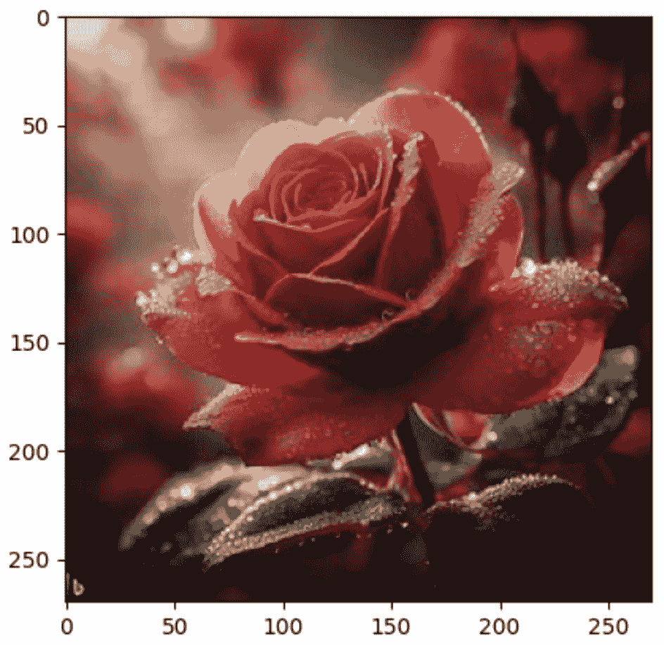
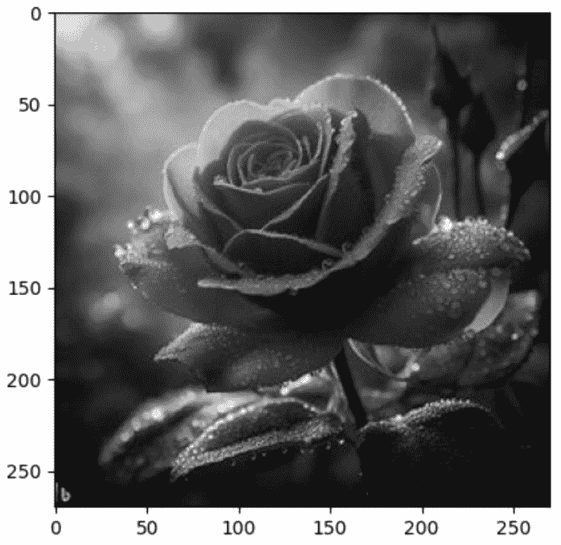
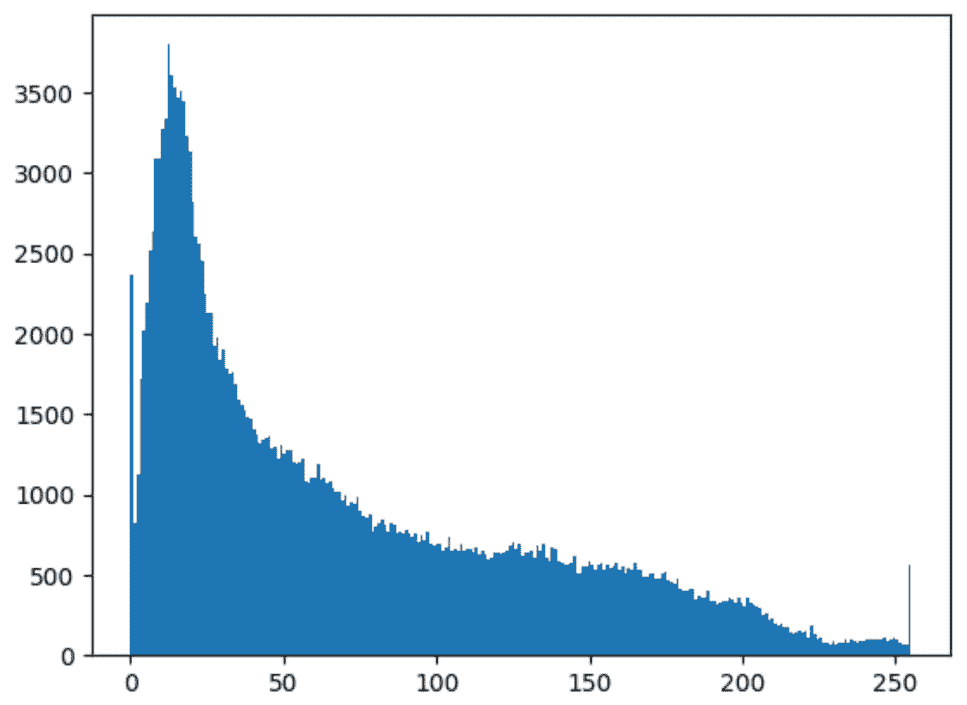
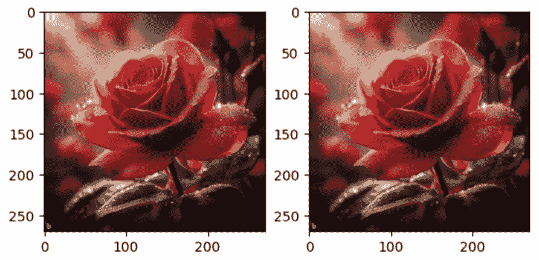
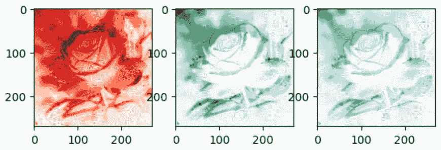
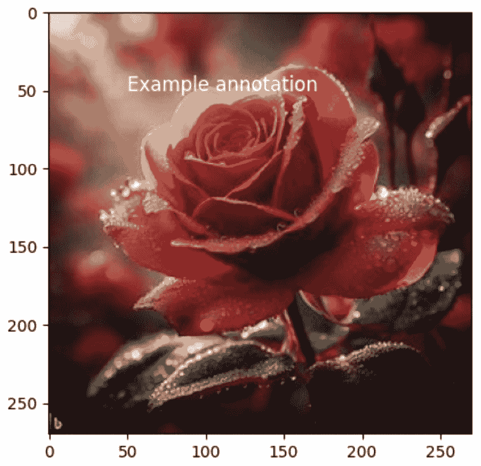
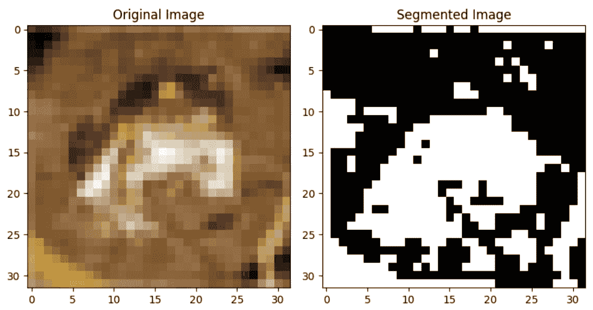
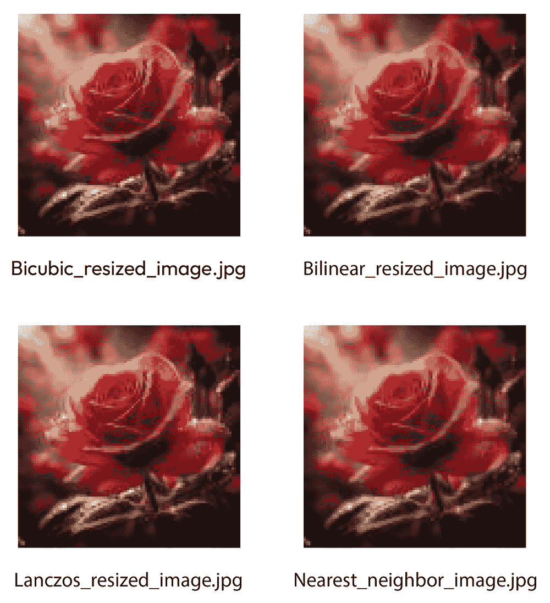
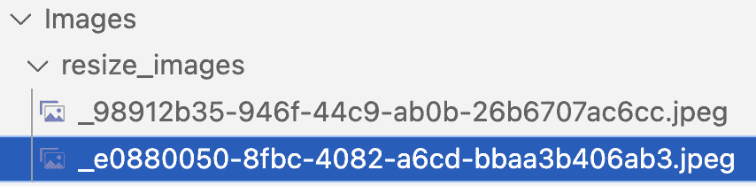
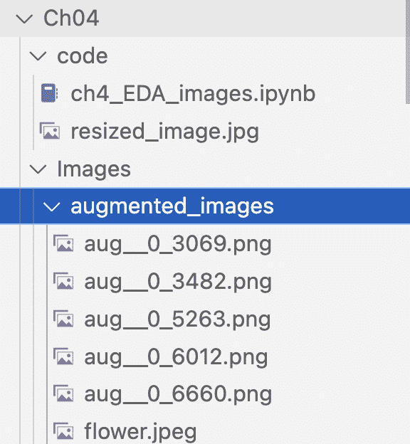

# 第四章：探索图像数据

在本章中，我们将学习如何使用 Python 中的各种包和库来探索图像数据。我们还将看到如何使用 Matplotlib 可视化图像，以及如何使用 NumPy 分析图像属性。

图像数据在机器学习、计算机视觉和物体检测的各个实际应用中得到了广泛的应用。

本章分为三个关键部分，涵盖了可视化图像数据、分析图像尺寸和宽高比，以及在对图像进行变换。每一部分都专注于图像数据分析的特定方面，提供了实用的见解和技术，以提取有价值的信息。

在第一部分，*可视化图像数据*中，我们将利用 Matplotlib、Seaborn、**Python 图像库**（**PIL**）和 NumPy 库，并探索诸如为灰度图像绘制像素值直方图、可视化 RGB 图像中的颜色通道、添加注释以增强图像解释，以及执行图像分割等技术。此外，我们还将深入探讨使用**方向梯度直方图**（**HOG**）进行特征提取。通过实际示例和动手练习，本部分将为您提供使用 Python 库进行视觉分析和解释图像数据的基本技能。无论您是初学者还是希望深化图像处理专业知识，本部分都提供了有价值的见解和实用知识。

接下来进入第二部分*分析图像尺寸和宽高比*，我们深入探讨了理解图像尺寸和比例的重要性。我们展示了如何利用 Python 库如**Python 图像库**（**PIL**）和 OpenCV 提取和分析图像尺寸和宽高比。通过研究这些属性，我们可以得出关于图像组成和结构的有意义的见解，这可以指导数据标注决策，并有助于准确分类或物体检测任务。

最后的*对图像进行变换*部分探讨了通过变换进行数据增强的概念。我们深入探讨了如何使用 OpenCV 和 scikit-image 等库应用各种图像变换，如旋转、平移和剪切。这些变换不仅增强了数据集的多样性和规模，还允许创建捕捉不同方向、视角或变化的增强图像。我们讨论了如何利用这些变换后的图像进行数据标注和提升模型性能。

在本章中，我们强调使用 Python 实现这些技术的实际应用。通过利用图像处理库和可视化工具丰富的生态系统，我们使读者能够执行针对图像数据集的探索性数据分析。从可视化图像数据、分析尺寸和纵横比以及执行转换中获得的认识，为有效的数据标注和构建稳健的机器学习模型奠定了坚实的基础。

无论您是希望成为数据科学家、图像处理爱好者，还是希望提高数据标注技能的专业人士，本章都提供了宝贵的指导和实际示例，以探索、分析和使用 Python 有效地标注图像数据。

到本章结束时，我们将涵盖以下主题：

+   可视化图像数据

+   分析图像尺寸和纵横比

+   对图像执行转换操作

# 技术要求

在本章中，您需要 VS Code、Keras、CV2 和 OpenCV。本章使用的示例代码的 Python 笔记本可以从[`github.com/PacktPublishing/Data-Labeling-in-Machine-Learning-with-Python/tree/main/code//Ch04`](https://github.com/PacktPublishing/Data-Labeling-in-Machine-Learning-with-Python/tree/main/code//Ch04)下载。

您可以在本 GitHub 仓库中的笔记本中找到所有代码块的结果。此外，您还需要在书的**前言**中概述的环境设置。

# 使用 Python 中的 Matplotlib 可视化图像数据

在本节中，我们探讨可视化工具和技术的作用，以深入了解图像数据的特性和模式。通过使用 Python 库，如 Matplotlib 和 Seaborn，我们学习如何创建展示图像分布、类别不平衡、颜色分布和其他关键特征的可视化。通过可视化图像数据，我们可以揭示隐藏的模式，检测异常，并为数据标注做出明智的决策。

**探索性数据分析**（**EDA**）是构建计算机视觉模型过程中的重要步骤。在 EDA 中，我们分析图像数据，以了解其特性，并识别可以指导我们的建模决策的模式和关系。

一些图像数据分析和应用的真实世界示例如下：

+   **自动驾驶汽车**：图像数据在使自动驾驶汽车感知周围环境方面发挥着至关重要的作用。安装在车辆上的摄像头捕捉道路和周围环境的图像，机器学习算法分析这些图像以检测和识别行人、车辆和交通标志等对象。

+   **医学图像分析**：在医学成像领域，机器学习被用于肿瘤检测、器官分割和疾病诊断等任务。放射学图像，如 X 射线、MRI 和 CT 扫描，被分析以识别异常并协助医疗保健专业人员做出明智的决定。

+   **零售和电子商务**：在零售业中，目标检测被用于库存管理和客户体验改进。例如，自动结账系统使用计算机视觉来识别和统计购物车中的产品，从而提高结账过程的效率。

+   **安全和监控**：图像数据在安全系统中用于监控和威胁检测。机器学习模型可以分析视频流以识别并向当局发出关于公共场所可疑活动、入侵者或异常行为的警报。

+   **面部识别**：面部识别技术依赖于图像数据来识别和验证个人。这被用于各种应用，包括智能手机认证、访问控制系统和执法部门的犯罪识别。

+   **增强现实（AR）**：AR 应用将数字信息叠加到现实世界中。图像数据对于跟踪和识别物体和表面至关重要，从而实现真实和交互式的 AR 体验。

+   **制造业质量控制**：计算机视觉在制造业中用于检查产品缺陷并确保质量。自动化系统分析装配线上的产品图像，以识别任何与预期规格的偏差。

+   **卫星图像分析**：卫星图像被用于多种目的，包括土地覆盖分类、环境监测和灾害响应。机器学习算法可以分析卫星图像以识别景观变化、检测森林砍伐或评估自然灾害的影响。

这些例子展示了图像数据在机器学习、计算机视觉和目标检测中的多样化应用，展示了它在解决不同领域现实世界问题中的重要性。

在进行图像数据的 EDA（探索性数据分析）时，以下是一些需要遵循的步骤。

## 加载数据

任何 EDA 过程的第一个步骤是将图像数据加载到您的**集成开发环境（IDE）**工作区中，例如 VS Code、Jupyter Notebook 或任何其他 Python 编辑器。根据数据格式，您可能需要使用 OpenCV 或 PIL 等库来读取图像。

## 检查尺寸

下一步是检查图像的尺寸。图像尺寸可能会影响您模型的表现，因为较大的图像需要更多的内存和计算。您还应确保所有图像具有相同的尺寸，因为这是大多数计算机视觉模型的要求。如果图像尺寸不同，则需要预处理以将它们转换为相同的尺寸。

## 可视化数据

可视化是理解图像数据的有力工具。您可以使用 Matplotlib 或 Seaborn 库以各种方式可视化数据。您可以通过绘制像素值的直方图来查看它们的分布，或使用散点图来可视化像素值之间的关系。我们将在本章后面介绍这一点。

## 检查异常值

异常值会对您模型的性能产生重大影响。您应该通过绘制箱线图和检查像素值的分布来检查图像数据中的异常值。在图像数据的上下文中，异常值是（在这种情况下，图像）与数据集预期或正常分布显著偏离的数据点。图像数据中的异常值是具有与数据集中大多数图像不同的独特特征或模式的图像。像素值远高于或低于数据集典型范围的图像可以被认为是异常值。这些极端值可能是由于传感器故障、数据损坏或其他异常引起的。颜色分布与数据集预期颜色分布显著不同的图像也可以被认为是异常值。这些可能是具有不寻常的色彩色调、饱和度或强度的图像。

## 执行数据预处理

预处理是 EDA 中的重要步骤，因为它可以帮助减少噪声并提高图像质量。常见的预处理技术包括调整大小、归一化、数据增强、图像分割和特征提取。

在图像数据中，预处理涉及多个步骤。

### 1. 图像调整大小

预处理图像数据的第一个步骤是调整图像大小。图像调整大小是必要的，因为我们需要所有图像具有相同的大小。如果我们不确保调整图像大小，我们可能会得到不同大小的图像，这可能导致训练期间出现问题。

### 2. 图像归一化

预处理图像数据的下一步是归一化。归一化是必不可少的，因为它有助于减少光照和颜色变化对图像的影响。归一化涉及将图像的像素值缩放到特定范围。最常见的归一化方法是将像素值缩放到[0,1]的范围。在图像数据集归一化期间将像素值缩放到[0, 1]范围具有几个重要的优势和影响，使其成为各种图像处理和机器学习任务中常见且有效的实践。以下是为什么这个范围是重要的原因。将图像归一化到公共范围确保了不同图像中的所有像素值具有相同的尺度。这使得算法更容易比较和处理图像，因为它们不需要处理变化的像素值范围。[0, 1]的范围非常适合计算中的数值稳定性。许多机器学习算法和图像处理技术在处理不是太大或太小的值时表现最佳。将像素值缩放到[0, 1]有助于防止数值不稳定和训练期间梯度爆炸等问题。

### 3. 图像增强

图像增强是一种通过创建额外的图像来增加训练数据集大小的技术。图像增强涉及对原始图像应用各种转换，如旋转、翻转、缩放和剪切。它在图像分类和目标检测任务中使用。图像增强是必不可少的，因为它有助于减少过拟合并提高模型的泛化能力。过拟合是机器学习和深度学习中常见的问题，其中模型对训练数据学习得太好，以至于开始捕捉噪声和数据的随机波动，而不是底层模式。它有助于产生鲁棒的模型。过度的增强可能导致不切实际的模型或过拟合，这可能导致泛化能力降低，限制模型在现实场景中的实用性。

增加更多训练数据是帮助减少过拟合的一种方法。然而，在许多情况下，收集大量新的、多样化的数据可能不切实际或成本高昂。这就是数据增强发挥作用的地方。数据增强涉及对现有训练数据应用各种转换，以人工增加其大小和多样性。以下是数据增强如何帮助减少过拟合，尤其是在图像数据集的背景下：

+   **提高泛化能力**：增强通过使模型接触到各种转换来帮助它更好地泛化到未见过的数据。这可以增强模型处理物体外观变化的能力。

+   **对变化的鲁棒性**：使用增强数据训练的模型通常对光照、方向和其他可能在现实场景中出现的因素的变化具有更强的鲁棒性。

+   **数据效率**: 增强允许在不收集额外标记样本的情况下创建更大的有效训练数据集。当可用的标记数据有限时，这可能特别有益。

+   **缓解过拟合**: 增强引入了可变性，有助于防止过拟合。在增强数据上训练的模型不太可能记住特定的训练示例，更有可能学习到可泛化的特征。

+   **注意事项**: 虽然增强通常有益，但必须应用对特定任务有意义的变换。例如，水平翻转图像对于许多任务来说是合理的，但随机旋转图像可能不适合对方向有严格要求的任务。

### 4. 图像分割

图像分割是将图像分割成多个有意义的段或区域的过程。在医学图像分析中，图像分割是必不可少的，我们需要在图像中识别不同的器官或组织。图像分割也用于目标检测，我们需要在图像中识别不同的对象。

### 5. 特征提取

特征提取是从图像数据中提取相关特征或信息的过程。特征提取是必不可少的，因为它有助于降低图像数据的维度，这可以提高机器学习算法的性能。特征提取涉及对图像应用各种过滤器，如边缘检测、纹理分析和颜色分割。颜色特征的例子是颜色直方图，它表示图像中颜色强度的分布。同样，形状特征包括霍夫变换，它可以检测和表示线条和圆形等形状。

总结来说，数据探索和预处理是机器学习流程中的关键步骤。在图像数据中，我们需要调整图像大小、归一化像素值、应用图像增强、执行图像分割，并从图像中提取相关特征。通过遵循这些预处理步骤，我们可以提高机器学习算法的性能，并实现更好的结果。

## 检查类别不平衡

在许多图像分类问题中，类别在数据集中可能没有均匀表示。你应该通过计算每个类别的图像数量并可视化类别的分布来检查类别不平衡。如果存在不平衡，我们通过应用旋转、翻转、裁剪和颜色变化等变换来增强少数类数据。这增加了少数类的多样性，而无需生成全新的样本。

## 识别模式和关系

EDA 的目标是识别数据中的模式和关系，这些模式和关系可以指导你的建模决策。你可以使用诸如聚类等技术来识别数据中的模式，或者使用散点图或相关矩阵来检查不同特征之间的关系。在图像数据集分析中，聚类是一种根据图像固有的模式和特征将相似图像分组的技术。这是一种数据探索方法，通过识别具有相似视觉特征的图像组或聚类，有助于理解图像数据的结构。聚类算法分析图像的视觉属性，如像素值或提取的特征，将视觉上相似的图像分组到聚类中。具有共同视觉特征的图像被分组在一起，形成不同的聚类。

## 评估预处理的影响

最后，你应该评估预处理对你图像数据的影响。你可以比较你的模型在预处理和未处理数据上的性能，以确定你的预处理技术的有效性。

总结来说，EDA（探索性数据分析）是构建计算机视觉模型过程中的一个重要步骤。通过可视化数据、检查异常值和类别不平衡、识别模式和关系，以及评估预处理的影响，你可以更好地理解你的图像数据，并就你的建模方法做出明智的决策。

## 数据可视化实践示例

让我们通过以下代码示例看看如何使用 Matplotlib 可视化图像数据。首先，我们使用 PIL 库加载图像：

```py
import matplotlib.pyplot as plt
import numpy as np
from PIL import Image
# Load an image
img = Image.open('../images/roseflower.jpeg')
```

然后，我们使用`np.array`函数将其转换为 NumPy 数组：

```py
# Convert image to numpy array
img_array = np.array(img)
```

接下来，使用以下命令绘制结果：

```py
# Plot the image
plt.imshow(img_array)
plt.show()
```

我们得到以下结果：



图 4.1 – 可视化图像数据

然后，我们使用 Matplotlib 的`imshow`函数来绘制图像。在 EDA 过程中将图像转换为 NumPy 数组提供了几个好处，使得数据处理、分析和可视化更加方便和高效。NumPy 是 Python 中一个强大的数值计算库，它提供了对多维数组的支持以及广泛的数学运算。在 EDA 过程中将图像转换为 NumPy 数组是常见的，因为 NumPy 数组可以直接访问图像中的单个像素，这使得分析像素值和执行像素级操作变得更容易。Python 中的许多数据分析和可视化库，包括 Matplotlib 和 scikit-learn，都可以无缝地与 NumPy 数组一起工作。这让你能够利用丰富的工具和技术生态系统来分析图像。

使用 Matplotlib 可视化图像数据有许多不同的方法。现在，我们将回顾一些常见的例子。

`imshow`函数的`cmap`参数设置为`'gray'`：

```py
import numpy as np
from PIL import Image
import matplotlib.pyplot as plt
img_color = Image.open('../images/roseflower.jpeg')
# Convert the image to grayscale
img_gray = img_color.convert('L')
# Convert the image to a NumPy array
img_gray_array = np.array(img_gray)
# Display the image using matplotlib
plt.imshow(img_gray_array, cmap='gray')
# Show the plot
plt.show()
```

以下图是此代码的结果：



图 4.2 – 灰度图像

**像素值直方图**：我们可以使用直方图来可视化图像中像素值的分布。这有助于我们了解图像的整体亮度和对比度：

```py
import numpy as np
from PIL import Image
import matplotlib.pyplot as plt
# Load an image
img_color = Image.open('../images/roseflower.jpeg')
# Convert image to numpy array
img_array = np.array(img_color)
# Plot the histogram
plt.hist(img_array.ravel(), bins=256)
plt.show()
```

结果图如下：



图 4.3 – 像素值直方图

**多张图像并排显示**：我们可以使用子图并排显示多张图像以进行比较：

```py
import matplotlib.pyplot as plt
import numpy as np
from PIL import Image
# Load two images
img1 = Image.open('./images/roseflower.jpeg')
img2 = Image.open('./images/roseflower.jpeg')
# Convert images to numpy arrays
img1_array = np.array(img1)
img2_array = np.array(img2)
# Plot the images side-by-side
fig, axes = plt.subplots(nrows=1, ncols=2)
axes[0].imshow(img1_array)
axes[1].imshow(img2_array)
plt.show()
```

我们得到以下惊人的结果：



图 4.4 – 多张图像并排显示

**颜色通道可视化**：对于彩色图像，我们可以分别绘制每个颜色通道，以查看它们如何对整体图像做出贡献。在图像数据集中，颜色通道指的是图像中每个像素的单个颜色信息组件。彩色图像由多个颜色通道组成，其中每个通道代表特定的颜色方面或颜色空间。这些颜色通道的组合构成了图像的全彩色表示。常见的颜色空间包括 **红色、绿色、蓝色**（**RGB**）、**色调、饱和度、亮度**（**HSV**）和 **青色、品红色、黄色**、**关键/黑色**（**CMYK**）。

通常，RGB 颜色通道使用适当的颜色图来表示它们各自的颜色。当分别可视化单个颜色通道（红色、绿色和蓝色）时，通常使用突出特定颜色信息的颜色图。

这里是用于可视化单个 RGB 通道的典型颜色图：

+   `'Reds'` 颜色图常用于可视化红色通道。它从深红色到浅红色，较暗的值代表较低的强度，较亮的值代表较高的强度。

+   `'Greens'` 颜色图通常用于可视化绿色通道。类似于 `'Reds'`，它从深绿色到浅绿色。

+   `'Blues'` 颜色图用于可视化蓝色通道。它从深蓝色到浅蓝色。

这里是一个使用这些颜色图可视化单个 RGB 通道的示例：

```py
import matplotlib.pyplot as plt
import numpy as np
from PIL import Image
# Load a color image
img = Image.open('../images/roseflower.jpeg')
# Split the image into RGB channels
r, g, b = img.split()
# Convert channels to numpy arrays
r_array = np.array(r)
g_array = np.array(g)
b_array = np.array(b)
# Plot each channel separately
fig, axes = plt.subplots(nrows=1, ncols=3)
axes[0].imshow(r_array, cmap='Reds') # Use 'Reds' colormap for the red channel
axes[1].imshow(g_array, cmap='Greens') # Use 'Greens' colormap for the green channel
axes[2].imshow(b_array, cmap='Blues') # Use 'Blues' colormap for the blue channel
plt.show()
```

因此，我们看到以下通道：



图 4.5 – 颜色通道可视化

## 添加图像注释的实践示例

我们可以在图像上添加注释来突出感兴趣的区域，例如在图像中标记关键特征，可能是人脸上的面部特征（眼睛、鼻子、嘴巴），以强调分析或识别的重要属性。注释还可以用于突出工业检测图像、医学图像和质量控制过程中显示异常、缺陷或不规则性的区域，以及识别和标记特定的兴趣点，如地图上的地标。让我们看看注释的实际应用：

```py
import matplotlib.pyplot as plt
import numpy as np
from PIL import Image
# Load an image
img = Image.open('../images/roseflower.jpeg')
# Convert image to numpy array
img_array = np.array(img)
# Plot the image with annotations
plt.imshow(img_array)
plt.scatter(100, 200, c='r', s=50)
plt.annotate("Example annotation", (50, 50), fontsize=12, color='w')
plt.show()
```

我们得到以下输出结果：



图 4.6 – 图像注释

这些只是我们可以使用 Matplotlib 可视化图像数据的许多方法中的几个。通过一些创造性和实验，我们可以创建各种可视化，帮助我们更好地理解图像数据。

## 图像分割实践示例

以下简单的代码片段演示了如何使用 CIFAR-10 数据集和简单的阈值技术进行基本的图像分割：

```py
import numpy as np
import matplotlib.pyplot as plt
from keras.datasets import cifar10
# Load the CIFAR-10 dataset
(x_train, _), (_, _) = cifar10.load_data()
# Select a sample image for segmentation
sample_image = x_train[0]  # You can choose any index here
# Convert the image to grayscale (optional)
gray_image = np.mean(sample_image, axis=2)
# Apply a simple thresholding for segmentation
threshold = 100
segmented_image = np.where(\
    gray_image > threshold, 255, 0).astype(np.uint8)
# Plot the original and segmented images
plt.figure(figsize=(8, 4))
plt.subplot(1, 2, 1)
plt.imshow(sample_image)
plt.title('Original Image')
plt.subplot(1, 2, 2)
plt.imshow(segmented_image, cmap='gray')
plt.title('Segmented Image')
plt.tight_layout()
plt.show()
```

结果如下：



图 4.7 – 图像分割

此示例使用基本的阈值技术根据像素强度值对图像进行分割。

## 特征提取实践示例

从图像数据集（如 CIFAR-10）中提取特征涉及将原始图像数据转换为可用于机器学习模型的有关特征集。以下是一个使用**方向梯度直方图**（**HOG**）特征提取技术的简单示例：

```py
import numpy as np
import matplotlib.pyplot as plt
from skimage.feature import hog
from skimage import exposure
from keras.datasets import cifar10
# Load the CIFAR-10 dataset
(x_train, _), (_, _) = cifar10.load_data()
# Select a sample image for feature extraction
sample_image = x_train[0]  # You can choose any index here
# Convert the image to grayscale (optional)
gray_image = np.mean(sample_image, axis=2)
# Apply Histogram of Oriented Gradients (HOG) feature extraction
hog_features, hog_image = hog( \
    gray_image,pixels_per_cell=(8, 8),\
    cells_per_block=(2, 2), visualize=True)
# Plot the original image and its HOG representation
plt.figure(figsize=(8, 4))
plt.subplot(1, 2, 1)
plt.imshow(gray_image, cmap='gray')
plt.title('Original Grayscale Image')
plt.subplot(1, 2, 2)
plt.imshow(hog_image, cmap='gray')
plt.title('HOG Feature Extraction')
plt.tight_layout()
plt.show()
```

我们得到以下输出：


图 4.8 – HOG 特征提取

想象你有一张图片，你想通过观察线条和边缘的图案来理解图片中的内容。HOG 是通过关注图像中线条和边缘的方向来实现这一点的。

在前面的代码块中，`hog` 函数内部执行以下四个步骤以生成 HOG 图像：

1.  **将图像分割成小单元格**：首先，函数将图像分割成称为单元格的小方块。想象这些就像覆盖在图像上的小正方形。

1.  **计算梯度**：在每个单元格内部，我们观察颜色的变化。如果颜色变化很大，这意味着可能存在边缘或线条。我们找出这种颜色变化的方向，这被称为梯度。想象画出小箭头来表示这些颜色变化的方向。

1.  **将箭头分组到方向中**：现在，我们将具有相似方向的这些小箭头分组在一起。这就像说，“嘿，有很多边缘朝这个方向延伸，也有很多边缘朝那个方向延伸。”

1.  **制作方向直方图**：直方图就像一个图表，显示了某事发生的次数。在这里，我们制作一个直方图，显示了有多少箭头指向每个方向。这告诉我们该单元格中边缘和线条的哪个方向更常见。

在本节中，我们看到了如何可视化图像数据，并绘制各种特征，包括颜色像素直方图、灰度图像、RGB 颜色通道、图像分割和图像上的注释。

在下一节中，我们将探讨图像大小和宽高比分布对图像数据模型的重要性。

# 分析图像大小和宽高比

在图像数据模型中理解图像大小和宽高比分布非常重要。

在图像数据集 EDA 的背景下，宽高比指的是图像宽度和高度之间的比例关系。这是一个数值表示，有助于描述图像的形状。宽高比在处理图像时尤为重要，因为它提供了关于图像视觉上拉长或压缩的见解。从数学上讲，宽高比是通过将图像宽度除以高度来计算的。它通常以比率或小数形式表示。正方形图像的宽高比为 1:1，而矩形图像的宽高比则不同于 1:1。

## 宽高比对模型性能的影响

让我们通过以下要点来了解宽高比对模型性能的影响：

+   **目标识别**：在目标识别任务中，保持正确的宽高比对于准确检测至关重要。如果在预处理或增强过程中宽高比发生扭曲，可能会导致模型对物体形状的错误解释。

+   **训练稳定性**：确保训练数据集中宽高比的一致性可以有助于训练稳定性。如果模型遇到训练数据中未出现的宽高比变化，可能会遇到困难。

+   **边界框精度**：在目标检测中，边界框通常由宽高比定义。与预期宽高比的偏差可能会影响边界框预测的准确性。

让我们考虑一个场景，其中我们有一个由矩阵表示的图像，其尺寸为*M×N*，其中*M*是行数（高度），*N*是列数（宽度）。图像大小、宽高比和像素宽高比可以按以下方式计算：

+   `300×200`，图像大小将是`300×200=60,000`像素。

+   `300×200`，宽高比将是 200/300，这简化为 2/3。

+   **像素宽高比（PAR）**：这是像素宽度与其高度的比例。当处理非正方形像素时，这一点尤为重要。

    PAR = *像素高度*/*像素宽度*

    示例：如果像素宽高比是 3/4，这意味着像素的宽度是其高度的 3/4。

这些数学示例提供了如何使用简单公式计算图像大小、宽高比和像素宽高比的基本理解。

现在，让我们深入探讨在机器学习图像数据分析背景下填充、裁剪和宽高比评估指标的概念：

+   `200×200`像素，你想要应用一个`3×3`卷积滤波器。如果没有填充，输出大小将是`198×198`。为了保持空间大小，你可以在图像周围添加一个像素的边框，这样填充后的图像大小将是`202×202`。

+   `300×300`像素，你决定裁剪中央区域，你可能会通过从每边去除`50`像素而得到一个`200×200`像素的图像。

+   纵横比评估指标是用于评估目标检测任务中预测边界框的纵横比与真实边界框的纵横比相似度的度量。常见的指标包括**交并比**（**IoU**）和 F1 分数。

在图像分类中，纵横比评估指标在衡量预测边界框与真实边界框在目标检测任务中的准确性方面起着至关重要的作用。一个广泛使用的指标是 IoU，通过将预测和真实边界框之间的重叠面积除以两者覆盖的总面积来计算。得到的 IoU 分数范围从`0`到`1`，其中分数为`0`表示没有重叠，分数为`1`表示完美对齐。此外，F1 分数，另一个常见指标，结合了精确度和召回率，为模型在保持预测和真实边界框的纵横比准确性方面的性能提供了一个平衡的评估。这些指标共同提供了关于目标检测模型在保持图像中对象空间关系有效性的宝贵见解。

示例：假设在一个目标检测任务中，你有一个特定对象的`2:1`纵横比的真实边界框。如果你的模型预测的边界框的纵横比是`1.5:1`，你可以使用 IoU 来衡量预测框与真实框的对齐程度。如果 IoU 指标较高，表示对齐良好；如果较低，可能存在纵横比不匹配。

理解并有效地应用填充、裁剪和纵横比评估指标是预处理和评估机器学习模型中的图像数据的关键方面，尤其是在目标检测等任务中，准确的边界框预测至关重要。

## 图像调整大小

图像调整大小是改变图像尺寸的同时保持其纵横比的过程。它是计算机视觉应用中常见的预处理步骤，包括目标检测、图像分类和图像分割。

调整图像的主要原因是以下几方面：

+   为了将图像适应特定的显示尺寸或纵横比，例如用于网页或移动应用。

+   为了降低处理图像的计算复杂度，例如在实时计算机视觉应用中或当图像大小太大而无法适应内存时。

+   在调整图像大小时，我们需要为图像确定一个新的尺寸。新尺寸可以用像素或缩放因子来指定。在后一种情况下，我们将原始图像的尺寸乘以缩放因子以获得新的尺寸。

调整图像大小主要有两种方法：插值和重采样：

插值是一种估计调整大小后的图像中像素值的技术。它涉及计算围绕目标像素位置的原始图像中像素值的加权平均值。有几种插值方法可供选择，包括最近邻、双线性、双三次和 Lanczos 重采样。

Lanczos 重采样是一种在数字图像处理中用于调整大小或重采样图像的方法。它是一种旨在产生高质量结果的插值算法，尤其是在缩小图像时。Lanczos 算法是以匈牙利数学家和物理学家 Cornelius Lanczos 命名的。Lanczos 重采样算法涉及将 sinc 函数（一种数学函数）应用于原始图像中的像素值，以计算调整大小后的图像中像素的值。这个过程比简单的插值方法（如双线性或双三次）更复杂，但它往往能产生更好的结果，尤其是在缩小图像尺寸时。

以下是一个使用 Pillow 库（PIL 的分支）的简单 Python 示例，用于演示最近邻、双线性、双三次和 Lanczos 重采样方法：

```py
from PIL import Image
# Open an example image
image_path = "../images/roseflower.jpeg"
image = Image.open(image_path)
# Resize the image using different interpolation methods
nearest_neighbor_resized = image.resize((100, 100), \
    resample=Image.NEAREST)
bilinear_resized = image.resize((100, 100), \
    resample=Image.BILINEAR)
bicubic_resized = image.resize((100, 100), \
    resample=Image.BICUBIC)
lanczos_resized = image.resize((100, 100), \
    resample=Image.LANCZOS)
# Save the resized images
nearest_neighbor_resized.save("nearest_neighbor_resized.jpg")
bilinear_resized.save("bilinear_resized.jpg")
bicubic_resized.save("bicubic_resized.jpg")
lanczos_resized.save("lanczos_resized.jpg")
```

我们得到以下输出：



图 4.9 – 每种插值方法的结果

让我们深入了解每种插值方法的细节：

+   `Image.NEAREST`): 此方法选择最接近插值点的最近像素值：

    +   `resample=Image.NEAREST`): 简单且快速。通常用于放大像素艺术图像。

    +   **视觉效果**：导致块状或像素化的图像，尤其是在放大时特别明显。

+   `Image.BILINEAR`): 使用四个最近像素之间的线性插值：

    +   `resample=Image.BILINEAR`): 通常用于通用图像调整大小

    +   **视觉效果**：比最近邻更平滑，但可能会导致一些锐度损失

+   `Image.BICUBIC`): 使用三次多项式进行插值：

    +   `resample=Image.BICUBIC`): 通常用于高质量的下采样

    +   **视觉效果**：比双线性更平滑；通常用于照片图像，但可能会引入轻微的模糊

+   `Image.LANCZOS`): 使用 `sinc` 函数作为插值核：

    +   `resample=Image.LANCZOS`): 适用于缩小图像并保持质量的首选方法。

    +   **视觉效果**：通常产生最高的质量，尤其是在缩小场景中特别明显。可能需要更长的时间来计算。

+   **选择正确的方法**：

    +   **质量与速度**：最近邻是最快的，但可能会导致可见的伪影。双三次和 Lanczos 通常在质量上更受青睐，但会牺牲一点速度。

    +   **缩小与放大**：双三次和 Lanczos 通常用于缩小，而双线性可能对于放大足够。

    如果图像没有显示出明显的差异，可能是因为原始图像的特性、调整大小的幅度或查看者的显示能力等因素。一般来说，对于高质量的调整大小，尤其是缩小，Lanczos 插值通常能提供更优的结果。如果图像很小或差异微妙，方法的选择可能影响较小。

+   **重采样**：重采样是从原始图像中选择像素子集以创建调整大小后的图像的过程。由于像素的移除，这种方法可能导致信息丢失或图像中出现伪影。

在 Python 中，我们可以使用 Pillow 库进行图像调整大小。以下是一些使用 Pillow 库调整图像大小的示例代码：

```py
 #resizing Image
from PIL import Image
# Open image
img = Image.open('../images/roseflower.jpeg')
# Resize image
new_size = (200, 200)
resized_img = img.resize(new_size)
resized_img.save("resized_image.jpg")
```

我们得到了以下结果：


图 4.10 – 调整大小后的图像（200*200）

在前面的代码中，我们首先使用 Pillow 库的`Image.open()`函数打开一个图像。然后我们定义图像的新大小为一个元组`(500, 500)`。最后，我们调用图像对象的`resize()`方法，将新大小元组作为参数，这将返回一个新的调整大小后的图像对象。然后我们使用`save()`方法以新文件名保存调整大小后的图像。

让我们再举一个使用 Python 调整图像大小的例子。我们首先导入必要的库：`os`用于文件和目录操作，`cv2`用于图像加载和处理：

```py
import os
import cv2
```

我们定义图像目录的路径，并使用列表推导式获取目录中所有图像文件名列表：

```py
# Define the path to the image directory
img_dir = '../Images/resize_images'
# Get a list of all image filenames in the directory
img_files = [os.path.join(img_dir, f) \
    for f in os.listdir(img_dir) \
    if os.path.isfile(os.path.join(img_dir, f))]
```

在这个例子中，我们使用元组`(224, 224)`定义图像的新大小。你可以将元组更改为任何你想要的尺寸：

```py
# Define the new size of the images
new_size = (224, 224)
```

我们随后按照以下方式调整图像大小：

```py
# Loop through all the image files
for img_file in img_files:
    # Load the image using OpenCV
    img = cv2.imread(img_file)
    # Resize the image
    resized_img = cv2.resize(img, new_size)
    # Save the resized image with the same filename
    cv2.imwrite(img_file, resized_img)
```

在相关目录中，以下是调整大小后的图像输出：



图 4.11 – 目录中的调整大小后的图像

我们使用`for`循环遍历所有图像文件。对于每个图像文件，我们使用 OpenCV（`cv2.imread()`）加载图像，使用`cv2.resize()`调整图像大小，并使用`cv2.imwrite()`以相同的文件名保存调整大小后的图像。

`cv2.resize()`函数接受三个参数：要调整大小的图像、图像的新大小作为元组`(width, height)`和插值方法。默认插值方法是`cv2.INTER_LINEAR`，在大多数情况下都能产生良好的结果。

在图像分类和目标检测任务中，调整图像大小是一个常见的预处理步骤。通常需要将图像调整到固定大小，以确保所有图像具有相同的大小和宽高比，这使得在图像上训练机器学习模型变得更容易。调整大小还可以帮助减少处理图像的计算成本，因为较小的图像比较大的图像需要更少的内存和计算资源。

总结来说，图像缩放是在保持其宽高比的同时改变图像尺寸的过程。它是计算机视觉应用中常见的前处理步骤，可以使用插值或重采样技术来执行。在 Python 中，我们可以使用 Pillow 库来进行图像缩放。

## 图像归一化

图像归一化是计算机视觉应用中常用的一种预处理技术。图像归一化的目标是转换图像中位于一定范围或具有某些统计特性的像素值。归一化用于减少光照条件变化的影响，或标准化图像的颜色或亮度。

归一化技术通常涉及将图像的像素值缩放到一定范围内，或修改像素值的分布以具有某些统计特性。图像归一化有许多不同的技术，选择哪种技术取决于具体的应用和图像数据的特征。

这里是一些图像归一化的常见技术。

`[0, 1]`或`[-1, 1]`。这可以通过以下公式完成：

```py
normalized_image = (image - min_value) / (max_value - min_value)
```

在这里，`min_value`和`max_value`分别是图像中的最小和最大像素值。

**Z 分数归一化**：这种技术通过修改图像中像素值的分布，使其具有 0 均值和 1 标准差。这可以通过以下公式完成：

```py
normalized_image = (image - mean_value) / std_value
```

在这里，`mean_value`和`std_value`分别是图像中像素值的均值和标准差。

**直方图均衡化**：这种技术通过计算像素值的**累积分布函数**（**CDF**）来使图像中像素值的分布更加均匀。这可以通过将像素值映射到基于 CDF 的新值来完成：

```py
import cv2
# Load image
img = cv2.imread("image.jpg", 0)
# Apply histogram equalization
equalized_img = cv2.equalizeHist(img)
```

在前面的代码中，我们首先使用 OpenCV 库加载图像。然后，我们使用`equalizeHist()`函数应用直方图均衡化，该函数返回一个具有更均匀像素值分布的新图像。OpenCV 是一个功能强大且广泛使用的开源库，在图像识别和计算机视觉任务中发挥着至关重要的作用。其重要性源于其综合的工具、函数和算法集合，旨在处理图像处理的各个方面，包括分析、识别。

让我们通过 Python 的例子来看一下图像归一化的应用。我们首先导入必要的库：`os`用于文件和目录操作，`cv2`用于图像加载和处理，`numpy`用于数学运算：

```py
import os
import cv2
import numpy as np
```

我们定义图像目录的路径，并使用列表推导式获取目录中所有图像文件名的列表：

```py
# Define the path to the image directory
img_dir = 'path/to/image/directory'
# Get a list of all image filenames in the directory
img_files = [os.path.join(img_dir, f) \
    for f in os.listdir(img_dir) \
    if os.path.isfile(os.path.join(img_dir, f))]
```

我们使用`for`循环遍历所有图像文件。对于每个图像文件，我们使用 OpenCV（`cv2.imread()`）来加载图像：

```py
# Loop through all the image files
for img_file in img_files:
    # Load the image using OpenCV
    img = cv2.imread(img_file)
```

我们使用`astype(np.float32)`将图像转换为`float32`数据类型。这是进行下一步归一化的必要条件：

```py
    # Convert the image to float32 data type
    img = img.astype(np.float32)
```

我们使用以下公式将图像像素归一化，使其具有零均值和单位方差：`img -= np.mean(img); img /= np.std(img)`。这通常也称为标准化或 z 分数归一化。这一步对于对输入特征规模敏感的机器学习模型非常重要，因为它确保了所有图像的像素值具有相似的规模：

```py
    # Normalize the image pixels to have zero mean and unit variance
    img -= np.mean(img)
    img /= np.std(img)
```

最后，我们使用`cv2.imwrite()`以相同的文件名保存归一化后的图像：

```py
    # Save the normalized image with the same filename
    cv2.imwrite(img_file, img)
```

图像归一化是许多计算机视觉应用中的关键步骤，因为它可以帮助减少光照条件变化的影响，并标准化图像的颜色和亮度。通过变换图像的像素值，我们可以使机器学习算法更容易从图像数据中学习，并提高我们模型的准确性。

# 对图像进行变换——图像增强

在图像处理和深度学习的领域，有效地处理图像数据的能力至关重要。然而，获取多样化和广泛的数据集可能是一个挑战。这就是图像增强概念发挥作用的地方。图像增强是一种变革性技术，它具有增强数据集丰富性的能力，而无需手动收集额外的图像。本节深入探讨了图像增强的复杂性——这是一个不可或缺的工具，用于提高模型性能、增强泛化能力以及缓解过拟合问题。

图像增强是一种通过从现有数据集中生成新的训练示例来人工增加数据集大小的技术。它在深度学习应用中常用，以防止过拟合并提高泛化性能。

图像增强背后的思想是对现有图像应用各种变换，以创建原始图像的新略作修改的版本。通过这样做，我们可以在不手动收集和标记新图像的情况下有效地增加数据集的大小。例如，在医学图像分析中，由于患者隐私问题和标记所需的专长，获取大量高质量且标注准确的医学图像往往很困难。图像增强技术可以帮助生成多样化的训练示例，以训练准确的诊断模型。另一种情况是处理罕见事件或异常，例如制造中的缺陷或农业中的疾病，在这些情况下，收集足够的真实世界实例可能具有挑战性。图像增强允许生成这些罕见事件的多种场景，从而提高模型检测它们的能力。

可以使用多种图像增强技术。最常用的技术包括以下几种：

+   **旋转**：按指定角度旋转图像

+   **翻转**：水平或垂直翻转图像

+   **缩放**：按指定因子放大或缩小图像

+   **剪切**：按指定因子沿 *x* 或 *y* 方向剪切图像

+   **平移**：按指定像素数水平或垂直平移图像

这些技术可以以各种组合方式应用，从少量原始图像生成大量新图像。例如，我们可以将图像旋转 45 度，水平翻转，并垂直平移，从而生成一个与原始图像相当不同但仍然保留一些其特征的新图像。

在使用图像增强时，一个重要的考虑因素是确保生成的图像仍然代表底层数据集。例如，如果我们正在训练一个用于识别手写数字的模型，我们应该确保生成的图像仍然是可识别的数字，而不是一些随机模式。

总体来说，图像增强是一种强大的技术，可以用来增加数据集的大小并提高深度学习模型的性能。Keras 库提供了一种方便的方式来将各种图像增强技术应用于数据集，正如我们将在下面的代码示例中看到的那样。

让我们看看一些用于图像增强的 Python 代码示例。我们首先导入必要的库：`keras.preprocessing.image` 用于图像增强和 `os` 用于文件和目录操作：

*步骤 1：导入用于图像增强的必要库*

下面的代码片段展示了如何导入库：

```py
# import the necessary libraries
from keras.preprocessing.image import ImageDataGenerator
import os
```

我们定义图像目录的路径如下：

```py
# Define the path to the image directory
img_dir = 'path/to/image/directory'
```

*步骤 2：创建 ImageDataGenerator 的实例*

我们创建 `ImageDataGenerator` 类的实例，这允许我们定义各种类型的图像增强技术。在这个例子中，我们使用旋转、水平和垂直平移、剪切、缩放和水平翻转：

```py
# Create an instance of the ImageDataGenerator class
datagen = ImageDataGenerator(
    rotation_range=30,
    width_shift_range=0.2,
    height_shift_range=0.2,
    shear_range=0.2,
    zoom_range=0.2,
    horizontal_flip=True,
    fill_mode='nearest')
```

*步骤 3：从目录中加载每个图像并将其转换为数组*

我们使用列表推导式获取目录中所有图像文件名列表。然后，我们使用 `for` 循环遍历所有图像文件。对于每个图像文件，我们使用 Keras 的 `load_img` 函数加载图像，并使用 Keras 的 `img_to_array` 函数将其转换为数组：

```py
# Get a list of all image filenames in the directory
img_files = [os.path.join(img_dir, f) \
    for f in os.listdir(img_dir) \
    if os.path.isfile(os.path.join(img_dir, f))]
# Loop through all the image files
for img_file in img_files:
    # Load the image using Keras' load_img function
    img = load_img(img_file)
    # Convert the image to an array using Keras' img_to_array function
    img_arr = img_to_array(img)
```

我们将数组重塑为具有 `1` 个批处理维度，这是 `ImageDataGenerator` 类的 `flow` 方法所必需的：

```py
    # Reshape the array to have a batch dimension of 1
    img_arr = img_arr.reshape((1,) + img_arr.shape)
```

*步骤 4：为每个输入图像重新生成五个增强图像*

我们随后按如下方式重新生成我们的增强图像：

```py
    # Generate 5 augmented images for each input image
    i = 0
    for batch in datagen.flow( \
        img_arr, batch_size=1, save_to_dir=img_dir, \
        save_prefix='aug_', save_format='jpg' \
    ):
        i += 1
        if i == 5:
            break
```

您可以在 GitHub 仓库的以下目录中看到为流生成的五个增强图像：



图 4.12 – 增强图像

我们使用`flow`方法为每个输入图像生成五个增强图像。`flow`方法接受输入图像的数组、批大小为 1 以及在第*3*步中定义的各种参数。它返回一个生成器，可以即时生成增强图像。我们使用`save_to_dir`、`save_prefix`和`save_format`参数，将每个增强图像保存为以`aug_`为文件名前缀的文件。

在本节中，我们学习了如何使用数据增强来转换数据集，并看到了一些常用的数据增强技术，用于为训练生成额外的数据。

# 摘要

在本章中，我们学习了如何在加载图像数据集后审查图像，并使用 Python 中的 Matplotlib 工具进行探索。我们还发现了如何使用两个方便的工具 PIL 和 OpenCV 来更改图片大小。正当事情变得有趣时，我们发现了一个叫做数据增强的酷技巧，它帮助我们使数据集更大，并教会计算机如何理解同一图片的不同版本。

但是等等，还有更多内容要来！在下一章中，我们将看到如何根据规则和启发式方法使用 Snorkel 来标记我们的图像数据。准备好享受更多乐趣，随着我们深入探索图像标记的世界！
