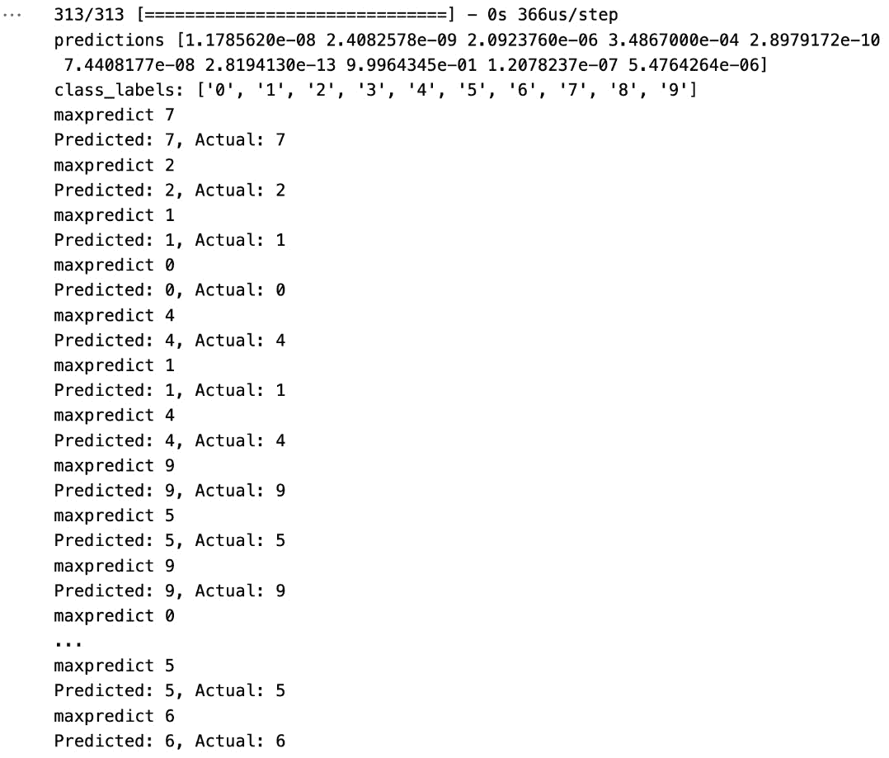

# 第五章：使用规则标注图像数据

在本章中，我们将探讨专门针对图像分类的数据标注技术，使用 Python 实现。我们的主要目标是阐明你需要采取的路径来为这些图像生成精确的标签，这些标签基于精心设计的规则，这些规则基于各种图像属性。你将获得通过手动检查分解和解析图像的能力，利用强大的 Python 生态系统。

在本章中，你将学习以下内容：

+   如何基于 Python 中对图像可视化的手动检查来创建标注规则

+   如何基于图像的大小和宽高比来创建标注规则

+   如何使用预训练模型如**YOLO V3**应用迁移学习来标注图像数据

总体目标是赋予你生成精确和可靠数据标签的能力。我们的目标是为你提供一套通用的标注策略，这些策略可以应用于各种机器学习项目。

我们还将介绍用于图像标注的变换，如**剪切**和**翻转**。我们将提供所需的知识和技术，以有效地利用这些变换，给你的标注过程带来动态优势。我们将深入研究**大小**、**宽高比**、**边界框**、**多边形标注**和**折线标注**的复杂性。你将学习如何根据这些定量图像特征推导出标注规则，提供一种系统且可靠的标注数据的方法。

# 技术要求

本章中使用的示例的完整代码笔记本可在 GitHub 上找到，网址为[`github.com/PacktPublishing/Data-Labeling-in-Machine-Learning-with-Python`](https://github.com/PacktPublishing/Data-Labeling-in-Machine-Learning-with-Python)。

本章中使用的样本图像数据集可在 GitHub 上找到，网址为[`github.com/PacktPublishing/Data-Labeling-in-Machine-Learning-with-Python/tree/main/images`](https://github.com/PacktPublishing/Data-Labeling-in-Machine-Learning-with-Python/tree/main/images)。

# 基于图像可视化的标注规则

图像分类是将图像根据其内容分类到一个或多个类别的过程。由于图像的高度可变性和复杂性，这是一个具有挑战性的任务。近年来，机器学习技术已被成功应用于图像分类。然而，机器学习模型需要大量的标注数据来有效训练。

## 使用 Snorkel 的规则进行图像标注

Snorkel 是一个开源数据平台，它提供了一种使用弱监督技术生成大量标注数据的方法。弱监督允许你使用噪声或不完整的监督源来标注数据，例如启发式方法、规则或模式。

Snorkel 主要在弱监督范式内运行，而不是传统的半监督学习。Snorkel 是一个为弱监督设计的框架，其中标记过程可能涉及噪声、有限或不精确的规则，而不是大量标记数据。

在 Snorkel 中，用户创建**标记函数**（**LFs**），这些函数表达启发式或基于规则的标记策略。这些 LFs 可能并不完美，生成的标签中可能存在冲突或噪声。然后，Snorkel 的标记模型学习去噪和组合这些弱标签，以创建更准确和可靠的训练数据标记。

虽然半监督学习通常涉及少量标记数据和大量未标记数据，但 Snorkel 专注于弱监督场景，使用户能够利用各种噪声或不完整的监督源来训练机器学习模型。

总结来说，Snorkel 更符合弱监督的原则，其中重点在于处理由启发式规则生成的噪声或不精确标签，而不是严格归类为半监督学习框架。

在本节中，我们将探讨弱监督的概念以及如何使用 Snorkel 生成标签。

## 弱监督

弱监督是一种技术，用于使用噪声或不完整的监督源生成大量标记数据。其思想是使用一组 LFs 为每个数据点生成噪声标签。然后，将这些标签组合起来为每个数据点生成一个最终标签。弱监督的关键优势是它允许你快速且低成本地生成标记数据。

Snorkel 是一个提供使用弱监督生成标签方法的框架。它提供了一套工具来创建 LFs、组合它们，并训练一个模型从生成的标签中学习。Snorkel 使用一种称为数据编程的技术来组合 LFs 并为每个数据点生成一个最终标签。

LF 是一个为数据点生成噪声标签的函数。标签可以是任何值，包括连续或离散值。在图像分类的背景下，LF 是一个如果图像包含感兴趣的对象则输出标签 1，否则输出 0 的函数。

LFs 是通过启发式、规则或模式创建的。关键思想是定义一组规则，以捕获每个数据点的相关信息。

现在，让我们看看如何定义基于手动可视化图像对象颜色规则的规则和 LF，用于植物疾病标记。

## 基于手动可视化图像对象颜色的规则

在本节中，让我们看看如何使用寻找特定视觉特征的 LF，这些特征是植物叶子图像的典型特征，我们感兴趣的是将其分类为“健康”或“死亡”。例如，我们可以使用一个检查图像是否具有特定颜色分布或是否包含那些图像中常见的特定形状的 LF。

Snorkel 的 LF 可以根据各种属性对图像进行标注，例如某些物体的存在、颜色、纹理和形状。以下是一个使用 Snorkel LF 根据颜色分布检测图像的 Python 代码示例。

基于对图像可视化的手动检查创建标注规则是一个手动过程，通常需要人工标注员的专长。这个过程通常用于没有现有标注数据集的情况，你需要为机器学习或分析任务创建标签。

以下是如何在 Python 中基于对图像可视化的手动检查创建标注规则的一般概述：

1.  **收集代表性样本**: 首先从你的数据集中选择一个代表性的图像样本。这个样本应涵盖你想要分类的变异和类别范围。

1.  **定义标注标准**: 明确定义基于图像视觉属性进行标注的准则或规则。例如，如果你正在根据叶子图像对图像进行分类以识别植物疾病，农业专家会通过视觉检查叶子图像以寻找变色、斑点或异常图案。可以根据症状的外观和位置定义规则。我们将在接下来的演示中使用此示例。

1.  **创建标注界面**: 你可以使用现有的工具或库来创建一个标注界面，让人工标注员可以查看图像并根据定义的准则应用标签。例如，可以使用 Labelbox 和 Supervisely 等库或使用 Python Web 框架（如 Flask 或 Django）自定义界面。

1.  **标注图像**: 让人工标注员手动检查你的样本中的每张图像，并根据定义的准则应用标签。这一步骤涉及人工标注员根据他们的专长和提供的指南对图像进行视觉检查并做出分类决策。

1.  **收集标注**: 收集由人工标注员生成的标注。每张图像应根据视觉检查分配相应的标签或类别。

1.  **分析和正式化规则**: 收集足够的标注后，分析标注员做出的模式和决策。尝试根据标注正式化决策标准。例如，你可能观察到具有某些视觉特征的图像被一致地标注为特定类别。

1.  **将规则转换为代码**：将正式化的决策标准转换为代码，该代码可以根据这些规则自动分类图像。此代码可以用 Python 编写，并集成到您的机器学习管道或分析工作流程中。

1.  **测试和验证规则**：将自动标签规则应用于数据集的更大部分，以确保它们具有良好的泛化能力。如果可用，通过比较自动标签与地面真实标签来验证规则，或者通过手动审查自动标签的子集。

1.  **迭代和改进**：根据反馈、错误分析和必要时进行额外的手动检查，迭代地改进标签规则。这个过程可能包括改进规则、添加更多标准或调整阈值。

基于手动检查创建标签规则是一个劳动密集型过程，但在没有其他选择时，生成标记数据可能是必不可少的。您标记数据集的质量和规则的有效性取决于人工标注员的准确性和一致性，以及定义标准的清晰度。

## 实际应用

在各种实际应用中，手动检查图像进行分类，以及定义规则或模式是常见的。以下是一些实际示例：

+   **医学图像分类**：

    +   **示例**：将 X 射线或 MRI 图像分类为“正常”或“异常”。

    +   **规则/模式**：放射科医生通过视觉检查图像以识别异常，如肿瘤、骨折或解剖学上的异常。规则可以基于这些特征的存在、大小或位置。

+   **植物疾病检测**：

    +   **示例**：从叶片图像中识别植物疾病。

    +   **规则/模式**：农业专家通过视觉检查叶片图像以识别褪色、斑点或异常模式。可以根据症状的外观和位置定义规则。

+   **食品质量检查**：

    +   **示例**：从图像中将食品产品分类为“新鲜”或“变质”。

    +   **规则/模式**：食品检查员通过视觉检查水果、蔬菜或包装商品的图像以识别腐烂、霉变或其他质量问题。规则可以基于颜色、质地或形状。

+   **制造缺陷检测**：

    +   **示例**：从图像中检测制造产品的缺陷。

    +   **规则/模式**：质量控制检查员通过视觉检查产品图像以识别缺陷，如裂缝、划痕或缺失部件。可以根据缺陷的位置和特征定义规则。

+   **交通标志识别**：

    +   **示例**：从自动驾驶车辆捕获的图像中识别交通标志。

    +   **规则/模式**：工程师通过视觉检查图像以识别其形状、颜色和符号等特征。可以根据这些视觉线索定义规则。

+   **野生动物监测**：

    +   **示例**：从相机陷阱图像中识别和跟踪动物。

    +   **规则/模式**：野生动物专家通过视觉检查图像以确定特定动物物种的存在、其行为或一天中的时间。规则可以基于动物的外观和上下文。

+   **历史文档分类**：

    +   **示例**：根据内容或时代对历史文档进行分类。

    +   **规则/模式**：档案保管员通过视觉检查扫描的文档的手写风格、语言、内容或视觉元素（如插图）。可以根据这些特征定义规则。

+   **安全和监控**：

    +   **示例**：在监控摄像头录像中识别安全威胁或入侵者。

    +   **规则/模式**：安全人员通过视频流视觉检查异常行为、可疑物体或未经授权的访问。可以根据这些观察结果定义规则。

在所有这些例子中，专家或人工标注者通过视觉检查图像，识别相关模式或特征，并定义分类的规则或标准。这些规则通常基于领域知识和经验。一旦建立，这些规则可以用来创建 LF 并自动分类图像，协助决策或优先分析。

## 植物疾病检测的一个实际例子

让我们看看用于植物疾病检测的示例 LF。在这段代码中，我们创建了一个规则来根据叶子的颜色分布将植物分类为健康或病态。一个规则是如果植物叶子中的`black_pixel_percentage`大于阈值值，那么我们将该植物分类为病态植物。

下面是两种不同的植物叶子类型。

.jpg)

图 5.1 – 健康和病态植物叶子

我们计算叶子图像中黑色像素的数量，然后计算黑色像素的百分比：

*黑色像素百分比 = 叶子图像中黑色像素的数量/叶子图像中总像素数量*

我们将使用以下规则：如果一个植物叶子图像中的黑色像素百分比大于阈值值（在这个例子中，10%），那么我们将该植物分类为病态植物，并标记为“病态植物”。

同样，如果黑色像素百分比小于 10%，那么我们将该植物分类为健康植物，并标记为“健康植物”。

以下代码片段展示了如何使用 Python 库计算图像中的黑色像素百分比：

```py
# Convert the image to grayscale
gray_image = cv2.cvtColor(resized_image, cv2.COLOR_BGR2GRAY)
```

这一行将原始彩色图像转换为灰度图，使用 OpenCV 的`cvtColor`函数。灰度图像只有一个通道（与彩色图像中的三个通道相比），表示每个像素的强度或亮度。转换为灰度图简化了后续处理：

```py
# Apply thresholding to detect regions with discoloration
_, binary_image = cv2.threshold(gray_image, 150, 255,\
    cv2.THRESH_BINARY_INV)
```

在这一行，对灰度图像`gray_image`应用了阈值操作。阈值是一种技术，根据像素的强度值将像素分为两类——高于某个阈值的像素和低于阈值的像素。以下是对每个参数的解释：

+   `gray_image`：要阈值化的灰度图像。

+   `150`：阈值值。强度值大于或等于 150 的像素将设置为最大值（`255`），而强度值低于 150 的像素将设置为`0`。

+   `255`：高于阈值的像素设置的最大值。

+   `cv2.THRESH_BINARY_INV`：阈值类型。在这种情况下，它设置为“二值反转”，这意味着高于阈值的像素将变为 0，而低于阈值的像素将变为 255。

此阈值操作的结果存储在`binary_image`中，这是一个突出显示褪色区域的二值图像：

```py
# Calculate the percentage of black pixels (discoloration) in the image
white_pixel_percentage = \
    (cv2.countNonZero(binary_image) / binary_image.size) * 100
```

`cv2.countNonZero(binary_image)`函数计算二值图像中非零（白色）像素的数量。由于我们感兴趣的是黑色像素（褪色），我们从图像中的总像素数中减去这个计数。

`binary_image.size`：这是二值图像中的总像素数，等于宽度乘以高度。

通过将非零（白色）像素的计数除以总像素数并乘以 100，我们得到图像中白色像素的百分比。这个百分比代表了图像中褪色的程度。

要计算黑色像素（褪色）的百分比，可以使用以下代码：

```py
black_pixel_percentage = 100 - white_pixel_percentage
```

总体来说，这个代码片段是一种简单的方法，通过将其转换为二值图像并计算黑色像素的百分比来定量测量灰度图像褪色的程度。它可以用于检测图像中的缺陷或异常等任务。调整阈值值（在本例中为 150）可以改变检测的灵敏度。

让我们创建一个标记函数，根据叶图像中`black_pixel_percentage`的阈值值将植物分类为`Healthy`或`Diseased`，如下所示。

```py
# Define a labeling function to classify images as "Healthy"
@labeling_function()
def is_healthy(record):
# Define a threshold for discoloration (adjust as needed)
threshold = 10
# Classify as "Healthy" if the percentage of discoloration is below the threshold
if record['black_pixel_percentage'] < threshold:
    return 1 # Label as "Healthy"
else:
    return 0 # Label as "Diseased"
```

此 LF 根据图像中黑色像素百分比对标签`0`（患病植物）或`1`（健康植物）进行返回。此植物疾病标签的完整工作代码可在 GitHub 仓库中找到。

在下一节中，让我们看看如何使用图像属性（如大小和宽高比）应用标签。

# 基于属性进行图像标记

让我们看看一个 Python 代码示例，演示如何根据图像属性（如大小和宽高比）使用规则对图像进行分类。

在这里，我们将定义规则，例如，如果叶子中的黑色颜色分布大于 50%，则该植物为病态植物。同样，在检测有行人的自行车时，如果图像的长宽比大于某个阈值，则该图像包含有行人的自行车。

在计算机视觉和图像分类中，**长宽比**指的是图像或对象宽度与高度的比例。它是衡量对象或图像在水平和垂直维度上拉长或拉伸程度的度量。长宽比常用于图像分析和分类中的特征或标准。值得注意的是，长宽比本身通常不足以进行分类，它通常与其他特征一起使用，如**轮廓高度**、**纹理**和**边缘**，以实现准确的分类结果。边界框、多边形标注和多段线标注等图像属性常用于计算机视觉任务中的对象检测和图像分割。这些属性帮助您在图像中对对象进行标注。以下是每个特征的说明以及演示如何使用它们的 Python 代码示例：

## 边界框

边界框是包围图像中感兴趣对象的矩形区域。它由四个值定义——(`x_min`, `y_min`) 表示左上角，(`x_max`, `y_max`) 表示右下角。边界框通常用于对象检测和定位。以下是一个创建和操作边界框的 Python 代码示例：

```py
# Define a bounding box as (x_min, y_min, x_max, y_max)
bounding_box = (100, 50, 300, 200)
# Access individual components
x_min, y_min, x_max, y_max = bounding_box
# Calculate width and height of the bounding box
width = x_max - x_min
height = y_max - y_min
# Check if a point (x, y) is inside the bounding box
x, y = 200, 150
is_inside = x_min <= x <= x_max and y_min <= y <= y_max
print(f"Width: {width}, Height: {height}, Is Inside: {is_inside}")
```

### 多边形标注

多边形标注是一组连接的顶点，用于在图像中勾勒出对象的形状。它由表示顶点的 (x, y) 坐标列表定义。多边形标注用于详细的对象分割。以下是一些用于处理多边形标注的 Python 代码示例：

```py
# Define a polygon annotation as a list of (x, y) coordinates
polygon = [(100, 50), (200, 50), (250, 150), (150, 200)]
# Calculate the area of the polygon (using shoelace formula)
def polygon_area(vertices):
    n = len(vertices)
    area = 0
    for i in range(n):
        j = (i + 1) % n
        area += (vertices[i][0] * vertices[j][1]) - \
            (vertices[j][0] * vertices[i][1])
    area = abs(area) / 2
    return area
area = polygon_area(polygon)
print(f"Polygon Area: {area}")
```

### 多段线标注

多段线标注是由每个顶点的 (x, y) 坐标列表定义的一系列连接线段。多段线通常用于表示由多个线段组成的形状，如道路或路径。以下是一些用于处理多段线标注的 Python 代码示例：

```py
# Define a polyline annotation as a list of (x, y) coordinates
polyline = [(100, 50), (200, 50), (250, 150), (150, 200)]
# Calculate the total length of the polyline
def polyline_length(vertices):
    length = 0
    for i in range(1, len(vertices)):
        x1, y1 = vertices[i - 1]
        x2, y2 = vertices[i]
        length += ((x2 - x1) ** 2 + (y2 - y1) ** 2) ** 0.5
    return length
length = polyline_length(polyline)
print(f"Polyline Length: {length}")
```

这些代码示例展示了如何在 Python 中处理边界框、多边形标注和多段线标注。您可以使用这些概念来创建规则，在计算机视觉应用中对图像进行标注。

现在，让我们看看以下示例，了解我们如何使用轮廓高度来区分图像中是否包含骑自行车的行人或仅显示自行车的图像。

## 示例 1 – 图像分类 – 有无行人的自行车

**轮廓高度**，在图像处理和计算机视觉的背景下，指的是测量图像中对象轮廓或轮廓的垂直范围或尺寸。它通常通过找到对象的边界或轮廓的最小和最大垂直位置（即最高点和最低点）来计算。

这里是如何通常确定轮廓高度的：

1.  **轮廓检测**：第一步是在图像中检测对象的轮廓。轮廓基本上是分离对象与其背景的边界。

1.  **边界矩形**：一旦检测到轮廓，就会在轮廓周围绘制一个边界矩形（通常称为“**边界框**”）。这个矩形包含了整个对象。

1.  **测量**：为了计算轮廓高度，测量边界矩形的垂直范围。这是通过找到边界矩形的顶部和底部边界的 y 坐标（垂直位置）之间的差异来完成的。

总结来说，轮廓高度提供了关于图像中对象垂直尺寸的信息。它可以是各种计算机视觉任务的有用特征，例如物体识别、跟踪和尺寸估计。

让我们看看我们将如何使用 Python 函数根据轮廓高度检测以下图像。

.jpg)

a: 有人的自行车 b: 无人的自行车

图 5.2 – 关于轮廓高度的两种图像的比较

在这里，图像中骑自行车的轮廓高度（*图 5**.2a*）大于无人的自行车图像的轮廓高度（*图 5**.2b*）。

让我们使用 Python 库 CV2 Canny 边缘检测器来检测给定图像的最大轮廓高度，如下所示：

```py
# Define a function to find the contour height of an object using the Canny edge detector
def canny_contour_height(image):
```

此函数接受一个图像作为输入，并返回使用 Canny 边缘检测器找到的最大轮廓高度：

```py
    # Convert the image to grayscale
    gray = cv2.cvtColor(image, cv2.COLOR_BGR2GRAY)
    # Apply the Canny edge detector with low and high threshold values
    edges = cv2.Canny(gray, 100, 200)
    # Find the contours of the edges
    contours, _ = cv2.findContours(edges, \
        cv2.RETR_EXTERNAL, cv2.CHAIN_APPROX_SIMPLE)
    # Initialize the maximum height as zero
    max_height = 0
    # Loop through each contour
    for cnt in contours:
        # Find the bounding rectangle of the contour
        x, y, w, h = cv2.boundingRect(cnt)
        # Update the maximum height if the current height is larger
        if h > max_height:
            max_height = h
    # Return the maximum height
    return max_height
```

在这里，使用 Python 函数来找到图像的轮廓高度。如图像所示，结果显示骑自行车的图像的轮廓高度大于无人的自行车图像的轮廓高度。因此，我们可以通过使用轮廓高度的某个阈值来对这些图像进行分类；如果大于该阈值，则将这些图像分类为带人的自行车；否则，如果轮廓高度小于该阈值，则将这些图像分类为仅显示自行车。

如前所述的 LF 所示，（我们在*第二章*中学习了标签函数）我们可以使用 Python 自动化此类图像分类和对象检测任务，并将图像标记为骑自行车的男子或仅自行车。

查找前两个图像轮廓高度的全部代码在 GitHub 上。

通过使用一组多样化的 LFs 来捕捉图像内容的各个方面，我们可以增加至少一些函数将提供一种有用的方式来区分描绘自行车的图像、带有人的自行车的图像或两者都不是的图像的可能性。然后，由多数投票模型生成的概率标签将反映所有 LFs 提供的联合证据，并且可以用来做出更准确的分类决策。

## 示例 2 – 图像分类 – 狗和猫图像

让我们看看另一个基于属性相关规则的图像标记示例，用于分类狗或猫图像。

以下是一些规则，作为 LFs 来检测狗的图像，基于尖耳朵和鼻子的形状、眼睛的形状、毛发纹理和身体形状，以及检测其他特征的附加 LFs。这些函数的完整代码可在 GitHub 上找到。

**标签函数 1**：规则是，如果图像有尖耳朵和鼻子的形状，则将其标记为狗：

```py
# Define a labeling function to detect dogs based on pointy ears and snouts
def dog_features(image):
    ....
       # If the image has pointy ears and a snout, label it as a dog
    if has_pointy_ears and has_snout:
        return 1
    else:
        return 0
```

**标签函数 2**：规则是，如果图像有椭圆形的眼睛，则将其标记为猫：

```py
# Define a labeling function to detect cats based on their eyes
def cat_features(image):
   # Label images as positive if they contain cat features #such as oval-shaped eyes
    # If the image has oval-shaped eyes, label it as a cat
    if has_oval_eyes:
        return 1
    else:
        return 0
```

**标签函数 3**：规则是，如果图像具有高方差的纹理，则将其标记为狗：

```py
# Define a labeling function to detect dogs based on fur texture
def dog_fur_texture(image):
    # If the image has high variance, label it as a dog
    if variance > 100:
        return 1
    else:
        return 0
```

**标签函数 4**：规则是，如果长宽比接近 1（表示更圆形的形状），则将其标记为猫：

```py
# Define a labeling function to detect cats based on their body shape
def cat_body_shape(image):
.....
    # If the aspect ratio is close to 1 (indicating a more circular shape), label it as a cat
    if abs(aspect_ratio - 1) < 0.1:
        return 1
    else:
        return 0
```

`dog_features` LF 通过检查蓝色通道的特定区域来寻找图像中尖耳朵和鼻子的存在。`cat_features` LF 在绿色通道中寻找椭圆形眼睛的存在。`dog_fur_texture` LF 在图像的灰度版本中寻找高方差，这通常与狗的毛发纹理相关。`cat_body_shape` LF 在图像中寻找圆形的身体形状，这通常与猫相关。

这些 LFs 可以与 Snorkel 结合起来创建模型并标记图像。在下一节中，我们将看看如何使用迁移学习应用标签。

# 使用迁移学习进行图像标记

迁移学习是一种机器学习技术，其中在一个任务上训练的模型被调整用于第二个相关任务。而不是从头开始学习过程，迁移学习利用解决一个问题的知识，并将其应用于不同但相关的问题。这种方法在深度学习中变得越来越流行，并且具有几个优点：

+   **更快的学习**：迁移学习可以显著减少训练模型所需的时间和计算资源。与其从随机初始化开始训练深度神经网络，你从已经学习到特征和表示的预训练模型开始。

+   **更好的泛化**：在大型数据集上预训练的模型，如用于图像识别的 ImageNet，已经学习到了对各种相关任务有用的通用特征。这些特征往往很好地泛化到新任务中，从而提高了性能。

+   **降低数据需求**：当您为您的目标任务有限的数据时，迁移学习特别有益。预训练模型可以提供一个起点，使使用较小的数据集进行有效学习成为可能。

+   **领域自适应**：迁移学习有助于将模型从一个领域（例如自然图像）迁移到另一个领域（例如医学图像）。当在目标领域收集数据具有挑战性时，这非常有价值。

让我们看看一个使用 Snorkel LFs 检测手写 MNIST 图像中数字的 Python 代码示例。

## 示例 – 使用预训练分类器进行数字分类

在这个例子中，我们首先使用 Keras 加载 MNIST 数据集，然后定义一个使用数字分类模型对每个图像中的数字进行分类的 LF。然后我们将 MNIST 图像加载到 Snorkel 数据集中，并应用 LF 为指定的数字生成标签。最后，我们使用 Snorkel 的查看器可视化标签。

注意，在这个例子中，我们假设您已经训练了一个数字分类模型并将其保存为名为 `digit_classifier.h5` 的文件。您可以将其替换为您选择的任何其他模型。同时，请确保提供模型文件的正确路径。最后，LF 生成的标签将是 `1` 如果图像具有指定的数字，否则是 `-1`：

```py
#Importing Libraries
import tensorflow as tf
from tensorflow.keras.datasets import mnist
from tensorflow.keras.models import load_model
```

在此块中，导入了 TensorFlow 以及与 MNIST 数据集和预训练模型一起工作的特定模块。

MNIST 数据集被加载到两个集合中 - `x_test` 包含图像，而 `y_test` 包含相应的标签。训练集在此代码片段中未使用：

```py
(_, _), (x_test, y_test) = mnist.load_data()
```

使用 `load_model` 函数加载预训练模型。确保将 `mnist_model.h5` 替换为您的预训练模型文件的正确路径：

```py
model = load_model('mnist_model.h5')
```

图像的像素值通过将数据类型转换为 `float32` 并除以 255 来归一化，使其位于 [0, 1] 范围内：

```py
x_test = x_test.astype('float32') / 255
```

图像被重塑以匹配模型期望的输入形状，即 (`batch_size`, `height`, `width`, 和 `channels`):

```py
x_test = x_test.reshape(x_test.shape[0], 28, 28, 1)
```

使用预训练模型在测试数据集上做出预测，并打印出第一张图像的预测结果：

```py
predictions = model.predict(x_test)
print("predictions",predictions[0])
```

MNIST 数字（0-9）的类别标签被创建为字符串并打印：

```py
class_labels = [str(i) for i in range(10)]
print("class_labels:", class_labels
```

脚本遍历测试数据集，打印出每个图像的最大预测值索引、预测数字和实际数字标签：

```py
for i in range(len(x_test)):
    print("maxpredict", predictions[i].argmax())
    predicted_digit = class_labels[predictions[i].argmax()]
    actual_digit = str(y_test[i])
    print(f"Predicted: {predicted_digit}, Actual: {actual_digit}")
```

这是输出：



图 5.3 – 数字分类的输出

让我们再看看另一个使用预训练分类器定义规则的示例。在下面的示例中，我们将使用预训练模型 YOLO V3 来检测图像中的人，然后我们将应用一个 LF 来标记大量图像数据。

## 示例 – 使用 YOLO V3 预训练分类器进行人员图像检测

让我们开始编写代码：

```py
# Load an image for object detection using cv2
 image = cv2.imread('path/to/image.jpg')
# Define rules based on image properties
# Returns True if image contains a person, otherwise returns False
# Use a pre-trained person detection model, e.g. YOLOv3  , to detect people in the image
```

预定义的 YOLO 模型和权重是开源的，可以在[`pjreddie.com/darknet/yolo`](https://pjreddie.com/darknet/yolo)下载：

```py
def has_person(image):
# Load the YOLOv3 model with its weights and configuration files
net = cv2.dnn.readNetFromDarknet("path/to/yolov3.cfg", \
    "path/to/yolov3.weights")
# Load the COCO class names (used for labeling detected objects)
classes = []
with open("path/to/coco.names", "r") as f:
        classes = [line.strip() for line in f.readlines()]
# Create a blob from the image and set it as input to the network
blob = cv2.dnn.blobFromImage(image, 1/255.0, (416, 416), \
    swapRB=True, crop=False) net.setInput(blob)
# Run forward pass to perform object detection
detections = net.forward()
# Process and interpret the detection results
for detection in detections:
# Process detection results and draw bounding boxes if needed
# You can use classes to map class IDs to class names
if confidence > confidence_threshold and classes[class_id] == "person":
    if len(boxes) > 0:
        return True
    else:
        return False
```

在此代码中，我们使用 OpenCV 加载 YOLO V3 模型、其权重和配置文件。然后，我们提供一个输入图像，通过网络进行前向传递，并处理检测结果。

你需要将 `"path/to/yolov3.cfg"`、`"path/to/coco.names"` 和 `"path/to/image.jpg"` 替换为你的 YOLOv3 配置文件、类别名称文件和你要进行对象检测的图像的实际路径。

记住，YOLO V3 是一个复杂的深度学习模型，旨在进行实时对象检测，有效地使用它通常需要一些计算机视觉和深度学习概念的知识。

## 示例 - 使用 YOLO V3 预训练分类器检测自行车图像

以下是这个示例的代码：

```py
def has_bicycle(image):
    # Returns True if image contains a bicycle, otherwise returns False
    model = tf.saved_model.load(
        "path/to/faster_rcnn_inception_v2_coco_2018_01_28/saved_model")
    img_resized = cv2.resize(image, (600, 600))
    input_tensor = tf.convert_to_tensor(img_resized)
    input_tensor = input_tensor[tf.newaxis, ...]
    detections = model(input_tensor)
    num_detections = int(detections.pop('num_detections'))
    detections = {key: value[0, :num_detections].numpy() \
        for key, value in detections.items()}
```

总结来说，代码片段利用预训练的 Faster R-CNN 模型在输入图像上执行对象检测。它调整图像大小，将其转换为张量，然后提取并处理检测结果。要特别检测自行车，你需要根据模型提供的类别标签过滤结果，并检查检测到的对象中是否存在自行车。

现在，让我们探索如何将变换应用于给定的图像数据集以生成额外的合成数据。额外的合成数据有助于训练并实现更准确的结果，因为模型将学习图像的不同位置。

# 使用变换标记图像

在本节中，让我们看看可以应用于图像的不同类型的变换，以在数据有限的情况下生成合成数据。在机器学习中，剪切和翻转通常用作图像增强技术，以增加训练数据的多样性。它有助于提高模型识别不同角度或方向的物体的能力。

剪切可以在计算机视觉任务中用于纠正图像中的透视失真。例如，它可以应用于校正扫描文档中倾斜的文本。

**图像剪切**是一种通过将像素移动到特定方向来扭曲图像的变换。它涉及沿图像的一个轴移动图像的像素，同时保持另一个轴不变。主要有两种剪切类型：

+   **水平剪切**：在这种情况下，像素在水平方向上移动，通常以对角线方式移动，导致图像向左或向右倾斜

+   **垂直剪切**：在这里，像素在垂直方向上移动，导致图像向上或向下倾斜

要执行图像剪切，你通常指定剪切量（失真程度）和方向（水平或垂直）。剪切量通常定义为剪切角度或剪切因子。

图像剪切通常使用剪切矩阵来完成。例如，在 2D 计算机图形学中，一个水平剪切矩阵可能看起来像这样：

```py
| 1   shear_x |
| 0     1     |
```

在这里，`shear_x`表示应用的横向剪切量。

通过对一个图像应用随机的剪切变换，我们可以生成具有略微不同像素值的多个图像版本。这些变化可以提供一种有用的方法来识别对象的特征性视觉模式或特征。

同样，**图像翻转**是另一种可以用于识别花朵的变换。通过水平或垂直翻转图像，我们可以生成包含不同视觉模式或特征的新图像版本。例如，我们可以使用一个检查图像是否沿某一轴翻转的 LF，将翻转的图像标注为正面描绘花朵。这个 LF 能够捕捉到许多花朵具有双边对称性的事实，这意味着它们沿特定轴翻转时看起来相似。

总体而言，通过应用剪切或翻转等图像变换，我们可以生成更多标记的示例，这些示例可以捕捉到图像内容的各个方面。这有助于通过提供更多样化和稳健的训练数据来提高分类模型的准确性。

我们将在下一章进一步探讨图像变换以及其他数据增强技术和示例。

# 摘要

在本章中，我们开始了对图像标注和分类世界的启发之旅。我们首先通过手动检查掌握创建标注规则的艺术，利用 Python 的广泛功能。这项新技能使我们能够将视觉直觉转化为有价值的数据，这在机器学习的领域中是一种关键资产。

随着我们进一步深入，我们探索了大小、宽高比、边界框和多边形及折线标注的复杂性。我们学习了如何根据这些定量图像特征制定标注规则，从而引入了一种系统化和可靠的标注方法。

我们的探索扩展到了图像处理的变革领域。我们利用了剪切和翻转等图像变换的潜力，通过动态灵活性增强了我们的标注过程。

此外，我们将我们的知识应用于现实世界的场景，通过基于规则的 LF 对植物病害图像进行分类。我们通过利用宽高比和轮廓高度来预测对象，提高了我们的技能，这在识别骑自行车的人等场景中是一种宝贵的资产。此外，我们还深入研究了预训练模型和迁移学习在图像分类中的强大领域。

但我们的旅程远未结束。在接下来的章节中，我们将更深入地探索图像数据增强的领域。我们将探讨高级技术，并学习如何使用增强数据通过**支持向量机**（**SVMs**）和**卷积神经网络**（**CNNs**）进行图像分类。准备好迎接下一章的精彩内容吧！
