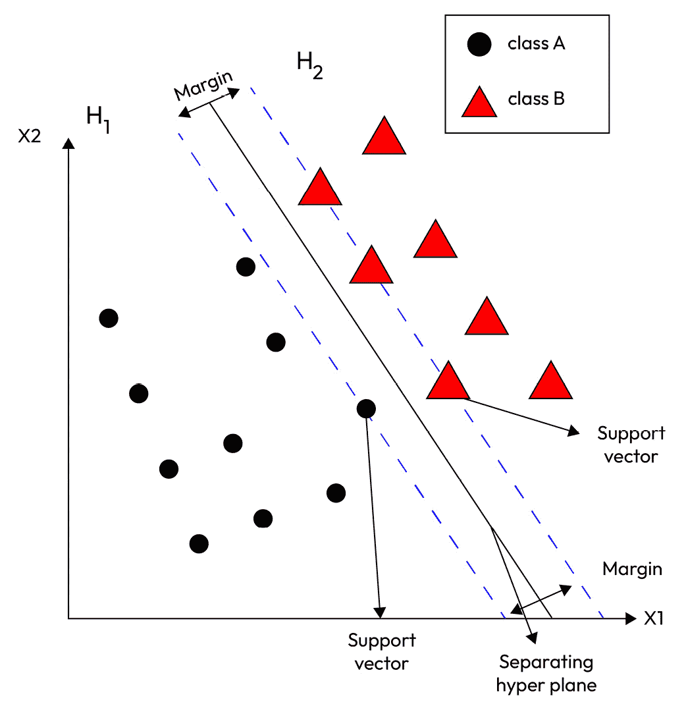

# 6

# 使用数据增强对图像数据进行标记

在本章中，我们将学习如何使用数据增强对图像数据进行标记，以进行半监督机器学习。我们将使用 CIFAR-10 数据集和 MNIST 手写数字数据集来生成标签，然后我们将构建一个图像分类机器学习模型。

数据增强在数据标记中起着至关重要的作用，通过增强数据集的多样性、大小和质量。数据增强技术通过对现有数据进行变换来生成额外的样本。这有效地增加了数据集的大小，为训练提供了更多示例，并提高了模型泛化的能力。

本章我们将涵盖以下内容：

+   如何使用图像数据增强准备训练数据并实现支持向量机

+   如何使用增强图像数据实现卷积神经网络

# 技术要求

对于本章，我们将使用 CIFAR-10 数据集，这是一个包含 10 个类别的 60,000 个 32x32 彩色图像的公开图像数据集([`www.cs.toronto.edu/~kriz/cifar.html`](http://www.cs.toronto.edu/~kriz/cifar.html))，以及著名的 MNIST 手写数字数据集。

# 使用增强图像数据训练支持向量机

**支持向量机**（**SVMs**）在机器学习中广泛用于解决分类问题。SVMs 以其高准确性和处理复杂数据集的能力而闻名。训练 SVMs 的一个挑战是大型和多样化的数据集的可用性。在本节中，我们将讨论数据增强在训练 SVMs 进行图像分类问题中的重要性。我们还将为每种技术提供 Python 代码示例。



图 6.1 – SVM 使用最大间隔将类别 A 和类别 B 分开

SVMs 是一种用于分类和回归分析的监督学习算法。SVMs 可用于异常检测。SVMs 最初是为分类任务设计的，但也可以用于异常或异常检测。

SVMs 的目标是找到最大化两类数据之间间隔的超平面。超平面被定义为分隔两类数据点的决策边界。间隔是超平面与每个类最近的点之间的距离。

SVMs 使用一种称为*核技巧*的东西。让我们接下来了解这是什么。

## 核技巧

假设你在一张纸上有点，你想要将它们分成两组。想象你有一根魔法棒（即核技巧），它允许你将点从纸上抬起进入空中。在空中，你可以轻松地画一条线或曲线来分隔漂浮的点。

现在，当你对空气中的分离效果满意时，再次使用魔棒将所有内容拉回到纸上。奇迹般地，你在空中绘制的分离线在纸上转化为一个更复杂的决策边界，有效地分离了你的原始数据点。

在 SVM（支持向量机）的世界里，这个“魔棒”就是核技巧。它允许 SVM 在更高维的空间中隐式地工作，使得找到更复杂的决策边界成为可能，这些决策边界在原始空间中是无法实现的。关键是，你不必显式地计算更高维空间的坐标；核技巧会为你完成这项工作。

总结来说，核技巧将你的数据提升到更高维的空间，在那里 SVM 可以找到更复杂的方法来分离不同的类别。它是处理复杂数据场景的强大工具。

SVM 利用核技巧将输入数据转换到更高维的空间，在那里可以找到一个线性决策边界。核函数在这个过程中起着至关重要的作用，它将输入数据映射到一个特征空间，其中变量之间的关系可能更容易分离。

最常用的核函数包括线性核，它表示线性决策边界；多项式核，它通过引入高阶多项式特征引入非线性；以及**径向基函数**（**RBF**）核，它允许更灵活的非线性决策边界。核函数的选择及其参数显著影响 SVM 建模数据中复杂关系的能力。

既然我们已经对 SVM 有了基本的了解，接下来让我们了解数据增强、图像数据增强以及用于此的各种技术。

## 数据增强

数据增强是通过应用各种变换（如旋转、平移和缩放）从现有数据点创建新数据点的过程。数据增强通过帮助模型在数据中学习更多特征和模式，用于增加训练数据集的大小并提高模型的泛化能力和准确性。

## 图像数据增强

图像数据增强是一种增强图像数据集的技术，以提高模型的准确性。以下是一些可用于图像数据增强的技术选择。

### 图像旋转

图像旋转是一种技术，其中图像通过一定角度进行旋转。这项技术用于增加训练数据集的大小并提高模型从不同角度识别对象的能力。图像旋转的 Python 代码如下：

```py
from PIL import Image
import numpy as np
def rotate_image(image_path, degrees):
    img = Image.open(image_path)
    rotated_image = img.rotate(degrees)
    return rotated_image
image_path = "path/to/image.jpg"
rotated_image = rotate_image(image_path, 45)
rotated_image.show()
```

在前面的代码中，我们从图像路径加载图像，并以给定的度数旋转它。这为同一图像从不同角度创建了一个新的数据集，并提高了模型训练的效果。

### 图像平移

图像翻译是一种技术，其中图像通过一定的像素量水平或垂直移动。这种技术用于增加训练数据集的大小并提高模型识别不同位置对象的能力。图像翻译的 Python 代码如下：

```py
from PIL import Image
import numpy as np
def translate_image(image_path, x_offset, y_offset):
    img = Image.open(image_path)
    translated_image = img.transform(img.size, \
        Image.AFFINE, (1, 0, x_offset, 0, 1, y_offset))
    return translated_image
image_path = "path/to/image.jpg"
translated_image = translate_image(image_path, 50, 50)
translated_image.show()
```

在前面的代码中，我们定义了一个 Python 函数，该函数通过一定的像素量移动图像。

### 图像缩放

图像缩放是一种增强技术，其中图像通过一定的因子放大或缩小。这种技术用于增加训练数据集的大小并提高模型识别不同尺度对象的能力。图像缩放的 Python 代码如下：

```py
from PIL import Image
import numpy as np
def scale_image(image_path, scale_factor):
    img = Image.open(image_path)
    scaled_image = img.resize((int(img.size[0]*scale_factor),\
        int(img.size[1]*scale_factor)))
    return scaled_image
image_path = "path/to/image.jpg"
scaled_image = scale_image(image_path, 0.5)
scaled_image.show()
```

在前面的代码中，我们通过在 Python 函数中将图像乘以一个缩放因子来改变图像大小。接下来，让我们看看如何使用 CIFAR-10 数据集实现具有数据增强的 SVM。

# 在 Python 中实现具有数据增强的 SVM

在本节中，我们将提供使用 CIFAR-10 数据集在 Python 中实现具有数据增强的 SVM 的逐步指南。我们将首先介绍 CIFAR-10 数据集，然后转到在 Python 中加载数据集。然后，我们将对数据进行 SVM 训练的前处理，并实现具有默认超参数和数据集的 SVM。接下来，我们将使用增强数据集训练和评估 SVM 的性能，以表明 SVM 在增强数据集上的性能有所提高。

## 介绍 CIFAR-10 数据集

CIFAR-10 数据集是一个常用的图像分类数据集，包含 10 个类别的 60,000 个 32x32 彩色图像。这些类别包括：飞机、汽车、鸟、猫、鹿、狗、青蛙、马、船和卡车。数据集分为 50,000 个训练图像和 10,000 个测试图像。数据集经过预处理，使得训练集和测试集中每个类别的图像数量相等。

## 在 Python 中加载 CIFAR-10 数据集

在 Python 中加载 CIFAR-10 数据集时，我们将使用 Keras 库中的`cifar10`模块。如果您还没有安装 Keras，可以使用以下命令进行安装：

```py
pip install keras
```

安装 Keras 后，您可以使用以下代码加载 CIFAR-10 数据集：

```py
from keras.datasets import cifar10
(x_train, y_train), (x_test, y_test) = cifar10.load_data()
```

`cifar10.load_data()`函数返回两个元组：`(x_train, y_train)`和`(x_test, y_test)`。`x_train`和`x_test`元组包含输入图像，而`y_train`和`y_test`元组包含输入图像对应的类标签。

## 对 SVM 训练数据进行预处理

在本节中，我们首先将输入图像从 3D 矩阵转换为 2D 矩阵。我们还将输入图像的像素值归一化到 0 到 1 之间。最后，我们将输入图像重塑并转换类标签为 one-hot 编码向量。

使用`reshape()`函数将输入图像从 3D 矩阵重塑为 2D 矩阵。`-1`参数告诉函数根据行数和每行的大小推断列数：

```py
# Reshape the input images
x_train = x_train.reshape(x_train.shape[0], -1)
x_test = x_test.reshape(x_test.shape[0], -1)
```

输入图像的像素值通过除以 255（这是最大像素值）进行归一化，使其介于 0 和 1 之间：

```py
# Convert pixel values to between 0 and 1
x_train = x_train / 255
x_test = x_test / 255
```

使用`to_categorical()`函数将类别标签转换为独热编码向量。`num_classes`变量设置为`10`，这是 CIFAR-10 数据集中的类别数量：

```py
# Convert class labels to one-hot encoded vectors
num_classes = 10
y_train = keras.utils.to_categorical(y_train, num_classes)
y_test = keras.utils.to_categorical(y_test, num_classes)
```

## 使用默认超参数实现 SVM

SVM 中的超参数是在训练过程之前设置的参数，而不是从数据中学习的参数。它们控制 SVM 模型的行为，并可能对其性能产生重大影响。以下是 SVM 中的一些重要超参数：

+   **核函数**：核函数决定了 SVM 使用的决策边界的类型。常见的核函数包括线性、多项式、**径向基函数**（**RBF**）和 sigmoid 函数。核函数的选择取决于数据和问题。

+   **正则化参数（C）**：正则化是一种用于防止模型过拟合或欠拟合的技术。正则化方法有助于控制模型的复杂性并提高其在未见数据上的泛化能力。

    对于二元分类问题，决策边界是一个将数据分为两个类别的超平面。边缘是此超平面与任一类别最近的数据点之间的距离。边缘的“宽度”是决策边界与最近数据点之间距离的实际数值或间隙。

    较大的边缘意味着类别之间的分离更大，为潜在的误分类提供了更多空间，而不会影响决策边界。正则化参数，通常表示为 C，控制了实现低训练错误率与保持宽边缘之间的权衡。较小的 C 值允许更多的误分类，但会导致更大的边缘，而较大的 C 值试图以牺牲较窄的边缘为代价来最小化误分类。

+   **伽马（对于 RBF 核）**：伽马参数影响具有 RBF 核的 SVM 决策边界的形状。它决定了每个训练样本的可达范围并影响决策边界的平滑度。较高的伽马值往往会导致更复杂的决策边界。

+   **度（对于多项式核）**：度参数指定多项式核函数的度。它决定了决策边界的非线性。较高的度值允许更复杂的决策边界，但可能增加过拟合的风险。

这些超参数需要仔细调整以达到 SVM 模型的最佳性能。可以使用网格搜索、随机搜索或其他优化技术来探索不同超参数值的组合，并选择最佳集。

为了实现具有默认超参数的 SVM，我们将使用 scikit-learn 库中的`svm.SVC`类。我们首先创建一个`SVC`类的实例，然后将训练数据拟合到分类器。

使用`svm.SVC()`创建了一个`SVC`类的实例。通过不指定任何超参数，它使用默认的核函数、正则化参数（C）和其他相关参数的值：

```py
from sklearn import svm
# Create an instance of the SVC class with default hyperparameters
clf = svm.SVC()
```

`fit()`函数用于将训练数据拟合到分类器：

```py
# Fit the training data to the classifier
clf.fit(x_train, y_train)
```

## 评估原始数据集上的 SVM

我们评估原始数据集的性能，以比较与增强数据集的性能。

为了评估原始数据集上 SVM 的性能，我们将使用`predict()`函数预测测试数据的类别标签，然后使用 scikit-learn 库中的`accuracy_score()`函数计算分类器的准确率：

```py
from sklearn.metrics import accuracy_score
# Predict the class labels of the test data
y_pred = clf.predict(x_test)
# Calculate the accuracy of the classifier
accuracy = accuracy_score(y_test, y_pred)
print("Accuracy: %.2f%%" % (accuracy * 100.0))
```

`predict()`函数用于预测测试数据的类别标签。`accuracy_score()`函数通过比较预测的类别标签和实际类别标签来计算分类器的准确率。

SVM 模型在测试数据集上的准确率约为`47.97%`，这并不很好。这表明 SVM 模型无法学习原始数据集中所有的重要特征和模式。

## 实现使用增强数据集的 SVM

为了实现具有数据增强的 SVM，我们将使用 Keras 库中的`ImageDataGenerator`类来生成新的训练数据。我们首先创建一个`ImageDataGenerator`类的实例，然后使用`flow()`函数生成新的训练数据批次：

```py
from keras.preprocessing.image import ImageDataGenerator
# Create an instance of the ImageDataGenerator class
datagen = ImageDataGenerator(rotation_range=20, \
    width_shift_range=0.1, height_shift_range=0.1, \
    shear_range=0.2, zoom_range=0.2, horizontal_flip=True)
# Generate new batches of training data
gen_train = datagen.flow(x_train, y_train, batch_size=64)
```

`ImageDataGenerator()`函数创建了一个`ImageDataGenerator`类的实例。`rotation_range`、`width_shift_range`、`height_shift_range`、`shear_range`、`zoom_range`和`horizontal_flip`参数用于指定要应用于训练数据的增强数据类型。

`flow()`函数用于从原始训练数据和`ImageDataGenerator`对象生成新的训练数据批次。

## 在增强数据上训练 SVM

要在增强数据上训练支持向量机（SVM），我们将使用`SVC`类的`partial_fit()`函数，在每个由`ImageDataGenerator`对象生成的训练数据批次上训练分类器：

```py
# Train the classifier on each batch of training data
for i in range(100):
    x_batch, y_batch = gen_train.next()
    clf.partial_fit(x_batch, y_batch, classes=np.unique(y_train))
```

`classes`参数用于指定训练数据中的唯一类别。

## 评估增强数据集上 SVM 的性能

为了评估 SVM 在增强数据集上的性能，我们将再次使用`predict()`函数来预测测试数据的类别标签，然后使用`accuracy_score()`函数通过比较预测的类别标签和实际类别标签来计算分类器的准确度：

```py
# Predict the class labels of the test data
y_pred_aug = clf.predict(x_test)
# Calculate the accuracy of the classifier
accuracy_aug = accuracy_score(y_test, y_pred_aug)
print("Accuracy with Data Augmentation: %.2f%%" % (accuracy_aug * 100.0))
```

在增强的测试数据集上，SVM 模型的准确率约为`54.75%`，这比之前的准确率要好。这表明 SVM 模型能够在增强数据集中学习到更多重要的特征和模式，并且能够更好地泛化到新数据。

总结来说，在本节中，我们讨论了数据增强在训练用于图像分类的 SVM 中的重要性。我们使用 CIFAR-10 数据集来说明数据增强对 SVM 模型性能的影响。我们还提供了加载 CIFAR-10 数据集、在原始数据集上训练 SVM 模型以及在增强数据集上训练 SVM 模型的 Python 代码示例。

结果表明，数据增强可以提高 SVM 模型在图像分类任务上的性能。通过应用随机旋转、平移和缩放，我们可以生成新的图像，SVM 模型可以使用这些图像来学习更多特征和模式。这使得 SVM 模型能够更好地泛化到新数据并实现更高的准确度。

在下一节中，我们将看到如何使用 MNIST 手写数字数据集实现具有数据增强的 SVM。

# 在 MNIST 数据集上使用具有数据增强的 SVM 进行图像分类

让我们看看如何使用 MNIST 数据集和 SVM 进行图像分类应用数据增强。所有步骤都与之前使用 CIFAR-10 数据集的示例类似，只是数据集本身不同：

```py
import tensorflow as tf
from sklearn.svm import SVC
from sklearn.model_selection import GridSearchCV
from keras.datasets import mnist
from keras.preprocessing.image import ImageDataGenerator
# load MNIST dataset
(x_train, y_train), (x_test, y_test) = mnist.load_data()
# normalize pixel values between 0 and 1
x_train = x_train / 255.0
x_test = x_test / 255.0
# convert labels to one-hot encoded vectors
y_train = tf.keras.utils.to_categorical(y_train)
y_test = tf.keras.utils.to_categorical(y_test)
# create image data generator for data augmentation
datagen = ImageDataGenerator(rotation_range=20, \
    width_shift_range=0.1, height_shift_range=0.1, zoom_range=0.2)
# fit image data generator on training dataset
datagen.fit(x_train.reshape(-1, 28, 28, 1))
# create SVM model
svm_model = SVC()
# define hyperparameters for grid search
param_grid = {'C': [0.1, 1, 10], 'kernel': ['linear', \
    'poly', 'rbf'], 'degree': [2, 3, 4]}
# perform grid search for optimal hyperparameters
svm_grid_search = GridSearchCV(svm_model, param_grid, cv=3)
svm_grid_search.fit(datagen.flow(
    x_train.reshape(-1, 28, 28, 1),y_train, batch_size=32), \
    steps_per_epoch=len(x_train) / 32)
# evaluate SVM model on test dataset
accuracy = svm_grid_search.score(x_test.reshape(-1, 28*28), y_test)
print("Accuracy with data augmentation: {:.2f}%".format(accuracy*100))
```

如前所述，此代码与之前的示例类似，只是我们现在使用的是 MNIST 数据集，图像是灰度且大小为 28x28。我们还修改了 SVM 模型的输入形状和图像数据生成器，以适应新的图像大小和颜色通道。

结果表明，数据增强也可以提高 SVM 模型在 MNIST 数据集上的性能。通过应用随机旋转、平移和缩放，我们可以生成新的图像，SVM 模型可以使用这些图像来学习更多特征和模式。这使得 SVM 模型能够更好地泛化到新数据并实现更高的准确度。

此外，我们还使用网格搜索来找到 SVM 模型的最佳超参数。这很重要，因为 SVM 模型的表现高度依赖于超参数的选择。通过使用网格搜索调整超参数，我们可以进一步提高 SVM 模型的准确度。

总体而言，这个示例代码展示了数据增强在提高 SVM 模型在图像分类任务性能方面的有效性。它还强调了使用网格搜索进行超参数调整以实现最佳准确度的重要性。

总结来说，数据增强是一种强大的技术，可以提高机器学习模型在图像分类任务上的性能。通过生成模型可以用来学习更多特征和模式的新图像，我们可以提高模型的一般化能力，并实现更高的准确率。SVM 模型特别适合图像分类任务，并且可以从数据增强中受益良多。借助 Python 库如 scikit-learn 和 TensorFlow，我们可以轻松实现带有数据增强的 SVM 模型，并在图像分类任务上实现最先进的性能。

接下来，让我们看看如何使用增强训练数据实现卷积神经网络。

# 使用增强图像数据的卷积神经网络

**卷积神经网络**（**CNNs**）通过在诸如目标检测、图像分类和分割等图像相关任务中展现出卓越的性能，彻底改变了计算机视觉领域。然而，为 CNNs 训练提供大量、标注的数据集通常是一个挑战。幸运的是，一种有效克服这一局限性的方法是通过使用**图像数据****增强**技术。

让我们从零开始，解释 CNNs 是什么以及它们是如何工作的。想象你有一张图片，比如说一张猫的照片，你想要教计算机如何识别它是一张猫。CNNs 就像一种特殊的计算机程序，帮助计算机理解和识别图像中的事物，就像你识别照片中的物体一样。

图像由称为像素的小点组成。每个像素都有颜色，当你把它们全部放在一起时，你就得到了一张图像。像素越多，图像越详细。当你看一张图片时，你的大脑不会试图一次性理解它。相反，它会专注于小部分，比如耳朵的形状或眼睛的颜色。这就是我们识别事物的方式。我们把大图像分解成小块，并逐一理解它们。

卷积神经网络（CNNs）的工作原理有点像人脑，将图像分解成小块。这些小块被称为“特征”或“过滤器”。想象这些过滤器就像在图片上移动的小窗户。这些窗户一次查看图像的一小部分，并学习其中的重要信息。

## CNNs 的工作原理

让我们了解 CNNs 是如何为期望的输出工作的：

1.  **卷积**：这是第一步。它就像在图片上移动一个小窗口（过滤器）。过滤器检查它所查看区域中的颜色和形状，并学习其中的重要信息。

1.  **池化**：在查看图像的不同部分之后，CNN 不需要所有细节。池化就像是对它所看到的内容做一个总结。它简化了事物，但我们没有丢失重要的部分。

1.  **全连接层**：在观察了许多小部分并总结它们之后，接下来将所有部分连接在一起。这就像把拼图碎片拼在一起，以看到整个画面。这有助于卷积神经网络理解整个图像，并对其中的内容做出最终判断。

    在卷积层通过提取各种特征和模式处理图像之后，全连接层在将所有信息汇总以对图像内容做出全面决策方面发挥着关键作用。这个过程类似于组装拼图碎片，其中每个碎片对应于卷积层检测到的特定特征。通过连接这些碎片，网络获得了对图像的整体理解。

    然而，尽管全连接层非常强大，但它们也存在过拟合的风险，即模型在训练数据上变得过于专业化，在新数据上表现不佳。为了减轻这种风险，通常会采用正则化技术。

1.  **全连接层中的正则化**：正则化是一组用于防止过拟合并增强模型泛化能力的技巧。在全连接层的上下文中，正则化方法被应用于控制模型的复杂性，并避免过度依赖训练数据中存在的特定特征。

1.  **训练卷积神经网络**：为了教会卷积神经网络识别猫，你需要向它展示大量的猫图片。它观察它们，学习重要的特征，并随着时间的推移在识别它们方面变得更好。它还需要看到不是猫的图片，这样它才能区分它们。

1.  **做出预测**：一旦卷积神经网络被训练，你可以向它展示一张新图片，它将尝试找到它学习到的重要特征。如果它找到了足够的猫类特征，它会说：“嘿，那是一只猫！”

因此，简单来说，卷积神经网络就像一个计算机程序，通过观察图像的小部分、寻找重要特征并基于这些特征做出决策来学习识别图像中的事物。

正如我们所见，卷积神经网络的架构由卷积、池化和全连接层组成。架构指定了模型的构建方式，包括层数、滤波器的大小以及神经元之间的连接。架构指导了如何使用学习到的权重和特征来处理图像和做出预测。

因此，最终的模型本质上是由架构、学习到的权重和学习到的特征组合而成的。让我们分解其中的一些元素：

+   **学习到的权重**：这些是卷积神经网络在训练过程中学习到的参数。模型调整这些权重以做出准确的预测。这些权重基本上是模型在训练过程中获得的“知识”。它们代表了某些特征对于做出决策的重要性。

+   **学习到的特征**：在 CNN 的上下文中，特征是图像的视觉模式和特征。它们是图像中重要信息的表示。这些特征对我们来说不是直接可见的，而是通过网络层的卷积和池化学习得到的。特征是图像的抽象表示，有助于模型识别模式和对象。

在实践中，这些学习到的权重和特征存储在模型的参数中。当你保存一个训练好的 CNN 模型时，你正在保存这些参数，这些参数可以用于对新、未见过的图像进行预测。模型接收一个图像作为输入，通过其层进行处理，并使用学习到的权重和特征进行预测，例如对图像中的对象进行分类或检测特定模式。

现在，我们将深入探讨 CNN 和图像数据增强的强大组合。通过人工增强数据，CNN 可以在训练过程中接触到更广泛的变化范围，从而帮助它们更好地泛化到未见过的图像。

使用图像数据增强的一些好处和考虑因素包括减少过拟合、增强模型鲁棒性和提高泛化性能。无论你是初学者还是有经验的从业者，本节都作为理解并实现 CNN 上下文中的图像数据增强的全面指南，帮助你将计算机视觉项目提升到新的高度。

## CNN 使用数据增强的实用示例

让我们看看如何在 CNN 上实现图像数据增强。为此，你可以遵循以下步骤：

**步骤 1**：首先导入必要的库，包括 Keras 和 NumPy：

```py
import keras
from keras.models import Sequential
from keras.layers import Conv2D, MaxPooling2D, Flatten, Dense, Dropout
from keras.preprocessing.image import ImageDataGenerator
import numpy as np
```

`ImageDataGenerator` 对象并指定所需的数据增强技术：

```py
datagen = ImageDataGenerator(
    rotation_range=20,
    width_shift_range=0.2,
    height_shift_range=0.2,
    horizontal_flip=True,
    validation_split=0.2
)
```

`ImageDataGenerator` 对象将使用指定的数据增强技术生成增强数据的批次。在本例中，我们使用了旋转、宽度和高度偏移以及水平翻转。

**步骤 3**：加载原始数据集并将其分为训练集和验证集：

```py
train_generator = datagen.flow_from_directory(
    '/path/to/dataset',
    target_size=(224, 224),
    batch_size=32,
    class_mode='categorical',
    subset='training'
)
val_generator = datagen.flow_from_directory(
    '/path/to/dataset',
    target_size=(224, 224),
    batch_size=32,
    class_mode='categorical',
    subset='validation'
)
```

在这里，我们使用 `flow_from_directory()` 函数从指定的目录加载原始数据集。我们还指定了图像的目标大小、批处理大小和类别模式（在本例中为分类）。我们使用 `subset` 参数将数据分为训练集和验证集。

在提供的代码片段中，使用了 `flow_from_directory` 函数来生成数据生成器，用于从目录中加载图像。让我们分解一下参数：

+   `'/path/to/dataset'`：这是包含数据集的目录的路径。函数将在该目录内查找子目录，其中每个子目录代表不同的类别或类别。

+   `target_size=(224, 224)`: `target_size` 是在加载过程中所有图像将被调整的大小。在这种情况下，每张图像将被调整为 224x224 像素的正方形。标准化图像大小对于一致性和与神经网络模型的兼容性很重要，尤其是在使用期望特定输入大小的预训练模型时。

+   `batch_size=32`: `batch_size` 决定了在训练或验证过程中每次迭代中加载和处理的图像数量。较大的批处理大小可以加快训练速度，但可能需要更多的内存。当内存有限或用于微调模型时，通常使用较小的批处理大小。它还会影响训练过程中的梯度更新，从而影响训练过程的稳定性和收敛性。

+   `class_mode='categorical'`: `class_mode` 指定了目标类别的表示方式。在这种情况下，它被设置为 `categorical`，表示标签是一维编码（类成员关系的二进制矩阵表示）。其他可能的值包括 `binary` 用于二分类，`sparse` 用于整数编码的类别标签，以及 `None` 用于没有标签（用于测试数据集）。

+   `subset='validation'`: 子集用于指定生成器是为训练集还是验证集。在这种情况下，它被设置为 `validation`，表示生成器是为验证集。当使用子集时，请确保数据集目录包含 `train` 和 `validation` 等子目录，以方便分割。

总结来说，这些参数有助于配置数据生成器以从目录中加载和预处理图像。针对目标大小、批处理大小和类模式的选项通常由所使用的机器学习模型的要求、可用的计算资源以及数据集的特征决定。

**步骤 4**：创建一个 CNN 模型：

```py
model = Sequential()
model.add(Conv2D(32, (3, 3), activation='relu', input_shape=(224, 224, 3)))
model.add(MaxPooling2D((2, 2)))
model.add(Conv2D(64, (3, 3), activation='relu'))
model.add(MaxPooling2D((2, 2)))
model.add(Conv2D(128, (3, 3), activation='relu'))
model.add(MaxPooling2D((2, 2)))
model.add(Conv2D(256, (3, 3), activation='relu'))
model.add(MaxPooling2D((2, 2)))
model.add(Flatten())
model.add(Dense(512, activation='relu'))
model.add(Dropout(0.5))
model.add(Dense(2, activation='softmax'))
model.compile(loss='categorical_crossentropy', \
    optimizer='adam', metrics=['accuracy'])
```

在这里，我们正在创建一个简单的 CNN 模型，具有四个卷积层和一个全连接层。我们使用 ReLU 激活函数用于卷积层，softmax 激活函数用于输出层。我们还使用分类交叉熵损失函数、Adam 优化器和准确度指标编译模型。

在前面的代码片段中，正在使用 Keras 库创建一个 CNN 模型。让我们分解一下这些组件：

+   `activation='relu'` 用于卷积层和密集层。ReLU 是一个激活函数，它向模型引入非线性。如果输入为正，则直接输出输入；否则，输出零。ReLU 由于有助于模型学习数据中的复杂模式和关系而受到 CNN 的青睐。它计算效率高，并减轻了梯度消失问题。

    **ReLU 的影响**：ReLU 引入了非线性，使模型能够学习数据中的复杂特征和关系。它有助于解决梯度消失问题，通过允许模型在反向传播过程中传播梯度，从而促进更有效的训练。

+   `activation='softmax'` 用于输出层。Softmax 是一个将原始分数（logits）转换为概率的函数。它常用于多类分类模型的输出层。在这个二元分类案例（两类）中，softmax 激活函数将每个类别的输出分数进行归一化，为每个类别分配一个概率。概率最高的类别被认为是模型的预测。Softmax 对于产生多个类别的概率分布很有用，使其适合分类问题。

    **Softmax 的影响**：Softmax 将原始模型输出转换为类别的概率分布。它确保预测概率之和为 1，便于对模型对每个类别的信心进行有意义的解释。在二元分类中，它通常与交叉熵损失一起使用。

为什么我们应该使用它们？ReLU 被选择是因为其简单性、计算效率和在训练深度神经网络中的有效性。Softmax 被选为输出层以获得类别概率，这对于解释和评估模型的预测非常有价值。

总结来说，ReLU 和 softmax 激活通过引入非线性、促进高效训练和产生有意义的分类概率分布，有助于 CNN 模型的有效性。它们在图像分类任务中广泛应用于 CNN。

在提供的代码片段中，模型通过三个重要组件进行编译——交叉熵损失、Adam 优化器和准确度指标。让我们深入了解每个组件：

+   `loss='categorical_crossentropy'`):

    +   交叉熵损失函数是常用于多类分类问题的损失函数。

    +   在这个背景下，模型是为二元分类（两类）设计的，但它使用交叉熵来处理有超过两类的情况。目标标签应为一热编码。

    +   损失函数衡量预测概率（从输出层的 softmax 激活中获得）与真实类别标签之间的差异。

    +   在训练过程中，目标是最小化这个损失，从而有效提高模型进行准确类别预测的能力。

+   `optimizer='adam'`):

    +   **自适应动量估计**（**Adam**）是一种广泛用于训练神经网络的优化算法。

    +   它结合了两种其他优化算法的思想——**均方根传播**（RMSprop）和动量。

    +   Adam 适应每个参数的个别学习率，使其非常适合各种优化问题。

    +   它以其在训练深度神经网络中的效率和有效性而闻名，并且通常是许多应用的默认选择。

+   `metrics=['accuracy']`):

    +   准确率是用于评估分类模型性能的指标。

    +   在二元分类的背景下，准确率衡量的是所有实例中正确分类的实例比例（包括真正的正例和真正的负例）。

    +   准确率指标对于评估模型在训练和验证数据集上的表现至关重要。

    +   虽然准确率是一个常用的指标，但它可能不足以用于不平衡的数据集，其中一类比另一类更为普遍。在这种情况下，可能需要考虑额外的指标，如精确率、召回率或 F1 分数。

总结来说，在编译过程中选择分类交叉熵损失、Adam 优化器和准确率指标反映了训练二元分类模型的最佳实践。这些选择基于它们在优化模型参数、处理多类场景和提供分类准确度直接评估方面的有效性。

**步骤 5**: 使用增强数据集训练模型：

```py
model.fit(
    train_generator,
    steps_per_epoch=train_generator.samples // 32,
    validation_data=val_generator,
    validation_steps=val_generator.samples // 32,
    epochs=10
)
```

我们使用`fit()`函数在增强数据集上训练模型。我们指定了训练和验证生成器、每个周期的步骤数、验证步骤数和周期数。

在这个代码片段中，使用`fit()`函数在增强数据集上训练模型。让我们分解一下关键组件：

+   `train_generator`):训练生成器是一个数据生成器的实例，它在*步骤 3*中实时对训练数据进行增强。数据生成器是一种在训练过程中以块的形式高效加载和预处理数据的方法，而不是将整个数据集加载到内存中。`train_generator`负责为模型提供增强后的训练数据批次。

+   `val_generator`):与训练生成器类似，验证生成器是一个数据生成器的实例，它生成验证数据批次。验证生成器提供了一组模型在训练期间未见过的数据。它有助于评估模型对未见示例的泛化能力，并防止过拟合。

+   `steps_per_epoch=train_generator.samples // 32`):`steps_per_epoch`指定每个训练周期中要处理的数据批次数量。它计算为训练数据集中样本总数除以批次大小（在本例中为`32`）。每个步骤涉及对数据批次的前向传递（预测）和反向传递（梯度计算和参数更新）。较小的`steps_per_epoch`值意味着模型在每个周期中看到的批次更少，这可能导致训练速度更快，但整个数据集的曝光度较低。

+   `validation_steps=val_generator.samples // 32`）：`validation_steps`与`steps_per_epoch`类似，但用于验证数据集。它决定了每个验证周期中处理的批次数。与`steps_per_epoch`一样，它是基于验证数据集中样本总数除以批大小来计算的。

+   `epochs=10`）：周期数指定了在训练期间整个数据集被处理的次数。进行更多周期的训练允许模型在多次遍历数据中学习，从而可能提高性能。然而，过多的周期训练可能会导致过拟合，此时模型会记住训练数据，但无法泛化到新数据。

调整批大小、每个周期的步数和验证步数会影响训练速度和内存需求。较大的批大小和更多的每个周期步数可能会导致训练速度变慢，但可能更节省内存。应该仔细选择周期数，以平衡模型训练并防止过拟合。

总结来说，提供给`fit()`的设置控制了模型的训练方式、每个周期中模型看到的数据以及验证集的评估。正确调整这些设置对于实现良好的模型性能和防止过拟合等问题至关重要。

通过遵循这些步骤，您可以使用 Keras 中的图像数据增强实现监督 CNN。这可以帮助提高模型性能，并使其对输入数据的变更加鲁棒。

## 使用 CIFAR-10 数据集进行图像数据增强的 CNN

让我们看看一些使用 CIFAR-10 数据集进行图像数据增强的监督 CNN 的 Python 代码示例：

```py
import tensorflow as tf
from tensorflow.keras.datasets import cifar10
from tensorflow.keras.models import Sequential
from tensorflow.keras.layers import Conv2D, MaxPooling2D, Flatten, Dense, Dropout
from tensorflow.keras.preprocessing.image import ImageDataGenerator
# Load the CIFAR-10 dataset
(x_train, y_train), (x_test, y_test) = cifar10.load_data()
# Normalize the input data
x_train = x_train.astype('float32') / 255.0
x_test = x_test.astype('float32') / 255.0
# Convert the labels to one-hot encoding
y_train = tf.keras.utils.to_categorical(y_train)
y_test = tf.keras.utils.to_categorical(y_test)
# Define the CNN architecture
```

以下代码定义了使用 Keras 库的 CNN 架构。让我们逐行分析，以了解每个组件的目的和功能。

以下行创建了一个顺序模型，这允许我们按顺序堆叠层：

```py
model = Sequential()
```

以下代码片段向模型添加了一个 2D 卷积层。它有 32 个滤波器，滤波器大小为`(3, 3)`，ReLU 激活函数，以及`'same'`填充。`input_shape`参数设置为输入数据（`x_train`）的形状，但不包括批维度：

让我们深入分析以下 CNN 代码片段：

```py
model.add(Conv2D(32, (3, 3), activation='relu', \
    padding='same', input_shape=x_train.shape[1:]))
```

**2D 卷积层添加**：在图像处理的深度学习中，卷积层对于从输入图像中学习层次特征至关重要。卷积层用于检测输入数据中的局部模式。卷积层中的每个滤波器都学习识别不同的特征或模式。代码向神经网络模型添加了一层，具体来说，是一个 2D 卷积层。

卷积层有以下配置：

+   **滤波器**：有 32 个滤波器。滤波器是滑动在输入数据上以检测模式或特征的小网格。

+   **滤波器大小**：每个滤波器的大小为（3, 3）。这意味着在卷积操作过程中，它考虑了某个点的 3x3 像素网格，以捕获局部信息。

+   **激活函数**：ReLU 激活函数逐元素应用于每个卷积操作的输出。ReLU 引入了非线性，使模型能够学习复杂的模式。

+   使用`Same`填充。填充是一种在卷积后保持空间维度的技术，防止在图像边缘丢失信息。`Same`填充填充输入，使得输出具有与输入相同的空间维度。

+   `input_shape`参数设置为输入数据的形状（`x_train`），不包括批量维度。输入形状决定了层将处理的数据输入大小。在这种情况下，它设置为训练数据`x_train`的形状，不考虑批量维度。

总结来说，此代码片段向神经网络模型添加了一个卷积层，并使用特定的参数配置了滤波器大小、滤波器数量、激活函数和填充。卷积层在从输入图像学习层次特征中起着至关重要的作用。

以下行添加了一个与之前相同的 2D 卷积层，但没有指定输入形状。模型将根据前一层推断输入形状：

```py
model.add(Conv2D(32, (3, 3), activation='relu'))
```

以下行添加了一个池大小为（2, 2）的最大池化层，通过在每个池内取最大值来减少输入的空间维度：

```py
model.add(MaxPooling2D(pool_size=(2, 2)))
```

以下行添加了一个丢弃率为 0.25 的 dropout 层，在训练期间随机将 25%的输入单元设置为 0。Dropout 通过引入随机性和减少对特定特征的依赖来帮助防止过拟合：

```py
model.add(Dropout(0.25))
```

代码继续添加更多的卷积层、最大池化层和 dropout 层，最后以全连接（密集）层结束：

```py
model.add(Conv2D(64, (3, 3), activation='relu', padding='same'))
model.add(Conv2D(64, (3, 3), activation='relu'))
model.add(MaxPooling2D(pool_size=(2, 2)))
model.add(Dropout(0.25))
```

以下行将前一层输出展平为 1D 张量，为将其连接到密集层做准备：

```py
model.add(Flatten())
```

以下行添加了一个具有 512 个单元和 ReLU 激活的密集层：

```py
model.add(Dense(512, activation='relu'))
```

以下行添加了一个丢弃率为 0.5 的 dropout 层：

```py
model.add(Dropout(0.5))
```

以下行添加了一个具有 10 个单元和 softmax 激活的最终密集层，它为分类生成 10 个类别的概率分布：

```py
model.add(Dense(10, activation='softmax'))
```

以下代码初始化了 Keras 中的`ImageDataGenerator`类的一个实例，该类用于图像数据集的数据增强：

```py
# Define the data augmentation parameters
datagen = ImageDataGenerator(
    rotation_range=15,
    width_shift_range=0.1,
    height_shift_range=0.1,
    horizontal_flip=True
)
# Compile the model
model.compile(optimizer='adam', loss='categorical_crossentropy',\
    metrics=['accuracy'])
# Train the model with data augmentation
history = model.fit(datagen.flow(x_train, y_train, \
    batch_size=64), epochs=100, \
    validation_data=(x_test, y_test))
# Evaluate the model on the test set
score = model.evaluate(x_test, y_test, verbose=0)
print('Test loss:', score[0])
print('Test accuracy:', score[1])
```

此代码定义了一个具有两个卷积层、两个最大池化层和三个全连接层的 CNN。使用`ImageDataGenerator`类执行数据增强，该类随机应用于训练图像以生成更多训练数据。使用`fit`方法以数据生成器作为输入训练模型 100 个 epoch。最后，使用`evaluate`方法在测试集上评估模型。

# 摘要

在本章中，我们介绍了各种图像数据增强技术。我们学习了如何在 Python 中使用 scikit-learn 和 Keras 库实现带有数据增强的支持向量机（SVM）。我们首先使用默认的超参数实现了 SVM，并在原始数据集上评估了分类器的性能。然后，我们实现了带有数据增强的 SVM，并在由`ImageDataGenerator`对象生成的每个训练数据批次上训练了分类器。最后，我们在增强数据集上评估了分类器的性能。

我们还看到了如何使用 CIFAR-10 数据集实现 CNN，并使用数据增强。通过数据增强，我们能够提高分类器在增强数据集上的准确性。这证明了数据增强在提高机器学习模型性能方面的有效性，尤其是在可用数据集有限的情况下。

数据增强可以通过创建现有标记数据的变体来减少对人工标注的需求。而不是单独对每个转换后的图像进行标注，增强技术允许在不需额外人工标注努力的情况下生成额外的标记样本。

在下一章中，我们将探讨如何使用生成模型标注文本数据。

# 第三部分：标注文本、音频和视频数据

在本书的这一部分，您将探索如何使用 Python 读取文本、音频和视频数据，分析数据并提取特征。内容深入探讨了在 Python 中通过编程对文本、视频和音频数据进行标记的各种方法，利用 OpenAI 的大型语言模型，以及半监督和无监督技术，如 K-means 聚类。此外，本节还帮助理解不同的开源数据标注工具，如 Label Studio、CVAT、pyOpenAnnotate 和 Azure Machine Learning，用于图像、视频、音频和文本数据，并提供它们之间的全面比较。

本部分包括以下章节：

+   *第七章*，*标注文本数据*

+   *第八章*，*探索视频数据*

+   *第九章*，*标注视频数据*

+   *第十章*，*探索音频数据*

+   *第十一章*，*标注音频数据*

+   *第十二章*，*动手探索数据标注工具*
