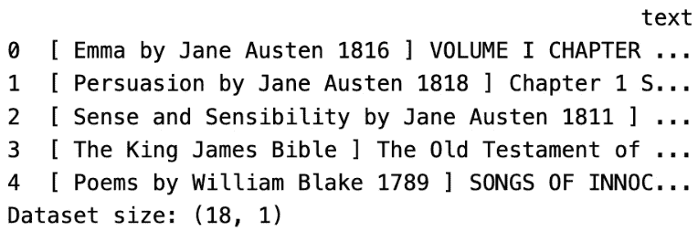
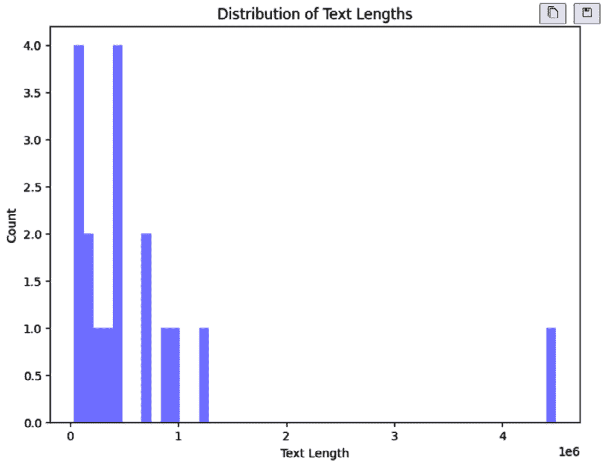
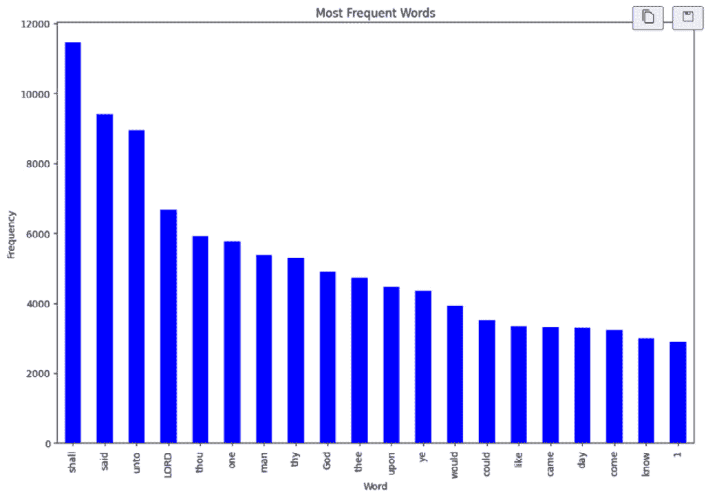
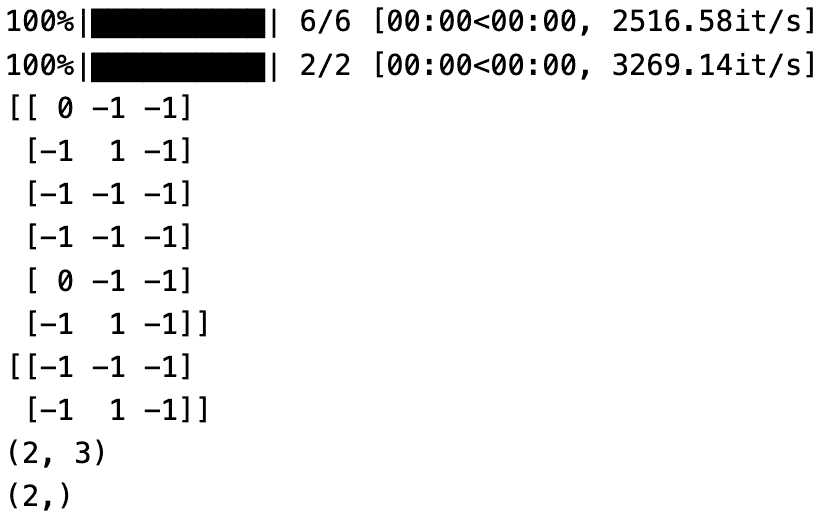
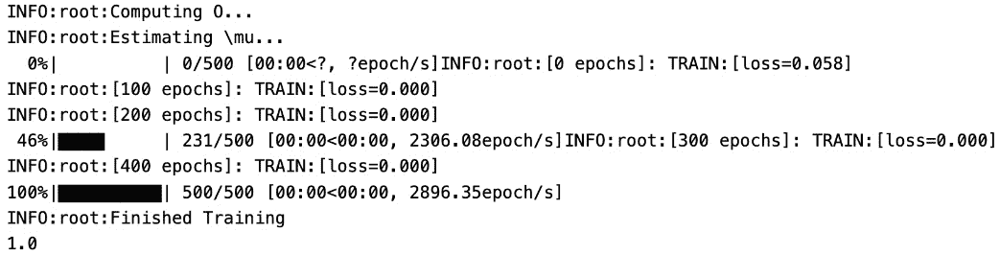
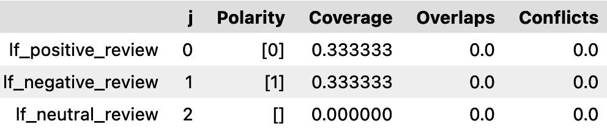
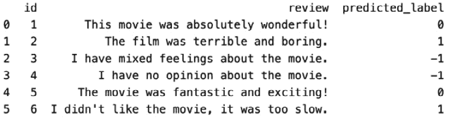
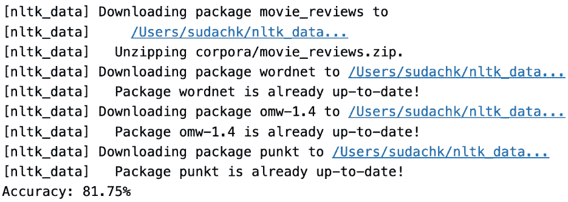
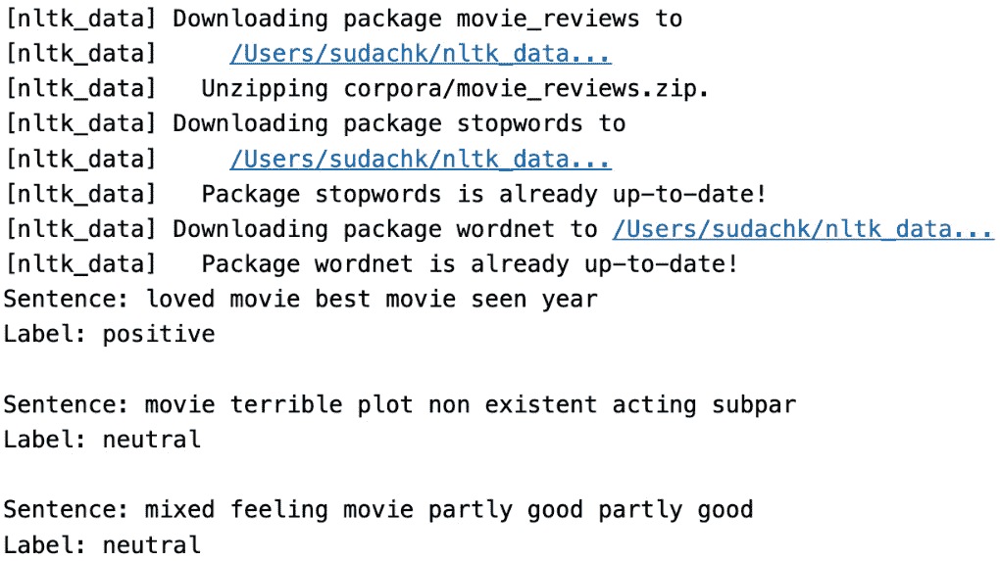
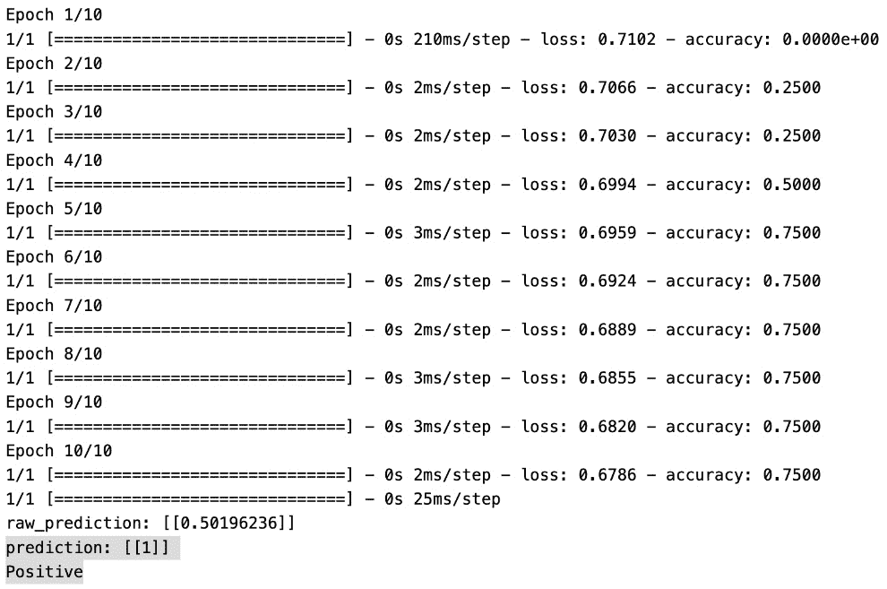

# 第七章：标注文本数据

在本章中，我们将探讨在标注数据不足的情况下对文本数据进行分类的技术。我们将使用生成式 AI 来标注文本数据，除了 Snorkel 和 k-means 聚类。本章重点介绍了为 NLP 和文本分析标注文本数据的必要过程。它旨在为读者提供关于各种标注技术的实用知识和见解。本章将具体涵盖使用 OpenAI 的自动标注、基于 Snorkel 标注函数的规则标注以及使用 k-means 聚类的无监督学习。通过理解这些技术，读者将能够有效地标注文本数据并从非结构化文本信息中提取有意义的见解。

在本章中，我们将涵盖以下部分：

+   文本数据标注的实战应用

+   文本数据标注的工具和框架

+   文本数据的探索性数据分析

+   用于标注文本数据的生成式 AI 和 OpenAI

+   使用 Snorkel 标注文本数据

+   使用逻辑回归标注文本数据

+   使用 K-means 聚类标注文本数据

+   使用神经网络标注客户评论（情感分析）

# 技术要求

本章中使用的代码文件位于[`github.com/PacktPublishing/Data-Labeling-in-Machine-Learning-with-Python/tree/main/code/Ch07`](https://github.com/PacktPublishing/Data-Labeling-in-Machine-Learning-with-Python/tree/main/code/Ch07)。

Gutenberg 语料库和电影评论数据集可在此找到：

+   [`pypi.org/project/Gutenberg/`](https://pypi.org/project/Gutenberg/)

+   [`www.nltk.org/api/nltk.sentiment.util.html?highlight=movie#nltk.sentiment.util.demo_movie_reviews`](https://www.nltk.org/api/nltk.sentiment.util.html?highlight=movie#nltk.sentiment.util.demo_movie_reviews)

您还需要创建一个 Azure 账户，并添加用于与生成式 AI 工作的 OpenAI 资源。要注册免费的 Azure 订阅，请访问 https://azure.microsoft.com/free。要申请访问 Azure OpenAI 服务，请访问[`aka.ms/oaiapply`](https://aka.ms/oaiapply)。

一旦您配置了 Azure OpenAI 服务，请设置以下环境变量：

```py
os.environ['AZURE_OPENAI_KEY'] = 'your_api_key'
os.environ['AZURE_OPENAI_ENDPOINT") ='your_azure_openai_endpoint'
```

您的端点应类似于[`YOUR_RESOURCE_NAME.openai.azure.com/`](https://YOUR_RESOURCE_NAME.openai.azure.com/)。

# 文本数据标注的实战应用

文本数据标注或分类在各个行业和应用中得到了广泛应用，用于提取有价值的信息、自动化流程和改善决策。以下是不同用例中的真实世界示例：

+   客户支持工单分类：

    +   用例：公司收到大量客户支持工单。

    +   应用：将支持工单自动分类到账单、技术支持和产品咨询等类别。这有助于优先排序并将工单路由到正确的团队。

+   垃圾邮件过滤：

    +   用例：将电子邮件分类为垃圾邮件和非垃圾邮件。

    +   应用：电子邮件服务提供商使用文本分类来识别和过滤掉不想要的电子邮件，为用户提供更干净的收件箱，并降低钓鱼攻击的风险。

+   社交媒体情感分析：

    +   用例：分析社交媒体评论和帖子。

    +   应用：品牌使用情感分析来衡量公众舆论、跟踪品牌情绪并回应客户反馈。这有助于声誉管理和理解客户偏好。

+   新闻分类：

    +   用例：将新闻文章分类。

    +   应用：新闻网站使用文本分类自动将文章分类到政治、科技和娱乐等版块，使读者更容易找到相关内容。

+   简历筛选：

    +   用例：对求职申请进行分类。

    +   应用：人力资源部门使用文本分类快速识别符合特定工作要求的简历。这加速了招聘流程并确保了更高效的候选人筛选。

+   医疗文档分类：

    +   用例：对医疗记录和文件进行分类。

    +   应用：医疗保健组织使用文本分类对医疗记录、实验室报告和患者笔记进行分类和组织。这有助于高效的数据检索和分析。

+   法律文档分类：

    +   用例：对法律文件进行分类。

    +   应用：律师事务所使用文本分类对法律文件、合同和与案件相关的信息进行分类和管理，简化法律研究和案件管理。

+   金融交易欺诈检测：

    +   用例：识别欺诈活动。

    +   应用：金融机构使用文本分类分析交易描述并识别潜在的欺诈或可疑活动，增强安全措施。

+   产品评论分析：

    +   用例：分析客户评论。

    +   应用：电子商务平台使用情感分析对产品评论进行分类和理解。这有助于改进产品、解决客户关注的问题并提高整体客户满意度。

+   语言识别：

    +   用例：确定给定文本的语言。

    +   应用：社交媒体平台和翻译服务使用文本分类自动识别用户的帖子或内容所使用的语言，实现准确的语言特定交互。

这些例子突出了文本分类在不同领域的多功能性，展示了它在自动化任务、提高效率和从文本数据中获得有价值见解中的重要性。

# 文本数据标注的工具和框架

有几个开源工具和框架可用于文本数据分析与标注。以下是一些流行的工具，以及它们的优缺点：

| **工具** **和框架** | **优点** | **缺点** |
| --- | --- | --- |
| **自然语言** **工具包** (**NLTK**) | 用于 NLP 任务的综合性库。提供丰富的分词、词干提取、标注、解析等工具。拥有活跃的社区支持。适合教育目的和科研项目。 | 对于大规模工业应用，某些组件可能效率不高。对于初学者，学习曲线可能较陡。 |
| spaCy | 快速高效，专为生产使用设计。提供多种语言的预训练模型。提供强大的分词、命名实体识别和依存句法分析支持。易于使用的 API。 | 相比 NLTK，对教育资源重视度较低。对某些语言的支持有限。 |
| scikit-learn | 具有出色文本处理能力的通用机器学习库。易于与其他 scikit-learn 模块集成进行特征提取和模型训练。文档完善，在机器学习社区中广泛使用。 | 对于某些 NLP 任务可能没有专门的工具。对基于深度学习的模型支持有限。 |
| TextBlob | 提供常见 NLP 任务的简单 API，如词性标注、名词短语提取和情感分析。基于 NLTK 构建，为初学者提供便捷的入门途径。适用于快速原型设计和小型项目。 | 相比底层库，定制选项有限。对于大规模应用，性能可能不如。 |
| Gensim | 专注于主题建模、文档相似性和向量空间建模。Word2Vec 等算法的高效实现。适合大型文本语料库和文档相似性任务。 | 对于通用 NLP 任务来说，功能可能不够全面。对某些高级 NLP 功能支持有限。 |
| Transformers (Hugging Face) | 提供广泛 NLP 任务的预训练模型（BERT、GPT 等）。提供易于使用的接口以集成最先进的模型。拥有卓越的社区支持。 | 调整大型模型时计算需求量大。对于初学者来说可能不够直观。 |
| 斯坦福 NLP | 综合的 NLP 工具套件，包括分词、词性标注和命名实体识别。基于 Java，适合 Java 项目使用。 | 相比基于 Python 的库，资源使用量更大。对于某些任务，学习曲线可能更陡峭。 |
| Flair | 专注于最先进的 NLP 模型和嵌入。提供多种语言的嵌入。易于使用的 API。 | 相比其他库，预建模型可能较少。可能不如一些较老框架那样成熟。 |

表 7.1 – 流行工具及其优缺点

除了这个列表之外，还有 OpenAI 的**生成预训练转换器**（**GPT**），这是一个最先进的语言模型，它利用了转换器架构。它在大量多样化的数据上进行预训练，并且可以针对特定任务进行微调。GPT 以其生成连贯且上下文相关的文本的能力而闻名，使其成为各种**自然语言处理**（**NLP**）应用的强大工具。

Vaswani 等人提出的论文《Attention is All You Need》中引入的转换器架构，彻底改变了 NLP。它依赖于自注意力机制来捕捉序列中单词之间的上下文关系，从而实现并行化和可扩展性。由于它们能够有效地捕捉序列数据中的长距离依赖关系，转换器已成为包括 GPT 和 BERT 在内的许多高级语言模型的基础。其优点包括多功能性和理解文本上下文的能力，这就是为什么它被用于各种自然语言理解任务。其缺点是资源密集，需要大量的计算能力，并且微调需要访问大量的计算资源。

这些工具各有优缺点，选择取决于项目需求、可用资源和所需的定制程度。在更复杂的 NLP 管道中，常见的是将这些工具组合使用。在选择工具时，重要的是要考虑使用简便性、社区支持和与特定任务的兼容性等因素。

# 文本探索性数据分析

**探索性数据分析**（**EDA**）是任何数据科学项目中的关键步骤。当涉及到文本数据时，EDA 可以帮助我们了解数据的结构和特征，识别潜在的问题或不一致性，并指导我们选择数据预处理和建模技术。在本节中，我们将介绍在文本数据上执行 EDA 的步骤。

## 加载数据

EDA（探索性数据分析）的第一步是将文本数据加载到我们的环境中。文本数据可以以多种格式存在，包括纯文本文件、CSV 文件或数据库表。一旦数据被加载，我们就可以开始探索其结构和内容。

## 理解数据

EDA 的下一步是了解数据。对于文本数据，这可能包括检查数据集的大小、文档或样本的数量，以及文本的整体结构（例如，是否为结构化或非结构化）。我们可以使用描述性统计来深入了解数据，例如文本长度的分布或某些单词或短语的频率。

## 数据清洗和预处理

在理解数据之后，探索性数据分析的下一步是对文本数据进行清理和预处理。这可能涉及多个步骤，例如删除标点符号和停用词，对单词进行词干提取或词形还原，以及将文本转换为小写。清理和预处理数据对于为建模准备数据以及确保我们使用高质量数据至关重要。

## 探索文本的内容

在清理和预处理数据之后，我们可以开始探索文本本身的内容。这可能包括检查最频繁出现的单词或短语，识别文本中的模式或主题，并使用如词云或频率直方图等技术来可视化数据。我们还可以使用自然语言处理技术从文本中提取特征，例如命名实体、词性标签或情感分数。

## 分析文本与其他变量之间的关系

在某些情况下，我们可能想要探索文本数据与其他变量之间的关系，例如人口统计或行为数据。例如，我们可能想要检查电影评论的情感是否因类型而异，或者社交媒体帖子中讨论的主题是否因用户年龄或地理位置而异。这种分析可以帮助我们更深入地了解文本数据，并指导我们的建模方法。

## 可视化结果

最后，我们可以使用各种技术来可视化我们的探索性数据分析结果，例如词云、条形图、散点图或热图。可视化是向利益相关者传达见解和发现的重要工具，可以帮助我们识别数据中的模式和关系，这些模式和关系可能从原始文本中并不立即明显。

总之，探索性数据分析是任何文本数据项目中的关键步骤。通过理解数据的结构和内容，对其进行清理和预处理，探索文本的内容，分析文本与其他变量之间的关系，以及可视化结果，我们可以深入了解文本数据，并指导我们的建模方法。有了合适的工具和技术，探索性数据分析可以帮助我们发现文本数据中的隐藏模式和见解，这些模式和见解可以用于驱动业务决策并改善结果。

## 样本文本数据集的探索性数据分析

下面是一个用于在文本数据集上执行探索性数据分析的 Python 代码示例。我们将使用古腾堡语料库（[`pypi.org/project/Gutenberg/`](https://pypi.org/project/Gutenberg/)），这是一个包含 60,000 多本电子书的公开可用集合。

NLTK 语料库是用于 NLP 研究和开发的公开可用数据集的集合。Gutenberg 语料库（[`www.nltk.org/book/ch02.html`](https://www.nltk.org/book/ch02.html)），NLTK 包含的数据集之一，特别包含来自 Project Gutenberg 的公共领域文本的选择。Project Gutenberg 是一个提供免费访问不再受版权保护的书本和其他文本的数字图书馆。

因此，NLTK 中的 Gutenberg 语料库基于公共领域文本，使其成为一个公开可用的数据集。它可以用于各种 NLP 任务，如文本分类、语言建模和信息检索，没有任何商业限制或许可要求：

```py
import nltk
from nltk.corpus import gutenberg
import string
import pandas as pd
import numpy as np
import matplotlib.pyplot as plt
import seaborn as sns
```

让我们使用 NLTK 库下载 Gutenberg 语料库：

```py
# Download the Gutenberg corpus
nltk.download('gutenberg')
```

让我们通过迭代 Gutenberg 的字段并将文档添加到列表数据中来将文本数据加载到 Pandas DataFrame 中。然后我们将列表数据转换为包含单个列`text`的 DataFrame，用于存储文档：

```py
# Load the data
data = []
for file_id in gutenberg.fileids():
    document = ' '.join(gutenberg.words(file_id))
    data.append(document)
df = pd.DataFrame(data, columns=['text'])
# View the first few rows of the data
print(df.head())
```

让我们通过调用`shape`函数来检查 DataFrame 的大小：

```py
# Check the size of the dataset
print("Dataset size:", df.shape)
```

这里是输出结果：



图 7.1 – 数据的前几行

让我们通过调用`apply`函数来检查每个文档的长度：

```py
# Check the length of each document
df['text_length'] = df['text'].apply(len)
 Let us plot the histogram plot of the 'text_length' column using seaborn library sns.
# Visualize the distribution of document lengths
plt.figure(figsize=(8, 6))
sns.distplot(df['text_length'], bins=50, kde=False, color='blue')
plt.title('Distribution of Text Lengths')
plt.xlabel('Text Length')
plt.ylabel('Count')
plt.show()
```

这里是输出结果：



图 7.2 – 文档长度的分布

在文本分析中，移除停用词和标点是其中最常见的任务之一，因为停用词不会告诉我们关于文本的任何信息：

```py
# Remove punctuation and stop words
def remove_punctuation(text):
    return text.translate(str.maketrans('', '', string.punctuation))
```

我们将使用 NLTK 语料库中的停用词列表：

```py
def remove_stopwords(text):
    stopwords_list = nltk.corpus.stopwords.words('english')
    return " ".join([word for word in text.split() if \
        word.lower() not in stopwords_list])
df['text_clean'] = df['text'].apply(remove_punctuation)
df['text_clean'] = df['text_clean'].apply(remove_stopwords)
```

现在我们使用`value_counts`函数来计算清洗文本中单词的频率：

```py
# Count the frequency of each word
word_freq = pd.Series(np.concatenate([x.split() for x in \
    df['text_clean']])).value_counts()
```

最后，绘制一个条形图来可视化最频繁的单词：

```py
# Visualize the most frequent words
plt.figure(figsize=(12, 8))
word_freq[:20].plot(kind='bar', color='blue')
plt.title('Most Frequent Words')
plt.xlabel('Word')
plt.ylabel('Frequency')
plt.show()
```

这里是输出结果：



图 7.3 – 最频繁的单词

在此代码中，我们首先使用 NLTK 库下载了 Gutenberg 语料库。然后我们将文本数据加载到 Pandas DataFrame 中，并对数据集的大小和结构进行了初步检查。

接下来，我们计算了每个文档的长度，并使用直方图可视化文档长度的分布。然后我们从文本数据中移除了标点符号和停用词，并计算了每个单词的频率。我们使用条形图可视化了最频繁的单词。

注意，这段代码只是文本数据探索性数据分析（EDA）的一个基本示例，你可能需要根据你的特定数据集和研究问题对其进行修改。现在我们有了清洗后的文本数据。

让我们看看如何在下一节中使用生成式 AI 对文本数据进行标注。

# 探索使用生成式 AI 和 OpenAI 进行文本数据标注

生成式 AI 是指一类人工智能，它涉及根据训练数据中的模式和信息训练模型以生成新的内容或数据。OpenAI 是一个杰出的组织，它为各种 NLP 任务开发和发布了强大的生成模型。其中一些引人注目的模型是 GPT，例如 GPT-3、GPT-3.5 和 GPT-4。这些模型在文本数据标注和分类领域产生了重大影响。

生成式 AI 专注于训练模型生成与现有示例相似的新数据实例。它通常用于文本生成、图像合成等任务。生成模型在大型数据集上训练，以学习潜在的模式，从而生成连贯且与上下文相关的内 容。在文本相关任务中，生成式 AI 可以应用于文本补全、摘要、问答甚至创意写作。让我们看看一些关键概念，这些概念将帮助我们进行文本数据标注。

## OpenAI 的 GPT 模型

OpenAI 开发了一系列复杂的语言模型，其中 GPT-4 是最先进的之一。这些模型在多样化的数据集上进行预训练，使它们在自然语言理解和生成任务上表现出色。

## 零样本学习能力

GPT 模型以其零样本学习能力而闻名，这使得它们能够在没有明确训练的情况下对任务进行预测或生成内容。这种多功能性增强了它们在各个领域的适用性。

## 使用 OpenAI 模型进行文本分类

利用 OpenAI 模型的自然语言理解和生成能力，它们可以有效地用于文本分类任务。这包括情感分析、主题分类以及其他基于分类的应用。

## 数据标注辅助

尽管 GPT 模型并非专门为传统的数据标注任务设计，但它们可以在生成标注数据方面提供帮助。这可以通过自然语言指令或提供有助于做出标注决策的上下文来实现。

## OpenAI API 概述

OpenAI API 是 OpenAI 提供的一项服务，允许用户通过 API 访问其高级语言模型。它作为将 OpenAI 的语言能力集成到各种应用中的门户。

让我们看看 OpenAI 的 GPT 模型的优缺点：

+   优点：

    +   多功能性：OpenAI 的 GPT 模型具有多功能性，可以适应各种与文本相关的任务，包括数据标注和分类

    +   大规模：这些模型在大量数据上训练，使它们能够捕捉自然语言中存在的复杂模式和细微差别

+   缺点：

    +   可解释性：生成的内 容可能缺乏可解释性，这使得理解模型的决策过程变得具有挑战性

    +   资源密集型：训练和使用像 GPT-4 这样的大型生成模型在计算上可能非常昂贵

总结来说，OpenAI 的生成模型，特别是 GPT-3、GPT-3.5 和 GPT-4，在文本数据处理领域做出了重大贡献，并且可以利用它们的语言理解能力创造性地用于数据标注和分类等任务。然而，在考虑道德问题和生成内容中可能存在的偏见时，需要谨慎考虑和评估。

在语言处理领域，文本分类用于根据内容对文档进行分类。传统上，这项任务依赖于标注的训练数据；然而，像 OpenAI 的 GPT 这样的先进模型通过在明确指令或**提示**的帮助下自主生成标签，彻底改变了这一过程。

探索使用 **Azure OpenAI** 进行文本数据标注，这是微软 Azure 云中的协作倡议，释放了强大语言模型的能力。本节作为指南，通过利用生成 AI 和 OpenAI 模型的能力，以及为用户提供文本数据分析中典型任务的定制工具，促进高效文本数据标注。

让我们看看一些使用 Python 和 Azure OpenAI 进行文本数据标注的用例。

## 用例 1 – 文本摘要

摘要是涉及在保留文本的必要信息和主要思想的同时压缩文本的关键 NLP 任务。在 Azure OpenAI 的背景下，以下代码示例展示了在 Azure 平台上部署的 GPT-3.5-turbo 模型应用摘要的示例。

以下代码示例首先设置了 Azure OpenAI API 所需的环境变量，包括 API 密钥和端点。然后，使用模型的部署名称配置 OpenAI API，使代码能够与特定的 GPT-3.5-turbo 实例交互。

提供的输入文本是对印度安得拉邦达切帕利镇的详细描述，用于摘要。代码利用 Azure OpenAI Completion API 生成摘要，使用温度、最大标记数以及频率和存在性惩罚等参数。

代码的输出包括生成的摘要，展示了从输入文本中提取的主要思想。摘要内容强调了作者与达切帕利的联系、城镇的特点以及显著的历史事件。这个例子展示了 Azure OpenAI 如何有效地总结信息，提供简洁且信息丰富的输出。

让我们从导入所需的库和获取配置值（Azure OpenAI 密钥和端点、API 版本以及已设置的 GPT 模型部署名称）开始：

```py
import os
openai.api.key=os.getenv("AZURE_OPENAI_KEY")
Openai.api_base=os.getenv("AZURE_OPENAI_ENDPOINT")
Openai.api_type='azure'
Openai.api_version='2023-5-15' # this might change in the future
#this will correspond to the custom name you choose for your deployment when you deployed a model.
model_deployment_name = 'your_azure_openai_model_name'
# Set the input text
text = "create a summary of below text and provide main idea.\n\n Dachepalli is popular town in palnadu district in Andhra pradesh, India.I love dachepalli because i born and brought up at Dachepalli. I studied at Dachepalli zph school and got school first and my name was written on school toppers board at high school.My father worked in the same high school as hindi pandit for 20 years.The famous palnadu battle has took place near Naguleru river of Karempudi which flows across Dachepalli.It has lime mines and number of cement factories around Dachepalli.The Nadikudi railway junction connect Dachepalli to Hyderbad and Guntur. being born in Dachepalli and studied at Dachepalli high school, I love Dachepalli."
response = openai.Completion.create(
    engine=model_deployment_name,
    prompt=text,
    temperature=0,
    max_tokens=118,
    top_p=1,
    frequency_penalty=0,
    presence_penalty=0,
    stop=None)
```

让我们了解这个 OpenAI 完成 API 中使用的参数。

OpenAI 的参数控制语言模型在文本生成过程中的行为。以下是提供的参数的简要描述：

+   温度 (`temperature=0`): 它决定了模型输出的随机性。高值（例如，`0.8`）会使输出更加多样化，而低值（例如，`0.2`）会使输出更加确定。

+   最大标记数 (`max_tokens=118`): 这指定了在输出中生成最大标记数（单词或字符）。它对于限制响应长度很有用。

+   Top P (`top_p=1`): 也称为核采样，它控制着生成输出的多样性。将其设置为 `1` 确保在采样过程中只考虑概率最高的标记。

+   频率惩罚 (`frequency_penalty=0`): 这会阻止在输出中重复特定的标记。非零值会惩罚模型选择频繁出现的标记。

+   存在惩罚 (`presence_penalty=0`): 与频率惩罚类似，存在惩罚会阻止整个短语或概念的重复，从而促进更多样化的响应。

+   停止 (`stop=None`): 这允许用户指定生成过程的自定义停止标准。当模型遇到指定的标记时，它将停止生成进一步的内容。

这些参数为用户提供了对生成过程的精细控制，允许根据随机性、长度、多样性和重复等因素自定义模型的输出。调整这些参数使用户能够根据各种应用的具体要求定制语言模型的行为，例如聊天机器人、内容生成等：

```py
# Print the generated summary
print("Generated summary:", summary.choices[0].text.strip())
```

运行此代码将输出以下摘要：

```py
Generated summary: Main Idea: The author loves Dachepalli because he was born and brought up there and studied at Dachepalli high school. The town is located in Palnadu district in Andhra Pradesh, India and is known for its lime mines and cement factories. The Nadikudi railway junction connects Dachepalli to Hyderabad and Guntur. The famous Palnadu battle took place near Naguleru river of Karempudi which flows across Dachepalli. The author's father worked in the same high school as a Hindi pandit for 20 years.
```

我们已经看到了如何使用 OpenAI GPT-3.5 模型生成摘要。现在让我们看看如何使用 OpenAI 的 GPT 模型生成新闻文章的主题。

## 用例 2 – 新闻文章的主题生成

让我们探索使用生成模型生成新闻文章的主题名称，具体来说，是使用 Azure OpenAI。

主题生成是 NLP 的强大应用，它涉及根据给定的提示创建相关且连贯的内容。在 Azure OpenAI 提示的背景下，使用新闻标题分类示例展示了生成主题的能力。

在此代码片段中，任务是将新闻标题分类到预定义的类别之一，这些类别是商业、科技、政治、体育和娱乐。提供的输入新闻标题是 *“特朗普准备在 2024 年 11 月选举中竞选。”* 代码使用 Azure OpenAI API 生成一个响应，预测给定标题最合适的类别。

完成引擎配置了特定的参数，如温度、最大标记数以及频率和存在惩罚。在生成响应后，代码从输出中提取并打印预测的类别。

此示例展示了如何利用 Azure OpenAI 提示自动分类新闻标题，展示了 NLP 在主题生成任务中的灵活性和有效性：

```py
news_headline="Label the following news headline into 1 of the following categories: Business, Tech, Politics, Sport, Entertainment\n\n Headline 1: Trump is ready to contest in nov 2024 elections\nCategory:",
response = openai.Completion.create(
    engine=model_deployment_name,
    prompt= news_headline,
    temperature=0,
    max_tokens=118,
    top_p=1,
    frequency_penalty=0,
    presence_penalty=0,
    stop=None)
index_of_newline=response.choice[0].text.find('\n')
print('category:',response.choices[0].text[:index_of_newline])
```

这里是输出：

```py
category: Politics
```

## 用例 3 – 使用用户定义的类别和子类别对客户查询进行分类

让我们看看如何使用**Azure OpenAI**将客户查询分类到用户定义的类别和子类别。

文本分类是自然语言处理的一个基本任务，涉及将预定义的类别分配给文本输入。在提供的代码中，客户支持系统利用文本分类对与订单相关的客户查询进行分类。系统使用用户定义的主要和次要类别，每个类别都有特定的子类别。

系统消息作为分类任务的指南，概述了主要类别（订单状态、产品咨询、运输和配送以及支付帮助）及其对应的次要类别。主要和次要类别被组织起来以捕捉客户查询的各个方面，例如跟踪信息、产品可用性和支付确认。

例如，当用户提交取消订单的查询时，代码使用 OpenAI ChatCompletion API 生成响应。输出包括一个 JSON 格式的响应，指示分配给用户查询的主要和次要类别。在这种情况下，主要类别是订单状态，次要类别是订单修改或取消。

此示例演示了如何在客户支持环境中应用文本分类，允许根据预定义的类别高效地处理和分类客户查询。系统提供了一种结构化的方法来处理与订单相关的各种查询，从而提高整体客户支持体验：

```py
system_message = f"""
Welcome to Customer Order Support!
You will receive customer queries related to their orders, each delimited by {delimiter} characters.
Your task is to classify each query into a primary and secondary category.
Provide your response in JSON format with the keys: "primary" and "secondary."
Primary Categories:
1\. Order Status
2\. Product Inquiries
3\. Shipping and Delivery
4\. Payment Assistance
Order Status Secondary Categories:
- Tracking Information
- Order Confirmation
- Order Modification or Cancellation
- Refund Status
Product Inquiries Secondary Categories:
- Product Availability
- Size and Color Options
- Product Specifications
- Return and Exchange Policies
Shipping and Delivery Secondary Categories:
- Delivery Timeframe
- Shipping Methods
- Address Changes
- Lost or Delayed Shipments
Payment Assistance Secondary Categories:
- Payment Confirmation
- Refund Process
- Payment Errors
- Billing Inquiries
Please review each query and provide the appropriate primary and secondary category in your response.
Thank you for assisting our customers with their orders!"""
user_message=f"""\
 I want to cancel my order """
response = openai.ChatCompletion.create(
    engine=deployment_name, # engine = "deployment_name".
    messages=[
        {"role": "system", "content": system_message},
        {"role": "user", "content": f"{delimiter}{user_message}
        {delimiter}"},],
    temperature=0,
    max_tokens=60,
    top_p=1,
    frequency_penalty=0,
    presence_penalty=0,
    stop=None
)
print(response)
print(response['choices'][0]['message']['content'])
```

下面是输出结果：

```py
{ "id": "chatcmpl-8eEc86GxAO4BePuRepvve9XhTQZfa", "object": "chat.completion", "created": 1704599988, "model": "gpt-35-turbo", "choices": [ { "finish_reason": "stop", "index": 0, "message": { "role": "assistant", "content": "{\n \"primary\": \"Order Status\",\n \"secondary\": \"Order Modification or Cancellation\"\n}" } } ], "usage": { "prompt_tokens": 232, "completion_tokens": 21, "total_tokens": 253 } } { "primary": "Order Status", "secondary": "Order Modification or Cancellation" }
```

## 用例 4 – 使用实体提取进行信息检索

让我们看看如何使用 Azure OpenAI 从文本数据中提取实体名称。

实体提取是自然语言处理的一个重要方面，涉及从给定文本中识别和提取特定实体，如姓名、组织、地点和联系电话。在提供的代码片段中，任务是识别和提取来自各种文本段落的人名、组织名称、地理位置和联系电话。

提示为实体提取任务提供了清晰的指令，指明了感兴趣的实体及其对应的类别。它包括示例，说明了如何从不同的文本中提取信息，展示了实体提取过程的灵活性。

代码使用 OpenAI API 生成响应，包括从给定文本段落中提取的实体，如人名、组织名称、地点和联系电话。输出以 JSON 格式结构化，便于解析和将提取的实体集成到进一步的处理或分析中。

这个例子展示了实体提取在从多样化的文本数据中提取相关信息方面的实际应用，展示了其在客户关系管理、信息检索和数据分析等各个领域的潜力：

```py
response = openai.Completion.create(
    engine="gpt3.5 deployment name",
    prompt = "Identify the individual's name, organization, geographical location, and contact number in the following text.\n\nHello. I'm Sarah Johnson, and I'm reaching out on behalf of XYZ Tech Solutions based in Austin, Texas. Our team believes that our innovative products could greatly benefit your business. Please feel free to contact me at (555) 123-4567 at your convenience, and we can discuss how our solutions align with your needs.",
    temperature=0.2,
    max_tokens=150,
    top_p=1,
    frequency_penalty=0,
    presence_penalty=0,
    stop=None)
print(response['choices'])
```

这里是输出结果：

```py
[<OpenAIObject at 0x215d2c40770> JSON: {
    "text": " Thank you for your time, and I look forward to hearing from you soon. \n\nName: Sarah Johnson\nOrganization: XYZ Tech Solutions\nGeographical location: Austin, Texas\nContact number: (555) 123-4567",
    "index": 0,
    "finish_reason": "stop",
    "logprobs": null,
    "content_filter_results": {
    "hate": {
        "filtered": false,
        "severity": "safe"
    },
    "self_harm": {
        "filtered": false,
        "severity": "safe"
    },
    "sexual": {
        "filtered": false,
        "severity": "safe"
    },
    "violence": {
        "filtered": false,
        "severity": "safe"
    }
}
}]
```

现在让我们从输出 JSON 中提取所需的信息：名称、组织、地点和联系方式，如下所示：

```py
import json
# Parse JSON
json_data = response['choices']
# Extract information
# Extracting information from the JSON object
for entry in json_data:
    text = entry.get("text", "")
    # Extracting information using string manipulation or regular expressions
    name = text.split("Name:")[1].split("\n")[0].strip()
    organization = text.split("Organization:")[1].split("\n")[0].strip()
    location = text.split("Geographical location:")[1].split("\n")[0].strip()
    contact_number = text.split("Contact number:")[1].split("\n")[0].strip()
    # Print the extracted information
    print("Name:", name)
    print("Organization:", organization)
    print("Location:", location)
    print("Contact Number:", contact_number)
```

这里是输出结果：

```py
Name: Sarah Johnson Organization: XYZ Tech Solutions Location: Austin, Texas Contact Number: (555) 123-4567
```

## 用例 5 – 基于方面的情感分析

情感方面分析是一个复杂的自然语言处理任务，涉及评估给定文本中特定方面或特征的所表达的情感。在提供的代码片段中，对产品评论进行了基于方面的情感分析，旨在评估评论的整体情感以及与提到的各个方面的情感极性。

提示概述了情感分析任务的目标，包括为每个评论提供一个从 0 到 5 的整体情感分数，为每个方面分配 0 到 5 之间的情感极性分数，并识别最正面和最负面的方面。

代码处理了多个产品评论，提取了与相机质量、电池寿命、设计、扬声器质量、性能、键盘、显示、触摸板响应速度、音质、触控、图形、加载时间、在线社区、订阅费和控制器等方面相关的情感。

输出包括全面的情感分数、极性分数，以及识别每个评论中最正面和最负面的方面。这个例子说明了基于方面的情感分析如何提供对多样化评论中细微观点的详细见解，帮助企业在理解客户对特定产品功能的情感态度。

让我们看看基于方面的情感分析的代码示例：

```py
response = openai.Completion.create(
    engine="gpt3.5 deployment name",
prompt = "Conduct aspect-based sentiment analysis on the following product reviews:\n Provide an overall sentiment score between 0 and 5 for each review.\n Assign a sentiment polarity score between 0 and 5 for each aspect mentioned. \n Identify the top positive and negative aspects, if any. \n Review 1: \n I recently purchased this smartphone, and it has exceeded my expectations! The camera quality is superb, capturing vivid and detailed photos. The battery life is impressive, easily lasting a full day with regular use. The sleek design adds a premium feel to the device. However, the speaker quality could be improved. Overall sentiment score: 4.8 \nAspects with sentiment polarity score: \n - Camera: 5 \n - Battery Life: 5 \n - Design: 5 \n - Speaker: 3 \n \n Top positive aspect: Camera \n Top negative aspect: Speaker \n \n Review 2: \n This laptop offers powerful performance and a sleek design. The keyboard is comfortable for extended typing sessions, and the display is vibrant with accurate colors. However, the trackpad responsiveness can be inconsistent at times.",
    temperature=0,
    max_tokens=100,
    top_p=1,
    frequency_penalty=0,
    presence_penalty=0,
    stop=None)
print(response.choices[0].text.strip())
```

这里是输出结果：

```py
Overall sentiment score: 4.5
Aspects with sentiment polarity score:
 - Performance: 5
 - Design: 5
 - Keyboard: 5
 - Display: 5
 - Trackpad: 3
 Top positive aspects: Performance, Design, Keyboard, Display
 Top negative aspect: Trackpad
```

接下来，让我们使用 Snorkel API 来对这段文本数据进行分类，并通过创建基于规则的标注函数来生成标签。

# 使用 Snorkel API 进行文本数据的实际标注

在本节中，我们将学习如何使用 Snorkel API 对文本数据进行标注。

Snorkel 提供了一个 API，用于使用一组由领域专家创建的少量真实标签来编程式地标注文本数据。Snorkel 是一个开源的数据标注和训练平台，被不同行业的各种公司和组织使用，例如 Google、Apple、Facebook、IBM 和 SAP。

它具有独特的功能，使其与其他竞争对手区分开来，尤其是在弱监督和编程式生成标注数据的情况下。以下是与一些其他工具的比较：

+   **弱监督**：Snorkel 在标注数据稀缺且人工标注成本高昂的场景中表现出色。它允许用户通过启发式方法、模式和外部资源编程式地标注大量数据。

+   **灵活的标签函数**：Snorkel 允许创建标签函数，这些函数本质上是一种启发式函数，用于为数据分配标签。这提供了一种灵活且可扩展的方式来生成标记数据。

+   **概率标签**：Snorkel 生成概率标签，承认标签函数可能具有不同级别的准确性。这种概率框架在下游任务中非常有用。

使用 Snorkel 可能会存在学习曲线，尤其是对于新接触弱监督概念的初学者。其他工具，如 Prodigy 和 Labelbox，是商业工具，可能涉及许可费用。

在选择这些工具时，项目的具体要求、可用的预算和用户的专长起着至关重要的作用。当弱监督和程序化生成的标签对于手头的任务至关重要时，Snorkel 脱颖而出。它特别适合于手动标记不切实际或成本高昂的场景。其他工具可能更适合不同的用例、界面偏好和集成要求。

我们将使用 Snorkel 创建基于规则的标签函数，然后将这些标签函数应用于文本的分类和标签。

我们已经看到了标签函数是什么以及如何创建标签函数，请参阅*第二章*。让我们回顾一下。在 Snorkel 中，标签函数是一个 Python 函数，它启发式地为数据集生成标签。这些函数用于弱监督的过程，在这个过程中，不是完全依赖于手动标记的数据，而是使用噪声的、不完美的或弱标记的数据来训练机器学习模型。

这里是一个使用 Snorkel API 通过基于规则的标签函数标记文本数据的 Python 代码示例。

让我们使用 pip 安装 Snorkel，并导入用于标签的必需 Python 库，如下所示：

```py
!pip install snorkel
```

让我们将代码分解为四个步骤，并解释每个步骤。

*步骤 1*：数据准备和标签函数定义。此步骤准备数据并定义标签函数。首先导入 Pandas 库并定义一些标签的常量。然后创建一个包含电影评论的 DataFrame，并将其分为训练集和测试集。测试集的真实标签被定义并转换为 NumPy 数组。最后，定义了三个标签函数，根据某些词的存在将评论标记为正面、负面或弃权：

```py
import pandas as pd
# Define the constants
ABSTAIN = -1
POS = 0
NEG = 1
# Create a DataFrame with more data
df = pd.DataFrame({
    'id': [1, 2, 3, 4, 5, 6, 7, 8],
    'review': [
        "This movie was absolutely wonderful!",
        "The film was terrible and boring.",
        "I have mixed feelings about the movie.",
        "I have no opinion about the movie.",
        "The movie was fantastic and exciting!",
        "I didn't like the movie, it was too slow.",
        "The movie was okay, not great but not bad either.",
        "The movie was confusing and dull."
    ]
})
# Split the DataFrame into a training set and a test set
df_train = df.iloc[:6]  # First 6 records for training
df_test = df.iloc[6:]  # Remaining records for testing
# Define the true labels for the test set
Y_test = [ABSTAIN, NEG]  # Replace this with the actual labels
# Convert Y_test to a NumPy array
Y_test = np.array(Y_test)
```

现在，让我们定义标签函数，一个用于正面评论，一个用于负面评论，一个用于中性评论，如下使用正则表达式：

```py
# Define rule-based labeling functions using regular expressions
@labeling_function()
def lf_positive_review(x):
    return POS if 'wonderful' in x.review or 'fantastic' in x.review else ABSTAIN
@labeling_function()
def lf_negative_review(x):
    return NEG if 'terrible' in x.review or 'boring' in \
        x.review or 'slow' in x.review or 'dull' in \
        x.review else ABSTAIN
@labeling_function()
def lf_neutral_review(x):
    return ABSTAIN if 'mixed feelings' in x.review or \
        'no opinion' in x.review or 'okay' in x.review \
        else ABSTAIN
```

*步骤 2*：应用标签函数和多数投票。这段代码将标签函数应用于训练集和测试集，然后使用多数投票模型来预测标签。它首先创建一个标签函数列表，并使用`PandasLFApplier`将它们应用于训练集和测试集。然后，它打印出结果标签矩阵及其形状。它从 Snorkel 导入`MajorityLabelVoter`和`LabelModel`类，创建一个多数投票模型，并使用它来预测训练集的标签：

```py
# Apply the labeling functions to the training set and the test set
lfs = [lf_positive_review, lf_negative_review, lf_neutral_review]
applier = PandasLFApplier(lfs=lfs)
L_train = applier.apply(df=df_train)
L_test = applier.apply(df=df_test)
print(L_train)
print(L_test)
print(L_test.shape)
print(Y_test.shape)
```

这里是输出结果：



图 7.4 – 标签矩阵

让我们使用`MajorityLabelVoter`模型在测试集上计算模型的准确率并打印出来：

```py
from snorkel.labeling.model import MajorityLabelVoter, LabelModel
majority_model = MajorityLabelVoter()
majority_model.predict(L=L_train)
majority_acc = majority_model.score(L=L_test, Y=Y_test, \
    tie_break_policy="random")["accuracy"]
print( majority_acc)
```

这里是输出结果：

```py
1.0
```

最后，它为训练集预测标签并打印出来：

```py
preds_train = majority_model.predict(L=L_train)
print(preds_train)
```

这里是输出结果：

```py
[ 0  1 -1 -1  0  1]
```

*步骤 3*：训练标签模型并预测标签。这段代码训练一个标签模型并使用它来预测标签。它创建一个`LabelModel`，其`cardinality`为`2`（对于两个标签，正面和负面），将其拟合到训练集，并在测试集上计算其准确率：

```py
label_model = LabelModel(cardinality=2, verbose=True)
label_model.fit(L_train=L_train, n_epochs=500, \
    log_freq=100, seed=123)
label_model_acc = label_model.score(L=L_test, Y=Y_test, \
    tie_break_policy="random")[
    "accuracy"
]
print(label_model_acc)
```

这里是输出结果：



图 7.5 – 训练标签模型

然后，它为训练集预测标签并打印出来：

```py
# Predict the labels for the training data
Y_train_pred = label_model.predict(L=L_train)
# Print the predicted labels
print(Y_train_pred)
```

这里是输出结果：

```py
[ 0  1 -1 -1  0  1]
```

*步骤 4*：分析标签函数并创建包含预测标签的 DataFrame。我们可以使用`LFAnalysis`类通过传递标签（`L`）和标签函数列表（`lfs`）来分析标签函数。`lf_summary()`方法提供了标签函数及其覆盖范围的概述：

```py
# Analyze the labeled data
LFAnalysis(L=L_train, lfs=lfs).lf_summary()
```

这里是输出结果：



图 7.6 – LFAnalysis 摘要

该表是 LFAnalysis 的结果摘要，具体针对三个标签函数：`lf_positive_review`、`lf_negative_review`和`if_neutral_review`。

让我们分解列：

+   `j`：标签函数在标签函数列表中的索引。在这里，`j=0`对应于`lf_positive_review`，而`j=1`对应于`lf_negative_review`。

+   `极性`：分配给标签函数的极性，表示函数分配的标签值。在这种情况下，`lf_positive_review`的极性为`[0, 1]`，意味着它分配了标签`0`和标签`1`。另一方面，`lf_negative_review`的极性为`[0]`，表示它只分配标签`0`。

+   `覆盖范围`：标签函数预测的标签集合。对于`lf_positive_review`，它预测了标签`0`和标签`1`（`[0, 1]`），表示它为所有示例提供了非弃权输出。然而，`lf_negative_review`只预测标签`0`（`[0]`），意味着它只为 55.25%的示例提供了非弃权输出。

+   `Overlaps`：对于提供非弃权输出的标签函数的示例百分比。它表示标签函数适用的程度。在这种情况下，`lf_positive_review` 和 `lf_negative_review` 的覆盖率为 0.5525，表明它们为 55.25% 的示例提供了非弃权标签。

+   `Conflicts`：对于至少与其他一个标签函数存在分歧的示例的百分比。它衡量标签函数与其他函数之间的冲突水平。`lf_positive_review` 和 `lf_negative_review` 的冲突值为 0.2105，表明它们在大约 21.05% 的示例中与其他标签函数存在冲突。

这个摘要提供了对标签函数的性能、覆盖率和冲突的见解，使你能够评估它们的有效性，并在你的标签过程中识别改进的领域。

最后，以下代码块分析标签函数并创建一个包含预测标签的 DataFrame。它使用 Snorkel 的 `LFAnalysis` 类来分析标签函数并打印摘要。然后，它创建一个包含预测标签的 DataFrame：

```py
# Create a DataFrame with the predicted labels
df_train_pred = df_train.copy()
df_train_pred['predicted_label'] = Y_train_pred
# Display the DataFrame
print(df_train_pred)
```

这里是输出：



图 7.7 – 预测标签

在这个例子中，我们首先创建了 `Movie Reviews` DataFrame。然后，我们定义了三个基于规则的标签函数，使用正则表达式根据某些关键词的存在将评论标注为正面、负面或中性。我们使用 Snorkel API 提供的 `PandasLFApplier` 将这些标签函数应用于文本数据。最后，我们使用 `LFAnalysis` 分析了标注数据，并打印了结果摘要。

注意，这是一个简单的示例，你可能需要根据你用例的具体要求调整代码。此外，你可以根据你的任务添加更多的标签函数，并且这些函数应该被精心设计和测试，以确保高质量的标签。

现在，让我们看看如何使用逻辑回归进行数据标注。

# 使用逻辑回归进行实战文本标注

文本标注是自然语言处理中的一个关键任务，它使文本数据能够被分类到预定义的类别或情感中。逻辑回归，一种流行的机器学习算法，在文本分类场景中证明是有效的。在下面的代码中，我们将通过使用逻辑回归将电影评论分类为正面或负面情感的过程进行说明。以下是代码的分解。

*步骤 1*. 导入必要的库和模块。

代码首先导入必要的库和模块。这些包括用于自然语言处理的 NLTK、用于机器学习的 scikit-learn，以及用于情感分析、文本预处理和分类的特定模块：

```py
    from nltk.corpus import stopwords
    from nltk.stem import WordNetLemmatizer
    from sklearn.feature_extraction.text import TfidfVectorizer
    from sklearn.model_selection import train_test_split
    from sklearn.linear_model import LogisticRegression
    import nltk
    from nltk.corpus import movie_reviews
    from nltk.sentiment import SentimentAnalyzer
    from nltk.classify import NaiveBayesClassifier
```

*步骤 2*。下载必要的 NLTK 数据。代码下载电影评论数据集和其他必要的 NLTK 数据，如 WordNet 词元化和 Punkt 分词器：

```py
    nltk.download('movie_reviews')
    nltk.download('wordnet')
    nltk.download('omw-1.4')
    nltk.download('punkt')
```

*步骤 3*。初始化情感分析器和获取电影评论 ID。代码初始化一个情感分析器并获取电影评论的 ID：

```py
    sentiment_analyzer = SentimentAnalyzer()
    ids = movie_reviews.fileids()
```

*步骤 4*。预处理设置。代码设置了预处理工具，包括词元化和英语停用词列表。它还定义了一个预处理函数，该函数对文本进行分词、去除停用词并进行词元化：

```py
    lemmatizer = WordNetLemmatizer()
    stop_words = set(stopwords.words('english'))
    def preprocess(document):
        words = word_tokenize(document)
        words = [lemmatizer.lemmatize(word) for word in \
            words if word not in stop_words]
        return ' '.join(words)
```

*步骤 5*。特征提取。代码设置了一个带有预处理函数的 TF-IDF 向量器，并使用它将电影评论转换为特征矩阵：

```py
    vectorizer = TfidfVectorizer(preprocessor=preprocess, ngram_range=(1, 2))
    X = vectorizer.fit_transform( \
        [movie_reviews.raw(fileid) for fileid in ids])
```

*步骤 6*。创建目标向量。代码创建了一个包含电影评论类别的目标向量：

```py
    y = [movie_reviews.categories([f])[0] for f in ids]
```

*步骤 7*。分割数据。代码将数据分割为训练集和测试集：

```py
    X_train, X_test, y_train, y_test = train_test_split( \
        X, y, test_size=0.2, random_state=42)
```

*步骤 8*。模型训练。代码初始化一个逻辑回归分类器，并在训练数据上对其进行训练：

```py
    model = LogisticRegression()
    model.fit(X_train, y_train)
```

*步骤 9*。模型评估。代码在测试数据上评估模型并打印准确率：

```py
    accuracy = model.score(X_test, y_test)
    print(f"Accuracy: {accuracy:.2%}")
```

这里是输出：



图 7.8 – 逻辑回归的准确率

*步骤 10*。使用自定义句子进行测试。代码使用自定义句子测试模型。它预处理句子，将它们转换为特征，预测它们的情感，并打印结果：

```py
    custom_sentences = [
        "I loved the movie and it was amazing. Best movie I have seen this year.",
        "The movie was terrible. The plot was non-existent and the acting was subpar.",
        "I have mixed feelings about the movie. Some parts were good, but some were not.",
    ]
    for sentence in custom_sentences:
        preprocessed_sentence = preprocess(sentence)
        features = vectorizer.transform([preprocessed_sentence])
        sentiment = model.predict(features)
        print(f"Sentence: {sentence}\nSentiment: {sentiment[0]}\n")
```

这里是输出：


图 7.9 – 预测标签

这段代码作为使用逻辑回归进行文本标记的全面指南，涵盖了数据预处理、模型训练、评估以及应用于自定义句子。

现在，让我们来看看第二种方法，K-means 聚类，通过将相似文本分组并为此组或簇创建标签来对文本数据进行标记。

# 使用 K-means 聚类进行手动的标签预测

K-means 聚类是一种强大的无监督机器学习技术，用于将相似的数据点分组到簇中。在文本数据的上下文中，K-means 聚类可以用来根据文本的相似性预测给定的文本的标签或类别。提供的代码展示了如何利用 K-Means 聚类来预测电影评论的标签，将整个过程分解为几个关键步骤。

*步骤 1*：导入库和下载数据。

以下代码首先导入必要的库，如 scikit-learn 和 NLTK。然后下载必要的 NLTK 数据，包括电影评论数据集：

```py
from sklearn.feature_extraction.text import TfidfVectorizer
from sklearn.cluster import KMeans
from nltk.corpus import movie_reviews
from nltk.corpus import stopwords
from nltk.stem import WordNetLemmatizer
import nltk
import re
# Download the necessary NLTK data
nltk.download('movie_reviews')
nltk.download('stopwords')
nltk.download('wordnet')
```

*步骤 2*：检索和预处理电影评论。

从 NLTK 数据集中检索电影评论并进行预处理。这包括词元化、去除停用词并将文本转换为小写：

```py
# Get the reviews
reviews = [movie_reviews.raw(fileid) for fileid in movie_reviews.fileids()]
# Preprocess the text
stop_words = set(stopwords.words('english'))
lemmatizer = WordNetLemmatizer()
reviews = [' '.join(lemmatizer.lemmatize(word) for word in re.sub('[^a-zA-Z]', ' ', review).lower().split() if word not in stop_words) for review in reviews]
```

*步骤 3*：创建 TF-IDF 向量器和转换数据。

创建一个 TF-IDF 向量化器，将预处理后的评论转换为数值特征。这一步对于为聚类准备数据至关重要：

```py
# Create a TF-IDF vectorizer
vectorizer = TfidfVectorizer()
# Transform the reviews into TF-IDF features
X_tfidf = vectorizer.fit_transform(reviews)
```

*步骤 4*：应用 K-means 聚类。

将 TF-IDF 特征应用于 K-means 聚类，指定聚类数量。在本例中，代码设置 `n_clusters=3`：

```py
# Cluster the reviews using K-means
kmeans = KMeans(n_clusters=3).fit(X_tfidf)
```

*步骤 5*：使用自定义句子进行标签化和测试。

定义聚类标签并使用自定义句子测试 K-means 分类器。代码对句子进行预处理，将它们转换为 TF-IDF 特征，预测聚类，并根据预定义的聚类标签分配标签：

```py
# Define the labels for the clusters
cluster_labels = {0: "positive", 1: "negative", 2: "neutral"}
# Test the classifier with custom sentences
custom_sentences = ["I loved the movie and Best movie I have seen this year.",
"The movie was terrible. The plot was non-existent and the acting was subpar.",
"I have mixed feelings about the movie.it is partly good and partly not good."]
for sentence in custom_sentences:
    # Preprocess the sentence
    sentence = ' '.join(lemmatizer.lemmatize(word) for word in re.sub('[^a-zA-Z]', ' ', sentence).lower().split() if word not in stop_words)
    # Transform the sentence into TF-IDF features
    features = vectorizer.transform([sentence])
    # Predict the cluster of the sentence
    cluster = kmeans.predict(features)
    # Get the label for the cluster
    label = cluster_labels[cluster[0]]
    print(f"Sentence: {sentence}\nLabel: {label}\n")
```

下面是输出结果：



图 7.10 – 文本 K-means 聚类

这段代码演示了使用 K-means 聚类进行文本标签预测的全面过程，包括数据预处理、特征提取、聚类以及使用自定义句子进行测试。

# 生成客户评论标签（情感分析）

客户评论是企业信息宝库。分析客户评论中的情感有助于了解客户满意度，确定改进领域，并做出数据驱动的商业决策。

在以下示例中，我们深入探讨使用神经网络模型进行情感分析。代码利用 TensorFlow 和 Keras 创建了一个简单的神经网络架构，包括嵌入层、展平层和密集层。该模型在用于情感分类的小型标记数据集上训练，区分积极和消极情绪。训练后，该模型用于分类新句子。提供的 Python 代码演示了从分词和填充序列到编译、训练和预测的每个步骤。

以下数据集用于情感分析训练：

```py
sentences = ["I love this movie", "This movie is terrible", "The acting was amazing", "The plot was confusing"]
labels = [1, 0, 1, 0]  # 1 for positive, 0 for negative
```

然后，我们使用分词器将文本转换为数字序列，然后填充序列以确保它们具有相同的长度。然后我们定义一个具有嵌入层、展平层和密集层的生成式 AI 模型。然后，我们在训练数据上编译和训练模型。最后，我们使用训练好的模型将新句子分类为积极或消极。

下面是一个包含四个句子数据集的完整 Python 代码示例，这些句子被标记为积极或消极。我们首先导入库：

```py
import numpy as np
from tensorflow import keras
from tensorflow.keras.preprocessing.text import Tokenizer
from tensorflow.keras.preprocessing.sequence import pad_sequences
```

将 NumPy 库导入为 `np` 以进行数值计算。从 TensorFlow 库中导入必要的模块用于文本预处理和模型创建。然后我们定义标记的数据集：

```py
sentences = ["I love this movie", "This movie is terrible", "The acting was amazing", "The plot was confusing"]
labels = [1, 0, 1, 0]
```

`sentences` 列表包含文本句子。`labels` 列表包含相应的标签，其中 1 代表积极情绪，0 代表消极情绪。接下来，我们对文本进行分词并将其转换为序列：

```py
tokenizer = Tokenizer()
tokenizer.fit_on_texts(sentences)
sequences = tokenizer.texts_to_sequences(sentences)
tokenizer = Tokenizer()
tokenizer.fit_on_texts(sentences)
sequences = tokenizer.texts_to_sequences(sentences)
```

创建了一个`Tokenizer`对象来分词文本。使用`fit_on_texts`方法将分词器拟合到提供的句子上。使用`texts_to_sequences`方法将句子转换为标记序列。现在我们需要填充序列，使它们的长度相同：

```py
max_sequence_length = max([len(seq) for seq in sequences])
padded_sequences = pad_sequences(sequences, maxlen=max_sequence_length)
```

最大序列长度是通过找到最长序列的长度来确定的。使用`pad_sequences`函数将序列填充到最大长度。接下来，我们定义模型架构：

```py
model = keras.Sequential([
    keras.layers.Embedding(len(tokenizer.word_index) + 1, \
        16, input_length=max_sequence_length),
    keras.layers.Flatten(),
    keras.layers.Dense(1, activation='sigmoid')
])
```

使用 Keras 的`Sequential`类创建了一个顺序模型。该模型由一个嵌入层、一个展平层和一个密集层组成。嵌入层将标记转换为密集向量。展平层将输入展平以供后续的密集层使用。密集层用于具有 sigmoid 激活的二元分类。现在，我们需要编译模型：

```py
model.compile(optimizer='adam', loss='binary_crossentropy', \
    metrics=['accuracy'])
```

该模型使用 Adam 优化器、二元交叉熵损失和准确率作为指标进行编译。现在，我们开始训练模型：

```py
model.fit(padded_sequences, np.array(labels), epochs=10)
```

模型在填充的序列和相应的标签上训练了指定数量的轮次。接下来，我们分类一个新句子：

```py
new_sentence = ["This movie is good"]
new_sequence = tokenizer.texts_to_sequences(new_sentence)
padded_new_sequence = pad_sequences(new_sequence, \
    maxlen=max_sequence_length)
raw_prediction = model.predict(padded_new_sequence)
print("raw_prediction:",raw_prediction)
prediction = (raw_prediction > 0.5).astype('int32')
print("prediction:",prediction)
```

提供了一个新的句子用于分类。该句子通过分词器转换为一系列标记。该序列被填充以匹配训练期间使用的最大序列长度。模型预测新句子的情感类别。最后，我们打印出预测的标签：

```py
if prediction[0][0] == 1:
     print("Positive")
else:
     print("Negative")
```

这是输出：



图 7.11 – 使用神经网络模型的预测

根据预测输出打印出预测的标签。如果预测标签是`1`，则被认为是积极情绪，如果是`0`，则被认为是消极情绪。总之，提供的代码演示了使用神经网络模型进行情感分析的任务。

# 摘要

在本章中，我们深入探讨了使用 Python 进行文本数据探索的领域，全面了解了利用生成式 AI 和 OpenAI 模型进行有效的文本数据标记。通过代码示例，我们探讨了包括分类、摘要和情感分析在内的各种文本数据标记任务。

我们通过探索 Snorkel 标记函数扩展了我们的知识，这使得我们能够以增强的灵活性标记文本数据。此外，我们深入研究了 K-means 聚类在标记文本数据中的应用，并通过发现如何使用神经网络标记客户评论来结束研究。

通过获得这些技能，你现在拥有了解锁文本数据全部潜力的工具，为各种应用提取有价值的见解。下一章等待着，我们将把重点转向视频数据探索，探索从这种动态数据类型中获取洞察力的不同方法。
