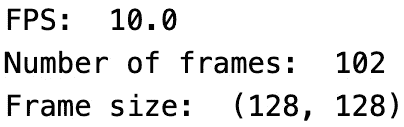
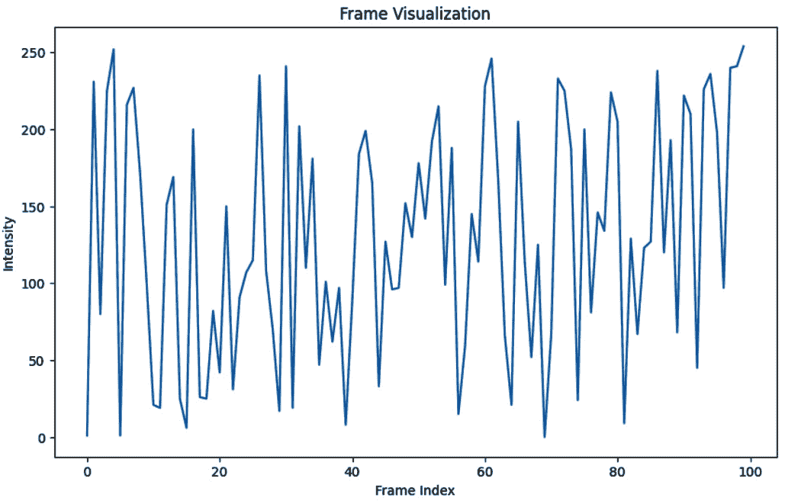
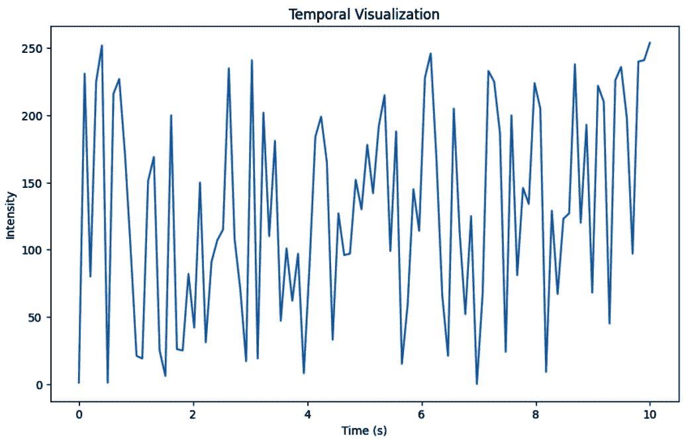
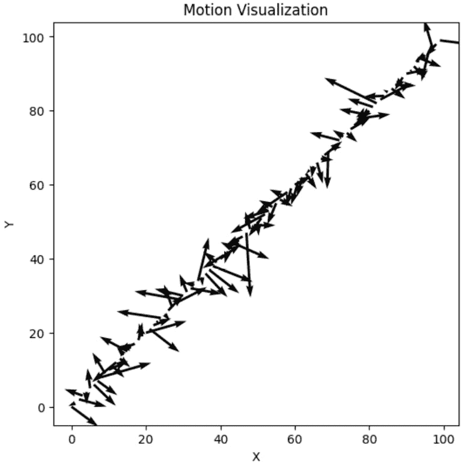
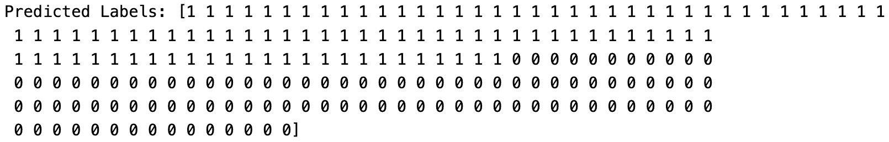
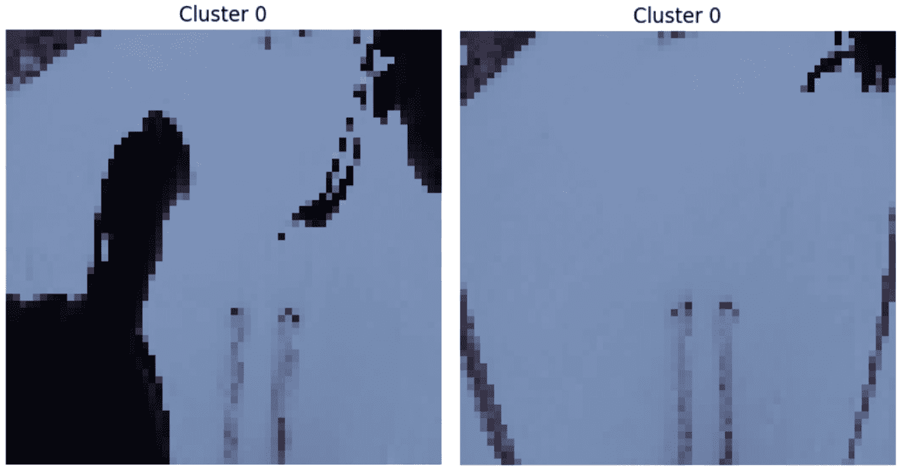
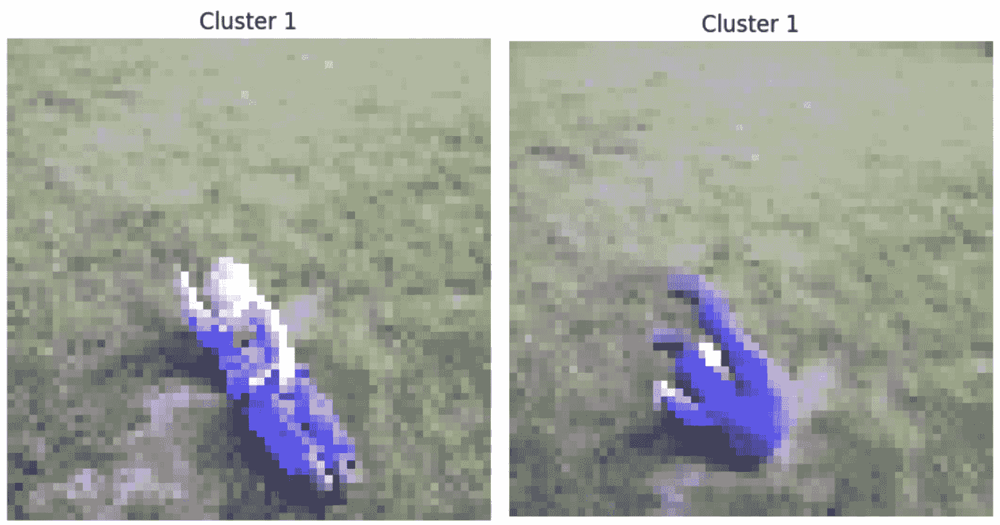
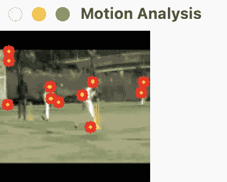
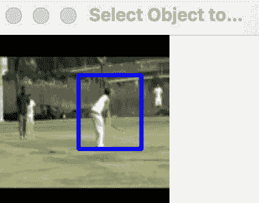
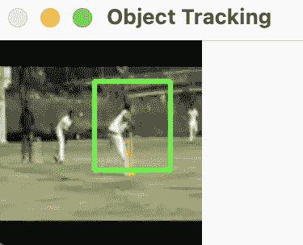

# 第八章：探索视频数据

在今天以数据为驱动力的世界中，视频已成为信息洞察的重要来源。分析视频数据可以提供关于人类行为、场景理解和各种现实世界现象的宝贵知识。在本章中，我们将踏上使用 Python、Matplotlib 和 cv2 的强大组合来探索和理解视频数据的激动人心的旅程。

我们将首先学习如何使用 cv2 库，这是 Python 中流行的计算机视觉库，来读取视频数据。使用 cv2，我们可以轻松地加载视频文件、访问单个帧并对它们执行各种操作。这些基本技能为我们的探索和分析奠定了基础。

接下来，我们将深入了解从视频数据中提取帧的过程。视频帧是构成视频序列的单独图像。提取帧使我们能够处理单个快照，从而分析、操作并从视频数据中提取有用的见解。我们将讨论不同的策略来高效地提取帧，并探索在特定时间间隔或帧率下工作的可能性。

一旦我们提取了帧，我们将探索视频帧的属性。这包括分析诸如颜色分布、纹理模式、物体运动和空间关系等特征。通过利用 Python 的 Matplotlib 库的强大功能，我们可以创建引人入胜的视觉图表，从而更深入地理解视频数据。

在本章中，我们将学习如何在 Python 中使用 Matplotlib 和 OpenCV (cv2)来探索视频数据。具体来说，我们将深入研究人体动作动力学数据集。在下一章中，我们将专注于标记这个视频数据集。本章为视频数据提供了一个基础性的介绍，提供了后续标记过程中必需的知识。

我们将学习以下内容：

+   使用 cv2 加载视频数据

+   从视频数据中提取帧以进行分析

+   从视频帧中提取特征

+   使用 Matplotlib 可视化视频数据

+   使用 k-means 聚类标记视频数据

+   视频数据分析的高级概念

到本章结束时，你将获得探索和分析视频数据的有价技能。你将具备知识和工具来解锁视频的潜在价值，使你能够提取有意义的见解并做出明智的决策。因此，让我们开始这段激动人心的探索视频数据之旅，揭开它所蕴含的迷人故事。

# 技术要求

在本节中，我们将使用以下 GitHub 链接中的数据集：[`github.com/PacktPublishing/Data-Labeling-in-Machine-Learning-with-Python./datasets/Ch08`](https://github.com/PacktPublishing/Data-Labeling-in-Machine-Learning-with-Python./datasets/Ch08)。

让我们从如何使用 Python 将视频数据读入应用程序开始。

# 使用 cv2 加载视频数据

**探索性数据分析**（**EDA**）是任何数据分析过程中的一个重要步骤。它帮助您了解您的数据，识别模式和关系，并为进一步的分析准备您的数据。视频数据是一种复杂的数据类型，需要特定的工具和技术来分析。在本节中，我们将探讨如何使用 Python 对视频数据进行 EDA。

任何 EDA（电子设计自动化）流程的第一步是加载和检查数据。在视频数据的情况下，我们将使用 OpenCV 库来加载视频文件。OpenCV 是一个流行的计算机视觉和图像处理库，它包含许多使处理视频数据变得容易的功能。

OpenCV 和 cv2 通常指的是同一个计算机视觉库——它们可以互换使用，只是在命名约定上略有不同：

+   **OpenCV**（代表**开源计算机视觉库**）：这是库的官方名称。它是一个开源的计算机视觉和机器学习软件库，包含用于图像和视频处理的多种功能。OpenCV 是用 C++编写的，并为 Python、Java 和其他语言提供了绑定。

+   在 Python 代码中`import cv2`，意味着代码正在使用 OpenCV 库。

要使用 OpenCV 加载视频文件，我们可以使用`cv2.VideoCapture`函数。这个函数接受视频文件的路径作为输入，并返回一个`VideoCapture`对象，我们可以使用它来访问视频的帧。以下是一个加载视频文件并打印一些关于它的信息的示例代码：

```py
import cv2
video_path = "path/to/video.mp4"
cap = cv2.VideoCapture(video_path)
fps = cap.get(cv2.CAP_PROP_FPS)
num_frames = int(cap.get(cv2.CAP_PROP_FRAME_COUNT))
frame_size = (int(cap.get(cv2.CAP_PROP_FRAME_WIDTH)), \
    int(cap.get(cv2.CAP_PROP_FRAME_HEIGHT)))
print("FPS: ", fps)
print("Number of frames: ", num_frames)
print("Frame size: ", frame_size)
```

这是输出：



图 8.1 – 视频文件信息

此代码从指定的路径加载视频文件，并打印其**帧率**（**FPS**）、帧数和帧大小。这些信息对于理解视频数据的属性可能很有用。

# 从视频数据中提取帧以进行分析

一旦我们加载了视频数据，我们就可以开始探索它。视频数据 EDA（探索性数据分析）的一个常见技术是可视化视频的一些帧。这可以帮助我们识别数据中的模式和异常。以下是一个显示视频前 10 帧的示例代码：

```py
import cv2
video_path = "path/to/video.mp4"
cap = cv2.VideoCapture(video_path)
for i in range(10):
    ret, frame = cap.read()
    if not ret:
        break
    cv2.imshow("Frame", frame)
    cv2.waitKey(0)
cap.release()
cv2.destroyAllWindows()
```

此代码从给定路径读取视频的前 10 帧，并使用`cv2.imshow`函数显示它们。`cv2.waitKey(0)`函数在显示下一帧之前等待按键。这允许我们在移动到下一帧之前检查每一帧。

# 从视频帧中提取特征

另一种用于视频数据 EDA 的有用技术是从每个帧中提取特征并分析它们。特征是测量或描述符，它们捕捉图像的某些方面，例如颜色、纹理或形状。通过分析这些特征，我们可以识别数据中的模式和关系。

要从每个帧中提取特征，我们可以使用 OpenCV 函数来计算各种类型的特征，例如颜色直方图、纹理描述符和形状测量。选择最佳特征提取方法取决于您的数据特征和聚类任务的性质。

让我们看看**颜色直方图**特征提取方法。

## 颜色直方图

颜色直方图是图像中颜色分布的表示。它显示了颜色空间中每个范围内具有不同颜色的像素数量。例如，颜色直方图可以显示图像中有多少像素是红色、绿色或蓝色。以下是一个示例代码，用于从每个帧中提取颜色直方图并绘制它：

```py
import cv2
import matplotlib.pyplot as plt
video_path = "path/to/video.mp4"
cap = cv2.VideoCapture(video_path)
histograms = []
```

下面是对代码中每行的详细解释：

+   第一行导入 `cv2` 库，我们将使用它来读取和处理视频数据。

+   第二行导入 `matplotlib` 库，我们将使用它来绘制直方图。

+   第三行设置视频文件的路径。将 `"path/to/video.mp4"` 替换为您的视频文件的实际路径。

+   第四行使用 `cv2.VideoCapture` 函数创建一个 `VideoCapture` 对象。这个对象允许我们读取视频中的帧。

+   第五行创建一个名为 `histograms` 的空列表。我们将在此列表中存储每个帧的直方图。

然后，我们添加一个 `while` 循环。这个循环逐个读取视频中的帧，直到没有更多的帧：

```py
while True:
    ret, frame = cap.read()
    if not ret:
        break
    histogram = cv2.calcHist([frame], [0, 1, 2], \
        None, [8, 8, 8], [0, 256, 0, 256, 0, 256])
    histogram = cv2.normalize(histogram, None).flatten()
    histograms.append(histogram)
cap.release()
```

下面是循环内部每行所做的事情：

+   `ret, frame = cap.read()`: 这一行使用 `cap.read()` 函数从视频中读取下一帧。`ret` 变量是一个布尔值，表示帧是否成功读取，`frame` 变量是一个包含帧像素值的 NumPy 数组。

+   `if not ret: break`: 如果 `ret` 是 `False`，则表示视频中没有更多的帧，因此我们退出循环。

+   `histogram = cv2.calcHist([frame], [0, 1, 2], None, [8, 8, 8], [0, 256, 0, 256, 0, 256])`: 这一行使用 `cv2.calcHist` 函数计算帧的颜色直方图。第一个参数是帧，第二个参数指定要包含在直方图中的通道（在这种情况下，所有三个 RGB 通道），第三个参数是一个掩码（我们将其设置为 `None`），第四个参数是直方图的大小（每个通道 8 个桶），第五个参数是要包含在直方图中的值范围（每个通道为 0 到 256）。

+   `histogram = cv2.normalize(histogram, None).flatten()`: 这一行使用 `cv2.normalize` 函数对直方图进行归一化，并使用 NumPy 数组的 `flatten` 方法将其展平为 1D 数组。归一化直方图确保它是尺度不变的，可以与其他帧或视频的直方图进行比较。

+   `histograms.append(histogram)`: 这一行将直方图追加到 `histograms` 列表中。

最后一行使用`cap.release()`函数释放`VideoCapture`对象。这释放了对象使用的资源，并允许我们在需要时打开另一个视频文件。

## 光流特征

我们将基于连续帧之间的光流来提取特征。光流捕捉视频中的物体运动。例如，OpenCV 库提供了计算光流的函数。

让我们看看计算光流特征的示例代码：

```py
# Example of optical flow calculation
prev_frame = cv2.cvtColor(frame1, cv2.COLOR_BGR2GRAY)
next_frame = cv2.cvtColor(frame2, cv2.COLOR_BGR2GRAY)
flow = cv2.calcOpticalFlowFarneback(prev_frame, \
    next_frame, None, 0.5, 3, 15, 3, 5, 1.2, 0)
```

## 运动向量

运动向量在理解视频数据的动态方面起着至关重要的作用。它们代表了关键点或区域在帧间的轨迹，为视频序列内的运动模式提供了洞察。计算这些运动向量的常见技术涉及使用 Shi-Tomasi 角点检测与 Lucas-Kanade 光流相结合：

+   `prev_frame`) 这些特征点作为后续帧跟踪的锚点。

+   `cv2.calcOpticalFlowPyrLK`。此算法通过计算这些特征点从前一帧(`prev_frame`)到当前帧(`next_frame`)的流动来估计运动向量。

我们通过跟踪帧间的关键点或区域来计算运动向量。这些向量代表了视频中的运动模式。让我们看看计算运动向量的示例代码：

```py
# Example of feature tracking using Shi-Tomasi corner detection and Lucas-Kanade optical flow
corners = cv2.goodFeaturesToTrack(prev_frame, \
    maxCorners=100, qualityLevel=0.01, minDistance=10)
next_corners, status, err = cv2.calcOpticalFlowPyrLK(\
    prev_frame, next_frame, corners, None)
```

这个代码片段展示了使用 Shi-Tomasi 角点检测初始化特征点，并随后计算光流以获得运动向量。理解这些概念对于计算机视觉中的目标跟踪和运动分析等任务至关重要。

## 深度学习特征

使用除 VGG16 之外的其他预训练模型的特征，如 ResNet、Inception 或 MobileNet。尝试适合图像和视频分析的良好模型。这些方法的实现超出了本书的范围。你可以在各种深度学习文档中找到详细信息。

当使用预训练模型如 ResNet、Inception 或 MobileNet 时，你将找到相应的深度学习框架提供的全面文档和示例。以下是一些基于流行框架的建议：

+   **TensorFlow 文档**：TensorFlow 提供了使用预训练模型的详细文档和示例。你可以探索 TensorFlow Hub，它提供了一个预训练模型的存储库，包括各种架构，如 ResNet、Inception 和 MobileNet。

+   **Keras 文档**：如果你在 TensorFlow 中使用 Keras，你可以参考 Keras Applications 模块。它包括 ResNet50、InceptionV3 和 MobileNet 等预训练模型。

+   **PyTorch 文档**：PyTorch 通过 torchvision 库提供使用预训练模型的文档。你可以找到 ResNet、Inception 和 MobileNet 等模型。

+   **Hugging Face Transformers 库**：对于更广泛的预训练模型，包括自然语言处理和计算机视觉领域的模型，您可以探索 Hugging Face Transformers 库。它涵盖了各种架构，并允许轻松集成到您的项目中。

+   **OpenCV 深度神经网络（DNN）模块**：如果您正在使用 OpenCV，DNN 模块支持从 TensorFlow、Caffe 等框架加载预训练模型。您可以在示例和文档中找到如何使用这些模型的信息。

通过查阅这些资源，您将找到大量关于如何将预训练模型集成到您的图像和视频分析任务中的文档、代码示例和指南。请记住检查您项目中使用的框架的文档。

## 外观和形状描述符

基于物体外观和形状特征提取特征。例如包括 Hu 矩、Zernike 矩和 Haralick 纹理特征。

外观和形状描述符是计算机视觉和图像处理中用于量化物体视觉特征的方法。以下是三种常用描述符的详细信息：

+   **Hu 矩**：Hu 矩是一组对平移、旋转和尺度变化不变的七个矩。它们是从图像的中心矩导出的，用于描述物体的形状。

    应用：Hu 矩在形状识别和物体匹配中特别有用，在这些应用中，对变换的鲁棒性至关重要。

+   **Zernike 矩**：Zernike 矩是一组定义在圆形域上的正交矩。它们用于表示物体的形状，并且对旋转不变。

    应用：Zernike 矩在模式识别、图像分析和**光学字符识别**（OCR）中找到应用。

+   **Haralick 纹理特征**：Haralick 纹理特征是一组用于描述图像中纹理模式的统计度量。它们基于共现矩阵，该矩阵表示像素强度的空间关系。

    应用：Haralick 纹理特征在纹理分析任务中得到了应用，例如在医学图像或材料检查中识别具有不同纹理的区域。

特征提取方法涉及从图像中提取特定的数值或向量，以表示其外观或形状特征。对变换如平移、旋转和尺度的不变性使这些描述符在物体识别任务中具有鲁棒性。

它们提供了对象视觉特征的量化表示，使高效的比较和分析成为可能。许多这些描述符可以使用 OpenCV 库实现，该库提供计算矩、纹理特征和其他描述符的函数。这些描述符在理解对象形状和纹理至关重要的应用中非常有价值，例如在图像识别、基于内容的图像检索和医学图像分析中。通过利用这些外观和形状描述符，计算机视觉系统可以深入了解对象的独特特征，从而在各个领域实现有效的分析和识别。

尝试不同的特征提取方法并观察其对聚类性能的影响通常是必要的。您还可以考虑结合多种类型的特征来捕捉数据的各个方面。

请记住，在应用聚类算法之前，适当预处理特征（缩放、归一化）。此外，K-means 中聚类数量的选择也可能影响结果，可能需要调整此参数。

# 使用 Matplotlib 可视化视频数据

让我们看看探索和分析视频数据的可视化示例。我们将生成一些样本数据，并使用 Python 中的 Matplotlib 库演示不同的可视化。首先，我们将导入库。然后，我们将生成一些样本数据。`frame_indices`代表帧索引，`frame_intensities`代表每个帧的强度值：

```py
import matplotlib.pyplot as plt
import numpy as np
# Generate sample data
frame_indices = np.arange(0, 100)
frame_intensities = np.random.randint(0, 255, size=100)
```

## 帧可视化

我们创建一个线形图来可视化帧索引上的帧强度。这有助于我们理解帧之间强度的变化：

```py
# Frame Visualization
plt.figure(figsize=(10, 6))
plt.title("Frame Visualization")
plt.xlabel("Frame Index")
plt.ylabel("Intensity")
plt.plot(frame_indices, frame_intensities)
plt.show()
```

我们得到以下结果：



图 8.2 – 帧可视化图表

## 时间可视化

在这里，我们将帧强度与时间戳进行绘图。这使我们能够观察强度随时间的变化，从而深入了解时间模式：

```py
# Temporal Visualization
timestamps = np.linspace(0, 10, 100)
plt.figure(figsize=(10, 6))
plt.title("Temporal Visualization")
plt.xlabel("Time (s)")
plt.ylabel("Intensity")
plt.plot(timestamps, frame_intensities)
plt.show()
```

我们得到以下图表：



图 8.3 – 时间可视化图表

## 运动可视化

为了可视化运动，我们生成表示`x`和`y`方向运动的随机位移值`dx`和`dy`。使用`quiver`函数，我们在每个帧索引处绘制箭头，指示运动方向和大小：

```py
# Motion Visualization
dx = np.random.randn(100)
dy = np.random.randn(100)
plt.figure(figsize=(6, 6))
plt.title("Motion Visualization")
plt.quiver(frame_indices, frame_indices, dx, dy)
plt.xlabel("X")
plt.ylabel("Y")
plt.show()
```

我们得到以下结果：



图 8.4 – 运动可视化图表

通过利用这些可视化，我们可以更好地理解视频数据，探索时间模式，并分析运动特征。

重要的是要注意，这些只是探索视频数据时可以创建的可视化的一些示例。根据数据集的具体特性和目标，您可以使用广泛的可视化技术来深入了解数据。

# 使用 k-means 聚类对视频数据进行标注

数据标注是机器学习中的一个重要步骤，它涉及将数据集中的数据点分配到类别或标签。对于视频数据，标注可能是一个具有挑战性的任务，因为它需要分析大量帧并识别每帧中描绘的对象或事件。

自动化标注过程的一种方法是通过使用无监督学习技术，如聚类。**k-means 聚类**是一种基于数据相似性进行聚类的流行方法。在视频数据的情况下，我们可以使用 k-means 聚类将包含相似对象或事件的帧分组在一起，并为每个簇分配一个标签。

## 使用 k-means 聚类进行数据标注概述

这里是如何使用 k-means 聚类对视频数据进行数据标注的逐步指南：

1.  加载视频数据并从每个帧中提取特征。这些特征可以是颜色直方图、边缘直方图或光流特征，具体取决于视频数据的类型。

1.  将特征应用于 k-means 聚类以将相似的帧分组在一起。聚类数*k*可以根据领域知识设置，或者通过使用肘部方法来确定最佳聚类数。

1.  根据帧中描绘的对象或事件为每个簇分配标签。这可以通过手动分析每个簇中的帧或使用对象检测或场景识别等自动化方法来完成。

1.  将分配的标签应用于每个簇中的帧。这可以通过在数据集中添加包含簇标签的新列或创建簇标签与帧索引之间的映射来完成。

1.  在标注数据上训练机器学习模型。标注的视频数据可用于训练执行各种任务（如动作识别、事件检测或视频摘要）的模型。

## 使用颜色直方图进行 k-means 聚类标注视频数据的示例

让我们看看使用开源 scikit-learn Python 包和*Kinetics human action*数据集进行视频数据 k-means 聚类的示例代码。该数据集可在*技术要求*部分的 GitHub 路径中找到。

此代码使用颜色直方图特征对视频数据进行 K-means 聚类。步骤包括从目录中加载视频帧、提取颜色直方图特征、标准化特征以及使用 K-means 将它们聚类成两组。

让我们通过相应的代码片段来查看这些步骤的实现：

1.  **加载视频并预处理帧**：从指定的目录加载视频帧。将帧大小调整为（64，64），归一化像素值，并创建结构化的视频数据集：

    ```py
    input_video_dir = "<your_path>/PacktPublishing/DataLabeling/ch08/kmeans/kmeans_input"
    input_video, _ = load_videos_from_directory(input_video_dir)
    ```

1.  **提取颜色直方图特征**：将每个帧转换为 HSV 颜色空间。计算每个通道（色调、饱和度、亮度）的直方图。将直方图连接成一个单独的特征向量：

    ```py
    hist_features = extract_histogram_features( \
        input_video.reshape(-1, 64, 64, 3))
    ```

1.  使用`StandardScaler`使数据具有零均值和单位方差：

    ```py
    scaler = StandardScaler()
    scaled_features = scaler.fit_transform(hist_features)
    ```

1.  **应用 K-means 聚类**：在标准化特征上使用 K-means 聚类，分为两个簇。打印分配给每个视频帧的预测标签：

    ```py
    kmeans = KMeans(n_clusters=2, random_state=42)
    predicted_labels = kmeans.fit_predict(scaled_features)
    print("Predicted Labels:", predicted_labels)
    ```

此代码根据颜色直方图特征执行视频帧聚类，类似于上一个版本。聚类是在指定的输入视频目录上完成的，并在最后打印出预测的簇标签。

我们得到以下输出：



图 8.5 – k-means 预测标记的输出

现在，将这些预测标签帧写入相应的输出簇目录。

以下代码将视频数据数组展平以遍历单个帧。然后它为簇创建两个输出目录（`Cluster_0`和`Cluster_1`）。每个帧根据从 k-means 聚类获得的预测标签保存在相应的簇文件夹中。这些帧以 PNG 图像的形式写入指定的输出目录：

```py
# Flatten the video_data array to iterate through frames
flattened_video_data = input_video.reshape(-1, \
    input_video.shape[-3], input_video.shape[-2], \
    input_video.shape[-1])
# Create two separate output directories for clusters
output_directory_0 = "/<your_path>/kmeans_output/Cluster_0"
output_directory_1 = "/<your_path>/kmeans_output/Cluster_1"
os.makedirs(output_directory_0, exist_ok=True)
os.makedirs(output_directory_1, exist_ok=True)
# Iterate through each frame, save frames in the corresponding cluster folder
for idx, (frame, predicted_label) in enumerate( \
    zip(flattened_video_data, predicted_labels)):
    cluster_folder = output_directory_0 if predicted_label == 0 else output_directory_1
    frame_filename = f"video_frame_{idx}.png"
    frame_path = os.path.join(cluster_folder, frame_filename)
    cv2.imwrite(frame_path, (frame * 255).astype(np.uint8))
```

现在，让我们绘制图表以可视化每个簇中的帧。以下代码可视化 K-means 聚类创建的每个簇的几个帧。它遍历`Cluster_0`和`Cluster_1`文件夹，从每个簇中选择指定数量的帧，并使用 Matplotlib 显示它们。生成的图像显示了每个簇的帧及其对应的簇标签：

```py
# Visualize a few frames from each cluster
num_frames_to_visualize = 2
for cluster_label in range(2):
    cluster_folder = os.path.join("./kmeans/kmeans_output", \
        f"Cluster_{cluster_label}")
    frame_files = os.listdir(cluster_folder)[:num_frames_to_visualize]
    for frame_file in frame_files:
        frame_path = os.path.join(cluster_folder, frame_file)
        frame = cv2.imread(frame_path)
        frame = cv2.cvtColor(frame, cv2.COLOR_BGR2RGB)
        plt.imshow(frame)
        plt.title(f"Cluster {cluster_label}")
        plt.axis("off")
        plt.show()
```

我们得到簇 0 的输出如下：



图 8.6 – 雪地滑冰（簇 0）

对于簇 1，我们得到以下输出：



图 8.7 – 儿童玩耍（簇 1）

在本节中，我们看到了如何使用 k-means 聚类对视频数据进行标记，并将视频数据聚类成两类。一个簇（`标签：簇 0`）包含滑冰视频的帧，第二个簇（`标签：簇 1`）包含儿童玩耍的视频。

现在，让我们看看在现实世界项目中使用的视频数据分析的一些高级概念。

# 视频数据分析的高级概念

以下概念在视频数据分析中是基本的，并且在现实世界的机器学习应用中通常被应用。让我们简要地看看这些概念。请注意，这些概念中的一些实现超出了本书的范围。

## 视频中的运动分析

**概念**：运动分析涉及提取和理解视频中物体运动的信息。这可能包括检测和跟踪移动对象、估计它们的轨迹以及分析运动模式。

**工具**：OpenCV（用于计算机视觉任务）和光流算法（例如，Lucas-Kanade 方法）。

让我们看看视频数据中运动分析代码的概述。

**初始化**：打开视频文件并设置 Lucas-Kanade 光流参数：

```py
import cv2
import numpy as np
# Read a video file
cap = cv2.VideoCapture('/<your_path>/CricketBowling.mp4')
# Initialize Lucas-Kanade optical flow
lk_params = dict(winSize=(15, 15), maxLevel=2, \
    criteria=(cv2.TERM_CRITERIA_EPS |
    cv2.TERM_CRITERIA_COUNT, 10, 0.03))
```

**特征检测**：使用 Shi-Tomasi 角点检测算法在第一帧中检测良好的特征点：

```py
ret, frame1 = cap.read()
prvs = cv2.cvtColor(frame1, cv2.COLOR_BGR2GRAY)
prvs_points = cv2.goodFeaturesToTrack(prvs, maxCorners=100, \
    qualityLevel=0.3, minDistance=7)
```

**运动分析循环**：遍历视频帧，计算光流并在每个帧上绘制运动矢量：

```py
while True:
    ret, frame2 = cap.read()
    if not ret:
        break
    next_frame = cv2.cvtColor(frame2, cv2.COLOR_BGR2GRAY)
    # Calculate optical flow
    next_points, status, err = cv2.calcOpticalFlowPyrLK( \
        prvs, next_frame, prvs_points, None, **lk_params)
```

**可视化**：实时显示叠加了运动矢量的原始帧：

```py
    # Draw motion vectors on the frame
    mask = np.zeros_like(frame2)
    for i, (new, old) in enumerate(zip(next_points, prvs_points)):
        a, b = new.ravel().astype(int)
        c, d = old.ravel().astype(int)
        mask = cv2.line(mask, (a, b), (c, d), (0, 255, 0), 2)
        frame2 = cv2.circle(frame2, (a, b), 5, (0, 0, 255), -1)
    result = cv2.add(frame2, mask)
    cv2.imshow('Motion Analysis', result)
```

**退出条件**：按下 *Esc* 键时退出循环：

```py
    # Break the loop on 'Esc' key
    if cv2.waitKey(30) & 0xFF == 27:
        break
```

**清理**：释放视频捕获对象并关闭所有 OpenCV 窗口：

```py
cap.release()
cv2.destroyAllWindows()
```

此代码提供了一个简单而有效的使用光流进行运动分析的演示，可视化视频中的特征点运动。

我们得到以下输出：



图 8.8 – 视频中的运动分析

## 视频中的对象跟踪

**概念**：对象跟踪涉及在连续的视频帧中定位和跟踪对象。这对于监控、人机交互和自动驾驶汽车等应用至关重要。

**工具**：OpenCV（用于跟踪算法，如 KLT 和 MedianFlow）。

下面是对象跟踪代码中的步骤概述：

`cv2.TrackerKCF_create()`：

```py
import cv2
# Create a KCF tracker
tracker = cv2.TrackerKCF_create()
```

使用 `cv2.VideoCapture` 从 `sample_video.mp4`)：

```py
# Read a video file
cap = cv2.VideoCapture('./PacktPublishing/DataLabeling/ch08/video_dataset/CricketBowling.mp4')
```

使用 `cv2.selectROI` 交互式选择要跟踪的对象：

```py
# Read the first frame
ret, frame = cap.read()
bbox = cv2.selectROI('Select Object to Track', frame, False)
```

我们得到以下结果：



图 8.9 – 选择要跟踪的对象

在第一帧中，`bbox`)：

```py
tracker.init(frame, bbox)
```

**对象跟踪循环**：遍历视频中的后续帧：

```py
while True:
    ret, frame = cap.read()
    if not ret:
        break
```

**更新跟踪器**：使用当前帧更新跟踪器以获得跟踪对象的新的边界框：

```py
     # Update the tracker
    success, bbox = tracker.update(frame)
```

**绘制边界框**：如果跟踪成功，则在帧中绘制一个绿色的边界框来包围跟踪到的对象。

```py
  if success:
        p1 = (int(bbox[0]), int(bbox[1]))
        p2 = (int(bbox[0] + bbox[2]), int(bbox[1] + bbox[3]))
        cv2.rectangle(frame, p1, p2, (0, 255, 0), 2)
```

使用 `cv2.imshow` 的 `'Object Tracking'`：

```py
  cv2.imshow('Object Tracking', frame)
```

我们看到以下结果：



图 8.10 – 对象跟踪

`cv2.waitKey`):

```py
    # Break the loop on 'Esc' key
    if cv2.waitKey(30) & 0xFF == 27:
        break
```

**清理**：释放视频捕获对象并关闭所有 OpenCV 窗口：

```py
cap.release()
cv2.destroyAllWindows()
```

此代码演示了一个基本的对象跟踪场景，其中用户在第一帧中选择一个对象，并使用 KCF 跟踪器在视频的后续帧中跟踪并绘制该对象的边界框。

## 视频中的人脸识别

**概念**：人脸识别涉及在视频中识别和验证人脸。它用于安全系统、用户身份验证和各种人机交互应用。

`face_recognition`)

下面是面部识别代码中的步骤概述：

1.  使用 `dlib.get_frontal_face_detector()` 和人脸关键点预测器 (`dlib.shape_predictor('shape_predictor_68_face_landmarks.dat')`)。

1.  使用 `cv2.VideoCapture` 从 `sample_video.mp4`)：

1.  **人脸检测循环**：遍历视频中的帧。

1.  **检测人脸**：使用人脸检测器识别每帧中的面孔。

1.  **人脸关键点检测**：对于每个检测到的人脸，使用人脸关键点预测器定位人脸关键点。

1.  **绘制人脸关键点**：在帧中检测到的人脸关键点位置绘制圆圈。

1.  **绘制边界框**：在帧中每个检测到的人脸周围绘制一个绿色的边界框。

1.  `cv2.imshow`.

1.  `cv2.waitKey`).

1.  **清理**：释放视频捕获对象并关闭所有 OpenCV 窗口。

此代码展示了基本的人脸识别应用程序，其中每一帧都会检测到人脸，并为每个检测到的人脸绘制面部特征点。边界框勾勒出人脸，圆圈突出显示特定的面部特征：

```py
from deepface import DeepFace
import cv2
# Load a sample image
img_path1 = './PacktPublishing/DataLabeling/ch08/data/pic1.jpeg'
img_path2 = './PacktPublishing/DataLabeling/ch08/data/pic2.jpeg'
img = cv2.imread(img_path)
# Perform facial recognition
result = DeepFace.verify(img1_path=img_path1, img2_path=img_path2)
# Display the result
print("Are these faces the same person? ", result["verified"])
# Additional information
print("Facial recognition result:", result)
```

我们得到以下输出：

```py
Are these faces the same person? True
Facial recognition result: {'verified': True, 'distance': 0.20667349278322178, 'threshold': 0.4, 'model': 'VGG-Face', 'detector_backend': 'opencv', 'similarity_metric': 'cosine', 'facial_areas': {'img1': {'x': 74, 'y': 50, 'w': 713, 'h': 713}, 'img2': {'x': 63, 'y': 8, 'w': 386, 'h': 386}}, 'time': 0.48}
```

## 视频压缩技术

视频压缩减少了视频文件的大小，使其在存储、传输和处理方面更加易于管理。

一些常见的技术如下：

+   **有损压缩**：为了减小文件大小而牺牲一些质量（例如，H.264，H.265）

    视频流平台如 YouTube 使用有损压缩（H.264）来高效地在互联网上传输视频。质量上的牺牲确保了更平滑的流媒体体验、更快的加载时间和减少用户的数据使用。

+   **无损压缩**：保持原始质量但压缩程度较低（例如，Apple ProRes，FFV1）

    在专业视频编辑工作流程中，保持最高可能的质量至关重要，因此使用无损压缩。Apple ProRes 或 FFV1 等格式用于存储和处理视频文件，而不影响质量。这在电影制作、视频编辑工作室和存档目的中很常见。

## 实时视频处理

实时视频处理涉及以最小延迟分析和操作视频数据，这对于监控、机器人和现场直播等应用至关重要。

其挑战如下：

+   **计算效率**：算法需要优化以实现快速执行

+   **硬件加速**：使用 GPU 或专用硬件进行并行处理

+   **流媒体基础设施**：在实时场景中进行 k-means 聚类数据传输和处理

这里有一些常见的实时视频数据捕获和处理技术：

+   **视频流**：

    +   **技术**：实时视频流涉及在网络上的连续传输视频数据

    +   **应用**：现场直播、监控系统、视频会议

    +   **工具**:

        +   **RTMP**（代表**实时消息协议**）：用于在互联网上传输视频

        +   **WebRTC**（代表**Web 实时通信**）：使网页浏览器能够实现实时通信

+   **IP 摄像头** **和 CCTV**：

    +   **技术**：IP 摄像头和**闭路电视**（**CCTV**）系统捕获和传输视频数据

    +   **应用**：监控和安全监控

    +   **工具**：

        +   **Axis Communications**：提供 IP 摄像头和监控解决方案

        +   **Hikvision**：提供一系列 CCTV 和 IP 摄像头产品

+   **深度感知** **相机**：

    +   **技术**：具有深度感知能力的摄像头除了捕获 2D 图像外，还捕获 3D 信息

    +   **应用**：手势识别、物体跟踪、增强现实

    +   **工具**：

        +   **Intel RealSense**：适用于各种应用的深度感知相机

        +   **Microsoft Azure Kinect**: 拥有用于计算机视觉任务的深度相机

+   **帧** **抓取器**：

    +   **技术**：帧抓取器从模拟或数字源捕获视频帧

    +   **应用**：工业自动化和医学成像

    +   **工具**：

        +   **Matrox Imaging**：为机器视觉应用提供帧抓取器

        +   **Euresys**：提供视频获取和图像处理解决方案

+   **时间卷积网络 (TCNs)**：

    +   **概述**：TCNs 扩展 CNNs 以处理时间序列，对视频数据有益

    +   **应用**：

        +   在视频中识别随时间变化的模式和事件

        +   动作识别的时间特征提取

+   **动作** **识别**

    +   **概述**：在视频序列中识别和分类动作或活动

    +   **技术**：

        +   **3D CNNs**：捕捉动作识别的空间和时间特征

        +   **双流网络**：分离空间和运动信息流

+   **深度伪造** **检测**：

    +   **概述**：检测和减轻使用深度学习技术创建逼真但虚假视频的使用

    +   **技术**：

        +   **法医分析**：分析深度伪造视频中的一致性、伪迹或异常

        +   **深度伪造数据集**：在多样化的数据集上训练模型以提高检测准确性。

让我们讨论一些重要的道德考量：

+   **知情同意**：确保个人了解视频录制及其潜在分析。

    **动作**：明确传达视频数据收集的目的。为敏感应用获得明确同意。

+   **透明度**：促进视频数据收集、处理和使用方面的透明度。

    **动作**：向利益相关者明确传达数据处理实践。提供关于所使用算法的易获取信息。

+   **偏见缓解**：解决和缓解可能存在于视频数据分析中的偏见。

    **动作**：定期评估和审计模型以消除偏见。实施公平感知算法和策略。

+   **数据安全**：保护视频数据免受未经授权的访问和使用。

    **动作**：对存储和传输的视频数据进行强加密。建立严格的访问控制和权限。

+   **问责制**：确保对视频数据分析后果的问责制。

    **动作**：明确数据处理的职责界限。建立处理和纠正错误的机制。

随着视频数据分析和处理技术的进步，道德考量变得越来越重要，以确保视频数据的负责任和公平使用。遵守道德原则有助于与利益相关者建立信任，并有助于视频基础 AI 应用的积极影响。

## 机器学习中的视频数据格式和质量

+   **视频格式**：

    **常见格式**：视频可以存储在各种格式中，如 MP4、AVI、MKV、MOV 等。

    **容器与编解码器**：容器（格式）包含视频和音频流，而编解码器（压缩）确定数据如何编码。

+   **视频质量**：

    **分辨率**：从**标准定义**（**SD**）到**高清**（**HD**）以及更高

    **帧率**：每秒帧数可能不同，影响运动的平滑度

    **比特率**：更高的比特率通常意味着更好的质量但更大的文件大小

## 处理机器学习模型视频数据时常见的常见问题

+   **不稳定的帧率**

+   **问题**：不同帧率的视频可能会干扰模型训练

    **解决方案**：在预处理期间标准化帧率或使用插值等技术

+   **可变分辨率**

+   **问题**：不同的分辨率可能会使模型输入要求复杂化

    **解决方案**：调整或裁剪帧到一致的分辨率，平衡质量和计算

+   **大文件大小**

+   **问题**：高质量的视频可能导致大型数据集，影响存储和处理

    **解决方案**：如果可能，压缩视频，并在开发期间考虑使用子集

+   **缺乏标准化**

+   **问题**：非统一的编码和压缩可能导致兼容性问题

    **解决方案**：将视频转换为标准格式，确保数据集的一致性

+   **有限的元数据**

+   **问题**：元数据不足（例如，时间戳、标签）可能会阻碍模型理解

    **解决方案**：通过添加相关元数据来增强视频，以帮助模型学习和评估

## 故障排除步骤

+   **预处理和标准化**：

    **行动**：在预处理期间标准化视频属性（例如，帧率、分辨率）

    **好处**：确保数据集的统一性和兼容性

+   **数据增强**：

    **行动**：应用数据增强技术以人工增加数据集大小

    **好处**：有助于解决数据有限的问题并提高模型泛化能力

+   **质量与计算权衡**：

    **行动**：根据项目需求平衡视频质量和计算资源

    **好处**：优化特定用例的模型训练和部署

+   **元数据增强**：

    **行动**：包括相关元数据（例如，时间戳、标签）以获得更好的模型上下文

    **好处**：提高模型理解并促进准确预测

+   **协作调试**：

    **行动**：与领域专家和同行研究人员合作，解决具体挑战

    **好处**：获得多样化的见解并加速问题解决

+   **模型性能监控**：

    **行动**：定期监控不同视频样本上的模型性能

    **好处**：识别漂移或性能下降，及时进行调整

在机器学习中处理视频数据需要结合技术专长、深思熟虑的预处理和持续监控来应对挑战并优化模型性能。根据项目特定要求定期评估和改进方法，确保视频数据有效集成到 AI 模型中。

# 摘要

在本章中，我们开始了探索视频数据并揭示其洞察力的旅程。通过利用 cv2 库，我们学习了如何读取视频数据，提取用于分析的帧，分析帧的特征，并使用强大的 Matplotlib 库进行可视化。掌握了这些技能，你将能够充分应对视频数据集，深入研究它们的独特特性，并更深入地理解其中包含的数据。探索视频数据为从识别人类动作到理解场景动态等一系列可能性打开了大门，本章为在视频数据标注领域进一步探索和分析奠定了基础。

最后，你学习了如何使用无监督机器学习 k-means 聚类来标注视频数据。在下一章中，我们将看到如何使用卷积神经网络（CNNs）、自动编码器和分水岭算法来标注视频数据。
