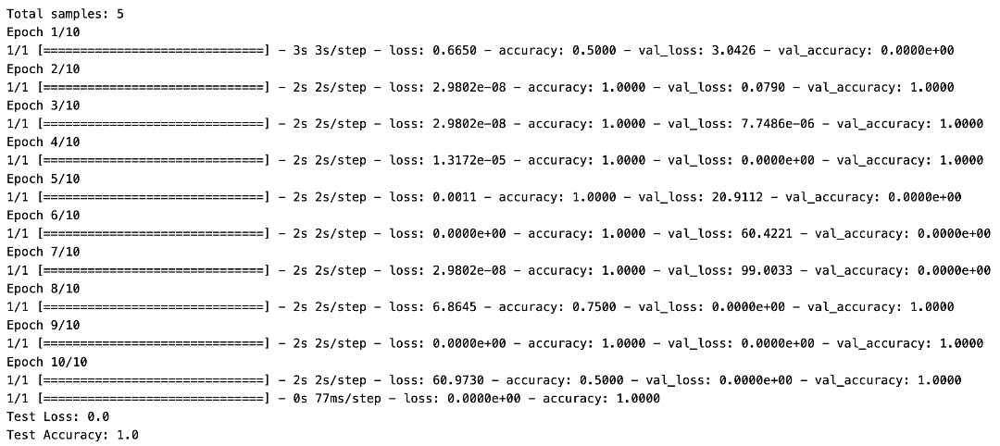
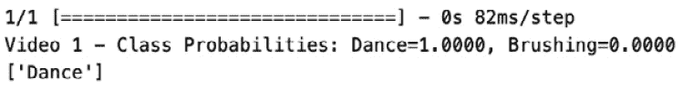
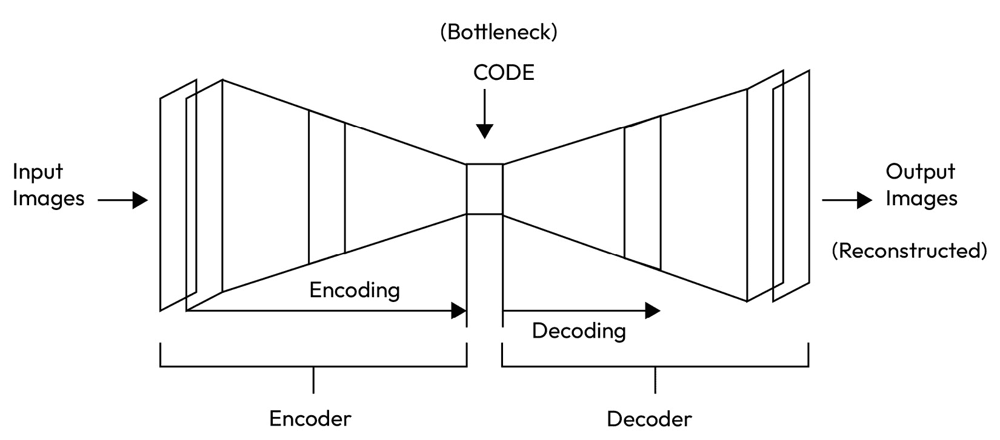
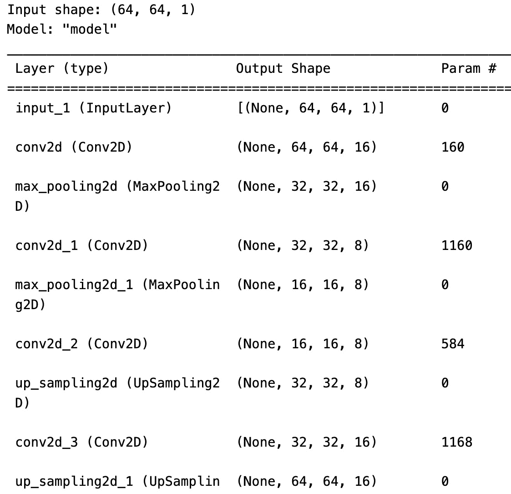
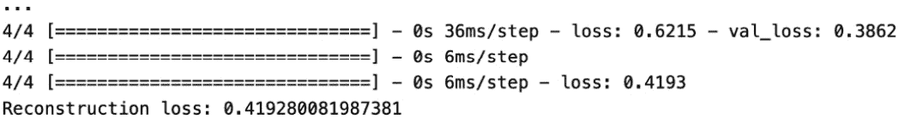
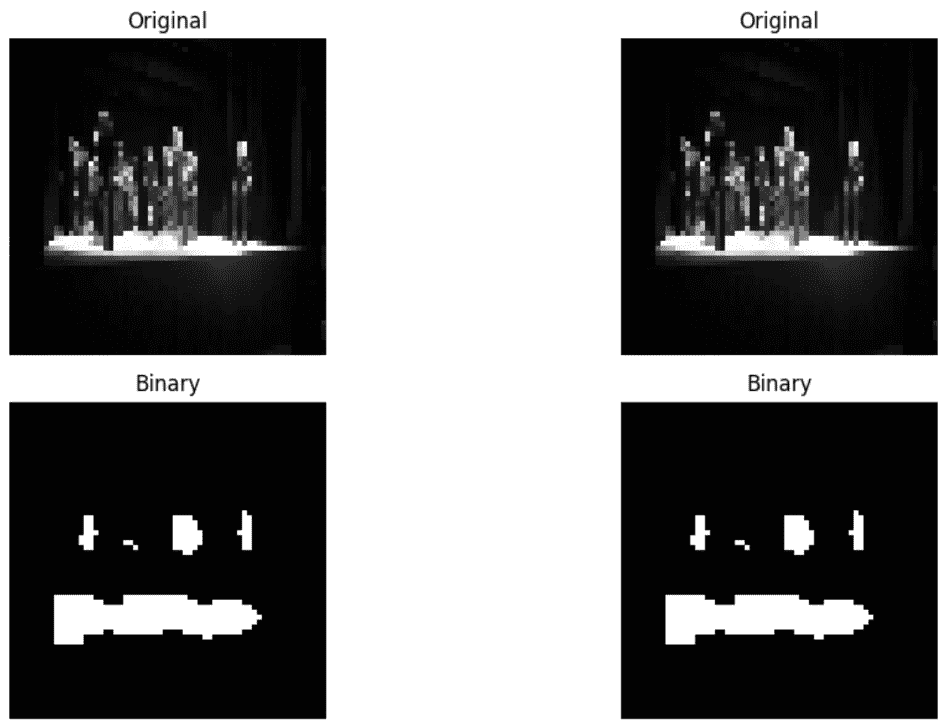

# 9

# 标注视频数据

大数据时代迎来了多媒体内容，包括视频在内的指数级增长，视频在娱乐、监控、医疗保健和自主系统等各个领域变得越来越普遍。视频包含大量信息，但要充分发挥其潜力，准确标注和注释所包含的数据至关重要。视频数据标注在使机器学习算法理解和分析视频，从而实现视频分类、目标检测、动作识别和视频摘要等广泛应用方面发挥着关键作用。

在本章中，我们将探索视频数据分类的迷人世界。视频分类包括根据视频内容分配标签或类别的任务，使我们能够有效地组织、搜索和分析视频数据。我们将探讨视频分类在关键作用的不同用例，并学习如何使用 Python 和公共数据集标注视频数据。

我们将学习如何使用监督和无监督机器学习模型来标注视频数据。我们将使用*Kinetics Human Action Video*数据集，在标注数据上训练机器学习模型以进行动作检测。

我们将深入研究构建针对视频数据分类的监督**卷积神经网络**（**CNN**）模型的复杂性。此外，我们还将探索自动编码器在高效压缩视频数据、提取关键特征中的应用。本章还将扩展其范围，包括 Watershed 算法，提供其在视频数据分割和标注中的应用见解。现实世界的示例和视频数据标注技术方面的进步进一步丰富了这一对视频数据分析与标注的全面探索。

在现实世界中，公司使用软件、工具和技术组合进行视频数据标注。虽然使用的具体工具可能有所不同，但以下是一些常见的工具：

+   **TensorFlow 和 Keras**：这些框架在深度学习领域非常流行，并为视频分类和目标检测任务提供了预训练模型。

+   **PyTorch**：PyTorch 提供了用于视频数据分析的工具和库，包括预训练模型和专为处理视频数据设计的模块。

+   **MATLAB**：MATLAB 提供了一系列用于视频处理、计算机视觉和机器学习的函数和工具箱。它常用于视频数据分析的研究与开发。

+   **OpenCV**：OpenCV 被广泛应用于视频数据处理、提取和分析。它提供了图像和视频操作、特征提取和目标检测的功能和算法。

+   **定制解决方案**：一些公司开发了针对其特定视频数据分析需求的专有软件或工具。

这些只是公司在不同行业中使用案例中使用的工具的几个例子。工具和技术的选择取决于每个公司的具体要求、数据量和期望的结果。

在本章中，我们将涵盖以下主要内容：

+   使用 Python CV2 捕捉实时视频数据

+   使用视频数据构建监督 CNN 模型

+   使用自动编码器压缩数据以减少维度空间，然后提取视频数据的重要特征

+   使用 Watershed 算法对视频数据进行分割

+   真实世界的示例和视频数据标注的进展

# 技术要求

在本节中，我们将使用以下 GitHub 链接中的视频数据集：[`github.com/PacktPublishing/Data-Labeling-in-Machine-Learning-with-Python/datasets/Ch9`](https://github.com/PacktPublishing/Data-Labeling-in-Machine-Learning-with-Python/datasets/Ch9)。

您可以在其官方网站上找到 Kinetics Human Action Video Dataset：[`paperswithcode.com/dataset/kinetics-400-1`](https://paperswithcode.com/dataset/kinetics-400-1)。

# 捕捉实时视频

实时视频捕捉在各种领域都有应用。一个突出的用例是安全和监控。

在大型公共场所，如机场、火车站或购物中心，实时视频捕捉用于安全监控和威胁检测。在整个区域内战略性地放置的监控摄像头持续捕捉视频画面，使安全人员能够监控和分析实时画面。

## 关键组件和功能

**具有高级功能的相机**：配备如云台变焦、夜视和广角镜头等功能的优质相机被部署以捕捉详细和清晰的画面。

**实时流**：视频画面实时传输到集中监控站，使安全人员能够立即看到各个位置。

**目标检测和识别**：将包括目标检测和面部识别在内的先进视频分析应用于识别和追踪个人、车辆或感兴趣的特定对象。

**异常检测**：机器学习算法分析视频流以检测异常模式或行为，触发对潜在安全威胁或异常活动的警报。

**与门禁系统的集成**：视频监控系统通常与门禁系统集成。例如，如果检测到未经授权的人员，系统可以触发警报并自动锁定某些区域。

**历史视频分析**：记录的视频画面存储一定时间，以便安全团队在发生事件、调查或审计时回顾历史数据。

这些用例展示了实时视频捕获在增强安全措施、确保公共场所安全以及快速响应潜在威胁方面发挥的关键作用。

## 一个使用网络摄像头捕获实时视频的动手示例

下面的 Python 代码打开与您的网络摄像头的连接，连续捕获帧，并在窗口中显示它们。您可以按*Q*键退出视频捕获。这个基本设置可以作为收集用于训练分类器的视频数据的起点：

```py
import cv2
# Open a connection to the webcam (default camera index is usually 0)
cap = cv2.VideoCapture(0)
# Check if the webcam is opened successfully
if not cap.isOpened():
    print("Error: Could not open webcam.")
    exit()
# Set the window name
window_name = 'Video Capture'
# Create a window to display the captured video
cv2.namedWindow(window_name, cv2.WINDOW_NORMAL)
# Define the codec and create a VideoWriter object
fourcc = cv2.VideoWriter_fourcc(*'XVID')
out = cv2.VideoWriter('captured_video.avi', fourcc, 20.0, (640, 480))
while True:
    # Read a frame from the webcam
    ret, frame = cap.read()
    # If the frame is not read successfully, exit the loop
    if not ret:
        print("Error: Could not read frame.")
        break
    # Display the captured frame
    cv2.imshow(window_name, frame)
    # Write the frame to the video file
    out.write(frame)
    # Break the loop when 'q' key is pressed
    if cv2.waitKey(1) & 0xFF == ord('q'):
            break
    # Release the webcam, release the video writer, and close the window
cap.release()
out.release()
cv2.destroyAllWindows()
```

现在，让我们构建一个用于视频数据分类的卷积神经网络（CNN）模型。

# 构建用于标记视频数据的 CNN 模型

在本节中，我们将探讨构建用于标记视频数据的 CNN 模型的过程。我们学习了*第六章*中 CNN 的基本概念。现在，我们将深入研究创建用于视频数据分析与标记的有效模型所需的 CNN 架构、训练和评估技术。通过理解关键概念和技术，您将能够利用 CNN 自动标记视频数据，使各种应用中的分析既高效又准确。

一个典型的 CNN 包含卷积层、池化层和全连接层。这些层从视频帧中提取和学习空间特征，使模型能够理解模式和结构。此外，参数共享的概念有助于 CNN 在处理大规模视频数据集时的效率。

让我们看看如何使用 Python 和 TensorFlow 库构建用于视频数据的监督式 CNN 模型的示例。我们将使用这个训练好的 CNN 模型来预测 Kinetics 数据集中的视频的“舞蹈”或“刷牙”标签。请记住将数据集的路径替换为您系统上的实际路径。我们将详细解释每个步骤以及相应的代码：

1.  **导入库**：首先，我们需要导入必要的库——TensorFlow、Keras 以及任何用于数据预处理和模型评估的附加库：

    ```py
    import tensorflow as tf
    from tensorflow import keras
    from tensorflow.keras import layers
    import os
    import numpy as np
    import cv2
    from sklearn.model_selection import train_test_split
    ```

1.  **数据预处理**：接下来，我们需要在将视频数据输入 CNN 模型之前对其进行预处理。预处理步骤可能因数据集的具体要求而异。在这里，我们将提供一个涉及步骤的一般概述：

    1.  **加载视频数据**：从公开可用的数据集或您自己的数据集中加载视频数据。您可以使用 OpenCV 或 scikit-video 等库来读取视频文件。

    1.  **提取帧**：从视频数据中提取单个帧。每个帧将被视为 CNN 模型的图像输入。

    1.  **调整帧大小**：将帧调整到适合 CNN 模型的一致大小。这一步骤确保所有帧具有相同的维度，这是 CNN 模型的要求。

    让我们创建一个 Python 函数来从目录路径加载视频：

    ```py
    # Function to load videos from a directory
    def load_videos_from_directory(directory, max_frames=100):
        video_data = []
        labels = []
        # Extract label from directory name
        label = os.path.basename(directory)
        for filename in os.listdir(directory):
            if filename.endswith('.mp4'):
                file_path = os.path.join(directory, filename)
                # Read video frames
                cap = cv2.VideoCapture(file_path)
                frames = []
                frame_count = 0
                while True:
                    ret, frame = cap.read()
                    if not ret or frame_count >= max_frames:
                    break
                    # Preprocess frame (resize, normalize, etc.)
                    frame = cv2.resize(frame, (64, 64))
                    frame = frame.astype("float32") / 255.0
                    frames.append(frame)
                    frame_count += 1
                cap.release()
                # Pad or truncate frames to max_frames
                frames = frames + [np.zeros_like(frames[0])] * /
                    (max_frames - len(frames))
                video_data.append(frames)
                labels.append(label)
        return np.array(video_data), np.array(labels)
    ```

    假设您已经从 GitHub 下载并提取了 Kinetics 数据集，让我们继续下一步：

    ```py
    # Define the path to the Kinetics Human action dataset
    # Specify the directories
    dance = "<your_path>/datasets/Ch9/Kinetics/dance"
    brush = "<your_path>/datasets/Ch9/Kinetics/brushing"
    new_video_data = "<your_path>/datasets/Ch9/Kinetics/test"
    # Load video data and get the maximum number of frames
    dance_video, _ = load_videos_from_directory(dance)
    brushing_video, _ = load_videos_from_directory(brush)
    test_video, _ = load_videos_from_directory(new_video_data)
    # Calculate the overall maximum number of frames
    max_frames = max(dance_video.shape[1], brushing_video.shape[1])
    # Truncate or pad frames to max_frames for both classes
    dance_video = dance_video[:, :max_frames, :, :, :]
    brushing_video = brushing_video[:, :max_frames, :, :, :]
    # Combine data from both classes
    video_data = np.concatenate([dance_video, brushing_video])
    ```

    1.  **独热编码**：创建标签并执行独热编码：

    ```py
    labels = np.array([0] * len(dance_video) + [1] * \
        len(brushing_video))
    # Check the size of the dataset
    print("Total samples:", len(video_data))
    ```

    1.  **将视频帧分为训练集和测试集**：训练集将用于训练模型，而测试集将用于评估模型性能：

    ```py
    # Split the data into training and testing sets
    X_train, X_test, y_train, y_test = train_test_split(video_data, \
        labels_one_hot, test_size=0.2, random_state=42)
    ```

    在机器学习中，`random_state`参数用于确保结果的重复性。当你设置一个特定的`random_state`值时，数据分割过程变得确定性，这意味着每次你用相同的`random_state`运行代码时，你都会得到相同的分割。这对于实验、代码共享或比较不同模型或算法的结果尤其重要。

    通过为`random_state`设置一个特定的值（在这种情况下，`42`），每次执行代码时，训练-测试分割都将相同。这对于重复性至关重要，因为它确保了其他人运行代码时将获得相同的训练和测试集，使结果具有可比性。

1.  **定义 CNN 模型**：现在，我们将使用 Keras API 定义 CNN 模型的架构。架构可能因任务的具体要求而异。以下是一个基本示例：

    ```py
    model = keras.Sequential(
    [
    layers.Conv3D(32, kernel_size=(3, 3, 3), activation="relu", input_shape=(max_frames, 64, 64, 3)),
    layers.MaxPooling3D(pool_size=(2, 2, 2)),
    layers.Conv3D(64, kernel_size=(3, 3, 3), activation="relu"),
    layers.MaxPooling3D(pool_size=(2, 2, 2)),
    layers.Flatten(),
    layers.Dense(128, activation="relu"),
    layers.Dense(2, activation="softmax") # Two output nodes for binary classification with softmax activation
    ]
    )
    ```

    在本例中，我们定义了一个简单的 CNN 架构，包含两对卷积和最大池化层，随后是一个展平层和一个具有`softmax`激活的密集层，用于分类。根据你的具体任务要求调整滤波器数量、内核大小和其他参数。

1.  **编译模型**：在训练模型之前，我们需要通过指定损失函数、优化器和训练期间要评估的指标来编译它：

    ```py
    model.compile(loss="categorical_crossentropy", optimizer="adam", /
        metrics=["accuracy"])
    ```

    在本例中，我们使用分类交叉熵作为损失函数，Adam 优化器，以及准确率作为评估指标。根据你的具体问题调整这些设置。

1.  使用`fit`方法进行此操作：

    ```py
    model.fit(X_train, y_train, epochs=10, batch_size=32, \
        validation_data=(X_test, y_test))
    x_train and y_train represent the training data (the preprocessed video frames and their corresponding labels). The batch_size parameter determines the number of samples processed in each training iteration, and epochs specify the number of complete passes through the training dataset. Additionally, validation_data is provided to evaluate the model on the test dataset during training.
    ```

1.  **评估模型**：在训练模型后，我们需要在测试集上评估其性能以评估其准确性和泛化能力：

    ```py
    test_loss, test_accuracy = model.evaluate(x_test, y_test)
    print("Test Loss:", test_loss)
    print("Test Accuracy:", test_accuracy)
    ```

    这里是输出：



图 9.1 – CNN 模型损失和准确率

```py
calculates the test loss and accuracy of the model on the test set, using the evaluate function. The results will provide insights into how well the model performs on unseen video data.
```

1.  **进行预测**：一旦模型训练和评估完成，我们就可以用它对新视频数据进行预测：

    ```py
     # Predictions on new video data
    # Assuming 'test_video' is loaded and preprocessed similarly to the training data
    predictions = loaded_model.predict(test_video)
    # Define the label mapping
    label_mapping = {0: 'Dance', 1: 'Brushing'}
    # Print class probabilities for each video in the test set
    for i, pred in enumerate(predictions):
        print(f"Video {i + 1} - Class Probabilities: \
            Dance={pred[0]:.4f}, Brushing={pred[1]:.4f}")
    # Convert predictions to labels using the mapping
    predicted_labels = np.vectorize(label_mapping.get) \
        (np.argmax(predictions, axis=1))
    print(predicted_labels)
    ```

    这里是输出：



图 9.2 – CNN 模型的预测标签

```py
test_video represents new video frames or sequences that the model hasn’t seen before. The predict function generates predictions for each input sample, which can be used for further analysis or decision-making. In the provided code, after making predictions, you convert the predictions to labels and print them.
```

1.  **保存和加载模型**：如果你想以后重用训练好的模型而不需要重新训练，你可以将其保存到磁盘，并在需要时加载：

    ```py
    # Save the model
    model.save("video_classification_model.h5")
    # Load the model
    loaded_model = keras.models.load_model( \
        "video_classification_model.h5")
    ```

    `save`函数将整个模型架构、权重和优化器状态保存到文件中。`load_model`函数允许你加载保存的模型，并用于预测或进一步训练。

1.  **微调和超参数优化**：为了提高您的视频分类模型的性能，您可以探索微调和超参数优化等技术。微调涉及在较小的、特定任务的数据集上训练模型，以适应您特定的视频分类问题。超参数优化涉及系统地搜索最佳的超参数组合（例如，学习率、批大小和层数的数量）以最大化模型性能。

这些步骤可以帮助您构建用于视频数据分类的监督 CNN 模型。您可以根据您的特定数据集和需求定制这些步骤。实验、迭代和调整是实现最佳视频分类任务性能的关键。

此代码演示了使用 Kinetics 人类动作视频数据集加载、预处理、训练、评估和保存模型的步骤。根据您的特定数据集和需求修改和定制代码。

为标注视频数据构建 CNN 模型已成为从视频中大量可用视觉信息中提取有价值见解的必要手段。在本节中，我们介绍了 CNN 的概念，讨论了适合视频数据标注的架构，并涵盖了建模过程中的基本步骤，包括数据准备、训练和评估。通过理解本节中讨论的原则和技术，您将能够开发自己的 CNN 模型用于视频数据标注，从而促进在多种应用中对视频内容的分析和理解。

在下一节中，我们将看看如何使用自动编码器对视频进行分类

# 使用自动编码器进行视频数据标注

**自动编码器**是一类强大的神经网络，广泛用于**无监督学习**任务，尤其是在深度学习领域。它们是数据表示和压缩的基本工具，在包括图像和视频数据分析在内的各个领域都受到了极大的关注。在本节中，我们将探讨自动编码器的概念、其架构以及在视频数据分析与标注中的应用。

自动编码器背后的基本思想是通过将数据编码到低维潜在空间中，然后从该表示中重建它来学习数据的有效表示。自动编码器的编码器和解码器组件协同工作以实现此数据压缩和重建过程。自动编码器的关键组件包括训练期间使用的激活函数、损失函数和优化算法。

自动编码器是一种无监督学习模型，它学习如何编码和解码数据。它由两个主要组件组成——编码器和解码器。

编码器接收一个输入数据样本，例如一个图像，并将其映射到一个低维表示，也称为潜在空间或编码。编码器的目的是捕捉输入数据中最重要特征或模式。它通过降低其维度来压缩数据，通常降低到一个低维空间。

相反，解码器从编码器接收编码表示，并试图从这个压缩表示中重建原始输入数据。它学习生成一个与原始输入非常相似输出。解码器的目标是逆转编码过程，尽可能忠实地重建输入数据。

自动编码器通过比较重建输出与原始输入，测量重建误差来训练。目标是训练过程中最小化这个重建误差，这鼓励自动编码器学习数据的紧凑且信息丰富的表示。

自动编码器背后的理念是通过训练模型压缩输入数据然后重建，迫使模型学习一个压缩表示，该表示能够捕捉数据的最大显著和重要特征。换句话说，它学习了一个保留最多相关信息的数据压缩版本。这可以用于数据压缩、去噪和异常检测等任务。



图 9.3 – 自动编码器网络

可以通过首先训练自动编码器重建原始输入帧，然后使用学习到的表示对编码帧进行**分类**或**聚类**来使用自动编码器标记视频数据。

这里是您可以使用自动编码器对视频数据进行标记的步骤：

1.  **收集和预处理视频数据**：这涉及到将视频转换为帧，调整大小，并将像素值归一化到公共尺度。

1.  **训练自动编码器**：您可以使用卷积自动编码器来学习视频帧中的潜在模式。编码器网络接收一个帧作为输入，并生成该帧的压缩表示，而解码器网络接收压缩表示并生成原始帧的重建版本。自动编码器通过使用损失函数（如均方误差）来最小化原始帧和重建帧之间的差异进行训练。

1.  **编码帧**：一旦自动编码器被训练，您可以使用编码器网络将视频中的每个帧编码成一个压缩表示。

1.  **执行分类或聚类**：现在，可以编码的帧可以用作分类或聚类算法的输入。例如，你可以使用神经网络等分类器根据编码帧预测视频的标签。或者，你可以使用 k-means 或层次聚类等聚类算法将相似的帧分组在一起。

1.  **标记视频**：一旦你为视频中的每一帧预测了标签或簇，你就可以根据多数标签或簇为整个视频分配一个标签。

重要的是要注意，自动编码器的训练可能计算成本很高，尤其是在大型数据集上。同样重要的是，根据你特定的视频数据和标记任务选择适当的架构和超参数。

## 使用自动编码器标记视频数据的手动示例

让我们看看一些示例 Python 代码，用于使用样本数据集标记视频数据：

1.  **加载和预处理视频数据** 首先，我们将从目录中读取视频文件并提取每个视频的帧。然后，当我们有一个标记的视频帧数据集时，我们将数据分为训练集和测试集以进行评估。

    让我们导入库并定义函数：

    ```py
    import cv2
    import numpy as np
    import cv2
    import os
    from tensorflow import keras
    ```

    让我们编写一个函数来从目录中加载所有视频数据：

    ```py
    # Function to load all video data from a directory
    def load_videos_from_directory(directory, max_frames=100
    ):
        video_data = []
        # List all files in the directory
        files = os.listdir(directory)
        for file in files:
            if file.endswith(".mp4"):
                video_path = os.path.join(directory, file)
                frames = load_video(video_path, max_frames)
                video_data.append(frames)
        return np.concatenate(video_data)
    ```

    让我们编写一个函数来从路径中加载每个视频数据：

    ```py
    # Function to load video data from file path
    def load_video(file_path, max_frames=100, frame_shape=(64, 64)):
        cap = cv2.VideoCapture(file_path)
        frames = []
        frame_count = 0
        while True:
            ret, frame = cap.read()
            if not ret or frame_count >= max_frames:
                break
            frame = cv2.cvtColor(frame, cv2.COLOR_BGR2GRAY)
            frame = cv2.resize(frame, frame_shape)
            frame = np.expand_dims(frame, axis=-1)
            frames.append(frame / 255.0)
            frame_count += 1
        cap.release()
        # Pad or truncate frames to max_frames
        frames = frames + [np.zeros_like(frames[0])] * (max_frames - len(frames))
        return np.array(frames)
    ```

    现在，让我们指定目录并加载视频数据：

    ```py
    # Specify the directories
    brushing_directory = "<your_path>/datasets/Ch9/Kinetics/autoencode/brushing"
    dancing_directory = "<your_path>/datasets/Ch9/Kinetics/autoencode/dance"
    # Load video data for "brushing"
    brushing_data = load_videos_from_directory(brushing_directory)
    # Load video data for "dancing"
    dancing_data = load_videos_from_directory(dancing_directory)
    # Find the minimum number of frames among all videos
    min_frames = min(min(len(video) for video in brushing_data), min(len(video) for video in dancing_data))
    # Ensure all videos have the same number of frames
    brushing_data = [video[:min_frames] for video in brushing_data]
    dancing_data = [video[:min_frames] for video in dancing_data]
    # Reshape the data to have the correct input shape
    # Selecting the first instance from brushing_data for training and dancing_data for testing
    train_data = brushing_data[0]
    test_data = dancing_data[0]
    # Define the input shape based on the actual dimensions of the loaded video frames
    input_shape= train_data.shape[1:]
    print("Input shape:", input_shape)
    ```

1.  **构建自动编码器模型**：在这个步骤中，我们使用 TensorFlow 和 Keras 库构建自动编码器模型的架构。自动编码器由编码器和解码器组成。编码器部分通过卷积和最大池化层逐渐减少输入帧的空间维度，捕获重要特征：

    ```py
    # Define the encoder part of the autoencoder
    encoder_input = keras.Input(shape=input_shape)
    encoder = keras.layers.Conv2D(filters=16, kernel_size=3, \
        activation="relu", padding="same")(encoder_input)
    encoder = keras.layers.MaxPooling2D(pool_size=2)(encoder)
    encoder = keras.layers.Conv2D(filters=8, kernel_size=3, \
        activation="relu", padding="same")(encoder)
    encoder = keras.layers.MaxPooling2D(pool_size=2)(encoder)
    # Define the decoder part of the autoencoder
    decoder = keras.layers.Conv2D(filters=8, kernel_size=3, \
        activation="relu", padding="same")(encoder)
    decoder = keras.layers.UpSampling2D(size=2)(decoder)
    decoder = keras.layers.Conv2D(filters=16, kernel_size=3, \
        activation="relu", padding="same")(decoder)
    decoder = keras.layers.UpSampling2D(size=2)(decoder)
    # Modify the last layer to have 1 filter (matching the number of channels in the input)
    decoder_output = keras.layers.Conv2D(filters=1, kernel_size=3, \
        activation="sigmoid", padding="same")(decoder)
    # Create the autoencoder model
    autoencoder = keras.Model(encoder_input, decoder_output)
    autoencoder.summary()
    ```

    这里是输出：



图 9.4 – 模型摘要

1.  `binary_crossentropy`损失函数适合于准确重建输入帧的二进制分类任务。最后，我们将使用指定数量的周期和 32 个批大小在训练数据上训练自动编码器：

    ```py
    # Compile the model
    autoencoder.compile(optimizer="adam", loss="binary_crossentropy")
    ```

    损失函数的选择，无论是**二元交叉熵**（**BCE**）还是**均方误差**（**MSE**），取决于你使用自动编码器尝试解决的问题的性质。

    BCE 在自动编码器的输出是二进制表示时常用，特别是在每个像素或特征都可以被视为二元结果（激活或未激活）的场景中。例如，如果你正在处理灰度图像，并且目标是使像素值接近 0 或 1（表示黑色或白色），BCE 可能适合。

    在你特定的自编码器应用背景下，如果输入帧不是二值的，并且你希望在一个连续空间中找到一个与原始输入非常相似的重建，你可能想尝试使用均方误差（MSE）作为损失函数。尝试不同的损失函数并评估它们对模型性能的影响总是一个好主意，选择与你的具体问题和数据特性最匹配的一个：

    ```py
    # Train the model
    autoencoder.fit(train_data, train_data, epochs=10, \
        batch_size=32, validation_data=(test_data, test_data))
    # Save the trained autoencoder model to a file
    autoencoder.save('autoencoder_model.h5')
    ```

    在自编码器中，在训练过程中，你通常使用相同的数据作为输入和目标（也称为自监督学习）。自编码器被训练来重建其输入，因此你提供相同的数据进行训练并评估重建损失。

    这里是为什么你的代码中参数相同的原因。

    在 fit 方法中，你将`train_data`作为输入数据（`x`）和目标数据（`y`）传递。这是自编码器训练中的常见做法。

    注意，你需要根据你的特定视频数据调整代码，包括输入形状、滤波器数量、内核大小以及训练的周期数。此外，你可以探索不同的架构并尝试不同的超参数来提高你的自编码器模型在视频数据标记方面的性能。

    使用相同的验证集允许你直接比较输入帧和重建帧，以评估自编码器的性能。

1.  **生成预测并评估模型**：一旦自编码器模型被训练，你就可以在测试数据上生成预测并评估其性能。这一步骤允许你评估模型重建输入帧的能力以及其在标记视频数据方面的有效性：

    ```py
    # Generate predictions on testing data
    decoded_frames = autoencoder.predict(test_data)
    # Evaluate the model
    loss = autoencoder.evaluate( decoded_frames, test_data)
    print("Reconstruction loss:", loss)
    ```

    这里是输出：



图 9.5 – 计算重建损失

如果损失低，这表明自编码器已经成功学会了编码和解码输入数据。

通过在测试数据上生成预测，你可以使用训练好的自编码器模型获得重建帧。然后，你可以通过计算重建损失来评估模型性能，该损失衡量原始帧和重建帧之间的差异。较低的重建损失表示更好的性能。

1.  **应用阈值进行标记**：为了根据重建帧标记视频数据，你可以应用阈值技术。通过设置阈值值，你可以将帧中的每个像素分类为前景或背景。这允许你在视频中区分对象或感兴趣的区域：

    ```py
    # Apply thresholding
    threshold = 0.50
    binary_frames = (decoded_frames > threshold).astype('uint8')
    ```

    在这个例子中，使用了 0.5 的阈值值。值大于阈值的像素被认为是前景的一部分，而值低于阈值的像素被认为是背景的一部分。生成的二值帧提供了视频数据的标记表示。

1.  **可视化标记的视频数据**：为了深入了解标记的视频数据，您可以将原始帧与从阈值获得的相应二值帧并排可视化。这种可视化有助于您了解标签过程的有效性和识别出的对象或区域：

    ```py
    import matplotlib.pyplot as plt
    # Visualize original frames and binary frames
    # Let's visualize the first 2 frames.
    num_frames =2;
    fig, axes = plt.subplots(2, num_frames, figsize=(15, 6))
    for i in range(num_frames):
        axes[0, i].imshow(test_data[i], cmap='gray')
        axes[0, i].axis('off')
        axes[0, i].set_title("Original")ocess
        axes[1, i].imshow(binary_frames[i], cmap='gray')
        axes[1, i].axis('off')
        axes[1, i].set_title("Binary")
    plt.tight_layout()
    plt.show()
    ```

`plt.subplots(2, num_frames, figsize=(15, 6))`函数来自 Matplotlib 库，用于创建一个子图网格。它接受三个参数 – 行数（两行）、列数（两列）和`figsize`，它指定了图的大小（宽度和高度）以英寸为单位。在这种情况下，宽度设置为 15 英寸，高度设置为 6 英寸。

通过将编码和解码过程获得的原始帧和二值帧并排绘制，您可以直观地比较标签结果。原始帧显示在上排，而编码和解码过程后的二值帧显示在下排。这种可视化使您能够观察由基于自动编码器标签过程的识别出的对象或区域。



图 9.6 – 编码和解码后的原始图像和二值图像

您所训练的自动编码器模型可用于各种任务，如视频分类、聚类和异常检测。以下是您如何使用自动编码器模型执行这些任务的简要概述：

+   **视频分类**：

    +   您可以使用自动编码器从视频帧中提取有意义的特征。从自动编码器隐藏层获得的编码表示可以作为输入数据的紧凑且信息丰富的表示。

    +   在这些编码表示上训练一个分类器（例如，一个简单的前馈神经网络）以执行视频分类。

+   **聚类**：

    +   利用编码表示根据视频特征相似性对视频进行聚类。您可以使用如 k-means 或层次聚类等聚类算法。

    +   每个簇代表一组在帧中具有相似模式的视频。

+   **异常检测**：

    +   自动编码器模型被训练以准确重建正常视频帧。任何偏离学习模式的偏差都可以被视为异常。

    +   您可以设置一个重建误差阈值，并且重建误差超过此阈值的帧被标记为异常。

现在，让我们看看如何使用迁移学习从训练数据集中提取编码表示以进行视频分类。

## 迁移学习

使用预训练的自动编码器模型从新数据中提取表示可以被视为一种迁移学习形式。在迁移学习中，从一项任务或数据集训练中获得的知识被应用于不同但相关的任务或数据集。特别是，自动编码器在迁移学习场景中通常用作特征提取器。

下面是如何分解这个过程：

1.  **预训练的自动编码器**：当您在特定数据集或任务（例如，输入数据的重建）上训练自动编码器时，自动编码器编码部分的学到的权重捕捉到了输入数据的有效表示。

1.  **为新数据提取特征**：训练完成后，您可以使用预训练的编码器作为新、未见数据的特征提取器。这意味着将新数据通过编码器传递以获得输入的压缩表示（潜在空间）。

1.  **迁移学习方面**：从原始任务中学习到的编码器权重中的知识被转移到新任务，即对新数据进行表示编码。

这种方法在标记数据对于新任务有限的情况下是有益的。您不是从头开始训练一个全新的模型，而是利用预训练自动编码器中嵌入的知识来初始化或增强特征提取能力。

总结来说，使用预训练的自动编码器进行特征提取是一种迁移学习的形式，其中从原始任务（重建）中获得的知识被转移到相关任务（表示提取）中。

下面是代码实现：

```py
#load the saved auto encoder model
from tensorflow import keras
# Load your autoencoder model
autoencoder = keras.models.load_model("autoencoder_model.h5")
# Print the names of all layers in the loaded autoencoder
for layer in autoencoder.layers:
print(layer.name)
# Access the encoder layer by its name
encoder_layer_name = 'conv2d_2' # Replace with the actual name you find
encoder_layer = autoencoder.get_layer(encoder_layer_name)
# Extract encoded representations of the video frames using the autoencoder
encoded_reps = encoder_layer(frames).numpy()
```

在获得数据集的编码表示后，您可以继续将数据分为训练集和测试集。随后，您可以使用这些编码表示构建一个分类器，类似于本章中*构建用于标记视频数据的 CNN 模型*部分所展示的例子。

这个分类器旨在根据学到的特征对视频数据集进行分类。此示例的完整代码可在 GitHub 上找到，提供了详细的实现供参考。

重要的是要注意，提供的代码是一个简化的示例，并且根据您视频数据的复杂性和具体要求，您可能需要调整架构、超参数和阈值技术。实验和微调是实现准确和可靠标记结果的关键。

总之，自动编码器是视频数据分析中的一种多才多艺且强大的工具。在本节中，我们提供了自动编码器的全面介绍，解释了其架构、训练过程以及在视频分析和标记中的应用。我们探讨了自动编码器如何捕捉视频数据的有效表示，从而实现去噪、超分辨率和异常检测等任务。通过理解自动编码器的原理，您将具备在视频数据分析项目和分类项目中利用自动编码器的知识。

接下来，让我们学习使用 Watershed 算法进行视频标记。

# 使用 Watershed 算法进行视频数据标签

Watershed 算法是一种流行的图像分割技术，也可以用于标签视频数据。

它在分割具有不规则边界和重叠物体的复杂图像方面特别有效。受水文中的流域自然过程启发，该算法将灰度或梯度图像视为地形图，其中每个像素代表地形上的一个点。通过模拟来自不同区域的流域洪水，Watershed 算法将图像划分为不同的区域或段。

在本节中，我们将详细探讨 Watershed 算法的概念。我们将讨论其基本原理、算法中涉及到的步骤，以及它在各个领域的应用。此外，我们还将提供实际示例和代码实现，以说明如何将 Watershed 算法应用于分割和标签视频数据。

该算法通过将图像视为地形表面，并将灰度强度或梯度信息视为海拔高度来工作。此算法使用标记的概念，这些是用户定义的点，它们指导洪水过程并帮助定义图像中的区域。

预处理步骤包括噪声去除和梯度计算，这对于获得准确的分割结果至关重要。在基于标记的 Watershed 中，初始标记放置在图像上以指导洪水过程。这个过程迭代地填充流域并解决区域之间的冲突。后处理步骤合并和细化分割区域，以获得最终的分割结果。

让我们看看一个 Python 代码示例，演示如何使用 Watershed 算法对 Kinetics 人类动作视频数据集进行视频数据标签。

## 使用 Watershed 算法对视频数据进行标签的手动示例

在此示例代码中，我们将实现以下步骤：

1.  导入用于分割所需的 Python 库。

1.  读取视频数据并显示原始帧。

1.  从视频中提取帧。

1.  将 Watershed 算法应用于每一帧。

1.  将分割后的帧保存到输出目录并打印分割后的帧。

这是相应的代码：

首先，让我们导入所需的库：

```py
# Step 1: Importing the required python libraries
import cv2
import numpy as np
from matplotlib import pyplot as plt
# Step 2: Read the Video Data
```

让我们从输入目录读取视频数据，提取视频的帧，然后打印原始视频帧：

```py
 video_path = "<your_path>/datasets/Ch9/Kinetics/dance/dance3.mp4"
# Check if the file exists
if os.path.exists(video_path):
    cap = cv2.VideoCapture(video_path)
# Continue with your video processing logic here
else:
    print(f"The file '{video_path}' does not exist.")
```

在此步骤中，我们指定视频文件的路径并创建一个 OpenCV 的`VideoCapture`类的实例来读取视频数据：

```py
# Step 3: Extract Frames from the Video
frames = []
while True:
    ret, frame = cap.read()
    if not ret:
        break
    frames.append(frame)
cap.release()
```

此步骤涉及通过循环遍历视频帧。我们使用`cap.read()`方法读取每一帧。循环继续，直到视频中没有更多的帧为止。然后，每一帧都存储在`frames`列表中，以进行进一步处理：

```py
# Display the first one original frame for sample
plt.imshow(cv2.cvtColor(frames[0], cv2.COLOR_BGR2RGB))
plt.title('Original Frame')
plt.axis('off')
plt.show()
# Step 4: Apply Watershed Algorithm to Each Frame
```

此步骤涉及将 Watershed 算法应用于视频的每一帧。以下是子步骤的分解：

1.  使用`cv2.cvtColor(frame, cv2.COLOR_BGR2GRAY)`将帧转换为灰度图。这简化了后续的处理步骤。

1.  应用阈值以获得二值图像。这是通过使用带有`cv2.THRESH_BINARY_INV+cv2.THRESH_OTSU`标志的`cv2.threshold()`完成的。Otsu 阈值方法自动确定最佳阈值值。

1.  执行形态学操作以去除噪声并填充二值图像中的空洞。在这里，我们使用`cv2.morphologyEx()`与`cv2.MORPH_OPEN`操作和一个 3x3 核。这有助于清理图像。

1.  应用距离变换以识别标记。这是通过使用`cv2.distanceTransform()`完成的。距离变换计算二值图像中每个像素到最近的零值像素的距离。

让我们来看看上述子步骤的代码：

```py
labeled_frames = []
for frame in frames:
    # Convert the frame to grayscale
    gray = cv2.cvtColor(frame, cv2.COLOR_BGR2GRAY)
```

输入帧被转换为灰度图（gray），这简化了后续的图像处理步骤：

```py
    # Apply thresholding to obtain a binary image
    _, thresh = cv2.threshold(gray, 0, 255, \
        cv2.THRESH_BINARY_INV+cv2.THRESH_OTSU)
```

使用 Otsu 的方法创建一个二值图像（`thresh`），该方法自动确定图像分割的最佳阈值。`cv2.THRESH_BINARY_INV`标志反转二值图像，使前景像素变为白色：

```py
    # Perform morphological operations to remove noise and fill holes
    kernel = np.ones((3, 3), np.uint8)
    opening = cv2.morphologyEx(thresh, cv2.MORPH_OPEN, kernel, iterations=2)
    sure_bg = cv2.dilate(opening, kernel, iterations=3)
```

对二值图像（`thresh`）应用形态学开运算。`opening`是一系列膨胀后跟腐蚀。它有助于去除噪声和小物体，同时保留较大的结构。`kernel`是一个全为 1 的 3x3 矩阵，开运算迭代两次（`iterations=2`）。这有助于平滑二值图像并填充小缝隙或空洞。

开运算的结果（`opening`）进一步使用相同的核膨胀三次（`cv2.dilate`）。这种膨胀增加了白色区域的大小，有助于在背景和前景之间创建清晰的区分。结果图像存储为`sure_bg`。

这些步骤的整体目的是预处理图像并创建一个二值图像（`sure_bg`），作为水印算法后续步骤的基础。它有助于区分背景和潜在的前景对象，有助于图像的准确分割：

```py
    # Apply the distance transform to identify markers
    dist_transform = cv2.distanceTransform(opening, cv2.DIST_L2, 5)
    _, sure_fg = cv2.threshold(dist_transform, \
        0.7*dist_transform.max(), 255, 0)
```

对开运算的结果应用距离变换。这个变换计算每个像素到最近的零（背景）像素的距离。这对于识别潜在的标记很有用。结果存储在`dist_transform`中。

对距离变换应用阈值，创建确切的背景标记（`sure_fg`）。值高于最大距离变换值 70%的像素被认为是前景的一部分：

```py
    # Combine the background and foreground markers
    sure_fg = np.uint8(sure_fg)
    unknown = cv2.subtract(sure_bg, sure_fg)
    # Apply the watershed algorithm to label the regions
    _, markers = cv2.connectedComponents(sure_fg)
    markers = markers + 1
    markers[unknown == 255] = 0
    markers = cv2.watershed(frame, markers)
```

在这个代码片段中，`markers = markers + 1`操作将标记数组中的值增加`1`。在水印算法中，标记用于识别不同的区域或盆地。通过增加标记值，为不同的区域创建唯一的标签，有助于算法区分它们。

`markers[unknown == 255] = 0` 将标记设置为 `0`，其中未知数组具有 `255` 的值。在水域分割中，未知区域通常代表算法不确定或尚未对分割做出决定的区域。将这些标记设置为 `0` 表示这些区域没有被分配到任何特定的盆地或区域。这通常是为了防止算法过度分割或误解不确定区域。

总之，这些操作是准备标记图像以供水平集算法使用的过程的一部分。增量操作有助于为不同的区域分配唯一的标签，而第二个操作有助于处理不确定或未知区域。具体细节可能因实现而异，但这是水域分割中的一种常见模式：

```py
    # Colorize the regions for visualization
    frame[markers == -1] = [0, 0, 255]
    labeled_frames.append(frame)
#Step 5: save the segmented frame to output directory.
 and print the segmented frame.
# Save the first segmented frame to the output folder
cv2.imwrite('<your_path>/datasets/Ch9/Kinetics/watershed/segmentation.jpg', labeled_frames[0])
```

现在，让我们打印第一个分割的视频帧：

```py
plt.imshow(cv2.cvtColor(labeled_frames[0], cv2.COLOR_BGR2RGB))
plt.title('first Segmented Frame')
plt.axis('off')
plt.show()
```

我们得到以下结果：

.jpg)

图 9.7 – 原始、标记和分割的帧

水平集算法是图像分割中的强大工具，能够处理复杂和具有挑战性的分割任务。在本节中，我们介绍了水平集算法，解释了其原理、步骤和应用。通过理解这些基本概念和技术，您将具备应用水平集算法有效地分割和标记视频数据的知识。无论是用于医学成像、质量控制还是视频分析，水平集算法都为从图像和视频中提取有意义的区域和对象提供了一个灵活且可靠的解决方案。现在，让我们看看一些在行业中使用视频数据标记的真实世界示例。

水平集算法是一种基于区域的分割技术，它作用于灰度图像。其计算复杂度取决于多个因素，包括输入图像的大小、像素数量以及图像本身的特性。

## 计算复杂度

**时间复杂度**：基本水平集算法的时间复杂度为 *O(N log N)*，其中 *N* 是图像中的像素数量。这种复杂度源于处理图像梯度时涉及的排序操作。

**空间复杂度**：空间复杂度也受像素数量影响，通常为 *O(N)*，这是因为需要存储中间数据结构。

**长视频的可扩展性**：水平集算法可以应用于长视频，但其可扩展性取决于视频的分辨率和持续时间。由于算法独立处理每一帧，因此每帧的时间复杂度保持不变。然而，处理具有高分辨率帧的长视频可能需要大量的计算资源和内存。

## 性能指标

**分割质量**：算法的成功通常基于所实现的分割质量来评估。如精确度、召回率和 F1 分数等指标可以用来量化分割区域的准确性。

**执行时间**：处理视频所需的时间是一个关键指标，尤其是在实时或准实时应用中。对于响应式分割，更低的执行时间是理想的。

**内存使用**：算法在管理内存资源方面的效率至关重要。内存高效的实现可以处理更大的图像或更长的视频，而不会导致内存溢出问题。

**鲁棒性**：算法处理各种类型视频的能力，包括复杂场景的视频，是至关重要的。鲁棒性通过算法如何适应不同的光照条件、对比度和物体复杂性来衡量。

**并行化**：流域算法的实现可以从并行化中受益，这增强了可扩展性。在并行处理环境中评估算法的性能是相关的，特别是对于大规模视频处理。

重要的是要注意，具体的实现细节、硬件规格和视频内容的性质极大地影响了算法的整体性能。

# 视频数据标注的真实世界案例

这里有一些来自各个行业的真实世界公司及其在视频数据分析与标注方面的应用案例：

+   **零售公司 - 沃尔玛公司案例**：沃尔玛利用视频数据分析进行客户行为跟踪和优化店面布局。通过分析视频数据，它获得对客户流量模式、产品摆放和整体店面表现的洞察。

+   **金融公司 - 摩根大通公司案例**：摩根大通公司采用视频数据分析进行欺诈检测和预防。通过分析自动柜员机和银行分支机构的视频资料，它可以识别可疑活动，检测欺诈尝试，并加强安全措施。

+   **电子商务公司 - 亚马逊公司案例**：亚马逊在其仓库中利用视频数据分析进行包裹分类和交付优化。通过分析视频流，它可以追踪包裹，识别分类过程中的瓶颈，并提高整体运营效率。

+   **保险公司 - 进步保险公司案例**：进步保险公司使用视频数据分析进行索赔评估和风险评估。通过分析行车记录仪和远程信息处理设备的视频资料，它可以确定事故原因，评估损失，并准确确定责任。

+   **电信公司 - AT&T 公司案例**：AT&T 利用视频数据分析进行网络监控和故障排除。通过分析安装在网络设施中的监控摄像机的视频流，它可以识别设备故障、安全漏洞和潜在的网络问题。

+   **一家制造公司 – 通用电气（GE）用例**：GE 在制造工厂中运用视频数据分析进行质量控制和生产流程优化。通过分析视频素材，它可以检测缺陷、监控生产线，并识别改进区域以确保产品质量。

+   **一家汽车公司 – 特斯拉用例**：特斯拉使用视频数据分析进行驾驶辅助和自动驾驶。通过分析车载摄像头的数据，它可以检测和分类物体、识别交通标志，并辅助高级驾驶辅助系统（ADAS）功能。

现在，让我们看看视频数据标注的最新进展以及如何利用生成 AI 进行视频数据分析，以应用于各种用例。

# 视频数据标注和分类的进展

视频数据标注和分类领域正在快速发展，持续取得进步。**生成 AI**可以应用于视频数据分析与标注的各种用例，提供创新解决方案并提高自动化水平。以下是一些潜在的应用：

+   **视频合成用于增强用例 – 训练数据增强**：

    **应用**：生成模型可以生成合成视频数据来增强训练数据集。这有助于通过使机器学习模型接触到更多样化的场景来提高其性能和鲁棒性。

+   **异常检测和生成用例 – 安全监控**：

    **应用**：生成模型可以学习视频流中活动的正常模式，并生成异常或异常事件。这在实时监控视频中检测异常行为或安全威胁时很有用。

+   **视频游戏内容生成用例 – 视频游戏开发**：

    **应用**：生成模型可以用来创建逼真且多样化的游戏环境、角色或动画。这可以通过提供动态和多样化的内容来增强游戏体验。

+   **视频字幕和注释用例 – 视频内容索引**：

    **应用**：生成模型可以被训练来为视频内容生成描述性字幕或注释。这有助于更好的索引、搜索和检索视频中的特定场景或对象。

+   **深度伪造检测用例 – 内容真实性验证**：

    **应用**：生成模型可以用来创建深度伪造视频，反之，还可以开发其他生成模型来检测这些深度伪造。这对于确保视频内容的真实性至关重要。

+   **交互式视频编辑用例 – 视频制作**：

    **应用**：生成模型可以通过自动化或建议创意编辑、特效或转场来协助视频编辑。这加快了编辑过程，并允许进行更具创新性的内容创作。

+   **模拟训练环境用例 – 自动驾驶或机器人**：

    **应用**：生成模型可以模拟真实的视频数据用于训练自动驾驶汽车或机器人系统。这使得模型能够在安全和可控的虚拟环境中学习和适应各种场景。

+   **人体姿态估计和动画用例 - 动作捕捉** **和动画**：

    **应用**：生成模型可以被训练以理解和生成真实的人体姿态。这应用于动画、虚拟现实和医疗保健领域，用于分析和模拟人体运动。

生成式 AI，尤其是以**生成对抗网络**（GANs）和**变分自编码器**（VAEs）的形式，在各个行业中继续找到多样化的应用，其在视频数据分析与标注方面的潜力巨大。然而，重要的是要关注伦理考量，尤其是在深度伪造技术和隐私问题的大背景下。

虽然生成模型可以通过自监督的方式进行训练，但并非所有生成式 AI 都是自监督的，反之亦然。生成模型可以在有或没有标注数据的情况下进行训练，并且可以使用各种训练范式，包括监督学习、无监督学习或**自监督学习**：

+   **自监督学习**：自监督学习技术已成为视频数据标注的有前景的方法。自监督学习不是依赖于手动标注的数据，而是利用视频中的内在结构或上下文来创建标签。通过训练模型预测缺失帧、时间顺序或空间变换，它们学习到有意义的表示，这些表示可以用于下游视频分类任务。

+   **基于 Transformer 的模型**：Transformer 模型最初在自然语言处理中流行，在视频数据标注和分类方面表现出卓越的性能。通过利用自注意力机制，Transformer 可以有效地捕捉视频中的长距离依赖性和时间关系，从而提高准确性和效率。

+   **图神经网络（GNNs）**：GNNs 因视频数据标注而受到关注，尤其是在涉及帧内对象或区域之间复杂交互或关系的场景中。通过将空间和时间依赖性建模为图结构，GNNs 可以有效地捕捉上下文和关系信息，从而实现准确的视频分类。

+   **弱监督学习**：传统的视频数据标注通常需要对每个帧或片段进行精细的手动标注，这既耗时又昂贵。弱监督学习方法旨在通过利用弱标签（如视频级标签或部分标注）来减少标注工作量。可以使用多种技术，如多实例学习、基于注意力的池化或协同训练，来训练具有有限监督的模型。

+   **领域自适应和少样本学习**：在特定领域或有限标注样本下标注视频数据可能具有挑战性。领域自适应和少样本学习技术通过利用来自不同但相关源领域的标注数据，或从少量标注样本中学习来解决这一问题。这些技术使得知识的有效迁移和新视频数据的泛化变得可能。

+   **主动学习**：主动学习技术旨在通过主动选择最具有信息量的样本进行标注来优化标注过程。通过迭代选择可能提高模型性能的无标签样本，主动学习可以减少标注工作量，同时保持高分类精度。

# 摘要

在本章中，我们探讨了视频数据分类的世界，其现实应用以及标注和分类视频数据的各种方法。我们讨论了基于帧的分类、3D CNN、自动编码器、迁移学习和 Watershed 方法等技术。此外，我们还考察了视频数据标注的最新进展，包括自监督学习、基于转换器的模型、图神经网络（GNNs）、弱监督学习、领域自适应、少样本学习和主动学习。这些进步有助于构建更准确、高效和可扩展的视频数据标注和分类系统，推动在监控、医疗保健、体育分析、自动驾驶和社交媒体等领域的突破。通过跟上最新发展并利用这些技术，研究人员和实践者可以充分发挥视频数据的潜力，并从中获得宝贵的见解。

在下一章中，我们将探讨音频数据标注的不同方法。
