# 第十一章：标注音频数据

在本章中，我们将踏上这场变革之旅，穿越实时音频捕获、使用 Whisper 模型进行尖端转录以及使用**卷积神经网络**（**CNN**）进行音频分类的领域，重点关注频谱图。此外，我们还将探索创新的音频增强技术。本章不仅为你提供了全面音频数据标注所必需的工具和技术，还揭示了 AI 与音频处理交叉处的无限可能性，重新定义了音频数据标注的格局。

欢迎来到音频数据标注错综复杂世界的旅程！在本章中，我们将探索一系列前沿技术和方法，这些技术和方法赋予我们揭示音频内容丰富性的能力。我们的冒险通过一系列多样化的主题展开，每个主题都旨在增强你对音频处理和标注的理解。

我们的旅程始于使用麦克风进行动态实时音频捕获的领域。我们深入探讨声音分类的艺术，使用随机森林分类器来辨别和分类捕获音频中的不同声音。

然后，我们介绍突破性的 Whisper 模型，这是一个强大的转录上传音频数据的工具。见证 Whisper 模型与 OpenAI 的无缝集成，实现准确的转录，随后进行细致的标注过程。随着我们展开 Whisper 模型的能力，我们将与其他致力于音频数据分析的开源模型进行深入的比较。

我们的旅程转向视觉领域，探索频谱图的创建，直观地捕捉声音的复杂细节。变革性的 CNN 发挥作用，通过视觉表示提升音频分类。学习标注频谱图的艺术，揭开音频处理的新维度。

准备拓展你的视野，随着我们进入音频标注增强数据的领域。发现噪声增强、时间拉伸和音高转换对音频数据的影响。揭示增强你标注音频数据集鲁棒性的技术。

我们的探索最终聚焦于创新的 Azure 认知服务领域。沉浸于 Azure 的能力，将语音转换为文本并实现语音翻译。见证 Azure 认知服务的无缝集成，彻底改变了音频处理领域的格局。

我们将涵盖以下主题：

+   使用麦克风捕获实时声音并使用随机森林分类器对声音进行分类

+   上传音频数据，使用 OpenAI 的 Whisper 模型转录音频文件，然后标注转录内容。

+   将 Whisper 模型与其他开源音频数据分析模型进行比较

+   为音频数据创建频谱图，然后使用 CNN 进行音频分类

+   增强音频数据，如噪声增强、时间拉伸和音高转换

+   Azure 语音识别和语音翻译认知服务

# 技术要求

我们将安装以下 Python 库。

**openai-whisper** 是 OpenAI 提供的 Python 库，提供了对强大的 Whisper **自动语音识别**（**ASR**）模型的访问。它允许你以最先进的准确性转录音频数据：

```py
%pip install openai-whisper
```

**librosa** 是一个用于音乐和音频分析的 Python 包。它提供了加载音频文件、提取特征和执行转换等任务的工具，使其成为音频数据处理的有价值库：

```py
%pip install librosa
```

**pytube** 是一个轻量级、无依赖的 Python 库，用于下载 YouTube 视频。它简化了从 YouTube 获取视频内容的过程，使其适用于涉及 YouTube 数据的多种应用：

```py
%pip install pytube
```

**transformers** 是由 Hugging Face 开发的一个流行的 Python 库。它提供了预训练模型和各种用于 **自然语言处理**（**NLP**）任务的工具。这包括基于转换器的模型，如 BERT 和 GPT：

```py
%pip install transformers
```

**joblib** 是一个用于 Python 的轻量级管道库。它特别适用于并行化和缓存计算，对于涉及并行处理和作业调度的任务来说效率很高：

```py
%pip install joblib
```

## 下载 FFmpeg

**FFmpeg** 是一个多才多艺的开源多媒体框架，它促进了音频和视频文件的处理、转换和操作 ([`ffmpeg.org/download.html`](https://ffmpeg.org/download.html))。

要下载适用于 macOS 的 FFmpeg，请从 [`evermeet.cx/ffmpeg/`](https://evermeet.cx/ffmpeg/) 选择 `static FFmpeg binaries for macOS 64-bit`。下载 `ffmpeg-6.1.1.7z` 并解压，然后将其复制到你的 `<home directory>/<new folder>/bin`。更改 `ffmpeg` 可执行文件。

要下载适用于 Windows 操作系统的 FFmpeg，请选择 BtbN 的 Windows 构建：[`github.com/BtbN/FFmpeg-Builds/releases`](https://github.com/BtbN/FFmpeg-Builds/releases)。下载 `ffmpeg-master-latest-win64-gpl.zip`。解压并设置解压的 `ffmpeg` bin 文件夹的 `path` 环境变量。

本章的代码可在 GitHub 上找到：[`github.com/PacktPublishing/Data-Labeling-in-Machine-Learning-with-Python/tree/main/code/Ch11`](https://github.com/PacktPublishing/Data-Labeling-in-Machine-Learning-with-Python/tree/main/code/Ch11)。

## Azure 机器学习

如果你想探索 Azure 机器学习模型目录中可用的 Whisper 模型以及其他机器学习模型，你可以在 [`azure.microsoft.com/en-us/free`](https://azure.microsoft.com/en-us/free) 创建一个免费的 Azure 账户。然后，你可以在 [`azure.microsoft.com/en-us/products/machine-learning/`](https://azure.microsoft.com/en-us/products/machine-learning/) 免费尝试 Azure 机器学习。

# 使用随机森林进行实时语音分类

在一个将先进技术融入我们日常生活的时代，实时语音分类系统在各种领域已成为关键工具。本节中的 Python 脚本展示了使用 scikit-learn 的随机森林分类器实现实时语音分类系统的过程，证明了此类应用的灵活性和重要性。

此脚本的主要目标是利用机器学习的力量来区分正音频样本，这些样本表明人类语音（语音），以及负样本，代表背景噪音或非语音元素。通过使用来自 scikit-learn 库的随机森林分类器，一个强大且广泛使用的算法，该脚本试图创建一个高效的模型，能够准确地对实时音频输入进行分类。

此语音分类系统的实际应用范围广泛，从增强语音控制智能设备的用户体验，到使机器人自动化语音命令。电信、客户服务和安全等行业可以利用实时语音分类来增强通信系统，自动化流程，并加强安全协议。

不论是语音激活的虚拟助手、汽车中的免提通信，还是基于语音的认证系统，实时对 spoken language 进行分类和理解的能力至关重要。此脚本提供了对实现过程的基础理解，为开发者和爱好者将类似的语音分类机制集成到他们的项目中，并为现实世界中以语音为中心的应用程序的演变做出贡献奠定了基础。

让我们看看一个使用 scikit-learn 的随机森林分类器的实时语音分类系统的 Python 脚本。目标是捕获音频样本，区分正样本（语音）和负样本（背景噪音或非语音），并训练一个语音分类模型。

让我们看看提供构建实时语音分类系统简单框架的 Python 代码，允许您收集自己的语音样本进行模型训练和测试：

**导入 Python 库**：首先，让我们使用以下代码片段导入所需的库：

```py
import numpy as np
import sounddevice as sd
from sklearn.model_selection import train_test_split
from sklearn.ensemble import RandomForestClassifier
from sklearn.metrics import accuracy_score
```

`capture_audio` 函数使用 `sounddevice` 库记录实时音频。用户会被提示说话，该函数会捕获指定时长（默认为五秒）的音频：

```py
# Function to capture real-time audio
def capture_audio(duration=5, sampling_rate=44100):
    print("Recording...")
    audio_data = sd.rec(int(sampling_rate * duration), \
        samplerate=sampling_rate, channels=1, dtype='int16')
    sd.wait()
    return audio_data.flatten()
```

`collect_training_data` 函数收集语音和非语音样本的训练数据。对于正样本（语音），用户会被提示说话，并使用 `capture_audio` 函数记录音频数据。对于负样本（背景噪音或非语音），用户会被提示在不说话的情况下创建环境噪音：

```py
# Function to collect training data
def collect_training_data(num_samples=10, label=0):
    X = []
    y = []
    for _ in range(num_samples):
        input("Press Enter and speak for a few seconds...")
    audio_sample = capture_audio()
    X.append(audio_sample)
    y.append(label)
    return np.vstack(X), np.array(y)
# Main program
class VoiceClassifier:
    def __init__(self):
        self.model = RandomForestClassifier()
    def train(self, X_train, y_train):
        self.model.fit(X_train, y_train)
    def predict(self, X_test):
        return self.model.predict(X_test)
# Collect positive samples (voice)
positive_X, positive_y = collect_training_data(num_samples=10, label=1)
# Collect negative samples (background noise or non-voice)
negative_X, negative_y = collect_training_data(num_samples=10, label=0)
```

`X`) 和相应的标签 (`y`)。数据被随机打乱以确保在训练过程中的平衡分布：

```py
# Combine and shuffle the data
X = np.vstack([positive_X, negative_X])
y = np.concatenate([positive_y, negative_y])
```

`train_test_split` 函数来自 scikit-learn：

```py
# Split the data into training and testing sets
X_train, X_test, y_train, y_test = train_test_split(X, y, \
    test_size=0.2, random_state=42)
```

定义了 `VoiceClassifier` 类，封装了随机森林模型。创建了一个 `VoiceClassifier` 实例，并使用正负训练数据对模型进行训练：

```py
# Train the voice classifier model
voice_classifier = VoiceClassifier()
voice_classifier.train(X_train, y_train)
```

**进行预测**：训练好的模型对测试集进行标签预测：

```py
# Make predictions on the test set
predictions = voice_classifier.predict(X_test)
```

`accuracy_score` 函数，比较预测标签与实际标签：

```py
# Evaluate the model
accuracy = accuracy_score(y_test, predictions)
print(f"Model Accuracy: {accuracy * 100:.2f}%")
```

当您运行此代码时，会弹出一个窗口提示您输入并说话。

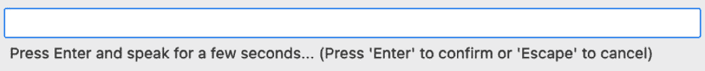

图 11.1 – 开始说话的提示

然后，您说几句话，这些话将被记录：

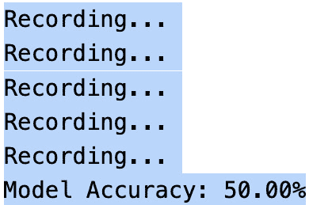

图 11.2 – 训练模型准确率

`RandomForestClassifier`，该模型之前被训练以区分正样本（语音）和负样本（非语音或背景噪音）。

本脚本的初级目标是展示预训练的语音分类模型与实时语音推理系统的无缝集成。您将被提示通过按下 *Enter* 键并说几秒钟话来提供音频输入，之后模型将预测输入是否包含人类语音或非语音元素：

```py
import joblib
# Save the trained model during training
joblib.dump(voice_classifier, "voice_classifier_model.pkl")
import numpy as np
import sounddevice as sd
from sklearn.ensemble import RandomForestClassifier
#from sklearn.externals import joblib # For model persistence
# Load the pre-trained model
voice_classifier = joblib.load("voice_classifier_model.pkl")
# Function to capture real-time audio
def capture_audio(duration=5, sampling_rate=44100):
    print("Recording...")
    audio_data = sd.rec(int(sampling_rate * duration), \
        samplerate=sampling_rate, channels=1, dtype='int16')
    sd.wait()
    return audio_data.flatten()
# Function to predict voice using the trained model
def predict_voice(audio_sample):
    prediction = voice_classifier.predict([audio_sample])
    return prediction[0]
# Main program for real-time voice classification
def real_time_voice_classification():
    while True:
        input("Press Enter and speak for a few seconds...")
    # Capture new audio
        new_audio_sample = capture_audio()
    # Predict if it's voice or non-voice
        result = predict_voice(new_audio_sample)
    if result == 1:
        print("Voice detected!")
    else:
        print("Non-voice detected.")
if __name__ == "__main__":
    real_time_voice_classification()
```

输出如下：

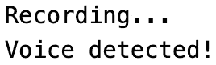

图 11.3 – 推理输出

以类似的方式，我们可以使用此模型来标注语音为男性或女性，以分析客户通话并了解目标客户。

我们已经看到了实时语音分类推理在众多场景中的重要性，包括语音激活的应用、安全系统和通信设备。通过加载预训练的模型，用户可以体验在现实世界情况下语音的即时和准确分类。

无论应用于增强无障碍功能、自动化语音命令或实施基于语音的安全协议，此脚本都是部署机器学习模型进行实时语音分类的实际示例。随着技术的不断进步，语音推理模型的无缝集成有助于推动各个领域用户友好和响应式应用的演变。

现在，让我们看看如何使用 OpenAI Whisper 模型进行音频转录。

# 使用 OpenAI Whisper 模型进行音频转录

在本节中，我们将看到如何使用 **OpenAI Whisper** 模型将音频文件转录成文本，然后使用 OpenAI **大型语言模型**（**LLM**）对音频转录进行标注。

**Whisper** 是由 OpenAI 开发的开源 ASR 模型。它在近 70 万小时的跨语言语音数据上进行了训练，并且能够将音频转录成近 100 种不同的语言。根据 OpenAI 的说法，Whisper “在英语语音识别方面接近人类水平的鲁棒性和准确性。”

在最近的一项基准研究中，Whisper 与其他开源 ASR 模型，如 wav2vec 2.0 和 Kaldi 进行了比较。研究发现，在包括对话 AI、电话、会议、视频和收益电话在内的五个不同用例中，Whisper 在准确性和速度方面均优于 wav2vec 2.0。

Whisper 还以其经济性、准确性和功能而闻名。它最适合音频到文本用例，并且不适合文本到音频或语音合成任务。

Whisper 模型可以作为 Python 库导入。另一种选择是使用在**Azure Machine Learning studio**模型目录中可用的 Whisper 模型。

现在我们来看看使用 Python 库通过 OpenAI Whisper ASR 进行音频转录的过程。确保指定音频文件的存在和可访问性对于成功转录至关重要。转录的文本可能存储在`text['text']`中，如`print`语句所示。

首先，我们需要安装 Whisper 模型，如*技术要求*部分所述。然后，我们导入 OpenAI Whisper 模型。

## 第 1 步 – 导入 Whisper 模型

让我们导入所需的 Python 库：

```py
import whisper
Import pytube
```

导入了`whisper`库，这是一个提供访问 OpenAI Whisper ASR 模型的库。同时导入了`pytube`库以下载 YouTube 视频。

## 第 2 步 – 加载基础 Whisper 模型

让我们加载基础 Whisper 模型：

```py
model = whisper.load_model("base")
```

使用`whisper.load_model`函数和`"base"`参数加载 Whisper 模型。这加载了 Whisper ASR 模型的基础版本。

让我们从 YouTube 视频下载音频流。尽管我们使用的是视频文件，但我们只关注 YouTube 视频的音频，并从中下载音频流。或者，您可以直接使用任何音频文件：

```py
#we are importing Pytube library
import pytube
#we are downloading YouTube video from YouTube link
video = "https://youtu.be/g8Q452PEXwY"
data = pytube.YouTube(video)
```

指定 YouTube 视频 URL。使用`pytube.YouTube`类，获取视频数据：

```py
# Converting and downloading as 'MP4' file
audio = data.streams.get_audio_only()
audio.download()
```

此代码利用`pytube`库从托管在 YouTube 等平台上的视频下载音频流。让我们来检查前面的代码片段：

+   `audio = data.streams.get_audio_only()`: 此行获取视频的音频流。它使用`get_audio_only()`方法获取只包含音频内容的流。

+   `audio.download()`: 一旦获取到音频流，此行将下载音频内容。下载以默认格式进行，通常是只包含音频数据的 MP4 文件。

总结来说，代码从视频中提取音频流，并将其下载为 MP4 文件，仅保留音频内容。

## 第 3 步 – 设置 FFmpeg

Whisper 旨在转录音频，但需要特定的格式进行处理。Whisper 处理音频所需的格式是 WAV 格式。Whisper 旨在以 WAV 格式转录音频，可能不支持其他格式。因此，需要由 Whisper 处理的音频数据应提供为 WAV 格式。FFmpeg 作为桥梁，将各种音频格式（如 MP3、WAV 或 AAC）转换为 Whisper 可以处理的格式。

例如，如果输入是 MP3 格式，FFmpeg 可以将其转换为 Whisper 适用的格式。Whisper 通常需要 WAV 格式的音频数据，因此 FFmpeg 可以在处理过程中将输入 MP3 文件转换为 WAV 格式。这种转换使得音频数据能够与 Whisper 模型的要求兼容。

没有这种转换，Whisper 将无法有效地处理音频。

在需要实时转录的场景中（例如流式传输**实时消息协议**（RTMP）数据），FFmpeg 有助于分割音频流。它将连续的音频分割成更小的块（例如，30 秒的段），这些块可以单独处理。然后，每个段被传递给 Whisper 进行转录：

```py
# Set the FFMPEG environment variable to the path of your ffmpeg executable
os.environ['PATH'] = '/<your_path>/audio-orchestrator-ffmpeg/bin:' + os.environ['PATH']
```

代码将 FFmpeg 环境变量设置为`ffmpeg`可执行文件的路径。这对于处理音频和视频文件是必要的。

## 第 4 步 – 使用 Whisper 模型转录 YouTube 音频

现在，让我们使用 Whisper 模型转录 YouTube 音频：

```py
model = whisper.load_model('base')
text = model.transcribe('Mel Spectrograms with Python and Librosa Audio Feature Extraction.mp4')
#printing the transcribe
text['text']
```

这里是输出结果：

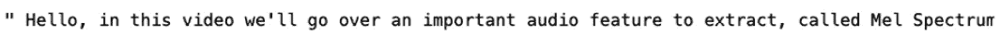

图 11.4 – 代码输出的片段

再次加载 Whisper 模型以确保它使用基础模型。使用音频文件的文件名作为参数调用模型的 transcribe 函数。使用`text['text']`打印出转录的文本。

注意

在`model.transcribe`中提供的文件名为`Mel Spectrograms with Python and Librosa Audio Feature Extraction.mp4`。请确保此文件存在且可访问，以便代码能够成功转录。

现在，让我们看看另一个代码示例，演示如何将音频文件转录成文本：

```py
model = whisper.load_model('base')
text = model.transcribe('/Users/<username>/PacktPublishing/DataLabeling/Ch11/customer_call_audio.m4a')
#printing the transcribe
text['text']
```

这里是输出结果：

```py
' Hello, I have not received the product yet. I am very disappointed. Are you going to replace if my product is damaged or missed? I will be happy if you replace with your product in case I miss the product due to incorrect shipping address.'
```

现在，让我们对从客户通话转录的文本执行情感分析以进行标记。

## 使用 Hugging Face transformers 对转录进行分类

现在，让我们使用 Hugging Face transformers 对之前客户通话音频转录的输出文本进行分类，并执行情感分析以对其进行标记。

以下代码片段使用 Hugging Face 的 transformers 库对给定文本进行情感分析。它首先导入必要的模块，然后从 Hugging Face 的 transformers 中加载一个预训练的情感分析管道。代码定义了一个表示对尚未收到的产品不满的示例文本。随后，将情感分析管道应用于对文本进行情感分类，并将结果通过打印到控制台显示。情感分析模型输出一个标签，表示情感，如正面或负面，以及一个置信度分数。

让我们导入 Python 库：

```py
from transformers import pipeline
# Load the sentiment analysis pipeline
sentiment_classifier = pipeline('sentiment-analysis')
# text for sentiment analysis
text="Hello, I have not received the product yet. I am very disappointed.are you going to replace if my product is damaged or missed.I will be happy if you replace with new product incase i missed the product die to incorrect shipping address"
# Perform sentiment analysis
result = sentiment_classifier(text)
# Display the result
print(result)
```

这里是输出：

```py
No model was supplied, defaulted to distilbert-base-uncased-finetuned-sst-2-english and revision af0f99b (https://huggingface.co/distilbert-base-uncased-finetuned-sst-2-english). Using a pipeline without specifying a model name and revision in production is not recommended.
[{'label': 'NEGATIVE', 'score': 0.9992625117301941}]
```

# 实践操作 - 使用 CNN 标注音频数据

在本节中，我们将了解如何使用 CNN 在音频数据上训练网络，并使用它来标注音频数据。

以下代码演示了使用 CNN 标注音频数据的过程。代码概述了如何使用 CNN 标注音频数据，特别是如何在猫和狗音频样本数据集上训练模型。目标是分类新的、未见过的音频数据为猫或狗。让我们使用猫和狗的样本音频数据来训练 CNN 模型。然后，我们将新的未见数据发送到模型以预测它是一只猫还是一只狗：

1.  `load_and_preprocess_data`函数。`load_and_preprocess_data`函数处理音频数据，将其转换为梅尔频谱图，并调整大小以适应模型。

1.  `train_test_split`，并将标签转换为独热编码。

1.  **创建神经网络模型**：使用 TensorFlow 和 Keras 创建一个 CNN 模型，包括卷积层、池化层和全连接层。

1.  **编译模型**：模型使用 Adam 优化器、分类交叉熵损失和准确率作为评估指标进行编译。

1.  **训练模型**：CNN 模型在指定数量的 epoch 上对训练数据进行训练。

1.  **评估模型的准确率**：在测试集上评估训练模型的准确率。

1.  **保存训练好的模型**：将训练好的模型保存以供将来使用。

1.  **测试新的音频文件**：最后，加载保存的模型，并处理一个新音频文件（在这种情况下，是一只猫的叫声），对其进行分类，并显示每个类别的概率和准确率。

总结来说，此代码提供了一个关于如何使用卷积神经网络（CNN）对音频数据进行标注的全面指南，从数据加载和预处理到模型训练、评估以及在新的音频样本上的预测。

让我们首先导入所有必需的 Python 模块：

```py
import os
import librosa
import numpy as np
import tensorflow as tf
from tensorflow.keras.layers import Input, Conv2D, MaxPooling2D, Flatten, Dense
from tensorflow.keras.models import Model
from tensorflow.keras.optimizers import Adam
from sklearn.model_selection import train_test_split
from tensorflow.keras.utils import to_categorical
from tensorflow.image import resize
from tensorflow.keras.models import load_model
```

**步骤 1：加载和预处理数据**：现在，让我们加载并预处理猫和狗的数据。该数据集的来源是[`www.kaggle.com/datasets/mmoreaux/audio-cats-and-dogs`](https://www.kaggle.com/datasets/mmoreaux/audio-cats-and-dogs)：

```py
# Define your folder structure
data_dir = '../cats_dogs/data/'
classes = ['cat', 'dog']
```

此代码为包含 `'cat'` 和 `'dog'` 类别的数据集建立文件夹结构，数据位于指定的目录 `'../cats_dogs/data/'` 中。接下来，让我们预处理数据：

```py
# define the function for Load and preprocess audio data
def load_and_preprocess_data(data_dir, classes, target_shape=(128, 128)):
data = []
labels = []
for i, class_name in enumerate(classes):
    class_dir = os.path.join(data_dir, class_name)
    for filename in os.listdir(class_dir):
        if filename.endswith('.wav'):
            file_path = os.path.join(class_dir, filename)
            audio_data, sample_rate = librosa.load(file_path, sr=None)
            # Perform preprocessing (e.g., convert to Mel spectrogram and resize)
            mel_spectrogram = \
                librosa.feature.melspectrogram( \
                    y=audio_data, sr=sample_rate)
            mel_spectrogram = resize( \
                np.expand_dims(mel_spectrogram, axis=-1), \
                target_shape)
            print(mel_spectrogram)
            data.append(mel_spectrogram)
        labels.append(i)
return np.array(data), np.array(labels)
```

此代码定义了一个名为 `load_and_preprocess_data` 的函数，用于从指定的目录加载和预处理音频数据。它遍历每个音频类别，读取 `.wav` 文件，并使用 Librosa 库将音频数据转换为梅尔频谱图。我们在 *第十章* 中学习了梅尔频谱图，在 *使用 Matplotlib 和 Librosa 可视化音频数据 – 频谱图* 可视化部分。

然后将梅尔频谱图调整到目标形状（128x128），然后将其附加到数据列表中，以及相应的类别标签。该函数返回预处理后的数据和标签作为 NumPy 数组。

`load_and_preprocess_data` 函数来加载数据并预处理。然后使用 `to_categorical` 函数将标签转换为独热编码。最后，使用 `train_test_split` 函数将数据按 80-20 的比例分为训练集和测试集，确保使用指定的随机种子具有可重复性：

```py
# Split data into training and testing sets
data, labels = load_and_preprocess_data(data_dir, classes)
labels = to_categorical(labels, num_classes=len(classes)) # Convert labels to one-hot encoding
X_train, X_test, y_train, y_test = train_test_split(data, \
    labels, test_size=0.2, random_state=42)
```

**步骤 3：创建神经网络模型**：此代码定义了一个用于音频分类的神经网络模型。模型架构包括用于特征提取的卷积层和最大池化层，随后是一个展平层。然后是一个具有 ReLU 激活的密集层，用于进一步的特征处理。最终输出层使用 softmax 激活来产生类别概率。该模型使用 Keras 功能 API 构建，指定了输入和输出层，并准备好在提供的数据上进行训练：

```py
# Create a neural network model
input_shape = X_train[0].shape
input_layer = Input(shape=input_shape)
x = Conv2D(32, (3, 3), activation='relu')(input_layer)
x = MaxPooling2D((2, 2))(x)
x = Conv2D(64, (3, 3), activation='relu')(x)
x = MaxPooling2D((2, 2))(x)
x = Flatten()(x)
x = Dense(64, activation='relu')(x)
output_layer = Dense(len(classes), activation='softmax')(x)
model = Model(input_layer, output_layer)
```

`0.001`，交叉熵损失函数（适用于多类分类），准确度作为评估指标。`model.summary()` 命令提供了模型架构的简要概述，包括参数数量和每层的结构：

```py
# Compile the model
model.compile(optimizer=Adam(learning_rate=0.001), \
    loss='categorical_crossentropy', metrics=['accuracy'])
model.summary()
```

这里是输出：

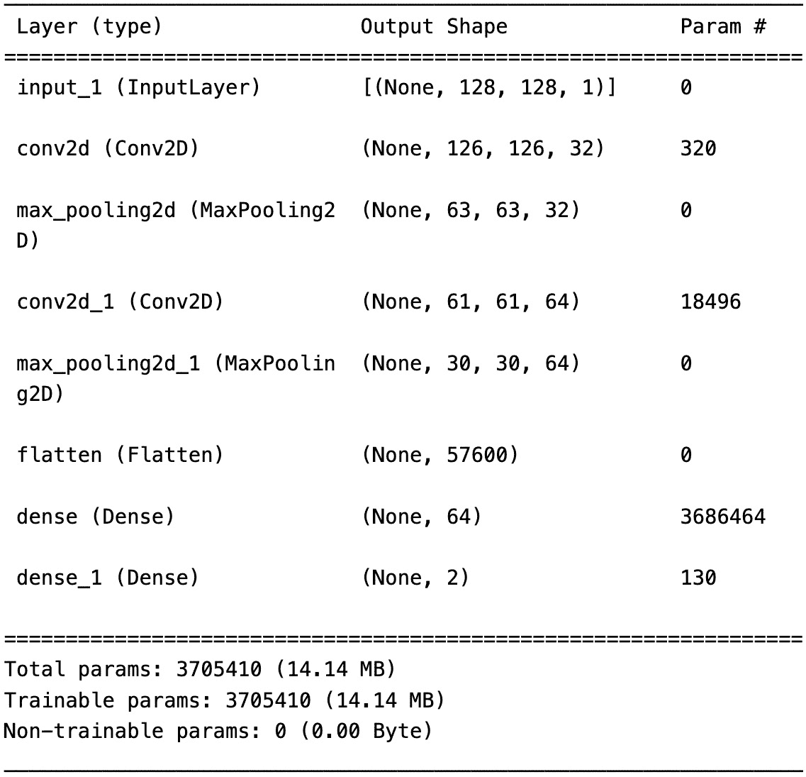

图 11.5 – 模型摘要

`X_train` 和 `y_train`) 进行 `20` 个周期训练，批大小为 `32`。验证数据 (`X_test` 和 `y_test`) 用于在训练期间评估模型性能：

```py
# Train the model
model.fit(X_train, y_train, epochs=20, batch_size=32, \
    validation_data=(X_test, y_test))
```

**步骤 6：测试模型的准确度**：在训练完成后，它计算模型在单独的测试集上的测试准确度，并打印准确度分数，为模型在分类音频数据方面的有效性提供见解：

```py
#Test  the accuracy of model
test_accuracy=model.evaluate(X_test,y_test,verbose=0)
print(test_accuracy[1])
```

这里是输出：

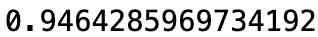

图 11.6 – 模型的准确度

**步骤 7：保存** **训练好的模型**：

```py
# Save the model
model.save('audio_classification_model.h5')
```

**步骤 8：测试新的音频文件**：让我们使用这个保存的模型对新的音频文件进行分类并标记：

```py
# Load the saved model
model = load_model('audio_classification_model.h5')
# Define the target shape for input spectrograms
target_shape = (128, 128)
# Define your class labels
classes = ['cat', 'dog']
# Function to preprocess and classify an audio file
def test_audio(file_path, model):
# Load and preprocess the audio file
audio_data, sample_rate = librosa.load(file_path, sr=None)
mel_spectrogram = librosa.feature.melspectrogram( \
    y=audio_data, sr=sample_rate)
mel_spectrogram = resize(np.expand_dims(mel_spectrogram, \
    axis=-1), target_shape)
mel_spectrogram = tf.reshape(mel_spectrogram, (1,) + target_shape + (1,))
```

这段代码定义了一个函数，`test_audio`，用于预处理和分类音频文件。它使用 Librosa 从指定的文件路径加载并预处理音频数据，生成梅尔频谱图。然后，频谱图被调整大小和形状以匹配模型期望的输入维度。此函数旨在为使用神经网络模型进行分类准备音频数据，提供了一种将训练好的模型应用于新音频文件进行预测的简化方法。

现在，让我们通过添加噪声来操作`./cat-meow-14536.mp3`)。使用`test_audio`函数预处理音频文件，并获取类别概率和预测的类别索引。`model.predict`方法生成预测，类别概率从结果中提取。预测的类别索引是通过识别概率最高的类别来确定的。这个过程展示了如何利用训练好的模型来分类新的音频数据，为测试音频文件的内容提供了见解：

```py
# Make predictions
predictions = model.predict(mel_spectrogram)
# Get the class probabilities
class_probabilities = predictions[0]
# Get the predicted class index
predicted_class_index = np.argmax(class_probabilities)
return class_probabilities, predicted_class_index
# Test an audio filetest_audio_file = '../Ch10/cat-meow-14536.mp3'
class_probabilities, predicted_class_index = test_audio( \
    test_audio_file, model)
```

以下代码片段遍历模型中的所有类别，并根据音频文件分类打印每个类别的预测概率。对于每个类别，它显示类别标签及其对应的概率，提供了模型对将音频文件分配给每个特定类别的置信度的全面视图：

```py
# Display results for all classes
for i, class_label in enumerate(classes):
    probability = class_probabilities[i]
    print(f'Class: {class_label}, Probability: {probability:.4f}')
```

以下代码计算并显示音频文件分类的预测类别和准确率。它使用具有最高概率的索引识别预测类别，从结果中检索相应的类别标签和准确率，然后打印预测的类别及其相关的准确率。这为给定音频文件和分类的置信水平提供了一个简洁的总结。计算并显示预测类别和准确率：

```py
predicted_class = classes[predicted_class_index]
accuracy = class_probabilities[predicted_class_index]
print(f'The audio is labeled Spectrogram Visualization
as: {predicted_class}')
print(f'Accuracy: {accuracy:.4f}')
```

这是我们的输出：

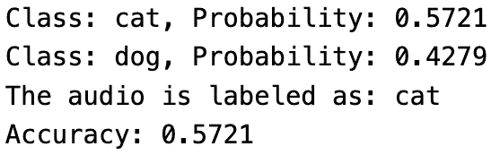

图 11.7 – 显示模型概率和准确率的输出

我们已经看到了如何使用机器学习转录音频数据。现在，让我们看看如何进行音频数据增强并使用增强数据训练模型。最后，我们将比较带有和不带有增强数据的准确率。

# 探索音频数据增强

让我们看看如何使用 NumPy 添加噪声来操作音频数据。

在训练过程中向音频数据添加噪声有助于模型在现实场景中变得更加鲁棒，在这些场景中可能会有背景噪声或干扰。通过让模型接触各种噪声条件，它学会了更好地泛化。

在音频数据中添加噪声可以防止模型记住训练数据中的特定模式。这促使模型关注更通用的特征，这可能导致在未见数据上的更好泛化：

```py
import numpy as np
def add_noise(data, noise_factor):
    noise = np.random.randn(len(data))
    augmented_data = data + noise_factor * noise
    # Cast back to same data type
    augmented_data = augmented_data.astype(type(data[0]))
    return augmented_data
```

这段代码定义了一个名为`add_noise`的函数，该函数向输入数据数组添加随机噪声。噪声水平由`noise_factor`参数控制。该函数使用 NumPy 生成随机噪声，将其添加到原始数据中，然后返回增强后的数据。为了确保数据类型的一致性，增强后的数据被转换回与原始数据数组中的元素相同的数据类型。此函数可用于数据增强，这是一种在机器学习中常用的技术，通过在训练数据中引入变化来增强模型的鲁棒性。

让我们使用样本音频数据来测试这个函数，如下所示：

```py
# Sample audio data
sample_data = np.array([0.1, 0.2, 0.3, 0.4, 0.5])
# Sample noise factor
sample_noise_factor = 0.05
# Apply augmentation
augmented_data = add_noise(sample_data, sample_noise_factor)
# Print the original and augmented data
print("Original Data:", sample_data)
print("Augmented Data:", augmented_data)
```

这里是输出结果：

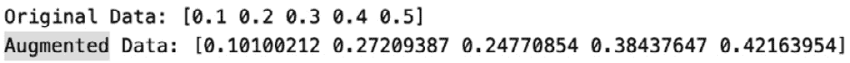

图 11.8 – 增强数据的表示

现在，让我们使用数据增强重新训练我们的 CNN 模型，用于分类我们之前在*动手实践 – 使用 CNN 标记音频数据*部分看到的狗和猫的声音：

```py
# Load and preprocess audio data
def load_and_preprocess_data(data_dir, classes, target_shape=(128, 128)):
    data = []
    labels = []
    noise_factor = 0.05
    for i, class_name in enumerate(classes):
    class_dir = os.path.join(data_dir, class_name)
    for filename in os.listdir(class_dir):
    if filename.endswith('.wav'):
    file_path = os.path.join(class_dir, filename)
    audio_data, sample_rate = librosa.load(file_path, sr=None)
    # Apply noise manipulation
    noise = np.random.randn(len(audio_data))
    augmented_data = audio_data + noise_factor * noise
    augmented_data = augmented_data.astype(type(audio_data[0]))
    # Perform preprocessing (e.g., convert to Mel spectrogram and resize)
    mel_spectrogram = librosa.feature.melspectrogram( \
        y=augmented_data, sr=sample_rate)
    mel_spectrogram = resize( \
        np.expand_dims(mel_spectrogram, axis=-1), target_shape)
    print(mel_spectrogram)
    data.append(mel_spectrogram)
    labels.append(i)
    return np.array(data), np.array(labels)
```

在这段代码中，我们在频谱转换之前向音频数据添加随机噪声`(noise_factor * noise)`，这有助于通过在训练过程中暴露模型于同一类别的不同实例来提高模型的鲁棒性：

```py
test_accuracy=model.evaluate(X_test,y_test,verbose=0)
print(test_accuracy[1])
```

这里是输出结果：

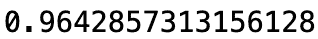

图 11.9 – 模型的准确率

通过使用这种噪声增强的音频数据，模型准确率从 0.946 提升到 0.964。根据数据的不同，我们可以应用数据增强并测试准确率，以决定是否需要数据增强。

让我们看看三种应用于原始音频文件的数据增强技术——时间拉伸、音高转换和动态范围压缩。

以下 Python 脚本使用 librosa 库进行音频处理，加载一个作为增强基准的初始音频文件。随后，定义了独立应用每种增强技术的函数。时间拉伸改变音频的时间长度，音高转换修改音高而不影响速度，动态范围压缩调整音量动态。

使用 Matplotlib 将增强的波形与原始波形并排展示。这种可视化有助于理解每种增强技术对音频数据的影响。通过这个脚本，您将了解音频增强的实际实现，这对于创建多样化和鲁棒的机器学习模型数据集是一项宝贵的实践。

随着音频数据标记在各个应用中变得越来越重要，掌握增强的艺术可以确保生成全面的数据集，从而提高机器学习模型的有效性。无论应用于语音识别、声音分类还是语音启用应用，音频增强都是一种强大的技术，用于精炼和丰富音频数据集：

```py
import librosa
import librosa.display
import numpy as np
import matplotlib.pyplot as plt
from scipy.io.wavfile import write
# Load the audio file
audio_file_path = "../ch10/cats_dogs/cat_1.wav"
y, sr = librosa.load(audio_file_path)
# Function for time stretching augmentation
def time_stretching(y, rate):
    return librosa.effects.time_stretch(y, rate=rate)
# Function for pitch shifting augmentation
def pitch_shifting(y, sr, pitch_factor):
    return librosa.effects.pitch_shift(y, sr=sr, n_steps=pitch_factor)
# Function for dynamic range compression augmentation
def dynamic_range_compression(y, compression_factor):
    return y * compression_factor
# Apply dynamic range compression augmentation
compression_factor = 0.5 # Adjust as needed
y_compressed = dynamic_range_compression(y, compression_factor)
# Apply time stretching augmentation
y_stretched = time_stretching(y, rate=1.5)
# Apply pitch shifting augmentation
y_pitch_shifted = pitch_shifting(y, sr=sr, pitch_factor=3)
# Display the original and augmented waveforms
plt.figure(figsize=(12, 8))
plt.subplot(4, 1, 1)
librosa.display.waveshow(y, sr=sr)
plt.title('Original Waveform')
plt.subplot(4, 1, 2)
librosa.display.waveshow(y_stretched, sr=sr)
plt.title('Time Stretched Waveform')
plt.subplot(4, 1, 3)
librosa.display.waveshow(y_pitch_shifted, sr=sr)
plt.title('Pitch Shifted Waveform')
plt.subplot(4, 1, 4)
librosa.display.waveshow(y_compressed, sr=sr)
plt.title('Dynamic Range Compressed Waveform')
plt.tight_layout()
plt.show()
```

这里是输出结果：

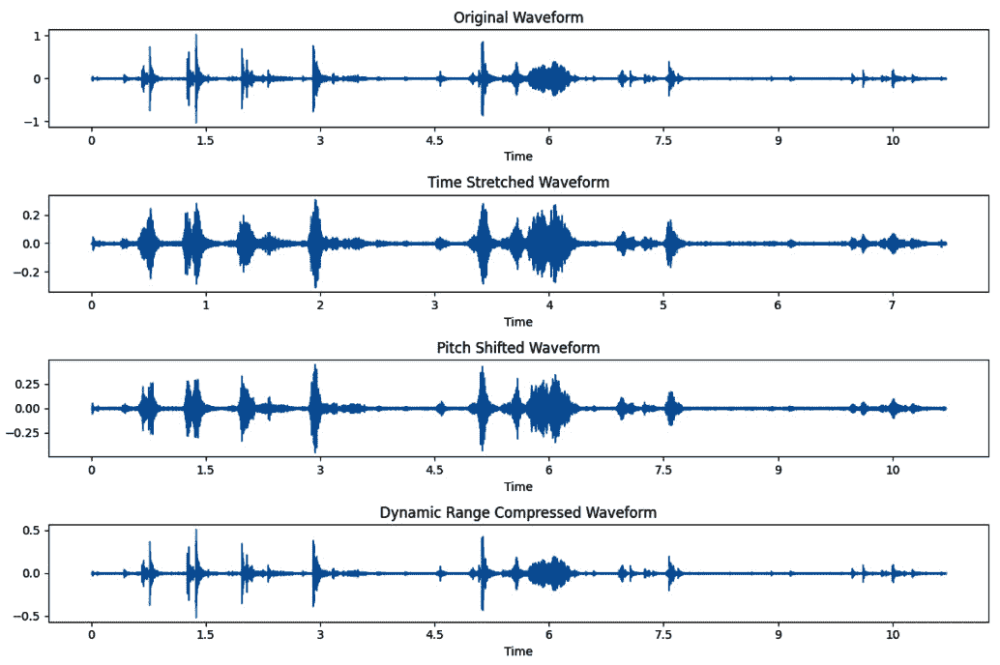

图 11.10 – 数据增强技术 – 时间拉伸、音调转换和动态范围压缩

现在，让我们进入下一节，探讨音频数据标注的另一个有趣话题。

# 介绍 Azure 认知服务 – 语音服务

Azure 认知服务提供了一套全面的语音相关服务，使开发者能够将强大的语音功能集成到他们的应用程序中。Azure AI 中可用的关键语音服务包括以下内容：

+   **语音到文本（语音识别）**：这项服务将口语语言转换为书面文本，使应用程序能够转录音频内容，如语音命令、访谈或对话。

+   **语音翻译**：这种服务可以将口语语言实时翻译成另一种语言，促进多语言沟通。对于需要为全球受众进行语言翻译的应用程序，这项服务非常有价值。

这些 Azure 认知服务语音能力适用于各种应用，从辅助功能、语音启用应用程序到多语言沟通和个性化用户体验。开发者可以利用这些服务通过无缝集成语音相关功能来增强其应用程序的功能性和可访问性。

## 创建 Azure 语音服务

让我们使用 Azure 门户创建一个语音服务，如下所示。

访问 Azure 门户 [`portal.azure.com`](https://portal.azure.com)，搜索 `speech service`，然后创建一个新的服务。

如下所示，输入项目详情，例如您的资源组语音服务名称和区域详情。然后，点击**审查 + 创建**按钮在 Azure 环境中创建语音服务。

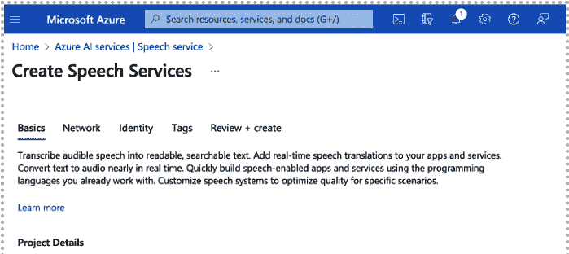

图 11.11 – 创建语音服务

现在，您的 Azure 语音服务已部署，您可以通过点击部署屏幕上的**转到资源**按钮访问该语音服务资源。然后，在语音服务资源屏幕上，点击**转到语音工作室**。在**语音工作室**中，您可以看到各种语音到文本字幕、通话后转录和分析以及实时聊天头像等服务，如图下所示。


图 11.12 – 语音工作室

## 语音转文本

现在，让我们尝试使用语音转文本服务。如图下所示，您可以将音频文件拖放到窗口中或上传它，并使用麦克风录制音频。您可以在右侧窗口中看到上传音频文件的相应**文本**或**JSON**标签，如图下所示。

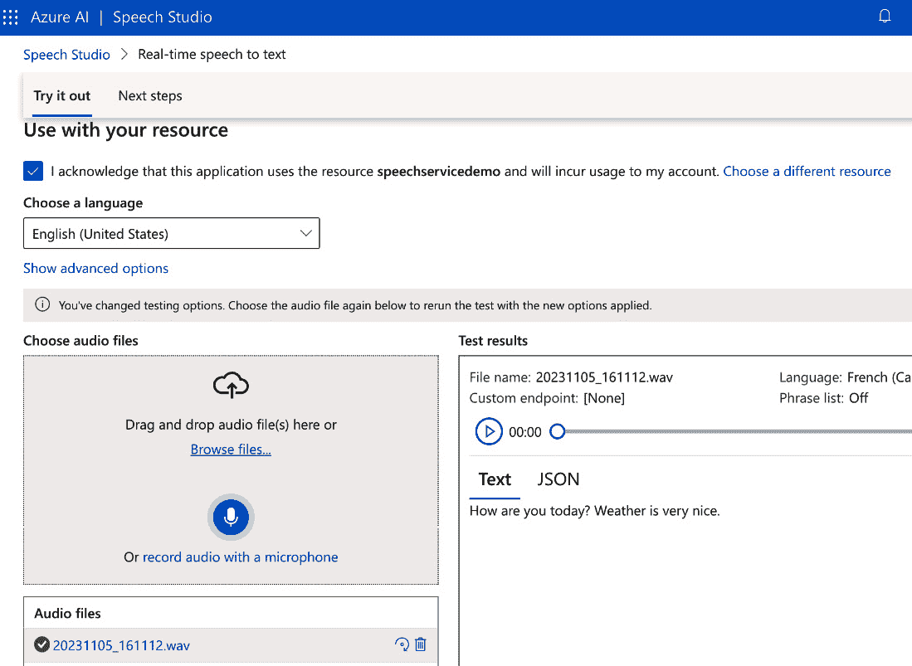

图 11.13 – 实时语音转文本

## 语音翻译

现在，让我们看看如何进行语音翻译。在接下来的屏幕上，我们正在将英语翻译成法语。让我们选择一种口语语言和目标语言。

然后，用英语说话并使用麦克风录制音频。右侧窗口中显示了翻译成法语的文本，如下面的截图所示。

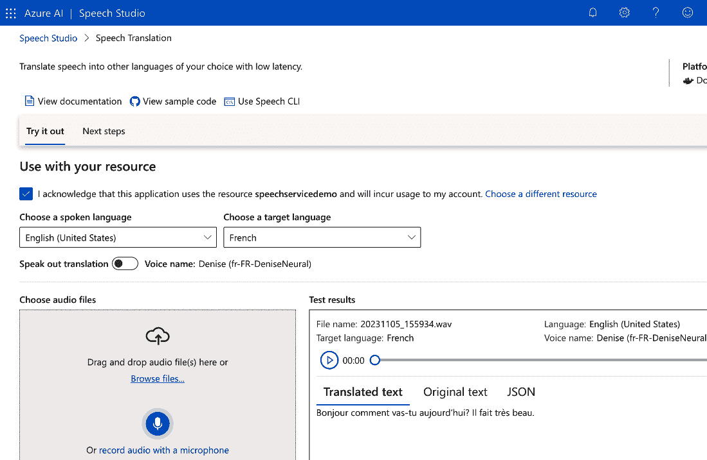

图 11.14 – 翻译文本测试结果

我们还可以在“原文”标签页上看到原始文本，如下面的截图所示：

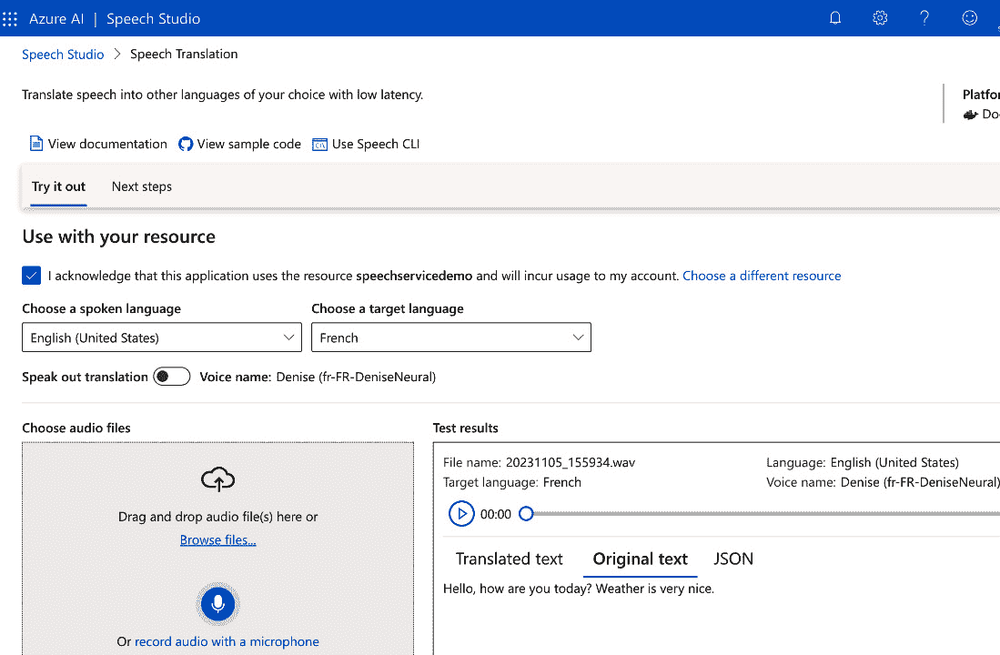

图 11.15 – 测试结果中的原文

我们已经看到了如何使用 Azure 语音服务从语音转录到文本，以及从英语翻译到法语。除此之外，在 Azure 语音工作室中还有许多其他 Azure 语音服务，您可以根据需求应用。

# 摘要

在本章中，我们探讨了处理音频数据的三个关键部分，深入了解了这一综合过程。旅程始于音频数据的上传，利用 Whisper 模型进行转录，随后使用 OpenAI 对转录进行标注。在此之后，我们进入了创建频谱图并使用卷积神经网络（CNN）对这些视觉表示进行标注的阶段，通过高级神经网络架构揭示声音的复杂细节。然后，章节深入探讨了使用增强数据的音频标注，从而增强了数据集以改善模型训练。最后，我们看到了 Azure 语音服务在语音到文本和语音翻译方面的应用。这种多方面的方法使您能够全面了解音频数据处理，从转录到视觉表示分析以及增强标注，培养在音频数据标注技术方面的全面技能集。

在下一章和最后一章中，我们将探讨用于数据标注的不同实用工具。
