# 第十二章：实战：探索数据标注工具

在机器学习和人工智能的动态环境中，有效的数据标注在提升模型性能和促进准确预测中起着关键作用。当我们深入研究图像、文本、视频和音频标注的复杂性时，我们发现自己沉浸在 **Azure Machine Learning** 服务及其强大的 **数据标注**功能的世界中。本章作为利用 Azure Machine Learning 数据标注工具创建精确和有意义的标注的全面指南。

我们还将查看另一个开源数据标注工具 **Label Studio**，用于标注图像、视频和文本数据。Label Studio 使数据科学家、开发人员和领域专家能够协作标注各种数据类型，如图像、视频和文本。

我们还将展示如何使用 **pyOpenAnnotate** 标注数据，最后，我们将探索 **计算机视觉标注工具**（**CVAT**），这是一个开源的、协作的数据标注平台，用于简化跨各种数据类型的标注过程。

本章我们将涵盖以下主题：

+   使用 Azure Machine Learning 标注图像、文本和音频数据

+   使用 Label Studio 标注图像、视频和文本数据

+   使用 pyOpenAnnotate 和 CVAT 标注图像和视频数据

加入我们，我们将一起探索使用 Azure Machine Learning 进行数据标注的复杂性，让您能够充分利用标注数据集，推动您的机器学习事业达到新的高度。

# 技术要求

让我们了解我们将讨论的每个工具所需的前提条件，以便您在本章中跟随。

## Azure Machine Learning 数据标注

Azure Machine Learning 提供了标注工具，可以快速准备数据用于机器学习项目。让我们按照以下步骤创建 Azure 订阅和 Azure Machine Learning 工作区：

+   **Azure 订阅**: 您可以在 [`azure.microsoft.com/en-us/free`](https://azure.microsoft.com/en-us/free) 创建免费的 Azure 订阅。

+   **Azure Machine Learning 工作区**: 一旦您的 Azure 订阅准备就绪，您可以在该订阅中创建 Azure Machine Learning 工作区。

## Label Studio

使用您的 Python 编辑器安装 `label-studio` Python 库：

```py
%pip install label-studio
```

然后，使用以下 shell 命令启动 Label Studio 开发服务器：

```py
!label-studio start
```

## pyOpenAnnotate

pyOpenAnnotate 是一个简单的工具，它帮助使用 OpenCV 标注和注释图像和视频。

让我们使用以下 Python 编辑器安装此工具：

```py
%pip install pyOpenAnnotate
```

本章中使用的数据集和代码可在 GitHub 上找到：

+   **数据集**: [`github.com/PacktPublishing/Data-Labeling-in-Machine-Learning-with-Python/tree/main/datasets/Ch12`](https://github.com/PacktPublishing/Data-Labeling-in-Machine-Learning-with-Python/tree/main/datasets/Ch12)

+   **代码**：[`github.com/PacktPublishing/Data-Labeling-in-Machine-Learning-with-Python/tree/main/code/Ch12`](https://github.com/PacktPublishing/Data-Labeling-in-Machine-Learning-with-Python/tree/main/code/Ch12)

# 使用 Azure Machine Learning 进行数据标注

随着对能够理解多种数据类型的复杂模型的需求不断增加，准确标注的重要性不容忽视。Azure Machine Learning 提供了一种强大的解决方案，提供了一个旨在简化图像、文本和音频标注过程的标注界面。Azure Machine Learning 的数据标注能力简化了创建、管理和监控数据标注项目的过程，并使数据科学家、领域专家和标注者之间的协作变得无缝。

让我们来看看使用 Azure Machine Learning 进行数据标注的好处。

## 使用 Azure Machine Learning 进行数据标注的好处

数据标注用于训练机器学习模型，有助于提高这些模型的准确性。Azure Machine Learning 数据标注工具可用于创建图像、文本和音频标注项目。

Azure Machine Learning 数据标注工具提供了一种能力，可以在工作室网页体验中无缝地管理和监控标注项目，并减少离线标注数据的来回过程。

在 Azure Machine Learning 数据标注项目中标注数据后，可以使用项目中的**导出**选项将标注数据导出到 Azure Blob 存储。从那里，这些标注数据可以作为数据集集成到 Azure Machine Learning 管道中，用于训练机器学习模型。

使用其他开源工具（如 Label Studio 和 pyOpenAnnotate）在本地进行标注的数据也可以通过从本地文件创建数据集的方式与 Azure Machine Learning 集成。

让我们看看如何创建一个标注项目，如何上传数据，如何创建一个标注任务，以及如何使用 Azure Machine Learning 数据标注工具管理和监控标注项目。

## 使用 Azure Machine Learning 进行数据标注的步骤

这里是使用 Azure Machine Learning 数据标注工具创建图像、文本和音频标注项目的步骤概述：

1.  **创建一个标注项目**：登录 Azure Machine Learning 并创建一个新的标注项目。您可以选择创建图像、文本或音频标注项目。

1.  **为您的数据创建一个标注任务**：您可以选择创建分类、目标检测、实例分割或语义分割任务。

1.  **上传数据**：将您想要标注的数据上传到您的标注项目中。您可以从本地机器或云存储账户上传数据。

1.  **标记您的数据**：使用标记工具来标记您的数据。在机器学习辅助数据标记的情况下，可能会触发机器学习算法来协助数据标记任务。在手动标记了一些数据之后，机器学习算法会自动将屏幕上相似图像分组，并带有建议的标签名称。

1.  **管理和监控您的标记项目**：在工作室网页体验中监控您的标记项目和工作进度。您还可以将您的标记数据导出为 Azure 机器学习数据集。

在以下章节中，我们将讨论使用 Azure 机器学习进行图像、文本和音频数据标记。

## 使用 Azure 机器学习进行图像数据标记

Azure 机器学习是一个领先的机器学习和人工智能平台，旨在构建和部署机器学习和人工智能应用程序。数据科学家、机器学习工程师和软件工程师可以在他们的日常工作中使用它进行模型训练、部署和管理机器学习项目生命周期。

准备好高质量的数据对于任何机器学习项目都至关重要。Azure 机器学习提供了准备用于训练的标记数据的工具。让我们首先看看如何使用 Azure 机器学习标记图像。

Azure 机器学习可以用于大规模标记图像并自动化数据标记过程。我们将看到以下图像的简单图像数据标记。我们将使用标签 `man` 和 `bike` 来标记这张图像。这张图像可在 *技术要求* 部分指定的 GitHub 路径中的 `Datasets` 文件夹中找到：


图 12.1 – 骑自行车的男子图像

让我们通过以下步骤使用 Azure 机器学习标记图像。

### 步骤 1 – 创建 Azure 机器学习工作区

在创建标记项目之前，如果您尚未创建，则需要按照 *技术要求* 部分所述创建一个 Azure 机器学习工作区。

前往 [portal.azure.com](https://portal.azure.com)。在 **Azure 服务** 下，您将看到 **创建资源** 选项。点击 **+ 创建资源**，如图下截图所示：


图 12.2 – 创建资源

然后，在搜索框中的以下 `azure machine learning`。点击 **Azure Machine Learning**，创建一个 Azure 机器学习服务，并按照提示输入其名称。

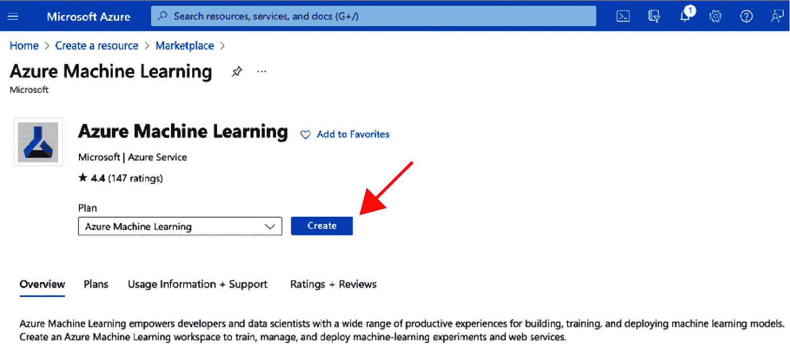

图 12.3 – 从市场创建 Azure 机器学习服务

然后，点击您创建的 Azure 机器学习工作区。在以下截图中，您可以看到 Azure 机器学习工作区的名称为 `azuremllabelling`：

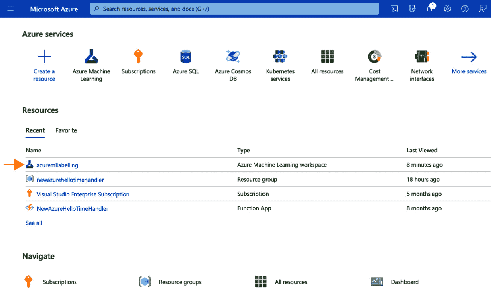

图 12.4 – Azure 服务

当您点击您的 Azure 机器学习工作区名称`azuremllabelling`时，您将看到以下屏幕。通过点击蓝色的**启动** **工作室**按钮来启动 Azure 机器学习工作室：

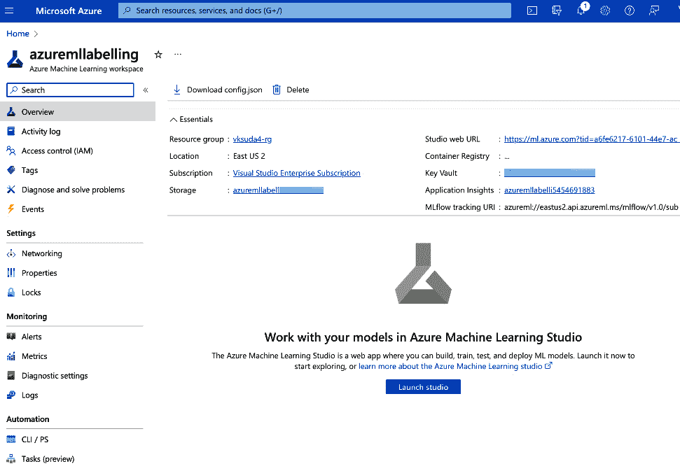

图 12.5 – Azure 机器学习工作区

### 第 2 步 – 创建数据标注项目

我们想创建一个数据标注项目，以便我们可以上传图像并标注它们或分配给标注员并有效地管理工作流程。

在您的 Azure 机器学习工作室中，在左侧的**管理**下，您将看到一个**数据标注**选项；点击此选项。

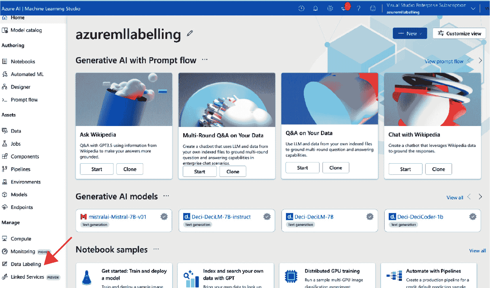

图 12.6 – Azure ML 工作室

为您的数据标注项目输入一个名称，并选择**媒体类型**为**图像**。您还需要从五个不同的图像标注类型选项中选择一个**标注任务类型**选项，如图*图 12.7*所示。

根据您的场景，选择一个适合您需求的标注任务类型：

+   如果您想从选项列表中为图像标注一个类别，请选择**图像分类多类**。

+   如果您想从选项列表中为图像标注多个类别，请选择`狗`和`白天`标签。

+   如果您想为图像中的每个对象标注一个类别和边界框，请选择**对象识别（边界框**）。

+   如果您想为图像中的每个对象标注一个类别和多边形轮廓，请选择**多边形（实例分割**）。

+   如果您想为图像中的每个像素标注一个类别和掩码，请选择**语义分割（预览**）。

输入项目名称`Image_data_labeling_project`。选择**对象识别（边界框**）标注任务类型，如图所示：

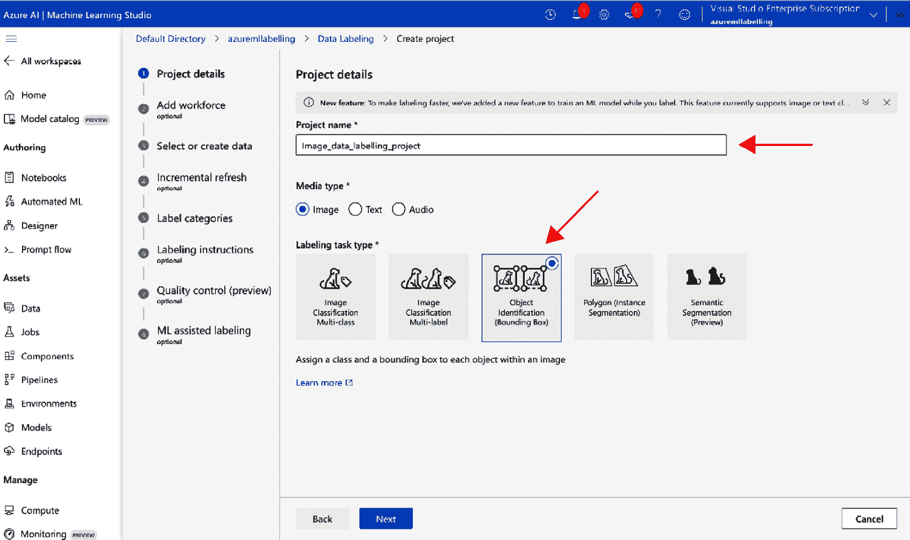

图 12.7 – 选择标注任务类型

在输入项目详情后，下一步是**添加人力**，在这个例子中我们可以跳过这一步。只有当您想从 Azure Marketplace 添加任何供应商或标注公司到这个标注项目时，这一步才是必需的。

### 第 3 步 – 上传您的数据

有两种创建数据资产的方法。您可以通过从 Azure Blob 存储上传文件来创建数据资产，或者您可以直接通过上传本地文件来创建数据资产。

您可以在[`learn.microsoft.com/en-us/azure/machine-learning/how-to-create-image-labeling-projects?view=azureml-api-2#specify-the-data-to-label`](https://learn.microsoft.com/en-us/azure/machine-learning/how-to-create-image-labeling-projects?view=azureml-api-2#specify-the-data-to-label)找到从 Azure Blob 存储或通过上传本地文件创建数据资产的详细步骤。

要上传数据，首先，让我们创建一个名为`bike_riding_man`的数据资产，如图所示：

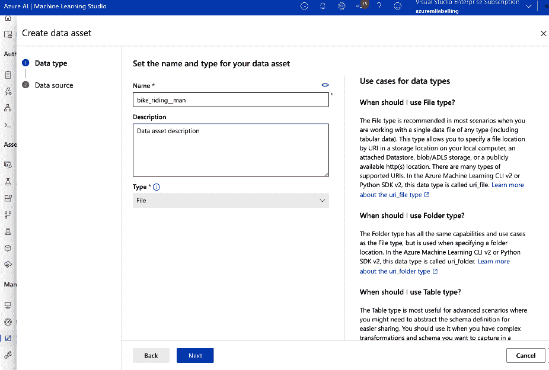

图 12.8 – 创建数据资产

接下来，选择数据源，并使用以下两种选项之一创建数据资产。

#### 选项 1 – 从 Azure Blob 存储中的文件创建数据资产

使用 Azure 数据存储生成数据资产。虽然本地文件上传很常见，但 Azure 存储资源管理器提供了更高效的方法来传输大型数据资产。它被推荐作为文件移动的默认工具。

对于数据源，选择**从 Azure 存储**以从 Azure Blob 存储上传文件并创建数据资产。

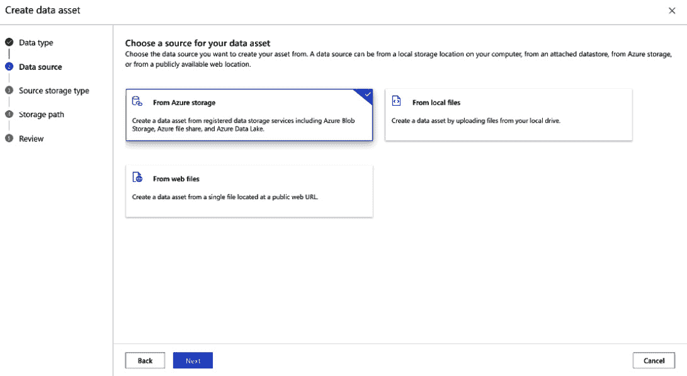

图 12.9 – 从 Azure Blob 存储创建数据资产

#### 选项 2 – 从您的本地系统上的文件创建数据资产

您可以从本地系统上传文件并创建数据资产，如下面的屏幕截图所示：

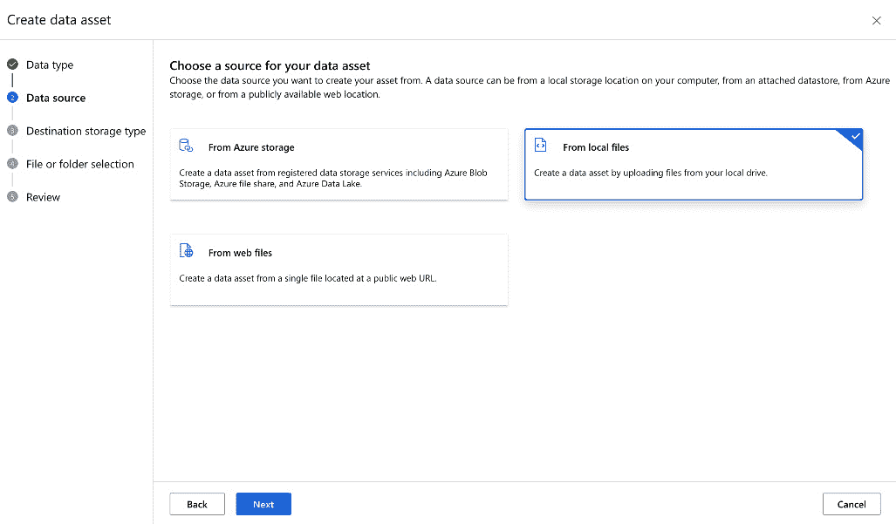

图 12.10 – 从本地文件创建数据资产

对于这个示例，我已从本地文件系统上传数据作为数据资产大小较小且可在本地系统上使用。

### 步骤 4 – 标记图像数据

现在，选择我们在上一步创建的`bike_riding_man`数据资产：

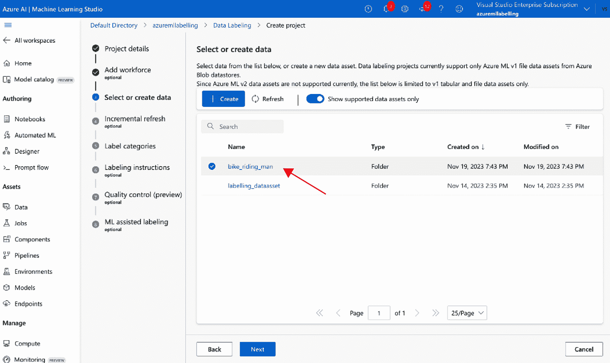

图 12.11 – 选择数据资产

选择数据资产后，点击**下一步**。**增量刷新**步骤是可选的。如果我们想自动刷新标记项目中的新数据，则需要这一步。对于这个示例，让我们跳过这个可选步骤，并再次点击**下一步**。

在这个示例中，您将看到`Bike`和`person`。

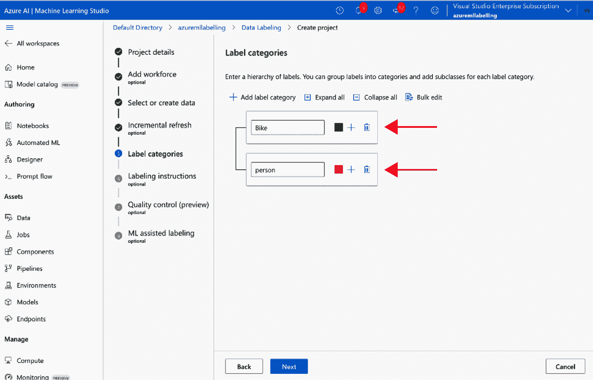

图 12.12 – 添加标签类别

添加类别后，点击**下一步**。您将进入**标记说明**页面。让我们跳过这个可选步骤，并再次点击**下一步**。现在您将进入**质量控制（预览）**页面。目前这处于预览状态。它用于将标签发送给多个标记者以获得更准确的标签。通过点击**下一步**跳过。现在您将进入**机器辅助** **标记**页面。

这一步是可选的。如果您想训练一个模型来预先标记数据，则可以使用此功能，但请注意，这会产生额外的计算成本。

如果启用了**机器辅助标记**，则在手动标记配置数量的项目后，机器模型将自动标记剩余的项目，并提供供人工审查的建议。

手动标记项目数量以启动机器辅助标记的阈值不是固定的，并且在不同标记项目之间可能会有很大差异。在某些情况下，在手动标记约 300 个项目后，可能会出现预先标记或聚类任务。这个阈值取决于您的数据集与机器模型已训练的数据集的相似程度。

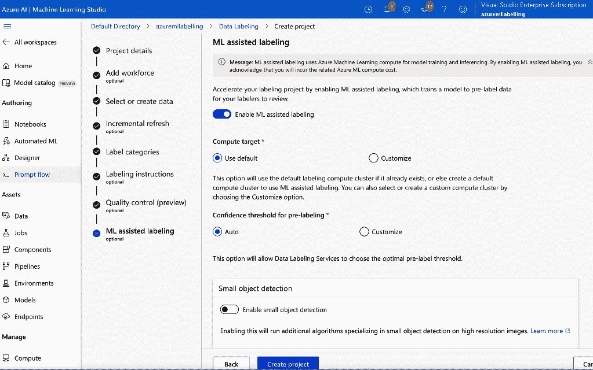

图 12.13 – 机器辅助标记

最后，点击**Image_data_labeling_project**，在**数据** **标注**页上已创建。

点击项目，它将打开下一个屏幕。点击**标注数据**以开始标注您上传的数据：


图 12.14 – 标注数据

当您点击**标注数据**时，它将显示您上传的图片，现在您可以开始标注这些图片。

#### 标注人物

选择`person`标签，然后在图片中为人物创建边界框：

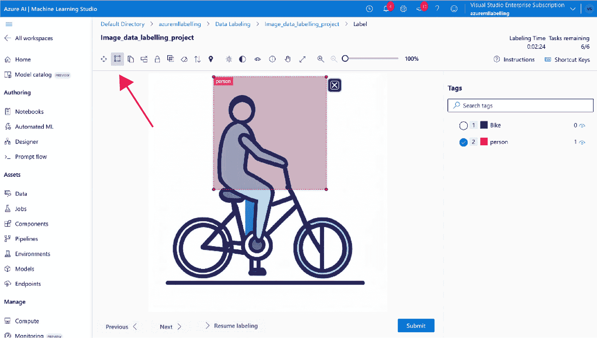

图 12.15 – 标注人物

#### 标注自行车

类似地，选择`Bike`标签，在自行车周围绘制边界框进行标注，然后点击**提交**按钮。这将带您到下一张图片。您可以为所有图片继续此过程。您可以使用此屏幕上的**上一页**和**下一页**按钮导航到图片。

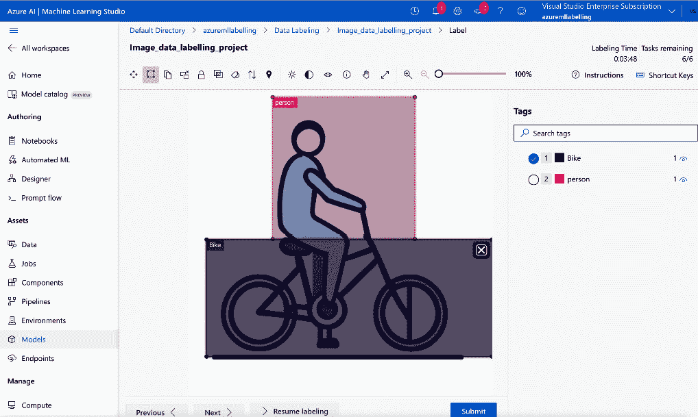

图 12.16 – 标注自行车

类似地，您可以标注所有其他图片并点击**提交**。所有由标注者标注的图片将在仪表板下的**复查标签**中显示，如下面的截图所示，在此处，审阅者可以通过点击**批准**按钮来审查和批准这些标签：

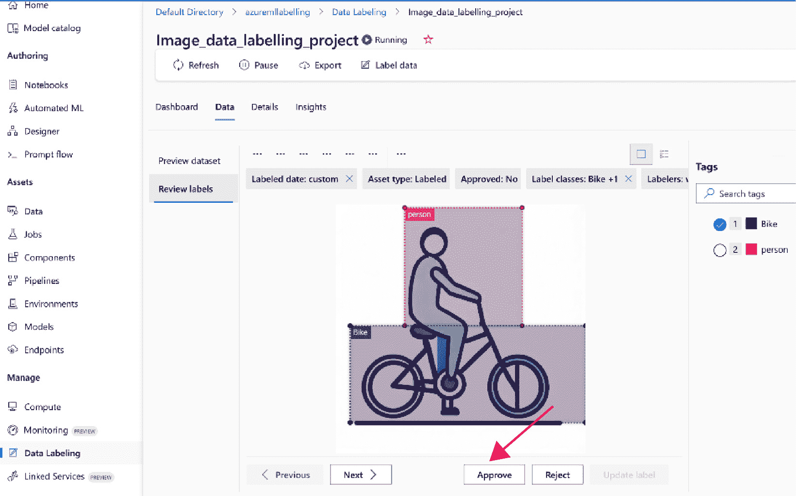

图 12.17 – 复查标签

最后，您可以使用**详情**标签页上的**标签导出**选项导出标注数据，如下面的截图所示，并在机器学习实验中用于训练：

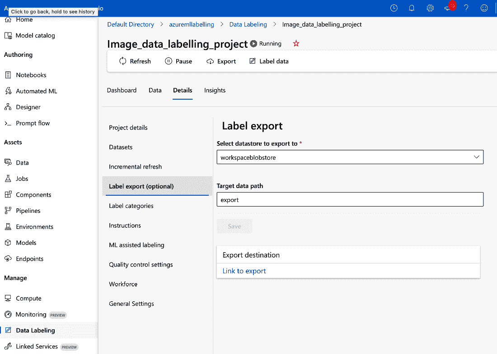

图 12.18 – 导出标签

您已经看到了如何在 Azure Machine Learning 中创建用于图像数据标注的项目，然后标注图像数据。现在，让我们看看如何使用 Azure Machine Learning 标注文本数据。

## 使用 Azure Machine Learning 进行文本数据标注

在本节中，让我们看看如何使用 Azure Machine Learning 标注文本文档。为此，选择**文本**作为**媒体类型**，如下面的截图所示：

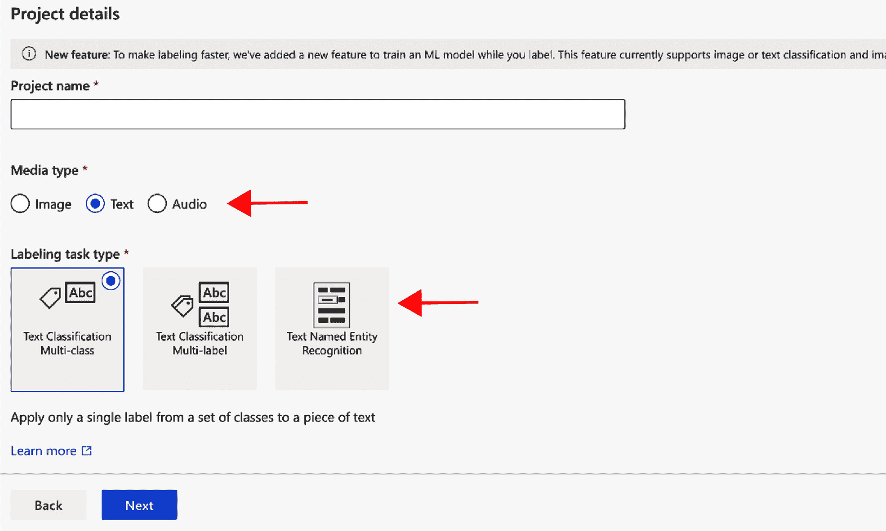

图 12.19 – 文本数据标注

在 Azure Machine Learning 数据标注中，您可以使用三种不同的方式标注文本：

+   您可以使用单个标签进行标注。

+   您可以使用两个标签进行标注。

+   您可以在文本中标注实体。例如，实体可以是文本中的人名、地点或组织。

根据您的场景从以下选项中选择合适的标注任务类型：

+   **多类文本分类**：在这种情况下，您将只从一组类别中为整个文本输入分配一个标签。

+   **多标签文本分类**：在这种情况下，您可以为整个文本输入分配两个标签，如下面的图所示。


图 12.20 – 文本分类多标签

+   **文本命名实体识别**：例如，在一个句子中，如果我们想识别人或组织实体，那么我们可以选择此任务类型。

我们将在以下步骤中了解更多。让我们开始创建 Azure 机器学习中的文本标注项目。

### 第 1 步 – 创建文本数据标注项目

在 Azure 机器学习页面上，步骤与我们在上一节创建用于图像数据标注的标注项目时类似，但有一些例外，例如**标注任务** **类型**步骤。

在**数据** **标注**页面点击**添加项目**：

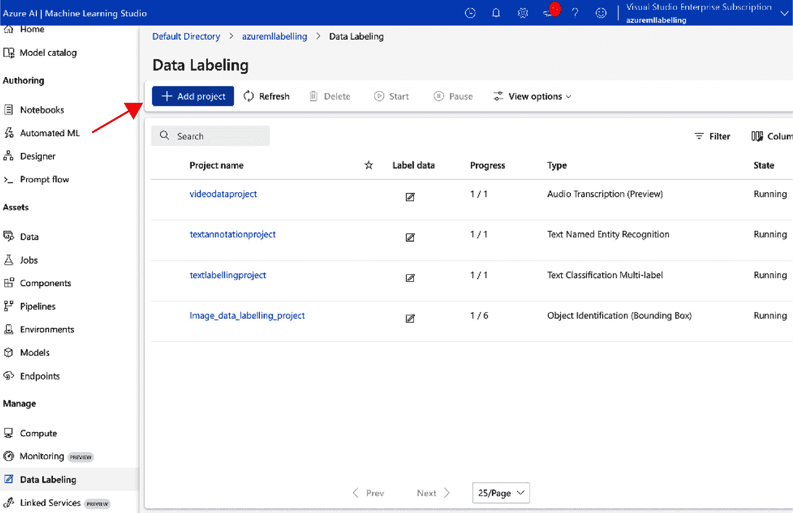

图 12.21 – 添加项目

输入文本数据标注项目的项目名称，选择**文本**作为**媒体类型**，并选择如以下截图所示的标注任务类型：

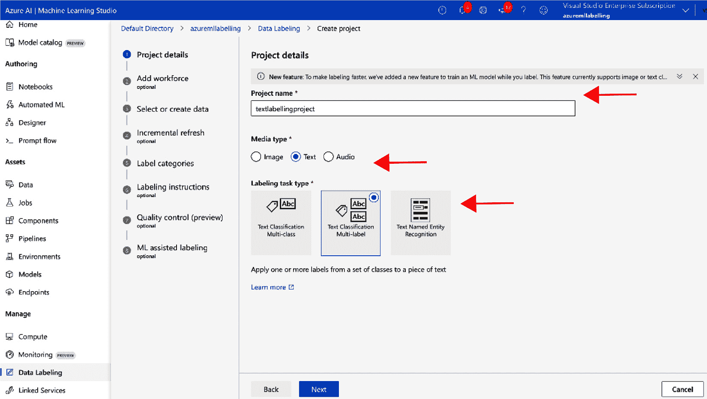

图 12.22 – 项目详情

### 第 2 步 – 创建数据资产

正如我们在上一节中为图像数据标注项目所看到的，我们可以通过两种选项创建数据资产：要么来自 Azure Blob 存储，要么来自本地文件。

选择数据资产后，点击**下一步**。下一步是**增量刷新**，这是可选的。如果我们想自动刷新标注项目中的新数据，则需要此步骤。在此示例中，跳过此可选步骤并点击**下一步**。

然后，您将进入以下**标签** **类别**屏幕。

### 第 3 步 – 选择标签类别

在**标签类别**页面，添加您想要用于标注文本数据的标签类别。

对于这个练习，添加`animal`、`person`和`location`标签类别来标注文本文档。

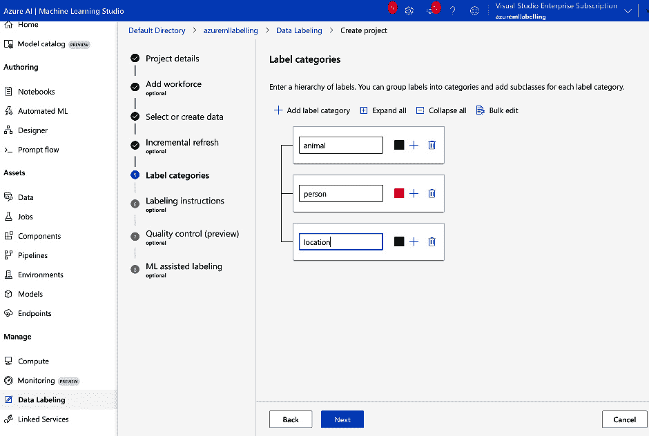

图 12.23 – 添加标签类别

点击**下一步**，跳过上一节中讨论的可选步骤，创建文本数据标注项目。

您现在已创建了`textannotationproject`项目，可以在**数据标注**页面看到它，如下面的截图所示：

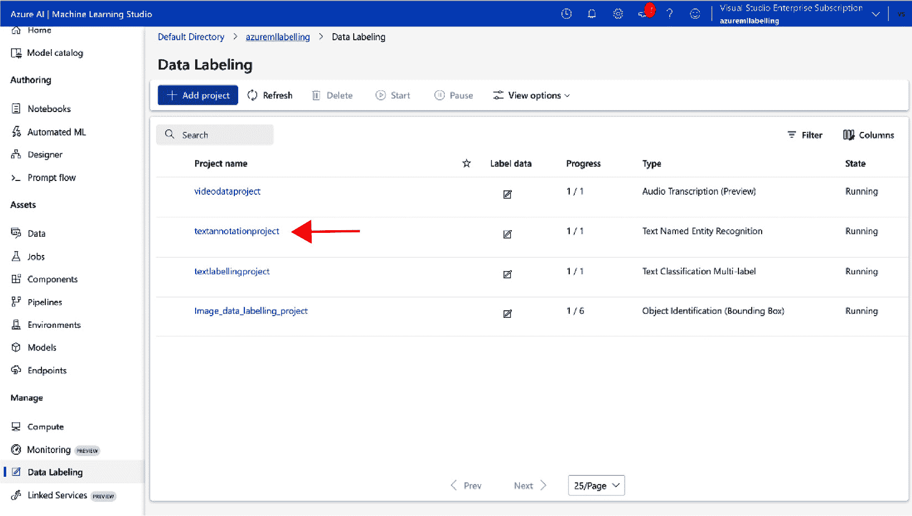

图 12.24 – textannotationproject 项目

### 第 5 步 – 标记文本数据

现在，点击项目名称。在接下来的页面上，点击**textannotationproject**下的**标注数据**选项：

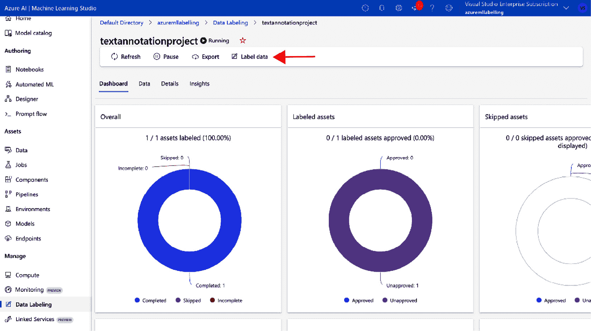

图 12.25 – 仪表板 – 标注数据选项

最后，您可以在此处标注您的文本数据：


图 12.26 – 注释文本数据

我们已经看到了如何在 Azure 机器学习中创建文本数据标注项目，然后标注文本文档。现在，让我们看看如何在 Azure 机器学习中标注音频数据。

## 使用 Azure 机器学习进行音频数据标注

在本节中，让我们看看如何使用 Azure 机器学习标注音频数据。

在 Azure 机器学习中，我们可以使用文本标签标注音频片段。我们将使用`cat_1.wav`音频数据集进行此操作。我们将在 Azure 机器学习中播放音频，并使用`cat`标签标注该音频。此文件位于 GitHub 路径中指定的`Datasets/Ch12`文件夹中，该路径在*技术要求*部分中指定。可以遵循相同的过程来标注所需数量的音频文件。

标注后，我们将把标注的音频文件导出到 Azure 存储，然后我们可以在 Azure 机器学习管道中作为数据集来消费它们。

与图像数据和文本数据类似，首先，我们将为音频数据创建一个标注项目。

所有步骤都与上一节类似，只是标注任务类型不同，用于创建新的音频项目。

让我们先在 Azure 机器学习中创建音频数据标注项目。

### 第 1 步 – 创建项目

让我们按照之前创建图像和文本数据标注项目的相同步骤创建音频项目。

输入项目名称，选择**媒体类型**为**音频**，并选择**音频转录（预览）**作为**标注任务类型**：

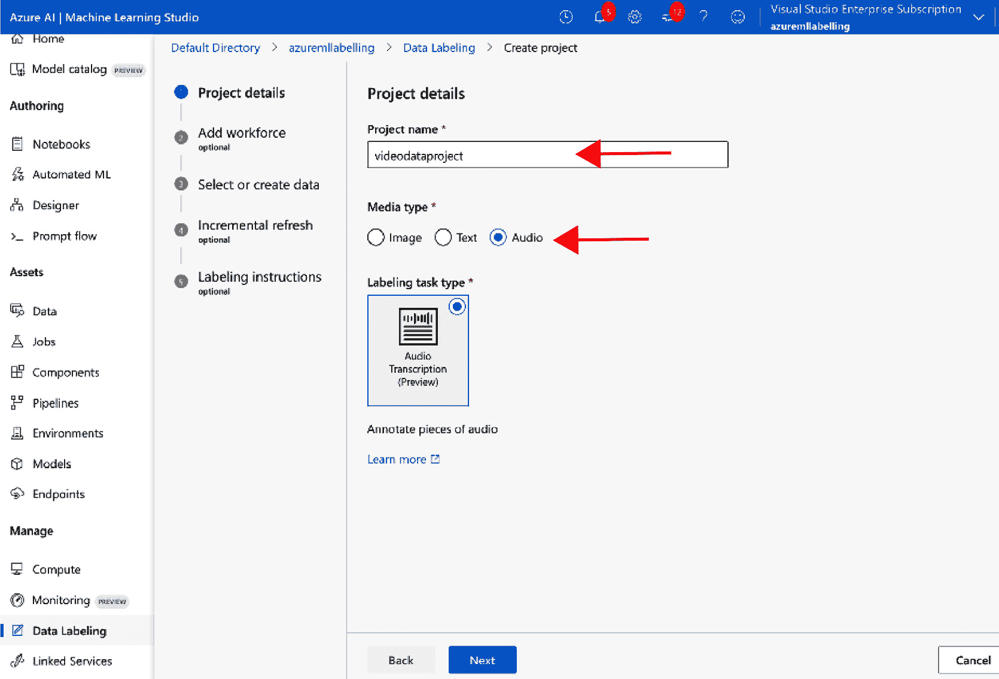

图 12.27 – 创建音频转录项目

我们将要标注的样本音频数据集是`cat_1.wav`。这个数据集可在 GitHub 仓库中找到。

一旦创建项目，请转到**数据标注**页面，点击项目名称。在项目页面，以与我们之前看到文本标注项目相同的方式点击**标注数据**。

### 第 2 步 – 标注音频数据

现在，您将进入音频页面，在那里您可以播放音频，并在音频下方的**转录**区域以文本格式输入标签名称。

现在，您需要为音频数据添加转录标签。如图所示，有一个**播放**标签可以播放音频：

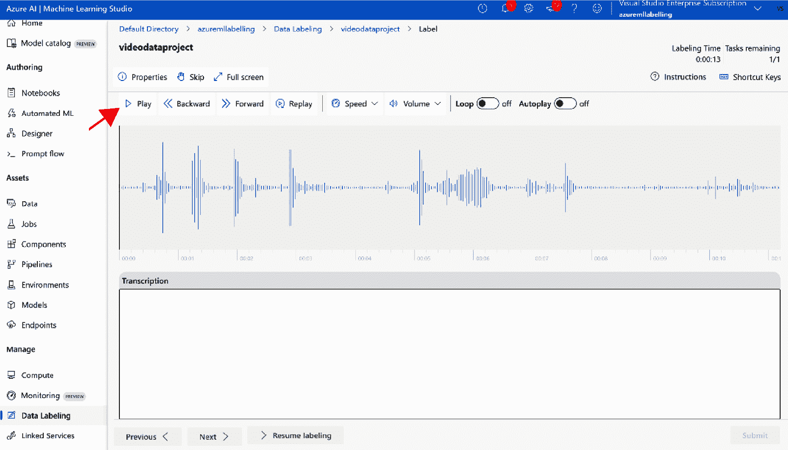

图 12.28 – 播放音频

为此音频选择`cat`标签，如图所示：

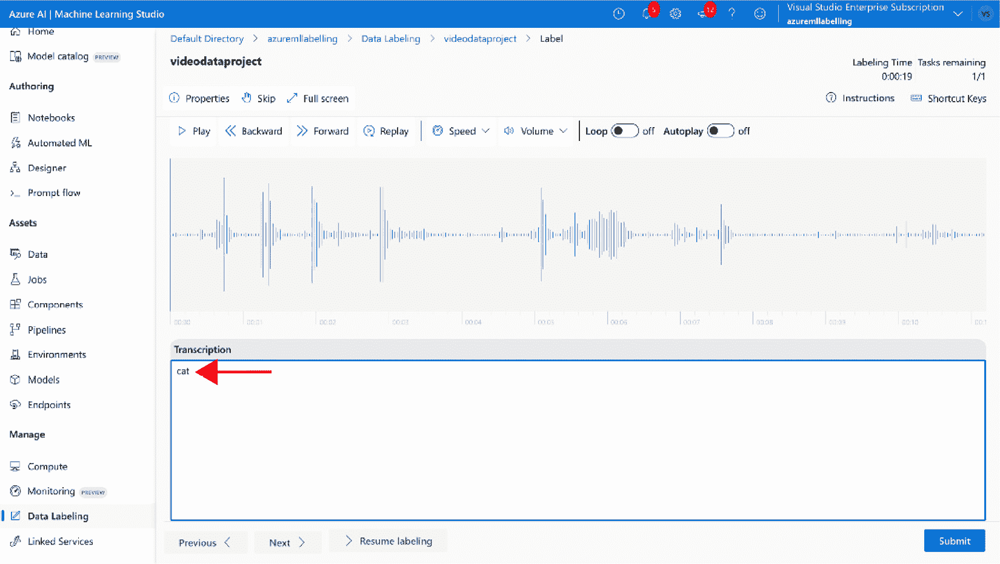

图 12.29 – 为音频片段标注文本

您已经看到了如何在 Azure 机器学习中创建音频数据项目并标注音频数据。现在，让我们看看如何将标注数据集成到 Azure 机器学习管道中用于训练机器学习模型。

## 将 Azure 机器学习管道与标注数据集集成

要将 Azure 机器学习数据标注中的标注数据集成到机器学习管道中，您可以遵循以下一般步骤：

1.  **设置 Azure 机器学习工作区**：确保您已设置 Azure 机器学习工作区。您可以使用 Azure 门户创建一个。

1.  **数据标注**：使用 Azure 机器学习的数据标注功能来标注您的数据。您可以使用 Azure 机器学习工作室创建标注项目、上传数据和管理标注任务。

1.  **存储标记数据**：数据标注完成后，标记数据通常存储在存储中。您可以在 Azure 机器学习中创建一个数据集，该数据集指向您的标记数据位置。

1.  **定义机器学习流程**：创建一个包含数据预处理、模型训练和评估步骤的 Azure 机器学习流程。您可以使用 Azure 机器学习 SDK 在 Python 脚本中定义这些步骤。

1.  **引用标记数据集**：在流程中，引用您在 *数据标注* 步骤中创建的标记数据集。此数据集将用于训练您的机器学习模型。

1.  **运行流程**：在您的 Azure 机器学习工作区中执行流程。这将一致且可重复地触发数据预处理、模型训练和评估步骤。

1.  **监控和迭代**：监控流程执行并评估模型性能。如有必要，通过调整超参数或使用不同的算法对流程进行迭代，以改进您的模型。

这里有一个使用 Azure 机器学习 SDK 的简化示例，以给您一个概念：

```py
from azureml.core import Dataset, Workspace
from azureml.core.experiment import Experiment
from azureml.core.runconfig import RunConfiguration
from azureml.core.conda_dependencies import CondaDependencies
# Load your Azure ML workspace
ws = Workspace.from_config()
# Reference the labeled dataset
labeled_dataset = Dataset.get_by_name(ws, name='your_labeled_dataset_name')
# Define a machine learning experiment
experiment_name = 'your_experiment_name'
experiment = Experiment(workspace=ws, name=experiment_name)
# Define a run configuration with necessary dependencies
run_config = RunConfiguration()
run_config.environment.python.user_managed_dependencies = False
run_config.environment.python.conda_dependencies = CondaDependencies.create(conda_packages=['your_required_packages'])
# Define your machine learning pipeline steps
# ...
# Reference the labeled dataset in your pipeline steps
# ...
# Submit the pipeline run
pipeline_run = experiment.submit(pipeline)
```

请记住将占位符（如 `'your_labeled_dataset_name'` 和 `'your_required_packages'`）替换为您的实际数据集名称和所需的 Python 包。

根据您的具体用例和需求调整流程步骤。Azure 机器学习 SDK 文档提供了有关如何定义和运行流程的详细信息，因为 ML 流程实现超出了本书的范围。

现在，让我们看看如何使用开源工具 Label Studio 标注数据。

# 探索 Label Studio

Label Studio ([`labelstud.io/`](https://labelstud.io/)) 是一个开源的数据标注和注释平台，旨在简化标注各种数据类型（包括图像、文本和音频）的过程。它拥有用户友好的界面，使机器学习实践者和数据科学家能够高效地标注和注释数据集，用于模型训练和评估。其多功能性、协作功能和多任务标注支持使其成为开发稳健且精确的机器学习模型的有价值工具。

在本节中，我们将标注四种类型的数据：图像、视频、文本和音频。

## 标注图像数据

让我们使用 Label Studio 标注图像数据。

一旦您使用*技术要求*部分中给出的`pip`命令安装了 Label Studio 工具，启动 Label Studio，进入浏览器，并输入以下 URL：`http://localhost:8080/`。由于我们使用 Python `pip`命令部署了 Label Studio，我们的 Label Studio UI 在本地系统上的端口`8080`运行。这是我们 Label Studio UI 应用程序，我们可以通过浏览器访问它来标注我们的数据。

在这个练习中，我们将使用与*使用 Azure Machine Learning 进行图像数据标注*部分中相同的骑自行车图像。

使用 Label Studio 对图像进行标注的步骤概述如下：

1.  **安装**：在您的本地机器或服务器上下载并安装 Label Studio。遵循 Label Studio 提供的安装说明。

1.  **初始化**：通过命令行或使用提供的界面启动 Label Studio 应用程序。

1.  **创建账户**：在 Label Studio 中创建用户账户以方便项目管理。这些账户将用于监督和组织标注项目。

1.  **项目设置**：定义您数据集的标注要求。指定所需的标注任务类型（例如，图像分类或目标检测）并配置项目设置，如任务分配和完成标准。

1.  **界面配置**：根据您的项目需求自定义标注界面。添加并定义标注者在标注过程中将应用的标签。调整界面以确保高效的准确标注。

1.  **数据导入**：将您的数据集导入 Label Studio 作为标注任务。这涉及到上传图像或链接到数据源以创建一组标注者需要完成的任务。

1.  **标注和注释**：标注者使用配置的界面根据定义的任务对图像进行标注和注释。标注过程包括将指定的标签应用于图像中的区域或对象。

1.  **导出标注数据**：一旦标注完成，导出标注数据或注释。根据您的需求，您可以将数据导出为多种格式，以便进行进一步分析或与其他工具和平台集成。

通过遵循这些步骤，您可以有效地使用 Label Studio 来管理和执行图像标注项目。接下来，让我们看看几个重要的步骤。

### 创建新项目

首先，转到**项目**，使用 Label Studio UI 创建一个新项目，如下所示：

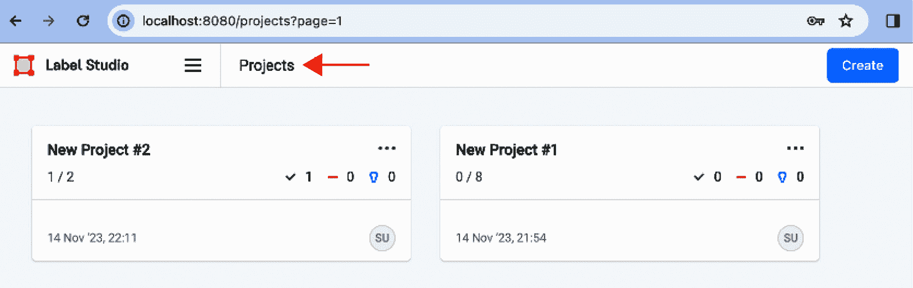

图 12.30 – Label Studio

输入项目名称：

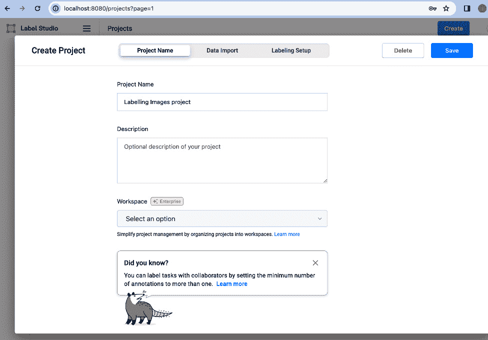

图 12.31 – 输入项目名称

在您创建项目后，将数据导入 Label Studio。您可以导入多种类型的数据，包括文本、时间序列、音频和图像数据。支持的文件类型取决于数据类型。现在，选择用于标注数据集的标签模板。

### 选择标签模板

转到**设置** | **标注界面**。在这里，你可以从 Label Studio 中可用的模板中选择一个模板，如图项目所示。选择**图像分类**。

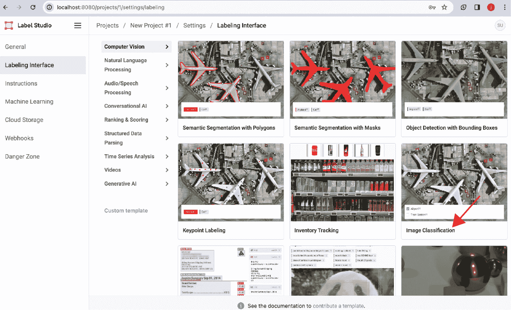

图 12.32 – 选择模板

一旦你选择了标签模板，你需要设置标签名称`自行车`和`人物`：

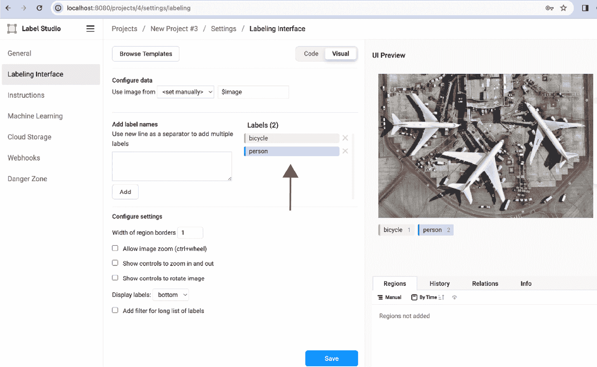

图 12.33 – 添加标签名称

### 在 Label Studio 中应用标签

最后，转到**标注**并应用标签到图像上。根据所选模板（**图像分类**），选择标签然后在图像中的该对象上绘制边界框：

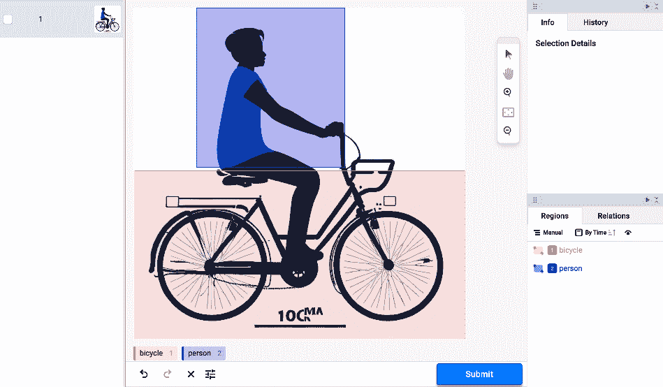

图 12.34 – 在 Label Studio 中应用标签

你可以用类似的方式标注下一张图像。

我们已经看到了如何在 Label Studio 中创建项目、选择模板和标注图像。现在，让我们看看如何在 Label Studio 中标注文本数据。

## 标注文本数据

在本节中，让我们看看如何使用 Label Studio 标注文本数据。

对于文本数据标注，Label Studio 中有各种自然语言模板可供选择，例如文本分类模板和命名实体识别模板，用于识别给定句子中的实体（人物、组织等）。

我们将遵循在 Label Studio 中标注图像数据时使用的相同步骤。首先，我们创建一个项目，然后导入数据并选择适当的标签模板。为了这个练习，我们手动添加了`标题`和`人物`标签。最后，我们将标签应用到文本上。在这个例子中，我们将`标题`和`人物`标签应用到句子`“这是 vijay 文本标注”`中的实体上。

对于更详细的文档，请访问[`labelstud.io/`](https://labelstud.io/)。

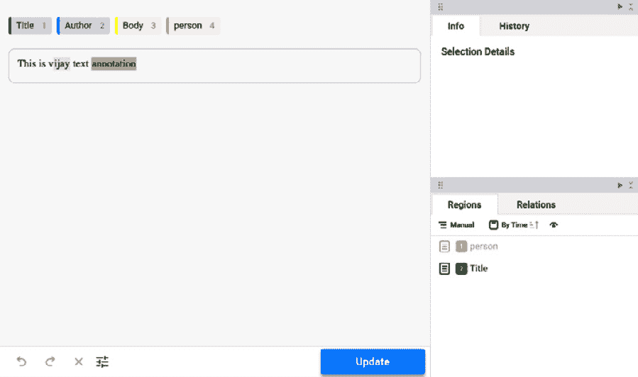

图 12.35 – 文本标注

我们已经看到了如何使用 Label Studio 中的标签来标注样本文本。同样，我们可以使用 Label Studio 为上传的下一批文本数据标注。

## 标注视频数据

在本节中，让我们看看如何为视频数据标注。

所有步骤都与图像数据标注步骤类似，只是用于视频数据标注的模板不同。首先，我们将在 Label Studio 中创建项目，然后导入视频数据文件并选择适当的模板。最后，我们将标签应用到视频上。

现在，让我们向项目中添加标注。在这里，我们为这个练习手动添加了`狗`和`人`标签。现在，我们转到视频标注项目，并在 Label Studio 中开始标注视频。我们为这个视频中显示的`狗`和`人`对象创建了边界框。我们将这些标签应用到视频帧上。

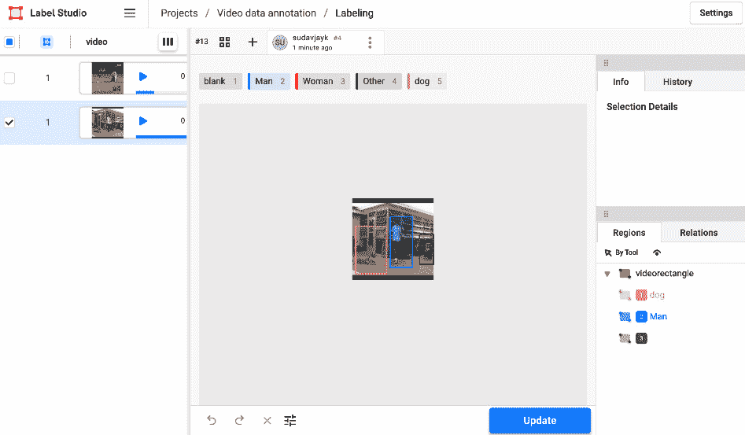

图 12.36 – 视频数据标注

我们已经看到了如何在 Label Studio 中标注视频数据。所有步骤对于图像数据标注、文本数据标注和视频数据标注都是相似的，除了标签模板。这些标签可以从 Label Studio 导出并保存到本地计算机。从那里，可以使用 Azure Blob 存储中的本地文件创建数据集。这个数据集可以用于 Azure 机器学习管道中训练 ML 模型。

除了 Label Studio，还有许多其他开源 Python 库可用于数据标注。现在，让我们看看另一个基于 Python 的开源标注工具，pyOpenAnnotate。工具的选择取决于熟练资源的可用性、数据的量以及数据的格式。

# pyOpenAnnotate

**pyOpenAnnotate** 是一个基于 Python 的开源标注工具，它使用 OpenCV 自动化图像标注流程。它特别适合标注简单的数据集，例如具有普通背景或红外图像。pyOpenAnnotate 是一个单类自动化标注工具，可以帮助您使用计算机视觉技术标注图像和视频。它是通过利用 OpenCV 的强大功能构建的。您可以通过查看 Python 库文档来了解 pyOpenAnnotate 是如何设计的：[`pypi.org/project/pyOpenAnnotate/`](https://pypi.org/project/pyOpenAnnotate/).

您可以将图像加载到目录中，然后运行以下命令以开始标注图像的边界框：

```py
!annotate --img /path/to/directory/Images
```

以下图像可在本书的 GitHub 路径中找到。

您可以将目录路径替换为您自己的数据集路径。这将提示工具标注图像中的对象，您可以将边界框拖放到对象周围（以下图中为蓝色边界框）：

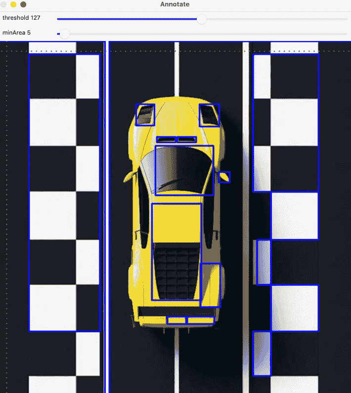

图 12.37 – 汽车图像上的边界框（本书作者使用 DALL-E 创建）

同样，我们可以使用这个 pyOpenAnnotate 工具来标注视频。我们可以提取视频的帧，如图*第八章*所示，然后提供该视频帧的路径以在视频帧上绘制边界框。现在，让我们看看另一个用于标注图像数据的流行工具，CVAT。

# 计算机视觉标注工具

**CVAT** 是一个免费、开源的工具，在各个行业中广泛用于标注图像，以促进机器学习模型的训练。这个工具旨在处理大量图像进行标注。设置和使用 CVAT 进行图像标注涉及几个步骤。以下是一个涵盖该过程的指南。

*步骤 1 –* *安装 Docker*

CVAT 使用 Docker 容器化，因此您需要在您的机器上安装 Docker。按照官方 Docker 网站上您操作系统的安装说明进行操作：[`docs.docker.com/get-docker/`](https://docs.docker.com/get-docker/)。

*步骤 2 – 安装* *Docker Compose*

CVAT 包含多个组件，包括网页服务器、数据库和用于后台任务的工人。Docker Compose 允许您在单个配置文件（`docker-compose.yml`）中定义和管理这些组件之间的依赖关系。

Docker Compose 简化了多容器 Docker 应用程序的管理。按照官方 Docker Compose 安装页面上的说明进行安装：[`docs.docker.com/compose/install/`](https://docs.docker.com/compose/install/)。

*步骤 3 – 克隆* *CVAT 仓库*

从 GitHub 克隆 CVAT 仓库：

```py
git clone https://github.com/openvinotoolkit/cvat.git
```

*步骤 4 – 配置 CVAT* *环境变量*

导航到 CVAT 目录并创建一个包含配置设置的 `.env` 文件：

```py
cd cvat
cp env_example .env
```

如有必要，编辑 `.env` 文件以自定义设置。

您通常需要自定义 `docker-compose.yml` 文件来配置 CVAT 的各个方面，例如数据库凭证和端口号。

*步骤 5 – 构建* *并运行 CVAT*

使用 Docker Compose 构建并运行 CVAT 容器：

```py
docker-compose up –d
```

现在我们已经使用 Docker 在您的本地环境中完成了 CVAT 工具的部署。让我们现在开始使用 CVAT 标注图像。

*步骤 6 – 访问 CVAT* *网页界面*

CVAT 的网页界面可通过 `http://localhost:8080` 访问。打开网页浏览器并导航到此 URL。

*步骤 7 – 创建一个新的* *标注任务*

创建一个免费账户并登录到 CVAT 网页界面。通过点击 **任务** 选项卡，然后点击 **创建任务** 按钮，创建一个新任务。输入任务详情，例如名称、标签和模式（图像或视频）。根据您的标注需求配置其他设置。

接下来，上传图像或视频文件进行标注。对于图像和视频，请在 **任务** 菜单中的 **数据** 选项卡上操作。

现在，通过从列表中选择任务并点击 **进入任务** 来标注数据。使用标注工具绘制边界框和多边形，或标注文本。

*步骤 8 – 停止并移除* *CVAT 容器*

完成标注任务后，停止并移除 CVAT 容器。

这份逐步指南应能帮助您设置和使用 CVAT 进行图像和视频标注。可以根据具体需求和偏好进行调整，CVAT 的文档提供了高级用例的全面细节。然而，这超出了本书的范围。您可以在 https://opencv.github.io/cvat/docs/ 上探索 CVAT 的文档，了解高级功能、定制和故障排除。

# 数据标注工具比较

下面是一个表格，展示了各种工具在不同功能上的比较：

| **工具** | **优点** | **缺点** | **成本** | **标注功能** **支持** | **可扩展性** |
| --- | --- | --- | --- | --- | --- |
| Azure Machine Learning 标注 | 为机器学习项目快速准备数据。辅助机器学习。 | 限于微软生态系统。对自定义标注界面的支持有限。 | Azure 服务可能根据使用情况产生相关费用 | 图像、文本文档和音频 | 能够利用 Azure 云服务的力量扩展标注任务 |
| Label Studio | 开源的多类型数据标注工具 | 文档有限。对视频数据的支持有限。 | Label Studio 可作为开源软件以及企业云服务提供 | 图像、文本文档和视频 | 可能需要为大规模项目进行额外配置 |
| CVAT | 基于网页和协作的。使用直观的快捷方式易于使用。 | 对自定义标注界面的支持有限。用户需要自行设置和托管工具。 | 开源。无软件直接成本；用户只需支付托管和基础设施费用。 | 图像和视频 | 大规模项目可能需要额外的配置 |
| pyOpen Annotate | 支持多种标注格式。支持自定义标注界面。 | 文档有限。对视频数据的支持有限。 | 免费和开源 | 图像和视频 | 大规模项目可能需要额外的配置 |

表 12.1 – 数据标注和标注工具的比较

每个工具的成本可能因标注任务的数量和所需功能而异。建议在决定标注工具之前，根据您的具体需求评估每个工具。

# 高级数据标注方法

活跃学习和半自动化学习是帮助克服数据标注挑战的流行机器学习技术。两者都涉及将不确定或具有挑战性的标签展示给人工标注员以获取反馈；关键区别在于整体策略和决策过程。让我们来分析一下区别。

## 活跃学习

活跃学习是一种机器学习范式，其中模型在数据的一个子集上训练，然后模型主动选择最有信息量的示例进行标注以改进其性能。以下列表讨论了此方法的各项特性：

+   **工作流程**：初始模型在一个小的标注数据集上训练。模型识别出它不确定或可能犯错的实例。这些不确定或具有挑战性的实例被展示给人工标注员进行标注。模型使用新的标注数据更新，然后这个过程迭代。

+   **好处**：它减少了模型训练所需的标注数据量，并将标注工作集中在当前模型难以处理的示例上。

+   **挑战**：它需要一个迭代的过程，包括模型训练和标注。选择具有信息量的实例对于成功至关重要。

+   **模型的决策**：在主动学习中，模型在选择哪些实例最不确定或最具挑战性方面发挥积极作用。模型采用特定的查询策略来识别当标注后预期最能提高其性能的实例。

+   **迭代过程**：初始模型在小型标记数据集上训练。模型根据其不确定性或预期改进选择实例进行标注。人工标注员对选定的实例进行标注。模型使用新的标签进行更新，然后迭代过程重复。

## 半自动化标注

**半自动化标注**涉及自动化工具和人工干预的结合，以标注数据集。自动化方法在标注过程中协助人工标注员，但可能无法完全取代人工输入。以下列表讨论了此方法的各种特性：

+   **工作流程**：自动化算法对数据进行初步标注。人工标注员审查并纠正自动化标签。纠正后的标签用于改进模型或数据集。

+   **好处**：通过利用自动化加快标注过程。通过人工审查保持标签的准确性和质量。

+   **挑战**：它依赖于自动化算法的准确性。它需要在自动化和人工专业知识之间取得平衡。

+   **自动化的决策**：在半自动化标注中，自动化算法参与数据的初始标注。自动化可能包括基于算法、启发式或规则的预标注。

+   **人工审查和纠正**：人工标注员审查自动化标签并根据需要纠正它们。标注员还可能根据其专业知识添加或修改标签。纠正后的标签有助于改进数据集或模型。

这两种方法之间的关键区别如下：

+   **标注的启动**：在主动学习中，模型通过选择标注实例来主动启动过程。在半自动化标注中，自动化在初始标注中占主导地位，人工标注员随后审查并纠正标签。

+   **查询策略**：主动学习涉及特定的查询策略，旨在为模型最大化信息增益。半自动化标注可能依赖于启发式或算法进行初始标注，但重点在于人工纠正而不是模型驱动的查询策略。

+   **决策责任**：主动学习将更多的决策责任放在模型上。半自动化标注采用更协作的方法，其中自动化算法和人工标注员都参与决策。

虽然这两种方法都旨在充分利用人类标注的努力，但主动学习过程更多地由模型的不确定性和改进目标驱动，而半自动化标注则侧重于自动化工具和人类专业知识之间的协作努力。选择哪种方法取决于任务的特定需求和可用资源。

# 摘要

在本章中，我们学习了如何使用 Azure 机器学习来标注图像、视频和音频数据。我们还了解了用于图像、视频和文本标注的开源标注工具 Label Studio。最后，我们学习了 pyOpenAnnotate 和 CVAT 用于标注图像和视频数据。现在，你可以尝试使用这些开源工具来准备用于机器学习模型训练的标注数据。

当我们翻到这本书的最后一页时，我衷心祝贺你完成了这次对图像、文本、音频和视频数据标注世界的洞察之旅。你的奉献和好奇心为对尖端技术的更深入理解铺平了道路。愿在这里获得的知识继续激励你未来的努力。感谢你成为这个丰富经验的一部分！
