# 1

# 开始使用本书和湖仓概念

“给我六个小时砍倒一棵树，我会花前四个小时磨斧头。”

– 亚伯拉罕·林肯

我们将从一个基本的概述开始，介绍 Databricks 的**数据智能平台**（**DI**）是一个基于**湖仓**架构的开放平台，以及这种架构在开发**机器学习**（**ML**）应用中的优势。为了简洁起见，本书中将交替使用“数据智能平台”和“Databricks”这两个术语。本章将介绍本书中我们将使用的不同项目和关联数据集。每个项目都有意突出 DI 平台的一个功能或组件。请将示例项目作为每个平台元素的实际操作课程。我们将在每个章节的最后部分通过这些项目进行学习——即应用我们的学习。

在本章中，您将学习以下内容：

+   数据智能平台组件

+   Databricks 平台的优势

+   应用我们的学习

# 数据智能平台组件

数据智能平台允许您的整个组织利用数据和 AI。它基于湖仓架构，为所有数据和管理层提供一个开放、统一的基石。它由一个**数据智能引擎**提供动力，该引擎理解您数据的环境。为了实际应用，让我们讨论 Databricks 数据智能平台的组件：

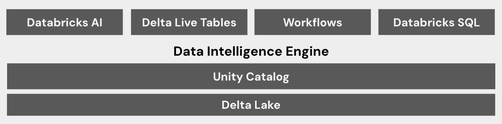

图 1.1 – Databricks 数据智能平台组件

让我们查看以下列表，其中包含图中的项目描述：

+   **Delta Lake**：数据智能平台内的数据布局会根据常见的数据使用模式自动优化

+   **Unity Catalog**：一个统一的管理模型，用于保护、管理和共享您的数据资产

+   **数据智能引擎**：该引擎使用 AI 来增强平台的功能

+   **Databricks AI**: 支持端到端机器学习解决方案和**生成式 AI**功能的机器学习工具，包括创建、调整和提供大型语言模型 (LLM)

+   **Delta live tables**：使自动数据摄取和**数据质量**成为可能

+   **工作流**：一个完全集成的编排服务，用于自动化、管理和监控多任务工作负载、查询和管道

+   **Databricks SQL (DBSQL)**: 一种以 SQL 为首的界面，类似于您与数据仓库交互的方式，并具有文本到 SQL 等功能，允许您使用自然语言生成查询

现在我们已经定义了我们的元素，让我们讨论它们如何帮助我们实现我们的机器学习目标。

# Databricks 平台的优势

Databricks 对湖屋架构的实施是独特的。Databricks 的基础建立在由 Unity Catalog 管理的 Delta 格式数据湖上。因此，它结合了数据湖的可扩展性和成本效益以及数据仓库的治理。这意味着不仅通过 **访问控制列表**（**ACLs**）管理表级权限，而且文件和对象级访问也得到了规范。这种从数据湖和/或数据仓库到统一平台的架构变化是理想的——湖屋促进了组织在分析、商业智能和数据分析项目中的各种新用例。有关湖屋优势的更多信息，请参阅 *进一步阅读* 部分的 *数据湖简介* 博客文章。

本节将讨论开源框架的重要性以及它们提供的两个关键优势——透明度和灵活性。

## 开源特性

开源特性与数据智能平台的关系是独特的。这种独特性体现在开放性和透明度的概念上，通常被称为 Databricks 的“玻璃盒”方法。这意味着当你使用该平台创建资产时，没有不可理解的黑盒迫使你依赖特定供应商进行使用、理解或存储。真正开放的湖屋架构使用开放数据文件格式，使访问、共享和删除数据变得简单。Databricks 对 Apache Spark 的托管版本进行了优化，以利用开放数据格式 Delta（我们将在稍后详细介绍）。这就是为什么 Delta 格式对于大多数用例来说都是理想的。然而，没有任何阻止你使用诸如 CSV 或 Parquet 格式的东西。此外，Databricks 引入了 **Delta Lake 通用格式**（**Delta Lake UniForm**），以便轻松集成其他文件格式，如 Iceberg 或 Hudi。有关更多详细信息，请参阅本章末尾的 *进一步阅读* 部分。

*图 1**.2* 展示了数据格式与 UniForm 的结合。

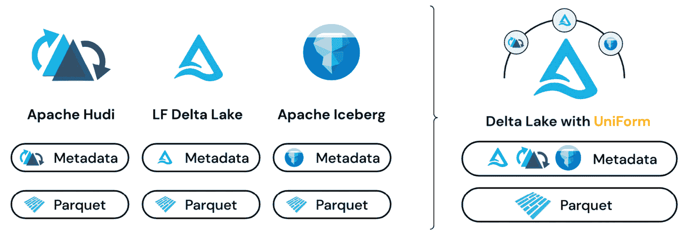

图 1.2 – Delta Lake UniForm 使消费 Hudi 和 Iceberg 文件格式与消费 Delta 一样简单

使用第三方和开源软件的能力推动了快速创新。数据处理和机器学习的新进展可以迅速测试并集成到您的流程中。相比之下，专有系统通常需要较长的等待时间，以便供应商整合更新。等待供应商利用开源创新似乎很少见，但这是常态而不是例外。这在数据科学领域尤其如此。软件和算法进步的速度令人难以置信。这种疯狂的创新步伐的证据可以在 Hugging Face 社区网站上每天看到。开发者们在 Hugging Face 上分享库和模型；仅该网站每天就有数百个库更新。

Delta、Spark、Spark 上的 Pandas API（见 *图 1.3*）和 MLflow 是一致创新的重要例子，这主要得益于它们作为开源项目的透明度。我们特别提到这些，因为它们最初都是由 Databricks 的创始人或公司成员在其成立后创建的。

ML 开发者从这种透明度中受益匪浅，因为它为他们提供了无与伦比的灵活性、易于集成以及来自开源社区的强大支持——所有这些都不需要维护开源全栈的开销。

与公司需要设置全新的开发环境相比，作为承包商使用 Databricks 进行开发速度极快。一些公司需要提交服务请求来安装 Python 库。这可能会成为数据科学家的生产力杀手。在 Databricks 中，许多您喜欢的库都是预先安装并可供使用的，当然，您也可以轻松地安装自己的库。

此外，Databricks 用户群体庞大且充满活力。Databricks 社区网站是一个极好的资源，可以询问和回答有关 Databricks 的任何问题。我们在本章末尾的 *进一步阅读* 部分包含了一个链接。

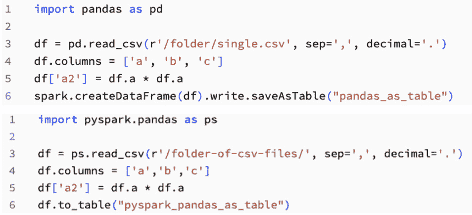

图 1.3 – Spark 上的 pandas API

Spark 上的 pandas API 几乎与标准的 pandas 语法相同，这使得对于在 Python 中编写过 pandas 代码的人来说，学习使用 Spark 进行分布式计算变得更加容易。

在继续关注透明度的同时，让我们转向 Databricks **AutoML**。

## Databricks AutoML

Databricks 将其 AutoML 解决方案称为**玻璃盒**。这个术语突出了这样一个事实：对用户来说没有任何隐藏的东西。在数据智能平台中的这个特性利用了一个开源库 Hyperopt，结合 Spark 进行超参数调整。它不仅智能地探索不同的模型类型，而且在分布式方式中优化参数。Hyperopt 的使用使得 AutoML 实验中的每一次运行都能为下一次运行提供信息，与网格搜索相比，减少了达到最优解所需的运行次数。实验中的每一次运行都关联着一个包含模型代码的笔记本。这种方法提高了生产力，减少了不必要的计算，并让科学家能够进行实验而不是编写样板代码。一旦 AutoML 收敛到算法最优解，就会有“最佳笔记本”用于最佳评分的模型。本书的几个章节中我们将详细探讨 AutoML。

## 可重用性和可重现性

作为数据科学家，透明度尤为重要。我们不信任黑盒模型。在不理解它们的情况下如何使用它们呢？一个模型的好坏取决于输入的数据。除了不信任模型之外，黑盒还引发了我们对研究可重复性和模型驱动者可解释性的担忧。

当我们创建一个模型时，它属于谁？我们能访问它吗？我们能调整、测试，最重要的是，重用它吗？投入模型创建的时间是不可忽视的。Databricks AutoML 为你提供了解释、重现和重用它创建的模型所需的一切。实际上，你可以将模型代码或模型对象在笔记本电脑或任何地方运行。这种开源、玻璃盒、可重现和可重用的方法论正是我们所倡导的开放。

## 开放文件格式提供灵活性

灵活性也是 Databricks 平台的一个基本方面，因此让我们深入了解 Delta 文件格式，这是一个开源项目，它使得适应多种不同的用例变得容易。对于那些熟悉 Parquet 的人来说，可以将 Delta 视为 Parquet 的增强版——Delta 文件是带有事务日志的 Parquet 文件。事务日志是一个变革性的因素。可靠性的提高和优化使得 Delta 成为 Databricks 湖屋架构的基础。湖屋的数据湖部分对数据科学、流处理以及非结构化和半结构化数据格式至关重要。Delta 也使得仓库部分成为可能。关于 Delta 有整本书的讨论；在*进一步阅读*部分可以找到一些例子。我们关注的是它是一个开放文件格式，具有支持构建数据产品的关键特性。

### 集成和控制

拥有一个开放文件格式对于保持对您数据的所有权至关重要。您不仅希望能够读取、修改和打开您的数据文件，还希望将它们保留在您的云租户中。在 Databricks 数据智能平台上，您可以保持对数据的控制。没有必要将数据文件放入专有格式或将其锁在供应商的云中。查看*图 1.4*，了解 Delta 如何成为更大生态系统的一部分。

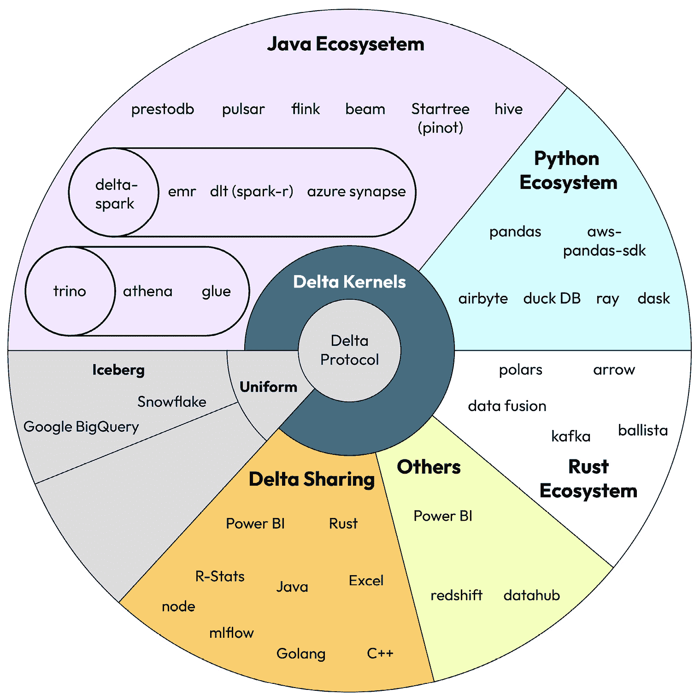

图 1.4 – Delta 内核连接生态系统

Delta 内核引入了一种全新的方法，提供简化的、专注的、可靠的 API，这些 API 抽象了 Delta 协议的复杂性。通过简单地更新内核版本，连接器开发者可以无缝访问最新的 Delta 功能，而无需修改任何代码。

### Delta 中的时间旅行版本控制

开放文件格式的自由和灵活性使得它能够与新的和现有的外部工具集成。特别是 Delta Lake，凭借时间旅行版本控制、卓越的速度以及更新和合并更改的能力等特性，为创建数据产品提供了独特的支持。在此背景下，时间旅行指的是查询您数据表不同版本的能力，让您能够回顾在最近更改或转换之前表的状态（见*图 1.5*）。最明显的用途是在犯错后进行备份，而不是作为安全措施写出多个表的副本。时间旅行的一个可能不那么明显的用途是可重复研究。您可以在不创建数据副本的情况下访问模型在上一周训练时所使用的数据。在整个书中，我们将详细介绍您可以使用的数据智能平台的功能，以促进可重复研究。以下图示展示了如何查询相对于时间戳或版本号的表的前一个版本。

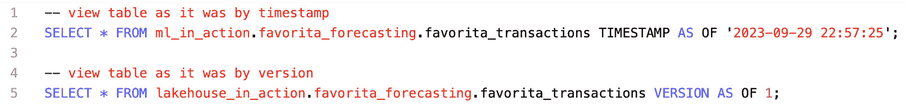

图 1.5 – 查询技术代码示例，用于查看表的前一个版本

### Databricks 优化组合的速度

接下来，让我们讨论 Databricks 湖屋架构的速度。2021 年 11 月，Databricks 为数据仓库的黄金标准性能基准设定了新的世界纪录。巴塞罗那计算小组分享了支持这一发现的研究。这一创纪录的速度得益于 Databricks 的引擎（Spark 和 Photon）与 Delta 的结合（参见*进一步阅读*部分的*Databricks Sets Official Data Warehousing Performance Record*链接）。

### Delta 的额外优势

Delta 的令人印象深刻的特性包括**变更数据馈送**（CDF）、**变更数据捕获**（CDC）和**模式演变**。每个都在支持机器学习的数据转换中扮演着特定的角色。

从 Delta 的 CDF（Change Data Feed，变更数据馈送）功能开始，它正是其名称所暗示的——变化数据的馈送。假设你有一个寻找欺诈行为的模型，该模型需要知道在过去 10 分钟内发生了多少交易请求。每次需要更新账户的值时，重写整个表是不切实际的。在这种情况下，特征值，即过去 10 分钟内发生的交易数量，只有在值发生变化时才需要更新。本例中 CDF 的使用使得更新可以传递给一个**在线特征存储**；详见*第五章*和*第六章*以获取更多详细信息。

最后，让我们谈谈变更数据捕获（CDC），它是数据管理领域的一个颠覆者。与传统的文件系统不同，Delta 中的 CDC 被有意设计来高效地处理数据更新。让我们更深入地了解 CDC，并通过两个实际场景来探索其功能：

+   **场景 1 – 无需努力的记录更新**：想象一个涉及你的客户拉米（Rami）的场景。他最初在威斯康星州购买商品，但后来搬到了科罗拉多州，并在那里继续购买。在你的记录中，反映拉米在科罗拉多州的新地址至关重要。这正是 Delta 的 CDC（Change Data Capture，变更数据捕获）大放异彩的地方。它无需将拉米视为新客户，就能轻松更新他的客户记录。CDC 擅长无缝地捕获和应用更新，确保数据完整性而无需任何麻烦。

+   **场景 2 – 适应不断变化的数据源**：现在，考虑一种情况，你的数据源经历意外变化，导致添加了一个包含客户信息的新列。假设这个新列提供了关于客户购买物品颜色的洞察。这是你不想丢失的有价值数据。Delta 的 CDC 结合其模式演变功能，正是解救之道。

在*第三章*中深入探讨了模式演变，它使 Delta 能够优雅地适应模式变化，而不会造成任何中断。当处理新的数据列时，Delta 能够顺利地整合这些信息，确保你的数据保持最新，同时保留其全部历史背景。这确保了你可以为现在和未来的分析利用有价值的见解。

# 应用我们的学习方法

这本书以项目为基础。每一章都从概述重要概念和数据智能平台功能开始，为你准备主要活动——*应用我们的学习*部分。每个*应用我们的学习*部分都有一个*技术要求*部分，这样你知道完成相应章节的项目工作需要哪些技术资源，除了你的 Databricks 工作空间和 GitHub 仓库。

## 技术要求

这里是需要开始使用本书中使用的动手示例所需的技术要求：

+   我们使用 Kaggle 的两个数据集。如果你还没有账户，你需要创建一个。

+   在整本书中，我们将参考 GitHub 中的代码。如果你还没有账户，请创建一个。

## 了解你的数据

书中包含四个主要项目，这些项目按顺序逐步展开。在每一章后续的章节中，代码将扩展前一章的代码。我们选择这些项目是为了突出不同机器学习项目中的各种数据智能平台功能。具体来说，我们包括将流数据引入你的湖仓架构、预测销售、构建用于计算机视觉的**深度学习**（**DL**）模型，以及使用**检索增强生成**（**RAG**）技术构建聊天机器人。阅读每个项目的描述，以了解它将涵盖的内容。如果一些概念和功能不熟悉，不要担心！我们将在接下来的章节中解释它们。

## 项目 – 流式交易

这个第一个项目是为我们将生成的流式交易数据集提供的数据解决方案。交易数据将包括客户 ID 和交易时间等信息，我们将使用这些信息来模拟实时流式交易；请参阅*图 1.6*中的示例数据。

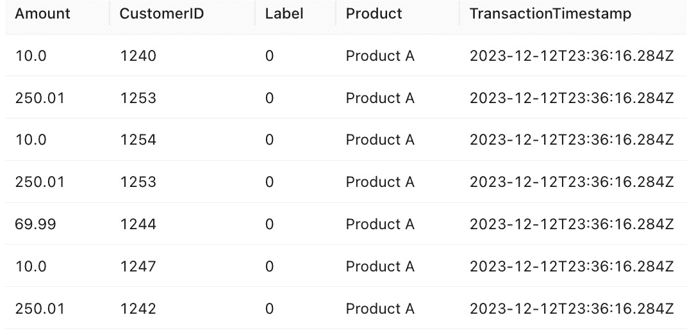

图 1.6 – 合成流式交易数据的示例

我们希望通过这个项目展示数据智能平台与过去专有数据仓库相比的灵活性，后者在数据摄取方面更为僵化。此外，我们还想突出 Databricks 的重要功能，如**Spark Structured Streaming**、**Auto Loader**、模式演变、Delta Live Tables 和**湖仓监控**。

当我们生成交易时，我们也会根据统计分布生成一个标签（注意，标签是随机的，仅用于学习目的）。这是我们将会预测的标签。我们的旅程包括生成多行 JSON 文件的交易记录，将文件格式化为 Delta 表，为我们的机器学习模型创建流式特征，使用 `pyfunc` 包裹预处理步骤，并通过工作流部署模型包装器。通过查看 *图 1.7* 了解我们将如何推进这个项目。

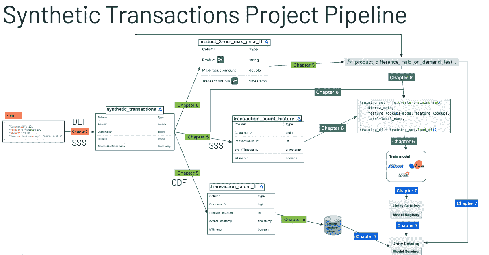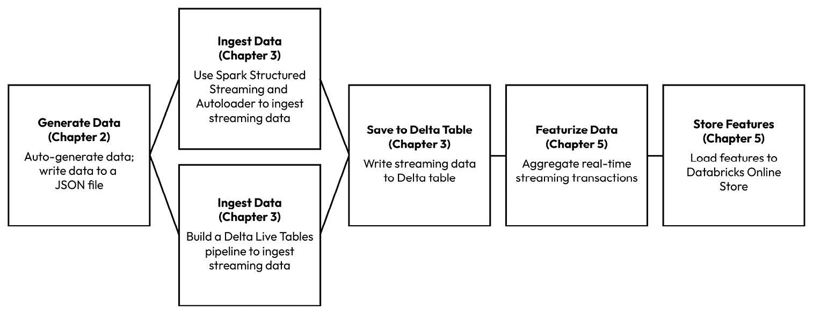

图 1.7 – 流式事务项目的项目流程

这就完成了流式事务项目的解释。接下来，我们将查看预测项目。

## 项目 – Favorita 销售预测

这是一个典型的预测项目。我们的数据集托管在 Kaggle 网站上（参见 *进一步阅读* 部分）。我们将使用这些数据构建一个模型，以预测厄瓜多尔特定 Favorita 店面一家商品的总销售额。数据包括训练数据、测试数据和补充数据。本项目将使用 Databricks 的 AutoML 进行数据探索并创建基线模型。通过查看 *图 1.8* 了解我们将如何推进这个项目。店面销售数据集是一个丰富的时序数据集，我们鼓励您使用您喜欢的时序库在我们的项目框架上构建。

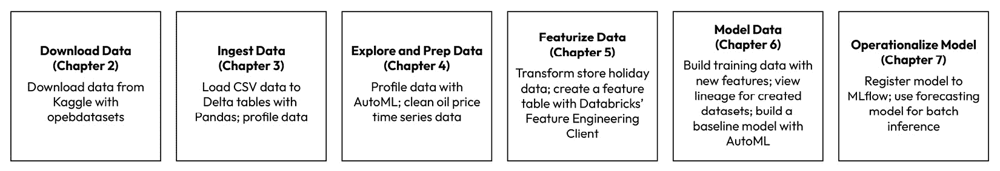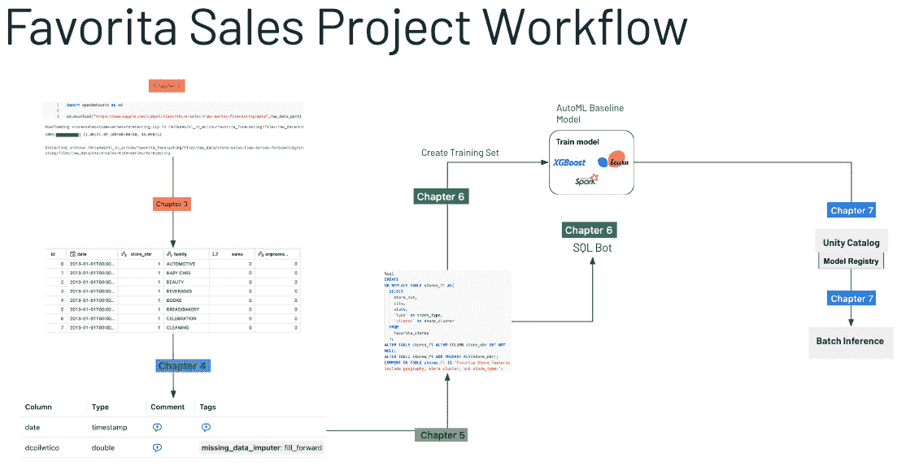

图 1.8 – Favorita 店面销售项目的项目流程

这就完成了预测项目的解释。接下来，我们将查看深度学习项目。

## 项目 – 多标签图像分类

这是一个使用另一个 Kaggle 数据集的深度学习数据解决方案。我们将使用这些数据集的图像微调一个深度学习模型，使用 PyTorch 和 Lightning 预测相应的标签。我们将实现 MLflow 代码进行实验和模型跟踪，使用 Spark 进行快速训练和 **推理**，以及使用 Delta 进行数据版本控制。我们将通过创建一个模型包装器来部署模型，类似于我们在流式事务项目中使用的包装器。通过查看 *图 1.9* 了解我们将如何推进这个项目。

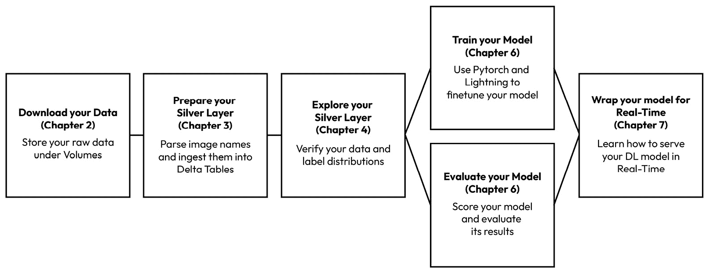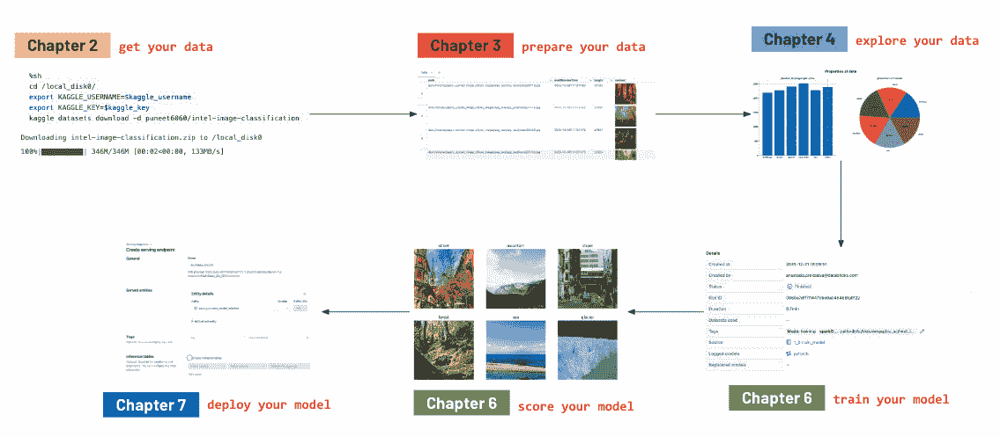

图 1.9 – 多标签图像分类项目的项目流程

这就结束了图像分类项目的解释。接下来，我们将探讨聊天机器人项目。

## 项目 – 检索增强生成聊天机器人

这个项目是一个 RAG 聊天机器人。我们使用的数据集来自*arXiv*网站。我们选择了一些关于生成式人工智能对人类和劳动影响的研究文章。我们将下载并将它们存储在*第二章*中的一个卷中。下载 PDF 文档后，我们将通过分块和标记化过程提取和准备文本，为聊天机器人创建要引用的文档嵌入。我们将使用 Databricks 向量搜索来存储嵌入。然后，我们将使用新的基础模型 API 在检索文本时生成答案。最终的机器人将作为使用**Databricks 模型服务**的应用程序部署。这个示例允许你从头到尾构建一个聊天机器人！通过查看*图 1.10*中的项目流程来了解我们将如何进行这个项目。

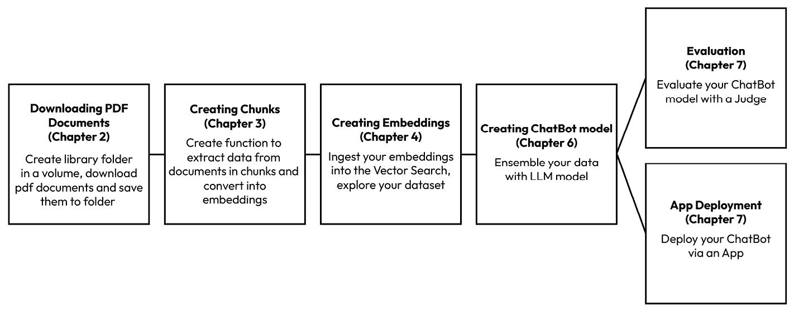

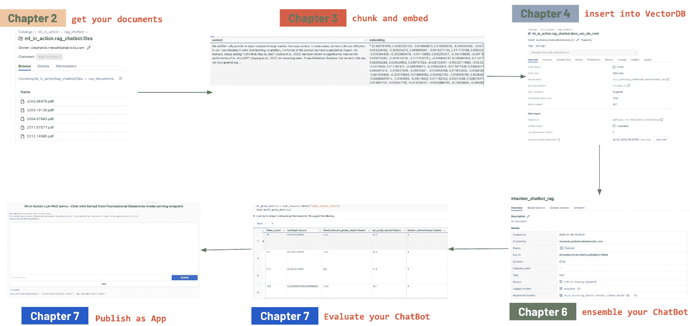

图 1.10 – 聊天机器人项目的项目流程

四个项目是可以在 Databricks 上实施的动手示例。*《Databricks 机器学习实战》*基于我们的经验，从机器学习的角度提供了最佳实践和建议，并补充了在线文档。本书中展示的所有代码和解决方案都是在 Databricks 的全版本上开发和测试的。然而，我们理解可访问性很重要。Databricks 数据智能平台还有一个免费的社区版本，使每个人都能在考虑升级之前跟随示例进行到一定程度。

# 摘要

在本章中，我们向您介绍了*《Databricks 机器学习实战》*。我们强调，Databricks 数据智能平台的设计考虑了开放性、灵活性和工具自由度，这极大地提高了生产力。此外，我们还向您展示了本书中将占中心地位的项目和相关数据集。

现在你已经对数据智能平台有了基础的了解，是时候迈出下一步了。在接下来的章节中，我们将引导你设置环境，并提供下载项目数据的说明。这将为你准备在这个旅程中即将到来的实际、动手的机器学习体验。

# 问题

让我们通过以下问题来测试一下我们学到了什么：

1.  你将如何使用这本书？你计划从头到尾阅读，还是挑选某些章节？你已经选择了感兴趣的章节吗？

1.  我们讨论了为什么在建模中保持透明度对于成功至关重要。Databricks 的自动机器学习（AutoML）的玻璃盒方法是如何支持这一点的？

1.  Databricks 开发了一种新的方式来统一开放数据格式，称为 UniForm。UniForm 统一了哪些数据格式？

1.  Delta 是湖屋架构的基础。使用 Delta 的一个好处是什么？

1.  在 Databricks 中，使用 Delta 文件格式进行大规模数据处理相比简单的 Parquet 文件有哪些主要优势？

# 答案

在思考了这些问题之后，比较一下您的答案和我们的答案：

1.  我们无法回答这个问题，但我们希望您很快就能学到在工作中可以用到的东西！

1.  玻璃盒方法通过提供实验中每次运行的代码和最佳运行，支持透明度，从而实现可重用性和可重复性。

1.  Apache Iceberg、Apache Hudi 和 Linux Foundation Delta Lake（Delta 的开源/未管理版本）。

1.  有几个。以下是一些：

    +   开放协议（无供应商锁定）

    +   速度

    +   数据变更捕获

    +   时间旅行

1.  虽然 Parquet 也提供列式存储并具有高效的读写操作，但其缺乏 ACID 事务能力，这使得 Delta Lake 与之区分开来。

# 进一步阅读

在本章中，我们介绍了关键技术。查看这些资源深入了解您最感兴趣的领域：

+   YouTube 视频 - *Databricks 数据智能平台入门*：[`youtu.be/E885Ld3N2As?si=1NPg85phVH8RhayO`](https://youtu.be/E885Ld3N2As?si=1NPg85phVH8RhayO)

+   *数据湖入门*：[`www.databricks.com/discover/data-lakes`](https://www.databricks.com/discover/data-lakes)

+   数据仓库之父比尔·英蒙（Bill Inmon）的*5 步成功构建数据湖屋*：[`www.databricks.com/resources/ebook/building-the-data-lakehouse`](https://www.databricks.com/resources/ebook/building-the-data-lakehouse)

+   *Delta Lake: Up & Running* by O’Reilly：[`www.databricks.com/resources/ebook/delta-lake-running-oreilly`](https://www.databricks.com/resources/ebook/delta-lake-running-oreilly)

+   *Delta Lake: The Definitive Guide*：[`www.oreilly.com/library/view/delta-lake-the/9781098151935/`](https://www.oreilly.com/library/view/delta-lake-the/9781098151935/)

+   *比较 Apache Spark 和 Databricks*：[`www.databricks.com/spark/comparing-databricks-to-apache-spark`](https://www.databricks.com/spark/comparing-databricks-to-apache-spark)

+   *Databricks MLflow*：[`www.databricks.com/product/managed-mlflow`](https://www.databricks.com/product/managed-mlflow)

+   *Databricks 社区版 FAQ*：[`www.databricks.com/product/faq/community-edition#:~:text=What%20is%20the%20difference%20between,ODBC%20integrations%20for%20BI%20analysis`](https://www.databricks.com/product/faq/community-edition#:~:text=What%20is%20the%20difference%20between,ODBC%20integrations%20for%20BI%20analysis)

+   *Delta 2.0 - 你的数据湖屋基础是* *开放的*：[`delta.io/blog/2022-08-02-delta-2-0-the-foundation-of-your-data-lake-is-open/`](https://delta.io/blog/2022-08-02-delta-2-0-the-foundation-of-your-data-lake-is-open/)

+   *Delta Lake* *集成*：[`delta.io/integrations/`](https://delta.io/integrations/)

+   *Delta 与 *Iceberg*：[`databeans-blogs.medium.com/delta-vs-iceberg-performance-as-a-decisive-criteria-add7bcdde03d`](https://databeans-blogs.medium.com/delta-vs-iceberg-performance-as-a-decisive-criteria-add7bcdde03d)

+   *UniForm*：[`www.databricks.com/blog/delta-uniform-universal-format-lakehouse-interoperability`](https://www.databricks.com/blog/delta-uniform-universal-format-lakehouse-interoperability)

+   *Delta 内核：简化为 *Delta* 构建连接器的*：[`www.databricks.com/dataaisummit/session/delta-kernel-simplifying-building-connectors-delta/`](https://www.databricks.com/dataaisummit/session/delta-kernel-simplifying-building-connectors-delta/)

+   *Databricks 社区* *网站*：[`community.cloud.databricks.com`](https://community.cloud.databricks.com)

+   *播客：与 Denny *Lee* 的 Delta Lake 讨论*：[`open.spotify.com/show/6YvPDkILtWfnJNTzJ9HsmW?si=214eb7d808d84aa4`](https://open.spotify.com/show/6YvPDkILtWfnJNTzJ9HsmW?si=214eb7d808d84aa4)

+   *Databricks 创下官方数据仓库性能* *记录*：[`www.databricks.com/blog/2021/11/02/databricks-sets-official-data-warehousing-performance-record.html`](https://www.databricks.com/blog/2021/11/02/databricks-sets-official-data-warehousing-performance-record.html)

+   *LightGBM*：[`github.com/microsoft/LightGBM`](https://github.com/microsoft/LightGBM) [`lightgbm.readthedocs.io/en/latest/`](https://lightgbm.readthedocs.io/en/latest/)

+   *Kaggle* | *商店* *销售*：[`www.kaggle.com/competitions/store-sales-time-series-forecasting/overview`](https://www.kaggle.com/competitions/store-sales-time-series-forecasting/overview)

+   *Kaggle* | *多标签图像* *分类*：[`www.kaggle.com/datasets/meherunnesashraboni/multi-label-image-classification-dataset`](https://www.kaggle.com/datasets/meherunnesashraboni/multi-label-image-classification-dataset)

+   *存储销售 - 时间序列* *预测*：[Kaggle.com/competitions/store-sales-time-series-forecasting/overview](http://Kaggle.com/competitions/store-sales-time-series-forecasting/overview)

+   *arXiv 网站*：[`arxiv.org`](https://arxiv.org)
