# 2

# 设计 Databricks：第一天

“设计不仅仅是看起来和感觉如何。设计是如何运作的。”

- 史蒂夫·乔布斯

本章将介绍工程师、数据科学家以及类似角色应该了解的概念和主题，以便在 Databricks 数据智能平台上取得成功。在设置数据和 AI 平台时，以我们为例，Databricks，总有最佳实践需要遵循。我们在本章中分享这些最佳实践，以便您更好地理解设置选项及其影响；这些可能是影响整个数据产品工作流程的战略决策，也可能是简单的偏好问题。我们首先解释 Databricks 的一般架构和关键术语，然后介绍平台设置期间需要做出的最重要的决策，并以代码示例和配置来下载示例项目的数据。我们还在本章中介绍了各种平台功能和组件，这些将在本书的其余部分进行更详细的介绍。以下是本章中将学习的内容：

这是本章中将学习的内容：

+   规划您的平台

+   定义工作区

+   选择元数据存储

+   讨论数据准备

+   计划创建特征

+   Databricks 中的建模

+   应用学习

# 规划您的平台

本节涵盖了在 DI 平台设置前后需要讨论的主题。数据团队的角色通常决定了平台设置。Databricks 的理想属性之一是其技术栈统一，这使得团队设置和协作更加直接。数据团队的报告结构通常决定了角色结束和开始的地方，而不是实际的数据产品工作流程。幸运的是，我们不必担心，因为 DI 平台服务于数据工程师、科学家和分析人员。 

在**图 2.1**中，您可以查看端到端的湖屋架构以及 Databricks 中的组件。

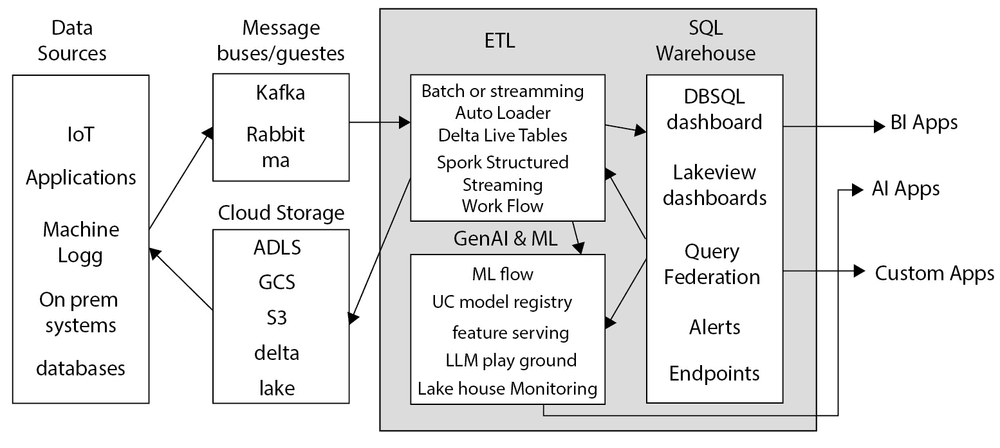

图 2.1 – 湖屋架构概述以及 Databricks DI 平台如何适应这一范式

DI 平台由一个或多个 Databricks 账户组成。大多数情况下，公司只有一个账户。然而，在某些情况下，公司需要额外的环境隔离，并为开发、预生产和生产设置单独的账户是一个选择。关于多个账户用于隔离级别的讨论超出了本书的范围，但如果您有疑问或想了解更多信息，请查看**进一步阅读**中的资源。

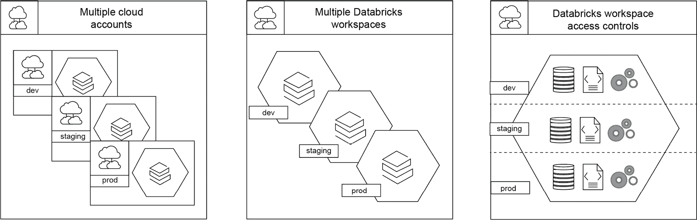

图 2.2 – 环境隔离选项的视觉表示

我们使用不同的目录来分离我们的环境。本书的大部分项目工作都使用`ml_in_action`目录。对于某些模型的生成版本，我们使用`ml_in_prod`目录。设置多个工作区是另一种分离环境的方法。我们建议使用文档和您的公司政策来指导您的隔离设置。让我们继续讨论在 Databricks 环境中工作区究竟是什么。

# 定义工作区

重要的是要知道 Databricks 使用“工作区”一词来指代两个不同的组件：Databricks 的一个实例（意味着您通过唯一的 URL 地址访问的托管 Databricks 部署）以及访问您的工作成果（如笔记本、查询和仪表板）的文件夹环境。

让我们逐一了解这两个组件：

+   **工作区作为一个实例**：一个 Databricks 账户可以连接多个工作区，这意味着 DI 平台的实例已部署，通常可以通过浏览器访问，如前所述，但也可以通过 SDK 或 REST API 访问。

+   `工作区`文件夹用于存储他们的 MLFlow 实验或 Terraform 状态，以便进行管道部署。您还可以在您的个人和项目文件夹中创建和存储笔记本，而不在源代码控制之外。

我们现在对工作区有了更清晰的理解。现在让我们讨论为什么我们选择**Unity Catalog**（**UC**）作为我们首选的元数据存储。

# 选择元数据存储

元数据存储是一个存储数据平台元数据的系统，可以将其视为对象的顶层容器。它注册有关数据库、表、视图、**用户定义函数**（**UDFs**）和其他数据资产的各种信息。元数据包括诸如存储位置和每个资产访问权限的详细信息。

DI 平台中本机提供两种类型的元数据存储：**Unity Catalog**（**UC**）和**Hive Metastore**（**HMS**）。UC 由一个包含目录、数据库（也称为模式）和表名的三级命名空间组成。相比之下，HMS 只使用一个包含数据库和表名的两级命名空间。元数据存储对于您的 Databricks 工作区实例是必需的，因为这是组织和控制数据访问的组件。选择正确的元数据存储是您 DI 平台之旅的早期决策之一，我们建议使用 Unity Catalog。让我们谈谈为什么。

注意在*图 2.3*中，您可以拥有多个分配给同一元数据存储的工作区。**访问控制**和**用户管理**的范围是账户级别，如图所示。一个 UC 元数据存储，一组目录，范围在一个区域，每个区域恰好有一个元数据存储。在区域内，您可以轻松共享**数据**、**特征**、**卷**访问、**函数**和**模型**。

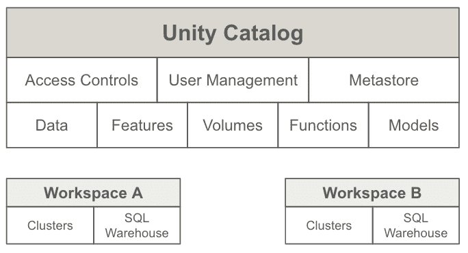

图 2.3 – 具有多个工作区的 Unity Catalog 设计

Unity Catalog 不仅仅是数据资产的一组。UC 还跟踪谁访问了资产，这使得审计变得简单。使用 UC 允许公司轻松管理权限和确保数据及对象的安全，同时能够在不同的工作区之间共享它们。在环境之间安全共享是为什么我们推荐使用 UC 元数据存储的原因之一。

HMS 设计比 UC 更少集中化。例如，从历史上看，工作区作为数据和代码隔离被创建，这意味着有单独的工作区用于不同的隔离级别。这种设计通常需要在开发、测试和生成工作区之外，还有一个集中的模型注册表工作区。如果不使用 UC，每个工作区都需要自己的 HMS 和用户组管理。相比之下，UC 在账户级别而不是单个工作区级别管理所有资产；参见*图 2.3*、*图 2.4*和*进一步阅读*。集中的治理模型提供了更无缝地集成多个工作区的能力。

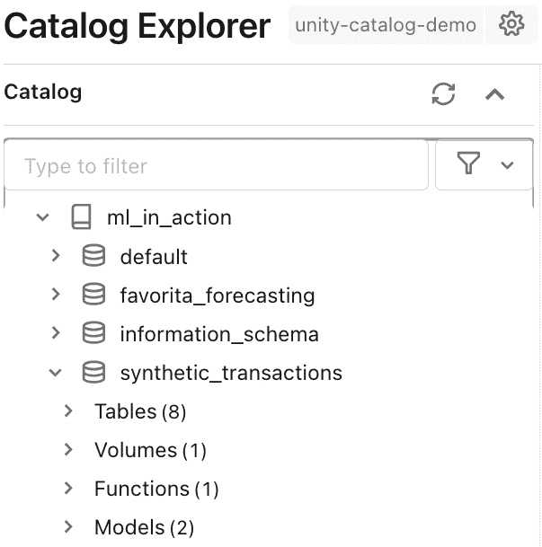

图 2.4 – UC 管理目录下的所有资产，包括数据库、表、卷、函数和模型

在决定您的元数据存储时，不必是一个永久的决定。然而，稍后迁移可能会变得头疼。UC 持续改进并与新的 Databricks 功能集成。选择 UC 而不是 HMS 的原因列表持续增长，我们的建议是从 UC 开始并坚持使用 UC。

要确定 Unity Catalog 是否适合您和您的公司，您可以在*进一步阅读*中查看选择 UC 的限制列表。随着 UC 在功能上的持续扩展，它是未来的道路。特别是对于机器学习，它与特征工程客户端和新的模型注册表集成。使用 UC 模型注册表进行模型共享和管理更简单。我们将在第 5、6 和 7 章中详细介绍 Unity Catalog 中的模型注册表和 Databricks 特征工程客户端，但如果您现在就好奇并渴望了解更多，您可以在*进一步阅读*部分查看“在 Unity Catalog 中管理模型生命周期”。鉴于使用 UC 的理由不断增多，本书中的所有项目代码都将使用 UC。

## 定义数据存储的位置和云对象存储

所有数据产品都始于数据，因此我们如何使数据对数据团队可访问是另一个重要的早期设计选择。Databricks 是一个基于云的平台，可以连接到云对象存储 – **Azure Data Lake Storage** (**ADLS**), Amazon **Simple Storage Service** (**S3**), 或 **Google Cloud Storage** (**GCS**)。计算和存储是分离的。Databricks 负责计算；数据存储在云对象存储中。

最初，数据必须在 DI 平台被利用之前存储在云对象存储中。现在，**查询联邦**允许客户无论数据存储在哪里都可以查询他们的数据（请参阅文档了解任何可能的限制），无需首先担心从远程系统进行摄取和数据工程。然而，这是内存中的数据，而不是持久数据。您可以通过多种方式将数据存放在云存储中。有许多文档资源和外部工具可用于在云存储中实际存放数据。这些可能取决于您选择的云服务提供商。尽管存储数据在您的云存储中是最佳实践，但使用**Databricks 文件系统（DBFS**）来存储本书示例项目中的数据也是可能的。

DBFS 是由 Databricks 提供的共享文件系统，所有给定工作区的用户都可以访问。存储在 DBFS 中的任何数据都可能对所有用户可访问，无论他们的组、角色或权限如何。因此，只有您愿意在组织内公开共享的非敏感和非生产数据才应该存放在 DBFS 中。非敏感数据的例子包括公开可用的*Kaggle*数据集。正是由于缺乏治理，我们建议将数据存储在 Databricks 卷中，在那里您可以应用治理。我们将在本章的最后部分更详细地介绍卷。

当涉及到云存储时，结构化数据的最佳格式几乎总是 Delta，我们在*第一章*中详细讨论了这一点。当一个表以 Delta 格式存储时，我们将其称为 Delta 表。您可以选择将表设置为“管理”或“外部”表。在这本书中我们使用这两种类型的表（当需要时，选择是合理的）。请参阅*进一步阅读*资源，了解更多关于两种类型表的信息。

## 讨论源控制

是否使用源控制通常不是问题。问题是某人应该如何使用它？Databricks 有一些功能可以帮助源控制。

第一项是笔记本中内置的版本历史记录。每个笔记本的更改历史在提交到远程仓库（使用 Git）之前就被跟踪了。版本跟踪的好处在于我们并不总是准备好进行 Git 提交，但仍然想要跟踪进度和协作。如果您不小心将某人的代码拉入您的工作远程分支，并且忘记在之前推送您的代码，这也会是一个变革性的变化。笔记本的历史记录将保留您的编辑副本，这样您就可以简单地回滚时间并恢复所有工作！

第二个特点是轻松将工作空间中的笔记本和文件连接到远程 Git 仓库。历史上，将 Jupyter 笔记本保存到远程仓库对于代码审查、共享和差异比较来说是一个技术噩梦。Databricks 代码仓库集成允许 Databricks 笔记本包含多种语言（Python、Scala、SQL）并像典型的 Python 文件一样跟踪它们。这种将笔记本作为标准文件在源中跟踪的能力，对于想要审查笔记本的数据工程师和科学家来说是一个改进，与之前将文件转换为 Python 并丢失所有输出和图像相比。每次保存笔记本时自动将笔记本保存为常规 Python 文件的钩子设置的日子已经过去了。

当然，你可以存储标准文件格式，如 markdown、分隔符分隔、JSON 或 YML，以实现整个可重复性方法。请注意，除非是测试用的数据样本，否则我们不推荐在仓库中保留数据。

在一个仓库中，团队如何定义每个项目的预期文件夹结构通常不如该结构的持续使用重要。然而，定义你的项目结构仍然很重要。我们建议阅读*《MLOps 大全书》*（Joseph Bradley，Rafi Kurlansik，Matthew Thomson 和 Niall Turbitt，2023，*《MLOps 大全书，第二版》*，[`www.databricks.com/resources/ebook/the-big-book-of-mlops`](https://www.databricks.com/resources/ebook/the-big-book-of-mlops)）以确定最适合你团队或组织的结构。正如我们将在未来的章节中看到，MLflow 和仓库对于**可重复研究**至关重要。在数据科学和机器学习的特定领域，我们希望确保模型和实验的可重复性。

# 讨论数据准备

通常，任何数据科学项目的第一步是探索和准备数据。我们将这个过程称为根据 Medallion 架构方法将数据从“Bronze”层移动到“Silver”层。你可能认为这种类型的数据转换仅是数据工程任务，但它对于数据科学和机器学习也是至关重要的。

如果你不太熟悉这种架构术语，**Medallion 架构**是一种用于在仓库中逻辑组织数据的数据设计模式。这种架构也通常被称为“多跳”架构。它的目标是随着数据流过每一层而逐步和渐进地改进数据的结构和质量。Medallion 架构有三个层次：Bronze、Silver 和 Gold，如下所示：

+   **Bronze**层是原始数据层。它包含从源系统摄取的所有原始、未处理的数据。这些数据仍需要被清理或转换。

+   **银**层是经过验证的数据层。它包含经过清理且已接受各种验证和转换步骤的数据。这些数据可用于分析和建模。

+   **金**层是增强数据层。它是最高级别，包含添加了额外信息的数据，如商业智能指标和关键绩效指标（KPIs），以满足业务用户的需求。

Medallion 架构是一种灵活且可定制的架构，可以满足每个组织的特定需求。Medallion 架构与 Data Mesh 概念兼容。Data Mesh 是一种架构和组织范式，旨在确保数据的价值。Lakehouse 和 Data Mesh 是互补的范式。参见*进一步阅读*部分，了解如何利用 DI 平台利用数据网格的博客文章。这种分布式数据架构使组织能够通过使组织中的每个人都能访问和使用数据来释放数据的价值。

通信和协作对于数据准备过程至关重要。这一步骤涉及识别和纠正错误、填补缺失值以及解决数据中的不一致性。你所采取的行动应该作为团队讨论并记录下来。当跨数据团队协作时，这一点尤为重要，因为数据工程师和数据科学家往往对数据应该如何准备有不同的看法。例如，我们见过工程师在一个列中用零插补所有缺失值的情况。这种合理化是有道理的；列中已经有很多零了，这使得关键绩效指标（KPIs）的值正确显示。然而，从建模的角度来看，缺失数据与零不同，特别是如果数据集中已经存在零的话。用零替换空值的方法并不一定是不正确的；它只需要与数据下游的消费者进行讨论。一个有用的沟通工具是 Databricks 目录 UI 中的列标记功能。参见*图 2.5*的示例：

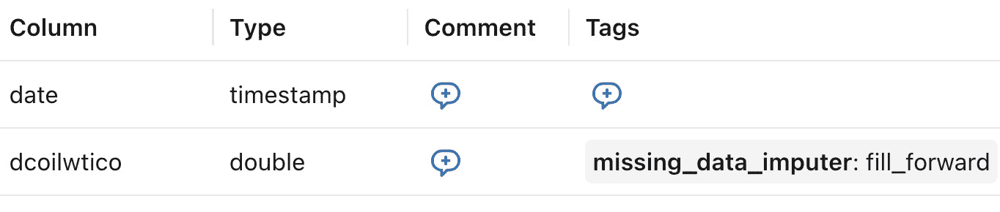

图 2.5 – 在目录中使用标记的示例，以向所有表用户传达对列进行的转换

这种不正确的插补方法的实现也作为一个想要回溯和重新处理历史的例子。幸运的是，使用 Medallion 架构方法论是一种救赎。在之前提到的情况下，所选的插补方法只会出现在银和金数据层中。同时，青铜层仍然包含原始的原始数据，因此真相来源并未丢失，重新处理是可能的。

Databricks 平台提高生产力和协作的一种方式是支持笔记本的实时协作功能。这个功能允许两个人或更多人同时查看和编辑一个笔记本。在疫情期间，能够在虚拟上结对编程对许多人来说是一个救星。我们非常欣赏那些在我们职业生涯的大部分时间里远程工作的人。与通过视频通话共享代码相比，笔记本的协作编辑要容易得多。虽然有许多代码审查的选项，但历史上，在笔记本中审查代码一直很困难，尤其是在将笔记本提交到源控制时。

完成转换后，使用笔记本中的 Markdown 进行文档编写变得容易。即使结果笔记本本身并未指定用于生产 ETL，但记录数据转换的如何和为什么对所有下游用户来说都很重要。要了解更多关于 Databricks 笔记本的信息，请参阅*进一步阅读*中的文档。

# 计划创建功能

数据工程师可能从银表构建金表以供业务使用。同时，数据科学家正在从相同的银表中构建特征以用于模型。如果我们不小心，两个没有沟通的独立工作者可能会创建相同指标的不同的版本。在架构你的统一 DI 平台时，务必考虑可重用性和可维护性。因此，对于功能而言，我们推荐功能即代码的方法。功能即代码是指软件开发实践*一切皆代码*，重点是创建一个可重用代码的仓库来定义特征，而不是将特征存储在表中。

你可以通过多种方式实现功能即代码。最初，我们主要关注函数的可重用性。你可以将你在多个笔记本或脚本中执行的功能放置在仓库根目录下的一个文件夹中。在*应用我们的学习*部分，你会看到即使不是在计算特征本身，我们也会在这里存储函数。我们称之为 utils。在整个示例项目中，你将引用`mlia_utils`笔记本。

你可以在 GitHub 仓库的根目录中找到`mlia_utils`函数（[`github.com/PacktPublishing/Databricks-Lakehouse-ML-In-Action`](https://github.com/PacktPublishing/Databricks-Lakehouse-ML-In-Action)）。我们在*应用我们的学习*部分中介绍了将 GitHub 仓库拉入 Databricks 的过程。在其中，你会找到包含我们将用于项目的有用函数的 Python 文件。最佳实践是保存、共享和跟踪函数，以确保我们计算出的指标和特征是一致的。注意，空的`__init__.py`文件也在`utils`文件夹中。拥有一个`__init__.py`文件是必需的。有了这种结构，我们可以将所有函数作为导入使用，例如，从`mlia_utils.rag_funcs`导入`extract_doc_text`。

特征即代码不仅是一种通过重用函数来减少重复工作的方法。它也是一种确保一致业务指标的好方法。例如，在线广告通常对不同类型的收入有复杂的计算。因此，如果其他人或团队以不同的方式计算业务关键指标，将很难确定真正的指标值。相反，你通常可以通过提供经高管批准的函数来避免这种混淆。我们将在 *第五章* 和 *第六章* 中再次讨论这个问题。除了特征集中存储且更容易找到之外，Databricks 还提供了轻松记录你的数据资产的方法。

创建一个需要团队记录表格和函数描述的业务流程，可以使当前和以往的努力更容易被发现。在 Databricks 目录 UI 中，你应该会看到 *AI 生成* 的建议来填写你的表格和列描述，这样你就不必从头开始。记录在数据表上执行转换的另一种好方法是使用标签。标签可以帮助进行文档和沟通。回想一下缺失数据被插补的例子（*图 2**.5*）。

更具体地关注 ML 特征，你将学习如何存储和提供特征函数以简化你的最终部署过程。你将创建一个按需特征函数并在你的模型中使用它。我们还将向你展示如何利用保存的特征表创建训练集。如果你想立即跳过，请参阅 *第五章*，其中我们涵盖了按需特征函数、特征查找、同步到在线商店以及 Databricks 特征工程客户端等主题。

# Databricks 中的建模

在创建并存储为特征表的特征之后，我们创建训练集并专注于模型训练。我们将讨论如何利用 Databricks 促进模型生命周期的建模（*第六章*）。在第 *第七章* 中，我们将讨论 Unity 目录注册表及其如何用于跟踪关联实验的大量信息，包括模型血缘等细节。你可以在每个阶段注册多个版本的模型，并可以为这些不同版本提供别名，例如 **冠军** 和 **挑战者**，或者更具体的别名，用于 A/B 测试中的版本 A 和 B。参见 *图 2**.6* 中的别名示例。

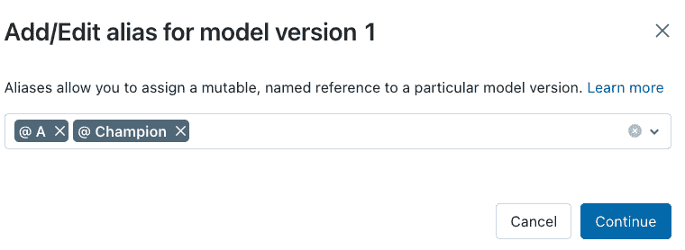

图 2.6 – 用户可以为 A/B 测试或多臂老虎机游戏为模型指定特定名称进行别名设置

在*第七章*中，我们演示了如何触发测试脚本以在人工审查之前测试每个模型。当持续且有意地使用时，测试模型是一种提高将模型/代码过渡到生产环境时间的有效实践。我们建议定义成功通过隔离环境（从开发到预生产再到生产）的模型/代码的准则。明确定义的环境是使您能够跨所有模型创建清晰和一致模型质量预期的实践之一。务必查阅*《MLOps 大全》*以了解隔离和模型提升的最佳实践。无论您的环境在哪里，将日志记录纳入模型实验都是有益的。

我们在机器学习上下文中讨论日志记录，而不是软件开发意义上的日志记录。机器学习中的日志记录侧重于可重复研究，也称为实验跟踪。跟踪以下内容是常见做法：

+   训练模型所使用的输入数据

+   训练模型所使用的参数

+   模型在训练和推理过程中的准确性和速度性能

+   训练和推理过程中发生的错误

+   模型的运行环境

当使用 MLflow 时，您可以使用一个名为自动记录或自动记录的强大功能。自动记录非常出色，因为它使得跟踪机器学习实验的参数、指标和工件变得容易，无需显式指令。

注意

自动记录仅跟踪 MLflow 支持的风味。不支持自定义 *pyfunc* 模型。更多信息，请参阅*进一步阅读*。

MLflow 自动记录在单个实验中记录每个运行的参数值和模型。每次您训练和评估模型时，MLflow 都会记录您的标准指标和参数。如果您有与模型一起跟踪的自定义指标，也可以轻松添加。我们在*第六章*中演示了跟踪自定义指标，当时我们记录了流式事务模型的参数。

管理员可以在工作空间级别为所有附加到交互式集群的笔记本启用自动记录。在集群级别，您可以将 `spark.databricks.mlflow.autologging.enabled=true` 添加到集群配置的高级部分以在集群范围内开启自动记录。在笔记本范围内启用自动记录虽然不常见但可行，通过在笔记本中的一个 Python 单元中添加 `mlflow.autolog()` 实现。务必检查自动记录支持的建模风味列表。

默认情况下，MLflow 将跟踪项保存在 DBFS 中的托管文件夹中（未来将在 UC 中）。您也可以设置 `artifact_location` 以指向卷路径，这是我们示例项目中所做的。您还可以选择将位置设置为另一个云存储位置，尽管这样做将消除在 MLflow UI 中查看实验的能力。

The MLflow UI makes it incredibly easy to compare each trail; see *Figures 2.7* and *2.8*.

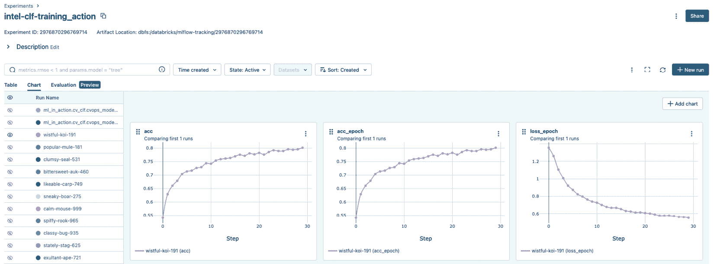

图 2.7 – 使用 MLflow UI 比较实验运行

There are numerous options for visualizing the results of experiments tracked using MLflow.

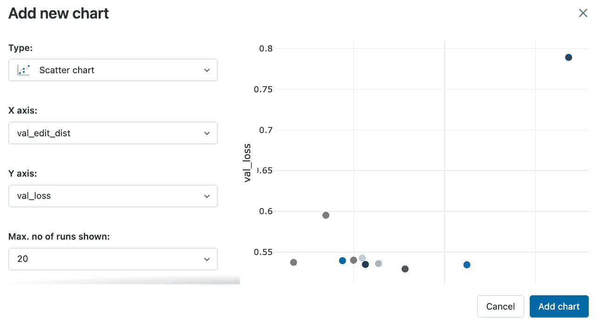

图 2.8 – 在 MLflow UI 中图形化比较参数和模型性能

我们已经探讨了如何使用 MLflow UI 比较实验中的参数和模型性能。接下来，我们将看看如何使用模型监控（Lakehouse 监控）来跟踪模型随时间的变化性能。

## 监控数据和模型

当我们思考模型监控及其实现方式时，它就不再仅仅是关于模型本身，而是更多地关注模型的输入和输出。因此，Databricks Lakehouse 监控专注于监控模型的输入和输出，这仅仅是数据。表指标的计算是在后台使用无服务器计算完成的，或者正如我们喜欢称之为的，托管计算。完全托管的计算抽象掉了复杂性和优化，因此用户只需关注要监控哪些表，即主表，而不是如何操作。Lakehouse 监控目前处于公开预览阶段，这意味着并非所有信息都准备好发布。有关此功能的最新信息，请查看 Lakehouse 监控产品页面。我们在第四章和第七章中演示了如何使用 Lakehouse 监控。

到目前为止，我们已经涉及了许多主题，从设置 Databricks 数据智能平台时的早期设计决策，到本书余下部分我们将涉及的关键主题。现在让我们深入到示例项目中。准备好在您自己的 Databricks 工作区中跟随操作，您将在设置工作区时进行操作。

# 应用我们的学习

本章的“应用我们的学习”部分专注于设置您的 Databricks 工作区，使其为我们将要工作的每个项目做好准备。我们还将介绍如何在 Kaggle 上设置，以便您可以下载本书余下部分我们将使用的数据集。让我们开始吧！

## 技术要求

在我们开始设置工作区之前，请查看完成本章动手实践所需的技术要求：

+   我们使用 Python 包，`opendatasets`，从 Kaggle API 轻松下载所需数据。

+   我们使用 Databricks Labs Python 库，`dbldatagen`，来生成合成数据。

+   要使用 Kaggle API，您必须下载您的凭证文件，`kaggle.json`。

+   GitHub 账户对于连接 Databricks 和本书的代码仓库（[`github.com/PacktPublishing/Databricks-ML-In-Action`](https://github.com/PacktPublishing/Databricks-ML-In-Action)）很有帮助。除了 GitHub 账户外，将本书仓库分叉到您的 GitHub 账户也是理想的。您会看到每个章节都有一个文件夹，每个项目都在章节下有文件夹。在整个项目工作中，我们将通过名称引用笔记本。

+   我们将使用 Databricks Secrets API 来保存 Kaggle 和 OpenAI 凭证。Secrets API 需要使用 Databricks CLI。我们将逐步介绍此设置。但是，您需要在配置步骤中自己创建一个**个人访问令牌**（**PAT**）：[`docs.databricks.com/en/dev-tools/auth/pat.html`](https://docs.databricks.com/en/dev-tools/auth/pat.html)

+   我们使用的计算集群如下（它们根据您的数据云略有不同）：

    +   单节点 CPU 配置

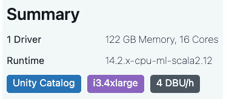

图 2.9 – 单节点 CPU 集群配置，DBR ML 14.2

这将适用于本书中的大多数工作负载。

# 设置您的开发环境

如前所述，本节中讨论的工作空间指的是部署实例。在这里，我们将讨论工作空间设置建议、项目设置文件以及本书中使用的每个数据集的下载说明。

首次部署工作空间有详细的文档说明。如果您还没有 Databricks 账户和已部署的工作空间，那么您有几个起点。一种方法是进入您的云账户并通过市场激活 Databricks。另一种方法是直接从 Databricks 网站开始。对于更高级的用户，考虑使用 Terraform。鉴于大量的文档和不断变化的技术世界，我们将激活工作空间的练习留给您自己。

一旦我们部署了工作空间，我们就可以开始设置它。通常，我们从用户组和治理开始。设置 Unity Catalog 的体验经常更新以简化。因此，我们建议您观看最新的视频文档了解如何进行（见*进一步阅读*）。无论使用平台的数据角色如何，过程都是相同的。请确保在继续之前完成元存储和治理设置。

## Kaggle 设置

您需要一个 Kaggle 账户来下载我们将要使用的 Kaggle 数据集，这些数据集需要 API 令牌进行身份验证。存在官方的 Kaggle API，但还有许多其他方式可以连接到 Kaggle 下载数据以及与 Kaggle 网站交互。所有方法都需要从 Kaggle 网站下载您的 API 凭证文件，`kaggle.json`。在下载数据之前，您需要使您的凭证可访问。以下有三种实现此目的的方法：

+   将 `kaggle.json` 文件添加到您的项目文件夹。如果您选择这样做，请注意，您的凭据对其他人可见，即使只有管理员。此外，将 `kaggle.json` 添加到您的 `.gitignore` 文件中，以防止将凭据提交到仓库，并确保您不会将凭据提交到 Git 仓库。

+   `.gitignore` 文件以防止将凭据提交到仓库。然而，根据您的角色，您可能无法控制删除其他用户的访问权限。此外，通常管理员可以查看所有文件。

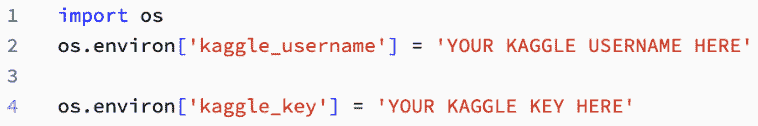

**图 2.10 – 将用户凭据传递给笔记本**

+   **选项 3**：使用 Databricks 机密存储和检索您的用户名和令牌，以实现最佳安全性，如**图 2.11**所示。这是我们用于下载图片的方法。

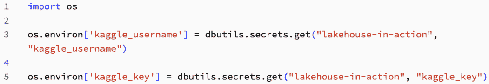

**图 2.11 – 使用机密存储和检索您的用户名和令牌**

此代码位于 `global_setup.py` 中，但您也可以将其放在笔记本本身中

+   使用 `o``pendatasets` 库在下载时粘贴您的凭据。这是一种安全的数据下载方式，因此我们使用 Favorita 销售数据来演示这一点。

我们将在稍后介绍 `global-setup.py`。文件的最后一部分是设置您的 Kaggle 凭据。我们建议设置一个包含凭据的秘密范围。一旦您有一个集群运行，我们将向您展示如何设置，因此无需四处跳跃。现在，只需下载您的 Kaggle 凭据即可。

### 设置我们的 GitHub 仓库

第一件事是从 GitHub 仓库拉取您将在整本书中使用的代码。

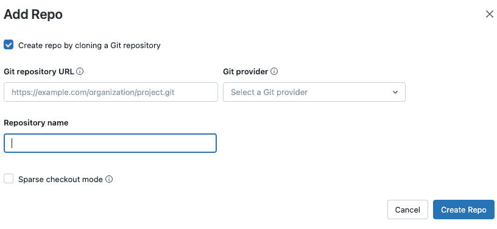

](img/B16865_02_12.jpg)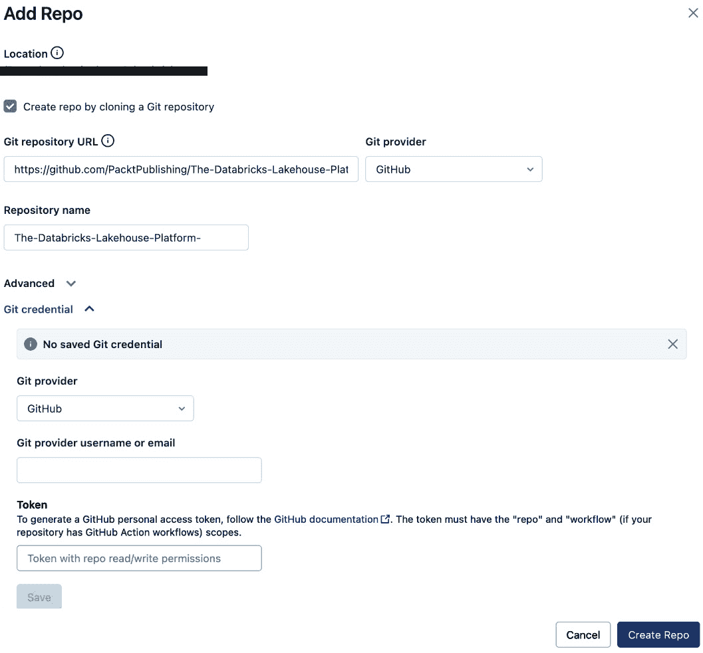

**图 2.12 – 设置 Git 仓库：工作区 > 仓库 > 主文件夹 > 添加 > 仓库**

导航到在“应用我们的学习”部分下的“技术要求”部分中提到的书的 GitHub 仓库分支。您可以将 HTTPS 链接复制并粘贴到**添加仓库**屏幕的 URL 部分，如**图 2.12**所示。接下来，您将链接您的 GitHub 账户。如果您不确定如何操作，请遵循**进一步阅读**部分中链接的文档，标题为**关于个人访问令牌**和**设置 Databricks 仓库**。一旦您的仓库准备就绪，如果还没有人这样做，您就可以创建一个集群。

### 创建计算

我们在 *技术要求* 部分提供了本项目使用的集群配置。如果您愿意，可以使用相同的配置。创建新的集群配置时，有多种选项可供选择。对于新用户来说，这可能会显得复杂，但在尝试选择正确的配置时请保持冷静。我们强烈推荐在 *进一步阅读* 链接中的 *集群配置最佳实践* 作为指导，特别是如果您负责为一或多个团队设置计算资源。让我们讨论一些与机器学习和本书相关的计算选项：

+   **多节点与单节点**：多节点非常适合分布式项目（例如 Spark）。单节点适用于在驱动程序上执行的项目或工作负载（例如 scikit-learn 或 pandas）。

+   **访问模式**：某些集群配置支持 Unity Catalog，而有些则不支持。为本书中的项目选择支持 UC 的集群。

+   (`pyenv`)。您将在集群级别和几个项目笔记本中安装库。您可以在 *图 2.13* 中的 **库** 选项卡中看到。只需点击 **安装新库** 即可安装新库。

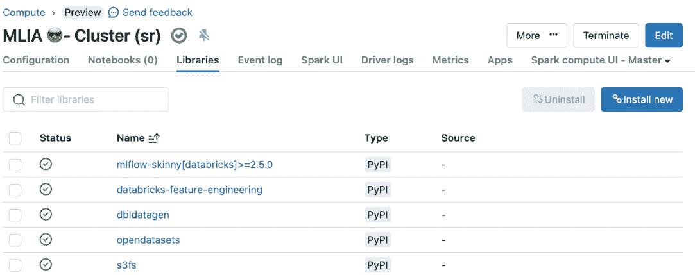

图 2.13 – 向《机器学习实战》（MLIA）集群配置中添加库

这是安装所需库的理想时机。通过 `PyPI opendatasets`、`dbldatagen`、`databricks-feature-engineering` 和 `mlflow-skinny[databricks]>=2.5.0` 进行安装。这些库在本书的多个笔记本中都会用到。

+   **Photon 加速**：Photon 是一个加速引擎，可以加快 ETL 和 SQL 工作负载。目前，Photon 对于标准机器学习建模并没有优势。

+   **虚拟机类型**：有众多虚拟机可供选择。您可以从下拉列表中选择按家族分类的虚拟机。如果您需要更多澄清或刚开始，可以从 *通用目的* 组的虚拟机开始。

+   **最小和最大工作节点数**：一般建议从少量最大工作节点开始，随着工作负载的增加逐渐增加工作节点数。请记住，您的集群会自动为您进行扩展。然而，我们仍然建议对于仅计算密集型示例（例如多标签图像分类深度学习项目中的某些笔记本），只从小规模开始，并逐步扩展。

您现在已设置好开发环境。您可以为代码中的安全使用锁定凭证。

### 设置 Databricks CLI 和密钥

Databricks CLI 是 Databricks 的命令行界面。我们建议使用你的集群的 Web 终端来安装 Databricks CLI 以及创建 Databricks 秘密。正如我们在本章前面提到的，有其他选项可以访问 Kaggle 数据集，但我们在本节中引导你设置秘密。请参阅*进一步阅读*中的文档以获取有关 CLI、安装、使用和秘密的更多详细信息。

1.  前往你在上一节中设置的计算集群的**应用**标签页。你可以参考*图 2.13*来查看**应用**标签的位置。应用仅在集群运行时可用，因此最初可能为灰色。你必须启动你的集群才能继续。

1.  选择 Web 终端。

1.  安装 CLI 的最新版本。`curl -fsSL https://raw.githubusercontent.com/databricks/setup-cli/main/install.sh | sudo sh`

1.  检查你的 Databricks 版本，确保它大于`0.2`。我们必须指向 curl 安装的位置的更新版本。`/usr/local/bin/databricks-v`

1.  接下来，你需要配置连接。你需要你的 PAT 来完成此操作：

    ```py
    /usr/local/bin/databricks configure
    ```

1.  为存储与本书相关的凭据创建一个秘密作用域：

    ```py
    /usr/local/bin/databricks secrets create-scope "machine-learning-in-action"
    ```

1.  创建一个秘密来存储你的 Kaggle 用户名：

    ```py
    /usr/local/bin/databricks secrets put-secret --json '{"scope": "machine-learning-in-action",
    "key": "kaggle_username",
    "string_value": "readers-username"
    }'
    ```

1.  创建一个秘密来存储你的 Kaggle API 密钥：

    ```py
    /usr/local/bin/databricks secrets put-secret --json '{
    "scope": "machine-learning-in-action",
    "key": "kaggle_key",
    "string_value": "readers-api-key"
    }'
    ```

1.  最后，列出你的秘密以确保一切按预期工作：

    ```py
    /usr/local/bin/databricks secrets list-secrets "machine-learning-in-action"
    ```

在*第八章*中，我们将创建另一个作用域来存储 OpenAI API 密钥，但到目前为止我们只需要 Kaggle 凭据。现在我们已经设置了秘密，让我们准备好我们的代码库！

### 设置你的代码库

我们使用设置文件来帮助保持多个项目笔记本中变量的一致性。每次你使用魔法命令`%run`运行项目笔记本时，你都会运行设置文件。这个命令将所有内容带入你的笔记本会话的内存中。`global-setup.py`文件有许多组件。让我们逐一介绍每个部分。你可以自由地编辑文件以适应你的需求。

注意

你可能会收到一个错误消息：`py4j.security.Py4JSecurityException: Method public scala.collection.immutable.Map com.databricks.backend.common.rpc.CommandContext.tags() is not whitelisted on class` `class com.databricks.backend.common.rpc.CommandContext`

这是因为你在一个共享的计算集群上。你可以简单地将`current_user`硬编码到你的用户名中。

### 通过小部件传递变量

小部件将变量传递到笔记本中，类似于命令行参数将变量传递到 Python 脚本中。*图 2.14*中的代码块创建了所需的小部件，用于使用 Databricks 实用工具或`dbutils`将`Run`命令中的变量传递到`global-setup.py`文件。你可以在*进一步阅读*中的 Databricks 实用工具文档中了解更多关于`dbutils`的功能。这些小部件创建、传递和访问参数。参数的顺序是变量名、默认值和详细名称。

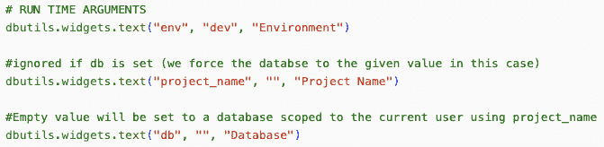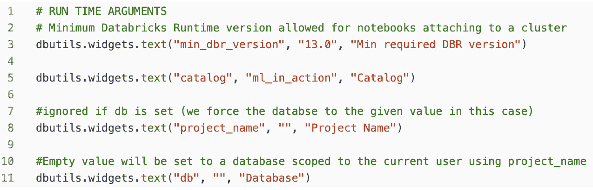

图 2.14 – 创建接受笔记本特定变量的小部件

您可以通过在笔记本顶部添加带有适当参数的单行单元格来在运行文件时传递每个变量，如图*图 2**.1**5*所示。


图 2.15 – 在我们的全局设置文件中运行项目特定变量

运行`global-setup.py`将脚本中定义的所有变量保存在内存中，以便于引用。

### 检查兼容性

接下来，在`global-setup.py`中，我们运行代码库和笔记本附加的集群之间的兼容性检查。

兼容性代码块检查以下内容：

+   一个项目名称被提交为一个变量。

+   集群配置了 ML 运行时并满足最低版本要求。为了确保代码中的所有功能都在使用的运行时中可用，我们设置了最低版本。

一旦所有检查都通过，我们分配用户和路径。

### 设置默认目录和项目特定数据库

本书提供了使用 Unity Catalog 目录的代码。您的默认目录基于您的环境设置。如果您没有设置环境或将其设置为`dev`，则目录名为`ml_in_action`。当环境为`prod`时，目录为`ml_in_prod`。数据库的默认名称始终是项目名称。但是，如果您希望提供不同的名称，可以通过输入数据库名称的项目变量来实现。

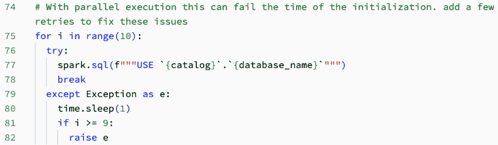

图 2.16 – 使用定义的变量通过重试设置默认值

我们要确保目录和数据库设置为笔记本的默认值。偶尔，在并行执行时，此命令在初始化过程中可能会失败；因此，我们添加了一些重试来解决这个问题，如*图 2**.16*所示。

### 授予权限

现在我们已经设置了目录和数据库的默认值，我们可以授予权限。

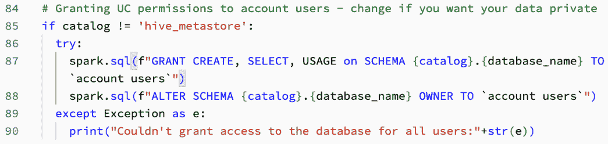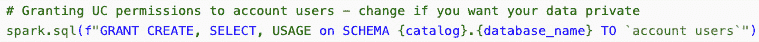

图 2.17 – 授予目录和数据库权限

我们授予`account users`组权限。如果您不希望将您的资产提供给其他人，请删除此权限或将其注释掉。

重要提示

在授予权限时，务必在您的组名或电子邮件地址周围使用勾号。如果您使用单引号，您将收到错误消息。

目录和数据库已准备好用于表格。然而，我们用于机器学习的并非所有数据都进入表格。对于其他数据、文件和对象，我们有卷。

### 设置卷

卷是云对象存储的视图。我们创建特定于项目的卷。使用它们进行基于路径的访问，以访问结构化或非结构化数据。卷位于目录下的数据库中，用于管理和提供对数据文件的访问。你可以使用 `GRANT` 语句来管理对卷的访问。卷提供可扩展的基于文件的存储，而不牺牲治理。我们通常在机器学习中使用非结构化、半结构化或非表格数据。图像是我们将在多标签图像分类项目中使用的非结构化、非表格数据的良好示例。为了处理这些图像，多标签图像分类项目使用卷。

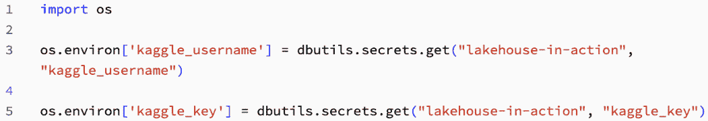

图 2.18 – EndpointApiClient 类

## 开始项目

我们已经规划了我们的平台并设置了我们的工作区环境。接下来，让我们逐一处理每个项目。在 GitHub 中，你会看到每个章节都有一个包含对应每个项目文件夹的文件夹。当我们按名称引用笔记本时，我们假设你处于适当的章节和项目文件夹中。例如，本章的第一个笔记本是：

```py
Chapter 2: Designing Databricks: Day One/
  Project: Favorita Store Sales - TimeSeries Forecasting/
CH2-01-Downloading_Sales_Forecast_Data
```

我们只通过文件名本身来引用笔记本，`CH2-01-Downloading_Sales_Forecast_Data`。让我们开始第一个项目。

## 项目：Favorita 店铺销售 – 时间序列预测

回想一下 *第一章*，我们使用 Kaggle 提供的数据集来预测销售。在本章中，我们从 Kaggle 网站下载我们的数据。为了在你的工作区中跟随，请打开以下笔记本：

+   `CH2-01-Downloading_Sales_Forecast_Data`

在笔记本中，以及在此处 *图 2.19 和 2.20* 中的代码中，我们设置了我们的路径并从 Kaggle 下载了我们的数据。

首先，我们指定 `raw_data_path` 来存储文件。

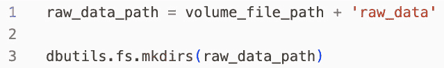

图 2.19 – 设置我们的卷路径

在以下代码块（*图 2.20*）中，我们使用 Python 包 `opendatasets`，这是一个专门创建来从 Kaggle API 下载数据的库。你可以在 *进一步* *阅读* 部分找到更多信息。

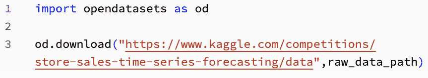

图 2.20 – 从 opendatasets 下载 Favorita 数据

本章关于 *Favorita 店铺销售* 项目的内容就到这里！现在，我们可以专注于为我们的 `流式` `事务` 项目生成数据。

## 项目：流式事务

在流式事务项目中，你的目标是构建一个用于分类事务的模型。数据集由具有 `Transaction`、`timestamp`、`Label`、`Amount` 和 `CustomerID` 的 JSON 格式的事务组成。

在后面的章节中，你将添加一个产品列以展示模式演变。在本章中，你将创建本书其余部分使用的第一个版本的事务数据。为了在你的工作区中跟随，请打开以下笔记本：

+   `CH2-01-Generating_Records_Using_DBKS_Labs_Datagen`

您可以在我们处理它们时运行笔记本中的每个单元格，或者一次性运行它们。在设置命令之后，我们设置笔记本变量以确定每批交易生成的行数（`nRows`）、每批正标签行数（`nPositiveRows`）、您将存储 JSON 数据集的卷路径（`destination_path`）、临时路径（`temp_path`）以及您生成每批数据之间的秒数（`sleepIntervalSeconds`）。

以下代码块访问`Reset`小部件的值。如果小部件设置为`True`（其默认值），则已写入卷中的任何数据将被删除。

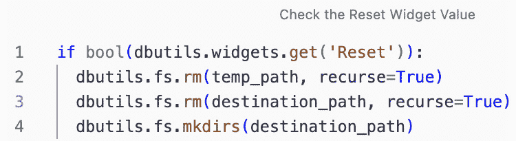

图 2.21 – 检查 Reset 小部件

接下来，我们设置数据生成器中用于创建交易的参数值。我们为每个`CustomerID`设置最小值和最大值。我们还创建了一个产品类型字典，并设置了`min`、`max`、`mean`、`alpha`和`beta`变量，您可以使用这些变量根据分布生成随机的交易金额。

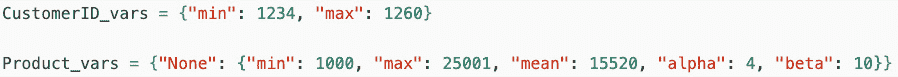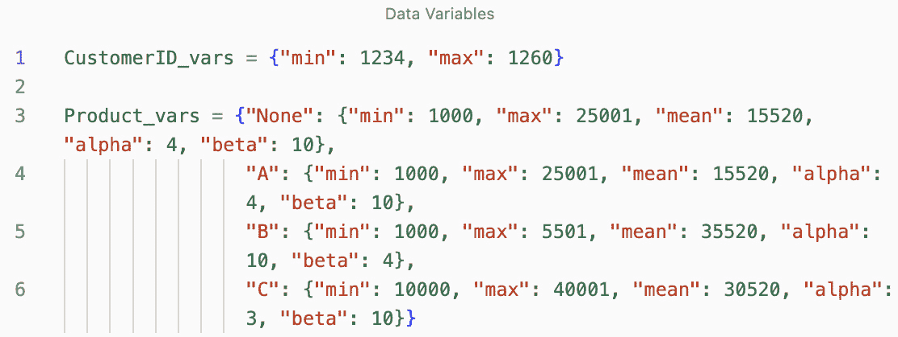

图 2.22 – 保存用于 define_specs 函数中使用的变量的字典

变量设置完毕后，我们构建创建交易数据的函数，从`define_specs`函数开始。该函数接受产品类型（在图 2.22 中的字典中定义）作为输入，一个正标签或负标签，以及一个时间戳；它返回交易的金额。图 2.23 显示了代码的一部分；其余部分在配套的笔记本中。

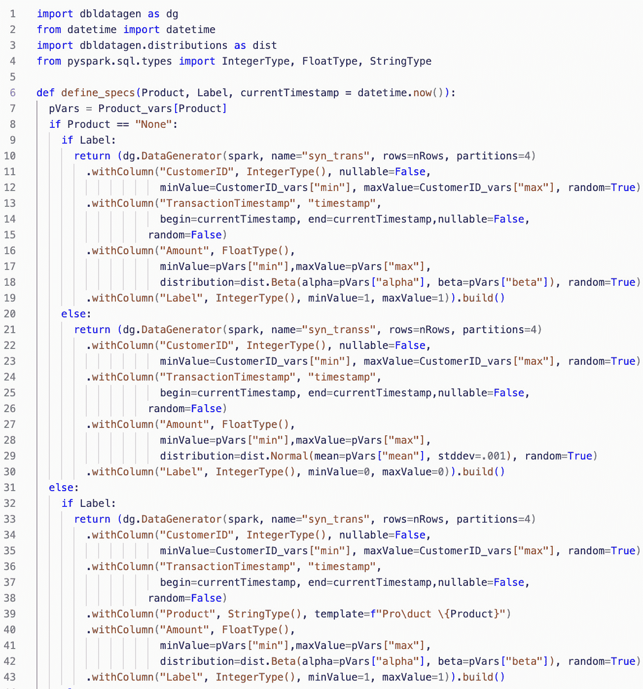

图 2.23 – 定义 define_specs 函数以生成交易记录

接下来，我们编写一个函数，通过调用`define_specs`并包含当前时间戳来生成单个记录。

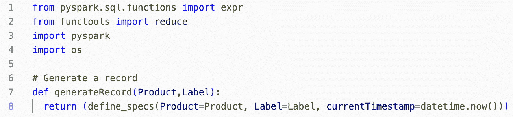

图 2.24 – 定义一个生成单个交易记录的函数

然后，我们构建`generateRecordSet`以生成每批中的`recordCount`个记录。请注意，在这个笔记本中，我们使用的是`None`产品类型，因此生成的记录将只有四个特征：`CustomerID`、`TransactionTimestamp`、`Amount`和`Label`（这在下一章中将非常重要！）。

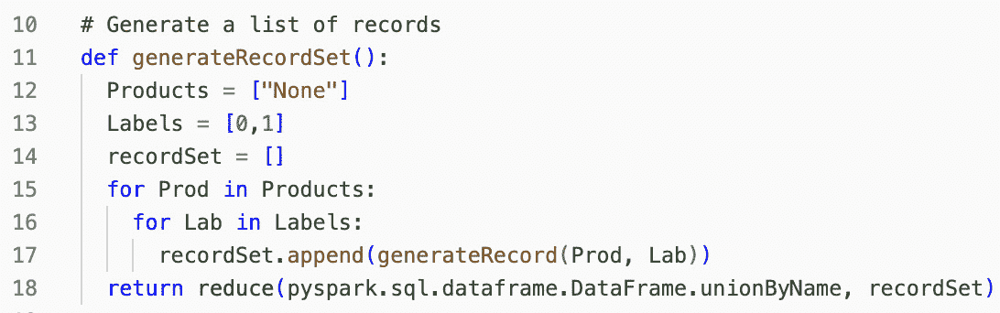

图 2.25 – generateRecordSet 函数为每个产品和每个标签创建一个记录。每个记录包含 nRows 笔交易

最后，我们编写一个函数来生成一组数据，将数据转换为 DataFrame，并将其作为单个 JSON 文件写入临时路径。然后，我们将该文件移动到最终卷目标位置。

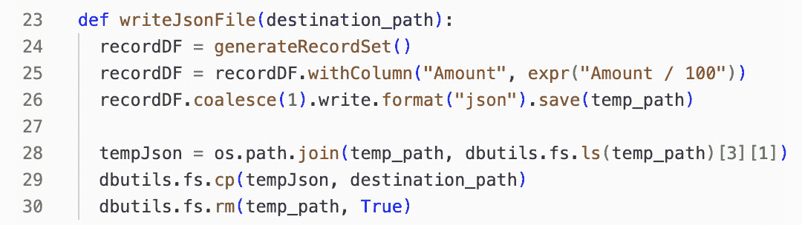

图 2.26 – writeJsonFile 函数生成一组记录

该集合包含作为整数的生成金额，因此我们将它们除以 100，将金额转换为美元并输入浮点数。该函数将 JSON 文件写入`temp`目录，然后将单个文件移动到最终目录。

在设置好一切后，使用提供的代码创建数据集。您可以自由增加迭代次数以构建更大的数据集。然后，继续下一个项目！

## 项目：检索增强生成聊天机器人

RAG 聊天机器人项目将摄入 PDF 文档以构建聊天机器人的知识库。我们使用体积来存储 PDF 文件。要在您的空间中跟随，请打开以下笔记本：

+   `CH2-01-Downloading_PDF_Documents`

文件可以直接在 Databricks 控制台的用户界面中上传到体积，如图*图 2**.27*所示；然而，此项目使用笔记本中提供的代码以编程方式下载并保存数据到体积中。

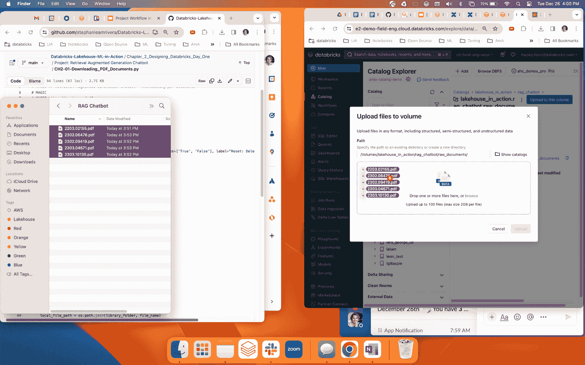

图 2.27 – 手动将文档上传到体积中

本章的代码从设置单元格和辅助函数开始，并在*图* *2**.28*中指定了`library_folder`，我们将在此处保存下载的 PDF 文件。

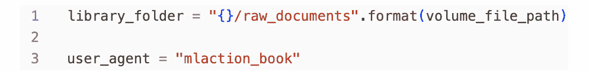

图 2.28 – 指定用于存储此项目文件的库文件夹

我们正在使用在**Arxiv**页面上发布的与**生成式 AI**（**GenAI**）及其如何影响人力市场和经济学相关的开放文章。我们将 URL 传递给用作聊天机器人文档，并将这些文件加载到我们的体积中。

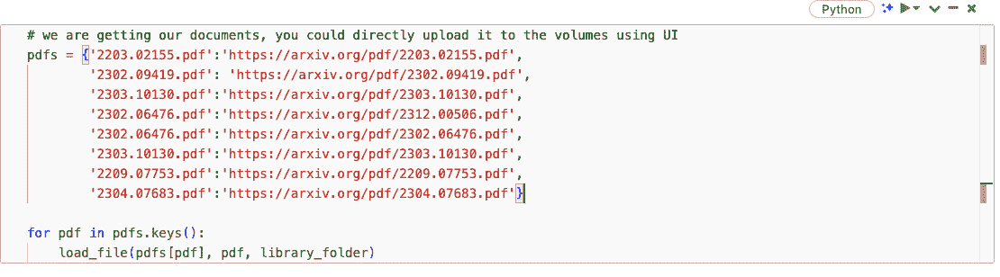

图 2.29 – 下载 PDF 文件并将它们保存到我们的体积中

现在我们已经下载了文档，它们准备好被处理以用于我们的聊天机器人。完成此操作后，我们可以继续我们的最终项目：**多标签** **图像分类**。

## 项目：多标签图像分类

MIC 项目将图像摄入 Delta 表以微调来自*Restnet*家族的预训练模型以提高其准确性。我们将以编程方式从 Kaggle 下载图像并将数据保存到体积中。要在您的空间中跟随，请打开`CH2-01-Downloading_Images`笔记本：

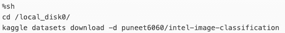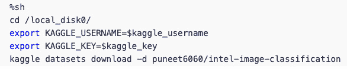

图 2.30 – 使用 Databricks 魔法命令从 Kaggle 下载数据

现在我们创建体积文件夹，并将我们的分类项目的图像解压缩到我们的体积中。提取图像到`Volumes`需要大约一个小时（因为它包含 80K 个图像！）。

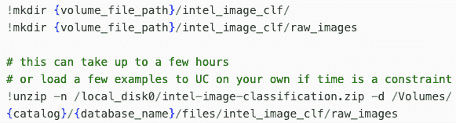

图 2.31 – 将图像解压缩到本项目的卷中

我们已下载或生成了所有四个数据集，它们已准备好在下一章被引入我们的青铜层。

# 摘要

本章涵盖了规划您的数据智能平台的各种设置决策、选项和流程。我们带您了解了 DI 平台的主要组件概述，从早期设计选择到我们将在后续章节中深入探讨的重要功能。您还学习了如何设置您的工作空间和项目代码库。我们希望您对平台的基础知识感到更加自在。随着 Databricks 准备就绪，项目数据已下载，我们现在准备深入了解构建青铜数据层意味着什么。

在 *第三章* 中，我们介绍了在 Databricks 智能平台内构建青铜数据层的要点。我们将数据格式化为最优化格式，了解模式演变、使用 Delta 进行变更数据捕获以及更多内容。

# 问题

以下问题旨在巩固需要记住的关键点，并将内容与您的个人经验联系起来。

1.  Databricks 运行时如何实现稳定性？

1.  我们如何使我们的数据更具可发现性？

1.  设置 Databricks 工作空间需要哪些常见步骤？

# 答案

在思考这些问题后，比较您的答案与我们的答案。

1.  Databricks 运行时通过提供一组一致的库来实现稳定性。

1.  利用内置的元数据功能，例如表和列描述，使我们的数据更具可发现性。

1.  设置工作空间的一些常见步骤是通过市场激活 Databricks 并设置用户组和治理。

# 进一步阅读

在本章中，我们确定了特定的库、技术特性和选项。请查看这些资源，深入了解您最感兴趣的领域：

+   *什么是 Unity 目录？*: [`docs.databricks.com/data-governance/unity-catalog/index.html`](https://docs.databricks.com/data-governance/unity-catalog/index.html)

+   *湖屋监控* *演示*: [`youtu.be/3TLBZSKeYTk?t=560`](https://youtu.be/3TLBZSKeYTk?t=560)

+   *UC 比* *HMS* *有更集中的模型生命周期管理方法*: [`docs.databricks.com/machine-learning/manage-model-lifecycle/index.html`](https://docs.databricks.com/machine-learning/manage-model-lifecycle/index.html)

+   *在* *工作空间间* *共享模型*: [`docs.databricks.com/en/machine-learning/manage-model-lifecycle/multiple-workspaces.html`](https://docs.databricks.com/en/machine-learning/manage-model-lifecycle/multiple-workspaces.html)

+   *Azure 上的 Unity 设置* *深入探讨*: [`youtu.be/itGKRVHdNPo`](https://youtu.be/itGKRVHdNPo)

+   *连接外部 HMS 到* *UC*: [`www.databricks.com/blog/extending-databricks-unity-catalog-open-apache-hive-metastore-api`](https://www.databricks.com/blog/extending-databricks-unity-catalog-open-apache-hive-metastore-api)

+   *Unity Catalog* *限制*: [`docs.databricks.com/en/data-governance/unity-catalog/index.html#unity-catalog-limitations`](https://docs.databricks.com/en/data-governance/unity-catalog/index.html#unity-catalog-limitations)

+   *最佳实践：集群配置 | 在* *下拉菜单中选择云*: [`docs.databricks.com/clusters/cluster-config-best-practices.html`](https://docs.databricks.com/clusters/cluster-config-best-practices.html)

+   *Databricks* *笔记本*: [`docs.databricks.com/en/notebooks/index.html`](https://docs.databricks.com/en/notebooks/index.html)

+   *Databricks Autologging | 在* *下拉菜单中选择云*: [`docs.databricks.com/mlflow/databricks-autologging.html#security-and-data-management`](https://docs.databricks.com/mlflow/databricks-autologging.html#security-and-data-management)

+   *Kaggle API* *GitHub*: [`github.com/Kaggle/kaggle-api`](https://github.com/Kaggle/kaggle-api)

+   *湖仓监控产品* *页面*: [`www.databricks.com/product/machine-learning/lakehouse-monitoring`](https://www.databricks.com/product/machine-learning/lakehouse-monitoring)

+   *系统* *表*: [`www.databricks.com/resources/demos/tutorials/governance/system-tables`](https://www.databricks.com/resources/demos/tutorials/governance/system-tables)

+   *Opendatasets Python* *包*: [`pypi.org/project/opendatasets/`](https://pypi.org/project/opendatasets/)

+   *Kaggle* *API*: [`www.kaggle.com/docs/api`](https://www.kaggle.com/docs/api)

+   *GitHub*: [`github.com/`](https://github.com/)

+   *Databricks ML in Action GitHub* *仓库*: [`github.com/PacktPublishing/Databricks-ML-In-Action`](https://github.com/PacktPublishing/Databricks-ML-In-Action)

+   *Databricks Secrets* *API*: [`docs.databricks.com/en/security/secrets/secrets.html`](https://docs.databricks.com/en/security/secrets/secrets.html)

+   *Databricks* *CLI*: [`docs.databricks.com/en/dev-tools/cli/index.html`](https://docs.databricks.com/en/dev-tools/cli/index.html)

+   *Databricks* *实用工具*: [`docs.databricks.com/en/dev-tools/databricks-utils.html`](https://docs.databricks.com/en/dev-tools/databricks-utils.html)

+   *工作区* *库*: [`docs.databricks.com/en/libraries/workspace-libraries.html`](https://docs.databricks.com/en/libraries/workspace-libraries.html)

+   *数据网格和 DI 平台博客文章*: [`www.databricks.com/blog/2022/10/10/databricks-lakehouse-and-data-mesh-part-1.html`](https://www.databricks.com/blog/2022/10/10/databricks-lakehouse-and-data-mesh-part-1.html), [`www.databricks.com/blog/2022/10/19/building-data-mesh-based-databricks-lakehouse-part-2.html`](https://www.databricks.com/blog/2022/10/19/building-data-mesh-based-databricks-lakehouse-part-2.html)

+   *关于托管表与外部表比较的短 YouTube 视频* *UC*: [`youtu.be/yt9vax_PH58?si=dVJRZHAOnrEUBdkA`](https://youtu.be/yt9vax_PH58?si=dVJRZHAOnrEUBdkA)

+   *查询* *联邦*: [`docs.databricks.com/en/query-federation/index.html`](https://docs.databricks.com/en/query-federation/index.html)

+   *HMS 的集中式模型注册工作区* [`docs.databricks.com/applications/machine-learning/manage-model-lifecycle/multiple-workspaces.html`](https://docs.databricks.com/applications/machine-learning/manage-model-lifecycle/multiple-workspaces.html)

+   *在 Unity 中管理模型生命周期* *目录*: [`docs.databricks.com/machine-learning/manage-model-lifecycle/index.html`](https://docs.databricks.com/machine-learning/manage-model-lifecycle/index.html)

+   *Terraform* *https*: [`github.com/databricks/terraform-provider-databricks`](https://github.com/databricks/terraform-provider-databricks)

+   *小部件* [`docs.databricks.com/notebooks/widgets.html`](https://docs.databricks.com/notebooks/widgets.html)

+   *Kaggle API* *GitHub*: [`github.com/Kaggle/kaggle-api`](https://github.com/Kaggle/kaggle-api).
