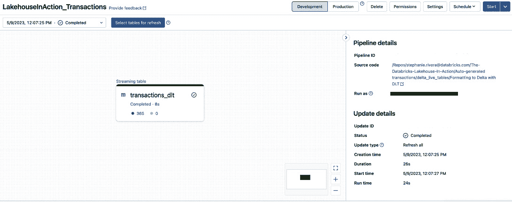
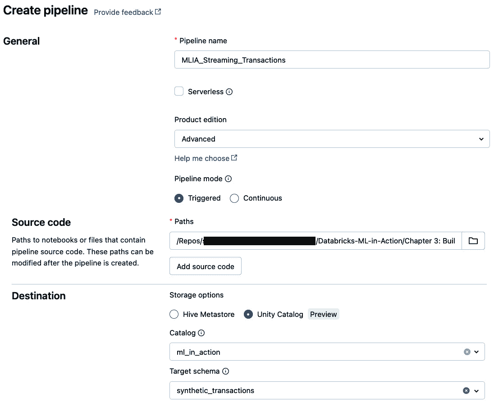
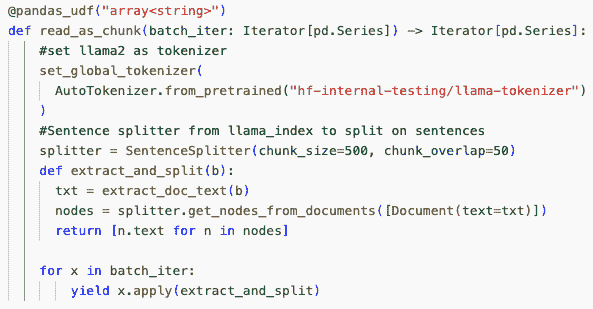
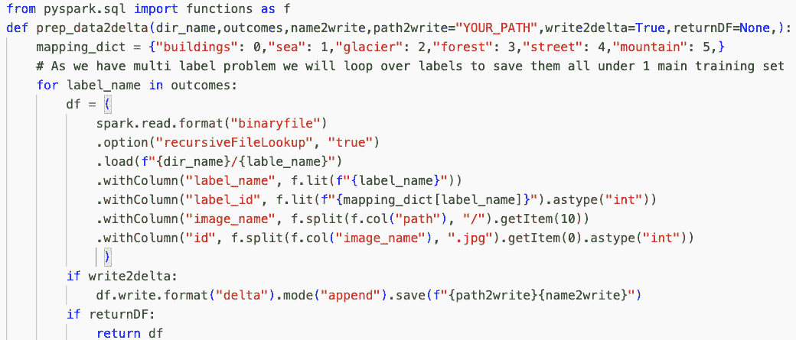
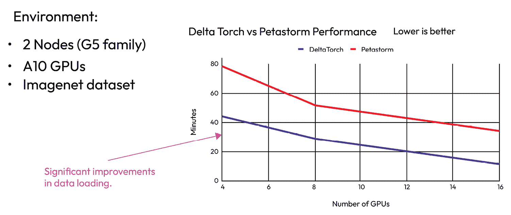

# 3

# 构建我们的青铜层

“数据是宝贵的，比系统本身更持久。”

– 蒂姆·伯纳斯-李，通常被认为是万维网的发明者

在本章中，您将开始您的 Databricks 平台数据之旅，探索青铜层的基础知识。我们建议在湖屋架构（如*第二章*中所述）中使用 Medallion 设计模式来组织您的数据。我们将从**Auto Loader**开始，您可以使用或不需要**Delta Live Tables**（**DLT**）来在架构中插入和转换数据。使用 Auto Loader 的好处包括快速将新数据转换为 Delta 格式，并强制执行或演进模式，这对于维护对业务和客户的持续数据交付至关重要。作为一名数据科学家，努力提高构建数据管道的效率，并确保您的数据为机器学习开发周期的步骤做好准备。您将通过示例项目最好地学习这些主题，因此本章的重点是*应用我们的学习*部分。

让我们看看本章将涵盖哪些主题：

+   回顾 Medallion 架构模式

+   使用 Auto Loader 将数据转换为 Delta 格式

+   DLT，从青铜开始

+   维护和优化 Delta 表

+   应用我们的学习

# 回顾 Medallion 架构模式

我们在*第二章*中介绍了 Medallion 架构。作为提醒，这指的是用于逻辑组织数据的数据设计模式。它包含三个层级——青铜、白银和黄金。在某些情况下，可能需要额外的细化层级，因此如果需要，您的 Medallion 架构可以扩展到钻石和铂金层级。青铜层包含原始数据，白银层包含清洗和转换后的数据，黄金层包含汇总和精选的数据。精选数据指的是为特定业务或建模目的选择、清洗和整理的数据集。这种架构非常适合数据科学项目。维护原始数据作为事实来源非常重要，而精选数据对于研究、分析和机器学习应用非常有价值。通过为特定目的选择、清洗和组织数据，精选数据可以帮助提高其准确性、相关性和可用性。

注意

本书将介绍许多项目任务，例如*构建精选数据集*，这些任务通常属于数据工程师的领域。也会有机器学习工程师、数据分析师等经常执行的任务。我们将所有这些工作包含在我们的示例中，因为在当今快速发展的世界中，角色是模糊的，并且会因公司而异。头衔和期望会迅速演变。因此，掌握整个端到端工作流程至关重要。

维护一个 Bronze 层允许我们在需要创建不同的特征、解决需要从另一个角度查看历史数据的新问题，或者仅仅为了治理目的而保持数据的原始级别时，回到原始数据。随着技术世界的不断发展，保持最新并跟随趋势至关重要，但核心原则将保持数年。在本章的剩余部分，我们将介绍便于构建 Bronze 层的 DI 平台功能。

# 使用 Auto Loader 将数据转换为 Delta

利用 Auto Loader 的力量来自动化您的数据摄取过程，显著提高您数据产品的工作流程效率。它可以从云存储和流数据源摄取数据。您可以配置 Auto Loader 按计划运行或手动触发。

使用 Databricks 的 Auto Loader 的一些好处：

+   **它保持数据最新**：Auto Loader 维护检查点，无需知道哪些数据是新的。Auto Loader 会自行处理所有这些。

+   **它提高数据质量**：Auto Loader 可以自动检测架构更改并恢复任何新的数据列，因此您可以确信您的数据是准确的。

+   **它增加数据敏捷性**：Auto Loader 可以帮助您快速轻松地摄取新的数据源，从而使您在应对业务变化时更加敏捷。

+   **灵活的摄取**：Auto Loader 可以批量或连续地流式传输文件。这意味着它可以以流的形式消耗批量数据，以减少更手动批量管道的开销。

Auto Loader 是一个强大的工具。它可以独立使用，作为 DLT 的底层技术，或者与**Spark Structured Streaming**一起使用。Spark Structured Streaming 是一个接近实时处理引擎；我们将在*第五章*中介绍如何创建实时功能。本章还涵盖了一个流式摄取的示例，在流交易项目中。让我们讨论 Auto Loader 随时间演进架构的能力。

## 架构演进

Auto Loader 的架构演进功能允许您无缝地在流数据中添加或修改字段。Databricks 会自动调整相关数据以适应新架构，同时保持现有数据完整性。这种自动化的架构处理使得随着业务需求和数据源的变化，您可以在不担心数据丢失或停机的情况下轻松地随时间演进您的数据架构。

新的模式在 *应用我们的学习* 部分中增加了一个额外的列。我们将展示即使在模式未通知的情况下更改，也不会丢失任何数据。在我们的案例中，Auto Loader 的默认模式演化模式 `.option("cloudFiles.schemaEvolutionMode", "addNewColumns")` 与 `.option("mergeSchema", "true")` 结合执行模式演化。Auto Loader 将为我们处理模式变化。当新数据字段可用时，无论是事先通知还是未通知，Auto Loader 跟踪变化是有益的；无需进行代码更改。

所有模式选项都有文档说明。我们项目所采用的方法是唯一适用于自动模式演化的选项。其他任何选项都需要手动干预。例如，您可以使用“rescue”模式来挽救数据以避免丢失。或者，您可以使用“failOnNewColumns”模式来使管道失败并保持模式不变，直到生产代码更新。Auto Loader 有许多选项和模式。在“进一步阅读”部分的 *Common loading patterns with Auto Loader* 链接中查看更多信息。

# 从青铜开始使用 DLT

如我们在前一章中提到的，请记住 DLT 主动简化了您的管道操作，使您能够专注于为您的管道设定明确的目标，而不是陷入操作细节。在此基础上，我们现在将深入研究 DLT 的功能。Auto Loader 的模式演化与 DLT 集成，强调了它在处理需要最少手动干预的动态数据模式中的实用性。

## DLT 的优势和功能

DLT 是一个复杂的框架，旨在构建可靠的数据管道。DLT 自动化和简化了复杂的操作，如编排和集群管理，显著提高了数据工作流的效率。您只需指定您的转换逻辑即可启动运行。我们将重点关注与创建青铜数据层相关的 DLT 的几个优势，但我们也在本章末尾的“进一步阅读”部分中包含了一个 DLT 文档的链接。DLT 是您工具箱中用于摄取数据的另一个优秀工具。它提供了比传统 ETL 管道更多的优势，包括以下内容：

+   **声明式管道开发**：DLT 允许您使用 SQL 或 Python 定义您的数据管道，这使得它们更容易理解和维护。

+   **自动数据质量测试**：DLT 可以自动将您的测试应用到您的数据上，防止质量问题，这有助于确保您的管道产生准确的结果。

+   **深度可见性用于监控和恢复**：DLT 提供详细的跟踪和日志信息，使解决问题和从故障中恢复变得更加容易。

+   **通过高效的计算自动扩展实现成本效益的流式处理**：DLT 可以根据需求自动扩展或缩减计算资源，这有助于降低成本

DLT 是构建可靠和可扩展的批量或流式数据管道的强大工具。它可以帮助您提高数据处理工作流程的质量、效率和可见性。

以下是 DLT 的一些具体特性，它们提供了这些优势：

+   **流式表**：DLT 使用流式和实时表来实时处理数据，并确保您的管道与最新数据保持同步。

+   **物化视图**：DLT 使用物化视图来创建数据的快照。您可以在实时查询数据的同时，将其用于下游处理。

+   **期望**：DLT 使用期望来自动测试数据的质量问题，并在数据不符合期望时采取行动。

+   **自动扩展**：DLT 可以根据需求自动扩展或缩减计算资源，从而降低成本并提高管道的性能。

DLT 是构建可靠、可扩展和可测试的数据管道的好方法。接下来，我们将专注于青铜层背景下的 DLT。

## DLT 中的青铜数据

DLT 使用 Auto Loader 来支持模式演变，在数据质量方面提供了显著的好处，这是 Medallion 架构中青铜层的关键方面。在这个架构中，青铜层作为原始数据最初摄入和存储的基础阶段。DLT 通过确保对原始数据应用的每个转换都精确捕获和管理来贡献这个层。作为数据科学家，理解这些转换对于维护数据处理工作流程的完整性至关重要。DLT 的一个强大功能是能够自动生成准确的流程有向无环图（**DAG**）。这个 DAG 不仅可视化这些数据转换的顺序和关系，还增强了整个数据管道的可靠性。

下面的截图展示了 DLT 管道工作流程：



图 3.1 – 本章交易数据集的 DLT 管道工作流程

在*图 3*.1 中，DLT 工作流程中有一个任务，但它可以容纳具有多个依赖关系的复杂工作流程。

一旦数据成功导入 Delta，我们可以采取一些措施来确保充分利用 Delta 的优势。

# 维护和优化 Delta 表

虽然本书的主要焦点不是 Delta 表的优化细节，但理解这些技术对于开发以数据为中心的机器学习解决方案至关重要。Delta 表的效率管理直接影响 ML 模型的表现和可靠性，因为这些模型高度依赖于底层数据的品质和可访问性。采用诸如`VACUUM`、液态聚类、`OPTIMIZE`和分桶等技术，以无与伦比的效率存储、访问和管理您的数据。优化后的表确保输入到 ML 算法中的数据得到有效处理。我们在这里简要介绍这些技术，但也建议您参考 Delta Lake 文档以全面了解每种技术。

## VACUUM

`VACUUM`命令在管理 Delta 表内的资源方面至关重要。它通过清理无效文件和优化元数据布局来实现。如果您的 Delta 表经常进行`update`、`insert`、`delete`和`merge`操作，我们建议定期运行`VACUUM`操作。DML 操作可能会随着时间的推移生成大量的小文件。未能运行`VACUUM`可能会导致在线保留大量数据量极小的小文件，从而导致性能下降。

注意，`VACUUM`不会自动运行；您必须明确安排它。根据您的数据摄取频率和更新数据的频率，考虑定期安排`VACUUM`，例如每周或每月。此外，您可以选择配置保留期以优化存储和查询性能。`delta.logRetentionDuration` Delta 配置命令允许您通过指定希望保留数据文件的天数来控制保留期。这意味着您将删除超出保留设置（例如，只保留最后七天的元数据）的表的交易日志数据。这样，您就可以控制`VACUUM`操作在删除之前保留数据文件的时间长度。保留期影响您回顾表之前版本的能力。在决定保留元数据和交易日志多长时间时，请记住这一点。此外，交易日志并不大。

## 液态聚类

液态聚类是分区的一个很好的替代方案；请参阅如何在 *图 3**.2* 中实现它。通常，数据会被过度分区，导致分区中文件过少或不平衡。除非表的大小为兆字节或更大，否则您不需要分区。除了替换分区外，液态聚类还替换了 Delta 表上的 *Z*-排序。*Z*-排序与聚类表不兼容。在选择用于聚类的列时，包括您用于查询过滤的高基数列。另一个常见的例子是时间戳列。与其创建一个派生列日期以最小化基数，不如直接在时间戳上聚类。液态聚类为具有倾斜数据分布或变化访问模式的 Delta 表带来好处。它允许表通过重新定义聚类键而不重写数据来适应分析需求，从而实现优化的查询性能和灵活、维护高效的架构。启用液态聚类后，您必须使用 DBR 13.3+ 来创建、写入或优化 Delta 表。


图 3.2 – 使用液态聚类优化的表创建示例代码

## 优化

`OPTIMIZE` 命令将触发聚类。在流式传输数据时，这尤为重要，因为表在写入时不会进行聚类。`OPTIMIZE` 还会压缩数据文件，这对于具有许多小文件的 Delta 表至关重要。它将这些文件合并成更大的文件，提高了读取查询速度和存储效率，这对于大型数据集特别有益。

## 预测优化

预测优化是一个为您自动运行 `VACUUM` 和 `OPTIMIZE` 的功能。如果您有高级版本、已启用无服务器和已设置 Unity 目录，您的管理员可以在设置中启用它。

现在我们已经介绍了 Medallion 架构、Auto Loader、DLT 以及一些优化 Delta 表的技术，准备好在自己的 Databricks 工作区中跟随我们，通过项目来逐步分析 *第三章* 的代码。

# 应用我们的学习方法

在深入每个项目的核心“数据科学”方面之前，您将摄取数据。我们已经讨论了 Auto Loader、模式演变和 DLT 如何在存储中格式化数据。您会注意到以下项目使用不同的模式将数据加载到青铜层。流式事务项目使用 Auto Loader 摄取传入的 JSON 文件。您将独立使用 DLT 和 Structure Streaming 转换数据，这样您就可以获得两种方法的经验。

## 技术要求

在我们开始之前，请回顾完成本章动手实践所需的技术要求。

Databricks ML 运行时包括几个预安装的库，这些库对 ML 和数据科学项目很有用。因此，我们将使用具有 ML 运行时的集群。

## 项目 – 流式事务

我们流式事务项目的下一步是构建青铜层，也就是我们最终将在分类模型中使用的原始数据。我们特别创建了这个流式项目来练习使用 Auto Loader、模式演变、Spark Structured Streaming 和 DLT 功能，因此我们将在这部分项目中使用这些功能。要在你的工作区中跟进，请打开以下笔记本：

+   `CH3-01-Auto_Loader_and_Schema_Evolution`

+   `CH3-02-Generating_Records_and_Schema_Change`

+   `delta_live_tables/CH3-03-Formatting_to_Delta_with_DLT`

这里是我们项目流程中的当前状态：


图 3.3 – 合成流式事务项目的项目计划

在 *第二章* 中，我们生成并存储了我们的合成事务数据在 JSON 文件中。现在，我们将读取这些数据到 Delta 表中。我们还将更新数据生成笔记本，添加一个产品字符串列，这将演示模式演变，如之前在 *模式演变* 部分中提到的。让我们来探讨两种将数据流读取和写入 Delta 表的选项。两种选项都使用 Auto Loader 进行摄取。然后，文件由 Spark Structured Streaming 或 DLT 处理和写入。本节有两个笔记本。我们将从 `CH3-01-Auto_Loader_and_Schema_Evolution` 开始。

### 使用 Structured Streaming 的 Auto Loader 进行连续数据摄取

本节中的代码使用 Auto Loader 将传入的 JSON 文件格式化为 `Delta`。我们使用的表名是 `synthetic_transactions`。在处理数据之前，我们创建了一个小部件（见 *图 3.4*）来决定我们是否想要重置模式和检查点历史。重置历史记录在修改或调试管道时可能很有帮助。如果你重置（删除）你的检查点历史，你将重新处理所有历史数据。


图 3.4 – 创建小部件以重置检查点和模式

接下来，我们为脚本设置变量，这些变量主要是路径：


图 3.5 – 设置路径变量

设置文件为我们提供了 `volume_file_path`，其中我们存储合成数据、模式和检查点文件夹。

如 *图 3.6* 所示，我们添加 spark 配置以优化和减少推理的样本大小：


图 3.6 – 设置配置以优化和减少样本大小

你可以在集群的高级选项中设置这些 Spark 配置。这些配置将自动将小文件集压缩成大文件，以实现最佳读取性能。

### 配置数据摄取的流

流命令相对较长，所以让我们逐块分析代码：

1.  我们正在创建一个流来从合成数据集读取。格式选项引用流格式。`cloudFiles` 指的是位于云存储中的文件。在这种情况下，我们生成数据并将其写入云存储。然而，使用 `.format("kafka")` 创建流是可能的，它可以直接从流中摄取而不先写入云存储。我们还指定文件格式为 JSON。


图 3.7 – 使用 CloudFiles 和 JSON 文件格式创建流

1.  默认情况下，将列类型设置为 `string`。然而，我们可以提供模式提示，以便我们确信的列能够得到适当的类型。在推断模式的同时，我们还想推断列类型。新列是 `string` 类型，因此我们看不到这个选项的实际操作，因为新列默认为 `string`。


图 3.8 – 设置模式提示以减少可能的数据类型不匹配。我们希望推断不在模式提示中的列的数据类型

1.  Auto Loader 使用 `rescue` 列来捕捉变化，并迅速将新列投入使用而不会丢失数据！请注意，流将失败并需要重启。如果我们希望 Auto Loader 能够跟踪模式并在时间上进化它，则需要模式位置。


图 3.9 – 设置模式进化以添加新列并指定模式位置，以便 Auto Loader 能够跟踪模式随时间的变化

1.  接下来，我们加载原始数据文件的位置。我们需要选择我们想要的字段。我们将选择所有数据字段，但你也可以选择性地拉取字段。

1.  以下代码行开始流的“写入”部分。在这里，我们开始 `writeStream`。Delta 是默认的数据格式，但我们更喜欢明确设置它。我们还指定此流为只追加，因为我们没有执行任何更新或插入操作。

1.  检查点是 Spark Structured Streaming 中的一种机制，允许您保存流的当前状态。如果您的流失败，当它重新启动时，它将使用检查点从上次停止的地方继续处理。合并模式选项是必不可少的。合并模式会将新列添加到到达时，而无需干预。


图 3.10 – 创建我们的检查点位置并设置合并模式

1.  下一步是设置触发器。触发器设置指的是处理速度，有两种主要模式。根据以下代码，你可以指定基于时间的触发器间隔（以秒为单位）。我们的生成笔记本中的数据是连续的。在这里，我们通过微批有效地处理它。我们在*步骤 4*中提供了一个选择语句。现在我们可以将那个语句的结果写入`destination_location`路径下的 Delta 文件。

    在*步骤 7*中，我们使用了一个 10 秒的处理时间触发器。处理时间意味着每 10 秒将处理一次微批数据。假设你不需要微批。如果你需要每小时或每天处理一次数据，那么`trigger.availableNow`选项最佳。如果你想处理在过去一小时到达的任何新数据，请在你的管道中使用`trigger.AvailableNow`，并每小时使用作业集群启动工作流来安排管道。那时，自动加载器将处理所有可用数据然后关闭。

1.  接下来，为了展示模式演化，我们将我们的数据生成笔记本从*第二章*更新到包含一个额外的`data`列。你将在*第三章*文件夹中找到新版本，`CH3-02-Generating_Records_and_Schema_Change`。请注意，我们为`writeJsonFile`提供了一个可能的产品列表。结果是额外的字段，`Product`，包含记录的产品字符串（*图 3**.11*）。


图 3.11 – 生成带或不带产品字符串的数据的更新方法

由于我们的更改，你现在有一个数据流，在中间添加了一个额外的列。你可以启动自动加载器笔记本来查看模式演化的实际操作。当检测到额外的列时，流会停止，提供一个异常 – `[UNKNOWN_FIELD_EXCEPTION.NEW_FIELDS_IN_RECORD_WITH_FILE_PATH]`。不用担心；重启后，模式演化将接管。再次运行包含流的单元格以重启。

你已经使用 Spark Structured Streaming 完成了读取和写入操作。接下来，我们将向你展示如何使用 DLT（使用更少的代码！）完成相同的任务。

### 使用 DLT 的自动加载器进行连续数据摄取

本节使用自动加载器代码读取 JSON 文件的流，然后使用 DLT 将文件写入表。这个笔记本位于`delta_live_tables`文件夹中，标题为`CH3-03-Formatting_to_Delta_with_DLT`。

你只需要导入 DLT – `import dlt`。DLT 代码相对较短，部分原因是因为管道配置发生在管道对象中而不是代码中。在我们查看源代码之前，让我们导航到左侧导航栏中的**Databricks Workflows**面板，选择**Delta Live Tables**，然后点击**创建管道**，这将打开管道设置页面，如图*图 3**.12*所示。



图 3.12 – 工作流 UI 中的 DLT 管道设置

### DLT 的管道配置

由于 DLT 执行优化，因此管道设置是最小的，所以设置说明也是最小的。输入到管道配置中的参数可以通过`spark.conf.get`在管道代码中访问，如图*3.13*和*3.14*所示：

1.  输入管道名称。我们将使用`MLIA_Streaming_Transactions`。

1.  对于**产品版**，选择**高级**。此 DLT 版本包含最多功能，包括 DLT 的期望规则。

1.  对于**管道模式**，选择**触发**。这将确保管道在成功运行后停止处理。

1.  对于**路径**，从存储库中选择此笔记本作为源代码：

    ```py
    Databricks-ML-in-Action/
    Chapter 3: Building Out Our Bronze Layer/
    Project: Streaming Transactions/
    delta_live_tables/
    CH3-03-Formatting_to_Delta_with_DLT
    ```

1.  选择**Unity Catalog**作为您的存储选项。

1.  对于目录选择`ml_in_action`，对于目标模式选择`synthetic_transactions_dlt`。

1.  在`raw_data_location`中将`table_name`和`synthetic_transactions_dlt`作为配置输入，如下所示（如图*3**.13*所示）：

    ```py
    /Volumes/ml_in_action/
    synthetic_transactions/files/
    synthetic_transactions,
    ```


图 3.13 – 变量的高级管道配置设置

### DLT 管道中的方法

现在我们已经填写了管道 UI，让我们专注于管道源代码中使用的的方法。在这个函数中，我们主要重用了我们之前的代码（*图 3**.14*）。请注意，在这个笔记本中我们不使用设置文件。相反，我们使用在管道设置的高级配置部分设置的变量。


图 3.14 – 自动加载流方法详情

### 在 DLT 管道中生成青铜表

`generate_table()`函数将使用 Auto Loader 创建的读取流馈送到 DLT。我们使用`spark.conf.get('variable_name')`来访问我们在管道的高级设置（*图 3**.13*）中定义的变量值。在笔记本中，您将看到最终步骤，一个名为`generate_table()`的单行单元格。


图 3.15 – 在 DLT 管道中生成青铜表

DLT 是独特的。它不是逐行运行的代码，因此您不需要在笔记本中执行管道。回到 DLT UI，我们保存并点击**开始**按钮。设置过程完成后，您将看到一个包括我们的表的图。**开始**不仅启动了管道，还创建了它。一旦完成，您将看到一个如图*3**.1*所示的屏幕。

### 查询使用 DLT 创建的流表

您可以像查询其他表一样查询使用 DLT 创建的流表。这对于填充仪表板很有用，我们将在*第八章*中介绍，*监控、评估和更多*。

重要提示

如果在笔记本中尝试查询您的流式表，您可能会得到这个错误：

`执行异常：org.apache.spark.sql.AnalysisException: 403：您的令牌缺少此端点所需的权限。`

这是因为要查询由 DLT 管道创建的流式表，您必须使用 Databricks Runtime 13.1 及以上版本的共享集群或 SQL 仓库。在 Unity Catalog 启用的管道中创建的流式表不能从分配或无隔离集群中查询。您可以更改您的集群或使用 DBSQL 查询编辑器。

管道创建了我们的大铜表，完成了这个关于流式事务数据的项目的收尾工作。

## 项目 – Favorita 商店销售 – 时间序列预测

在上一章中，您使用`opendatasets`从 Kaggle 下载了*Favorita 销售预测*数据集。我们现在将使用这些数据来创建 Delta 表。要在自己的工作区中跟随，请打开`CH3-01-Loading_Sales_CSV_Data_as_Delta`笔记本。

下载的数据是单个 CSV 文件。我们使用 pandas 读取数据集，并使用 Spark 写入 Delta 表。我们将在下面的代码块（*图 3.16*）中演示这一点。


图 3.16 – 使用 Pandas 读取销售假日事件数据集

我们利用数据概要功能（*图 3.17*）在写入表之前检查数据类型。概要显示日期字段的推断数据类型是字符串，而不是日期或时间戳。因此，我们在写入 Delta 表之前更改了数据类型。


图 3.17 – 使用 display(df)，我们可以点击+来查看数据概要。这让我们可以快速查看数据类型和分布

Favorita 项目的每个表都类似地转换为 Delta 表。因此，我们只在书页中包含第一个表。然而，转换每个表的代码当然在存储库中。

## 项目 – 检索增强生成聊天机器人

**RAG**代表**检索增强生成**。一个 RAG 系统通常包括你的数据、一个向量数据库、一个搜索算法和一个**生成式 AI**模型来生成对用户查询的答案。*图 3.18*展示了我们将在这本书中构建的管道。


图 3.18 – 我们将在本书中尝试复制的管道示例

从 *图 3.18* 我们可以看到，我们需要根据用户查询检索相关数据。这就是我们的搜索方法将访问向量数据库并执行语义或混合搜索的地方。在 RAG 聊天机器人项目的这个阶段，我们的 PDF 文件以原始的非结构化形式存在。我们希望用户通过我们的聊天机器人访问这些知识，因此我们必须将所有 PDF 中的相关信息内容带入我们的聊天机器人中，该聊天机器人实时运行。为此，我们将所有 PDF 转换为机器可读格式。本章展示了如何从 PDF 文件中提取非结构化数据，将其分块，并将您的文本转换为嵌入。然后，我们将嵌入存储在 Delta 表中：

1.  我们数据准备的第一步是从 PDF 文件中提取非结构化信息。要在您的工作区中跟随，请打开 `CH3-01-Creating_EmbeddedChunks` 笔记本。

1.  要开始构建青铜数据层，创建一个包含表模式的空 Delta 表。使用 `GENERATED BY DEFAULT AS IDENTITY` 功能利用 Delta 表功能自动索引新到达的数据。此外，添加一个表属性以将 `Change Data Feed` 设置为 `true`。


图 3.19 – 创建名为 pdf_documentation_text 的空 Delta 表

1.  对于下一步，从 `volume` 文件夹中读取原始 PDF 文件，并将其保存到名为 `pdf_raw` 的表中（*图 3.20*）。我们将在 `pdf_documentation_text` 表中返回。


图 3.20 – 以二进制格式读取 PDF 文件并将其写入青铜层表

1.  将 PDF 存储在 `content` 列的二进制格式中，以便稍后提取文本。让我们看看它在 Delta 表视图中的样子。每个 PDF 的二进制格式都在 `content` 列中：


图 3.21 – 在 Delta 表中显示摄取的内容

1.  接下来，我们使用 `unstructured` 库编写一个辅助函数，从 PDF 字节中提取文本。该函数位于 `mlia_utils.rag_funcs` 脚本中。


图 3.22 – 创建辅助函数以提取文档文本

1.  让我们将此函数应用于我们拥有的其中一个 PDF 文件，并检查文档的内容：


图 3.23 – 将辅助函数应用于从 PDF 中提取信息

太好了！*图 3.23* 让我们窥见了其中一个导入的文档。你可能有很多 PDF 文件，这些文件可能非常长。长文档可能对我们的未来聊天机器人构成潜在问题，因为它们很容易超过大多数 LLM 的最大上下文长度（更多信息请参阅*进一步阅读*）。此外，我们可能不需要整个文档的文本来回答特定问题。相反，我们需要文本的某个部分或“数据块”。对于这个项目，我们使用 `LlamaIndex` 库的 `SentenceSplitter` 模块创建不超过 500 个令牌的数据块，数据块重叠为 50。你也可以使用 `LangChain` 库或任何你选择的库来将内容分割成数据块。我们将使用开源的 `Llama-tokenizer`，因为这将是我们在整个项目中的主要模型系列。请注意，分词器可能在你的 RAG 质量中扮演关键角色。我们已经利用 Pandas **用户定义函数**（**UDF**）来跨所有文档的所有页面进行扩展。



图 3.24 – 为我们的提取函数创建 pandas UDF

1.  现在，让我们将此函数应用于我们的 Delta 表：


图 3.25 – 使用 PySpark 应用辅助函数从 PDF 中提取信息

一旦我们的数据块准备就绪，我们需要将它们转换为嵌入。嵌入是我们将数据导入 Silver 层进行语义搜索所需的格式。

Databricks 模型托管现在支持 **基础模型 API**（**FMAPIs**），允许你从托管端点访问和查询最先进的开放模型。使用 FMAPIs，你可以快速轻松地构建利用高质量 GenAI 模型的应用程序，而无需维护自己的模型部署（更多信息请参阅*进一步阅读*部分中的*部署已配置吞吐量基础模型 API*）。

FMAPIs 提供两种访问模式：

+   **按令牌付费**：这是开始访问 Databricks 上的基础模型的最简单方法，并且推荐用于开始使用它们的旅程。

+   **已配置吞吐量**：此模型推荐用于需要性能保证、精细调优的模型或具有额外安全要求的工作负载：


图 3.26 – 通过 Databricks 的 FMAPIs 可用的模型

重要提示

在撰写本文时，FMAPI 仅适用于美国地区。如果你的工作区尚未在支持的地区，你可以使用任何你选择的模型（OpenAI、BERT、LlaMA 分词器等）将你的内容转换为嵌入。

你可能还需要微调你的模型嵌入，以便从你自己的内容中学习以获得更好的检索结果。

接下来，我们利用 DI 平台的按令牌付费能力，通过 FMAPI 提供您对 `BGE_large_En` 端点的访问，这是最近添加到 `mlflow >=2.9` - `mlflow` 部署（以前称为 AI Gateway）的新功能。此功能统一了 Databricks 上的模型服务端点管理。


图 3.27 – 使用 BGE 端点应用 FMAPI 将“什么是 ChatGPT？”转换为嵌入

现在，我们在所有块上应用这个嵌入转换，并且再次创建 `pandasUDF` 以实现可扩展性。


图 3.28 – pandasUDF 在所有块上应用嵌入转换

应用我们的 UDF 将会为我们的 `raw_table` 块添加相应的嵌入：


图 3.29 – pandasUDF 在所有块上应用嵌入转换

一旦我们的数据准备过程的最后一步完成，我们使用追加模式将我们的表保存到最初预创建的 Delta 表 `pdf_documentation_text` 中。

注意

我们已经将此项目的 PDFs 一次性导入，这作为一个例子来说效果非常好。然而，这也意味着每次你想向你的聊天机器人知识库添加新的 PDF 时，你必须手动重新运行所有前面的步骤。我们建议为生产级解决方案制定工作流程来自动化前面的步骤，并随着存储中到达的 PDFs 逐步导入。

现在我们有一个数据集，可以用于向量搜索索引，我们将在 *第四章* 中介绍。

## 项目 – 多标签图像分类

在 *第二章* 中，我们在我们的卷中提取并存储了我们的原始图像数据。在本章中，我们准备我们的图像数据集，并将训练和验证集保存到 Delta 表中。要在您的空间中跟随，请打开 `Ch3-01-Loading_Images_2_DeltaTables` 笔记本：

1.  我们首先创建变量，如果 `Reset` 小部件的值为 `True`，则删除现有数据。


图 3.30 – 如果 Reset = True，则清理现有数据

1.  接下来，我们创建一个函数来将所有我们的图像放入一个表中。最初，每个标签都在其自己的 `folder_label_name` 文件夹中。我们提取 `image_name`、`image_id` 和 `label_id`，并使用追加模式创建 `label_name`。



图 3.31 – 创建 prep_data2delta 函数

我们使用 `prep_data2delta` 函数来加载和准备我们的训练和验证数据集（*图 3**.32*）。请注意，如果 `write2delta` 标志为 `True`，则该函数将保存一个 Delta 表，如果 `returnDF` 标志的值为 `True`，则将返回一个 DataFrame。接下来，在笔记本中，我们为训练和验证集调用 `prep_data2delta`。

### 让我们谈谈数据加载器

当我们在微调或训练我们的深度学习模型时，我们以固定大小的批次加载数据。每个框架都原生支持特定的数据类型；一些扩展了它们的原生格式到其他开源格式。数据科学家有时更喜欢将他们的数据（在我们的例子中是图像）保存在 blob 存储中，并直接从存储中读取，而不是使用 Delta 表，因为他们认为这样可以避免额外的工作。然而，我们建议除非您正在处理每个图像大于 1 GB 的大图像，否则将图像存储在 Delta 表中。将您的图像存储在 Delta 表中可以让您利用 Delta 和 Unity Catalog 的额外好处，例如数据和方法血缘、数据版本控制、重复数据检查和质量保证。

在撰写本文时，您在使用 PyTorch 或 PyTorch Lightning 框架处理数据时有一些读取数据的选择：

+   `DeltaTorchLoader`（推荐）

+   Petastorm

+   直接从 blob/disk/volumes 读取图像

我们的推荐是使用 DeltaTorchLoader。它在训练 PyTorch 管道时处理数据批处理、采样和多进程，而不需要像 Petastorm 那样复制临时文件。有关更多信息，请参阅*进一步阅读*。

在撰写本文时，我们将使用的 DeltaTorchLoader，用于将数据从 Delta 转换为 PyTorch/Lightning 数据加载器框架以训练我们的模型（见*第六章*），要求您在使用 UC 时拥有未管理的 Delta 格式的表。请放心；血缘信息与您的数据集相同的路径关联。我们将在*第六章*中更多地讨论血缘信息。这一要求是由于 UC 的 blob 存储的读写安全权限。blob 存储维护者目前不支持这些安全设置。如果您不使用 UC，您应该能够直接从托管表中读取 Delta 表。

您还可以使用 Petastorm 库来读取您的数据。我们不推荐使用 Petastorm，因为它需要更深入地理解某些陷阱。最常见的是由于数据缓存导致的内存使用问题，以及它使用 Apache `Parquet` 文件而不是 Delta 文件，因此它会消耗您所有版本的 parquet 文件。

DeltaTorchLoader 的创建者与 Petastorm 进行了一些基准测试。该基准测试在 **数据和人工智能峰会**（**DAIS**）上分享，并在 *图 3.33* 中展示。在本项目中，我们将比较 Petastorm 与经典 Torch 加载器在 *第六章* 中的性能提升。比较显示，在读取数据批次时速度有显著提升。如果您想了解更多信息，我们还在 *进一步阅读* 部分包含了一个关于 *TorchDeltaLoader* 的精彩视频。



图 3.32 – DeltaTorchLoader 基准测试 – DeltaTorch 和 Petastorm 加载器之间的性能比较

您可以在 Delta 表中保留文件名而不是图像，并在将它们传递给主 PyTorch 加载器时使用 `trainer` 函数进行收集。在 Delta 中保留文件对于避免重复和控制训练和验证期间使用的列表至关重要，因为您可以将 Delta 版本传递给 MLflow 以实现完整复制目的。

### 优化我们的数据

一旦我们的表创建并写入存储，我们就使用一些函数来提高 Delta 表的读取性能。首先，我们使用 `OPTIMIZE` 保持理想数量的文件（*图 3.34*）。其次，我们禁用删除向量，因为 `DeltaTorchReader` 目前还不支持它们（*图 3.35*）。我们使用 SQL 魔法命令 `%sql` 在 Python 笔记本中执行这些操作。


图 3.33 – 优化训练表的大小和数量

注意，我们在 Python 中保存的变量在 SQL 中不可访问，因此在这个例子中我们将其硬编码。您可以在 `global-setup` 笔记本中包含 SQL 变量以避免这种情况。


图 3.34 – 优化训练表

现在，我们已经加载并优化了训练和验证表，以便高效地处理这些图像数据以微调我们的多类计算机视觉模型。

# 摘要

在本章中，我们专注于在 Databricks 数据智能平台内构建青铜数据层的基本要素。我们强调了模式演变、DLT 以及将数据转换为 Delta 格式的重要性，并在我们的示例项目中应用了这些原则。本章强调了 Auto Loader 和 DLT 等工具在此过程中的重要性。Auto Loader 在处理文件跟踪和自动化模式管理方面的熟练程度，以及 DLT 在管道开发和数据质量保证方面的强大能力，对我们数据管理策略至关重要。这些工具促进了数据管道管理的有效和简化方法，使我们作为数据科学家能够更多地专注于有价值的任务，如特征工程和实验。

在创建了青铜层之后，我们现在从这项基础工作转向更高级的数据层——银层。*第四章*，*向银层转变的转换*，将带我们更深入地了解我们的数据，并展示各种 Databricks 工具，这些工具将帮助我们探索和转换我们的数据。

# 问题

以下问题有助于巩固需要记住的关键点，并将内容与你的经验联系起来：

1.  Medallion 架构设计中的层名称是什么？

1.  如果你想要构建一个使用流数据的托管管道，你会使用哪个产品——结构化流或 DLT？

1.  我们使用了什么特性来在不进行人工干预的情况下将`product`列添加到我们的流式事务数据中？

1.  你是否有来自你当前职位、经验或路线图的项目，可以从本章涵盖的一个或多个主题中受益？

1.  在对高基数列进行分区时，减少分区数量的可能方法是什么？

# 答案

在思考这些问题后，将你的答案与我们的答案进行比较：

1.  Medallion 架构的层是青铜、银和金。

1.  我们建议使用 DLT 构建托管管道。

1.  在流式事务项目示例中，我们使用了 Auto Loader 的模式演变功能来添加列，而不进行人工干预。

1.  我们希望如此！一个例子是受益于 DLT 内置数据质量监控的托管流数据管道。

1.  分桶是一种专门设计来为你的数据提供额外组织层的优化方法。它可以减少输出文件的数量，并更好地组织数据以便后续读取，当分区列具有高基数时，它尤其有用。

# 进一步阅读

本章介绍了将数据导入青铜层的不同方法。查看这些资源以了解更多关于你最感兴趣领域的相关信息：

+   *使用液体聚类对 Delta* *表*进行聚类：[`docs.databricks.com/en/delta/clustering.html`](https://docs.databricks.com/en/delta/clustering.html)

+   *Spark Structured* *Streaming*：[`spark.apache.org/docs/latest/structured-streaming-programming-guide.html`](https://spark.apache.org/docs/latest/structured-streaming-programming-guide.html)

+   *Delta Live* *Tables*：[`docs.databricks.com/en/delta-live-tables/index.html`](https://docs.databricks.com/en/delta-live-tables/index.html)

+   *DLT Databricks* *演示*：[`www.databricks.com/resources/demos/tutorials/lakehouse-platform/full-delta-live-table-pipeline`](https://www.databricks.com/resources/demos/tutorials/lakehouse-platform/full-delta-live-table-pipeline)

+   *Auto Loader* *选项*：[`docs.databricks.com/ingestion/auto-loader/options.html`](https://docs.databricks.com/ingestion/auto-loader/options.html)

+   *使用 Auto* *Loader*进行模式演变：[`docs.databricks.com/ingestion/auto-loader/schema.html#configure-schema-inference-and-evolution-in-auto-loader`](https://docs.databricks.com/ingestion/auto-loader/schema.html#configure-schema-inference-and-evolution-in-auto-loader)

+   *使用 Auto* *Loader*的常见加载模式：[`docs.databricks.com/ingestion/auto-loader/patterns.html`](https://docs.databricks.com/ingestion/auto-loader/patterns.html)

+   *使用 Apache Kafka 和* *Databricks*进行流处理：[`docs.databricks.com/structured-streaming/kafka.html`](https://docs.databricks.com/structured-streaming/kafka.html)

+   *如何在 Delta Live* *Tables*中以低于 1 美元的成本处理十亿条记录：[`www.databricks.com/blog/2023/04/14/how-we-performed-etl-one-billion-records-under-1-delta-live-tables.html`](https://www.databricks.com/blog/2023/04/14/how-we-performed-etl-one-billion-records-under-1-delta-live-tables.html)

+   *创建表 – 管理与* *外部*：[`docs.databricks.com/en/data-governance/unity-catalog/create-tables.html#create-tables`](https://docs.databricks.com/en/data-governance/unity-catalog/create-tables.html#create-tables)

+   *充分利用可用的自动调整* *功能*：[`docs.databricks.com/delta/tune-file-size.html#configure-delta-lake-to-control-data-file-size`](https://docs.databricks.com/delta/tune-file-size.html#configure-delta-lake-to-control-data-file-size)

+   从 Databricks 仓库导入 Python 模块：[`docs.databricks.com/en/delta-live-tables/import-workspace-files.html`](https://docs.databricks.com/en/delta-live-tables/import-workspace-files.html)

+   删除向量：[`docs.databricks.com/en/delta/deletion-vectors.html`](https://docs.databricks.com/en/delta/deletion-vectors.html)

+   *Databricks ML* *运行时*：[`docs.databricks.com/runtime/mlruntime.html#introduction-to-databricks-runtime-for-machine-learning`](https://docs.databricks.com/runtime/mlruntime.html#introduction-to-databricks-runtime-for-machine-learning)

+   *集群高级* *选项*：[`docs.databricks.com/en/clusters/configure.html#spark-configuration`](https://docs.databricks.com/en/clusters/configure.html#spark-configuration)

+   *部署配置吞吐量基础模型* *APIs*：[`docs.databricks.com/en/machine-learning/foundation-models/deploy-prov-throughput-foundation-model-apis.html`](https://docs.databricks.com/en/machine-learning/foundation-models/deploy-prov-throughput-foundation-model-apis.html)

+   *在 Databricks 上使用 Delta Lake 存储格式扩展深度学习*：[`www.databricks.com/dataaisummit/session/scaling-deep-learning-using-delta-lake-storage-format-databricks/`](https://www.databricks.com/dataaisummit/session/scaling-deep-learning-using-delta-lake-storage-format-databricks/)

+   *DeltaTorchLoader*：[`github.com/delta-incubator/deltatorch`](https://github.com/delta-incubator/deltatorch)

# 第二部分：高度关注用例

本部分向您介绍如何从数据源集合开始，并在整个平台上与之协作，从一端到另一端。本部分的目标仅仅是展示如何深思熟虑地使用平台的所有功能和特性。本部分提供了案例故事、代码、湖仓功能以及最佳实践。

本部分包含以下章节：

+   *第四章*, *了解您的数据*

+   *第五章*, *在 Databricks 上执行特征工程*

+   *第六章*, *寻找信号*

+   *第七章*, *在 Databricks 上生产化机器学习*

+   *第八章*, *监控、评估及其他*
