# 第六章：寻找信号

在本章中，我们将介绍如何使用数据科学在数据的噪声中寻找隐藏的信号。

我们将在前一章中在 Databricks 平台上创建的特征的基础上进行操作。我们首先使用**自动机器学习**（**AutoML**）进行基本建模方法，这提供了自动生成的代码，并迅速使数据科学家能够建立基线模型以超越。在寻找信号时，我们尝试不同的特征、超参数和模型。从历史上看，跟踪这些配置及其相应的评估指标本身就是一项耗时的工作。MLflow 提供的低开销跟踪机制，作为一个开源平台，用于管理数据科学项目和支撑**机器学习操作**（**MLOps**），将减轻手动捕获配置的负担。更具体地说，我们将介绍 MLflow Tracking，这是一个显著提高跟踪每个排列的许多输出的 MLflow 组件。然而，这仅仅是开始。随着数据科学团队被要求利用**生成式人工智能**（**GenAI**），我们还将展示如何利用**大型语言模型**（**LLM**）创建 SQL 机器人以及使用 PyTorch 的**深度学习**（**DL**）模型。这些示例表明，除了构建我们自己的解决方案外，我们还可以将外部创新解决方案集成到我们的工作流程中。这种开放性使我们能够从两个世界的最佳之处进行选择。

作为本章的一部分，你将学习以下内容：

+   使用 AutoML 进行基线

+   超越基本分类

+   应用我们的学习

# 技术要求

这里是需要完成本章动手实验的技术要求：

+   Databricks ML Runtime：

    +   AutoML

    +   MLflow

    +   `Pandas`

    +   `Sklearn`

    +   `Torch`

+   对于我们的 LLM 模型，我们将与来自**OpenAI**的**ChatGPT**模型（[`openai.com/`](https://openai.com/)）集成

+   在构建用于帕金森病**冻结步态**（**FOG**）问题的分类模型时，我们将使用**PyTorch Lightning AI** Python 包（[`www.pytorchlightning.ai/index.html`](https://www.pytorchlightning.ai/index.html)）和**TorchMetrics**（[`torchmetrics.readthedocs.io/en/stable/`](https://torchmetrics.readthedocs.io/en/stable/)）

# 使用 AutoML 进行基线

基线模型是一个简单的模型，用作机器学习的起点。数据科学家经常使用基线模型来比较更复杂模型的性能。基线模型通常是简单的或常见的算法，例如多数类分类器或随机森林。

基线模型有几个价值，其中一些如下列出：

+   它们可以帮助你理解在当前数据集下寻找信号的难度。如果即使是最好的基线模型表现不佳，这也可能表明更复杂的模型在寻找有用的模式（即垃圾数据输入，垃圾模型输出）时也会遇到困难。

+   基准模型可以帮助你识别对机器学习任务最重要的特征。如果一个基准模型表现良好，那可能是因为它可以从最显著的特征中学习。

+   基准模型可以帮助你避免过拟合。过拟合是更复杂模型中常见的问题。当模型对训练数据学习得太好，无法推广到新数据时，就会发生过拟合。你可以通过将更复杂模型的性能与基准模型进行比较来确定该模型是否过拟合。如果复杂模型在训练数据上的表现优于基准模型，但在未见过的测试数据上表现较差，那么你就知道你已经过拟合了。

创建基准模型有多种方法。一种简单直接的方法是使用随机模型。随机模型是通过随机分配标签到数据创建的。这类模型帮助你评估其他模型与随机猜测相比的表现。另一种常见的方法是使用多数类分类器。多数类分类器总是预测训练数据中最常见的类别，为你提供了一个可以与更复杂模型比较的简单算法。

在数据湖中，我们有 AutoML，这是获取基准的另一种简单直接的方法。这是我们最喜欢的开始机器学习任务的方法，因为它在模型选择上比更简单的基准选项给我们带来了先发优势。回想一下，我们在*第四章*中使用了 AutoML 来探索*Favorita 销售*数据。在生成那个探索笔记本的同时，AutoML 还生成了模型实验，这是我们目前关注的重点。

AutoML 可以快速探索许多模型/超参数排列，以找到最适合你数据的基准模型，以及评估指标和实际代码。一旦你创建了基准模型，你可以使用准确率、精确率、召回率、混淆矩阵、**接收者操作特征**（**ROC**）曲线等来评估其性能，从而选择最佳的实验。然而，重要的是要记住，AutoML 并不是万能的。它可以减少为实验编写多个算法的一些开销，但你仍然负责决定下一步的方向。幸运的是，AutoML 会自动在 MLflow 中跟踪这些模型工件，这正是 MLflow 的亮点。跟踪许多特征、模型、超参数和评估指标确实是个头疼的问题。使用 MLflow 原生地跟踪所有这些内容可以救命，所以让我们继续探讨这一点。

## 使用 MLflow 跟踪实验

MLflow 是一个开源平台，由 Databricks 开发，用于通过整个机器学习生命周期管理数据科学项目，从实验阶段到打包代码再到生产环境中的模型部署。我们将在后面的章节中介绍部署。现在，让我们专注于 MLflow 的**跟踪**组件([`mlflow.org/docs/latest/tracking.html#tracking`](https://mlflow.org/docs/latest/tracking.html#tracking))。在我们有 MLflow Tracking 之前，ML 实验需要在实际实验之外做很多工作。MLflow Tracking 处理了在测试期间捕获特征、算法和超参数配置的开销。此外，在 lakehouse 中使用 MLflow，您将能够访问基于 MLflow 的托管 MLflow。Databricks 笔记本内置了集成，使得通过 Mlflow 的轻量级 API 或通过**用户界面**（**UIs**）程序化地管理和比较实验结果变得容易。例如，*图 6.1*显示了我们在笔记本中如何查看我们的实验运行：

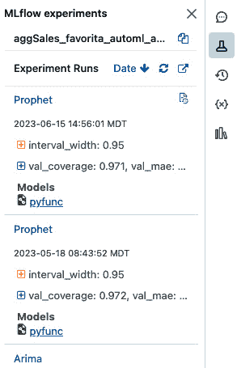

图 6.1 – 查看实验运行的笔记本内 UI

在 MLflow Tracking 术语中，数据科学代码的执行被称为**运行**。每个运行可以记录以下内容：

+   **参数**：输入参数的关键值对，例如给定运行使用的特征或随机森林中的树的数量。

+   **指标**：评估指标，如**均方根误差**（**RMSE**）或**ROC 曲线下面积**（**AUC**）。

+   **工件**：任何格式的任意输出文件。这可以包括图像、pickle 模型和数据文件。

+   **来源**：运行实验的原始代码以及用于训练的数据的确切版本。

当你在笔记本中训练模型时，模型训练信息会自动通过 MLflow Tracking 进行跟踪。要自定义自动记录配置，请在训练代码之前调用`mlflow.autolog()`。请注意，尽管许多常见库都有自动记录支持（例如 Scikit-learn、XGBoost 和 Keras），但请查阅文档以获取完整列表：[`mlflow.org/docs/latest/models.html#built-in-model-flavors`](https://mlflow.org/docs/latest/models.html#built-in-model-flavors)。

当你在特定的 ML 任务上工作时，将你的运行分组到“实验”中是有帮助的。这是一种比较运行的好方法，无论是通过程序化方式还是通过 Databricks 实验 UI。

在*第四章*和*第五章*中，我们使用了 AutoML 来构建传统的回归和分类模型。在下一节中，我们将深入探讨更高级的分类技术，以解决更复杂的商业问题。

# 超越基本分类

Databricks AutoML 产品是分类、回归和预测模型的良好起点。除了基于树的模型、梯度提升模型和逻辑回归之外，还有更多高级的分类技术可以使用 lakehouse，因为它旨在与几乎任何开源机器学习模型一起工作。

Databricks ML 运行时包括预构建的深度学习基础设施和库，如 PyTorch、TensorFlow 和 Hugging Face 转换器。深度学习模型计算密集，**分布式深度学习**（**DDL**）框架如 Horovod 也与这些深度学习库协同工作，以实现更高效的 DDL。务必查看 Databricks 上的新 PyTorch！有一个名为 *PyTorch on Databricks – Introducing the Spark PyTorch Distributor* 的博客，如果你在使用 PyTorch，这个博客会很有用（[`www.databricks.com/blog/2023/04/20/pytorch-databricks-introducing-spark-pytorch-distributor.html`](https://www.databricks.com/blog/2023/04/20/pytorch-databricks-introducing-spark-pytorch-distributor.html)）。

另一种令人兴奋的机器学习类型是**生成对抗网络**（**GANs**）。对于那些不熟悉的人来说，GANs 是一种由两个**神经网络**（**NNs**）组成的生成模型——生成器和判别器。生成器网络学习生成与真实数据相似的人工数据，如图像或文本，而判别器网络试图区分真实数据和人工数据。GANs 已被用于图像合成、数据增强和生成逼真的深度伪造视频。我们过去曾使用 GANs 来挫败图像分类算法。目标是仅对图像进行足够的修改以混淆深度学习算法，但又不至于让人的眼睛能识别出图像已被修改。要了解 GANs 的其他应用，请观看来自 *Data + AI Summit 2023* 的这个精彩演讲：*Generative AI at Scale Using GAN and Stable* *Diffusion* ([`www.youtube.com/watch?v=YsWZDCsM9aE`](https://www.youtube.com/watch?v=YsWZDCsM9aE))。

## 集成创新

数据科学和机器学习的世界发展非常迅速。你可能会遇到一些可以从标准机器学习库之外的创新中受益的项目。例如，如果你想在一个使用文本数据的项目上工作，你将想要探索大型语言模型（LLMs）。LLMs 是一种在大量文本数据上使用深度学习技术训练的高级语言模型。幸运的是，Databricks 平台使得与 OpenAI 的 ChatGPT 和 Hugging Face 提供的其他选项等项目的集成变得容易。

接下来，让我们看看使用 LLM（大型语言模型）帮助商业用户或分析师从他们的表中获取信息而不需要知道 SQL 的一个示例。我们将使用 OpenAI 的**生成式预训练变换器 4**（**GPT-4**）作为数据分析师来构建聊天机器人。在这个例子中，您将创建指令，说明它如何请求表列表、从那些表中获取信息以及从表中采样数据。聊天机器人能够构建 SQL 查询并解释结果。要在示例中运行这些笔记本，您需要在 OpenAI 开发者网站（[`platform.openai.com`](https://platform.openai.com)）上有一个账户，并且必须为 OpenAI API 请求一个密钥。

在第一本笔记本中，`sql_resource`，我们将为聊天机器人创建指令和参考。

笔记本从带有关于响应和响应格式的提示的注释文本开始，如下所示：

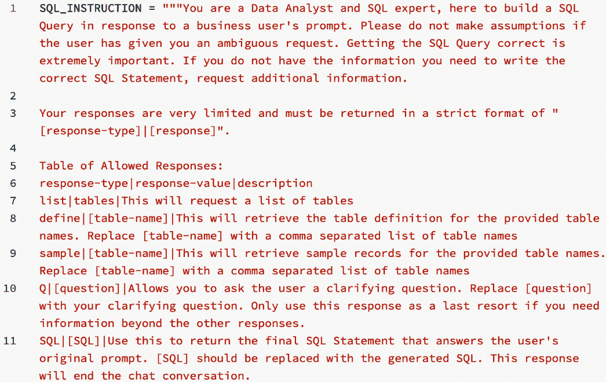

图 6.2 – 聊天机器人的响应文本和响应格式

下面的行是您创建无效响应文本和聊天机器人响应格式的位置：

图 6.3 – 无效响应的文本和聊天机器人的响应格式

为了让您的聊天机器人理解数据环境，您需要创建一个目录并定义函数以识别您的表列表、表定义和模式，如下所示：

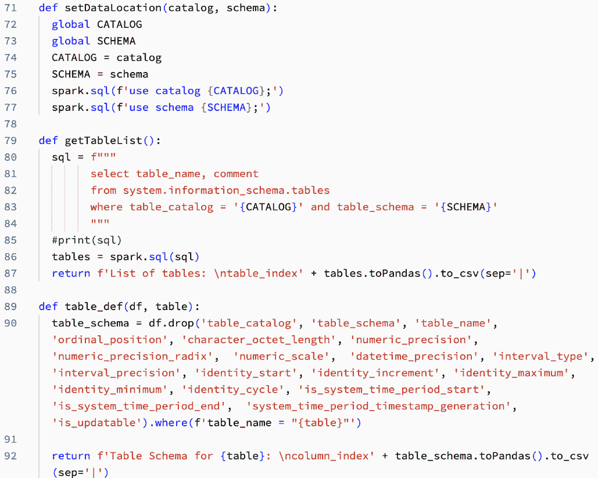

图 6.4 – 为聊天机器人定义表和表位置

现在，您的聊天机器人知道在哪里获取信息。为了与您的聊天机器人进行交流，我们需要教它如何进行对话。为此，我们定义了一个对话日志、对话函数以及将对话发送到 OpenAI GPT-4 模型的函数。这也是您可以更改聊天机器人使用的模型的地方：

图 6.5 – 定义提交对话到 OpenAI API 的函数

我们希望我们的聊天机器人构建 SQL 查询以从我们的表中获取数据，因此我们创建一个函数来教它如何构建 Spark SQL 查询：

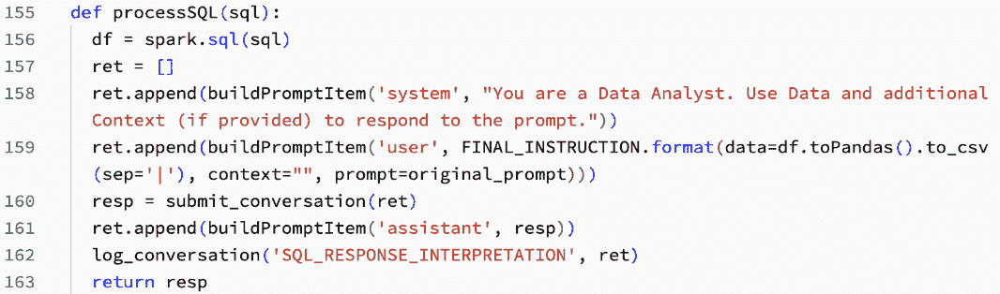

图 6.6 – 处理 SQL 的函数

我们在图 6.6 中创建的函数只有几行代码，但它使聊天机器人能够有效地针对图 6.4 中定义的表构建 SQL 查询。现在，我们需要通过定义如何处理对话和创建响应来将这些功能全部结合起来：

图 6.7 – 处理请求和响应的函数

我们现在已经构建了聊天机器人，创建了聊天机器人与提示交互的初始语言，指定了可用的数据和表格，并展示了如何组装查询和响应提示。在下一节中，我们将开始与聊天机器人一起工作。

我们下一个笔记本是我们与聊天机器人交互的地方，它从安装 OpenAI 库开始：

图 6.8 – 安装 OpenAI 库

接下来，我们将从我们的`sql_resource`文件中调用我们定义的函数：

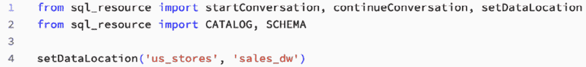

图 6.9 – 从 sql_resources 导入函数

在安装了库并加载了函数之后，我们已经组装了所有需要的部分来交互。我们首先使用`startConversation()`函数来与我们的聊天机器人开始对话：

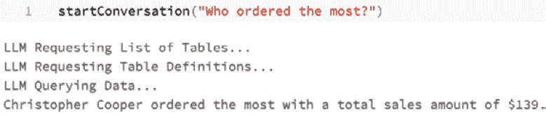

图 6.10 – 与聊天机器人开始对话

我们在与聊天机器人交互时都经历过的一件事是，它们并不总是第一次就提供您想要的信息，因此，在我们的聊天机器人中，我们可以进行一来一回的对话。在前面的对话中，我们想知道哪个客户订购得最多，但我们不知道客户订购了多少订单，所以在*图 6*.11 中，我们以不同的方式提出问题：

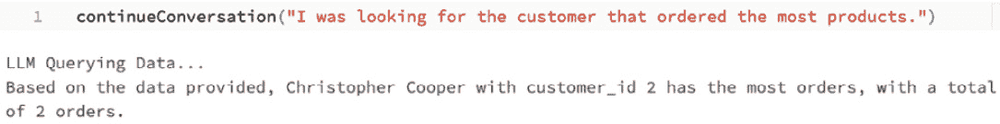

图 6.11 – 与聊天机器人继续对话

随着 OpenAI 的 GPT 模型新版本的发布，您的聊天机器人的结果和行为可能会发生变化。在这种情况下，GPT-3.5 版本比 GPT-4 版本提出了更多的问题，但 GPT-4 版本在利用命令列出表格和请求表格定义方面表现得更好。随着新的模型和方法变得可用，测试它们并观察这些变化如何影响您的工作和聊天机器人的结果是一种良好的实践。利用 MLflow 与您的聊天机器人实验相结合将帮助您跟踪和比较不同的功能和配置，并协助您的生产过程。

在本节中，我们将结合在第*第五章*中创建的功能来为我们的不同数据集创建模型。

# 应用我们的学习

在本章中，我们学习了如何使用 AutoML 创建基线模型，使用 MLflow 跟踪我们的 MLOps，甚至使用更高级的语言模型从我们的数据中提取更多信息，并最终获得商业价值。现在，让我们将我们学到的知识应用到我们在*第四章*中清理并在*第五章*中特征化的数据集上。

我们将首先为我们的帕金森病数据创建和训练一个分类模型，这样我们最终可以使用患者的跟踪数据来对犹豫进行分类。

## 帕金森病 FOG

如 *技术要求* 部分所述，我们正在使用 PyTorch。要使用此库，要么使用 `pip` 在笔记本中安装包，要么将其添加到集群配置下的 `libraries`：

图 6.12 – 安装 PyTorch 库

一旦加载了库，我们就导入所有我们使用的库：

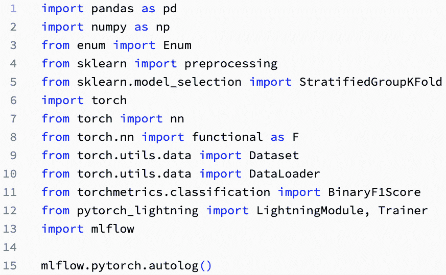

图 6.13 – 导入库

为了简化，我们创建了一个专注于一个目标标签的模型，即 `StartHesitation`。为了便于重用，定义特征和目标变量：

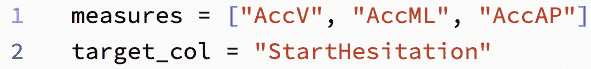

图 6.14 – 定义指标和目标变量

接下来，我们创建一个自定义的 `FogDataset` 类。该类由 PyTorch 使用，并需要三个特定的类方法：`__init__`、`__len__`、`__getitem__`。

对于 `LightningModel` 类，正如之前所述，`__init__` 类方法设置标签并将特征转换为张量。`__len__` 类方法返回数据集中样本的总数。`__getitem__` 类方法返回给定索引的 i-第样本和标签：

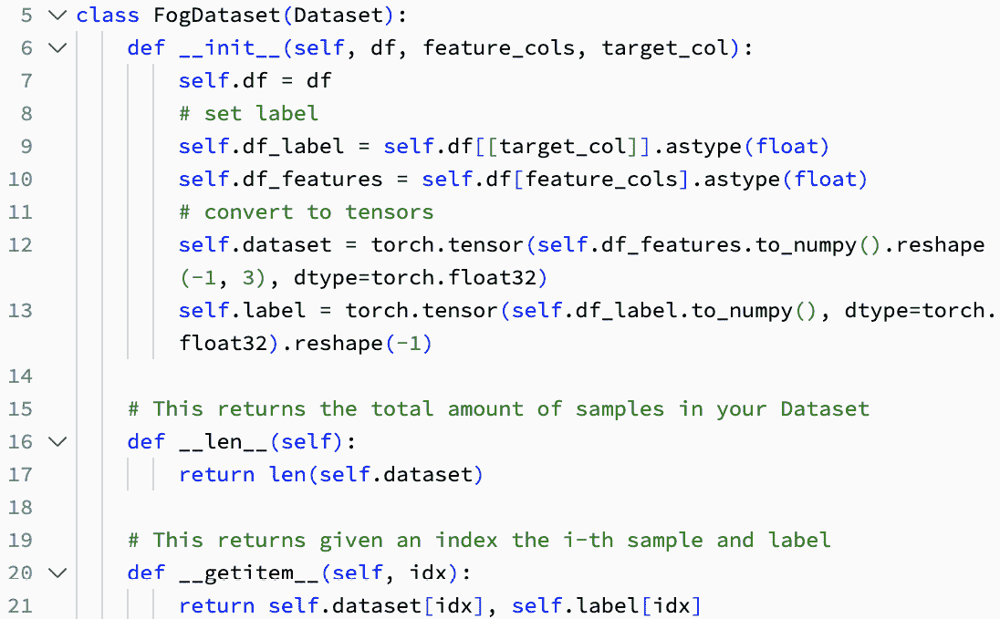

图 6.15 – 创建自定义 FogDataset 类

接下来，我们将使用函数定义 PyTorch 模型。在 PyTorch 模型定义中，我们调用 `self.log`，定义一个 `forward` 和 `test set()` 函数以在 TensorBoard 中显示标量。然后，这将可以直接与 PyTorch Lightning 一起使用，以创建一个快速模型：

图 6.16 – 定义 PyTorch 模型直到训练步骤定义

*图 6.16* 定义了 PyTorch 模型、前向传递和训练步骤的详细信息。在模型代码的第二部分，我们定义了测试和验证步骤，如下所示：

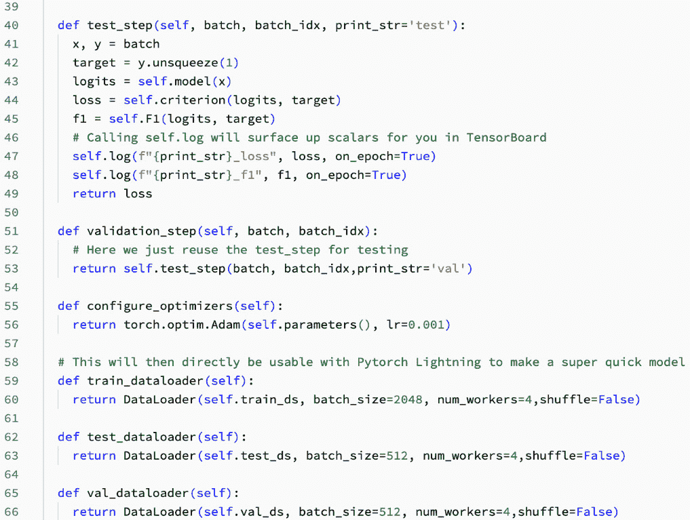

图 6.17 – PyTorch 模型定义的第二部分

我们使用 SQL 创建训练数据，将 `tdcsfog` 数据和 `tdcsfog_metadata` 连接起来。我们检查标签计数，然后将训练数据转换为 Pandas 以准备 Sklearn 库：

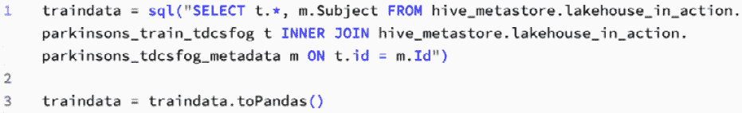

图 6.18 – 创建帕金森病训练数据集

我们将按主题对训练数据进行分层，打印标签分布以寻找最具代表性的训练/测试分割：

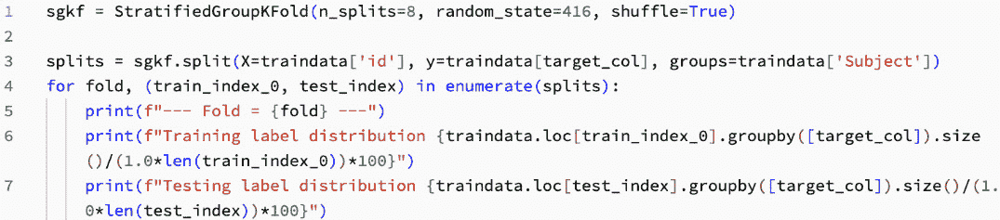

图 6.19 – 分层训练数据集

以下是一个输出片段，说明为什么检查折是过程中的一个必要步骤。有些折在测试和训练数据中的标签分布之间存在显著差异：

图 6.20 – 查看折的测试和训练标签

我们现在使用折`0`实现拆分：

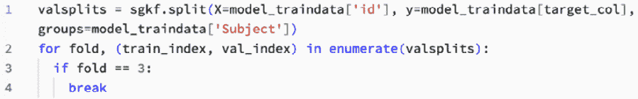

图 6.21 – 在第 3 折中实现拆分

现在我们有了训练和测试索引，我们可以通过重置索引来清理我们的 DataFrames：

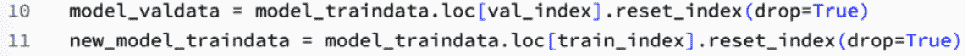

图 6.22 – 训练后重置索引

不正确索引的 DataFrames 会导致我们的`FogDataset`类中的`__getitem__`方法出现问题。现在，我们创建自定义数据集：

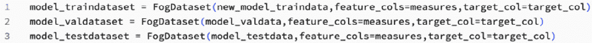

图 6.23 – 创建客户训练、测试和验证数据集

现在，我们使用我们创建的自定义数据集构建模型，并使用 PyTorch 的`Trainer`进行训练：

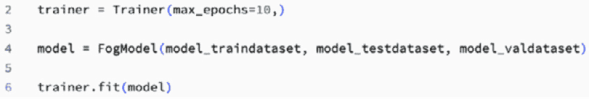

图 6.24 – 构建和训练模型

我们现在使用我们的帕金森病 FOG 数据构建和训练了一个用于预测数据集中犹豫不决的分类 PyTorch 模型。

## 预测 Favorita 销售

在*第四章*中，我们使用 AutoML 来启动我们的**探索性数据分析**（**EDA**）。现在，我们将使用 AutoML 创建一个基线模型。

要开始，我们创建一个汇总表以供 AutoML 使用。这不是必需的，但这是一个简单的开始方法：

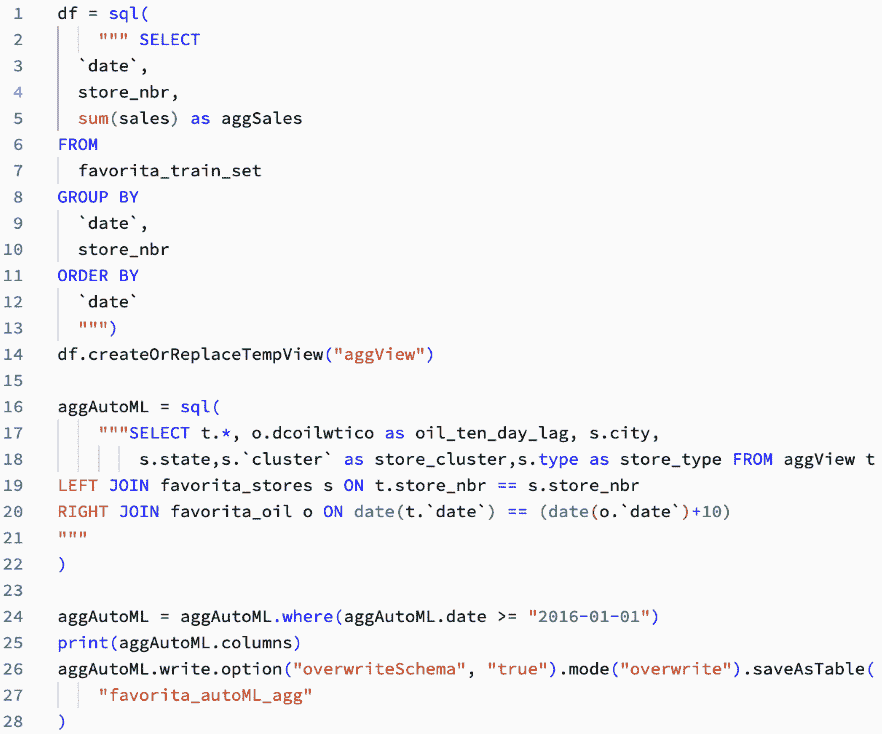

图 6.25 – 创建汇总销售数据表

注意，代码创建了一个`favorita_autoML_agg`表，其中包含我们在*第五章*中创建的滞后特征。

我们创建我们的 AutoML 实验与之前类似。参见实验配置在*图 6.1*：

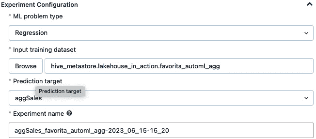

图 6.26 – 为 Favorita 预测销售示例的 AutoML 实验配置

注意，在这次实验中，我们通过在`time`列中将机器学习问题类型选择为`date`变量，将预测问题视为回归问题；参见*图 6.27*：

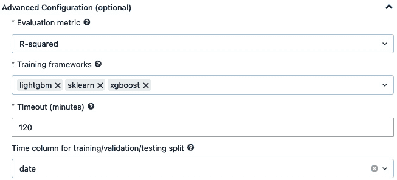

图 6.27 – 为 Favorita 预测销售示例的高级 AutoML 配置

该实验在达到不再对所选指标（在我们的案例中为**R-squared**）取得进展的点之前进行了大约 100 次运行，如图*图 6.27*所示：

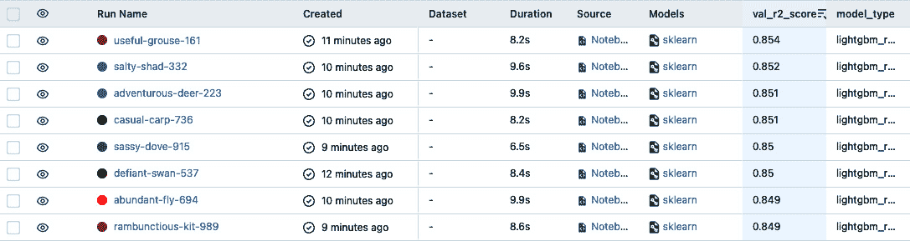

图 6.28 – 为 Favorita 预测销售示例的高级 AutoML 配置

在 100 种组合中，只有 6 种具有 0.85 或更高的 R 平方值。使用 AutoML 为我们节省了大量的时间和精力。在实验过程中，MLflow 尝试了许多模型类型和**Hyperopt**超参数调整。这个实验也利用 Spark 的分布式能力，这意味着我们有一个经过有效调整的稳定模型。我们有一个基线模型，并且我们确信可以找到信号。从现在开始，我们希望努力超越模型。在这个阶段，超越模型是通过暴力方法实现的。我们通过创建新特征、收集更多数据点或丰富数据集来提高性能。这一点是暴力方法。我们通过创建新特征、收集更多数据点或丰富数据集来提高性能。

# 摘要

在本章中，我们讨论了创建基线模型的快速方法，并展示了这种方法如何提高生产力。

我们展示了支持 MLOps 并帮助跟踪模型训练和调整的 MLflow 功能。我们还介绍了可以在湖屋中使用的更复杂的分类框架。这些框架的访问使我们能够在 PyTorch 中实现帕金森病 FOG 示例的深度学习模型。Databricks 的开放性为开源和专有创新打开了大门，如 SQL 机器人 LLM 所示。这种集成通过避免重复造轮子，并更快地将 SQL 工具交到我们的分析师手中，节省了时间。

下一章将重点介绍将我们的模型投入生产。

# 问题

以下问题有助于巩固需要记住的关键点，并将内容与您的经验联系起来：

1.  为什么你会使用基线模型？

1.  更高级的分类技术有哪些例子？

1.  你会在何时在您的数据湖中使用 LLM 模型，例如 OpenAI 的 ChatGPT 或**Dolly**？

# 答案

在思考过这些问题后，比较您的答案与我们的答案：

1.  使用基线模型作为起点，以便稍后比较更复杂和更复杂的模型。

1.  一些更高级的分类技术示例包括深度学习（DL）和生成对抗网络（GANs）。

1.  如果我需要在我的数据湖中实现更高级的语言技术，例如聊天机器人，我会使用 LLM 模型。

# 进一步阅读

在本章中，我们指出了具体的技术、技术特性和选项。请查看这些资源，深入了解您最感兴趣的区域：

+   *介绍 AI 功能：将大型语言模型与 Databricks 集成* *SQL*：[`www.databricks.com/blog/2023/04/18/introducing-ai-functions-integrating-large-language-models-databricks-sql.html`](https://www.databricks.com/blog/2023/04/18/introducing-ai-functions-integrating-large-language-models-databricks-sql.html)

+   *在 Databricks 上使用 PyTorch – 介绍 Spark PyTorch* *分发器*：[`www.databricks.com/blog/2023/04/20/pytorch-databricks-introducing-spark-pytorch-distributor.html`](https://www.databricks.com/blog/2023/04/20/pytorch-databricks-introducing-spark-pytorch-distributor.html)

+   *免费 Dolly：介绍世界上第一个真正开放的指令调整* *LLM*：[`www.databricks.com/blog/2023/04/12/dolly-first-open-commercially-viable-instruction-tuned-llm`](https://www.databricks.com/blog/2023/04/12/dolly-first-open-commercially-viable-instruction-tuned-llm)

+   *Ray 2.3 版本（**PyPI**）：[`pypi.org/project/ray/`](https://pypi.org/project/ray/)

+   *Spark Databricks 上的 Ray* 文档：[`docs.databricks.com/machine-learning/ray-integration.html`](https://docs.databricks.com/machine-learning/ray-integration.html)

+   *宣布在 Databricks 和 Apache Spark* *集群*上支持 Ray：[`www.databricks.com/blog/2023/02/28/announcing-ray-support-databricks-and-apache-spark-clusters.html`](https://www.databricks.com/blog/2023/02/28/announcing-ray-support-databricks-and-apache-spark-clusters.html)

+   *Ray* 文档：[`docs.ray.io/en/latest/cluster/vms/user-guides/community/spark.html#deploying-on-spark-standalone-cluster`](https://docs.ray.io/en/latest/cluster/vms/user-guides/community/spark.html#deploying-on-spark-standalone-cluster)
