# 7

# 在 Databricks 上实现 ML 的生产化

“生产是工作的 80%。”

—— 玛泰·扎哈里亚

一旦您已经优化了模型并获得了满意的结果，您就可以将其投入生产。我们现在已经进入了 **机器学习操作** (**MLOps**) 的领域！不幸的是，这正是许多数据科学家和 ML 工程师遇到困难的地方，公司在这里遇到困难也很常见。在生产中实施模型比临时运行模型要复杂得多，因为 MLOps 需要不同的工具和技能集，有时甚至需要全新的团队。MLOps 是数据科学过程中的一个重要部分，因为模型的实际价值通常只有在部署后才能实现。

您可以将 MLOps 视为 **DevOps**、**DataOps** 和 **ModelOps** 的结合。MLOps 通常分为两个部分：内循环和外循环。内循环涵盖数据科学工作，包括跟踪模型开发和实验过程的各个阶段。外循环包括在整个生命周期中协调您的数据科学项目的方法，从测试到预生产和最终投入生产。

幸运的是，在使用 Databricks **数据智能** (**DI**) 平台时，从模型开发到生产的路径不必完全依赖于另一个团队和工具栈。使用 Databricks 产品将 ML 模型投入生产，通过整合诸如 **Unity Catalog 注册表** (**UC 注册表**), Databricks 工作流, **Databricks 资产包** (**DABs**) 和模型托管功能等功能，使这一过程更加直接和连贯。本章将涵盖将您的模型从开发到生产的工具和实践。

作为本章的一部分，您将学习以下内容：

+   部署 MLOps 内循环

+   部署 MLOps 外循环

+   部署您的模型

+   应用我们的学习

# 部署 MLOps 内循环

在 Databricks 中，MLOps 内循环使用 DI 平台内的一系列工具，这些工具我们在本书中已经多次提及，例如 MLflow、使用 Unity Catalog 的特征工程和 Delta。本章将突出展示您如何利用它们共同促进 MLOps 的实施。Databricks 的电子书 *MLOps 大全* 对 MLOps 进行了更深入的探讨，我们强烈推荐您阅读，如果您想了解更多关于构建自己的 MLOps 解决方案时的指导原则和设计决策。我们使用 `mlflow.log_input()` 方法。我们创建的特征表的上游来源会自动通过 UC 线索进行跟踪。

## 注册模型

让我们深入了解模型注册表及其在生产中的应用。模型注册表是一个集中的模型存储库，有助于管理整个模型生命周期，包括版本控制或别名、CI/CD 集成、webhooks 和通知。在 Databricks 中，UC 注册表扩展了 Unity Catalog 的治理功能到模型注册表，包括集中访问控制、审计、血缘关系和跨工作区的模型发现。UC 注册表是您模型及其时间顺序血缘关系的集中存储库。这意味着创建每个相应模型的实验和实验运行都与相应的代码和数据源相关联。一旦您对您的机器学习模型满意，首先要做的是在 Databricks 的中央模型注册表中注册它。已注册的模型是模型版本历史的逻辑分组。UC 注册表跟踪不同的模型版本，包括每个版本的训练数据、超参数和评估指标。模型很少只有一个版本。除了对模型类型和超参数值的实验外，还有我们想要对模型的不同版本进行实验的情况。我们可以使用模型别名来引用这些不同的模型版本。例如，同时部署不同版本对于 A/B 测试可能很有帮助；我们将在 *模型推理* 部分更详细地介绍这一点。有了 UC 注册表，您可以轻松创建和管理多个模型别名，这使得跟踪更改、比较性能以及在需要时回滚到早期版本变得更加容易。

## 协作开发

UC 注册表提供了一个协作的模型开发环境，使团队能够共享和审查模型。这种协作也被跟踪，使多个团队或负责人能够跟上模型开发过程。团队或项目负责人还可以在允许模型继续生命周期之前要求提供文档。我们发现，在整个项目过程中添加文档片段比试图记住所有内容并在之后花费时间写下它们要容易得多。

UC 注册表允许您对模型和模型版本进行标记。在流式事务项目中，我们使用标签来跟踪模型的验证状态。审批流程可以是自动化的，也可能需要人工交互。一个审批流程可以确保模型质量高且满足业务需求。

*图 7**.1* 展示了 UC 模型注册表的截图。请注意，其中内置了标签、别名和注释的位置：

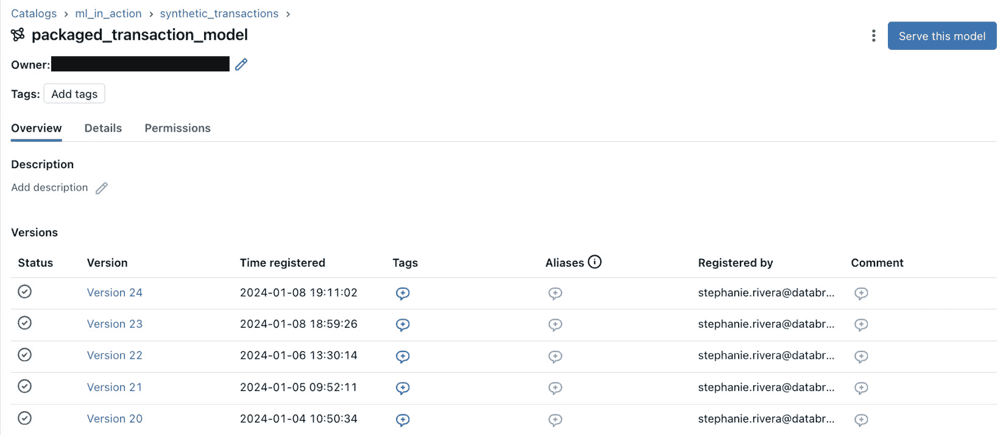

图 7.1 – UC 模型注册表 UI 展示每个模型版本

UC 注册与 DI 平台紧密集成。这提供了一个单一的技术栈 – 一个统一的环境，用于将模型从实验移动到部署。无缝集成让您可以利用其他 Databricks 组件，例如 Databricks Notebooks、Databricks Jobs、Databricks Lakehouse Monitoring 和 Databricks Model Serving。

接下来，让我们继续探讨支持外部循环过程的产品功能。

# 部署 MLOps 外部循环

机器学习生命周期对于不同的用例看起来不同。然而，Databricks 平台上的工具集使得自动化变得可能，并支持您的 MLOps。外部循环通过工作流程、Databricks Terraform Provider、REST API、DABs 等将内部循环产品连接起来。我们介绍了通过 MLflow Tracking 和 UC 注册自动化跟踪过程。UC 注册与模型服务功能紧密集成，并具有一个强大的 API，可以轻松地通过 webhooks 集成到自动化过程中。这些功能中的每一个都可以在自动化机器学习生命周期中发挥作用。

## 工作流程

Databricks Workflows 是一个灵活的编排工具，用于生产化和自动化机器学习项目。工作流程通过提供统一的方式来连接机器学习的各个方面，从数据准备到模型部署，帮助机器学习生命周期。使用 Databricks Workflows，您可以指定任务之间的依赖关系，以确保任务按所需顺序完成。这些依赖关系通过连接任务的箭头进行可视化，如图*7.2*所示：

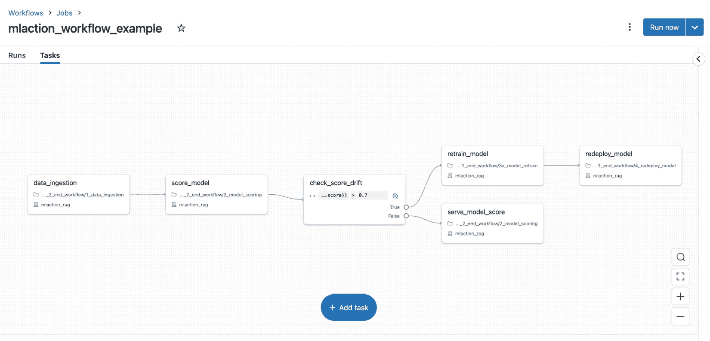

图 7.2 – 一个包含五个任务的 Databricks 工作流程，其中特征工程任务有两个依赖项

工作流程中的任务不仅限于笔记本。在*第三章*中，我们准备了一个 DLT 管道来准备青铜层的数据，DLT 管道可以是工作流程组件。其他对象，如 JAR 文件、Python 脚本和 SQL，也可以作为工作流程中的任务，如图*7.3*所示：

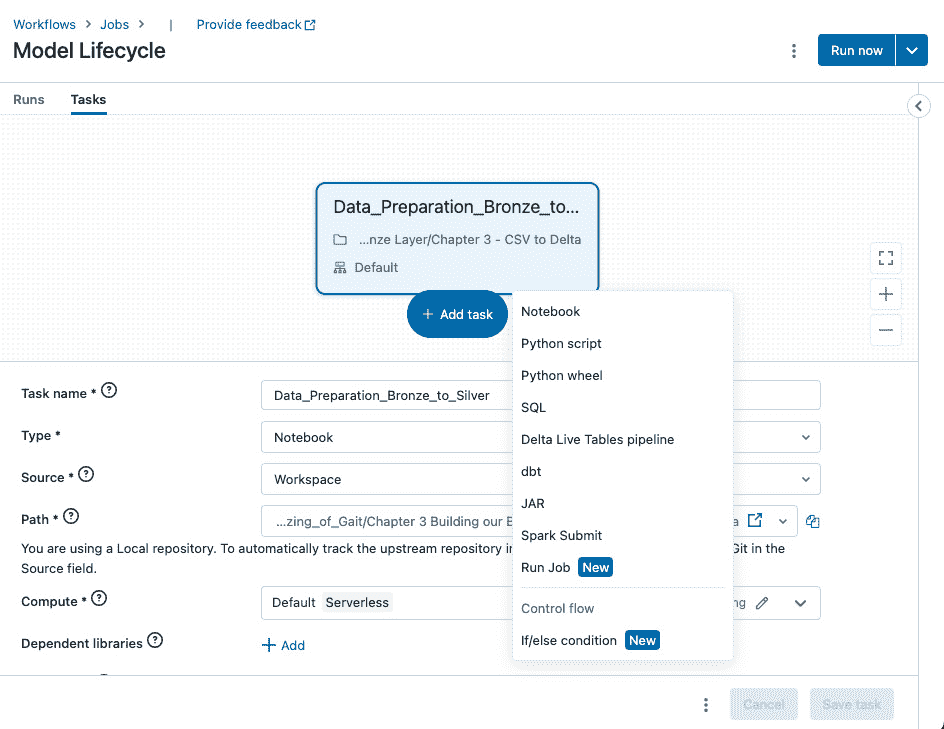

图 7.3 – 可以用作工作流程中任务的对象示例

工作流程稳健，在 Databricks 中自动化工作发挥着关键作用。DABs 是 Databricks 中生产化的另一种工具。

## DABs

DABs 是一种为基于 Databricks 平台构建的所有数据产品的部署方法带来统一性和标准化的方式。它们是一种**基础设施即代码**（**IaC**）的方法，用于管理项目，允许开发者使用 YAML 配置文件概述项目的基础设施和资源。DABs 对于管理涉及众多协作者和需要自动化的复杂项目特别有用。在需要**持续集成和持续部署**（**CI/CD**）的地方，DABs 是管理跨环境 ML 管道资源和管理团队在整个开发和生产过程中的最佳实践的绝佳方式。

在底层，DABs 是 Databricks 工件（包括作业、DLT 管道和 ML 模型）和资产（例如笔记本、SQL 查询和仪表板）的集合。这些捆绑包通过创建和维护在源代码旁边的 YAML 模板进行管理。您可以手动构建 DAB YAML 文件或使用模板来自动化。您还可以为更复杂的处理任务构建自定义模板。

使用 DABs 需要 Databricks CLI。如果您想再次查看，我们已在*第二章*中讨论了 CLI 的安装。此外，DABs 相对较新，尚未纳入项目中。然而，在*进一步阅读*中列出了大量资源，深入介绍了这个新产品特性。

## REST API

您在 UI 中能做的所有事情都可以通过 API 完成。UI 非常适合探索产品功能和构建首次使用的流程。例如，我们在 UI 中构建了 AutoML 实验后，自动化了该过程。此外，我们还看到了如何通过 API 完全包含密钥，而 UI 则无法访问。正如我们将在下一节中看到的，通过 API 部署模型是可能的。

# 部署您的模型

模型的部署方式有很多种，这取决于用例和数据可用性。例如，部署可能看起来像是将模型打包到容器中，并在端点或生产工作流程中每天运行的模型上部署，以提供可以被应用程序消费的表格预测。Databricks 提供了产品功能，为所有推理类型铺平通往生产的道路。

## 模型推理

我们已经介绍了帮助您在生产中设置模型的方法和工具，最终，您有一个准备进行推理的模型！但在这个过程中，您应该考虑的一个关键问题是您的模型应该如何使用。您是否每天需要结果一次？模型是否为需要实时结果的应用程序提供动力？您模型的目的将帮助您决定所需的部署类型。您在本章中已经几次看到了“批量”和“流式”这两个词，所以让我们快速定义在模型推理的上下文中这些词的含义：

+   **批量推理**：批量推理（也称为离线推理）指的是一次性对一组（或“批量”）数据生成预测的工作。批量作业被安排在指定的周期上运行，例如每天一次。当没有/低延迟要求时，这种推理类型最佳，并且允许你利用可扩展的计算资源。

+   **流式推理**：流式推理（也称为在线推理）指的是在数据流式传输时生成预测的工作。在 Databricks 平台上，这可以通过 Delta Live Tables 实现。

+   **实时推理**：实时推理（也称为模型服务）指的是将你的模型作为 REST API 端点公开的过程。这可以实现低延迟的、普遍可用的预测，当部署需要实时应用程序的预测模型时特别有用。

所有这些选项都可通过 Databricks UI 获取。让我们再次使用 Favorita Store 示例。也许我们已经遇到了我们的饮料业务团队，他们希望看到每周的预测以帮助他们决定应该购买每种产品的数量。我们将选择批量推理，因为我们只需要每周生成一次更新的预测。只需几步点击即可设置用于批量处理的模型。有关部署模型进行批量推理的详细说明，请参考 Favorita 销售数据集的“应用我们的学习”部分。

## 模型服务

让我们更深入地探讨实时推理或**模型服务**。模型服务的流程可能很复杂且成本高昂，需要额外的工具和系统来满足实时需求。幸运的是，从 Databricks 平台部署已注册的模型作为端点只需单击一次！因为模型服务与 MLflow 紧密集成，从开发到生产的路径要快得多。使用 MLflow 模型注册表中注册的模型，Databricks 自动准备一个生产就绪的容器并将容器部署到无服务器计算。

通过 API 部署模型也很容易，如这里所示。预测问题作为模型服务用例没有太多意义，所以让我们考虑一下我们在这本书中一直在工作的 MIC 问题。我们将使用模型服务在实时中提供我们的分类模型。以下示例代码片段创建了一个端点，该端点提供名为 `asl_model` 的模型版本：

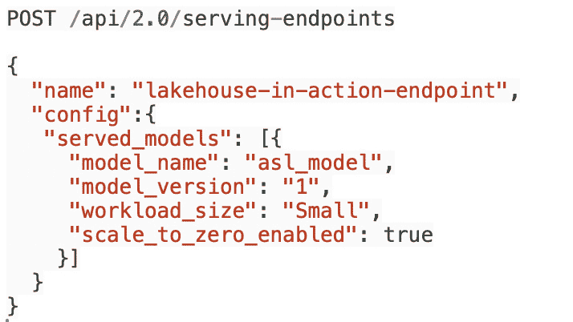

图 7.4 – 通过服务端点部署模型

模型服务让您能够围绕模型端点构建工作流程，这为模型部署提供了充分的灵活性。例如，一个组织可能想要对两个或更多模型进行 A/B 测试。模型服务使得在相同端点后面部署多个模型并分配流量变得容易。在另一种模式中，您可以在多个端点后面部署相同的模型。以下是在进行 A/B 测试模型时可以执行的 UI 和分析示例：

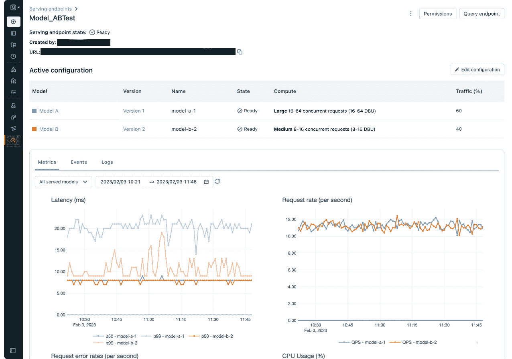

图 7.5 – 模型服务为我们提供了在相同端点部署的模型进行 A/B 测试的灵活性

准备在您的 Databricks 工作区中跟随我们逐个项目地回顾 *第七章* 的代码项目。

# 应用我们的学习

让我们运用我们所学的知识来将我们的模型投入生产。

## 技术要求

这里是需要完成本章动手示例所需的技术要求：

+   按需功能需要使用 DBR ML 13.1 或更高版本。

+   RAG 和 CV 部分需要 DBR ML 14.2 和更高版本。

+   Python UDFs 在 UC 中创建和管理；因此，Unity Catalog 必须在工作区中启用 – 没有共享集群。

+   流式事务项目使用 `scikit-learn==1.4.0rc1`。需要它的笔记本会进行安装。

+   流式事务项目，再次证明，使用并行计算表现更佳。我们将使用来自 *第五章* 的多节点集群。参见 *图 7**.6 中的多节点 CPU 配置：

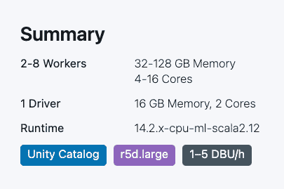

图 7.6 – 多节点 CPU 集群配置（在 AWS 上）

## 项目 – Favorita 销售预测

在本章中，我们讨论了使用托管 MLflow 和 UC 模型注册表来注册和准备模型以供部署。我们将首先通过 UI 进行操作，因此请打开以下笔记本和实验 UI 页面中的标签：

+   `CH7-01-Registering` `the Model`

+   `CH7-02-Batch Inference`

作为提醒，在 *第六章* 中，我们进行了实验以找到基线模型，您可以从 Databricks 的实验 UI 页面中回顾这些实验。为了在您的空间中跟随，请打开来自 *第六章* 的实验 UI 页面，如图 *图 7**.7 所示：

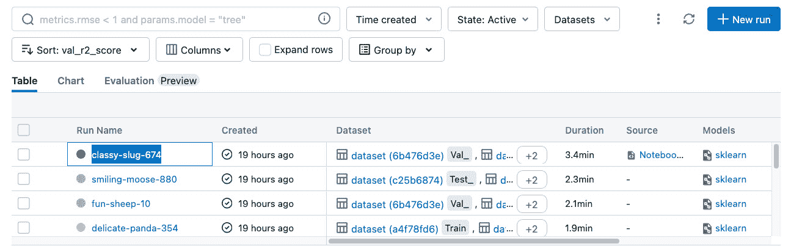

图 7.7 – 探索实验运行的实验 UI 页面

为了项目的目的，我们将继续前进，好像最好的基线模型就是我们想要的在生产中的模型。要将模型投入生产，请按照以下步骤操作：

1.  在 AutoML 实验页面上，点击最佳运行（按评估指标降序排列时位于顶部的运行）。这将打开运行详情页面。如图 7.8 所示，有四个选项卡 – **概述**、**模型指标**、**系统指标**和**工件**：

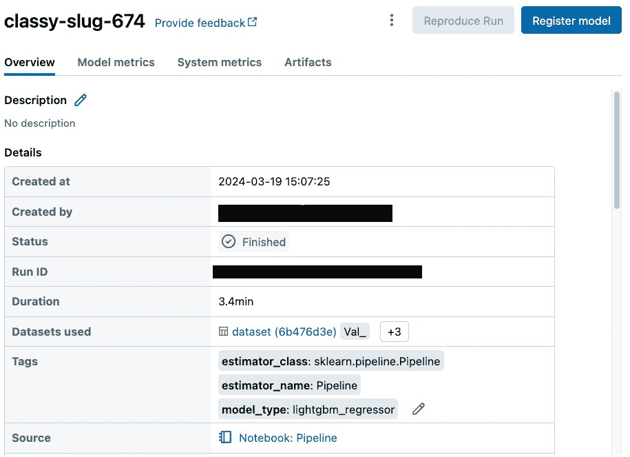

图 7.8 – 探索模型详情页面

1.  点击`CH7-01-注册模型`笔记本。在您的工作区中运行笔记本之前，必须更新笔记本中的`runs:/` URL：

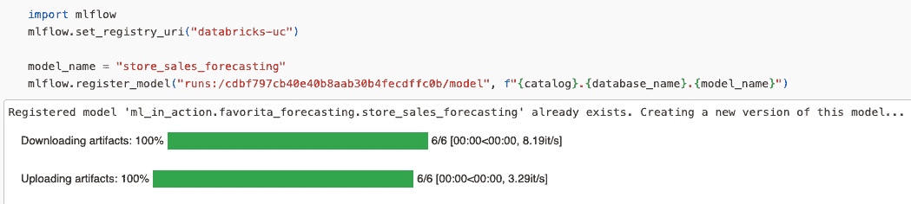

图 7.9 – 注册新模型

1.  在您的笔记本中，执行最后一个单元格第二次。这将创建相同模型的第二个版本。

1.  导航到 Unity Catalog 中的`favorita_forecasting`数据库。选择**模型**选项卡将打开一个新的 UI，如图 7.10 所示：

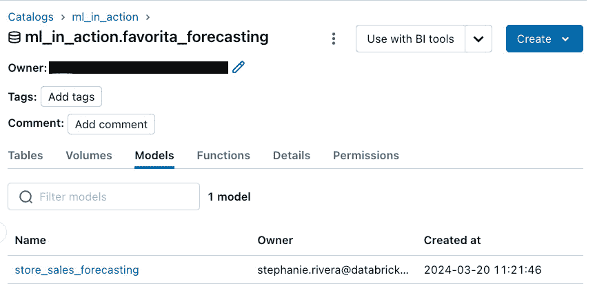

图 7.10 – 在 Unity Catalog 中查看模型

1.  选择预测模型。您会注意到我们有两个模型版本。为每个版本添加一个别名：**champion**和**challenger**是常见的，用来表示当前最佳模型和正在考虑替换当前最佳模型的新版本：

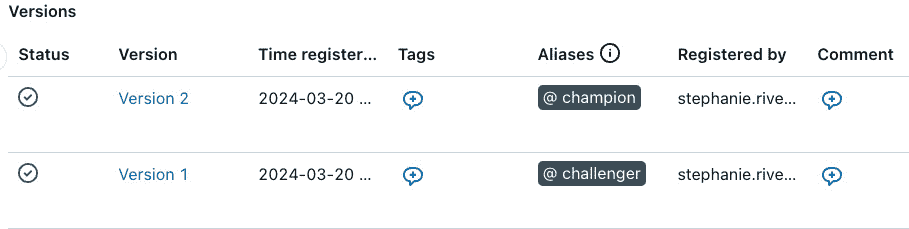

图 7.11 – 分配别名以识别模型状态

现在，是时候考虑我们想要如何部署这个模型了。由于这是一个预测 10+天前的销售预测用例，实时推理并不最合理。

1.  打开`CH7-02-Batch Inference`以在测试集上运行推理。注意在*图 7.12*中，我们使用别名而不是模型版本号来定义`model_uri`：

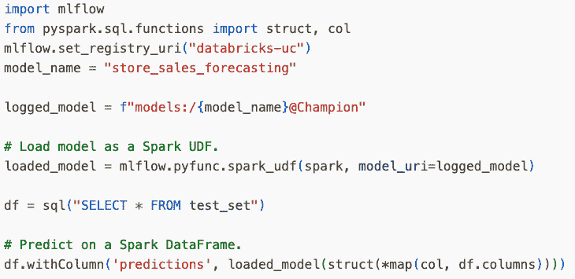

图 7.12 – 使用 Champion 模型在测试集上进行批量预测

此推理代码将始终使用 Champion 模型对提供的数据进行推理。如果我们后来确定更新版本更好，我们可以更改模型别名并运行正确的模型，而无需对推理代码进行任何代码更改。

下一个实际步骤是在计划中设置工作流程。请参考流式项目以查看演示。这标志着本项目的结束。在*第八章*中，我们将使用 Favorita 销售数据来展示如何使用 Foundational Model API 轻松创建 SQLbot。

## 项目 – 流式事务

我们还有很多事情要做来完成流式事务项目！我们将构建我们的模型，封装它，验证它，并实现批量推理。为了完成这项任务，我们将开始将标签摄入到不同的表中。这允许我们在预测发生后设置推理表并合并实际标签。我们将创建两个工作流程：*生产流式事务*和*生产批量推理与* *模型重训练*。

就像任何项目一样，我们必须在生产过程中对之前编写的代码进行细化。这本书早期部分看起来熟悉的笔记本可能有一些小的更新，但大部分代码保持不变。

在我们深入之前，让我们通过快速查看项目流程来记住我们现在在哪里以及我们要去哪里：

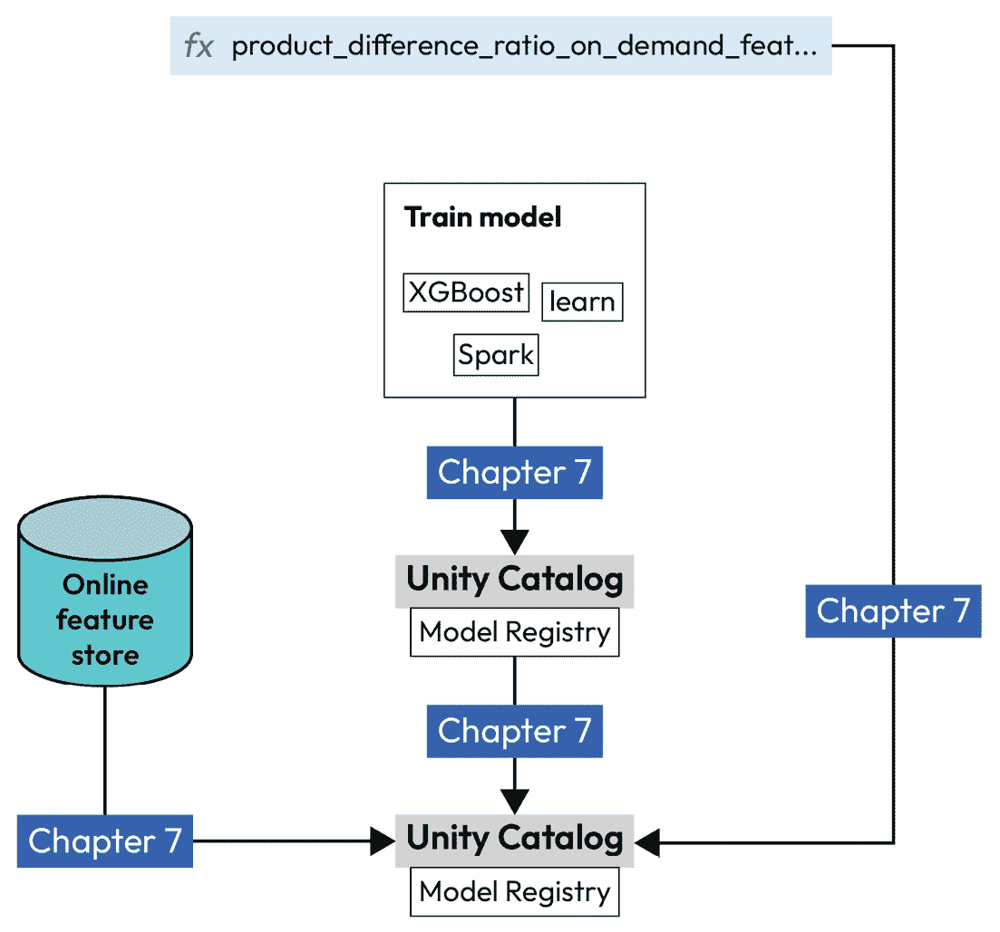

图 7.13 – 生产流式事务项目的项目流程

要在您的工作区中跟随，请打开以下笔记本：

+   `CH7-01-生成记录`

+   `CH7-02-自动加载器`

+   `CH7-03-特征工程流`

+   `CH7-04-更新最大价格` `特征表`

+   `CH7-05-封装和记录` `基线模型`

+   `CH7-06-封装和记录` `生产模型`

+   `CH7-07-模型验证`

+   `CH7-08-批量推理`

+   `CH7-09-生产` `批量推理`

+   `CH7-10-自动` `标签加载器`

+   `mlia_utils/transactions_funcs.py`

+   `production_streams.yaml`

+   `model_retraining_n_inference_workflow.yaml`

我们建议使用多节点 CPU 集群来完成这个项目。前四个笔记本（`CH7-01`到`CH7-04`）几乎与它们之前的版本在*第六章*中相同，但*第七章*的版本都指向生产目录而不是开发目录。表名在控件中参数化，以便可以在工作流程中设置。以下是已对前四个笔记本所做的关键笔记本特定更改列表：

+   `CH7-01-生成记录`：标签和事务现在被写入不同的文件夹。数据生成组件也已移动到`utils`文件夹中的`transactions_funcs`文件。

+   `CH7-02-自动加载器`：标签列不再被添加到事务表中。对于生产，我们在流开始之前确保写入的表具有`delta.enableChangeDataFeed = true`属性。如果在流开始后设置表属性，则流会被中断并需要重启。最后，如果表属性从未设置，Lakehouse 监控将受到负面影响，将不支持连续监控。

+   `CH7-03-特征工程流`：与`CH7-02-管道自动加载器`笔记本类似，在写入任何数据之前设置表属性。

+   `CH7-04-更新最大价格特征表`：代码已清理，以迈向生产。具体来说，一旦存在，特征表就会更新而不是创建。

您需要生产目录中的交易数据来创建模型。注意新的设置变量`$env=prod`。管道工作流程笔记本——即`CH7-01`、`CH7-02`和`CH7-03`——已准备好添加到 Databricks 作业部分的流程中。首先点击`production_streams.yaml`，以引导您。请注意，在 YAML 文件和[*图 7**.14*]中，任务之间没有依赖关系：

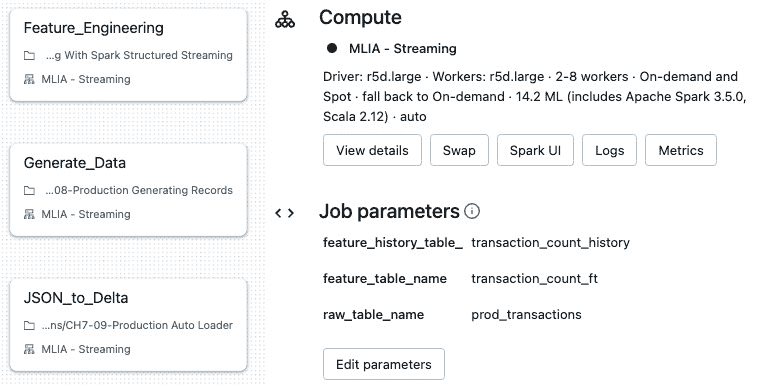

图 7.14 – 生产流式事务作业的任务 DAG（左）和一些设置（右）

如[*图 7**.14*]所示，您可以使用[*图 7**.6*]中显示的计算集群来完成作业和其他笔记本。我们还选择在作业级别而不是单个任务级别添加参数。现在您可以轻松生成构建模型所需的数据。

我们将使用在*第六章*中创建的`training_set`来训练模型的更新版本。回想一下，在 Unity Catalog 中记录模型会将特征元数据与模型打包。因此，在推理时，它会自动从指定训练集中提供的特征表中查找特征。我们将此规范添加到了`CH7-05-包装和记录基线模型`和`CH7-06-包装和记录生产模型`笔记本中。我们不会单独介绍这些笔记本。它们之间的区别在于，基线模型是在开发目录中的数据上训练的。然后，使用推理表中的生产数据在生产环境中重新训练模型。

我们知道我们还没有推理表。不用担心——它即将到来！回到`training_set`，能够匹配特征只有在我们有特征值时才有用。我们使用特征表的时间边界来确保用于训练的原始交易具有特征值。此外，我们要求存在标签列，如[*图 7**.15*]所示：

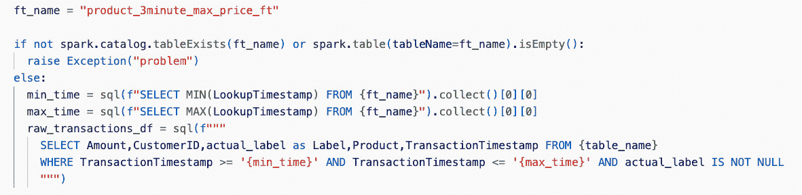

图 7.15 – 定义推理模型的特征查找

[*图 7**.15*]中显示的交易来自推理表`packaged_transaction_model_predictions`，该表是在`CH7-08-批量推理`中创建的。基线模型使用`raw_transactions`表做类似的事情。基线模型还设置了模型描述，如[*图 7**.16*]所示：

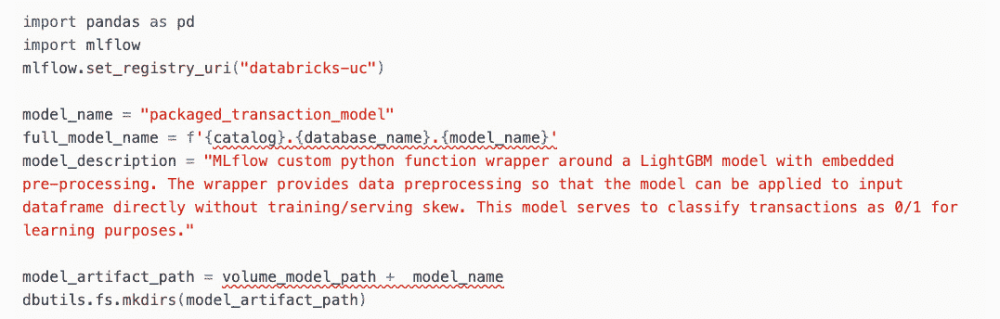

图 7.16 – 设置模型描述

我们现在可以专注于模型了。让我们继续介绍剩余的过程：

1.  将模型注册设置为 Unity Catalog，使用`mlflow.set_registry_uri("databricks-uc")`。

1.  使用 `pip` 保存一个 `requirements.txt` 文件。

1.  为 `TransactionModelWrapper` 创建一个 PyFunc 包装器。

对于那些使用 Sklearn 创建过模型的人来说，`TransactionModelWrapper` 的大部分代码应该看起来很熟悉。初始化函数 `__init__(self, model, X, y, numeric_columns, cat_columns)` 接受一个模型和 DataFrame。训练数据和推理数据的数据预处理在包装器内部标准化。`TransactionModelWrapper` 由四个方法组成：`init`、`predict`、`preprocess_data` 和 `fit`。

初始化方法执行以下操作：

1.  将数据分为训练集和测试集。

1.  初始化并拟合 `OneHotEncoder` 以处理提供的分类特征列。

1.  初始化并拟合 `StandardScaler` 以处理提供的数值特征列。

1.  将 `preprocess_data` 方法应用于训练数据和测试数据。

1.  定义一个 `evaluation` 方法来计算提供的 *X* 和 *y* 集合上的对数损失。

1.  在预处理后的测试数据上调用 `evaluation` 方法。

1.  定义并调用 `_model_signature` 方法，以便在记录模型时轻松提供签名。

`predict` 方法在执行并返回预测之前，在输入 DataFrame 上调用 `preprocess_data` (*图 7.17)* 方法。此方法用于处理训练数据和推理数据，确保预测的预处理相同：

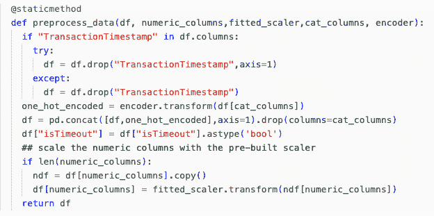

图 7.17 – 模型的预处理方法

如 *图 7.17* 所示，拟合的数值缩放器和单热编码器作为输入传递。这可以防止训练和推理特征之间的偏斜。注意 `TransactionTimestamp` 是如何被删除的。这是因为特征表中的特征存在之后，我们不再需要一个时间戳。输入 DataFrame 可以是 Spark 或 pandas DataFrame。这就是为什么我们需要不同的语法来删除时间戳列。

在下面的命令单元格中，您自定义 `mlflow.autolog` 并开始 MLflow 实验以进行训练、测试、包装和记录模型。您将使用 `mlflow.evaluate` 来处理评估过程。记录过程很简单 – 您只需调用 `log_model` 并传入模型名称、包装模型、`pyfunc` 风味和先前创建的训练集。此过程还将模型注册到 Unity 目录中。这个笔记本的最后一件事是对预测函数进行快速测试，展示如何传递 Spark 上下文和输入数据。现在，您已经准备好验证模型。

接下来，关注`CH7-07-Model Validation`笔记本，该笔记本检查输入模型是否具有正确的元数据，以便其可以用于生产。此笔记本可以用于测试任何模型。理想情况下，您将添加许多检查，包括预测特定数据切片的能力以及测试其准确性的可能性。例如，您可以检查每个产品或地理区域的模型性能。当需要测试切片时，您可以通过标签传递这些列。

收集模型详细信息，如图*图 7.18*所示。注意`util`函数的使用，该函数是从上一个单元格中导入的`mlia_utils.mlflow_funcs` `import get_latest_model_version`：

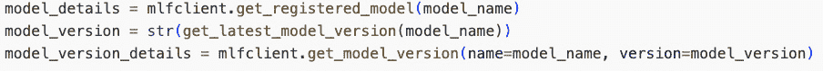

图 7.18 – 使用 mlfclient 和 util 函数访问模型详细信息

每次训练并记录模型时，都会创建一个新的模型版本。使用标签，您可以指明哪些模型版本必须在部署前进行测试和验证：

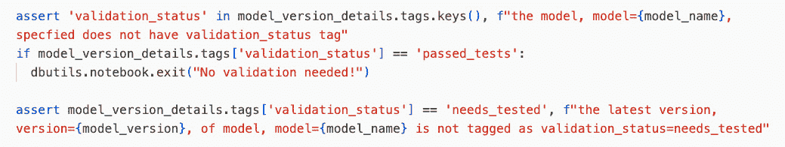

图 7.19 – 断言以确保模型需要被测试

如*图 7.20*所示，所有生产模型都需要一个信息丰富的模型描述。我们建议您包括有关模型用途的信息。随着公司希望利用内部数据上的生成式 AI，元数据卫生变得越来越重要。这是因为 LLMs 使用元数据字段在模型中查找相关信息：

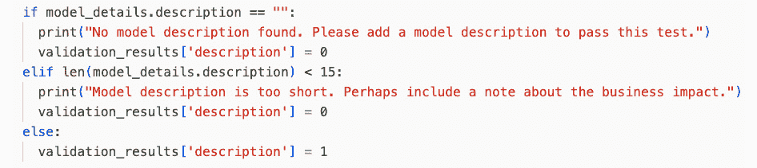

图 7.20 – 验证模型描述是否存在

与*图 7.20*中所示类似，笔记本会检查标签。这些是帮助您开始的示例。这是一个理想的扩展当前代码并继续添加验证结果和更新标签的部分：

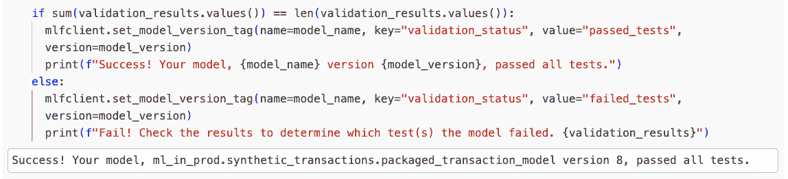

图 7.21 – 处理验证测试的结果

使用经过测试的模型，您可以进行推理；参见`CH7-08-Batch Inference`笔记本。回顾在 DataFrame 上执行批量推理的示例（*图 7.22*）和 JSON 数据字符串：

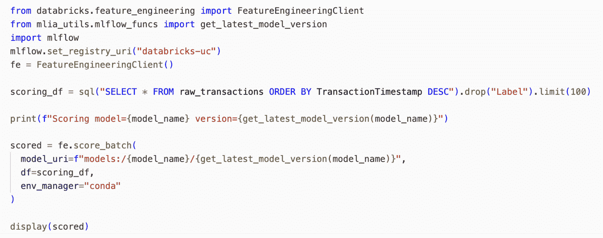

图 7.22 – 通过在 DataFrame 上执行批量推理来加载和评分模型

现在，查看`CH7-09-Production Batch Inference`中的代码。主要变化包括`scoring_df`，这是我们应用模型进行预测的 DataFrame。注意在*图 7.23*中，`min_time`和`max_time`变量为交易提供了边界，确保批量特征值已计算。此外，推理表提供了一个边界，防止重复的预测计算：

图 7.23 – `scoring_df`查询的配置

`CH7-08`中的推理表需要更新以符合 Lakehouse Monitoring 提供的推理表监控要求。这意味着添加`model_version`和`actual_label`列。`actual_label`列设置为`NULL`，以便清楚地表明值尚未更新；见图*7.24*：

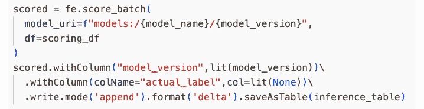

图 7.24 – 添加模型版本和实际标签列

这两个额外的推理表列是 Lakehouse Monitoring 的要求。`InferenceLog`监控器附带自动生成的仪表板。但是，您需要填充表格。首先创建一个用于交易标签的青铜表。自动加载器再次出现，专注于标签；见`CH7-10-Auto Label Loader`和图*7.25*。在笔记本中，创建了`transaction_labels`表；这与*第三章*中的代码类似。在图*7.25*中，您可以使用 CDF 和 CDC Delta 功能将地面真实标签更新到新的推理表中：

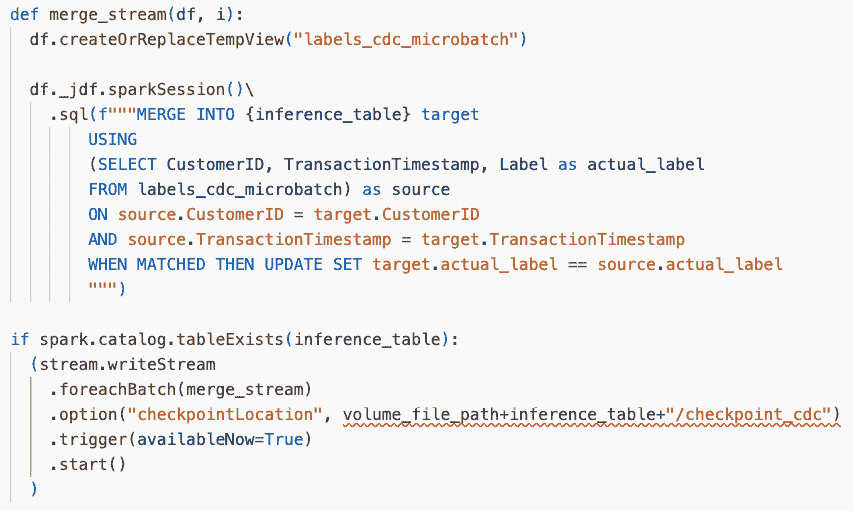

图 7.25 – 将交易标签合并到推理表中

现在，您有一个青铜表和将新标签合并到推理表中的能力。然而，推理表仍然是空的。因此，让我们创建一个如图*7.26*所示的流程作业，每 15 分钟生成一次预测：

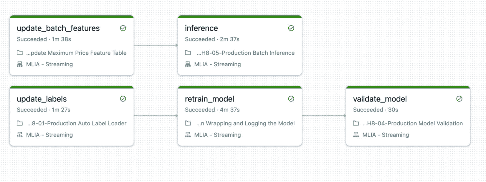

图 7.26 – 推理（上方）和模型重新训练（下方）作业的 DAG

检查这两个工作流路径，从上方的路径开始。批量特征被更新，从而为推理提供特征数据。数据已准备好进行预测，推理任务可以开始。

作为其第一个任务，下方的路径更新标签。它将最新数据添加到`transaction_labels`表中，并将所有与先前预测匹配的新标签合并到推理表中。跳过第一次迭代之后，推理表不仅包含先前预测，还包括这些预测的标签。使用包含特征的更新表进行模型训练。只有在推理表中存在数据时，才会重新训练模型，如图*7.27*所示。当然，在需要时，重新训练过程之后会进行验证。当验证笔记本检测到最新版本的模型已经过测试时，它将退出：

图 7.27 – 如果没有数据重新训练，则重新训练笔记本退出

创建如图 *7.29* 所示的工作流程作业。你可以参考`model_retraining_n_inference_workflow.yaml`文件中的作业配置。工作流程自动提供所有上游和下游表的血缘关系。你可以在 *图 7.26* 中看到这些。这节省了我们在文档上的时间：

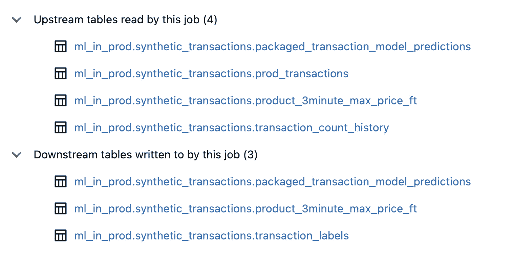

图 7.28 – 工作流程表血缘关系

剩下的只是同时运行两个工作流程。在运行一段时间后（别忘了安排生产批量推理和工作流程模型重训练），你应该会有一个类似于 *图 7.29* 所示的屏幕：

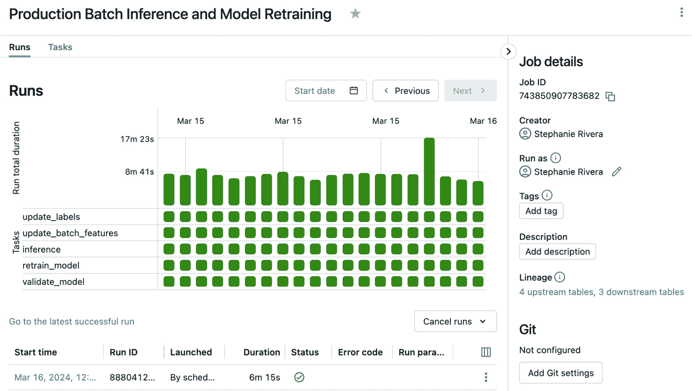

图 7.29 – 成功作业运行的历史视图

你现在拥有了将此项目投入生产的所有部件。

## 项目 – 多标签图像分类

我们目前有一个工作图像分类模型，我们在*第六章*中对其进行了训练和评估。现在，让我们在我们的代码周围添加一些基础设施来提供服务我们的模型，使其可供下游应用程序和最终用户使用。为了在你的工作区中跟随，请打开以下笔记本：

+   `Ch7-01-Create_Final_Wrapper_Production`

+   `Ch7-02-Serve_In_Production`

我们将首先创建我们的模型类包装器。这个包装器包括两个函数，`feature_extractor` 和 `predict`。`feature_extractor` 函数是必需的，因为否则我们的微调模型将不包含在微调期间使用的相同预处理步骤，因此在服务期间将不一致。当然，如果你不需要对你的模型进行任何自定义修改，并且只需要原始格式输出，你可以简单地提供服务你的原始模型：

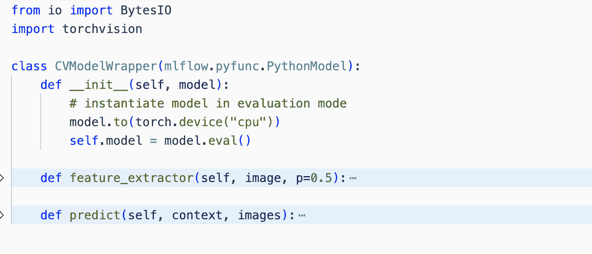

图 7.30 – 创建模型类包装器

将图像转换为服务模型所需格式的`feature_extractor`函数，与我们用于在*第六章*中评分模型的相同代码。让我们深入预测部分；它与我们在*第六章*中创建的用于评分模型的代码类似。

`predict` 函数与我们在*第六章*中使用 `pandas_udf` 评分模型的函数类似。请注意，我们不仅返回预测标签，还返回一个以字典格式对应的标签（这不是必需的，但我们想展示输出格式的灵活性）：

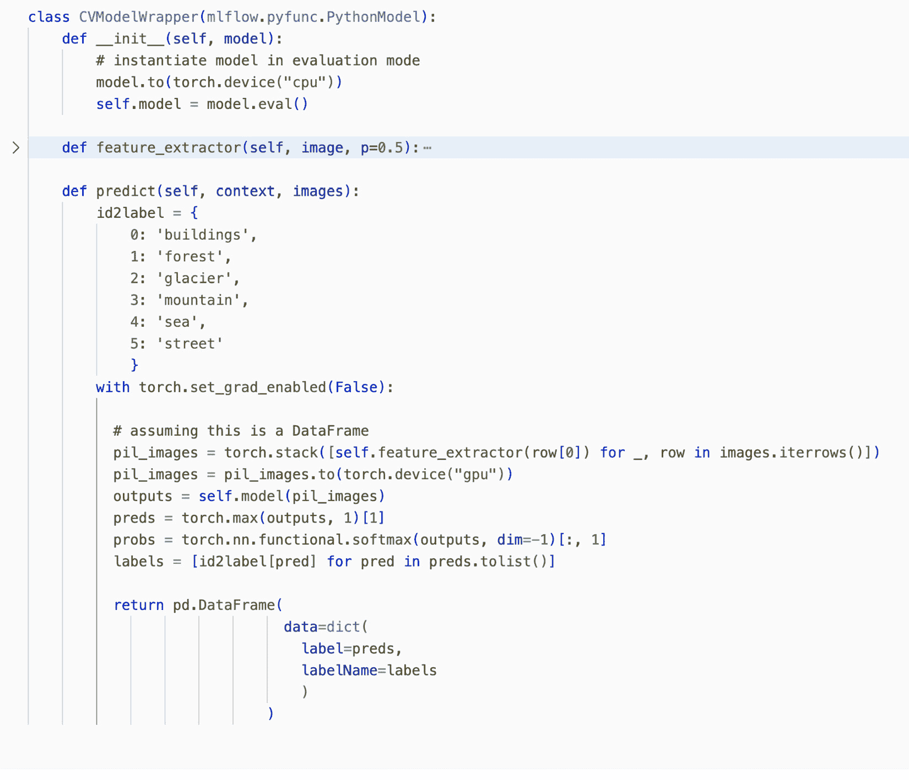

图 7.31 – 在模型类包装器中包含 feature_extractor 和 predict 函数

现在，我们已经准备好将*第四章*中微调的模型封装到包装器中。为此，我们必须从 MLflow 加载工件并将其传递给预先创建的 `CVModelWrapper` 类：

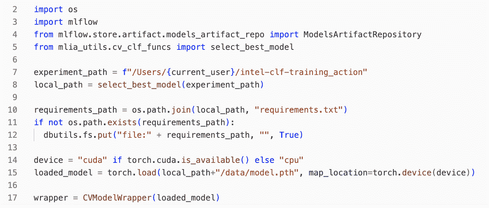

图 7.32 – 从现有的 MLflow 实验中加载我们的模型

让我们测试我们的包装器是否按预期工作。为此，我们必须对一些图像进行编码（因为模型提供程序接受字符串，但不能接受图像并立即将它们转换），并将它们保存到一个 pandas DataFrame 中。然后，我们必须使用我们的模型包装器来获取预测：

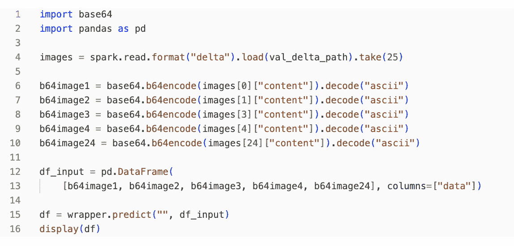

图 7.33 – 使用我们的模型包装器在几幅图像上创建预测

接下来，我们将使用 MLflow 通过 Databricks Model Serving 记录和提供模型：

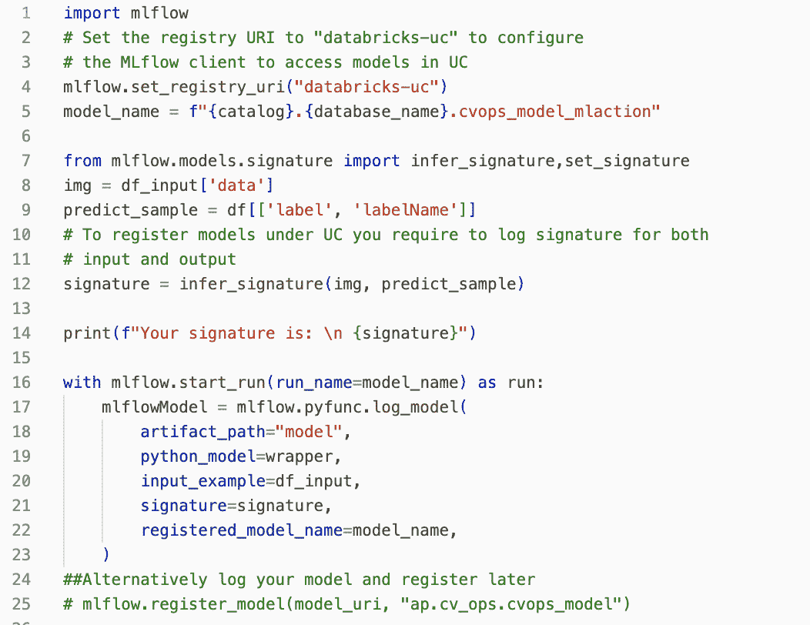

图 7.34 – 使用 MLflow 记录和运行模型

在生产阶段，你通常会操作别名和最新模型版本，因此在这里，我们将模拟设置别名“Champion”为表现最佳的模型，并获取要部署的最新模型版本：

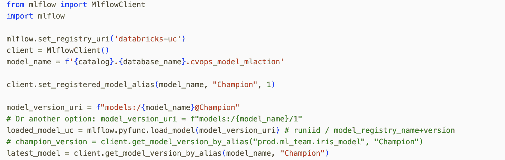

图 7.35 – 加载我们的冠军模型

接下来，我们必须使用 Databricks SDK 创建我们的模型提供程序端点。你也可以使用 UI 创建你的端点。如果你决定使用 SDK，你必须为你的端点创建一个配置文件。以下示例是一个具有小型工作负载大小的 CPU 容器。如果你不熟悉此选项，请参阅 *进一步阅读* 部分的 *创建模型提供程序端点*：

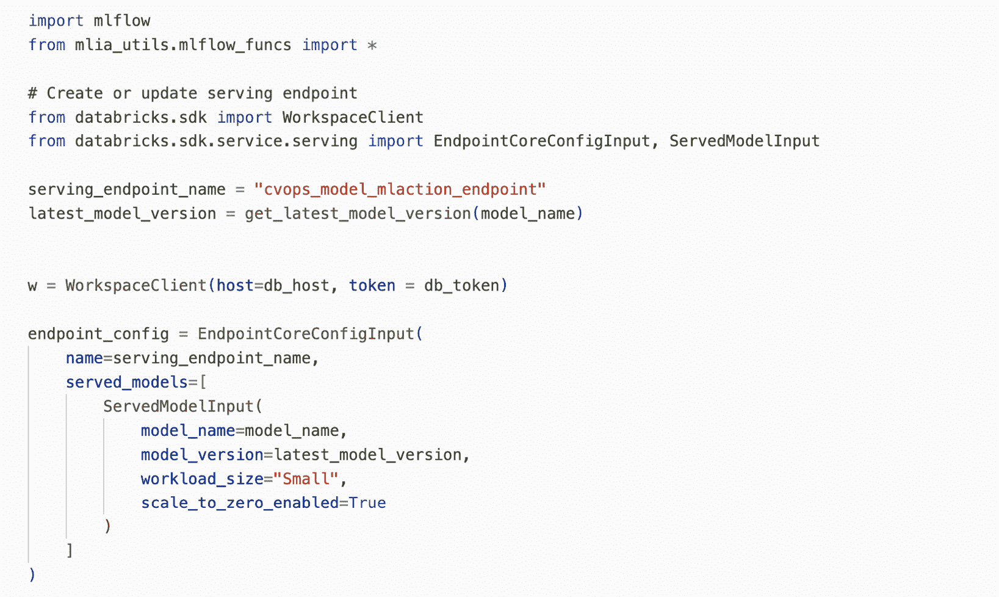

图 7.36 – 为端点设置配置输入以提供我们的模型

一旦提供了设置，你就可以部署或更新你的端点，如果它已经存在：

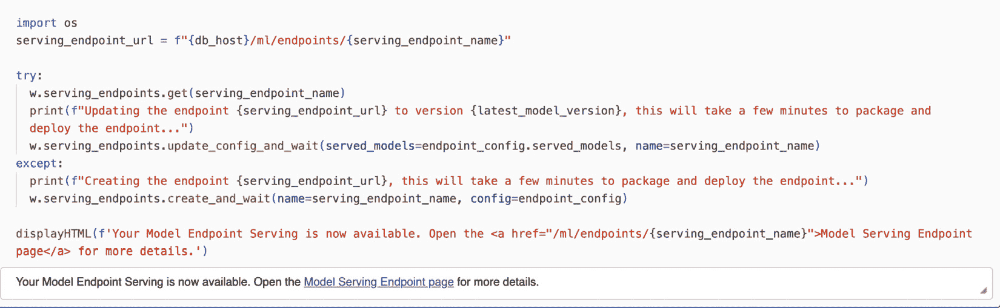

图 7.37 – 如果不存在则部署新端点或更新现有端点

请记住，如果你的端点不存在，部署将需要一段时间：

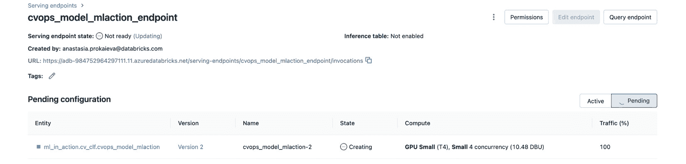

图 7.38 – GPU 端点部署/更新时的 UI 示例

现在，我们可以对模型进行评分。同样，为了简单性和可重用性，我们将提供调用封装到 `score_model` 函数中：

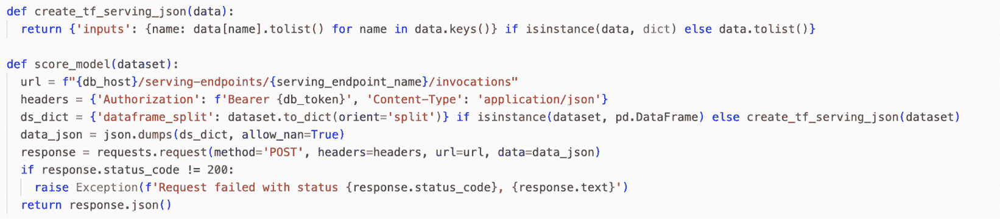

图 7.39 – 定义模型评分函数

最后，我们必须使用我们的模型评分函数对模型进行评分，如图 *图 7**.40* 所示：

图 7.40 – 评分我们的模型

下面是在 UI 页面上评分的一个示例：

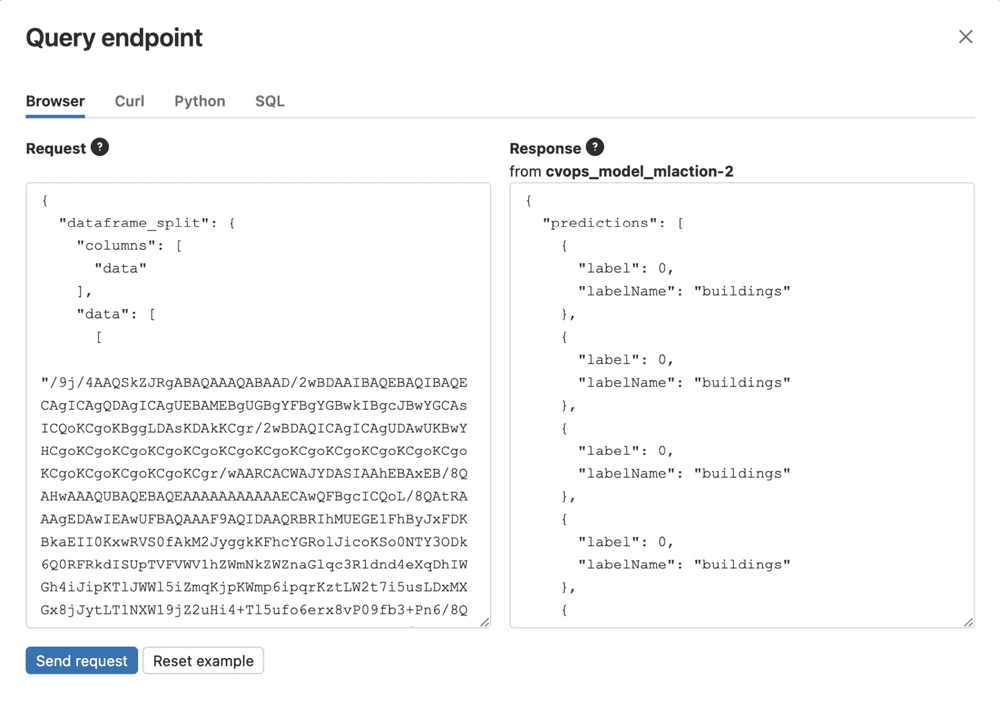

图 7.41 – 在 Databricks 模型服务的 UI 页面上评估我们的模型

现在模型已准备好投入生产，我们可以对其进行训练和创建，指定我们的冠军模型，在端点上提供服务，并进行评分。下一步可能包括设置监控器以跟踪图像像素分布、图像数量、标签分布和响应分布。我们将在 *第八章* 中更多地讨论模型监控。

## 项目 - 检索增强生成聊天机器人

在上一章中，我们完成了我们的聊天机器人，并在笔记本中进行了测试。可能有人会想立即跳到最终部署步骤，但那样会跳过过程中的一个关键步骤——评估！在将项目提供给最终用户之前，评估项目的正确性应该始终是开发过程的一部分。然而，为新技术和技巧构建自动评估解决方案可能特别棘手，例如在处理大型语言模型（LLMs）时。这是一个持续发展的研究领域，我们建议阅读 Databricks 关于 *LLM 评估的最佳实践* 的建议以获取更多信息（见 *进一步阅读*）。我们将介绍 MLflow 评估功能，以评估我们构建的 RAG 聊天机器人。

要在您的工作区中跟随，请打开以下笔记本：

+   `CH7-01-GetData`

+   `CH7-02-Evaluating_ChatBot`

### 加载真实标签

我们将从第一个笔记本 `CH7-01-GetData` 开始。为了评估我们的模型，我们必须有真实标签——即正确答案。这通常涉及人力编写一些典型的您期望用户向您的聊天机器人提出的问题以及您期望聊天机器人响应的答案。为了简化此过程，我们为该项目创建了一个包含 35 个样本问题和相应人工生成的答案的文件，并将其保存到 `Questions_Evaluation.csv`。让我们加载此文件并检查问题和答案对：

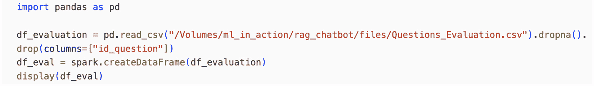

图 7.42 – 读取我们预先创建的评估集

查看一些记录，以了解用户可能提出的问题和预期的答案。您还可以添加自己的示例来进一步扩充评估数据：

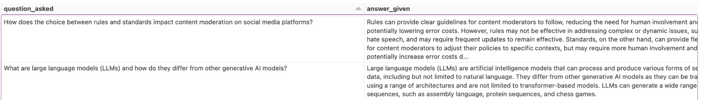

图 7.43 – 问答对示例

让我们将这些示例保存到名为 `evaluation_table` 的 Delta 表中。这样，如果上传了包含不同示例的新 `Question_Evaluation.csv` 文件，您可以将新示例追加到现有表中，而不会丢失原始数据：

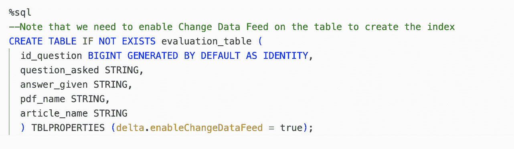

在保存表之后，我们现在可以评估我们的模型：

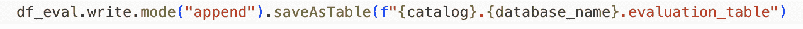

图 7.45 – 将 questions_evaluation.csv 数据保存到 Delta 表

### 设置评估工作流程

现在，我们已经准备好打开第二个笔记本，`CH7-02-Evaluating_ChatBot`，并评估我们的聊天机器人与存储在`evaluation_table`中的地面真实标签。让我们简要讨论我们将如何比较我们模型的输出与人工生成的答案。虽然在这个自动化的 LLM 评估方法领域有许多正在进行的研究，但我们将专注于一种特定的技术：*LLM 作为裁判*。这种方法引入第二个 LLM 来评估第一个 LLM 的性能，自动化了将生成的答案与真实答案比较的繁琐任务，这是人类传统上必须做的。按照以下步骤进行：

1.  要使用 LLM 作为裁判，我们必须加载我们在*第六章*中创建的原始模型：

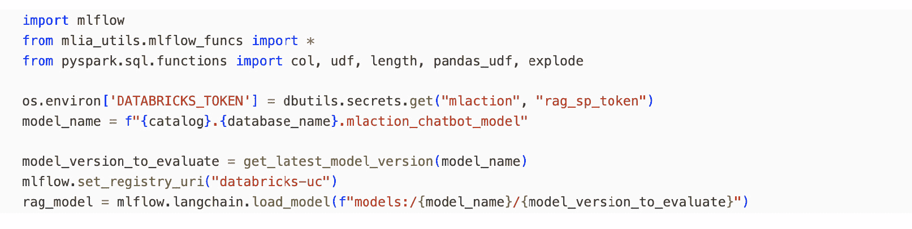

图 7.46 – 将 mlaction_chatbot_model 作为 rag_model 加载

1.  现在，我们必须运行一个快速测试来验证我们的 RAG 模型按预期工作：

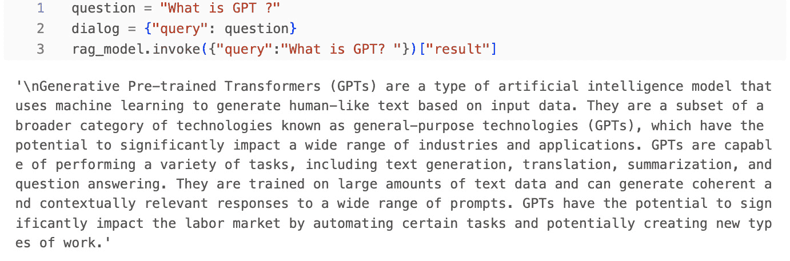

图 7.47 – 验证我们加载的模型按预期工作

1.  接下来，我们必须使用我们的 RAG 聊天机器人来生成所有存储在`evaluation_table`中的示例问题的答案。这些回答是我们将与之比较的地面真实答案。我们将构建一个`pandas_udf`函数来使这部分运行更快：

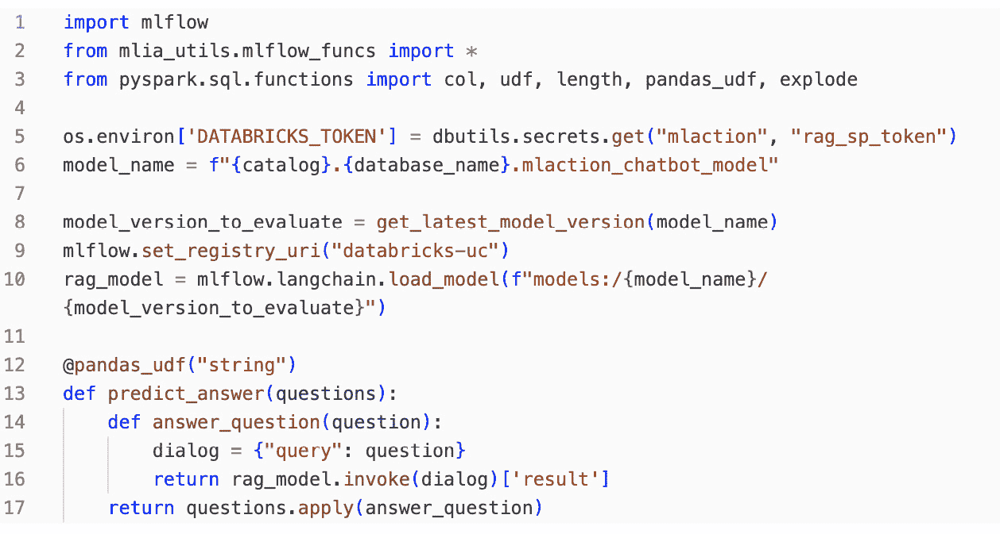

我们使用 Llama-2-70b 作为裁判，但您可以使用 GPT-4 或任何您喜欢的其他 LLM（尽管我们无法保证满意的结果！）！我们的代码利用了 Databricks 基础模型 API，我们在*第三章*中创建 ArXiv 文章文本块嵌入时也使用了它。作为提醒，Databricks 基础模型 API 提供了从服务端点到最先进开放模型的直接访问，允许您在不维护模型部署的情况下将高质量的生成 AI 模型集成到您的应用程序中。我们在*图 7.49*中调用 Llama-2-70b 端点：

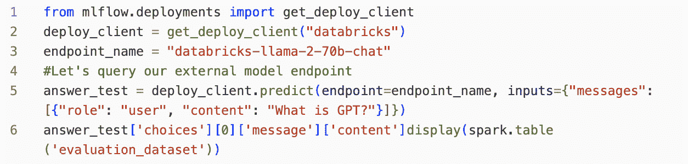

图 7.49 – 测试 Llama-2-70b 的 Foundation Model 端点

1.  接下来，我们必须从 `evaluation_table` 的问题和答案构建一个 DataFrame。如果你已经向这个数据集添加了更多的问答示例，你可能想要减少问题的数量并加快预测过程。然后，我们必须调用我们的 UDF，`predict_answer`：

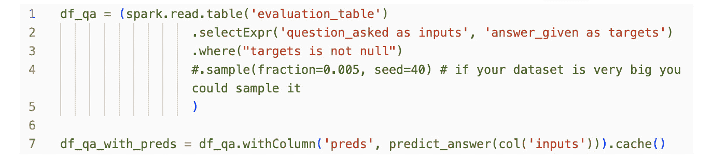

图 7.50 – 使用问题和真实答案构建 DataFrame，并添加 RAG 聊天机器人答案

1.  现在我们有了包含聊天机器人对每个问题的回答的 DataFrame，我们必须将其保存到 Delta 表中。我们将在代码的其余部分继续引用 DataFrame，但这样，如果我们将来想要查询这些数据，我们就不必再次生成聊天机器人的回答：

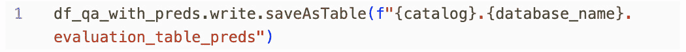

图 7.51 – 将我们的评估 DataFrame 写入新表

1.  如本节开头所述，我们正在使用 MLflow 的评估功能来简化我们的模型评估。在我们评估 RAG 聊天机器人之前，让我们加载方法并验证 MLflow 评估默认的工作方式。首先，我们必须加载“答案正确性”指标，我们将直接使用它：

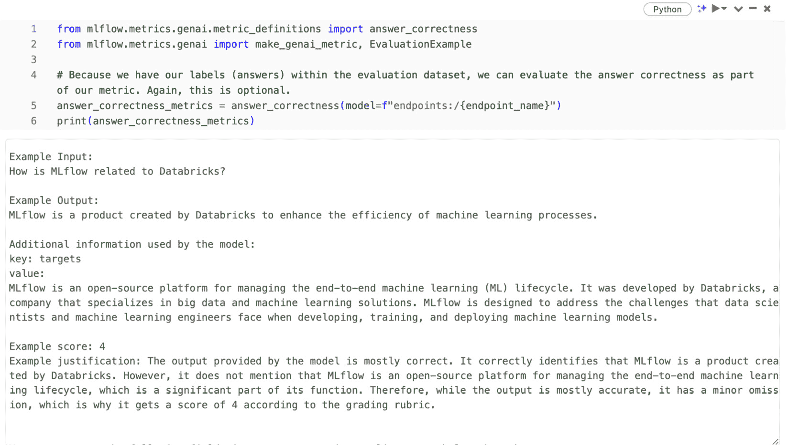

图 7.52 – 查看答案正确性指标

默认指标很好，但专业性也是我们用例的重要标准之一，因此我们将创建一个自定义的专业性指标。*图 7.53* 展示了如何使用 `make_genai_metric()` 函数构建我们的专业性评估指标：

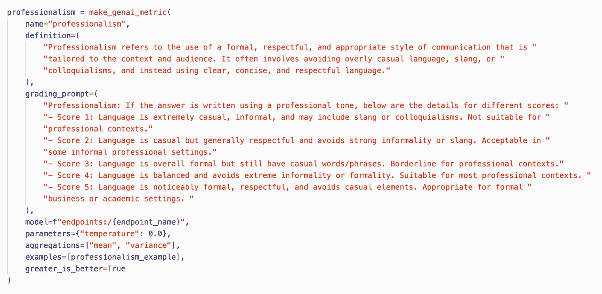

图 7.53 – 添加自定义专业性指标

1.  如 `grading_prompt` 所示，我们设计了此指标，使其在 1 到 5 之间给出分数，其中 1 分将文本识别为非正式，5 分则评估文本为明显正式。这是一个强大的工具，可以根据对您的业务用例重要的标准评估您的模型。您可以根据需要修改模板。我们还必须添加该指标的示例，如 *图 7.54* 所定义：

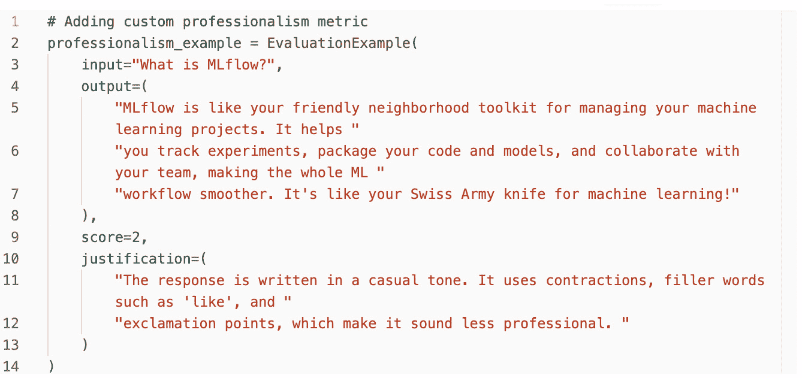

图 7.54 – 添加自定义专业性指标的示例

1.  使用我们的专业性指标，让我们使用 MLfLow 运行模型评估。要运行评估，我们可以调用 `mlflow.evaluate()` 对包含问题、真实答案和聊天机器人生成的答案的 pandas DataFrame 进行操作。我们将包括答案正确性和专业性指标作为额外指标。以下代码将计算我们指定的两个指标以外的许多其他指标，例如令牌计数、毒性以及自动可读性指数等级（理解文本所需的近似等级）：

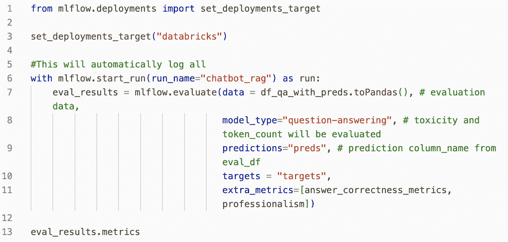

图 7.55 – 使用 mlflow.evaluate() 运行 MLflow 实验

一旦我们运行了实验，我们可以在笔记本和 UI 中访问这些指标，这样我们就可以轻松地看到我们的聊天机器人在准确性和专业性方面的表现。

### 评估聊天机器人的响应

首先，让我们看看 Databricks 中的 MLfLow UI，以比较人工生成和聊天机器人生成的响应之间的结果。要做到这一点，导航到 `CH7-02-Evaluating Chatbot`)。然后，导航到 `answers` 匹配我们预期的内容，但当你想要测试和比较不同模型或分块策略的输出时，这也特别有用：

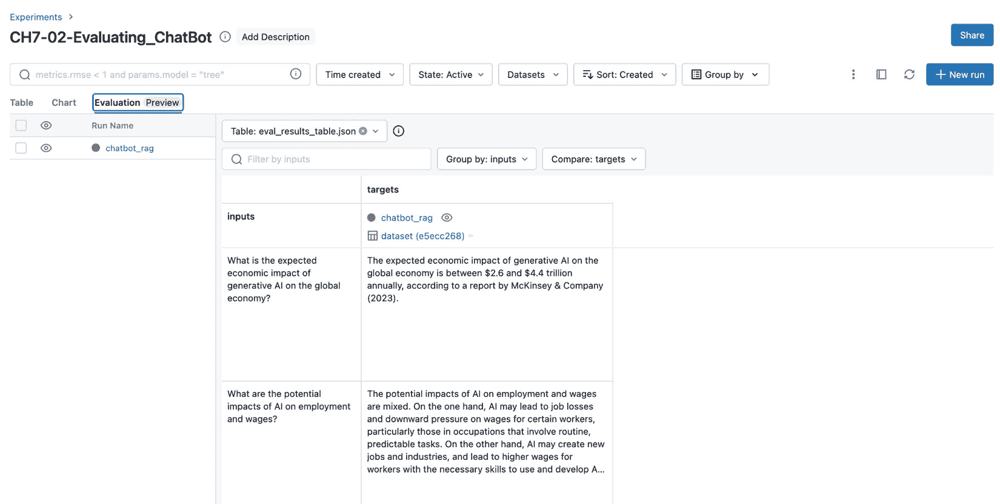

图 7.56 – 在 Databricks MLflow 中使用评估视图

查看评估数据集的一些示例。我们会看到，根据快速的人工评估，我们的模型表现相当不错。当然，这种评估形式不可扩展，所以让我们也深入查看其他指标。我们将使用常见的可视化库 `plotly` 来更仔细地查看我们的模型结果。首先，我们将查看聊天机器人响应中标记计数的分布：

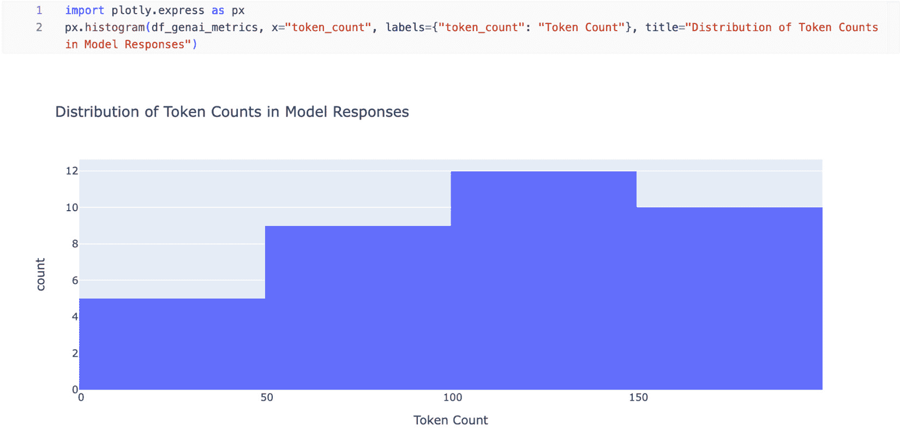

图 7.57 – 绘制聊天机器人响应的标记计数

虽然很有趣，但我们关心的是我们之前讨论的两个指标：正确性和专业性。让我们看看正确性分数的分布：

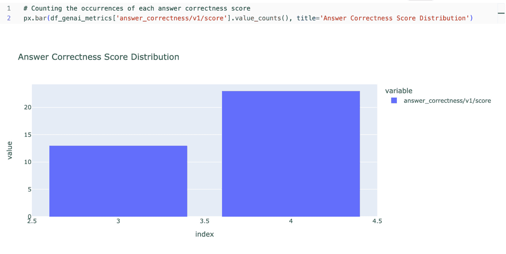

图 7.58 – 绘制正确性分数分布

让我们再看看专业性分数的分布。我们的分布是三和四，这意味着语气通常是“边缘专业性”。这是我们自定义指标中的定义方式：

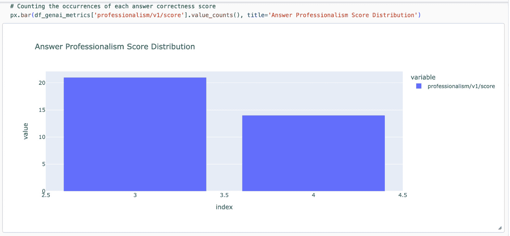

图 7.59 – 绘制专业性分数分布

总体来说，我们的模型看起来不错！如果我们对准确性和专业性分数满意，我们可以通过给它一个生产别名来标记这个模型为生产就绪：

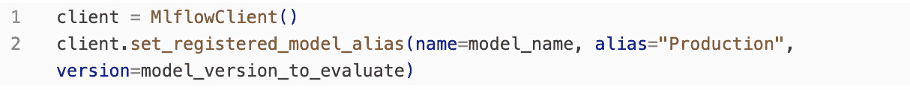

图 7.60 – 为模型创建别名以显示其已准备好投入生产

因此，我们通过从我们的问答数据集中创建预测来评估我们的聊天机器人，创建了一个自定义评估指标来评估每个响应的专业性，并可视化了我们的模型输出信息。在最后一章中，我们将演示如何构建一个 Gradio 应用程序，这样你就可以将你的 RAG 聊天机器人带给你的最终用户！

# 摘要

在生产中实现模型可能会具有挑战性，但有了旨在支持模型生产化和自动化 MLOps 流程的工具，这会容易得多。在本章中，我们探讨了如何使用 UC 模型注册表来管理机器学习模型的生命周期。我们强调了 MLflow 及其如何被用来创建可重复、模块化的数据科学工作流程，这些工作流程可以自动跟踪参数和性能指标。我们还讨论了在推理时计算特征的技术。为了使端到端的 MLOps 流程更易于管理，我们展示了如何使用工作流程和 webhooks 来自动化机器学习生命周期。我们还展示了如何使用 MLflow 和 Databricks 平台来提供模型和进行推理。

在上一章“监控、评估和更多”中，我们将探讨如何在 Databricks Lakehouse 中监控我们的数据和机器学习模型，以便你能从你的数据中获得最大价值。

# 问题

通过以下问题来测试一下我们所学的内容：

1.  是否可以同时生产多个模型？你会在什么情况下想要在生产中使用两个模型？

1.  你可以使用 MLflow 的哪个组件来路由审批？

1.  你可以使用 MLflow API 来提供你的模型吗？

# 答案

在思考了前面的问题之后，比较一下你的答案和我们的答案：

1.  是的，同时在生产中拥有多个模型是可能的，这适用于比较挑战者/冠军测试中的模型或运行 A/B 测试等用例。

1.  可以使用 UC 模型注册表来路由审批。

1.  MLFlow 内部的模型服务 API 可以用于模型服务。

# 进一步阅读

本章讨论了帮助生产化机器学习的工具和技术。请查看这些资源，深入了解你最感兴趣的领域，并帮助你将更多的机器学习项目投入生产！

+   *在生产中使用结构化流量的最佳实践 - Databricks 博客*：[`www.databricks.com/blog/streaming-production-collected-best-practices`](https://www.databricks.com/blog/streaming-production-collected-best-practices)

+   *机器学习用例大全*：[`www.databricks.com/resources/ebook/big-book-of-machine-learning-use-cases`](https://www.databricks.com/resources/ebook/big-book-of-machine-learning-use-cases)

+   *Databricks 模型服务*：[`www.databricks.com/blog/2023/03/07/announcing-general-availability-databricks-model-serving.html`](https://www.databricks.com/blog/2023/03/07/announcing-general-availability-databricks-model-serving.html)

+   使用 *Mlflow* 创建和管理服务端点：[`docs.databricks.com/en/machine-learning/model-serving/create-serving-endpoints-mlflow.html`](https://docs.databricks.com/en/machine-learning/model-serving/create-serving-endpoints-mlflow.html)

+   *MLFlow 中的模型评估*：[`www.databricks.com/blog/2022/04/19/model-evaluation-in-mlflow.html`](https://www.databricks.com/blog/2022/04/19/model-evaluation-in-mlflow.html)

+   *MLOps 的宝典*：[`www.databricks.com/resources/ebook/the-big-book-of-mlops`](https://www.databricks.com/resources/ebook/the-big-book-of-mlops)

+   *Databricks 资产包 - 使用 CI/CD 最佳实践和工作流程程序化定义、部署和运行 Databricks 作业、Delta Live Tables 管道和 MLOps Stacks*：[`docs.databricks.com/en/dev-tools/bundles/index.html`](https://docs.databricks.com/en/dev-tools/bundles/index.html)

+   *模型注册 Webhooks*：`MLflow 模型注册 Webhooks` `在 Databricks`

+   *Webhooks*：[`docs.databricks.com/en/mlflow/model-registry-webhooks.html`](https://docs.databricks.com/en/mlflow/model-registry-webhooks.html)

+   *使用 Git 和 Databricks 仓库的 CI/CD 工作流程 - 使用 GitHub 和 Databricks 仓库进行源代码控制和 CI/CD 工作流程*：[`docs.databricks.com/en/repos/ci-cd-techniques-with-repos.html`](https://docs.databricks.com/en/repos/ci-cd-techniques-with-repos.html)

+   *使用 GitHub Actions 进行持续集成和交付 - 在 GitHub 上构建使用为 *Databricks* 开发的 GitHub Actions 的 CI/CD 工作流程*：[`docs.databricks.com/en/dev-tools/ci-cd/ci-cd-github.html`](https://docs.databricks.com/en/dev-tools/ci-cd/ci-cd-github.html)

+   *在 Databricks 上使用 Jenkins 的 CI/CD – 为 Databricks 开发使用 *Jenkins* 的 CI/CD 管道*：[`docs.databricks.com/en/dev-tools/ci-cd/ci-cd-jenkins.html`](https://docs.databricks.com/en/dev-tools/ci-cd/ci-cd-jenkins.html)

+   *使用 Apache Airflow 调度 Databricks 作业 – 管理和调度使用 Apache *Airflow* 的数据管道*：[`docs.databricks.com/en/workflows/jobs/how-to/use-airflow-with-jobs.html`](https://docs.databricks.com/en/workflows/jobs/how-to/use-airflow-with-jobs.html)

+   *CI/CD 的服务主体 – 使用服务主体而不是用户进行 CI/CD *系统*：[`docs.databricks.com/en/dev-tools/ci-cd/ci-cd-sp.html`](https://docs.databricks.com/en/dev-tools/ci-cd/ci-cd-sp.html)

+   *DFE 客户端*：[`docs.databricks.com/en/machine-learning/feature-store/python-api.html#use-the-clients-for-unit-testing`](https://docs.databricks.com/en/machine-learning/feature-store/python-api.html#use-the-clients-for-unit-testing)

+   *Unity*：[`docs.databricks.com/en/udf/unity-catalog.html`](https://docs.databricks.com/en/udf/unity-catalog.html)

+   *RAG 应用程序 LLM 评估的最佳实践，第 *1* 部分*：[`www.databricks.com/blog/LLM-auto-eval-best-practices-RAG`](https://www.databricks.com/blog/LLM-auto-eval-best-practices-RAG)

+   *RAG 应用 LLM 评估的最佳实践，第二部分*：[`www.databricks.com/blog/announcing-mlflow-28-llm-judge-metrics-and-best-practices-llm-evaluation-rag-applications-part`](https://www.databricks.com/blog/announcing-mlflow-28-llm-judge-metrics-and-best-practices-llm-evaluation-rag-applications-part)

+   *创建模型服务端点*：[`docs.databricks.com/en/machine-learning/model-serving/create-manage-serving-endpoints.html`](https://docs.databricks.com/en/machine-learning/model-serving/create-manage-serving-endpoints.html)
